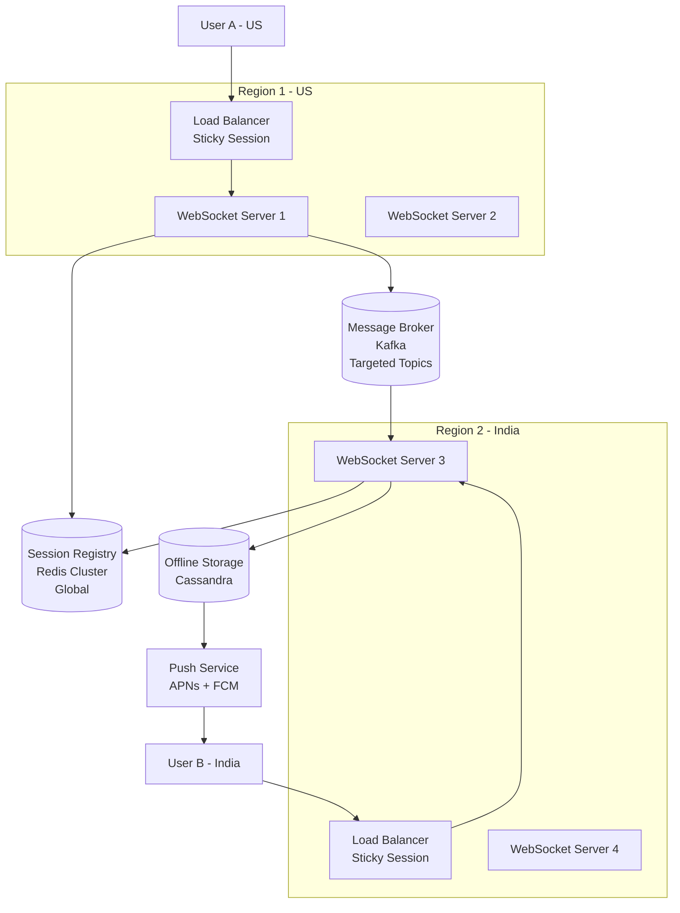

# Designing WhatsApp

Building a global, WhatsApp-scale messaging app is a seriously complex engineering challenge.
The hardest part: **stateful connections (WebSockets) in a stateless backend world**.

---

## Theory

### What Is It?

WhatsApp is a global, end-to-end encrypted (E2EE) messaging platform that delivers billions of messages daily across 180+ countries. The core challenge is **stateful, real-time delivery at planetary scale**: every online user maintains a persistent WebSocket connection to a server, and messages must be routed to the correct server within milliseconds.

### Why Does It Exist?

Traditional SMS is expensive and limited. WhatsApp leverages internet connectivity to provide free, encrypted messaging globally. The architectural innovation is maintaining massive, stateful WebSocket connections while using a stateless backend architecture for scalability.

### What Problem Does It Solve?

* **Stateful connections in stateless world**: WebSocket connections are sticky → use Session Registry (presence service) + Message Broker for cross-server delivery.
• **Massive broadcast waste**: Redis Pub/Sub broadcasts to ALL servers → 999/1000 servers discard → use targeted channels (per-server) or Kafka/gRPC.
* **Offline delivery**: Offline users need messages stored → store-and-forward + push notifications (APNs/FCM) to wake devices.
• **E2E encryption**: End-to-end encryption means server can't read messages → store ciphertext; encrypted push notifications wake device.
• **Multi-region**: Users in different regions → route to nearest edge server; cross-region message delivery.
• **Reconnection**: Users reconnect frequently → sync pending messages + ACK delivery.

### Important Subtopics

1. WebSocket connection management (sticky sessions, load balancer)
2. Session registry / presence service (where each user is connected)
3. Message broker (cross-server message routing)
4. Targeted pub/sub (avoid Redis broadcast waste)
5. Offline message storage (store-and-forward)
6. Push notifications (APNs, FCM for wake-up)
7. End-to-end encryption (E2EE: server can't read messages)
8. Message synchronization on reconnect
9. Message deduplication + ACK
10. Multi-region deployment

---

## Blogs and websites

## Medium

## Youtube

## High-Level Architecture

```
┌─────────────────────────────────────────────────────────────────────────────────┐
│                          GLOBAL WHATSAPP ARCHITECTURE                          │
└─────────────────────────────────────────────────────────────────────────────────┘

  ┌──────────┐                                              ┌──────────┐
  │ User A   │                                              │ User B   │
  │ (US)     │                                              │ (India)  │
  └────┬─────┘                                              └────┬─────┘
       │ WebSocket                                    WebSocket  │
       ▼                                                         ▼
┌─────────────┐                                        ┌─────────────┐
│     LB      │  ── US Region ──                       │     LB      │  ── India Region ──
│ (US Region) │                                        │(India Region│
└──────┬──────┘                                        └──────┬──────┘
       │                                                      │
       ▼                                                      ▼
┌──────────────┐  ┌──────────────┐          ┌──────────────┐  ┌──────────────┐
│ US-WS-       │  │ US-WS-       │          │ India-WS-    │  │ India-WS-    │
│ Server-1     │  │ Server-2     │          │ Server-3     │  │ Server-4     │
└──────┬───────┘  └──────────────┘          └───────┬──────┘  └──────────────┘
       │                                            │
       │         ┌────────────────────┐             │
       │         │  SESSION REGISTRY  │             │
       ├────────►│  (Redis Cluster /  │◄────────────┤
       │  lookup │   Cassandra)       │  register   │
       │         │                    │             │
       │         │ User-B ──► India-  │             │
       │         │            WS-     │             │
       │         │            Server-3│             │
       │         └────────────────────┘             │
       │                                            │
       │         ┌────────────────────┐             │
       └────────►│  MESSAGE BROKER    │◄────────────┘
          publish│  (Redis Pub/Sub /  │  subscribe
                 │   Kafka / gRPC)    │
                 └────────┬───────────┘
                          │
              ┌───────────┴───────────┐
              ▼                       ▼
   ┌───────────────────┐   ┌──────────────────┐
   │  OFFLINE STORAGE  │   │ PUSH NOTIFICATION│
   │  (Cassandra /     │   │ SERVICE          │
   │   Distributed Q)  │   │ (APNs / FCM)     │
   └───────────────────┘   └──────────────────┘
```

---

## 1. Redis Pub/Sub for WebSocket Scaling

When a user connects to a WebSocket server, that connection is **sticky**. If User A (on Server 1) wants to talk to User B (on Server 2), Server 1 cannot magically send data down Server 2's socket. You need a **Message Broker** connecting the servers.

### Why Redis Pub/Sub Works

- **Lightning fast** — in-memory, sub-millisecond latency
- **Easy to set up** — Server 1 publishes a message, Server 2 receives it and pushes to User B
- **Great for MVP / medium-scale** apps

### The Catch at WhatsApp Scale

Redis Pub/Sub is a **"dumb" broadcast** mechanism. If you aren't careful:

> A message sent to a Redis channel gets broadcasted to **every** WebSocket server subscribed to it.
> With 1,000 servers globally, **999 servers** receive the message, realize User B isn't on them, and throw it away — wasting massive network bandwidth.

### The Solution

Instead of broadcasting to a global channel:

1. Each server subscribes to **its own unique channel** (e.g., `server-india-node-45`)
2. Messages are published **specifically** to that server's channel
3. At massive scale, consider **Kafka**, **RabbitMQ**, or **direct internal gRPC calls** for more reliable, targeted routing

---

## 2. Session Registry (Presence Service)

> "How does the US Server know the Indian user is on a specific server?"

This is solved by a central **Session Registry** (also called a Presence Service) — a highly available, extremely fast **key-value store** (often a global Redis cluster or Cassandra).

Because WebSocket connections are stateful, you must track **exactly where every online user is connected** at any given millisecond.

Example registry entry:

```json
{
  "userId": "User-B",
  "connected_to": "India-WS-Server-3"
}
```

---

## 3. Online Message Delivery Flow

```
 User A (US)                US-WS-Server-1        Session Registry       Message Broker       India-WS-Server-3        User B (India)
     │                            │                      │                     │                      │                      │
     │  1. Send msg to User B     │                      │                     │                      │                      │
     │ ──────────────────────────► │                      │                     │                      │                      │
     │        (WebSocket)         │                      │                     │                      │                      │
     │                            │  2. Where is User B? │                     │                      │                      │
     │                            │ ─────────────────────►                     │                      │                      │
     │                            │                      │                     │                      │                      │
     │                            │  3. "India-WS-       │                     │                      │                      │
     │                            │      Server-3"       │                     │                      │                      │
     │                            │ ◄─────────────────────                     │                      │                      │
     │                            │                      │                     │                      │                      │
     │                            │  4. Publish msg to India-WS-Server-3      │                      │                      │
     │                            │ ──────────────────────────────────────────►│                      │                      │
     │                            │                      │                     │                      │                      │
     │                            │                      │                     │  5. Forward msg       │                      │
     │                            │                      │                     │ ────────────────────► │                      │
     │                            │                      │                     │    (internal hop)     │                      │
     │                            │                      │                     │                      │  6. Push msg          │
     │                            │                      │                     │                      │ ────────────────────► │
     │                            │                      │                     │                      │     (WebSocket)       │
     │                            │                      │                     │                      │                      │
```

**Step-by-step:**

1. **Connection Time** — User B (India) opens the app → Load balancer assigns them to `India-WS-Server-3` → Server writes `User-B → India-WS-Server-3` to the Session Registry
2. **Send** — User A (US) sends a message → goes through their open WebSocket to `US-WS-Server-1`
3. **Lookup** — `US-WS-Server-1` queries the Session Registry: *"Where is User B?"* → Registry replies: `India-WS-Server-3`
4. **Internal Hop** — `US-WS-Server-1` publishes the message to the broker, targeting `India-WS-Server-3`'s channel
5. **Delivery** — `India-WS-Server-3` receives the message, finds User B's active WebSocket in local memory, and pushes it down the socket

> **Reconnection:** If User B disconnects and reconnects, they might land on `India-WS-Server-9`. The registry updates immediately, and the next message routes to the new server.

---

## 4. Offline Message Handling (Store-and-Forward)

When a user is **offline**, the real-time WebSocket pipeline breaks because there is no active server to receive the message. The architecture shifts from real-time routing to a **Store-and-Forward** mechanism combined with **push notifications**.

```
 User A (US)         US-WS-Server-1      Session Registry     Offline Storage     Push Service        User B (India)
     │                     │                    │                    │                  │                     │
     │  1. Send msg        │                    │                    │                  │                     │
     │ ───────────────────►│                    │                    │                  │                     │
     │                     │  2. Where is       │                    │                  │                     │
     │                     │     User B?        │                    │                  │                     │
     │                     │───────────────────►│                    │                  │                     │
     │                     │  3. "OFFLINE"      │                    │                  │                     │
     │                     │◄───────────────────│                    │                  │                     │
     │                     │                    │                    │                  │                     │
     │                     │  4. Store encrypted msg                 │                  │                     │
     │                     │───────────────────────────────────────► │                  │                     │
     │                     │                    │                    │                  │                     │
     │                     │  5. Trigger push notification           │                  │                     │
     │                     │──────────────────────────────────────────────────────────► │                     │
     │                     │                    │                    │                  │  6. "You have a     │
     │                     │                    │                    │                  │     new message"    │
     │                     │                    │                    │                  │────────────────────►│
     │                     │                    │                    │                  │   (APNs / FCM)      │
     │                     │                    │                    │                  │                     │
     │                     │                    │                    │                  │                     │
     │           ════════════════════ User B comes online ════════════════════          │                     │
     │                     │                    │                    │                  │                     │
     │              India-WS-Server-9           │                    │                  │                     │
     │                     │  7. Register       │                    │                  │           User B    │
     │                     │     online         │                    │                  │             │       │
     │                     │◄───────────────────────────────────────────────────────────────────────── │      │
     │                     │───────────────────►│                    │                  │             │       │
     │                     │                    │                    │                  │             │       │
     │                     │  8. Fetch pending messages              │                  │             │       │
     │                     │───────────────────────────────────────► │                  │             │       │
     │                     │◄─────────────────────────────────────── │                  │             │       │
     │                     │                    │                    │                  │             │       │
     │                     │  9. Push msgs via WebSocket             │                  │    ◄────────┘       │
     │                     │─────────────────────────────────────────────────────────────────────────►│       │
     │                     │                    │                    │                  │             │       │
     │                     │  10. ACK received  │  Delete stored msg │                  │             │       │
     │                     │───────────────────────────────────────► │                  │             │       │
     │                     │                    │                    │                  │                     │
```

### 4.1 The Failed Lookup

User A's server queries the Session Registry — this time the registry responds: **"User B is offline"** (no active server ID).

### 4.2 Offline Message Storage

The message cannot be delivered instantly, so the backend **saves it**. The storage strategy depends on the privacy model:

| Model | Storage | Details |
|-------|---------|---------|
| **WhatsApp (E2EE)** | Temporary DB (Cassandra / distributed queue) | Message is encrypted on User A's device; server stores ciphertext it cannot read. Sits waiting for delivery. |
| **Telegram (Cloud Sync)** | Primary DB (permanent) | Message saved permanently for multi-device sync. |

### 4.3 Push Notifications (The Wake-Up Call)

Mobile OSes severely limit background WebSocket connections to save battery. To wake the app:

1. Backend triggers a payload to **APNs** (Apple Push Notification Service) for iOS or **FCM** (Firebase Cloud Messaging) for Android
2. Apple/Google servers deliver the notification banner to User B's phone

> **Key detail for E2EE:** The push notification payload does **not** contain the actual message text (the server can't read it). It sends a **silent data trigger**: *"Wake up, you have pending encrypted data."*

### 4.4 Reconnection & Synchronization

When User B opens the app:

1. Phone establishes a **new WebSocket** connection to the nearest server (e.g., `India-WS-Server-9`)
2. Server registers User B in the Session Registry as **"Online"**
3. App sends a request: *"Give me my pending messages"*
4. Backend pulls encrypted messages from offline storage → pushes them down the WebSocket
5. User B's phone **decrypts** the messages, displays them, and sends back an **ACK**
6. Upon receiving the ACK, the backend **permanently deletes** the message from temporary storage

---

## Characteristics

| Characteristic | What it means | Why it matters |
|---|---|---|
| **Stateful connections** | WebSocket connections are persistent and sticky | Enables real-time push; but complicates failover |
| **E2E encryption** | Server cannot read message content | Privacy; requires encrypted push notifications |
| **Offline support** | Store-and-forward when user offline | Messages not lost when device off |
| **Push wake-up** | APNs/FCM wake sleeping devices | Mobile battery optimization |
| **Multi-region** | Servers in different regions | Latency optimization + failover |
| **Targeted messaging** | Route to specific server, not broadcast | Avoids 999/1000 server waste |
| **Message ACK** | Delivery confirmation from receiver | Ensures no message loss |
| **Sync on reconnect** | Fetch pending messages when user reconnects | Completeness after disconnect |

## Components

| Component | Purpose | Responsibilities | Real-world Example |
|---|---|---|---|
| **Load Balancer** | Distribute WebSocket connections | Sticky session (hash IP/user_id) | AWS NLB + HAProxy |
| **WebSocket Server** | Handle persistent connections | Accept WebSocket, push messages | Node.js/Go/Elixir server |
| **Session Registry** | Track user → server mapping | Presence (online/offline); lookup | Redis Cluster / Cassandra |
| **Message Broker** | Cross-server message routing | Targeted delivery (no broadcast) | Kafka / Redis Streams / gRPC |
| **Offline Storage** | Store messages for offline users | Ciphertext storage + TTL | Cassandra / DynamoDB / SQS |
| **Push Service** | Wake offline devices | Send silent push (APNs, FCM) | FCM + APNs |
| **Message Store** | Persist message history | E2E encrypted storage | Cassandra |
| **Delivery Tracker** | Track ACK + retries | Delivery status + redelivery | Message store + timers |

## Patterns

### Session Registry (Presence Service)

* **What**: A highly available key-value store mapping user IDs to their current server (e.g., `User-B → India-WS-Server-3`).
* **Problem solved**: With sticky WebSocket connections, Server A doesn't know which server User B is connected to.
* **How it works**: On connect → server writes `user_id → server_id` to registry; on disconnect → delete entry; message lookup → registry query → route to correct server.
* **When to use**: Any sticky-connection system requiring cross-server routing.
* **Advantages**: Fast O(1) lookup; simple.
• **When not to use**: Broadcast-heavy workloads (registry doesn't help).
* **Disadvantages**: Registry failure = no routing; must be HA.

## Benefits

* **Real-time delivery**: Sub-second message delivery.
• **Offline support**: Messages stored until user reconnects.
• **Global scalability**: Multi-region servers + session routing.
• **Battery efficiency**: Silent push notifications wake devices.
• **E2E encryption**: End-to-end encryption + encrypted push payload.

## Pros

* **Targeted routing**: Per-server channels → no broadcast waste.
• **Fast lookup**: Redis/Cassandra → O(1) user→server lookup.
• **Offline storage**: Store-and-forward → no message loss.
• **Encrypted push**: Silent notification → wakes device without revealing content.
• **ACK mechanism**: Delivery confirmation + redelivery.

## Cons

* **Stateful connections**: WebSocket sticky sessions → server affinity complexity.
• **Registry bottleneck**: High-traffic → registry needs sharding.
• **Offline storage cost**: Storing ciphertext until delivery.
• **Push reliability**: APNs/FCM may delay or drop notifications.
• **Reconnection sync**: Fetching pending messages on reconnect.

## Challenges

### Technical Challenges
* **WebSocket management**: Millions of persistent connections → per-connection memory + fd limits.
• **E2E encryption**: Server stores ciphertext; can't read for search/moderation.
* **Message ordering**: Ensure per-chat ordering across servers.

### Scalability Challenges
* **Broadcast waste**: Redis Pub/Sub → 999/1000 servers discard → use targeted channel per server.
• **Registry scale**: Millions of users → Redis Cluster + sharding.

### Performance Challenges
* **Message latency**: User A → server → registry → target server → User B → sub-second.
• **Offline message lookup**: Millions of offline users → fast retrieval.

### Reliability Challenges
* **Server failure**: Server crashes → active connections lost; user reconnects → new server.
• **Registry outage**: No routing → reconnect to any server until registry recovers.

### Operational Challenges
* **Connection management**: Reconnect storms; session cleanup.
• **Push notification reliability**: APNs/FCM delivery variability.
• **Multi-region sync**: Users roaming → registry updates.

### Security Concerns
* **End-to-end encryption**: Key exchange (Signal Protocol); ciphertext at rest.
• **Metadata leakage**: Message timestamps, sizes, routing info still visible to server.
• **Man-in-the-middle**: TLS + certificate pinning.
• **Account takeover**: 2FA + session management.
• **Spam + phishing**: Rate limiting + content filtering.

## Best Practices

* **Session registry sharding**: Hash user_id → Redis shard; replication for HA.
• **Targeted pub/sub**: Per-server channels (not global broadcast); Kafka for high throughput.
• **Offline storage**: TTL-based cleanup (e.g., 30 days); encrypted at rest.
• **Push notifications**: Silent data payload; batch pushes to reduce APNs load.
• **ACK + redelivery**: Track delivery status; retry with exponential backoff.
• **Multi-region**: Geo-DNS routing; cross-region registry replication.
• **Monitoring**: Connection count; registry hit rate; push delivery rate; offline storage size.

## When to Use

### Appropriate
* Real-time messaging apps (WhatsApp, Telegram, Signal).
• Chat + collaboration tools (Slack, Discord).
• Live comments/streaming chat.

### Not Appropriate
* Email-like async messaging.
• Systems where real-time delivery isn't critical.
• When E2E encryption isn't required (simpler pub/sub).

### Alternatives
* Firebase Realtime Database (managed);
• Pusher/Ably (managed WebSocket);
• Kafka (high-throughput pub/sub);
• MQTT (IoT lightweight).

## Use Cases

### WhatsApp-Style Global Messaging

* **Problem**: Build a messaging app supporting 2B users, end-to-end encryption, real-time delivery in 180+ regions, offline messages, and push notifications.
* **Solution**: Users connect via WebSocket (sticky session) → Session Registry tracks user→server → Message Broker routes cross-server → Offline Storage for offline users → Push Service (APNs/FCM) wakes devices.
* **Why suitable**: Targeted pub/sub (no broadcast waste); encrypted push (E2E); store-and-forward (offline); geo-routing.
* **How it works**: (1) User B connects → LB assigns server (sticky by hash) → server registers B in Session Registry. (2) User A sends message → A's server queries registry → "B on India-WS-3" → publish to India-WS-3's channel. (3) India-WS-3 → push via WebSocket. (4) If B offline → registry returns empty → message stored (ciphertext) → push notification (APNs/FCM silent). (5) B reconnects → fetch pending → decrypt → ACK → delete from storage.
* **Trade-offs**: Registry is single point of failure (requires HA + sharding); push reliability depends on APNs/FCM; E2E encryption prevents server-side search/content moderation; sticky connections complicate server scaling.

## Architecture



### Architecture Structure
* **WebSocket servers**: Handle persistent connections; sticky sessions via hashing.
• **Session Registry**: Global Redis Cluster; user_id → server_id; presence.
* **Message Broker**: Kafka with per-server topics; no broadcast.
• **Offline Storage**: Cassandra (encrypted ciphertext + TTL).
• **Push Service**: APNs + FCM for silent wake-up.

### Communication
* **Client ↔ Server**: WebSocket (message + control channel).
• **Server ↔ Registry**: Redis GET/SET (presence).
• **Cross-server**: Kafka (targeted topic = target server's channel).
• **Push**: HTTPS → APNs/FCM API.

### Data Flow
1. **Connect**: User → LB (hash by user_id) → WS server → register in Session Registry.
2. **Send**: User A → WS-A → registry lookup (User B's server) → publish to WS-B's Kafka topic.
3. **Receive**: WS-B consumes from topic → push via WebSocket to User B.
4. **Offline**: Registry says offline → store ciphertext → push notification → user opens app → fetch pending → ACK → delete.

### Scaling Strategy
* **WebSocket servers**: 10K connections/server; 1000+ servers globally.
* **Session Registry**: Redis Cluster (100+ shards); global replication.
• **Message Broker**: Kafka (1000+ partitions); per-server topics.
* **Push**: Batched APNs/FCM requests.

### Failure Handling
* **Server failure**: Connections lost → user reconnects → LB assigns new server → registry updates.
• **Registry outage**: Cache local routing; reconnect to any server; rebuild presence on recovery.
* **Kafka outage**: Buffer in server memory; retry.
• **Push failure**: Retry APNs/FCM; offline storage retains messages.

## High-Level Design

The existing ## High-Level Architecture section above shows the global WhatsApp architecture with WebSocket servers, Session Registry (Redis/Cassandra), Message Broker (Redis Pub/Sub/Kafka/gRPC), Offline Storage, and Push Notification service across US + India regions.

## Deep Dive

### Redis Pub/Sub Waste Problem

The existing content above explains: Redis Pub/Sub broadcasts to ALL subscribed servers. At WhatsApp scale (1000 servers), 999/1000 servers receive each message and discard it → massive network waste. Solution: per-server channels (e.g., `server-india-node-45`) + targeted publish. At extreme scale → use Kafka/RabbitMQ/gRPC for reliable targeted routing.

### Offline Message Storage (E2EE)

The existing content above explains: when User B is offline, message is encrypted on User A's device → stored as ciphertext on server → cannot be read. Wakes via silent push → User B opens app → fetches ciphertext → decrypts locally → ACK → server deletes.

## API Contract

* **API purpose**: Send messages, manage contacts, fetch history, sync.

| Method | Endpoint | Description |
|---|---|---|
| POST | `/api/v1/messages` | Send a message to a user/group |
| GET | `/api/v1/chats/{id}/messages` | Get message history (paginated) |
| POST | `/ws` | WebSocket: real-time messages |
| POST | `/api/v1/contacts` | Add contact |
| GET | `/api/v1/contacts` | List contacts |
| POST | `/api/v1/groups` | Create group |

**Send message (POST /messages)**:
```json
{"recipient": "user_b_id", "body": "Hello!", "type": "text"}
```
**Response**:
```json
{"message_id": "msg_123", "status": "sent", "timestamp": 1723456789}
```
**WebSocket message**:
```json
{"type": "message", "from": "user_a_id", "body": "Hello!", "timestamp": 1723456789}
```

**Authentication**: JWT (user auth).
**Rate limiting**: 120 messages/min per user.

## Data Modeling

```mermaid
erDiagram
    USER ||--o{ MESSAGE : "sends"
    USER ||--o{ CONTACT : "contacts"
    USER ||--o{ GROUP_MEMBER : "in"
    GROUP ||--o{ GROUP_MEMBER : "has"
    CHAT ||--o{ MESSAGE : "contains"

    USER {
      string user_id PK
      string phone_number
      string name
      string e2e_public_key
    }
    MESSAGE {
      string message_id PK
      string chat_id FK
      string sender_id FK
      string encrypted_body
      int message_type
      datetime timestamp
      string status SENT_DELIVERED_READ
    }
    CONTACT {
      string user_id FK
      string contact_id FK
    }
    GROUP {
      string group_id PK
      string name
      string admin_id FK
    }
    CHAT {
      string chat_id PK
      string type DM_GROUP
    }
```

**Partitioning**: Messages sharded by chat_id; Users by user_id.

## Java and Spring Boot Implementation

```java
@RestController
@RequestMapping("/api/v1/messages")
@RequiredArgsConstructor
public class MessageController {
    private final MessageService messageService;

    @PostMapping
    public ResponseEntity<MessageResponse> sendMessage(
            @AuthenticationPrincipal UserDetails user,
            @RequestBody SendMessageRequest request) {

        Message msg = messageService.send(user.getId(), request);
        return ResponseEntity.ok(MessageResponse.from(msg));
    }

    @GetMapping("/history/{chatId}")
    public ResponseEntity<List<Message>> getHistory(
            @PathVariable String chatId,
            @RequestParam(defaultValue = "0") int offset,
            @RequestParam(defaultValue = "50") int limit) {

        List<Message> messages = messageService.getHistory(chatId, offset, limit);
        return ResponseEntity.ok(messages);
    }
}

@Service
public class MessageService {
    private final RedisTemplate<String, String> redis; // Session Registry
    private final KafkaTemplate<String, String> kafka; // Message Broker
    private final MessageRepository messageRepo;

    public Message send(String senderId, SendMessageRequest req) {
        // Look up recipient's server
        String recipientServer = (String) redis.opsForValue()
            .get("session:" + req.getRecipient());

        Message msg = new Message(senderId, req.getRecipient(), req.getBody());

        if (recipientServer != null) {
            // Online: route via Kafka topic per server
            kafka.send("server:" + recipientServer, serialize(msg));
            msg.setStatus(Status.DELIVERED);
        } else {
            // Offline: store + push notification
            messageRepo.save(msg); // ciphertext
            pushService.sendSilentPush(req.getRecipient());
        }
        return msg;
    }
}
```

## Real-World Examples

* **WhatsApp**: 2B users; E2E encryption (Signal Protocol); 50B messages/day; targeted routing.
• **Telegram**: Cloud sync (no E2E by default); 500M+ users; multi-device.
* **Signal**: E2E encryption (Signal Protocol); open source; minimal metadata.
• **Discord**: 150M+ users; 40M+ servers; WebSocket + UDP voice; fan-out on write.

## Interview Preparation

### Beginner Questions

**Q: What is a session registry in real-time messaging?**
A: A key-value store mapping user IDs to their current server (e.g., `User-B → India-WS-Server-3`). Needed because WebSocket connections are sticky — Server A must know which server handles User B before routing a message. Typically Redis Cluster or Cassandra for HA + scale.

**Q: Why is Redis Pub/Sub problematic at scale?**
A: Redis Pub/Sub is a "dumb broadcast" — a message published to a channel is delivered to ALL subscribed servers. At WhatsApp scale (1000 servers), 999/1000 receive each message and discard it → massive network waste (O(n) servers per message). Solution: per-server channels (targeted) or Kafka/RabbitMQ.

**Q: How does offline message storage work with E2E encryption?**
A: (1) Message encrypted on sender's device (Signal Protocol). (2) Server stores ciphertext (can't read). (3) If recipient offline → push notification (APNs/FCM) wakes device. (4) User opens app → fetches ciphertext → decrypts locally → ACK. (5) Server deletes ciphertext on ACK. The push notification payload contains no message content (privacy).

### Intermediate Questions

**Q: Design the session registry for a messaging system with 500M users.**
A: (1) **Data model**: `key = session:{user_id}, value = {server_id, timestamp}`. (2) **Storage**: Redis Cluster — 256+ shards; each shard replicated (3x); partitioned by user_id hash. (3) **Write**: On connect → SET session:{user_id} server_id EX 3600 (1h expiry). On disconnect → DEL. (4) **Read**: On message → GET session:{recipient} → route to server. (5) **Recovery**: If server fails → sessions expire in 1h; reconnect → new server. (6) **Scale**: Redis Cluster → shard by user_id hash → 500M entries × 50 bytes ≈ 25GB → 100+ Redis nodes. (7) **Cache**: L1 cache in WS server (recent lookups); fallback to Redis.

**Q: How do you handle message delivery guarantees?**
A: (1) **At-least-once**: Default; deliver until ACK; idempotent consumers. (2) **At-most-once**: Fire-and-forget (no ACK). (3) **Exactly-once**: Hard — use idempotent consumer + idempotent producer + transactional writes. (4) **ACK flow**: Send → recipient ACK → sender confirms; no ACK → retry (exponential backoff). (5) **Ordering**: Per-chat ordering (single partition/topic); use message sequence numbers.

**Q: How does WhatsApp wake up offline devices?**
A: Mobile OS (iOS/Android) restricts background app connections to save battery. To wake the app: (1) Backend detects recipient offline (registry lookup). (2) Store encrypted message + trigger silent push notification. (3) APNs (iOS) / FCM (Android) sends silent data payload. (4) App wakes → fetches pending messages → decrypts → displays. Payload contains no message text (only "new message" trigger) for privacy.

### Advanced Questions

**Q: Design WhatsApp's messaging system for 2B users with E2E encryption, offline messages, and push notifications.**

A: (1) **Connections**: 100M+ concurrent WebSockets → 10K connections/server → 10K servers globally. Sticky session via LB (hash user_id). (2) **Session Registry**: Redis Cluster (1000+ shards); global replication; `user_id → server_id`; 1h TTL (crash recovery). (3) **Routing**: Sender server → registry lookup → target server → Kafka topic (per-server) → WebSocket push. (4) **Offline**: Registry empty → store ciphertext in Cassandra (30-day TTL) → trigger silent push (APNs/FCM). (5) **E2E**: Signal Protocol; keys stored on client; server stores ciphertext only. (6) **Push**: Silent data payload (no content); batch APNs/FCM (1000/device). (7) **Sync**: On reconnect → fetch pending (ciphertext) → decrypt → ACK → delete. (8) **Scale**: 100B messages/day → Kafka (10K partitions); 1M msgs/sec peak. (9) **Monitoring**: Delivery rate (99.9% in 5s); registry latency (<1ms); push delivery rate; offline storage size.

### Senior-Level Questions

**Q: What's the trade-off between E2E encryption and content moderation/search in messaging systems?**

A: **E2E encryption** means the server stores and transmits only ciphertext — it **cannot read messages**. This has two major implications:

1. **Content moderation is impossible server-side**: Can't run ML classifiers on message text → spam/phishing/illegal content detection must be (a) on-device, (b) metadata-only (patterns, frequency, contacts not in phone book), or (c) client-flagged. Telegram/WhatsApp use report-and-block (user reports specific content).

2. **Message search is impossible server-side**: Can't index message text → search must be on-device only. WhatsApp Web uploads messages for web search (breaking E2E for sync). Signal has no cloud search.

3. **Metadata is still visible**: Message timestamps, participants, message sizes, frequency — useful for analytics but limited.

**Architecture trade-offs**:
* WhatsApp prioritizes privacy (E2E + encrypted push) → no server-side content access.
• Telegram (default) stores plaintext on cloud → content search + moderation but privacy tradeoff.
• Signal: E2E + minimal metadata → highest privacy; no cloud search.

**Design decision**: If the app is a private messenger (WhatsApp, Signal) → E2E encryption is worth the trade-off (no server-side content features). If it's a platform (Telegram, Discord) → server-side features (search, moderation) may justify plaintext + transport encryption only.

### Common Mistakes

- Broadcasting messages to all servers (Redis Pub/Sub waste) → O(n) network per message.
• No session registry expiry → stale entries → message to dead server.
• Unencrypted push payload → metadata leakage (message count, timing).
- No ACK mechanism → message loss on server crash.
- No reconnection sync → missed messages when user reconnects.
- Large offline storage without TTL → unbounded storage cost.
- No fallback for push notification failures (APNs/FCM down).
• Storing plaintext messages when E2E encryption advertised.
• No rate limiting → spam/bot flooding.
- Single-region registry → single point of failure at scale.
- Ignoring mobile battery → frequent polling → user complaint.
