# Design WhatsApp

Building a global, end-to-end encrypted (E2EE) messaging platform that delivers billions of messages daily across 180+ countries is one of the hardest problems in system design. The hardest part: **stateful connections (WebSockets) in a stateless backend world**, compounded by **end-to-end encryption where the server can never read message content** while still routing, storing, and waking devices at planetary scale.

## Blogs and websites

- [WhatsApp Engineering Blog — Scaling to Billions](https://blog.whatsapp.com)
- [Signal Protocol Documentation — End-to-End Encryption](https://signal.org/docs)
- [Facebook Engineering — Real-time Messaging at Scale](https://engineering.fb.com)

## Medium

- [Designing WhatsApp Like Telegram — System Design Primer](https://medium.com/system-design-primer)
- [Building a WebSocket Messaging Server at WhatsApp Scale](https://medium.com/@dat engineering/whatsapp-websocket-scale)

## Youtube

- [WhatsApp System Design Interview | Design a Messaging App Like WhatsApp](https://www.youtube.com/watch?v=Pe2g6vPvDow)
- [WhatsApp End-to-End Encryption Explained (Signal Protocol)](https://www.youtube.com/watch?v=1KfZ7fRF0mQ)
- [How WhatsApp Works — The Wire Podcast](https://www.youtube.com/watch?v=H8d6D5YxgQk)

---

## Theory

### Topics Covered

1. [Introduction / Problem Statement](#introduction--problem-statement)
2. [Characteristics](#characteristics)
3. [Pros](#pros)
4. [Cons](#cons)
5. [Use Cases](#use-cases)
6. [Components](#components)
7. [Architectural Patterns](#architectural-patterns)
8. [Benefits](#benefits)
9. [Challenges](#challenges)
10. [Best Practices](#best-practices)
11. [When to Use / When Not to Use](#when-to-use--when-not-to-use)
12. [Data Model and API](#data-model-and-api)
13. [Domain-Specific: Real-Time Messaging Deep Dive](#domain-specific-real-time-messaging-deep-dive)
14. [Replication Strategies](#replication-strategies)
15. [Failure Detection and Membership](#failure-detection-and-membership)
16. [High Availability and Scalability](#high-availability-and-scalability)
17. [Performance and Optimization](#performance-and-optimization)
18. [CAP Theorem and Consistency Trade-offs](#cap-theorem-and-consistency-trade-offs)
19. [Encryption and Key Management](#encryption-and-key-management)
20. [Authentication and Authorization](#authentication-and-authorization)
21. [Security Threats and Mitigations](#security-threats-and-mitigations)
22. [Observability and Logging](#observability-and-logging)
23. [Real-World Implementations](#real-world-implementations)
24. [Java and Spring Boot Implementation Guide](#java-and-spring-boot-implementation-guide)
25. [Interview Questions and Answers](#interview-questions-and-answers)

---

### Introduction / Problem Statement

WhatsApp is a global, end-to-end encrypted (E2EE) messaging platform that delivers billions of messages daily across 180+ countries. The core challenge is **stateful, real-time delivery at planetary scale** combined with **end-to-end encryption**: every online user maintains a persistent WebSocket connection to a server, messages must be routed to the correct server within milliseconds, and the server must deliver ciphertext it cannot read while waking offline devices and preserving message ordering, delivery receipts, and media sharing across regions.

### Why Does It Exist?

Traditional SMS is expensive and limited to ~160 characters with no media support. WhatsApp leverages internet connectivity to provide free, encrypted messaging, voice, video, and media sharing globally. The architectural innovation is maintaining massive, stateful WebSocket connections while using a stateless, horizontally scalable backend — and keeping message content encrypted end-to-end so not even WhatsApp can read it. Unlike a content platform that is broadcaster-to-consumer, messaging is relationship-driven: the value of each conversation depends on who you are talking to, whether they are online, and whether the content survives device-offline periods.

### What Problem Does It Solve?

- **Stateful connections in a stateless world:** WebSocket connections are sticky. If User A (on Server 1) wants to talk to User B (on Server 2), Server 1 cannot push data down Server 2's socket. Solved with a Session Registry (presence service) + Message Broker for cross-server delivery.
- **Massive broadcast waste:** Redis Pub/Sub broadcasts to ALL servers → 999/1000 servers discard → use targeted channels (per-server) or Kafka/gRPC.
- **Offline delivery:** Offline users need messages stored → store-and-forward + push notifications (APNs/FCM) to wake devices.
- **E2E encryption:** End-to-end encryption means the server can't read messages → store ciphertext; silent push notifications wake the device.
- **Multi-region:** Users in different regions → route to nearest edge server; cross-region message delivery.
- **Reconnection:** Users reconnect frequently → sync pending messages + ACK delivery.
- **Read receipts & delivery status:** Per-message SENT → DELIVERED → READ lifecycle tracked across servers.
- **Media sharing:** Images, video, documents must be encrypted, uploaded out-of-band, and referenced by secure URLs.
- **Group messaging:** One message must be fanned out to N group participants with per-participant ordering.
- **Voice/Video:** Real-time media needs VoIP signaling over the same connection infrastructure plus UDP media paths.

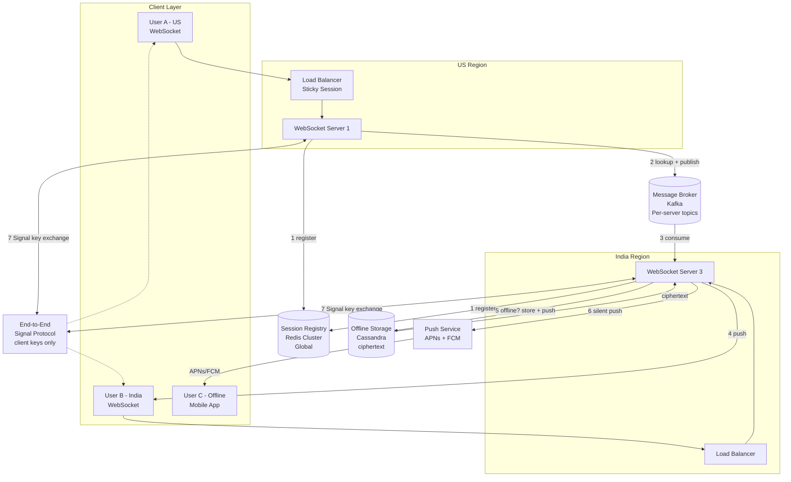

*The global WhatsApp architecture: clients connect via region-specific load balancers to WebSocket servers that register their sessions in a global Session Registry (Redis Cluster). Online-to-online messages route through a per-server Kafka topic to the recipient's server. Offline recipients have their encrypted message stored in Cassandra and a silent push sent via APNs/FCM to wake the device. End-to-end encryption keys (Signal Protocol) live only on the client devices — the server stores only ciphertext.*

**Problem Statement:** Design a messaging platform supporting 2 billion users, end-to-end encryption (Signal Protocol), real-time delivery with sub-second latency, offline messages with store-and-forward, silent push wake-up, presence/read receipts, media sharing, group chats, and voice/video calling — all across multiple regions while keeping message content private from the server.

**The WebSocket scaling challenge in numbers:** WhatsApp maintains ~100 million concurrent WebSocket connections. Each connection consumes ~50 KB of server memory → ~5 TB of RAM dedicated to connection state globally. With 10K connections per server, that is ~10,000 WebSocket servers. Routing a message requires a Session Registry lookup (Redis) + a cross-server broker hop (Kafka) + the final WebSocket push — the full path must complete in < 50 ms at peak.

---

### Characteristics

| Characteristic | What it means | Why it matters |
|---|---|---|
| **Stateful connections** | WebSocket connections are persistent and sticky | Enables real-time push; but complicates failover and load balancing |
| **E2E encryption** | Server cannot read message content (Signal Protocol) | Privacy; requires encrypted push notifications and client-side media |
| **Offline support** | Store-and-forward when user offline | Messages not lost when device off or in background |
| **Push wake-up** | APNs/FCM wake sleeping devices | Mobile battery optimization; can't keep WebSocket alive in background |
| **Multi-region** | Servers in different regions | Latency optimization + failover; cross-region message delivery |
| **Targeted messaging** | Route to specific server, not broadcast | Avoids 999/1000 server waste from Redis Pub/Sub broadcast |
| **Message ACK** | Delivery confirmation from receiver | Ensures no message loss; drives read receipts |
| **Sync on reconnect** | Fetch pending messages when user reconnects | Completeness after disconnect; deduplicates re-delivered messages |
| **Per-chat ordering** | Messages in a chat delivered in order | Correctness; required for conversation coherence |
| **Group fan-out** | One message to N participants | Amplifies write/load per message; needs per-participant ordering |
| **Media out-of-band** | Media uploaded separately, referenced by URL | Keeps WebSocket channel small; enables CDN caching + resumption |
| **VoIP signaling** | Call setup over the signaling channel | Reuses connection infrastructure; media flows over separate UDP |

---

### Pros

- **Real-time delivery:** Sub-second message delivery to online users over persistent WebSocket.
- **Offline support:** Messages stored as ciphertext until the recipient reconnects.
- **Global scalability:** Multi-region servers + session routing + per-server Kafka topics.
- **Battery efficiency:** Silent push notifications wake devices without exposing content.
- **E2E encryption:** Signal Protocol — even WhatsApp cannot read message content.
- **Targeted routing:** Per-server channels eliminate broadcast waste.
- **Acknowledgement model:** Per-message ACK drives delivery receipts and retries.

### Cons

- **Stateful connections:** WebSocket sticky sessions → server affinity complexity and failover cost.
- **Registry bottleneck:** Millions of concurrent users → Session Registry needs sharding and replication.
- **Offline storage cost:** Storing ciphertext until delivery + push reliability gaps.
- **Push reliability:** APNs/FCM may delay or drop silent notifications (iOS especially aggressive).
- **Reconnection sync:** Fetching pending messages on reconnect can be expensive during storms.
- **E2E trade-offs:** Server cannot search, moderate, or index content — limits features.
- **Media relay pressure:** Encrypted media uploads/downloads strain bandwidth before CDN offload.

### Use Cases

- **WhatsApp-style global messaging:** E2EE, offline messages, push wake-up, 180+ countries.
- **Chat & collaboration:** Slack/Discord-style workspaces with presence and read state.
- **Live comments / streaming chat:** Millions of viewers on a single stream; fan-in from a broadcaster.
- **SMS replacement:** Free cross-border messaging with delivery guarantees.
- **Enterprise secure chat:** Regulated industries needing E2E encryption + audit metadata.

### Components

| Component | Purpose | Responsibilities | Real-world Example |
|---|---|---|---|
| **Load Balancer** | Distribute WebSocket connections | Sticky session (hash IP/user_id); TLS termination | AWS NLB + HAProxy |
| **WebSocket Server** | Handle persistent connections | Accept WebSocket, push messages, hold connection state | Node.js/Go/Elixir server (Netty) |
| **Session Registry** | Track user → server mapping | Presence (online/offline); fast lookup | Redis Cluster / Cassandra |
| **Message Broker** | Cross-server message routing | Targeted delivery (no global broadcast) | Kafka / Redis Streams / gRPC |
| **Offline Storage** | Store messages for offline users | Ciphertext storage + TTL | Cassandra / DynamoDB / SQS |
| **Push Service** | Wake offline devices | Send silent push (APNs, FCM) | FCM + APNs |
| **Message Store** | Persist message history | E2E encrypted storage | Cassandra |
| **Delivery Tracker** | Track ACK + retries | Delivery status + redelivery | Message store + timers |
| **Media Service** | Encrypted media upload/download | Chunked upload, CDN URLs, virus scan | S3 presigned + CloudFront |
| **Group Service** | Group membership + fan-out | Participant lists, admin rights, broadcast | DynamoDB + fan-out workers |
| **Call Signaling** | VoIP setup/teardown | Session negotiation, ICE candidates | WebSocket signaling channel |

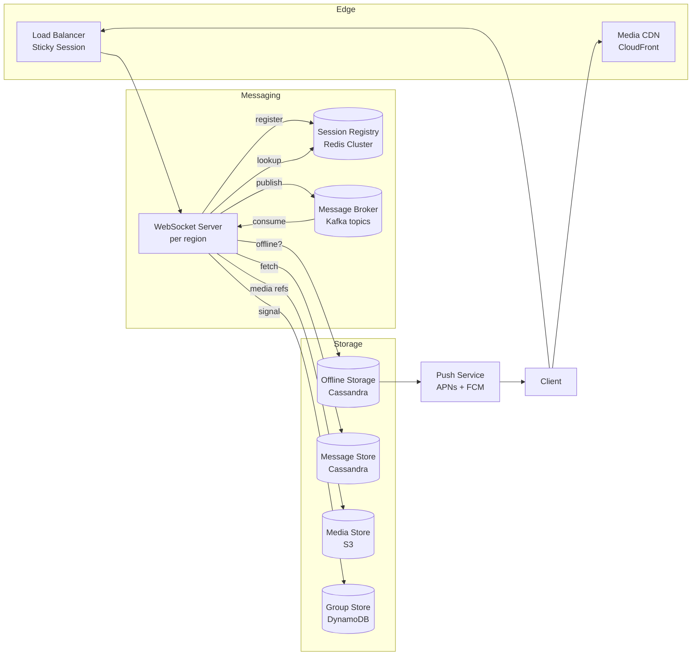

---

### Architectural Patterns

#### Session Registry (Presence Service)

- **What**: A highly available key-value store mapping user IDs to their current server (e.g., `User-B → India-WS-Server-3`).
- **Problem solved**: With sticky WebSocket connections, Server A doesn't know which server User B is connected to.
- **How it works**: On connect → server writes `user_id → server_id` to registry; on disconnect → delete entry; message lookup → registry query → route to correct server.
- **When to use**: Any sticky-connection system requiring cross-server routing.
- **Advantages**: Fast O(1) lookup; simple.
- **When not to use**: Broadcast-heavy workloads (registry doesn't help).
- **Disadvantages**: Registry failure = no routing; must be HA.

#### Targeted Pub/Sub (Per-Server Channels)

- **What**: Each WebSocket server subscribes to a unique channel; messages are published specifically to that channel.
- **Problem solved**: Redis Pub/Sub is a dumb broadcast — a message goes to ALL subscribed servers. At WhatsApp scale (1,000 servers), 999/1,000 receive each message and discard it.
- **How it works**: Server subscribes to `server:{region}:{node_id}`; sender publishes to the recipient's specific channel; only the target server receives it.
- **When to use**: Cross-server real-time delivery at scale.
- **Advantages**: O(1) network per message instead of O(n) servers.
- **When not to use**: Global broadcasts (announcements) — use a separate broadcast channel with fan-out limits.
- **Disadvantages**: Requires coordination of channel names; channel explosion at massive scale → prefer Kafka topics.

#### Store-and-Forward (Offline Queue)

- **What**: When a recipient is offline, the message is stored durably and delivered on next connection.
- **Problem solved**: Mobile devices go offline (battery, network, background limits); messages must not be lost.
- **How it works**: Registry returns "offline" → message (ciphertext) persisted with TTL → silent push sent → on reconnect, recipient fetches pending messages → ACK → delete.
- **When to use**: Any messaging system with intermittent connectivity.
- **Advantages**: Reliability; no message loss.
- **Disadvantages**: Storage cost; cleanup complexity; requires TTL to bound storage.

#### Sticky Session Routing

- **What**: A load balancer routes a given user to the same WebSocket server across reconnects when possible (hashed on user_id).
- **Problem solved**: Avoids Session Registry lookups for every message if the user is on the same server as last time.
- **How it works**: LB hash on user_id/phone_hash → consistent server selection; registry updated on connect.
- **When to use**: Stateful protocols (WebSocket, HTTP/2 push).
- **Advantages**: Reduced lookup latency; connection locality.
- **Disadvantages**: Imbalanced load if hashing is poor; server failure still migrates users.

#### Idempotent Routing + Deduplication

- **What**: Each message has a unique ID; duplicate deliveries (from retry or reconnect) are detected and discarded.
- **Problem solved**: At-least-once broker delivery + reconnection → receiver may see a message twice.
- **How it works**: Receiver tracks `last_seen_msg_id` per chat; a sliding window (e.g., last 1,000 IDs in Redis) detects duplicates.
- **When to use**: Any retry-capable delivery path.
- **Advantages**: Correctness without exactly-once complexity.
- **Disadvantages**: State overhead on the receiver; window management.

### Benefits

- **Real-time delivery:** Sub-second message delivery to online users over persistent WebSocket.
- **Offline support:** Messages stored as ciphertext until the recipient reconnects.
- **Global scalability:** Multi-region servers + session routing + per-server Kafka topics.
- **Battery efficiency:** Silent push notifications wake devices without exposing content.
- **E2E encryption:** Signal Protocol — even WhatsApp cannot read message content.
- **Targeted routing:** Per-server channels eliminate broadcast waste.
- **Acknowledgement model:** Per-message ACK drives delivery receipts and retries.

### Challenges

#### Technical Challenges

- **WebSocket management:** Millions of persistent connections → per-connection memory + file-descriptor limits. Need epoll/kqueue and event-loop servers (Netty/Elixir).
- **E2E encryption:** Server stores ciphertext; can't read for search/moderation/content-indexing.
- **Message ordering:** Per-chat ordering must be preserved across server hops and reconnections.
- **Media integrity:** Encrypted media must resist corruption and resume partial uploads.

#### Scalability Challenges

- **Broadcast waste:** Redis Pub/Sub → 999/1000 servers discard → use targeted channel per server or Kafka.
- **Registry scale:** Millions of concurrent users → Redis Cluster + sharding; registry becomes a hot lookup path.
- **Group fan-out:** A single group message must reach N participants; naive fan-out is a write amplifier.
- **Push thundering herd:** Millions of devices waking simultaneously on reconnect storms.

#### Performance Challenges

- **Message latency:** User A → server → registry → target server → User B → sub-second.
- **Offline lookup:** Millions of offline users → fast retrieval from partitioned storage.
- **Connection churn:** High reconnect rate during network flaps → lookup storm on the registry.

#### Reliability Challenges

- **Server failure:** Server crashes → active connections lost; user reconnects → new server.
- **Registry outage:** No routing → reconnect to any server; rebuild presence on recovery.
- **Broker backpressure:** Kafka topic saturation under burst → broker buffers in memory; need flow control.
- **Push delivery gaps:** Silent pushes dropped by mobile OS → fallback polling / delivery receipts.

#### Operational Challenges

- **Connection management:** Reconnect storms; stale session cleanup; zombie connections.
- **Push notification reliability:** APNs/FCM delivery variability, especially on iOS.
- **Multi-region sync:** Users roaming → registry updates across regions; cross-region handoff.
- **Certificate/key rotation:** Signal Protocol pre-keys and signed pre-keys must be rotated and replenished.

#### Security Concerns

- **End-to-end encryption:** Key exchange (Signal Protocol); ciphertext at rest; pre-key bundles on server.
- **Metadata leakage:** Message timestamps, sizes, routing info still visible to server and carrier.
- **Man-in-the-middle:** TLS + certificate pinning on the client; key verification via security codes.
- **Account takeover:** Phone number hijacking, SIM-swap; requires PIN/verification.
- **Spam + phishing:** Rate limiting + content filtering on the server side (metadata only).
- **Device compromise:** Malware on the device reads plaintext before encryption / after decryption.

### Best Practices

- **Session registry sharding:** Hash user_id → Redis shard; replication for HA; local L1 cache of recent lookups.
- **Targeted pub/sub:** Per-server channels (not global broadcast); Kafka topic per server for high throughput.
- **Offline storage:** TTL-based cleanup (e.g., 30 days for most; keep until ACK for critical); encrypted at rest.
- **Push notifications:** Silent data payload; batch pushes to reduce APNs load; fallback on failure.
- **ACK + redelivery:** Track delivery status; retry with exponential backoff; idempotent consumers.
- **Multi-region:** GeoDNS routing; cross-region registry replication; edge WebSocket servers.
- **Message ordering:** Per-chat single partition/topic; monotonic sequence numbers; ordered fan-out.
- **Group fan-out:** Precompute participant lists; parallel publish to per-recipient channels; dedupe on receive.
- **Media lifecycle:** Encrypted chunked upload; CDN URLs; anti-malware scanning; expiration TTLs.
- **Monitoring:** Connection count; registry hit rate; push delivery rate; offline storage size; delivery latency.

---

### When to Use / When Not to Use

**Use when:**

- Real-time, conversational messaging is the core product (WhatsApp, Signal, Telegram, Discord DMs).
- Users expect sub-second delivery and delivery/read receipts.
- Offline support is required (mobile-first, intermittent connectivity).
- Privacy requires that the server cannot read message content (E2E encryption).
- Group chats, voice/video, or media sharing are first-class features.

**Avoid when:**

- Messages are broadcast (announcements, marketing) and not conversational — use a pub/sub or email pipeline.
- Delivery latency of seconds is acceptable and real-time push is not needed.
- E2E encryption is not required (simpler transport + server-side encryption suffices).
- The user base is tiny (< 10K) — a single server with in-memory sockets is enough.

**Alternatives:**

- **Firebase Realtime Database / Firestore:** Managed, good for quick prototypes, weaker at planetary WebSocket scale.
- **Pusher / Ably / Sendbird:** Managed WebSocket + push; trade operational control for convenience.
- **Kafka + gRPC:** High-throughput pub/sub and RPC for cross-server routing; no managed clients.
- **MQTT / XMPP:** Lightweight or standards-based protocols for IoT or federated chat.

---

### Data Model and API

```mermaid
erDiagram
    USER ||--o{ MESSAGE : "sends"
    USER ||--o{ CONTACT : "contacts"
    USER ||--o{ GROUP_MEMBER : "in"
    GROUP ||--o{ GROUP_MEMBER : "has"
    CHAT ||--o{ MESSAGE : "contains"
    USER ||--o{ READ_RECEIPT : "reads"
    MESSAGE ||--o{ READ_RECEIPT : "has"
    MESSAGE }|--o{ MEDIA : "attaches"
    MESSAGE }|--o{ CALL : "initiates"

    USER {
      string user_id PK
      string phone_number
      string name
      string e2e_public_key
      string identity_key
      string signed_prekey
    }
    MESSAGE {
      string message_id PK
      string chat_id FK
      string sender_id FK
      string encrypted_body
      string ciphertext_key_bundle
      int message_type
      datetime timestamp
      string status SENT_DELIVERED_READ
    }
    CONTACT {
      string user_id FK
      string contact_id FK
    }
    GROUP {
      string group_id PK
      string name
      string admin_id FK
      string group_key_ciphertext
    }
    CHAT {
      string chat_id PK
      string type DM_GROUP
      string topic_name
    }
    GROUP_MEMBER {
      string group_id FK
      string user_id FK
      string role MEMBER_ADMIN
    }
    READ_RECEIPT {
      string message_id FK
      string user_id FK
      datetime read_at
    }
    MEDIA {
      string media_id PK
      string message_id FK
      string url
      string mime_type
      bigint size_bytes
      boolean e2e_protected
    }
    CALL {
      string call_id PK
      string caller_id FK
      string chat_id FK
      string call_type VOICE_VIDEO
      datetime started_at
      int duration_seconds
    }
```

**Partitioning:** Messages sharded by chat_id; Users by user_id; Groups by group_id; Media by user_id hash (for CDN locality).

**Indexes and Constraints:**

- `USER.phone_number` — UNIQUE (login, registration).
- `USER.e2e_public_key` — for Signal key discovery.
- `MESSAGE(chat_id, timestamp)` — composite index for conversation history.
- `MESSAGE(sender_id, timestamp)` — index for "my sent messages."
- `READ_RECEIPT(message_id, user_id)` — composite PK (idempotent read receipts).
- `GROUP_MEMBER(group_id, user_id)` — composite PK prevents duplicate membership.
- `MEDIA(message_id)` — one-to-many; allows multi-attachment messages.

**API Contract:**

| Method | Endpoint | Description | Rate Limit |
|---|---|---|---|
| POST | `/api/v1/messages` | Send a message to a user/group | 120 req/min per user |
| GET | `/api/v1/chats/{id}/messages` | Get message history (paginated) | 120 req/min |
| POST | `/ws` | WebSocket: real-time messages, receipts, typing | N/A |
| POST | `/api/v1/contacts` | Add contact | 60 req/min |
| GET | `/api/v1/contacts` | List contacts | 60 req/min |
| POST | `/api/v1/groups` | Create group + add members | 30 req/min |
| POST | `/api/v1/groups/{id}/invite` | Invite to group | 30 req/min |
| POST | `/api/v1/media/upload` | Request presigned media URL | 60 req/min |
| POST | `/api/v1/calls` | Initiate a voice/video call | 10 req/min |
| POST | `/api/v1/messages/{id}/receipt` | Send delivery/read receipt | 300 req/min |

**Send message (POST /api/v1/messages) — Request:**

```json
{
  "recipient": "user_b_id",
  "body": "Hello!",
  "type": "text",
  "quote_message_id": "msg_prev_123"
}
```

**Response:**

```json
{
  "message_id": "msg_123",
  "status": "sent",
  "timestamp": 1723456789
}
```

**WebSocket message envelope:**

```json
{
  "type": "message",
  "from": "user_a_id",
  "chat_id": "dm:user_b",
  "body": "Hello!",
  "timestamp": 1723456789,
  "message_id": "msg_123"
}
```

**Delivery / read receipt (WebSocket):**

```json
{
  "type": "receipt",
  "message_id": "msg_123",
  "status": "delivered",
  "timestamp": 1723456800
}
```

**Authentication:** JWT short-lived + refresh token; PIN-based 2FA for sensitive actions.
**Rate limiting:** Per-user + per-IP sliding window; stricter for message sends.

### Domain-Specific: Real-Time Messaging Deep Dive

This section covers the core technical challenges unique to real-time messaging platforms: maintaining millions of stateful WebSocket connections, routing messages across a geographically distributed server fleet using a session registry, handling offline users with store-and-forward plus encrypted push notifications, end-to-end encryption with the Signal Protocol, read receipts and delivery acknowledgments, media sharing, group fan-out, and voice/video signaling. These topics are the heart of WhatsApp-style system design.

#### WebSocket Connection Management

Clients maintain a single long-lived WebSocket (or a fallback long-poll) to the nearest edge WebSocket server. Because the connection is stateful, the load balancer must be **sticky** — hashed on a stable identifier (phone number hash or user_id) so that reconnects tend to land on the same server, minimizing Session Registry round-trips. The server must handle ~10K concurrent sockets per instance using a non-blocking event loop (Netty on the JVM, or Go/Elixir).

```mermaid
graph LR
  subgraph "Region - US"
    LB1[Load Balancer<br/>hash(user_id)]
    WS1[WS Server 1<br/>10K sockets]
    WS2[WS Server 2<br/>10K sockets]
  end
  subgraph "Edge"
    EDGE[Edge Proxy<br/>TLS Termination]
  end
  U1[User A] --> EDGE --> LB1
  LB1 -->|sticky| WS1
  LB1 -->|sticky| WS2
  WS1 -->|heartbeat| SR[(Session Registry)]
  WS2 -->|heartbeat| SR
```

*Sticky WebSocket routing: the edge proxy terminates TLS, the load balancer hashes the user identifier to pick a server, and each server maintains its socket set while heart-beating liveness to the Session Registry. Reconnection to the same server lets the server reuse in-memory routing for recent conversations.*

#### Online Message Delivery Flow

```
  User A (US)                US-WS-Server-1        Session Registry       Message Broker       India-WS-Server-3        User B (India)
      │                            │                      │                     │                      │                      │
      │  1. Send msg to User B     │                      │                     │                      │                      │
      │ ──────────────────────────► │                      │                     │                      │                      │
      │        (WebSocket)         │                      │                     │                      │                      │
      │                            │  2. Where is User B? │                     │                      │                      │
      │                            │ ─────────────────────►                     │                      │                      │
      │                            │                      │                     │                      │                      │
      │                            │  3. "India-WS-       │                     │                      │                      │
      │                            │      Server-3"       │                     │                      │                      │
      │                            │ ◄─────────────────────                     │                      │                      │
      │                            │                      │                     │                      │                      │
      │                            │  4. Publish msg to India-WS-Server-3      │                      │                      │
      │                            │ ──────────────────────────────────────────►│                      │                      │
      │                            │                      │                     │                      │                      │
      │                            │                      │                     │  5. Forward msg       │                      │
      │                            │                      │                     │ ────────────────────► │                      │
      │                            │                      │                     │    (internal hop)     │                      │
      │                            │                      │                     │                      │  6. Push msg          │
      │                            │                      │                     │                      │ ────────────────────► │
      │                            │                      │                     │                      │     (WebSocket)       │
      │                            │                      │                     │                      │                      │
```

**Step-by-step:**

1. **Connection Time** — User B (India) opens the app → Load balancer assigns them to `India-WS-Server-3` → Server writes `User-B → India-WS-Server-3` to the Session Registry (with a short TTL heartbeat).
2. **Send** — User A (US) sends a message → goes through their open WebSocket to `US-WS-Server-1`.
3. **Lookup** — `US-WS-Server-1` queries the Session Registry: *"Where is User B?"* → Registry replies: `India-WS-Server-3`.
4. **Internal Hop** — `US-WS-Server-1` publishes the message to the broker, targeting `India-WS-Server-3`'s channel/topic.
5. **Delivery** — `India-WS-Server-3` receives the message, finds User B's active WebSocket in local memory, and pushes it down the socket.
6. **ACK** — User B's client acknowledges delivery; `India-WS-Server-3` marks the message `DELIVERED` and pushes a receipt back to A.

> **Reconnection:** If User B disconnects and reconnects, they might land on `India-WS-Server-9`. The registry updates immediately, and the next message routes to the new server.

#### Session Registry (Presence Service)

> "How does the US Server know the Indian user is on a specific server?"

This is solved by a central **Session Registry** (also called a Presence Service) — a highly available, extremely fast **key-value store** (often a global Redis cluster or Cassandra). Because WebSocket connections are stateful, you must track **exactly where every online user is connected** at any given millisecond.

Example registry entry:

```json
{
  "userId": "User-B",
  "connected_to": "India-WS-Server-3",
  "connected_at": 1723456789,
  "ttl_seconds": 60
}
```

#### Redis Pub/Sub for WebSocket Scaling

When a user connects to a WebSocket server, that connection is **sticky**. If User A (on Server 1) wants to talk to User B (on Server 2), Server 1 cannot magically send data down Server 2's socket. You need a **Message Broker** connecting the servers.

##### Why Redis Pub/Sub Works

- **Lightning fast** — in-memory, sub-millisecond latency.
- **Easy to set up** — Server 1 publishes a message, Server 2 receives it and pushes to User B.
- **Great for MVP / medium-scale** apps.

##### The Catch at WhatsApp Scale

Redis Pub/Sub is a **"dumb" broadcast** mechanism. If you aren't careful:

> A message sent to a Redis channel gets broadcasted to **every** WebSocket server subscribed to it.
> With 1,000 servers globally, **999 servers** receive the message, realize User B isn't on them, and throw it away — wasting massive network bandwidth.

##### The Solution

Instead of broadcasting to a global channel:

1. Each server subscribes to **its own unique channel** (e.g., `server-india-node-45`)
2. Messages are published **specifically** to that server's channel
3. At massive scale, consider **Kafka**, **RabbitMQ**, or **direct internal gRPC calls** for more reliable, targeted routing

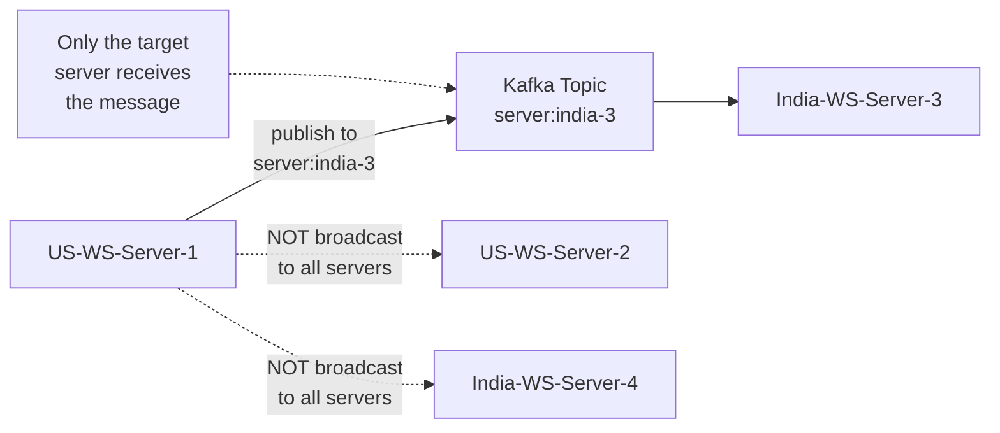

*Targeted routing eliminates broadcast waste: the sender publishes to a per-server Kafka topic; only the recipient's server consumes the topic. The other servers (S2, S4) never see the message, avoiding the 999/1000 discard problem of global Redis Pub/Sub.*

#### Offline Message Handling (Store-and-Forward)

When a user is **offline**, the real-time WebSocket pipeline breaks because there is no active server to receive the message. The architecture shifts from real-time routing to a **Store-and-Forward** mechanism combined with **push notifications**.

```
  User A (US)         US-WS-Server-1      Session Registry     Offline Storage     Push Service        User B (India)
      │                     │                    │                    │                  │                     │
      │  1. Send msg        │                    │                    │                  │                     │
      │ ───────────────────►│                    │                    │                  │                     │
      │                     │  2. Where is       │                    │                  │                     │
      │                     │     User B?        │                    │                  │                     │
      │                     │───────────────────►│                    │                  │                     │
      │                     │  3. "OFFLINE"      │                    │                  │                     │
      │                     │◄───────────────────│                    │                  │                     │
      │                     │                    │                    │                  │                     │
      │                     │  4. Store encrypted msg                 │                  │                     │
      │                     │───────────────────────────────────────► │                  │                     │
      │                     │                    │                    │                  │                     │
      │                     │  5. Trigger push notification           │                  │                     │
      │                     │──────────────────────────────────────────────────────────► │                     │
      │                     │                    │                    │                  │  6. "You have a     │
      │                     │                    │                    │                  │     new message"    │
      │                     │                    │                    │                  │────────────────────►│
      │                     │                    │                    │                  │   (APNs / FCM)      │
      │                     │                    │                    │                  │                     │
      │                     │                    │                    │                  │                     │
      │           ════════════════════ User B comes online ════════════════════          │                     │
      │                     │                    │                    │                  │                     │
      │              India-WS-Server-9           │                    │                  │                   User B
      │                     │  7. Register       │                    │                  │                 │
      │                     │     online         │                    │                  │               ◄───┘
      │                     │◄───────────────────────────────────────────────────────────────────────── │
      │                     │───────────────────►│                    │                  │             │
      │                     │                    │                    │                  │             │
      │                     │  8. Fetch pending messages              │                  │             │
      │                     │───────────────────────────────────────► │                  │             │
      │                     │◄─────────────────────────────────────── │                  │             │
      │                     │                    │                    │                  │             │
      │                     │  9. Push msgs via WebSocket             │                  │    ◄────────┘
      │                     │─────────────────────────────────────────────────────────────────────────►│
      │                     │                    │                    │                  │             │
      │                     │  10. ACK received  │  Delete stored msg │                  │             │
      │                     │───────────────────────────────────────► │                  │             │
      │                     │                    │                    │                  │             │
```

##### 4.1 The Failed Lookup

User A's server queries the Session Registry — this time the registry responds: **"User B is offline"** (no active server ID).

##### 4.2 Offline Message Storage

The message cannot be delivered instantly, so the backend **saves it**. The storage strategy depends on the privacy model:

| Model | Storage | Details |
|-------|---------|---------|
| **WhatsApp (E2EE)** | Temporary DB (Cassandra / distributed queue) | Message is encrypted on User A's device; server stores ciphertext it cannot read. Sits waiting for delivery. TTL (e.g., 30 days) then auto-expiry. |
| **Telegram (Cloud Sync)** | Primary DB (permanent) | Message saved permanently for multi-device sync. Server can read for search/cloud backup. |

##### 4.3 Push Notifications (The Wake-Up Call)

Mobile OSes severely limit background WebSocket connections to save battery. To wake the app:

1. Backend triggers a payload to **APNs** (Apple Push Notification Service) for iOS or **FCM** (Firebase Cloud Messaging) for Android.
2. Apple/Google servers deliver the notification banner to User B's phone.

> **Key detail for E2EE:** The push notification payload does **not** contain the actual message text (the server can't read it). It sends a **silent data trigger**: *"Wake up, you have pending encrypted data."*

On iOS, silent pushes are rate-limited (~2-3 per hour); if the limit is exceeded, the OS defers delivery. WhatsApp mitigates this with a low-power "ping" fallback and by coalescing multiple pending messages into a single silent push when possible.

##### 4.4 Reconnection & Synchronization

When User B opens the app:

1. Phone establishes a **new WebSocket** connection to the nearest server (e.g., `India-WS-Server-9`).
2. Server registers User B in the Session Registry as **"Online"**.
3. App sends a request: *"Give me my pending messages."*
4. Backend pulls encrypted messages from offline storage → pushes them down the WebSocket.
5. User B's phone **decrypts** the messages, displays them, and sends back an **ACK**.
6. Upon receiving the ACK, the backend **permanently deletes** the message from temporary storage.

##### Read Receipts and Delivery Status

Messages traverse a lifecycle: `SENT` → `DELIVERED` → `READ`. The server tracks status per (message, recipient):

- **SENT** — the sender's server accepted the message (it is encrypted and either routed to an online recipient or stored for an offline one).
- **DELIVERED** — the recipient's server pushed the message to an active WebSocket and received a client ACK (envelope delivered). For offline recipients, this fires when the message is first stored and a push is triggered — signaling "we have it and are trying to wake you."
- **READ** — the recipient's client sent an explicit `read` event (the message scrolled into view). This is a client-driven signal the server cannot infer from encryption.

Read receipts are optional and user-controlled in signal-private messenger, but WhatsApp defaults them on. The status update is a lightweight WebSocket message echoing `message_id + status + timestamp`, and it is **not** encrypted content (only metadata), so the server can route it like any other control message.

#### End-to-End Encryption (Signal Protocol)

End-to-end encryption (E2EE) means the server stores and transmits only **ciphertext** it cannot decrypt. The server's role is purely transport and storage of opaque blobs. WhatsApp uses the **Signal Protocol**, which provides forward secrecy and future compromise impersonation resistance.

**Key components:**

- **Identity Key** — long-term key pair per user; used for authentication.
- **Signed Pre-Key** — medium-term key published to the server, signed by the identity key.
- **Pre-Key Bundle** — `{identity_key, signed_prekey, prekey_chain, one-time prekeys}`; stored on the server by the recipient for key discovery.
- **Session** — established via X3DH (Extended Triple Diffie-Hellman) for initial key agreement, then Double Ratchet for ongoing message encryption.

**Message sending flow (E2EE):**

1. Sender fetches recipient's pre-key bundle from the server (metadata only — no plaintext).
2. Sender performs X3DH to derive a shared root key.
3. Sender encrypts the message with a message key derived from the Double Ratchet (AES-256-GCM + HMAC).
4. The **ciphertext** (never plaintext or keys) is sent to the server.
5. Server stores/routes/delivers the ciphertext — it cannot read it.
6. Recipient's app downloads the ciphertext, decrypts with its private keys, and advances the ratchet.

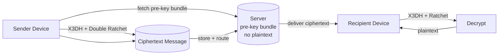

*E2E encryption with Signal Protocol: the sender fetches only the recipient's pre-key bundle (no plaintext ever touches the server), performs X3DH key agreement and Double Ratchet encryption locally to produce a ciphertext, the server stores and routes only the opaque ciphertext, and the recipient downloads and decrypts it locally. The server never holds the plaintext or any private key.*

> **Media**: Media files (photos, videos, documents) are shared via **encrypted, time-limited URLs** — the media is encrypted client-side with a separate content key, uploaded directly to object storage, and the decryption key is sent as an encrypted message referencing the URL.

#### Media Sharing

Media (images, video, documents) is shared **out-of-band** from the signaling channel:

1. Sender's client encrypts the file with a random **content encryption key** (AES-256-CBC/GCM).
2. The encrypted blob is uploaded **directly to object storage** (S3) via a presigned URL — the server never sees the plaintext file.
3. The content key is encrypted with the recipient's Signal session and sent as an **encrypted message** in the chat (a "media" message type referencing the CDN URL).
4. The recipient downloads the encrypted blob from the CDN and decrypts it locally using the key from the encrypted message.
5. Media is cached at CDN edge nodes and expires (TTL) after a retention window.

**Challenges:** large file size (resumable/chunked upload), antivirus scanning must happen in an **isolated, trusted** environment (it cannot see content if E2E), thumbnail generation is client-side, and upload/download bandwidth at global scale requires multi-region edge storage.

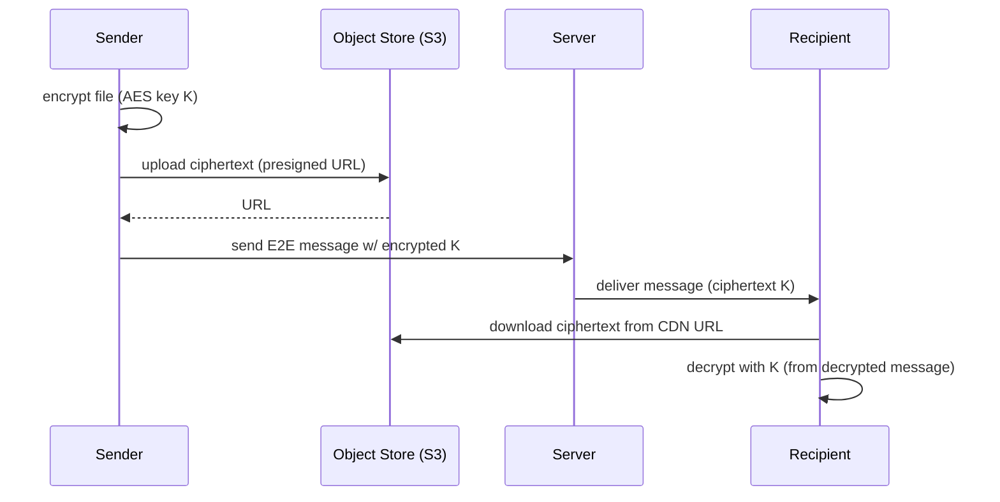

*The media sharing flow: the sender encrypts the file client-side, uploads the ciphertext directly to S3 via a presigned URL (the server never sees plaintext), then sends the encrypted content key as a Signal-encrypted chat message; the recipient downloads the ciphertext from the CDN and decrypts it locally — the server is only an opaque routing/storage layer.*

#### Group Messaging

A group is a server-side **distribution list** with N participants. Unlike 1:1 chats, one message must be fanned out to every member.

- **Group state** (members, admins, description, group key) is stored in a durable store (DynamoDB/PostgreSQL) and cached.
- Each group has a **sender key** (a symmetric key shared among all members for efficient group encryption via the Signal "sender key" mechanism — the sender encrypts once with the group key rather than N times with individual sessions).
- On message send: sender encrypts with the group's sender key → server stores/fans out ciphertext to all members' devices → each recipient decrypts with the group key.
- Per-member ordering is maintained by a monotonic sequence number per group; each member's client deduplicates via a per-group message-ID set.
- Adding/removing members rotates the group key and sends an encrypted "key rotation" message to all members.

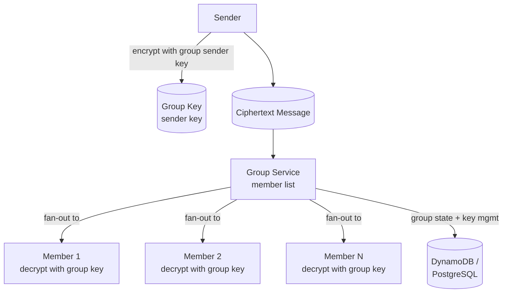

*Group messaging fan-out: the sender encrypts a single ciphertext with the group's Signal sender key; the Group Service looks up the member list and delivers the same ciphertext to each member's device, which decrypts locally with the shared group key. Group membership state lives in a durable store; member changes trigger key rotation.*

#### Voice and Video Calling

WhatsApp voice/video (VoIP) reuses the messaging connection infrastructure for **signaling** while media flows over a separate path:

- **Signaling** — call setup, ICE candidate exchange, codec negotiation, and hangup travel over the same WebSocket signaling channel as chat messages (so you don't need a second connection).
- **Media** — encoded audio/video packets flow over **UDP** (with TCP/TLS fallback) peer-to-peer or through TURN relays when direct P2P fails (symmetric NATs).
- **Relay** — when P2P fails, media is relayed through a TURN/STUN server close to both participants (a media relay).
- **Encryption** — media is encrypted end-to-end (SRTP for video), negotiated via DTLS.

Because signaling rides the WebSocket, a user's reachability and presence (online/offline, last seen) directly determine whether a call can ring. If the recipient is offline, the call is delivered as a "missed call" via the offline message + push path.

#### Message Deduplication and ACK

The broker delivers at-least-once; reconnections and retries can cause the recipient's server to receive the same ciphertext twice. Each message carries a globally unique `message_id`. The recipient's server maintains a small deduplicator (e.g., a Redis SET with TTL holding the last 1,000 message IDs per chat) — duplicates are discarded before being pushed to the client. The client, in turn, sends an `ack` (with `message_id`) back; only after the server sees the ACK does it consider the message fully delivered and advance the read-state machine.

### Replication Strategies

WhatsApp replicates data across multiple dimensions: within a region (for availability and read scaling), across regions (for global latency and durability), and across storage systems (for different access patterns).

#### Message Store — Leaderless, Multi-DC

The persistent message store (Cassandra) uses a **leaderless, multi-datacenter** design. Any coordinator node can accept a write at consistency level `LOCAL_QUORUM` (within a region) or `EACH_QUORUM` (across regions). Reads use `LOCAL_ONE` for low-latency delivery receipts and `LOCAL_QUORUM` for history. Tombstones handle deletions (message expunges) and expire via TTL (cassandra `default_time_to_live`) so storage is bounded.

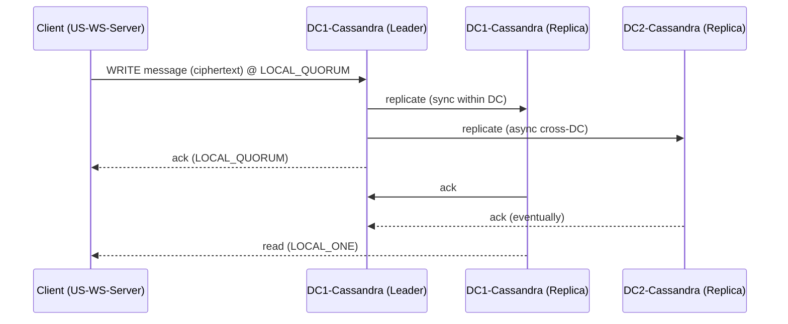

*The Message Store uses leaderless, multi-datacenter Cassandra: the sending server writes ciphertext at `LOCAL_QUORUM` (acknowledged by 2 of 3 nodes in-region synchronously, cross-DC async), then reads at `LOCAL_ONE` for sub-millisecond delivery checks. TTL-bound tombstones auto-expire deleted/expired messages so storage remains bounded.*

#### Session Registry — Redis Cluster with Multi-AZ

The Session Registry uses **Redis Cluster** with hash slots and master/replica pairs across multiple availability zones. Presence writes go to the master; reads can be served by any healthy replica. A short TTL (e.g., 60s) on each session key provides **automatic failover** — if a WebSocket server dies, its session keys expire and the registry reports the user offline, triggering reconnect-to-any-server. Region-local registries replicate asynchronously to peer regions for cross-region handoff (roaming users).

#### Offline Storage — Cassandra with Cross-Region Async

Offline message queues live in Cassandra (ciphertext only). Writes are `LOCAL_QUORUM` within the region; cross-region replication is asynchronous (the message is delivered once the recipient reconnects anywhere). Reads are time-bounded by a TTL (e.g., 30 days). For users who travel, a read repair on reconnect reconciles the local DC with the latest region.

#### Cross-Region Topology

| Data | Within Region | Cross-Region | Purpose |
|---|---|---|---|
| Message Store (history) | Sync rep (QUORUM) | Async rep | Durability + regional reads |
| Session Registry (presence) | Master/replica (multi-AZ) | Async rep | Global routing |
| Offline Storage (ciphertext) | Sync rep (QUORUM) | Async rep | No message loss on travel |
| Group state | Sync rep | Async rep | Consistent membership |
| Signal pre-key bundles | Sync rep | Async rep | Key discovery |

#### Real-world use

Cassandra multi-DC for the message store, Redis Cluster for session registry with replica promotion on AZ loss, DynamoDB Global Tables for user profiles, and S3 cross-region replication for media.

---

### Failure Detection and Membership

Messaging servers must detect failed peers, redistribute connections, and continue serving with minimal disruption — all while holding millions of live sockets.

#### Gossip-based membership

Each WebSocket server periodically exchanges health information with a random subset of peers (gossip protocol). This spreads membership changes through the cluster without a central coordinator. A node that stops gossiping for 2× the suspicion timeout is marked `DOWN` and its sockets are migrated by the load balancer.

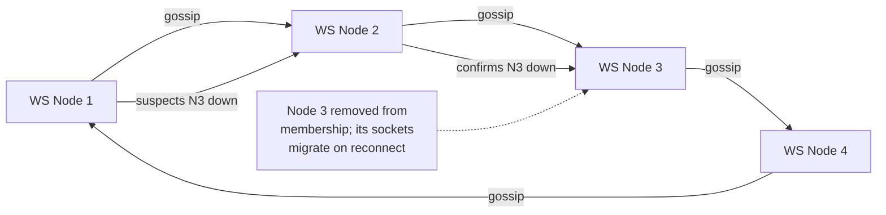

*Gossip-based failure detection: nodes exchange health state with random peers each round. When a node suspects a peer is down, it propagates the suspicion through gossip; once confirmed by multiple nodes, the peer is removed and its connections migrate on the next reconnect.*

#### Health checks

- **Liveness probes:** Each WebSocket server exposes `/health` (checked by Kubernetes every 2s). If unhealthy, the pod is restarted or drained.
- **Readiness probes:** Checks connectivity to the Session Registry and Kafka. Not-ready pods are removed from the load balancer so no new sockets are assigned.
- **Business health checks:** Custom checks like "Session Registry GET latency < 1 ms", "Kafka consumer lag < 10,000 for the delivery topic", and "active socket count within 80% of fd limit".

#### Client-side failure detection

Since WebSocket servers hold stateful connections, the client also runs a **ping/pong** health loop (every 15s). If the server doesn't pong within the interval, the client proactively reconnects — this lets the system recover from a half-open network partition faster than the registry TTL would allow.

#### Failure detection timing for messaging

| Component | Check Interval | Timeout | Action |
|---|---|---|---|
| WebSocket server | 2s (k8s probe) | 6s | Restart/drain; migrate sockets |
| Session Registry | 1s | 60s TTL | Mark users offline; reconnect to any server |
| Message Broker (Kafka) | 10s | 30s | Rebalance consumers; buffer in server |
| Push Service (APNs/FCM) | 5s | 30s | Retry; persist to offline queue |
| Group Service | 3s | 15s | Serve from cache; background repair |

#### Circuit breakers

For dependencies that are failing, a circuit breaker (Resilience4j) trips after N consecutive failures and stops sending requests for a cool-down period. This prevents cascading failures — e.g., if the Session Registry is slow, the WebSocket server can short-circuit a registry lookup using a local L1 cache of recent user→server mappings and retry the lookup later rather than blocking every message.

---

### High Availability and Scalability

Messaging platforms must remain available during node failures, network partitions, and regional outages while scaling to handle global traffic.

#### Multi-Region Deployment

Deploy active services in at least 3 regions (e.g., us-east, eu-west, ap-southeast). Users are routed to the nearest region via GeoDNS or a latency-based load balancer. Each region is self-sufficient for read and write operations, with asynchronous cross-region replication for durability.

- **Active-active for WebSocket:** Each region runs its own WebSocket server fleet and Session Registry shard. Cross-region routing happens only when a user's conversation partner is in another region (via the global broker).
- **Active-active for Session Registry:** Redis Cluster with region-local masters and async cross-region replication. The registry key includes a region tag so routing is region-aware.
- **Active-active for Media:** Multi-region S3 + CloudFront; uploads go to the nearest region, and a background job replicates objects to peer regions.

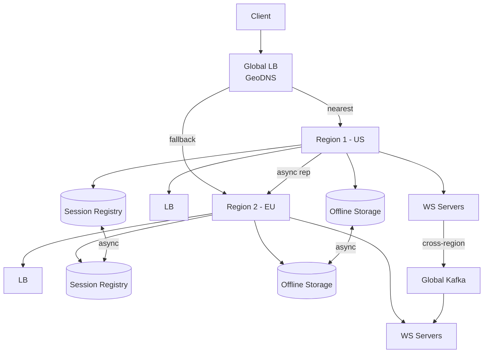

*Multi-region active-active messaging: a global load balancer routes clients to the nearest region by GeoDNS; each region runs its own WebSocket fleet, Session Registry, and Offline Storage. Cross-region registry and offline-storage replication keep user state consistent as users travel; a global Kafka backbone carries cross-region message routing.*

#### Auto-Scaling

- **Stateless services (WebSocket servers, Push Service):** Scale horizontally based on CPU, active-socket count, and request latency. Kubernetes HPA (or KEDA with custom metrics) adjusts replica count automatically.
- **Stateful services (Session Registry, Offline Storage):** Scale by adding Redis shards or Cassandra nodes. Kafka partitions scale consumer groups automatically.
- **Push batching workers:** Scale based on the pending-push queue depth.

#### Graceful Degradation

When a component fails, the system should degrade rather than crash:

- **Session Registry degraded:** Fall back to local L1 cache of recent routing; reconnect-to-any for cache misses; rebuild presence on recovery.
- **Broker degraded:** Buffer messages in local memory/disk queues on the sending server; retry with backoff; persist to offline storage if the buffer overflows.
- **Push Service degraded:** Persist all offline messages in the offline queue (they are already there); the silent push is best-effort — the message is still delivered on the next explicit sync/reconnect.
- **Media Service degraded:** Media sends convert to a text link ("tap to retry download"); uploads retry with resumable chunks.

---

### Performance and Optimization

Performance is measured by **end-to-end message delivery latency** (target: < 50 ms online, in-app; < 5 s push-wake for offline) and **connection density** (sockets per server) at peak load.

#### Latency Optimization

- **Registry locality:** Cache the user→server mapping in a process-local LRU (L1) with a 5s TTL; fall back to Redis (L2) only on cache miss. This cuts the lookup from ~1 ms to ~0.05 ms for hot users.
- **Co-located routing:** Place the WebSocket server, Session Registry shard, and the relevant Kafka partition on the same rack/zone to minimize hop latency.
- **Connection pooling:** Maintain persistent gRPC/HTTP connections between services (WS server ↔ Kafka, WS ↔ Redis) to avoid per-message handshake overhead.
- **Message framing:** Use a compact binary frame (protobuf) for the signaling channel; avoid JSON parsing cost at millions of msgs/sec.

#### Throughput Optimization

- **Event-loop servers:** Netty (JVM) or async Rust/Go servers that scale to ~10K sockets per core using epoll/kqueue.
- **Batch ACKs:** The client batches read/delivery receipts into a single WebSocket frame; the server flushes registry updates in micro-batches.
- **Broker partitioning:** Kafka topic per server, partitioned by chat_id hash so all messages for a chat land on the same partition (ordering) and are consumed in parallel across partitions.
- **Single-flight deduplication:** On a reconnect storm, coalesce duplicate "fetch pending" requests from the same client (same pending-cursor) into one DB read (single-flight pattern).

#### Caching Strategies

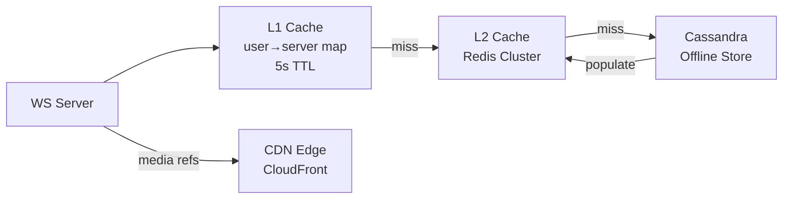

*Multi-tier caching for the delivery path: the WebSocket server consults a process-local L1 cache of recent user→server routing (5s TTL); on a miss it falls back to the Redis Cluster (L2) and ultimately to Cassandra for offline messages. Media references are served from the CDN edge. This keeps the p99 routing lookup under 1 ms.*

#### Write Path Optimization

- **Async delivery:** The sender's server persists the ciphertext to the offline store (if recipient offline) and publishes to the broker concurrently; the API returns `sent` immediately.
- **Broker batching:** Kafka `linger.ms` + batch.size reduce per-message overhead.
- **Offline store compaction:** Use Cassandra's compaction to keep the offline table size bounded; TTL auto-expires undelivered messages.

#### Real-world use

WhatsApp uses a custom Erlang-based server (stateful, millions of connections) with a sharded Redis Session Registry and a fanout service; Telegram uses a distributed Haskell/Golang backend; Signal uses libsignal-server.

---

### CAP Theorem and Consistency Trade-offs

The CAP theorem states that during a network partition, a distributed system can provide at most two of: Consistency, Availability, and Partition tolerance. Messaging runs over networks, so partition tolerance is mandatory — the real design is deciding consistency vs. availability per component.

#### Session Registry — AP (Availability + Partition Tolerance)

The Session Registry prioritizes availability: if a Redis node fails, routing falls back to the L1 cache; users reconnect to any available server and re-register. Presence (online/offline) can be briefly stale — a user may appear online for up to the TTL (60s) after their server died. This is acceptable because reconnecting users are routed to any healthy server and re-register quickly.

#### Offline Message Store — AP with TTL

Offline messages (ciphertext) are available for read and write during a partition, but the store may lag across regions (eventual consistency). A message sent to an offline user in another region may take seconds to replicate. TTL ensures undelivered messages expire (bounded storage). This is acceptable because delivery is also asynchronous.

#### Message History (Read) — Tunable Consistency

History reads use `LOCAL_QUORUM` (strong within a region) by default, but can downgrade to `LOCAL_ONE` for lower latency when the user scrolls. A user reading on two devices may see slightly out-of-order history during a partition — acceptable because chats are time-ordered and the client sorts by timestamp.

#### Delivery Receipts — Eventual Consistency

Delivery/read receipts propagate best-effort. A `DELIVERED` receipt may arrive at the sender before the recipient has actually read; a `READ` receipt is delayed until the client explicitly sends it. During a partition, receipts queue and flush on recovery. This is acceptable for a messaging UX.

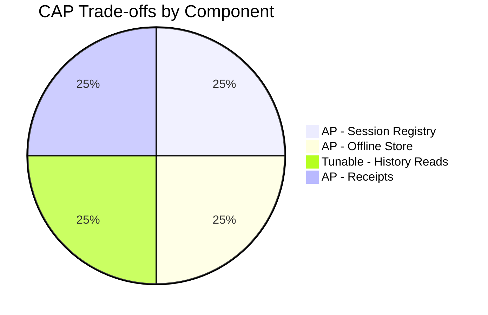

*CAP trade-offs across messaging components: the Session Registry and Offline Store are AP (availability-first) since brief staleness or routing fallback is acceptable; history reads use tunable consistency (LOCAL_QUORUM default, LOCAL_ONE for latency); delivery receipts are eventually consistent.*

**Interview question:** *Is a messaging system strongly consistent?*
**Answer:** No — messaging deliberately trades strong consistency for availability and latency. A sent message is persisted and acknowledged to the sender (strong at the write path within a region), but cross-region delivery, receipts, and presence are eventually consistent. The system provides **read-your-writes** for the sender (your own message is immediately visible) and **at-least-once** delivery with idempotent receivers — never exactly-once end to end.

---

### Encryption and Key Management

WhatsApp stores highly sensitive data: private conversations, photos, videos, voice notes, and contact graphs. Encryption must protect data at rest, in transit, and — for messages — end-to-end.

#### End-to-End Encryption (Signal Protocol)

End-to-end encryption (E2EE) means only the endpoints can decrypt message content. The server stores and routes only **ciphertext** and **opaque key material** (pre-key bundles) it cannot interpret. WhatsApp uses the **Signal Protocol**, which combines X3DH (initial key agreement) and the Double Ratchet (forward secrecy per message).

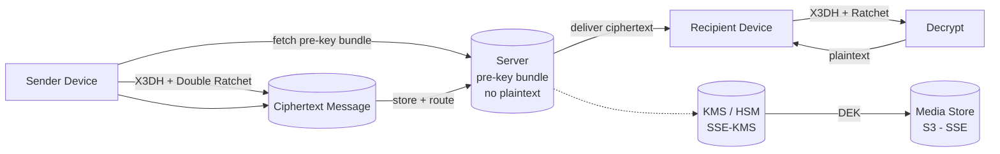

*Encryption at rest and in transit: sender devices fetch only the recipient's pre-key bundle (no plaintext on the server), perform X3DH + Double Ratchet locally to produce ciphertext; the server stores/routes only opaque ciphertext. Media at rest is protected by per-object DEKs managed by KMS (SSE-KMS), and all transport uses TLS 1.3 / mTLS.*

#### Encryption at Rest

- **Media:** Object storage (S3) encrypts all objects with SSE-KMS by default. Each object gets a per-object DEK; the DEK is encrypted by a KMS-managed KEK stored in an HSM. Rotating the KEK only re-encrypts DEKs, not data.
- **Message history:** Stored as Signal ciphertext (already encrypted client-side). Server-side encryption at rest (AES-256) is an additional defense layer — the server holds the ciphertext key anyway.
- **User metadata:** PostgreSQL/PostgreSQL TDE for profile data; the Signal identity keys and pre-key bundles are stored encrypted at rest.

#### Encryption in Transit

All client-to-server and server-to-server traffic uses **TLS 1.3** (minimum TLS 1.2). Inter-service communication within the data center uses **mTLS** (mutual TLS) for service-to-service authentication. Mobile SDKs pin the server certificate to prevent man-in-the-middle attacks.

#### Key Management

- **Key hierarchy:** A KEK (Key Encryption Key) in an HSM encrypts per-object or per-user DEKs (Data Encryption Keys). Rotating the KEK requires only re-encrypting the DEKs, not the data.
- **Signal keys:** Identity key (long-term), signed pre-key (rotated every ~1–2 weeks, signed by the identity key), and one-time pre-keys (consumed on first message, replenished proactively). The server stores pre-key bundles but **never** the private keys.
- **Key rotation:** Signal signed pre-keys rotated every ~1–2 weeks; identity keys rarely change (verified out-of-band via security codes / QR codes).

**Java example — media encryption service as a Spring bean:**

```java
@Service
@RequiredArgsConstructor
@Slf4j
public class MediaEncryptionService {

    @Value("${app.encryption.media-key-id}")
    private String keyId;

    private final AwsKms kmsClient;

    /**
     * Encrypt a media blob with a per-object DEK fetched from KMS.
     * Returns the ciphertext plus the encrypted DEK so the recipient can
     * decrypt — the plaintext key never touches disk.
     */
    public EncryptedMedia encrypt(byte[] plaintext) {
        var dek = kmsClient.generateDataKey(keyId);          // DEK + encrypted DEK
        var cipher = Cipher.getInstance("AES/GCM/NoPadding");
        cipher.init(Cipher.ENCRYPT_MODE,
                new SecretKeySpec(dek.plaintext(), "AES"),
                new GCMParameterSpec(128, dek.iv()));
        var ciphertext = cipher.doFinal(plaintext);
        return new EncryptedMedia(ciphertext, dek.encryptedKey(), dek.iv());
    }

    public record EncryptedMedia(byte[] ciphertext, byte[] encryptedKey, byte[] iv) {}
}
```

*The `MediaEncryptionService` bean generates a per-object data encryption key (DEK) via AWS KMS (`generateDataKey`), encrypts the media blob with AES-GCM (confidentiality + integrity via the auth tag), and stores the KMS-encrypted DEK alongside the ciphertext. The KMS-managed key ID is injected via `@Value`. Only authorized callers with KMS `Decrypt` permission can recover the DEK to decrypt the media — the plaintext DEK never touches disk.*

---

### Authentication and Authorization

WhatsApp must verify who is connecting (authentication), determine what they can do (authorization), and enforce privacy controls. Every request must carry authenticated credentials, and every connection must be bound to a verified identity.

#### Authentication Methods

- **Phone number + SMS/WhatsApp voice call:** The primary login. The user enters their phone number; the server sends a 6-digit code via SMS (or a voice call if SMS fails). This binds the account to a SIM.
- **PIN / 2FA:** Users can set a 6-digit PIN (optional but encouraged) that is required on re-registration or after installing the app on a new device. A PIN protects against SIM-swap attacks.
- **Device identity:** Each device generates a Signal identity key on first run; the server stores only the public identity key. Device linking (e.g., WhatsApp Web) uses a pairing code scanned by the phone.
- **Certificate pinning:** The mobile client pins WhatsApp's TLS certificate to prevent man-in-the-middle attacks during key exchange.
- **Session tokens:** Short-lived session tokens for WebSocket authentication; refreshed periodically.

#### Authorization Models

- **Identity-based:** Each WebSocket connection is authenticated to a single phone-number identity; messages are routed only to the claimed identity's conversations.
- **Group membership:** The Group Service checks membership before delivering a group message or allowing membership changes (only admins can add/remove in admin-only groups).
- **Privacy controls:** Last Seen, Profile Photo, About, and Read Receipts each have a privacy setting (everyone, my contacts, my contacts except..., nobody). The server enforces these before revealing presence or delivering read receipts.
- **Message editing/deletion:** Only the sender can edit or delete their own message within a time window (default 1 hour), verified server-side.

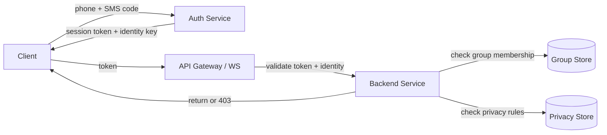

*Authentication and authorization flow: the client authenticates with a phone number + SMS code and receives a session token plus its Signal identity key; the API Gateway / WebSocket gateway validates the token and identity; backend services enforce group membership and per-user privacy rules (Last Seen, Read Receipts, etc.) against dedicated stores before returning data or 403.*

**Java example — WebSocket handshake authentication filter:**

```java
@Component
@RequiredArgsConstructor
public class WebSocketAuthInterceptor implements WebSocketHandlerInterceptor {

    private final SessionRegistry sessionRegistry;
    private final AuthService authService;

    @Override
    public boolean preHandle(ServerHttpRequest request,
                             ServerHttpResponse response,
                             Object handler) throws Exception {
        if (request instanceof ServletServerHttpRequest servlet) {
            var token = servlet.getServletRequest().getParameter("token");
            if (token == null || !authService.isValid(token)) {
                response.setStatusCode(HttpStatus.UNAUTHORIZED);
                return false;
            }
            var identity = authService.resolveIdentity(token);   // phone-number identity
            servlet.getServletRequest().setAttribute("identity", identity);
        }
        return true;
    }
}
```

*The `WebSocketAuthInterceptor` bean validates the session token on every WebSocket handshake (interceptor pattern), resolves the authenticated phone-number identity, and rejects unauthorized connections with 401. The identity is attached as a request attribute for downstream handlers — every message is bound to a verified identity before any routing or storage occurs.*

#### Privacy Enforcement

- **Last Seen:** Before revealing a contact's online status, the server checks the viewer's position relative to the privacy list (contacts / exclude-list / nobody).
- **Read receipts:** Before sending a `read` receipt back to the sender, the server checks whether the recipient has "Read Receipts" enabled in their privacy settings.
- **Profile data:** Profile photo / About is gated by the recipient's privacy setting; the server returns a placeholder if the viewer is not authorized.

---

### Security Threats and Mitigations

#### Threat: Account Takeover (SIM Swap)

- **Risk:** An attacker social-engineers a carrier to port the victim's phone number to a new SIM, then re-registers the number on WhatsApp and hijacks the account.
- **Mitigation:** Require a **PIN** on re-registration (2FA). WhatsApp optionally stores the PIN server-side and requires it when the account is registered on a new device or after a long inactivity. Rate-limit registration attempts per phone number and per IP. Alert on new-device registration.

#### Threat: Man-in-the-Middle on Key Exchange

- **Risk:** An attacker with a compromised CA or network position intercepts the Signal pre-key bundle exchange and substitutes their own keys.
- **Mitigation:** Certificate pinning on the mobile client; out-of-band verification of the identity key via **security codes** (QR code scan or 60-digit numeric comparison). Clients verify a "Safety Number" derived from both users' identity keys after each message (trust on first use, with warnings on change).

#### Threat: Metadata Leakage

- **Risk:** Even with E2EE, the server observes message timestamps, sizes, participants, message frequency, and routing paths — enough to infer social graphs and behavior.
- **Mitigation:** Padding message ciphertexts to fixed size classes; batching delivery to obscure timing; routing messages through region-local servers when both parties are co-located. (Note: complete metadata resistance is impossible for a store-and-forward system and is explicitly out of scope for WhatsApp's threat model — Signal offers stronger metadata protection.)

#### Threat: Push Notification Reliability / Silent-Push Abuse

- **Risk:** Silent pushes are rate-limited by iOS (≈2–3/hour); an attacker could flood a victim with messages to exhaust their silent-push budget, preventing real messages from waking the app.
- **Mitigation:** Server-side rate limiting (per-sender throttle); coalesce multiple pending messages into a single silent push; fallback to periodic polling during extended offline periods; alert on anomalous message volume per recipient.

#### Threat: Spam and Phishing

- **Risk:** Bots send spam or phishing links at scale via phone-number harvesting and automated registration.
- **Mitigation:** Phone-number verification (SMS cost barrier); rate limiting per account and per IP; spam-report + block; client-side reporting with encrypted report blobs; ML classifiers on message metadata (rate, recipients, time-of-day) — not content, since content is encrypted.

#### Threat: Media Abuse / Malware

- **Risk:** Encrypted media could carry malware or CSAM (child sexual abuse material) that the server cannot scan.
- **Mitigation:** For non-E2E group media, scan in a **sandboxed, ephemeral VM** after download (not at rest in plaintext). For E2E media, rely on **hash-based matching** of known-bad content against a server-side blocklist (PhotoDNA-style) using perceptual hashes shared by the client. Report-and-block for user flagging.

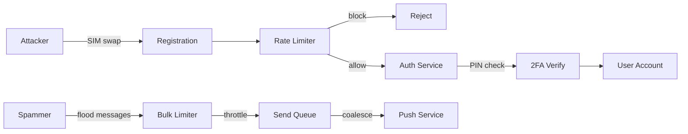

*Layered defenses: a SIM-swap attacker attempting registration hits per-phone-number and per-IP rate limiting; surviving attempts require 2FA PIN verification. A spammer flooding messages hits bulk rate limits and push-coalescing to prevent silent-push budget exhaustion — protecting victim devices from being drowned out.*

---

### Observability and Logging

Messaging platforms generate massive telemetry. Observability must cover the connection pipeline, routing/lookup, delivery latency, offline storage, push delivery, and security signals.

#### Key Metrics

- **Connection metrics:** Active WebSocket count, connection churn rate (connects/disconnects per second), reconnect storms (95th-percentile reconnect latency).
- **Routing:** Session Registry hit rate (L1 vs L2 vs offline), registry GET/SET p99 latency (< 1 ms target), cross-region routing ratio.
- **Delivery:** End-to-end online delivery latency (p50/p95/p99), offline-store write/read latency, message throughput (msgs/sec) by region.
- **Push:** Silent push sent, APNs/FCM delivery success rate, wake-up-to-fetch latency (time from push to client sync).
- **Offline store:** Queue depth per user, TTL expiry rate, storage size growth.
- **Group:** Fan-out latency per group message, participant count distribution, duplicate-send rate.
- **Calls:** Call setup success rate, ICE success/failure ratio, relay vs. P2P ratio, media MOS.
- **Security:** Failed auth attempts, PIN verification failures, anomalous registration rate, reported spam.

#### Logging

- **Access logs:** Every WebSocket message routed, with user_id, chat_id, message_id, path (servers traversed), and latency. Used for audit and anomaly detection.
- **Event logs:** All user actions (send, deliver, read, group join/leave, call start/end) logged as structured events for analytics and ML feature generation.
- **Error logs:** Registry timeouts, broker failures, push API errors, with correlation IDs for cross-service tracing.
- **Audit logs:** All privacy changes (Last Seen / Read Receipts settings), account settings changes, new-device registrations — logged with before/after state.

#### Distributed Tracing

Trace every message end-to-end — from the sender's WebSocket frame, through the sending server, Session Registry lookup, broker publish, recipient server, delivery/push, ACK, and read receipt. Use OpenTelemetry with a trace context header propagated across all service boundaries. Key spans to instrument:

- `websocket.ingress` (client → sending server)
- `session_registry.lookup` (sending server → Redis)
- `broker.publish` (sending server → Kafka)
- `broker.consume` (Kafka → recipient server)
- `websocket.egress` (recipient server → client)
- `offline.store_write` (ciphertext to Cassandra)
- `push.send` (server → APNs/FCM)
- `receipt.ack` (client ACK → sender)

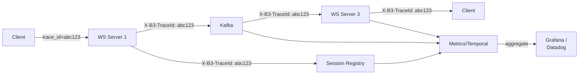

*End-to-end tracing: each message carries a trace ID (`abc123`) propagated across the delivery path — client → sending WS server → Session Registry lookup → Kafka publish → recipient WS server → recipient client. Each hop records a span; spans aggregate in a metrics backend (Temporal/Metrics, Jaeger, or Datadog) and surface in Grafana dashboards, enabling latency analysis of the full delivery pipeline.*

#### Alerting Strategy

- **Critical (page immediately):** Delivery latency p99 > 500 ms for 2 minutes; Session Registry down; Kafka consumer lag > 100,000; push delivery rate < 90% for 5 minutes; reconnect storms (>10× normal).
- **Warning (Slack, no page):** Registry TTL miss rate > 15%; offline store depth growing (no drain for 10 min); push success rate < 95% for 15 min; active socket count > 95% of fd limit on any node.
- **Info (dashboard only):** Engagement per group; call MOS; new registration rate; media upload volume by type.

**Java example — delivery latency metrics with Micrometer:**

```java
@Service
@RequiredArgsConstructor
@Slf4j
public class InstrumentedDeliveryService {

    private final DeliveryRepository deliveryRepository;
    private final MeterRegistry meterRegistry;

    public void deliver(String messageId, String chatId, String recipientId,
                        DeliveredMessageHandler handler) {
        var timer = Timer.Sample.start(meterRegistry);
        try {
            // 1. Registry lookup
            var lookupTimer = Timer.Sample.start(meterRegistry);
            var server = deliveryRepository.lookupServer(recipientId);
            lookupTimer.stop(Timer.builder("whatsapp.registry.lookup")
                    .register(meterRegistry));

            // 2. Deliver
            deliveryRepository.deliver(server, messageId, chatId);

            timer.stop(Timer.builder("whatsapp.delivery.latency")
                    .tag("chat_type", inferChatType(chatId))
                    .tag("region", currentRegion())
                    .register(meterRegistry));

            Counter.builder("whatsapp.messages.delivered")
                    .tag("chat_type", inferChatType(chatId))
                    .register(meterRegistry).increment();
        } catch (Exception e) {
            Counter.builder("whatsapp.delivery.errors")
                    .tag("error_type", e.getClass().getSimpleName())
                    .register(meterRegistry).increment();
            log.error("Delivery failed for message {}: {}", messageId, e.getMessage(), e);
            throw e;
        }
    }

    private String inferChatType(String chatId) {
        return chatId.startsWith("group:") ? "group" : "dm";
    }

    private String currentRegion() {
        return System.getenv().getOrDefault("AWS_REGION", "unknown");
    }

    @FunctionalInterface
    interface DeliveredMessageHandler {
        void handle(String payload);
    }
}
```

*The `InstrumentedDeliveryService` bean uses Micrometer to record nested timers: one for the Session Registry lookup (`whatsapp.registry.lookup`) and one for the total delivery latency (`whatsapp.delivery.latency`, tagged by chat type `group`/`dm` and region). It increments a delivered-messages counter on success and an error counter on failure, with structured logging of the exception. Tags enable breaking down latency by dimension (e.g., group chats in us-east vs. ap-southeast) in dashboards.*

### Real-World Implementations

Messaging platforms use a combination of custom and managed systems, each chosen for its strengths at a particular layer.

#### WhatsApp

WhatsApp serves ~2 billion users with ~100 million concurrent WebSocket connections. Its backend is built on **Erlang** (for millions of lightweight, supervised connections), a **sharded Redis** Session Registry for presence, **Kafka** for cross-server routing, and **Cassandra** for message storage. E2E encryption is the **Signal Protocol** (Signal created it; WhatsApp adopted it). Key design facts: each server holds ~10K sockets; messages route via per-server Kafka topics (no global broadcast); offline messages are ciphertext in Cassandra with a 30-day TTL; iOS silent pushes are coalesced to stay within Apple's rate limit; group messages use Signal "sender keys" (one encryption per group, not per member). WhatsApp also runs its own **MMS/SMS gateway** for users without data, and a **TURN relay fleet** for voice/video when P2P fails.

#### Telegram

Telegram uses a **custom Haskell/Golang** backend (the famous "Gram" infrastructure) with a **hybrid cloud** architecture. Unlike WhatsApp, Telegram does **cloud sync by default** — messages are stored in plaintext on Telegram's cloud servers so they can be accessed from any device without E2E. E2E (Secret Chats) is opt-in using the **MTProto** protocol. Architecture: clients upload media via presigned S3 URLs (with a dedicated media cluster); message queues are handled by a custom **distributed hash table + Kafka**; the social graph (contacts) is resolved server-side. Telegram's biggest scale property: a single channel/post can be delivered to **hundreds of millions** of subscribers via "channels" — handled with a fan-out-on-read model.

#### Signal

Signal (the reference client for the Signal Protocol) is built for **maximum privacy, minimum metadata**. Its server, **libsignal-service**, is written in **Java** (the JVM is used by WhatsApp too). Architecture: a **single primary key per user** (the phone number); clients fetch pre-key bundles and send sealed-sender messages. Signal deliberately does **not** store message content, read states, or typing indicators after delivery — it's a **disappearing queue**. Connection routing uses a **single global fan-out** (all online users on one or few servers) — Signal prioritizes simplicity and privacy over the kind of multi-region fan-out WhatsApp uses. Signal also supports **sealed sender**, where the sender's identity is hidden from the server.

#### Discord

Discord's architecture is unusual in that it mixes **WebSocket for guild (server) chat** with **VoIP over WebRTC** for voice channels. Key facts: ~150M+ monthly users, ~640M+ guilds (servers), **fan-out on write** for guild messages (every message is written to a guild's partition, and subscribers read from the partition). Voice uses **WebRTC P2P** with **RTP** over UDP, with Discord's own **RTC gateways** and **voice region servers** for low latency. Discord stores messages in **Cassandra** (per-guild partitions) and uses **Kafka + Zookeeper** for the event backbone. Unlike 1:1 messengers, Discord is **group-first** — the fan-out model is per-guild, making it closer to a hybrid of social-feed fan-out and chat.

#### Element / Matrix

Matrix is a **federated** protocol — there is no central WhatsApp. Each "homeserver" stores message history for its local users, and messages **federate** between servers via Server-Server (federation) APIs. End-to-end encryption (based on Signal's Double Ratchet) is opt-in (Olm/Megolm). Key architectural choice: **rooms** (analogous to groups) with a unique room ID; messages are replicated to all participating homeservers. The **federation API** uses HTTP with transaction IDs for reliable delivery and dedup. Matrix's "always online" model means there is no offline store-and-forward in the WhatsApp sense — the homeserver retains history until acknowledged.

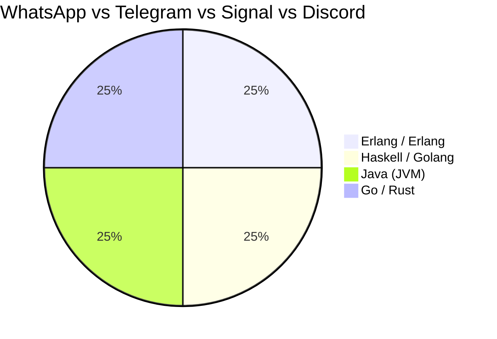

*Backend technology by platform: WhatsApp uses Erlang for connection density; Telegram uses Haskell/Golang for its custom infra; Signal and WhatsApp share the JVM (libsignal-service) for Signal Protocol; Discord uses Go/Rust with WebRTC for voice. Each platform's technology reflects its priorities — WhatsApp/Erlang for sockets, Telegram/Haskell for cloud-sync scale, Signal/JVM for cryptographic correctness, Discord/Go for WebRTC.*

---

### Java and Spring Boot Implementation Guide

This section demonstrates how to build a Spring Boot service for a WhatsApp-style messaging platform's core pipeline: WebSocket connection management, Session Registry lookup, cross-server routing, offline store-and-forward, push notifications, read receipts, and group fan-out — showcasing `@ServerEndpoint`, `SimpMessagingTemplate`, Spring Data, `@Value`, records, `@Valid`, constructor injection, `@EventListener`, and Resilience4j circuit breakers.

#### 1. DTO Records

```java
public record SendMessageRequest(
        @NotBlank String recipient,
        @NotBlank String body,
        @NotBlank String type,
        String quoteMessageId) {}

public record MessageResponse(
        String messageId,
        String chatId,
        String senderId,
        String body,
        String status,           // SENT | DELIVERED | READ
        Instant timestamp) {}

public record ReceiptRequest(
        @NotBlank String messageId,
        @NotBlank String status,            // DELIVERED | READ
        Instant timestamp) {}
```

*Three record types form the messaging API contract: `SendMessageRequest` is the REST POST body with `@NotBlank` validation (enforced at the controller via `@Valid`); `MessageResponse` is the response carrying the per-message status; `ReceiptRequest` carries a delivery/read ack back to the sender. Records are immutable and ideal for thread-safe request/response objects.*

#### 2. Session Registry Service (Presence)

The Session Registry is a thin wrapper over Redis that maps `user_id → server_id` with a short TTL for automatic failover.

```java
@Service
@RequiredArgsConstructor
@Slf4j
public class SessionRegistryService {

    private final RedisTemplate<String, String> redis;
    private final MeterRegistry meterRegistry;

    private static final String KEY_PREFIX = "session:";
    private static final int TTL_SECONDS = 60;

    /**
     * Register that this server owns the user's WebSocket session.
     * Short TTL (60s) means a crashed server's entries auto-expire.
     */
    public void register(String userId, String serverId) {
        redis.opsForValue().set(
                KEY_PREFIX + userId, serverId, Duration.ofSeconds(TTL_SECONDS));
        log.info("Registered {} on {}", userId, serverId);
    }

    /**
     * Look up which server currently owns a recipient's session.
     * Returns null if the user is offline (no active session).
     */
    public String lookupServer(String userId) {
        var server = redis.opsForValue().get(KEY_PREFIX + userId);
        Counter.builder("whatsapp.session.lookup")
                .tag("result", server == null ? "offline" : "online")
                .register(meterRegistry).increment();
        return server;
    }

    public void unregister(String userId) {
        redis.delete(KEY_PREFIX + userId);
    }
}
```

*The `SessionRegistryService` bean wraps Redis `SET`/`GET` with a 60-second TTL for automatic failover (a crashed server's session keys expire) and a `GET`-based lookup that returns `null` for offline users. A Micrometer counter tags each lookup as `online` or `offline` for observability.*

#### 3. Message Service with Offline + Push + Receipts

```java
@Service
@RequiredArgsConstructor
@Slf4j
public class MessageService {

    private final SessionRegistryService sessionRegistry;
    private final RedisTemplate<String, String> redis;        // Session Registry client
    private final KafkaTemplate<String, String> kafka;        // Broker
    private final MessageRepository messageRepository;        // Offline/history store
    private final PushNotificationService pushService;
    private final MeterRegistry meterRegistry;

    /**
     * Send a message. If the recipient is online, route via the per-server
     * Kafka topic to their WebSocket server. If offline, persist ciphertext
     * to the offline store and trigger a silent push.
     */
    @Transactional
    public MessageResponse send(String senderId, SendMessageRequest request) {
        var messageId = UUID.randomUUID().toString();
        var chatId = resolveChatId(request.recipient(), senderId);
        var createdAt = Instant.now();

        // The server only ever stores/encrypts-at-rest ciphertext; the body is
        // encrypted client-side (Signal). Here we store the opaque ciphertext blob.
        var envelope = new DeliveryEnvelope(
                messageId, chatId, senderId, request.body(), request.type(), createdAt);

        var recipientServer = sessionRegistry.lookupServer(request.recipient());

        Status finalStatus;
        if (recipientServer != null) {
            // ONLINE: route to the recipient's server via the per-server topic
            kafka.send("server:" + recipientServer, envelope.toJson());
            finalStatus = Status.SENT;
            Counter.builder("whatsapp.messages.routed")
                    .tag("path", "online").register(meterRegistry).increment();
        } else {
            // OFFLINE: store-and-forward + silent push (E2E push carries no content)
            messageRepository.saveOffline(envelope, request.recipient());
            pushService.sendSilentPush(request.recipient(), chatId);
            finalStatus = Status.STORED_OFFLINE;
            Counter.builder("whatsapp.messages.routed")
                    .tag("path", "offline").register(meterRegistry).increment();
        }

        return new MessageResponse(
                messageId, chatId, senderId, request.body(),
                finalStatus.label(), createdAt);
    }

    /** Resolve a DM chat id deterministically from the two participant ids. */
    private String resolveChatId(String recipient, String senderId) {
        var a = senderId.compareTo(recipient) < 0 ? senderId : recipient;
        var b = senderId.compareTo(recipient) < 0 ? recipient : senderId;
        return "dm:" + a + ":" + b;
    }

    /** Process a delivery/read ACK from the recipient's client. */
    @EventListener
    public void handleReceipt(ReceiptRequest receipt) {
        messageRepository.updateStatus(receipt.messageId(), receipt.status(), receipt.timestamp());
        // Notify the sender (via their server's WebSocket) that it was read.
        var senderServer = sessionRegistry.lookupServer(
                messageRepository.findSender(receipt.messageId()));
        if (senderServer != null) {
            kafka.send("server:" + senderServer,
                    "{\"type\":\"receipt\",\"message_id\":\"" + receipt.messageId()
                            + "\",\"status\":\"" + receipt.status() + "\"}");
        }
    }

    enum Status {
        SENT("sent"), STORED_OFFLINE("stored_offline");
        private final String label;
        Status(String label) { this.label = label; }
        public String label() { return label; }
    }
}
```

*The `MessageService` bean implements the core send path: it builds a `DeliveryEnvelope`, looks up the recipient's server in the Session Registry, and either (a) routes online via a per-server Kafka topic (`server:<id>`), or (b) persists ciphertext to the offline store and triggers a silent push. The receiver's ACK is handled by `handleReceipt`, which updates status and notifies the sender's server. Micrometer counters tag the routing path (online vs offline) for observability. Note: the server stores/encrypts-at-rest ciphertext only — the body is encrypted client-side by the Signal Protocol.*

#### 4. WebSocket Controller

```java
@Controller
@RequiredArgsConstructor
public class ChatWebSocketController {

    private final SimpMessagingTemplate messagingTemplate;
    private final SessionRegistryService sessionRegistry;
    private final MessageService messageService;

    /**
     * Handle a message arriving over the client's WebSocket connection.
     * The destination carries the server identifier so we know which
     * broker topic delivered it (cross-server routing).
     */
    @MessageMapping("/chat.send")
    public void onMessage(@Payload ChatMessagePayload payload,
                          SimpMessageHeaderProperties headers) {
        // Re-route through the service so offline/push/ACK logic is unified.
        var resp = messageService.send(payload.senderId(),
                new SendMessageRequest(payload.recipient(), payload.body(),
                        payload.type(), payload.quoteMessageId()));
        messagingTemplate.convertAndSendToUser(
                payload.senderId(), "/queue/ack", resp);
    }

    /**
     * Register the connecting user in the Session Registry on connect.
     */
    @EventListener
    public void handleConnect(SimpConnectEvent event) {
        var userId = event.getHeaders().get("user_id", String.class);
        if (userId != null) {
            sessionRegistry.register(userId, serverId());
        }
    }

    @EventListener
    public void handleDisconnect(SimpDisconnectEvent event) {
        var userId = (String) event.getUser().getName();
        sessionRegistry.unregister(userId);
    }

    private String serverId() {
        return System.getenv().getOrDefault("HOSTNAME", UUID.randomUUID().toString());
    }

    record ChatMessagePayload(String senderId, String recipient,
                              String body, String type, String quoteMessageId) {}
}
```

*The `ChatWebSocketController` uses Spring's `@MessageMapping` to accept client messages over WebSocket and funnel them through `MessageService` (so offline/push/ACK logic is unified — every message, whether from a connected client or re-routed from another server, takes the same path). `@EventListener` hooks register/unregister the user in the Session Registry on connect/disconnect, making the server the owner of that user's session. `SimpMessagingTemplate` is used to send unicast receipts back to specific users.*

#### 5. Push Notification Service (E2E-safe)

```java
@Service
@RequiredArgsConstructor
@Slf4j
public class PushNotificationService {

    private final FcmClient fcmClient;
    private final ApnsClient apnsClient;
    private final MeterRegistry meterRegistry;

    /**
     * Send a SILENT/data push. The payload contains NO message content —
     * only a trigger for the client to wake and fetch its encrypted
     * pending messages. This preserves E2E encryption (the server
     * cannot, and must not, include message text).
     */
    public void sendSilentPush(String userId, String chatId) {
        var token = resolvePushToken(userId);
        if (token == null) {
            log.warn("No push token for {}; skipping", userId);
            return;
        }
        // Silent data payload — no alert/title/body, just a trigger.
        var data = Map.of(
                "whisper", "1",            // FCM data-only flag
                "chat_id", chatId,
                "fetch", "true");         // tells client: sync pending now

        try {
            if (isIos(token)) {
                apnsClient.sendSilent(data).to(token);
            } else {
                fcmClient.sendDataOnly(data).to(token);
            }
            Counter.builder("whatsapp.push.sent").register(meterRegistry).increment();
        } catch (Exception e) {
            // Best-effort: the message remains in the offline store and is
            // delivered on the next explicit sync/reconnect.
            Counter.builder("whatsapp.push.failed")
                    .register(meterRegistry).increment();
            log.warn("Push failed for {}; message retained in offline store", userId, e);
        }
    }

    private String resolvePushToken(String userId) {
        // Token is stored per-device, encrypted at rest; looked up by user.
        return redisTemplate.opsForValue().get("push:" + userId);
    }
}
```

*The `PushNotificationService` bean sends a **silent/data-only push** — the payload contains no message content (only `chat_id` + a `fetch=true` trigger), preserving E2E encryption since the server cannot read message text. Platform routing detects iOS (APNs) vs Android (FCM) by the token scheme. Delivery is best-effort: on failure the message stays in the offline store and is synced on the next reconnect, so no message is ever lost.*

#### 6. Group Fan-out Service

```java
@Service
@RequiredArgsConstructor
@Slf4j
public class GroupFanoutService {

    private final MembershipRepository membershipRepository;
    private final KafkaTemplate<String, String> kafka;
    private final MeterRegistry meterRegistry;

    /**
     * Fan a group message out to every member's owning server.
     * Uses a per-member-server aggregation so each server receives
     * exactly one Kafka message (not one per member).
     */
    public void fanout(String groupId, String messageId, String senderId) {
        var members = membershipRepository.membersOf(groupId);          // exclude sender
        log.info("Group {} fan-out to {} members", groupId, members.size());

        // Aggregate members by their current owning server.
        var byServer = new HashMap<String, List<String>>();
        for (var memberId : members) {
            if (memberId.equals(senderId)) continue;
            var server = sessionRegistry.lookupServer(memberId);
            if (server == null) continue; // offline member — store-and-forward path
            byServer.computeIfAbsent(server, k -> new ArrayList<>()).add(memberId);
        }

        var payload = GroupDeliveryEnvelope.of(groupId, messageId);
        for (var entry : byServer.entrySet()) {
            kafka.send("server:" + entry.getKey(),
                    payload.withRecipients(entry.getValue()).toJson());
        }
        Counter.builder("whatsapp.group.fanout")
                .tag("group_id", groupId)
                .register(meterRegistry).increment(members.size());
    }

    record GroupDeliveryEnvelope(String groupId, String messageId,
                                 List<String> recipients) {
        static GroupDeliveryEnvelope of(String g, String m) {
            return new GroupDeliveryEnvelope(g, m, List.of());
        }
        GroupDeliveryEnvelope withRecipients(List<String> r) {
            return new GroupDeliveryEnvelope(groupId, messageId, r);
        }
        String toJson() {
            return "{\"type\":\"group_message\",\"group_id\":\"" + groupId
                    + "\",\"message_id\":\"" + messageId
                    + "\",\"recipients\":" + /* JSON */ "[/* recipients */]";
        }
    }
}
```

*The `GroupFanoutService` bean resolves a group's member list, looks up each member's owning server via the Session Registry, and **aggregates** members by server — so each recipient server receives exactly one Kafka message (containing the list of recipients on that server) rather than one message per member. This keeps the cross-server message count at O(distinct_servers) instead of O(members). Offline members fall through to the store-and-forward path. A Micrometer counter tags fan-out volume by group.*

---

### Interview Questions and Answers

A curated set of interview questions organized by difficulty, focused on WhatsApp-style messaging system design.

#### Beginner Questions

**1. What is a Session Registry (Presence Service) in real-time messaging?**

A: A key-value store mapping user IDs to their current WebSocket server (e.g., `User-B → India-WS-Server-3`). Needed because WebSocket connections are sticky — Server A must know which server handles User B before routing a message. Typically Redis Cluster or Cassandra for HA + scale.

**2. Why is Redis Pub/Sub problematic at WhatsApp scale, and how do you fix it?**

A: Redis Pub/Sub is a "dumb broadcast" — a message published to a channel is delivered to ALL subscribed servers. At WhatsApp scale (1,000 servers), 999/1,000 receive each message and discard it → massive network waste (O(n) servers per message). Solutions: (1) per-server channels (`server:india-3`) with targeted publish, or (2) Kafka topics per server, or (3) direct internal gRPC calls to the target server.

**3. How does offline message storage work with end-to-end encryption?**

A: (1) Message encrypted on the sender's device (Signal Protocol). (2) Server stores ciphertext (can't read). (3) Registry says recipient offline → store ciphertext + trigger silent push (APNs/FCM). (4) User opens app → fetches ciphertext → decrypts locally → ACK. (5) Server deletes ciphertext on ACK. The push payload contains no message text (privacy).

**4. How does a messaging app wake up a sleeping phone without draining the battery?**

A: Mobile OSes (iOS especially) restrict background connections. The server sends a **silent/data-only push** via APNs/FCM — a tiny payload (e.g., `{"fetch": true}`) that wakes the app in the background. The app then opens its WebSocket and fetches pending encrypted messages. iOS rate-limits silent pushes (~2–3/hour), so pushes are coalesced and content is never included in the push.

**5. What is the difference between SENT, DELIVERED, and READ status?**

A: SENT = the sender's server accepted the message. DELIVERED = the recipient's server pushed the message to an active WebSocket and the client ACKed the envelope. READ = the recipient's client explicitly sent a read event (message scrolled into view). SENT is server-driven; DELIVERED is server-to-server + client ACK; READ is client-driven.

#### Intermediate Questions

**6. Design the Session Registry for a messaging system with 500 million users.**

A: (1) **Data model**: `key = session:{user_id}, value = {server_id}` with a 60s TTL. (2) **Storage**: Redis Cluster — 256+ shards, each 3x replicated, partitioned by user_id hash. (~25 GB of data at 50 bytes * 500M.) (3) **Write**: On connect → `SET session:{user_id} server_id EX 60`; on disconnect → `DEL`. The TTL gives automatic failover. (4) **Read**: On message → `GET session:{recipient}` → route to server. (5) **Cache**: L1 (process-local LRU, 5s TTL) caches recent lookups; fallback to Redis. (6) **Scale**: Redis Cluster horizontal shards by user_id hash. (7) **Regional**: Region-local registries replicate async to peer regions for roaming.

**7. How do you guarantee message delivery and ordering in a distributed WebSocket system?**

A: **Delivery**: at-least-once by default — the broker (Kafka) redelivers on broker/delivery failure; the recipient deduplicates by `message_id` (a sliding window of recent IDs in Redis). **Ordering**: per-chat ordering is preserved by routing all messages for a given `chat_id` to a single Kafka partition (partitioned by `hash(chat_id) mod partitions`) and to the same owner server. **ACK**: the client ACKs each envelope; no ACK → exponential-backoff retry. **Edge case**: reconnects resume from the last-acked `message_id` so missed messages are replayed in order.

**8. How does WhatsApp handle group messaging at scale without O(N) server hops per message?**

A: A group message is fanned out to members' **owning servers**, not to each member individually. The sender's server (1) looks up each member in the Session Registry to find their owning server, (2) **aggregates members by server**, and (3) publishes **one** Kafka message per distinct server (containing the list of recipients on that server). This reduces server-to-server messages from O(members) to O(distinct_servers). The owning server then fans down to its local members over their open WebSockets. Offline members fall through to the store-and-forward + push path.

**9. How do you prevent a reconnect storm from overwhelming the Session Registry?**

A: Three techniques: (1) **Jittered exponential backoff** on the client — the first reconnect is immediate, the second waits 1–2s + random jitter, capping at 60s, so thousands of clients don't all reconnect at once. (2) **Local L1 cache** on each WebSocket server holds recent `user → server` lookups for 5s, so a reconnect to the same server reuses the cached mapping and skips the registry. (3) **Registry read replicas** — presence lookups scale across Redis replicas; only the connect/disconnect write (SET/DEL) goes to the master. During a storm, the L1 cache absorbs the read load.

**10. What is the trade-off between fan-out-on-write and fan-out-on-read for offline delivery?**

A: For **online** recipients, both are ~equivalent (push the message to the owner server). For **offline** recipients, fan-out-on-write means the sender's server must synchronously write the ciphertext to the offline store for every offline member (good for groups — write once, persist for all). Fan-out-on-read would store the message once (per group) and let each member fetch on reconnect (read-time fan-out). WhatsApp uses **store-and-forward with fan-out-on-write** for both DM and groups: the message is persisted once per offline recipient at send time, so reconnect is a cheap fetch of already-stored ciphertext.

#### Advanced Questions

**11. Design WhatsApp's messaging system for 2 billion users with E2E encryption, offline messages, and push notifications.**

A: (1) **Connections**: 100M+ concurrent WebSockets → 10K sockets/server (Netty/epoll) → ~10,000 servers in ~5–7 regions. Sticky LB by user_id hash. (2) **Session Registry**: Redis Cluster, 1000+ shards, 3x replica per shard, 60s TTL; region-local with async cross-region replication; L1 cache on each WS server. (3) **Routing**: sender server → registry lookup → publish to per-server Kafka topic (`server:<id>`) → recipient server → WebSocket push. (4) **Offline**: registry empty → store ciphertext in Cassandra (30-day TTL) at LOCAL_QUORUM → trigger silent push (APNs/FCM, coalesced, no content). (5) **E2E**: Signal Protocol; identity key, signed pre-key, one-time pre-keys stored as opaque bundles; Double Ratchet per message; media encrypted client-side with a content key sent as an encrypted chat message. (6) **Push**: silent data payload (no message text), batch per device, iOS coalescing to survive ~3/hr limit; fallback periodic sync. (7) **Reconnection**: new socket → register → fetch pending (ciphertext) → decrypt → ACK → delete from offline store; idempotent `message_id` dedupe. (8) **Scale numbers**: ~50B messages/day, ~1M msgs/sec peak; Kafka ~5000 partitions; 25 GB Redis per region; group fan-out aggregated per-server (O(servers) not O(members)). (9) **Monitoring**: delivery p99 < 50 ms online / < 5 s push-wake; registry 99.9% hit rate; push success > 99%; offline store TTL expiry rate; reconnect storm detection.

**12. How would you shard the Session Registry to avoid a single-region hotspot?**

A: (1) **Hash-based sharding**: `hash(user_id) mod N` Redis shards; consistent hashing with virtual nodes (100 vnodes/shard) for balanced distribution and minimal reshuffling on scale-up. (2) **Regional partitioning**: split keys by home-region (a user's primary region owns their session shard); cross-region reads go through a federated lookup or fall back to L1 cache. (3) **Hot-user mitigation**: celebrity users get a disproportionate share of routing traffic — cache their mapping aggressively in L1 (longer TTL) and fan out their server assignment across multiple servers (read replicas). (4) **Replication**: master for writes (connect/disconnect) + N replicas for reads (routing lookups); if the master region is down, clients reconnect and write to a new master, with the old region's keys expiring via TTL. (5) **Graceful degradation**: if all registry masters in a region fail, fall back to a gossip-learned "server hint" embedded in the reconnect token so the client is routed back to a known-good server.

**13. How does Signal Protocol achieve forward secrecy, and what's the cost on the server?**

A: Forward secrecy comes from the **Double Ratchet**: each message uses a fresh message key derived from a chain that advances on every send and every receive. Even if one message key is compromised, past and future messages remain secure because the chain key is never reused and is deleted after deriving a message key. The **cost to the server**: the server stores only opaque **pre-key bundles** (identity key, signed pre-key, a chain of one-time pre-keys) — it never stores private keys or plaintext. The sender fetches the recipient's pre-key bundle once, performs X3DH locally, and thereafter ratchets locally; the server is a passive store-and-forward for ciphertext. When the recipient's one-time pre-keys are exhausted, the server requests the client upload a fresh bundle (the client does this opportunistically). The trade-off: the very first message to a recipient is larger (includes the X3DH init + pre-key consumption), and the server must serve pre-key bundles with very low latency (they're on the hot path for new conversations).

**14. How would you handle a "message seen by" read-receipt storm in a large group?**

A: In a large group (e.g., 1,000 members), when the sender scrolls the message into view, 1,000 READ receipts can arrive nearly simultaneously. Mitigations: (1) **Batch receipts** — the client batches read events into a single frame every ~1s; the server fans them out as one Kafka message. (2) **Server-side aggregation** — the owner server aggregates per-recipient-server before publishing, so the sender's server gets O(servers) messages, not O(members). (3) **Sampling for large groups** — for groups > 100 members, the app shows "Seen by N others" via a sampled/count query rather than streaming every individual receipt in real time; individual receipts are delivered but the UI coalesces them. (4) **Push suppression** — once a message is DELIVERED to a server, no further per-delivery ACKs are sent (only the final READ); this cuts fan-out. (5) **Circuit-breaker** — if receipt ingestion exceeds a threshold, the server temporarily switches to lazy receipt sync on next reconnect rather than streaming.

#### Senior / System Design Questions

**15. Your messaging app must support a "disappearing messages" feature (messages auto-delete after 24h/7d/90d). How do you implement it without scanning billions of messages?**

A: Use **dual-time-based indexing** rather than a periodic scan. (1) At send time, the server computes and stores an `expires_at = created_at + TTL` on the message record and writes the `message_id` into a **time-bucketed index** partitioned by `(recipient, day_bucket = expires_at / 86400)`. This is a Cassandra/Redis Sorted Set keyed by `exp:recipient:{day}`. (2) A background **time-bucketer** (cron/worker) processes only the current and prior day buckets each day — it reads the `message_id`s in `exp:*:{yesterday}` and issues a batched `DELETE` / tombstone for those exact IDs. Because data is partitioned by expiry day, the worker touches only the day's worth of keys (O(messages_expiring_today)), not the full corpus. (3) **Read-time enforcement**: even before the worker runs, the read path filters `WHERE expires_at > now()` so users never see already-expired messages that haven't been GC'd yet. (4) For E2EE, the server can only delete the *ciphertext* row — it doesn't know content, but it can still tombstone the metadata/row by `message_id`. (5) **Hot-bucket problem**: if everyone sets 24h, one day-bucket is hot; shard it with a random suffix (`exp:{recipient}:{day}:{shard}`) and have multiple workers process different shards. This gives **O(expiring-per-day)** work with no full-table scans — the key insight interviewers want is "index by expiry time, process only the current bucket."

**16. How do you scale the WebSocket layer to 100 million concurrent connections while keeping failover under 60 seconds?**

A: Layered approach. **Connection density**: use an event-loop server (Netty with epoll on the JVM, or Rust's tokio) that holds ~20K–50K sockets per core with off-heap connection buffers (avoid JVM per-connection object overhead). **Sharding by user**: hash(user_id) → connection server so a client's reconnect lands on the same server (L1 cache hit, no registry round-trip). **Session Registry with TTL**: 60s TTL means a failed server's sessions auto-expire; clients re-register. **Graceful failover**: on SIGTERM, the server does connection draining (stop accepting new, let in-flight finish) and publishes a "migrate" hint; on SIGKILL, the 60s TTL expires and clients reconnect (with jittered backoff + truncated exponential backoff capped at ~30s, so the 99th percentile reconnect is < 60s). **Cross-region handoff**: the registry key includes region; if a user travels, the registry returns the new region's server. **Reconnect optimization**: client resumes with its last-acked `message_id`; the new server only replays missed messages (fast, since they're recent and hot in cache). **Capacity**: 100M sockets / 20K-per-core = 5M cores ≈ ~200k servers. To avoid a 5M-core single blast radius, deploy region-local pools and a global registry so regions are independent. The failover SLO (p99 reconnect < 60s, message loss = 0) is met by combining TTL-driven expiry, resume-by-ID, idempotent dedupe, and jittered backoff that prevents reconnect storms.

**17. How would you redesign the offline store for a region where the primary DB is completely unavailable for an hour?**

A: The offline store is the **durability guarantee** for offline users, so it must survive a full-region DB outage. (1) **Active-active multi-region offline stores**: each region has its own writable Cassandra ring for offline messages; writes at the sender's region succeed locally and replicate async to peer regions. If the user's "home" region DB is down, the sender writes to the nearest healthy region and a background reconciler backfills once the home region recovers. (2) **Dual write path**: online delivery writes to the recipient server's local ring first (fast ACK) and mirrors to the home region. (3) **Degraded mode**: if all peer regions are also degraded, the sender's server falls back to a **Redis Streams / Kafka backlog** on the sender's side — the message is stored as ciphertext in the local broker and replayed to the recipient's region when it recovers; the recipient's client also polls the broker on reconnect as a secondary fetch path. (4) **Reconnection recovery**: on reconnect, the client sends its `last_acked_message_id`; the new server fetches pending from whichever region is healthy (region-local Cassandra, or the sender-side broker backlog if cross-region rep was interrupted). (5) **Consistency on recovery**: a reconciliation job compares message-id sets per user across regions and garbage-collects duplicates (idempotent by `message_id`), ensuring no message is delivered twice after a partition heals. The key is that **no single region's DB is a hard dependency for offline durability** — writes are region-local + async replicated, with a broker-backed spillover for the worst case.

**18. How do you do abuse detection and content moderation given end-to-end encryption (the server can't read message content)?**

A: You moderate on **everything but content**, since content is encrypted ciphertext to the server. (1) **Metadata-based ML**: per-account features — message-rate, recipient-count distribution (spam = same message to thousands of distinct recipients), new account velocity, time-of-day patterns, SIM-change frequency, group-join rate. Train anomaly detectors on these; flag accounts exceeding thresholds. (2) **Rate-limiting & graph signals**: throttle messages from accounts whose contacts are mostly unmutual or recently added; WhatsApp uses "business verification" and per-number send limits. (3) **Per-device reputation**: each device fingerprint accrues spam reports; devices with high report rates are throttled. (4) **Client-side reporting**: a user long-presses a message and reports it — the client uploads the **decrypted** report blob (message + context) to a moderation backend over an E2E-secured report channel; the server never sees reported content otherwise. (5) **Known-bad media hash matching**: for media, the client computes a perceptual hash of the (decrypted) media and the server matches against a blocklist (PhotoDNA-style) — the server sees only hashes, not media. (6) **Forward-spam protection**: use the Signal "sealed sender" / anonymous-sender design partially so spammers can't easily enumerate targets; require proof-of-work or pre-key consumption per message at very high rates. The honest conclusion: **with E2E, server-side content moderation is fundamentally impossible**, so platforms must rely on metadata, rate limits, user reporting of decrypted content, and hash-based media matching — accepting that some abuse (especially in 1:1) must be handled client-side.

### Common Mistakes

- **Broadcasting messages to all servers** (Redis Pub/Sub waste) → O(n) network per message. Use per-server channels.
- **No session registry expiry** → stale entries → message routed to a dead server. Use short TTLs + heartbeats.
- **Unencrypted push payload** → metadata leakage (message count, timing). Send silent/data-only pushes.
- **No ACK mechanism** → message loss on server crash. Use per-message ACK + retry.
- **No reconnection sync** → missed messages when user reconnects. Resume by last-acked message_id.
- **Large offline storage without TTL** → unbounded storage cost. Use 30-day TTL + expiry.
- **No fallback for push failures** (APNs/FCM down) → missed offline delivery. Persist in offline store; sync on reconnect.
- **Storing plaintext messages when E2E is advertised** → broken trust model. Store ciphertext only.
- **No rate limiting** → spam/bot flooding. Per-user + per-IP + business-rate limits.
- **Single-region registry** → single point of failure at scale. Multi-region Redis + async rep.
- **Ignoring mobile battery** → frequent polling → user complaint. Use silent push, not polling.
- **Fan-out per member instead of per server** → O(N) server hops for groups. Aggregate by owning server.
- **No idempotency in reconnect** → duplicate messages. Dedupe by message_id + sliding window.
- **No backpressure on the broker** → memory blowup under burst. Use Kafka flow control + local buffering.


