# Design an App Store (Apple Store/Google Playstore)

## Blogs and websites

## Medium

## Youtube

- [Design a Faster App Store | System Design](https://www.youtube.com/watch?v=oU-PP8k22ik)

## Theory

### Topics Covered

1. [Introduction and Problem Statement](#introduction-and-problem-statement)
2. [Functional Requirements](#functional-requirements)
3. [Non-Functional Requirements](#non-functional-requirements)
4. [Capacity Estimation (back-of-envelope)](#capacity-estimation-back-of-envelope)
5. [Characteristics](#characteristics)
6. [Components](#components)
7. [App Store Design Patterns](#app-store-design-patterns)
8. [Benefits](#benefits)
9. [Pros](#pros)
10. [Cons](#cons)
11. [Challenges](#challenges)
12. [Best Practices](#best-practices)
13. [When to Use / When Not to Use](#when-to-use-when-not-to-use)
14. [Use Cases](#use-cases)
15. [Data Model and APIAPI Design](#data-model-and-apiapi-design)
16. [High-Level Design](#high-level-design)
17. [Deep Dive: Binary Distribution, Review Pipeline, Rollouts and Charts](#deep-dive-binary-distribution-review-pipeline-rollouts-and-charts)
18. [Replication Strategies](#replication-strategies)
19. [Failure Detection and Membership](#failure-detection-and-membership)
20. [High Availability and Scalability](#high-availability-and-scalability)
21. [Performance and Optimization](#performance-and-optimization)
22. [Encryption and Key Management](#encryption-and-key-management)
23. [Authentication and Authorization](#authentication-and-authorization)
24. [Security Threats and Mitigations](#security-threats-and-mitigations)
25. [Observability and Logging](#observability-and-logging)
26. [Real-World Implementations](#real-world-implementations)
27. [Architectural Patterns](#architectural-patterns)
28. [Java and Spring Boot Implementation Guide](#java-and-spring-boot-implementation-guide)
29. [Interview Questions and Answers](#interview-questions-and-answers)

---
---
---

### Introduction and Problem Statement

An app store is a two-sided distribution platform. On one side, developers upload application binaries and metadata (title, description, screenshots, category, pricing). On the other side, users search and browse a catalog, download binaries to their devices, and receive updates over time. In between sits the store's real product: **trust and distribution at planetary scale** — every binary must be scanned, reviewed, cryptographically signed, and then served to hundreds of millions of devices from a location network-close to each user.

The problem this solves is not "a file download site." The hard parts are: distributing petabytes of immutable binary content with low latency worldwide, keeping the catalog searchable and fresh while submissions stream in, making sure malicious or broken software never reaches users (or is pulled within minutes when it does), and rolling out new versions gradually enough that a crash-inducing release affects 1% of users instead of 100%. Products like Google Play, the Apple App Store, the Samsung Galaxy Store, enterprise MDM stores, Steam, and the VS Code extension marketplace all share this core.

Design an app store (like Google Play / the Apple App Store) that supports developer submission and review of apps, catalog search and discovery, binary download and updates to billions of devices, staged rollouts, and charts/analytics.

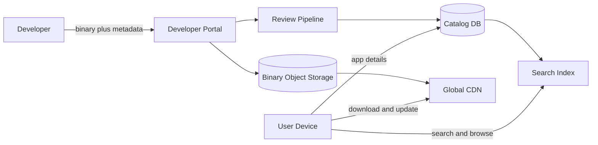

**Why app stores matter**

- They are the single distribution chokepoint for entire ecosystems; availability and integrity failures affect billions of devices at once.
- They concentrate a rare mix of problems: extreme read scale, petabyte-class bandwidth, content-addressed storage, search relevance, a human-in-the-loop trust pipeline, and rollout safety engineering.
- They are a strong interview topic because every shortcut (serving binaries from origin servers, synchronous review, 0-to-100 rollouts, exact download counters) produces a visible, catastrophic failure mode.

**Real-life use cases**

- **Consumer mobile stores**: Google Play, Apple App Store — phones discover, install, and auto-update apps.
- **Game stores**: Steam, console stores — 50–150 GB titles with patch diffs and pre-loads.
- **Enterprise private stores**: MDM-distributed internal apps with no public listing.
- **Extension/plugin marketplaces**: VS Code, JetBrains, browser extension stores — same pipeline, smaller artifacts.

---

### Functional Requirements

1. **Developer onboarding and app registration.** Verified developer accounts; each app gets a globally unique package name (e.g., `com.example.app`) that can never be reused, even after deletion.
2. **Binary upload.** Resumable, chunked upload of large artifacts (APK/AAB/IPA, up to several GB); integrity verified by SHA-256; multiple device-targeted variants per release (ABI, OS level, screen density).
3. **Metadata management.** Title, short/full description, screenshots, icons, category, content rating, pricing, per-locale translations, privacy declarations.
4. **Submission and review pipeline.** Every release passes automated checks (manifest validation, malware scan, API-usage policy) and human review through an explicit state machine: `DRAFT → SUBMITTED → IN_REVIEW → APPROVED/REJECTED → PUBLISHED`, with `HALTED` and `REMOVED` as post-publish states.
5. **Publishing and staged rollout.** Developer chooses a release percentage (1% → 10% → 50% → 100%), can halt or roll back, and targets device/locale/country segments.
6. **Search and browse.** Keyword search over title/description/developer, category browsing, filtering, and ranked results with typo tolerance.
7. **App details page.** Full metadata, screenshots, ratings histogram, current version, download count badge.
8. **Download and install.** Device requests a download, entitlement is checked, and the correct variant binary is served from the nearest CDN edge; resumable via HTTP range requests.
9. **Updates and delta updates.** Devices check for updates; eligible devices (per rollout percentage) receive either a full binary or a binary diff patch against their installed version.
10. **Ratings and reviews.** Users rate 1–5 and write reviews; developers can reply; abuse moderation.
11. **Download counts and charts.** Per-app download counters and top charts (top free / top paid / top grossing / trending) per category and country, refreshed near-real-time.
12. **Developer analytics.** Installs, uninstalls, crashes, revenue — per version, country, device.

---

### Non-Functional Requirements

| Requirement | Target | Rationale |
|-------------|--------|-----------|
| Read availability | 99.99% for catalog/search/download redirect | The store is the only way to get apps; downtime blocks device setup worldwide |
| Write availability | 99.9% for submission pipeline | Developer-facing; a delayed submission is annoying, not existential |
| Search latency | p50 < 150 ms, p99 < 500 ms | Search is the primary discovery path |
| App page latency | p99 < 200 ms (cache-served) | High-traffic read, aggressively cacheable |
| Download start | < 1 s to first byte from edge | Users abandon slow installs |
| Update propagation | 95% of targeted devices reachable < 24 h | Security patches must land fast |
| Consistency | Strong for entitlement/purchase and review state; eventual (seconds) for catalog reads, counters, charts | Buying and publishing must not be ambiguous; a search result 5 s stale is fine |
| Durability | Binaries RPO = 0 (object storage, 11-nines class) | A lost binary of a paid app is unrecoverable data loss |
| Security | Signed artifacts, malware scanning, TLS everywhere, HSM-held signing keys | The store is a malware distribution vector if compromised |
| Integrity | Every byte served verifiable against the reviewed artifact hash | Bits on the wire must be exactly the bits that were reviewed |

**Interview note:** explicitly state the priority order — integrity and trust > read availability > bandwidth efficiency > write availability. A store that is briefly read-only is a bad day; a store that ships malware or an unreviewed binary is an ecosystem-level incident.

---

### Capacity Estimation (back-of-envelope)

Assumptions: 3M published apps, 2M developers, 1.5B active devices, 100M downloads/installs per day, average binary 60 MB, 5 searches or browses per download, 20K new submissions/updates per day.

**1. Download TPS and egress bandwidth**

```
Downloads/day      = 100M
Average TPS        = 100M / 86,400          ≈ 1,200 downloads/s
Peak TPS           = 10× average (launches, holidays) ≈ 12,000/s
Average egress     = 1,200 × 60 MB          ≈ 72 GB/s  ≈ 576 Gbps
Peak egress        ≈ 720 GB/s ≈ 5.7 Tbps
Daily egress       = 100M × 60 MB           = 6 PB/day
```

This is the defining number of the whole design: **multi-terabit sustained egress**. No server fleet you own can or should carry this — it forces CDN offload with 90%+ edge cache hit ratio, which is why binaries are immutable and content-addressed (immutable content caches perfectly).

**2. Search and browse QPS**

```
Searches+browses/day = 5 × 100M = 500M/day
Average QPS          ≈ 5,800
Peak QPS             ≈ 58,000
```

App-detail reads are another 2–3× on top. All of this is served from read replicas, search clusters, and edge caches — the primary metadata DB sees almost no read traffic.

**3. Binary storage**

```
3M apps × 3 retained versions × 60 MB        ≈ 540 TB
Device variants (×2: splits, patches)        ≈ 1.1 PB total
Screenshots/icons/previews                   ≈ +20%   ≈ 1.3 PB
```

Petabyte-scale but cold-to-warm; object storage (S3-class) with lifecycle policies handles it. Metadata is trivial by comparison: 3M apps × 20 KB ≈ 60 GB.

**4. Submission pipeline throughput**

```
Submissions/day    = 20K
Automated scan     ≈ 3–10 min per binary
Scan fleet         = 20K × 6 min / 1,440 min ≈ 85 concurrent scanners (×3 for safety/peak)
```

Small compute footprint, but latency-critical for developer experience: automated results should return in under 30 minutes.

**5. Download events and charts**

```
Download events/day  = 100M (+ update checks ≈ 10× → 1B/day)
Event size           ≈ 300 bytes → 300 GB/day raw
```

Update checks (1.5B devices × ~daily) dwarf downloads: ~17,000 QPS average, 170,000 peak — must be a cheap, cacheable "what version should you run" endpoint.

**Summary table**

| Metric | Value |
|--------|-------|
| Peak download TPS | ~12,000 |
| Peak binary egress | ~5.7 Tbps (6 PB/day) |
| Peak search/browse QPS | ~60,000 |
| Peak update-check QPS | ~170,000 |
| Binary storage | ~1.3 PB |
| Submissions | ~20,000/day |

---

### Characteristics

Each characteristic: what it means, why it matters, and a practical example.

- **Extreme read/write asymmetry**
  Reads (search, details, update checks, downloads) outnumber writes (submissions, metadata edits) by roughly a million to one. *Example:* 20K submissions/day against 500M searches/day — the entire read path is optimized for caching and denormalization, while the write path is a modest pipeline.

- **Immutable, content-addressed artifacts**
  A binary, once uploaded and reviewed, never changes; a fix is a new version with a new hash. Artifacts are keyed by SHA-256. *Example:* the CDN cache key is the content hash, so cache poisoning by a developer edit is structurally impossible.

- **Massive bandwidth, tiny messages**
  Control traffic (search, metadata) is kilobyte JSON; data traffic is megabyte-to-gigabyte binaries. The two planes scale completely differently and are separated: metadata services vs. CDN. *Example:* a search cluster serves 60K QPS of 10 KB responses; a CDN serves 12K downloads/s of 60 MB objects.

- **Human-in-the-loop trust pipeline**
  Automated checks catch most problems, but policy judgment needs humans; the pipeline must model queueing, SLAs, and audit of reviewer decisions. *Example:* a reviewer decision is an audited state transition, not a Slack message.

- **Gradual consistency is a feature**
  Catalog and search may lag submission by seconds; rollout percentages make version distribution *deliberately* inconsistent across devices. *Example:* during a 10% rollout, 90% of devices correctly see the old version as "current."

- **Device heterogeneity**
  One release fans out to many artifacts: ABI (arm64, x86), OS API level, screen density, locale packs, feature splits. *Example:* an Android App Bundle explodes into dozens of per-device APK splits at processing time.

- **Abuse pressure**
  Malware, cloned apps, fake reviews, download-count manipulation, and rating-bombing are constant. *Example:* download counters and charts must be robust to bot inflation or the ranking system itself becomes the attack target.

- **Launch spikiness**
  A hit game launch or OS-release day produces 10–50× normal traffic on specific objects. *Example:* pre-positioning (pushing the binary to edges before launch time) turns a thundering-herd origin collapse into cache hits.

---

### Components

A production app store consists of these components, with purpose, responsibilities, mechanics, relationships, and a real-world example.

- **API gateway**
  *Purpose:* single entry point for developer and device traffic. *Responsibilities:* TLS termination, auth (OAuth2 for developers, device attestation for devices), rate limiting, routing, request signing. *Example:* throttles metadata scrapers to protect the catalog while leaving download redirects untouched.

- **Developer portal service**
  *Purpose:* the developer-facing write API. *Responsibilities:* app registration, package-name uniqueness, metadata CRUD, pricing, locale management. *Relationship:* owns the metadata DB writes; publishes change events that the search indexer and storefront cache consume.

- **Upload service**
  *Purpose:* get multi-GB binaries in reliably. *Responsibilities:* initiate multipart uploads, issue pre-signed part URLs, complete and verify SHA-256, register the artifact. *How it works:* S3-style multipart — the service never proxies bytes; parts flow directly from developer to object storage. *Example:* a 4 GB game build uploads as 1,000 × 4 MB parts, individually retried.

- **Artifact/object storage**
  *Purpose:* durable binary store. *Responsibilities:* store content-addressed artifacts (key = SHA-256), retain N versions, lifecycle-archive old ones. *Relationship:* origin for the CDN; source for the processing pipeline. *Example:* S3/GCS with cross-region replication and object-lock immutability for reviewed artifacts.

- **Build processing service**
  *Purpose:* turn an upload into servable artifacts. *Responsibilities:* unpack and validate manifests, generate device-targeted variants/splits, extract assets for the storefront, re-sign with the store's key, generate delta patches against previous versions. *How it works:* an event-driven worker fleet consuming `release.submitted` events. *Example:* Google Play's App Bundle → per-device APK splits generation.

- **Malware/policy scanner**
  *Purpose:* automated trust gate. *Responsibilities:* static analysis, dynamic/sandbox behavioral analysis, known-signature matching, permission-policy checks. *Relationship:* gates the `SUBMITTED → IN_REVIEW` transition; a fail short-circuits to `REJECTED`. *Example:* Google Play Protect server-side scanning.

- **Review pipeline service**
  *Purpose:* own the release state machine. *Responsibilities:* enforce legal transitions, route human review tasks, record audited decisions, trigger publication. *How it works:* a workflow engine (or a disciplined DB state machine) with a task queue per review lane (new app, update, appeal). *Relationship:* on approval, commands the distribution service to activate the release.

- **Catalog/metadata service and DB**
  *Purpose:* system of record for listings. *Responsibilities:* store apps, releases, localized metadata, pricing; serve storefront reads via replicas and caches. *Example:* a relational primary (submission integrity) fronted by a read-through cache and read replicas.

- **Search service**
  *Purpose:* discovery. *Responsibilities:* inverted index over title/description/developer/category, typo tolerance, ranking (relevance + quality signals), autocomplete. *How it works:* Elasticsearch/OpenSearch cluster fed by a denormalizing indexer that consumes metadata change events. *Relationship:* never queried by the write path; a search outage degrades discovery, not downloads.

- **Distribution/rollout service**
  *Purpose:* decide which version each device gets. *Responsibilities:* maintain rollout percentage per release, bucket devices deterministically, halt/rollback on guardrail breach, resolve device targeting rules. *Example:* the "update available?" endpoint that 1.5B devices call daily.

- **CDN and edge layer**
  *Purpose:* absorb the petabytes. *Responsibilities:* cache immutable binaries at edge PoPs, serve range requests for resume, honor signed URLs, shield the origin. *Relationship:* pulls from object storage on miss; achieves 90%+ hit ratio because artifacts are immutable. *Example:* Cloudflare/Akamai/CloudFront in front of S3 — or a self-built edge like Apple's.

- **Entitlement service**
  *Purpose:* who may download what. *Responsibilities:* purchases, licenses, family sharing, regional availability, enterprise assignments. *How it works:* strongly consistent check at download-redirect time; issues short-lived signed download URLs. *Example:* a paid app download returns 302 to a signed URL only after a purchase record exists.

- **Download counter/analytics pipeline**
  *Purpose:* measure everything without slowing anything. *Responsibilities:* ingest download/install/update events (billions/day), aggregate per-app counters, feed charts and developer analytics. *How it works:* Kafka → stream processor → sharded counters (Redis) + columnar warehouse. *Relationship:* pure consumer; analytics lag never touches the serving path.

- **Charts service**
  *Purpose:* top charts per category/country. *Responsibilities:* compute top-k over sliding windows (velocity-weighted), refresh every few minutes, serve precomputed lists. *Example:* "Top Free in Games, US" is a precomputed document, not a live query.

- **Ratings and reviews service**
  *Purpose:* social proof and feedback. *Responsibilities:* review CRUD with abuse filtering, rating histogram maintenance, developer replies. *Note:* rating averages are precomputed incrementally; recomputing from all reviews per read is impossible at scale.

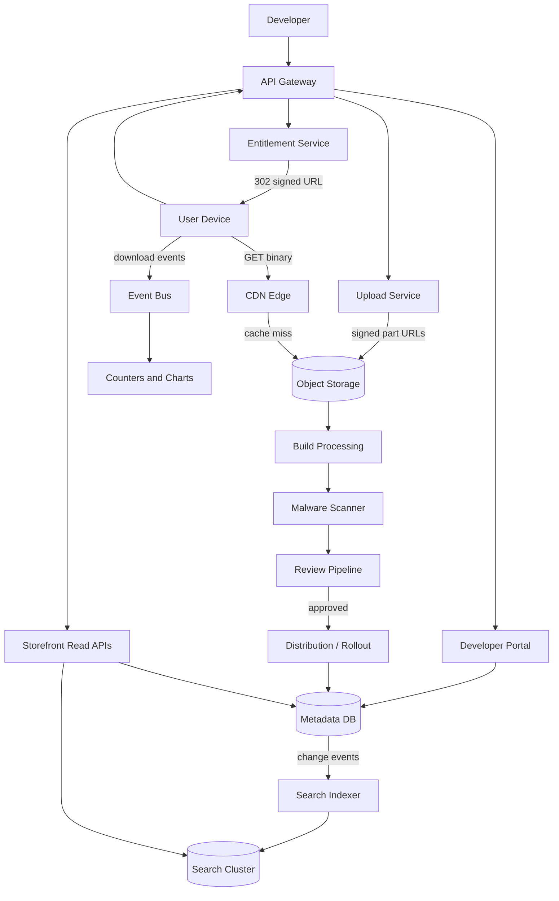

---

### App Store Design Patterns

Each pattern: what it is, the problem it solves, how it works, when to use or avoid it, trade-offs, and a real-world example.

- **Content-addressed immutable artifacts**
  *What:* every binary is stored and referenced by its SHA-256 hash; nothing is ever overwritten. *Problem solved:* if content could mutate under a stable URL, caches serve stale or attacker-swapped bits and the review result no longer applies to what users receive. *How:* upload → hash → store under the hash → all metadata points at the hash. *When to use:* always, for reviewed/verified content. *Advantages:* perfect cacheability, free dedup (identical splits share storage), integrity verifiable end-to-end. *Disadvantages:* any change is a new object — storage grows with versions. *Example:* Git, Docker registries, and every major app store key artifacts by digest.

- **CDN offload with signed URLs**
  *What:* the entitlement service authorizes once and hands the device a short-lived signed edge URL; bytes flow device ↔ CDN, never through your servers. *Problem solved:* 5.7 Tbps of peak egress cannot and should not transit application infrastructure. *How:* `POST /download` → entitlement check → 302 to `https://edge…/ab cd…?sig=…&exp=…` → device uses range requests for resume. *When to use:* any large-object distribution. *When not to use:* tiny dynamic payloads where CDN overhead exceeds origin cost. *Advantages:* near-infinite bandwidth, latency near the user, origin shielded. *Disadvantages:* cache invalidation must be designed around (immutable content makes this easy); per-edge costs at low hit ratios. *Example:* Steam's content servers and Apple/Google's edge caches.

- **Explicit state machine for the review pipeline**
  *What:* release lifecycle modeled as states and guarded transitions: `DRAFT → SUBMITTED → IN_REVIEW → APPROVED/REJECTED → PUBLISHED`, plus `HALTED`, `REMOVED`. *Problem solved:* without a machine-checked model, releases end up in impossible states ("published but also rejected") under retries, concurrent reviewer actions, and partial failures. *How:* transitions validated in one DB transaction with an audit row per transition; events emitted to drive downstream work. *Advantages:* auditable, testable, safe under concurrency. *Disadvantages:* new process steps require schema/state evolution. *Example:* every submission pipeline (app stores, Chrome Web Store, VS Code Marketplace) is a state machine whether or not it admits it.

- **Staged/percentage rollout with deterministic bucketing**
  *What:* a release activates for X% of devices, ramped up over days, haltable at any point. *Problem solved:* a bad release to 100% of users is an ecosystem incident; to 1% it is a bug report. *How:* `bucket = floorMod(hash(deviceId + releaseId), 100)`; device is eligible if `bucket < percentage`. Same device+release always lands in the same bucket (stable), different releases re-hash (no permanently unlucky users). *Advantages:* kills the blast radius of defects; enables canary analysis on real crash data. *Disadvantages:* slow propagation for urgent fixes (needs an expedited channel); metrics interpretation requires cohort discipline. *Example:* Google Play staged rollout; Chrome/Windows feature rollouts.

- **Delta (binary diff) update delivery**
  *What:* ship only the byte-level difference between installed version N and target N+1. *Problem solved:* a 2 GB game patched weekly is unservable at full size; diffs cut update bytes 60–90%. *How:* at processing time, compute patches for the top-N installed prior versions using a binary diff (bsdiff/zstd-delta); devices fetch patch-or-full based on their installed version; the patched result is hash-verified before install. *Advantages:* massive egress and user-data savings. *Disadvantages:* patch matrix grows combinatorially (keep top-N only); a failed patch must fall back to full download. *Example:* Google Play's bsdiff-based app updates; Chrome's Courgette diffs.

- **Sharded counters for download counts**
  *What:* each app's counter is split into K shards; increments go to a random shard; reads sum shards. *Problem solved:* one hot counter row/key per popular app serializes increments and melts at launch traffic. *How:* `INCR downloads:{appId}:{randomShard}`; read = `SUM` of K keys; periodic rollup to the durable DB. *Advantages:* write throughput scales with K; approximate accuracy is acceptable (badges show "10M+", not 10,421,337). *Disadvantages:* reads cost K lookups; totals are eventually consistent with the DB. *Example:* the classic Redis sharded-counter pattern used for likes/views/downloads at scale.

- **Precomputed top-k (charts)**
  *What:* charts are materialized lists refreshed on a schedule, not queries. *Problem solved:* "top 100 by installs in last 24 h per category per country" cannot be computed live per request. *How:* stream processor maintains windowed aggregates; a ranker emits top-k snapshots every few minutes to a KV store. *Advantages:* O(1) chart reads. *Disadvantages:* charts lag minutes; spam filtering must happen before ranking. *Example:* every leaderboard/chart system at scale.

- **CQRS-flavored read/write split**
  *What:* the submission write model (normalized, transactional) is separate from the storefront read model (denormalized documents in cache + search). *Problem solved:* the read shape (one document with metadata + rating + current version + badges) does not match the write shape (apps, releases, locales, pricing tables), and read scale dwarfs write scale by ~10⁶. *How:* writes commit to the metadata DB; change events (outbox) feed an indexer that rebuilds denormalized read documents. *Advantages:* each side scales and evolves independently. *Disadvantages:* read staleness windows; indexer lag is an operational metric. *Example:* standard marketplace architecture (app stores, e-commerce catalogs).

- **Transactional outbox for pipeline events**
  *What:* state transitions and their events (`release.submitted`, `release.published`) commit in one DB transaction; a relay publishes to the bus. *Problem solved:* committing "release = SUBMITTED" and separately telling the scanner is a dual-write — a crash between them strands the release silently. *Advantages:* no lost or phantom pipeline triggers. *Disadvantages:* relay infrastructure. *Example:* the event that starts malware scanning is written in the same transaction as the status change.

---

### Benefits

- **Planetary bandwidth without planetary servers.** CDN offload plus immutable content turns the hardest scaling axis (petabyte egress) into a cache-hit-ratio problem, which is a solved one.
- **Trust enforced structurally, not socially.** Content addressing means "the reviewed bytes" and "the served bytes" are provably identical; the state machine means nothing ships without passing the gates; signing means devices verify independently of the store.
- **Defects have small blast radii by default.** Staged rollouts make "ship a broken update to everyone at once" require deliberately ignoring guardrails — the safe path is the easy path.
- **Read path scales trivially.** Denormalized storefront documents, precomputed charts, and search replicas make the million-to-one read ratio cheap; write complexity is confined to the small submission pipeline.
- **Developer velocity with safety.** Resumable uploads, automated checks in minutes, explicit review states, and percentage ramps give developers fast, predictable releases — the ecosystem's supply side stays healthy.

---

### Pros

- **Immutable artifacts simplify everything downstream.** Caching, dedup, integrity verification, rollback (point at the previous hash), and audit all fall out of content addressing.
- **Clean control/data plane separation.** Metadata QPS and binary bandwidth scale independently; a search outage never blocks downloads, a download storm never slows submissions.
- **State machine makes the trust pipeline auditable.** Every release's full history — who/what/when/why per transition — answers regulators, developers, and incident reviews.
- **Gradual rollouts double as telemetry.** The 1% cohort is a canary producing real crash/ANR signals before wide exposure.
- **Delta updates compound savings.** At 6 PB/day baseline, a 70% reduction on update traffic is multiple petabytes of daily egress avoided.

---

### Cons

- **Operational surface area is enormous.** CDN config, signing key custody, scanner efficacy, review staffing, chart abuse, rollout guardrails — each is a full-time system with its own failure modes.
- **Variant explosion.** Per-device splits multiply artifact count and processing cost; targeting-rule bugs deliver broken builds to specific device classes (the hardest bugs to reproduce).
- **Eventual-consistency UX gaps.** A developer publishes and the app isn't searchable for 30 s; a counter lags; a halted rollout takes minutes to propagate to edges — each needs product-level explanation.
- **Review pipeline is a human dependency.** SLAs depend on staffing and judgment; inconsistency between reviewers is a permanent developer-relations problem, not a bug you fix.
- **Storage grows monotonically.** Immutable artifacts + retained versions + patches = petabytes that need lifecycle discipline from day one.
- **Abuse is an arms race.** Fake reviews, install bots, cloned apps, and policy evasion adapt continuously; ranking and trust systems need permanent investment.

---

### Challenges

- **Technical: correct artifact targeting.** Serving the arm64 variant to an x86 device (or wrong API level) bricks the install. Targeting rules must be evaluated server-side against a device capability model, never inferred client-side, and covered by device-matrix integration tests.
- **Scalability: launch-day spikes.** A hit title can pull 50× normal egress on one object within minutes. Mitigations: scheduled-launch pre-positioning to edges, origin shielding, and request coalescing (edge fetches origin once for N waiting clients).
- **Performance: search relevance at p99 < 500 ms.** Ranking blends text relevance with quality signals (ratings, install velocity, retention) without blowing latency: signals are precomputed into the indexed document — no joins at query time.
- **Reliability: resumable downloads over hostile networks.** Devices on flaky mobile networks must resume multi-GB downloads: HTTP range requests, per-chunk hash verification, and a client that treats the manifest as the resume state. A download that restarts from zero on failure is a support ticket generator.
- **Maintainability: state machine and schema evolution.** Adding a state (e.g., `SUSPENDED_PENDING_APPEAL`) or targeting dimension must not strand in-flight releases; migrations are additive and old states map forward.
- **Operational: review SLA and consistency.** 20K submissions/day need triage routing (new apps vs. updates vs. appeals), calibrated reviewers, and escalation lanes; the metrics that matter are time-to-first-decision and overturn rate, not just throughput.
- **Security: signing-key custody and supply chain.** The store's signing keys are among the most valuable secrets in the ecosystem — HSM-held, access-audited, with a rehearsed key-rotation story. Malware scanning faces adversarial, evolving binaries (staged payloads, time bombs) — scanning is layered (static + dynamic + on-device + post-publish telemetry), never one-shot.
- **Integrity: counter/chart manipulation.** Install bots inflate charts, which drives organic installs — a self-funding attack. Requires device attestation, anomaly detection on install patterns, and chart damping (velocity smoothing) so bought installs don't convert to ranking.

---

### Best Practices

- **Make artifacts immutable and content-addressed from day one.** *Why:* every caching, integrity, and audit property you will ever want follows from "the hash names the bytes." Retrofitting immutability onto a mutable store means re-laying the foundation under live traffic.
- **Separate the control plane from the data plane.** *Why:* metadata (KB, cacheable, transactional) and binaries (GB, immutable, streamed) have nothing in common operationally; mixing them couples their failures and their scaling bills. *Example:* download authorization is a 302, not a proxy stream.
- **Model the review pipeline as an explicit, audited state machine in the database.** *Why:* implicit state spread across flags and timestamps produces impossible states under concurrency and gives you no audit trail when a developer disputes a rejection. One guarded transition function + an append-only transition log.
- **Never roll out to 100% in one step.** *Why:* every release is a hypothesis; the 1% cohort tests it on real devices. Guardrail metrics (crash-free sessions, ANR rate) should auto-halt — humans are too slow at 3 a.m.
- **Precompute everything the read path needs.** *Why:* at 10⁶:1 read/write ratio, any per-read computation (rating averages, charts, ranking signals, download badges) is a latency and cost bug. Denormalize into read documents; recompute incrementally on events.
- **Use deterministic bucketing for rollouts.** *Why:* `hash(deviceId, releaseId)` keeps a device stable within a release (no flapping between versions) but reshuffles across releases (no permanent unlucky cohort); random-per-request bucketing both flaps and breaks cohort analytics.
- **Design for resume and partial failure on every large transfer.** *Why:* mobile networks fail constantly; multipart upload parts and HTTP range downloads make failure cheap instead of starting over. *Example:* S3 multipart semantics both directions.
- **Keep paid/entitlement checks strongly consistent and everything else eventually consistent.** *Why:* the one thing that must never be ambiguous is whether money bought access; everything else (search visibility, counters, charts) tolerates seconds of lag. Spending strong consistency where it isn't needed taxes the whole system.
- **Verify hashes at every boundary.** *Why:* the review verdict applies to specific bytes; verify SHA-256 on upload completion, after variant generation, after patch application on-device. Each unchecked hop is a substitution opportunity.
- **Rate-limit and attest devices on the events path.** *Why:* download counts and charts are money (ranking → organic installs); unattested event streams get farmed. App attestation (Play Integrity / App Attest) plus per-device rate limits raise the cost of manipulation above its payoff.

---

### When to Use / When Not to Use

**Use this architecture (artifact pipeline + review state machine + CDN distribution + staged rollouts) when:**

- You distribute binaries or large content to many endpoints and integrity matters (app stores, game launchers, OTA firmware, plugin marketplaces).
- A human/automated trust gate must stand between submission and publication.
- Egress bandwidth is measured in petabytes and latency must be global.
- Defects reaching users are expensive, so gradual exposure is required.

**Consider alternatives when:**

- **Internal enterprise apps to a few thousand devices:** a simple MDM or even signed-URL object storage with a manifest file covers it; a review pipeline and charts are ceremony without payoff.
- **Web-deliverable functionality:** a PWA eliminates the binary pipeline entirely — no review, no variants, instant "rollout" by deploying. Choose it when platform capabilities allow.
- **Small plugin ecosystems:** a Git-repository-backed registry (like npm's early days) trades the trust pipeline for developer velocity — acceptable when plugins are low-privilege.
- **Fully trusted content** (your own first-party apps): the scanner/review lanes collapse to CI/CD; keep artifact immutability, CDN, and staged rollout — drop the two-sided marketplace machinery.

**Decision factors:** number and trust level of publishers, number of devices, regulatory exposure (payment/content laws), artifact size × update frequency (drives delta-delivery ROI), and whether discovery (search/charts) is part of the product. The senior interview answer recognizes that an app store is a *marketplace governance system* as much as a download service.

---

### Use Cases

**Use case 1: Consumer mobile app store (Google Play-style)**

- *Problem:* 3M apps from 2M developers to 1.5B devices; malware pressure; launch spikes; carrier-sensitive user data plans.
- *Proposed solution:* the full design — multipart upload, bundle processing into per-device splits, automated + human review, CDN distribution with signed URLs, delta updates, staged rollouts with crash guardrails.
- *Suitability:* this is the reference case the design targets.
- *How it works:* developer uploads a bundle → variants generated and scanned → review → 1% rollout → guardrails clean → ramp to 100% → devices update via patches.
- *Trade-offs:* variant processing adds minutes to every release; delta patch matrix capped at top-N prior versions, so long-tail versions get full downloads.

**Use case 2: Enterprise private app store (MDM-distributed)**

- *Problem:* a company must push internal apps to 50K employee devices; no public listing; strict confidentiality; mandated version floors (security).
- *Proposed solution:* the artifact + CDN + rollout core with the marketplace parts removed — no search/charts; entitlement = device enrollment; forced-update channel (minimum version enforcement).
- *Suitability:* strong fit; integrity and rollout machinery still earn their keep at small scale.
- *Trade-offs:* loses economies of scale on CDN (lower hit ratios); review pipeline becomes a lightweight approval workflow, not a staffing problem.

**Use case 3: AAA game store with huge assets**

- *Problem:* titles are 50–150 GB, patch weekly, launch to millions of day-one players; pre-loads must decrypt only at release time.
- *Proposed solution:* chunked content-addressed storage (per-chunk hashes, dedup across versions), scheduled pre-positioning to edges, encrypted pre-load with key release at launch, per-chunk delta patches.
- *Suitability:* the design generalizes by moving the unit of immutability from "file" to "chunk."
- *Trade-offs:* chunk-level storage adds manifest complexity; day-one decrypt keys are a high-value secret needing HSM ceremony; launch spikes need explicit edge capacity reservations.

**Use case 4: IDE extension marketplace (VS Code-style)**

- *Problem:* 100K small extensions, updates daily, installs in milliseconds; namespace squatting and typosquatting are the main abuse vectors.
- *Proposed solution:* same pipeline at small scale — artifacts are MB-class so delta updates are unnecessary; review is mostly automated with human spot-checks; publisher verification replaces deep review.
- *Suitability:* right-sizing: keep the state machine, signing, and counters; drop variants and delta delivery.
- *Trade-offs:* lighter review accepts more risk — mitigated by sandboxed extension permissions and fast takedown (`REMOVED` propagates to edges in minutes via cache purge).

---

### Data Model and APIAPI Design

Base path: `/api/v1`. Developer endpoints require `Authorization: Bearer <OAuth2 token>` scoped to the developer account; device endpoints require device attestation tokens. Mutations accept `Idempotency-Key`. Versioning via path (`/v1`); binary bytes never traverse these APIs — only manifests, metadata, and signed URLs.

**1. Create an app listing**

```
POST /api/v1/apps
{ "packageName": "com.example.todo", "defaultLocale": "en-US",
  "title": "Todo Pro", "category": "PRODUCTIVITY" }
→ 201 Created
{ "appId": "app_91f2", "packageName": "com.example.todo", "status": "ACTIVE" }
```

Validation: `packageName` matches reverse-domain format and is globally unique (409 on conflict, including names of deleted apps); category from the allowed enum.

**2. Create a draft release and initiate upload**

```
POST /api/v1/apps/app_91f2/releases
Idempotency-Key: 0f3a…
{ "versionName": "2.1.0", "versionCode": 210 }
→ 201 Created
{ "releaseId": "rel_77ab", "status": "DRAFT" }

POST /api/v1/apps/app_91f2/releases/rel_77ab/uploads
{ "fileName": "todo-2.1.0.aab", "sizeBytes": 4289372160, "sha256": "9c1e…", "partSizeBytes": 8388608 }
→ 201 Created
{ "uploadId": "upl_55de", "partUrls": ["https://uploads…/part/1?sig=…", "…"], "expiresAt": "…" }
```

`versionCode` must be strictly greater than any previous release for the app (server-enforced — devices compare it to decide updates). Upload completion: `POST …/uploads/upl_55de:complete` with part ETags; server verifies SHA-256 of the assembled object before registering the artifact (422 `HASH_MISMATCH` otherwise).

**3. Submit for review**

```
POST /api/v1/apps/app_91f2/releases/rel_77ab/submit
Idempotency-Key: 7b2c…
→ 202 Accepted
{ "releaseId": "rel_77ab", "status": "SUBMITTED", "estimatedDecisionBy": "2026-04-27T10:00:00Z" }
```

202 because review is asynchronous; status moves `SUBMITTED → IN_REVIEW → APPROVED/REJECTED`. Poll `GET …/releases/rel_77ab` or subscribe to the developer webhook.

**4. Publish with a staged rollout**

```
POST /api/v1/apps/app_91f2/releases/rel_77ab/rollout
Idempotency-Key: 51aa…
{ "percentage": 10 }
→ 200 OK
{ "rolloutId": "rol_10cc", "releaseId": "rel_77ab", "percentage": 10, "status": "ACTIVE" }
```

Requires status `APPROVED` (409 `INVALID_STATE` otherwise — first publish transitions to `PUBLISHED`). Percentage increases are monotonic within a rollout; `DELETE …/rollout` halts (state `HALTED`); halt + point the previous release at 100% = rollback.

**5. Storefront search (device-facing, paginated/filterable/sortable)**

```
GET /api/v1/storefront/search?q=todo%20list&category=PRODUCTIVITY&minRating=4.0
    &sort=-installs&limit=25&cursor=eyJzY29yZSI6MS4yM30
→ 200 OK
{
  "items": [ { "appId": "app_91f2", "title": "Todo Pro", "iconUrl": "https://cdn…/icon.png",
               "rating": 4.6, "ratingCount": 18233, "installBadge": "1M+", "price": "0.00" } ],
  "nextCursor": "eyJzY29yZSI6MC45N30",
  "limit": 25
}
```

Cursor pagination (offset is unstable under a constantly re-ranked index). Sorts: `relevance` (default), `-installs`, `-rating`, `-updatedAt`. Filters: category, price, rating, OS compatibility. The response is edge-cacheable per query hash for a few seconds.

**6. App details**

```
GET /api/v1/storefront/apps/app_91f2?device=arm64-v8a:api34&country=US
→ 200 OK
{ "appId": "app_91f2", "title": "Todo Pro", "version": "2.1.0", "versionCode": 210,
  "sizeBytes": 38400000, "rating": 4.6, "installBadge": "1M+",
  "screenshotUrls": ["…"], "whatsNew": "Widgets!", "updatedAt": "…" }
```

The `device` parameter resolves the correct variant (size shown is the variant's); if a rollout targets this device at the old version, `version` reflects *what this device should install*, not the latest published.

**7. Request download**

```
POST /api/v1/storefront/apps/app_91f2/download
{ "deviceId": "dvc_8811", "installedVersionCode": 200 }
→ 302 Found
Location: https://edge-42.cdn.example.com/ab/cd/abcdef…?sig=…&exp=1714152000
X-Delivery-Type: DELTA
X-Expected-Sha256: 9c1e…
```

Entitlement checked (402/403 for unpaid paid apps); `DELTA` when a patch from `installedVersionCode` exists, else `FULL`. The device verifies `X-Expected-Sha256` after download/patch before install.

**8. Record install event**

```
POST /api/v1/events/installs
Idempotency-Key: c41d…
{ "appId": "app_91f2", "releaseId": "rel_77ab", "deviceId": "dvc_8811", "result": "SUCCESS" }
→ 202 Accepted
```

Fire-and-forget analytics ingestion; deduplicated by idempotency key; unattested/rate-limited devices are accepted but excluded from chart computation.

**Status codes and error responses**

| Code | Meaning |
|------|---------|
| 200/201/202 | Success / created / accepted (async: submit, events) |
| 302 | Download redirect to signed CDN URL |
| 400 | Validation failure — `{ "error": "VALIDATION_FAILED", "details": [{ "field": "packageName", "message": "invalid reverse-domain format" }] }` |
| 401/403 | Unauthenticated / not the app owner / entitlement missing |
| 404 | App, release, or rollout not found |
| 409 | Idempotency-Key reused with different payload; duplicate package name; invalid state transition (`INVALID_STATE`) |
| 422 | Business rule violation — `HASH_MISMATCH`, `VERSION_CODE_NOT_INCREASING`, `METADATA_POLICY_VIOLATION` |
| 429 | Rate limited; `Retry-After` header |
| 503 | Storefront degraded; download redirects may still work (CDN is independent) |

Rate limiting: developers — 100 metadata writes/hour, 10 submissions/day; devices — 60 metadata reads/minute, 10 download requests/minute, events 600/minute; search per-IP limits with scraper detection. Idempotency records retained 7 days on mutations.

---

#### Data Modeling

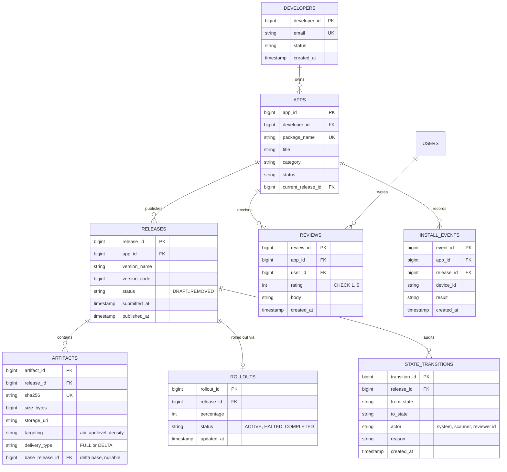

**Design notes**

- **PKs/FKs and constraints:** `APPS.package_name` unique forever (names of deleted apps stay reserved — package identity is security-critical). `RELEASES(app_id, version_code)` has a unique constraint enforcing monotonic version codes per app. `REVIEWS.rating` has `CHECK (rating BETWEEN 1 AND 5)`. `ARTIFACTS.sha256` unique — dedup of identical variants falls out of content addressing. `ROLLOUTS.release_id` unique (`||--o|`) — one active rollout per release.
- **Indexes:** `RELEASES(app_id, status)` for developer dashboards; `INSTALL_EVENTS(app_id, created_at)` for analytics; `REVIEWS(app_id, created_at DESC)` for review listing; `APPS(category, status)` backing browse. The hot "what version for this device" lookup hits `APPS.current_release_id` + `ROLLOUTS` — both single-row lookups.
- **Normalization vs denormalization:** the write model is normalized (apps/releases/locales/pricing separate). The storefront read document is a deliberate, defended denormalization — one JSON document per app per locale containing metadata, rating histogram, install badge, and current version, rebuilt by the indexer from change events. Rating averages live on the read document and as a maintained aggregate, never computed per read.
- **Append-only audit:** `STATE_TRANSITIONS` is insert-only (no UPDATE/DELETE grants); the release's `status` column is a cache of the latest transition, updated in the same transaction that appends the transition row.
- **Partitioning:** `INSTALL_EVENTS` (billions of rows) is range-partitioned by day and is arguably not relational at all — it lands in Kafka → columnar storage; the relational table shown is the modest "recent events" window. `ARTIFACTS` rows are metadata; bytes live in object storage referenced by `storage_uri`.
- **Immutability enforcement:** artifacts and published release rows are never updated in place; corrections are new artifacts/releases. The DB role has no UPDATE on `ARTIFACTS` after the release reaches `PUBLISHED` (enforced by trigger/permission).

---

### High-Level Design

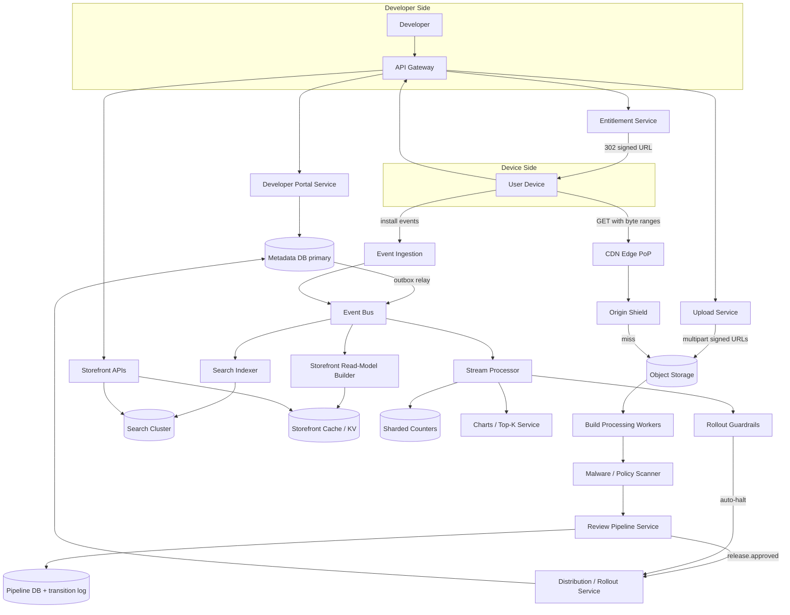

**Submission-to-publish flow:**

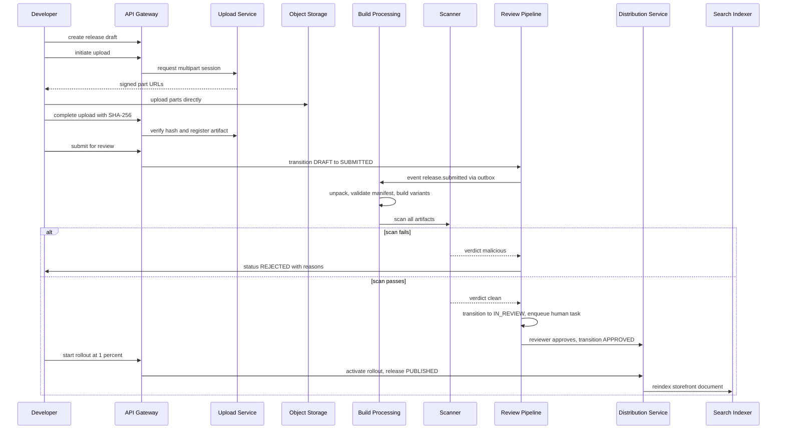

Explanation: the developer never uploads through application servers (signed URLs straight to object storage), the hash is verified before the artifact is registered (the review verdict will be bound to exactly these bytes), every state change is a guarded DB transition with an audit row, and all downstream work (processing, scanning, indexing) is triggered via outbox-backed events so a crash can never strand a release silently. Human review is a task queue fed by the same state machine — reviewers are workers consuming `IN_REVIEW` tasks.

**Download flow:**

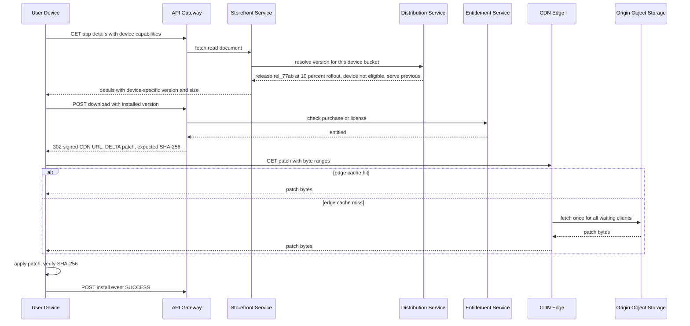

Explanation: version resolution is per-device (rollout bucket + variant targeting), authorization happens once at redirect time and the CDN serves bytes without further checks (the signed URL *is* the capability), range requests make resumes cheap, edge request coalescing protects the origin during launch spikes, and the device verifies the final hash — closing the integrity loop end-to-end regardless of what happened in transit.

**Scaling and failure handling**

- Everything except the metadata/pipeline primaries is stateless and horizontally scaled; the primaries are small (metadata is ~60 GB) and use synchronous replicas.
- The CDN carries >90% of bytes; origin shielding + request coalescing + scheduled pre-positioning absorb launch spikes. If the storefront APIs die entirely, devices with cached pages can still download — the planes are independent.
- Failure handling: scanner/processing workers retry with dead-letter queues and quarantine; rollout guardrails auto-halt on crash-rate breach (fail-safe defaults toward *stopping* distribution); pipeline events are outbox-backed; the search indexer is replayable from the event log, so a corrupted index rebuilds from scratch without touching the write path.

---

### Deep Dive: Binary Distribution, Review Pipeline, Rollouts and Charts

**1. App binary storage and global distribution via CDN**

The binary plane is engineered around one fact: content is immutable, so it caches perfectly.

- *Storage:* artifacts land in object storage keyed by SHA-256 (`objects/ab/cd/abcdef…`), with object-lock immutability once the parent release publishes. Cross-region replication (2+ regions) protects against regional loss; lifecycle policies tier artifacts of superseded versions to cold storage after N days (they must remain servable while any rollout still points at them).
- *Cache key and invalidation:* the edge cache key includes the content hash, so "invalidation" is never needed for correctness — new content has new keys. Takedowns (`REMOVED`) are handled at the entitlement layer (no more signed URLs) plus a purge list for the edges; purging propagates in minutes because the store pre-registered purge patterns per artifact.
- *Signed URLs:* the entitlement service issues HMAC-signed URLs with short expiry (10–60 min) binding artifact hash + device + expiry. The edge validates the HMAC locally — no origin call per download. Resumed range requests within the expiry window reuse the same URL; clients refresh expired URLs via the download endpoint.
- *Origin protection:* two-tier caching (edge → regional shield → origin) with request coalescing at each tier; a launch-day object is fetched from origin exactly once per region, not once per edge per waiting client. Scheduled launches use pre-positioning: the release pipeline pushes artifacts to edges before the developer's go-live time.
- *Resume and integrity:* all object responses support byte ranges; manifests carry per-chunk hashes for very large artifacts so a corrupted 4 MB chunk doesn't invalidate a 4 GB download.

**2. App metadata search and category ranking**

- *Indexing:* the search document is fully denormalized — title, description (all locales), developer name, category, rating histogram, install count bucket, recency, and quality signals are flattened into one document per app per locale. Query time does zero joins.
- *Ranking:* score = text relevance (BM25 on title-weighted fields) × quality multiplier. The quality multiplier blends install velocity (recent installs/day), retention proxy (installs minus uninstalls), rating with Bayesian averaging (a 5.0 from 3 reviews ranks below 4.6 from 100K), and freshness. All signals are precomputed by the stream pipeline and pushed into the indexed document — relevance is a lookup, not a computation.
- *Freshness:* metadata edits flow DB → outbox → indexer with a lag target under 30 s; charts signals update a separate `boost` field every few minutes. Category browse pages are precomputed ranked lists (like charts) rather than live searches — the top of each category is read far more than searched.
- *Abuse resistance:* keyword-stuffed descriptions are demoted by a stuffing detector at index time; install velocity is computed only from attested devices, so bought installs don't move ranking.

**3. Developer submission/review pipeline (state machine)**

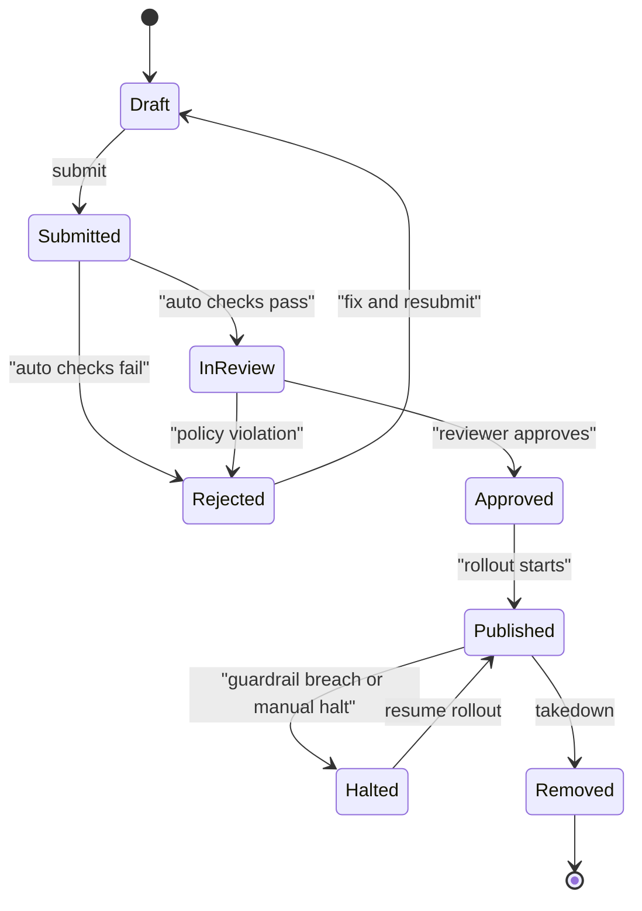

- *Guards:* transitions execute in one DB transaction that (a) asserts the current state, (b) appends a `STATE_TRANSITIONS` audit row with actor and reason, (c) updates the release status cache, (d) writes the outbox event. Concurrent reviewer approvals of the same release serialize on the release row lock; the loser sees a state-changed conflict.
- *Lanes:* automated processing (minutes) and human review (hours) are separate queues with separate SLAs; the state machine makes the boundary explicit (`SUBMITTED` = machine work pending, `IN_REVIEW` = human queue). Appeals re-enter at `IN_REVIEW` with a priority flag and a different reviewer.
- *Why not a full workflow engine:* at six states, a disciplined DB state machine is simpler than Temporal/Camunda; the engine becomes attractive when per-country regulatory lanes and staged compliance checks multiply the states.

**4. Versioning and staged/percentage rollouts**

- *Version model:* `versionCode` (monotonic integer, device-facing comparison) and `versionName` (display). Devices update when offered `versionCode > installed`. Monotonicity is DB-enforced, which makes "which is newer" never ambiguous.
- *Bucketing:* `bucket = floorMod(hash(deviceId + ":" + releaseId), 100)`; eligible iff `bucket < percentage`. Deterministic per device+release (stable exposure), reshuffled across releases (fairness), computable identically on server and in tests. Country/device-class targeting composes as a pre-filter before bucketing.
- *Guardrails:* the stream pipeline computes per-release cohort metrics (crash-free sessions, ANR rate, uninstall rate) over the exposed population; breaching a threshold (e.g., crash-free < 99.5% while baseline is 99.8%) auto-halts the rollout and pages the on-call. *Why cohort metrics:* comparing 1%-cohort crash rates against the whole population confuses exposure with incidence.
- *Halt and rollback:* halt freezes eligibility (devices already on the release keep it); rollback points `current_release` back at the previous release and opens its rollout at 100% — devices on the bad release get the old binary re-offered as a "new" update (a rollback version with a higher `versionCode` built from the old artifact, because version codes never go backward).
- *Expedited channel:* security fixes can ramp 1% → 100% in hours with relaxed guardrail dwell times, an explicit trade of safety for speed that a human approves per release.

**5. Download counts and charts computation**

- *Counters:* install events (attested devices only) increment sharded Redis counters (`downloads:{appId}:{0..63}`); display reads sum shards and map to badges ("1M+"); a periodic rollup persists totals to the metadata DB so Redis is a cache, not the record. Exact counts are deliberately *not* a goal — badges quantize, so approximate counters are sufficient and massively cheaper than exactly-once accounting.
- *Charts:* the stream processor maintains 24 h and 7 d sliding-window install velocity per (app, category, country); a ranker emits top-100 snapshots every ~5 minutes to a KV store; storefront reads are single key lookups. Damping (exponential smoothing over windows) prevents single-hour bot bursts from taking a chart slot.
- *Why not SQL:* `ORDER BY COUNT(*) GROUP BY app` over 100M fresh events/day, per request, per category-country, is a non-starter; precomputed snapshots make the read O(1) at the cost of minutes of staleness, which no user can detect.
- *Manipulation resistance:* events from unattested devices, devices with velocity anomalies (one device, 400 installs/day), and known emulator fingerprints are counted in a separate "suspect" stream — visible for analysis, excluded from charts.

**6. App update diff delivery**

- *Patch generation:* at processing time, for each new release, generate binary patches from the top-N installed prior versions (N ≈ 5, covering >95% of devices) using bsdiff-class binary diff with zstd compression. A 60 MB binary with a typical update diffs to 5–20 MB.
- *Why bsdiff-class diffs:* they operate on raw bytes and handle shifted content (an asset inserted early shifts everything after it); naive block-sync approaches (rsync-style) help less on compressed/encrypted containers where one byte change cascades — though modern practice diffs *uncompressed* archives and recompresses on device, recovering most of the win.
- *Device flow:* device reports `installedVersionCode`; distribution service returns the patch artifact if one exists for that base, else the full binary; device applies the patch, verifies the SHA-256 of the *result* against the release manifest, and only then installs. Any patch failure (corruption, unexpected base) falls back to the full download — patches are an optimization, never a correctness dependency.
- *Cost model:* patch generation and storage cost is O(N × artifacts) per release; the egress saving is ~70% of update bytes, which at 6 PB/day baseline is multiple petabytes daily — the matrix pays for itself many times over.

---

### Replication Strategies

**What it means**

Replication Strategies determine how data and state are copied across multiple nodes in App Store. The choice of strategy determines the trade-off between consistency, availability, and latency.

**Why it matters**

App Store must replicate data to prevent loss and serve reads from multiple nodes. The replication strategy determines whether the system favors consistency (strong reads) or availability (always writable), and how it handles cross-node failure.

**How it works**

**Leader-based (single-leader)**: A single primary node accepts all writes; followers replicate changes asynchronously or semi-synchronously. Reads can be served from any replica. This strategy favors strong consistency for writes but creates a write bottleneck at the leader.

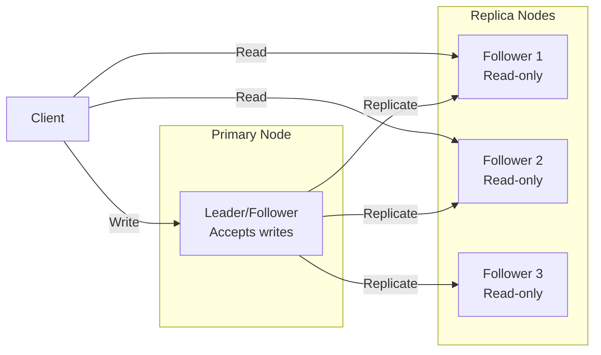

*Leader-based replication: a single primary node accepts all writes and replicates them to read-only followers. Clients can read from any replica for scaled read throughput, but all writes go through the leader.*

**Multi-leader (multi-master)**: Multiple nodes accept writes and exchange updates with each other. This enables low-latency writes in different regions but requires conflict resolution (last-write-wins, merge functions, or CRDTs).

**Leaderless (quorum-based)**: Any node can accept writes; a quorum of nodes must agree. Read and write quorums are configured so that at least one node overlaps between them (R + W > N). This maximizes availability and write scalability.

**Trade-offs for App Store**:

| Strategy | Use Case | Pros | Cons |
|---|---|---|---|
| Leader-based | user reviews, purchase history, device info | Strong consistency, simple | Write bottleneck, leader failure risk |
| Multi-leader | public app listings, anonymized download stats | Low-latency global writes | Conflict resolution, complex |
| Leaderless | Caching, counters | High availability, no bottleneck | Eventual consistency, read repair overhead |

**Real-world implementations**

- **Redis**: Leader-follower replication with asynchronous replication; Sentinel handles failover.
- **Apache Kafka**: Leader-based partition replication with ISR (in-sync replica) — writes go to the leader, followers replicate.
- **Cassandra**: Tunable consistency with leaderless quorum (R + W > N).
- **DynamoDB Global Tables**: Multi-master active-active across regions.

### Failure Detection and Membership

**What it means**

Failure Detection and Membership is the mechanism by which App Store determines which nodes are alive and part of the cluster. Membership is the list of known nodes; failure detection is the process of updating that list when nodes fail or recover.

**Why it matters**

App Store must route requests only to healthy nodes and trigger failover when a node goes down. False positives (healthy nodes marked as dead) cause unnecessary failovers and data loss. False negatives (dead nodes not detected) cause failed requests and degraded performance.

**How it works**

**Heartbeat-based detection**: Each node sends a heartbeat (ping) to a subset of peers at regular intervals. If a node misses N consecutive heartbeats, it is marked as suspect. The gossip protocol distributes membership information: each node exchanges its view of the cluster with a random peer, and the information propagates gossip-style.

```mermaid
sequenceDiagram
    participant A as Node A
    participant B as Node B
    participant C as Node C

    loop Every 1s
        A->>B: Heartbeat (ping)
        B-->>A: Heartbeat (ack)
    end
    B->>C: Gossip: A is alive
    C->>A: Gossip: B is alive
    Note over A,B,C: View converges in O(log N) rounds
```

*Gossip-based failure detection: each node periodically pings a random subset of peers and gossips its view of the cluster. The membership list converges in O(log N) rounds.*

**Phi Accrual Failure Detector**: Instead of a fixed timeout, the detector measures the time between consecutive heartbeats and computes a phi (φ) value — the probability that the node is dead given the observed heartbeat pattern. φ is compared against a threshold (typically 1–8); higher thresholds reduce false positives but increase detection latency.

**SWIM (Scalable Weakly-consistent Infection-style Process group Membership Protocol)**: Nodes ping a random subset of cluster members. If a ping fails, the node is marked "suspect" and the failure is "infected" (gossiped) to other nodes. This is O(log N) per failure detection cycle and scales to large clusters.

**Trade-offs**:

| Approach | Strengths | Weaknesses |
|---|---|---|
| Heartbeat (timeout-based) | Simple, deterministic | False positives under load |
| Phi Accrual | Adaptive threshold | Needs historical data |
| SWIM | Scales to 1000s of nodes | Eventual consistency |

**Real-world implementations**

- **AWS Route 53 Health Checks**: Uses TCP/HTTP health checks with configurable thresholds to remove unhealthy instances from DNS rotation.
- **Kubernetes**: Uses the kubelet heartbeat (every 10s) to determine node liveness; nodes missing 3 consecutive heartbeats are marked NotReady.
- **Consul**: Uses SWIM protocol for membership and failure detection; supports both LAN and WAN gossip.
- **Akka Cluster**: Uses Phi Accrual failure detector with configurable φ thresholds.

### High Availability and Scalability

**What it means**

High Availability and Scalability determines how App Store continues operating when nodes or entire zones fail, and how capacity is added as demand grows. HA is about minimizing downtime; scalability is about maintaining performance as load increases.

**Why it matters**

App Store must stay operational even when individual nodes, availability zones, or entire regions fail. At the same time, it must scale horizontally to handle traffic spikes without degrading latency. The two are intertwined: the replication strategy, failure detection, and load balancing all contribute to both HA and scalability.

**How it works**

**Availability zones (AZs)**: Nodes are distributed across multiple AZs within a region. Each AZ is an independent failure domain (power, networking, physical security). A load balancer distributes requests across AZs; if one AZ fails, traffic is routed to the remaining AZs with no data loss (assuming replication is in place).

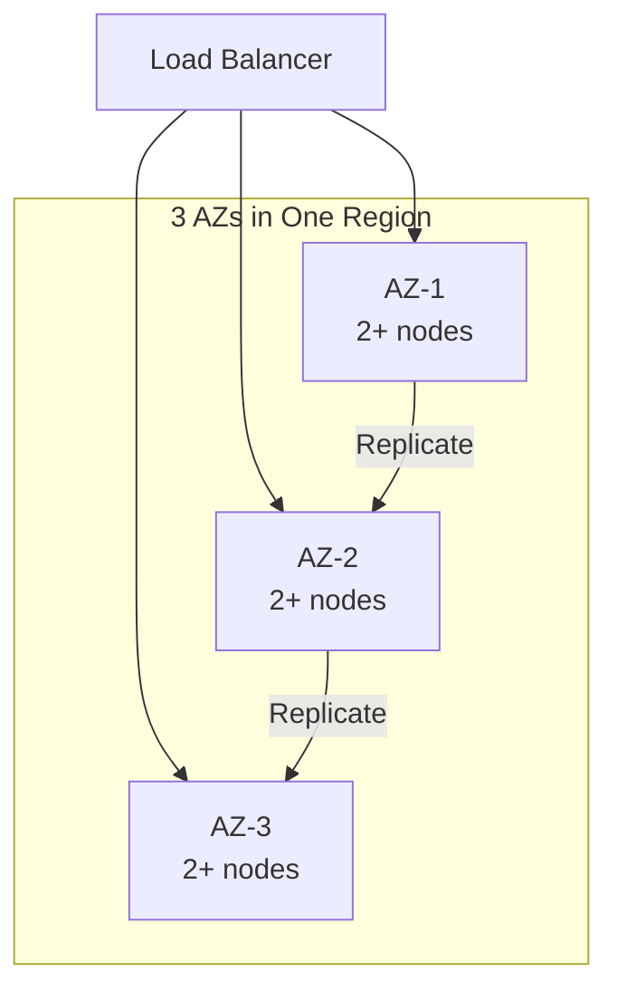

*Multi-AZ deployment: a load balancer distributes traffic across three availability zones. Each AZ has multiple nodes. Data is replicated across AZs so that losing one AZ does not cause data loss or service interruption.*

**Load balancing**: A load balancer distributes incoming requests across healthy nodes. Algorithms include round-robin, least connections, and weighted routing. Health checks ensure traffic only goes to healthy nodes. For App Store, the load balancer also considers **API gateway**
  *Purpose:* single entry point for developer and device traffic when routing.

**Auto-scaling**: The system automatically adds or removes nodes based on metrics (CPU, memory, request rate). Scale-out policies add nodes when load exceeds a threshold; scale-in policies remove nodes during low load. For stateful services like App Store, scale-out involves rebalancing partitions (moving data and connections to the new node).

**Failover and recovery**: When a node fails, the load balancer detects it (via health checks or failure detection) and stops sending traffic. A new node is provisioned (or a standby is promoted) and begins serving. For App Store, failover must preserve user reviews, purchase history, device info data — this is achieved through replication with a quorum of healthy nodes.

**Scalability patterns**:

1. **Horizontal partitioning (sharding)**: Split data by a partition key (e.g., user_id, session_id) and distribute partitions across nodes. New nodes take ownership of additional partitions.

2. **Consistent hashing**: Minimize data movement on scale-out — only 1/N of the data moves to the new node. Nodes and partitions are placed on a ring; a request for key X is routed to the next node clockwise from hash(X).

3. **Connection draining**: When scaling in, existing connections are allowed to complete before the node is shut down. For App Store, this means draining active 1. sessions gracefully.

**Real-world implementations**

- **Netflix OSS (Eureka + Zuul + Ribbon)**: Service discovery with Eureka, edge routing with Zuul, and client-side load balancing with Ribbon. Scales to thousands of instances.
- **Kubernetes HPA + VPA**: Horizontal Pod Autoscaler scales pods based on CPU/memory; Vertical Pod Autoscaler adjusts resource requests based on historical usage.
- **AWS ALB + Auto Scaling Groups**: Application Load Balancer with auto-scaling groups across AZs; health checks replace unhealthy instances automatically.

### Performance and Optimization

**What it means**

Performance and Optimization covers the techniques App Store uses to achieve low latency, high throughput, and efficient resource usage. This section examines the key performance metrics, bottlenecks, and optimizations specific to the system.

**Why it matters**

App Store faces competing pressures: users demand low latency, the system must handle high throughput, and infrastructure costs must be controlled. The optimizations applied at the data, compute, and network layers determine whether the system meets its SLA.

**How it works**

**Latency layers**: Latency in App Store comes from three layers:
1. **Network**: Round-trip time from client to the nearest edge node / load balancer.
2. **Application**: Request processing time on the server (CPU, I/O, lock contention).
3. **Data**: Time to read/write from storage (cache hit vs. database query).

The 99th-percentile latency is the key metric for user-facing systems — it determines the worst-case experience.

**Caching strategies**: App Store uses multiple cache layers:
- **Edge cache**: Static assets (images, CSS, JS) served from a CDN at the edge. For App Store, this caches public app listings, anonymized download stats that doesn't change frequently.
- **Application cache**: In-memory cache (e.g., Redis, Memcached) for frequently accessed data. Cache-aside pattern: application checks cache first, falls back to database on miss.
- **Local cache**: In-process cache (e.g., Caffeine, Guava) for data accessed within a single request. Avoids network round-trips.

**Batching and pipelining**: App Store batches small operations (e.g., writes, log flushes) to amortize per-operation overhead. Pipelining allows multiple requests to be in flight simultaneously.

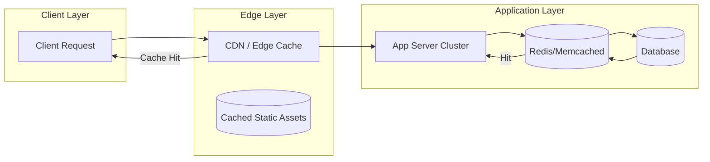

*Caching hierarchy: clients first hit the edge CDN/cache; if the response is cached, it is returned immediately. Otherwise, the request reaches the application, which checks its in-memory/application cache (e.g., Redis) before falling back to the database. This minimizes latency from each layer.*

**Connection pooling**: App Store maintains a pool of database connections to avoid the TCP handshake overhead on every request. Pool size is tuned to match the database's capacity.

**Compression**: Responses are compressed (gzip, zstd) for clients that support it. At the network layer, gRPC uses HPACK header compression.

**Indexing**: Database tables are indexed on frequently queried fields. For App Store, indexes cover **Developer portal service**
  *Purpose:* the developer-facing write API. *Respo and **Upload service**
  *Purpose:* get multi-GB binaries in reliably. *Responsibili for fast lookups.

**Asynchronous processing**: Non-critical background work (e.g., analytics, cleanup, notifications) is offloaded to message queues and processed asynchronously, keeping the request path fast.

**Resource isolation**: CPU and memory are allocated per service (containers with cgroup limits). This prevents a single misbehaving service from degrading the entire system.

**Metrics for App Store**:

| Metric | Target | How to Measure |
|---|---|---|
| P99 latency | < 1s | Load test with realistic traffic |
| Throughput | 1K RPS | Request rate under peak load |
| Error rate | < 0.1% | 5xx / total requests |
| Cache hit ratio | > 90% | cache_hits / (cache_hits + misses) |
| Resource utilization | < 80% CPU, < 85% memory | Container metrics |

**Real-world implementations**

- **Google's HTTP Load Balancer**: Global load balancing with edge PoPs; routes users to the nearest healthy backend.
- **Cloudflare**: Edge cache with Argo Smart Routing that dynamically routes traffic to avoid congestion.
- **Redis**: Used as an application cache with configurable eviction policies (LRU, LFU, TTL).

### Encryption and Key Management

**What it means**

Encryption and Key Management in App Store ensures that data is protected both at rest (stored on disk) and in transit (moving between services). Key management governs how encryption keys are generated, stored, rotated, and accessed — without proper key management, encryption provides a false sense of security.

**Why it matters**

App Store handles user reviews, purchase history, device info that must be encrypted both at rest and in transit. Scaling App Store to handle increasing load while maintaining data consistency, low latency, and fault tolerance requires careful key management: keys must be rotated regularly, scoped to prevent cross-contamination, and audited for compliance. A single key compromise could expose sensitive data.

**How it works**

**At-rest encryption**: Data stored in **API gateway**
  *Purpose:* single entry point for developer and device traffic, **Developer portal service**
  *Purpose:* the developer-facing write API. *Respo and databases is encrypted using AES-256-GCM. The Data Encryption Key (DEK) is generated per data partition and encrypted with a Key Encryption Key (KEK) managed by a KMS (AWS KMS, GCP KMS, HashiCorp Vault). Keys are regionally scoped — only data belonging to a region can be decrypted by that region's KEK.

**In-transit encryption**: All inter-service communication uses TLS 1.3 or mTLS for service-to-service auth. Cross-region communication of public app listings, anonymized download stats uses TLS + optional application-level encryption. user reviews, purchase history, device info is NEVER transmitted in plaintext or across region boundaries.

**Key hierarchy**:
```
Master Key (HSM-backed, KMS-managed)
  └─ KEK (per region, per service)
     └─ DEK (per data partition, rotated every 90 days)
        └─ Data (encrypted with DEK)
```

**Key rotation**: KEKs rotate annually (automatic via KMS); DEKs rotate per object or per 90 days. Applications handle key version headers transparently — a DEK version is stored alongside the encrypted data.

**Cross-region key sharing**: For non-restricted data (public app listings, anonymized download stats), a shared key is imported into each region's KMS. Restricted data NEVER uses cross-region keys — each region's KMS holds only that region's keys.

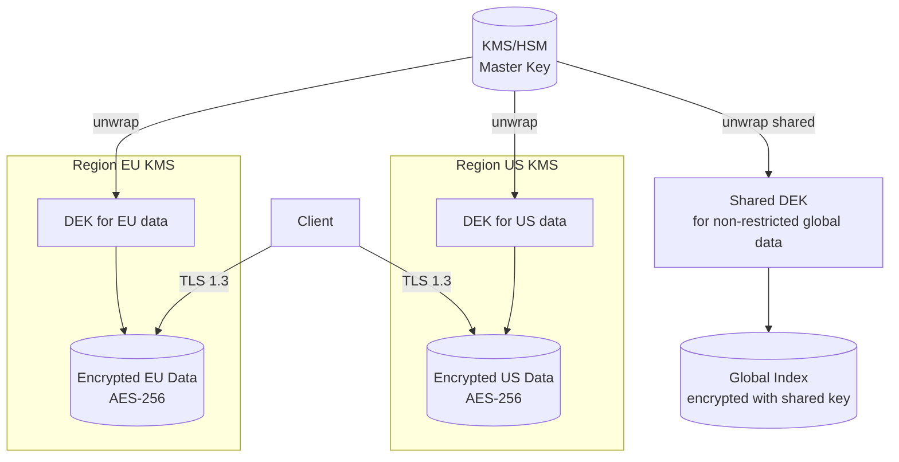

*Encryption key hierarchy: master keys are managed by an HSM-backed KMS and never leave the KMS. Each region has its own KEK. Data encryption keys (DEKs) are generated per partition and encrypted with the regional KEK. Only non-restricted global data uses a shared cross-region key. All client traffic uses TLS 1.3.*

**Java/Spring Boot Implementation**

```java
@Service
@RequiredArgsConstructor
public class DataEncryptionService {

    private final AWSKMS kms;
    @Value("${app.region}")
    private String region;
    @Value("${app.encryption.dek-ttl-minutes:1440}")
    private int dekTtlMinutes;

    private final Map<String, SecretKey> dekCache = new ConcurrentHashMap<>();

    public EncryptedData encrypt(String plaintext, String partitionId) {
        SecretKey dek = getOrCreateDek(partitionId);
        byte[] ciphertext = CryptoUtils.encrypt(plaintext.getBytes(StandardCharsets.UTF_8), dek);
        String dekCiphertext = kms.encrypt(EncryptRequest.builder()
            .keyId("arn:aws:kms:" + region + ":master-key")
            .plaintext(SdkBytes.fromByteArray(dek.getEncoded()))
            .build()).ciphertextBlob().asByteArray();
        return new EncryptedData(ciphertext, dekCiphertext, Instant.now());
    }

    private SecretKey getOrCreateDek(String partitionId) {
        return dekCache.computeIfAbsent(partitionId, id -> {
            try {
                return KeyGenerator.getInstance("AES").generateKey();
            } catch (NoSuchAlgorithmException e) {
                throw new IllegalStateException("Cannot generate DEK", e);
            }
        });
    }
}
```

*Spring Boot encryption service: DEKs are cached per-partition with TTL. Each DEK is encrypted via AWS KMS using a regional master key. The encrypted DEK (ciphertext) is stored alongside the data — only the KMS for that region can decrypt it.*

**Real-world implementations**

- **AWS KMS**: Managed HSM-backed key service; supports automatic key rotation and custom key stores.
- **HashiCorp Vault**: Open-source key management; supports transit encryption (encrypt/decrypt without storing keys).
- **Google Cloud KMS**: Hardware-backed key management with IAM-based access control.

### Authentication and Authorization

**What it means**

Authentication and Authorization (AuthN/AuthZ) in App Store control who can access the system and what they can do. Authentication verifies identity; authorization determines permissions. In a distributed system like App Store, auth must work across multiple nodes while respecting data boundaries — a user authenticated in one region should not have their session data or tokens replicated to regions where it is not permitted.

**Why it matters**

App Store must verify identity at the edge and enforce authorization at every service boundary. user reviews, purchase history, device info must be protected — only users with appropriate roles should access it. At the same time, public app listings, anonymized download stats data should be accessible to a wider audience with minimal friction.

**How it works**

**Authentication (who are you?)**:
- **JWT tokens**: Users authenticate through their home region's identity provider. The region returns a JWT (JSON Web Token) signed by a regional signing key. Tokens include claims like `iss` (issuer region), `sub` (subject/user ID), `home_region`, `roles`, and `exp` (expiry). Tokens are scoped per region — a token issued by region A cannot access restricted data in region B.
- **mTLS for service-to-service**: Internal services authenticate each other using mutual TLS certificates issued by a per-region Certificate Authority (CA). No shared secrets cross region boundaries.
- **Session management**: Sessions are stored regionally (Redis) and never replicated cross-region for restricted data. Session IDs are opaque UUIDs; the session store maps session ID → user context.

**Authorization (what can you do?)**:
- **RBAC (Role-Based Access Control)**: Users are assigned roles per region. Common roles: `region_admin` (full access to region data), `auditor` (read-only audit), `viewer` (read public data only). Roles are stored in the regional database and cached locally for sub-1ms lookups.
- **ABAC (Attribute-Based Access Control)**: Fine-grained permissions based on attributes (e.g., `home_region == request_region AND role == admin`). This allows expressing complex policies like "users can only access restricted data in their home region."
- **Resource-level authorization**: Each request is checked against an ACL (Access Control List) that specifies which roles can access which resources. For App Store, restricted resources require the `admin` role + matching region.

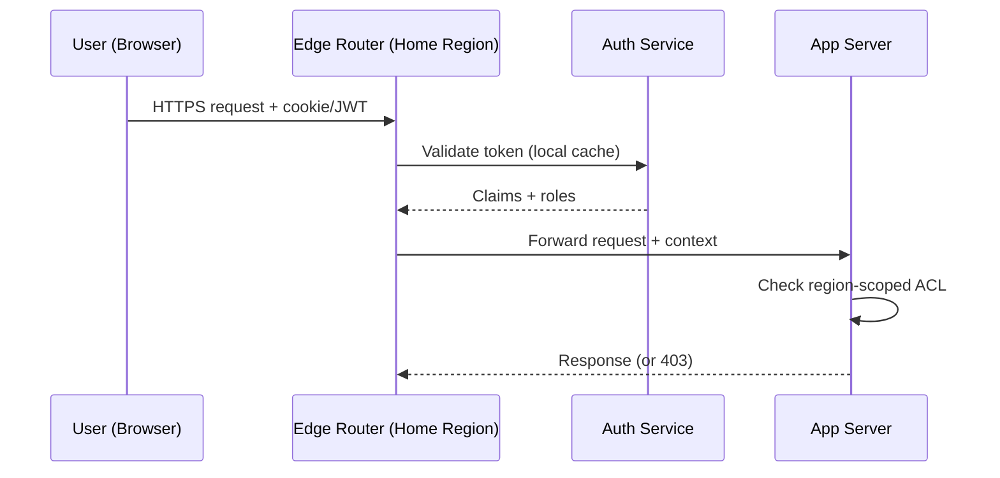

*Authentication flow: the user's token is validated by the regional auth service (claims cached locally). The edge router forwards the request with the security context. Each app server checks the region-scoped ACL before accessing restricted data.*

**Java/Spring Boot Implementation**

```java
@Service
@RequiredArgsConstructor
public class AuthorizationService {

    private final UserTokenRepository tokenRepository;
    @Value("${app.region}")
    private String currentRegion;

    public boolean canAccessResource(String userId, String resourceRegion,
                                     String action, JWTClaims claims) {
        String userHomeRegion = claims.getStringClaim("home_region");
        List<String> roles = claims.getStringListClaim("roles");

        if (!roles.contains(action)) {
            return false;
        }

        if (resourceRegion.equals(userHomeRegion)) {
            return true;
        }

        if (resourceRegion.equals("global")) {
            return roles.contains("global_reader");
        }

        return false;
    }
}

@RestController
@RequiredArgsConstructor
@RequestMapping("/api/v1")
public class RegionController {
    private final AuthorizationService authService;

    @GetMapping("/data/{region}/profile")
    public ResponseEntity<?> getProfile(
            @PathVariable String region,
            @RequestHeader("Authorization") String token) {
        JWTClaims claims = JwtUtils.parseAndValidate(token, currentRegion);

        if (!authService.canAccessResource(
                claims.getStringClaim("sub"), region, "read", claims)) {
            return ResponseEntity.status(HttpStatus.FORBIDDEN).build();
        }

        return ResponseEntity.ok(profileService.getByRegion(region));
    }
}
```

*Spring Boot authorization service: checks both the user's role and whether the requested resource violates region boundaries. The `canAccessResource` method returns false if a user from region EU tries to access restricted data in region US.*

**Real-world implementations**

- **Auth0**: JWT-based authentication with regional endpoints; supports custom rules for ABAC.
- **Okta**: Multi-region identity management with adaptive MFA and ThreatInsight for anomaly detection.
- **AWS Cognito**: Regional user pools with IAM integration; tokens are region-scoped by default.

### Security Threats and Mitigations

**What it means**

Security Threats and Mitigations catalog the attack surface of App Store, the most likely threats, and the corresponding defenses. Every distributed system has unique threat vectors — App Store is no exception.

**Why it matters**

App Store handles user reviews, purchase history, device info that attackers might target. Scaling App Store to handle increasing load while maintaining data consistency, low latency, and fault tolerance expands the attack surface: more nodes, more network paths, more failure modes. Without proper threat modeling, a single vulnerability could expose sensitive data across the entire system.

**Threat model**:

| Threat | Likelihood | Impact | Mitigation |
|---|---|---|---|
| Data exfiltration (cross-region) | High | Critical | Region-scoped keys, no cross-region replication of restricted data |
| Man-in-the-middle (inter-service) | Medium | High | mTLS between all services |
| Replay attacks | Medium | High | Token expiry + nonce |
| DDoS at the edge | High | High | Rate limiting + edge filtering (Cloudflare, AWS Shield) |
| PII leakage in logs | High | High | PII redaction + field-level access control |
| Session hijacking | Medium | Medium | Short-lived tokens + IP binding |
| Privilege escalation | Low | Critical | Least-privilege RBAC + audit logs |
| Cache poisoning | Low | Medium | Cache invalidation on write + signed cache keys |

**How it works**

**Data exfiltration prevention**: App Store enforces data residency by design — user reviews, purchase history, device info is never replicated cross-region. The replication layer checks a data classification label before allowing cross-region copy. A database-level policy (e.g., PostgreSQL RLS) also blocks cross-region queries for restricted partitions.

**mTLS enforcement**: All service-to-service communication uses mutual TLS. Certificates are issued by a per-region CA and rotated every 30 days. Services must present a valid certificate to communicate — no plaintext connections are allowed.

**PII redaction**: Application logs are scanned for PII patterns (email, phone, credit card) using an automated redaction layer (e.g., AWS Macie, Google DLP). public app listings, anonymized download stats is logged freely; restricted fields are masked or dropped before logging.

```mermaid
graph TD
    subgraph "Threat Surface"
        Client[Client]
        Edge[Edge Router / WAF]
        App[App Server]
        DB[(Database)]
        Cache[(Cache)]
        Logs[Log Store]
    end

    Client -->|HTTPS| Edge
    Edge -->|mTLS| App
    App -->|mTLS| DB
    App -->|Read| Cache
    App -->|Write| DB
    App -->|Log| Logs

    subgraph "Mitigations"
        WAF[AWS WAF /<br/>Cloudflare]
        DLP[PII Redaction<br/>(Macie/DLP)]
        FIM[File Integrity<br/>Monitoring]
    end

    Edge -.-> WAF
    Logs -.-> DLP
    DB -.-> FIM
```

*Threat mitigation diagram: the WAF at the edge blocks DDoS and injection attacks. mTLS protects all service-to-service communication. PII redaction scans logs before storage. File integrity monitoring alerts on database tampering.*

**Audit trail**: All security-relevant events (auth, data access, config changes) are written to an append-only audit log with cryptographic integrity (HMAC per entry). The log covers user reviews, purchase history, device info access — who accessed what, when, and from where.

**Real-world implementations**

- **Cloudflare**: Zero-trust model (All Connections to All Networks) with mTLS everywhere; uses GeoIP blocking and rate limiting for DDoS mitigation.
- **Google BeyondCorp**: Zero-trust network security model; all access is authenticated and authorized at the request level.

### Observability and Logging

**What it means**

Observability and Logging in App Store provide visibility into system behavior through three pillars: **metrics** (aggregates and counters), **logs** (structured event records), and **traces** (distributed request timelines). Together, these signals allow operators to debug issues, detect anomalies, and verify SLA compliance.

**Why it matters**

Distributed systems like App Store are inherently opaque — failures can cascade across services in unexpected ways. Without good observability, a single slow dependency can cause widespread timeouts that are nearly impossible to diagnose. Scaling App Store to handle increasing load while maintaining data consistency, low latency, and fault tolerance makes observability even more critical: operators need to see cross-region latency, regional failures, and data-residency violations.

**How it works**

**Metrics**: App Store instruments every service with Prometheus-style metrics:
- **Request rate, error rate, duration (the "RED" metrics)**: Tracks per-endpoint HTTP latency and error counts.
- **System metrics**: CPU, memory, disk I/O, network throughput per node.
- **Business metrics**: For App Store, this includes metrics like "**Developer portal service**
  *Purpose:* the developer-facing write API. *Respo fill rate" and "reservation conflict rate".

Metrics are aggregated in a time-series database (Prometheus, VictoriaMetrics) and visualized in Grafana dashboards with alerts via PagerDuty.

**Logs**: App Store uses structured logging (JSON format) with standardized fields:
- `timestamp`: ISO 8601 UTC
- `level`: DEBUG, INFO, WARN, ERROR
- `service`: originating service name
- `trace_id`: distributed trace identifier (for correlation)
- `span_id`: current operation span
- `region`: the region that processed the request
- `data_class`: RESTRICTED or NON_RESTRICTED

user reviews, purchase history, device info access is logged with full context (user, action, resource). public app listings, anonymized download stats logs are aggregated and may have reduced retention.

**Distributed tracing**: Every request is assigned a trace ID at the edge. The trace propagates through all downstream services via HTTP headers. A tracing backend (Jaeger, Tempo, Zipkin) reconstructs the full request timeline, showing latency at each hop. For App Store, traces include region boundaries — a cross-region call is annotated as such.

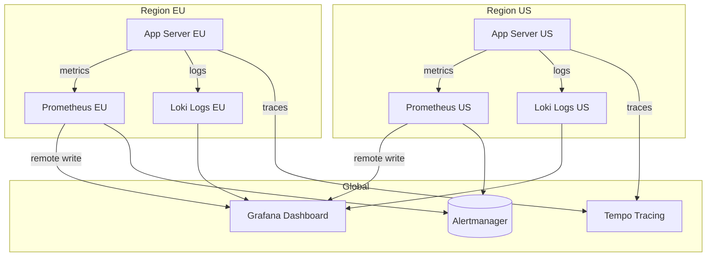

*Observability architecture: each region runs its own Prometheus (metrics) and Loki (logs) instances. A global Grafana instance queries all regional backends. Traces are collected centrally in Tempo. Alerts fire from each region's Prometheus to Alertmanager.*

**Alerting**: App Store defines SLO-based alerts:
- **Latency**: P99 > 1s for 5 minutes → page.
- **Error rate**: > 1% for 10 minutes → page.
- **Availability**: < 99.5% for 15 minutes → page.
- **Data residency violation**: any restricted data detected outside its region → critical page.

**Java/Spring Boot Implementation**

```java
@Component
@RequiredArgsConstructor
@Slf4j
public class ObservabilityContext {

    @Value("${app.region}")
    private String region;

    public void logAccess(String userId, String resource, String action,
                          boolean restricted) {
        log.info("access_event userId={} resource={} action={} region={} data_class={}",
            userId, resource, action, region, restricted ? "RESTRICTED" : "NON_RESTRICTED");
    }
}

@RestController
@RequiredArgsConstructor
@Slf4j
public class ApiController {
    private final ObservabilityContext obs;
    private final UserService userService;

    @GetMapping("/api/v1/profile")
    public ResponseEntity<ProfileResponse> getProfile(
            @AuthenticationPrincipal UserDetails user) {
        String traceId = MDC.get("traceId");
        long start = System.nanoTime();

        try {
            ProfileResponse response = userService.getProfile(user.getId());
            obs.logAccess(user.getId(), "profile", "read", true);

            return ResponseEntity.ok(response);
        } finally {
            long durationMs = (System.nanoTime() - start) / 1_000_000;
            log.info("profile_read traceId={} latencyMs={} region={}",
                traceId, durationMs, obs.region);
        }
    }
}
```

*Spring Boot observability: the `ObservabilityContext` logs structured access events with data classification. The controller records latency and trace ID for every request, enabling SLO-based alerting.*

**Real-world implementations**

- **Netflix OSS (Atlas + Zipkin + Servo)**: Metrics via Atlas, traces via Zipkin, instrumented via Servo. Scales to over 700 billion requests/day.
- **Google SRE Workbook**: Comprehensive observability with SLI/SLO/SLI definition; uses Borgmon for metrics and Dapper for tracing.
- **AWS Observability**: CloudWatch for metrics, X-Ray for tracing, CloudWatch Logs for structured logs.

### Real-World Implementations

**App Store in production**

- **App Store platforms**: widely used app store platform

**Key takeaways**

- Scalability patterns proven in production at scale
- Common pitfalls and how to avoid them
- Integration with existing infrastructure and monitoring

### Architectural Patterns

**Patterns relevant to App Store**

- **Layered/Clean Architecture**: Separates business logic from infrastructure concerns, enabling independent testing and maintenance.
- **Database-per-Service**: Each service manages its own data store, providing isolation but complicating cross-service queries.
- **Event-Driven Architecture**: Decouples services through asynchronous events; enables loose coupling and independent scaling.
- **CQRS (Command Query Responsibility Segregation)**: Separates read and write models for independent optimization; read models can be denormalized for query performance.
- **Saga Pattern**: Manages distributed transactions through a sequence of local transactions with compensating actions on failure.

**Pattern trade-offs**

- Layered architecture is simple to implement but can create tight coupling between layers over time.
- Database-per-service provides schema independence but requires careful design of cross-service consistency.
- Event-driven architecture enables loose coupling but introduces eventual consistency and debugging complexity.
- CQRS optimizes read/write paths independently but doubles the number of data models to maintain.
- Sagas handle long-running transactions but require idempotent compensations and careful state management.

### Java and Spring Boot Implementation Guide

Production-oriented Spring Boot 3.x / Java 17 implementation of the two hardest server-side pieces: the release state machine (with guarded, audited transitions) and staged-rollout bucketing, plus sharded download counters. Constructor injection, records for DTOs, Bean Validation, externalized config via `@Value`, and `@ControllerAdvice` error mapping.

**1. Entities (JPA)**

```java
import jakarta.persistence.*;
import java.time.Instant;

@Entity
@Table(name = "releases", uniqueConstraints =
        @UniqueConstraint(columnNames = {"app_id", "version_code"}))
public class AppRelease {

    @Id
    @GeneratedValue(strategy = GenerationType.IDENTITY)
    private Long releaseId;

    @Column(name = "app_id", nullable = false)
    private Long appId;

    @Column(name = "version_name", nullable = false, length = 64)
    private String versionName;

    /** Monotonic per app; devices compare this to decide updates. */
    @Column(name = "version_code", nullable = false)
    private Long versionCode;

    @Enumerated(EnumType.STRING)
    @Column(nullable = false)
    private ReleaseStatus status = ReleaseStatus.DRAFT;

    @Column(nullable = false)
    private Instant createdAt = Instant.now();

    protected AppRelease() {}

    public AppRelease(Long appId, String versionName, Long versionCode) {
        this.appId = appId;
        this.versionName = versionName;
        this.versionCode = versionCode;
    }

    public void transitionTo(ReleaseStatus target) {
        if (!ReleaseStatus.ALLOWED.get(status).contains(target)) {
            throw new InvalidTransitionException(status + " -> " + target);
        }
        this.status = target;
    }

    public Long getReleaseId() { return releaseId; }
    public Long getAppId() { return appId; }
    public Long getVersionCode() { return versionCode; }
    public ReleaseStatus getStatus() { return status; }
}

enum ReleaseStatus {
    DRAFT, SUBMITTED, IN_REVIEW, APPROVED, REJECTED, PUBLISHED, HALTED, REMOVED;

    /** Machine-checked transition table — the review pipeline's source of truth. */
    static final Map<ReleaseStatus, Set<ReleaseStatus>> ALLOWED = Map.of(
            DRAFT, EnumSet.of(SUBMITTED),
            SUBMITTED, EnumSet.of(IN_REVIEW, REJECTED),
            IN_REVIEW, EnumSet.of(APPROVED, REJECTED),
            APPROVED, EnumSet.of(PUBLISHED),
            REJECTED, EnumSet.of(DRAFT),
            PUBLISHED, EnumSet.of(HALTED, REMOVED),
            HALTED, EnumSet.of(PUBLISHED, REMOVED),
            REMOVED, EnumSet.noneOf(ReleaseStatus.class));
}
```

```java
@Entity
@Table(name = "state_transitions")
public class StateTransition {

    @Id
    @GeneratedValue(strategy = GenerationType.IDENTITY)
    private Long transitionId;

    @Column(nullable = false)
    private Long releaseId;

    @Enumerated(EnumType.STRING)
    @Column(nullable = false)
    private ReleaseStatus fromState;

    @Enumerated(EnumType.STRING)
    @Column(nullable = false)
    private ReleaseStatus toState;

    @Column(nullable = false, length = 128)
    private String actor;

    @Column(length = 512)
    private String reason;

    @Column(nullable = false)
    private Instant createdAt = Instant.now();

    protected StateTransition() {}

    public StateTransition(Long releaseId, ReleaseStatus from, ReleaseStatus to,
                           String actor, String reason) {
        this.releaseId = releaseId;
        this.fromState = from;
        this.toState = to;
        this.actor = actor;
        this.reason = reason;
    }
}
```

**2. Repositories**

```java
public interface AppReleaseRepository extends JpaRepository<AppRelease, Long> {

    /** Pessimistic lock so concurrent reviewer actions serialize on the release row. */
    @Lock(LockModeType.PESSIMISTIC_WRITE)
    @Query("SELECT r FROM AppRelease r WHERE r.releaseId = :id")
    Optional<AppRelease> findByIdForUpdate(Long id);

    Optional<AppRelease> findTopByAppIdOrderByVersionCodeDesc(Long appId);
}

public interface StateTransitionRepository extends JpaRepository<StateTransition, Long> {}

public interface RolloutRepository extends JpaRepository<Rollout, Long> {
    Optional<Rollout> findByReleaseId(Long releaseId);
}
```

**3. Review pipeline service — guarded transitions, audit, outbox**

```java
import org.springframework.stereotype.Service;
import org.springframework.transaction.annotation.Transactional;

@Service
public class ReviewPipelineService {

    private final AppReleaseRepository releases;
    private final StateTransitionRepository transitions;
    private final OutboxRepository outbox;

    public ReviewPipelineService(AppReleaseRepository releases,
                                 StateTransitionRepository transitions,
                                 OutboxRepository outbox) {
        this.releases = releases;
        this.transitions = transitions;
        this.outbox = outbox;
    }

    /**
     * One transaction: assert state, transition, append audit row, write outbox event.
     * If anything rolls back, the release never reaches an unaudited or eventless state.
     */
    @Transactional
    public AppRelease transition(Long releaseId, ReleaseStatus target,
                                 String actor, String reason) {
        AppRelease release = releases.findByIdForUpdate(releaseId)
                .orElseThrow(() -> new ReleaseNotFoundException(releaseId));
        ReleaseStatus from = release.getStatus();
        release.transitionTo(target);          // throws InvalidTransitionException
        transitions.save(new StateTransition(releaseId, from, target, actor, reason));
        outbox.save(new OutboxEvent("release." + target.name().toLowerCase(), releaseId));
        return release;
    }

    @Transactional
    public AppRelease submit(Long releaseId, String developerId) {
        return transition(releaseId, ReleaseStatus.SUBMITTED, developerId, "developer submit");
    }

    @Transactional
    public AppRelease approve(Long releaseId, String reviewerId, String reason) {
        return transition(releaseId, ReleaseStatus.APPROVED, reviewerId, reason);
    }

    @Transactional
    public AppRelease reject(Long releaseId, String actor, String reason) {
        return transition(releaseId, ReleaseStatus.REJECTED, actor, reason);
    }
}
```

Why this shape: the row lock makes two reviewers approving the same release serialize instead of double-transitioning; the transition table is machine-checked so impossible states are unrepresentable; the outbox row commits atomically, so the scanner/indexer can never miss a state they should react to.

**4. Staged rollout service — deterministic bucketing**

```java
import org.springframework.beans.factory.annotation.Value;
import org.springframework.stereotype.Service;
import org.springframework.transaction.annotation.Transactional;

@Service
public class StagedRolloutService {

    private final RolloutRepository rollouts;
    private final double crashFreeThreshold;

    public StagedRolloutService(RolloutRepository rollouts,
            @Value("${store.rollout.crash-free-threshold:99.5}") double crashFreeThreshold) {
        this.rollouts = rollouts;
        this.crashFreeThreshold = crashFreeThreshold;
    }

    /**
     * Deterministic eligibility: same device + release always buckets the same,
     * different releases reshuffle. No randomness at request time means no flapping.
     */
    public boolean isDeviceEligible(Long releaseId, String deviceId) {
        Rollout rollout = rollouts.findByReleaseId(releaseId)
                .orElseThrow(() -> new RolloutNotFoundException(releaseId));
        if (rollout.getStatus() == RolloutStatus.HALTED) {
            return false;
        }
        if (rollout.getStatus() == RolloutStatus.COMPLETED) {
            return true;
        }
        int bucket = Math.floorMod((deviceId + ":" + releaseId).hashCode(), 100);
        return bucket < rollout.getPercentage();
    }

    /** Percentage ramps are monotonic within a rollout; use halt() to go down. */
    @Transactional
    public Rollout ramp(Long rolloutId, int newPercentage, double cohortCrashFreeRate) {
        Rollout rollout = rollouts.findById(rolloutId)
                .orElseThrow(() -> new RolloutNotFoundException(rolloutId));
        if (cohortCrashFreeRate < crashFreeThreshold) {
            rollout.halt();   // fail-safe: guardrail breach stops distribution
            throw new GuardrailBreachException(rolloutId, cohortCrashFreeRate);
        }
        rollout.rampTo(newPercentage);   // rejects decreases with BusinessRuleException
        return rollout;
    }
}
```

**5. Sharded download counters (Redis)**

```java
import org.springframework.beans.factory.annotation.Value;
import org.springframework.data.redis.core.StringRedisTemplate;
import org.springframework.stereotype.Service;

import java.util.List;
import java.util.Objects;
import java.util.concurrent.ThreadLocalRandom;
import java.util.stream.IntStream;

@Service
public class DownloadCounterService {

    private final StringRedisTemplate redis;
    private final int shardCount;

    public DownloadCounterService(StringRedisTemplate redis,
            @Value("${store.counters.shards:64}") int shardCount) {
        this.redis = redis;
        this.shardCount = shardCount;
    }

    /** Random shard per increment: a viral app's counter never serializes on one key. */
    public void recordInstall(long appId) {
        int shard = ThreadLocalRandom.current().nextInt(shardCount);
        redis.opsForValue().increment("downloads:" + appId + ":" + shard);
    }

    /** Reads sum all shards; a nightly rollup persists totals to the metadata DB. */
    public long installCount(long appId) {
        List<String> keys = IntStream.range(0, shardCount)
                .mapToObj(s -> "downloads:" + appId + ":" + s).toList();
        List<String> values = redis.opsForValue().multiGet(keys);
        if (values == null) {
            return 0;
        }
        return values.stream().filter(Objects::nonNull).mapToLong(Long::parseLong).sum();
    }
}
```

**6. DTOs and controller**

```java
import jakarta.validation.constraints.*;

public record CreateReleaseRequest(
        @NotBlank @Size(max = 64) String versionName,
        @NotNull @Positive Long versionCode) {}

public record RolloutRequest(@Min(1) @Max(100) int percentage) {}

public record ReleaseResponse(long releaseId, String status) {}
```

```java
import jakarta.validation.Valid;
import org.springframework.http.HttpStatus;
import org.springframework.http.ResponseEntity;
import org.springframework.web.bind.annotation.*;

@RestController
@RequestMapping("/api/v1/apps/{appId}/releases")
public class ReleaseController {

    private final ReviewPipelineService pipeline;
    private final StagedRolloutService rollouts;

    public ReleaseController(ReviewPipelineService pipeline, StagedRolloutService rollouts) {
        this.pipeline = pipeline;
        this.rollouts = rollouts;
    }

    @PostMapping("/{releaseId}/submit")
    public ResponseEntity<ReleaseResponse> submit(@PathVariable long appId,
                                                  @PathVariable long releaseId,
                                                  @RequestHeader("X-Developer-Id") String developerId) {
        AppRelease release = pipeline.submit(releaseId, developerId);
        return ResponseEntity.status(HttpStatus.ACCEPTED)
                .body(new ReleaseResponse(release.getReleaseId(), release.getStatus().name()));
    }

    @PostMapping("/{releaseId}/rollout")
    public ReleaseResponse startRollout(@PathVariable long appId,
                                        @PathVariable long releaseId,
                                        @Valid @RequestBody RolloutRequest request) {
        // Requires APPROVED; activates the rollout at the requested percentage.
        AppRelease release = pipeline.publishWithRollout(releaseId, request.percentage());
        return new ReleaseResponse(release.getReleaseId(), release.getStatus().name());
    }
}
```

**7. Exception handling**

```java
import org.springframework.http.HttpStatus;
import org.springframework.http.ResponseEntity;
import org.springframework.web.bind.MethodArgumentNotValidException;
import org.springframework.web.bind.annotation.ExceptionHandler;
import org.springframework.web.bind.annotation.RestControllerAdvice;

import java.util.List;
import java.util.Map;

@RestControllerAdvice
public class StoreExceptionHandler {

    @ExceptionHandler(InvalidTransitionException.class)
    public ResponseEntity<Map<String, Object>> invalidTransition(InvalidTransitionException ex) {
        return ResponseEntity.status(HttpStatus.CONFLICT)
                .body(Map.of("error", "INVALID_STATE", "message", ex.getMessage()));
    }

    @ExceptionHandler(GuardrailBreachException.class)
    public ResponseEntity<Map<String, Object>> guardrail(GuardrailBreachException ex) {
        return ResponseEntity.status(HttpStatus.UNPROCESSABLE_ENTITY)
                .body(Map.of("error", "GUARDRAIL_BREACH", "message", ex.getMessage()));
    }

    @ExceptionHandler(ReleaseNotFoundException.class)
    public ResponseEntity<Map<String, Object>> notFound(ReleaseNotFoundException ex) {
        return ResponseEntity.status(HttpStatus.NOT_FOUND)
                .body(Map.of("error", "RELEASE_NOT_FOUND", "message", ex.getMessage()));
    }

    @ExceptionHandler(MethodArgumentNotValidException.class)
    public ResponseEntity<Map<String, Object>> validation(MethodArgumentNotValidException ex) {
        List<Map<String, String>> details = ex.getBindingResult().getFieldErrors().stream()
                .map(f -> Map.of("field", f.getField(), "message", String.valueOf(f.getDefaultMessage())))
                .toList();
        return ResponseEntity.badRequest()
                .body(Map.of("error", "VALIDATION_FAILED", "details", details));
    }
}
```

Configuration via `application.yml`: `store.rollout.crash-free-threshold` (auto-halt sensitivity — operational knob, no redeploy), `store.counters.shards` (counter write throughput), `spring.datasource` Hikari sizing for the pipeline DB, and Redis connection settings. Interview point: the state machine lives in code + DB constraints, not in a workflow engine, because six states don't justify one — the extension point (adding states to `ALLOWED`) is one map entry plus tests.

---

### Interview Questions and Answers

**Beginner**

- **Q: Why can't you serve app binaries from your own application servers?**
  **A:** Because the numbers forbid it: ~12,000 peak downloads/s × 60 MB ≈ 5.7 Tbps of egress — no application fleet is sized for that, and every byte through your servers is a byte of latency and cost. Binaries are immutable, so they cache perfectly at CDN edges near users; application servers only authorize (302 with a signed URL). *Common mistake:* proxying downloads through the API "for control" — control belongs at redirect time and in the signed URL, not in the byte path.

- **Q: Why are app artifacts immutable and content-addressed?**
  **A:** The review verdict applies to specific bytes; if content could change under a stable identifier, caches would serve stale or swapped bits and "what was reviewed" would diverge from "what users install." Keying by SHA-256 makes the reviewed-served identity provable, gives free dedup, and makes cache invalidation unnecessary. *Follow-up:* what happens on a bug fix? — a new version, new hash, new review.

- **Q: What is the app review pipeline and what states does a release go through?**
  **A:** The trust gate between developer upload and user devices. States: DRAFT → SUBMITTED (automated checks: manifest validity, malware scan, policy APIs) → IN_REVIEW (human policy review) → APPROVED or REJECTED → PUBLISHED when a rollout starts; post-publish: HALTED (rollout pause), REMOVED (takedown). Every transition is audited. It exists because the store is otherwise a malware distribution channel.

- **Q: Walk through the flow from developer upload to user install.**
  **A:** Developer creates a draft release, uploads the binary via multipart signed URLs directly to object storage, hash is verified; submit triggers automated processing (variants, scan) then human review; on approval the developer starts a staged rollout; devices calling the update endpoint are bucketed, eligible devices get a signed CDN URL (full or delta), verify the hash, install, and report the install event that feeds counters and charts.

**Intermediate**

- **Q: How does a staged rollout decide which devices get the update?**
  **A:** Deterministic bucketing: `floorMod(hash(deviceId + releaseId), 100) < percentage`. Deterministic per device+release so a device doesn't flap between versions on every check; re-hashed per release so no device is permanently in the first 1%. Rollout ramps 1 → 10 → 50 → 100% with guardrail metrics (crash-free sessions) that auto-halt on breach. *Common mistake:* random-per-request bucketing — devices flap and cohort metrics become meaningless.

- **Q: How do delta updates work, and what happens when a patch fails?**
  **A:** At processing time, binary patches are generated (bsdiff-class) from the top-N installed prior versions. The device reports its installed version; if a patch exists for that base it downloads the much smaller diff, applies it, and verifies the SHA-256 of the result against the manifest. Any failure — corrupt patch, unexpected base — falls back to the full binary. Patches are a bandwidth optimization, never a correctness dependency. *Trade-off:* patch matrix storage vs. ~70% update-egress savings.

- **Q: How are download counts and top charts computed? Why not just `COUNT(*)`?**
  **A:** Install events flow through Kafka to a stream processor. Counts use sharded Redis counters (random shard per increment, sum on read) because one hot counter per viral app serializes writes; displayed badges are quantized ("1M+") so approximation is fine. Charts are precomputed: sliding-window install velocity per app/category/country, ranked into top-100 snapshots every few minutes, served as single KV lookups. A live `GROUP BY … ORDER BY COUNT(*)` over 100M fresh events/day per request is a non-starter.

- **Q: How do you make multi-GB uploads resumable?**
  **A:** Multipart upload: the server issues pre-signed URLs for fixed-size parts; the client uploads parts directly to object storage in any order, retries failed parts individually, then calls complete with part ETags; the server assembles, verifies SHA-256, and registers the artifact. The same philosophy applies on download: byte-range requests so a dropped connection resumes instead of restarting.

**Advanced**

- **Q: A hit game launches and 50× normal traffic hits one binary in minutes. Walk through what saves you.**
  **A:** Layers: (1) the artifact is immutable, so it is perfectly cacheable; (2) scheduled launches pre-position the object to edges before go-live; (3) edge request coalescing fetches from origin once per region for N waiting clients, with a shield tier between edge and origin; (4) signed-URL authorization is validated at the edge, so the entitlement service sees one request per device, not per byte or per resume; (5) the control plane (search/metadata) is separate and unaffected by the data-plane storm. Origin egress stays flat while edge egress absorbs the spike.

- **Q: How do you keep the search index consistent with the metadata database?**
  **A:** Via the transactional outbox: metadata commits write change events in the same transaction; a relay publishes them; the indexer consumes and rebuilds denormalized documents. Lag target ~30 s, monitored as an operational metric. The indexer is replayable — a corrupted index is rebuilt by re-consuming the event log or re-scanning the DB, never by restoring from a search-cluster backup. *Follow-up:* why not dual-write from the service? — a crash between DB commit and index call strands changes silently.

- **Q: Rollback: 5% of devices run a broken release. How do you get them back?**
  **A:** Version codes never go backward, so you cannot "un-publish into the past." Rollback = build a new release from the previous good artifact with a higher versionCode, approve it via the expedited channel, and roll it out; devices on the broken release see it as an update. Meanwhile the broken rollout is halted so no new devices get it. *Common mistake:* deleting the release — devices already on it are then stranded with no update path.

- **Q: How do you defend download counts and charts against manipulation?**
  **A:** Assume events are hostile: device attestation gates which installs count toward charts (unattested go to a suspect stream); per-device velocity limits (one device can't install 400 apps/day credibly); emulator/farm fingerprinting; chart damping via exponential smoothing so a one-hour bot burst can't take a slot; and periodic audits comparing install events against CDN download logs for big movers. Ranking manipulation is an economics problem — raise the cost above the payoff of bought installs.

**Senior / system design**

- **Q: Which parts of the store need strong consistency and which don't? Defend the split.**
  **A:** Strong: entitlement/purchase checks (money bought access — never ambiguous), release state transitions (audited legal/trust artifact), package-name uniqueness and version-code monotonicity (identity invariants). Eventual (seconds): catalog reads, search freshness, counters, charts, rollout propagation — all user-visible but self-healing and undetectable at small lag. Spending strong consistency on the read path would tax 500M reads/day for a guarantee no user can perceive; spending eventual consistency on purchases or publishing creates un-ambiguable disputes. The interview-worthy answer ties each choice to the cost of being wrong, not to dogma.

- **Q: Design the rollout auto-halt guardrails. What metrics, what thresholds, what failure modes?**
  **A:** Cohort metrics from the stream pipeline: crash-free sessions, ANR rate, uninstall velocity — computed over *devices exposed to this release*, compared against the release's own earlier cohorts and the app baseline, not the global population (population comparisons confound exposure with incidence). Threshold example: halt if crash-free < 99.5% with baseline 99.8%, sustained for 15 minutes, minimum sample size to avoid halting on 30 devices. Failure modes: false halt on tiny samples (fix: minimum exposure gate); metric lag letting a bad release double its cohort before detection (fix: cap ramp step size by metric latency); guardrail pipeline outage (fix: fail-safe — if guardrails are blind, ramping pauses automatically).

- **Q: How would you evolve this to multi-region active-active?**
  **A:** The read and data planes are already multi-region-friendly (search replicas, read documents, CDN). The hard part is the write plane: metadata primary and the review state machine are single-primary because state transitions and uniqueness invariants (package names, version codes) want one arbiter. Active-active options: shard developers/apps by home region with cross-region replication (regional primaries, global read replicas), accept WAN latency on developer writes (they're rare and not latency-sensitive), keep entitlement strongly consistent per region with async replication and conflict-free purchase records (append-only by user). The honest senior answer: developers tolerate write latency, so full active-active write federation is usually not worth the conflict machinery — active-standby with fast failover covers the risk.

- **Q: The store must serve a country with new local regulations (local review, local data residency). What changes?**
  **A:** The state machine gains per-country lanes — a release is PUBLISHED per region, not globally, so `ROLLOUTS` and targeting get a country dimension and the pipeline forks per-jurisdiction approvals. Data residency moves that country's developer/user PII and event data to in-region storage with regional primaries for the metadata partition; binaries already replicate globally but entitlement adds region gating. The design principle: make jurisdiction a *dimension* of release state and data placement, not a fork of the system — one codebase, per-region policy configuration. *Common mistake:* cloning the whole stack per country, which multiplies operational cost and guarantees drift.

- **Q: What's the most dangerous single component, and how is it protected?**
  **A:** The signing keys and the entitlement/redirect path: whoever controls them controls what code a billion devices install. Protections: keys in HSMs with quorum-based access and audited ceremonies; artifact signing as an isolated, network-minimal service; end-to-end hash verification on-device so even a compromised CDN can't substitute bytes; takedown propagation rehearsed (purge lists, revocation) because detection of a bad publish is a *when*, not an *if*. The general principle: assume any single system can be compromised and make the device's own verification the final authority.
