# Design a Simple Attendance Tracking System

## Blogs and websites

## Medium

## Youtube

## Theory

### Topics Covered

1. [Introduction and Problem Statement](#introduction-and-problem-statement)
2. [Functional Requirements](#functional-requirements)
3. [Non-Functional Requirements](#non-functional-requirements)
4. [Capacity Estimation](#capacity-estimation)
5. [Characteristics](#characteristics)
6. [Components](#components)
7. [Architectural Patterns](#architectural-patterns)
8. [Benefits](#benefits)
9. [Pros](#pros)
10. [Cons](#cons)
11. [Challenges](#challenges)
12. [Best Practices](#best-practices)
13. [When to Use / When Not to Use](#when-to-use-when-not-to-use)
14. [Use Cases](#use-cases)
15. [API Design and API Contract](#api-design-and-api-contract)
16. [Data Model and API](#data-model-and-api)
17. [High-Level Design](#high-level-design)
18. [Deep Dive](#deep-dive)
19. [Replication Strategies](#replication-strategies)
20. [Failure Detection and Membership](#failure-detection-and-membership)
21. [High Availability and Scalability](#high-availability-and-scalability)
22. [Performance and Optimization](#performance-and-optimization)
23. [Encryption and Key Management](#encryption-and-key-management)
24. [Authentication and Authorization](#authentication-and-authorization)
25. [Security Threats and Mitigations](#security-threats-and-mitigations)
26. [Observability and Logging](#observability-and-logging)
27. [Real-World Implementations](#real-world-implementations)
28. [Java and Spring Boot Implementation Guide](#java-and-spring-boot-implementation-guide)
29. [Interview Questions and Answers](#interview-questions-and-answers)

---
---
---

### Introduction and Problem Statement

Design a simple attendance tracking system for an organization where employees/students check in and check out each day, and admins can view attendance reports.

Attendance tracking sounds trivial — "just store two timestamps" — but it sits at the intersection of several classic system-design problems: write correctness under retries (a double-tap must not create two records), time semantics (timezones, DST, night shifts), trust (server clock vs. client clock, location spoofing), and read/write asymmetry (cheap writes, but reports that aggregate months of rows). It is a favorite "basic" interview question precisely because it tests whether a candidate can find the hidden complexity in a simple-sounding requirement.

**What problem it solves**

- Organizations need a trustworthy record of who was present, when, and for how long, for payroll, compliance, and academic credit.
- Manual registers and spreadsheets are error-prone, easy to manipulate, and impossible to audit.
- Managers need aggregated views (present/absent/late counts, hours worked) without reading raw events one by one.
- HR needs corrections to be possible but always traceable (who changed what, when, and why).

**Real-life use cases**

- **Corporate offices**: employees check in via a mobile app or badge reader; HR exports monthly hours to payroll.
- **Factories and shift work**: kiosk-based punches at the plant gate, including night shifts that cross midnight.
- **Schools and universities**: students check in per class session; faculty view absence reports.
- **Field workforce**: delivery or service staff check in from job sites with GPS coordinates attached.
- **Co-working spaces**: members check in to track usage for billing.

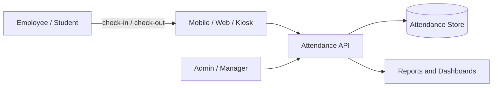

The diagram shows the core shape of the system: many users produce a small number of write events per day through a single API, while admins consume aggregated read views over the same data.

---

### Functional Requirements

1. **Check-in**: a user records the start of their work/study day. The system stamps the event with the server's time and rejects the request if the user already has an open (not yet checked-out) record for that day.
2. **Check-out**: a user records the end of their day. The system closes the open record and computes worked duration.
3. **View own attendance history**: a user can list their records for a date range, including worked hours and status (present, late, half-day).
4. **Admin views**: an admin can view attendance for a team or the whole organization over a date range.
5. **Manual corrections**: an admin (or a user with approval) can correct a wrong or missing punch; every correction is stored with the old value, new value, reason, and approver.
6. **Basic reports**: per team and date range, present/absent/late counts, average worked hours, and per-user summaries.
7. **Auto-close**: records still open at end of day are closed by a scheduled job and flagged so missed check-outs are visible instead of silently wrong.
8. **Idempotent punches**: retrying a check-in (network retry, double tap) returns the original result instead of creating duplicates or errors.

Out of scope for the basic design (mention as extensions in interviews): leave management integration, shift scheduling, biometric devices, geofencing enforcement, payroll export.

---

### Non-Functional Requirements

- **Scale**: thousands of users per organization; exactly one check-in/check-out event pair per user per day, so the write volume is small and predictable.
- **Write latency**: check-in/check-out acknowledged in < 200 ms at p99 — punches happen in burst windows (8:30–10:00 AM) and users expect instant feedback at the door.
- **Read latency**: own-history reads < 200 ms; team reports < 2 s; reports may hit precomputed aggregates, never raw scans.
- **Consistency**: strong consistency on the "one open record per (user, date)" rule — a user must not be able to check in twice without checking out first. Reports can be eventually consistent (stale by minutes).
- **Availability**: 99.9% for the check-in path; a failed check-in directly blocks employees at the door, so writes matter more than report reads.
- **Durability**: once acknowledged, a punch must never be lost — it feeds payroll. RPO = 0 for punch events.
- **Auditability**: corrections and admin actions are immutably logged for compliance.
- **Security**: authenticated users only; users see only their own records; admins are scoped to their organization (multi-tenancy isolation).

---

### Capacity Estimation

Back-of-envelope math for one mid-size organization; multi-tenant SaaS numbers follow.

**Assumptions**

- 10,000 employees in the organization.
- 2 punch events per user per day (one check-in, one check-out).
- 22 working days per month, ~250 working days per year.

**Write QPS**

- Events per day = 10,000 users × 2 = 20,000 events/day.
- Spread evenly that is ~0.25 QPS, but punches are extremely bursty: 80% of check-ins land in a 90-minute morning window.
- Average in window = 16,000 events / 5,400 s ≈ 3 QPS. Peak (everyone at 9:00 sharp) ≈ 5× average ≈ **15 QPS writes**.
- A single modest application server and one relational database handle this trivially; the design challenge is correctness, not throughput.

**Read QPS**

- Self history: assume 10% of users check history daily → 1,000 reads/day.
- Reports: 50 managers × 10 report views/day = 500 reads/day.
- Peak read load ≈ **5 QPS** — negligible, but report queries must stay fast via precomputed aggregates.

**Storage**

- Record size estimate: UUIDs (16 B × 2), two timestamps (8 B × 2), date (4 B), status/source enums (~10 B), worked minutes (4 B), audit timestamps (16 B) ≈ **~120 B raw, ~250 B with index overhead**.
- Per year: 10,000 users × 250 days × 250 B ≈ **625 MB/year** including indexes.
- Ten years of history ≈ 6 GB — a single relational instance holds it comfortably. Archival is a policy decision, not a capacity necessity.

**Bandwidth**

- A punch request/response is ~1 KB JSON. 20,000 events/day ≈ 40 MB/day of traffic — irrelevant. Even 100 orgs on one platform stay under a few GB/day.

**Multi-tenant SaaS extrapolation**

- 500 organizations × 10,000 users = 5 M users → 10 M events/day, peak ≈ 7,500 QPS writes, ≈ 2.5 TB of records over 10 years.
- This is where partitioning by `org_id` (tenant), read replicas for reports, and queue-based aggregation become necessary. State these numbers in an interview to show you know when the simple design stops being sufficient.

**Conclusion**: for the basic system, one PostgreSQL/MySQL primary with proper unique indexes plus a nightly aggregation job is enough. Invest design effort in correctness (uniqueness, timezones, idempotency) rather than scale machinery.

---

### Characteristics

Each characteristic is explained in detail.

- **Append-oriented event log**
  The system's source of truth is a stream of punch events (or records derived from them). Attendance is fundamentally event data: something happened at a time. Modeling it as events keeps corrections and audits natural, because you never overwrite history — you append compensating entries.

- **Low write volume, high correctness bar**
  Only two writes per user per day, but each one feeds payroll. A lost or duplicated punch has financial and legal consequences, so durability and uniqueness matter more than raw throughput.

- **Bursty traffic pattern**
  Load concentrates in short morning and evening windows. Capacity planning must use peak-window QPS, not daily averages, and the write path must stay simple enough to serve the burst without queueing delays.

- **Time-zone and calendar sensitivity**
  "A day" is a local concept. The system must convert instants to local work dates per organization, survive DST transitions, and handle shifts crossing midnight. This is the most common source of real-world bugs in attendance systems.

- **Trust asymmetry between client and server**
  Clients are untrusted: a user can change their phone clock to backdate a punch. The server clock is the authority; client timestamps are metadata used only for offline reconciliation.

- **Read/write asymmetry**
  Writes are tiny and simple; reads (monthly reports across teams) are aggregations over millions of rows. The design separates the write path from a precomputed reporting path (CQRS-style) so reports never scan raw events.

- **Strong uniqueness invariant**
  At most one open record per user per day. This invariant is enforced by the database (unique constraint), not by application code, because application-level checks race under concurrent requests.

- **Human-in-the-loop corrections**
  Real deployments always need corrections (forgot to check out, kiosk offline). The system treats corrections as first-class, approval-gated, audited operations rather than ad-hoc database edits.

---

### Components

Each component is listed with its purpose, responsibilities, and relationship to other components.

- **Client applications (mobile, web, kiosk)**
  Capture check-in/check-out intent, attach optional context (GPS, device id, client-captured time), and queue punches locally when offline. They never decide the official time; they display what the server confirms. Real-world example: the greytHR or Zoho People mobile apps.

- **API layer / gateway**
  Authenticates requests (JWT/OAuth2), enforces rate limits and input validation, and routes to services. It is the only public entry point, which centralizes auth and tenancy resolution.

- **Attendance service (write path)**
  Owns the punch state machine: validates the request, enforces the one-open-record rule, stamps server time, persists the record transactionally, and emits a domain event. This is the consistency-critical component.

- **Reporting service (read path)**
  Serves history and aggregate reports from precomputed summary tables, never from raw event scans. It scales independently of the write path and can sit behind read replicas.

- **Relational database**
  System of record. Holds `attendance_records`, `attendance_corrections`, and `daily_attendance_summary`. Enforces uniqueness and foreign keys. PostgreSQL is a typical choice.

- **Message queue / event bus**
  Carries `CheckInRecorded`, `CheckOutRecorded`, and `CorrectionApproved` events from the write path to aggregation and notification consumers. Decouples report updates from punch latency. Kafka or RabbitMQ are typical; for the basic system an in-process event or a lightweight queue suffices.

- **Aggregation worker**
  Consumes punch events and incrementally maintains `daily_attendance_summary` (present/absent/late, worked minutes). A nightly batch job recomputes summaries from raw records to self-heal any drift.

- **Scheduler / batch jobs**
  Runs the end-of-day auto-close job (closes stale open records), the late-mark computation, and the nightly summary recomputation. Quartz, Spring `@Scheduled`, or a cron-based runner.

- **Notification service**
  Optional in the basic system: alerts a manager when a team member is absent, or reminds a user about a missed check-out.

- **Admin console**
  UI for corrections, team views, and report exports. Talks to the same APIs with elevated, org-scoped privileges.

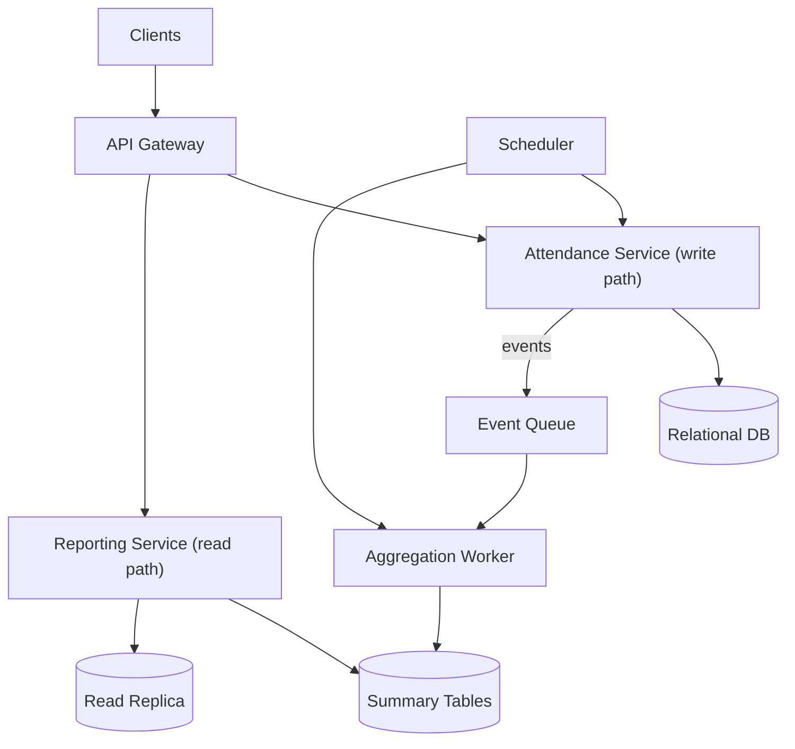

---

### Architectural Patterns

Relevant design and architectural patterns, each with the problem it solves, how it works, when to use it, advantages, disadvantages, and a real-world example.

- **Transactional uniqueness (database-enforced invariant)**
  - *Problem*: two concurrent check-in requests for the same user and day can both pass an application-level "is there an open record?" check (a read-then-write race).
  - *How it works*: a unique partial index such as `UNIQUE (user_id, work_date) WHERE check_out_at IS NULL` makes the second insert fail at the database; the application translates the violation into a `409 Conflict`.
  - *When to use*: always, for this invariant. *When not*: never skip it — application-only checks are insufficient.
  - *Advantages*: correct under any concurrency; simple code. *Disadvantages*: couples the invariant to the database schema; partial indexes are database-specific syntax.
  - *Real-world example*: PostgreSQL partial unique indexes are the standard way SaaS products enforce "one active session/subscription/punch" rules.

- **Idempotent receiver (idempotency keys)**
  - *Problem*: mobile networks retry; users double-tap; gateways retry on timeouts. A non-idempotent check-in creates 409 storms or duplicates.
  - *How it works*: the client generates a UUID per user intent and sends it as an `Idempotency-Key` header. The server stores the key with the created record; a repeated key returns the original response instead of executing again.
  - *When to use*: any mutating endpoint reachable from unreliable networks. *When not*: pure reads.
  - *Advantages*: safe retries, better UX. *Disadvantages*: requires key storage and lookup on the write path.
  - *Real-world example*: Stripe's `Idempotency-Key` header is the canonical implementation of this pattern.

- **CQRS (Command Query Responsibility Segregation), lite**
  - *Problem*: the write model (punch records) is a poor shape for reports (monthly aggregates), and report scans would slow the write-critical database.
  - *How it works*: writes go to `attendance_records`; events feed an aggregator that maintains `daily_attendance_summary`; reports read only summaries. Full-blown CQRS frameworks are unnecessary — a summary table plus a queue is the pragmatic version.
  - *When to use*: when read shapes diverge from write shapes and aggregation is expensive. *When not*: when `GROUP BY` over a few thousand rows is already fast enough.
  - *Advantages*: fast reports, isolated scaling. *Disadvantages*: eventual consistency between punch and summary; more moving parts.
  - *Real-world example*: every analytics dashboard backed by an operational database uses some form of this pattern.

- **Outbox pattern**
  - *Problem*: "insert record, then publish event" is not atomic — a crash between the two loses the event, and publishing before commit leaks phantom events.
  - *How it works*: the punch and an `outbox` row are written in one transaction; a relay polls the outbox (or tails the WAL) and publishes to the queue.
  - *When to use*: when downstream correctness (summaries, notifications) depends on events not being lost. *When not*: when a missed summary update is acceptable and the nightly job repairs it anyway.
  - *Advantages*: at-least-once delivery with no dual-write inconsistency. *Disadvantages*: extra table and relay process.
  - *Real-world example*: Debezium CDC over a Postgres outbox table is a common production setup.

- **Scheduled batch reconciliation (self-healing summaries)**
  - *Problem*: incremental aggregation can drift (consumer lag, bugs, backfills).
  - *How it works*: a nightly job recomputes each day's summary from raw records and overwrites drifted rows. The incremental path gives freshness; the batch path guarantees eventual correctness.
  - *Advantages*: bounded error, simple recovery. *Disadvantages*: nightly compute cost (tiny at this scale).
  - *Real-world example*: lambda-architecture style "speed layer + batch layer" used by most analytics pipelines.

- **Event sourcing (optional, usually overkill here)**
  - *Problem*: you want a perfect, replayable history of every punch and correction.
  - *How it works*: store immutable `PunchEvent`s and derive records/summaries by folding events.
  - *When to use*: heavy audit/regulatory needs or complex temporal queries. *When not*: for a basic system — a `records + corrections` schema already provides auditability with far less complexity.
  - *Advantages*: complete history, time travel. *Disadvantages*: operational complexity, harder ad-hoc queries.
  - *Real-world example*: financial ledgers use event sourcing; most HR tools do not.

---

### Benefits

- **Trustworthy payroll and compliance data**
  Server-stamped, durable, correction-audited records mean payroll runs and labor-law audits are based on data the organization can defend. This matters in production because attendance disputes and wage audits are common and expensive.

- **Real-time visibility for managers**
  Precomputed summaries let a manager answer "who is late today?" in seconds. Without aggregation, this question is a slow scan that nobody runs, and attendance problems surface only at month end.

- **Fraud and error reduction**
  Server timestamps, uniqueness rules, and audited corrections remove the easy manipulation vectors (backdated punches, duplicate entries, silent edits) that plague spreadsheet-based tracking.

- **Operational simplicity at low scale**
  The basic design runs on one application service and one database. Small organizations get the benefits above without operating distributed infrastructure — an important business property, not just a technical one.

- **Foundation for richer HR workflows**
  Clean attendance events are the input for leave accrual, overtime calculation, shift differential pay, and productivity analytics. Getting the event model right makes every downstream feature cheaper.

---

### Pros

Each advantage explained in detail.

- **Simple, well-understood stack**
  A relational database with unique constraints solves the hardest correctness problems (duplicates, one-open-record) declaratively. There is no distributed consensus, no cache coherence problem on the write path, and few failure modes to reason about.

- **Cheap to operate**
  Capacity math shows megabytes per day and tens of QPS at peak. A single small database instance with a nightly job covers years of growth for one organization, keeping infrastructure cost near zero relative to the business value.

- **Flexible event-based core**
  Storing raw check-in/check-out events (rather than only pre-computed daily statuses) keeps the system open to corrections, reprocessing, and new report types. You can always recompute a summary from events; you cannot reconstruct events from a summary.

- **Strong auditability by design**
  Because corrections are separate rows referencing the original record, the full history of every change is queryable. Auditors get "who changed what when and why" for free instead of through log archaeology.

- **Report reads never endanger the write path**
  The summary-table design isolates expensive aggregation reads from the punch write path, so a heavy month-end report cannot slow down morning check-ins.

---

### Cons

Each disadvantage, limitation, or trade-off explained in detail.

- **Single point of write contention per user-day**
  The uniqueness rule serializes concurrent punches for the same user through one index entry. This is fine at this scale, but hot-row thinking matters if you later add high-frequency features (break punches, per-task tracking) on the same key.

- **Eventual consistency on reports**
  A check-in may not appear in a dashboard for seconds (async aggregation) or until the nightly job (batch-only designs). Stakeholders must accept this, or you must pay for synchronous aggregation on the write path, which adds punch latency and coupling.

- **Timezone complexity is irreducible**
  No amount of infrastructure removes the need to carefully convert instants to local dates per organization, handle DST, and define shift boundaries. Bugs here are subtle, data-corrupting, and often discovered only when an employee disputes a late mark.

- **Corrections add workflow weight**
  Approval-gated corrections require states, notifications, and UI. Skipping the workflow (letting admins edit rows directly) is tempting and destroys auditability — the con is that doing it right costs real feature work.

- **Offline support complicates the client**
  Kiosks and mobile apps in low-connectivity sites need local queues, conflict rules, and reconciliation logic. The server side stays simple, but total system complexity moves to the client.

- **Not a fit for high-frequency telemetry**
  The model assumes two events per user per day. If requirements grow into continuous location or activity tracking, the schema, uniqueness rules, and capacity plan must be redesigned rather than extended.

---

### Challenges

Technical, scalability, performance, reliability, maintainability, operational, and security challenges, each explained.

- **Correctness under concurrency**
  Two requests racing to check in the same user must result in exactly one record. Solving this with application locks does not scale and breaks across instances; the database unique constraint is the only robust tool, and mapping its violation to a clean API response is a detail engineers often get wrong (leaking 500s instead of 409s).

- **Timezone and DST correctness**
  Converting `Instant` to `LocalDate` with the wrong zone misfiles punches by a day; DST transitions can shift late-mark boundaries; night shifts need an explicit "work date" assignment rule (e.g., the date of check-in). These bugs corrupt historical data, which is the worst kind of bug because fixes require backfills.

- **Stale open records**
  Users forget to check out. Without an end-of-day job, open records accumulate, worked-hours computation breaks, and the next day's check-in is blocked by the uniqueness rule. The auto-close job must be idempotent (reruns are safe) and observable (alert if it does not run).

- **Offline and duplicate punches**
  Field staff punch without connectivity and sync later; the server must accept these with client-captured times flagged as such, reconcile them against server-stamped records, and never double-count. Defining conflict precedence (first punch wins vs. server punch wins) is a product decision the design must make explicit.

- **Report performance over growing history**
  A naive `GROUP BY` over years of records degrades linearly. The challenge is keeping reports fast without making the write path heavy: summary tables, covering indexes on `(user_id, work_date)`, and read replicas are the levers.

- **Multi-tenant isolation (when grown into SaaS)**
  One organization's admin must never see another's data. Tenant id must be part of every key, every query, and every unique constraint; missing-tenant-filter bugs are a classic SaaS security incident.

- **Security and privacy**
  Attendance data is personal data (and location data, if GPS is captured). Challenges include access scoping, retention policies, encryption at rest, and compliance with labor and privacy regulations (GDPR right-to-erasure vs. payroll retention obligations is a genuine tension).

- **Operational reliability of the batch tier**
  The nightly aggregation and auto-close jobs are easy to forget because they run when nobody is watching. Missed runs silently produce wrong reports; they need schedules, monitoring, and alerting like any user-facing component.

---

### Best Practices

Detailed and practical, with the reason each is recommended.

- **Always stamp events with the server clock**
  Client clocks are user-controlled; accepting them as authoritative lets anyone backdate a punch. Store the client-captured time as a separate diagnostic column for offline reconciliation, but compute `check_in_at` on the server. Example: `Instant.now(clock)` in the service, with an injected `Clock` bean so tests can control time.

- **Enforce invariants in the database, not in code**
  The one-open-record rule must be a unique partial index. Application checks race; the database does not. Recommended because it is the only mechanism that is correct under retries, concurrent app instances, and ad-hoc scripts.

- **Make every mutating endpoint idempotent**
  Require an `Idempotency-Key` on check-in/check-out and persist it. Recommended because mobile clients retry aggressively, and without idempotency the system either duplicates data or punishes the user with errors for a network problem.

- **Store instants in UTC, derive local dates per tenant**
  Persist `check_in_at` as UTC `timestamptz`, store the organization's IANA timezone on the tenant, and compute `work_date` with that zone. Recommended because mixing local and UTC values in one column is the root cause of nearly all attendance-time bugs.

- **Precompute summaries; never scan raw records for dashboards**
  Maintain `daily_attendance_summary` incrementally and reconcile nightly. Recommended because report latency then stays constant as history grows, and the write path is protected from analytical load.

- **Model corrections as data, not edits**
  A correction is a row with old value, new value, reason, requester, approver. Recommended because it converts a compliance requirement (audit trail) into a queryable feature instead of a log-parsing exercise.

- **Close the day explicitly**
  An end-of-day job auto-closes stale open records with a flag like `AUTO_CLOSED`. Recommended because it keeps the uniqueness invariant usable the next morning and surfaces missed check-outs as data rather than silent corruption.

- **Design indexes around the two real query shapes**
  `(user_id, work_date)` for history and uniqueness, and `(org_id/team_id, work_date)` for admin reports. Recommended because these two cover virtually all traffic; extra indexes only tax the burst-sensitive write path.

- **Scope every query by tenant from day one**
  Even a single-organization deployment should carry `org_id` on every row. Recommended because retrofitting tenancy into schemas, constraints, and queries is one of the most painful migrations in SaaS.

---

### When to Use / When Not to Use

**Use this design when**

- You need reliable, auditable check-in/check-out for hundreds to tens of thousands of users per organization.
- Reports are aggregated daily/weekly/monthly views, not second-by-second analytics.
- Correctness (no duplicates, auditable corrections) matters more than extreme scale.
- The organization wants a system it can run on commodity infrastructure with a small team.

**Consider alternatives when**

- You need continuous location or activity tracking — use a telemetry/time-series architecture (e.g., append to Kafka, store in a time-series or columnar database) because per-day relational records are the wrong granularity.
- You need offline-first operation as the *primary* mode (remote sites with days of disconnection) — a plain request/response API is insufficient; design around local-first storage with CRDT-style or explicit reconciliation sync.
- You need biometric verification at scale — delegate capture and matching to specialized devices/services and treat this system as the record-keeping backend only.
- You already run an HR suite (Workday, SAP SuccessFactors) — integrate via its APIs instead of building; custom builds lose on compliance features.

**Decision factors**: number of tenants, offline requirements, regulatory audit needs, integration surface (payroll, leave), and whether attendance feeds money (payroll) — if it does, bias toward durability and auditability over cleverness.

---

### Use Cases

**Use case 1 — Corporate office attendance with payroll export**

- *Problem*: a 3,000-employee company tracks office attendance for hybrid-work policy compliance and monthly payroll.
- *Proposed solution*: mobile/web check-in with geofence metadata, server-stamped times, unique one-open-record rule, nightly aggregation into team summaries, admin corrections with manager approval.
- *Why this design fits*: write volume is trivial (~6,000 events/day); the hard requirements are exactly the system's strengths — uniqueness, auditability, and fast aggregate reports.
- *How it works*: employees punch in the app; the service stamps and stores; an aggregation worker updates `daily_attendance_summary`; payroll reads a monthly export of worked hours per user.
- *Trade-offs*: eventual-consistency dashboards (up to a minute stale) are accepted in exchange for a fast, simple write path.

**Use case 2 — Factory shift attendance including night shifts**

- *Problem*: a plant runs three shifts; the night shift (22:00–06:00) crosses midnight, and workers punch at gate kiosks that occasionally lose connectivity.
- *Proposed solution*: kiosk client with a local punch queue and idempotency keys; server assigns `work_date` by shift schedule (a 02:00 punch belongs to the previous day's shift); offline punches sync with client-captured times flagged as `source=OFFLINE_SYNC`.
- *Why this design fits*: the explicit work-date assignment rule and offline reconciliation are built into the model rather than patched on.
- *How it works*: kiosk stores punches locally with UUID keys; on reconnect it replays them; the server deduplicates by key and files each punch under the shift's work date.
- *Trade-offs*: more client complexity and a documented conflict-precedence rule (server punch beats conflicting offline punch, flagged for admin review).

**Use case 3 — University class attendance**

- *Problem*: a university needs per-class-session attendance for 20,000 students across hundreds of concurrent sessions.
- *Proposed solution*: extend the model with a `session_id` dimension; uniqueness becomes `(user_id, session_id)`; QR-code check-ins displayed in the lecture hall with short-lived tokens to prevent proxy check-ins from dorm rooms.
- *Why this design fits*: the same event model and uniqueness machinery apply; only the "day" boundary is replaced by "session".
- *How it works*: the lecturer displays a rotating QR token; the student app submits it as proof of presence; the server validates token freshness and records the punch.
- *Trade-offs*: token rotation adds a real-time element and clock-skew tolerance; sessions spike concurrency (500 students punching within 2 minutes of class start), which the burst-capable write path already handles.

---

### API Design and API Contract

REST, JSON over HTTPS, JWT bearer auth, tenant resolved from the token. All mutating endpoints accept an `Idempotency-Key` header. Base path versioned as `/api/v1`.

**Check-in**

```
POST /api/v1/attendance/check-in
Authorization: Bearer <jwt>
Idempotency-Key: 7c9e6679-7425-40de-944b-e07fc1f90ae7
Content-Type: application/json

{
  "clientCapturedAt": "2026-01-15T09:02:11+05:30",
  "source": "MOBILE_APP",
  "location": { "lat": 12.9716, "lng": 77.5946 }
}
```

Success `201 Created` (server time is authoritative; echoed back so the client can display it):

```json
{
  "recordId": "a3f1c2de-3b9a-4c1e-9f2d-8a1b2c3d4e5f",
  "userId": "u-1024",
  "workDate": "2026-01-15",
  "checkInAt": "2026-01-15T03:32:12Z",
  "status": "OPEN"
}
```

Errors: `400` invalid payload (e.g., malformed timestamp), `401` missing/expired token, `409` already checked in (body includes the existing record id), `422` business-rule rejection (e.g., user inactive), `429` rate limited.

**Check-out**

```
POST /api/v1/attendance/check-out
Idempotency-Key: 9b1c... (new key per intent)

{ "clientCapturedAt": "2026-01-15T18:05:44+05:30" }
```

Success `200 OK` returns the closed record including `checkOutAt` and `workedMinutes`. `409` if there is no open record to close.

**Own history** — paginated, filterable:

```
GET /api/v1/attendance/me?from=2026-01-01&to=2026-01-31&page=0&size=20&sort=workDate,desc
```

```json
{
  "content": [
    {
      "workDate": "2026-01-15",
      "checkInAt": "2026-01-15T03:32:12Z",
      "checkOutAt": "2026-01-15T12:35:44Z",
      "workedMinutes": 543,
      "status": "PRESENT",
      "late": false
    }
  ],
  "page": 0,
  "size": 20,
  "totalElements": 21,
  "totalPages": 2
}
```

**Admin report** (org-scoped by token; served from summary tables):

```
GET /api/v1/attendance/reports?team=engineering&from=2026-01-01&to=2026-01-31
```

```json
{
  "team": "engineering",
  "range": { "from": "2026-01-01", "to": "2026-01-31" },
  "present": 412, "absent": 38, "late": 57,
  "averageWorkedMinutesPerDay": 512
}
```

**Manual correction** (admin; creates an auditable correction, never edits in place):

```
POST /api/v1/attendance/records/{recordId}/corrections

{ "newCheckOutAt": "2026-01-15T13:00:00Z", "reason": "Employee forgot to check out; confirmed by manager" }
```

`202 Accepted` with the correction id; the record updates after approval (or immediately for admin self-approval policy — made explicit per tenant).

**Contract rules**

- *Validation*: `clientCapturedAt` must be ISO-8601 with offset; `source` must be a known enum; reject payloads with unknown future enums to fail loudly on version skew.
- *Idempotency*: repeated `Idempotency-Key` returns the stored original response (same status and body), keys retained for 7 days.
- *Pagination*: page/size with a `size` cap of 100; stable `sort` required for deterministic paging.
- *Versioning*: path version `/v1`; additive changes only within a version; breaking changes ship `/v2` with a deprecation window.
- *Rate limiting*: 30 req/min per user on punch endpoints, 300 req/min per admin on reports; `429` includes `Retry-After`.
- *AuthZ*: users may access only their own `/me` resources; report and correction endpoints require `ROLE_ADMIN` and are tenant-scoped server-side.

---

### Data Model and API

Normalized core entities with a deliberately denormalized summary table. The original minimal schema —

```
attendance_records: id (PK), user_id (FK), check_in_at, check_out_at, status, date
```

— is preserved and elaborated with tenancy, idempotency, source metadata, and audit fields.

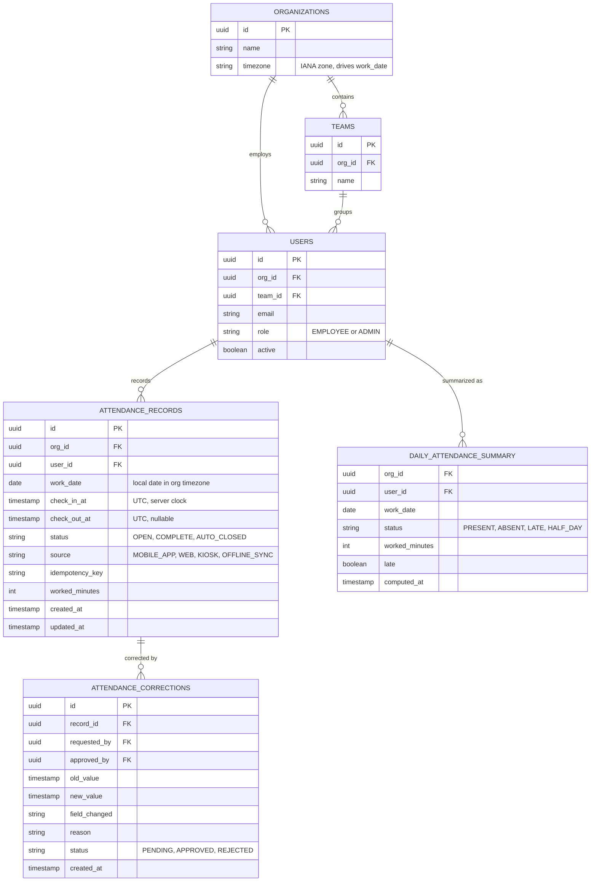

**Keys, indexes, and constraints**

- `attendance_records`: PK on `id`; **unique partial index** `UNIQUE (user_id, work_date) WHERE check_out_at IS NULL` (the one-open-record rule); unique index on `(user_id, idempotency_key)` for idempotent retries; reporting index on `(org_id, work_date)`; history index on `(user_id, work_date DESC)`.
- `daily_attendance_summary`: PK on `(user_id, work_date)` — exactly one summary row per user-day, upserted by the aggregator.
- `attendance_corrections`: FK to the record; index on `(record_id)` and on `(status)` for the approval queue.
- FK constraints keep referential integrity; `ON DELETE` is `RESTRICT` for attendance data (you archive, you do not delete, because of payroll/compliance).

**Normalization vs. denormalization**

- `attendance_records` and `attendance_corrections` are normalized (3NF): no derived values stored except `worked_minutes`, which is a *deliberate* denormalization — it is computed once at check-out so reports never recompute durations, and recomputation from timestamps is always possible if rules change.
- `daily_attendance_summary` is fully denormalized by design: it duplicates derivable data to make report reads O(1) per user-day. Drift is bounded by the nightly reconciliation job.

**Data lifecycle and partitioning**

- Hot data (current quarter) lives in the primary table with all indexes; older data can be moved to a monthly range-partitioned layout (`PARTITION BY RANGE (work_date)`) so old partitions are dropped or archived cheaply instead of row-by-row deletes.
- At SaaS scale, partition or shard by `org_id` (hash or list) so one tenant's growth never affects another's query latency.
- Retention: punch records kept for the statutory payroll period (often 3–8 years), then archived to object storage as Parquet/CSV exports.

---

### High-Level Design

The original architecture sketch is preserved as the base design:

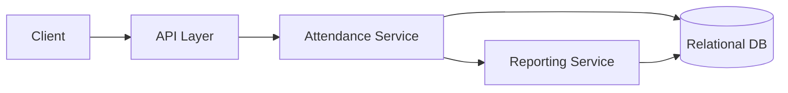

This four-box design is sufficient at single-organization scale: one API layer, a write-oriented attendance service, a read-oriented reporting service, and one relational database serving both. The production version below adds the queue, aggregator, scheduler, and a read replica without changing the fundamental shape.

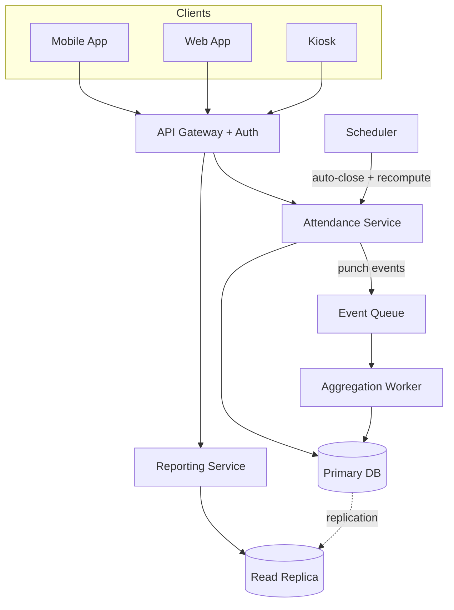

*Explanation*: all writes flow through the attendance service to the primary database, which alone enforces uniqueness. Every accepted punch emits an event; the aggregation worker maintains summary tables. Reads for reports go to a read replica so month-end analytics cannot degrade the morning punch burst. The scheduler drives the end-of-day auto-close and the nightly reconciliation.

**Check-in request flow**

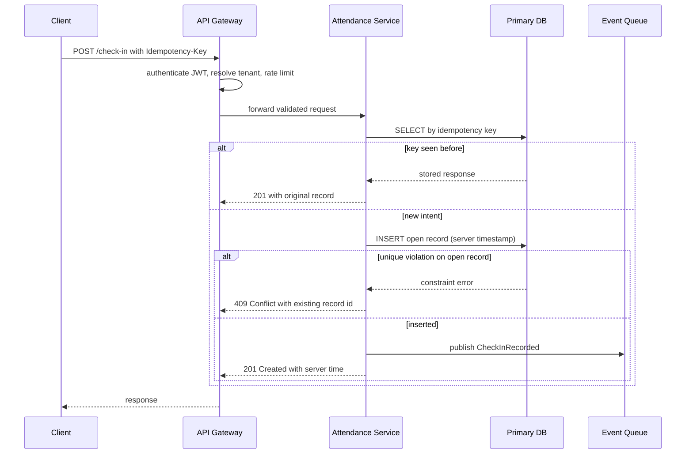

*Explanation*: the idempotency check runs first so retries are free; the unique partial index is the final arbiter of the one-open-record rule; the event is published only after the insert succeeds (via the outbox in strict deployments), so downstream summaries never observe phantom punches.

**Scaling strategy and failure handling**

- Scale the stateless services horizontally behind the gateway; the primary database scales vertically, then by tenant partitioning.
- If the queue or aggregator is down, punches are unaffected (they only need the primary DB); summaries catch up from the outbox or the nightly job.
- If the read replica lags, reports are stale but correct — never served from the primary under load.
- Database failover uses a managed primary/standby pair with synchronous replication (durability beats write availability here: better to reject a punch than to lose an acknowledged one).

---

### Deep Dive

#### 1. Check-In and Check-Out Event Capture

The punch is the atomic fact of the system, so its capture path deserves the most rigor.

**Server time as authority.** `check_in_at = Instant.now()` evaluated on the server. The client's `clientCapturedAt` is stored only as evidence for offline reconciliation. Inject a `java.time.Clock` into the service so tests can pin time — sprinkling `Instant.now()` through code makes timezone bugs untestable.

**State machine of a record.** A record is `OPEN` after check-in, becomes `COMPLETE` at check-out, or `AUTO_CLOSED` when the end-of-day job finds it still open. Corrections never mutate history silently: they create `attendance_corrections` rows, and on approval the record is updated with `updated_at` bumped and the correction linked.

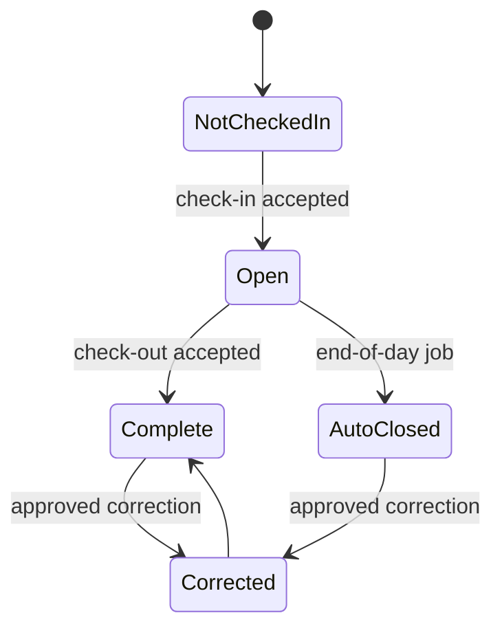

**Worked minutes.** Computed at check-out as `Duration.between(checkInAt, checkOutAt).toMinutes()` and stored. Breaks, if required later, become child rows rather than complicating the punch pair.

**Why not event sourcing here?** Two events per user-day with a corrections table already yields full auditability. Event sourcing would add replay infrastructure for no additional business guarantee — a good interview point on choosing the *sufficient* pattern.

#### 2. Timezone Handling

The hardest everyday problem in this domain.

**Rules that keep you correct**

1. Persist all instants as UTC (`timestamptz` / `Instant`). Never store local wall-clock timestamps without offset.
2. Store the organization's IANA timezone (`America/New_York`, not `UTC-5` — offsets change with DST).
3. Derive `work_date` at write time: `LocalDate.ofInstant(checkInAt, orgZone)`. Persist the derived date so queries and uniqueness never redo the conversion.
4. For night shifts, assign the work date by *shift schedule* (the date the shift started), not by calendar day of the punch — a 02:00 punch belongs to yesterday's shift.
5. Late-mark logic compares the local check-in time against the policy start time in the org's zone, both derived from the same instant.

**DST edge cases.** On spring-forward, 02:30 may not exist locally; on fall-back it occurs twice. Because all logic runs on `Instant` and only *display* and *date derivation* touch the zone, nonexistent local times cannot be produced by the system — they can only come from admin-entered corrections, which must be validated with `ZonedDateTime.ofLocal(...)` leniency rules (`withEarlierOffsetAtOverlap` etc.).

**Multi-timezone organizations.** A company with offices in New York and Bangalore keeps one org timezone per *location* (or per user assignment); reports bucket by each location's work date, and cross-location rollups state explicitly which zone defined the day.

#### 3. Duplicate Punches, Idempotency and Offline Sync

**Duplicate prevention, layered.** Layer 1 is the idempotency key: a retry with the same key short-circuits to the stored response, so *the same logical punch* can never be applied twice. Layer 2 is the unique partial index: *different* logical punches (user tapped check-in, forgot, tapped again an hour later with a new key) still collapse to one open record, and the second attempt gets a meaningful `409` with the existing record id.

**Why both layers are needed.** Idempotency keys dedupe *retries of one intent*; the unique index enforces the *business invariant*. Neither covers the other's case: a new key defeats layer 1 (it is genuinely a new intent), and a retried key never reaches layer 2.

**Offline sync protocol.** The client queues punches locally with their UUID idempotency keys and client-captured times. On reconnect it replays oldest-first. The server applies each replayed punch through the normal path with `source=OFFLINE_SYNC`; conflicts (server already has an open record from a kiosk punch) are resolved by the documented precedence — first *recorded* punch wins, and the conflicting replay is stored as a rejected sync entry for admin visibility rather than silently dropped. The response per replayed punch tells the client the outcome, so the local queue can be drained entry by entry.

```mermaid
sequenceDiagram
    participant K as Kiosk App (offline queue)
    participant A as Attendance Service
    participant D as DB
    Note over K: connectivity lost, queue punches locally
    K->>A: replay punch 1 with key k1, clientCapturedAt t1
    A->>D: insert with idempotency key k1
    D-->>A: ok
    A-->>K: 201 accepted
    K->>A: replay punch 2 with key k2
    A->>D: insert with key k2
    D-->>A: unique violation on open record
    A-->>K: 409 with existing record; logged as sync conflict
    Note over K: mark punch 2 conflicted, notify admin UI
```

#### 4. Reporting and Aggregation

**The query shapes.** Own history: `WHERE user_id = ? AND work_date BETWEEN ? AND ?` — covered by the history index, always fast. Team report: present/absent/late counts per team per range — over raw records this is a growing `GROUP BY` scan; over the summary table it is a bounded scan of one row per user-day.

**Incremental aggregation.** The aggregator consumes `CheckInRecorded`/`CheckOutRecorded`/`CorrectionApproved` events and upserts `daily_attendance_summary`: create-or-update the row for `(user_id, work_date)`, set `status`, `worked_minutes`, `late`. Upserts are idempotent because each row is a pure function of the underlying record — replaying an event converges to the same row.

**Batch reconciliation.** Nightly, recompute each affected day from raw records and overwrite drifted summary rows. This caps the damage from consumer bugs, backfills, and corrections: worst-case staleness is one day, typical staleness is seconds.

**Absent computation.** Absence is the *nonexistence* of data, so it cannot be derived from punch events alone. The nightly job compares the expected roster (active users with a work schedule for that date) against records and writes `ABSENT` summary rows for the difference. This is why reports run nightly-complete even though present/late are near-real-time.

**Late classification.** `late = checkInAt in org zone > policy start + grace`. The grace (e.g., 15 minutes) is configuration per org, injected via `@Value`, and versioned — changing the grace must not silently rewrite history, so summaries store the *result*, and the policy version used is recorded alongside for auditability.

#### 5. Manual Corrections and Audit Trail

**Workflow.** Requester (employee or admin) → correction row in `PENDING` → approver (manager/HR) → `APPROVED` → record updated, summary invalidated and recomputed, audit entry written. Admins may be granted self-approval by tenant policy, but the correction row is still written — the audit trail is unconditional.

**Why never edit in place.** A direct `UPDATE` destroys the evidence of the original value. Disputes ("I was on time, someone changed my punch") become unanswerable. With corrections-as-data, the answer is one query: `SELECT * FROM attendance_corrections WHERE record_id = ?`.

**Recomputation on approval.** Because summaries are derived, an approved correction must trigger summary recomputation for the affected `(user_id, work_date)` — implemented as just another event into the same aggregation pipeline, which keeps exactly one place where summary logic lives.

---

### Replication Strategies

**What it means**

Replication Strategies determine how data and state are copied across multiple nodes in Simple Attendance Tracking System. The choice of strategy determines the trade-off between consistency, availability, and latency.

**Why it matters**

Simple Attendance Tracking System must replicate data to prevent loss and serve reads from multiple nodes. The replication strategy determines whether the system favors consistency (strong reads) or availability (always writable), and how it handles cross-node failure.

**How it works**

**Leader-based (single-leader)**: A single primary node accepts all writes; followers replicate changes asynchronously or semi-synchronously. Reads can be served from any replica. This strategy favors strong consistency for writes but creates a write bottleneck at the leader.

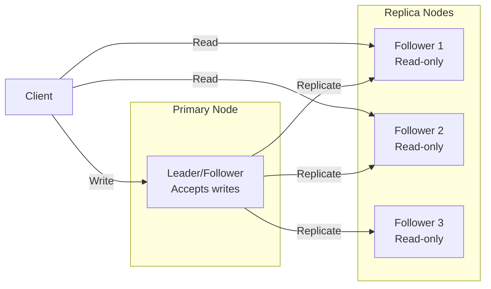

*Leader-based replication: a single primary node accepts all writes and replicates them to read-only followers. Clients can read from any replica for scaled read throughput, but all writes go through the leader.*

**Multi-leader (multi-master)**: Multiple nodes accept writes and exchange updates with each other. This enables low-latency writes in different regions but requires conflict resolution (last-write-wins, merge functions, or CRDTs).

**Leaderless (quorum-based)**: Any node can accept writes; a quorum of nodes must agree. Read and write quorums are configured so that at least one node overlaps between them (R + W > N). This maximizes availability and write scalability.

**Trade-offs for Simple Attendance Tracking System**:

| Strategy | Use Case | Pros | Cons |
|---|---|---|---|
| Leader-based | employee attendance records, timestamps | Strong consistency, simple | Write bottleneck, leader failure risk |
| Multi-leader | public holiday info, anonymized stats | Low-latency global writes | Conflict resolution, complex |
| Leaderless | Caching, counters | High availability, no bottleneck | Eventual consistency, read repair overhead |

**Real-world implementations**

- **Redis**: Leader-follower replication with asynchronous replication; Sentinel handles failover.
- **Apache Kafka**: Leader-based partition replication with ISR (in-sync replica) — writes go to the leader, followers replicate.
- **Cassandra**: Tunable consistency with leaderless quorum (R + W > N).
- **DynamoDB Global Tables**: Multi-master active-active across regions.

### Failure Detection and Membership

**What it means**

Failure Detection and Membership is the mechanism by which Simple Attendance Tracking System determines which nodes are alive and part of the cluster. Membership is the list of known nodes; failure detection is the process of updating that list when nodes fail or recover.

**Why it matters**

Simple Attendance Tracking System must route requests only to healthy nodes and trigger failover when a node goes down. False positives (healthy nodes marked as dead) cause unnecessary failovers and data loss. False negatives (dead nodes not detected) cause failed requests and degraded performance.

**How it works**

**Heartbeat-based detection**: Each node sends a heartbeat (ping) to a subset of peers at regular intervals. If a node misses N consecutive heartbeats, it is marked as suspect. The gossip protocol distributes membership information: each node exchanges its view of the cluster with a random peer, and the information propagates gossip-style.

```mermaid
sequenceDiagram
    participant A as Node A
    participant B as Node B
    participant C as Node C

    loop Every 1s
        A->>B: Heartbeat (ping)
        B-->>A: Heartbeat (ack)
    end
    B->>C: Gossip: A is alive
    C->>A: Gossip: B is alive
    Note over A,B,C: View converges in O(log N) rounds
```

*Gossip-based failure detection: each node periodically pings a random subset of peers and gossips its view of the cluster. The membership list converges in O(log N) rounds.*

**Phi Accrual Failure Detector**: Instead of a fixed timeout, the detector measures the time between consecutive heartbeats and computes a phi (φ) value — the probability that the node is dead given the observed heartbeat pattern. φ is compared against a threshold (typically 1–8); higher thresholds reduce false positives but increase detection latency.

**SWIM (Scalable Weakly-consistent Infection-style Process group Membership Protocol)**: Nodes ping a random subset of cluster members. If a ping fails, the node is marked "suspect" and the failure is "infected" (gossiped) to other nodes. This is O(log N) per failure detection cycle and scales to large clusters.

**Trade-offs**:

| Approach | Strengths | Weaknesses |
|---|---|---|
| Heartbeat (timeout-based) | Simple, deterministic | False positives under load |
| Phi Accrual | Adaptive threshold | Needs historical data |
| SWIM | Scales to 1000s of nodes | Eventual consistency |

**Real-world implementations**

- **AWS Route 53 Health Checks**: Uses TCP/HTTP health checks with configurable thresholds to remove unhealthy instances from DNS rotation.
- **Kubernetes**: Uses the kubelet heartbeat (every 10s) to determine node liveness; nodes missing 3 consecutive heartbeats are marked NotReady.
- **Consul**: Uses SWIM protocol for membership and failure detection; supports both LAN and WAN gossip.
- **Akka Cluster**: Uses Phi Accrual failure detector with configurable φ thresholds.

### High Availability and Scalability

**What it means**

High Availability and Scalability determines how Simple Attendance Tracking System continues operating when nodes or entire zones fail, and how capacity is added as demand grows. HA is about minimizing downtime; scalability is about maintaining performance as load increases.

**Why it matters**

Simple Attendance Tracking System must stay operational even when individual nodes, availability zones, or entire regions fail. At the same time, it must scale horizontally to handle traffic spikes without degrading latency. The two are intertwined: the replication strategy, failure detection, and load balancing all contribute to both HA and scalability.

**How it works**

**Availability zones (AZs)**: Nodes are distributed across multiple AZs within a region. Each AZ is an independent failure domain (power, networking, physical security). A load balancer distributes requests across AZs; if one AZ fails, traffic is routed to the remaining AZs with no data loss (assuming replication is in place).

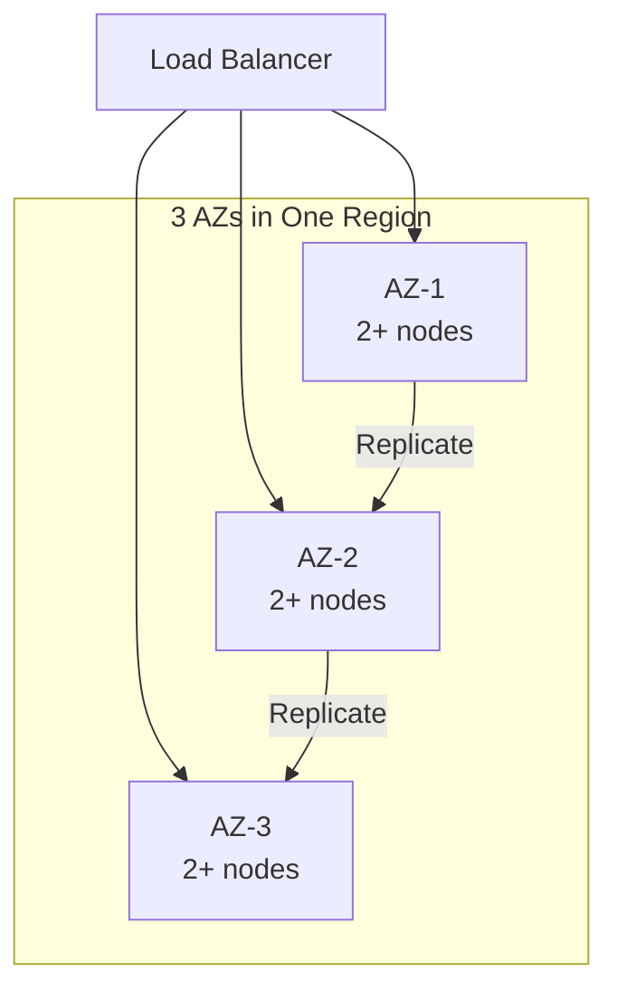

*Multi-AZ deployment: a load balancer distributes traffic across three availability zones. Each AZ has multiple nodes. Data is replicated across AZs so that losing one AZ does not cause data loss or service interruption.*

**Load balancing**: A load balancer distributes incoming requests across healthy nodes. Algorithms include round-robin, least connections, and weighted routing. Health checks ensure traffic only goes to healthy nodes. For Simple Attendance Tracking System, the load balancer also considers **Client applications (mobile, web, kiosk)**
  Capture check-in/check-out intent when routing.

**Auto-scaling**: The system automatically adds or removes nodes based on metrics (CPU, memory, request rate). Scale-out policies add nodes when load exceeds a threshold; scale-in policies remove nodes during low load. For stateful services like Simple Attendance Tracking System, scale-out involves rebalancing partitions (moving data and connections to the new node).

**Failover and recovery**: When a node fails, the load balancer detects it (via health checks or failure detection) and stops sending traffic. A new node is provisioned (or a standby is promoted) and begins serving. For Simple Attendance Tracking System, failover must preserve employee attendance records, timestamps data — this is achieved through replication with a quorum of healthy nodes.

**Scalability patterns**:

1. **Horizontal partitioning (sharding)**: Split data by a partition key (e.g., user_id, session_id) and distribute partitions across nodes. New nodes take ownership of additional partitions.

2. **Consistent hashing**: Minimize data movement on scale-out — only 1/N of the data moves to the new node. Nodes and partitions are placed on a ring; a request for key X is routed to the next node clockwise from hash(X).

3. **Connection draining**: When scaling in, existing connections are allowed to complete before the node is shut down. For Simple Attendance Tracking System, this means draining active 1. sessions gracefully.

**Real-world implementations**

- **Netflix OSS (Eureka + Zuul + Ribbon)**: Service discovery with Eureka, edge routing with Zuul, and client-side load balancing with Ribbon. Scales to thousands of instances.
- **Kubernetes HPA + VPA**: Horizontal Pod Autoscaler scales pods based on CPU/memory; Vertical Pod Autoscaler adjusts resource requests based on historical usage.
- **AWS ALB + Auto Scaling Groups**: Application Load Balancer with auto-scaling groups across AZs; health checks replace unhealthy instances automatically.

### Performance and Optimization

**What it means**

Performance and Optimization covers the techniques Simple Attendance Tracking System uses to achieve low latency, high throughput, and efficient resource usage. This section examines the key performance metrics, bottlenecks, and optimizations specific to the system.

**Why it matters**

Simple Attendance Tracking System faces competing pressures: users demand low latency, the system must handle high throughput, and infrastructure costs must be controlled. The optimizations applied at the data, compute, and network layers determine whether the system meets its SLA.

**How it works**

**Latency layers**: Latency in Simple Attendance Tracking System comes from three layers:
1. **Network**: Round-trip time from client to the nearest edge node / load balancer.
2. **Application**: Request processing time on the server (CPU, I/O, lock contention).
3. **Data**: Time to read/write from storage (cache hit vs. database query).

The 99th-percentile latency is the key metric for user-facing systems — it determines the worst-case experience.

**Caching strategies**: Simple Attendance Tracking System uses multiple cache layers:
- **Edge cache**: Static assets (images, CSS, JS) served from a CDN at the edge. For Simple Attendance Tracking System, this caches public holiday info, anonymized stats that doesn't change frequently.
- **Application cache**: In-memory cache (e.g., Redis, Memcached) for frequently accessed data. Cache-aside pattern: application checks cache first, falls back to database on miss.
- **Local cache**: In-process cache (e.g., Caffeine, Guava) for data accessed within a single request. Avoids network round-trips.

**Batching and pipelining**: Simple Attendance Tracking System batches small operations (e.g., writes, log flushes) to amortize per-operation overhead. Pipelining allows multiple requests to be in flight simultaneously.

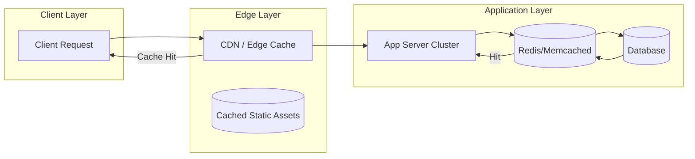

*Caching hierarchy: clients first hit the edge CDN/cache; if the response is cached, it is returned immediately. Otherwise, the request reaches the application, which checks its in-memory/application cache (e.g., Redis) before falling back to the database. This minimizes latency from each layer.*

**Connection pooling**: Simple Attendance Tracking System maintains a pool of database connections to avoid the TCP handshake overhead on every request. Pool size is tuned to match the database's capacity.

**Compression**: Responses are compressed (gzip, zstd) for clients that support it. At the network layer, gRPC uses HPACK header compression.

**Indexing**: Database tables are indexed on frequently queried fields. For Simple Attendance Tracking System, indexes cover **API layer / gateway**
  Authenticates requests (JWT/OAuth2), enforces rate lim and **Attendance service (write path)**
  Owns the punch state machine: validates th for fast lookups.

**Asynchronous processing**: Non-critical background work (e.g., analytics, cleanup, notifications) is offloaded to message queues and processed asynchronously, keeping the request path fast.

**Resource isolation**: CPU and memory are allocated per service (containers with cgroup limits). This prevents a single misbehaving service from degrading the entire system.

**Metrics for Simple Attendance Tracking System**:

| Metric | Target | How to Measure |
|---|---|---|
| P99 latency | < 1s | Load test with realistic traffic |
| Throughput | 1K RPS | Request rate under peak load |
| Error rate | < 0.1% | 5xx / total requests |
| Cache hit ratio | > 90% | cache_hits / (cache_hits + misses) |
| Resource utilization | < 80% CPU, < 85% memory | Container metrics |

**Real-world implementations**

- **Google's HTTP Load Balancer**: Global load balancing with edge PoPs; routes users to the nearest healthy backend.
- **Cloudflare**: Edge cache with Argo Smart Routing that dynamically routes traffic to avoid congestion.
- **Redis**: Used as an application cache with configurable eviction policies (LRU, LFU, TTL).

### Encryption and Key Management

**What it means**

Encryption and Key Management in Simple Attendance Tracking System ensures that data is protected both at rest (stored on disk) and in transit (moving between services). Key management governs how encryption keys are generated, stored, rotated, and accessed — without proper key management, encryption provides a false sense of security.

**Why it matters**

Simple Attendance Tracking System handles employee attendance records, timestamps that must be encrypted both at rest and in transit. Scaling Simple Attendance Tracking System to handle increasing load while maintaining data consistency, low latency, and fault tolerance requires careful key management: keys must be rotated regularly, scoped to prevent cross-contamination, and audited for compliance. A single key compromise could expose sensitive data.

**How it works**

**At-rest encryption**: Data stored in **Client applications (mobile, web, kiosk)**
  Capture check-in/check-out intent, **API layer / gateway**
  Authenticates requests (JWT/OAuth2), enforces rate lim and databases is encrypted using AES-256-GCM. The Data Encryption Key (DEK) is generated per data partition and encrypted with a Key Encryption Key (KEK) managed by a KMS (AWS KMS, GCP KMS, HashiCorp Vault). Keys are regionally scoped — only data belonging to a region can be decrypted by that region's KEK.

**In-transit encryption**: All inter-service communication uses TLS 1.3 or mTLS for service-to-service auth. Cross-region communication of public holiday info, anonymized stats uses TLS + optional application-level encryption. employee attendance records, timestamps is NEVER transmitted in plaintext or across region boundaries.

**Key hierarchy**:
```
Master Key (HSM-backed, KMS-managed)
  └─ KEK (per region, per service)
     └─ DEK (per data partition, rotated every 90 days)
        └─ Data (encrypted with DEK)
```

**Key rotation**: KEKs rotate annually (automatic via KMS); DEKs rotate per object or per 90 days. Applications handle key version headers transparently — a DEK version is stored alongside the encrypted data.

**Cross-region key sharing**: For non-restricted data (public holiday info, anonymized stats), a shared key is imported into each region's KMS. Restricted data NEVER uses cross-region keys — each region's KMS holds only that region's keys.

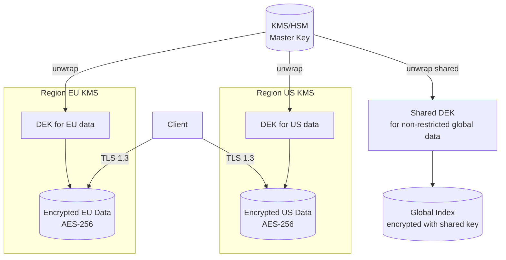

*Encryption key hierarchy: master keys are managed by an HSM-backed KMS and never leave the KMS. Each region has its own KEK. Data encryption keys (DEKs) are generated per partition and encrypted with the regional KEK. Only non-restricted global data uses a shared cross-region key. All client traffic uses TLS 1.3.*

**Java/Spring Boot Implementation**

```java
@Service
@RequiredArgsConstructor
public class DataEncryptionService {

    private final AWSKMS kms;
    @Value("${app.region}")
    private String region;
    @Value("${app.encryption.dek-ttl-minutes:1440}")
    private int dekTtlMinutes;

    private final Map<String, SecretKey> dekCache = new ConcurrentHashMap<>();

    public EncryptedData encrypt(String plaintext, String partitionId) {
        SecretKey dek = getOrCreateDek(partitionId);
        byte[] ciphertext = CryptoUtils.encrypt(plaintext.getBytes(StandardCharsets.UTF_8), dek);
        String dekCiphertext = kms.encrypt(EncryptRequest.builder()
            .keyId("arn:aws:kms:" + region + ":master-key")
            .plaintext(SdkBytes.fromByteArray(dek.getEncoded()))
            .build()).ciphertextBlob().asByteArray();
        return new EncryptedData(ciphertext, dekCiphertext, Instant.now());
    }

    private SecretKey getOrCreateDek(String partitionId) {
        return dekCache.computeIfAbsent(partitionId, id -> {
            try {
                return KeyGenerator.getInstance("AES").generateKey();
            } catch (NoSuchAlgorithmException e) {
                throw new IllegalStateException("Cannot generate DEK", e);
            }
        });
    }
}
```

*Spring Boot encryption service: DEKs are cached per-partition with TTL. Each DEK is encrypted via AWS KMS using a regional master key. The encrypted DEK (ciphertext) is stored alongside the data — only the KMS for that region can decrypt it.*

**Real-world implementations**

- **AWS KMS**: Managed HSM-backed key service; supports automatic key rotation and custom key stores.
- **HashiCorp Vault**: Open-source key management; supports transit encryption (encrypt/decrypt without storing keys).
- **Google Cloud KMS**: Hardware-backed key management with IAM-based access control.

### Authentication and Authorization

**What it means**

Authentication and Authorization (AuthN/AuthZ) in Simple Attendance Tracking System control who can access the system and what they can do. Authentication verifies identity; authorization determines permissions. In a distributed system like Simple Attendance Tracking System, auth must work across multiple nodes while respecting data boundaries — a user authenticated in one region should not have their session data or tokens replicated to regions where it is not permitted.

**Why it matters**

Simple Attendance Tracking System must verify identity at the edge and enforce authorization at every service boundary. employee attendance records, timestamps must be protected — only users with appropriate roles should access it. At the same time, public holiday info, anonymized stats data should be accessible to a wider audience with minimal friction.

**How it works**

**Authentication (who are you?)**:
- **JWT tokens**: Users authenticate through their home region's identity provider. The region returns a JWT (JSON Web Token) signed by a regional signing key. Tokens include claims like `iss` (issuer region), `sub` (subject/user ID), `home_region`, `roles`, and `exp` (expiry). Tokens are scoped per region — a token issued by region A cannot access restricted data in region B.
- **mTLS for service-to-service**: Internal services authenticate each other using mutual TLS certificates issued by a per-region Certificate Authority (CA). No shared secrets cross region boundaries.
- **Session management**: Sessions are stored regionally (Redis) and never replicated cross-region for restricted data. Session IDs are opaque UUIDs; the session store maps session ID → user context.

**Authorization (what can you do?)**:
- **RBAC (Role-Based Access Control)**: Users are assigned roles per region. Common roles: `region_admin` (full access to region data), `auditor` (read-only audit), `viewer` (read public data only). Roles are stored in the regional database and cached locally for sub-1ms lookups.
- **ABAC (Attribute-Based Access Control)**: Fine-grained permissions based on attributes (e.g., `home_region == request_region AND role == admin`). This allows expressing complex policies like "users can only access restricted data in their home region."
- **Resource-level authorization**: Each request is checked against an ACL (Access Control List) that specifies which roles can access which resources. For Simple Attendance Tracking System, restricted resources require the `admin` role + matching region.

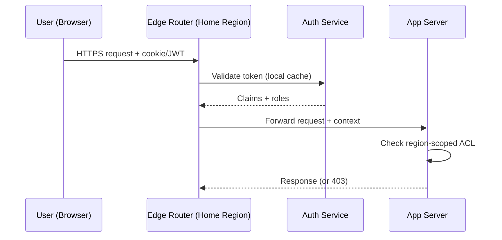

*Authentication flow: the user's token is validated by the regional auth service (claims cached locally). The edge router forwards the request with the security context. Each app server checks the region-scoped ACL before accessing restricted data.*

**Java/Spring Boot Implementation**

```java
@Service
@RequiredArgsConstructor
public class AuthorizationService {

    private final UserTokenRepository tokenRepository;
    @Value("${app.region}")
    private String currentRegion;

    public boolean canAccessResource(String userId, String resourceRegion,
                                     String action, JWTClaims claims) {
        String userHomeRegion = claims.getStringClaim("home_region");
        List<String> roles = claims.getStringListClaim("roles");

        if (!roles.contains(action)) {
            return false;
        }

        if (resourceRegion.equals(userHomeRegion)) {
            return true;
        }

        if (resourceRegion.equals("global")) {
            return roles.contains("global_reader");
        }

        return false;
    }
}

@RestController
@RequiredArgsConstructor
@RequestMapping("/api/v1")
public class RegionController {
    private final AuthorizationService authService;

    @GetMapping("/data/{region}/profile")
    public ResponseEntity<?> getProfile(
            @PathVariable String region,
            @RequestHeader("Authorization") String token) {
        JWTClaims claims = JwtUtils.parseAndValidate(token, currentRegion);

        if (!authService.canAccessResource(
                claims.getStringClaim("sub"), region, "read", claims)) {
            return ResponseEntity.status(HttpStatus.FORBIDDEN).build();
        }

        return ResponseEntity.ok(profileService.getByRegion(region));
    }
}
```

*Spring Boot authorization service: checks both the user's role and whether the requested resource violates region boundaries. The `canAccessResource` method returns false if a user from region EU tries to access restricted data in region US.*

**Real-world implementations**

- **Auth0**: JWT-based authentication with regional endpoints; supports custom rules for ABAC.
- **Okta**: Multi-region identity management with adaptive MFA and ThreatInsight for anomaly detection.
- **AWS Cognito**: Regional user pools with IAM integration; tokens are region-scoped by default.

### Security Threats and Mitigations

**What it means**

Security Threats and Mitigations catalog the attack surface of Simple Attendance Tracking System, the most likely threats, and the corresponding defenses. Every distributed system has unique threat vectors — Simple Attendance Tracking System is no exception.

**Why it matters**

Simple Attendance Tracking System handles employee attendance records, timestamps that attackers might target. Scaling Simple Attendance Tracking System to handle increasing load while maintaining data consistency, low latency, and fault tolerance expands the attack surface: more nodes, more network paths, more failure modes. Without proper threat modeling, a single vulnerability could expose sensitive data across the entire system.

**Threat model**:

| Threat | Likelihood | Impact | Mitigation |
|---|---|---|---|
| Data exfiltration (cross-region) | High | Critical | Region-scoped keys, no cross-region replication of restricted data |
| Man-in-the-middle (inter-service) | Medium | High | mTLS between all services |
| Replay attacks | Medium | High | Token expiry + nonce |
| DDoS at the edge | High | High | Rate limiting + edge filtering (Cloudflare, AWS Shield) |
| PII leakage in logs | High | High | PII redaction + field-level access control |
| Session hijacking | Medium | Medium | Short-lived tokens + IP binding |
| Privilege escalation | Low | Critical | Least-privilege RBAC + audit logs |
| Cache poisoning | Low | Medium | Cache invalidation on write + signed cache keys |

**How it works**

**Data exfiltration prevention**: Simple Attendance Tracking System enforces data residency by design — employee attendance records, timestamps is never replicated cross-region. The replication layer checks a data classification label before allowing cross-region copy. A database-level policy (e.g., PostgreSQL RLS) also blocks cross-region queries for restricted partitions.

**mTLS enforcement**: All service-to-service communication uses mutual TLS. Certificates are issued by a per-region CA and rotated every 30 days. Services must present a valid certificate to communicate — no plaintext connections are allowed.

**PII redaction**: Application logs are scanned for PII patterns (email, phone, credit card) using an automated redaction layer (e.g., AWS Macie, Google DLP). public holiday info, anonymized stats is logged freely; restricted fields are masked or dropped before logging.

```mermaid
graph TD
    subgraph "Threat Surface"
        Client[Client]
        Edge[Edge Router / WAF]
        App[App Server]
        DB[(Database)]
        Cache[(Cache)]
        Logs[Log Store]
    end

    Client -->|HTTPS| Edge
    Edge -->|mTLS| App
    App -->|mTLS| DB
    App -->|Read| Cache
    App -->|Write| DB
    App -->|Log| Logs

    subgraph "Mitigations"
        WAF[AWS WAF /<br/>Cloudflare]
        DLP[PII Redaction<br/>(Macie/DLP)]
        FIM[File Integrity<br/>Monitoring]
    end

    Edge -.-> WAF
    Logs -.-> DLP
    DB -.-> FIM
```

*Threat mitigation diagram: the WAF at the edge blocks DDoS and injection attacks. mTLS protects all service-to-service communication. PII redaction scans logs before storage. File integrity monitoring alerts on database tampering.*

**Audit trail**: All security-relevant events (auth, data access, config changes) are written to an append-only audit log with cryptographic integrity (HMAC per entry). The log covers employee attendance records, timestamps access — who accessed what, when, and from where.

**Real-world implementations**

- **Cloudflare**: Zero-trust model (All Connections to All Networks) with mTLS everywhere; uses GeoIP blocking and rate limiting for DDoS mitigation.
- **Google BeyondCorp**: Zero-trust network security model; all access is authenticated and authorized at the request level.

### Observability and Logging

**What it means**

Observability and Logging in Simple Attendance Tracking System provide visibility into system behavior through three pillars: **metrics** (aggregates and counters), **logs** (structured event records), and **traces** (distributed request timelines). Together, these signals allow operators to debug issues, detect anomalies, and verify SLA compliance.

**Why it matters**

Distributed systems like Simple Attendance Tracking System are inherently opaque — failures can cascade across services in unexpected ways. Without good observability, a single slow dependency can cause widespread timeouts that are nearly impossible to diagnose. Scaling Simple Attendance Tracking System to handle increasing load while maintaining data consistency, low latency, and fault tolerance makes observability even more critical: operators need to see cross-region latency, regional failures, and data-residency violations.

**How it works**

**Metrics**: Simple Attendance Tracking System instruments every service with Prometheus-style metrics:
- **Request rate, error rate, duration (the "RED" metrics)**: Tracks per-endpoint HTTP latency and error counts.
- **System metrics**: CPU, memory, disk I/O, network throughput per node.
- **Business metrics**: For Simple Attendance Tracking System, this includes metrics like "**API layer / gateway**
  Authenticates requests (JWT/OAuth2), enforces rate lim fill rate" and "reservation conflict rate".

Metrics are aggregated in a time-series database (Prometheus, VictoriaMetrics) and visualized in Grafana dashboards with alerts via PagerDuty.

**Logs**: Simple Attendance Tracking System uses structured logging (JSON format) with standardized fields:
- `timestamp`: ISO 8601 UTC
- `level`: DEBUG, INFO, WARN, ERROR
- `service`: originating service name
- `trace_id`: distributed trace identifier (for correlation)
- `span_id`: current operation span
- `region`: the region that processed the request
- `data_class`: RESTRICTED or NON_RESTRICTED

employee attendance records, timestamps access is logged with full context (user, action, resource). public holiday info, anonymized stats logs are aggregated and may have reduced retention.

**Distributed tracing**: Every request is assigned a trace ID at the edge. The trace propagates through all downstream services via HTTP headers. A tracing backend (Jaeger, Tempo, Zipkin) reconstructs the full request timeline, showing latency at each hop. For Simple Attendance Tracking System, traces include region boundaries — a cross-region call is annotated as such.

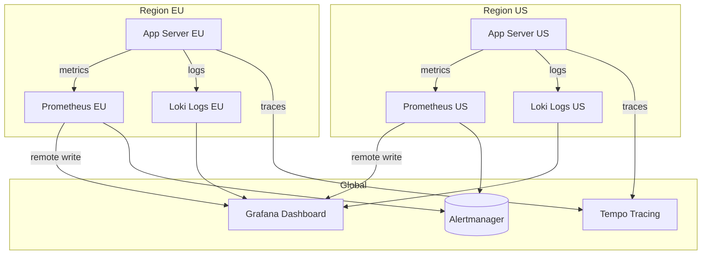

*Observability architecture: each region runs its own Prometheus (metrics) and Loki (logs) instances. A global Grafana instance queries all regional backends. Traces are collected centrally in Tempo. Alerts fire from each region's Prometheus to Alertmanager.*

**Alerting**: Simple Attendance Tracking System defines SLO-based alerts:
- **Latency**: P99 > 1s for 5 minutes → page.
- **Error rate**: > 1% for 10 minutes → page.
- **Availability**: < 99.5% for 15 minutes → page.
- **Data residency violation**: any restricted data detected outside its region → critical page.

**Java/Spring Boot Implementation**

```java
@Component
@RequiredArgsConstructor
@Slf4j
public class ObservabilityContext {

    @Value("${app.region}")
    private String region;

    public void logAccess(String userId, String resource, String action,
                          boolean restricted) {
        log.info("access_event userId={} resource={} action={} region={} data_class={}",
            userId, resource, action, region, restricted ? "RESTRICTED" : "NON_RESTRICTED");
    }
}

@RestController
@RequiredArgsConstructor
@Slf4j
public class ApiController {
    private final ObservabilityContext obs;
    private final UserService userService;

    @GetMapping("/api/v1/profile")
    public ResponseEntity<ProfileResponse> getProfile(
            @AuthenticationPrincipal UserDetails user) {
        String traceId = MDC.get("traceId");
        long start = System.nanoTime();

        try {
            ProfileResponse response = userService.getProfile(user.getId());
            obs.logAccess(user.getId(), "profile", "read", true);

            return ResponseEntity.ok(response);
        } finally {
            long durationMs = (System.nanoTime() - start) / 1_000_000;
            log.info("profile_read traceId={} latencyMs={} region={}",
                traceId, durationMs, obs.region);
        }
    }
}
```

*Spring Boot observability: the `ObservabilityContext` logs structured access events with data classification. The controller records latency and trace ID for every request, enabling SLO-based alerting.*

**Real-world implementations**

- **Netflix OSS (Atlas + Zipkin + Servo)**: Metrics via Atlas, traces via Zipkin, instrumented via Servo. Scales to over 700 billion requests/day.
- **Google SRE Workbook**: Comprehensive observability with SLI/SLO/SLI definition; uses Borgmon for metrics and Dapper for tracing.
- **AWS Observability**: CloudWatch for metrics, X-Ray for tracing, CloudWatch Logs for structured logs.

### Real-World Implementations

**Simple Attendance Tracking System in production**

- **Simple Attendance Tracking System platforms**: widely used simple attendance tracking system platform

**Key takeaways**

- Scalability patterns proven in production at scale
- Common pitfalls and how to avoid them
- Integration with existing infrastructure and monitoring

### Java and Spring Boot Implementation Guide

Production-oriented Spring Boot 3.x / Java 17 implementation of the write path. Every class is a Spring bean; configuration is externalized with `@Value`; dependencies are constructor-injected.

#### 1. JPA entity

```java
import jakarta.persistence.*;
import java.time.Instant;
import java.time.LocalDate;
import java.util.UUID;

@Entity
@Table(name = "attendance_records",
       uniqueConstraints = @UniqueConstraint(
           name = "uq_idempotency", columnNames = {"user_id", "idempotency_key"}),
       indexes = {
           @Index(name = "idx_user_date", columnList = "user_id, work_date"),
           @Index(name = "idx_org_date", columnList = "org_id, work_date")
       })
public class AttendanceRecord {

    @Id
    private UUID id;

    @Column(name = "org_id", nullable = false)
    private UUID orgId;

    @Column(name = "user_id", nullable = false)
    private UUID userId;

    @Column(name = "work_date", nullable = false)
    private LocalDate workDate;

    @Column(name = "check_in_at", nullable = false)
    private Instant checkInAt;

    @Column(name = "check_out_at")
    private Instant checkOutAt;

    @Enumerated(EnumType.STRING)
    @Column(nullable = false)
    private AttendanceStatus status; // OPEN, COMPLETE, AUTO_CLOSED

    @Enumerated(EnumType.STRING)
    @Column(nullable = false)
    private PunchSource source; // MOBILE_APP, WEB, KIOSK, OFFLINE_SYNC

    @Column(name = "idempotency_key", nullable = false)
    private String idempotencyKey;

    @Column(name = "worked_minutes")
    private Integer workedMinutes;

    protected AttendanceRecord() {
        // for JPA
    }

    public AttendanceRecord(UUID orgId, UUID userId, LocalDate workDate,
                            Instant checkInAt, PunchSource source, String idempotencyKey) {
        this.id = UUID.randomUUID();
        this.orgId = orgId;
        this.userId = userId;
        this.workDate = workDate;
        this.checkInAt = checkInAt;
        this.source = source;
        this.idempotencyKey = idempotencyKey;
        this.status = AttendanceStatus.OPEN;
    }

    public void checkOut(Instant checkOutAt) {
        if (this.status != AttendanceStatus.OPEN) {
            throw new IllegalStateException("record is not open");
        }
        this.checkOutAt = checkOutAt;
        this.status = AttendanceStatus.COMPLETE;
        this.workedMinutes = (int) java.time.Duration.between(checkInAt, checkOutAt).toMinutes();
    }

    public UUID getId() { return id; }
    public LocalDate getWorkDate() { return workDate; }
    public Instant getCheckInAt() { return checkInAt; }
    public AttendanceStatus getStatus() { return status; }
}
```

The entity keeps invariants close to the state: `checkOut` refuses to close a non-open record, so even a bug in calling code cannot produce an impossible state.

#### 2. Repository

```java
import org.springframework.data.jpa.repository.JpaRepository;
import java.time.LocalDate;
import java.util.Optional;
import java.util.UUID;

public interface AttendanceRepository extends JpaRepository<AttendanceRecord, UUID> {

    Optional<AttendanceRecord> findByUserIdAndIdempotencyKey(UUID userId, String idempotencyKey);

    boolean existsByUserIdAndWorkDateAndCheckOutAtIsNull(UUID userId, LocalDate workDate);

    Optional<AttendanceRecord> findByUserIdAndWorkDateAndCheckOutAtIsNull(UUID userId, LocalDate workDate);
}
```

Derived queries map directly to the access patterns identified in data modeling; the database unique partial index (created by migration, since JPA cannot express `WHERE check_out_at IS NULL`) backs the exists/find pair.

#### 3. DTOs and validation

```java
import jakarta.validation.constraints.NotBlank;
import jakarta.validation.constraints.NotNull;
import java.time.Instant;
import java.time.LocalDate;

public record CheckInRequest(
        Instant clientCapturedAt,          // optional, evidence only
        @NotNull PunchSource source) {}

public record AttendanceResponse(
        UUID recordId,
        LocalDate workDate,
        Instant checkInAt,
        Instant checkOutAt,
        Integer workedMinutes,
        String status) {}
```

Records give immutability and concise equals/toString for free; Bean Validation annotations keep the controller thin.

#### 4. Service with externalized configuration

```java
import org.springframework.beans.factory.annotation.Value;
import org.springframework.context.ApplicationEventPublisher;
import org.springframework.dao.DataIntegrityViolationException;
import org.springframework.stereotype.Service;
import org.springframework.transaction.annotation.Transactional;

import java.time.Clock;
import java.time.Instant;
import java.time.LocalDate;
import java.time.ZoneId;
import java.util.UUID;

@Service
public class AttendanceService {

    private final AttendanceRepository repository;
    private final ApplicationEventPublisher events;
    private final Clock clock;
    private final ZoneId orgZone;   // resolved per tenant in production

    public AttendanceService(AttendanceRepository repository,
                             ApplicationEventPublisher events,
                             Clock clock,
                             @Value("${attendance.org-timezone:Asia/Kolkata}") String orgTimezone) {
        this.repository = repository;
        this.events = events;
        this.clock = clock;
        this.orgZone = ZoneId.of(orgTimezone);
    }

    @Transactional
    public AttendanceRecord checkIn(UUID orgId, UUID userId, CheckInRequest request, String idempotencyKey) {
        // Layer 1: idempotent retry — return the original result for a repeated key.
        var existing = repository.findByUserIdAndIdempotencyKey(userId, idempotencyKey);
        if (existing.isPresent()) {
            return existing.get();
        }

        Instant now = Instant.now(clock);              // server clock is authoritative
        LocalDate workDate = LocalDate.ofInstant(now, orgZone);

        var record = new AttendanceRecord(orgId, userId, workDate, now, request.source(), idempotencyKey);
        try {
            var saved = repository.saveAndFlush(record);
            events.publishEvent(new CheckInRecordedEvent(saved.getId(), userId, workDate));
            return saved;
        } catch (DataIntegrityViolationException e) {
            // Layer 2: unique partial index says an open record already exists.
            throw new DuplicateCheckInException(userId, workDate);
        }
    }

    @Transactional
    public AttendanceRecord checkOut(UUID userId, String idempotencyKey) {
        Instant now = Instant.now(clock);
        LocalDate workDate = LocalDate.ofInstant(now, orgZone);
        var open = repository.findByUserIdAndWorkDateAndCheckOutAtIsNull(userId, workDate)
                .orElseThrow(() -> new NoOpenRecordException(userId, workDate));
        open.checkOut(now);
        events.publishEvent(new CheckOutRecordedEvent(open.getId(), userId, workDate));
        return open;
    }
}
```

Key points to explain in an interview: the `Clock` bean makes timezone logic testable; `saveAndFlush` forces the constraint check inside the transaction so the violation maps to a domain exception; events are published from inside the transaction and, in strict deployments, an outbox table would replace direct publishing; the tenant's zone would normally be resolved from the tenant record rather than a single `@Value`, which is shown here to demonstrate externalized configuration.

#### 5. Controller

```java
import jakarta.validation.Valid;
import org.springframework.http.HttpStatus;
import org.springframework.http.ResponseEntity;
import org.springframework.web.bind.annotation.*;

import java.util.UUID;

@RestController
@RequestMapping("/api/v1/attendance")
public class AttendanceController {

    private final AttendanceService attendanceService;

    public AttendanceController(AttendanceService attendanceService) {
        this.attendanceService = attendanceService;
    }

    @PostMapping("/check-in")
    public ResponseEntity<AttendanceResponse> checkIn(
            @RequestHeader("Idempotency-Key") String idempotencyKey,
            @Valid @RequestBody CheckInRequest request) {
        var principal = SecurityContext.current();   // resolved from JWT by a filter
        var saved = attendanceService.checkIn(principal.orgId(), principal.userId(), request, idempotencyKey);
        return ResponseEntity.status(HttpStatus.CREATED).body(AttendanceMapper.toResponse(saved));
    }

    @PostMapping("/check-out")
    public AttendanceResponse checkOut(@RequestHeader("Idempotency-Key") String idempotencyKey) {
        var principal = SecurityContext.current();
        return AttendanceMapper.toResponse(attendanceService.checkOut(principal.userId(), idempotencyKey));
    }
}
```

The controller contains no business logic: authentication context, header extraction, delegation, and status codes only.

#### 6. Exception handling

```java
import org.springframework.http.HttpStatus;
import org.springframework.http.ProblemDetail;
import org.springframework.web.bind.annotation.ExceptionHandler;
import org.springframework.web.bind.annotation.RestControllerAdvice;

@RestControllerAdvice
public class AttendanceExceptionHandler {

    @ExceptionHandler(DuplicateCheckInException.class)
    public ProblemDetail duplicate(DuplicateCheckInException e) {
        var problem = ProblemDetail.forStatusAndDetail(HttpStatus.CONFLICT, e.getMessage());
        problem.setTitle("Already checked in");
        return problem;
    }

    @ExceptionHandler(NoOpenRecordException.class)
    public ProblemDetail noOpenRecord(NoOpenRecordException e) {
        var problem = ProblemDetail.forStatusAndDetail(HttpStatus.CONFLICT, e.getMessage());
        problem.setTitle("No open attendance record");
        return problem;
    }
}
```

RFC 7807 `ProblemDetail` gives clients a stable, machine-readable error contract — interviewers notice when errors are designed rather than leaked as stack traces.

#### 7. Scheduled end-of-day job and aggregation listener

```java
import org.springframework.beans.factory.annotation.Value;
import org.springframework.scheduling.annotation.Scheduled;
import org.springframework.stereotype.Component;
import org.springframework.transaction.event.TransactionalEventListener;
import org.springframework.transaction.event.TransactionPhase;

@Component
public class AttendanceMaintenanceJobs {

    private final AutoCloseService autoCloseService;

    public AttendanceMaintenanceJobs(AutoCloseService autoCloseService) {
        this.autoCloseService = autoCloseService;
    }

    // 23:55 in the organization timezone; idempotent so reruns are safe.
    @Scheduled(cron = "${attendance.auto-close-cron:0 55 23 * * *}")
    public void autoCloseStaleOpenRecords() {
        autoCloseService.closeAllOpenForToday();
    }
}

@Component
class SummaryProjection {

    private final DailySummaryRepository summaries;

    SummaryProjection(DailySummaryRepository summaries) {
        this.summaries = summaries;
    }

    // Runs only after the punch transaction commits, so the projection never sees phantom data.
    @TransactionalEventListener(phase = TransactionPhase.AFTER_COMMIT)
    public void on(CheckInRecordedEvent event) {
        summaries.upsertPresent(event.userId(), event.workDate());
    }
}
```

`@TransactionalEventListener(AFTER_COMMIT)` is the in-process alternative to a full outbox relay and is exactly the right size for the basic system; mention the upgrade path to a queue-based outbox in interviews.

---

### Interview Questions and Answers

**Q1. What is an attendance tracking system, and what problems does it solve? (Beginner)**

A system that records when people start and end their work or study day and turns those events into histories and aggregate reports. It solves four concrete problems: trustworthy time records for payroll and compliance, real-time visibility for managers (who is present/late/absent), elimination of spreadsheet manipulation through server-stamped, audited data, and a correction workflow for human error. Expected discussion: the difference between the raw event record (source of truth) and derived reports.

**Q2. Walk me through the check-in flow end to end. (Beginner)**

Client sends `POST /attendance/check-in` with a JWT and an idempotency key → gateway authenticates, resolves the tenant, and rate-limits → the service checks the idempotency store for a prior result with this key → if new, it stamps `Instant.now()` on the server, derives the local `work_date` from the org timezone, and inserts an `OPEN` record → the unique partial index guarantees no second open record exists → on success an event is published for the aggregation pipeline → `201` returns the record with the server timestamp. On constraint violation the service returns `409` with the existing record id. Common mistake: describing an application-level "check-then-insert" without the database constraint, which races.

**Q3. Why must the server clock be authoritative? (Beginner/Intermediate)**

Clients are adversarial territory: a user can set their phone back two hours and "arrive on time." Server time is the only clock the organization controls, so it stamps the official instant. The client timestamp is still captured — as evidence for offline reconciliation and clock-skew diagnostics, never as truth. Follow-up: how do you make time logic testable? Inject a `java.time.Clock` bean rather than calling `Instant.now()` statically.

**Q4. How do you guarantee one open record per user per day? (Intermediate)**

With a database-enforced unique partial index: `UNIQUE (user_id, work_date) WHERE check_out_at IS NULL`. Any concurrent or retried insert that would create a second open record fails at commit; the application translates the violation to `409 Conflict`. Application-level existence checks are a read-then-write race across app instances and must never be the enforcement mechanism. Follow-up: what changes for multi-tenancy? Include `org_id` in the constraint and every query. Trade-off: the rule is now schema-coupled, which is fine because the invariant is business-fundamental, not incidental.

**Q5. How is check-in idempotency implemented, and why is the unique constraint not enough? (Intermediate/Advanced)**

The client generates a UUID per user intent and sends it as `Idempotency-Key`; the server stores it with the record and short-circuits repeated keys to the stored response. This dedupes *retries of one intent* (network timeout, double tap). The unique open-record index enforces a *different* rule: the user cannot have two open days even with two distinct intents (new keys). Removing idempotency keys turns every retry into a `409`, which is terrible UX on flaky networks; removing the unique index allows genuinely distinct duplicate punches. Expected discussion: key retention window (days, not forever) and scoping the key per user.

**Q6. How do you handle timezones, work dates, and DST? (Intermediate/Advanced)**

Store UTC instants (`timestamptz`); store the tenant's IANA timezone; derive and persist `work_date` at write time using `LocalDate.ofInstant(instant, zone)`; run late/absent logic in the org zone against the stored instant. DST: because computation happens on instants, spring-forward/fall-back cannot produce ambiguous internal times; only admin-entered local times (corrections) need disambiguation rules. Common mistakes: storing local timestamps without offset, using fixed offsets like `UTC+5:30` instead of IANA zones, and recomputing the work date in queries instead of persisting it (two code paths that can disagree).

**Q7. How do you file punches for a night shift that crosses midnight? (Advanced)**

Calendar-date assignment fails: a 22:00–06:00 shift would split one workday into two dates, breaking hours and late calculations. The fix is *shift-anchored work dates*: the work date is the local date on which the shift started, resolved from the user's shift schedule at punch time. A 02:00 punch on Tuesday belongs to Monday's shift. Expected discussion: where the shift schedule lives (per user/team, versioned), what happens when no schedule exists (fallback to calendar date), and how reports bucket by shift date rather than calendar date.

**Q8. How do you support offline punches from a kiosk or mobile app? (Advanced)**

The client queues punches locally with their idempotency keys and client-captured times; on reconnect it replays oldest-first through the normal API with `source=OFFLINE_SYNC`. The server dedupes by key, applies precedence on conflicts (first recorded punch wins; conflicting replays are stored as rejected sync entries with admin visibility), and returns per-punch outcomes so the client can drain its queue. Trade-offs: server accepts the client-captured time as *claimed* evidence, so fraud review relies on corroborating signals (kiosk network identity, GPS, admin review) rather than trusting the timestamp. Common mistake: silently dropping conflicts, which makes missing punches unexplainable.

**Q9. Design the reporting pipeline. Why not just `GROUP BY` the raw table? (Advanced)**

Reports aggregate months of records per team — a scan that grows linearly with history and competes with the morning write burst. Instead, maintain a `daily_attendance_summary` (one row per user-day) via two mechanisms: incremental upserts from punch events (seconds of staleness) and a nightly recompute from raw records (self-healing, caps drift at one day). Absent rows require the batch path because absence is the *nonexistence* of an event — the nightly job diffs the expected roster against actual records. Trade-off: evental consistency on dashboards in exchange for constant-time report reads and an unburdened write path. This is CQRS in its pragmatic form.

**Q10. How do you design manual corrections so they remain auditable? (Intermediate)**

Corrections are rows, not edits: `(record_id, field, old_value, new_value, reason, requested_by, approved_by, status)`. Approval transitions the correction and updates the record; the original value is never overwritten without a trace. An approval also emits an event so the summary for that user-day is recomputed through the same aggregation path — one place owns summary logic. Expected discussion: self-approval policies for admins (allowed by tenant config, still audited), and why `ON DELETE RESTRICT` + archival beats deleting attendance data (payroll and labor-law retention).

**Q11. How would you scale this from one organization to a multi-tenant SaaS with 5M users? (Senior)**

Capacity: ~10M punches/day, ~7,500 QPS at peak — still modest, but now the concerns change: (1) tenant isolation — `org_id` in every key, constraint, and query; consider schema-per-tenant for large customers; (2) partitioning — range-partition records by `work_date`, and shard or list-partition by `org_id` at the top end; (3) read scaling — reports on read replicas, summaries possibly in a separate store; (4) cross-tenant jobs — the nightly aggregation fans out per tenant with per-tenant timezones, so the scheduler runs "end of day" continuously around the globe, not at one cron instant; (5) noisy-neighbor controls — per-tenant rate limits and resource quotas. The punch write path itself barely changes — a sign the original design was right.

**Q12. What consistency guarantees does the system need, and where is eventual consistency acceptable? (Senior)**

Strong: the one-open-record invariant and idempotency (correctness under concurrency, enforced by the primary database). Also strong: an acknowledged punch is durable (RPO 0 — synchronous replication on the primary pair). Eventually consistent: summaries and dashboards (seconds), cross-service views, notifications. The senior-level point is choosing per-invariant: putting strong consistency on the *write correctness* path where money depends on it, and paying for availability and speed everywhere else with bounded staleness plus nightly reconciliation.

**Q13. How do you detect and deter buddy punching or location spoofing? (Senior)**

Layered signals rather than one silver bullet: geofence metadata validated server-side against office coordinates; device binding (one registered device per user, hardware attestation on managed devices); kiosk network identity for on-premise punches; anomaly detection (impossible travel between consecutive punches, punch-time clustering patterns per user); and for high-assurance sites, delegated biometric capture on the kiosk with this system storing only the verified result. Expected discussion: privacy/consent implications of location data, storing the *minimum* necessary signal, and making every rejection reviewable to avoid punishing legitimate edge cases (VPN locations, travel days).

**Q14. Which indexes do you create and why? (Intermediate)**

`(user_id, work_date)` — own-history reads and the open-record lookups; unique partial `(user_id, work_date) WHERE check_out_at IS NULL` — the invariant; unique `(user_id, idempotency_key)` — retry dedupe; `(org_id, work_date)` — admin/team report scans over summaries or records. Each index costs write throughput on the burst-sensitive punch path, so anything beyond these four needs a measured justification. Follow-up: why a *partial* index? Because the invariant only constrains open records; a full unique index would forbid legitimate history (many closed records per user over time is fine — one *per day*, and only one *open*).

**Q15. A punch was acknowledged but never appears in reports. How do you debug it? (Senior)**

Trace the pipeline in order: (1) is the row in `attendance_records`? If not, the write path lost it — check whether `201` was actually committed or returned before commit; (2) was the event published? With `@TransactionalEventListener`/outbox, check outbox lag and consumer offsets; (3) did the aggregator apply it? Check consumer errors and whether an upsert raced a correction; (4) is the summary row stale? The nightly reconciliation should have fixed it — check the job's last success and its alerting. The systemic answer: this class of bug is why summaries must be *recomputable* from raw records and why the reconciliation job needs monitoring like a user-facing service.

---

[Back to top](#design-a-simple-attendance-tracking-system)
