# Design a Basic Blogging Platform

## Blogs and websites

## Medium

## Youtube

## Theory

### Topics Covered

1. [Introduction / Problem Statement](#introduction-problem-statement)
2. [Functional Requirements](#functional-requirements)
3. [Non-Functional Requirements](#non-functional-requirements)
4. [Capacity Estimation](#capacity-estimation)
5. [Characteristics](#characteristics)
6. [Components](#components)
7. [Architectural Patterns](#architectural-patterns)
8. [Benefits](#benefits)
9. [Pros](#pros)
10. [Cons](#cons)
11. [Challenges](#challenges)
12. [Best Practices](#best-practices)
13. [When to Use / When Not to Use](#when-to-use-when-not-to-use)
14. [Use Cases](#use-cases)
15. [Data Model and APIAPI Design](#data-model-and-apiapi-design)
16. [High-Level Design](#high-level-design)
17. [Deep Dive](#deep-dive)
18. [Replication Strategies](#replication-strategies)
19. [Failure Detection and Membership](#failure-detection-and-membership)
20. [High Availability and Scalability](#high-availability-and-scalability)
21. [Performance and Optimization](#performance-and-optimization)
22. [Encryption and Key Management](#encryption-and-key-management)
23. [Authentication and Authorization](#authentication-and-authorization)
24. [Security Threats and Mitigations](#security-threats-and-mitigations)
25. [Observability and Logging](#observability-and-logging)
26. [Real-World Implementations](#real-world-implementations)
27. [Java and Spring Boot Implementation Guide](#java-and-spring-boot-implementation-guide)
28. [Interview Questions and Answers](#interview-questions-and-answers)

---
---
---

### Introduction / Problem Statement

Design a basic blogging platform (like a simple Medium or WordPress) where authors can write and publish posts, and readers can browse, read, and comment on them.

The defining property of a blogging platform is **read-heaviness**: a tiny fraction of users write, and everyone reads. That asymmetry drives every architectural decision — aggressive caching of published content, denormalized counters, CDN offload, and a strict separation between the write path (drafts, editing, publishing) and the read path (serving immutable-until-edited published posts at massive scale).

**Why this problem exists**

- Publishing on the open web requires hosting, rendering, distribution, and discovery; a platform collapses all four into one product.
- Engagement primitives (comments, likes/claps) turn static articles into communities, which drives retention and SEO.

**Real-life use cases**

- **Consumer publishing**: Medium, Substack, dev.to, Hashnode.
- **Corporate/technical blogs**: engineering blogs (Netflix, Uber) run on the same architecture — static-ish content, heavy reads, CDN front.
- **Internal knowledge bases**: company wikis and engineering handbooks reuse the same post/comment/tag model.

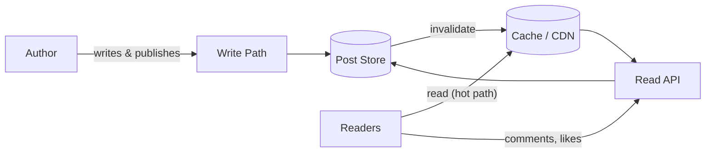

The diagram shows the architectural split: authors flow through a write path into the store, while the far larger reader population is served from cache/CDN, with the database touched only on misses and for dynamic data (comments, counts).

---

### Functional Requirements

1. **Authoring**
   - Create a draft post with title, body (Markdown or rich text), and tags.
   - Edit a draft or a published post; save revisions.
   - Publish a draft (making it publicly readable), and unpublish a post (reverting it to a private draft).
   - Delete a post (soft delete, preserving comments policy choice).
2. **Reading**
   - Read a published post by slug/ID.
   - Browse posts by author, by tag, and by recency (a home feed).
3. **Engagement**
   - Comment on a published post (flat comments for the basic version; threaded as an extension).
   - Like/clap a post; each user's like counts once; unliking is allowed.
4. **Accounts**
   - Users register, authenticate, and have an author profile (name, bio, avatar URL).
5. **Discovery (basic)**
   - Tag pages listing recent posts per tag; simple keyword search over titles.

Out of scope for the "basic" cut (state this in interviews): follows and personalized feeds, recommendations, monetization, media pipelines beyond images by URL, multi-language.

---

### Non-Functional Requirements

- **Scale**: read-heavy (readers vastly outnumber authors); moderate write volume. Target: 50M monthly readers, 100K active authors, read:write ratio on the order of 1000:1.
- **Latency**: read a published post under 150 ms at p99 (cache/CDN hit under 30 ms); publish under 300 ms; comment under 200 ms.
- **Availability**: reading published content must stay available even if the write path degrades — the read path must not depend on live write-path components. Target 99.95% for reads, 99.9% for writes.
- **Consistency**: a published post may be served from cache with a small propagation delay after edits (seconds); likes may be eventually consistent (counts may lag); comments should appear to the author immediately (read-your-writes).
- **Durability**: published posts and comments are never lost; drafts auto-save frequently.
- **Security**: user-authored HTML/Markdown must be sanitized against stored XSS; only the author can edit their posts; rate limiting on comments and likes to resist abuse.

---

### Capacity Estimation

**Users and content**

- 50M monthly readers, 5M DAU readers; 100K active authors/month.
- Authors publish ~2 posts/month → **200K new posts/month** (~6.6K/day).
- Average post lifetime reads: 10K reads for a median-viral mix → total reads/month ≈ 2B (long tail dominated by popular posts).

**QPS**

- Reads: 2B/month ≈ **770 reads/second average**, ~**3-5K QPS peak** (evenings, viral posts). With a 95%+ cache hit ratio, the database sees under 250 QPS of post reads.
- Writes: 6.6K posts/day plus edits ≈ **under 1 write/second average**; comments ~50/post viral-average → **~10-50 comments/second**; likes ~10× comments → **~100-500 likes/second** peak. Likes become the highest-frequency write — hence counter denormalization.

**Storage**

- Post body: median 8 KB of rendered HTML/Markdown; with metadata and indexes ~12 KB/row.
- 200K posts/month → 2.4M posts/year → **~30 GB/year** of post data — small; a single relational primary is fine for years.
- Comments: 2B reads × 0.1% comment rate ≈ 2M comments/month × 500 B ≈ **1 GB/month**.
- Media (images) are not stored in the database — object storage (S3) plus CDN; database holds URLs only.

**Bandwidth**

- Average post page ~100 KB rendered (text + one hero image via CDN): at 3K peak reads/second with 90% CDN offload, origin egress ≈ 3K × 10% × 100 KB ≈ **30 MB/s** — comfortably within one region's budget.

**Interview takeaways**

- The bottleneck ordering is: like-count writes > comment writes > post reads at origin > post writes. Size the design accordingly.
- Cache hit ratio is the single most important operational metric: each point of hit ratio directly removes database read load.

---

### Characteristics

- **Extreme read/write asymmetry**
  What it means: reads outnumber writes by roughly three orders of magnitude.
  Why it matters: optimizing the write path is a waste; optimizing the read path (cache, CDN, denormalized counters) is where all the leverage is.
  How it works: published posts are treated as immutable snapshots until an explicit edit event triggers invalidation.
  Example: a viral post gets 1M reads and 0 edits in a day — one cache entry serves nearly all of them.

- **Content immutability windows**
  Between edits, a published post is static. This enables CDN caching with long TTLs and stale-while-revalidate semantics.

- **Mutable engagement metadata**
  Likes and comment counts change constantly on otherwise-static content, so they are read separately (or embedded with short TTLs) rather than baked into the cached article body.

- **Author-owned write authorization**
  Only the author (and moderators) can mutate a post; readers can only append engagement. Authorization is owner-scoped, not role-complex.

- **Soft lifecycle states**
  A post is a small state machine — draft, published, unpublished — and public visibility is a pure function of state.

- **User-generated content risk**
  Body HTML and comments are untrusted input rendered to other users; sanitization is a correctness requirement, not a nice-to-have.

- **Search and discovery needs**
  Browsing by tag/author/recency maps to indexes; keyword search eventually needs a dedicated search index, but basic ILIKE/trigram search suffices at this scale.

---

### Components

- **Read API (post query service)**
  Purpose: serve published posts, lists by tag/author, and engagement counts.
  Responsibilities: cache-aside reads, cache stampede protection, assembling post + counts + recent comments.
  Relationship: sits behind the CDN; reads the store on miss; never calls the write path.
  Real-world example: Medium's article service fronted by Fastly.

- **Write API (authoring service)**
  Purpose: drafts, edits, publish/unpublish.
  Responsibilities: authorization (author-only), sanitization of submitted HTML/Markdown, revision persistence, cache invalidation on publish/edit, slug generation.
  Relationship: the only writer of post state; emits invalidation events consumed by the cache layer.
  Real-world example: WordPress's editor backend issuing purge requests to Varnish/CDN on publish.

- **Comment service**
  Purpose: create and list comments on published posts.
  Responsibilities: sanitization, rate limiting, pagination, moderation hooks.
  Relationship: separate data path from cached post bodies because comments change constantly.
  Real-world example: Disqus as an externalized comment subsystem — proof the boundary is natural.

- **Engagement/counter service**
  Purpose: likes/claps with per-user uniqueness and fast count reads.
  Responsibilities: dedupe (`UNIQUE(post_id, user_id)`), maintain denormalized `like_count` on the post row or in Redis, reconcile asynchronously.
  Real-world example: Redis `INCR`/`SET` counters with periodic persistence, as used by many social platforms.

- **Object storage + CDN**
  Purpose: serve images and cache rendered post payloads at the edge.
  Relationship: authors upload images to object storage via pre-signed URLs; the CDN caches post responses keyed by URL.
  Real-world example: CloudFront/Cloudflare in front of the read API.

- **Search index (optional at basic scale)**
  Purpose: keyword search over titles and tags.
  Real-world example: Elasticsearch/OpenSearch fed by a change stream, or PostgreSQL `pg_trgm`/full-text search while volume is small.

- **Notification fan-out (light)**
  Purpose: notify the author on new comments.
  Relationship: asynchronous consumer of comment events; never blocks the comment write.

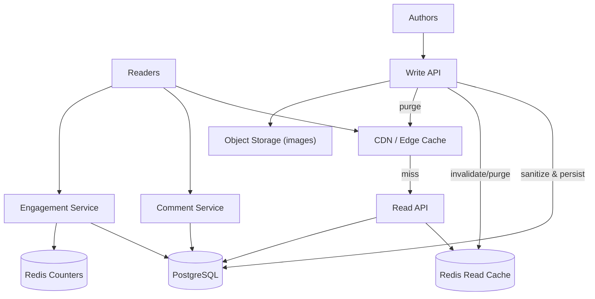

---

### Architectural Patterns

- **Cache-Aside (read-through caching)**
  What it is: the read path checks the cache, and on a miss loads from the database and populates the cache.
  Problem it solves: shields the database from the 1000:1 read ratio.
  How it works: `GET post:{id}` → hit returns; miss → DB read → `SET post:{id}` with TTL → return. Publishes/edits explicitly evict.
  When to use: read-heavy workloads with tolerable staleness. When not: data that must always be strongly fresh on every read.
  Advantages: simple, cache only holds what's read. Disadvantages: miss latency, stampede risk on hot-key expiry (mitigate with request coalescing / stale-while-revalidate).
  Real-world example: this design; most content platforms.

- **CDN edge caching with purge-on-publish**
  What it is: the CDN caches rendered post responses; the write path purges the URL on publish/edit.
  Problem it solves: absorbs viral traffic at the edge; origin sees almost nothing for popular posts.
  Advantages: massive offload, low global latency. Disadvantages: purge propagation takes seconds; purge storms on bulk edits need rate limiting.

- **Write-through invalidation event**
  What it is: publishing emits an event that invalidates every cache tier holding the post (Redis key, CDN URL, tag-list pages).
  Problem it solves: without explicit invalidation, readers see stale content after edits — the classic bug in this domain.
  Advantages: bounded staleness. Disadvantages: every new cache tier must subscribe to invalidation.

- **Denormalized counters**
  What it is: `like_count` stored on the post row (or Redis) instead of `COUNT(*)` per read.
  Problem it solves: counting a likes table per read is O(n) per post view and melts under viral load.
  How it works: like insert + counter increment; periodic reconciliation job recomputes from the source-of-truth likes table.
  Advantages: O(1) count reads. Disadvantages: drift risk — needs reconciliation.

- **Idempotent engagement writes**
  What it is: liking twice is a no-op, enforced by `UNIQUE(post_id, user_id)`.
  Problem it solves: double-clicks and client retries must not double-count.

- **Sanitize-on-write (defense in depth: also encode-on-render)**
  What it is: HTML is sanitized at ingestion against an allowlist, and rendered defensively.
  Problem it solves: stored XSS from author content executing in every reader's browser.

- **Materialized list pages**
  What it is: tag/author list pages cached as rendered lists, invalidated or TTL-refreshed on new publishes.
  Problem it solves: recency-ordered list queries with tag filters are index-heavy under load.

---

### Benefits

- **Read latency decoupled from database health**
  With CDN + Redis absorbing 95%+ of reads, a slow or briefly-down database degrades writes while reads keep serving — directly satisfying the availability requirement that reads survive write-path degradation.

- **Cheap viral scaling**
  A viral post costs one cache entry and edge bandwidth, not database connections. Cost scales with unique content, not with read volume.

- **Simple, evolvable domain model**
  Posts, comments, likes, and tags map cleanly to relational tables; features (threaded comments, series, publications) extend the schema without re-architecture.

- **Clear security boundary**
  Sanitization at the write boundary plus authorization at the owner boundary covers the two dominant risks (XSS, unauthorized edits) with well-understood mechanisms.

- **Independent scaling of subsystems**
  Comments and engagement scale separately from post reads; each has its own cache and rate-limiting posture.

---

### Pros

- **Predictable performance under spiky traffic**
  Content workloads produce unpredictable viral spikes. Edge caching converts an unknown traffic curve into near-constant origin load, which is why every real publishing platform is CDN-first.

- **Strong author experience on the write path**
  Drafts, revisions, and autosave live on a low-traffic path, so the platform can afford richer write-side features (version history, preview rendering) without capacity risk.

- **Mature, boring technology suffices**
  PostgreSQL + Redis + CDN + one service tier covers the requirements for years of growth; the team spends effort on product, not infrastructure.

- **Engagement integrity by construction**
  The likes unique constraint makes double-voting impossible at the storage layer, so count drift is a reconciliation detail, not a correctness crisis.

- **SEO-friendly by default**
  Server-rendered, cacheable, fast public pages are exactly what search engines reward — the architecture and the growth loop align.

---

### Cons

- **Staleness windows after edits**
  Purge propagation across CDN PoPs takes seconds; a reader can briefly see the pre-edit version. For corrections (legal, factual) this needs explicit handling (hard purge APIs, versioned URLs).
  Mitigation: `stale-while-revalidate` with short SWR windows and purge webhooks monitored for completion.

- **Cache invalidation is genuinely hard here**
  A publish must invalidate: the post key, the author's page, every tag page, the home feed materialization. Miss one and users see ghosts. This is the classic "two hard things" problem made concrete.

- **Counter drift**
  Denormalized like counts drift from the likes table under races and failures; reconciliation jobs are mandatory, and counts are eventually consistent by design.

- **Search quality ceiling**
  ILIKE/trigram search degrades in relevance and speed as content grows; graduating to a real search index is a project, not a config change.

- **Abuse surface**
  Comments and likes are spam vectors; without rate limits, heuristics, and moderation queues, the engagement features get weaponized (astroturfing likes, SEO spam comments).

- **Single-primary write ceiling (distant but real)**
  All writes funnel to one primary. At this scale it is fine, but the design should acknowledge the ceiling and name the levers (read replicas, counter offload, sharding by post ID).

---

### Challenges

- **Technical — hot-key stampede**
  When a viral post's cache entry expires, thousands of concurrent requests can miss simultaneously and hammer the database. Mitigate with request coalescing (single-flight), jittered TTLs, and stale-while-revalidate.

- **Scalability — feed and tag pages**
  "Recent posts by tag" is a per-tag descending index scan; fine at thousands of posts, slow at millions with high QPS. Materialize list pages and refresh on publish events.

- **Performance — comment pagination under active threads**
  Hot posts accumulate comments during traffic spikes; cursor pagination and per-post comment-count caching keep the page fast.

- **Reliability — invalidation delivery**
  If the purge event is lost, stale content lives until TTL. Use a reliable event (outbox) for invalidation, and TTLs as the safety net that bounds worst-case staleness.

- **Maintainability — two representations of content**
  Markdown source vs sanitized HTML vs CDN-rendered page must stay in sync across edits; pick a single render pipeline (render at write, serve stored HTML) to avoid dual-render drift.

- **Operational — cache fleet health**
  Redis failover must not cascade into a database stampede; a cold cache after failover needs warmup or request coalescing to survive.

- **Security — stored XSS and CSRF**
  Sanitization allowlists must cover evolving HTML (iframes for embeds are the hard case); comment submission needs CSRF protection and per-IP/user rate limits.

- **Legal/operational — content moderation**
  Takedowns require prompt global purge (cache + CDN + search index) with audit records — a workflow, not just a DELETE.

---

### Best Practices

- **Render once, at write time; serve stored HTML**
  Why: rendering Markdown to HTML on every read wastes CPU per request and creates render-path inconsistencies. Render and sanitize at publish; the read path serves bytes.
  Example: the write pipeline stores both `body_markdown` (for re-editing) and `body_html` (for serving).

- **Sanitize with an allowlist library, never a blocklist regex**
  Why: blocklists miss novel vectors (`<svg onload=...>`, malformed nesting); allowlist sanitizers (OWASP Java HTML Sanitizer, DOMPurify on the client as defense in depth) permit known-safe elements only.

- **Cache the post body and engagement metadata separately**
  Why: bodies change rarely (long TTL); counts change constantly (short TTL or live read). One cache entry forces the worst TTL of the two.

- **Bound every list endpoint with cursor pagination**
  Why: offset pagination degrades (O(offset)) and duplicates items when new posts publish mid-scroll; cursors are stable and index-friendly.

- **Slug + immutable ID addressing**
  Why: slugs are SEO- and human-friendly but change when titles change; internal references and cache keys use the immutable post ID, with slug → ID resolution at the edge and redirects on slug change.

- **Invalidate explicitly on every state transition**
  Why: publish, edit, and unpublish all change public visibility or content; each must purge the post key and affected list pages, with the event carried by a transactional outbox so a crash cannot skip invalidation.

- **Rate-limit engagement writes per user and per IP**
  Why: likes and comments are the highest-frequency writes and the cheapest abuse vector; a token bucket (for example, 30 comments/minute/user) caps damage before heuristics engage.

- **Protect the like hot path from contention**
  Why: incrementing a row's `like_count` serializes on that row under viral load; increment in Redis (no row lock) and reconcile to the database asynchronously.

- **Set explicit staleness contracts**
  Why: "counts may lag up to 60 seconds" and "edits propagate within 5 seconds" are product decisions that justify every TTL in the system; undocumented staleness reads as a bug.

---

### When to Use / When Not to Use

**Use this design when**

- The workload is read-dominated content publishing with clear author ownership.
- Staleness of seconds is acceptable for content and counts.
- Team size favors boring, well-understood infrastructure.

**Consider alternatives when**

- **Real-time collaboration on documents** (Google Docs-style): needs operational transforms/CRDTs and WebSocket sync — a different architecture centered on a document service, not CDN caching.
- **Personalized feeds at scale** (a follow graph with fan-out): the read path becomes feed generation (push/pull fan-out), and the "basic" browse-by-tag design is only the public surface.
- **Strictly fresh counters** (financial or voting integrity): denormalized eventually-consistent counters are unacceptable; move to transactional counts with the attendant write cost.
- **Heavy media** (video platform): the bottleneck becomes transcoding and media delivery, not text caching.

**Decision factors**

Read/write ratio, staleness tolerance, personalization requirements, collaboration requirements, moderation/regulatory obligations, and team operational maturity.

---

### Use Cases

**1. Public engineering blog for a company**

- Problem: unpredictable viral spikes (a post hits Hacker News), near-zero write rate, global readers, SEO matters.
- Proposed solution: this exact design with maximal CDN offload, long TTLs plus purge-on-publish, minimal dynamic elements on the article page.
- Why suitable: the read path is essentially static content serving; origin capacity barely matters.
- Trade-offs: comments may be outsourced (Disqus-style) or dropped to shrink the abuse surface.

**2. Multi-author consumer platform (simple Medium)**

- Problem: 100K authors, 50M readers, tag/author discovery, engagement (claps), monetization stats later.
- Proposed solution: full design — authoring service with drafts/revisions, read path with Redis + CDN, engagement service with Redis counters and reconciliation, tag pages materialized.
- Why suitable: read/write asymmetry is extreme; per-author ownership keeps authorization simple; counters handle clap volume.
- Trade-offs: feed personalization is explicitly deferred; discovery is recency + tags only.

**3. Internal engineering handbook / knowledge base**

- Problem: thousands of employees, high read rate, infrequent edits, search matters more than tags, access control to employees only.
- Proposed solution: same stack minus CDN (or private CDN), plus full-text search (PostgreSQL FTS initially), SSO-based authorization, and read-your-writes consistency tightened (no edge caching of editing views).
- Why suitable: the content lifecycle (draft → publish → occasionally edit) is identical; scale is smaller, so the database alone covers reads with modest caching.
- Trade-offs: staleness tolerance drops (employees edit and expect immediate reflection) — shorten TTLs and rely on explicit invalidation rather than TTL expiry.

---

### Data Model and APIAPI Design

REST, JSON, versioned under `/api/v1`; ISO-8601 UTC timestamps; `Authorization: Bearer <JWT>` on writes and on reading drafts. Public published reads are unauthenticated (SEO and sharing).

**Core endpoints (preserved and extended from the original design)**

```
POST   /api/v1/posts                          create a draft
PATCH  /api/v1/posts/{postId}                 edit draft or published post
POST   /api/v1/posts/{postId}/publish         publish a draft
POST   /api/v1/posts/{postId}/unpublish       revert to draft
GET    /api/v1/posts/{slugOrId}               read a published post
GET    /api/v1/posts?tag=&author=&cursor=     browse posts
POST   /api/v1/posts/{postId}/comments        add a comment
GET    /api/v1/posts/{postId}/comments?cursor=
PUT    /api/v1/posts/{postId}/like            like (idempotent)
DELETE /api/v1/posts/{postId}/like            unlike
```

**Create a draft**

`POST /api/v1/posts`

```json
{
  "title": "How We Sharded PostgreSQL",
  "bodyMarkdown": "# Intro\nWe hit the write ceiling at ...",
  "tags": ["postgres", "scaling"]
}
```

Validation: `title` 1–200 chars; `bodyMarkdown` up to 100 KB; `tags` up to 5, each 1–30 chars, slugified. Response `201 Created` with the draft including a server-generated `slug` and `status: "DRAFT"`.

**Publish**

`POST /api/v1/posts/{postId}/publish` → `200 OK`; sets `status: "PUBLISHED"`, `publishedAt`, renders and sanitizes `bodyHtml`, generates the canonical slug, and triggers invalidation of the author's page and tag pages. Idempotent: re-publishing an already-published post is a no-op returning the current state.

**Read a post (public)**

`GET /api/v1/posts/how-we-sharded-postgresql` → served from CDN/Redis where possible:

```json
{
  "id": "p_01H8...",
  "slug": "how-we-sharded-postgresql",
  "title": "How We Sharded PostgreSQL",
  "author": { "id": "u_42", "name": "A. Ghosh" },
  "bodyHtml": "<h1>Intro</h1><p>We hit the write ceiling ...</p>",
  "tags": ["postgres", "scaling"],
  "likeCount": 1284,
  "commentCount": 57,
  "publishedAt": "2026-06-01T14:00:00Z"
}
```

Response headers on the hot path: `Cache-Control: public, max-age=60, stale-while-revalidate=300`, plus `ETag` for conditional revalidation.

**Browse with filtering and cursor pagination**

`GET /api/v1/posts?tag=postgres&cursor=eyJwdWJsaXNoZWRBdCI6...&limit=20` → `{ "items": [...], "nextCursor": "..." }`. Sorting is recency (`publishedAt DESC`) for the basic platform; `author=` filters by author ID.

**Comment**

`POST /api/v1/posts/{postId}/comments` with `{ "text": "Great write-up" }` → `201`; text is sanitized (plain text or a tiny allowlist), rate-limited per user, and rejected with `409` if the post is not published.

**Like (idempotent by method choice)**

`PUT /api/v1/posts/{postId}/like` — `PUT` because liking is naturally idempotent: repeating it changes nothing. Response: `{ "liked": true, "likeCount": 1285 }`.

**Error responses (RFC 7807 problem details)**

```json
{
  "type": "https://api.example.com/problems/forbidden",
  "title": "Not the author",
  "status": 403,
  "detail": "Only the author can edit this post"
}
```

Status codes: `400` validation, `401` unauthenticated, `403` not the author, `404` unknown post, `409` invalid state transition (publishing a deleted post), `429` rate limited (`Retry-After` header).

**Cross-cutting**

- **Versioning**: URI `v1`; additive changes only within a version.
- **Idempotency**: `POST /posts` accepts `Idempotency-Key` (draft duplication on retry is the common mobile failure).
- **Rate limiting**: stricter on comments/likes than reads; reads limited per IP to deter scraping.
- **Caching contract**: only `GET` on published posts is cacheable; drafts and author views are `Cache-Control: private, no-store`.

---

#### Data Modeling

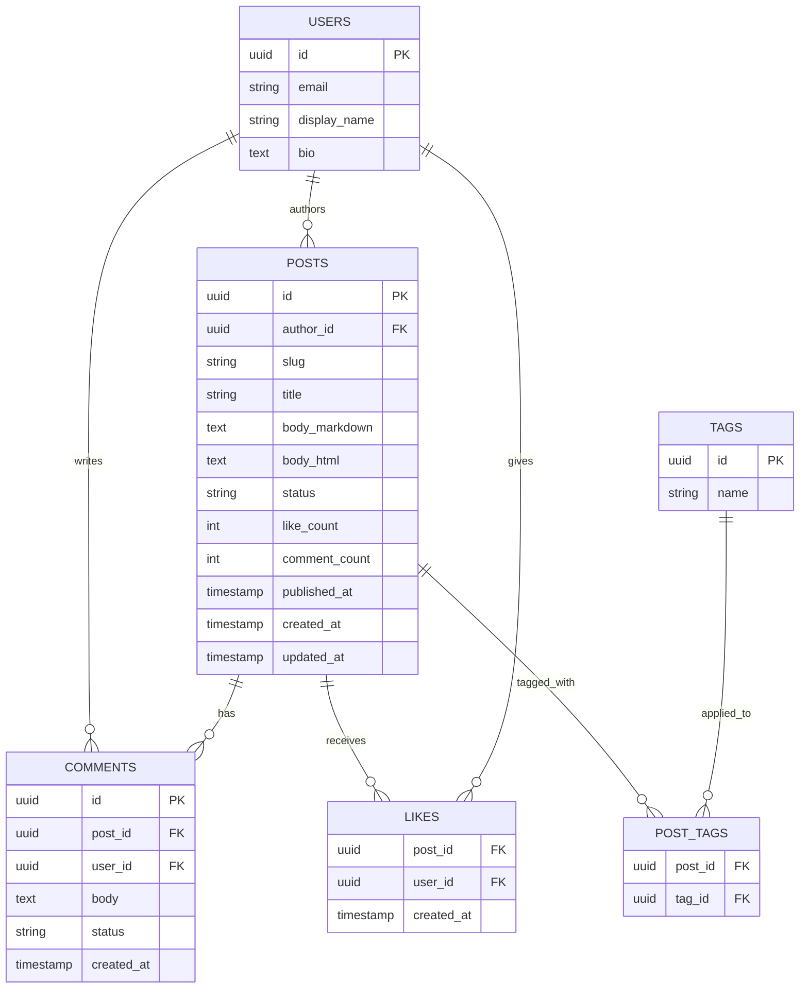

**Keys and constraints**

- `LIKES (post_id, user_id)` is a composite PK — the uniqueness guarantee for one-like-per-user, enforced by storage.
- `POSTS.slug` unique among published posts; historical slugs retained for redirects after title edits.
- `COMMENTS.status` supports moderation (`VISIBLE`, `FLAGGED`, `REMOVED`) without hard deletes.
- FK `comments.post_id → posts.id` with `ON DELETE CASCADE` only if hard-deleting posts is allowed; otherwise soft-delete posts and keep comments.

**Indexes**

- `posts (status, published_at DESC)` — home feed and recency browsing; partial `WHERE status = 'PUBLISHED'`.
- `post_tags (tag_id, post_id)` plus join to the partial index — tag pages.
- `posts (author_id, published_at DESC)` — author pages.
- `comments (post_id, created_at)` — comment pagination.
- `pg_trgm` GIN index on `posts.title` for the basic keyword search.

**Normalization vs denormalization**

- Normalized core: posts, comments, likes, tags in 3NF.
- Deliberate denormalizations: `like_count` and `comment_count` on `POSTS` (O(1) reads, reconciled asynchronously), and `body_html` alongside `body_markdown` (render once at write). Both are classic read-path optimizations, each with a named consistency mechanism.

**Data lifecycle**

- Drafts: auto-saved revisions retained briefly; old revisions purged.
- Unpublished posts: retained as drafts; excluded from all public indexes by the partial index predicate.
- Deleted posts: soft delete (`status = 'DELETED'`) with a 30-day purge; purges also remove CDN/Redis/search copies for takedown compliance.
- Likes outlive nothing: when a post is purged, its likes go with it.

**Partitioning**

Not needed at basic scale. Levers in order: read replicas for browse queries; archive old unpublished drafts; partition `COMMENTS` by `created_at` month; shard by post ID hash only when the single-primary write ceiling (likes + comments) is actually reached.

---

### High-Level Design

**Publish flow**

```mermaid
sequenceDiagram
    participant A as Author
    participant W as Write API
    participant D as PostgreSQL
    participant O as Outbox Relay
    participant C as Redis
    participant E as CDN
    A->>W: POST /posts/{id}/publish
    W->>W: authorize (author), render Markdown, sanitize HTML
    W->>D: BEGIN; UPDATE post SET status='PUBLISHED', body_html=...; INSERT outbox(published); COMMIT
    W-->>A: 200 OK (slug, publishedAt)
    O->>D: read unpublished outbox rows
    O->>C: DEL post:{id}; DEL author:{id}:posts; DEL tag:* pages
    O->>E: purge /posts/{slug}
```

The outbox guarantees invalidation is never skipped: the state change and the invalidation intent commit atomically, and the relay retries purges until they succeed.

**Read flow (hot path)**

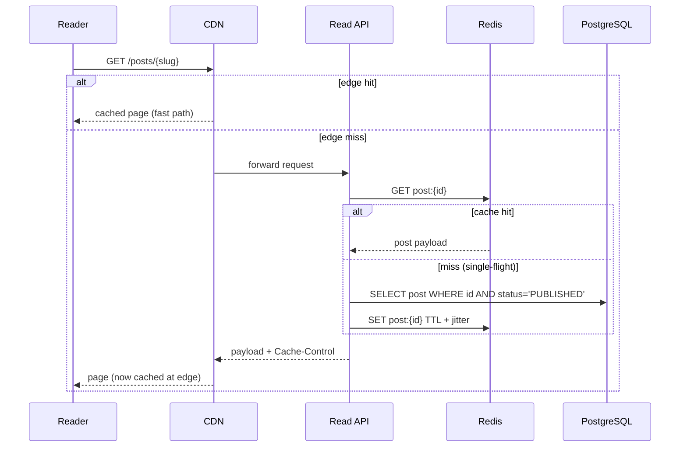

A single-flight (request coalescing) guard ensures that on a hot-key miss only one request regenerates the entry while others wait or serve stale — the stampede protection.

**Comment and like flow**

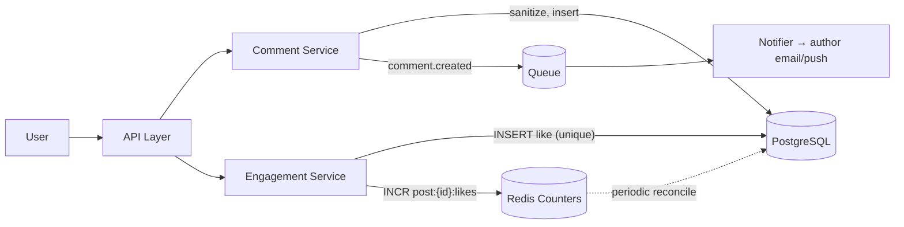

Comments are written synchronously (author must see their comment immediately — read-your-writes), while notifications fan out asynchronously. Likes hit the unique row and the Redis counter; a reconciler keeps `posts.like_count` truthful.

**Scaling strategy and failure handling**

- Read tier: CDN absorbs virality; Redis absorbs origin reads; read replicas absorb browse queries. Each tier's loss degrades gracefully to the next (at higher latency).
- Write tier: one primary; failures affect authors only, never readers.
- Redis down: read API falls through to the database with single-flight + a circuit breaker so a cold cache cannot stampede the primary.
- DB primary down: reads continue from cache/replicas; writes queue at the client (draft autosave retries) — the availability requirement (reads survive write-path failure) is met by construction.

---

### Deep Dive

#### 1. Cache invalidation on publish/edit

The hardest practical problem in this system. Rules that make it tractable:

- Enumerate every cacheable derivation of a post: post body key, author page, each tag page, home feed materialization, CDN URL, search document.
- Invalidate via an outbox event listing the post ID and its tag set; consumers delete keys and purge the CDN URL; failures retry with backoff.
- TTLs bound the blast radius of a missed invalidation: post bodies 5–15 minutes at origin cache, edge 60 seconds with stale-while-revalidate.
- Prefer key versioning for lists (`tag:postgres:v42` where v42 bumps on any publish to that tag) when deletion fan-out is expensive.
- Interviewers probe: "author edits a post, reader sees old version for 3 seconds — bug or contract?" Answer: contract, with a number (the propagation SLA) and a mechanism (purge + SWR).

#### 2. Like counting under viral load

- Naive `UPDATE posts SET like_count = like_count + 1` serializes all likers on one row — a hot-row lock convoy on viral posts.
- Better: insert into `likes` (append-only, no contention), `INCR` a Redis counter, and reconcile `posts.like_count` periodically from Redis (or by counting the likes table in a background job).
- Unlikes decrement symmetrically; the unique constraint keeps the source of truth exact even if the counter drifts.
- Reads serve the Redis counter with the DB count as fallback; the product contract is "counts may lag by up to a minute."

#### 3. Stored XSS and content sanitization

- Authors submit Markdown or limited HTML; the server renders Markdown to HTML and sanitizes with an allowlist (headings, paragraphs, links with `rel="nofollow ugc"`, images from trusted hosts, code blocks; no scripts, no event handlers, no arbitrary iframes).
- Sanitize on write AND encode defensively on render (defense in depth); comments are plain-text or minimal-markup only.
- CSP headers (`default-src 'self'`) on the article page limit damage if a vector slips through.
- Embeds (YouTube etc.) are supported via a sanctioned oEmbed allowlist, not raw author iframes.

#### 4. The draft → publish state machine and revisions

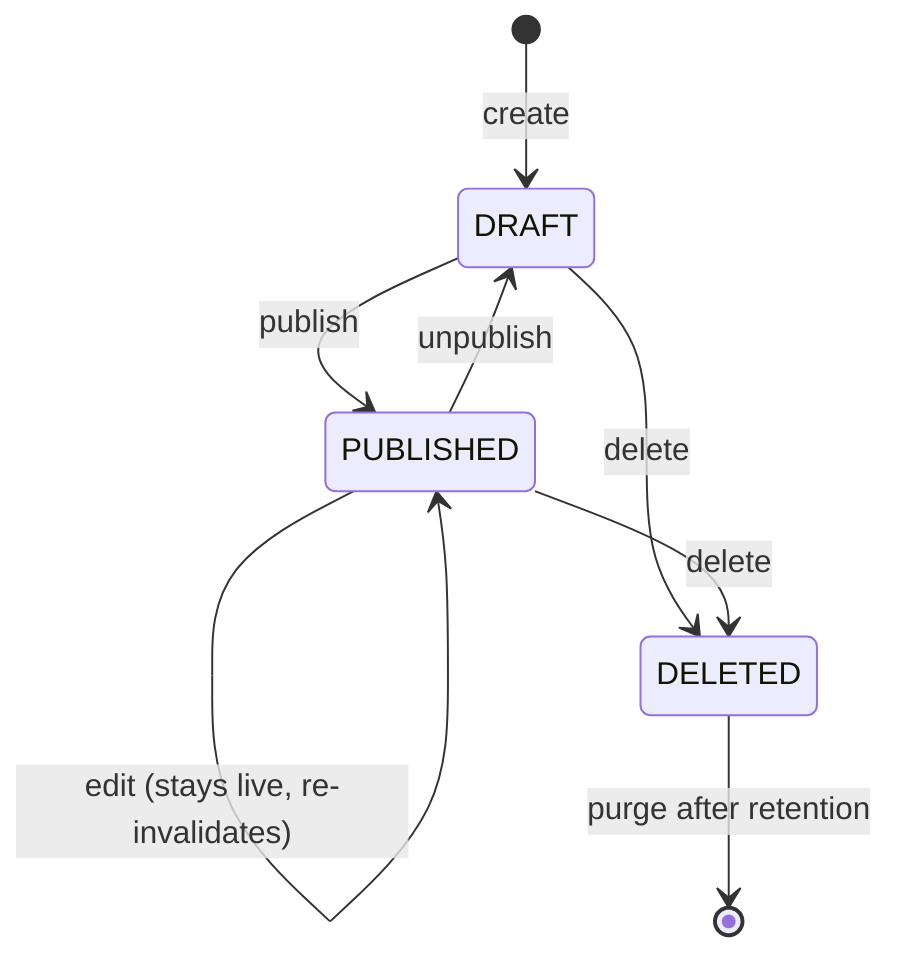

- Every transition is validated server-side; `publish` is the only transition that changes public visibility, which is why it owns rendering, sanitization, and invalidation.
- Revisions: each save writes a revision row; restore copies a revision into a new head — append-only history, no in-place mutation of history.
- Concurrency: two browser tabs editing one draft race on `updated_at`/version; optimistic locking with `If-Match` returns `409` to the loser, which merges client-side.

#### 5. Tag and feed pages at scale

- Tag page = `SELECT ... JOIN post_tags WHERE tag_id = ? ORDER BY published_at DESC LIMIT 20` with the composite index — fine to millions of posts at moderate QPS.
- Under higher QPS, materialize: a Redis list per tag holding the top N post IDs, pushed on publish events, trimmed to N. Reads become `LRANGE` + batched post fetch.
- The home "latest" feed is the same materialization without the tag filter. True personalization (follows, recommendations) is a fan-out problem and deliberately out of scope for the basic platform — say so.

---

### Replication Strategies

**What it means**

Replication Strategies determine how data and state are copied across multiple nodes in Basic Blogging Platform. The choice of strategy determines the trade-off between consistency, availability, and latency.

**Why it matters**

Basic Blogging Platform must replicate data to prevent loss and serve reads from multiple nodes. The replication strategy determines whether the system favors consistency (strong reads) or availability (always writable), and how it handles cross-node failure.

**How it works**

**Leader-based (single-leader)**: A single primary node accepts all writes; followers replicate changes asynchronously or semi-synchronously. Reads can be served from any replica. This strategy favors strong consistency for writes but creates a write bottleneck at the leader.

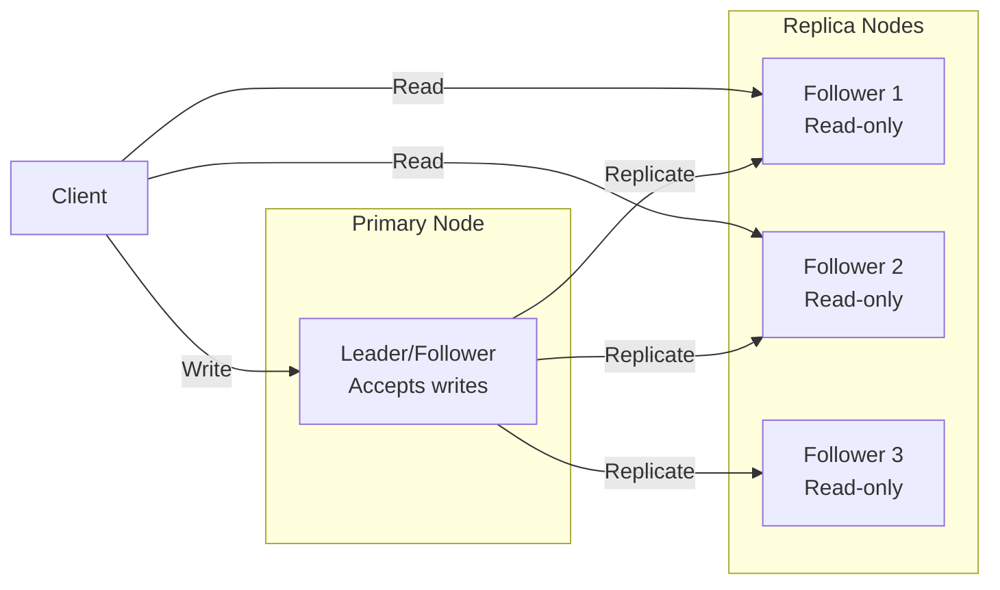

*Leader-based replication: a single primary node accepts all writes and replicates them to read-only followers. Clients can read from any replica for scaled read throughput, but all writes go through the leader.*

**Multi-leader (multi-master)**: Multiple nodes accept writes and exchange updates with each other. This enables low-latency writes in different regions but requires conflict resolution (last-write-wins, merge functions, or CRDTs).

**Leaderless (quorum-based)**: Any node can accept writes; a quorum of nodes must agree. Read and write quorums are configured so that at least one node overlaps between them (R + W > N). This maximizes availability and write scalability.

**Trade-offs for Basic Blogging Platform**:

| Strategy | Use Case | Pros | Cons |
|---|---|---|---|
| Leader-based | draft posts, user comments, private blogs | Strong consistency, simple | Write bottleneck, leader failure risk |
| Multi-leader | published posts, public profiles | Low-latency global writes | Conflict resolution, complex |
| Leaderless | Caching, counters | High availability, no bottleneck | Eventual consistency, read repair overhead |

**Real-world implementations**

- **Redis**: Leader-follower replication with asynchronous replication; Sentinel handles failover.
- **Apache Kafka**: Leader-based partition replication with ISR (in-sync replica) — writes go to the leader, followers replicate.
- **Cassandra**: Tunable consistency with leaderless quorum (R + W > N).
- **DynamoDB Global Tables**: Multi-master active-active across regions.

### Failure Detection and Membership

**What it means**

Failure Detection and Membership is the mechanism by which Basic Blogging Platform determines which nodes are alive and part of the cluster. Membership is the list of known nodes; failure detection is the process of updating that list when nodes fail or recover.

**Why it matters**

Basic Blogging Platform must route requests only to healthy nodes and trigger failover when a node goes down. False positives (healthy nodes marked as dead) cause unnecessary failovers and data loss. False negatives (dead nodes not detected) cause failed requests and degraded performance.

**How it works**

**Heartbeat-based detection**: Each node sends a heartbeat (ping) to a subset of peers at regular intervals. If a node misses N consecutive heartbeats, it is marked as suspect. The gossip protocol distributes membership information: each node exchanges its view of the cluster with a random peer, and the information propagates gossip-style.

```mermaid
sequenceDiagram
    participant A as Node A
    participant B as Node B
    participant C as Node C

    loop Every 1s
        A->>B: Heartbeat (ping)
        B-->>A: Heartbeat (ack)
    end
    B->>C: Gossip: A is alive
    C->>A: Gossip: B is alive
    Note over A,B,C: View converges in O(log N) rounds
```

*Gossip-based failure detection: each node periodically pings a random subset of peers and gossips its view of the cluster. The membership list converges in O(log N) rounds.*

**Phi Accrual Failure Detector**: Instead of a fixed timeout, the detector measures the time between consecutive heartbeats and computes a phi (φ) value — the probability that the node is dead given the observed heartbeat pattern. φ is compared against a threshold (typically 1–8); higher thresholds reduce false positives but increase detection latency.

**SWIM (Scalable Weakly-consistent Infection-style Process group Membership Protocol)**: Nodes ping a random subset of cluster members. If a ping fails, the node is marked "suspect" and the failure is "infected" (gossiped) to other nodes. This is O(log N) per failure detection cycle and scales to large clusters.

**Trade-offs**:

| Approach | Strengths | Weaknesses |
|---|---|---|
| Heartbeat (timeout-based) | Simple, deterministic | False positives under load |
| Phi Accrual | Adaptive threshold | Needs historical data |
| SWIM | Scales to 1000s of nodes | Eventual consistency |

**Real-world implementations**

- **AWS Route 53 Health Checks**: Uses TCP/HTTP health checks with configurable thresholds to remove unhealthy instances from DNS rotation.
- **Kubernetes**: Uses the kubelet heartbeat (every 10s) to determine node liveness; nodes missing 3 consecutive heartbeats are marked NotReady.
- **Consul**: Uses SWIM protocol for membership and failure detection; supports both LAN and WAN gossip.
- **Akka Cluster**: Uses Phi Accrual failure detector with configurable φ thresholds.

### High Availability and Scalability

**What it means**

High Availability and Scalability determines how Basic Blogging Platform continues operating when nodes or entire zones fail, and how capacity is added as demand grows. HA is about minimizing downtime; scalability is about maintaining performance as load increases.

**Why it matters**

Basic Blogging Platform must stay operational even when individual nodes, availability zones, or entire regions fail. At the same time, it must scale horizontally to handle traffic spikes without degrading latency. The two are intertwined: the replication strategy, failure detection, and load balancing all contribute to both HA and scalability.

**How it works**

**Availability zones (AZs)**: Nodes are distributed across multiple AZs within a region. Each AZ is an independent failure domain (power, networking, physical security). A load balancer distributes requests across AZs; if one AZ fails, traffic is routed to the remaining AZs with no data loss (assuming replication is in place).

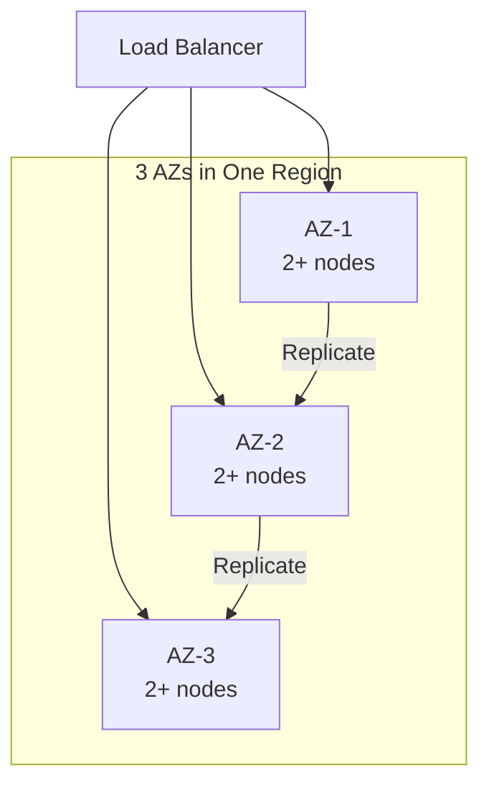

*Multi-AZ deployment: a load balancer distributes traffic across three availability zones. Each AZ has multiple nodes. Data is replicated across AZs so that losing one AZ does not cause data loss or service interruption.*

**Load balancing**: A load balancer distributes incoming requests across healthy nodes. Algorithms include round-robin, least connections, and weighted routing. Health checks ensure traffic only goes to healthy nodes. For Basic Blogging Platform, the load balancer also considers **Read API (post query service)**
  Purpose: serve published posts, lists by tag when routing.

**Auto-scaling**: The system automatically adds or removes nodes based on metrics (CPU, memory, request rate). Scale-out policies add nodes when load exceeds a threshold; scale-in policies remove nodes during low load. For stateful services like Basic Blogging Platform, scale-out involves rebalancing partitions (moving data and connections to the new node).

**Failover and recovery**: When a node fails, the load balancer detects it (via health checks or failure detection) and stops sending traffic. A new node is provisioned (or a standby is promoted) and begins serving. For Basic Blogging Platform, failover must preserve draft posts, user comments, private blogs data — this is achieved through replication with a quorum of healthy nodes.

**Scalability patterns**:

1. **Horizontal partitioning (sharding)**: Split data by a partition key (e.g., user_id, session_id) and distribute partitions across nodes. New nodes take ownership of additional partitions.

2. **Consistent hashing**: Minimize data movement on scale-out — only 1/N of the data moves to the new node. Nodes and partitions are placed on a ring; a request for key X is routed to the next node clockwise from hash(X).

3. **Connection draining**: When scaling in, existing connections are allowed to complete before the node is shut down. For Basic Blogging Platform, this means draining active 1. sessions gracefully.

**Real-world implementations**

- **Netflix OSS (Eureka + Zuul + Ribbon)**: Service discovery with Eureka, edge routing with Zuul, and client-side load balancing with Ribbon. Scales to thousands of instances.
- **Kubernetes HPA + VPA**: Horizontal Pod Autoscaler scales pods based on CPU/memory; Vertical Pod Autoscaler adjusts resource requests based on historical usage.
- **AWS ALB + Auto Scaling Groups**: Application Load Balancer with auto-scaling groups across AZs; health checks replace unhealthy instances automatically.

### Performance and Optimization

**What it means**

Performance and Optimization covers the techniques Basic Blogging Platform uses to achieve low latency, high throughput, and efficient resource usage. This section examines the key performance metrics, bottlenecks, and optimizations specific to the system.

**Why it matters**

Basic Blogging Platform faces competing pressures: users demand low latency, the system must handle high throughput, and infrastructure costs must be controlled. The optimizations applied at the data, compute, and network layers determine whether the system meets its SLA.

**How it works**

**Latency layers**: Latency in Basic Blogging Platform comes from three layers:
1. **Network**: Round-trip time from client to the nearest edge node / load balancer.
2. **Application**: Request processing time on the server (CPU, I/O, lock contention).
3. **Data**: Time to read/write from storage (cache hit vs. database query).

The 99th-percentile latency is the key metric for user-facing systems — it determines the worst-case experience.

**Caching strategies**: Basic Blogging Platform uses multiple cache layers:
- **Edge cache**: Static assets (images, CSS, JS) served from a CDN at the edge. For Basic Blogging Platform, this caches published posts, public profiles that doesn't change frequently.
- **Application cache**: In-memory cache (e.g., Redis, Memcached) for frequently accessed data. Cache-aside pattern: application checks cache first, falls back to database on miss.
- **Local cache**: In-process cache (e.g., Caffeine, Guava) for data accessed within a single request. Avoids network round-trips.

**Batching and pipelining**: Basic Blogging Platform batches small operations (e.g., writes, log flushes) to amortize per-operation overhead. Pipelining allows multiple requests to be in flight simultaneously.

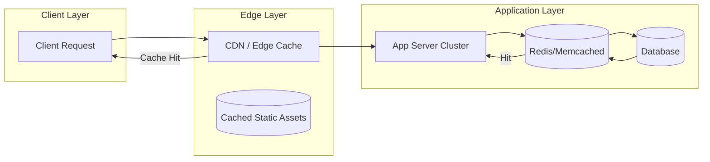

*Caching hierarchy: clients first hit the edge CDN/cache; if the response is cached, it is returned immediately. Otherwise, the request reaches the application, which checks its in-memory/application cache (e.g., Redis) before falling back to the database. This minimizes latency from each layer.*

**Connection pooling**: Basic Blogging Platform maintains a pool of database connections to avoid the TCP handshake overhead on every request. Pool size is tuned to match the database's capacity.

**Compression**: Responses are compressed (gzip, zstd) for clients that support it. At the network layer, gRPC uses HPACK header compression.

**Indexing**: Database tables are indexed on frequently queried fields. For Basic Blogging Platform, indexes cover **Write API (authoring service)**
  Purpose: drafts, edits, publish/unpublish.
  and **Comment service**
  Purpose: create and list comments on published posts.
  Re for fast lookups.

**Asynchronous processing**: Non-critical background work (e.g., analytics, cleanup, notifications) is offloaded to message queues and processed asynchronously, keeping the request path fast.

**Resource isolation**: CPU and memory are allocated per service (containers with cgroup limits). This prevents a single misbehaving service from degrading the entire system.

**Metrics for Basic Blogging Platform**:

| Metric | Target | How to Measure |
|---|---|---|
| P99 latency | < 1s | Load test with realistic traffic |
| Throughput | 1K RPS | Request rate under peak load |
| Error rate | < 0.1% | 5xx / total requests |
| Cache hit ratio | > 90% | cache_hits / (cache_hits + misses) |
| Resource utilization | < 80% CPU, < 85% memory | Container metrics |

**Real-world implementations**

- **Google's HTTP Load Balancer**: Global load balancing with edge PoPs; routes users to the nearest healthy backend.
- **Cloudflare**: Edge cache with Argo Smart Routing that dynamically routes traffic to avoid congestion.
- **Redis**: Used as an application cache with configurable eviction policies (LRU, LFU, TTL).

### Encryption and Key Management

**What it means**

Encryption and Key Management in Basic Blogging Platform ensures that data is protected both at rest (stored on disk) and in transit (moving between services). Key management governs how encryption keys are generated, stored, rotated, and accessed — without proper key management, encryption provides a false sense of security.

**Why it matters**

Basic Blogging Platform handles draft posts, user comments, private blogs that must be encrypted both at rest and in transit. Scaling Basic Blogging Platform to handle increasing load while maintaining data consistency, low latency, and fault tolerance requires careful key management: keys must be rotated regularly, scoped to prevent cross-contamination, and audited for compliance. A single key compromise could expose sensitive data.

**How it works**

**At-rest encryption**: Data stored in **Read API (post query service)**
  Purpose: serve published posts, lists by tag, **Write API (authoring service)**
  Purpose: drafts, edits, publish/unpublish.
  and databases is encrypted using AES-256-GCM. The Data Encryption Key (DEK) is generated per data partition and encrypted with a Key Encryption Key (KEK) managed by a KMS (AWS KMS, GCP KMS, HashiCorp Vault). Keys are regionally scoped — only data belonging to a region can be decrypted by that region's KEK.

**In-transit encryption**: All inter-service communication uses TLS 1.3 or mTLS for service-to-service auth. Cross-region communication of published posts, public profiles uses TLS + optional application-level encryption. draft posts, user comments, private blogs is NEVER transmitted in plaintext or across region boundaries.

**Key hierarchy**:
```
Master Key (HSM-backed, KMS-managed)
  └─ KEK (per region, per service)
     └─ DEK (per data partition, rotated every 90 days)
        └─ Data (encrypted with DEK)
```

**Key rotation**: KEKs rotate annually (automatic via KMS); DEKs rotate per object or per 90 days. Applications handle key version headers transparently — a DEK version is stored alongside the encrypted data.

**Cross-region key sharing**: For non-restricted data (published posts, public profiles), a shared key is imported into each region's KMS. Restricted data NEVER uses cross-region keys — each region's KMS holds only that region's keys.

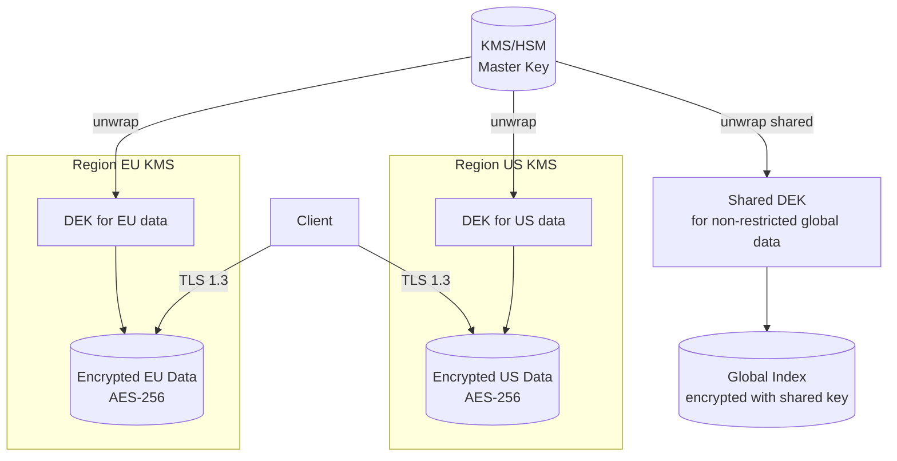

*Encryption key hierarchy: master keys are managed by an HSM-backed KMS and never leave the KMS. Each region has its own KEK. Data encryption keys (DEKs) are generated per partition and encrypted with the regional KEK. Only non-restricted global data uses a shared cross-region key. All client traffic uses TLS 1.3.*

**Java/Spring Boot Implementation**

```java
@Service
@RequiredArgsConstructor
public class DataEncryptionService {

    private final AWSKMS kms;
    @Value("${app.region}")
    private String region;
    @Value("${app.encryption.dek-ttl-minutes:1440}")
    private int dekTtlMinutes;

    private final Map<String, SecretKey> dekCache = new ConcurrentHashMap<>();

    public EncryptedData encrypt(String plaintext, String partitionId) {
        SecretKey dek = getOrCreateDek(partitionId);
        byte[] ciphertext = CryptoUtils.encrypt(plaintext.getBytes(StandardCharsets.UTF_8), dek);
        String dekCiphertext = kms.encrypt(EncryptRequest.builder()
            .keyId("arn:aws:kms:" + region + ":master-key")
            .plaintext(SdkBytes.fromByteArray(dek.getEncoded()))
            .build()).ciphertextBlob().asByteArray();
        return new EncryptedData(ciphertext, dekCiphertext, Instant.now());
    }

    private SecretKey getOrCreateDek(String partitionId) {
        return dekCache.computeIfAbsent(partitionId, id -> {
            try {
                return KeyGenerator.getInstance("AES").generateKey();
            } catch (NoSuchAlgorithmException e) {
                throw new IllegalStateException("Cannot generate DEK", e);
            }
        });
    }
}
```

*Spring Boot encryption service: DEKs are cached per-partition with TTL. Each DEK is encrypted via AWS KMS using a regional master key. The encrypted DEK (ciphertext) is stored alongside the data — only the KMS for that region can decrypt it.*

**Real-world implementations**

- **AWS KMS**: Managed HSM-backed key service; supports automatic key rotation and custom key stores.
- **HashiCorp Vault**: Open-source key management; supports transit encryption (encrypt/decrypt without storing keys).
- **Google Cloud KMS**: Hardware-backed key management with IAM-based access control.

### Authentication and Authorization

**What it means**

Authentication and Authorization (AuthN/AuthZ) in Basic Blogging Platform control who can access the system and what they can do. Authentication verifies identity; authorization determines permissions. In a distributed system like Basic Blogging Platform, auth must work across multiple nodes while respecting data boundaries — a user authenticated in one region should not have their session data or tokens replicated to regions where it is not permitted.

**Why it matters**

Basic Blogging Platform must verify identity at the edge and enforce authorization at every service boundary. draft posts, user comments, private blogs must be protected — only users with appropriate roles should access it. At the same time, published posts, public profiles data should be accessible to a wider audience with minimal friction.

**How it works**

**Authentication (who are you?)**:
- **JWT tokens**: Users authenticate through their home region's identity provider. The region returns a JWT (JSON Web Token) signed by a regional signing key. Tokens include claims like `iss` (issuer region), `sub` (subject/user ID), `home_region`, `roles`, and `exp` (expiry). Tokens are scoped per region — a token issued by region A cannot access restricted data in region B.
- **mTLS for service-to-service**: Internal services authenticate each other using mutual TLS certificates issued by a per-region Certificate Authority (CA). No shared secrets cross region boundaries.
- **Session management**: Sessions are stored regionally (Redis) and never replicated cross-region for restricted data. Session IDs are opaque UUIDs; the session store maps session ID → user context.

**Authorization (what can you do?)**:
- **RBAC (Role-Based Access Control)**: Users are assigned roles per region. Common roles: `region_admin` (full access to region data), `auditor` (read-only audit), `viewer` (read public data only). Roles are stored in the regional database and cached locally for sub-1ms lookups.
- **ABAC (Attribute-Based Access Control)**: Fine-grained permissions based on attributes (e.g., `home_region == request_region AND role == admin`). This allows expressing complex policies like "users can only access restricted data in their home region."
- **Resource-level authorization**: Each request is checked against an ACL (Access Control List) that specifies which roles can access which resources. For Basic Blogging Platform, restricted resources require the `admin` role + matching region.

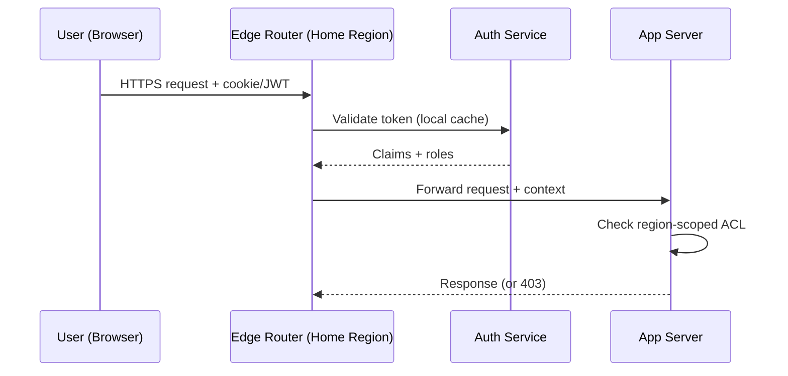

*Authentication flow: the user's token is validated by the regional auth service (claims cached locally). The edge router forwards the request with the security context. Each app server checks the region-scoped ACL before accessing restricted data.*

**Java/Spring Boot Implementation**

```java
@Service
@RequiredArgsConstructor
public class AuthorizationService {

    private final UserTokenRepository tokenRepository;
    @Value("${app.region}")
    private String currentRegion;

    public boolean canAccessResource(String userId, String resourceRegion,
                                     String action, JWTClaims claims) {
        String userHomeRegion = claims.getStringClaim("home_region");
        List<String> roles = claims.getStringListClaim("roles");

        if (!roles.contains(action)) {
            return false;
        }

        if (resourceRegion.equals(userHomeRegion)) {
            return true;
        }

        if (resourceRegion.equals("global")) {
            return roles.contains("global_reader");
        }

        return false;
    }
}

@RestController
@RequiredArgsConstructor
@RequestMapping("/api/v1")
public class RegionController {
    private final AuthorizationService authService;

    @GetMapping("/data/{region}/profile")
    public ResponseEntity<?> getProfile(
            @PathVariable String region,
            @RequestHeader("Authorization") String token) {
        JWTClaims claims = JwtUtils.parseAndValidate(token, currentRegion);

        if (!authService.canAccessResource(
                claims.getStringClaim("sub"), region, "read", claims)) {
            return ResponseEntity.status(HttpStatus.FORBIDDEN).build();
        }

        return ResponseEntity.ok(profileService.getByRegion(region));
    }
}
```

*Spring Boot authorization service: checks both the user's role and whether the requested resource violates region boundaries. The `canAccessResource` method returns false if a user from region EU tries to access restricted data in region US.*

**Real-world implementations**

- **Auth0**: JWT-based authentication with regional endpoints; supports custom rules for ABAC.
- **Okta**: Multi-region identity management with adaptive MFA and ThreatInsight for anomaly detection.
- **AWS Cognito**: Regional user pools with IAM integration; tokens are region-scoped by default.

### Security Threats and Mitigations

**What it means**

Security Threats and Mitigations catalog the attack surface of Basic Blogging Platform, the most likely threats, and the corresponding defenses. Every distributed system has unique threat vectors — Basic Blogging Platform is no exception.

**Why it matters**

Basic Blogging Platform handles draft posts, user comments, private blogs that attackers might target. Scaling Basic Blogging Platform to handle increasing load while maintaining data consistency, low latency, and fault tolerance expands the attack surface: more nodes, more network paths, more failure modes. Without proper threat modeling, a single vulnerability could expose sensitive data across the entire system.

**Threat model**:

| Threat | Likelihood | Impact | Mitigation |
|---|---|---|---|
| Data exfiltration (cross-region) | High | Critical | Region-scoped keys, no cross-region replication of restricted data |
| Man-in-the-middle (inter-service) | Medium | High | mTLS between all services |
| Replay attacks | Medium | High | Token expiry + nonce |
| DDoS at the edge | High | High | Rate limiting + edge filtering (Cloudflare, AWS Shield) |
| PII leakage in logs | High | High | PII redaction + field-level access control |
| Session hijacking | Medium | Medium | Short-lived tokens + IP binding |
| Privilege escalation | Low | Critical | Least-privilege RBAC + audit logs |
| Cache poisoning | Low | Medium | Cache invalidation on write + signed cache keys |

**How it works**

**Data exfiltration prevention**: Basic Blogging Platform enforces data residency by design — draft posts, user comments, private blogs is never replicated cross-region. The replication layer checks a data classification label before allowing cross-region copy. A database-level policy (e.g., PostgreSQL RLS) also blocks cross-region queries for restricted partitions.

**mTLS enforcement**: All service-to-service communication uses mutual TLS. Certificates are issued by a per-region CA and rotated every 30 days. Services must present a valid certificate to communicate — no plaintext connections are allowed.

**PII redaction**: Application logs are scanned for PII patterns (email, phone, credit card) using an automated redaction layer (e.g., AWS Macie, Google DLP). published posts, public profiles is logged freely; restricted fields are masked or dropped before logging.

```mermaid
graph TD
    subgraph "Threat Surface"
        Client[Client]
        Edge[Edge Router / WAF]
        App[App Server]
        DB[(Database)]
        Cache[(Cache)]
        Logs[Log Store]
    end

    Client -->|HTTPS| Edge
    Edge -->|mTLS| App
    App -->|mTLS| DB
    App -->|Read| Cache
    App -->|Write| DB
    App -->|Log| Logs

    subgraph "Mitigations"
        WAF[AWS WAF /<br/>Cloudflare]
        DLP[PII Redaction<br/>(Macie/DLP)]
        FIM[File Integrity<br/>Monitoring]
    end

    Edge -.-> WAF
    Logs -.-> DLP
    DB -.-> FIM
```

*Threat mitigation diagram: the WAF at the edge blocks DDoS and injection attacks. mTLS protects all service-to-service communication. PII redaction scans logs before storage. File integrity monitoring alerts on database tampering.*

**Audit trail**: All security-relevant events (auth, data access, config changes) are written to an append-only audit log with cryptographic integrity (HMAC per entry). The log covers draft posts, user comments, private blogs access — who accessed what, when, and from where.

**Real-world implementations**

- **Cloudflare**: Zero-trust model (All Connections to All Networks) with mTLS everywhere; uses GeoIP blocking and rate limiting for DDoS mitigation.
- **Google BeyondCorp**: Zero-trust network security model; all access is authenticated and authorized at the request level.

### Observability and Logging

**What it means**

Observability and Logging in Basic Blogging Platform provide visibility into system behavior through three pillars: **metrics** (aggregates and counters), **logs** (structured event records), and **traces** (distributed request timelines). Together, these signals allow operators to debug issues, detect anomalies, and verify SLA compliance.

**Why it matters**

Distributed systems like Basic Blogging Platform are inherently opaque — failures can cascade across services in unexpected ways. Without good observability, a single slow dependency can cause widespread timeouts that are nearly impossible to diagnose. Scaling Basic Blogging Platform to handle increasing load while maintaining data consistency, low latency, and fault tolerance makes observability even more critical: operators need to see cross-region latency, regional failures, and data-residency violations.

**How it works**

**Metrics**: Basic Blogging Platform instruments every service with Prometheus-style metrics:
- **Request rate, error rate, duration (the "RED" metrics)**: Tracks per-endpoint HTTP latency and error counts.
- **System metrics**: CPU, memory, disk I/O, network throughput per node.
- **Business metrics**: For Basic Blogging Platform, this includes metrics like "**Write API (authoring service)**
  Purpose: drafts, edits, publish/unpublish.
  fill rate" and "reservation conflict rate".

Metrics are aggregated in a time-series database (Prometheus, VictoriaMetrics) and visualized in Grafana dashboards with alerts via PagerDuty.

**Logs**: Basic Blogging Platform uses structured logging (JSON format) with standardized fields:
- `timestamp`: ISO 8601 UTC
- `level`: DEBUG, INFO, WARN, ERROR
- `service`: originating service name
- `trace_id`: distributed trace identifier (for correlation)
- `span_id`: current operation span
- `region`: the region that processed the request
- `data_class`: RESTRICTED or NON_RESTRICTED

draft posts, user comments, private blogs access is logged with full context (user, action, resource). published posts, public profiles logs are aggregated and may have reduced retention.

**Distributed tracing**: Every request is assigned a trace ID at the edge. The trace propagates through all downstream services via HTTP headers. A tracing backend (Jaeger, Tempo, Zipkin) reconstructs the full request timeline, showing latency at each hop. For Basic Blogging Platform, traces include region boundaries — a cross-region call is annotated as such.

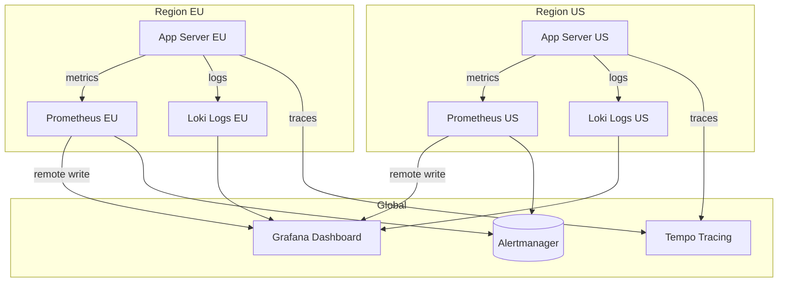

*Observability architecture: each region runs its own Prometheus (metrics) and Loki (logs) instances. A global Grafana instance queries all regional backends. Traces are collected centrally in Tempo. Alerts fire from each region's Prometheus to Alertmanager.*

**Alerting**: Basic Blogging Platform defines SLO-based alerts:
- **Latency**: P99 > 1s for 5 minutes → page.
- **Error rate**: > 1% for 10 minutes → page.
- **Availability**: < 99.5% for 15 minutes → page.
- **Data residency violation**: any restricted data detected outside its region → critical page.

**Java/Spring Boot Implementation**

```java
@Component
@RequiredArgsConstructor
@Slf4j
public class ObservabilityContext {

    @Value("${app.region}")
    private String region;

    public void logAccess(String userId, String resource, String action,
                          boolean restricted) {
        log.info("access_event userId={} resource={} action={} region={} data_class={}",
            userId, resource, action, region, restricted ? "RESTRICTED" : "NON_RESTRICTED");
    }
}

@RestController
@RequiredArgsConstructor
@Slf4j
public class ApiController {
    private final ObservabilityContext obs;
    private final UserService userService;

    @GetMapping("/api/v1/profile")
    public ResponseEntity<ProfileResponse> getProfile(
            @AuthenticationPrincipal UserDetails user) {
        String traceId = MDC.get("traceId");
        long start = System.nanoTime();

        try {
            ProfileResponse response = userService.getProfile(user.getId());
            obs.logAccess(user.getId(), "profile", "read", true);

            return ResponseEntity.ok(response);
        } finally {
            long durationMs = (System.nanoTime() - start) / 1_000_000;
            log.info("profile_read traceId={} latencyMs={} region={}",
                traceId, durationMs, obs.region);
        }
    }
}
```

*Spring Boot observability: the `ObservabilityContext` logs structured access events with data classification. The controller records latency and trace ID for every request, enabling SLO-based alerting.*

**Real-world implementations**

- **Netflix OSS (Atlas + Zipkin + Servo)**: Metrics via Atlas, traces via Zipkin, instrumented via Servo. Scales to over 700 billion requests/day.
- **Google SRE Workbook**: Comprehensive observability with SLI/SLO/SLI definition; uses Borgmon for metrics and Dapper for tracing.
- **AWS Observability**: CloudWatch for metrics, X-Ray for tracing, CloudWatch Logs for structured logs.

### Real-World Implementations

**Basic Blogging Platform in production**

- **Basic Blogging Platform platforms**: widely used basic blogging platform platform

**Key takeaways**

- Scalability patterns proven in production at scale
- Common pitfalls and how to avoid them
- Integration with existing infrastructure and monitoring

### Java and Spring Boot Implementation Guide

Spring Boot 3.x, Java 17+, Spring Data JPA, Spring Cache (Redis), Bean Validation. Beans with constructor injection; configuration via `@Value`.

#### 1. Post entity with lifecycle

```java
import jakarta.persistence.*;
import java.time.Instant;
import java.util.UUID;

@Entity
@Table(name = "posts")
public class PostEntity {

    @Id
    private UUID id;

    @Column(name = "author_id", nullable = false)
    private UUID authorId;

    @Column(nullable = false, length = 200)
    private String title;

    @Column(unique = true, length = 250)
    private String slug;

    @Column(name = "body_markdown", columnDefinition = "text")
    private String bodyMarkdown;

    @Column(name = "body_html", columnDefinition = "text")
    private String bodyHtml;

    @Enumerated(EnumType.STRING)
    @Column(nullable = false, length = 20)
    private PostStatus status = PostStatus.DRAFT;

    @Column(name = "like_count", nullable = false)
    private long likeCount;

    @Column(name = "published_at")
    private Instant publishedAt;

    @Version
    private long version;

    protected PostEntity() {
        // for JPA
    }

    public PostEntity(UUID authorId, String title, String bodyMarkdown) {
        this.id = UUID.randomUUID();
        this.authorId = authorId;
        this.title = title;
        this.bodyMarkdown = bodyMarkdown;
    }

    public void publish(String renderedSanitizedHtml, String slug) {
        if (status == PostStatus.DELETED) {
            throw new IllegalStateException("Cannot publish a deleted post");
        }
        this.bodyHtml = renderedSanitizedHtml;
        this.slug = slug;
        this.status = PostStatus.PUBLISHED;
        this.publishedAt = Instant.now();
    }

    public void unpublish() {
        this.status = PostStatus.DRAFT;
    }

    // getters omitted
}

enum PostStatus { DRAFT, PUBLISHED, DELETED }
```

#### 2. Sanitization and rendering component

```java
import org.owasp.html.HtmlPolicyBuilder;
import org.owasp.html.PolicyFactory;
import org.springframework.stereotype.Component;

@Component
public class ContentSanitizer {

    private static final PolicyFactory POLICY = new HtmlPolicyBuilder()
        .allowElements("h1", "h2", "h3", "p", "a", "ul", "ol", "li",
            "blockquote", "pre", "code", "strong", "em", "img")
        .allowAttributes("href").onElements("a")
        .allowAttributes("src", "alt").onElements("img")
        .requireRelNofollowOnLinks()
        .toFactory();

    public String sanitize(String renderedHtml) {
        return POLICY.sanitize(renderedHtml);
    }
}
```

The OWASP Java HTML Sanitizer is allowlist-based; the policy is built once (it is immutable and thread-safe) and reused, which matters at publish throughput.

#### 3. Write-side service

```java
import org.springframework.beans.factory.annotation.Value;
import org.springframework.stereotype.Service;
import org.springframework.transaction.annotation.Transactional;
import java.util.UUID;

@Service
public class PostService {

    private final PostRepository postRepository;
    private final MarkdownRenderer markdownRenderer;
    private final ContentSanitizer contentSanitizer;
    private final SlugGenerator slugGenerator;
    private final InvalidationPublisher invalidationPublisher;
    private final int maxTags;

    public PostService(PostRepository postRepository,
                       MarkdownRenderer markdownRenderer,
                       ContentSanitizer contentSanitizer,
                       SlugGenerator slugGenerator,
                       InvalidationPublisher invalidationPublisher,
                       @Value("${app.posts.max-tags:5}") int maxTags) {
        this.postRepository = postRepository;
        this.markdownRenderer = markdownRenderer;
        this.contentSanitizer = contentSanitizer;
        this.slugGenerator = slugGenerator;
        this.invalidationPublisher = invalidationPublisher;
        this.maxTags = maxTags;
    }

    @Transactional
    public PostResponse publish(UUID authorId, UUID postId) {
        var post = postRepository.findByIdAndAuthorId(postId, authorId)
            .orElseThrow(() -> new ResourceNotFoundException("post", postId));

        if (post.getStatus() == PostStatus.PUBLISHED) {
            return PostResponse.from(post); // idempotent re-publish
        }

        String html = contentSanitizer.sanitize(markdownRenderer.render(post.getBodyMarkdown()));
        post.publish(html, slugGenerator.fromTitle(post.getTitle()));
        postRepository.save(post);

        // written to the outbox table inside this transaction
        invalidationPublisher.publishPostInvalidated(post.getId());
        return PostResponse.from(post);
    }
}
```

`InvalidationPublisher` appends to the outbox table; a relay performs the Redis deletes and CDN purge asynchronously, so a slow CDN API never delays the author's publish response.

#### 4. Read-side service with cache-aside and single-flight

```java
import org.springframework.cache.annotation.Cacheable;
import org.springframework.stereotype.Service;
import java.util.UUID;

@Service
public class PostReadService {

    private final PostRepository postRepository;

    public PostReadService(PostRepository postRepository) {
        this.postRepository = postRepository;
    }

    @Cacheable(value = "posts", key = "#id", sync = true)
    public PostResponse getPublishedPost(UUID id) {
        return postRepository.findByIdAndStatus(id, PostStatus.PUBLISHED)
            .map(PostResponse::from)
            .orElseThrow(() -> new ResourceNotFoundException("post", id));
    }
}
```

`sync = true` on `@Cacheable` enables Spring's single-flight behavior: concurrent misses on the same key collapse into one database load. Cache eviction on invalidation uses `@CacheEvict` in the invalidation consumer.

#### 5. Engagement service with uniqueness

```java
import org.springframework.dao.DataIntegrityViolationException;
import org.springframework.data.redis.core.StringRedisTemplate;
import org.springframework.stereotype.Service;
import org.springframework.transaction.annotation.Transactional;
import java.util.UUID;

@Service
public class LikeService {

    private final LikeRepository likeRepository;
    private final StringRedisTemplate redisTemplate;

    public LikeService(LikeRepository likeRepository, StringRedisTemplate redisTemplate) {
        this.likeRepository = likeRepository;
        this.redisTemplate = redisTemplate;
    }

    @Transactional
    public long like(UUID userId, UUID postId) {
        try {
            likeRepository.save(new LikeEntity(postId, userId));
            return redisTemplate.opsForValue().increment("post:" + postId + ":likes");
        } catch (DataIntegrityViolationException duplicate) {
            // UNIQUE(post_id, user_id): re-like is a no-op, return current count
            return currentCount(postId);
        }
    }

    private long currentCount(UUID postId) {
        String value = redisTemplate.opsForValue().get("post:" + postId + ":likes");
        return value != null ? Long.parseLong(value) : likeRepository.countByPostId(postId);
    }
}
```

The catch on `DataIntegrityViolationException` is what makes `PUT /like` truly idempotent: the database enforces uniqueness, and the service translates a duplicate into the current state rather than an error.

#### 6. Controller and exception handling

```java
import jakarta.validation.Valid;
import org.springframework.http.HttpStatus;
import org.springframework.http.ResponseEntity;
import org.springframework.web.bind.annotation.*;
import java.util.UUID;

@RestController
@RequestMapping("/api/v1/posts")
public class PostController {

    private final PostService postService;
    private final PostReadService postReadService;

    public PostController(PostService postService, PostReadService postReadService) {
        this.postService = postService;
        this.postReadService = postReadService;
    }

    @PostMapping
    public ResponseEntity<PostResponse> createDraft(
            @Valid @RequestBody CreatePostRequest request,
            @RequestHeader("X-User-Id") UUID userId) {
        var created = postService.createDraft(userId, request);
        return ResponseEntity.status(HttpStatus.CREATED).body(created);
    }

    @PostMapping("/{postId}/publish")
    public PostResponse publish(@PathVariable UUID postId,
                                @RequestHeader("X-User-Id") UUID userId) {
        return postService.publish(userId, postId);
    }

    @GetMapping("/{postId}")
    public PostResponse read(@PathVariable UUID postId) {
        return postReadService.getPublishedPost(postId);
    }
}
```

```java
import org.springframework.http.HttpStatus;
import org.springframework.http.ProblemDetail;
import org.springframework.web.bind.annotation.ControllerAdvice;
import org.springframework.web.bind.annotation.ExceptionHandler;

@ControllerAdvice
public class GlobalExceptionHandler {

    @ExceptionHandler(ResourceNotFoundException.class)
    public ProblemDetail notFound(ResourceNotFoundException ex) {
        return ProblemDetail.forStatusAndDetail(HttpStatus.NOT_FOUND, ex.getMessage());
    }

    @ExceptionHandler(NotAuthorException.class)
    public ProblemDetail forbidden(NotAuthorException ex) {
        return ProblemDetail.forStatusAndDetail(HttpStatus.FORBIDDEN, ex.getMessage());
    }
}
```

`CreatePostRequest` is a record with Bean Validation constraints (`@NotBlank @Size(max = 200) String title`, `@Size(max = 5) List<@Size(max = 30) String> tags`), validated by `@Valid`.

#### 7. Configuration

```yaml
app:
  posts:
    max-tags: 5
  cache:
    post-ttl-seconds: 600
spring:
  cache:
    type: redis
  jpa:
    hibernate:
      ddl-auto: validate
```

---

### Interview Questions and Answers

**Beginner**

- **Q: Design the data model for a blog.**
  **A:** Users author posts; posts have many comments and many likes; posts join to tags through a junction table. Likes use a composite key `(post_id, user_id)` so one user likes once. Posts carry a status enum (draft/published/deleted) and denormalized `like_count`/`comment_count` for O(1) reads.
  *Follow-up: why not COUNT likes per read?* Because counting is O(n) per post view and the read path is the hottest path in the system.

- **Q: Which is the hot path and how do you protect it?**
  **A:** Reading published posts — roughly 1000:1 read:write. Protect it with CDN edge caching plus a Redis read cache with cache-aside population and single-flight miss handling, so the database sees a small fraction of reads.

- **Q: How do you handle post edits and publishing?**
  **A:** A state machine: draft → published → (unpublish back to draft) → deleted. Publishing renders Markdown, sanitizes HTML, assigns the slug, sets `published_at`, and invalidates caches. All transitions are validated server-side and authorization-checked against the author.

**Intermediate**

- **Q: A viral post's cache entry expires. What happens and how do you prevent it?**
  **A:** Naively, thousands of concurrent misses hit the database — a cache stampede. Prevention: single-flight/request coalescing (one request regenerates, others wait or serve stale), `stale-while-revalidate` at the CDN, jittered TTLs so correlated entries don't expire together, and a circuit breaker on the database path as the last resort.
  *Expected discussion:* the difference between stampede protection at the CDN tier (SWR) and at the application tier (`@Cacheable(sync = true)` or a mutex).

- **Q: How do you make likes correct and fast?**
  **A:** Correctness from storage: `UNIQUE(post_id, user_id)` on the likes table makes double-likes impossible. Speed from denormalization: increment a Redis counter per like and reconcile `posts.like_count` asynchronously; reads serve the counter with the database as fallback. The product contract names the staleness: counts may lag up to a minute.
  *Common mistake:* `UPDATE posts SET like_count = like_count + 1` on the hot path — that serializes all likers on one row and melts under viral load.

- **Q: How do you prevent XSS from post bodies and comments?**
  **A:** Sanitize on write with an allowlist sanitizer (OWASP Java HTML Sanitizer), render once and serve stored HTML, keep comments to plain text or minimal markup, add `rel="nofollow ugc"` to links, and set CSP headers as defense in depth. Never regex-blocklist script tags — allowlists survive novel vectors.

- **Q: Cache invalidation — what exactly gets invalidated when an author edits a published post?**
  **A:** The post body key, the author's page, every tag page the post belongs to, the home/latest materialization, the CDN URL, and the search document. The invalidation is emitted as an outbox event in the same transaction as the edit so a crash cannot skip it; TTLs bound the damage if a purge is lost.

**Advanced**

- **Q: Reads must stay up when the write path dies. How is that achieved?**
  **A:** By dependency direction: the read path (CDN → read API → Redis → read replicas) never calls write-path components. Published content is served from cache tiers and replicas; only drafts, edits, and publishing touch the primary. Failure of the primary degrades authoring while reading continues — the availability asymmetry is architectural, not incidental.
  *Follow-up: what about cache misses during the outage?* Misses hit read replicas; the read path's database dependency is a replica, not the primary.

- **Q: Design tag pages for 100M posts.**
  **A:** Start: composite index `(tag_id, published_at DESC)` on the junction table plus the partial published-posts index — adequate surprisingly far. Then materialize: a Redis sorted set per tag, pushed on publish, trimmed to the top N; reads are `ZRANGE` plus a batched post fetch. Beyond: a search/index tier (Elasticsearch) owns discovery queries entirely.
  *Trade-off:* materialized lists add invalidation complexity (a publish touches every tag list) in exchange for O(1) reads.

- **Q: How do you handle a legal takedown?**
  **A:** Soft-delete the post (status change), emit the invalidation event which now also covers the search index, purge the CDN URL and verify purge completion, retain the record with the takedown reason for audit, and hard-purge after the retention window. The key design property is that invalidation is centralized and reliable — takedown is just an invalidation with a receipt.

- **Q: Two tabs edit the same draft. What do you do?**
  **A:** Optimistic concurrency: the draft carries a version; saves send `If-Match`; the loser gets `409` and the client offers merge/discard. Autosave checkpoints as revisions so the loser never loses work. Pessimistic locks are wrong here — held locks from abandoned browser tabs are worse than merge prompts.

**Senior / system design**

- **Q: What breaks first at 10× and what's your sequence of fixes?**
  **A:** First: like/comment write contention on the primary — fixed by Redis counters and comment batching. Second: browse queries on replicas — fixed by materialized tag/feed lists. Third: origin read misses during cold-cache events — fixed by multi-tier cache with SWR and warmup. Fourth: single-primary writes — sharded by post ID, which is trivially partitionable because posts never transact with each other. Each fix is named with the metric that triggers it.

- **Q: Why render Markdown at write time instead of read time?**
  **A:** Rendering per read burns CPU on the hottest path, couples read latency to renderer performance, and creates dual-render drift if the editor preview and the server renderer differ. Render-once-at-write makes the read path byte-serving, sanitization auditable in one place, and the CDN cacheable. The cost — re-render on every edit — is negligible at write volume.

- **Q: Compare CDN TTL-based freshness vs purge-based freshness.**
  **A:** Pure TTL is operationally free but staleness equals the TTL; long TTLs for offload conflict with fast edit propagation. Pure purge gives freshness but risks stale-forever on lost purges. The production answer is both: purge for correctness events (publish/edit/takedown) carried reliably via the outbox, and short TTL with stale-while-revalidate as the bounding safety net. State the propagation SLA as a number.

- **Q: How would you evolve this into personalized feeds?**
  **A:** Add a follow graph and choose fan-out: fan-out-on-write (push new posts into followers' feed lists in Redis) for normal authors, fan-out-on-read (pull recent posts from followed authors at read time) for celebrity authors with millions of followers — the hybrid is what Twitter-class systems converged on. The existing materialized tag lists are the prototype of the mechanism; personalization changes the key from tag to user.

- **Q: What would you deliberately not build?**
  **A:** (1) Not microservices for comments/likes at this scale — modules in one deployable with clean data ownership; split when team boundaries demand it. (2) Not Elasticsearch on day one — PostgreSQL trigram/full-text search carries basic keyword search; the index tier arrives with a relevance requirement. (3) Not a custom CDN — the commodity is excellent. Senior design is scope discipline with named triggers.
