# Design a Simple Bug / Issue Tracker

## Blogs and websites

## Medium

## Youtube

## Theory

### Topics Covered

1. [Introduction / Problem Statement](#introduction-problem-statement)
2. [Functional Requirements](#functional-requirements)
3. [Non-Functional Requirements](#non-functional-requirements)
4. [Capacity Estimation](#capacity-estimation)
5. [Characteristics](#characteristics)
6. [Components](#components)
7. [Architectural Patterns](#architectural-patterns)
8. [Benefits](#benefits)
9. [Pros](#pros)
10. [Cons](#cons)
11. [Challenges](#challenges)
12. [Best Practices](#best-practices)
13. [When to Use / When Not to Use](#when-to-use-when-not-to-use)
14. [Use Cases](#use-cases)
15. [Data Model and APIAPI Design](#data-model-and-apiapi-design)
16. [High-Level Design](#high-level-design)
17. [Deep Dive](#deep-dive)
18. [Replication Strategies](#replication-strategies)
19. [Failure Detection and Membership](#failure-detection-and-membership)
20. [High Availability and Scalability](#high-availability-and-scalability)
21. [Performance and Optimization](#performance-and-optimization)
22. [Encryption and Key Management](#encryption-and-key-management)
23. [Authentication and Authorization](#authentication-and-authorization)
24. [Security Threats and Mitigations](#security-threats-and-mitigations)
25. [Observability and Logging](#observability-and-logging)
26. [Real-World Implementations](#real-world-implementations)
27. [Java and Spring Boot Implementation Guide](#java-and-spring-boot-implementation-guide)
28. [Interview Questions and Answers](#interview-questions-and-answers)

---
---
---

### Introduction / Problem Statement

Design a simple bug/issue tracker (like a lightweight Jira) where users can create issues, assign them, comment, and track status through a workflow.

An issue tracker looks like plain CRUD, but the interview-interesting parts are the *constraints around* the CRUD: a status field that is actually a state machine with legal transitions, an audit log that must survive every mutation, notifications that must fan out without blocking writes, and a search experience over millions of free-text issues that a `LIKE '%...%'` query cannot deliver. The problem exercises transactional consistency, concurrency on shared rows, asynchronous side effects, and read-model separation.

**Why this problem exists**

- Teams need a single source of truth for "what is broken, who owns it, and what state is it in" — chat and email lose this instantly.
- Work has a lifecycle; without enforced transitions, "resolved" means something different to every engineer.
- Accountability requires history: who changed what and when is as important as the current state.
- Volume outgrows human memory: with tens of thousands of issues per project, search and filtering become the primary interface, not browsing.

**Real-life use cases**

- **Software teams**: Jira, GitHub Issues, Linear, Azure DevOps work items.
- **IT helpdesks**: ServiceNow and Zendesk tickets are the same shape — reporter, assignee, status workflow, comments.
- **Hardware and manufacturing defect tracking**: field failures logged, routed to engineering, verified, closed.
- **Compliance-sensitive operations**: change-controlled environments where the audit trail is a regulatory requirement.

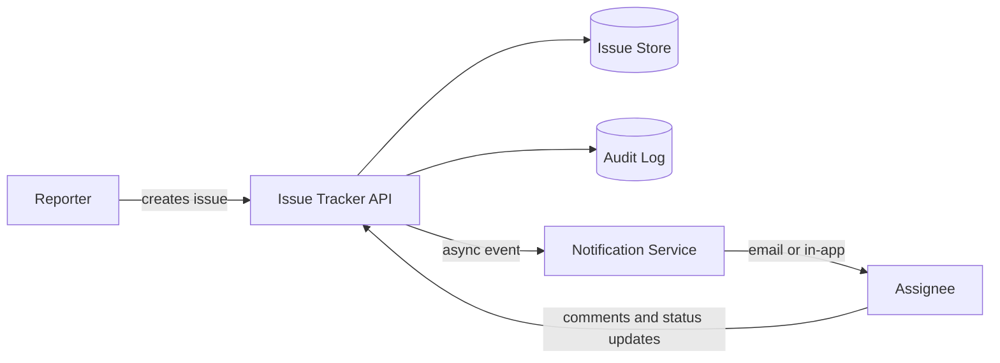

The diagram shows the two halves of the system: a synchronous write path (reporter to API to database, with audit captured in the same transaction) and an asynchronous fan-out path (notifications delivered to assignees and watchers without blocking the write).

---

### Functional Requirements

1. **Issue creation**
   - Create an issue with title, description, priority, and type (bug, task, story, incident).
   - The server assigns a human-readable key (`PROJ-123`) and records the reporter from the authenticated identity, never from the request body.
2. **Assignment and status workflow**
   - Assign an issue to a user (or leave it in the team's unassigned queue).
   - Change status through a fixed workflow: `OPEN → IN_PROGRESS → RESOLVED → CLOSED`, with reopen transitions (`RESOLVED → IN_PROGRESS`, `CLOSED → OPEN`) and a direct `OPEN → CLOSED` for duplicates/won't-fix.
   - Invalid transitions (for example, `OPEN → RESOLVED` skipping work, or mutating a `CLOSED` issue's fields) are rejected server-side.
3. **Comments**
   - Add comments to an issue; comments are append-only (edit history optional for a basic system).
4. **Labels**
   - Apply and remove labels scoped to the project; filter issues by one or more labels.
5. **Filtering and search**
   - Filter issues by project, status, assignee, priority, type, and label.
   - Full-text search over title, description, and comments.
6. **Notifications**
   - Notify the assignee and watchers on status change, assignment, and new comments; reporter is an implicit watcher.
7. **SLA tracking (basic)**
   - Each priority maps to response and resolution targets; issues breaching targets are flagged and escalated.

---

### Non-Functional Requirements

- **Scale**: Small-to-medium teams/projects, tens of thousands of issues per project; mid-size SaaS deployment of ~20,000 active projects and ~100 million new issues per year.
- **Latency**: Create/update/comment under 200 ms at p99. Filtered list queries under 300 ms at p99. Full-text search under 500 ms at p99.
- **Consistency**: Status transitions and field changes are strongly consistent and atomic with their audit-log entries. Search indexes may lag writes by a few seconds (eventual consistency is acceptable there).
- **Auditability**: Status changes and comments should be traceable (who/when); every field mutation produces an append-only audit entry written in the same transaction as the change.
- **Availability**: 99.9% monthly for the write path; notification delivery may lag but must be at-least-once with deduplication.
- **Durability**: No acknowledged write is lost on a single-node failure; the audit log is never rewritten.
- **Security**: Project-scoped authorization; users only see issues in projects they belong to; rate limiting per user on write endpoints.

---

### Capacity Estimation

Back-of-envelope math for a mid-size multi-tenant deployment. Adjust the assumptions, keep the method.

**Tenants and issues**

- Organizations: 2,000. Projects per organization: 10 → **20,000 active projects**.
- Issues per project per year: 5,000 (a busy team files ~15–20/day) → **100 million issues per year**.
- Comments per issue: 5 → **500 million comments per year**.
- Field changes per issue (status, assignee, priority, labels): 6 → **600 million audit-log rows per year**.

**QPS**

- Daily active users: 200,000; operations per DAU per day: ~25 (creates, edits, comments, list views, searches) → 5M operations/day.
- Average: 5M / 86,400 s ≈ **58 QPS**; peak at ~3× (morning stand-ups, release days) ≈ **175 QPS**. Read:write ratio ~4:1, so ~35 writes/second average — a single PostgreSQL primary handles this trivially.
- Search queries: ~15% of operations → ~9 QPS average, ~26 QPS peak.

**Notification load**

- Events per issue (created, assigned, status changes, comments): ~12.
- Average recipients per event (assignee + watchers − actor): ~3 → 100M × 12 × 3 = **3.6 billion notifications per year** ≈ 115/second average, ~350/second peak. This is why notifications are queued, not sent inline.

**Storage**

- Issue row: id (16 B) + key (~12 B) + title (~80 B) + description (~1 KB avg) + status/priority/type (~30 B) + FKs and timestamps (~80 B) + index overhead (~2×) → **~2.5 KB per issue** → 100M × 2.5 KB ≈ **250 GB/year**.
- Comments: 500M × ~400 B ≈ **200 GB/year**.
- Audit log: 600M × ~250 B ≈ **150 GB/year**.
- Total ≈ **600 GB/year of new data**. Growth levers: partition audit log and comments by month, archive issues from closed projects to cold storage.

**Key takeaways for the interview**

- The transactional write load is small; the two capacity problems are (a) **notification fan-out** (~350/second peak, must not block writes) and (b) **full-text search** over hundreds of millions of rows.
- Per-project volume (tens of thousands of issues) means `project_id` is an excellent partition/filter key for every query and index.
- The audit log grows ~6× faster than the issue table — design its lifecycle (monthly partitions) from day one.

---

### Characteristics

- **Workflow-centric domain**
  What it means: the core entity is a state machine, not a bag of fields; the interesting logic is in transitions, not storage.
  Why it matters: without enforced transitions, reports like "open bugs by week" are meaningless because states are used inconsistently.
  How it works: a fixed transition map validated on every write, with the transition itself recorded in the audit log.
  Example: `OPEN → RESOLVED` is rejected; a developer must pass through `IN_PROGRESS`, so "time in progress" metrics stay honest.

- **Single-writer rows with optimistic concurrency**
  Issues are edited by one person at a time in practice, but two people *can* edit simultaneously (one changes priority, one changes status). A `version` column with optimistic locking serializes these without holding database locks across user think-time.

- **Append-mostly side tables**
  Comments and audit entries are insert-only; the issue row is the only heavily updated row. This makes the hot row small and the history tables easy to partition by time.

- **Multi-tenant by project**
  Every query is scoped to a project (and projects to an organization). Authorization, indexing, and eventually sharding all key off `project_id`.

- **Read model divergence**
  The transactional store (PostgreSQL) and the search store (OpenSearch) are separate; search is eventually consistent by a few seconds. Users tolerate a just-created issue missing from search for seconds but not from the issue view itself.

- **Asynchronous side effects**
  Notifications and search indexing are downstream effects of a write, delivered at-least-once and deduplicated. The write path never calls an email provider or a search cluster inline.

- **Hot-row risk on famous issues**
  A high-profile incident (for example, an outage issue watched by 500 engineers) concentrates comment writes and notification fan-out on one row — the design must bound fan-out work per event.

- **Human-scale latency, machine-scale audit**
  Interactive latency targets are modest (200 ms), but the audit trail must be complete enough to reconstruct any past state years later.

---

### Components

- **API layer (REST service)**
  Purpose: exposes issue CRUD, comments, labels, filters, and search to clients.
  Responsibilities: authentication, project-scoped authorization, request validation, orchestrating the transactional write (issue + audit + outbox) per mutation.
  How it works: stateless Spring Boot service behind a load balancer; all identity comes from a JWT, never the request body.
  Relationship: the only writer of issue state; publishes events via the outbox.
  Real-world example: the Jira REST API (`/rest/api/3/issue/{key}`) with the same create/transition/comment shape.

- **Issue store (relational database)**
  Purpose: durable source of truth for issues, comments, labels, watchers, audit log, and outbox events.
  Responsibilities: transactional consistency of a mutation plus its audit rows; indexed access for filtered lists.
  Relationship: read by the API for queries, by the SLA scheduler for breach scans, and by the outbox relay.
  Real-world example: PostgreSQL with a partial index on open issues per project.

- **State machine module**
  Purpose: encodes legal status transitions and rejects illegal ones.
  Responsibilities: validate `(current, target)` pairs; centralize the workflow so controllers, bulk importers, and automation all obey the same rules.
  Relationship: invoked by the issue service on every status change; transitions are recorded in the audit log.
  Real-world example: Jira's workflow engine is the configurable generalization of this fixed map.

- **Audit log store**
  Purpose: append-only record of every field change: field, old value, new value, actor, timestamp.
  Responsibilities: answer "who changed what, when" and power the issue activity feed; enable reconstruction of any past state.
  Relationship: written in the same transaction as each mutation; read by the activity endpoint and compliance exports.
  Real-world example: GitHub's issue "timeline" view is a read model over exactly this kind of event log.

- **Outbox and relay**
  Purpose: bridge the transactional write and the message broker without dual-write risk.
  Responsibilities: persist an event row with the mutation; a relay publishes unpublished rows to the queue and marks them sent.
  Relationship: written by the API transaction, read by the relay.
  Real-world example: Debezium reading an outbox table via change data capture into Kafka.

- **Message queue**
  Purpose: decouple writes from fan-out side effects; absorb notification bursts.
  Responsibilities: hold `issue-updated`, `comment-added`, and `sla-breached` events until consumers process them; retry failed deliveries.
  Relationship: written by the relay; read by the search indexer and notification workers.
  Real-world example: RabbitMQ topic exchange, or Kafka topics partitioned by `issue_id` so events for one issue stay ordered.

- **Search index and indexer**
  Purpose: full-text search over titles, descriptions, and comments with filters.
  Responsibilities: the indexer consumes change events and upserts documents; the index serves ranked, filtered queries.
  Relationship: downstream of the queue; queried by the API's search endpoint, which merges hits with database state for authorization.
  Real-world example: OpenSearch or Elasticsearch; GitHub issues search runs on a similar ingest pipeline.

- **Notification workers and providers**
  Purpose: turn issue events into emails, in-app notifications, and chat messages.
  Responsibilities: resolve watchers and preferences, deduplicate, render templates, call providers, record deliveries.
  Relationship: downstream of the queue; writes delivery records back to the database.
  Real-world example: SES/SendGrid for email, Slack webhooks for team channels, FCM for mobile push.

- **SLA breach scheduler**
  Purpose: flag issues that exceed response/resolution targets for their priority.
  Responsibilities: periodically scan open issues where `response_due_at` or `resolution_due_at` has passed, mark breach, emit escalation events.
  How it works: a batched poller using `FOR UPDATE SKIP LOCKED`, exactly like a reminder scheduler.
  Real-world example: Zendesk's SLA engine, which evaluates breach conditions on a timer rather than at read time.

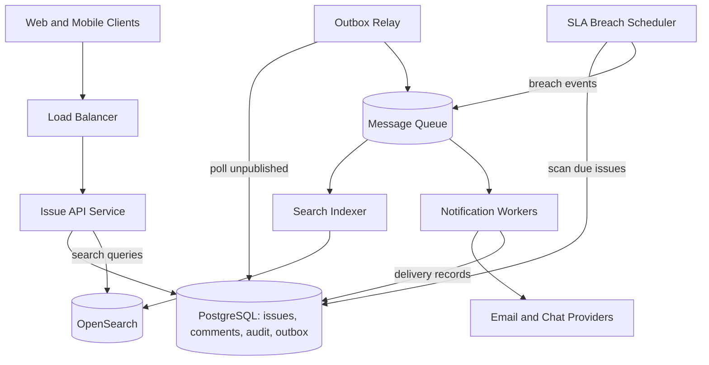

The API is the only synchronous component on the write path; everything to the right of the queue is asynchronous and horizontally scalable, which is what keeps p99 write latency under 200 ms even during fan-out spikes.

---

### Architectural Patterns

- **State Machine**
  What it is: statuses are explicit states (`OPEN`, `IN_PROGRESS`, `RESOLVED`, `CLOSED`) and a transition map defines legal moves.
  Problem it solves: prevents meaningless states (`OPEN → RESOLVED` skipping verification) that corrupt metrics and confuse consumers of the data.
  How it works: a shared component validates `(from, to)` before any status write; rejections return `409` or `422` with the legal targets listed.
  When to use: whenever a field encodes a lifecycle. When not: free-form tagging fields with no ordering semantics.
  Advantages: integrity enforced in one place; audit entries only ever contain legal moves. Disadvantages: a fixed map needs a deploy to change; configurable workflows require a workflow engine.
  Real-world example: Jira workflows; GitHub Issues' simpler open/closed model with reopen.

- **Transactional Outbox**
  What it is: the state change and the "event to publish" row commit in one database transaction; a relay moves events to the broker.
  Problem it solves: the dual-write problem — updating the issue and publishing a notification event are two writes; a crash between them loses the event or publishes a phantom.
  How it works: `UPDATE issues ...; INSERT INTO outbox (...); COMMIT`; the relay publishes and marks rows sent; consumers are idempotent.
  When to use: whenever a mutation must reliably trigger async work. When not: events where loss is acceptable (analytics beacons).
  Advantages: atomicity without distributed transactions. Disadvantages: an extra table and relay; at-least-once delivery pushes deduplication to consumers.
  Real-world example: Debezium CDC streaming an outbox table to Kafka.

- **Append-Only Audit Log**
  What it is: every mutation inserts `(issue_id, field, old_value, new_value, actor_id, changed_at)` rows in the same transaction as the change.
  Problem it solves: accountability and reconstructability — the "history/blame" requirement — without trusting application logs.
  How it works: the service computes the field diff before writing and inserts one row per changed field.
  When to use: regulated domains, multi-actor shared entities. When not: high-churn ephemeral data where history has no value.
  Advantages: the activity feed and compliance exports are free; debugging "who broke this" is a query. Disadvantages: 6× row growth versus the entity table; needs monthly partitioning and archival.
  Real-world example: GitHub's issue timeline; Salesforce field history tracking.

- **Idempotent Consumer**
  What it is: notification workers record `(event_id, recipient)` deliveries and ignore duplicates.
  Problem it solves: at-least-once queues plus retries deliver the same event twice; users must not get two identical emails.
  How it works: a unique constraint on a deliveries table is the backstop; the worker checks-then-inserts in one transaction.
  Advantages: exactly-once *effect* from at-least-once transport. Disadvantages: an extra write per delivery; the residual crash window between provider-send and commit remains (named, bounded, accepted).

- **CQRS-lite (separate read model for search)**
  What it is: writes go to PostgreSQL; search reads go to OpenSearch, fed by change events.
  Problem it solves: relational databases are poor at ranked full-text search at scale, and search load must not contend with transactional load.
  How it works: the indexer consumes `issue-updated`/`comment-added` events and upserts search documents; the API queries the index, then enforces authorization by checking project membership against the database.
  When to use: when search relevance, aggregations, or language analysis matter. When not: when PostgreSQL `tsvector` satisfies relevance needs — start there.
  Advantages: independent scaling and schema for search. Disadvantages: operational cost of a second store; lag between write and searchability must be communicated in the UI.
  Real-world example: GitHub and Stack Overflow both index content into Elasticsearch clusters asynchronously.

- **Observer (pub/sub fan-out)**
  What it is: issue events are published to a topic; notification, indexing, and metrics consumers each subscribe independently.
  Problem it solves: the write path stays O(1) as new side effects are added — adding a Slack integration is a new consumer, not an API change.
  Advantages: extensibility and isolation. Disadvantages: eventual consistency and harder end-to-end tracing.

- **Polling Publisher with row claiming (for the SLA scheduler)**
  What it is: a scheduled job that claims breaching issues with `SELECT ... FOR UPDATE SKIP LOCKED LIMIT N`.
  Problem it solves: breach detection must run without user traffic and must survive restarts.
  Advantages: self-healing, horizontally scalable without a lock service. Disadvantages: breach detection granularity equals the poll interval (fine for minute-scale SLAs).

---

### Benefits

- **Single source of truth**: one system answers "what is the state of this work" for engineering, QA, support, and management, eliminating status meetings whose only purpose is information transfer.
- **Enforced process quality**: the state machine makes workflows real — a fix cannot skip verification because the transition is rejected, not frowned upon.
- **Complete accountability**: the audit log turns "the priority changed overnight" into a two-second query; this changes team behavior because actions are attributable.
- **Asynchronous resilience**: because notifications and indexing are queued, a provider outage degrades email delivery, not the product; the write path's availability is decoupled from every downstream dependency.
- **Prioritized attention**: SLA targets per priority convert "everything is urgent" into a measurable queue — breached issues are flagged by the system, not by whoever shouts loudest.
- **Searchable institutional memory**: resolved issues become a knowledge base; "have we seen this before" is a search, not a question to the longest-tenured engineer.

---

### Pros

- **Simple mental model**: four states, append-only comments, one assignee — new users are productive in minutes (compare Jira's configuration surface).
- **Strong integrity with commodity infrastructure**: the whole consistency story (transitions, audit, outbox) lives in one PostgreSQL database with transactions; no distributed coordination needed.
- **Cheap to operate at target scale**: ~175 peak QPS and ~600 GB/year fit a single well-provisioned primary plus read replicas; the async tier scales independently with queue depth.
- **Observable by construction**: the audit log and deliveries tables double as the system's telemetry; most "what happened" questions are SQL queries.
- **Extensible via consumers**: new side effects (chat, metrics, webhooks) attach to the event topic without touching the write path.
- **Interview-friendly scope cuts**: a fixed workflow is defensible for "basic", and the upgrade path (configurable workflow engine) is easy to articulate.

---

### Cons

- **Fixed workflow rigidity**: teams with review states (`IN_REVIEW`, `QA`, `STAGING`) outgrow four states; the honest answer is a workflow engine, which is a much larger build.
- **Single-assignee limitation**: real work is often paired; modeling co-assignees requires a join table and changes notification routing.
- **Eventual-consistency surprises**: a user creates an issue, searches for it a second later, and misses it; the UI must hint at indexing lag or read-your-writes via a direct lookup.
- **Audit-log growth**: history tables grow ~6× the entity table; without partitioning and archival, vacuum and backup times degrade within a year.
- **Hot-issue contention**: an incident issue with hundreds of watchers serializes comment writes on one row and creates a notification burst; nothing in the basic design bounds per-issue fan-out.
- **Notification noise**: naive fan-out (every event to every watcher) trains users to ignore notifications; preference and digest logic add real complexity later.
- **No cross-project queries in the basic model**: portfolio reporting ("all open P1s across 40 projects") requires either indexed scans across partitions or a reporting replica.

---

### Challenges

- **Technical**: keeping the four-write transaction (issue update + audit rows + outbox event + comment) atomic and fast; expressing the transition rules in one place so REST, bulk import, and automation cannot diverge.
- **Scalability**: notification fan-out at 350/second peak; audit-log ingestion at ~19 rows/second average with burst headroom; search indexing throughput during backfills (reindexing 300M documents takes hours and must run alongside live traffic).
- **Performance**: filtered list queries (`project + status + assignee + labels`) need composite and partial indexes or they degrade to scans at tens of thousands of issues per project; the "hot issue" comment append must not block reads of the issue.
- **Reliability**: crash windows between the provider send and the delivery-record commit produce rare duplicate notifications; the SLA scheduler must catch up after downtime without double-flagging breaches.
- **Maintainability**: the transition map, SLA matrices, and notification templates all become product surface area; hardcoding them in service code guarantees a steady stream of "just change this rule" tickets — externalize via configuration.
- **Operational**: running a second store (OpenSearch) doubles on-call scope; mapping queues, DLQs, reindex runs, and outbox backlog are dashboards that must exist before launch, not after the first incident.
- **Security**: project-scoped authorization must be enforced on *every* read path including search hits (a leaked issue key in search results is a breach); attachments (out of scope here but inevitable) bring malware-scanning and presigned-URL concerns.

---

### Best Practices

- **Validate transitions server-side, always** — clients lie, bulk scripts lie, and future automation lies. If the rule lives only in the UI, one API curl corrupts the workflow. The state machine belongs in the service layer, shared by every entry point.
- **Write the audit rows in the same transaction as the mutation** — an audit log written after commit (or via a fire-and-forget event) can lose the very entries that matter during an incident. Atomicity is the whole point of the audit trail; accepting "audit is eventually consistent" means your compliance story has a hole.
- **Never call email/push providers inline on the write path** — provider latency (hundreds of milliseconds to seconds) and outages would couple your p99 and your availability to a third party. Queue and retry instead; the write should only pay for durable state changes.
- **Key every event by `issue_id` and partition the topic by it** — ordering matters per issue (a "closed" event must not be processed before the "opened" event for the same issue), and per-key partitioning gives ordering without global serialization.
- **Store timestamps in UTC and compute SLA deadlines at write time** — `resolution_due_at` as a concrete instant makes the breach scan a pure index comparison; computing "priority P1 → 4 business hours" repeatedly at read time invites inconsistency and kills index usage.
- **Use cursor pagination for issue lists** — offset pagination duplicates or skips issues when someone creates or reorders items mid-scroll, which is constant in an active tracker. Keyset pagination on `(created_at, id)` is stable and index-friendly.
- **Enforce authorization at the query layer, not the controller layer** — repository methods take `projectId`/`userId` as mandatory parameters so a forgotten annotation cannot leak data; search hits are re-checked against project membership before rendering.
- **Treat the audit log as a time-series table from day one** — monthly range partitions and a 13-month hot retention keep vacuum, backups, and queries predictable; retrofitting partitioning onto a 500M-row table is an outage.
- **Emit metrics from consumers, not just the API** — queue lag, indexer lag, and notification delivery failure rate are the early-warning signals; the API can be green while the system silently stops sending mail.

---

### When to Use / When Not to Use

**Use this design when**

- A team or small organization needs issue/ticket tracking with accountability and does not need process customization per project.
- Auditability is a hard requirement (regulated change management, support SLAs) — the transactional audit log is the design's core strength.
- Volume is modest (thousands of issues per project per year) and a single relational primary is an asset, not a ceiling.
- Time-to-value matters: four states, one assignee, append-only comments can ship in weeks.

**Do not use this design when**

- Teams need per-project configurable workflows with custom states, guards, and post-functions — that is a workflow engine (Jira's actual product), and bolting configurability onto a fixed state machine produces the worst of both worlds.
- Cross-organization collaboration is central (open-source triage at GitHub scale, multi-company programs) — the single-tenancy-per-project authorization model becomes the blocker.
- Real-time collaboration is required (Google-Docs-style simultaneous editing of descriptions) — that is an OT/CRDT problem this design deliberately avoids with optimistic locking and "last writer wins on different fields".
- Notification intelligence is the product (PagerDuty-style alerting with on-call rotations and escalation chains) — those deserve dedicated subsystems, not a watcher list.

**Trade-offs (preserved from the original design)**

- A fixed workflow (state machine) is simple to reason about but less flexible than a fully configurable workflow engine, which is the right trade for a "basic" tracker.

---

### Use Cases

**1. SaaS product team bug backlog**

- Problem: a 30-person product team tracks defects reported by support and QA; bugs get lost in chat, and nobody can answer "when was this regressed?" during incident review.
- Solution: every report becomes an issue with type `BUG`, a priority mapped from severity, and a label per product area; support is reporter, an engineer is assignee.
- Why suitable: the fixed four-state workflow matches their actual process (triage → fixing → fixed → verified); the audit log gives incident reviews an authoritative timeline.
- How it works: support files via the web app; triage assigns during a daily stand-up; status transitions drive Slack notifications to the team's channel via a consumer on the event topic.
- Trade-offs: they outgrow four states within a year (want `IN_REVIEW`); handled by accepting the limitation or planning the workflow-engine migration.

**2. IT helpdesk ticketing for a 500-person company**

- Problem: employees email IT directly; requests are untracked, unowned, and unmeasured; leadership wants response-time reporting.
- Solution: each email becomes an issue (mail-gateway consumer); priority maps to SLA targets (P1: respond in 1 hour, resolve in 8 business hours); the SLA scheduler flags breaches to the team lead.
- Why suitable: single assignee, append-only comments, and email notifications match helpdesk work exactly; SLA matrices per priority are first-class in this design.
- How it works: the SLA scheduler scans open issues every minute; breaches emit escalation events; weekly reporting reads the audit log for response/resolution durations.
- Trade-offs: no self-service knowledge base or asset management (real ITSM features); acceptable because the mandate is tracking, not full ITSM.

**3. Open-source project issue tracker (GitHub-Issues-like)**

- Problem: a popular library receives hundreds of issues per month from strangers; maintainers need labeling, dedup, and search to survive the volume.
- Solution: public issues with label-based triage (`needs-repro`, `good-first-issue`); full-text search before filing reduces duplicates; watchers get notified so reporters hear back without maintainer effort per message.
- Why suitable: the label + filter + search core is exactly this design's read path; notifications scale with watchers rather than maintainer attention.
- How it works: reporters search first (OpenSearch); maintainers label in bulk; bots (consumers) auto-label by keyword and close stale `needs-repro` issues after N days.
- Trade-offs: public read access breaks the "members only" authorization model — the project-visibility concept must be extended; hot issues with 500 watchers stress fan-out, requiring digest collapsing.

**4. Fintech production-incident defect intake**

- Problem: a payments company must log every production defect with a regulatory audit trail; any field change must be attributable, and records are retained for 7 years.
- Solution: issues created from an incident tool via API; the audit log is the compliance artifact; monthly partitions are archived to object storage with a 7-year retention policy.
- Why suitable: the transactional audit log (same-transaction guarantee) is precisely what auditors ask for; priority-to-SLA mapping satisfies internal regulator reporting.
- How it works: every mutation writes audit rows atomically; quarterly compliance exports replay audit partitions; closed issues archive to cold storage after 13 months hot.
- Trade-offs: 7-year retention makes the audit log the largest table by far — partitioning and archival are mandatory, not optional; the basic fixed workflow fits because regulators prefer a simple, explainable lifecycle.

---

### Data Model and APIAPI Design

REST, JSON, versioned under `/api/v1`. All timestamps are ISO-8601 UTC. All endpoints require `Authorization: Bearer <JWT>`; the caller's user ID and project memberships come from the token, never from the request body.

**Core endpoints (preserved from the original design, extended)**

```
POST   /api/v1/projects/{projectId}/issues        create an issue
PATCH  /api/v1/issues/{issueId}                   update status, assigneeId, priority
POST   /api/v1/issues/{issueId}/comments          add a comment
GET    /api/v1/projects/{projectId}/issues?status=&assignee=   filter issues
GET    /api/v1/issues/{issueId}                   fetch one issue with comment count
GET    /api/v1/issues/{issueId}/activity          audit history for the issue
GET    /api/v1/projects/{projectId}/issues/search?q=           full-text search
PUT    /api/v1/issues/{issueId}/labels            replace the label set
POST   /api/v1/issues/{issueId}/watchers/{userId} watch an issue
```

**Create an issue**

`POST /api/v1/projects/{projectId}/issues`

```json
{
  "title": "Checkout fails with 500 when cart has a gift card",
  "description": "Repro: add gift card + any item, apply coupon, submit payment. Server logs show NPE in GiftCardValidator.",
  "priority": "HIGH",
  "type": "BUG",
  "labels": ["payments", "checkout"]
}
```

Validation: `title` required, 1–200 chars; `description` up to 32 KB; `priority` one of `LOW|MEDIUM|HIGH|CRITICAL`; `type` one of `BUG|TASK|STORY|INCIDENT`; labels must exist in the project. The server assigns the issue key (`PAY-1284`), sets the reporter from the JWT, and computes SLA deadlines from the priority matrix.

Response `201 Created`:

```json
{
  "id": "7b1f9c2e-3a4d-4e21-9f0a-2c5d7e9b1a34",
  "key": "PAY-1284",
  "projectId": "3c9d...",
  "title": "Checkout fails with 500 when cart has a gift card",
  "status": "OPEN",
  "priority": "HIGH",
  "type": "BUG",
  "reporterId": "u-88f...",
  "assigneeId": null,
  "labels": ["payments", "checkout"],
  "responseDueAt": "2026-06-11T09:00:00Z",
  "resolutionDueAt": "2026-06-13T17:00:00Z",
  "slaBreached": false,
  "version": 1,
  "createdAt": "2026-06-10T14:30:00Z"
}
```

**Update status / assignee / priority**

`PATCH /api/v1/issues/{issueId}` — partial update. Sending an illegal transition returns `422` with the legal targets:

```json
{
  "type": "https://api.example.com/problems/invalid-transition",
  "title": "Invalid status transition",
  "status": 422,
  "detail": "OPEN -> RESOLVED is not allowed",
  "allowedTransitions": ["IN_PROGRESS", "CLOSED"]
}
```

Every accepted change writes audit rows (`field`, `oldValue`, `newValue`, `actorId`, `changedAt`) in the same transaction and bumps `version`.

**Add a comment**

`POST /api/v1/issues/{issueId}/comments` with `{ "text": "..." }`; returns `201`. Comments on `CLOSED` issues are allowed but reopen is an explicit `PATCH` (`CLOSED → OPEN`), not a side effect of commenting.

**Filter with pagination, filtering, sorting**

`GET /api/v1/projects/{projectId}/issues?status=OPEN&assignee=u-88f&label=payments&sort=createdAt,desc&cursor=eyJpZCI6...&limit=50`

Cursor-based (keyset) pagination so concurrent creates/updates do not duplicate or skip rows. Response includes `nextCursor` when more pages exist. Sorting is restricted to indexed columns (`createdAt`, `priority`, `updatedAt`) to keep list queries inside the 300 ms budget.

**Full-text search**

`GET /api/v1/projects/{projectId}/issues/search?q=gift+card+500&status=OPEN` — runs against the search index, ranked by relevance, then re-authorized against project membership. Response documents carry `rank` and highlight fragments; the UI notes results may lag a few seconds behind writes.

**Error responses and status codes**

Consistent RFC 7807 problem-details shape. Codes: `400` validation failure, `401` unauthenticated, `403` not a project member, `404` unknown issue/key, `409` version conflict (`If-Match` mismatch on concurrent edit), `422` invalid transition, `429` rate limited (with `Retry-After`).

**Cross-cutting concerns**

- **Idempotency**: `POST` endpoints accept an `Idempotency-Key` header stored per user for 24 hours — a retried mobile submission cannot file the same bug twice; a replay returns the original `201` body.
- **Optimistic concurrency**: `PATCH` accepts `If-Match: "3"`; a stale editor gets `409` and must re-fetch, protecting the classic two-tab edit race.
- **Rate limiting**: per-user token bucket (for example, 60 writes/minute, 600 reads/minute); `429` responses include `Retry-After`.
- **Versioning**: URI version `v1`; breaking changes ship as `v2` with `v1` maintained for one release cycle; additive fields ship freely in `v1`.
- **Auth**: JWT bearer tokens carry user ID and project roles; every repository query is scoped by project ID so authorization cannot be bypassed by guessing IDs.

---

#### Data Modeling

**Entities and relationships**

An organization owns projects; a project contains issues; an issue has one reporter and at most one assignee, many comments, many audit entries, many labels (via a join table), and many watchers. Events fan out to notification deliveries for idempotency tracking.

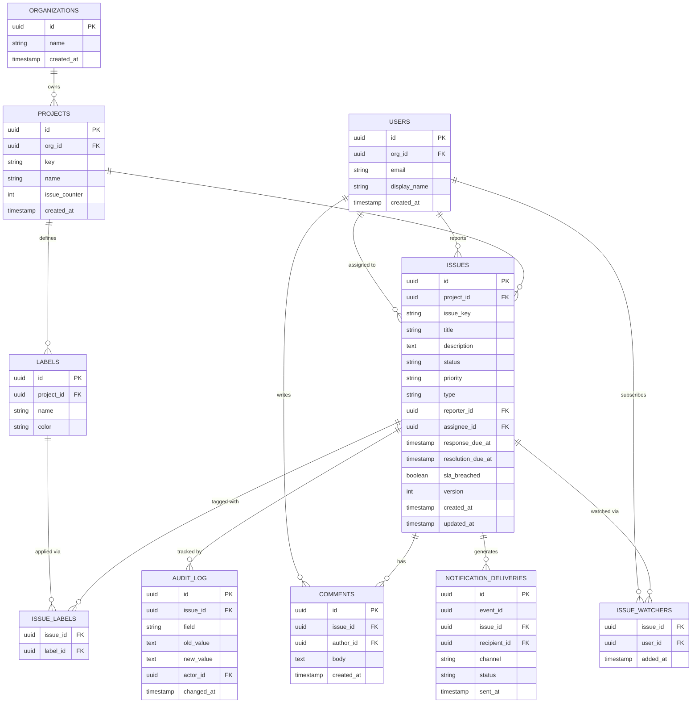

**Original minimal schema (preserved)**

```
issues:    id (PK), project_id (FK), title, description, status, priority, type, assignee_id, created_at
comments:  id (PK), issue_id (FK), user_id, text, created_at
audit_log: id (PK), issue_id (FK), field, old_value, new_value, changed_by, changed_at
```

The enhanced model keeps these three tables intact and adds what the requirements imply: `reporter_id`, the human-readable `issue_key`, SLA deadline columns, optimistic-locking `version`, labels and watchers (functional requirements 4 and 6), and a deliveries table for idempotent notification fan-out.

**Keys, constraints, indexes**

- PKs: surrogate UUIDs everywhere (bulk importers and consumers can generate IDs without hitting a sequence).
- `issue_key` is `PROJECT.key || '-' || counter`, where `projects.issue_counter` is incremented atomically (`UPDATE projects SET issue_counter = issue_counter + 1 ... RETURNING`) inside the create transaction — gaps are acceptable, duplicates are not.
- `UNIQUE (project_id, issue_key)` — keys are only unique within a project.
- `UNIQUE (issue_id, label_id)` and `UNIQUE (issue_id, user_id)` on the join tables — duplicate tags/watches are impossible by construction.
- `UNIQUE (event_id, recipient_id)` on `NOTIFICATION_DELIVERIES` — the idempotency backstop for fan-out.
- Check constraints: `status IN ('OPEN','IN_PROGRESS','RESOLVED','CLOSED')`, `priority IN ('LOW','MEDIUM','HIGH','CRITICAL')`.
- Indexes:
  - `issues (project_id, status, created_at DESC)` — the main filtered list.
  - `issues (assignee_id, status) WHERE status IN ('OPEN','IN_PROGRESS')` — "my open work" dashboards (partial, so closed history never bloats it).
  - `comments (issue_id, created_at)` — thread rendering.
  - `audit_log (issue_id, changed_at)` — activity feed; plus a monthly `PARTITION BY RANGE (changed_at)` for lifecycle management.
  - `issues (resolution_due_at) WHERE status IN ('OPEN','IN_PROGRESS') AND sla_breached = false` — the SLA breach scan.
  - Full-text: PostgreSQL `tsvector` GIN index for the simple path, or an external OpenSearch index for the scaled path (see Deep Dive 3).

**Normalization**

The model is in 3NF: labels and watchers are join tables, not arrays, because they are queried relationally ("all issues with label X", "who watches issue Y"). The one deliberate denormalization is the pair `response_due_at` / `resolution_due_at`: derivable from priority + created time, but materialized at write time so the breach scan is a pure index lookup instead of a per-row calendar computation.

**Data lifecycle**

- Closed issues stay hot for 13 months, then archive to cold storage per project; issue keys are never reused.
- `AUDIT_LOG` is range-partitioned by month; old partitions detach and move to object storage (compliance retention 7 years in the fintech use case).
- `NOTIFICATION_DELIVERIES` retains 90 days (enough for dedup and debugging), then ages out.
- Deleting a user anonymizes PII but keeps `actor_id` references intact — audit integrity outranks per-user cascade deletion.

**Partitioning and scaling**

A single PostgreSQL primary with read replicas suffices at the target scale. Growth levers, in order: partition audit/comments by month; move search to OpenSearch; shard by `project_id` hash only when a single primary's write throughput or storage forces it — every hot query is project-scoped, so the shard key is obvious and cross-shard queries stay rare (portfolio reporting reads a warehouse).

---

### High-Level Design

**Original simplified architecture (preserved)**

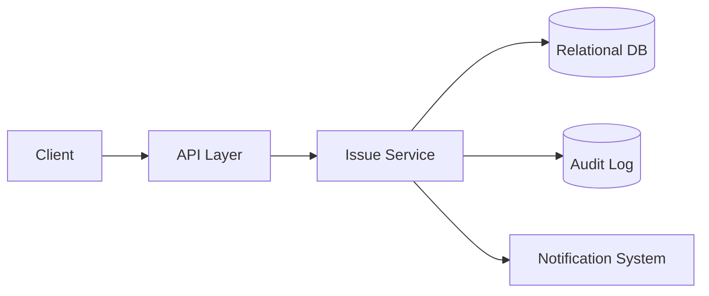

This sketch captures the essential write path: one service, one relational store, an audit trail, and a notification side effect. The full design below makes the side effect asynchronous and adds the search read path and the SLA scheduler.

**Major components and responsibilities**

1. Client (web/mobile) — renders issue lists, detail, and activity feed; sends optimistic-locking headers on edits.
2. Load balancer — TLS termination, routing to stateless API nodes.
3. Issue API service — CRUD, workflow validation, audit writes, outbox writes, filtered queries, search proxying.
4. PostgreSQL — source of truth (issues, comments, labels, watchers, audit, outbox, deliveries).
5. Outbox relay — publishes committed events to the queue.
6. Queue — topics for `issue-created`, `issue-updated`, `comment-added`, `sla-breached`, partitioned by `issue_id`.
7. Search indexer + OpenSearch — consumes events, maintains documents, serves ranked filtered search.
8. Notification workers — resolve watchers and preferences, dedupe, deliver via email/chat providers, record deliveries.
9. SLA breach scheduler — scans due issues, marks breaches, emits escalation events.

**Full architecture**

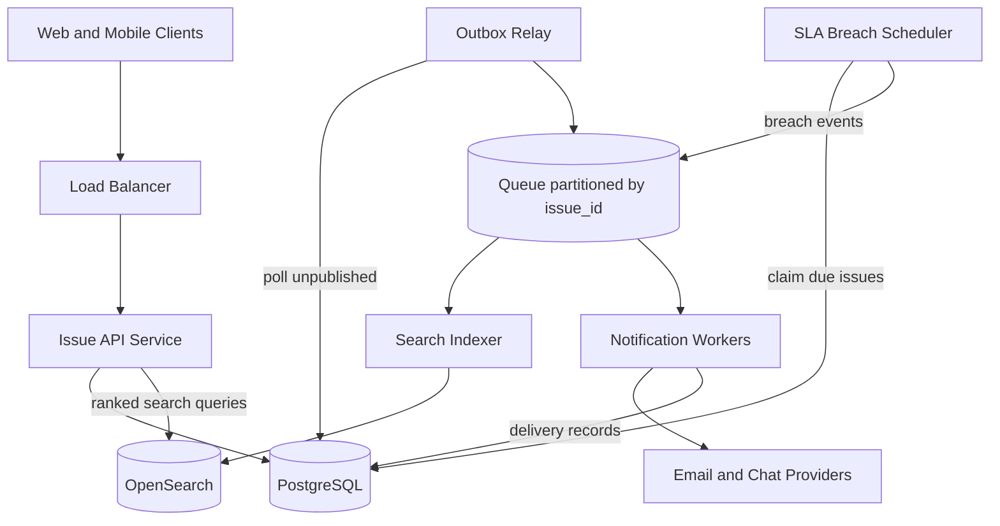

Every component right of the queue consumes independently and scales with queue depth; the write path touches only the API and PostgreSQL, which is what keeps write p99 under 200 ms regardless of notification or search load.

**Write flow — change an issue's status**

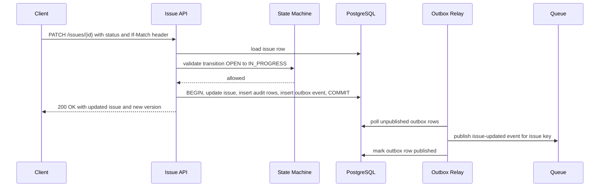

The state-machine check, the version check, the audit rows, and the outbox event all succeed or fail together in one transaction — there is no interleaving in which the status changed but the audit or the notification event was lost.

**Notification fan-out flow**

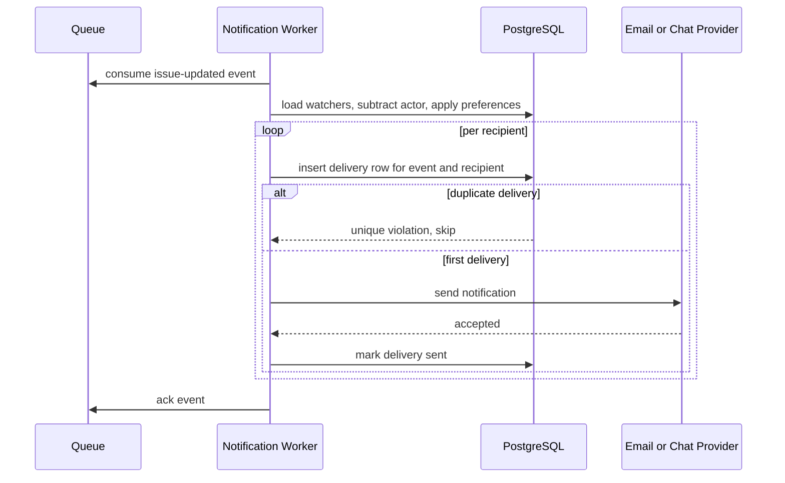

The `(event_id, recipient_id)` unique constraint is the dedup backstop: even if the event is redelivered after a worker crash, already-recorded recipients are skipped, and the residual duplicate window is bounded to one provider call per crashed recipient.

**Scaling strategy**

API nodes scale horizontally behind the load balancer; PostgreSQL scales reads via replicas (filtered lists are replica-eligible; the issue detail read-after-write stays on the primary); consumers scale with queue depth; the SLA scheduler runs a few replicas sharing work via `SKIP LOCKED`. Search scales with OpenSearch shard count, indexed by `project_id` routing so one project's queries hit one shard.

**Failure handling**

- API crash mid-write: transaction rolls back — no partial issue, no orphan audit rows, no phantom event.
- Relay crash or broker down: outbox rows accumulate and backfill on recovery; consumers see a lag spike, not loss.
- Indexer lag: search results go stale by the lag amount; issue detail and list views are unaffected because they read the primary.
- Worker crash after provider send, before delivery commit: redelivery hits the unique constraint and skips — at worst one duplicate email per crashed recipient, visible in the deliveries table.
- SLA scheduler downtime: the scan predicate (`due_at <= now()`) is time-based, so the next run catches everything overdue with no missed-breach state to repair.

---

### Deep Dive

#### 1. Issue lifecycle as a state machine

The original design's key point, preserved: model issue status as a fixed state machine (open → in-progress → resolved → closed) and validate transitions server-side to prevent invalid states.

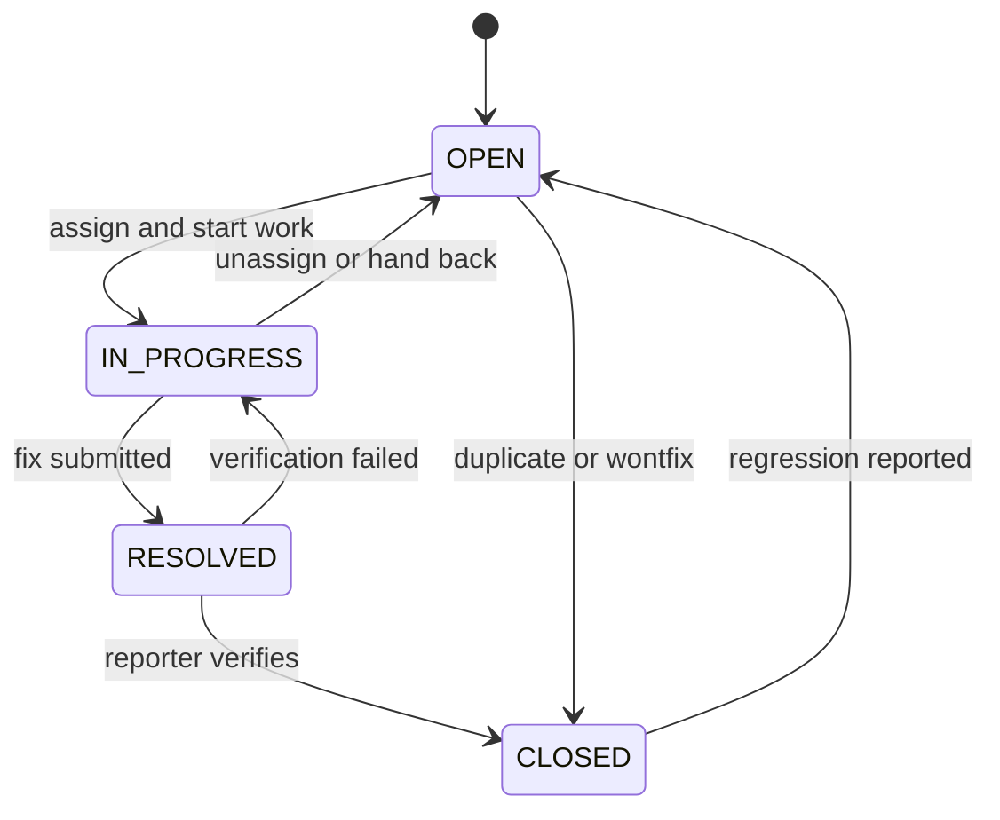

Design decisions and why:

- **Why transitions, not just a status enum**: an enum constrains *values*; the machine constrains *moves*. Metrics like cycle time and reopen rate are only meaningful if every issue walked the same path. `OPEN → RESOLVED` skipping work would silently corrupt "time in progress" analytics, so it is rejected (`422`) with the legal targets listed.
- **Why reopen edges exist**: `RESOLVED → IN_PROGRESS` (verification failed) and `CLOSED → OPEN` (regression) are what make reopen rate computable — a first-class quality metric. Without explicit reopen edges, teams fake it with new issues and the metric dies.
- **Why server-side validation**: REST clients, bulk CSV importers, and future automation bots all write status; the only safe place for the rule is the service layer, shared by every entry point.
- **Transition side effects in the same transaction**: moving to `RESOLVED` may set `resolved_at`; moving to `IN_PROGRESS` the first time stamps `first_response_at` for SLA reporting. These are columns updated in the same transaction as the status, with audit rows for each.
- **The upgrade path**: when teams demand custom states, the map becomes rows in a `workflow_transitions` table per project — the validation code survives, the map's source changes. Naming this in an interview shows the fixed workflow was a choice, not a blind spot.

#### 2. Assignment and routing

Basic assignment is one column; production assignment is a routing problem:

- **Manual assignment** (this design): triage picks an assignee. Simple, but bottlenecks on the triager.
- **Round-robin within a team**: an `assignment_state` row per project (`last_assigned_user_id`) updated in the create transaction. Fair, but ignores load and skill.
- **Load-based routing**: assign to the team member with the fewest open issues — a single indexed query (`GROUP BY assignee_id ... WHERE status IN ('OPEN','IN_PROGRESS')`). Watch the race: two concurrent creates can pick the same "least loaded" person; acceptable for humans (they self-correct), and a per-user advisory lock removes it if it matters.
- **Label-driven routing**: a routing table maps labels to default assignees or teams (`payments` → payments on-call). This is 80% of the value of skills-based routing with 5% of the complexity.
- **Unassigned queue**: issues may legitimately sit unassigned; the dashboard query (`assignee_id IS NULL AND status = 'OPEN'`, indexed) is the triage worklist. Auto-assignment should *propose*, humans *confirm* — misfiling is common and wrong auto-assignment hides issues from the right team.
- **Reassignment on breach**: when the SLA scheduler flags a breach, an escalation policy can reassign to a team lead; the reassignment is a normal audited field change, so escalation history is free.

Interview framing: start with the column, name the routing spectrum, justify stopping at label-driven routing for a basic tracker, and state what would trigger going further.

#### 3. Full-text search on issues

The requirement "search issues by text" has three honest implementation tiers:

- **Tier 1 — `ILIKE '%term%'`**: correct but unindexable for leading wildcards; at tens of thousands of issues per project it scans megabytes per query. Fine for a demo, dead at scale.
- **Tier 2 — PostgreSQL full-text search**: a generated `tsvector` column over `title || description` (weighted: title `A`, description `B`) with a GIN index, queried via `@@ plainto_tsquery(...)`, ranked with `ts_rank`. Covers stemming ("crashes" matches "crash"), ranking, and phrase queries. Combined with the project/status filters, this comfortably serves the target ~26 QPS peak. Comments can be indexed into the same document via a trigger or application-side roll-up on comment events.
- **Tier 3 — external search engine (OpenSearch/Elasticsearch)**: when ranking needs tuning (field boosts, recency decay), when aggregations power dashboards ("count by label over time"), or when index size pressures the primary. Documents are fed by the indexer consumer from the event topic; `issue_id` is the document ID so updates are idempotent upserts.

The two hard problems at tier 3:

- **Sync correctness**: events can arrive out of order across partitions — mitigated by partitioning the topic by `issue_id`, and each document carries the issue `version`; the indexer drops upserts with a lower version than the stored document.
- **Authorization at search time**: the index returns issue IDs fast, but membership checks live in PostgreSQL. Because every search is project-scoped, the API checks the caller's membership in that one project *before* querying the index — no per-hit re-authorization is needed, which is why the API contract requires `projectId` on the search endpoint.

Deletion also flows through events (a `comment-deleted` event re-indexes the document). The search store is always rebuildable from PostgreSQL — say so in an interview; it demotes OpenSearch from "second source of truth" to "derived read model".

#### 4. Labels and filters

- **Model**: project-scoped `labels` plus an `issue_labels` join table with a composite PK. Arrays (`text[]` with a GIN index) are a valid alternative that trades relational queries ("which issues share these two labels, grouped by week") for row locality; the join table wins because label analytics and referential integrity (rename a label once, it renames everywhere) matter here.
- **Filter semantics**: `?label=payments&label=urgent` must define AND vs OR. Issue trackers conventionally AND labels (narrowing); document it in the API. The query becomes `JOIN issue_labels ... GROUP BY issue_id HAVING COUNT(DISTINCT label_id) = N` — with the join-table PK index this stays fast at project scale.
- **Label governance**: unbounded label creation by every user produces `bug`, `Bug`, `BUG`. Restrict label creation to project admins (the API returns `403` otherwise) and support label merge/rename — cheap to add early, painful to retrofit.
- **Filters compose, indexes must too**: the common compound (`project_id, status`) plus optional equality columns is served by one composite index with the most selective leading columns; rarely used filter combinations should not each get an index — cover the top three query shapes, let the rest pay a small filter cost.

#### 5. Notifications and watching

The original design's key point, preserved: notify the assignee/watchers asynchronously on status change or new comment rather than blocking the write.

- **Who gets notified**: watchers ∪ assignee ∪ reporter − actor (the person who acted already knows). Watch rows are created implicitly on report and on comment ("comment to subscribe" is the GitHub convention), explicitly via the watchers endpoint.
- **Event → recipient resolution in the worker**, not the API: watcher lists change after the event is emitted, and resolution is a read-heavy step that must not sit on the write path.
- **Dedup layers**: (1) the actor is excluded; (2) one event that matches several of a user's subscriptions collapses to one notification; (3) the `(event_id, recipient_id)` unique constraint kills redelivery duplicates.
- **Noise control**: batching ("12 updates on PAY-1284" digests on a 10-minute window for low-priority events) is the difference between a notification system and a spam cannon; in a basic system, ship instant notifications only for assignment and mentions, digest the rest.
- **Channel matrix per user**: email always, chat per project webhook, push if device tokens exist. Store preferences per user per project with system defaults; the worker filters the recipient list through preferences before sending.
- **Provider failure**: retry with exponential backoff and jitter on 5xx/throttles; land in a DLQ after N attempts; a re-drive tool replays DLQ entries by re-resolving watchers (a recipient who unwatched during the outage is correctly skipped).

#### 6. SLA and priority escalation

- **Deadline materialization**: at creation (and on priority change), the service computes `response_due_at` and `resolution_due_at` from a per-project priority matrix (P1: 1h/8h, P2: 4h/24h, P3: 24h/5d — configurable). Materializing turns breach detection into `WHERE resolution_due_at <= now() AND status IN ('OPEN','IN_PROGRESS') AND sla_breached = false` — a pure index scan on a partial index.
- **Business hours**: honest SLAs count business time, not wall time. The basic design stores wall-clock deadlines (fine for ops-style 24/7 severity); the advanced answer computes deadlines against a per-project calendar (holidays, work hours) at write time — the scan is unchanged because deadlines are still concrete instants.
- **Breach detection as a poller**: a `@Scheduled` job claims breaching rows with `FOR UPDATE SKIP LOCKED` in batches of 500, sets `sla_breached = true`, writes the audit row, and emits `sla-breached` events (escalation notifications ride the normal fan-out). Time-based predicates make the poller naturally idempotent — rerun safety is free.
- **Response vs resolution**: `first_response_at` is stamped on the first non-reporter comment or status change; "response SLA met" is derivable from the audit log alone, which is why the audit log doubles as the SLA reporting source.
- **Escalation depth**: basic = notify the project lead. The named next step is escalation chains (breach → lead → org admin after 2× target) driven by the same scheduler re-scanning with a second deadline column — a small extension, not a redesign.

---

### Replication Strategies

**What it means**

Replication Strategies determine how data and state are copied across multiple nodes in Simple Bug / Issue Tracker. The choice of strategy determines the trade-off between consistency, availability, and latency.

**Why it matters**

Simple Bug / Issue Tracker must replicate data to prevent loss and serve reads from multiple nodes. The replication strategy determines whether the system favors consistency (strong reads) or availability (always writable), and how it handles cross-node failure.

**How it works**

**Leader-based (single-leader)**: A single primary node accepts all writes; followers replicate changes asynchronously or semi-synchronously. Reads can be served from any replica. This strategy favors strong consistency for writes but creates a write bottleneck at the leader.

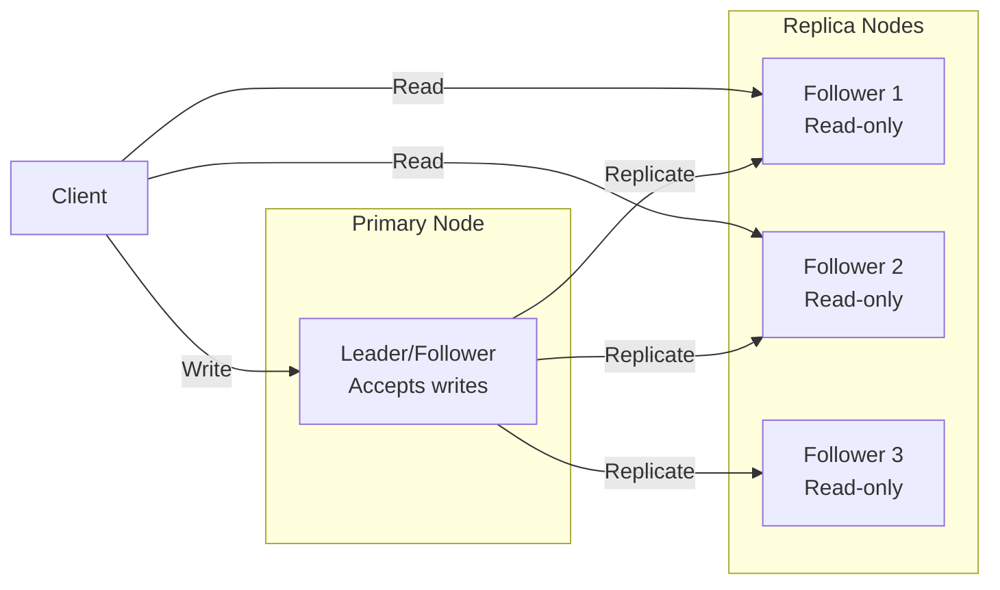

*Leader-based replication: a single primary node accepts all writes and replicates them to read-only followers. Clients can read from any replica for scaled read throughput, but all writes go through the leader.*

**Multi-leader (multi-master)**: Multiple nodes accept writes and exchange updates with each other. This enables low-latency writes in different regions but requires conflict resolution (last-write-wins, merge functions, or CRDTs).

**Leaderless (quorum-based)**: Any node can accept writes; a quorum of nodes must agree. Read and write quorums are configured so that at least one node overlaps between them (R + W > N). This maximizes availability and write scalability.

**Trade-offs for Simple Bug / Issue Tracker**:

| Strategy | Use Case | Pros | Cons |
|---|---|---|---|
| Leader-based | user PII, bug descriptions, private comments | Strong consistency, simple | Write bottleneck, leader failure risk |
| Multi-leader | public bug titles, status updates, anonymized metrics | Low-latency global writes | Conflict resolution, complex |
| Leaderless | Caching, counters | High availability, no bottleneck | Eventual consistency, read repair overhead |

**Real-world implementations**

- **Redis**: Leader-follower replication with asynchronous replication; Sentinel handles failover.
- **Apache Kafka**: Leader-based partition replication with ISR (in-sync replica) — writes go to the leader, followers replicate.
- **Cassandra**: Tunable consistency with leaderless quorum (R + W > N).
- **DynamoDB Global Tables**: Multi-master active-active across regions.

### Failure Detection and Membership

**What it means**

Failure Detection and Membership is the mechanism by which Simple Bug / Issue Tracker determines which nodes are alive and part of the cluster. Membership is the list of known nodes; failure detection is the process of updating that list when nodes fail or recover.

**Why it matters**

Simple Bug / Issue Tracker must route requests only to healthy nodes and trigger failover when a node goes down. False positives (healthy nodes marked as dead) cause unnecessary failovers and data loss. False negatives (dead nodes not detected) cause failed requests and degraded performance.

**How it works**

**Heartbeat-based detection**: Each node sends a heartbeat (ping) to a subset of peers at regular intervals. If a node misses N consecutive heartbeats, it is marked as suspect. The gossip protocol distributes membership information: each node exchanges its view of the cluster with a random peer, and the information propagates gossip-style.

```mermaid
sequenceDiagram
    participant A as Node A
    participant B as Node B
    participant C as Node C

    loop Every 1s
        A->>B: Heartbeat (ping)
        B-->>A: Heartbeat (ack)
    end
    B->>C: Gossip: A is alive
    C->>A: Gossip: B is alive
    Note over A,B,C: View converges in O(log N) rounds
```

*Gossip-based failure detection: each node periodically pings a random subset of peers and gossips its view of the cluster. The membership list converges in O(log N) rounds.*

**Phi Accrual Failure Detector**: Instead of a fixed timeout, the detector measures the time between consecutive heartbeats and computes a phi (φ) value — the probability that the node is dead given the observed heartbeat pattern. φ is compared against a threshold (typically 1–8); higher thresholds reduce false positives but increase detection latency.

**SWIM (Scalable Weakly-consistent Infection-style Process group Membership Protocol)**: Nodes ping a random subset of cluster members. If a ping fails, the node is marked "suspect" and the failure is "infected" (gossiped) to other nodes. This is O(log N) per failure detection cycle and scales to large clusters.

**Trade-offs**:

| Approach | Strengths | Weaknesses |
|---|---|---|
| Heartbeat (timeout-based) | Simple, deterministic | False positives under load |
| Phi Accrual | Adaptive threshold | Needs historical data |
| SWIM | Scales to 1000s of nodes | Eventual consistency |

**Real-world implementations**

- **AWS Route 53 Health Checks**: Uses TCP/HTTP health checks with configurable thresholds to remove unhealthy instances from DNS rotation.
- **Kubernetes**: Uses the kubelet heartbeat (every 10s) to determine node liveness; nodes missing 3 consecutive heartbeats are marked NotReady.
- **Consul**: Uses SWIM protocol for membership and failure detection; supports both LAN and WAN gossip.
- **Akka Cluster**: Uses Phi Accrual failure detector with configurable φ thresholds.

### High Availability and Scalability

**What it means**

High Availability and Scalability determines how Simple Bug / Issue Tracker continues operating when nodes or entire zones fail, and how capacity is added as demand grows. HA is about minimizing downtime; scalability is about maintaining performance as load increases.

**Why it matters**

Simple Bug / Issue Tracker must stay operational even when individual nodes, availability zones, or entire regions fail. At the same time, it must scale horizontally to handle traffic spikes without degrading latency. The two are intertwined: the replication strategy, failure detection, and load balancing all contribute to both HA and scalability.

**How it works**

**Availability zones (AZs)**: Nodes are distributed across multiple AZs within a region. Each AZ is an independent failure domain (power, networking, physical security). A load balancer distributes requests across AZs; if one AZ fails, traffic is routed to the remaining AZs with no data loss (assuming replication is in place).

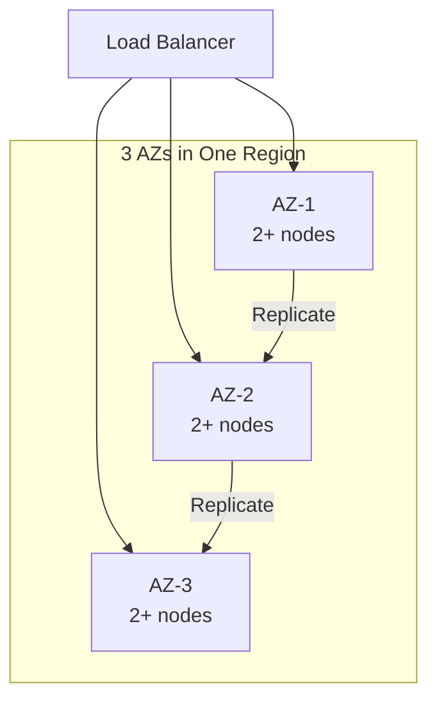

*Multi-AZ deployment: a load balancer distributes traffic across three availability zones. Each AZ has multiple nodes. Data is replicated across AZs so that losing one AZ does not cause data loss or service interruption.*

**Load balancing**: A load balancer distributes incoming requests across healthy nodes. Algorithms include round-robin, least connections, and weighted routing. Health checks ensure traffic only goes to healthy nodes. For Simple Bug / Issue Tracker, the load balancer also considers **API layer (REST service)**
  Purpose: exposes issue CRUD, comments, labels, fi when routing.

**Auto-scaling**: The system automatically adds or removes nodes based on metrics (CPU, memory, request rate). Scale-out policies add nodes when load exceeds a threshold; scale-in policies remove nodes during low load. For stateful services like Simple Bug / Issue Tracker, scale-out involves rebalancing partitions (moving data and connections to the new node).

**Failover and recovery**: When a node fails, the load balancer detects it (via health checks or failure detection) and stops sending traffic. A new node is provisioned (or a standby is promoted) and begins serving. For Simple Bug / Issue Tracker, failover must preserve user PII, bug descriptions, private comments data — this is achieved through replication with a quorum of healthy nodes.

**Scalability patterns**:

1. **Horizontal partitioning (sharding)**: Split data by a partition key (e.g., user_id, session_id) and distribute partitions across nodes. New nodes take ownership of additional partitions.

2. **Consistent hashing**: Minimize data movement on scale-out — only 1/N of the data moves to the new node. Nodes and partitions are placed on a ring; a request for key X is routed to the next node clockwise from hash(X).

3. **Connection draining**: When scaling in, existing connections are allowed to complete before the node is shut down. For Simple Bug / Issue Tracker, this means draining active 1. sessions gracefully.

**Real-world implementations**

- **Netflix OSS (Eureka + Zuul + Ribbon)**: Service discovery with Eureka, edge routing with Zuul, and client-side load balancing with Ribbon. Scales to thousands of instances.
- **Kubernetes HPA + VPA**: Horizontal Pod Autoscaler scales pods based on CPU/memory; Vertical Pod Autoscaler adjusts resource requests based on historical usage.
- **AWS ALB + Auto Scaling Groups**: Application Load Balancer with auto-scaling groups across AZs; health checks replace unhealthy instances automatically.

### Performance and Optimization

**What it means**

Performance and Optimization covers the techniques Simple Bug / Issue Tracker uses to achieve low latency, high throughput, and efficient resource usage. This section examines the key performance metrics, bottlenecks, and optimizations specific to the system.

**Why it matters**

Simple Bug / Issue Tracker faces competing pressures: users demand low latency, the system must handle high throughput, and infrastructure costs must be controlled. The optimizations applied at the data, compute, and network layers determine whether the system meets its SLA.

**How it works**

**Latency layers**: Latency in Simple Bug / Issue Tracker comes from three layers:
1. **Network**: Round-trip time from client to the nearest edge node / load balancer.
2. **Application**: Request processing time on the server (CPU, I/O, lock contention).
3. **Data**: Time to read/write from storage (cache hit vs. database query).

The 99th-percentile latency is the key metric for user-facing systems — it determines the worst-case experience.

**Caching strategies**: Simple Bug / Issue Tracker uses multiple cache layers:
- **Edge cache**: Static assets (images, CSS, JS) served from a CDN at the edge. For Simple Bug / Issue Tracker, this caches public bug titles, status updates, anonymized metrics that doesn't change frequently.
- **Application cache**: In-memory cache (e.g., Redis, Memcached) for frequently accessed data. Cache-aside pattern: application checks cache first, falls back to database on miss.
- **Local cache**: In-process cache (e.g., Caffeine, Guava) for data accessed within a single request. Avoids network round-trips.

**Batching and pipelining**: Simple Bug / Issue Tracker batches small operations (e.g., writes, log flushes) to amortize per-operation overhead. Pipelining allows multiple requests to be in flight simultaneously.

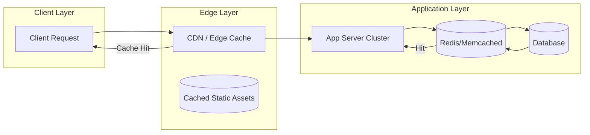

*Caching hierarchy: clients first hit the edge CDN/cache; if the response is cached, it is returned immediately. Otherwise, the request reaches the application, which checks its in-memory/application cache (e.g., Redis) before falling back to the database. This minimizes latency from each layer.*

**Connection pooling**: Simple Bug / Issue Tracker maintains a pool of database connections to avoid the TCP handshake overhead on every request. Pool size is tuned to match the database's capacity.

**Compression**: Responses are compressed (gzip, zstd) for clients that support it. At the network layer, gRPC uses HPACK header compression.

**Indexing**: Database tables are indexed on frequently queried fields. For Simple Bug / Issue Tracker, indexes cover **Issue store (relational database)**
  Purpose: durable source of truth for iss and **State machine module**
  Purpose: encodes legal status transitions and rejects for fast lookups.

**Asynchronous processing**: Non-critical background work (e.g., analytics, cleanup, notifications) is offloaded to message queues and processed asynchronously, keeping the request path fast.

**Resource isolation**: CPU and memory are allocated per service (containers with cgroup limits). This prevents a single misbehaving service from degrading the entire system.

**Metrics for Simple Bug / Issue Tracker**:

| Metric | Target | How to Measure |
|---|---|---|
| P99 latency | < 1s | Load test with realistic traffic |
| Throughput | 1K RPS | Request rate under peak load |
| Error rate | < 0.1% | 5xx / total requests |
| Cache hit ratio | > 90% | cache_hits / (cache_hits + misses) |
| Resource utilization | < 80% CPU, < 85% memory | Container metrics |

**Real-world implementations**

- **Google's HTTP Load Balancer**: Global load balancing with edge PoPs; routes users to the nearest healthy backend.
- **Cloudflare**: Edge cache with Argo Smart Routing that dynamically routes traffic to avoid congestion.
- **Redis**: Used as an application cache with configurable eviction policies (LRU, LFU, TTL).

### Encryption and Key Management

**What it means**

Encryption and Key Management in Simple Bug / Issue Tracker ensures that data is protected both at rest (stored on disk) and in transit (moving between services). Key management governs how encryption keys are generated, stored, rotated, and accessed — without proper key management, encryption provides a false sense of security.

**Why it matters**

Simple Bug / Issue Tracker handles user PII, bug descriptions, private comments that must be encrypted both at rest and in transit. Scaling Simple Bug / Issue Tracker to handle increasing load while maintaining data consistency, low latency, and fault tolerance requires careful key management: keys must be rotated regularly, scoped to prevent cross-contamination, and audited for compliance. A single key compromise could expose sensitive data.

**How it works**

**At-rest encryption**: Data stored in **API layer (REST service)**
  Purpose: exposes issue CRUD, comments, labels, fi, **Issue store (relational database)**
  Purpose: durable source of truth for iss and databases is encrypted using AES-256-GCM. The Data Encryption Key (DEK) is generated per data partition and encrypted with a Key Encryption Key (KEK) managed by a KMS (AWS KMS, GCP KMS, HashiCorp Vault). Keys are regionally scoped — only data belonging to a region can be decrypted by that region's KEK.

**In-transit encryption**: All inter-service communication uses TLS 1.3 or mTLS for service-to-service auth. Cross-region communication of public bug titles, status updates, anonymized metrics uses TLS + optional application-level encryption. user PII, bug descriptions, private comments is NEVER transmitted in plaintext or across region boundaries.

**Key hierarchy**:
```
Master Key (HSM-backed, KMS-managed)
  └─ KEK (per region, per service)
     └─ DEK (per data partition, rotated every 90 days)
        └─ Data (encrypted with DEK)
```

**Key rotation**: KEKs rotate annually (automatic via KMS); DEKs rotate per object or per 90 days. Applications handle key version headers transparently — a DEK version is stored alongside the encrypted data.

**Cross-region key sharing**: For non-restricted data (public bug titles, status updates, anonymized metrics), a shared key is imported into each region's KMS. Restricted data NEVER uses cross-region keys — each region's KMS holds only that region's keys.

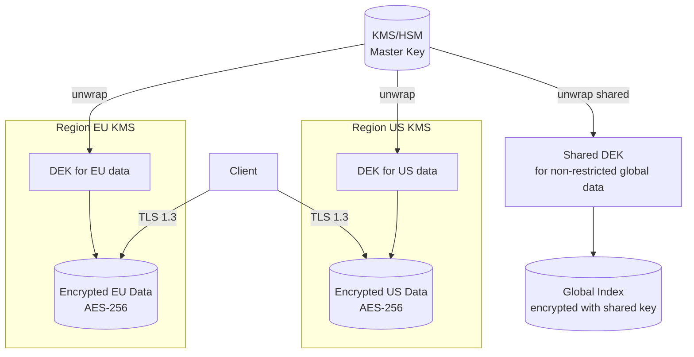

*Encryption key hierarchy: master keys are managed by an HSM-backed KMS and never leave the KMS. Each region has its own KEK. Data encryption keys (DEKs) are generated per partition and encrypted with the regional KEK. Only non-restricted global data uses a shared cross-region key. All client traffic uses TLS 1.3.*

**Java/Spring Boot Implementation**

```java
@Service
@RequiredArgsConstructor
public class DataEncryptionService {

    private final AWSKMS kms;
    @Value("${app.region}")
    private String region;
    @Value("${app.encryption.dek-ttl-minutes:1440}")
    private int dekTtlMinutes;

    private final Map<String, SecretKey> dekCache = new ConcurrentHashMap<>();

    public EncryptedData encrypt(String plaintext, String partitionId) {
        SecretKey dek = getOrCreateDek(partitionId);
        byte[] ciphertext = CryptoUtils.encrypt(plaintext.getBytes(StandardCharsets.UTF_8), dek);
        String dekCiphertext = kms.encrypt(EncryptRequest.builder()
            .keyId("arn:aws:kms:" + region + ":master-key")
            .plaintext(SdkBytes.fromByteArray(dek.getEncoded()))
            .build()).ciphertextBlob().asByteArray();
        return new EncryptedData(ciphertext, dekCiphertext, Instant.now());
    }

    private SecretKey getOrCreateDek(String partitionId) {
        return dekCache.computeIfAbsent(partitionId, id -> {
            try {
                return KeyGenerator.getInstance("AES").generateKey();
            } catch (NoSuchAlgorithmException e) {
                throw new IllegalStateException("Cannot generate DEK", e);
            }
        });
    }
}
```

*Spring Boot encryption service: DEKs are cached per-partition with TTL. Each DEK is encrypted via AWS KMS using a regional master key. The encrypted DEK (ciphertext) is stored alongside the data — only the KMS for that region can decrypt it.*

**Real-world implementations**

- **AWS KMS**: Managed HSM-backed key service; supports automatic key rotation and custom key stores.
- **HashiCorp Vault**: Open-source key management; supports transit encryption (encrypt/decrypt without storing keys).
- **Google Cloud KMS**: Hardware-backed key management with IAM-based access control.

### Authentication and Authorization

**What it means**

Authentication and Authorization (AuthN/AuthZ) in Simple Bug / Issue Tracker control who can access the system and what they can do. Authentication verifies identity; authorization determines permissions. In a distributed system like Simple Bug / Issue Tracker, auth must work across multiple nodes while respecting data boundaries — a user authenticated in one region should not have their session data or tokens replicated to regions where it is not permitted.

**Why it matters**

Simple Bug / Issue Tracker must verify identity at the edge and enforce authorization at every service boundary. user PII, bug descriptions, private comments must be protected — only users with appropriate roles should access it. At the same time, public bug titles, status updates, anonymized metrics data should be accessible to a wider audience with minimal friction.

**How it works**

**Authentication (who are you?)**:
- **JWT tokens**: Users authenticate through their home region's identity provider. The region returns a JWT (JSON Web Token) signed by a regional signing key. Tokens include claims like `iss` (issuer region), `sub` (subject/user ID), `home_region`, `roles`, and `exp` (expiry). Tokens are scoped per region — a token issued by region A cannot access restricted data in region B.
- **mTLS for service-to-service**: Internal services authenticate each other using mutual TLS certificates issued by a per-region Certificate Authority (CA). No shared secrets cross region boundaries.
- **Session management**: Sessions are stored regionally (Redis) and never replicated cross-region for restricted data. Session IDs are opaque UUIDs; the session store maps session ID → user context.

**Authorization (what can you do?)**:
- **RBAC (Role-Based Access Control)**: Users are assigned roles per region. Common roles: `region_admin` (full access to region data), `auditor` (read-only audit), `viewer` (read public data only). Roles are stored in the regional database and cached locally for sub-1ms lookups.
- **ABAC (Attribute-Based Access Control)**: Fine-grained permissions based on attributes (e.g., `home_region == request_region AND role == admin`). This allows expressing complex policies like "users can only access restricted data in their home region."
- **Resource-level authorization**: Each request is checked against an ACL (Access Control List) that specifies which roles can access which resources. For Simple Bug / Issue Tracker, restricted resources require the `admin` role + matching region.

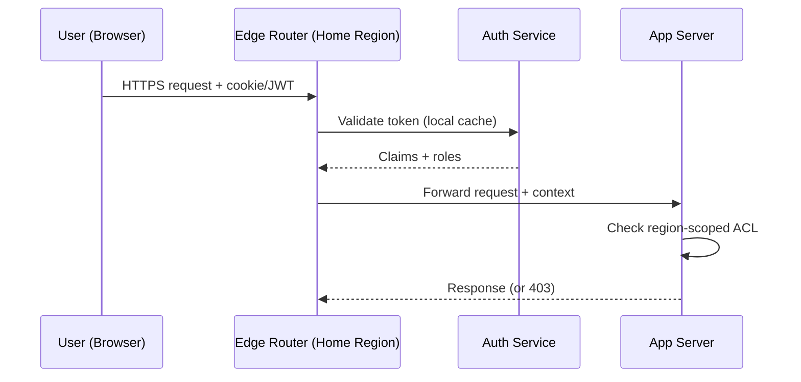

*Authentication flow: the user's token is validated by the regional auth service (claims cached locally). The edge router forwards the request with the security context. Each app server checks the region-scoped ACL before accessing restricted data.*

**Java/Spring Boot Implementation**

```java
@Service
@RequiredArgsConstructor
public class AuthorizationService {

    private final UserTokenRepository tokenRepository;
    @Value("${app.region}")
    private String currentRegion;

    public boolean canAccessResource(String userId, String resourceRegion,
                                     String action, JWTClaims claims) {
        String userHomeRegion = claims.getStringClaim("home_region");
        List<String> roles = claims.getStringListClaim("roles");

        if (!roles.contains(action)) {
            return false;
        }

        if (resourceRegion.equals(userHomeRegion)) {
            return true;
        }

        if (resourceRegion.equals("global")) {
            return roles.contains("global_reader");
        }

        return false;
    }
}

@RestController
@RequiredArgsConstructor
@RequestMapping("/api/v1")
public class RegionController {
    private final AuthorizationService authService;

    @GetMapping("/data/{region}/profile")
    public ResponseEntity<?> getProfile(
            @PathVariable String region,
            @RequestHeader("Authorization") String token) {
        JWTClaims claims = JwtUtils.parseAndValidate(token, currentRegion);

        if (!authService.canAccessResource(
                claims.getStringClaim("sub"), region, "read", claims)) {
            return ResponseEntity.status(HttpStatus.FORBIDDEN).build();
        }

        return ResponseEntity.ok(profileService.getByRegion(region));
    }
}
```

*Spring Boot authorization service: checks both the user's role and whether the requested resource violates region boundaries. The `canAccessResource` method returns false if a user from region EU tries to access restricted data in region US.*

**Real-world implementations**

- **Auth0**: JWT-based authentication with regional endpoints; supports custom rules for ABAC.
- **Okta**: Multi-region identity management with adaptive MFA and ThreatInsight for anomaly detection.
- **AWS Cognito**: Regional user pools with IAM integration; tokens are region-scoped by default.

### Security Threats and Mitigations

**What it means**

Security Threats and Mitigations catalog the attack surface of Simple Bug / Issue Tracker, the most likely threats, and the corresponding defenses. Every distributed system has unique threat vectors — Simple Bug / Issue Tracker is no exception.

**Why it matters**

Simple Bug / Issue Tracker handles user PII, bug descriptions, private comments that attackers might target. Scaling Simple Bug / Issue Tracker to handle increasing load while maintaining data consistency, low latency, and fault tolerance expands the attack surface: more nodes, more network paths, more failure modes. Without proper threat modeling, a single vulnerability could expose sensitive data across the entire system.

**Threat model**:

| Threat | Likelihood | Impact | Mitigation |
|---|---|---|---|
| Data exfiltration (cross-region) | High | Critical | Region-scoped keys, no cross-region replication of restricted data |
| Man-in-the-middle (inter-service) | Medium | High | mTLS between all services |
| Replay attacks | Medium | High | Token expiry + nonce |
| DDoS at the edge | High | High | Rate limiting + edge filtering (Cloudflare, AWS Shield) |
| PII leakage in logs | High | High | PII redaction + field-level access control |
| Session hijacking | Medium | Medium | Short-lived tokens + IP binding |
| Privilege escalation | Low | Critical | Least-privilege RBAC + audit logs |
| Cache poisoning | Low | Medium | Cache invalidation on write + signed cache keys |

**How it works**

**Data exfiltration prevention**: Simple Bug / Issue Tracker enforces data residency by design — user PII, bug descriptions, private comments is never replicated cross-region. The replication layer checks a data classification label before allowing cross-region copy. A database-level policy (e.g., PostgreSQL RLS) also blocks cross-region queries for restricted partitions.

**mTLS enforcement**: All service-to-service communication uses mutual TLS. Certificates are issued by a per-region CA and rotated every 30 days. Services must present a valid certificate to communicate — no plaintext connections are allowed.

**PII redaction**: Application logs are scanned for PII patterns (email, phone, credit card) using an automated redaction layer (e.g., AWS Macie, Google DLP). public bug titles, status updates, anonymized metrics is logged freely; restricted fields are masked or dropped before logging.

```mermaid
graph TD
    subgraph "Threat Surface"
        Client[Client]
        Edge[Edge Router / WAF]
        App[App Server]
        DB[(Database)]
        Cache[(Cache)]
        Logs[Log Store]
    end

    Client -->|HTTPS| Edge
    Edge -->|mTLS| App
    App -->|mTLS| DB
    App -->|Read| Cache
    App -->|Write| DB
    App -->|Log| Logs

    subgraph "Mitigations"
        WAF[AWS WAF /<br/>Cloudflare]
        DLP[PII Redaction<br/>(Macie/DLP)]
        FIM[File Integrity<br/>Monitoring]
    end

    Edge -.-> WAF
    Logs -.-> DLP
    DB -.-> FIM
```

*Threat mitigation diagram: the WAF at the edge blocks DDoS and injection attacks. mTLS protects all service-to-service communication. PII redaction scans logs before storage. File integrity monitoring alerts on database tampering.*

**Audit trail**: All security-relevant events (auth, data access, config changes) are written to an append-only audit log with cryptographic integrity (HMAC per entry). The log covers user PII, bug descriptions, private comments access — who accessed what, when, and from where.

**Real-world implementations**

- **Cloudflare**: Zero-trust model (All Connections to All Networks) with mTLS everywhere; uses GeoIP blocking and rate limiting for DDoS mitigation.
- **Google BeyondCorp**: Zero-trust network security model; all access is authenticated and authorized at the request level.

### Observability and Logging

**What it means**

Observability and Logging in Simple Bug / Issue Tracker provide visibility into system behavior through three pillars: **metrics** (aggregates and counters), **logs** (structured event records), and **traces** (distributed request timelines). Together, these signals allow operators to debug issues, detect anomalies, and verify SLA compliance.

**Why it matters**

Distributed systems like Simple Bug / Issue Tracker are inherently opaque — failures can cascade across services in unexpected ways. Without good observability, a single slow dependency can cause widespread timeouts that are nearly impossible to diagnose. Scaling Simple Bug / Issue Tracker to handle increasing load while maintaining data consistency, low latency, and fault tolerance makes observability even more critical: operators need to see cross-region latency, regional failures, and data-residency violations.

**How it works**

**Metrics**: Simple Bug / Issue Tracker instruments every service with Prometheus-style metrics:
- **Request rate, error rate, duration (the "RED" metrics)**: Tracks per-endpoint HTTP latency and error counts.
- **System metrics**: CPU, memory, disk I/O, network throughput per node.
- **Business metrics**: For Simple Bug / Issue Tracker, this includes metrics like "**Issue store (relational database)**
  Purpose: durable source of truth for iss fill rate" and "reservation conflict rate".

Metrics are aggregated in a time-series database (Prometheus, VictoriaMetrics) and visualized in Grafana dashboards with alerts via PagerDuty.

**Logs**: Simple Bug / Issue Tracker uses structured logging (JSON format) with standardized fields:
- `timestamp`: ISO 8601 UTC
- `level`: DEBUG, INFO, WARN, ERROR
- `service`: originating service name
- `trace_id`: distributed trace identifier (for correlation)
- `span_id`: current operation span
- `region`: the region that processed the request
- `data_class`: RESTRICTED or NON_RESTRICTED

user PII, bug descriptions, private comments access is logged with full context (user, action, resource). public bug titles, status updates, anonymized metrics logs are aggregated and may have reduced retention.

**Distributed tracing**: Every request is assigned a trace ID at the edge. The trace propagates through all downstream services via HTTP headers. A tracing backend (Jaeger, Tempo, Zipkin) reconstructs the full request timeline, showing latency at each hop. For Simple Bug / Issue Tracker, traces include region boundaries — a cross-region call is annotated as such.

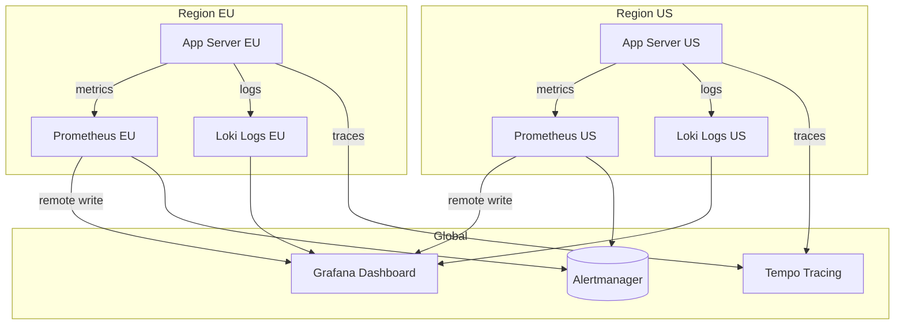

*Observability architecture: each region runs its own Prometheus (metrics) and Loki (logs) instances. A global Grafana instance queries all regional backends. Traces are collected centrally in Tempo. Alerts fire from each region's Prometheus to Alertmanager.*

**Alerting**: Simple Bug / Issue Tracker defines SLO-based alerts:
- **Latency**: P99 > 1s for 5 minutes → page.
- **Error rate**: > 1% for 10 minutes → page.
- **Availability**: < 99.5% for 15 minutes → page.
- **Data residency violation**: any restricted data detected outside its region → critical page.

**Java/Spring Boot Implementation**

```java
@Component
@RequiredArgsConstructor
@Slf4j
public class ObservabilityContext {

    @Value("${app.region}")
    private String region;

    public void logAccess(String userId, String resource, String action,
                          boolean restricted) {
        log.info("access_event userId={} resource={} action={} region={} data_class={}",
            userId, resource, action, region, restricted ? "RESTRICTED" : "NON_RESTRICTED");
    }
}

@RestController
@RequiredArgsConstructor
@Slf4j
public class ApiController {
    private final ObservabilityContext obs;
    private final UserService userService;

    @GetMapping("/api/v1/profile")
    public ResponseEntity<ProfileResponse> getProfile(
            @AuthenticationPrincipal UserDetails user) {
        String traceId = MDC.get("traceId");
        long start = System.nanoTime();

        try {
            ProfileResponse response = userService.getProfile(user.getId());
            obs.logAccess(user.getId(), "profile", "read", true);

            return ResponseEntity.ok(response);
        } finally {
            long durationMs = (System.nanoTime() - start) / 1_000_000;
            log.info("profile_read traceId={} latencyMs={} region={}",
                traceId, durationMs, obs.region);
        }
    }
}
```

*Spring Boot observability: the `ObservabilityContext` logs structured access events with data classification. The controller records latency and trace ID for every request, enabling SLO-based alerting.*

**Real-world implementations**

- **Netflix OSS (Atlas + Zipkin + Servo)**: Metrics via Atlas, traces via Zipkin, instrumented via Servo. Scales to over 700 billion requests/day.
- **Google SRE Workbook**: Comprehensive observability with SLI/SLO/SLI definition; uses Borgmon for metrics and Dapper for tracing.
- **AWS Observability**: CloudWatch for metrics, X-Ray for tracing, CloudWatch Logs for structured logs.

### Real-World Implementations

**Simple Bug / Issue Tracker in production**

- **Simple Bug / Issue Tracker platforms**: widely used simple bug / issue tracker platform

**Key takeaways**

- Scalability patterns proven in production at scale
- Common pitfalls and how to avoid them
- Integration with existing infrastructure and monitoring

### Java and Spring Boot Implementation Guide

Production-oriented skeleton: Spring Boot 3.x, Java 17+, Spring Data JPA, Bean Validation. Beans use constructor injection; tunables are externalized via `@Value`; DTOs are records; the schema is owned by Flyway migrations (`ddl-auto: validate`).

#### 1. JPA entities

```java
import jakarta.persistence.*;
import java.time.Instant;
import java.util.UUID;

@Entity
@Table(name = "issues", indexes = {
    @Index(name = "idx_issues_project_status", columnList = "project_id, status, created_at"),
    @Index(name = "idx_issues_assignee_open", columnList = "assignee_id, status")
})
public class IssueEntity {

    @Id
    private UUID id;

    @Column(name = "project_id", nullable = false)
    private UUID projectId;

    @Column(name = "issue_key", nullable = false, length = 30)
    private String issueKey;

    @Column(nullable = false, length = 200)
    private String title;

    @Column(columnDefinition = "text")
    private String description;

    @Enumerated(EnumType.STRING)
    @Column(nullable = false, length = 20)
    private IssueStatus status = IssueStatus.OPEN;

    @Enumerated(EnumType.STRING)
    @Column(nullable = false, length = 20)
    private IssuePriority priority = IssuePriority.MEDIUM;

    @Enumerated(EnumType.STRING)
    @Column(nullable = false, length = 20)
    private IssueType type;

    @Column(name = "reporter_id", nullable = false)
    private UUID reporterId;

    @Column(name = "assignee_id")
    private UUID assigneeId;

    @Column(name = "response_due_at")
    private Instant responseDueAt;

    @Column(name = "resolution_due_at")
    private Instant resolutionDueAt;

    @Column(name = "sla_breached", nullable = false)
    private boolean slaBreached = false;

    @Version
    private int version;

    @Column(name = "created_at", nullable = false)
    private Instant createdAt = Instant.now();

    @Column(name = "updated_at", nullable = false)
    private Instant updatedAt = Instant.now();

    protected IssueEntity() {
        // for JPA
    }

    public IssueEntity(UUID projectId, String issueKey, String title, String description,
                       IssuePriority priority, IssueType type, UUID reporterId) {
        this.id = UUID.randomUUID();
        this.projectId = projectId;
        this.issueKey = issueKey;
        this.title = title;
        this.description = description;
        this.priority = priority;
        this.type = type;
        this.reporterId = reporterId;
    }

    public void applySlaDeadlines(Instant responseDueAt, Instant resolutionDueAt) {
        this.responseDueAt = responseDueAt;
        this.resolutionDueAt = resolutionDueAt;
    }

    public void touch() {
        this.updatedAt = Instant.now();
    }

    public void markSlaBreached() {
        this.slaBreached = true;
    }

    // getters and setters for mutable fields omitted for brevity
}

enum IssueStatus { OPEN, IN_PROGRESS, RESOLVED, CLOSED }
enum IssuePriority { LOW, MEDIUM, HIGH, CRITICAL }
enum IssueType { BUG, TASK, STORY, INCIDENT }
```

The partial SLA scan index is created by a Flyway migration, because Hibernate cannot express partial indexes:

```sql
CREATE INDEX idx_issues_sla_scan
    ON issues (resolution_due_at)
    WHERE status IN ('OPEN', 'IN_PROGRESS') AND sla_breached = false;
```

#### 2. State machine

```java
import org.springframework.stereotype.Component;
import java.util.EnumSet;
import java.util.Map;
import java.util.Set;

@Component
public class IssueStateMachine {

    private static final Map<IssueStatus, Set<IssueStatus>> ALLOWED = Map.of(
        IssueStatus.OPEN,        EnumSet.of(IssueStatus.IN_PROGRESS, IssueStatus.CLOSED),
        IssueStatus.IN_PROGRESS, EnumSet.of(IssueStatus.OPEN, IssueStatus.RESOLVED),
        IssueStatus.RESOLVED,    EnumSet.of(IssueStatus.IN_PROGRESS, IssueStatus.CLOSED),
        IssueStatus.CLOSED,      EnumSet.of(IssueStatus.OPEN)
    );

    public void validateTransition(IssueStatus from, IssueStatus to) {
        if (from == to) {
            return; // idempotent retry of the same transition
        }
        if (!ALLOWED.getOrDefault(from, Set.of()).contains(to)) {
            throw new InvalidTransitionException(from, to, ALLOWED.getOrDefault(from, Set.of()));
        }
    }
}
```

Treating a no-op transition (`OPEN → OPEN`) as success makes retried `PATCH` requests safe without special-casing the client; only genuinely illegal moves raise `InvalidTransitionException`, which maps to `422` with the allowed targets.

#### 3. DTOs and validation

```java
import jakarta.validation.constraints.NotBlank;
import jakarta.validation.constraints.NotNull;
import jakarta.validation.constraints.Size;
import java.util.List;

public record CreateIssueRequest(
    @NotBlank @Size(max = 200) String title,
    @Size(max = 32_000) String description,
    @NotNull IssuePriority priority,
    @NotNull IssueType type,
    List<@Size(max = 50) String> labels
) {}

public record UpdateIssueRequest(
    @Size(max = 200) String title,
    @Size(max = 32_000) String description,
    IssueStatus status,
    IssuePriority priority,
    java.util.UUID assigneeId
) {}

public record CreateCommentRequest(@NotBlank @Size(max = 10_000) String text) {}

public record IssueResponse(
    String id,
    String key,
    String status,
    String priority,
    String type,
    String reporterId,
    String assigneeId,
    boolean slaBreached,
    int version,
    java.time.Instant createdAt
) {}
```

Records give immutability and compact JSON mapping; Bean Validation annotations are triggered by `@Valid` in the controller.

#### 4. Controller

```java
import jakarta.validation.Valid;
import org.springframework.http.HttpStatus;
import org.springframework.http.ResponseEntity;
import org.springframework.web.bind.annotation.*;
import java.util.UUID;

@RestController
@RequestMapping("/api/v1")
public class IssueController {

    private final IssueService issueService;

    public IssueController(IssueService issueService) {
        this.issueService = issueService;
    }

    @PostMapping("/projects/{projectId}/issues")
    public ResponseEntity<IssueResponse> create(
            @PathVariable UUID projectId,
            @Valid @RequestBody CreateIssueRequest request,
            @RequestHeader("X-User-Id") UUID userId,
            @RequestHeader(value = "Idempotency-Key", required = false) String idempotencyKey) {
        var created = issueService.createIssue(userId, projectId, request, idempotencyKey);
        return ResponseEntity.status(HttpStatus.CREATED).body(created);
    }

    @PatchMapping("/issues/{issueId}")
    public IssueResponse update(
            @PathVariable UUID issueId,
            @Valid @RequestBody UpdateIssueRequest request,
            @RequestHeader("X-User-Id") UUID userId,
            @RequestHeader(value = "If-Match", required = false) Integer ifMatch) {
        return issueService.updateIssue(userId, issueId, request, ifMatch);
    }

    @PostMapping("/issues/{issueId}/comments")
    public ResponseEntity<CommentResponse> comment(
            @PathVariable UUID issueId,
            @Valid @RequestBody CreateCommentRequest request,
            @RequestHeader("X-User-Id") UUID userId) {
        var created = issueService.addComment(userId, issueId, request);
        return ResponseEntity.status(HttpStatus.CREATED).body(created);
    }

    @GetMapping("/projects/{projectId}/issues")
    public PagedIssues list(
            @PathVariable UUID projectId,
            @RequestParam(required = false) IssueStatus status,
            @RequestParam(required = false) UUID assignee,
            @RequestParam(required = false) String label,
            @RequestParam(required = false) String cursor,
            @RequestParam(defaultValue = "50") int limit,
            @RequestHeader("X-User-Id") UUID userId) {
        return issueService.listIssues(userId, projectId, status, assignee, label, cursor, limit);
    }
}
```

In production an authentication filter validates the JWT and populates `X-User-Id`; controllers never trust client-supplied identity.

#### 5. Service layer

```java
import org.springframework.beans.factory.annotation.Value;
import org.springframework.stereotype.Service;
import org.springframework.transaction.annotation.Transactional;
import java.time.Duration;
import java.time.Instant;
import java.util.Map;
import java.util.UUID;

@Service
public class IssueService {

    private static final Map<IssuePriority, Duration> RESOLUTION_SLA = Map.of(
        IssuePriority.CRITICAL, Duration.ofHours(8),
        IssuePriority.HIGH,     Duration.ofHours(24),
        IssuePriority.MEDIUM,   Duration.ofDays(5),
        IssuePriority.LOW,      Duration.ofDays(14)
    );

    private final IssueRepository issueRepository;
    private final ProjectRepository projectRepository;
    private final AuditLogRepository auditLogRepository;
    private final OutboxRepository outboxRepository;
    private final IssueStateMachine stateMachine;
    private final Duration responseSlaDefault;

    public IssueService(
            IssueRepository issueRepository,
            ProjectRepository projectRepository,
            AuditLogRepository auditLogRepository,
            OutboxRepository outboxRepository,
            IssueStateMachine stateMachine,
            @Value("${app.sla.default-response-hours:24}") int defaultResponseHours) {
        this.issueRepository = issueRepository;
        this.projectRepository = projectRepository;
        this.auditLogRepository = auditLogRepository;
        this.outboxRepository = outboxRepository;
        this.stateMachine = stateMachine;
        this.responseSlaDefault = Duration.ofHours(defaultResponseHours);
    }

    @Transactional
    public IssueResponse createIssue(UUID userId, UUID projectId, CreateIssueRequest request, String idempotencyKey) {
        var project = projectRepository.findByIdForUpdate(projectId)
            .orElseThrow(() -> new ResourceNotFoundException("project", projectId));

        // atomic key allocation inside the transaction
        int next = project.nextIssueNumber();
        String key = project.getKey() + "-" + next;

        var issue = new IssueEntity(projectId, key, request.title(), request.description(),
            request.priority(), request.type(), userId);
        var now = Instant.now();
        issue.applySlaDeadlines(now.plus(responseSlaDefault),
            now.plus(RESOLUTION_SLA.get(request.priority())));
        issueRepository.save(issue);

        auditLogRepository.save(AuditLogEntity.fieldChange(issue.getId(), "status", null, "OPEN", userId));
        outboxRepository.save(OutboxEvent.issueCreated(issue.getId(), issue.getVersion(), userId));
        return IssueResponse.from(issue);
    }

    @Transactional
    public IssueResponse updateIssue(UUID userId, UUID issueId, UpdateIssueRequest request, Integer ifMatch) {
        var issue = issueRepository.findByIdAndProjectMember(issueId, userId)
            .orElseThrow(() -> new ResourceNotFoundException("issue", issueId));

        if (ifMatch != null && ifMatch != issue.getVersion()) {
            throw new VersionConflictException(issueId, ifMatch, issue.getVersion());
        }

        if (request.status() != null && request.status() != issue.getStatus()) {
            stateMachine.validateTransition(issue.getStatus(), request.status());
            auditLogRepository.save(AuditLogEntity.fieldChange(issueId, "status",
                issue.getStatus().name(), request.status().name(), userId));
            issue.setStatus(request.status());
        }
        if (request.assigneeId() != null && !request.assigneeId().equals(issue.getAssigneeId())) {
            auditLogRepository.save(AuditLogEntity.fieldChange(issueId, "assignee",
                String.valueOf(issue.getAssigneeId()), String.valueOf(request.assigneeId()), userId));
            issue.setAssigneeId(request.assigneeId());
        }
        if (request.priority() != null && request.priority() != issue.getPriority()) {
            auditLogRepository.save(AuditLogEntity.fieldChange(issueId, "priority",
                issue.getPriority().name(), request.priority().name(), userId));
            issue.setPriority(request.priority());
            var now = Instant.now();
            issue.applySlaDeadlines(issue.getResponseDueAt(),
                now.plus(RESOLUTION_SLA.get(request.priority()))); // re-derive on priority change
        }

        issue.touch();
        outboxRepository.save(OutboxEvent.issueUpdated(issueId, issue.getVersion(), userId));
        return IssueResponse.from(issueRepository.save(issue));
    }
}
```

Key points to explain in an interview:

- **One transaction, four writes**: issue mutation, audit rows, outbox event, and (on create) the key counter commit or roll back together — there is no execution path where the status changed but the audit or the event was lost.
- **`@Version` + `If-Match`**: JPA optimistic locking increments `version` on every update; two concurrent editors produce one winner and one `OptimisticLockException`/`409`, protecting the two-tab race without long-lived locks.
- **SLA re-derivation on priority change** keeps the materialized deadlines honest; the change itself is audited like any other field.
- **The SLA matrix lives in configuration** in a real deployment (`@ConfigurationProperties` map per priority), so support can tune targets without a deploy.

#### 6. Notification worker with idempotent delivery

```java
import org.springframework.dao.DataIntegrityViolationException;
import org.springframework.stereotype.Service;
import org.springframework.transaction.annotation.Transactional;
import java.time.Instant;

@Service
public class IssueNotificationService {

    private final WatcherRepository watcherRepository;
    private final DeliveryRepository deliveryRepository;
    private final NotificationGateway notificationGateway;

    public IssueNotificationService(WatcherRepository watcherRepository,
                                    DeliveryRepository deliveryRepository,
                                    NotificationGateway notificationGateway) {
        this.watcherRepository = watcherRepository;
        this.deliveryRepository = deliveryRepository;
        this.notificationGateway = notificationGateway;
    }

    @Transactional
    public void fanOut(IssueUpdatedEvent event) {
        // watchers union assignee/reporter, minus the actor, filtered by preferences
        var recipients = watcherRepository.findNotifiableUsers(event.issueId(), event.actorId());

        for (var recipient : recipients) {
            var delivery = new DeliveryEntity(event.eventId(), event.issueId(), recipient, Instant.now());
            try {
                deliveryRepository.saveAndFlush(delivery); // unique(event_id, recipient_id) is the backstop
            } catch (DataIntegrityViolationException duplicate) {
                continue; // redelivery after a crash: this recipient already got it
            }
            notificationGateway.notifyIssueUpdated(recipient, event);
            delivery.markSent(Instant.now());
        }
    }
}
```

Saving the delivery row *before* the provider call flips the residual window: a crash after insert but before send means one recipient is skipped on redelivery — prefer this (miss is visible and manually re-drivable from the deliveries table) or send-then-insert (risk: one duplicate). The important interview point is naming the window and choosing deliberately, not pretending it is zero.

#### 7. SLA breach scheduler

```java
import org.springframework.beans.factory.annotation.Value;
import org.springframework.scheduling.annotation.Scheduled;
import org.springframework.stereotype.Component;
import org.springframework.transaction.annotation.Transactional;
import java.time.Instant;

@Component
public class SlaBreachScheduler {

    private final IssueRepository issueRepository;
    private final AuditLogRepository auditLogRepository;
    private final OutboxRepository outboxRepository;
    private final int batchSize;

    public SlaBreachScheduler(IssueRepository issueRepository,
                              AuditLogRepository auditLogRepository,
                              OutboxRepository outboxRepository,
                              @Value("${app.sla.batch-size:500}") int batchSize) {
        this.issueRepository = issueRepository;
        this.auditLogRepository = auditLogRepository;
        this.outboxRepository = outboxRepository;
        this.batchSize = batchSize;
    }

    @Scheduled(fixedDelayString = "${app.sla.poll-interval-ms:60000}")
    @Transactional
    public void flagBreachedIssues() {
        var breaching = issueRepository.claimBreachingIssues(Instant.now(), batchSize);
        for (var issue : breaching) {
            issue.markSlaBreached();
            auditLogRepository.save(AuditLogEntity.systemChange(issue.getId(), "sla_breached", "false", "true"));
            outboxRepository.save(OutboxEvent.slaBreached(issue.getId(), issue.getVersion()));
        }
        // commit releases the SKIP LOCKED row locks
    }
}
```

Repository claiming query (native, because JPA cannot express `SKIP LOCKED`):

```java
@Query(value = """
    SELECT * FROM issues
    WHERE status IN ('OPEN', 'IN_PROGRESS')
      AND sla_breached = false
      AND resolution_due_at <= :now
    ORDER BY resolution_due_at
    LIMIT :limit
    FOR UPDATE SKIP LOCKED
    """, nativeQuery = true)
List<IssueEntity> claimBreachingIssues(@Param("now") Instant now, @Param("limit") int limit);
```

Multiple scheduler replicas share work via `SKIP LOCKED`; the predicate is time-based, so a scheduler that slept through downtime catches up on its next run with no state to repair.

#### 8. Global exception handling

```java
import org.springframework.http.HttpStatus;
import org.springframework.http.ProblemDetail;
import org.springframework.web.bind.MethodArgumentNotValidException;
import org.springframework.web.bind.annotation.ControllerAdvice;
import org.springframework.web.bind.annotation.ExceptionHandler;

@ControllerAdvice
public class GlobalExceptionHandler {

    @ExceptionHandler(ResourceNotFoundException.class)
    public ProblemDetail notFound(ResourceNotFoundException ex) {
        var problem = ProblemDetail.forStatusAndDetail(HttpStatus.NOT_FOUND, ex.getMessage());
        problem.setTitle("Resource not found");
        return problem;
    }

    @ExceptionHandler(InvalidTransitionException.class)
    public ProblemDetail invalidTransition(InvalidTransitionException ex) {
        var problem = ProblemDetail.forStatusAndDetail(HttpStatus.UNPROCESSABLE_ENTITY, ex.getMessage());
        problem.setTitle("Invalid status transition");
        problem.setProperty("allowedTransitions", ex.getAllowedTargets());
        return problem;
    }

    @ExceptionHandler(VersionConflictException.class)
    public ProblemDetail conflict(VersionConflictException ex) {
        var problem = ProblemDetail.forStatusAndDetail(HttpStatus.CONFLICT, ex.getMessage());
        problem.setTitle("Concurrent modification");
        return problem;
    }

    @ExceptionHandler(MethodArgumentNotValidException.class)
    public ProblemDetail validation(MethodArgumentNotValidException ex) {
        var problem = ProblemDetail.forStatusAndDetail(HttpStatus.BAD_REQUEST, "Request validation failed");
        problem.setTitle("Validation failed");
        problem.setProperty("errors", ex.getBindingResult().getFieldErrors().stream()
            .map(e -> e.getField() + ": " + e.getDefaultMessage())
            .toList());
        return problem;
    }
}
```

Spring 6's `ProblemDetail` implements RFC 7807, matching the error contract in the API Design section — including the `allowedTransitions` hint on `422`, which lets clients render "move to In Progress first" without hardcoding the workflow.

#### 9. Configuration

```yaml
app:
  sla:
    default-response-hours: 24
    poll-interval-ms: 60000
    batch-size: 500
  notifications:
    digest-window-minutes: 10
spring:
  datasource:
    url: jdbc:postgresql://db:5432/tracker
  jpa:
    hibernate:
      ddl-auto: validate   # schema owned by Flyway migrations
```

`ddl-auto: validate` is deliberate: partial indexes, check constraints, and monthly partitions are migration artifacts, not things Hibernate can or should generate.

---

### Interview Questions and Answers

**Beginner**

- **Q: How would you model an issue tracker?**
  **A:** Core entities are projects, issues, comments, and an append-only audit log; issues reference a reporter and at most one assignee. Labels and watchers are join tables. Every issue carries `status`, `priority`, `type`, a human-readable key, SLA deadline columns, and an optimistic-locking `version`. The audit log stores one row per changed field with actor and timestamp, written in the same transaction as the change.
  *Follow-up: why an audit log table instead of application logs?* Because it is transactional with the mutation, queryable per issue (powering the activity feed), and durable enough for compliance — application logs are none of those.

- **Q: Which database would you choose and why?**
  **A:** PostgreSQL. The domain is relational (projects → issues → comments), the killer feature is transactional consistency across issue + audit + outbox, and the scale (hundreds of QPS) is well within one primary. NoSQL would make the four-write atomicity two or three non-atomic calls.
  *Common mistake:* choosing a document store "because issues look like documents" and then discovering that audit atomicity and filtered multi-field queries are now application problems.

- **Q: How do you prevent invalid status changes like OPEN → RESOLVED?**
  **A:** A state machine in the service layer maps each status to its legal targets; every status write validates against it and returns `422` with the allowed transitions on violation. The check lives server-side so REST clients, bulk importers, and bots cannot bypass it.

- **Q: How are notifications sent without slowing down writes?**
  **A:** The write commits an outbox event in the same transaction; a relay publishes it to a queue; workers resolve watchers, dedupe by a `(event_id, recipient_id)` constraint, and call providers. The write path never touches an email provider.

**Intermediate**

- **Q: Two users edit the same issue simultaneously. What happens?**
  **A:** The entity has a `@Version` column; the first `UPDATE` commits and bumps the version, the second fails with an optimistic-lock exception mapped to `409`. Clients send `If-Match` with the version they read, so a stale editor is told to re-fetch and merge rather than silently clobbering.
  *Common mistake:* reaching for pessimistic locks (`SELECT FOR UPDATE` held across user think-time) — that serializes humans and invites lock-wait timeouts; optimistic locking matches the actual contention rate.

- **Q: How do you implement search over titles, descriptions, and comments?**
  **A:** Tier the answer. Start with a PostgreSQL `tsvector` column (title weighted A, description B) with a GIN index, combined with project/status filters. Move to OpenSearch when ranking needs tuning or index size pressures the primary; feed it via the event topic with `issue_id` as the document ID and `version` to drop out-of-order upserts. Enforce project membership before querying the index so authorization cannot leak through search hits.
  *Expected discussion:* eventual consistency — a just-created issue may miss search for seconds; mitigate with direct lookup by key and a UI hint.

- **Q: How does the SLA breach detection work?**
  **A:** Deadlines are materialized at write time from a priority matrix, so breach detection is a partial-index scan: `WHERE resolution_due_at <= now() AND status IN ('OPEN','IN_PROGRESS') AND NOT sla_breached`. A `@Scheduled` poller claims rows in batches with `FOR UPDATE SKIP LOCKED`, marks the breach, writes an audit row, and emits an escalation event. Time-based predicates make reruns idempotent.
  *Follow-up: business hours?* Compute deadlines against a per-project calendar at write time; the scan is unchanged because deadlines remain concrete instants.

- **Q: How do you keep the audit log from becoming the bottleneck?**
  **A:** It grows ~6× faster than the issues table, so treat it as time-series: monthly range partitions, hot retention of 13 months, detach-and-archive older partitions to object storage. Writes are append-only inserts (no updates, no hot pages), which is the cheapest possible write pattern; the per-issue activity feed reads one partition via the `(issue_id, changed_at)` index.

- **Q: Assignment strategies — what are the options?**
  **A:** Manual triage (baseline), round-robin via a per-project counter updated in the create transaction, load-based (fewest open issues, with an advisory lock if the pick race matters), and label-driven routing (label → default owner — 80% of skills-based routing for 5% of the complexity). Auto-assignment should propose and humans confirm; misrouted auto-assignment hides issues from the right team.

**Advanced**

- **Q: A celebrity incident issue has 2,000 watchers and a comment storm. What breaks?**
  **A:** Two things: every comment serializes on one issue row (acceptable — row updates are cheap) but the *notification fan-out* becomes 2,000 deliveries per comment, spiking queue depth. Mitigations: per-event recipient batching with digest collapsing for high-frequency issues, a cap on instant channels with digest fallback, and sharding notification workers by queue partition so one hot issue does not starve others. The deliveries table makes the backlog measurable.
  *Trade-off:* digests trade immediacy for sanity; assignment and mention events should bypass digests even on hot issues.

- **Q: How do you guarantee the search index stays correct over years of edge cases?**
  **A:** Assume it will not, and design for rebuild: PostgreSQL is the source of truth, the index is a derived read model, and a backfill job can reindex any project range on demand. Live correctness comes from per-issue event ordering (topic partitioned by `issue_id`) plus version-guarded upserts. A periodic reconciler compares counts and `max(updated_at)` per project between the stores and reindexes drift.
  *Common mistake:* treating the search cluster as a second source of truth — then every inconsistency is permanent and unreconcilable.

- **Q: Design bulk import of 50,000 historical issues from a legacy tool.**
  **A:** A dedicated import path, not the interactive API: batch inserts with `COPY` or multi-row inserts, keys allocated from a reserved counter range per project (never colliding with live keys), audit rows written with the original timestamps and an `import` actor, outbox events suppressed during load and search/backfill run afterward. Idempotency via an `(import_batch_id, external_id)` unique constraint so a retried batch resumes instead of duplicating.
  *Expected discussion:* why not the public API — rate limits, notification storms (50k events × watchers), and SLA deadlines that would instantly "breach" on import; the import sets deadlines from original dates or marks legacy issues exempt.

**Senior / system design**

- **Q: Walk through every failure mode between "user clicks Reassign" and "assignee gets an email".**
  **A:** API crash mid-write → whole transaction rolls back, no partial state. Commit succeeds, relay down → outbox rows accumulate, backfill on recovery. Broker loss → outbox is the durable log. Worker crash after insert-before-send → redelivery skips via the unique constraint (one missed email, visible in deliveries, manually re-drivable); crash after send-before-insert → one duplicate (the chosen residual window). Provider 5xx → backoff with jitter, then DLQ, then re-drive. Provider 4xx (bad address) → deactivate that channel for the user. Each mode names its mechanism, and the deliveries table makes every mode observable.

- **Q: When would you replace the fixed state machine with a configurable workflow engine?**
  **A:** When two or more projects need different lifecycles and product accepts the complexity budget: transitions become rows (`workflow_transitions(project_id, from, to, guard, side_effects)`), validation reads the map from the database with a cache, and the audit log must also record which workflow version governed each change. The trigger to name is a paying team's hard requirement; the cost to name is that every consumer of status data (metrics, SLAs, search filters) must handle per-project semantics — that is why Jira-class flexibility is a product, not a feature.

- **Q: How does multi-tenancy isolation work, and what would you do at 100× tenants?**
  **A:** Every row carries `project_id` (projects carry `org_id`); authorization is project membership checked at the repository layer; search is project-scoped by contract. At 100×: shard PostgreSQL by `project_id` hash (every hot query is project-scoped, so cross-shard queries are analytics-only and hit a warehouse), route OpenSearch by `project_id`, and add noisy-neighbor controls (per-org rate limits, per-org queue partitions). Tenant data isolation failures are the existential risk — the answer should name a defense-in-depth layer like row-level security policies as a backstop to application checks.

- **Q: What would you deliberately not build, and why?**
  **A:** (1) Not a configurable workflow engine — fixed four-state flow covers the target users; configurability is a product-scale commitment. (2) Not real-time collaborative editing of descriptions — OT/CRDT complexity for a field edited a few times per issue; optimistic locking with `409` merge prompts suffices. (3) Not cross-organization sharing — it reopens the authorization model end-to-end. (4) Not an in-house notification provider — SES/Slack/FCM exist. Senior answers are defined by disciplined scope cuts with stated triggers for revisiting them.

- **Q: The product asks for "time in each status" analytics per issue, per week, per team. Where does that come from?**
  **A:** It is derivable from the audit log: status-change rows form intervals; `changed_at` deltas between consecutive transitions give per-state durations. Computing it on read is fine per issue; for per-team-per-week rollups, a consumer on the event topic maintains a `issue_status_intervals` table (issue, status, entered_at, left_at) — an incremental materialized view — so dashboards are index scans, not window functions over 600M audit rows. This is the audit log paying for itself: the raw material for the feature already exists, transactionally guaranteed.
