# Design a CDN

## Blogs and websites

## Medium

## Youtube

## Theory

### Topics Covered

1. [Introduction and Problem Statement](#introduction-and-problem-statement)
2. [Functional Requirements](#functional-requirements)
3. [Non-Functional Requirements](#non-functional-requirements)
4. [Capacity Estimation (Back-of-Envelope)](#capacity-estimation-back-of-envelope)
5. [Characteristics](#characteristics)
6. [Components](#components)
7. [CDN Patterns](#cdn-patterns)
8. [Benefits](#benefits)
9. [Pros](#pros)
10. [Cons](#cons)
11. [Challenges](#challenges)
12. [Best Practices](#best-practices)
13. [When to Use a CDN and When Not To](#when-to-use-a-cdn-and-when-not-to)
14. [Use Cases](#use-cases)
15. [Data Model and APIAPI Design and Contract](#data-model-and-apiapi-design-and-contract)
16. [High-Level Design](#high-level-design)
17. [Deep Dive](#deep-dive)
18. [Replication Strategies](#replication-strategies)
19. [Failure Detection and Membership](#failure-detection-and-membership)
20. [High Availability and Scalability](#high-availability-and-scalability)
21. [Performance and Optimization](#performance-and-optimization)
22. [Encryption and Key Management](#encryption-and-key-management)
23. [Authentication and Authorization](#authentication-and-authorization)
24. [Security Threats and Mitigations](#security-threats-and-mitigations)
25. [Observability and Logging](#observability-and-logging)
26. [Real-World Implementations](#real-world-implementations)
27. [Architectural Patterns](#architectural-patterns)
28. [Java and Spring Boot Implementation Guide](#java-and-spring-boot-implementation-guide)
29. [Interview Questions and Answers](#interview-questions-and-answers)

---
---
---

### Introduction and Problem Statement

A Content Delivery Network (CDN) is a geographically distributed network of cache servers that delivers content to users from a server physically close to them, instead of from a single centralized origin server. The origin remains the source of truth; the CDN is a read-through cache layer wrapped around the planet.

**The problem a CDN solves**

- **Latency is bounded by physics.** A round trip from Sydney to an origin in Virginia takes roughly 200-250 ms over fiber. You cannot beat the speed of light; you can only shorten the distance the packets travel. Serving from a PoP in the same city cuts that to 5-20 ms.
- **Origin capacity is finite.** A single origin cluster has limited bandwidth, CPU, and TLS handshakes per second. A traffic spike (Black Friday, breaking news, a viral video) saturates it. A CDN absorbs 95%+ of that traffic at the edge.
- **A single origin is a single point of failure and a single region.** If the origin's region degrades, every user degrades. A CDN keeps serving cached content even while the origin is down (stale-if-error).
- **Transoceanic transit is expensive and congested.** Serving the same 2 MB image a million times across an ocean wastes backbone capacity; serving it once and replicating it at the edge is dramatically cheaper.

**Real-life use cases**

- **Video streaming**: Netflix Open Connect places cache appliances directly inside ISP networks so video bytes travel a few network hops, not continents.
- **Web acceleration**: Cloudflare, Akamai, Fastly, and Amazon CloudFront front websites and APIs, serving images, JavaScript, CSS, and fonts.
- **Software distribution**: OS updates, game downloads (Steam), and mobile app binaries are pushed to edges so launch-day demand does not melt the origin.
- **Live events**: sports and breaking news spikes are absorbed by edge caches with short TTLs and request coalescing.

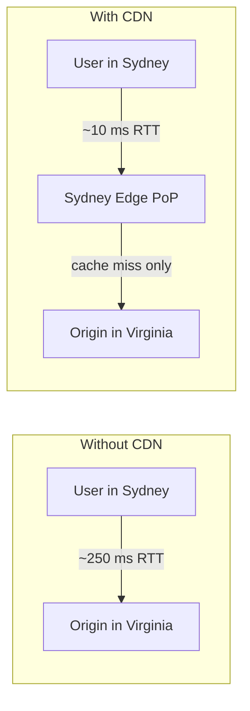

**Interview questions and answers**

- **Q: What is a CDN in one sentence?**
  **A:** A globally distributed caching layer that serves content from edge servers near the user to reduce latency, offload the origin, and improve availability.

- **Q: Why can't you just scale the origin instead of using a CDN?**
  **A:** Scaling the origin helps with capacity but not with physics: distance-induced latency and international transit costs remain. A CDN solves both by moving bytes closer to users.

---

### Functional Requirements

1. **Serve static content from edge servers.** Images, videos, JavaScript, CSS, fonts, and downloadable files must be served from geographically close edge PoPs, not from the origin. The client keeps using the same URL; the CDN is transparent.
2. **Cache content at Points of Presence (PoPs) worldwide.** On a cache miss, the edge fetches from the origin (or shield), stores the object according to its cache policy, and serves subsequent requests locally.
3. **Cache invalidation (purge).** Operators must be able to invalidate specific URLs, path prefixes, or tagged content groups across all PoPs within seconds, for example when a product image is corrected.
4. **Support origin pull and push models.** Pull zones fetch lazily on first miss; push zones accept proactively uploaded content and replicate it to edges. Both must be supported because different content classes favor different models.
5. **SSL/TLS termination at the edge.** The CDN terminates the client TLS session at the PoP using the customer's certificate (or a shared SAN certificate), so HTTPS works without a round trip to the origin.
6. **Custom caching rules.** Per-path or per-content-type TTLs, cache-key customization (query-string and header handling), and origin header overrides must be configurable per distribution.
7. **Real-time analytics.** Hit ratio, bandwidth, request count, latency percentiles, and top URLs must be observable per customer in near real time, because cache effectiveness is a business metric.

---

### Non-Functional Requirements

- **Latency**: p50 under 50 ms for cached content served from the nearest PoP; TLS session resumption should keep handshake cost near zero for repeat visitors.
- **Scale**: 100+ Tbps aggregate egress bandwidth and millions of requests per second across the network.
- **Availability**: 99.999% (about 5 minutes of downtime per year), achieved through anycast failover and multi-tier caching rather than any single server.
- **Cache hit ratio**: above 95% for popular content; the origin should see only single-digit percentages of total request volume.
- **Global footprint**: 200+ PoPs across 50+ countries, placed near dense user populations and major internet exchanges.
- **Consistency**: eventual consistency bounded by TTL; explicit purges propagate globally in 1-5 seconds. Strong consistency is explicitly not a goal for cached content.
- **Durability**: the CDN is a cache, not the system of record. The origin owns durability; the edge may evict at any time.
- **Security**: TLS everywhere, DDoS absorption at the edge, signed URLs/cookies for paid or private content.

---

### Capacity Estimation (Back-of-Envelope)

Back-of-envelope math justifies the non-functional requirements and drives PoP sizing. Assume a large media and commerce property.

**Step 1 - Request volume**

- Daily asset requests: 10 billion (10^10).
- Average request rate: 10^10 / 86,400 s ≈ **115,000 RPS**.
- Peak-to-average ratio of 3x: **~350,000 RPS peak**.

**Step 2 - Bandwidth**

- Average object size: 100 KB (a mix of thumbnails, JS/CSS, images, and 2-6 s video chunks).
- Daily egress: 10^10 × 100 KB = 10^15 bytes = **1 PB/day**.
- Average bandwidth: 1 PB / 86,400 s ≈ 11.6 GB/s ≈ **93 Tbps average**, with peaks well above 100 Tbps. This is why the NFR states 100+ Tbps.

**Step 3 - Storage**

- Unique objects: 500 million × average 200 KB = **100 TB logical storage** at the origin.
- Content popularity is Zipf-distributed: roughly 1% of objects serve ~90% of traffic. The hot set is ~1-10 TB, which comfortably fits per-PoP cache capacity of 10-100 TB (RAM + NVMe SSD).
- Long-tail objects are fetched on demand and evicted quickly; they are not replicated everywhere.

**Step 4 - Per-PoP load**

- 200 PoPs, peak 350K RPS → roughly **1,750 RPS per PoP on average**, though PoPs are highly non-uniform: a metro PoP may serve tens of thousands of RPS and hundreds of Gbps, while a small-market PoP serves very little.
- Per-PoP average bandwidth: 93 Tbps / 200 ≈ 465 Gbps averaged; real networks size large metro PoPs for hundreds of Gbps and small ones for tens.

**Step 5 - Origin offload**

- At a 95% cache hit ratio, the origin sees only 5% of requests: ~5,800 RPS average instead of 115,000 RPS.
- With an origin shield aggregating misses from ~15 PoPs each, origin traffic drops another order of magnitude for cold content, because only one shield fetches a given object per region.

**Rule of thumb to quote in interviews**: every 1% improvement in cache hit ratio removes ~1,150 RPS (and ~920 Gbps at peak) from the origin in this scenario - hit ratio is the single most important CDN metric.

---

### Characteristics

Each characteristic: what it means, why it matters, how it works, and a practical example.

- **Geographically distributed**
  PoPs sit in hundreds of cities near users. This is the defining trait: latency is a distance problem, so the fix is physical proximity. Example: Cloudflare runs PoPs in 300+ cities and claims ~95% of the internet-connected population is within 50 ms.

- **Cache-driven and read-heavy**
  The workload is overwhelmingly reads of immutable or slowly changing content. That permits aggressive caching, cheap horizontal scaling, and relaxed consistency. Example: a product image is read millions of times and replaced once.

- **Transparent to clients**
  Clients use normal URLs and DNS; no SDK or protocol change is required. The CDN sits in front via DNS CNAME or as the authoritative host. Example: `cdn.example.com/hero.jpg` works in any browser or HTTP client.

- **Eventual consistency**
  Updates propagate via TTL expiry or explicit purge, not synchronously. This trades freshness for availability and speed. Example: a corrected image may serve stale copies for up to its TTL unless purged.

- **Tiered architecture**
  Edge PoPs are backed by regional shield caches, which are backed by the origin. Tiers multiply effective hit ratio and protect the origin. Example: a miss in Frankfurt's PoP is served by the EU shield, not by the US origin.

- **Multi-tenant by design**
  Thousands of customers share the same PoPs and hardware; isolation is enforced through configuration, cache keys, and certificates. Example: Cloudflare serves millions of zones from the same edge fleet.

- **Throughput-oriented**
  The currency is bits per second and requests per second, not transactions. PoPs are optimized for bulk egress: kernel-bypass networking, NVMe caches, and fat peering links.

- **Edge security perimeter**
  Because all customer traffic passes through the edge, the CDN naturally becomes the place for TLS termination, WAF rules, and DDoS absorption.

- **Programmable edge**
  Modern CDNs run customer code at the edge (Cloudflare Workers, Lambda@Edge) for rewrites, auth checks, A/B tests, and cache-key normalization.

---

### Components

Each component: purpose, responsibilities, how it works, relationships, and a real-world example.

- **Edge server / PoP (Point of Presence)**
  Purpose: serve content as close to the user as possible. Responsibilities: terminate TLS, look up the cache key, serve hits from RAM/SSD, forward misses, enforce per-customer rules. How it works: a rack of cache nodes behind an L4 load balancer, peered with local ISPs. Relationships: child of the shield tier, parent of nothing; peers with other PoPs only through the control plane. Real-world example: a Cloudflare or Akamai metro PoP.

- **Regional origin shield (mid-tier cache)**
  Purpose: aggregate cache misses so the origin sees one fetch per object per region instead of one per PoP. Responsibilities: hold a larger, warmer cache; coalesce concurrent misses. How it works: edges forward misses to their assigned shield; the shield fetches from the origin on its own miss. Example: Fastly's "shielding" feature; CloudFront's Regional Edge Caches.

- **Origin server**
  Purpose: source of truth owned by the customer. Responsibilities: serve correct content with correct cache headers. Relationships: only talks to shields/edges on misses and revalidation. Example: an S3 bucket, a Spring Boot service, or a bare-metal file server.

- **Authoritative DNS / traffic router**
  Purpose: map each user to the best PoP. Responsibilities: answer DNS for the CDN hostname with a PoP IP chosen by client resolver location, PoP health, and load; use short TTLs (30-60 s) to allow re-routing. Example: NS1/Akamai's DNS steering; Cloudflare's DNS-backed load balancing.

- **Anycast network (BGP layer)**
  Purpose: route packets to the nearest healthy PoP at the network layer. How it works: every PoP advertises the same IP prefix via BGP; internet routing picks the shortest AS path; when a PoP withdraws its announcement, traffic shifts automatically. Relationships: complements DNS steering (many CDNs use both). Example: Cloudflare's entire edge is anycast.

- **Cache storage engine**
  Purpose: store objects with metadata and serve them in microseconds. Responsibilities: tiered storage (RAM for hot, NVMe SSD for warm, HDD for cold), eviction (LRU/LFU variants), and expiration. Example: Varnish, NGINX proxy_cache, or custom engines such as Cloudflare's.

- **Purge / invalidation service**
  Purpose: remove or mark stale content globally on demand. How it works: control plane receives a purge request, fans it out to all PoPs over a message bus, and each PoP deletes or soft-invalidates matching keys. Example: `POST /purge` APIs on Cloudflare, Fastly (instant purge via surrogate keys).

- **Control plane and configuration API**
  Purpose: let customers define distributions, cache rules, TLS certs, and purge requests. Responsibilities: validate and distribute configuration to every PoP within seconds. Example: CloudFront distributions managed through the AWS API.

- **Analytics and logging pipeline**
  Purpose: measure hit ratio, bandwidth, latency, and errors. How it works: edge nodes emit structured logs/metrics to a streaming pipeline (Kafka → aggregation → dashboards/alerts). Example: Cloudflare Analytics, CloudFront standard logs to S3.

- **Certificate and TLS management**
  Purpose: terminate customer HTTPS at scale. Responsibilities: certificate issuance/renewal (ACME), secure key storage, SNI-based certificate selection, OCSP stapling. Example: Cloudflare's universal SSL issuing per-zone certificates automatically.

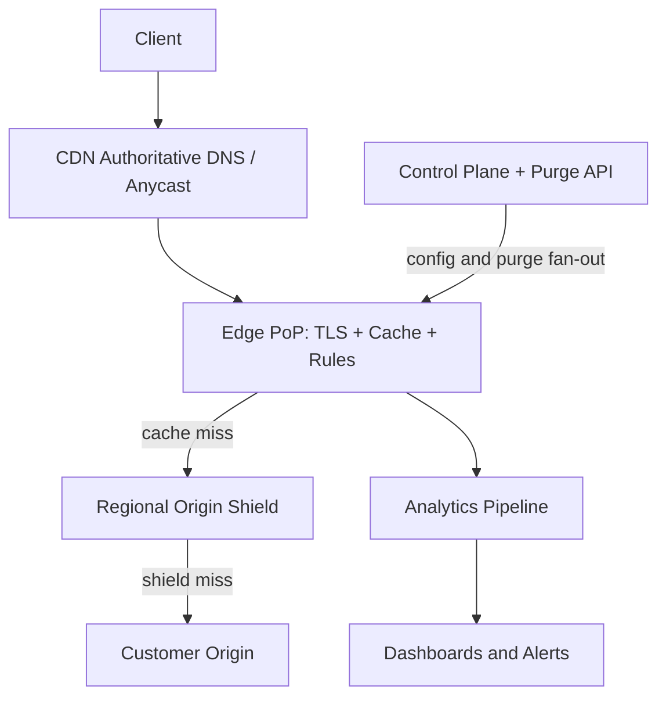

---

### CDN Patterns

Each pattern: what it is, the problem it solves, how it works, when to use and not use it, advantages, disadvantages, and a real-world example.

- **Pull zone (lazy caching)**
  What: the edge fetches content from the origin on the first cache miss, then caches it. Problem solved: no pre-distribution work; storage is used only for content actually requested. How it works: miss → fetch → store per cache policy → serve. When to use: large, unpredictable catalogs where most objects are rarely requested (long tail). When not: launch-day binaries where the first-miss stampede would hurt. Advantages: zero operational effort, self-optimizing. Disadvantages: first request per object per region pays origin latency; miss storms hit the origin. Example: typical website static assets on CloudFront.

- **Push zone (eager replication)**
  What: content is uploaded to CDN storage once and proactively replicated to PoPs. Problem solved: guaranteed first-request performance for known-hot content. How it works: publish API → central storage → replication to selected PoPs. When to use: game patches, OS updates, media premieres, large files with predictable demand. When not: millions of rarely requested objects (wastes edge storage). Advantages: predictable latency, origin fully shielded. Disadvantages: storage cost at every PoP, replication delay before availability. Example: Steam distributing a 50 GB game update ahead of release.

- **Origin shielding / multi-tier caching**
  What: a regional cache tier between edges and the origin. Problem solved: N PoPs each missing the same object causes N origin fetches. How it works: edges route misses to their shield; only the shield talks to the origin. When to use: always, at scale. Advantages: origin offload improves by roughly the number of PoPs per region; warmer caches for mid-tail content. Disadvantages: one extra hop on true misses; another tier to operate. Example: Fastly customers pick a shield PoP; CloudFront Regional Edge Caches.

- **Request coalescing (collapsed forwarding)**
  What: when 1,000 concurrent requests miss the same key, only one fetch goes upstream; the rest wait and share the response. Problem solved: cache-stampede (thundering herd) on hot-object expiry or live events. When to use: always-on at shield and edge. Advantages: origin sees O(1) requests instead of O(N). Disadvantages: waiting requests add tail latency; needs careful locking. Example: Varnish's "backend fetch coalescing"; CDNs collapsing requests for live-stream manifests.

- **Stale-while-revalidate and stale-if-error**
  What: serve the stale cached copy while asynchronously refreshing (SWR), or when the origin errors (SIE). Problem solved: hides revalidation latency and masks origin outages. How it works: `Cache-Control: stale-while-revalidate=30, stale-if-error=86400`. Advantages: users never see origin latency or downtime. Disadvantages: briefly stale responses; harder debugging. Example: a news homepage served stale for up to a day during an origin incident.

- **Cache-aside at the application layer**
  What: the application decides what is cacheable by emitting precise headers. Problem solved: CDNs cannot guess business semantics. How it works: the origin sets `Cache-Control`, `ETag`, `Vary`, and surrogate tags per response. Example: a Spring Boot controller marking immutable versioned assets with a one-year TTL (see the Java section).

- **Consistent hashing within a PoP**
  What: cache keys are hashed across the nodes of a PoP so each object lives on exactly one node. Problem solved: naive load balancing would either duplicate content on every node or lose locality. Advantages: minimal reshuffling when nodes are added/removed. Example: a 20-node PoP where `hash(key) mod ring` picks the owner node.

- **Content versioning (cache busting)**
  What: embed a content hash in the URL (`app.a1b2c3.js`) and cache forever. Problem solved: invalidation is hard; versioned URLs never need it. When to use: build artifacts (JS/CSS/images with fingerprints). Advantages: infinite TTL, zero purge risk, perfect rollback. Disadvantages: requires build tooling; HTML entry points still need short TTLs. Example: webpack/Vite hashed filenames behind a one-year `immutable` cache policy.

- **Edge computing**
  What: run small functions at the PoP for routing, auth, rewrites, and personalization. Problem solved: decisions that need per-request logic without an origin round trip. Advantages: sub-millisecond logic at the edge. Disadvantages: constrained runtimes, vendor lock-in, debugging difficulty. Example: Cloudflare Workers validating a JWT before a cache lookup.

---

### Benefits

- **Dramatically lower latency.** Serving from a metro PoP turns 200 ms transcontinental round trips into 10-20 ms local ones, which directly improves page-load times and conversion rates (Amazon famously correlated 100 ms of latency with measurable revenue loss).
- **Massive origin offload.** At a 95% hit ratio the origin handles 20x less traffic; at 99%, 100x less. This shrinks origin infrastructure cost proportionally.
- **Availability through redundancy.** PoPs fail independently; anycast and DNS steering reroute users in seconds. Cached content survives origin outages via stale-if-error.
- **Bandwidth cost reduction.** CDN egress is typically cheaper per GB than cloud origin egress, and peering at internet exchanges is cheaper still.
- **DDoS absorption.** Attack traffic is soaked up by a globally distributed edge with far more aggregate capacity than any single origin can provision.
- **Global reach without global infrastructure.** A startup in one region gets planetary presence by changing a DNS record.
- **Better tail performance.** Even uncacheable (dynamic) traffic benefits from edge TLS termination and optimized backbone routing between PoP and origin.

---

### Pros

- **Simple integration**: usually a DNS CNAME change plus correct cache headers; no application rewrite.
- **Pay-as-you-go economics**: no upfront hardware; cost scales with traffic served.
- **Automatic geographic failover**: anycast withdraws dead PoPs without human intervention.
- **Improved SEO and UX**: faster pages rank better and convert better.
- **Security add-ons come along for the ride**: WAF, bot filtering, TLS management, and signed URLs are standard CDN features.
- **Scales to flash crowds**: a viral moment is a routing problem the CDN already solved, not an emergency capacity purchase.

---

### Cons

- **Cost at high volume**: CDN bills grow with egress; very large streamers (Netflix) eventually build their own CDN because it becomes cheaper.
- **Stale content risk**: misconfigured TTLs or missed purges serve outdated content to millions; invalidation remains one of the hard problems.
- **Debugging complexity**: "works on my origin" but broken at one PoP is hard to reproduce; cache behavior varies by key, region, and tier.
- **Vendor lock-in**: edge rules, purge APIs, and edge functions are provider-specific.
- **Another critical dependency**: when a major CDN has an outage (Fastly 2021, Cloudflare incidents), large parts of the internet go down together.
- **Limited help for personalized dynamic content**: per-user uncacheable responses gain only TLS termination and route optimization, not caching.
- **Configuration errors are global**: a bad rule pushed to 200 PoPs breaks everything at once, everywhere.

---

### Challenges

- **Technical: cache invalidation and consistency.** Knowing what to purge, when, and doing it atomically across 200 PoPs in seconds is genuinely hard. Tag-based purge and versioned URLs mitigate it, but correctness is the customer's responsibility.
- **Scalability: hot keys and stampede.** A single viral object expiring can produce a miss storm; coalescing and staggered TTLs (jitter) are required. Storage per PoP forces eviction-policy trade-offs for the long tail.
- **Performance: the long tail.** Billions of rarely requested objects have near-zero hit ratios; shielding and larger mid-tier caches help, but some misses are irreducible.
- **Reliability: origin and PoP failures.** The design must degrade gracefully: serve stale on origin error, reroute on PoP loss, and never let the CDN itself become a single point of failure.
- **Maintainability: configuration at scale.** Hundreds of per-path rules, certificates, and customers per PoP demand infrastructure-as-code, staged rollouts, and instant rollback.
- **Operational: observability.** You need per-customer, per-PoP visibility into hit ratio, origin load, and purge propagation lag, or you are flying blind.
- **Security: cache poisoning and privacy.** If an attacker gets a malicious or private response cached under a shared key, it is served to everyone. Correct `Vary` handling, never caching `Set-Cookie` responses, and signed URLs for private content are essential.

---

### Best Practices

- **Fingerprint static asset URLs and cache them for a year.** Why: immutable versioned URLs eliminate invalidation entirely for build artifacts. Example: `app.a1b2c3.js` with `Cache-Control: public, max-age=31536000, immutable`.
- **Keep HTML TTLs short and rely on purge for emergencies.** Why: HTML entry points change on every deploy and reference the versioned assets; a 60 s TTL plus tag-based purge bounds staleness.
- **Normalize cache keys aggressively.** Why: every irrelevant query parameter or header in the key fragments the cache and destroys hit ratio. Example: strip `utm_*` tracking parameters from the key at the edge.
- **Never cache responses that set cookies or contain authorization.** Why: a cached `Set-Cookie` response leaks sessions to other users. Mark such responses `Cache-Control: private, no-store`.
- **Use `stale-while-revalidate` and `stale-if-error`.** Why: they hide revalidation latency and make origin outages invisible to users at the cost of bounded staleness.
- **Enable origin shielding.** Why: it reduces origin load by roughly the number of PoPs per region for cold content - essentially free origin protection.
- **Add jitter to TTLs.** Why: thousands of objects created together expiring together cause synchronized miss storms; ±10% TTL jitter smooths refills.
- **Monitor cache hit ratio as a first-class SLO and alert on drops.** Why: a sudden hit-ratio drop usually means a bad deploy (new query parameter in the key) and directly translates to origin load.
- **Use purge-by-tag rather than purge-by-URL where possible.** Why: a product update touches many URLs; tagging all related assets with `product-123` makes invalidation one call instead of a fragile URL list.
- **Authenticate private content at the edge with signed URLs or cookies.** Why: caching paid or private media without edge auth either leaks content or forces origin round trips that defeat the CDN.

---

### When to Use a CDN and When Not To

**Use a CDN when**

- You serve static or semi-static content (images, video, downloads, JS/CSS, public API GETs) to a geographically distributed audience.
- Latency matters: e-commerce, media, gaming, mobile apps on cellular networks.
- You face spiky or unpredictable traffic that your origin cannot absorb.
- You want DDoS absorption and WAF protection at the edge as a side benefit.
- Origin egress bandwidth costs are significant.

**Consider alternatives when**

- **Your audience is small and single-region.** A well-tuned origin with proper cache headers may be simpler and cheaper; the CDN adds little when users are already near the origin.
- **Content is highly personalized and uncacheable.** Per-user responses gain only TLS termination and routing; evaluate edge computing or multi-region active-active origins instead.
- **You need strong consistency.** If every reader must see a write instantly, a cache layer works against you; use direct origin reads with database-level consistency.
- **You operate at extreme scale with predictable traffic.** At Netflix scale, building your own CDN (Open Connect) becomes economically rational.

**Decision factors**: audience geography, cacheability ratio, traffic volatility, egress cost, consistency requirements, and operational appetite for managing cache semantics.

---

### Use Cases

**1. Global e-commerce product catalog**

- Problem: shoppers on four continents load pages with 30+ images each; origin is in one region; conversion drops with latency.
- Proposed solution: pull zone in front of the image store and static assets; versioned URLs for site bundles; product images tagged `product-<id>` for purge-on-update.
- Suitability: excellent - catalog media is the canonical CDN workload (read-heavy, immutable-ish, global audience).
- How it works: first shopper per region triggers an origin fetch; everyone after is served from the PoP. A price or image update calls purge-by-tag.
- Trade-offs: accepts up to TTL-length staleness for product images; pays CDN egress fees; gains sub-50 ms image loads worldwide.

**2. Video streaming at scale**

- Problem: millions of viewers pull multi-GB streams; origin bandwidth would be astronomical; buffering kills retention.
- Proposed solution: adaptive bitrate (HLS/DASH) where each 2-6 s segment is an independently cacheable object; segments for live streams cached with 1-2 s TTLs plus request coalescing; VOD libraries pushed to metro PoPs.
- Suitability: the CDN is non-negotiable here; Netflix built Open Connect because third-party CDNs could not meet the economics.
- How it works: the manifest updates continuously; segments are immutable and cached at every tier; live edge segments ride on coalesced misses.
- Trade-offs: chunk-based caching adds manifest complexity; live latency is bounded by segment duration and cache TTL.

**3. Software distribution (game patch / OS update launch day)**

- Problem: 50 GB file, 10 million downloads in 24 hours at launch = ~4.6 PB; no single origin survives this.
- Proposed solution: push zone - upload the binary once, pre-replicate to all PoPs before launch; signed URLs for entitlement.
- Suitability: ideal push-zone case - content known in advance, demand spike known to the minute.
- How it works: replication completes pre-launch; at T0, clients download from local PoPs; the origin sees almost nothing.
- Trade-offs: replication takes time and storage at every PoP; last-minute hotfixes require re-replication or delta patches.

**4. News site during breaking events**

- Problem: traffic jumps 50x in minutes; the homepage and a few articles are hot; everything else is cold.
- Proposed solution: short TTLs (30-60 s) on articles, stale-while-revalidate, tag-based purge on story updates, and edge-served static assets.
- Suitability: strong - the hot set is tiny and shared, which is exactly what edge caches excel at.
- How it works: each PoP serves the homepage from cache; an edit triggers a purge of the story tag; between purges, SWR refreshes asynchronously.
- Trade-offs: readers may see a version up to ~a minute old; corrections require disciplined purging.

---

### Data Model and APIAPI Design and Contract

A CDN exposes two surfaces: the **data plane** (clients fetching content over HTTP) and the **control plane** (customers managing caching and purge).

**Data plane - fetching an asset**

```http
GET /img/hero.jpg HTTP/1.1
Host: cdn.example.com
Accept-Encoding: br, gzip
If-None-Match: "a1b2c3"
```

Successful cache-hit response:

```http
HTTP/1.1 200 OK
Content-Type: image/jpeg
Content-Length: 182344
Cache-Control: public, max-age=86400, stale-while-revalidate=60
ETag: "a1b2c3"
Last-Modified: Tue, 04 Jun 2024 10:00:00 GMT
Age: 4127
X-Cache: HIT
Vary: Accept-Encoding
```

Key headers and semantics:

| Header | Direction | Meaning |
|--------|-----------|---------|
| `Cache-Control: public, max-age=N` | origin → edge → client | Cacheable by shared caches for N seconds |
| `ETag` / `If-None-Match` | both | Revalidation token; match yields `304 Not Modified` with no body |
| `Last-Modified` / `If-Modified-Since` | both | Time-based revalidation fallback |
| `Age` | edge → client | Seconds the object has been in cache |
| `X-Cache: HIT/MISS` | edge → client | Debug aid: whether the PoP served from cache |
| `Vary: Accept-Encoding` | origin → all | Cache key must include the listed request headers |
| `Retry-After` | edge → client | Present on 429/503 to signal backoff |

Status codes that matter:

- **200 OK**: full body served (HIT or MISS).
- **206 Partial Content**: range request for video/large-file streaming (`Range: bytes=0-1048575`).
- **304 Not Modified**: conditional GET whose validator still matches; saves bandwidth, still costs a round trip.
- **404 Not Found**: unknown object; often cached briefly (`max-age=30`) to protect the origin from 404 floods.
- **429 Too Many Requests**: per-client rate limit at the edge; must include `Retry-After`.
- **502/504**: origin unreachable or slow; with `stale-if-error`, the edge serves the stale copy instead.

**Control plane - purge API**

```http
POST /v1/zones/zone_123/purge HTTP/1.1
Host: api.cdn-provider.com
Authorization: Bearer <api-token>
Content-Type: application/json

{
  "urls": ["https://cdn.example.com/img/hero.jpg"],
  "tags": ["product-123"]
}
```

Response (asynchronous acceptance):

```http
HTTP/1.1 202 Accepted
X-RateLimit-Limit: 100
X-RateLimit-Remaining: 97
X-RateLimit-Reset: 1717502400

{
  "purgeId": "purge_9f8e7d",
  "status": "in_progress",
  "estimatedPropagationSeconds": 5
}
```

Error responses:

```http
HTTP/1.1 400 Bad Request        → invalid URL or tag syntax
HTTP/1.1 401 Unauthorized       → missing/invalid API token
HTTP/1.1 403 Forbidden          → token lacks purge scope for this zone
HTTP/1.1 429 Too Many Requests  → purge quota exceeded; honor Retry-After
```

Contract details:

- **Validation**: URLs must be absolute, belong to the zone, and are capped per request (for example 500 URLs); tags must match `^[a-z0-9-]{3,64}$`.
- **Versioning**: the control plane is versioned by path (`/v1/`); breaking changes ship as `/v2/` while `/v1/` keeps working.
- **Auth**: bearer API tokens scoped per zone and per action (read, purge, configure); purge is a dangerous scope and should be issued narrowly.
- **Rate limiting**: purge APIs are aggressively rate limited (for example 100 requests/minute) because purge storms can collapse hit ratios.
- **Idempotency**: purging the same URL twice is safe; `purgeId` allows status polling via `GET /v1/purges/{purgeId}`.

**Interview questions and answers**

- **Q: What is the difference between `Age` and `max-age`?**
  **A:** `max-age` is the freshness lifetime the origin granted; `Age` is how long the object has already been in cache. The remaining freshness is `max-age - Age`.

- **Q: Why return 202 for purge instead of 200?**
  **A:** Purge is asynchronous fan-out to hundreds of PoPs; 202 Accepted honestly signals that the work is queued, with a `purgeId` for status tracking.

---

#### Data Modeling

The CDN's core data is the **cache entry** and its **lookup key**. Getting the key design right is the difference between a 95% and a 40% hit ratio.

**Cache key design**

```
Default key: scheme + host + path + query string
  https://cdn.example.com/img/hero.jpg?v=2

Customization:
  - Ignore query string (for same content with tracking params)
  - Include headers (Accept-Encoding, Accept-Language)
  - Include cookies (per-user content - rare, defeats caching)
  - Custom key via edge logic (Cloudflare Workers, Lambda@Edge)
```

Normalization rules applied before hashing: lowercase the host, sort query parameters, drop known tracking parameters (`utm_*`, `fbclid`), and fold in only the request headers listed in `Vary` (typically just `Accept-Encoding` - `br` vs `gzip` are different bodies for the same URL).

**Cache entry metadata** (per stored object):

```json
{
  "cacheKey": "https+cdn.example.com+/img/hero.jpg+v=2+enc:br",
  "eTag": "\"a1b2c3\"",
  "storedAt": "2024-06-04T10:00:00Z",
  "ttlSeconds": 86400,
  "expiresAt": "2024-06-05T10:00:00Z",
  "surrogateTags": ["product-123", "catalog-images"],
  "sizeBytes": 182344,
  "hitCount": 91824,
  "lastAccessedAt": "2024-06-04T11:08:47Z",
  "state": "FRESH",
  "originShield": "eu-central"
}
```

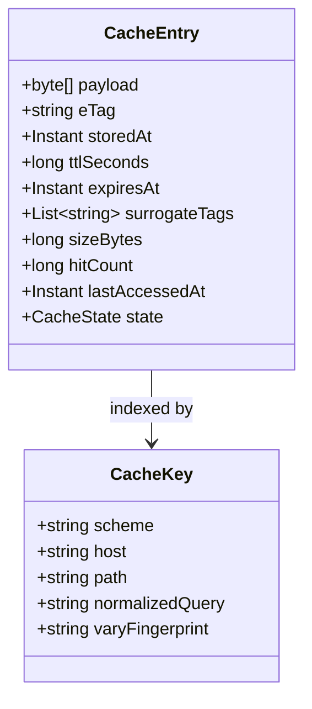

Notes on the model:

- **`surrogateTags`** power tag-based purge: purging `product-123` deletes every entry whose tag list contains it, without enumerating URLs.
- **`hitCount` / `lastAccessedAt`** feed eviction: LRU evicts the least recently used; LFU-aware variants (TinyLFU, segmented LRU) resist one-hit-wonder pollution from scan traffic.
- **`state`** is one of `FRESH`, `STALE`, `REVALIDATING` - `REVALIDATING` is what makes stale-while-revalidate single-flight (one refresh, many stale serves).
- **Storage placement**: entries live in RAM (hottest), NVMe SSD (warm), or HDD (cold) depending on size and access frequency; metadata is always in RAM for O(1) lookup.

---

### High-Level Design

**Components and communication**

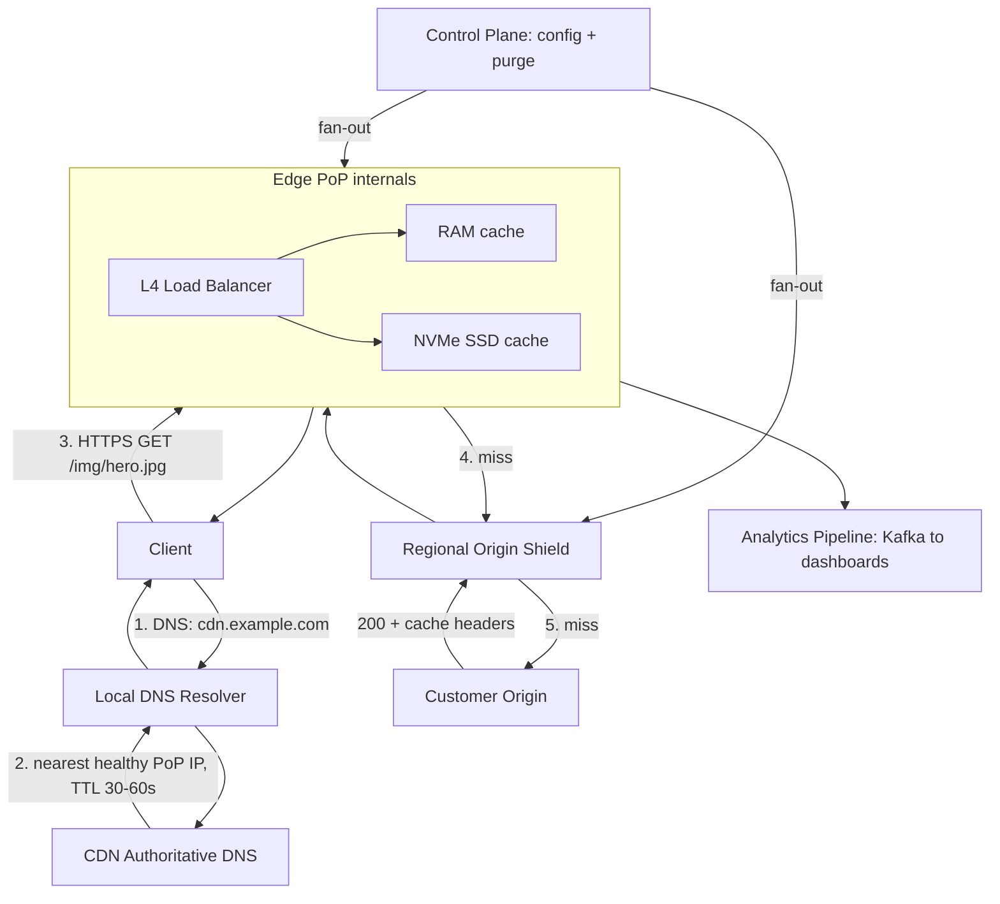

**Request flow (cache miss, end to end)**

```mermaid
sequenceDiagram
    participant U as Client
    participant E as Edge PoP
    participant S as Origin Shield
    participant O as Origin
    U->>E: "GET /img/hero.jpg"
    E->>E: "normalize key; lookup RAM then SSD"
    Note over E: MISS - start single-flight fetch
    E->>S: "GET /img/hero.jpg (coalesced)"
    S->>O: "GET /img/hero.jpg"
    O-->>S: "200 + Cache-Control: public, max-age=86400"
    S-->>E: "200 (stored at shield)"
    E->>E: "store object + metadata (TTL, tags, ETag)"
    E-->>U: "200 OK, X-Cache: MISS"
```

**Dependencies**: the data plane depends on DNS/BGP for routing and on the origin only for misses; the control plane (config, purge) is out-of-band - if it dies, caches keep serving with last-known configuration.

**Scaling**

- **PoP deployment**: add PoPs where user density is high and peer directly with eyeball ISPs.
- **Hot content**: replicate across all PoPs proactively (push model) when demand is known in advance.
- **Long-tail content**: cache only at the shield layer, not at every PoP - shields have bigger disks and aggregate demand from ~15 PoPs, so their hit ratio for cold content is far higher.
- **Video**: chunk-based caching - HLS/DASH segments are cached independently, so a popular movie and an unpopular one share infrastructure gracefully.
- **DDoS**: the edge absorbs attack traffic before it reaches the origin; anycast spreads floods across all PoPs so no single location is overwhelmed.

**Failure handling**

| Failure | Detection | Response |
|---------|-----------|----------|
| PoP down | health checks, BGP withdraw | anycast/DNS reroute to next-nearest PoP in seconds |
| Origin down | fetch timeouts, 5xx | serve stale via `stale-if-error`; alert; shield retries with backoff |
| Shield down | health checks | edges fetch origin directly (higher load) until shield recovers |
| Hot key expiry | n/a | request coalescing + TTL jitter |
| Control plane down | n/a | data plane unaffected; purges queue until recovery |

**Key design decisions**

| Decision | Choice | Reason |
|----------|--------|--------|
| Routing | Anycast + DNS fallback | Fastest path, automatic failover |
| Cache layers | 3-tier (edge → shield → origin) | Protect origin, high hit rate |
| Invalidation | TTL + purge API | Simple default + instant when needed |
| Storage | SSD (bulk) + RAM (hot objects) | Cost vs performance balance |
| TLS | Terminate at edge | Reduce latency (no TLS to origin internally) |

---

### Deep Dive

#### Pull vs Push Zones

This is the first design decision in any CDN setup.

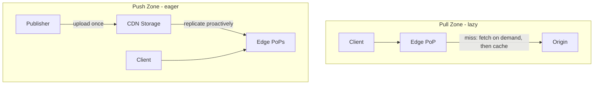

| Aspect | Pull zone | Push zone |
|--------|-----------|-----------|
| First-request latency | High (origin fetch) | Low (already replicated) |
| Edge storage use | Only requested objects | Everything, requested or not |
| Origin load | Miss storms possible | Nearly zero |
| Ops effort | None | Upload + replication management |
| Best for | Large unpredictable catalogs | Known-hot releases, big files |
| Expiry handling | Re-fetch on TTL expiry | Must re-push updates |

Rule of thumb: default to pull; use push for launch-day artifacts and multi-GB files where the first-miss penalty is unacceptable.

**Interview questions and answers**

- **Q: When does a pull zone hurt you?**
  **A:** On synchronized first access - a product launch where 200 PoPs all miss the same new object at once. Coalescing and shields reduce it, but a push zone eliminates it.

#### Cache Invalidation and Purging

```
1. TTL-based expiration
   Cache-Control: max-age=3600 → expire after 1 hour
   Most common, simple, eventual consistency

2. Purge API
   POST /purge {"urls": ["https://cdn.example.com/image.jpg"]}
   → Propagate to all PoPs → delete from cache
   → Takes 1-5 seconds globally

3. Soft purge (stale-while-revalidate)
   Mark as stale → serve stale content while fetching fresh copy
   → No downtime during revalidation

4. Tag-based invalidation
   Purge all content tagged "product-123"
   → Useful for e-commerce (product update → purge all related assets)
```

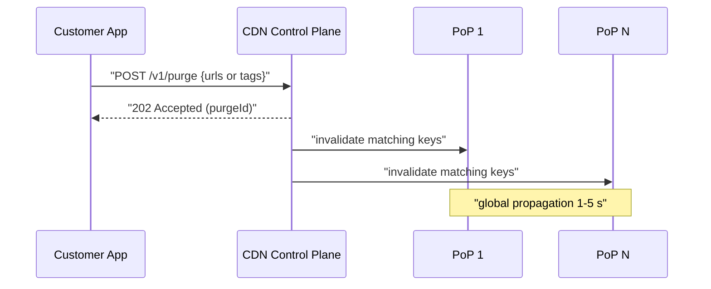

The pragmatic hierarchy: versioned URLs make invalidation unnecessary for build artifacts; TTLs handle routine freshness; tag-based purge handles business events; URL purge is the emergency scalpel. Soft purge should be the default behavior so revalidation never blocks users.

#### TTL Strategy

TTL is a business decision expressed in seconds - it trades freshness against origin load.

| Content type | Suggested TTL | Rationale |
|--------------|---------------|-----------|
| Fingerprinted assets (app.a1b2c3.js) | 1 year, `immutable` | URL changes when content changes |
| Product/catalog images | 1 day + tag purge | Rarely change; purge on update |
| Homepage/article HTML | 30-60 s + SWR | Fresh enough for news; bounded staleness |
| Live stream manifest | 1-2 s | Must track the live edge |
| API GET responses (public data) | 5-60 s | Shields origin from read floods |
| 404 responses | 30 s | Absorbs scans without hiding new content for long |

Add ±10% jitter to any TTL applied in bulk, and always pair short TTLs with `stale-while-revalidate` so refresh latency never reaches users. Origin headers are the default policy; edge rules override them only deliberately (for example, minimum TTL for a misbehaving origin sending `max-age=0`).

#### Anycast Routing

Three ways to get a client to the nearest PoP:

```
Method 1: DNS-based routing
  Client → DNS query for cdn.example.com
  → CDN's authoritative DNS returns IP of nearest PoP
  → Based on client IP geolocation
  → TTL = 60s (allows re-routing)

Method 2: Anycast
  Multiple PoPs advertise same IP via BGP
  Internet routing naturally sends packets to nearest PoP
  → Fastest routing, handles failover automatically

Method 3: HTTP redirect
  Initial request → central load balancer → 302 redirect to nearest PoP
  → More control but adds a round trip
```

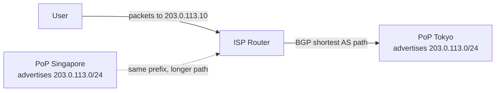

Anycast caveats worth mentioning in interviews: "nearest" means shortest BGP path, not shortest geography (routing policy can send traffic oddly); long-lived TCP connections can break when routing shifts mid-session; and per-flow (not per-packet) stability is required, which ECMP hashing provides. DNS-based steering sees the resolver's IP, not the client's (mitigated by EDNS Client Subnet). Production CDNs combine anycast for connection routing with DNS for per-host steering.

#### Edge PoP Architecture

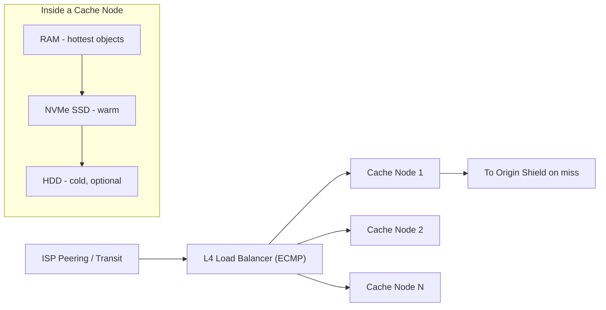

A PoP is a small data center: routers peering with local ISPs, an L4 balancer spraying flows across cache nodes, and nodes with tiered storage. Cache keys are consistently hashed across nodes so each object has one owner (no duplication, predictable locality). Capacity is 10-100 TB per PoP; the working set of hot content per metro is usually a few TB, which is why RAM+NVMe tiers achieve >95% hit ratios despite tiny storage relative to the total catalog. Hot content lives in RAM; warm content is promoted/demoted between SSD tiers by the eviction policy.

#### Cache Hit Ratio Optimization

Hit ratio = hits / (hits + misses). Every point of hit ratio directly multiplies origin headroom. Levers, in order of impact:

1. **Fix the cache key.** Strip tracking parameters, minimize `Vary`, never include cookies. A key polluted by `?utm_source=twitter` turns one object into thousands of cache entries.
2. **Lengthen TTLs where freshness allows.** Most content is over-freshened: images with 5-minute TTLs could be 1 day.
3. **Enable origin shielding.** Aggregates regional demand so mid-tail content hits at the shield instead of missing to the origin.
4. **Use better eviction.** LRU underperforms on scan-heavy traffic; TinyLFU/segmented LRU keeps genuinely hot objects.
5. **Prefetch and push.** Warm the cache before demand arrives (deploy artifacts, launch binaries, episode releases).
6. **Handle ranges and chunks well.** Cache video segments independently; a 206 request should hit the same entry as the full object would.
7. **Measure per-key-class hit ratios.** Aggregate hit ratio hides that HTML is 40% while images are 99%; different classes need different tactics.

#### TLS Termination at the Edge

```mermaid
sequenceDiagram
    participant U as Client
    participant E as Edge PoP
    U->>E: "TCP SYN (to anycast IP)"
    E-->>U: "SYN-ACK"
    U->>E: "TLS ClientHello (SNI: cdn.example.com)"
    E-->>U: "ServerHello + Certificate + OCSP staple"
    Note over U,E: "TLS 1.3: 1-RTT; 0-RTT on resumption"
    U->>E: "GET /asset (encrypted)"
    E-->>U: "200 OK (encrypted)"
    Note over E: "misses re-encrypt to origin over backbone"
```

Why terminate at the edge: the TLS handshake costs 1-2 RTTs; placing it near the user removes a transcontinental handshake from every new connection. The edge selects the right certificate via SNI from a per-customer cert store, staples OCSP responses so clients skip revocation lookups, and keeps hot session resumption state for 0-RTT reconnects. Between PoP and origin, options are: **Full (strict)** - re-encrypt and verify the origin certificate (the correct choice); **Flexible** - plaintext to origin (fast but insecure, never recommended for sensitive data). Terminating at the edge also means the CDN sees plaintext - a trust decision customers must accept, and why edge nodes are hardened, keys live in hardened key stores, and some industries negotiate bring-your-own-key arrangements.

#### Dynamic Content Acceleration

Not everything is cacheable; the CDN can still help:

- **Connection reuse and edge termination**: the client handshakes with the PoP (fast), and the PoP reuses warm, persistent connections to the origin across many users - the slow part happens once, not per user.
- **Route optimization**: PoP-to-origin traffic rides the CDN's private backbone or carefully peered paths instead of the public internet, avoiding congestion (this is most of what "API acceleration" products sell).
- **TCP/QUIC tuning**: modern congestion control, larger initial windows, and HTTP/3 at the edge improve lossy last-mile links (mobile).
- **Edge logic**: authentication, redirects, header rewrites, and A/B routing at the PoP eliminate origin round trips entirely for those decisions.
- **Edge Side Includes / fragment caching**: cache the page frame and only fetch personalized fragments - a middle ground between full caching and no caching.

Realistic expectation: dynamic acceleration typically saves 30-60% of latency, not the 90%+ that caching delivers. In interviews, state clearly which parts of the workload are cacheable before claiming CDN benefits.

---

### Replication Strategies

**What it means**

Replication Strategies determine how data and state are copied across multiple nodes in CDN. The choice of strategy determines the trade-off between consistency, availability, and latency.

**Why it matters**

CDN must replicate data to prevent loss and serve reads from multiple nodes. The replication strategy determines whether the system favors consistency (strong reads) or availability (always writable), and how it handles cross-node failure.

**How it works**

**Leader-based (single-leader)**: A single primary node accepts all writes; followers replicate changes asynchronously or semi-synchronously. Reads can be served from any replica. This strategy favors strong consistency for writes but creates a write bottleneck at the leader.

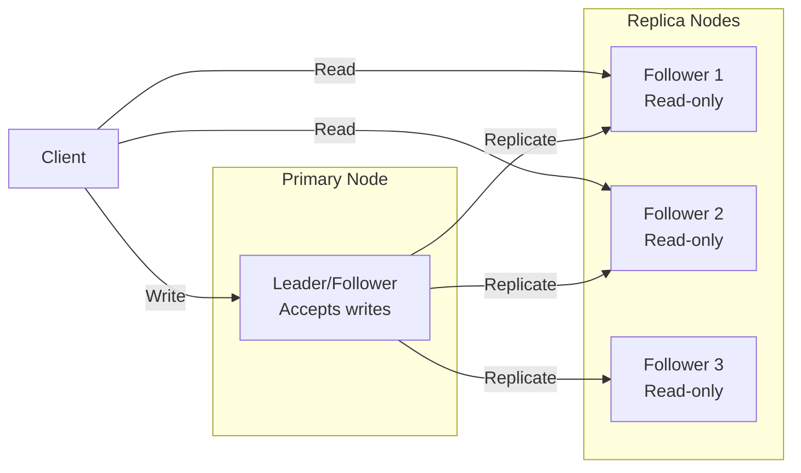

*Leader-based replication: a single primary node accepts all writes and replicates them to read-only followers. Clients can read from any replica for scaled read throughput, but all writes go through the leader.*

**Multi-leader (multi-master)**: Multiple nodes accept writes and exchange updates with each other. This enables low-latency writes in different regions but requires conflict resolution (last-write-wins, merge functions, or CRDTs).

**Leaderless (quorum-based)**: Any node can accept writes; a quorum of nodes must agree. Read and write quorums are configured so that at least one node overlaps between them (R + W > N). This maximizes availability and write scalability.

**Trade-offs for CDN**:

| Strategy | Use Case | Pros | Cons |
|---|---|---|---|
| Leader-based | origin server configs, access logs | Strong consistency, simple | Write bottleneck, leader failure risk |
| Multi-leader | cached content, public metrics | Low-latency global writes | Conflict resolution, complex |
| Leaderless | Caching, counters | High availability, no bottleneck | Eventual consistency, read repair overhead |

**Real-world implementations**

- **Redis**: Leader-follower replication with asynchronous replication; Sentinel handles failover.
- **Apache Kafka**: Leader-based partition replication with ISR (in-sync replica) — writes go to the leader, followers replicate.
- **Cassandra**: Tunable consistency with leaderless quorum (R + W > N).
- **DynamoDB Global Tables**: Multi-master active-active across regions.

### Failure Detection and Membership

**What it means**

Failure Detection and Membership is the mechanism by which CDN determines which nodes are alive and part of the cluster. Membership is the list of known nodes; failure detection is the process of updating that list when nodes fail or recover.

**Why it matters**

CDN must route requests only to healthy nodes and trigger failover when a node goes down. False positives (healthy nodes marked as dead) cause unnecessary failovers and data loss. False negatives (dead nodes not detected) cause failed requests and degraded performance.

**How it works**

**Heartbeat-based detection**: Each node sends a heartbeat (ping) to a subset of peers at regular intervals. If a node misses N consecutive heartbeats, it is marked as suspect. The gossip protocol distributes membership information: each node exchanges its view of the cluster with a random peer, and the information propagates gossip-style.

```mermaid
sequenceDiagram
    participant A as Node A
    participant B as Node B
    participant C as Node C

    loop Every 1s
        A->>B: Heartbeat (ping)
        B-->>A: Heartbeat (ack)
    end
    B->>C: Gossip: A is alive
    C->>A: Gossip: B is alive
    Note over A,B,C: View converges in O(log N) rounds
```

*Gossip-based failure detection: each node periodically pings a random subset of peers and gossips its view of the cluster. The membership list converges in O(log N) rounds.*

**Phi Accrual Failure Detector**: Instead of a fixed timeout, the detector measures the time between consecutive heartbeats and computes a phi (φ) value — the probability that the node is dead given the observed heartbeat pattern. φ is compared against a threshold (typically 1–8); higher thresholds reduce false positives but increase detection latency.

**SWIM (Scalable Weakly-consistent Infection-style Process group Membership Protocol)**: Nodes ping a random subset of cluster members. If a ping fails, the node is marked "suspect" and the failure is "infected" (gossiped) to other nodes. This is O(log N) per failure detection cycle and scales to large clusters.

**Trade-offs**:

| Approach | Strengths | Weaknesses |
|---|---|---|
| Heartbeat (timeout-based) | Simple, deterministic | False positives under load |
| Phi Accrual | Adaptive threshold | Needs historical data |
| SWIM | Scales to 1000s of nodes | Eventual consistency |

**Real-world implementations**

- **AWS Route 53 Health Checks**: Uses TCP/HTTP health checks with configurable thresholds to remove unhealthy instances from DNS rotation.
- **Kubernetes**: Uses the kubelet heartbeat (every 10s) to determine node liveness; nodes missing 3 consecutive heartbeats are marked NotReady.
- **Consul**: Uses SWIM protocol for membership and failure detection; supports both LAN and WAN gossip.
- **Akka Cluster**: Uses Phi Accrual failure detector with configurable φ thresholds.

### High Availability and Scalability

**What it means**

High Availability and Scalability determines how CDN continues operating when nodes or entire zones fail, and how capacity is added as demand grows. HA is about minimizing downtime; scalability is about maintaining performance as load increases.

**Why it matters**

CDN must stay operational even when individual nodes, availability zones, or entire regions fail. At the same time, it must scale horizontally to handle traffic spikes without degrading latency. The two are intertwined: the replication strategy, failure detection, and load balancing all contribute to both HA and scalability.

**How it works**

**Availability zones (AZs)**: Nodes are distributed across multiple AZs within a region. Each AZ is an independent failure domain (power, networking, physical security). A load balancer distributes requests across AZs; if one AZ fails, traffic is routed to the remaining AZs with no data loss (assuming replication is in place).

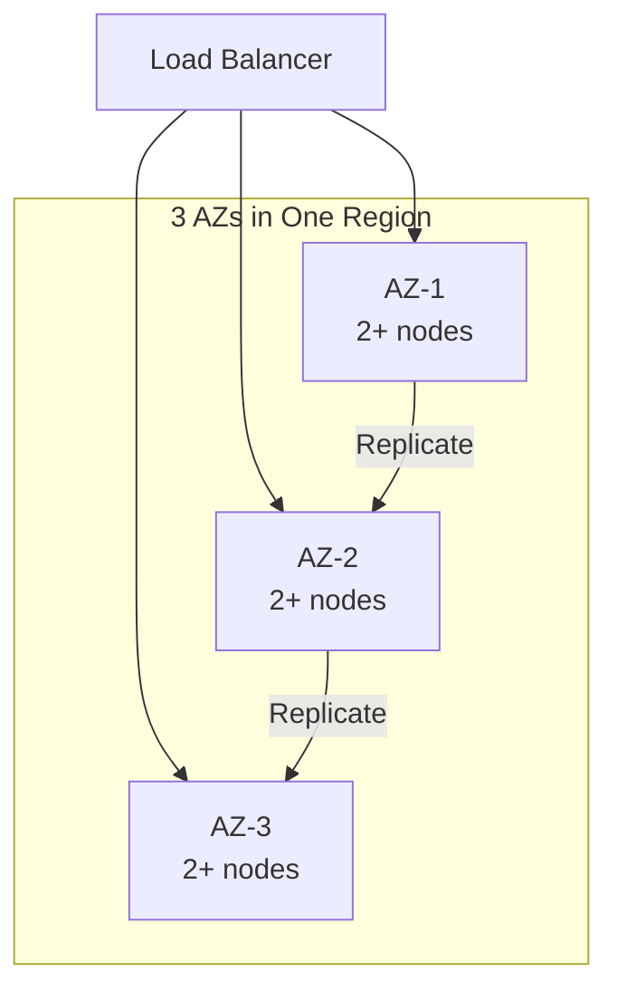

*Multi-AZ deployment: a load balancer distributes traffic across three availability zones. Each AZ has multiple nodes. Data is replicated across AZs so that losing one AZ does not cause data loss or service interruption.*

**Load balancing**: A load balancer distributes incoming requests across healthy nodes. Algorithms include round-robin, least connections, and weighted routing. Health checks ensure traffic only goes to healthy nodes. For CDN, the load balancer also considers **Edge server / PoP (Point of Presence)**
  Purpose: serve content as close to t when routing.

**Auto-scaling**: The system automatically adds or removes nodes based on metrics (CPU, memory, request rate). Scale-out policies add nodes when load exceeds a threshold; scale-in policies remove nodes during low load. For stateful services like CDN, scale-out involves rebalancing partitions (moving data and connections to the new node).

**Failover and recovery**: When a node fails, the load balancer detects it (via health checks or failure detection) and stops sending traffic. A new node is provisioned (or a standby is promoted) and begins serving. For CDN, failover must preserve origin server configs, access logs data — this is achieved through replication with a quorum of healthy nodes.

**Scalability patterns**:

1. **Horizontal partitioning (sharding)**: Split data by a partition key (e.g., user_id, session_id) and distribute partitions across nodes. New nodes take ownership of additional partitions.

2. **Consistent hashing**: Minimize data movement on scale-out — only 1/N of the data moves to the new node. Nodes and partitions are placed on a ring; a request for key X is routed to the next node clockwise from hash(X).

3. **Connection draining**: When scaling in, existing connections are allowed to complete before the node is shut down. For CDN, this means draining active 1. sessions gracefully.

**Real-world implementations**

- **Netflix OSS (Eureka + Zuul + Ribbon)**: Service discovery with Eureka, edge routing with Zuul, and client-side load balancing with Ribbon. Scales to thousands of instances.
- **Kubernetes HPA + VPA**: Horizontal Pod Autoscaler scales pods based on CPU/memory; Vertical Pod Autoscaler adjusts resource requests based on historical usage.
- **AWS ALB + Auto Scaling Groups**: Application Load Balancer with auto-scaling groups across AZs; health checks replace unhealthy instances automatically.

### Performance and Optimization

**What it means**

Performance and Optimization covers the techniques CDN uses to achieve low latency, high throughput, and efficient resource usage. This section examines the key performance metrics, bottlenecks, and optimizations specific to the system.

**Why it matters**

CDN faces competing pressures: users demand low latency, the system must handle high throughput, and infrastructure costs must be controlled. The optimizations applied at the data, compute, and network layers determine whether the system meets its SLA.

**How it works**

**Latency layers**: Latency in CDN comes from three layers:
1. **Network**: Round-trip time from client to the nearest edge node / load balancer.
2. **Application**: Request processing time on the server (CPU, I/O, lock contention).
3. **Data**: Time to read/write from storage (cache hit vs. database query).

The 99th-percentile latency is the key metric for user-facing systems — it determines the worst-case experience.

**Caching strategies**: CDN uses multiple cache layers:
- **Edge cache**: Static assets (images, CSS, JS) served from a CDN at the edge. For CDN, this caches cached content, public metrics that doesn't change frequently.
- **Application cache**: In-memory cache (e.g., Redis, Memcached) for frequently accessed data. Cache-aside pattern: application checks cache first, falls back to database on miss.
- **Local cache**: In-process cache (e.g., Caffeine, Guava) for data accessed within a single request. Avoids network round-trips.

**Batching and pipelining**: CDN batches small operations (e.g., writes, log flushes) to amortize per-operation overhead. Pipelining allows multiple requests to be in flight simultaneously.

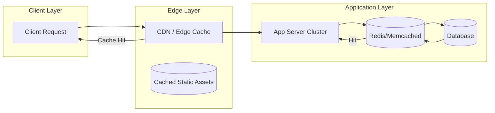

*Caching hierarchy: clients first hit the edge CDN/cache; if the response is cached, it is returned immediately. Otherwise, the request reaches the application, which checks its in-memory/application cache (e.g., Redis) before falling back to the database. This minimizes latency from each layer.*

**Connection pooling**: CDN maintains a pool of database connections to avoid the TCP handshake overhead on every request. Pool size is tuned to match the database's capacity.

**Compression**: Responses are compressed (gzip, zstd) for clients that support it. At the network layer, gRPC uses HPACK header compression.

**Indexing**: Database tables are indexed on frequently queried fields. For CDN, indexes cover **Regional origin shield (mid-tier cache)**
  Purpose: aggregate cache misses so and **Origin server**
  Purpose: source of truth owned by the customer. Responsibili for fast lookups.

**Asynchronous processing**: Non-critical background work (e.g., analytics, cleanup, notifications) is offloaded to message queues and processed asynchronously, keeping the request path fast.

**Resource isolation**: CPU and memory are allocated per service (containers with cgroup limits). This prevents a single misbehaving service from degrading the entire system.

**Metrics for CDN**:

| Metric | Target | How to Measure |
|---|---|---|
| P99 latency | < 1s | Load test with realistic traffic |
| Throughput | 1K RPS | Request rate under peak load |
| Error rate | < 0.1% | 5xx / total requests |
| Cache hit ratio | > 90% | cache_hits / (cache_hits + misses) |
| Resource utilization | < 80% CPU, < 85% memory | Container metrics |

**Real-world implementations**

- **Google's HTTP Load Balancer**: Global load balancing with edge PoPs; routes users to the nearest healthy backend.
- **Cloudflare**: Edge cache with Argo Smart Routing that dynamically routes traffic to avoid congestion.
- **Redis**: Used as an application cache with configurable eviction policies (LRU, LFU, TTL).

### Encryption and Key Management

**What it means**

Encryption and Key Management in CDN ensures that data is protected both at rest (stored on disk) and in transit (moving between services). Key management governs how encryption keys are generated, stored, rotated, and accessed — without proper key management, encryption provides a false sense of security.

**Why it matters**

CDN handles origin server configs, access logs that must be encrypted both at rest and in transit. Scaling CDN to handle increasing load while maintaining data consistency, low latency, and fault tolerance requires careful key management: keys must be rotated regularly, scoped to prevent cross-contamination, and audited for compliance. A single key compromise could expose sensitive data.

**How it works**

**At-rest encryption**: Data stored in **Edge server / PoP (Point of Presence)**
  Purpose: serve content as close to t, **Regional origin shield (mid-tier cache)**
  Purpose: aggregate cache misses so and databases is encrypted using AES-256-GCM. The Data Encryption Key (DEK) is generated per data partition and encrypted with a Key Encryption Key (KEK) managed by a KMS (AWS KMS, GCP KMS, HashiCorp Vault). Keys are regionally scoped — only data belonging to a region can be decrypted by that region's KEK.

**In-transit encryption**: All inter-service communication uses TLS 1.3 or mTLS for service-to-service auth. Cross-region communication of cached content, public metrics uses TLS + optional application-level encryption. origin server configs, access logs is NEVER transmitted in plaintext or across region boundaries.

**Key hierarchy**:
```
Master Key (HSM-backed, KMS-managed)
  └─ KEK (per region, per service)
     └─ DEK (per data partition, rotated every 90 days)
        └─ Data (encrypted with DEK)
```

**Key rotation**: KEKs rotate annually (automatic via KMS); DEKs rotate per object or per 90 days. Applications handle key version headers transparently — a DEK version is stored alongside the encrypted data.

**Cross-region key sharing**: For non-restricted data (cached content, public metrics), a shared key is imported into each region's KMS. Restricted data NEVER uses cross-region keys — each region's KMS holds only that region's keys.

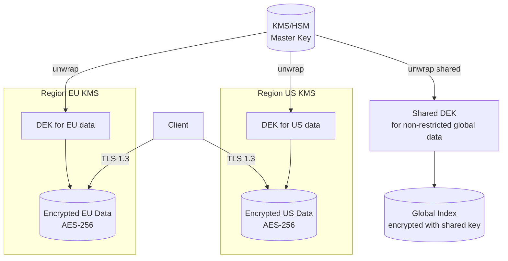

*Encryption key hierarchy: master keys are managed by an HSM-backed KMS and never leave the KMS. Each region has its own KEK. Data encryption keys (DEKs) are generated per partition and encrypted with the regional KEK. Only non-restricted global data uses a shared cross-region key. All client traffic uses TLS 1.3.*

**Java/Spring Boot Implementation**

```java
@Service
@RequiredArgsConstructor
public class DataEncryptionService {

    private final AWSKMS kms;
    @Value("${app.region}")
    private String region;
    @Value("${app.encryption.dek-ttl-minutes:1440}")
    private int dekTtlMinutes;

    private final Map<String, SecretKey> dekCache = new ConcurrentHashMap<>();

    public EncryptedData encrypt(String plaintext, String partitionId) {
        SecretKey dek = getOrCreateDek(partitionId);
        byte[] ciphertext = CryptoUtils.encrypt(plaintext.getBytes(StandardCharsets.UTF_8), dek);
        String dekCiphertext = kms.encrypt(EncryptRequest.builder()
            .keyId("arn:aws:kms:" + region + ":master-key")
            .plaintext(SdkBytes.fromByteArray(dek.getEncoded()))
            .build()).ciphertextBlob().asByteArray();
        return new EncryptedData(ciphertext, dekCiphertext, Instant.now());
    }

    private SecretKey getOrCreateDek(String partitionId) {
        return dekCache.computeIfAbsent(partitionId, id -> {
            try {
                return KeyGenerator.getInstance("AES").generateKey();
            } catch (NoSuchAlgorithmException e) {
                throw new IllegalStateException("Cannot generate DEK", e);
            }
        });
    }
}
```

*Spring Boot encryption service: DEKs are cached per-partition with TTL. Each DEK is encrypted via AWS KMS using a regional master key. The encrypted DEK (ciphertext) is stored alongside the data — only the KMS for that region can decrypt it.*

**Real-world implementations**

- **AWS KMS**: Managed HSM-backed key service; supports automatic key rotation and custom key stores.
- **HashiCorp Vault**: Open-source key management; supports transit encryption (encrypt/decrypt without storing keys).
- **Google Cloud KMS**: Hardware-backed key management with IAM-based access control.

### Authentication and Authorization

**What it means**

Authentication and Authorization (AuthN/AuthZ) in CDN control who can access the system and what they can do. Authentication verifies identity; authorization determines permissions. In a distributed system like CDN, auth must work across multiple nodes while respecting data boundaries — a user authenticated in one region should not have their session data or tokens replicated to regions where it is not permitted.

**Why it matters**

CDN must verify identity at the edge and enforce authorization at every service boundary. origin server configs, access logs must be protected — only users with appropriate roles should access it. At the same time, cached content, public metrics data should be accessible to a wider audience with minimal friction.

**How it works**

**Authentication (who are you?)**:
- **JWT tokens**: Users authenticate through their home region's identity provider. The region returns a JWT (JSON Web Token) signed by a regional signing key. Tokens include claims like `iss` (issuer region), `sub` (subject/user ID), `home_region`, `roles`, and `exp` (expiry). Tokens are scoped per region — a token issued by region A cannot access restricted data in region B.
- **mTLS for service-to-service**: Internal services authenticate each other using mutual TLS certificates issued by a per-region Certificate Authority (CA). No shared secrets cross region boundaries.
- **Session management**: Sessions are stored regionally (Redis) and never replicated cross-region for restricted data. Session IDs are opaque UUIDs; the session store maps session ID → user context.

**Authorization (what can you do?)**:
- **RBAC (Role-Based Access Control)**: Users are assigned roles per region. Common roles: `region_admin` (full access to region data), `auditor` (read-only audit), `viewer` (read public data only). Roles are stored in the regional database and cached locally for sub-1ms lookups.
- **ABAC (Attribute-Based Access Control)**: Fine-grained permissions based on attributes (e.g., `home_region == request_region AND role == admin`). This allows expressing complex policies like "users can only access restricted data in their home region."
- **Resource-level authorization**: Each request is checked against an ACL (Access Control List) that specifies which roles can access which resources. For CDN, restricted resources require the `admin` role + matching region.

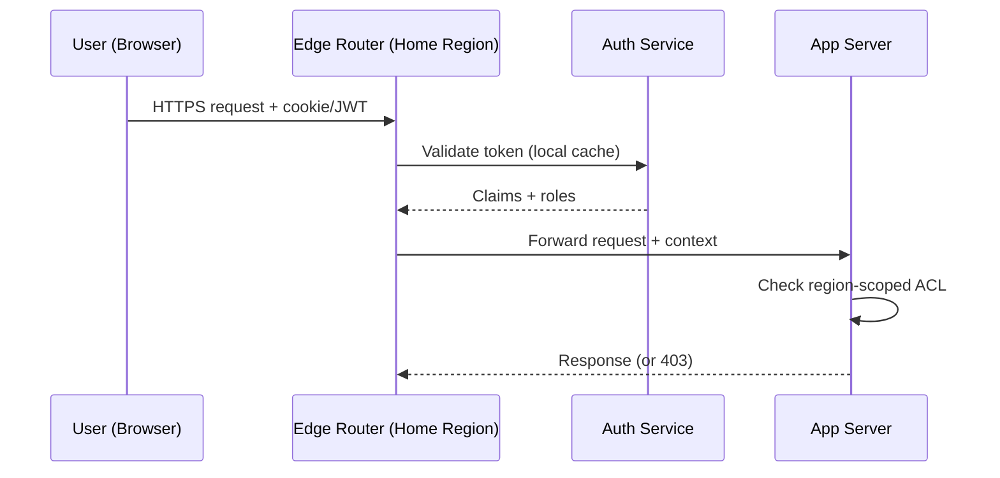

*Authentication flow: the user's token is validated by the regional auth service (claims cached locally). The edge router forwards the request with the security context. Each app server checks the region-scoped ACL before accessing restricted data.*

**Java/Spring Boot Implementation**

```java
@Service
@RequiredArgsConstructor
public class AuthorizationService {

    private final UserTokenRepository tokenRepository;
    @Value("${app.region}")
    private String currentRegion;

    public boolean canAccessResource(String userId, String resourceRegion,
                                     String action, JWTClaims claims) {
        String userHomeRegion = claims.getStringClaim("home_region");
        List<String> roles = claims.getStringListClaim("roles");

        if (!roles.contains(action)) {
            return false;
        }

        if (resourceRegion.equals(userHomeRegion)) {
            return true;
        }

        if (resourceRegion.equals("global")) {
            return roles.contains("global_reader");
        }

        return false;
    }
}

@RestController
@RequiredArgsConstructor
@RequestMapping("/api/v1")
public class RegionController {
    private final AuthorizationService authService;

    @GetMapping("/data/{region}/profile")
    public ResponseEntity<?> getProfile(
            @PathVariable String region,
            @RequestHeader("Authorization") String token) {
        JWTClaims claims = JwtUtils.parseAndValidate(token, currentRegion);

        if (!authService.canAccessResource(
                claims.getStringClaim("sub"), region, "read", claims)) {
            return ResponseEntity.status(HttpStatus.FORBIDDEN).build();
        }

        return ResponseEntity.ok(profileService.getByRegion(region));
    }
}
```

*Spring Boot authorization service: checks both the user's role and whether the requested resource violates region boundaries. The `canAccessResource` method returns false if a user from region EU tries to access restricted data in region US.*

**Real-world implementations**

- **Auth0**: JWT-based authentication with regional endpoints; supports custom rules for ABAC.
- **Okta**: Multi-region identity management with adaptive MFA and ThreatInsight for anomaly detection.
- **AWS Cognito**: Regional user pools with IAM integration; tokens are region-scoped by default.

### Security Threats and Mitigations

**What it means**

Security Threats and Mitigations catalog the attack surface of CDN, the most likely threats, and the corresponding defenses. Every distributed system has unique threat vectors — CDN is no exception.

**Why it matters**

CDN handles origin server configs, access logs that attackers might target. Scaling CDN to handle increasing load while maintaining data consistency, low latency, and fault tolerance expands the attack surface: more nodes, more network paths, more failure modes. Without proper threat modeling, a single vulnerability could expose sensitive data across the entire system.

**Threat model**:

| Threat | Likelihood | Impact | Mitigation |
|---|---|---|---|
| Data exfiltration (cross-region) | High | Critical | Region-scoped keys, no cross-region replication of restricted data |
| Man-in-the-middle (inter-service) | Medium | High | mTLS between all services |
| Replay attacks | Medium | High | Token expiry + nonce |
| DDoS at the edge | High | High | Rate limiting + edge filtering (Cloudflare, AWS Shield) |
| PII leakage in logs | High | High | PII redaction + field-level access control |
| Session hijacking | Medium | Medium | Short-lived tokens + IP binding |
| Privilege escalation | Low | Critical | Least-privilege RBAC + audit logs |
| Cache poisoning | Low | Medium | Cache invalidation on write + signed cache keys |

**How it works**

**Data exfiltration prevention**: CDN enforces data residency by design — origin server configs, access logs is never replicated cross-region. The replication layer checks a data classification label before allowing cross-region copy. A database-level policy (e.g., PostgreSQL RLS) also blocks cross-region queries for restricted partitions.

**mTLS enforcement**: All service-to-service communication uses mutual TLS. Certificates are issued by a per-region CA and rotated every 30 days. Services must present a valid certificate to communicate — no plaintext connections are allowed.

**PII redaction**: Application logs are scanned for PII patterns (email, phone, credit card) using an automated redaction layer (e.g., AWS Macie, Google DLP). cached content, public metrics is logged freely; restricted fields are masked or dropped before logging.

```mermaid
graph TD
    subgraph "Threat Surface"
        Client[Client]
        Edge[Edge Router / WAF]
        App[App Server]
        DB[(Database)]
        Cache[(Cache)]
        Logs[Log Store]
    end

    Client -->|HTTPS| Edge
    Edge -->|mTLS| App
    App -->|mTLS| DB
    App -->|Read| Cache
    App -->|Write| DB
    App -->|Log| Logs

    subgraph "Mitigations"
        WAF[AWS WAF /<br/>Cloudflare]
        DLP[PII Redaction<br/>(Macie/DLP)]
        FIM[File Integrity<br/>Monitoring]
    end

    Edge -.-> WAF
    Logs -.-> DLP
    DB -.-> FIM
```

*Threat mitigation diagram: the WAF at the edge blocks DDoS and injection attacks. mTLS protects all service-to-service communication. PII redaction scans logs before storage. File integrity monitoring alerts on database tampering.*

**Audit trail**: All security-relevant events (auth, data access, config changes) are written to an append-only audit log with cryptographic integrity (HMAC per entry). The log covers origin server configs, access logs access — who accessed what, when, and from where.

**Real-world implementations**

- **Cloudflare**: Zero-trust model (All Connections to All Networks) with mTLS everywhere; uses GeoIP blocking and rate limiting for DDoS mitigation.
- **Google BeyondCorp**: Zero-trust network security model; all access is authenticated and authorized at the request level.

### Observability and Logging

**What it means**

Observability and Logging in CDN provide visibility into system behavior through three pillars: **metrics** (aggregates and counters), **logs** (structured event records), and **traces** (distributed request timelines). Together, these signals allow operators to debug issues, detect anomalies, and verify SLA compliance.

**Why it matters**

Distributed systems like CDN are inherently opaque — failures can cascade across services in unexpected ways. Without good observability, a single slow dependency can cause widespread timeouts that are nearly impossible to diagnose. Scaling CDN to handle increasing load while maintaining data consistency, low latency, and fault tolerance makes observability even more critical: operators need to see cross-region latency, regional failures, and data-residency violations.

**How it works**

**Metrics**: CDN instruments every service with Prometheus-style metrics:
- **Request rate, error rate, duration (the "RED" metrics)**: Tracks per-endpoint HTTP latency and error counts.
- **System metrics**: CPU, memory, disk I/O, network throughput per node.
- **Business metrics**: For CDN, this includes metrics like "**Regional origin shield (mid-tier cache)**
  Purpose: aggregate cache misses so fill rate" and "reservation conflict rate".

Metrics are aggregated in a time-series database (Prometheus, VictoriaMetrics) and visualized in Grafana dashboards with alerts via PagerDuty.

**Logs**: CDN uses structured logging (JSON format) with standardized fields:
- `timestamp`: ISO 8601 UTC
- `level`: DEBUG, INFO, WARN, ERROR
- `service`: originating service name
- `trace_id`: distributed trace identifier (for correlation)
- `span_id`: current operation span
- `region`: the region that processed the request
- `data_class`: RESTRICTED or NON_RESTRICTED

origin server configs, access logs access is logged with full context (user, action, resource). cached content, public metrics logs are aggregated and may have reduced retention.

**Distributed tracing**: Every request is assigned a trace ID at the edge. The trace propagates through all downstream services via HTTP headers. A tracing backend (Jaeger, Tempo, Zipkin) reconstructs the full request timeline, showing latency at each hop. For CDN, traces include region boundaries — a cross-region call is annotated as such.

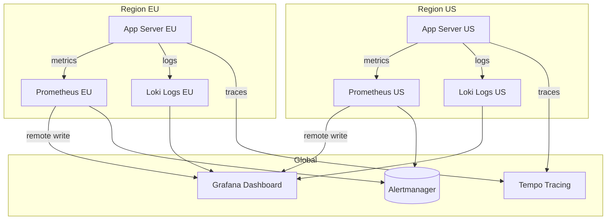

*Observability architecture: each region runs its own Prometheus (metrics) and Loki (logs) instances. A global Grafana instance queries all regional backends. Traces are collected centrally in Tempo. Alerts fire from each region's Prometheus to Alertmanager.*

**Alerting**: CDN defines SLO-based alerts:
- **Latency**: P99 > 1s for 5 minutes → page.
- **Error rate**: > 1% for 10 minutes → page.
- **Availability**: < 99.5% for 15 minutes → page.
- **Data residency violation**: any restricted data detected outside its region → critical page.

**Java/Spring Boot Implementation**

```java
@Component
@RequiredArgsConstructor
@Slf4j
public class ObservabilityContext {

    @Value("${app.region}")
    private String region;

    public void logAccess(String userId, String resource, String action,
                          boolean restricted) {
        log.info("access_event userId={} resource={} action={} region={} data_class={}",
            userId, resource, action, region, restricted ? "RESTRICTED" : "NON_RESTRICTED");
    }
}

@RestController
@RequiredArgsConstructor
@Slf4j
public class ApiController {
    private final ObservabilityContext obs;
    private final UserService userService;

    @GetMapping("/api/v1/profile")
    public ResponseEntity<ProfileResponse> getProfile(
            @AuthenticationPrincipal UserDetails user) {
        String traceId = MDC.get("traceId");
        long start = System.nanoTime();

        try {
            ProfileResponse response = userService.getProfile(user.getId());
            obs.logAccess(user.getId(), "profile", "read", true);

            return ResponseEntity.ok(response);
        } finally {
            long durationMs = (System.nanoTime() - start) / 1_000_000;
            log.info("profile_read traceId={} latencyMs={} region={}",
                traceId, durationMs, obs.region);
        }
    }
}
```

*Spring Boot observability: the `ObservabilityContext` logs structured access events with data classification. The controller records latency and trace ID for every request, enabling SLO-based alerting.*

**Real-world implementations**

- **Netflix OSS (Atlas + Zipkin + Servo)**: Metrics via Atlas, traces via Zipkin, instrumented via Servo. Scales to over 700 billion requests/day.
- **Google SRE Workbook**: Comprehensive observability with SLI/SLO/SLI definition; uses Borgmon for metrics and Dapper for tracing.
- **AWS Observability**: CloudWatch for metrics, X-Ray for tracing, CloudWatch Logs for structured logs.

### Real-World Implementations

**CDN in production**

- **CDN platforms**: widely used cdn platform

**Key takeaways**

- Scalability patterns proven in production at scale
- Common pitfalls and how to avoid them
- Integration with existing infrastructure and monitoring

### Architectural Patterns

**Patterns relevant to CDN**

- **Layered/Clean Architecture**: Separates business logic from infrastructure concerns, enabling independent testing and maintenance.
- **Database-per-Service**: Each service manages its own data store, providing isolation but complicating cross-service queries.
- **Event-Driven Architecture**: Decouples services through asynchronous events; enables loose coupling and independent scaling.
- **CQRS (Command Query Responsibility Segregation)**: Separates read and write models for independent optimization; read models can be denormalized for query performance.
- **Saga Pattern**: Manages distributed transactions through a sequence of local transactions with compensating actions on failure.

**Pattern trade-offs**

- Layered architecture is simple to implement but can create tight coupling between layers over time.
- Database-per-service provides schema independence but requires careful design of cross-service consistency.
- Event-driven architecture enables loose coupling but introduces eventual consistency and debugging complexity.
- CQRS optimizes read/write paths independently but doubles the number of data models to maintain.
- Sagas handle long-running transactions but require idempotent compensations and careful state management.

### Java and Spring Boot Implementation Guide

This section shows the two things a Java backend engineer actually implements around a CDN: **emitting correct cache headers from the origin** and **calling the CDN's purge API when data changes**. Spring Boot 3.x, Java 17+, constructor injection, and `@Value` configuration throughout.

#### 1. Serving cacheable responses with Cache-Control from a controller

```java
import org.springframework.beans.factory.annotation.Value;
import org.springframework.http.CacheControl;
import org.springframework.http.HttpHeaders;
import org.springframework.http.MediaType;
import org.springframework.http.ResponseEntity;
import org.springframework.web.bind.annotation.GetMapping;
import org.springframework.web.bind.annotation.PathVariable;
import org.springframework.web.bind.annotation.RestController;

import java.time.Duration;

@RestController
public class AssetController {

    private final Duration staticAssetTtl;
    private final Duration productImageTtl;
    private final AssetStore assetStore;

    public AssetController(
            @Value("${cdn.static-asset-ttl-seconds:31536000}") long staticAssetTtlSeconds,
            @Value("${cdn.product-image-ttl-seconds:86400}") long productImageTtlSeconds,
            AssetStore assetStore) {
        this.staticAssetTtl = Duration.ofSeconds(staticAssetTtlSeconds);
        this.productImageTtl = Duration.ofSeconds(productImageTtlSeconds);
        this.assetStore = assetStore;
    }

    // Versioned (fingerprinted) build artifacts: safe to cache for a year.
    @GetMapping("/assets/{version}/{fileName}")
    public ResponseEntity<byte[]> getStaticAsset(@PathVariable String version,
                                                 @PathVariable String fileName) {
        byte[] body = assetStore.load("/assets/" + version + "/" + fileName);
        return ResponseEntity.ok()
            .contentType(MediaType.APPLICATION_OCTET_STREAM)
            // max-age=1year + stale-while-revalidate lets the edge refresh in the background
            .cacheControl(CacheControl.maxAge(staticAssetTtl)
                .cachePublic()
                .staleWhileRevalidate(Duration.ofMinutes(5)))
            // explicit immutable flag: browsers won't even revalidate on reload
            .header(HttpHeaders.CACHE_CONTROL,
                "public, max-age=" + staticAssetTtl.toSeconds() + ", immutable")
            .eTag("\"" + version + "\"")
            .body(body);
    }

    // Product images: shorter TTL, tagged for purge-by-tag invalidation.
    @GetMapping("/products/{productId}/image")
    public ResponseEntity<byte[]> getProductImage(@PathVariable long productId) {
        Asset asset = assetStore.loadProductImage(productId);
        return ResponseEntity.ok()
            .contentType(MediaType.IMAGE_JPEG)
            .cacheControl(CacheControl.maxAge(productImageTtl).cachePublic())
            .eTag(asset.eTag())
            // Surrogate-Key is how Fastly-style CDNs implement tag-based purge
            .header("Surrogate-Key", "product-" + productId)
            .body(asset.bytes());
    }
}
```

Supporting types:

```java
public interface AssetStore {
    byte[] load(String path);
    Asset loadProductImage(long productId);
}

public record Asset(byte[] bytes, String eTag) {}
```

**Why this matters**: the CDN is policy-driven - it caches exactly what your origin's headers tell it to. `Cache-Control: public, max-age=...` is the contract; the ETag enables cheap revalidation; `Surrogate-Key` connects the response to the purge API. Configuration values are externalized with `@Value` so TTL changes are deployments of config, not code.

#### 2. Conditional requests and 304 responses

```java
import org.springframework.http.HttpHeaders;
import org.springframework.http.HttpStatus;
import org.springframework.http.ResponseEntity;
import org.springframework.web.bind.annotation.GetMapping;
import org.springframework.web.bind.annotation.PathVariable;
import org.springframework.web.bind.annotation.RequestHeader;
import org.springframework.web.bind.annotation.RestController;

import java.time.Duration;

@RestController
public class ProductMetaController {

    private final ProductCatalog catalog;

    public ProductMetaController(ProductCatalog catalog) {
        this.catalog = catalog;
    }

    @GetMapping("/products/{productId}/meta")
    public ResponseEntity<ProductMeta> getProductMeta(
            @PathVariable long productId,
            @RequestHeader(value = HttpHeaders.IF_NONE_MATCH, required = false) String ifNoneMatch) {

        ProductMeta meta = catalog.productMeta(productId);
        String eTag = "\"" + meta.version() + "\"";

        // Client (or edge revalidating) already has this version: save the body.
        if (eTag.equals(ifNoneMatch)) {
            return ResponseEntity.status(HttpStatus.NOT_MODIFIED).eTag(eTag).build();
        }

        return ResponseEntity.ok()
            .eTag(eTag)
            .cacheControl("public, max-age=60, stale-while-revalidate=30")
            .body(meta);
    }

    public record ProductMeta(long productId, String name, long version) {}
}
```

**How it works**: when a cached entry goes stale, the edge revalidates with `If-None-Match`. A matching version returns `304 Not Modified` - a round trip but no payload - which keeps hit-ratio economics even for frequently changing data.

#### 3. CDN invalidation client

```java
import org.springframework.beans.factory.annotation.Value;
import org.springframework.http.HttpHeaders;
import org.springframework.http.MediaType;
import org.springframework.stereotype.Service;
import org.springframework.web.client.RestClient;

import java.util.List;

@Service
public class CdnInvalidationClient {

    private final RestClient restClient;
    private final String zoneId;

    public CdnInvalidationClient(
            RestClient.Builder restClientBuilder,
            @Value("${cdn.provider.base-url}") String baseUrl,
            @Value("${cdn.provider.api-key}") String apiKey,
            @Value("${cdn.provider.zone-id}") String zoneId) {
        this.zoneId = zoneId;
        this.restClient = restClientBuilder
            .baseUrl(baseUrl)
            .defaultHeader(HttpHeaders.AUTHORIZATION, "Bearer " + apiKey)
            .defaultHeader(HttpHeaders.CONTENT_TYPE, MediaType.APPLICATION_JSON_VALUE)
            .build();
    }

    public PurgeResult purgeUrls(List<String> urls) {
        return restClient.post()
            .uri("/v1/zones/{zoneId}/purge", zoneId)
            .body(new PurgeRequest(urls, null))
            .retrieve()
            .body(PurgeResult.class);
    }

    public PurgeResult purgeByTag(String tag) {
        return restClient.post()
            .uri("/v1/zones/{zoneId}/purge", zoneId)
            .body(new PurgeRequest(null, List.of(tag)))
            .retrieve()
            .body(PurgeResult.class);
    }

    public record PurgeRequest(List<String> urls, List<String> tags) {}

    public record PurgeResult(String purgeId, String status, int estimatedPropagationSeconds) {}
}
```

Wiring it into a business operation - invalidate on update, after the commit:

```java
import org.springframework.stereotype.Service;
import org.springframework.transaction.support.TransactionSynchronization;
import org.springframework.transaction.support.TransactionSynchronizationManager;

@Service
public class ProductService {

    private final ProductRepository repository;
    private final CdnInvalidationClient invalidationClient;

    public ProductService(ProductRepository repository, CdnInvalidationClient invalidationClient) {
        this.repository = repository;
        this.invalidationClient = invalidationClient;
    }

    public void updateProduct(ProductUpdate update) {
        repository.save(update.toEntity());

        // Purge only after the DB commit succeeds, otherwise the edge may
        // re-cache stale data read before the commit.
        TransactionSynchronizationManager.registerSynchronization(
            new TransactionSynchronization() {
                @Override
                public void afterCommit() {
                    invalidationClient.purgeByTag("product-" + update.id());
                }
            });
    }
}
```

**Code walkthrough**: `CdnInvalidationClient` is a single `@Service` bean built on `RestClient` (the modern Spring Boot 3.2+ synchronous HTTP client). The base URL, API key, and zone come from configuration via `@Value` - never hardcode provider credentials. `purgeByTag` is preferred over URL lists because one tag covers every asset stamped with that `Surrogate-Key`. Purging `afterCommit` avoids a classic race: purge fires, the edge re-fetches, but the transaction has not committed, so the edge re-caches the *old* data.

**Interview questions and answers**

- **Q: Why externalize TTLs with `@Value` instead of constants?**
  **A:** TTL tuning is an operational decision that changes with traffic and incidents; config-driven TTLs avoid code redeploys and let you shorten TTLs globally during a stale-content incident.

- **Q: Why purge after commit rather than before the write?**
  **A:** A purge triggers re-fetch on next access; if the write has not committed, the edge re-caches pre-write data and holds it until the next TTL/purge - a self-inflicted stale-read window.

---

### Interview Questions and Answers

**Beginner**

1. **Q: What problem does a CDN solve?**
   **A:** Latency (speed-of-light limits on long round trips), origin scalability (finite bandwidth/CPU), availability (single-region failure), and transit cost. It does so by caching content on edge servers near users and routing each user to the nearest PoP.

2. **Q: What is the difference between a CDN edge server and an origin server?**
   **A:** The origin is the customer-owned source of truth that generates or stores content. Edge servers are CDN-owned caches that serve copies. Edges only contact the origin (via a shield) on cache misses or revalidation.

3. **Q: What is a cache hit ratio and why does it matter?**
   **A:** Hits / (hits + misses). It is the primary CDN health metric: at 95% the origin handles 1/20th of traffic; at 99%, 1/100th. A small hit-ratio drop translates directly into large origin load increases.

4. **Q: What does `Cache-Control: public, max-age=3600` mean?**
   **A:** Any cache (including shared CDN caches) may store this response and serve it for 3,600 seconds without contacting the origin. Contrast `private` (browser-only) and `no-store` (never cache).

**Intermediate**

5. **Q: Explain DNS-based routing vs anycast for CDN traffic steering.**
   **A:** DNS routing returns a per-user PoP IP from the authoritative DNS based on resolver geolocation; it is flexible but adds DNS lookup latency and sees the resolver, not the client. Anycast advertises the same IP from all PoPs via BGP so routing itself picks the nearest PoP; it is faster and self-healing on failure, but BGP "nearest" is policy-driven, not geographic. Production CDNs combine both.

6. **Q: What is an origin shield and why use one?**
   **A:** A regional mid-tier cache that edges forward misses to. If 15 PoPs per region each missed the same object independently, the origin would see 15 fetches; with a shield it sees one. It also holds a larger, warmer cache for mid-tail content.

7. **Q: Pull zone vs push zone - when do you choose each?**
   **A:** Pull zones fetch lazily on first miss - zero ops, great for large unpredictable catalogs, but first requests per region pay origin latency and miss storms are possible. Push zones replicate content proactively - used for known-hot releases (game patches, premieres) where first-request performance must be guaranteed, at the cost of storage at every PoP and replication management.

8. **Q: How does a 304 Not Modified work and why is it useful for CDNs?**
   **A:** A stale cached entry is revalidated with `If-None-Match: <etag>`. If the origin version matches, it replies 304 with no body. The edge refreshes its TTL without re-downloading the payload - cheap freshness for frequently changing content.

9. **Q: What is request coalescing and what problem does it solve?**
   **A:** When many concurrent requests miss the same key, only one upstream fetch is made and the others wait for it. It prevents cache stampede/thundering herd when a hot object expires or during live events where thousands of clients request the same manifest simultaneously.

**Advanced**

10. **Q: Walk through exactly what happens on a CDN cache miss.**
    **A:** Client resolves the CDN hostname (anycast or DNS-steered) to a PoP → TLS terminates at the edge → the edge normalizes the cache key (strip tracking params, apply Vary) → RAM then SSD lookup misses → the edge joins or starts a single-flight fetch to its regional shield → the shield misses → one fetch to the origin → the origin responds with cache headers → each tier stores per policy → the client gets the response with `X-Cache: MISS`. Subsequent identical keys are `HIT`s from RAM in microseconds.

11. **Q: How would you design cache invalidation for a product catalog?**
    **A:** Three layers: fingerprinted static assets get year-long TTLs and are never purged; product images/data get moderate TTLs (hours) plus surrogate tags (`product-123`) stamped on every related response; on product update, the application calls purge-by-tag after DB commit. Emergency URL purge exists but is the exception. This keeps invalidation O(1) API calls per business event.

12. **Q: What causes cache poisoning and how do you prevent it?**
    **A:** If an attacker can influence a response cached under a shared key (via unkeyed headers, reflection, or fat-get ambiguities), that response is served to everyone. Prevention: strict cache-key normalization, honoring `Vary` correctly, never caching responses with `Set-Cookie` or authorization data, and signing private content URLs.

13. **Q: Why is `stale-if-error` valuable and what are its risks?**
    **A:** It lets the edge serve expired content when the origin returns 5xx or times out, converting origin outages into staleness instead of downtime - huge for availability. Risks: serving very old content during long outages, and masking origin problems from users (monitoring must catch them instead).

**Senior / system design**

14. **Q: Design a CDN from scratch. What are the hardest parts?**
    **A:** Sketch: anycast + authoritative DNS steering → PoPs with L4 LB and consistently-hashed cache nodes (RAM/SSD tiers) → regional shields → origin; control plane for config/purge fan-out; analytics pipeline. Hardest parts: (1) global cache invalidation in seconds without a purge storm collapsing hit ratio; (2) steering correctness under BGP policy quirks and PoP overload; (3) per-customer isolation and TLS key management across thousands of tenants on shared hardware; (4) eviction policy for Zipf-distributed content with scan pollution; (5) graceful degradation - every tier must fail open toward serving.

15. **Q: Your cache hit ratio suddenly drops from 96% to 71%. How do you investigate?**
    **A:** Check for recent deploys that changed URLs or added query parameters (key fragmentation - the classic cause), a change in origin headers (someone shipping `max-age=0` or `private`), a purge accidentally run in broad scope, a traffic-shift to a new region with cold caches, or eviction pressure from a large new content class. Per-key-class hit-ratio dashboards isolate which content type degraded; edge logs comparing `X-Cache` ratios per PoP isolate geography.

16. **Q: When is a CDN the wrong answer?**
    **A:** Highly personalized uncacheable responses (gains shrink to TLS termination and routing - consider edge compute or multi-region origins instead); strong-consistency content (caching fights correctness); single-region small audiences (complexity without benefit); and extreme scale with predictable traffic where owning the infrastructure (Netflix Open Connect) is cheaper than paying per-GB.

17. **Q: How do CDNs terminate TLS for millions of customer domains securely?**
    **A:** Per-zone certificates (ACME-issued, automatically renewed) selected via SNI at handshake time; private keys in hardened, access-controlled key stores (often with keyless-SSL style architectures where keys never leave a dedicated key server); OCSP stapling; and TLS 1.3 with session resumption for 0-RTT reconnects. The edge necessarily sees plaintext, so node hardening and tenant isolation are the security crux.

18. **Q: How would you handle a flash crowd for a live event?**
    **A:** Short TTLs (1-2 s) on the live manifest with request coalescing so each PoP makes at most one origin fetch per TTL window; immutable segments cached everywhere; pre-warmed PoPs near expected audience concentration; shields absorbing regional aggregation; and capacity headroom from anycast spreading load. Follow-up: the bottleneck usually becomes last-mile ISP capacity, which is why Netflix puts appliances inside ISPs.
