# Build a game of Chess

## Blogs and websites

## Medium

## Youtube

- [Lichess founder Thibault Duplessis lectures on Lichess (2017)](https://www.youtube.com/watch?v=LZgyVadkgmI)
- [How 1 Software Engineer Outperforms 138 - Lichess Case Study](https://www.youtube.com/watch?v=7VSVfQcaxFY)

## Theory

### Topics Covered

1. [Introduction and Problem Statement](#introduction-and-problem-statement)
2. [Functional Requirements](#functional-requirements)
3. [Non-Functional Requirements](#non-functional-requirements)
4. [Characteristics](#characteristics)
5. [Components](#components)
6. [Architectural Patterns](#architectural-patterns)
7. [Benefits](#benefits)
8. [Pros](#pros)
9. [Cons](#cons)
10. [Challenges](#challenges)
11. [Best Practices](#best-practices)
12. [When to Use This Design](#when-to-use-this-design)
13. [Use Cases](#use-cases)
14. [Data Model and API](#data-model-and-api)
15. [High-Level Design](#high-level-design)
16. [Game Lifecycle State Machine](#game-lifecycle-state-machine)
17. [Move Sequence (online play)](#move-sequence-online-play)
18. [Deep Dive: Rules Engine, Check Detection, and Special Moves](#deep-dive-rules-engine-check-detection-and-special-moves)
19. [From Local Game to Online Platform](#from-local-game-to-online-platform)
20. [Replication Strategies](#replication-strategies)
21. [Failure Detection and Membership](#failure-detection-and-membership)
22. [High Availability and Scalability](#high-availability-and-scalability)
23. [Performance and Optimization](#performance-and-optimization)
24. [Encryption and Key Management](#encryption-and-key-management)
25. [Authentication and Authorization](#authentication-and-authorization)
26. [Security Threats and Mitigations](#security-threats-and-mitigations)
27. [Observability and Logging](#observability-and-logging)
28. [Real-World Implementations](#real-world-implementations)
29. [Java and Spring Boot Implementation Guide](#java-and-spring-boot-implementation-guide)
30. [Interview Questions and Answers](#interview-questions-and-answers)

---
---
---

### Introduction and Problem Statement

Design the game of chess. Like the vending machine, this is a classic low-level / object-oriented design problem: it tests whether you can model a rich domain (board, pieces, movement rules, game state) cleanly, separate rules from mechanics, and handle genuinely tricky edge cases (check, checkmate, stalemate, castling, en passant, promotion) without the code collapsing into special cases.

The problem has two natural halves, and a senior answer addresses both:

1. **The rules engine** (low-level design): given a board and a move, is it legal? What is the resulting position? Is the game over? This half is pure, deterministic, and must be exhaustively testable.
2. **The platform** (high-level design): two humans playing over the internet need matchmaking, real-time move delivery, server-authoritative clocks, reconnect handling, persistence, and rating updates. This half is a distributed-systems exercise — Lichess and Chess.com are the reference implementations.

**What problem does it solve?**

For the rules engine: chess has simple piece movements but fiendish *interaction* rules — a move can be geometrically legal yet illegal because it leaves your own king in check; castling depends on the entire move history; en passant depends on the immediately previous move. The problem is structuring code so these cross-cutting rules compose cleanly.

For the platform: chess is a real-time, turn-based, adversarial system. The server must be the single authority on position, turn, and clock — trusting clients means cheating. It must also be extremely cheap per game, because a platform like Lichess serves millions of games on a tiny budget.

**Real-life use cases**

- **Online chess platforms**: Lichess (open source, nonprofit) and Chess.com both run the architecture described here.
- **Over-the-board digital recording**: electronic tournament boards (DGT) that detect moves and publish live games — the same move-validation engine, different input device.
- **Chess engines and analysis**: Stockfish consumes exactly the position representation and legal-move generation this design produces.
- **Turn-based games generally**: Go, checkers, shogi, and turn-based strategy games share 90% of this architecture; chess is the canonical teaching example.

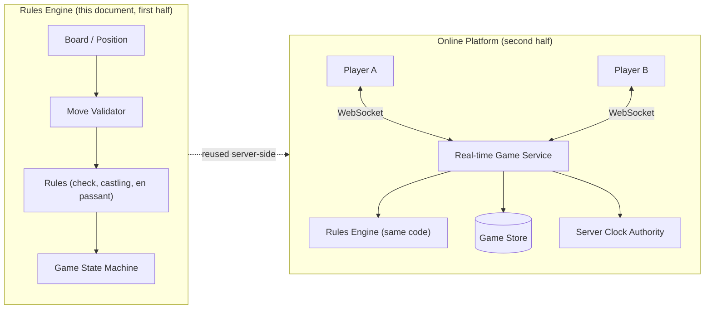

The key architectural insight is in the diagram: the same rules engine that a junior interview stops at becomes a *library* inside the real-time service in the senior answer. Nothing about board representation changes when you add the network.

---

### Functional Requirements

**Core game (rules engine)**

1. Represent a chess position: 8×8 board, pieces, side to move, castling rights, en passant target, half-move clock, full-move number.
2. Generate all pseudo-legal moves for the side to move (moves that follow piece movement geometry).
3. Validate full legality: reject moves that leave the moving side's king in check.
4. Apply a move to produce a new position, handling captures, castling (moving both king and rook), en passant capture, and promotion.
5. Detect game-ending conditions: checkmate, stalemate, fifty-move rule, threefold repetition, insufficient material.
6. Support undo (takeback) by restoring the previous position.
7. Load and save positions in a standard notation (FEN); export games in PGN.

**Platform (online play)**

8. Matchmaking: pair players of similar rating for a requested time control.
9. Real-time move sync: deliver moves to both players within ~100 ms over WebSocket.
10. Server-authoritative clocks: the server owns remaining time for both sides; flagging (time forfeit) is decided by the server.
11. Reconnect handling: a player who disconnects can rejoin and receive the full current state.
12. Persistence: every game is stored move-by-move, retrievable later for replay and analysis.
13. Rating: update Elo/Glicko ratings after rated games end.

### Non-Functional Requirements

1. **Correctness (absolute)**: the rules engine must never accept an illegal move or misdeclare a game result. Chess rules are fully specified, so correctness is verifiable — engines use perft (move-generation counts) against known reference values.
2. **Latency**: move validation under 1 ms per move (rules engines achieve microseconds); platform move delivery p99 under 100 ms.
3. **Availability**: 99.9%+ for the real-time service; a server restart must not lose or corrupt in-progress games (games are persisted after every move).
4. **Scalability**: tens of thousands of concurrent games per node is the design target — chess games are tiny state, so per-game memory must be small (a few KB).
5. **Anti-cheat integrity**: clients are untrusted; all validation and timing happens server-side.
6. **Durability**: a completed game is permanent; an in-progress game survives server restarts.
7. **Fairness**: clock management must be network-fair — a player on a slow connection must not lose wall-clock time to network latency (this is what "lag compensation" is for).

---

### Characteristics

- **Pure, deterministic core**
  What it means: the rules engine is a pure function of (position, move) → position — no I/O, no randomness, no clocks. Why it matters: purity makes the hardest part of the system (the rules) trivially testable, replayable, and reusable in any context (server, client, analysis). How it works: all inputs (position, history) are explicit parameters; undo is just keeping previous immutable positions or inverse operations. Example: the exact same validation code runs in the Lichess server, in the browser for pre-move legality hints, and in analysis tools.

- **Immutable value semantics**
  What it means: positions are values; applying a move produces a new position rather than mutating the old one (or mutations are always paired with exact inverse data). Why it matters: undo, replay, threefold-repetition detection, and speculation ("would this move leave my king in check?") all become cheap and safe. How it works: either persistent/immutable structures, or the classical make/unmake pattern where every move carries its own undo record (captured piece, prior castling rights, prior en passant square). Example: make/unmake is how engines evaluate millions of positions per second without allocation.

- **History-dependent rules**
  What it means: legality is not a function of the board alone — castling depends on whether king/rook ever moved; en passant depends on the immediately previous move; the fifty-move rule depends on move counts; repetition depends on all prior positions. Why it matters: this is the single biggest source of bugs and the most common interview trap — a `Piece[][]` alone is *insufficient state*. How it works: the position object explicitly carries castling rights, en passant square, half-move clock, and a position-history list. Example: FEN notation encodes exactly this — `r3k2r/8/8/8/8/8/8/R3K2R w KQkq - 0 1` records castling rights and en passant alongside piece placement.

- **Two-phase legality (pseudo-legal then legal)**
  What it means: move generation happens in two passes — first geometric moves per piece, then filtering out moves that leave the king in check. Why it matters: conflating the two produces recursive messes (to know if a move is legal you must apply it, which requires knowing if it is legal…). How it works: generate pseudo-legal moves; for each, make the move, test "is my king attacked?", unmake. Example: a pinned knight generates geometric moves, but every one of them is filtered because moving it exposes the king to the pinning bishop.

- **Server-authoritative adversarial design**
  What it means: in the platform half, the client is treated as hostile — it may send illegal moves, claim extra time, or forge results. Why it matters: cheating is a real, existential problem for chess platforms (engine assistance alone is a multi-million-dollar detection effort). How it works: the server revalidates every move with the same rules engine, owns the clock, and decides all results; clients merely render and propose. Example: Lichess's servers validate every move; the browser's local validation exists only for UX (instant feedback), never for authority.

---

### Components

**Rules engine components**

- **Board / Position**
  Purpose: represents everything about a game state. Responsibilities: piece placement, side to move, castling rights, en passant square, half-move/full-move counters, position hash. How it works: either an object-oriented `Piece[64]` mailbox array (simple, best for interviews) or bitboards — one 64-bit integer per piece type (fast, best for engines). Relationships: the input and output of the move validator. Real-world example: Stockfish uses bitboards; most interview solutions and the python-chess library use mailbox-style structures.

- **Piece (class hierarchy)**
  Purpose: encapsulates movement geometry per piece type. Responsibilities: enumerate pseudo-legal moves from a square given a board; expose type and color. How it works: sliding pieces (rook, bishop, queen) walk directions until blocked; leapers (knight, king) use offset tables; pawns have direction-dependent, capture-vs-push rules. Relationships: used by the move generator; polymorphism replaces switch-on-type. Real-world example: the classic OOP interview answer — `abstract class Piece { List<Move> pseudoLegalMoves(Board b, Square s) }`.

- **Move validator / Rules engine**
  Purpose: the legality oracle. Responsibilities: generate pseudo-legal moves, filter for king safety, detect check/checkmate/stalemate, handle special moves' preconditions. How it works: make-unmake speculation plus an `isSquareAttacked` primitive. Relationships: depends on Board and Pieces; called by the Game controller. Real-world example: the `legal_moves` generator in python-chess; the `MoveList` filters in every engine.

- **Game controller / state machine**
  Purpose: owns game lifecycle. Responsibilities: enforce turn order, apply validated moves, track status (ongoing, checkmate, stalemate, draw offers, resignation), record move history for PGN and repetition. How it works: a small state machine (see below) whose transitions are player intents validated by the rules engine. Relationships: the only caller of the validator; the boundary between rules and application. Real-world example: the `Game` aggregate in any chess server.

**Platform components**

- **Matchmaking service**
  Purpose: pairs players. Responsibilities: maintain a queue per time control, match by rating window that widens with wait time, create game sessions. How it works: a sorted in-memory set per pool; a sweeper widens the rating band every few seconds. Real-world example: Lichess's "lobby" pools; Chess.com's rating-banded matchmaking.

- **Real-time game service (WebSocket gateway)**
  Purpose: the move pipe. Responsibilities: hold connections, route moves to the game actor, push state updates, detect disconnects. How it works: per-game actor (or lock-striped map) processes moves serially; connections subscribe to game topics. Real-world example: Lichess's `lila-ws` — a dedicated WebSocket tier separated from the application tier, which is exactly the scale-out pattern described later.

- **Server clock authority**
  Purpose: owns time. Responsibilities: track both clocks, decrement the moving side, apply increment, declare flag-falls, compensate for network latency. How it works: clocks are derived from timestamps of validated moves stored server-side; clients display estimates but the server's arithmetic decides. Real-world example: Lichess "lag compensation" credits small network delays back to the mover's clock.

- **Game store / persistence**
  Purpose: durability and replay. Responsibilities: append moves per game, snapshot the current position for fast reconnect, store results for rating. How it works: write the move and new position atomically per move; index by player for game history. Real-world example: Lichess stores games in MongoDB; PGN archives are exported for analysis.

- **Rating service**
  Purpose: skill measurement. Responsibilities: compute rating deltas (Elo/Glicko-2) from results and opponent strength, apply them transactionally, maintain leaderboards. Real-world example: both major platforms use Glicko-2, which also tracks rating deviation (confidence) so new or inactive players' ratings move faster.

---

### Architectural Patterns

- **State pattern (game lifecycle)**
  What it is: the game is an object whose behavior depends on its phase. Problem solved: "make a move" is valid in `ONGOING` but must be rejected in `CHECKMATE` or `ABORTED`; resign is valid in `ONGOING` but meaningless in `FINISHED`. How it works: states like `Ongoing`, `Checkmate`, `Stalemate`, `Drawn`, `Resigned` implement transitions; the controller delegates. When to use: any lifecycle with terminal states and restricted transitions. When not to use: if the only state check is `isFinished()` — a boolean suffices. Advantages: impossible transitions become unrepresentable; terminal-state side effects (rating update, persistence finalization) live in exactly one place. Disadvantages: small class proliferation. Real-world example: order processing, game lobbies, and connection handshakes all use this.

- **Command pattern (moves as first-class objects)**
  What it is: a move is an object carrying everything needed to execute and undo itself. Problem solved: undo, replay, PGN export, network transmission, and speculation all need moves as data, not as method calls. How it works: `Move(from, to, promotion)` plus a generated `UndoRecord(capturedPiece, priorCastlingRights, priorEnPassant, priorHalfMoveClock)`; `board.make(move)` returns the undo record, `board.unmake(move, record)` restores. When to use: any system needing undo/replay/audit. When not to use: fire-and-forget actions with no history needs. Advantages: one representation serves validation, execution, undo, serialization, and networking. Disadvantages: you must carefully enumerate *everything* a move changes, or undo silently corrupts state (castling rights are the classic forgotten field). Real-world example: editor undo stacks, event sourcing, database WAL records.

- **Strategy pattern (piece movement)**
  What it is: movement rules are interchangeable algorithms behind the `Piece` interface. Problem solved: a board full of `if (type == KNIGHT) … else if (type == BISHOP) …` is unextensible and untestable per piece. How it works: each piece class implements `pseudoLegalMoves`; sliding-piece logic is shared between rook/bishop/queen via composition of direction sets (queen = rook directions ∪ bishop directions — a detail interviewers love). When to use: per-type behavior variation. When not to use: bitboard engines replace polymorphism with precomputed attack tables for speed. Advantages: open/closed — adding a fairy-chess piece (archbishop, any variant) is a new class, not edits everywhere. Disadvantages: virtual dispatch overhead matters in engines, not in servers. Real-world example: variant support (Chess960, Crazyhouse) reuses the same framework with different piece sets.

- **Memento / snapshot (position history for repetition and reconnect)**
  What it is: captured snapshots of state for later restoration or comparison. Problem solved: threefold repetition needs to compare the current position with all prior positions cheaply; reconnect needs the current position without replaying 200 moves. How it works: a position hash (Zobrist hashing — XOR of random per-piece-square keys) makes repetition detection O(1) per probe; periodic snapshots (every N moves) bound replay cost. When to use: history comparison, cheap equality, incremental hashing. When not to use: when full fidelity is required and states are huge (snapshot everything instead). Advantages: O(1) repetition checks; incremental hash updates on make/unmake. Disadvantages: hash collisions are possible in theory — mitigate by also counting irreversible moves since last capture/pawn move (repetition can only occur within that window). Real-world example: Zobrist hashing is universal in engines; Kafka consumers keep similar position offsets.

- **Actor model (platform: one game, one sequential processor)**
  What it is: each game is an actor processing messages (moves, clock ticks, resigns) strictly serially. Problem solved: two players submitting concurrently must never interleave validation against a stale position. How it works: a per-game mailbox; or, without an actor framework, a lock-striped `ConcurrentHashMap<GameId, GameLock>` giving the same serialization. When to use: many small, independent, stateful entities under concurrency. When not to use: when entities interact constantly (cross-game transactions would deadlock-prone). Advantages: no locks in game logic; natural backpressure; maps cleanly to WebSocket routing. Disadvantages: framework learning curve, or hand-rolled subtleties (lock cleanup after game end). Real-world example: Lichess processes each game on a single thread via its actor system (Akka originally); game servers for most turn-based and even real-time games do the same per-room.

---

### Benefits

- **Verifiable correctness**: chess rules are fully specified and reference perft numbers exist (perft(6) from the start position is exactly 119,060,324 nodes), so the rules engine can be *proven* correct against public test data — a rare luxury that interviewers respect when you mention it.
- **Clean separation of rules and platform**: because the engine is pure, the platform half (networking, clocks, persistence) adds zero risk to game correctness, and each half can be tested and scaled independently.
- **Cheap scale**: a chess game is a few KB of state and a handful of messages per minute; this is why Lichess famously serves millions of players with a tiny infrastructure budget — the design (small immutable state, per-game actors, thin WS tier) is what makes that economy possible.
- **Reusability**: the same engine powers live play, post-game analysis, puzzles, and bots. Every feature that consumes "positions and legal moves" is free once the core is right.
- **Interview leverage**: the problem lets you demonstrate OOP modeling, the State and Command patterns, immutability/undo, and — unprompted — a jump to distributed systems. Few problems cover that range.

### Pros

- **Fully specified domain**: no requirement ambiguity — the Laws of Chess are public, so design discussions stay technical.
- **Deterministic and replayable**: any bug can be reproduced from the move list, which makes production debugging and testing straightforward.
- **Naturally decomposable**: pieces, rules, lifecycle, and platform concerns each have obvious homes; the design almost diagrams itself.
- **Excellent testability**: pure core + reference data + PGN corpora of real games give unlimited test fixtures.
- **Graceful extension path**: variants (Chess960, Crazyhouse), bots, and analysis are additive features, not redesigns.

### Cons

- **Edge-case density**: castling-through-check, en-passant-pin legality, insufficient-material tables, and repetition windows are each individually easy to get subtly wrong; the rules have more corners than the board.
- **Undo bookkeeping burden**: the make/unmake pattern demands that every state change is captured in the undo record — forgetting castling rights or the en passant square corrupts history silently and only shows up dozens of moves later.
- **Clock fairness is genuinely hard**: doing server-authoritative clocks *and* being fair to high-latency players requires careful timestamp discipline; naive server-side timing punishes players for their network, and naive client trust invites cheating.
- **Cheating pressure**: any serious platform must eventually confront engine-assisted cheating — an entire detection discipline (statistical move-matching, timing analysis) outside the scope of the game design but not outside its roadmap.
- **Real-time operations burden**: WebSocket tiers need connection draining, rolling-deploy compatibility (games outlive deployments), and reconnect storms handling — operational complexity that pure request/response services avoid.

---

### Challenges

- **Check detection done right**: the naive approach (after every move, scan all enemy pieces for attacks on the king) is correct but expensive if done carelessly; the subtle part is *absolute pins* — a piece may have geometric moves that are all illegal. The make/unmake filter handles this uniformly; optimizations (pinned-piece detection, check evasions only when in check) come later and must preserve exactness.
- **Castling's compound preconditions**: neither king nor rook may have moved (history!), the squares between must be empty (board!), the king may not be in check, and the squares it passes through and lands on may not be attacked (rules engine!). Three different subsystems must cooperate for one move — this is the single best "deep" interview answer available.
- **En passant legality corner**: the en passant capture is the only move where the captured piece is not on the target square, and there is a famous pin case — two pawns side by side on the same rank as the king, capturing en passant removes *both* from that rank and can expose the king to a rook. Only the make/unmake filter catches this; hand-coded legality checks almost never do.
- **Draw rules as state accumulation**: fifty-move rule (half-move clock), threefold repetition (position history), and insufficient material (material tables, including tricky cases like KNN vs K which cannot mate but KNN vs KP theoretically can against some defenses — most platforms simplify) each need different accumulated state; forgetting any of them produces games that never end.
- **Reconnect with clock integrity**: a reconnected client needs the exact position *and* the true current clock values; the server must compute clock state from stored timestamps at the moment of reconnection, not from values frozen at disconnect.
- **Deploys with live games**: a game can last an hour; rolling deploys must drain connections (or hand games between nodes via the store) so in-progress games survive version upgrades — including when the new version changed message formats.

---

### Best Practices

- **Test the engine against perft**: implement `perft(n)` (count leaf positions at depth n) and assert known values (perft(1)=20, perft(2)=400, perft(3)=8,902, perft(4)=197,281 …). A single wrong perft number localizes rule bugs faster than any unit test suite, and mentioning it in an interview signals you know how chess software is actually validated.
- **Use make/unmake, not copy-the-board**: copying the board per speculative move is O(board) per move and allocates heavily; make/unmake is O(1)-ish and cache-friendly. In an interview, *say* you'd start with copy for clarity and upgrade to make/unmake for performance — that ordering judgment is itself a senior signal.
- **Carry history explicitly in the position**: castling rights, en passant square, half-move clock, and a Zobrist hash are part of the position value object, not side tables. If a field affects legality or draw detection, it belongs in the position and in the undo record.
- **Keep the client dumb and fast**: client-side validation is a UX optimization only; the server revalidates everything. Never let a client-reported clock or result influence server state.
- **Derive clocks from timestamps, not tickers**: store `lastMoveAt` and `remainingMs` per side; compute current remaining time on demand as `remainingMs - (now - lastMoveAt)` for the side to move. This survives restarts and reconnects naturally, unlike a running timer that must be suspended and resumed.
- **Persist after every validated move**: write the move + resulting position (or position hash + snapshot cadence) atomically before broadcasting. Crash-after-broadcast-but-before-write produces two clients who saw different realities.
- **Apply rating updates transactionally and idempotently**: a game result is reported once; rating deltas should be derived from a stored `rated: true` result row with a unique constraint on gameId, so retries cannot double-apply.
- **Version your wire protocol**: include a protocol version in WebSocket messages so rolling deploys can translate or drain old-format connections gracefully.

---

### When to Use This Design

- **Use the full two-layer design** (pure engine + thin platform) for any turn-based adversarial game: chess, Go, checkers, shogi, turn-based tactics. The platform half changes little between them.
- **Use just the rules-engine half** for puzzles, analysis tools, bots, and tournament recording software — no WebSocket tier needed.
- **Choose mailbox boards (object-oriented)** for interviews and application servers: clarity wins, and move validation at server scale is trivially fast.
- **Choose bitboards** only for engines and high-performance analysis: when you need millions of positions per second, branch-free bitwise operations win by an order of magnitude.
- **Do not over-distribute**: a single well-written node handles tens of thousands of concurrent games. Add the distributed machinery (WS tier separation, sharding by gameId) when you have the load to justify it — Lichess's case study (linked above) is literally a story about *not* over-engineering.
- **Interview guidance**: if asked for "chess," deliver the OOP design first with the class diagram and one hard rule (check detection) done well; then proactively extend to the online platform. The extension is where seniority shows.

---

### Use Cases

- **Scenario 1: Casual online play (Lichess-style)**
  Problem: two players anywhere in the world play a 10-minute game with near-zero infrastructure cost per game. Solution: matchmaking pool per time control, per-game actor processing moves, server clocks with lag compensation, Mongo-style document store with one document per game. Suitability: this document's architecture is literally Lichess's, scaled down. Trade-offs: a single-region deployment keeps things simple but gives transcontinental players ~150 ms latency — acceptable for 10-minute games, painful for bullet (sub-1-minute) chess.

- **Scenario 2: Correspondence chess (days per move)**
  Problem: players move over days; no one is connected when the opponent moves. Solution: drop the WebSocket tier to optional notifications (email/push); persistence and the rules engine are the entire system; clocks become simple date arithmetic. Suitability: shows the design degrades gracefully when real-time requirements vanish. Trade-offs: none worth noting — it is strictly simpler, which is itself the lesson: real-time is the expensive requirement.

- **Scenario 3: Over-the-board tournament broadcast**
  Problem: electronic boards detect physical moves and must publish validated, legal game scores live. Solution: the rules engine validates sensor input (rejecting physically detected illegal positions with an arbiter alert), and games are distributed read-only to thousands of spectators via fan-out WebSockets. Suitability: the engine's purity means sensor quirks (piece lifted mid-move) are just invalid inputs. Trade-offs: write rate is tiny, read fan-out is huge — the read path needs the WS tier, not the game actors.

- **Scenario 4: Engine analysis and puzzles**
  Problem: users request computer analysis of their games; a puzzle server validates solutions. Solution: the same engine generates legal moves; Stockfish-like engines consume positions via FEN; puzzle validation is "is this move the unique best move," computed offline and checked server-side. Suitability: demonstrates the reuse dividend — zero new rules code. Trade-offs: engine compute is expensive and queue-based, completely unlike the latency-sensitive live path.

- **Scenario 5: Variants (Chess960, Crazyhouse)**
  Problem: Chess960 randomizes the back rank; Crazyhouse lets you drop captured pieces. Solution: Chess960 is a new initial position plus generalized castling rights (the State/Strategy design absorbs it); Crazyhouse adds a "pocket" to the position and a new move type (drop) — an additive change to move generation and undo records. Suitability: the piece-Strategy pattern pays off exactly here. Trade-offs: Crazyhouse's pocket invalidates some insufficient-material tables; draw detection needs variant-specific rules.

---

### Data Model and API

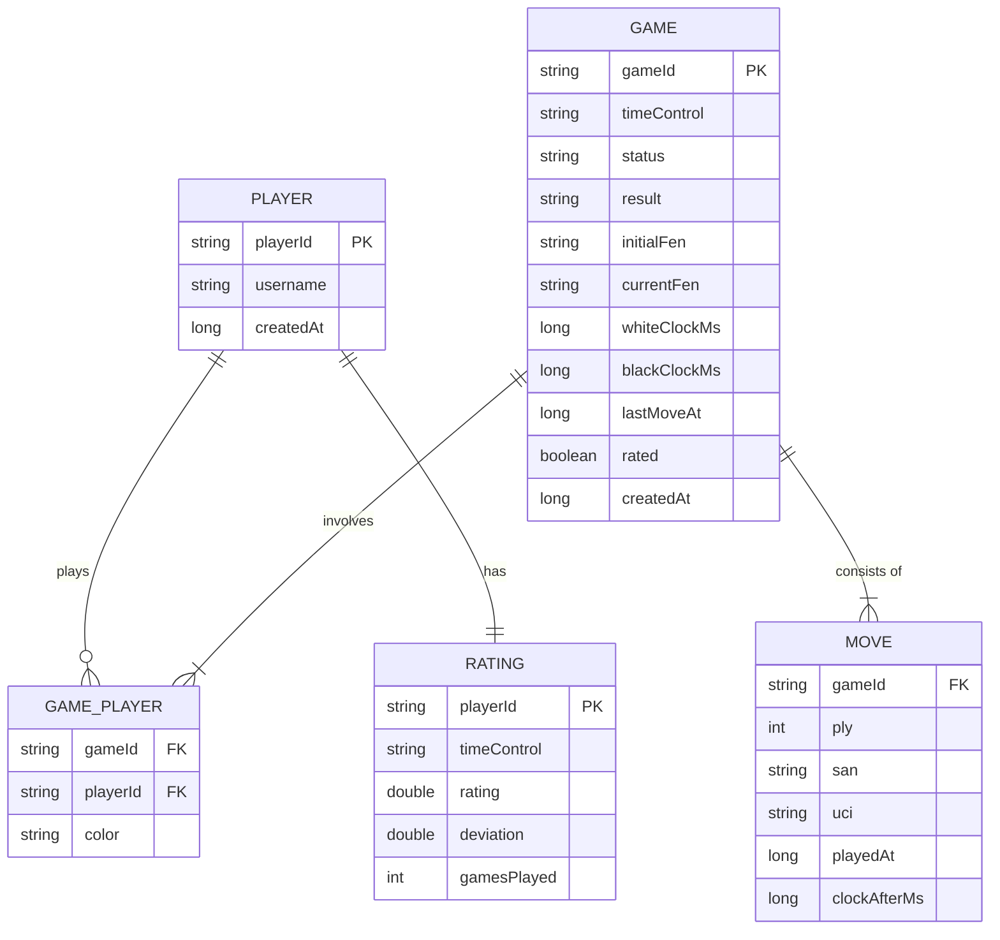

**Explanation.** Two storage philosophies coexist here deliberately. `MOVE` is the source of truth — the game is, mathematically, its move list. But `GAME.currentFen` plus the two clock fields and `lastMoveAt` are a **materialized snapshot**: reconnecting clients and list views must not replay 200 plies, and clock state must be computable from durable fields (`whiteClockMs - (now - lastMoveAt)` for the side to move). `MOVE.clockAfterMs` is stored per move so the entire game's time usage is reconstructable for lag-compensation audits and cheat detection. `RATING` is per time control (bullet, blitz, rapid are separate pools in every real platform) and stores Glicko-2's rating *deviation* alongside the rating itself.

---

### High-Level Design

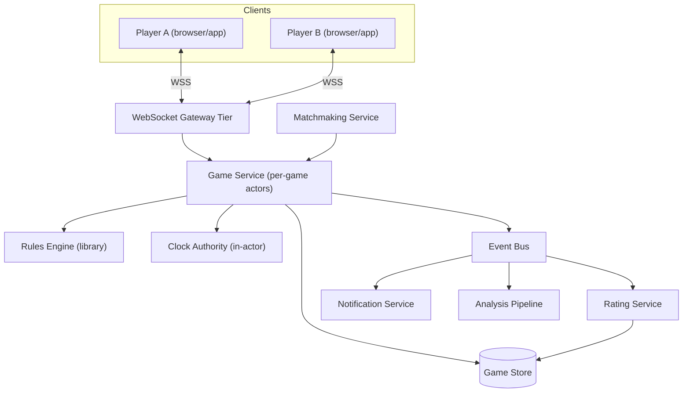

**Explanation.** The WebSocket tier is deliberately separated from the game service (Lichess runs exactly this split as `lila-ws` + `lila`): the WS tier holds hundreds of thousands of mostly-idle connections cheaply and can be scaled and deployed independently of game logic. The game service processes each game serially in an actor; the rules engine is a *library inside the actor*, not a service — making it a network hop would add latency and a failure mode for zero benefit. Game-end events flow through the bus to rating (must be idempotent), notifications, and analysis (queue-based, latency-tolerant).

### Game Lifecycle State Machine

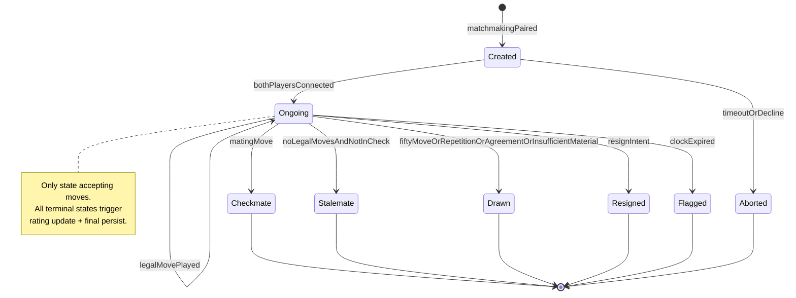

**Explanation.** The critical structural fact: `Ongoing` is the only state that accepts moves, and every terminal transition carries the same side-effect bundle (finalize persistence, publish game-ended event for rating, close the actor). `Flagged` deserves attention — it is the only terminal state triggered by *time rather than a player intent*, which is why the clock authority lives inside the game actor: a clock expiry is just another message in the serialized mailbox, so a flag and a move can never race ambiguously (whichever the actor processes first, with timestamps, wins deterministically).

### Move Sequence (online play)

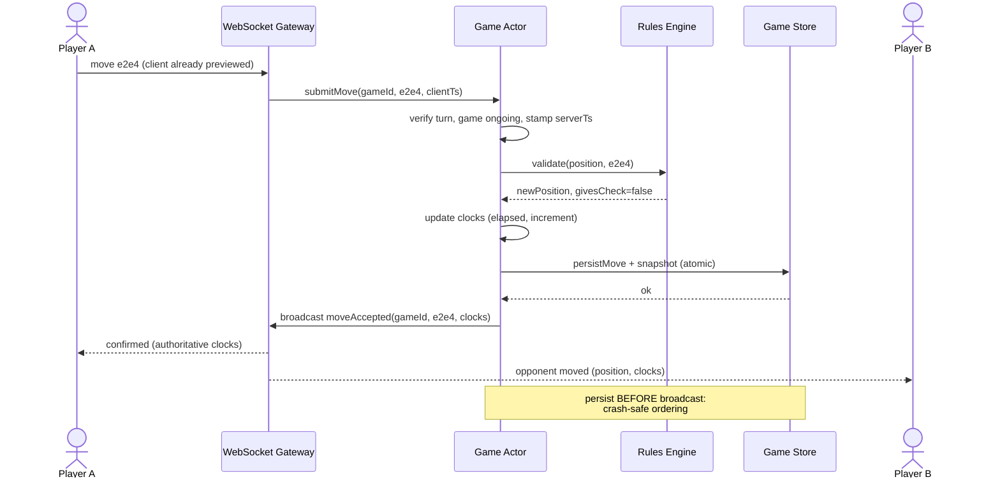

**Explanation.** Three details carry the seniority. First, the actor stamps the server timestamp on receipt — client timestamps are recorded for analytics but never trusted for clocks. Second, persistence happens before broadcast: if the server crashes between broadcast and write, one client has seen a move that never officially happened; persisting first makes the store the single reality and broadcasts merely notifications. Third, both clients receive the *same* authoritative clock values — clients animate locally between updates but re-anchor to server values on every message, so drift never accumulates.

---

### Deep Dive: Rules Engine, Check Detection, and Special Moves

**Legal move generation.** The canonical algorithm:

1. Generate pseudo-legal moves for the side to move (pure geometry per piece).
2. For each candidate: make the move on the board (recording an undo record).
3. Test `isSquareAttacked(myKingSquare, byColor = opponent)`.
4. Unmake. If attacked, discard; else it is legal.
5. Checkmate = in check AND zero legal moves. Stalemate = not in check AND zero legal moves.

**Special moves' exact preconditions:**

- **Castling**: (a) castling right still held (king and that rook never moved — history), (b) squares between king and rook empty, (c) king not currently in check, (d) the king's transit square and destination square not attacked. The rook's transit squares do *not* matter.
- **En passant**: legal only immediately after the enemy pawn's two-square advance; the capturing pawn moves to the square the enemy pawn passed over; the captured pawn is removed from its own square (the only capture where target square ≠ captured piece's square). Legality must go through the make/unmake filter because of the rank-pin case.
- **Promotion**: a pawn reaching the last rank promotes *as part of the move* — the `Move` object carries the promotion piece; it is not a separate action. Under-promotion to a knight is occasionally the strongest move, so the UI must offer all four choices.

**Undo record completeness.** A move's undo record must capture: captured piece (if any), prior castling rights, prior en passant square, prior half-move clock, and whether the move was castling or en passant (they move/remove two pieces). Forgetting any of these corrupts history silently — this exact bug family is why professional engines test make/unmake by asserting the position hash returns to its prior value after every make/unmake pair across millions of random games.

**Draw detection specifics:**

- Fifty-move rule: half-move clock resets on any pawn move or capture; at 100 half-moves a player may claim, at 150 it is automatic (FIDE 75-move rule).
- Threefold repetition: same position (pieces + side to move + castling rights + en passant availability) occurring three times; Zobrist-hash counts per game, resettable on irreversible moves.
- Insufficient material: K vs K, K+B vs K, K+N vs K, K+B vs K+B with same-colored bishops — automatic draw, no claim needed.

---

### From Local Game to Online Platform

**Matchmaking.** Players join a pool per time control with their rating; a sweeper matches pairs whose rating bands overlap, widening the band (e.g., ±50 growing to ±400) with seconds waited. Rated vs casual is a pool attribute. Keep it in-memory with a durable intent record — a matchmaking crash should cost seconds, not corrupt games.

**Real-time sync.** WebSocket (or raw TCP for native apps); each connection subscribes to one game topic. Messages are small JSON/binary frames: `move`, `stateSync` (full position + clocks, sent on connect/reconnect), `gameEnd`. Fan-out per game is exactly two humans (plus spectators, which scale the read path only).

**Clock management (server-authoritative).** Store per side: `remainingMs` at `lastMoveAt`. On a validated move at server time `t`: moving side's new `remainingMs = remainingMs - (t - lastMoveAt) + incrementMs`; set `lastMoveAt = t`. Flag check: when `remainingMs - (now - lastMoveAt) <= 0` for the side to move, schedule/fire a flag message in the actor. Lag compensation: credit `min(measuredLatency, cap)` back — Lichess credits a per-player moving average so habitual laggers cannot farm the cap.

**Reconnect.** On reconnect, the client sends `gameId` + last known ply; the server responds with the full state sync (current FEN, move list tail, both clocks computed *now*, game status). Disconnection also starts a "claim victory" grace timer (e.g., 60 s for blitz) so a rage-quit cannot stall forever — the timer is another message in the game actor's mailbox.

**Rating.** Glicko-2 per time control: each player has rating, deviation (uncertainty), and volatility; new/inactive players have high deviation so ratings converge fast. Apply updates from the game-ended event consumer, transactionally, keyed on gameId for idempotency. Aborted games (few moves, early disconnect) are unrated.

**Anti-cheat boundary.** Server revalidates every move; clocks are server-owned; results are server-decided. Engine-use detection (correlating moves with engine top choices, timing patterns) is an offline analytics pipeline consuming the same move stream — a good example of the event bus paying for itself.

---

### Replication Strategies

**What it means**

Replication Strategies determine how data and state are copied across multiple nodes in Build a game of Chess. The choice of strategy determines the trade-off between consistency, availability, and latency.

**Why it matters**

Build a game of Chess must replicate data to prevent loss and serve reads from multiple nodes. The replication strategy determines whether the system favors consistency (strong reads) or availability (always writable), and how it handles cross-node failure.

**How it works**

**Leader-based (single-leader)**: A single primary node accepts all writes; followers replicate changes asynchronously or semi-synchronously. Reads can be served from any replica. This strategy favors strong consistency for writes but creates a write bottleneck at the leader.

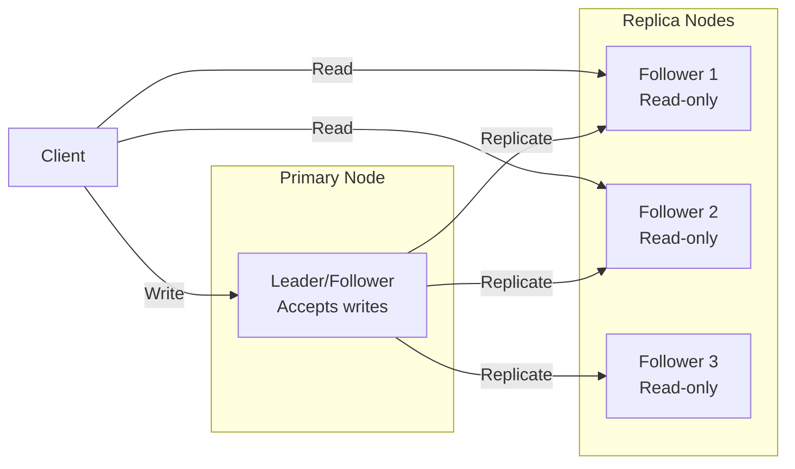

*Leader-based replication: a single primary node accepts all writes and replicates them to read-only followers. Clients can read from any replica for scaled read throughput, but all writes go through the leader.*

**Multi-leader (multi-master)**: Multiple nodes accept writes and exchange updates with each other. This enables low-latency writes in different regions but requires conflict resolution (last-write-wins, merge functions, or CRDTs).

**Leaderless (quorum-based)**: Any node can accept writes; a quorum of nodes must agree. Read and write quorums are configured so that at least one node overlaps between them (R + W > N). This maximizes availability and write scalability.

**Trade-offs for Build a game of Chess**:

| Strategy | Use Case | Pros | Cons |
|---|---|---|---|
| Leader-based | player ratings, match history | Strong consistency, simple | Write bottleneck, leader failure risk |
| Multi-leader | public leaderboards, game replays | Low-latency global writes | Conflict resolution, complex |
| Leaderless | Caching, counters | High availability, no bottleneck | Eventual consistency, read repair overhead |

**Real-world implementations**

- **Redis**: Leader-follower replication with asynchronous replication; Sentinel handles failover.
- **Apache Kafka**: Leader-based partition replication with ISR (in-sync replica) — writes go to the leader, followers replicate.
- **Cassandra**: Tunable consistency with leaderless quorum (R + W > N).
- **DynamoDB Global Tables**: Multi-master active-active across regions.

### Failure Detection and Membership

**What it means**

Failure Detection and Membership is the mechanism by which Build a game of Chess determines which nodes are alive and part of the cluster. Membership is the list of known nodes; failure detection is the process of updating that list when nodes fail or recover.

**Why it matters**

Build a game of Chess must route requests only to healthy nodes and trigger failover when a node goes down. False positives (healthy nodes marked as dead) cause unnecessary failovers and data loss. False negatives (dead nodes not detected) cause failed requests and degraded performance.

**How it works**

**Heartbeat-based detection**: Each node sends a heartbeat (ping) to a subset of peers at regular intervals. If a node misses N consecutive heartbeats, it is marked as suspect. The gossip protocol distributes membership information: each node exchanges its view of the cluster with a random peer, and the information propagates gossip-style.

```mermaid
sequenceDiagram
    participant A as Node A
    participant B as Node B
    participant C as Node C

    loop Every 1s
        A->>B: Heartbeat (ping)
        B-->>A: Heartbeat (ack)
    end
    B->>C: Gossip: A is alive
    C->>A: Gossip: B is alive
    Note over A,B,C: View converges in O(log N) rounds
```

*Gossip-based failure detection: each node periodically pings a random subset of peers and gossips its view of the cluster. The membership list converges in O(log N) rounds.*

**Phi Accrual Failure Detector**: Instead of a fixed timeout, the detector measures the time between consecutive heartbeats and computes a phi (φ) value — the probability that the node is dead given the observed heartbeat pattern. φ is compared against a threshold (typically 1–8); higher thresholds reduce false positives but increase detection latency.

**SWIM (Scalable Weakly-consistent Infection-style Process group Membership Protocol)**: Nodes ping a random subset of cluster members. If a ping fails, the node is marked "suspect" and the failure is "infected" (gossiped) to other nodes. This is O(log N) per failure detection cycle and scales to large clusters.

**Trade-offs**:

| Approach | Strengths | Weaknesses |
|---|---|---|
| Heartbeat (timeout-based) | Simple, deterministic | False positives under load |
| Phi Accrual | Adaptive threshold | Needs historical data |
| SWIM | Scales to 1000s of nodes | Eventual consistency |

**Real-world implementations**

- **AWS Route 53 Health Checks**: Uses TCP/HTTP health checks with configurable thresholds to remove unhealthy instances from DNS rotation.
- **Kubernetes**: Uses the kubelet heartbeat (every 10s) to determine node liveness; nodes missing 3 consecutive heartbeats are marked NotReady.
- **Consul**: Uses SWIM protocol for membership and failure detection; supports both LAN and WAN gossip.
- **Akka Cluster**: Uses Phi Accrual failure detector with configurable φ thresholds.

### High Availability and Scalability

**What it means**

High Availability and Scalability determines how Build a game of Chess continues operating when nodes or entire zones fail, and how capacity is added as demand grows. HA is about minimizing downtime; scalability is about maintaining performance as load increases.

**Why it matters**

Build a game of Chess must stay operational even when individual nodes, availability zones, or entire regions fail. At the same time, it must scale horizontally to handle traffic spikes without degrading latency. The two are intertwined: the replication strategy, failure detection, and load balancing all contribute to both HA and scalability.

**How it works**

**Availability zones (AZs)**: Nodes are distributed across multiple AZs within a region. Each AZ is an independent failure domain (power, networking, physical security). A load balancer distributes requests across AZs; if one AZ fails, traffic is routed to the remaining AZs with no data loss (assuming replication is in place).

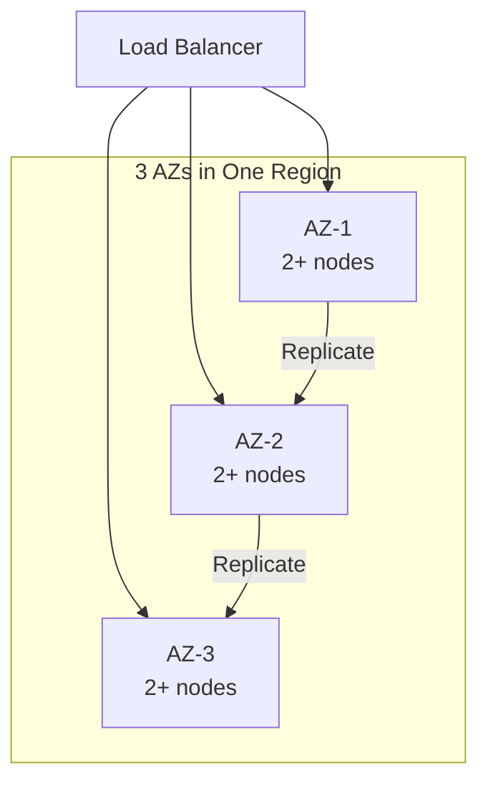

*Multi-AZ deployment: a load balancer distributes traffic across three availability zones. Each AZ has multiple nodes. Data is replicated across AZs so that losing one AZ does not cause data loss or service interruption.*

**Load balancing**: A load balancer distributes incoming requests across healthy nodes. Algorithms include round-robin, least connections, and weighted routing. Health checks ensure traffic only goes to healthy nodes. For Build a game of Chess, the load balancer also considers - **Board / Position**
  Purpose: represents everything about a game state. Resp when routing.

**Auto-scaling**: The system automatically adds or removes nodes based on metrics (CPU, memory, request rate). Scale-out policies add nodes when load exceeds a threshold; scale-in policies remove nodes during low load. For stateful services like Build a game of Chess, scale-out involves rebalancing partitions (moving data and connections to the new node).

**Failover and recovery**: When a node fails, the load balancer detects it (via health checks or failure detection) and stops sending traffic. A new node is provisioned (or a standby is promoted) and begins serving. For Build a game of Chess, failover must preserve player ratings, match history data — this is achieved through replication with a quorum of healthy nodes.

**Scalability patterns**:

1. **Horizontal partitioning (sharding)**: Split data by a partition key (e.g., user_id, session_id) and distribute partitions across nodes. New nodes take ownership of additional partitions.

2. **Consistent hashing**: Minimize data movement on scale-out — only 1/N of the data moves to the new node. Nodes and partitions are placed on a ring; a request for key X is routed to the next node clockwise from hash(X).

3. **Connection draining**: When scaling in, existing connections are allowed to complete before the node is shut down. For Build a game of Chess, this means draining active 1. sessions gracefully.

**Real-world implementations**

- **Netflix OSS (Eureka + Zuul + Ribbon)**: Service discovery with Eureka, edge routing with Zuul, and client-side load balancing with Ribbon. Scales to thousands of instances.
- **Kubernetes HPA + VPA**: Horizontal Pod Autoscaler scales pods based on CPU/memory; Vertical Pod Autoscaler adjusts resource requests based on historical usage.
- **AWS ALB + Auto Scaling Groups**: Application Load Balancer with auto-scaling groups across AZs; health checks replace unhealthy instances automatically.

### Performance and Optimization

**What it means**

Performance and Optimization covers the techniques Build a game of Chess uses to achieve low latency, high throughput, and efficient resource usage. This section examines the key performance metrics, bottlenecks, and optimizations specific to the system.

**Why it matters**

Build a game of Chess faces competing pressures: users demand low latency, the system must handle high throughput, and infrastructure costs must be controlled. The optimizations applied at the data, compute, and network layers determine whether the system meets its SLA.

**How it works**

**Latency layers**: Latency in Build a game of Chess comes from three layers:
1. **Network**: Round-trip time from client to the nearest edge node / load balancer.
2. **Application**: Request processing time on the server (CPU, I/O, lock contention).
3. **Data**: Time to read/write from storage (cache hit vs. database query).

The 99th-percentile latency is the key metric for user-facing systems — it determines the worst-case experience.

**Caching strategies**: Build a game of Chess uses multiple cache layers:
- **Edge cache**: Static assets (images, CSS, JS) served from a CDN at the edge. For Build a game of Chess, this caches public leaderboards, game replays that doesn't change frequently.
- **Application cache**: In-memory cache (e.g., Redis, Memcached) for frequently accessed data. Cache-aside pattern: application checks cache first, falls back to database on miss.
- **Local cache**: In-process cache (e.g., Caffeine, Guava) for data accessed within a single request. Avoids network round-trips.

**Batching and pipelining**: Build a game of Chess batches small operations (e.g., writes, log flushes) to amortize per-operation overhead. Pipelining allows multiple requests to be in flight simultaneously.

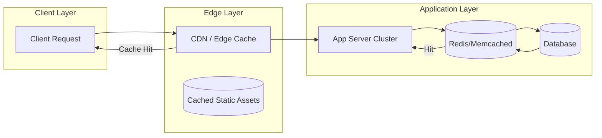

*Caching hierarchy: clients first hit the edge CDN/cache; if the response is cached, it is returned immediately. Otherwise, the request reaches the application, which checks its in-memory/application cache (e.g., Redis) before falling back to the database. This minimizes latency from each layer.*

**Connection pooling**: Build a game of Chess maintains a pool of database connections to avoid the TCP handshake overhead on every request. Pool size is tuned to match the database's capacity.

**Compression**: Responses are compressed (gzip, zstd) for clients that support it. At the network layer, gRPC uses HPACK header compression.

**Indexing**: Database tables are indexed on frequently queried fields. For Build a game of Chess, indexes cover **Piece (class hierarchy)**
  Purpose: encapsulates movement geometry per piece  and **Move validator / Rules engine**
  Purpose: the legality oracle. Responsibiliti for fast lookups.

**Asynchronous processing**: Non-critical background work (e.g., analytics, cleanup, notifications) is offloaded to message queues and processed asynchronously, keeping the request path fast.

**Resource isolation**: CPU and memory are allocated per service (containers with cgroup limits). This prevents a single misbehaving service from degrading the entire system.

**Metrics for Build a game of Chess**:

| Metric | Target | How to Measure |
|---|---|---|
| P99 latency | < 100ms | Load test with realistic traffic |
| Throughput | 1K RPS | Request rate under peak load |
| Error rate | < 0.1% | 5xx / total requests |
| Cache hit ratio | > 90% | cache_hits / (cache_hits + misses) |
| Resource utilization | < 80% CPU, < 85% memory | Container metrics |

**Real-world implementations**

- **Google's HTTP Load Balancer**: Global load balancing with edge PoPs; routes users to the nearest healthy backend.
- **Cloudflare**: Edge cache with Argo Smart Routing that dynamically routes traffic to avoid congestion.
- **Redis**: Used as an application cache with configurable eviction policies (LRU, LFU, TTL).

### Encryption and Key Management

**What it means**

Encryption and Key Management in Build a game of Chess ensures that data is protected both at rest (stored on disk) and in transit (moving between services). Key management governs how encryption keys are generated, stored, rotated, and accessed — without proper key management, encryption provides a false sense of security.

**Why it matters**

Build a game of Chess handles player ratings, match history that must be encrypted both at rest and in transit. Scaling Build a game of Chess to handle increasing load while maintaining data consistency, low latency, and fault tolerance requires careful key management: keys must be rotated regularly, scoped to prevent cross-contamination, and audited for compliance. A single key compromise could expose sensitive data.

**How it works**

**At-rest encryption**: Data stored in - **Board / Position**
  Purpose: represents everything about a game state. Resp, **Piece (class hierarchy)**
  Purpose: encapsulates movement geometry per piece  and databases is encrypted using AES-256-GCM. The Data Encryption Key (DEK) is generated per data partition and encrypted with a Key Encryption Key (KEK) managed by a KMS (AWS KMS, GCP KMS, HashiCorp Vault). Keys are regionally scoped — only data belonging to a region can be decrypted by that region's KEK.

**In-transit encryption**: All inter-service communication uses TLS 1.3 or mTLS for service-to-service auth. Cross-region communication of public leaderboards, game replays uses TLS + optional application-level encryption. player ratings, match history is NEVER transmitted in plaintext or across region boundaries.

**Key hierarchy**:
```
Master Key (HSM-backed, KMS-managed)
  └─ KEK (per region, per service)
     └─ DEK (per data partition, rotated every 90 days)
        └─ Data (encrypted with DEK)
```

**Key rotation**: KEKs rotate annually (automatic via KMS); DEKs rotate per object or per 90 days. Applications handle key version headers transparently — a DEK version is stored alongside the encrypted data.

**Cross-region key sharing**: For non-restricted data (public leaderboards, game replays), a shared key is imported into each region's KMS. Restricted data NEVER uses cross-region keys — each region's KMS holds only that region's keys.

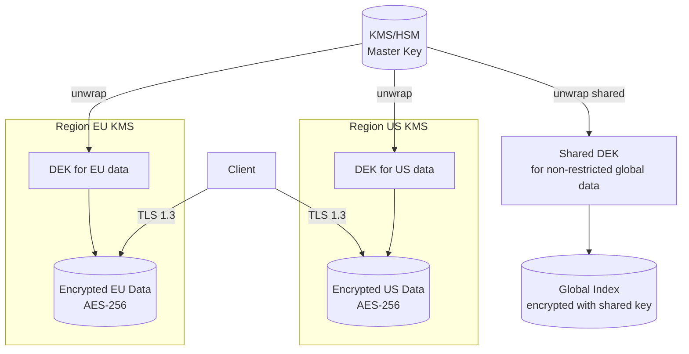

*Encryption key hierarchy: master keys are managed by an HSM-backed KMS and never leave the KMS. Each region has its own KEK. Data encryption keys (DEKs) are generated per partition and encrypted with the regional KEK. Only non-restricted global data uses a shared cross-region key. All client traffic uses TLS 1.3.*

**Java/Spring Boot Implementation**

```java
@Service
@RequiredArgsConstructor
public class DataEncryptionService {

    private final AWSKMS kms;
    @Value("${app.region}")
    private String region;
    @Value("${app.encryption.dek-ttl-minutes:1440}")
    private int dekTtlMinutes;

    private final Map<String, SecretKey> dekCache = new ConcurrentHashMap<>();

    public EncryptedData encrypt(String plaintext, String partitionId) {
        SecretKey dek = getOrCreateDek(partitionId);
        byte[] ciphertext = CryptoUtils.encrypt(plaintext.getBytes(StandardCharsets.UTF_8), dek);
        String dekCiphertext = kms.encrypt(EncryptRequest.builder()
            .keyId("arn:aws:kms:" + region + ":master-key")
            .plaintext(SdkBytes.fromByteArray(dek.getEncoded()))
            .build()).ciphertextBlob().asByteArray();
        return new EncryptedData(ciphertext, dekCiphertext, Instant.now());
    }

    private SecretKey getOrCreateDek(String partitionId) {
        return dekCache.computeIfAbsent(partitionId, id -> {
            try {
                return KeyGenerator.getInstance("AES").generateKey();
            } catch (NoSuchAlgorithmException e) {
                throw new IllegalStateException("Cannot generate DEK", e);
            }
        });
    }
}
```

*Spring Boot encryption service: DEKs are cached per-partition with TTL. Each DEK is encrypted via AWS KMS using a regional master key. The encrypted DEK (ciphertext) is stored alongside the data — only the KMS for that region can decrypt it.*

**Real-world implementations**

- **AWS KMS**: Managed HSM-backed key service; supports automatic key rotation and custom key stores.
- **HashiCorp Vault**: Open-source key management; supports transit encryption (encrypt/decrypt without storing keys).
- **Google Cloud KMS**: Hardware-backed key management with IAM-based access control.

### Authentication and Authorization

**What it means**

Authentication and Authorization (AuthN/AuthZ) in Build a game of Chess control who can access the system and what they can do. Authentication verifies identity; authorization determines permissions. In a distributed system like Build a game of Chess, auth must work across multiple nodes while respecting data boundaries — a user authenticated in one region should not have their session data or tokens replicated to regions where it is not permitted.

**Why it matters**

Build a game of Chess must verify identity at the edge and enforce authorization at every service boundary. player ratings, match history must be protected — only users with appropriate roles should access it. At the same time, public leaderboards, game replays data should be accessible to a wider audience with minimal friction.

**How it works**

**Authentication (who are you?)**:
- **JWT tokens**: Users authenticate through their home region's identity provider. The region returns a JWT (JSON Web Token) signed by a regional signing key. Tokens include claims like `iss` (issuer region), `sub` (subject/user ID), `home_region`, `roles`, and `exp` (expiry). Tokens are scoped per region — a token issued by region A cannot access restricted data in region B.
- **mTLS for service-to-service**: Internal services authenticate each other using mutual TLS certificates issued by a per-region Certificate Authority (CA). No shared secrets cross region boundaries.
- **Session management**: Sessions are stored regionally (Redis) and never replicated cross-region for restricted data. Session IDs are opaque UUIDs; the session store maps session ID → user context.

**Authorization (what can you do?)**:
- **RBAC (Role-Based Access Control)**: Users are assigned roles per region. Common roles: `region_admin` (full access to region data), `auditor` (read-only audit), `viewer` (read public data only). Roles are stored in the regional database and cached locally for sub-1ms lookups.
- **ABAC (Attribute-Based Access Control)**: Fine-grained permissions based on attributes (e.g., `home_region == request_region AND role == admin`). This allows expressing complex policies like "users can only access restricted data in their home region."
- **Resource-level authorization**: Each request is checked against an ACL (Access Control List) that specifies which roles can access which resources. For Build a game of Chess, restricted resources require the `admin` role + matching region.

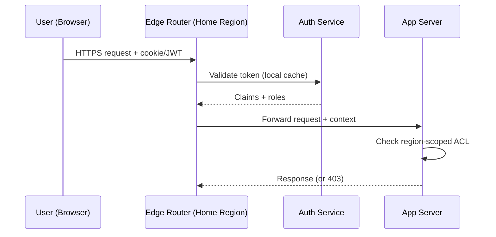

*Authentication flow: the user's token is validated by the regional auth service (claims cached locally). The edge router forwards the request with the security context. Each app server checks the region-scoped ACL before accessing restricted data.*

**Java/Spring Boot Implementation**

```java
@Service
@RequiredArgsConstructor
public class AuthorizationService {

    private final UserTokenRepository tokenRepository;
    @Value("${app.region}")
    private String currentRegion;

    public boolean canAccessResource(String userId, String resourceRegion,
                                     String action, JWTClaims claims) {
        String userHomeRegion = claims.getStringClaim("home_region");
        List<String> roles = claims.getStringListClaim("roles");

        if (!roles.contains(action)) {
            return false;
        }

        if (resourceRegion.equals(userHomeRegion)) {
            return true;
        }

        if (resourceRegion.equals("global")) {
            return roles.contains("global_reader");
        }

        return false;
    }
}

@RestController
@RequiredArgsConstructor
@RequestMapping("/api/v1")
public class RegionController {
    private final AuthorizationService authService;

    @GetMapping("/data/{region}/profile")
    public ResponseEntity<?> getProfile(
            @PathVariable String region,
            @RequestHeader("Authorization") String token) {
        JWTClaims claims = JwtUtils.parseAndValidate(token, currentRegion);

        if (!authService.canAccessResource(
                claims.getStringClaim("sub"), region, "read", claims)) {
            return ResponseEntity.status(HttpStatus.FORBIDDEN).build();
        }

        return ResponseEntity.ok(profileService.getByRegion(region));
    }
}
```

*Spring Boot authorization service: checks both the user's role and whether the requested resource violates region boundaries. The `canAccessResource` method returns false if a user from region EU tries to access restricted data in region US.*

**Real-world implementations**

- **Auth0**: JWT-based authentication with regional endpoints; supports custom rules for ABAC.
- **Okta**: Multi-region identity management with adaptive MFA and ThreatInsight for anomaly detection.
- **AWS Cognito**: Regional user pools with IAM integration; tokens are region-scoped by default.

### Security Threats and Mitigations

**What it means**

Security Threats and Mitigations catalog the attack surface of Build a game of Chess, the most likely threats, and the corresponding defenses. Every distributed system has unique threat vectors — Build a game of Chess is no exception.

**Why it matters**

Build a game of Chess handles player ratings, match history that attackers might target. Scaling Build a game of Chess to handle increasing load while maintaining data consistency, low latency, and fault tolerance expands the attack surface: more nodes, more network paths, more failure modes. Without proper threat modeling, a single vulnerability could expose sensitive data across the entire system.

**Threat model**:

| Threat | Likelihood | Impact | Mitigation |
|---|---|---|---|
| Data exfiltration (cross-region) | High | Critical | Region-scoped keys, no cross-region replication of restricted data |
| Man-in-the-middle (inter-service) | Medium | High | mTLS between all services |
| Replay attacks | Medium | High | Token expiry + nonce |
| DDoS at the edge | High | High | Rate limiting + edge filtering (Cloudflare, AWS Shield) |
| PII leakage in logs | High | High | PII redaction + field-level access control |
| Session hijacking | Medium | Medium | Short-lived tokens + IP binding |
| Privilege escalation | Low | Critical | Least-privilege RBAC + audit logs |
| Cache poisoning | Low | Medium | Cache invalidation on write + signed cache keys |

**How it works**

**Data exfiltration prevention**: Build a game of Chess enforces data residency by design — player ratings, match history is never replicated cross-region. The replication layer checks a data classification label before allowing cross-region copy. A database-level policy (e.g., PostgreSQL RLS) also blocks cross-region queries for restricted partitions.

**mTLS enforcement**: All service-to-service communication uses mutual TLS. Certificates are issued by a per-region CA and rotated every 30 days. Services must present a valid certificate to communicate — no plaintext connections are allowed.

**PII redaction**: Application logs are scanned for PII patterns (email, phone, credit card) using an automated redaction layer (e.g., AWS Macie, Google DLP). public leaderboards, game replays is logged freely; restricted fields are masked or dropped before logging.

```mermaid
graph TD
    subgraph "Threat Surface"
        Client[Client]
        Edge[Edge Router / WAF]
        App[App Server]
        DB[(Database)]
        Cache[(Cache)]
        Logs[Log Store]
    end

    Client -->|HTTPS| Edge
    Edge -->|mTLS| App
    App -->|mTLS| DB
    App -->|Read| Cache
    App -->|Write| DB
    App -->|Log| Logs

    subgraph "Mitigations"
        WAF[AWS WAF /<br/>Cloudflare]
        DLP[PII Redaction<br/>(Macie/DLP)]
        FIM[File Integrity<br/>Monitoring]
    end

    Edge -.-> WAF
    Logs -.-> DLP
    DB -.-> FIM
```

*Threat mitigation diagram: the WAF at the edge blocks DDoS and injection attacks. mTLS protects all service-to-service communication. PII redaction scans logs before storage. File integrity monitoring alerts on database tampering.*

**Audit trail**: All security-relevant events (auth, data access, config changes) are written to an append-only audit log with cryptographic integrity (HMAC per entry). The log covers player ratings, match history access — who accessed what, when, and from where.

**Real-world implementations**

- **Cloudflare**: Zero-trust model (All Connections to All Networks) with mTLS everywhere; uses GeoIP blocking and rate limiting for DDoS mitigation.
- **Google BeyondCorp**: Zero-trust network security model; all access is authenticated and authorized at the request level.

### Observability and Logging

**What it means**

Observability and Logging in Build a game of Chess provide visibility into system behavior through three pillars: **metrics** (aggregates and counters), **logs** (structured event records), and **traces** (distributed request timelines). Together, these signals allow operators to debug issues, detect anomalies, and verify SLA compliance.

**Why it matters**

Distributed systems like Build a game of Chess are inherently opaque — failures can cascade across services in unexpected ways. Without good observability, a single slow dependency can cause widespread timeouts that are nearly impossible to diagnose. Scaling Build a game of Chess to handle increasing load while maintaining data consistency, low latency, and fault tolerance makes observability even more critical: operators need to see cross-region latency, regional failures, and data-residency violations.

**How it works**

**Metrics**: Build a game of Chess instruments every service with Prometheus-style metrics:
- **Request rate, error rate, duration (the "RED" metrics)**: Tracks per-endpoint HTTP latency and error counts.
- **System metrics**: CPU, memory, disk I/O, network throughput per node.
- **Business metrics**: For Build a game of Chess, this includes metrics like "**Piece (class hierarchy)**
  Purpose: encapsulates movement geometry per piece  fill rate" and "reservation conflict rate".

Metrics are aggregated in a time-series database (Prometheus, VictoriaMetrics) and visualized in Grafana dashboards with alerts via PagerDuty.

**Logs**: Build a game of Chess uses structured logging (JSON format) with standardized fields:
- `timestamp`: ISO 8601 UTC
- `level`: DEBUG, INFO, WARN, ERROR
- `service`: originating service name
- `trace_id`: distributed trace identifier (for correlation)
- `span_id`: current operation span
- `region`: the region that processed the request
- `data_class`: RESTRICTED or NON_RESTRICTED

player ratings, match history access is logged with full context (user, action, resource). public leaderboards, game replays logs are aggregated and may have reduced retention.

**Distributed tracing**: Every request is assigned a trace ID at the edge. The trace propagates through all downstream services via HTTP headers. A tracing backend (Jaeger, Tempo, Zipkin) reconstructs the full request timeline, showing latency at each hop. For Build a game of Chess, traces include region boundaries — a cross-region call is annotated as such.

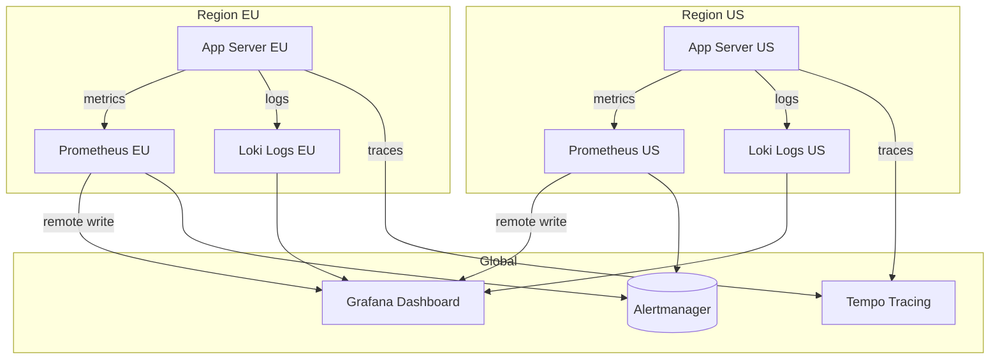

*Observability architecture: each region runs its own Prometheus (metrics) and Loki (logs) instances. A global Grafana instance queries all regional backends. Traces are collected centrally in Tempo. Alerts fire from each region's Prometheus to Alertmanager.*

**Alerting**: Build a game of Chess defines SLO-based alerts:
- **Latency**: P99 > 1s for 5 minutes → page.
- **Error rate**: > 1% for 10 minutes → page.
- **Availability**: < 99.5% for 15 minutes → page.
- **Data residency violation**: any restricted data detected outside its region → critical page.

**Java/Spring Boot Implementation**

```java
@Component
@RequiredArgsConstructor
@Slf4j
public class ObservabilityContext {

    @Value("${app.region}")
    private String region;

    public void logAccess(String userId, String resource, String action,
                          boolean restricted) {
        log.info("access_event userId={} resource={} action={} region={} data_class={}",
            userId, resource, action, region, restricted ? "RESTRICTED" : "NON_RESTRICTED");
    }
}

@RestController
@RequiredArgsConstructor
@Slf4j
public class ApiController {
    private final ObservabilityContext obs;
    private final UserService userService;

    @GetMapping("/api/v1/profile")
    public ResponseEntity<ProfileResponse> getProfile(
            @AuthenticationPrincipal UserDetails user) {
        String traceId = MDC.get("traceId");
        long start = System.nanoTime();

        try {
            ProfileResponse response = userService.getProfile(user.getId());
            obs.logAccess(user.getId(), "profile", "read", true);

            return ResponseEntity.ok(response);
        } finally {
            long durationMs = (System.nanoTime() - start) / 1_000_000;
            log.info("profile_read traceId={} latencyMs={} region={}",
                traceId, durationMs, obs.region);
        }
    }
}
```

*Spring Boot observability: the `ObservabilityContext` logs structured access events with data classification. The controller records latency and trace ID for every request, enabling SLO-based alerting.*

**Real-world implementations**

- **Netflix OSS (Atlas + Zipkin + Servo)**: Metrics via Atlas, traces via Zipkin, instrumented via Servo. Scales to over 700 billion requests/day.
- **Google SRE Workbook**: Comprehensive observability with SLI/SLO/SLI definition; uses Borgmon for metrics and Dapper for tracing.
- **AWS Observability**: CloudWatch for metrics, X-Ray for tracing, CloudWatch Logs for structured logs.

### Real-World Implementations

**Build a game of Chess in production**

- **Build a game of Chess platforms**: widely used build a game of chess platform

**Key takeaways**

- Scalability patterns proven in production at scale
- Common pitfalls and how to avoid them
- Integration with existing infrastructure and monitoring

### Java and Spring Boot Implementation Guide

Spring Boot 3 / Java 17. The rules engine is plain domain classes (positions, pieces, moves) — pure and dependency-free — while orchestration (game sessions, matchmaking, WebSocket handling, rating) lives in `@Service` beans with constructor injection and externalized config.

**Domain core (plain classes, deliberately framework-free so the same code runs anywhere):**

```java
public enum Color { WHITE, BLACK;
    public Color opposite() { return this == WHITE ? BLACK : WHITE; } }

public enum PieceType { PAWN, KNIGHT, BISHOP, ROOK, QUEEN, KING }

public record Square(int file, int rank) {
    public Square {
        if (file < 0 || file > 7 || rank < 0 || rank > 7) {
            throw new IllegalArgumentException("off board");
        }
    }
    public int index() { return rank * 8 + file; }
}

public record Move(Square from, Square to, PieceType promotion) {
    public static Move of(Square from, Square to) { return new Move(from, to, null); }
}

/** Everything a move changes, so it can be undone exactly. */
public record UndoRecord(
        Piece captured,
        EnumSet<CastlingRight> priorCastling,
        Square priorEnPassant,
        int priorHalfMoveClock) {}

public enum CastlingRight { WHITE_KINGSIDE, WHITE_QUEENSIDE, BLACK_KINGSIDE, BLACK_QUEENSIDE }
```

```java
public abstract sealed class Piece
        permits Pawn, Knight, Bishop, Rook, Queen, King {

    private final Color color;
    protected Piece(Color color) { this.color = color; }
    public Color color() { return color; }
    public abstract PieceType type();

    /** Geometric moves only; king-safety filtering happens in Position. */
    public abstract List<Move> pseudoLegalMoves(Position pos, Square from);

    /** Shared by rook, bishop, queen: walk directions until blocked. */
    protected static List<Move> slide(Position pos, Square from, int[][] directions) {
        List<Move> moves = new ArrayList<>();
        for (int[] d : directions) {
            int f = from.file() + d[0], r = from.rank() + d[1];
            while (f >= 0 && f <= 7 && r >= 0 && r <= 7) {
                Square to = new Square(f, r);
                Piece target = pos.pieceAt(to);
                if (target == null) {
                    moves.add(Move.of(from, to));
                } else {
                    if (target.color() != pos.pieceAt(from).color()) {
                        moves.add(Move.of(from, to)); // capture
                    }
                    break; // blocked either way
                }
                f += d[0]; r += d[1];
            }
        }
        return moves;
    }
}

public final class Rook extends Piece {
    private static final int[][] DIRS = {{1,0},{-1,0},{0,1},{0,-1}};
    public Rook(Color color) { super(color); }
    @Override public PieceType type() { return PieceType.ROOK; }
    @Override public List<Move> pseudoLegalMoves(Position pos, Square from) {
        return slide(pos, from, DIRS);
    }
}

public final class Queen extends Piece {
    // Interview favorite: queen = rook directions + bishop directions.
    private static final int[][] DIRS = {
        {1,0},{-1,0},{0,1},{0,-1},{1,1},{1,-1},{-1,1},{-1,-1}};
    public Queen(Color color) { super(color); }
    @Override public PieceType type() { return PieceType.QUEEN; }
    @Override public List<Move> pseudoLegalMoves(Position pos, Square from) {
        return slide(pos, from, DIRS);
    }
}
```

**Position: two-phase legality with make/unmake.**

```java
public final class Position {

    private final Piece[] board = new Piece[64];
    private Color sideToMove = Color.WHITE;
    private EnumSet<CastlingRight> castling = EnumSet.allOf(CastlingRight.class);
    private Square enPassant;
    private int halfMoveClock;
    private int fullMoveNumber = 1;

    public Piece pieceAt(Square s) { return board[s.index()]; }
    public Color sideToMove() { return sideToMove; }
    public Square enPassant() { return enPassant; }

    public List<Move> legalMoves() {
        List<Move> legal = new ArrayList<>();
        for (Move m : pseudoLegalMoves()) {
            UndoRecord undo = make(m);
            if (!isInCheck(sideToMove.opposite())) { // after make, side flipped
                legal.add(m);
            }
            unmake(m, undo);
        }
        return legal;
    }

    public boolean isInCheck(Color color) {
        Square king = findKing(color);
        return isSquareAttacked(king, color.opposite());
    }

    public boolean isSquareAttacked(Square s, Color by) {
        // Generate pseudo-legal attacks for `by` pieces and test whether
        // any reaches s. Optimizations (attack tables) come later and
        // must return identical results.
        for (int i = 0; i < 64; i++) {
            Piece p = board[i];
            if (p != null && p.color() == by) {
                Square from = new Square(i % 8, i / 8);
                for (Move m : p.pseudoLegalMoves(this, from)) {
                    if (m.to().equals(s)) return true;
                }
            }
        }
        return false;
    }

    public UndoRecord make(Move m) {
        UndoRecord undo = new UndoRecord(
                capturedPieceFor(m), EnumSet.copyOf(castling), enPassant, halfMoveClock);
        applyMove(m);
        enPassant = computeEnPassant(m);
        updateCastlingRights(m);
        halfMoveClock = isPawnMoveOrCapture(m, undo) ? 0 : halfMoveClock + 1;
        sideToMove = sideToMove.opposite();
        if (sideToMove == Color.WHITE) fullMoveNumber++;
        return undo;
    }

    public void unmake(Move m, UndoRecord undo) {
        if (sideToMove == Color.WHITE) fullMoveNumber--;
        sideToMove = sideToMove.opposite();
        revertMove(m, undo.captured());
        castling = EnumSet.copyOf(undo.priorCastling());
        enPassant = undo.priorEnPassant();
        halfMoveClock = undo.priorHalfMoveClock();
    }

    public GameStatus status() {
        boolean inCheck = isInCheck(sideToMove);
        boolean hasMoves = !legalMoves().isEmpty();
        if (!hasMoves) return inCheck ? GameStatus.CHECKMATE : GameStatus.STALEMATE;
        if (halfMoveClock >= 150) return GameStatus.DRAWN;
        if (insufficientMaterial()) return GameStatus.DRAWN;
        return inCheck ? GameStatus.CHECK : GameStatus.ONGOING;
    }
    // applyMove/revertMove handle castling rook movement, en passant
    // capture square, and promotion replacement. findKing, computeEnPassant,
    // updateCastlingRights, insufficientMaterial omitted for brevity but
    // are part of the full listing.
}
```

**The game session as a Spring bean — serialized per game, server clocks, durable moves:**

```java
@Service
public class GameSessionService {

    private final GameRepository games;
    private final MoveRepository moves;
    private final GameEventPublisher events;      // WS fan-out abstraction
    private final ApplicationEventPublisher bus;  // game-ended events
    private final ConcurrentHashMap<UUID, Object> locks = new ConcurrentHashMap<>();
    private final long incrementMs;
    private final Clock clock;

    public GameSessionService(
            GameRepository games,
            MoveRepository moves,
            GameEventPublisher events,
            ApplicationEventPublisher bus,
            @Value("${chess.increment-ms:0}") long incrementMs,
            Clock clock) {
        this.games = games;
        this.moves = moves;
        this.events = events;
        this.bus = bus;
        this.incrementMs = incrementMs;
        this.clock = clock;
    }

    public record MoveCommand(UUID gameId, UUID playerId, String uci) {}

    public MoveResult submitMove(MoveCommand cmd) {
        Object lock = locks.computeIfAbsent(cmd.gameId(), id -> new Object());
        synchronized (lock) {                          // one move at a time per game
            try {
                GameState game = games.findByIdForUpdate(cmd.gameId())
                        .orElseThrow(() -> new GameNotFoundException(cmd.gameId()));
                if (game.status() != GameStatus.ONGOING && game.status() != GameStatus.CHECK) {
                    return MoveResult.rejected("game over");
                }
                if (!game.playerToMove().equals(cmd.playerId())) {
                    return MoveResult.rejected("not your turn");
                }
                Position position = FenParser.parse(game.currentFen());
                Move move = MoveParser.fromUci(cmd.uci(), position);
                if (!position.legalMoves().contains(move)) {
                    return MoveResult.rejected("illegal move");
                }
                long now = clock.millis();
                GameState updated = game.applyValidatedMove(
                        FenParser.toFenAfter(position, move), now, incrementMs);
                if (updated.isFlagFall()) {
                    updated = updated.terminate(GameStatus.FLAGGED);
                }
                games.saveAtomicWithMove(updated, new MoveRow(
                        cmd.gameId(), updated.ply(), cmd.uci(), now, updated.moverClockMs()));

                GameStatus terminal = terminalStatusOf(position, move);
                if (terminal != null) {
                    updated = updated.terminate(terminal);
                    games.save(updated);
                    bus.publishEvent(new GameEndedEvent(cmd.gameId(), terminal,
                            updated.whitePlayerId(), updated.blackPlayerId(), updated.rated()));
                }
                events.broadcast(cmd.gameId(), updated.toSyncMessage());
                return MoveResult.accepted(updated.toSyncMessage());
            } finally {
                if (games.isFinished(cmd.gameId())) locks.remove(cmd.gameId());
            }
        }
    }

    /** Reconnect: full state with clocks computed at this instant. */
    public StateSync resync(UUID gameId) {
        GameState game = games.findById(gameId)
                .orElseThrow(() -> new GameNotFoundException(gameId));
        long now = clock.millis();
        return game.toStateSync(now);
    }
}
```

**WebSocket endpoint (thin adapter; all authority lives in the service):**

```java
@Component
public class ChessWebSocketHandler extends TextWebSocketHandler {

    private final GameSessionService sessions;
    private final ConnectionRegistry registry;   // gameId -> sessions
    private final ObjectMapper json;

    public ChessWebSocketHandler(GameSessionService sessions,
                                 ConnectionRegistry registry,
                                 ObjectMapper json) {
        this.sessions = sessions;
        this.registry = registry;
        this.json = json;
    }

    @Override
    public void afterConnectionEstablished(WebSocketSession ws) {
        UUID gameId = attr(ws, "gameId");
        registry.register(gameId, ws);
        send(ws, sessions.resync(gameId));       // reconnect-safe state sync
    }

    @Override
    protected void handleTextMessage(WebSocketSession ws, TextMessage msg) throws Exception {
        ClientMessage cm = json.readValue(msg.getPayload(), ClientMessage.class);
        switch (cm.type()) {
            case "move" -> {
                var result = sessions.submitMove(new GameSessionService.MoveCommand(
                        attr(ws, "gameId"), attr(ws, "playerId"), cm.uci()));
                if (result.rejected()) send(ws, result);
                // accepted moves are fanned out by GameEventPublisher to both players
            }
            case "resync" -> send(ws, sessions.resync(attr(ws, "gameId")));
            default -> send(ws, ErrorMessage.unknownType(cm.type()));
        }
    }
}
```

**Rating updates — idempotent consumer off the game-ended event:**

```java
@Component
public class RatingUpdater {

    private final RatingRepository ratings;
    private final Glicko2 calculator;

    public RatingUpdater(RatingRepository ratings, Glicko2 calculator) {
        this.ratings = ratings;
        this.calculator = calculator;
    }

    @Transactional
    @EventListener
    public void onGameEnded(GameEndedEvent e) {
        if (!e.rated()) return;
        if (ratings.existsRatingAppliedFor(e.gameId())) return;  // idempotency
        var delta = calculator.compute(
                ratings.forPlayer(e.whiteId(), e.timeControl()),
                ratings.forPlayer(e.blackId(), e.timeControl()),
                e.outcome());
        ratings.apply(e.gameId(), delta);
    }
}
```

**Why this shape?** The engine (`Position`, `Piece`, `Move`) has zero Spring dependencies — it is a library, testable against perft in plain JUnit. The `@Service` owns exactly the platform concerns: serialization per game (`synchronized` on a per-game lock — the poor-man's actor, correct and simple), server-authoritative clocks computed from an injected `Clock` (testable), persist-before-broadcast ordering, and idempotent rating via an event listener. Time controls and increments are `@Value`-injected so ops can tune pools without redeploys of logic.

---

### Interview Questions and Answers

**Q1. Design chess. Where do you start?**
A: Clarify scope first: local two-player game vs online platform — the answer differs by an order of magnitude. For the local game: entities (Board/Position, Piece hierarchy, Move, Game), the two-phase legal-move algorithm, special-move preconditions, and the game lifecycle state machine. Then offer the platform extension. Common mistake: starting to code `Piece` subclasses before establishing that legality is a *position-level* concern (check), not a piece-level one — candidates who put `isLegal` on pieces paint themselves into a corner.

**Q2. How do you determine whether a move is legal?**
A: Two phases. Generate pseudo-legal moves from piece geometry. For each, make the move and ask "is my king attacked now?" — if yes, discard; unmake. Checkmate = in check with zero legal moves; stalemate = not in check with zero legal moves. The make/unmake filter uniformly handles pins, en-passant exposure, and castling-through-check without special-casing. Follow-up: "performance?" — this is O(moves × attack-scan); engines optimize with attack tables and pinned-piece tracking, but the *semantics* stay identical, which is what matters here.

**Q3. Why is `Piece[][]` insufficient state?**
A: Because legality depends on history: castling requires king/rook unmoved; en passant requires the immediately previous move; the fifty-move rule requires a counter; repetition requires all prior positions. The position must carry castling rights, en passant square, half-move clock, and a history/hash list. This is exactly what FEN encodes. Common mistake: discovering this mid-interview when asked "implement castling" — mentioning it upfront is a strong signal.

**Q4. Implement castling. What must be true?**
A: Four compound preconditions spanning three subsystems: (1) castling right held — king and that rook never moved (history); (2) intervening squares empty (board); (3) king not currently in check (rules); (4) king's transit and destination squares unattacked (rules). The rook's path being attacked is fine. Execution moves two pieces, so the undo record must restore both. Follow-up: "Chess960?" — the same logic generalizes with parameterized king/rook start squares, which is why rights should be data, not hardcoded squares.

**Q5. How do you implement undo?**
A: Command pattern: `make(move)` returns an undo record capturing everything the move changes — captured piece, prior castling rights, prior en passant square, prior half-move clock, plus implicit knowledge of castling/en-passant two-piece effects. `unmake(move, record)` restores exactly. Correctness test: make/unmake must return the position hash to its original value — engines assert this over millions of random positions. Common mistake: storing only the captured piece, then corrupting castling rights on undo.

**Q6. Board representation: mailbox vs bitboards?**
A: Mailbox (`Piece[64]`, object-oriented) is clear, maps to the OOP interview, and validates moves in microseconds — plenty for a server. Bitboards (one 64-bit word per piece type/color, attacks computed by bitwise ops and magic multiplication) are 10–100× faster and are what engines use. Recommendation: mailbox for the platform, bitboards only if building an engine. The senior point is that this is an *implementation detail* behind the `Position` interface — you can swap it without touching game logic.

**Q7. How does your design change for online play?**
A: The engine becomes a server-side library; everything else is new: matchmaking pools per time control, a WebSocket tier for transport, per-game actors serializing moves, server-authoritative clocks derived from stored timestamps, persist-before-broadcast durability, reconnect via full state sync, and rating updates via idempotent event consumers. The essential principle: clients are untrusted — the server revalidates every move with the same engine the client used for previews.

**Q8. How do you manage clocks fairly?**
A: Server stores `remainingMs` and `lastMoveAt` per side; current time is computed on demand, never ticked. On a validated move: subtract elapsed, add increment, stamp. Flag-fall is a scheduled message in the game actor, so it serializes with moves deterministically. Fairness: add lag compensation — credit a capped, per-player moving average of measured network latency back to the mover — so slow networks don't eat thinking time, but the cap prevents abuse. Common mistakes: trusting client-reported move times (cheating), or running server timers that don't survive restarts/reconnects.

**Q9. How do you handle a player disconnecting mid-game?**
A: The WS tier detects the drop and notifies the game actor. A grace timer (scaled to the time control) starts in the actor's mailbox; if it expires, the opponent may claim the win (or the flag logic handles it if their clock also matters). On reconnect, the client gets a full state sync: current position, both clocks computed at that instant, game status. Nothing about the game state was ever in the connection — connections are ephemeral, the store is truth.

**Q10. How does rating work?**
A: Elo's modern successor, Glicko-2: each player has rating, deviation (confidence), and volatility; expected score is logistic in the rating difference; deltas scale with both players' deviations — new players swing wildly, established players drift. Per time control (bullet/blitz/rapid pools). Applied by an idempotent consumer of game-ended events, keyed on gameId, in one transaction — retries after a crash must not double-apply. Follow-up: "why not Elo?" — Elo lacks a confidence notion, so it converges slowly for new accounts; Glicko-2 fixes that and both major platforms use it.

**Q11. How do you scale to 100,000 concurrent games?**
A: The surprise answer: mostly you don't need much. A game is a few KB and a few messages per minute; one modern node handles tens of thousands of games (Lichess's case study, linked above, is about exactly this economy). Scaling path when needed: (1) split the WS tier from the game tier — connections are the memory-hungry part and scale horizontally with any broadcast bus; (2) shard game actors by gameId across nodes with consistent routing (or make actors location-transparent with an actor framework); (3) the store needs only moderate write throughput — one small write per move. Real bottleneck at scale: spectator fan-out for popular games and the analysis pipeline, both read/compute-side, both horizontally scalable.

**Q12. How do you test the rules engine?**
A: Layered: (1) perft against known node counts — perft(4)=197,281 from the start position; published perft suites include tricky positions exercising castling/en passant/promotion; (2) targeted unit tests for every special-move precondition and every draw rule; (3) property tests: for random games, make/unmake returns the original hash, and every position's legal moves leave the mover's king unattacked; (4) corpus tests replaying thousands of real PGN games asserting no illegal state ever arises. Mentioning perft unprompted is a strong domain-knowledge signal.

**Q13. Two players submit moves simultaneously — what happens?**
A: Impossible by construction. Only the side to move may move (validated inside the lock), and all intents for a game serialize through the per-game lock/actor mailbox. Even a double-click from the legitimate mover: the first move flips the turn; the second is then rejected as "not your turn." For defense in depth, moves can carry the client-observed ply number so a stale duplicate is rejected on sequence, not just turn — useful when retries enter through a load-balanced WS tier.

**Q14. How would you add a "takeback" (undo by agreement) feature online?**
A: Takeback is a mini-protocol, not a local unmake: the requester sends an intent; the opponent accepts or declines; on acceptance the server unmakes N plies *in the authoritative store*, recomputes clocks to the stored per-move clock values (this is why `MOVE.clockAfterMs` is persisted), and broadcasts a state sync. Underrated detail: takebacks in rated games interact with cheat detection and rating — most platforms disallow them in rated play. It reuses the engine's unmake but lives entirely in the platform layer.

**Q15. What are the weakest points of this design?**
A: Honest answers: (1) the per-game `synchronized` map is simple but leaks locks if cleanup races game end, and doesn't survive multi-node sharding without an actor framework or sticky routing — a deliberate simplicity/scale trade-off; (2) naive `isSquareAttacked` (scan all enemy pieces) is correct but wasteful — fine for servers, wrong for engines; (3) insufficient-material and repetition rules have FIDE subtleties (e.g., dead-position detection is theoretically undecidable-flavored in general; platforms use heuristics) — you ship documented simplifications; (4) clock lag compensation is gameable at the margins — caps and per-player averaging mitigate but never fully solve it.
