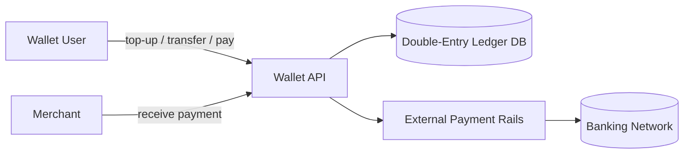
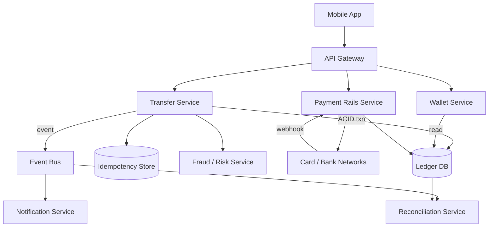
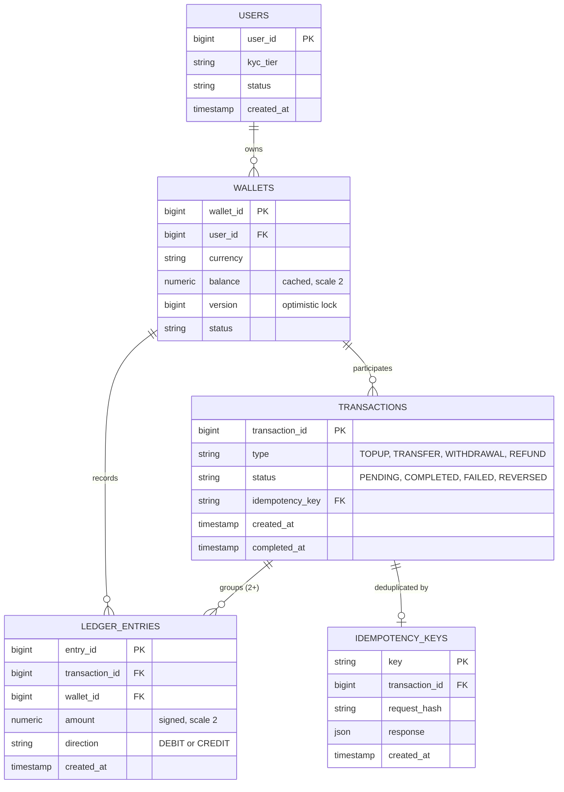
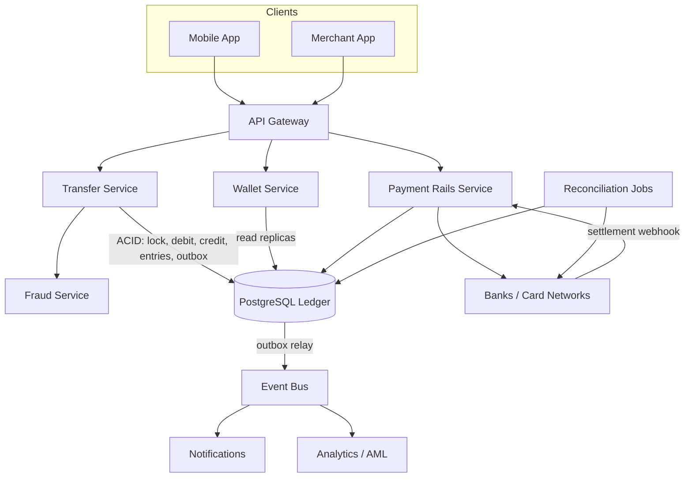
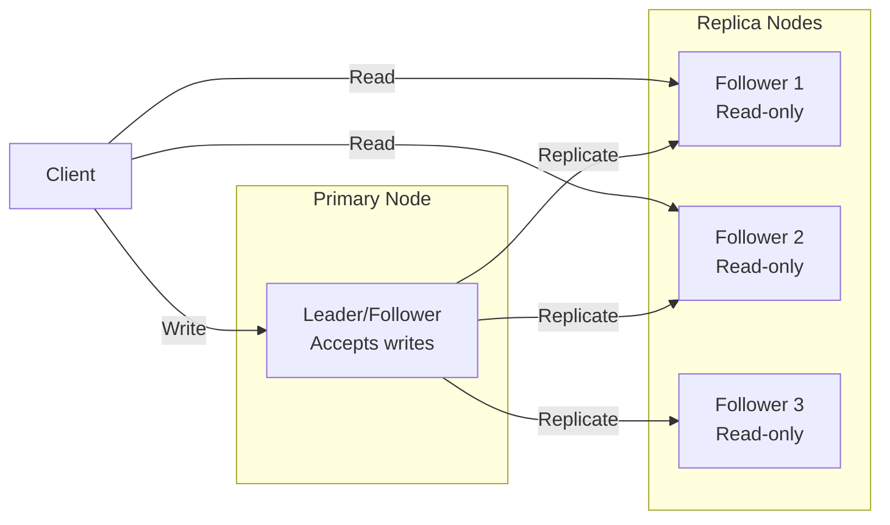
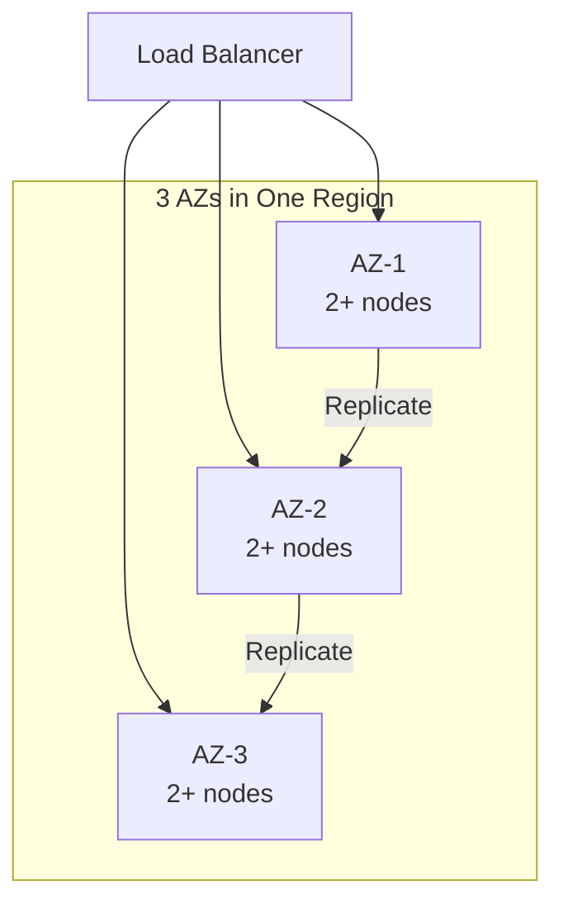
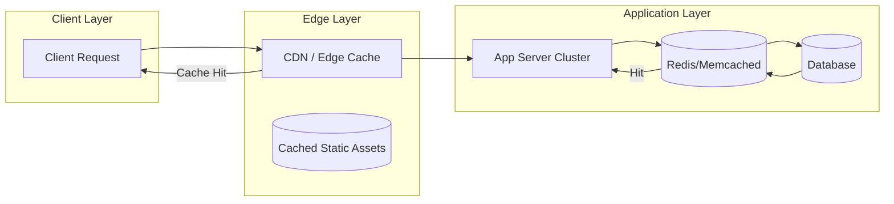
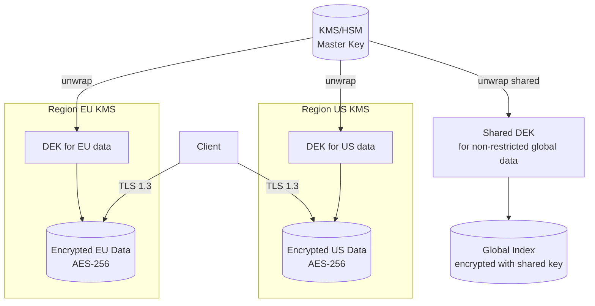
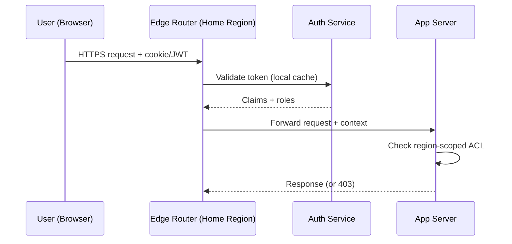
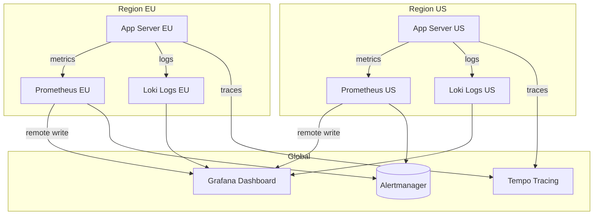

# Design a Digital Wallet

## Blogs and websites

## Medium

## Youtube

## Theory

### Topics Covered

1. [Introduction and Problem Statement](#introduction-and-problem-statement)
2. [Functional Requirements](#functional-requirements)
3. [Non-Functional Requirements](#non-functional-requirements)
4. [Capacity Estimation (back-of-envelope)](#capacity-estimation-back-of-envelope)
5. [Characteristics](#characteristics)
6. [Components](#components)
7. [Wallet Design Patterns](#wallet-design-patterns)
8. [Benefits](#benefits)
9. [Pros](#pros)
10. [Cons](#cons)
11. [Challenges](#challenges)
12. [Best Practices](#best-practices)
13. [When to Use / When Not to Use](#when-to-use-when-not-to-use)
14. [Use Cases](#use-cases)
15. [Data Model and APIAPI Design](#data-model-and-apiapi-design)
16. [High-Level Design](#high-level-design)
17. [Deep Dive: Double-Entry Ledger, Idempotency and Concurrency](#deep-dive-double-entry-ledger-idempotency-and-concurrency)
18. [Replication Strategies](#replication-strategies)
19. [Failure Detection and Membership](#failure-detection-and-membership)
20. [High Availability and Scalability](#high-availability-and-scalability)
21. [Performance and Optimization](#performance-and-optimization)
22. [Encryption and Key Management](#encryption-and-key-management)
23. [Authentication and Authorization](#authentication-and-authorization)
24. [Security Threats and Mitigations](#security-threats-and-mitigations)
25. [Observability and Logging](#observability-and-logging)
26. [Real-World Implementations](#real-world-implementations)
27. [Architectural Patterns](#architectural-patterns)
28. [Java and Spring Boot Implementation Guide](#java-and-spring-boot-implementation-guide)
29. [Interview Questions and Answers](#interview-questions-and-answers)

---
---
---

### Introduction and Problem Statement

A digital wallet is a system of record for stored monetary value. Products like Google Pay, Apple Pay, Paytm, Alipay, PayPal balance accounts, and in-game currencies all share the same core: users hold a balance, money moves in from external funding sources (bank accounts, cards), money moves between users (peer-to-peer), money moves out to merchants or back to banks, and — above all — **no money is ever created, lost, or duplicated by accident**.

The problem this solves is trust at scale. Cash settles instantly and physically; digital balances are just numbers in a database, so the system itself must guarantee settlement correctness. A single race condition that lets a user spend the same $100 twice, or a crash that debits Alice without crediting Bob, destroys the product. This is why wallet design is the canonical example of a *strongly consistent, correctness-first* system — the opposite end of the spectrum from feeds or leaderboards.

Design a digital wallet system (like Google Pay, Apple Pay, Paytm) that supports adding money, peer-to-peer transfers, merchant payments, and transaction history with strong consistency guarantees.



**Why digital wallets matter**

- They are the ledger of record for real money; correctness failures are legal and financial events, not UX bugs.
- They concentrate the hardest backend problems in one place: ACID transactions, idempotency, concurrency control, reconciliation, and regulatory auditability.
- They are a favorite senior-engineer interview topic because every shortcut (eventual consistency, floating-point money, retries without idempotency) produces a visible, catastrophic failure mode.

**Real-life use cases**

- **P2P payments**: splitting a dinner bill between friends.
- **Merchant payments**: scanning a QR code at a store.
- **Stored value**: transit cards, gift-card balances, gaming credits.
- **Payouts**: marketplaces paying sellers; gig platforms paying drivers.
- **Remittances**: cross-border value transfer with local cash-in/cash-out.

---

### Functional Requirements

1. **User registration and KYC verification.** Users onboard with identity verification tiered by jurisdiction; wallet limits depend on KYC level.
2. **Top-up (add money).** Pull funds from a linked bank account or card into the wallet balance; handle asynchronous confirmation from payment rails.
3. **Peer-to-peer transfer.** Move money from one wallet to another atomically, identified by user id, phone number, or handle.
4. **Merchant payment.** Pay a merchant via QR code, payment link, or in-app checkout; merchants settle to their bank on a schedule.
5. **Withdrawal.** Push wallet balance back to a linked bank account.
6. **Balance inquiry.** Return the current available balance fast, with pending amounts clearly separated.
7. **Transaction history and statements.** Paginated, filterable history; monthly statements; downloadable records.
8. **Refunds and disputes.** Reverse a merchant payment fully or partially; track dispute state through resolution.
9. **Idempotent APIs.** Retried requests must never double-apply.
10. **Notifications.** Push/SMS/email confirmation for every funds movement.

---

### Non-Functional Requirements

| Requirement | Target | Rationale |
|-------------|--------|-----------|
| Consistency | Strong (ACID) for all balance mutations | Money must never be lost or duplicated; balances are never eventually consistent |
| Availability | 99.99% (~52 min downtime/year) | Financial system; but prefer refusing a transaction over applying it incorrectly |
| Latency | Transfer decision < 1 s end-to-end; balance read < 100 ms | Users expect tap-and-done payments |
| Security | PCI-DSS scope for card data; TLS 1.3 in transit; AES-256 at rest; HSM-backed keys | Regulatory and breach-impact requirements |
| Auditability | Every state change traceable, append-only ledger, immutable history | Disputes, chargebacks, regulator audits |
| Durability | RPO = 0 for committed transactions | Committed money movement must survive any single failure |
| Correctness invariant | Sum of all debits equals sum of all credits, always | Double-entry bookkeeping invariant, machine-verifiable |

**Interview note:** explicitly state the priority order — correctness > durability > availability > latency. A wallet that is briefly unavailable is a bad day; a wallet that loses money is the end of the company.

---

### Capacity Estimation (back-of-envelope)

Assumptions: 50M registered wallets, 5M daily active users, each active user makes 2 financial transactions/day on average and checks balance/history 10 times/day.

**1. Transaction TPS**

```
Transactions/day  = 5M DAU × 2           = 10M transactions/day
Average TPS       = 10M / 86,400         ≈ 116 TPS
Peak TPS          = 10× average (paydays, festivals, sales) ≈ 1,200 TPS
Ledger writes     = 2 entries per transaction (double-entry)
                  ≈ 2,400 ledger rows/second at peak
```

1,200 TPS of ACID transactions is comfortably within a single well-tuned PostgreSQL primary (which sustains tens of thousands of simple TPS), but hot accounts (a popular merchant's settlement wallet) need care — see the Deep Dive on hot-row contention.

**2. Read QPS (balance + history)**

```
Reads/day         = 5M DAU × 10          = 50M reads/day
Average read QPS  ≈ 580; peak ≈ 6,000 QPS
```

Balance reads dominate and can be served from a read replica or a short-TTL cache (a few hundred ms of display staleness is acceptable for *displayed* balance; the *spendable* balance check always hits the primary inside the transaction).

**3. Storage**

```
Ledger rows/day   = 10M txns × 2 entries = 20M rows/day
Row size (ids, amount, txn ref, ts, indexes) ≈ 200 bytes
Growth            ≈ 4 GB/day ≈ 1.5 TB/year
```

The ledger is append-only and grows forever: plan partitioning by month from day one, with archival of cold partitions to cheaper storage. Wallet/account rows: 50M × ~500 bytes ≈ 25 GB — trivial.

**4. Bandwidth**

Responses are small JSON (a receipt ≈ 1–2 KB). Even 6,000 QPS × 2 KB ≈ 12 MB/s — bandwidth is never the bottleneck in a wallet; correctness and lock contention are.

**Summary table**

| Metric | Value |
|--------|-------|
| Peak transaction TPS | ~1,200 |
| Peak ledger writes | ~2,400 rows/s |
| Peak read QPS | ~6,000 |
| Ledger growth | ~4 GB/day (~1.5 TB/year) |
| Peak egress | ~12 MB/s |

---

### Characteristics

Each characteristic: what it means, why it matters, and a practical example.

- **Correctness-first**
  Every balance mutation must be atomic, isolated, and durable. There is no acceptable error budget for money movement — only for availability. *Example:* during a database failover the wallet rejects new transfers for 30 seconds rather than risk a split-brain double-spend.

- **Append-only ledger**
  The ledger records events (debits/credits), never updates them. Corrections are new reversing entries, preserving a complete audit trail. *Example:* a refund is a new pair of entries pointing at the original transaction, not an edit of the original rows.

- **Strong idempotency requirement**
  Clients retry on timeouts; networks duplicate messages; queues deliver at-least-once. Every mutating operation must be safe to replay. *Example:* a user whose app times out taps "pay" again; the second request returns the original receipt instead of charging twice.

- **Asynchronous external boundaries**
  Banks and card networks confirm asynchronously (webhooks, settlement files). The wallet's internal state machine must model "pending" explicitly. *Example:* a top-up shows as pending until the bank's webhook confirms settlement, then flips to completed.

- **High contention on hot accounts**
  Some accounts — a popular merchant, a platform fee account, a currency float account — receive a large share of all credits. Their rows become lock hotspots. *Example:* 30% of all transfers credit one merchant account; naive row locking serializes a third of all TPS through one row.

- **Read-heavy display path, write-critical decision path**
  Balance *display* can be cached; the balance *check inside a transfer* cannot. Confusing the two causes overdrafts. *Example:* showing a 500 ms stale balance on the home screen is fine; validating funds against that cache is a double-spend bug.

- **Regulated and audited**
  KYC/AML obligations, transaction monitoring, suspicious-activity reporting, and data-retention rules shape the data model and operations from day one.

- **Monetary precision constraints**
  Amounts are exact decimal quantities, never floats. *Example:* $0.1 + $0.2 in IEEE-754 double is 0.30000000000000004 — a rounding drift that compounds across millions of ledger entries and breaks the debit-equals-credit invariant.

---

### Components

A production wallet consists of these components, with their responsibilities and relationships.

- **API gateway**
  *Purpose:* single entry point. *Responsibilities:* TLS termination, authentication (OAuth2/JWT plus device binding), rate limiting, request signing verification, routing. *Example:* throttles each user to 10 payment attempts per minute, blocking credential-stuffing-driven payment spam before it reaches the core.

- **Wallet service**
  *Purpose:* own balances and wallet lifecycle. *Responsibilities:* create wallets, enforce KYC-tier limits, answer balance inquiries, maintain the cached display balance. *Relationship:* reads from the wallet DB; delegates all money movement to the transfer service so every balance change flows through one code path.

- **Transfer service**
  *Purpose:* the only component allowed to move money. *Responsibilities:* validate transfers, check idempotency, run the ACID debit/credit transaction, write ledger entries, emit transaction events. *Relationship:* owns the ledger DB transaction; publishes `transfer.completed` events consumed by notification, analytics, and fraud services.

- **Ledger service / ledger DB**
  *Purpose:* system of record. *Responsibilities:* store accounts and append-only double-entry entries; enforce the debit=credit invariant; serve reconciliation and statement queries. *How it works:* PostgreSQL with `SERIALIZABLE`-capable transactions, partitioned monthly, no UPDATE/DELETE grants on entries tables.

- **Payment rails integration service**
  *Purpose:* bridge to the outside world. *Responsibilities:* talk to card networks, ACH/UPI/FPS, bank APIs; handle their webhooks; manage settlement and retries. *Relationship:* calls the ledger to record pending entries when a top-up starts and final entries when the rail confirms — the ledger stays internally consistent even while external settlement is in flight.

- **Idempotency store**
  *Purpose:* deduplicate mutations. *Responsibilities:* record `idempotency_key → response` with a unique constraint; first writer wins, replays get the stored response. *How it works:* a DB table (transactional with the mutation) or Redis `SET NX` plus a DB record; DB-backed is preferred because it commits atomically with the transfer.

- **Fraud and risk service**
  *Purpose:* stop bad money movement. *Responsibilities:* real-time rules (velocity, amount anomalies, new-device transfers), ML scoring, sanctions/AML screening, step-up authentication triggers. *Relationship:* consulted synchronously in the transfer path (fast rules) and asynchronously (deep analysis can freeze funds post-hoc).

- **Notification service**
  *Purpose:* user-facing confirmations. *Responsibilities:* consume transaction events, send push/SMS/email receipts. *Relationship:* pure event consumer — never in the transaction path, so a notification outage cannot delay payments.

- **Reconciliation service**
  *Purpose:* prove correctness continuously. *Responsibilities:* verify Σdebits = Σcredits, match internal ledger against bank settlement files, alert on breaks. *Example:* a nightly job reconciles every top-up against the processor's settlement report; any mismatch pages on-call.

- **KYC/identity service**
  *Purpose:* regulatory identity. *Responsibilities:* document verification, sanctions screening, tier assignment. *Relationship:* the wallet service enforces tier limits (e.g., unverified wallets capped at $500 balance).



---

### Wallet Design Patterns

Each pattern: what it is, the problem it solves, how it works, when to use or avoid it, trade-offs, and a real-world example.

- **Double-entry bookkeeping**
  *What:* every transaction records two or more entries — a debit on one account, a credit on another — such that Σdebits = Σcredits always. *Problem solved:* single-entry "balance minus" updates cannot distinguish "money moved" from "money vanished"; double-entry makes every movement explicit and self-checking. *How:* accounts have types (user wallet, merchant, platform fee, external clearing); a transfer inserts balanced entries referencing the transaction id in one ACID commit. *When to use:* always, for real money. *Advantages:* inherent audit trail, machine-verifiable invariant, errors localize to one transaction. *Disadvantages:* 2× write volume; balance is a derived value requiring a maintained cache for fast reads. *Example:* every payment processor and bank core (Stripe's internal ledger, Square, Adyen) is double-entry.

- **Idempotency-key pattern**
  *What:* the client supplies a unique key per logical operation; the server stores the key with the result and replays the stored result on duplicates. *Problem solved:* safe retries across unreliable networks — the defining requirement of payment APIs. *How:* unique constraint on `idempotency_key`; insert key + execute mutation + store response in one transaction. *Advantages:* exact-once semantics from the client's perspective. *Disadvantages:* storage per operation; key-conflict policy needs care (same key + different payload → 409). *Example:* Stripe's `Idempotency-Key` header, adopted industry-wide.

- **ACID transfer (single-database transaction)**
  *What:* debit and credit in one database transaction. *Problem solved:* partial failure — debit without credit — is impossible. *How:* lock both account rows in deterministic order, validate balances, update balances, insert ledger entries, commit. *When to use:* whenever both accounts live in the same database — which is the design goal. *Advantages:* simple, correct, fast. *Disadvantages:* does not scale across services; hot accounts serialize. *Example:* the core P2P transfer in this design.

- **Saga pattern with compensation**
  *What:* a multi-step cross-service flow where each step has a compensating action. *Problem solved:* money movement that cannot fit in one ACID transaction (e.g., debit wallet → instruct bank payout via an external rail). *How:* orchestrate steps; on failure of step N, run compensations for steps 1..N−1 (e.g., re-credit the wallet if the payout instruction fails after debit). *Advantages:* works across service and organization boundaries where 2PC is impossible. *Disadvantages:* intermediate states are visible (funds "in flight"); compensations themselves can fail and need retry/escalation. *Original design note:* "Scenario: transfer partially fails — Step 1 debit Alice succeeds, Step 2 credit Bob fails → compensate: credit Alice back." Within one database we prefer a single ACID transaction; sagas are for the bank boundary.

- **Two-phase commit (2PC)**
  *What:* a coordinator asks participants to prepare, then commits everywhere or nowhere. *Problem solved:* atomic commit across two databases. *Reality check:* 2PC is slow, holds locks across a network, and blocks if the coordinator dies; modern practice avoids it across services. *When to use:* essentially only for same-cluster database partitioning scenarios where the technology is built in (e.g., distributed SQL). *Example:* the original design mentions "2PC for same-DB transactions" — in practice, a single PostgreSQL transaction replaces it; sagas replace it across services.

- **Event-sourced ledger**
  *What:* the ledger *is* an append-only event stream; balances are projections. *Problem solved:* perfect auditability and temporal queries. *Advantages:* state is derivable and rebuildable; natural fit for audit. *Disadvantages:* operational complexity; current-balance reads need a maintained projection anyway. *Example:* many modern ledger platforms store immutable entry events and materialize balances — this design does the pragmatic version: append-only entries table plus a maintained balance column guarded by the same transaction.

- **Outbox pattern**
  *What:* write domain changes and an outbox event row in the same transaction; a relay publishes the outbox to the event bus. *Problem solved:* the dual-write problem — committing to the DB and publishing to Kafka are not atomic, so a crash between them loses or duplicates events. *Advantages:* exactly-once-ish event publication tied to commit. *Disadvantages:* relay infrastructure, event-ordering care. *Example:* the `transfer.completed` event that triggers notifications is written to an outbox table inside the transfer transaction.

- **Pessimistic locking with deterministic lock ordering**
  *What:* `SELECT … FOR UPDATE` on both account rows, always locked in ascending account-id order. *Problem solved:* concurrent transfers between the same two accounts must serialize; undisciplined lock order deadlocks. *Advantages:* simple, no retry storms on hot accounts. *Disadvantages:* lock wait reduces concurrency; deadlock-free ordering must be enforced everywhere. *Alternative:* optimistic locking (`@Version`) with retries — better for low-contention accounts, worse for hot merchant accounts.

---

### Benefits

- **Provable correctness.** Double-entry entries make the fundamental invariant (Σdebits = Σcredits) a query, not a hope. Reconciliation can verify every single day that the system never created or destroyed money, and localize any break to a specific transaction.
- **Complete auditability.** The append-only ledger answers "what was the state at time T, and why did it change" for regulators, dispute resolution, and customer support — without any extra logging infrastructure.
- **Retry safety by construction.** Idempotency keys turn an unreliable network into exact-once semantics; clients can retry aggressively, which paradoxically improves both reliability and perceived latency.
- **Clear failure boundaries.** Internal transfers are ACID; external rails are sagas with explicit pending states. Every engineer can tell which guarantee applies where, which prevents the most dangerous bug class: treating an async external step as if it were atomic.
- **User trust.** Instant, receipt-backed, never-wrong balances are the product. Every architectural choice here compounds into the trust that makes users keep money in the wallet.

---

### Pros

- **Strong consistency where it matters.** Balances and transfers are ACID; there is no window where money is ambiguous.
- **Simple core, complex edges.** The central invariant (one ACID debit/credit transaction) is a few dozen lines; complexity is pushed to well-isolated edges (rails integration, fraud, reconciliation).
- **Horizontal read scaling.** Balance display and history read from replicas/caches without touching the strongly consistent path.
- **Regulator-ready.** Double-entry + append-only + idempotency records produce audit evidence as a byproduct of normal operation.
- **Testable invariant.** The debit=credit property enables powerful property-based tests and continuous reconciliation that catch entire bug classes automatically.

---

### Cons

- **Write amplification and storage growth.** Two-plus ledger rows per transaction, forever, append-only — ~1.5 TB/year at our scale, requiring partitioning and archival from day one.
- **Hot-account contention.** Platform fee accounts and popular merchants serialize transactions on their rows; mitigations (splitting float accounts, buffered postings) add real complexity.
- **Availability-consistency tension.** Under partition or failover, the wallet must choose downtime over incorrectness; product stakeholders must accept that payments can briefly refuse rather than risk error.
- **Operational weight.** Reconciliation jobs, settlement-file processing, KYC workflows, dispute tooling — the "boring" back office is a large fraction of total system cost.
- **Saga visibility.** During cross-boundary flows, users see pending states and occasionally compensating reversals; support and UX must be designed for money that is "in flight".
- **Hard to change the ledger schema.** An immutable, audited history resists refactoring; the entry schema must be designed carefully up front.

---

### Challenges

- **Technical: the double-spend race.** Two concurrent transfers from one wallet can both pass a read-then-write balance check. Solved only by locking (pessimistic or optimistic) or by serializing per-account — a check-then-act without isolation is a vulnerability, not a bug.
- **Scalability: hot rows.** A merchant receiving thousands of payments per second turns one account row into a global lock convoy. Mitigations: multiple float accounts summed at read time, buffered/batched postings for non-critical credits, or sharding the ledger by account with cross-shard coordination cost.
- **Performance: serializable-ish semantics at TPS.** Full `SERIALIZABLE` isolation is expensive; most wallet cores use `READ COMMITTED` with explicit row locks to get exactly the anomalies protection they need at higher throughput — a deliberate, argued choice, not a default.
- **Reliability: exactly-once across the bank boundary.** Bank APIs timeout ambiguously (did the payout land?). Resolution requires rail-specific inquiry APIs, reconciliation files, and conservative state machines that never assume success on timeout.
- **Maintainability: schema evolution of an immutable ledger.** You cannot rewrite history; new entry types and metadata are added additively, and migrations must be backfill-safe while the system runs.
- **Operational: reconciliation breaks.** Settlement files are late, malformed, or disagree with the ledger. Breaks need triage tooling and clear ownership; an unreconciled ledger is a regulatory incident waiting to happen.
- **Security: fraud and account takeover.** Stolen credentials plus a fast payment rail equals irreversible theft. Requires device binding, MFA/step-up on risky transfers, velocity limits, and ML risk scoring — all of which add friction that product teams will push back on.
- **Compliance: KYC/AML.** Tiered limits, sanctions screening, suspicious-activity reports, data retention rules — these are functional requirements, not afterthoughts, and they differ per jurisdiction.

---

### Best Practices

- **Use `BigDecimal` (or integer minor units) — never floating point — for money.** *Why:* IEEE-754 cannot represent decimal fractions exactly; $0.1 + $0.2 ≠ $0.3. Summed over millions of entries, float drift breaks the debit=credit invariant and produces pennies that appear from nowhere. *Example:* all amounts in this design are `BigDecimal` with scale 2 (or store cents as `BIGINT`).
- **Make every mutation idempotent.** *Why:* clients, load balancers, and message consumers all retry. *Example:* the transfer endpoint inserts the idempotency key in the same transaction as the ledger entries; a unique-violation means "already done — return the stored receipt".
- **Lock accounts in a deterministic global order.** *Why:* transfer A→B and B→A running concurrently deadlock if each locks its sender first; always locking the lower account id first makes deadlock impossible. *Example:* `SELECT … FOR UPDATE` ordered by `account_id`.
- **Derive balance from the ledger, cache it transactionally.** *Why:* the ledger is truth; a separately updated balance column can drift. Update the cached balance in the same ACID transaction as the entries, and run periodic `SUM(entries) = balance` reconciliation.
- **Model external money explicitly as pending.** *Why:* bank settlement is asynchronous and can fail after hours. *Example:* top-up creates pending entries against a "clearing account"; the rail's webhook flips them to settled — the invariant holds at every instant.
- **Publish events via the transactional outbox.** *Why:* committing the transfer and publishing to Kafka separately creates a dual-write window where a crash loses the notification or double-sends it.
- **Never update or delete ledger entries.** *Why:* corrections as reversing entries preserve the audit trail; mutable history is unauditable and often illegal. Enforce with database permissions (no UPDATE/DELETE grants), not just convention.
- **Reject on uncertainty, reconcile continuously.** *Why:* availability can be recovered; wrong money often cannot. A transfer that cannot confirm its preconditions fails closed, and daily reconciliation proves the invariant held.
- **Partition the ledger by time from day one.** *Why:* append-only tables at billions of rows degrade index and vacuum performance; monthly partitions keep the hot set small and archival cheap.
- **Treat fraud checks as part of the transaction path, not an afterthought.** *Why:* post-hoc detection of an irreversible instant payment is a loss, not a catch. Fast synchronous rules gate the transfer; deeper analysis runs asynchronously and can freeze remaining funds.

---

### When to Use / When Not to Use

**Use this architecture (ACID core + double-entry ledger + idempotency) when:**

- The system stores or moves real money or anything legally equivalent (credits redeemable for value, securities, deposits).
- Auditors, regulators, or dispute processes require a complete, immutable history.
- Errors have irreversible external consequences (a payout to a bank cannot be un-sent).

**Consider alternatives when:**

- **The "points" have no monetary or legal value** (game XP, karma): a simple counter column with atomic increments is enough; double-entry ceremony is wasted.
- **Throughput dwarfs correctness needs** (ad-impression accounting with statistical settlement): approximate, batched, eventually consistent pipelines (Lambda-style aggregation) are cheaper and sufficient.
- **You are embedding payments rather than building a wallet**: licensed providers (Stripe, Adyen, banking-as-a-service platforms) expose ledger APIs — buying is almost always right unless payments are your core business.
- **Cross-border crypto-rail settlement** is the product: then blockchain settlement finality and on-chain reconciliation become the core design instead of a relational ledger.

**Decision factors:** legal status of the value stored, audit/regulatory exposure, irreversibility of transfers, TPS vs. correctness trade-offs, and whether a licensed provider already covers the need. The senior answer in an interview is recognizing that "build the ledger yourself" is a liability decision as much as a technical one.

---

### Use Cases

**Use case 1: P2P transfer app (Venmo/Paytm-style)**

- *Problem:* 50M users sending money to each other; instant in-app settlement; money occasionally moves out to banks.
- *Proposed solution:* exactly this design — single PostgreSQL ledger, ACID transfers with deterministic lock ordering, idempotency keys, outbox-driven notifications.
- *Suitability:* ideal fit; all transfers are internal until withdrawal, so the ACID core covers ~99% of volume.
- *How it works:* sender taps pay → gateway authenticates → fraud fast-rules → transfer service locks both wallets in id order, checks balance, writes entries + outbox event, commits → push receipts to both users.
- *Trade-offs:* strong consistency caps single-row throughput; hot "platform" accounts handled with float-account splitting.

**Use case 2: Marketplace seller payouts**

- *Problem:* a marketplace must collect buyer payments, hold them, and pay 2M sellers weekly to their bank accounts.
- *Proposed solution:* ledger holds seller balances as liabilities; a payout saga per seller: debit seller wallet → instruct bank payout → confirm via rail webhook; compensation re-credits the wallet on failure.
- *Suitability:* perfect fit for the saga boundary; internal holds are ACID, the bank leg is asynchronous with explicit pending state.
- *Trade-offs:* payouts in flight for hours/days need visible states and support tooling; reconciliation against bank settlement files is mandatory, run daily.

**Use case 3: In-game currency wallet**

- *Problem:* players buy gems with real money and spend them in-game at very high TPS; gems are not legally money but purchases are.
- *Proposed solution:* hybrid — the *purchase* path (real money in) uses the full double-entry + idempotency treatment; the *spend* path (gems for items) uses atomic counter decrements with relaxed ledger ceremony.
- *Suitability:* right-sizing correctness to legal exposure; regulatory surface stays on the purchase boundary.
- *Trade-offs:* two consistency regimes in one product — engineers must not let the relaxed pattern leak into the real-money path.

**Use case 4: Corporate expense wallets**

- *Problem:* a company issues controlled spending wallets to employees with per-category limits and receipt capture.
- *Proposed solution:* wallet per employee with policy checks (category limits, merchant restrictions) evaluated in the transfer path; full ledger for expense audit.
- *Suitability:* strong fit; the audit trail is the product's selling point.
- *Trade-offs:* policy evaluation adds latency to the transfer path; kept under budget by precomputing per-wallet policy snapshots.

---

### Data Model and APIAPI Design

Base path: `/api/v1`. All endpoints require `Authorization: Bearer <JWT>` with device binding; mutations additionally require the `Idempotency-Key` header. Versioning via path; monetary amounts are strings (`"100.00"`) to preserve decimal precision across JSON clients.

**1. Create wallet**

```
POST /api/v1/wallets
{ "currency": "USD", "kycTier": "FULL" }
→ 201 Created
{ "walletId": "wlt_9f1c", "currency": "USD", "balance": "0.00", "status": "ACTIVE" }
```

**2. Top-up (add money from bank/card)**

```
POST /api/v1/wallets/wlt_9f1c/topups
Idempotency-Key: 7c9e…
{ "amount": "100.00", "fundingSourceId": "card_12ab" }
→ 202 Accepted
{ "topupId": "top_77de", "status": "PENDING", "amount": "100.00" }
```

202 (not 200) because settlement is asynchronous; a webhook later flips status to `SETTLED` or `FAILED`. Validation: amount > 0, ≤ tier limit, currency matches wallet.

**3. P2P transfer**

```
POST /api/v1/transfers
Idempotency-Key: 3b81…
{
  "fromWalletId": "wlt_9f1c",
  "toWalletId": "wlt_41aa",
  "amount": "25.50",
  "note": "Dinner split"
}
→ 200 OK
{
  "transferId": "trf_55cc",
  "status": "COMPLETED",
  "amount": "25.50",
  "fromBalance": "74.50",
  "completedAt": "2026-04-25T14:03:11Z"
}
```

**4. Balance inquiry**

```
GET /api/v1/wallets/wlt_9f1c
→ 200 OK
{ "walletId": "wlt_9f1c", "availableBalance": "74.50", "pendingBalance": "100.00", "currency": "USD", "asOf": "2026-04-25T14:03:12Z" }
```

**5. Transaction history (pagination, filtering, sorting)**

```
GET /api/v1/wallets/wlt_9f1c/transactions?type=TRANSFER&from=2026-04-01&to=2026-04-30
    &sort=-createdAt&limit=25&cursor=eyJvZmZzZXQiOjI1fQ
→ 200 OK
{
  "items": [ { "transferId": "trf_55cc", "type": "TRANSFER_OUT", "amount": "25.50", "counterparty": "wlt_41aa", "status": "COMPLETED", "createdAt": "…" } ],
  "nextCursor": "eyJvZmZzZXQiOjUwfQ",
  "limit": 25
}
```

Cursor-based pagination (offset pagination is unstable under an append-heavy table and forces expensive `OFFSET` scans). Filters: `type`, `status`, date range. Sort: `createdAt` ascending/descending only.

**Status codes and error responses**

| Code | Meaning |
|------|---------|
| 200/201/202 | Success / created / accepted-pending |
| 400 | Validation failure — `{ "error": "VALIDATION_FAILED", "details": [{ "field": "amount", "message": "must be positive" }] }` |
| 401/403 | Unauthenticated / KYC tier insufficient / not the wallet owner |
| 404 | Wallet or transfer not found |
| 409 | Idempotency-Key reused with a *different* payload |
| 422 | Business rule violation — `INSUFFICIENT_FUNDS`, `LIMIT_EXCEEDED`, `WALLET_FROZEN` |
| 429 | Rate limited; `Retry-After` header |
| 503 | Ledger unavailable; client may retry with the same idempotency key safely |

Rate limiting: 10 payment initiations/user/minute, 60 reads/user/minute; strict per-IP limits on authentication endpoints. Idempotency records retained 7 days.

---

#### Data Modeling



**Design notes**

- **PKs/FKs and constraints:** `WALLETS.user_id` FK to users; `LEDGER_ENTRIES` FK to both transactions and wallets; a `CHECK (scale(amount) <= 2)`-style constraint (or app-level enforcement) keeps precision; a DB constraint forbids inserting an unbalanced transaction via a deferred trigger or is enforced by making entries insertable only through the transfer service's transaction.
- **Indexes:** `LEDGER_ENTRIES(wallet_id, created_at DESC)` for history; `TRANSACTIONS(idempotency_key)` unique; `WALLETS(user_id)` for "my wallets". History queries never scan the whole ledger.
- **Normalization vs denormalization:** the ledger is fully normalized (no amount duplicated across entries beyond what double-entry requires). `WALLETS.balance` is a deliberate, defended denormalization: deriving balance by summing billions of entries per read is impossible, so the balance is cached and updated in the *same transaction* as the entries, with reconciliation as the safety net.
- **Partitioning:** `LEDGER_ENTRIES` and `TRANSACTIONS` are range-partitioned by month on `created_at`; cold partitions detach to archive storage. Within an instance, `WALLETS` is unpartitioned (25 GB total).
- **Immutability enforcement:** the application DB role has `INSERT` and `SELECT` on `LEDGER_ENTRIES` but no `UPDATE`/`DELETE` grants.
- **Sign convention:** one row per account effect — `direction` + positive `amount` — avoids ambiguous signed amounts and keeps the invariant check trivial: per transaction, `SUM(debits) = SUM(credits)`.

---

### High-Level Design



**Transfer flow (P2P) — preserved from the original design and expanded:**

```mermaid
sequenceDiagram
    participant C as Client
    participant GW as API Gateway
    participant TS as Transfer Service
    participant F as Fraud Service
    participant DB as Ledger DB
    participant N as Notification Service
    C->>GW: POST /transfers with Idempotency-Key
    GW->>TS: authenticated request
    TS->>DB: check idempotency key
    alt key already processed
        DB-->>TS: stored response
        TS-->>C: 200 original receipt
    else first time
        TS->>F: synchronous risk check
        F-->>TS: allow
        TS->>DB: BEGIN; lock wallets in id order; check balance; debit Alice; credit Bob; insert 2 ledger entries; write outbox event; COMMIT
        DB-->>TS: committed
        TS-->>C: 200 transfer receipt
        DB->>N: outbox relay: transfer.completed
        N->>C: push notification
    end
```

Steps in words (original five-step flow, kept): (1) client sends transfer; (2) validate — sender balance ≥ amount, recipient exists, limits checked; (3) one ACID transaction: debit sender, credit recipient, insert two ledger entries; (4) notifications sent (via outbox, off the critical path); (5) return the receipt.

**Failure handling across the bank boundary (saga) — preserved from the original design:**

```
Scenario: Withdrawal partially fails
  Step 1: Debit wallet (internal ACID)     → success
  Step 2: Instruct bank payout             → fails / ambiguous timeout
  Compensate: credit wallet back (reversing entries referencing the original transaction)

Alternative noted originally: Two-Phase Commit (2PC) for same-DB transactions —
in practice replaced by a single ACID transaction when both wallets are in one DB;
2PC across services is avoided (blocking, lock-holding, coordinator failure).
```

**Scaling and dependencies**

- All services are stateless except the ledger DB; scale services horizontally, scale the DB vertically plus read replicas.
- The DB primary is the deliberate strong-consistency bottleneck; at extreme scale, shard by wallet id — transfers between shards then require saga-style coordination, which is why sharding is postponed as long as possible.
- Failure handling: gateway retries only idempotent requests; DB failover to synchronous replica (RPO 0); rails webhooks are retried by the provider and deduplicated by event id; reconciliation catches anything everything else missed.

---

### Deep Dive: Double-Entry Ledger, Idempotency and Concurrency

**Double-entry ledger — the core invariant**

Every transaction creates two (or more) entries: a debit on one account, a credit on another (preserved from the original design):

```
Transfer: Alice sends $100 to Bob

Ledger entries:
 Entry 1: Alice's wallet   DEBIT  $100   "Transfer to Bob"
 Entry 2: Bob's wallet     CREDIT $100   "Transfer from Alice"

Invariant: SUM(debits) = SUM(credits) — ALWAYS
```

Why this matters technically: a single-entry model (just decrement Alice's balance column) cannot distinguish "the credit to Bob failed" from "Bob was credited" after a crash — the information is gone. With double-entry, the transaction's entries commit atomically or not at all, and any imbalance is detectable by a trivially simple reconciliation query. Multi-leg transactions extend naturally: a merchant payment with a 2% platform fee creates three entries (debit buyer $100, credit merchant $98, credit platform-fee account $2) — still balanced.

**ACID transfer mechanics**

The transfer transaction, precisely:

1. `BEGIN` (isolation `READ COMMITTED`).
2. Lock both wallet rows with `SELECT … FOR UPDATE`, **lower wallet id first** — deterministic order eliminates deadlocks between opposing transfers.
3. Re-read balances under lock; check `sender.balance >= amount`, statuses, limits.
4. Update both balances; insert both ledger entries; insert the idempotency record; insert the outbox event.
5. `COMMIT`.

Everything that must be atomic shares one commit — this is the single most important sentence in wallet design.

**Idempotency keys — exactly-once from the client's view**

The original design's three points, expanded into mechanics:

- The client generates a unique `idempotency_key` per logical request (UUID per tap of "pay", not per HTTP attempt).
- The server stores `(key, request_hash, response)` with a unique constraint on `key`, inserted **in the same transaction** as the ledger entries. A unique-violation on retry means the first attempt committed — fetch and return the stored response.
- Same key with a *different* payload (hash mismatch) → `409 Conflict`: the client has a bug; never silently apply.
- Why not Redis-only `SET NX`? The Redis claim and the DB commit are not atomic together; a crash between them either loses the record (double-charge on retry) or orphans it (retry rejected although nothing happened). DB-transactional idempotency eliminates the window. Redis may front it as a fast-path cache, with the DB as truth.
- Consumers of rails webhooks use the same mechanism keyed on the provider's event id.

**Balance consistency — cached balance with reconciliation**

Balance is derived state (`SUM(credits) − SUM(debits)`), maintained as a column for `O(1)` reads. The rule that keeps it correct: the balance column is only ever updated inside the transaction that writes the corresponding entries. A nightly job recomputes `SUM(entries)` per wallet and diffs against the column; any drift alerts. This gives fast reads with a proof of correctness rather than blind trust.

**Concurrency control — pessimistic vs optimistic**

- *Pessimistic* (`SELECT FOR UPDATE`): serializes concurrent transactions touching the same wallets. Right choice for hot accounts (merchants, fee accounts) because optimistic retries under high contention livelock and waste work.
- *Optimistic* (`@Version` column, retry on conflict): right choice for low-contention user wallets — no locks held, higher throughput in the common case.
- Both appear in real systems; the interview-worthy answer names the contention profile as the deciding factor, and notes both still require the deterministic lock/version discipline plus balance checks *inside* the transaction.

**Fraud checks in the money path**

Synchronous fast rules (velocity: max N transfers/min; amount vs. history percentile; new-device flag; sanctions list lookup) gate the commit with a strict latency budget (~50 ms). Asynchronous ML scoring runs on the outbox event stream and can freeze the destination wallet before withdrawal — layered defense matching the irreversibility of the rail.

**Integration with payment rails**

Top-up and withdrawal cross the asynchronous bank boundary:

- *Top-up flow:* request → create `PENDING` transaction with entries against a **clearing account** (debit clearing, credit wallet-pending — invariant holds immediately) → instruct processor → webhook confirms → flip entries to settled (debit processor-settled account, credit clearing). Failure → reverse pending entries.
- *Withdraw flow:* debit wallet, credit payout-clearing (ACID) → instruct bank payout (saga step) → webhook confirms or compensates (re-credit wallet with reversing entries).
- Ambiguous timeouts (did the bank get it?) resolve via rail-specific status-inquiry APIs and next-day settlement-file reconciliation — never by assuming.

---

### Replication Strategies

**What it means**

Replication Strategies determine how data and state are copied across multiple nodes in Digital Wallet. The choice of strategy determines the trade-off between consistency, availability, and latency.

**Why it matters**

Digital Wallet must replicate data to prevent loss and serve reads from multiple nodes. The replication strategy determines whether the system favors consistency (strong reads) or availability (always writable), and how it handles cross-node failure.

**How it works**

**Leader-based (single-leader)**: A single primary node accepts all writes; followers replicate changes asynchronously or semi-synchronously. Reads can be served from any replica. This strategy favors strong consistency for writes but creates a write bottleneck at the leader.



*Leader-based replication: a single primary node accepts all writes and replicates them to read-only followers. Clients can read from any replica for scaled read throughput, but all writes go through the leader.*

**Multi-leader (multi-master)**: Multiple nodes accept writes and exchange updates with each other. This enables low-latency writes in different regions but requires conflict resolution (last-write-wins, merge functions, or CRDTs).

**Leaderless (quorum-based)**: Any node can accept writes; a quorum of nodes must agree. Read and write quorums are configured so that at least one node overlaps between them (R + W > N). This maximizes availability and write scalability.

**Trade-offs for Digital Wallet**:

| Strategy | Use Case | Pros | Cons |
|---|---|---|---|
| Leader-based | payment credentials, transaction history, PII | Strong consistency, simple | Write bottleneck, leader failure risk |
| Multi-leader | public rates, anonymized volumes | Low-latency global writes | Conflict resolution, complex |
| Leaderless | Caching, counters | High availability, no bottleneck | Eventual consistency, read repair overhead |

**Real-world implementations**

- **Redis**: Leader-follower replication with asynchronous replication; Sentinel handles failover.
- **Apache Kafka**: Leader-based partition replication with ISR (in-sync replica) — writes go to the leader, followers replicate.
- **Cassandra**: Tunable consistency with leaderless quorum (R + W > N).
- **DynamoDB Global Tables**: Multi-master active-active across regions.

### Failure Detection and Membership

**What it means**

Failure Detection and Membership is the mechanism by which Digital Wallet determines which nodes are alive and part of the cluster. Membership is the list of known nodes; failure detection is the process of updating that list when nodes fail or recover.

**Why it matters**

Digital Wallet must route requests only to healthy nodes and trigger failover when a node goes down. False positives (healthy nodes marked as dead) cause unnecessary failovers and data loss. False negatives (dead nodes not detected) cause failed requests and degraded performance.

**How it works**

**Heartbeat-based detection**: Each node sends a heartbeat (ping) to a subset of peers at regular intervals. If a node misses N consecutive heartbeats, it is marked as suspect. The gossip protocol distributes membership information: each node exchanges its view of the cluster with a random peer, and the information propagates gossip-style.

```mermaid
sequenceDiagram
    participant A as Node A
    participant B as Node B
    participant C as Node C

    loop Every 1s
        A->>B: Heartbeat (ping)
        B-->>A: Heartbeat (ack)
    end
    B->>C: Gossip: A is alive
    C->>A: Gossip: B is alive
    Note over A,B,C: View converges in O(log N) rounds
```

*Gossip-based failure detection: each node periodically pings a random subset of peers and gossips its view of the cluster. The membership list converges in O(log N) rounds.*

**Phi Accrual Failure Detector**: Instead of a fixed timeout, the detector measures the time between consecutive heartbeats and computes a phi (φ) value — the probability that the node is dead given the observed heartbeat pattern. φ is compared against a threshold (typically 1–8); higher thresholds reduce false positives but increase detection latency.

**SWIM (Scalable Weakly-consistent Infection-style Process group Membership Protocol)**: Nodes ping a random subset of cluster members. If a ping fails, the node is marked "suspect" and the failure is "infected" (gossiped) to other nodes. This is O(log N) per failure detection cycle and scales to large clusters.

**Trade-offs**:

| Approach | Strengths | Weaknesses |
|---|---|---|
| Heartbeat (timeout-based) | Simple, deterministic | False positives under load |
| Phi Accrual | Adaptive threshold | Needs historical data |
| SWIM | Scales to 1000s of nodes | Eventual consistency |

**Real-world implementations**

- **AWS Route 53 Health Checks**: Uses TCP/HTTP health checks with configurable thresholds to remove unhealthy instances from DNS rotation.
- **Kubernetes**: Uses the kubelet heartbeat (every 10s) to determine node liveness; nodes missing 3 consecutive heartbeats are marked NotReady.
- **Consul**: Uses SWIM protocol for membership and failure detection; supports both LAN and WAN gossip.
- **Akka Cluster**: Uses Phi Accrual failure detector with configurable φ thresholds.

### High Availability and Scalability

**What it means**

High Availability and Scalability determines how Digital Wallet continues operating when nodes or entire zones fail, and how capacity is added as demand grows. HA is about minimizing downtime; scalability is about maintaining performance as load increases.

**Why it matters**

Digital Wallet must stay operational even when individual nodes, availability zones, or entire regions fail. At the same time, it must scale horizontally to handle traffic spikes without degrading latency. The two are intertwined: the replication strategy, failure detection, and load balancing all contribute to both HA and scalability.

**How it works**

**Availability zones (AZs)**: Nodes are distributed across multiple AZs within a region. Each AZ is an independent failure domain (power, networking, physical security). A load balancer distributes requests across AZs; if one AZ fails, traffic is routed to the remaining AZs with no data loss (assuming replication is in place).



*Multi-AZ deployment: a load balancer distributes traffic across three availability zones. Each AZ has multiple nodes. Data is replicated across AZs so that losing one AZ does not cause data loss or service interruption.*

**Load balancing**: A load balancer distributes incoming requests across healthy nodes. Algorithms include round-robin, least connections, and weighted routing. Health checks ensure traffic only goes to healthy nodes. For Digital Wallet, the load balancer also considers **API gateway**
  *Purpose:* single entry point. *Responsibilities:* TLS termina when routing.

**Auto-scaling**: The system automatically adds or removes nodes based on metrics (CPU, memory, request rate). Scale-out policies add nodes when load exceeds a threshold; scale-in policies remove nodes during low load. For stateful services like Digital Wallet, scale-out involves rebalancing partitions (moving data and connections to the new node).

**Failover and recovery**: When a node fails, the load balancer detects it (via health checks or failure detection) and stops sending traffic. A new node is provisioned (or a standby is promoted) and begins serving. For Digital Wallet, failover must preserve payment credentials, transaction history, PII data — this is achieved through replication with a quorum of healthy nodes.

**Scalability patterns**:

1. **Horizontal partitioning (sharding)**: Split data by a partition key (e.g., user_id, session_id) and distribute partitions across nodes. New nodes take ownership of additional partitions.

2. **Consistent hashing**: Minimize data movement on scale-out — only 1/N of the data moves to the new node. Nodes and partitions are placed on a ring; a request for key X is routed to the next node clockwise from hash(X).

3. **Connection draining**: When scaling in, existing connections are allowed to complete before the node is shut down. For Digital Wallet, this means draining active 1. sessions gracefully.

**Real-world implementations**

- **Netflix OSS (Eureka + Zuul + Ribbon)**: Service discovery with Eureka, edge routing with Zuul, and client-side load balancing with Ribbon. Scales to thousands of instances.
- **Kubernetes HPA + VPA**: Horizontal Pod Autoscaler scales pods based on CPU/memory; Vertical Pod Autoscaler adjusts resource requests based on historical usage.
- **AWS ALB + Auto Scaling Groups**: Application Load Balancer with auto-scaling groups across AZs; health checks replace unhealthy instances automatically.

### Performance and Optimization

**What it means**

Performance and Optimization covers the techniques Digital Wallet uses to achieve low latency, high throughput, and efficient resource usage. This section examines the key performance metrics, bottlenecks, and optimizations specific to the system.

**Why it matters**

Digital Wallet faces competing pressures: users demand low latency, the system must handle high throughput, and infrastructure costs must be controlled. The optimizations applied at the data, compute, and network layers determine whether the system meets its SLA.

**How it works**

**Latency layers**: Latency in Digital Wallet comes from three layers:
1. **Network**: Round-trip time from client to the nearest edge node / load balancer.
2. **Application**: Request processing time on the server (CPU, I/O, lock contention).
3. **Data**: Time to read/write from storage (cache hit vs. database query).

The 99th-percentile latency is the key metric for user-facing systems — it determines the worst-case experience.

**Caching strategies**: Digital Wallet uses multiple cache layers:
- **Edge cache**: Static assets (images, CSS, JS) served from a CDN at the edge. For Digital Wallet, this caches public rates, anonymized volumes that doesn't change frequently.
- **Application cache**: In-memory cache (e.g., Redis, Memcached) for frequently accessed data. Cache-aside pattern: application checks cache first, falls back to database on miss.
- **Local cache**: In-process cache (e.g., Caffeine, Guava) for data accessed within a single request. Avoids network round-trips.

**Batching and pipelining**: Digital Wallet batches small operations (e.g., writes, log flushes) to amortize per-operation overhead. Pipelining allows multiple requests to be in flight simultaneously.



*Caching hierarchy: clients first hit the edge CDN/cache; if the response is cached, it is returned immediately. Otherwise, the request reaches the application, which checks its in-memory/application cache (e.g., Redis) before falling back to the database. This minimizes latency from each layer.*

**Connection pooling**: Digital Wallet maintains a pool of database connections to avoid the TCP handshake overhead on every request. Pool size is tuned to match the database's capacity.

**Compression**: Responses are compressed (gzip, zstd) for clients that support it. At the network layer, gRPC uses HPACK header compression.

**Indexing**: Database tables are indexed on frequently queried fields. For Digital Wallet, indexes cover **Wallet service**
  *Purpose:* own balances and wallet lifecycle. *Responsibili and **Transfer service**
  *Purpose:* the only component allowed to move money. *Res for fast lookups.

**Asynchronous processing**: Non-critical background work (e.g., analytics, cleanup, notifications) is offloaded to message queues and processed asynchronously, keeping the request path fast.

**Resource isolation**: CPU and memory are allocated per service (containers with cgroup limits). This prevents a single misbehaving service from degrading the entire system.

**Metrics for Digital Wallet**:

| Metric | Target | How to Measure |
|---|---|---|
| P99 latency | < 1s | Load test with realistic traffic |
| Throughput | 1K RPS | Request rate under peak load |
| Error rate | < 0.1% | 5xx / total requests |
| Cache hit ratio | > 90% | cache_hits / (cache_hits + misses) |
| Resource utilization | < 80% CPU, < 85% memory | Container metrics |

**Real-world implementations**

- **Google's HTTP Load Balancer**: Global load balancing with edge PoPs; routes users to the nearest healthy backend.
- **Cloudflare**: Edge cache with Argo Smart Routing that dynamically routes traffic to avoid congestion.
- **Redis**: Used as an application cache with configurable eviction policies (LRU, LFU, TTL).

### Encryption and Key Management

**What it means**

Encryption and Key Management in Digital Wallet ensures that data is protected both at rest (stored on disk) and in transit (moving between services). Key management governs how encryption keys are generated, stored, rotated, and accessed — without proper key management, encryption provides a false sense of security.

**Why it matters**

Digital Wallet handles payment credentials, transaction history, PII that must be encrypted both at rest and in transit. Scaling Digital Wallet to handle increasing load while maintaining data consistency, low latency, and fault tolerance requires careful key management: keys must be rotated regularly, scoped to prevent cross-contamination, and audited for compliance. A single key compromise could expose sensitive data.

**How it works**

**At-rest encryption**: Data stored in **API gateway**
  *Purpose:* single entry point. *Responsibilities:* TLS termina, **Wallet service**
  *Purpose:* own balances and wallet lifecycle. *Responsibili and databases is encrypted using AES-256-GCM. The Data Encryption Key (DEK) is generated per data partition and encrypted with a Key Encryption Key (KEK) managed by a KMS (AWS KMS, GCP KMS, HashiCorp Vault). Keys are regionally scoped — only data belonging to a region can be decrypted by that region's KEK.

**In-transit encryption**: All inter-service communication uses TLS 1.3 or mTLS for service-to-service auth. Cross-region communication of public rates, anonymized volumes uses TLS + optional application-level encryption. payment credentials, transaction history, PII is NEVER transmitted in plaintext or across region boundaries.

**Key hierarchy**:
```
Master Key (HSM-backed, KMS-managed)
  └─ KEK (per region, per service)
     └─ DEK (per data partition, rotated every 90 days)
        └─ Data (encrypted with DEK)
```

**Key rotation**: KEKs rotate annually (automatic via KMS); DEKs rotate per object or per 90 days. Applications handle key version headers transparently — a DEK version is stored alongside the encrypted data.

**Cross-region key sharing**: For non-restricted data (public rates, anonymized volumes), a shared key is imported into each region's KMS. Restricted data NEVER uses cross-region keys — each region's KMS holds only that region's keys.



*Encryption key hierarchy: master keys are managed by an HSM-backed KMS and never leave the KMS. Each region has its own KEK. Data encryption keys (DEKs) are generated per partition and encrypted with the regional KEK. Only non-restricted global data uses a shared cross-region key. All client traffic uses TLS 1.3.*

**Java/Spring Boot Implementation**

```java
@Service
@RequiredArgsConstructor
public class DataEncryptionService {

    private final AWSKMS kms;
    @Value("${app.region}")
    private String region;
    @Value("${app.encryption.dek-ttl-minutes:1440}")
    private int dekTtlMinutes;

    private final Map<String, SecretKey> dekCache = new ConcurrentHashMap<>();

    public EncryptedData encrypt(String plaintext, String partitionId) {
        SecretKey dek = getOrCreateDek(partitionId);
        byte[] ciphertext = CryptoUtils.encrypt(plaintext.getBytes(StandardCharsets.UTF_8), dek);
        String dekCiphertext = kms.encrypt(EncryptRequest.builder()
            .keyId("arn:aws:kms:" + region + ":master-key")
            .plaintext(SdkBytes.fromByteArray(dek.getEncoded()))
            .build()).ciphertextBlob().asByteArray();
        return new EncryptedData(ciphertext, dekCiphertext, Instant.now());
    }

    private SecretKey getOrCreateDek(String partitionId) {
        return dekCache.computeIfAbsent(partitionId, id -> {
            try {
                return KeyGenerator.getInstance("AES").generateKey();
            } catch (NoSuchAlgorithmException e) {
                throw new IllegalStateException("Cannot generate DEK", e);
            }
        });
    }
}
```

*Spring Boot encryption service: DEKs are cached per-partition with TTL. Each DEK is encrypted via AWS KMS using a regional master key. The encrypted DEK (ciphertext) is stored alongside the data — only the KMS for that region can decrypt it.*

**Real-world implementations**

- **AWS KMS**: Managed HSM-backed key service; supports automatic key rotation and custom key stores.
- **HashiCorp Vault**: Open-source key management; supports transit encryption (encrypt/decrypt without storing keys).
- **Google Cloud KMS**: Hardware-backed key management with IAM-based access control.

### Authentication and Authorization

**What it means**

Authentication and Authorization (AuthN/AuthZ) in Digital Wallet control who can access the system and what they can do. Authentication verifies identity; authorization determines permissions. In a distributed system like Digital Wallet, auth must work across multiple nodes while respecting data boundaries — a user authenticated in one region should not have their session data or tokens replicated to regions where it is not permitted.

**Why it matters**

Digital Wallet must verify identity at the edge and enforce authorization at every service boundary. payment credentials, transaction history, PII must be protected — only users with appropriate roles should access it. At the same time, public rates, anonymized volumes data should be accessible to a wider audience with minimal friction.

**How it works**

**Authentication (who are you?)**:
- **JWT tokens**: Users authenticate through their home region's identity provider. The region returns a JWT (JSON Web Token) signed by a regional signing key. Tokens include claims like `iss` (issuer region), `sub` (subject/user ID), `home_region`, `roles`, and `exp` (expiry). Tokens are scoped per region — a token issued by region A cannot access restricted data in region B.
- **mTLS for service-to-service**: Internal services authenticate each other using mutual TLS certificates issued by a per-region Certificate Authority (CA). No shared secrets cross region boundaries.
- **Session management**: Sessions are stored regionally (Redis) and never replicated cross-region for restricted data. Session IDs are opaque UUIDs; the session store maps session ID → user context.

**Authorization (what can you do?)**:
- **RBAC (Role-Based Access Control)**: Users are assigned roles per region. Common roles: `region_admin` (full access to region data), `auditor` (read-only audit), `viewer` (read public data only). Roles are stored in the regional database and cached locally for sub-1ms lookups.
- **ABAC (Attribute-Based Access Control)**: Fine-grained permissions based on attributes (e.g., `home_region == request_region AND role == admin`). This allows expressing complex policies like "users can only access restricted data in their home region."
- **Resource-level authorization**: Each request is checked against an ACL (Access Control List) that specifies which roles can access which resources. For Digital Wallet, restricted resources require the `admin` role + matching region.



*Authentication flow: the user's token is validated by the regional auth service (claims cached locally). The edge router forwards the request with the security context. Each app server checks the region-scoped ACL before accessing restricted data.*

**Java/Spring Boot Implementation**

```java
@Service
@RequiredArgsConstructor
public class AuthorizationService {

    private final UserTokenRepository tokenRepository;
    @Value("${app.region}")
    private String currentRegion;

    public boolean canAccessResource(String userId, String resourceRegion,
                                     String action, JWTClaims claims) {
        String userHomeRegion = claims.getStringClaim("home_region");
        List<String> roles = claims.getStringListClaim("roles");

        if (!roles.contains(action)) {
            return false;
        }

        if (resourceRegion.equals(userHomeRegion)) {
            return true;
        }

        if (resourceRegion.equals("global")) {
            return roles.contains("global_reader");
        }

        return false;
    }
}

@RestController
@RequiredArgsConstructor
@RequestMapping("/api/v1")
public class RegionController {
    private final AuthorizationService authService;

    @GetMapping("/data/{region}/profile")
    public ResponseEntity<?> getProfile(
            @PathVariable String region,
            @RequestHeader("Authorization") String token) {
        JWTClaims claims = JwtUtils.parseAndValidate(token, currentRegion);

        if (!authService.canAccessResource(
                claims.getStringClaim("sub"), region, "read", claims)) {
            return ResponseEntity.status(HttpStatus.FORBIDDEN).build();
        }

        return ResponseEntity.ok(profileService.getByRegion(region));
    }
}
```

*Spring Boot authorization service: checks both the user's role and whether the requested resource violates region boundaries. The `canAccessResource` method returns false if a user from region EU tries to access restricted data in region US.*

**Real-world implementations**

- **Auth0**: JWT-based authentication with regional endpoints; supports custom rules for ABAC.
- **Okta**: Multi-region identity management with adaptive MFA and ThreatInsight for anomaly detection.
- **AWS Cognito**: Regional user pools with IAM integration; tokens are region-scoped by default.

### Security Threats and Mitigations

**What it means**

Security Threats and Mitigations catalog the attack surface of Digital Wallet, the most likely threats, and the corresponding defenses. Every distributed system has unique threat vectors — Digital Wallet is no exception.

**Why it matters**

Digital Wallet handles payment credentials, transaction history, PII that attackers might target. Scaling Digital Wallet to handle increasing load while maintaining data consistency, low latency, and fault tolerance expands the attack surface: more nodes, more network paths, more failure modes. Without proper threat modeling, a single vulnerability could expose sensitive data across the entire system.

**Threat model**:

| Threat | Likelihood | Impact | Mitigation |
|---|---|---|---|
| Data exfiltration (cross-region) | High | Critical | Region-scoped keys, no cross-region replication of restricted data |
| Man-in-the-middle (inter-service) | Medium | High | mTLS between all services |
| Replay attacks | Medium | High | Token expiry + nonce |
| DDoS at the edge | High | High | Rate limiting + edge filtering (Cloudflare, AWS Shield) |
| PII leakage in logs | High | High | PII redaction + field-level access control |
| Session hijacking | Medium | Medium | Short-lived tokens + IP binding |
| Privilege escalation | Low | Critical | Least-privilege RBAC + audit logs |
| Cache poisoning | Low | Medium | Cache invalidation on write + signed cache keys |

**How it works**

**Data exfiltration prevention**: Digital Wallet enforces data residency by design — payment credentials, transaction history, PII is never replicated cross-region. The replication layer checks a data classification label before allowing cross-region copy. A database-level policy (e.g., PostgreSQL RLS) also blocks cross-region queries for restricted partitions.

**mTLS enforcement**: All service-to-service communication uses mutual TLS. Certificates are issued by a per-region CA and rotated every 30 days. Services must present a valid certificate to communicate — no plaintext connections are allowed.

**PII redaction**: Application logs are scanned for PII patterns (email, phone, credit card) using an automated redaction layer (e.g., AWS Macie, Google DLP). public rates, anonymized volumes is logged freely; restricted fields are masked or dropped before logging.

```mermaid
graph TD
    subgraph "Threat Surface"
        Client[Client]
        Edge[Edge Router / WAF]
        App[App Server]
        DB[(Database)]
        Cache[(Cache)]
        Logs[Log Store]
    end

    Client -->|HTTPS| Edge
    Edge -->|mTLS| App
    App -->|mTLS| DB
    App -->|Read| Cache
    App -->|Write| DB
    App -->|Log| Logs

    subgraph "Mitigations"
        WAF[AWS WAF /<br/>Cloudflare]
        DLP[PII Redaction<br/>(Macie/DLP)]
        FIM[File Integrity<br/>Monitoring]
    end

    Edge -.-> WAF
    Logs -.-> DLP
    DB -.-> FIM
```

*Threat mitigation diagram: the WAF at the edge blocks DDoS and injection attacks. mTLS protects all service-to-service communication. PII redaction scans logs before storage. File integrity monitoring alerts on database tampering.*

**Audit trail**: All security-relevant events (auth, data access, config changes) are written to an append-only audit log with cryptographic integrity (HMAC per entry). The log covers payment credentials, transaction history, PII access — who accessed what, when, and from where.

**Real-world implementations**

- **Cloudflare**: Zero-trust model (All Connections to All Networks) with mTLS everywhere; uses GeoIP blocking and rate limiting for DDoS mitigation.
- **Google BeyondCorp**: Zero-trust network security model; all access is authenticated and authorized at the request level.

### Observability and Logging

**What it means**

Observability and Logging in Digital Wallet provide visibility into system behavior through three pillars: **metrics** (aggregates and counters), **logs** (structured event records), and **traces** (distributed request timelines). Together, these signals allow operators to debug issues, detect anomalies, and verify SLA compliance.

**Why it matters**

Distributed systems like Digital Wallet are inherently opaque — failures can cascade across services in unexpected ways. Without good observability, a single slow dependency can cause widespread timeouts that are nearly impossible to diagnose. Scaling Digital Wallet to handle increasing load while maintaining data consistency, low latency, and fault tolerance makes observability even more critical: operators need to see cross-region latency, regional failures, and data-residency violations.

**How it works**

**Metrics**: Digital Wallet instruments every service with Prometheus-style metrics:
- **Request rate, error rate, duration (the "RED" metrics)**: Tracks per-endpoint HTTP latency and error counts.
- **System metrics**: CPU, memory, disk I/O, network throughput per node.
- **Business metrics**: For Digital Wallet, this includes metrics like "**Wallet service**
  *Purpose:* own balances and wallet lifecycle. *Responsibili fill rate" and "reservation conflict rate".

Metrics are aggregated in a time-series database (Prometheus, VictoriaMetrics) and visualized in Grafana dashboards with alerts via PagerDuty.

**Logs**: Digital Wallet uses structured logging (JSON format) with standardized fields:
- `timestamp`: ISO 8601 UTC
- `level`: DEBUG, INFO, WARN, ERROR
- `service`: originating service name
- `trace_id`: distributed trace identifier (for correlation)
- `span_id`: current operation span
- `region`: the region that processed the request
- `data_class`: RESTRICTED or NON_RESTRICTED

payment credentials, transaction history, PII access is logged with full context (user, action, resource). public rates, anonymized volumes logs are aggregated and may have reduced retention.

**Distributed tracing**: Every request is assigned a trace ID at the edge. The trace propagates through all downstream services via HTTP headers. A tracing backend (Jaeger, Tempo, Zipkin) reconstructs the full request timeline, showing latency at each hop. For Digital Wallet, traces include region boundaries — a cross-region call is annotated as such.



*Observability architecture: each region runs its own Prometheus (metrics) and Loki (logs) instances. A global Grafana instance queries all regional backends. Traces are collected centrally in Tempo. Alerts fire from each region's Prometheus to Alertmanager.*

**Alerting**: Digital Wallet defines SLO-based alerts:
- **Latency**: P99 > 1s for 5 minutes → page.
- **Error rate**: > 1% for 10 minutes → page.
- **Availability**: < 99.5% for 15 minutes → page.
- **Data residency violation**: any restricted data detected outside its region → critical page.

**Java/Spring Boot Implementation**

```java
@Component
@RequiredArgsConstructor
@Slf4j
public class ObservabilityContext {

    @Value("${app.region}")
    private String region;

    public void logAccess(String userId, String resource, String action,
                          boolean restricted) {
        log.info("access_event userId={} resource={} action={} region={} data_class={}",
            userId, resource, action, region, restricted ? "RESTRICTED" : "NON_RESTRICTED");
    }
}

@RestController
@RequiredArgsConstructor
@Slf4j
public class ApiController {
    private final ObservabilityContext obs;
    private final UserService userService;

    @GetMapping("/api/v1/profile")
    public ResponseEntity<ProfileResponse> getProfile(
            @AuthenticationPrincipal UserDetails user) {
        String traceId = MDC.get("traceId");
        long start = System.nanoTime();

        try {
            ProfileResponse response = userService.getProfile(user.getId());
            obs.logAccess(user.getId(), "profile", "read", true);

            return ResponseEntity.ok(response);
        } finally {
            long durationMs = (System.nanoTime() - start) / 1_000_000;
            log.info("profile_read traceId={} latencyMs={} region={}",
                traceId, durationMs, obs.region);
        }
    }
}
```

*Spring Boot observability: the `ObservabilityContext` logs structured access events with data classification. The controller records latency and trace ID for every request, enabling SLO-based alerting.*

**Real-world implementations**

- **Netflix OSS (Atlas + Zipkin + Servo)**: Metrics via Atlas, traces via Zipkin, instrumented via Servo. Scales to over 700 billion requests/day.
- **Google SRE Workbook**: Comprehensive observability with SLI/SLO/SLI definition; uses Borgmon for metrics and Dapper for tracing.
- **AWS Observability**: CloudWatch for metrics, X-Ray for tracing, CloudWatch Logs for structured logs.

### Real-World Implementations

**Digital Wallet in production**

- **Digital Wallet platforms**: widely used digital wallet platform

**Key takeaways**

- Scalability patterns proven in production at scale
- Common pitfalls and how to avoid them
- Integration with existing infrastructure and monitoring

### Architectural Patterns

**Patterns relevant to Digital Wallet**

- **Layered/Clean Architecture**: Separates business logic from infrastructure concerns, enabling independent testing and maintenance.
- **Database-per-Service**: Each service manages its own data store, providing isolation but complicating cross-service queries.
- **Event-Driven Architecture**: Decouples services through asynchronous events; enables loose coupling and independent scaling.
- **CQRS (Command Query Responsibility Segregation)**: Separates read and write models for independent optimization; read models can be denormalized for query performance.
- **Saga Pattern**: Manages distributed transactions through a sequence of local transactions with compensating actions on failure.

**Pattern trade-offs**

- Layered architecture is simple to implement but can create tight coupling between layers over time.
- Database-per-service provides schema independence but requires careful design of cross-service consistency.
- Event-driven architecture enables loose coupling but introduces eventual consistency and debugging complexity.
- CQRS optimizes read/write paths independently but doubles the number of data models to maintain.
- Sagas handle long-running transactions but require idempotent compensations and careful state management.

### Java and Spring Boot Implementation Guide

Production-oriented Spring Boot 3.x / Java 17 implementation of the ACID transfer core: constructor injection, records for DTOs, Bean Validation, `BigDecimal` money, optimistic locking via `@Version`, pessimistic locking for hot accounts, and transactional idempotency.

**1. Entities (JPA)**

```java
import jakarta.persistence.*;
import java.math.BigDecimal;

@Entity
@Table(name = "wallets")
public class Wallet {

    @Id
    @GeneratedValue(strategy = GenerationType.IDENTITY)
    private Long walletId;

    @Column(nullable = false)
    private Long userId;

    @Column(nullable = false, length = 3)
    private String currency;

    /** Cached derived balance; updated only inside the ledger transaction. */
    @Column(nullable = false, precision = 19, scale = 2)
    private BigDecimal balance = BigDecimal.ZERO;

    /** Optimistic lock for low-contention paths. */
    @Version
    private long version;

    @Enumerated(EnumType.STRING)
    @Column(nullable = false)
    private WalletStatus status = WalletStatus.ACTIVE;

    protected Wallet() {}

    public Wallet(Long userId, String currency) {
        this.userId = userId;
        this.currency = currency;
    }

    public void debit(BigDecimal amount) {
        if (balance.compareTo(amount) < 0) {
            throw new InsufficientFundsException("Wallet " + walletId + " balance " + balance);
        }
        balance = balance.subtract(amount);
    }

    public void credit(BigDecimal amount) {
        balance = balance.add(amount);
    }

    public Long getWalletId() { return walletId; }
    public BigDecimal getBalance() { return balance; }
    public String getCurrency() { return currency; }
}

enum WalletStatus { ACTIVE, FROZEN, CLOSED }
```

```java
@Entity
@Table(name = "ledger_entries")
public class LedgerEntry {

    @Id
    @GeneratedValue(strategy = GenerationType.IDENTITY)
    private Long entryId;

    @Column(nullable = false)
    private Long transactionId;

    @Column(nullable = false)
    private Long walletId;

    @Enumerated(EnumType.STRING)
    @Column(nullable = false)
    private Direction direction;

    @Column(nullable = false, precision = 19, scale = 2)
    private BigDecimal amount;

    @Column(nullable = false)
    private Instant createdAt = Instant.now();

    protected LedgerEntry() {}

    public LedgerEntry(Long transactionId, Long walletId, Direction direction, BigDecimal amount) {
        this.transactionId = transactionId;
        this.walletId = walletId;
        this.direction = direction;
        this.amount = amount;
    }
}

enum Direction { DEBIT, CREDIT }
```

**2. Repositories**

```java
public interface WalletRepository extends JpaRepository<Wallet, Long> {

    /** Pessimistic lock for the transfer path — deterministic ordering done by caller. */
    @Lock(LockModeType.PESSIMISTIC_WRITE)
    @Query("SELECT w FROM Wallet w WHERE w.walletId = :id")
    Optional<Wallet> findByIdForUpdate(Long id);
}

public interface LedgerEntryRepository extends JpaRepository<LedgerEntry, Long> {

    @Query("SELECT COALESCE(SUM(CASE WHEN e.direction = 'CREDIT' THEN e.amount ELSE -e.amount END), 0) "
         + "FROM LedgerEntry e WHERE e.walletId = :walletId")
    BigDecimal derivedBalance(Long walletId);
}

public interface IdempotencyKeyRepository extends JpaRepository<IdempotencyRecord, String> {}
```

**3. Transfer service — transactional double-entry with idempotency**

```java
import org.springframework.beans.factory.annotation.Value;
import org.springframework.dao.DataIntegrityViolationException;
import org.springframework.stereotype.Service;
import org.springframework.transaction.annotation.Transactional;

import java.math.BigDecimal;
import java.util.List;

@Service
public class TransferService {

    private final WalletRepository wallets;
    private final LedgerEntryRepository ledger;
    private final TransactionRepository transactions;
    private final IdempotencyKeyRepository idempotency;
    private final FraudService fraudService;
    private final OutboxRepository outbox;
    private final BigDecimal maxTransferAmount;

    public TransferService(WalletRepository wallets,
                           LedgerEntryRepository ledger,
                           TransactionRepository transactions,
                           IdempotencyKeyRepository idempotency,
                           FraudService fraudService,
                           OutboxRepository outbox,
                           @Value("${wallet.transfer.max-amount:10000.00}") BigDecimal maxTransferAmount) {
        this.wallets = wallets;
        this.ledger = ledger;
        this.transactions = transactions;
        this.idempotency = idempotency;
        this.fraudService = fraudService;
        this.outbox = outbox;
        this.maxTransferAmount = maxTransferAmount;
    }

    /**
     * The money-moving core. One ACID transaction: idempotency record, balance
     * updates, double-entry ledger rows, and outbox event commit or roll back together.
     */
    @Transactional
    public TransferReceipt transfer(String idempotencyKey, Long fromWalletId,
                                    Long toWalletId, BigDecimal amount, String note) {
        if (amount.signum() <= 0 || amount.compareTo(maxTransferAmount) > 0) {
            throw new BusinessRuleException("Amount out of allowed range");
        }
        if (fromWalletId.equals(toWalletId)) {
            throw new BusinessRuleException("Cannot transfer to the same wallet");
        }

        // Idempotency: the unique PK insert is the claim; a violation means replay.
        try {
            idempotency.saveAndFlush(new IdempotencyRecord(idempotencyKey));
        } catch (DataIntegrityViolationException duplicate) {
            return idempotency.findById(idempotencyKey)
                    .map(IdempotencyRecord::receipt)
                    .orElseThrow(() -> new IllegalStateException("Idempotency record vanished"));
        }

        fraudService.checkTransfer(fromWalletId, toWalletId, amount);

        // Deterministic lock order prevents deadlocks between opposing transfers.
        Long first = Math.min(fromWalletId, toWalletId);
        Long second = Math.max(fromWalletId, toWalletId);
        Wallet firstLocked = wallets.findByIdForUpdate(first)
                .orElseThrow(() -> new WalletNotFoundException(first));
        Wallet secondLocked = wallets.findByIdForUpdate(second)
                .orElseThrow(() -> new WalletNotFoundException(second));
        Wallet from = firstLocked.getWalletId().equals(fromWalletId) ? firstLocked : secondLocked;
        Wallet to = firstLocked.getWalletId().equals(fromWalletId) ? secondLocked : firstLocked;

        if (!from.getCurrency().equals(to.getCurrency())) {
            throw new BusinessRuleException("Cross-currency transfer requires FX service");
        }

        from.debit(amount);   // throws InsufficientFundsException if balance < amount
        to.credit(amount);

        Transaction txn = transactions.save(
                new Transaction(TransactionType.TRANSFER, TransactionStatus.COMPLETED, idempotencyKey));
        ledger.saveAll(List.of(
                new LedgerEntry(txn.getTransactionId(), from.getWalletId(), Direction.DEBIT, amount),
                new LedgerEntry(txn.getTransactionId(), to.getWalletId(), Direction.CREDIT, amount)));
        outbox.save(new OutboxEvent("transfer.completed", txn.getTransactionId()));

        TransferReceipt receipt = new TransferReceipt(
                txn.getTransactionId(), "COMPLETED", amount, from.getBalance(), txn.getCreatedAt());
        idempotency.findById(idempotencyKey).ifPresent(r -> r.attachReceipt(receipt));
        return receipt;
    }
}
```

Why the code is shaped this way: `findByIdForUpdate` with id ordering makes deadlocks structurally impossible; `debit` throws inside the transaction so insufficient funds rolls everything back including the idempotency claim (the client can retry after topping up); the outbox row commits atomically, so notifications can never reference an uncommitted transfer.

**4. DTOs and controller**

```java
import jakarta.validation.constraints.*;
import java.math.BigDecimal;

public record TransferRequest(
        @NotNull Long fromWalletId,
        @NotNull Long toWalletId,
        @NotNull @DecimalMin(value = "0.01") @Digits(integer = 17, fraction = 2) BigDecimal amount,
        @Size(max = 140) String note) {}

public record TransferReceipt(Long transferId, String status, BigDecimal amount,
                              BigDecimal fromBalance, Instant completedAt) {}
```

```java
import jakarta.validation.Valid;
import org.springframework.http.ResponseEntity;
import org.springframework.web.bind.annotation.*;

@RestController
@RequestMapping("/api/v1/transfers")
public class TransferController {

    private final TransferService transferService;

    public TransferController(TransferService transferService) {
        this.transferService = transferService;
    }

    @PostMapping
    public ResponseEntity<TransferReceipt> transfer(
            @RequestHeader("Idempotency-Key") String idempotencyKey,
            @Valid @RequestBody TransferRequest request) {
        TransferReceipt receipt = transferService.transfer(
                idempotencyKey, request.fromWalletId(), request.toWalletId(),
                request.amount(), request.note());
        return ResponseEntity.ok(receipt);
    }
}
```

**5. Exception handling**

```java
import org.springframework.http.HttpStatus;
import org.springframework.http.ResponseEntity;
import org.springframework.web.bind.MethodArgumentNotValidException;
import org.springframework.web.bind.annotation.ExceptionHandler;
import org.springframework.web.bind.annotation.RestControllerAdvice;

import java.util.List;
import java.util.Map;

@RestControllerAdvice
public class GlobalExceptionHandler {

    @ExceptionHandler(InsufficientFundsException.class)
    public ResponseEntity<Map<String, Object>> insufficient(InsufficientFundsException ex) {
        return ResponseEntity.status(HttpStatus.UNPROCESSABLE_ENTITY)
                .body(Map.of("error", "INSUFFICIENT_FUNDS", "message", ex.getMessage()));
    }

    @ExceptionHandler(BusinessRuleException.class)
    public ResponseEntity<Map<String, Object>> business(BusinessRuleException ex) {
        return ResponseEntity.status(HttpStatus.UNPROCESSABLE_ENTITY)
                .body(Map.of("error", "BUSINESS_RULE_VIOLATION", "message", ex.getMessage()));
    }

    @ExceptionHandler(WalletNotFoundException.class)
    public ResponseEntity<Map<String, Object>> notFound(WalletNotFoundException ex) {
        return ResponseEntity.status(HttpStatus.NOT_FOUND)
                .body(Map.of("error", "WALLET_NOT_FOUND", "message", ex.getMessage()));
    }

    @ExceptionHandler(MethodArgumentNotValidException.class)
    public ResponseEntity<Map<String, Object>> validation(MethodArgumentNotValidException ex) {
        List<Map<String, String>> details = ex.getBindingResult().getFieldErrors().stream()
                .map(f -> Map.of("field", f.getField(), "message", String.valueOf(f.getDefaultMessage())))
                .toList();
        return ResponseEntity.badRequest().body(Map.of("error", "VALIDATION_FAILED", "details", details));
    }
}
```

**6. Balance read service (replica-friendly)**

```java
@Service
@Transactional(readOnly = true)
public class BalanceService {

    private final WalletRepository wallets;

    public BalanceService(WalletRepository wallets) {
        this.wallets = wallets;
    }

    public BalanceResponse balance(Long walletId) {
        Wallet wallet = wallets.findById(walletId)
                .orElseThrow(() -> new WalletNotFoundException(walletId));
        return new BalanceResponse(walletId, wallet.getBalance(), wallet.getCurrency(), Instant.now());
    }
}
```

Configuration via `application.yml`: `wallet.transfer.max-amount`, `spring.datasource` with Hikari pool sizing (`maximum-pool-size` tuned to DB connection budget), and `spring.jpa.properties.hibernate.jdbc.batch_size` for ledger batch inserts. Interview point: every externalized value (`@Value`) is an operational knob — max transfer amount changes without a redeploy.

---

### Interview Questions and Answers

**Beginner**

- **Q: Why can't you store money in a `double`?**
  **A:** IEEE-754 floating point cannot represent most decimal fractions exactly ($0.1 + $0.2 = 0.30000000000000004). Ledger entries must sum exactly — Σdebits = Σcredits — so any representation error compounds into phantom money. Use `BigDecimal` with fixed scale in Java, `NUMERIC(19,2)` in PostgreSQL, or integer minor units (cents) as `BIGINT`. *Common mistake:* serializing amounts as JSON numbers, which reintroduces float parsing in clients — send strings.

- **Q: What is double-entry bookkeeping and why do wallets use it?**
  **A:** Every transaction records balanced debits and credits across accounts so total debits always equal total credits. It makes money movement explicit and self-checking: any crash or bug that debits without crediting breaks a trivially checkable invariant, and the append-only entry log is a complete audit trail for disputes and regulators.

- **Q: What is an idempotency key?**
  **A:** A client-generated unique identifier for one logical operation, sent on every retry. The server stores it (unique constraint) together with the result, in the same transaction as the mutation. Retries return the stored result instead of re-executing — giving exact-once semantics over unreliable networks. Stripe popularized the `Idempotency-Key` header pattern.

- **Q: Walk through a P2P transfer at a high level.**
  **A:** Authenticate and validate; check idempotency; run fraud fast-rules; in one ACID transaction — lock both wallets in id order, verify balance, debit sender, credit recipient, insert two ledger entries, write outbox event, commit; then send notifications asynchronously and return the receipt.

**Intermediate**

- **Q: Two users transfer to each other simultaneously and your system deadlocks. Why, and how do you prevent it?**
  **A:** Transfer A→B locks A then B; B→A locks B then A — circular wait. Fix: always acquire row locks in a deterministic global order (ascending wallet id). Then B→A also locks A first, and one transaction simply waits instead of deadlocking. *Follow-up:* deadlock detection (`DeadlockLoserDataAccessException`) plus retry is the safety net, not the strategy.

- **Q: Your client times out after sending a transfer. Was the user charged?**
  **A:** Unknown — the request may or may not have committed. That is exactly why idempotency keys exist: the client retries with the same key and either gets the original committed receipt or executes once. Without idempotency, the only safe answers are a status-inquiry endpoint or reconciliation — both worse.

- **Q: Optimistic vs pessimistic locking for wallet balances — which and when?**
  **A:** Optimistic (`@Version`, retry on conflict) for low-contention user wallets: no lock holding, best throughput when conflicts are rare. Pessimistic (`SELECT FOR UPDATE`) for hot accounts like popular merchants or platform fee accounts: under high contention optimistic retries livelock and multiply work, while queuing on the row lock is stable. The deciding factor is the contention profile, measured per account type.

- **Q: How do top-ups work given banks settle asynchronously?**
  **A:** Create a PENDING transaction with balanced entries against a clearing account (invariant holds immediately); instruct the processor; when the settlement webhook arrives, post the settling entries and flip status to SETTLED; on failure, post reversing entries. The user sees a pending balance throughout, and the ledger is never unbalanced at any instant.

**Advanced**

- **Q: Why store the idempotency record in the same DB transaction as the ledger entries instead of Redis?**
  **A:** Atomicity. If the claim (Redis `SET NX`) and the ledger commit are separate systems, a crash between them either double-applies on retry or rejects a retry for a transaction that never happened. One database transaction makes "recorded the key" and "moved the money" atomic. Redis may still front the check as a cache, but the DB unique constraint is the arbiter.

- **Q: How do you keep the cached balance column consistent with the ledger?**
  **A:** Update it only inside the transaction that writes the entries — never separately. Then verify: a periodic job recomputes `SUM(credits) − SUM(debits)` per wallet and diffs against the column; drift pages on-call because it can only mean a code path bypassed the transfer service. Balance is derived state with a maintained cache, not an independent value.

- **Q: A merchant receives 5,000 payments/second and their wallet row is a lock hotspot. Options?**
  **A:** (1) Split into N float accounts (merchant balance = sum), spreading lock contention; (2) buffer credits — append payment intents and batch-post to the merchant account every few hundred ms; (3) shard the ledger by account id and accept cross-shard coordination for transfers touching the merchant; (4) for the platform fee account specifically, aggregate fees per batch settlement instead of per transaction. Each trades read simplicity or settlement latency for write throughput.

- **Q: Design the withdrawal flow to a bank account, including failure handling.**
  **A:** A saga: step 1 — ACID debit of the wallet with entries crediting a payout-clearing account and an outbox event; step 2 — instruct the bank payout asynchronously; step 3 — on confirmation webhook, finalize entries; on failure or ambiguous timeout, compensate with reversing entries crediting the wallet. Ambiguous states resolve via the rail's status-inquiry API and next-day settlement-file reconciliation — never by assuming success on timeout, which is how money is created from nothing.

- **Q: How would you reconcile against a bank's settlement file?**
  **A:** Nightly: load the processor's settlement report, match each line to ledger transactions by processor reference id, classify breaks (missing internally = we never recorded; missing externally = rail never settled; amount mismatch = fee/FX discrepancy), and alert on any unmatched or mismatched items with an aging report. Reconciliation is a correctness mechanism, not reporting: it is the only way to catch silent rail failures and webhook loss.

**Senior / system design**

- **Q: When would you shard the ledger, and what breaks when you do?**
  **A:** Only when the single primary cannot sustain peak TPS or storage — typically far beyond initial estimates, because one PostgreSQL primary handles thousands of ACID TPS. When you do shard (by wallet id), transfers whose wallets land on different shards lose single-transaction ACID and need cross-shard sagas with compensation — reintroducing partial-failure semantics into the internal path. That is why sharding is postponed and why hot-account mitigation is attempted first.

- **Q: Why is 2PC generally avoided for wallet microservices?**
  **A:** 2PC holds locks across a network during the prepare phase, multiplying latency and failure blast radius; a coordinator crash leaves participants blocked in-doubt; and it couples the availability of every participant to every transaction. Sagas with explicit compensations and pending states give the same business outcome with degradable, debuggable behavior — at the cost of visible intermediate states, which the UX and support tooling must handle.

- **Q: Order these by priority for a wallet and defend it: availability, consistency, latency, durability.**
  **A:** Durability and consistency first — committed money must survive anything and must never be wrong; availability next — a refused transaction is recoverable, a wrong one may not be; latency last — users tolerate 800 ms, not lost funds. Every design decision here flows from that ordering: synchronous DB replication (RPO 0), ACID core, fail-closed transfers, and asynchronous edges (notifications, analytics) so noncritical slowness never touches the money path.

- **Q: How do you design limits and KYC tiers so they are enforceable but evolvable?**
  **A:** Limits are policy, not constants: store tier definitions (daily send cap, balance cap, withdrawal cap) in configuration or a policy table; evaluate them inside the transfer transaction against the locked wallet state so concurrent transfers cannot each pass under the cap; keep jurisdiction-specific rules in a policy service so adding a market is configuration, not a schema change. *Common mistake:* checking limits before the transaction, outside the lock — two concurrent transfers then both pass and exceed the cap.

- **Q: What is the dual-write problem and how does the outbox pattern solve it here?**
  **A:** A transfer must commit to the DB and publish an event to Kafka; two systems, no shared transaction — a crash between them either loses the event (no receipt sent, fraud service blind) or duplicates it. The outbox pattern writes the event row in the same DB transaction as the ledger entries; a relay tails the outbox table (CDC or poller) and publishes to Kafka at-least-once, with consumers idempotent on event id. The commit boundary and the event boundary become one.
