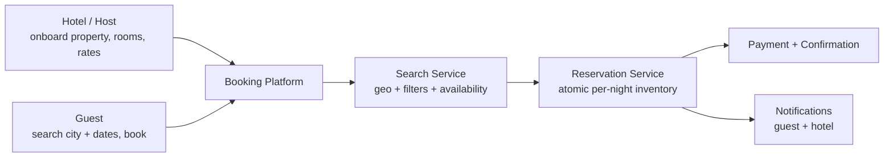
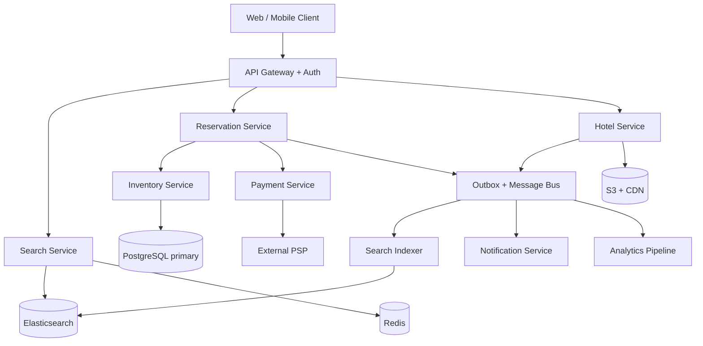
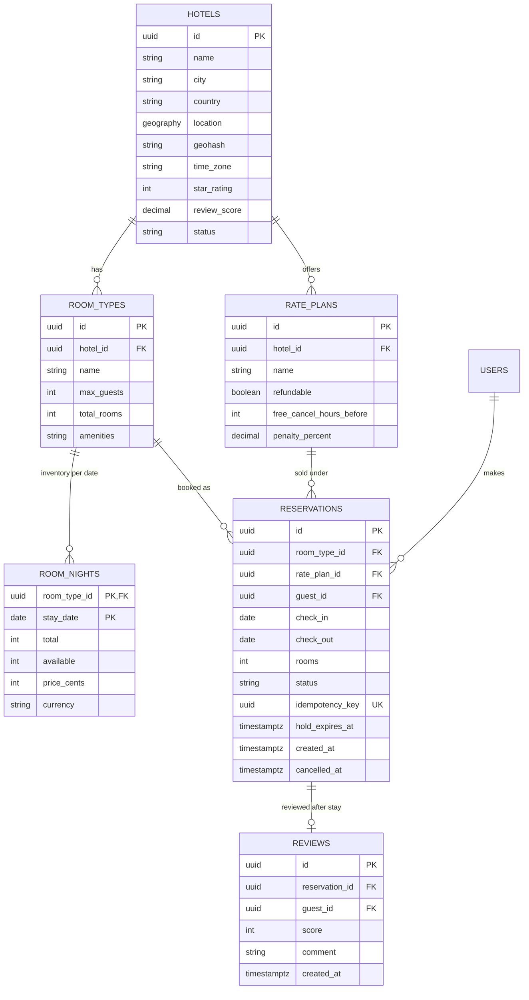
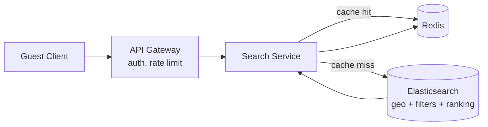
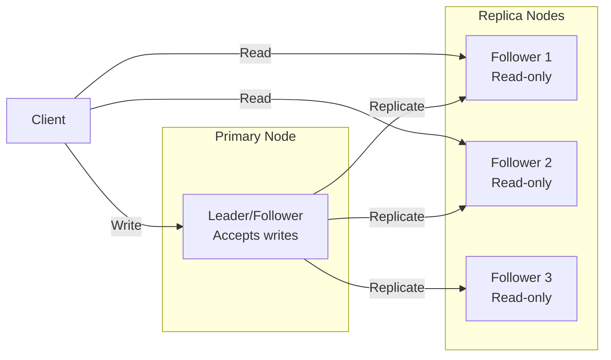
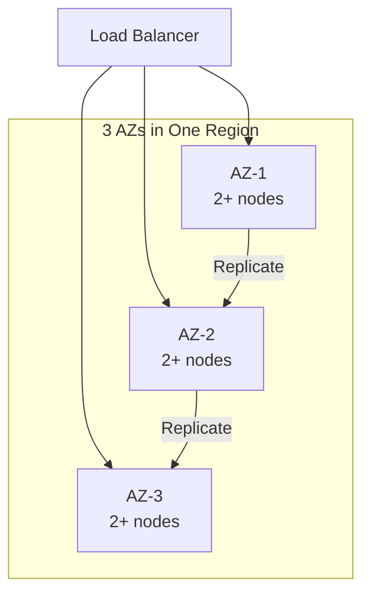
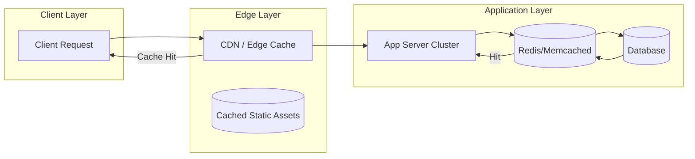
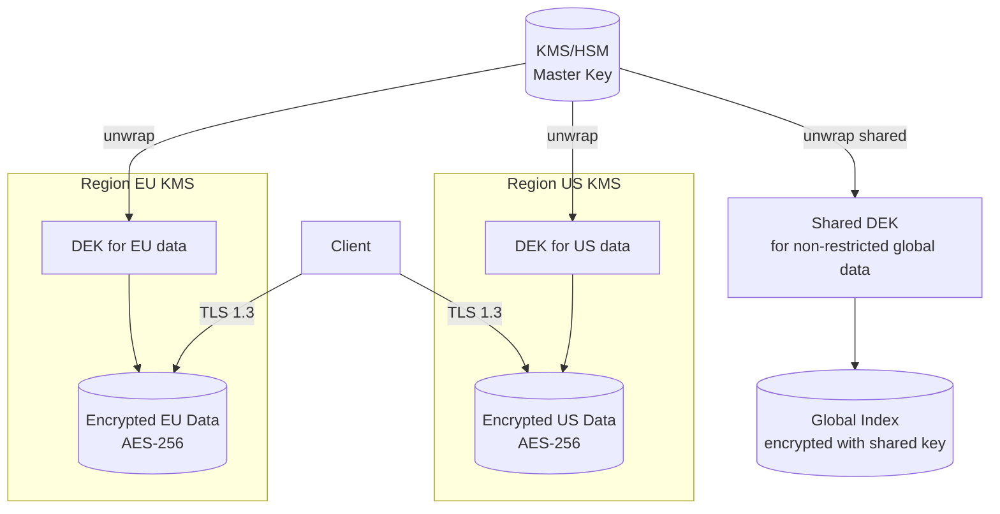
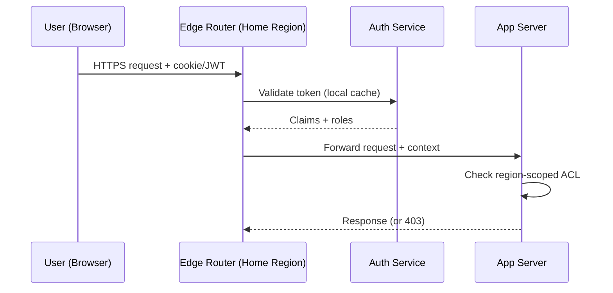
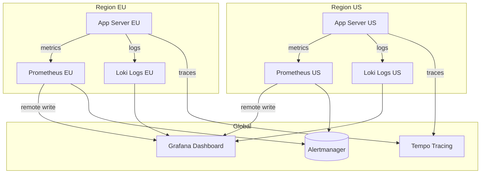

# Design Airbnb/Booking.com

## Blogs and websites

## Medium

## Youtube

- [Hotel Reservation (AirBnb, Booking.com) - System Design Interview Question](https://www.youtube.com/watch?v=m67Mjbx6DMY) 13.39
- [Airbnb System Design | Booking.com System Design | System Design Interview Question](https://www.youtube.com/watch?v=YyOXt2MEkv4) 38.56
- [Design a Hotel Booking System Like a Senior Engineer](https://www.youtube.com/watch?v=bA0r0CBuj2Y) 44.37

- [Hotel Booking Sites System Design Explained | Airbnb | Agoda | Make My Trip | @SCALER](https://www.youtube.com/watch?v=ctDvzgZj6vw) 1.38.50
- [System Design: Hotel Booking](https://www.youtube.com/watch?v=Ale7Fn921GQ) 31.03
- [Design a Hotel Reservation System like Expedia & Kayak | System Design](https://www.youtube.com/watch?v=gGzXvlmbtSI)

- [Mastering Airbnb System Design: A Complete Guide for Interviews & Architecture](https://www.youtube.com/watch?v=AGDLoLEcv_I)
- [System Design 5: Design Hotel Booking App like AirBnb / Booking.com | Proximity | HLD | LLD](https://www.youtube.com/watch?v=mH2Ye3_vErw)

- [Design Scalable Hotel Booking System Like Airbnb or MakeMyTrip | Backend Architecture Explained](https://www.youtube.com/watch?v=lA24q8x2cT4)

## Theory


### Topics Covered

1. [Introduction / Problem Statement](#introduction-problem-statement)
2. [Functional Requirements](#functional-requirements)
3. [Non-Functional Requirements](#non-functional-requirements)
4. [Capacity Estimation](#capacity-estimation)
5. [Characteristics](#characteristics)
6. [Components](#components)
7. [Architectural Patterns](#architectural-patterns)
8. [Benefits](#benefits)
9. [Pros](#pros)
10. [Cons](#cons)
11. [Challenges](#challenges)
12. [Best Practices](#best-practices)
13. [When to Use / When Not to Use](#when-to-use-when-not-to-use)
14. [Use Cases](#use-cases)
15. [Data Model and APIAPI Design](#data-model-and-apiapi-design)
16. [High-Level Design](#high-level-design)
17. [Deep Dive](#deep-dive)
18. [Replication Strategies](#replication-strategies)
19. [Failure Detection and Membership](#failure-detection-and-membership)
20. [High Availability and Scalability](#high-availability-and-scalability)
21. [Performance and Optimization](#performance-and-optimization)
22. [Encryption and Key Management](#encryption-and-key-management)
23. [Authentication and Authorization](#authentication-and-authorization)
24. [Security Threats and Mitigations](#security-threats-and-mitigations)
25. [Observability and Logging](#observability-and-logging)
26. [Real-World Implementations](#real-world-implementations)
27. [Java and Spring Boot Implementation Guide](#java-and-spring-boot-implementation-guide)
28. [Interview Questions and Answers](#interview-questions-and-answers)

---
---
---

### Introduction / Problem Statement

Design a hotel booking platform (Airbnb, Booking.com, Expedia, MakeMyTrip) where hotels or hosts publish rooms with per-night availability and prices, and guests search by location and date range, then reserve a room for a stay. The system must guarantee that a room is never sold twice for the same night, even under concurrent bookings.

Hotel booking is the canonical **date-range inventory** problem. Unlike a concert ticket (one event, one seat) or a carpool seat (one trip), a hotel room is inventory *per night*: a 3-night stay consumes the room on three independent date slots, and the booking is only possible if the room is free on **every** night in the range. This single fact drives the data model, the concurrency design, and the search architecture.

The core design tensions:

- **Search vs. booking consistency** — search is read-heavy, latency-sensitive, and tolerates staleness; booking is write-critical and must be strongly consistent. The same availability data serves both, so the architecture must split the read path from the write path without letting them drift dangerously apart.
- **Date-range atomicity** — reserving nights 12–15 must succeed or fail as a unit; a partial reservation (nights 12–13 booked, 14 unavailable) is a broken product. The concurrency control must cover the whole range in one transaction.
- **Two-sided marketplace** — hotels/hosts supply inventory and set prices; guests consume it. Airbnb adds host approval flows and home-sharing semantics; Booking.com adds hotel extranets, channel managers, and rate plans.



**Why this is a good interview problem**

- It exercises relational modeling (per-night inventory), concurrency control (double-booking prevention), geospatial search, and caching in one system.
- It has a well-known scale story: 500k hotels, 10M rooms, read:write ratios of 1000:1 or higher.
- It touches payments, cancellations/refunds, overbooking policy, dynamic pricing, and third-party channel managers — rich follow-up territory.

**Real-life use cases**

- **OTA (Online Travel Agency)**: Booking.com/Expedia aggregate hotel inventory and sell it with instant confirmation.
- **Home sharing**: Airbnb lets individual hosts list homes, with host approval and review-driven trust.
- **Hotel chain direct booking**: Marriott/Hilton run their own booking engines over the same inventory core.
- **Metasearch**: Google Hotels/Kayak redirect to OTAs — a read-only search problem over cached availability.

---

### Functional Requirements

Two primary actors — **hotels/hosts** (supply) and **guests** (demand) — plus platform services (search indexing, payments, notifications, analytics).

1. **Hotel onboarding and management** — A hotel/host registers a property with address, geo-coordinates, photos, amenities, and policies. They define room types (e.g., "Deluxe King", "Twin") with capacity, total room count per type, and base rates. They can update content, rates, and close/open dates.
2. **Search hotels** — A guest searches by destination (city/area/coordinates), check-in/check-out dates, and guest count. Results show available properties with nightly prices, ratings, and amenities. Filters: price range, star rating, amenities (wifi, pool, parking), property type, free cancellation. Sorting: price, rating, distance, popularity.
3. **View property detail** — Room types, per-night price breakdown for the stay, cancellation policy, reviews, photos.
4. **Book a room** — A guest selects a room type and date range and books. The system atomically verifies availability on **every** night of the range and decrements per-night inventory. On success the guest receives a confirmation with a booking reference. On any-night unavailability the booking is rejected with no partial state.
5. **Hold-then-confirm (optional but realistic)** — The guest's selection is held for a short window (e.g., 10–15 minutes) while they enter payment details; the hold expires automatically and returns inventory if payment is not completed.
6. **Cancel a booking** — A guest cancels per the rate's cancellation policy (free until a cutoff, penalty after). Inventory is returned to each night of the range; refunds are computed and issued. Hotels can also cancel (rare, penalized) triggering rebooking assistance.
7. **View bookings** — Guests see upcoming/past stays; hotels see their reservation calendar and arrivals list.
8. **Rate and review (post-stay)** — Only guests with a completed stay can review, keeping reviews tied to real inventory consumption.
9. **Analytics (hotel + platform)** — Occupancy, ADR (average daily rate), RevPAR, conversion funnel from search to booking.

Out of scope for the basic version (discussed in [Deep Dive](#deep-dive)): multi-room bookings in one transaction, loyalty programs, channel-manager sync (Booking.com ↔ hotel PMS), full revenue management.

---

### Non-Functional Requirements

- **Scale**: 500k hotels, ~10M rooms (average ~20 rooms/hotel, max ~7,500 for mega-resorts), tens of millions of users. Search QPS dwarfs booking QPS.
- **Consistency**: Per-night room inventory must be strongly consistent — a room-night must never be sold beyond its physical count. Booking and inventory decrement must be atomic across the whole date range (CP behavior on the inventory write path).
- **Availability**: Search must be extremely available (a guest who cannot search never books) — target 99.95% for reads. Booking can fail closed briefly during a partition rather than risk double-booking.
- **Latency**: Search p99 < 500 ms (geo + filters + availability join); property detail p99 < 200 ms; booking p99 < 1 s (includes payment authorization in the hold-confirm variant).
- **Durability**: A confirmed reservation is a financial record — it must survive any single-node failure; committed to a replicated transactional database. No acknowledged booking may be lost.
- **Data freshness**: New rates and availability changes should be visible in search within seconds to a minute; price shown at booking time must be re-validated against the primary (price-at-confirm rule).
- **Security & compliance**: PCI-DSS for card data (tokenize via a payment provider; never store PAN), PII protection for guest identity and stay history, GDPR deletion with financial-record retention carve-outs.
- **Cost efficiency**: Read-heavy workload → aggressive caching and a dedicated search index; the write path stays on a modest relational cluster.

---

### Capacity Estimation

Back-of-envelope for a large OTA-scale deployment. State assumptions explicitly and round aggressively.

**Assumptions**

- Hotels: **500,000**; rooms: **10M** total; average stay length **2 nights**.
- Inventory horizon: rooms are sellable **~500 days** into the future.
- DAU: **10M** users; each searches ~5 times per session → **50M searches/day**.
- Conversion: ~1% of searches end in a booking → **~500k bookings/day** (≈ 1M room-nights sold/day).
- Booking attempts (including failed/abandoned): ~2× successful → **1M booking attempts/day**.

**QPS**

- Search: 50M / 86,400 ≈ **~580 QPS average**, peak (evening, ~4×) ≈ **~2,300 QPS**. With caching and a search cluster this is comfortable.
- Booking writes: 1M / 86,400 ≈ **~12 QPS average**, peak ≈ **~50 QPS**. Each booking transaction touches `nights` rows (avg 2) → ~100 row writes/sec peak on inventory — trivial for a relational primary, but *contention concentrates on popular hotels on popular dates*.
- Hotel content updates: negligible (< 1 QPS); rate updates from revenue systems can be bursty (batch re-pricing at midnight) → handle via queue.

**Storage**

- Room-night inventory row: (room_type_id 8 B, date 4 B, total 2 B, available 2 B, price 4 B, version/audit ~30 B) ≈ **~60 B/row**, ~100 B with index overhead.
  - 10M rooms, but inventory is kept per **room type**, not per physical room: assume ~3 room types/hotel → 1.5M room types × 500 days ≈ **750M room-night rows ≈ ~75 GB** including indexes. Large but very manageable with partitioning by date.
- Bookings: ~200 B/row × 500k/day × 365 ≈ 180M rows/year ≈ **~40–60 GB/year** with indexes.
- Hotels/rooms/content + photos metadata: photos in object storage (S3 + CDN); metadata a few GB.
- Reviews: ~100M reviews × 500 B ≈ 50 GB over years.

**Bandwidth**

- Search response: 20 results × ~1 KB (with thumbnail URLs) ≈ 20 KB → 50M × 20 KB ≈ **1 TB/day outbound** for search API responses; images dominate real traffic but are served from CDN, not the API tier.
- Peak API bandwidth ≈ 2,300 QPS × 20 KB ≈ **~46 MB/s** — a few load-balanced API nodes handle this.

**Memory / cache**

- Hot set: searches concentrate on top destinations and the next ~90 days. Top 10k hotels × 3 room types × 90 nights × 100 B ≈ **~270 MB** — the entire hot availability set fits in Redis comfortably.
- Search result pages keyed by (destination, dates, filters hash) with 30–60 s TTL absorb the bulk of repeated queries (many users run identical "Paris, Jun 12–15, 2 guests" searches).

---

### Characteristics

- **Per-night (date-range) inventory**
  The fundamental unit of sale is a *room-night*: one room type on one calendar date. A stay is a contiguous set of room-nights. This is what makes hotel booking different from event ticketing and drives the inventory table design.
- **Perishable inventory**
  An unsold room tonight is revenue lost forever — like airline seats. Perishability motivates dynamic pricing, last-minute deals, and (controversially) deliberate overbooking.
- **Extreme read:write asymmetry**
  Search:booking ratios of 100:1 to 1000:1 are normal. The system is read-optimized everywhere except a narrow, strongly-consistent booking core.
- **Strong consistency on a small critical section**
  Only the per-night availability counters of the booked room type need serialization. Everything else — search, content, reviews, recommendations — tolerates seconds of staleness. Identifying this boundary precisely is the key senior-level insight.
- **Geospatial + temporal + filter search**
  "Hotels in central Paris, Jun 12–15, 2 adults, under €200, with wifi, rated 8+" is a geo-radius query ANDed with a date-range availability check ANDed with attribute filters — a genuinely multi-dimensional search problem.
- **Two-sided marketplace with asymmetric trust**
  Guests risk money; hotels risk no-shows and property damage. Cancellation policies, prepayment, and reviews are the trust mechanisms, and they shape the data model (rate plans, policy tables).
- **Slow-moving content, fast-moving availability**
  Hotel descriptions and photos change rarely (cache aggressively); prices and availability change constantly (cache briefly or revalidate at booking).
- **Third-party distribution reality**
  Real hotels sell the same room on their own site, multiple OTAs, and walk-ins. Inventory sync via channel managers means the platform's "available" number is itself an eventually-consistent replica of the hotel's PMS — a major source of real-world overbooking.

---

### Components

- **API Gateway / Load Balancer**
  Terminates TLS, authenticates (JWT/OAuth2), rate-limits per user/IP, routes to services. A managed LB plus Spring Cloud Gateway or NGINX ingress is sufficient.
- **Hotel/Property Service**
  Owns property onboarding and content: hotels, room types, photos metadata, amenities, policies. Validates ownership (only the owning hotel account can edit). Publishes `HotelCreated`/`RateChanged`/`AvailabilityChanged` events for the search indexer.
- **Search Service**
  Answers destination + dates + filters queries. Backed by a dedicated search index (Elasticsearch/OpenSearch) holding denormalized hotel documents with geo-points, amenities, and a cached availability/price summary; falls back to the relational DB for the availability re-check at booking time.
- **Inventory/Availability Service**
  Owns the room-night table: per room type, per date, `total` and `available` counts and nightly price. Exposes the atomic "check-and-decrement range" operation used by booking. This is the correctness-critical component.
- **Reservation (Booking) Service**
  Orchestrates the booking: validates the request, executes the transactional inventory decrement across the date range, creates the reservation row, manages holds and their expiry, and emits `BookingConfirmed`/`BookingCancelled` events.
- **Pricing Service**
  Computes the price of a stay: per-night rates summed over the range, plus taxes/fees, applying rate plans (refundable vs non-refundable), promotions, and dynamic-pricing multipliers. Re-validated at confirm time.
- **Payment Service**
  Authorizes/captures payments via an external PSP (Stripe/Adyen), stores only tokens, handles refunds on cancellation per policy. Wrapped in circuit breakers; never on the search path.
- **Relational Database (primary + read replicas)**
  System of record for hotels, room types, room-night inventory, reservations, payments metadata. Primary serves booking-critical reads; replicas serve detail pages and history.
- **Cache (Redis)**
  Hot availability counters for display, search result pages (short TTL), session/rate-limit counters, and short-lived booking holds (with DB as the source of truth).
- **Search Index (Elasticsearch/OpenSearch)**
  Denormalized hotel documents: geo-point, amenities, star rating, review score, min nightly price, availability summary. Fed by events from the outbox; rebuildable from the DB.
- **Message Bus + Outbox Relay**
  Carries domain events (booking confirmed, availability changed, rate changed) to the indexer, notification service, and analytics pipeline with at-least-once delivery.
- **Notification Service**
  Confirmation emails/SMS/push to guests, reservation notifications to hotels (fax/email/API in the real world), cancellation alerts, pre-arrival reminders. Fully asynchronous.
- **Review Service**
  Post-stay reviews tied to completed reservations; aggregates into the property rating consumed by search ranking.
- **Media Store (S3 + CDN)**
  Property photos and host avatars; the API serves signed/CDN URLs only.



---

### Architectural Patterns

- **Room-Night Inventory (date-partitioned counters)**
  *What:* one row per (room_type, date) holding `total`, `available`, and nightly `price`; a booking decrements the row for every night in its range inside one transaction.
  *Problem solved:* availability is per night, not per stay — a single counter per room type cannot express "sold out on the 14th only."
  *How it works:* the booking transaction issues guarded updates (`SET available = available - n WHERE available >= n`) for each date in the range; if any row update affects 0 rows, the whole transaction rolls back.
  *When to use:* any date-range inventory (hotels, vacation rentals, car rentals, campsites). *When not:* single-event inventory (concert seats) where one counter suffices.
  *Advantages:* exact per-night truth, supports per-night pricing naturally, range queries are simple index lookups. *Disadvantages:* row count = room types × horizon days (needs date partitioning); a long stay touches many rows (lock ordering matters).
  *Real-world:* every major OTA and hotel PMS models inventory this way (often called the "availability grid").

- **Guarded Atomic Decrement (compare-and-set in SQL)**
  *What:* `UPDATE room_nights SET available = available - :n WHERE room_type_id = :rt AND date = :d AND available >= :n` and check affected row count.
  *Problem solved:* two concurrent bookings for the last room on the same night must not both succeed.
  *Advantages:* the database row lock is the arbiter — correct under crashes, no distributed locks. *Disadvantages:* contention on hot rows (New Year's Eve at a popular hotel); does not compose across databases.
  *Real-world:* airline seats, flash-sale stock, ticket sales.

- **Hold-then-Confirm (two-phase reservation with expiring holds)**
  *What:* phase 1 places a short-lived hold (decrement inventory, create a `HOLD` reservation with `expires_at`); phase 2 confirms after payment, or a sweeper releases expired holds.
  *Problem solved:* payment entry takes minutes; without a hold, the room can sell out while the guest types their card number — a terrible UX at the last room.
  *When to use:* whenever a slow external step (payment, host approval) sits between selection and commitment. *When not:* when inventory is abundant and abandonment is cheap.
  *Advantages:* near-zero "lost it at checkout" failures; clean abandonment semantics. *Disadvantages:* a sweeper job and expiry logic; held inventory is temporarily invisible to other guests (denial-of-inventory abuse must be rate-limited).
  *Real-world:* airline seat holds, Ticketmaster's "your tickets are held for 8:00", Booking.com's payment-step hold.

- **Transactional Outbox**
  *What:* write domain events to an `outbox` table in the same transaction as the state change; a relay publishes them to the message bus.
  *Problem solved:* "commit DB then publish to Kafka" is not atomic — a crash between the two loses the event or emits one for a rolled-back change.
  *Advantages:* at-least-once delivery consistent with committed state. *Disadvantages:* relay complexity; consumers must be idempotent.
  *Real-world:* Debezium CDC pipelines feeding search indexes at OTAs.

- **CQRS-lite (read/write separation)**
  *What:* writes go to normalized relational tables; search reads hit a denormalized Elasticsearch index fed by events.
  *Problem solved:* the write schema (normalized, integrity-focused) is a poor search schema (geo + filters + full-text + ranking).
  *Advantages:* each side scales and evolves independently; the index is disposable and rebuildable. *Disadvantages:* an eventual-consistency window between a booking and search reflecting it.
  *Real-world:* Booking.com-style search over Elasticsearch while reservations live in relational stores.

- **Saga / Compensating Transaction (booking + payment)**
  *What:* split reserve-and-pay into local transactions with compensations: payment failure → release the hold; cancellation → refund per policy.
  *Problem solved:* you cannot wrap "our DB" and "the PSP" in one ACID transaction.
  *Advantages:* no distributed locks; each step retryable. *Disadvantages:* compensation logic; transient states (held-not-paid) visible to users.
  *Real-world:* every marketplace checkout flow.

- **Cache-Aside with short TTL + event invalidation**
  *What:* search checks Redis first; on miss, query the index/DB and populate with 30–60 s TTL; availability-change events invalidate affected destination keys early.
  *Problem solved:* identical searches for hot destinations hammer the search cluster.
  *Advantages:* simple, resilient (cache failure = index hit). *Disadvantages:* brief staleness; stampede on expiry (mitigate with request coalescing).

- **Circuit Breaker (payments, notifications)**
  *What:* wrap PSP and SMS/email calls in breakers so their outages never cascade into the booking path.
  *Advantages:* graceful degradation (booking held, payment retried; confirmation email queued). *Disadvantages:* tuning and fallback semantics.

---

### Benefits

- **Exact per-night truth with boring technology**
  The room-night model plus guarded SQL updates gives strict no-double-booking guarantees on a single relational database — no distributed consensus needed. In production this means a small on-call surface and disputes answerable directly from the database.
- **Read path scales independently and cheaply**
  Because search tolerates staleness, it can be served from Elasticsearch + Redis at a fraction of the cost of hitting the primary DB, absorbing 1000:1 read:write ratios.
- **Per-night pricing falls out of the model for free**
  Since price lives on the room-night row, weekend premiums, seasonal rates, and last-minute discounts need no special machinery — they are just different values in different date rows.
- **Clear consistency boundary**
  Only the inventory rows of the booked room type need serialization; everything else is eventually consistent. Knowing exactly where ACID is required keeps the design cheap and the interview answer sharp.
- **Natural partitioning axes**
  Inventory partitions cleanly by date (drop old partitions, keep the hot horizon small) and by hotel/region (liquidity and contention are local), giving a clean scale-up story.

---

### Pros

- **Correctness is cheap at this contention profile**
  A given room-night row sees a handful of booking attempts per day, so row-level locking delivers strict correctness with no exotic infrastructure.
- **MVP is genuinely simple**
  City-level search on a composite index plus the room-night transaction is a small, fully functional system; geospatial search, holds, and dynamic pricing layer on incrementally behind stable APIs.
- **Strong auditability**
  Reservations, inventory movements, and payments are relational rows with FKs and status histories — essential for a money-handling product and for dispute resolution ("was room 5 double-sold on June 14?").
- **Caching is highly effective**
  Hotel content is nearly static and hot availability is a tiny working set, so cache hit rates are high and the primary DB stays cool.
- **Mature ecosystem**
  Geospatial search (PostGIS/Elasticsearch), payment tokenization (PSPs), and CDC (Debezium) are solved problems — the design assembles proven parts.

---

### Cons

- **The room-night table is big and must be maintained**
  Room types × horizon days rows must be pre-created and kept in sync when hotels add rooms or change types; forgetting to materialize future dates means unsellable rooms. A daily materialization job is an operational must.
- **Eventual consistency between search and booking**
  Guests will occasionally click "Book" on a room that just sold out and get a `409`. This is inherent to the split read/write design and must be handled gracefully in UX.
- **Third-party inventory sync causes real overbooking**
  When the same physical room is sold on multiple channels, sync lag means the platform can sell a room the hotel already sold elsewhere. Handling (relocation, compensation) is an operational and reputational cost no amount of code removes.
- **Cancellation/refund policy complexity**
  Policies vary per rate plan, per market, per date relative to check-in; encoding them as data and computing refunds correctly (including partial stays and no-shows) is fiddly, high-stakes logic.
- **Denial-of-inventory abuse**
  Fake holds/bookings can block a competitor's or a hotel's inventory; holds make this slightly easier. Rate limits, verification, and economic friction (card authorization at hold time) are needed.
- **Time zone subtleties**
  "Night of June 14" is defined in the *hotel's* local time zone, not the guest's and not UTC; check-in cutoffs, free-cancellation deadlines, and the nightly inventory date all depend on hotel-local dates — a classic source of twice-a-year bugs.

---

### Challenges

- **Double-booking prevention across a date range**
  *Correctness:* the decrement must cover every night atomically; concurrent bookings, cancellations, and hotel inventory edits interleave. Needs guarded updates, consistent lock ordering (always by date ascending), and one transaction per booking.
- **Search relevance at scale**
  *Performance:* geo-radius + date-range availability + amenity filters + ranking in < 500 ms p99 requires a denormalized search index, candidate pruning, and caching — a naive SQL join over inventory will not meet the budget.
- **Hot-row contention on peak dates**
  *Scalability:* New Year's Eve at a famous hotel concentrates thousands of attempts on a few room-night rows. Keep transactions short; consider inventory splitting (sub-pools) or queue-based serialization for extreme events.
- **Hold expiry correctness**
  *Reliability:* expired holds must return inventory exactly once, even if the sweeper runs concurrently with a late payment confirmation. Needs status-guarded transitions (`HOLD → CONFIRMED` only if not expired) and idempotent release.
- **Price consistency between search and confirm**
  *Consistency/UX:* the price shown in search (cached) can differ from the price at booking (recomputed). The price-at-confirm rule plus a "price changed" UX state avoids bait-and-switch complaints.
- **Channel-manager sync**
  *Operational:* hotels update availability in their PMS; sync via APIs/queue with conflict resolution (last-writer-wins is dangerous; per-source allocation pools are safer). Sync lag is the top real-world cause of overbooking.
- **PII and PCI scope**
  *Security:* guest identity, stay history, and payment data are heavily regulated. Tokenize cards at the PSP, encrypt PII at rest, scope access, and implement GDPR deletion with financial-retention carve-outs.
- **Time zone and DST correctness**
  *Maintainability:* store inventory dates as hotel-local calendar dates plus the hotel's time zone; compute cancellation deadlines as instants in UTC. Mixing these up mis-sells nights and mis-times penalties.

---

### Best Practices

- **Guard inventory in SQL, not in application code**
  A `SELECT available` then `UPDATE` in two statements races under concurrency. The single guarded `UPDATE ... WHERE available >= :n` makes the database the arbiter: the row lock serializes contenders and the affected-row count is the definitive accept/reject signal. Two guests racing for the last room: one transaction updates 1 row (success), the other 0 rows (reject with `409`).
- **Book the whole date range in one transaction, locking rows in date order**
  All nights must succeed or fail together; updating rows in a consistent order (date ascending, then room type) prevents deadlocks between concurrent multi-night bookings that overlap.
- **Re-validate price and availability at confirm time against the primary**
  Search data is cached and stale by design; the booking transaction must re-read the authoritative rows. This is why: the invariant is *reads may be stale, writes must be exact* — staleness costs at worst a `409`, never a double-booking.
- **Publish state changes through an outbox**
  Search-index updates and notifications must reflect *committed* state. Writing `BookingConfirmed` to an outbox table in the same transaction, then relaying asynchronously, avoids the dual-write problem where the DB commits but the Kafka publish fails.
- **Materialize room-night rows ahead with a daily job**
  Insert inventory rows for `today + horizon` every night and backfill when hotels add room types. Booking then only ever updates existing rows — no insert races on the hot path, and a unique constraint on `(room_type_id, date)` is the last line of defense against duplicates.
- **Make holds first-class rows with `expires_at`, and sweep them idempotently**
  A hold is a reservation in `HOLD` status with inventory already decremented; the sweeper transitions expired holds to `EXPIRED` and returns inventory in the same transaction. Status-guarded updates (`WHERE status = 'HOLD' AND expires_at < now()`) make re-runs harmless.
- **Make every consumer idempotent**
  The notification service will occasionally receive `BookingConfirmed` twice (at-least-once delivery). Key side effects by reservation ID (`ON CONFLICT DO NOTHING` on a `notifications(reservation_id, type)` table) so retries are harmless.
- **Encode cancellation policies as data, not code**
  Refund rules ("free until 48 h before check-in, then one night") vary per rate plan and market. Store policy parameters in a `rate_plans`/`policies` table so a product change is not a deploy.
- **Rate-limit holds and bookings per user**
  Prevents denial-of-inventory abuse (fake holds blocking real guests) and scraping. Token buckets per user at the gateway, e.g., 5 active holds, 20 bookings/day.
- **Store the hotel's time zone on the property and compute dates hotel-locally**
  The inventory date, check-in cutoff, and cancellation deadline are all defined in hotel-local time. Persist `time_zone` on the hotel row and convert explicitly — never derive dates from the guest's locale or the server's default zone.

---

### When to Use / When Not to Use

**This design (room-night relational core, guarded decrements, search index on the read path) is appropriate when:**

- Inventory is date-ranged and per-night priced (hotels, vacation rentals, car rentals, campsites, co-working desks).
- Contention per inventory item is moderate (a given room-night gets a handful of attempts) — relational row locking is the cheapest correct solution.
- Search is read-heavy and tolerates seconds of staleness, while booking must be exact.
- The team wants strong auditability for money-adjacent records.

**Choose something else when:**

- *Inventory is a single counter per event* (concert tickets): one counter row per event is simpler; the room-night model is overkill.
- *Contention per item is extreme* (100k users racing for 500 festival tickets): row-lock contention becomes the bottleneck; use queue-based serialization or Redis/Lua atomic counters with durable write-back.
- *Real-time matching is required* (ride-hailing): this is a planned-reservation system, not a live dispatch engine.
- *Inventory is not date-based* (e-commerce stock): a plain SKU counter with guarded decrement suffices; date partitioning adds nothing.

**Decision factors:** whether inventory is date-ranged, contention per item, read:write ratio, tolerance for search staleness, regulatory exposure (payments/PII), and whether third-party channels share the same physical inventory.

---

### Use Cases

**Use Case 1 — City-break OTA booking (Booking.com-style)**

- *Problem:* A guest wants a hotel in central Paris for 3 nights, under €200/night, with free cancellation, and wants instant confirmation.
- *Proposed solution:* Geo + filter search over Elasticsearch; property detail shows per-night price breakdown; booking executes the transactional range decrement; payment via PSP with a 15-minute hold.
- *Why this design fits:* planned travel means seconds of search staleness are invisible; the room-night transaction gives instant, exact confirmation; free-cancellation rate plans are just policy rows.
- *How it works:* search hits the index → guest selects → hold placed (inventory decremented, `HOLD` row, `expires_at = now + 15 min`) → payment authorized → `CONFIRMED` + outbox event → notifications to guest and hotel → search cache invalidated for that hotel/date.
- *Trade-offs:* holds temporarily hide inventory from other guests; the price-at-confirm re-check can surface a "price changed" state that UX must explain.

**Use Case 2 — Home sharing with host approval (Airbnb-style)**

- *Problem:* A host lists their apartment; guests request stays, and the host approves within 24 hours before payment is captured.
- *Proposed solution:* Replace instant confirm with a `PENDING_HOST` state: inventory is held on request, the host is notified, and approval confirms + captures payment; rejection or 24 h timeout releases the hold.
- *Why this design fits:* the hold-then-confirm machinery already models "reserved but not committed"; host approval is just a longer, human-driven hold with a different expiry policy.
- *How it works:* request → guarded decrement + `PENDING_HOST` row → notification → host approves → payment capture + `CONFIRMED`; host declines or timeout → compensating transaction returns inventory.
- *Trade-offs:* held inventory during the approval window reduces bookable supply (mitigate: one pending request per date range per guest, short windows); host responsiveness becomes a ranking signal.

**Use Case 3 — Hotel chain direct booking with channel sync**

- *Problem:* A hotel chain sells on its own site and on three OTAs; the same physical rooms appear in four systems and must not be double-sold across channels.
- *Proposed solution:* A central inventory service (the chain's) is the source of truth; each channel gets either an allocation pool (rooms pre-assigned per channel) or near-real-time availability sync via events; the booking path always confirms against the central service.
- *Why this design fits:* the room-night core is channel-agnostic; allocation pools are just per-channel `total` splits on the same date rows, which bounds cross-channel overbooking by construction.
- *How it works:* PMS updates → central inventory → availability events → each channel's search index; bookings on any channel call the central confirm API with the same guarded decrement.
- *Trade-offs:* allocation pools reduce flexibility (channel A sold out while channel B has rooms); shared-pool sync is flexible but admits small overbooking windows that need an operational relocation playbook.

**Use Case 4 — Last-minute / same-day deals**

- *Problem:* Hotels want to sell tonight's unsold rooms at a discount after 16:00 local time; guests want cheap same-day stays.
- *Proposed solution:* A dynamic-pricing job marks down room-night rows for `date = today` after a cutoff; a "tonight's deals" search surface queries only same-day availability with aggressive caching.
- *Why this design fits:* per-night prices are just values on date rows, so time-based markdowns are a batch update, not a schema change; perishability makes the discount window well-defined.
- *How it works:* pricing job updates `price` on today's rows → availability-change events refresh the index → deal searches hit a dedicated cache key space with short TTLs → booking uses the standard transaction.
- *Trade-offs:* markdown timing must respect the hotel's local time zone; deep discounts can cannibalize full-price bookings (a revenue-management problem, not an engineering one).

---

### Data Model and APIAPI Design

REST over HTTPS, JSON payloads, JWT bearer auth (OAuth2). All timestamps are ISO-8601 UTC; stay dates are hotel-local calendar dates (`2026-06-12`). Versioned via URL prefix `/v1`. `Idempotency-Key` header required on booking and hold creation so client retries are safe.

**Search hotels**

```
GET /v1/hotels/search?destination=plc_paris&checkIn=2026-06-12&checkOut=2026-06-15&guests=2&maxPricePerNight=20000&amenities=wifi,pool&minRating=8&sort=rating&cursor=eyJvZmYiOjIwfQ&limit=20
Authorization: Bearer <jwt>
```

`200 OK`

```json
{
  "results": [
    {
      "hotelId": "h_1042",
      "name": "Hôtel Lumière",
      "starRating": 4,
      "reviewScore": 8.7,
      "distanceKm": 1.2,
      "thumbnailUrl": "https://cdn.example.com/h_1042/t.jpg",
      "fromPricePerNight": { "amount": 15900, "currency": "EUR" },
      "totalForStay": { "amount": 47700, "currency": "EUR" },
      "freeCancellation": true
    }
  ],
  "nextCursor": "eyJvZmYiOjQwfQ"
}
```

Pagination is **cursor-based** (offset pagination degrades and gives inconsistent pages as availability changes mid-scroll). Sorting: `price`, `rating`, `distance`, `popularity`. Filtering: price range, star rating, amenities, property type, free cancellation. Responses are cacheable for 30–60 s keyed by the full query hash; availability shown here is *indicative* and re-validated at booking.

**Property detail**

```
GET /v1/hotels/h_1042?checkIn=2026-06-12&checkOut=2026-06-15&guests=2
```

`200 OK` — room types with per-night price breakdown, cancellation policy text, amenities, review summary. `404` for unknown hotel; `400` for inverted dates.

**Create a hold (start checkout)**

```
POST /v1/holds
Authorization: Bearer <jwt>
Idempotency-Key: 7c9e2b10-…-client-uuid

{
  "hotelId": "h_1042",
  "roomTypeId": "rt_deluxe_king",
  "checkIn": "2026-06-12",
  "checkOut": "2026-06-15",
  "guests": 2,
  "ratePlanId": "rp_flexible"
}
```

`201 Created`

```json
{
  "holdId": "hold_8812",
  "status": "HELD",
  "expiresAt": "2026-03-10T12:15:00Z",
  "totalPrice": { "amount": 47700, "currency": "EUR" },
  "nightlyBreakdown": [
    { "date": "2026-06-12", "amount": 14900 },
    { "date": "2026-06-13", "amount": 15900 },
    { "date": "2026-06-14", "amount": 16900 }
  ]
}
```

Semantics: the server executes the guarded per-night decrement across the whole range in one transaction. `409 Conflict` `{"error": "NO_AVAILABILITY", "unavailableDates": ["2026-06-14"]}` if any night is sold out; `422` for validation failures (guests > room capacity, stay > 30 nights); `410 Gone` if the rate plan was withdrawn. Retrying with the same `Idempotency-Key` replays the original hold.

**Confirm a booking (pay)**

```
POST /v1/holds/hold_8812/confirm
Authorization: Bearer <jwt>

{ "paymentMethodToken": "pm_tok_9f2c", "guestName": "A. Sharma", "guestEmail": "a@example.com" }
```

`201 Created` `{"reservationId": "r_5011", "status": "CONFIRMED", "confirmationCode": "X7K2P9"}` — payment authorized/captured via the PSP; on payment failure `402 Payment Required` and the hold remains until expiry; confirming an expired hold → `410 Gone` `{"error": "HOLD_EXPIRED"}`.

**Cancel a reservation**

```
POST /v1/reservations/r_5011/cancel
{ "reason": "PLANS_CHANGED" }
```

`200 OK` `{"reservationId": "r_5011", "status": "CANCELLED", "refund": { "amount": 47700, "currency": "EUR" }}` — inventory returned to every night in the same transaction; refund computed from the rate plan's policy relative to hotel-local now; `404` if the reservation does not belong to the caller; `409` if already cancelled or past check-in.

**Hotel-side endpoints**: `PUT /v1/hotels/{id}/room-types/{rtId}/inventory` (bulk set `total`/`price` for a date range — the extranet/channel-manager write path), `GET /v1/hotels/{id}/reservations?from=&to=` (arrivals list, requires ownership), `POST /v1/hotels` (onboarding).

Cross-cutting: rate limiting (search 120/min per user, holds 10/hour, bookings 20/day), consistent error envelope `{"error": CODE, "message": "...", "fieldErrors": [...]}`, request IDs propagated for tracing, API versioning via the `/v1` prefix (breaking changes → `/v2`, old version maintained ≥ 6 months).

---

#### Data Modeling

Core entities: **Hotel**, **RoomType**, **RoomNight** (the inventory grid), **RatePlan**, **Reservation**, **ReservationNight** (or a date range on the reservation), plus **Review** and **Outbox**. Normalized to 3NF on the write path; search reads use a denormalized index.



**Keys and constraints**

- PKs: surrogate `uuid` (or TSID/`bigint`); public APIs expose opaque string IDs, not sequences, to resist scraping and enumeration.
- `ROOM_NIGHTS` has a **composite PK `(room_type_id, stay_date)`** — this uniqueness is the hard guarantee that a room type has exactly one inventory row per night, and it makes the guarded decrement a single-row operation.
- FKs: `room_types.hotel_id → hotels.id`, `room_nights.room_type_id → room_types.id`, `reservations.* → room_types/rate_plans/users` — `ON DELETE RESTRICT` (reservations are financial records; hotels and users are soft-deleted/anonymized).
- Check constraints: `available BETWEEN 0 AND total`, `price_cents >= 0`, `check_out > check_in`, `rooms > 0`, `max_guests > 0`.
- Partial unique index to prevent duplicate active bookings by the same guest for overlapping dates at the same hotel is possible but usually relaxed (guests legitimately book two rooms); instead enforce uniqueness on `idempotency_key` and cap active holds per user in application logic.

**Indexes**

- `room_nights (room_type_id, stay_date)` — the PK covers the booking decrement and the availability range read.
- `room_nights (stay_date)` — partition pruning and the daily materialization/sweep jobs.
- `hotels` — GiST on `location` (PostGIS) and/or B-tree on `geohash` prefix for geo search; `(city, status)` for city-level fallback.
- `reservations (guest_id, status)` — guest history; `reservations (room_type_id, check_in)` — hotel calendar; `reservations (status, hold_expires_at)` — the hold sweeper.
- `reviews (reservation_id)` unique — one review per stay.

**Normalization vs. denormalization**

The write side stays normalized to protect integrity. The **search document** denormalizes aggressively: hotel name, geo-point, amenities, star rating, review score, min nightly price, and an availability summary per popular date range — so a search page is served with zero joins. The index is rebuilt from outbox events and is disposable.

**Data lifecycle**

- Reservations: `HELD → CONFIRMED → COMPLETED | CANCELLED | EXPIRED | NO_SHOW`. Status transitions are guarded (`WHERE status = 'HELD'`) so sweeper/confirm races are safe.
- Room-night rows: materialized daily for `today + horizon` (e.g., 500 days); partitions by month of `stay_date`; partitions older than ~13 months archived to cold storage after stays complete.
- PII: anonymize guest PII in old reservations (keep financial aggregates); honor GDPR deletion by erasing `users` PII while keeping pseudonymized financial records — retention policy is a legal requirement, not an optimization.

---

### High-Level Design

**Request flow — search (read path)**



Search is served from Redis for identical recent queries (30–60 s TTL, invalidated early on availability/rate events for the affected hotel), otherwise from Elasticsearch holding denormalized hotel documents. Availability and prices shown in search are *indicative*; the authoritative check happens in the booking transaction. This split is what lets a 2,300 QPS read peak coexist with a strongly-consistent write core.

**Request flow — booking (write path)**

```mermaid
sequenceDiagram
    participant G as Guest Client
    participant GW as API Gateway
    participant RS as Reservation Service
    participant DB as PostgreSQL Primary
    participant PS as Payment Service
    participant OB as Outbox Relay
    participant NS as Notification Service

    G->>GW: POST /holds (Idempotency-Key)
    GW->>RS: authenticated request
    RS->>DB: BEGIN; check idempotency key
    RS->>DB: UPDATE room_nights SET available = available - n<br/>WHERE room_type_id = ? AND stay_date = EACH night AND available >= n
    alt all nights updated
        RS->>DB: INSERT reservation (HELD, expires_at) + outbox(HoldPlaced)
        RS->>DB: COMMIT
        RS-->>G: 201 hold created
        G->>RS: POST /holds/{id}/confirm (payment token)
        RS->>PS: authorize payment
        PS-->>RS: authorized
        RS->>DB: UPDATE reservation SET status = CONFIRMED<br/>WHERE id = ? AND status = 'HELD' AND expires_at > now()
        RS->>DB: outbox(BookingConfirmed); COMMIT
        OB->>NS: BookingConfirmed event
        NS-->>G: email/SMS confirmation
    else any night unavailable
        RS->>DB: ROLLBACK
        RS-->>G: 409 NO_AVAILABILITY
    end
```

The guarded per-night updates are the serialization point: PostgreSQL takes row locks on each room-night row for the duration of the transaction, so concurrent bookings on the same room type and night execute sequentially. Updating rows in date-ascending order keeps lock ordering consistent and avoids deadlocks between overlapping multi-night bookings. The confirm step uses a status-guarded update so a late confirm racing the hold sweeper resolves deterministically: exactly one of them wins.

**Component dependencies and scaling strategy**

- Stateless services (Search, Reservation, Hotel) scale horizontally behind the LB.
- Database: single primary + read replicas; booking-critical reads always hit the primary. Partition `room_nights` by month of `stay_date`; at extreme scale, shard by hotel region (contention and liquidity are local).
- Search: Elasticsearch cluster sized for the read peak; Redis in front for repeated queries. Index rebuilds run from the relational source of truth via the outbox/CDC stream.
- Failure handling: gateway retries only idempotent GETs; booking retries are client-driven with `Idempotency-Key`. If the DB is unavailable, booking fails closed (`503`) while search degrades gracefully to cache/index. Payment outages are absorbed by the hold window (guest retries before expiry); notification outages queue in the outbox relay.
- Scheduled workers: nightly room-night materialization (`today + horizon`), hold sweeper (every ~30 s), stay-completion job (flips `CONFIRMED → COMPLETED` after checkout, enabling reviews), partition archiver.

---

### Deep Dive

#### 1. Date-Range Inventory Model — Room-Night Table vs. Counters

The central modeling decision. Two candidate designs:

**Design A — one counter per room type (aggregate).** `room_types.rooms_available` decremented per booking. *Fatal flaw:* availability is per night. A hotel can be sold out on Saturday and empty on Sunday; a single counter cannot express this, and a 3-night booking overlapping one sold-out night would either overbook or be wrongly rejected. Aggregate counters only work for single-date inventory (events).

**Design B — room-night table (chosen).** One row per `(room_type_id, stay_date)` with `total`, `available`, `price_cents`. A booking for nights d1..dn decrements n rows in one transaction; availability for a range is `MIN(available) OVER the range >= rooms_requested`, checked by the guarded updates themselves.

Why Design B wins:

- **Exactness:** per-night truth; partial sell-outs are representable.
- **Per-night pricing for free:** weekend/seasonal/event pricing is just different `price_cents` on different date rows — the same structure revenue managers use ("availability grid").
- **Simple range semantics:** check-in/check-out map to the half-open interval `[check_in, check_out)` — a guest booking Jun 12→15 consumes nights 12, 13, 14; the 15th is checkout day and stays sellable. Getting this half-open convention right (and stating it in the interview) avoids the classic off-by-one that double-sells the checkout night.
- **Cost:** rows = room types × horizon days (here ~750M) — large but partitionable by date; old partitions drop cleanly. Materialization is a nightly batch job inserting `today + horizon` rows, plus backfill when a hotel adds a room type.

Hybrid note: some systems keep a **summary counter** per room type for the next N days in Redis for fast search display, but the room-night table remains the source of truth and the booking path never trusts the cache.

#### 2. Double-Booking and Overbooking Prevention

The invariant: for every `(room_type, date)`, `confirmed_rooms ≤ total`, under any interleaving of bookings, cancellations, holds, and hotel inventory edits.

Threats and defenses:

- **Concurrent bookings for the last room on a night** → guarded atomic update per night (`UPDATE ... WHERE available >= :n`) with affected-row-count check; any 0-row update rolls back the whole range. The database row lock — not application code — is the arbiter.
- **Booking racing a cancellation** → both touch the same room-night rows; row locks serialize them. A cancellation returns inventory (`available + n`) in its own transaction; a concurrent booking either sees the returned rooms or doesn't — both outcomes are correct, never negative.
- **Hotel reducing `total` below already-booked count** → the extranet update validates `new_total >= total - available` (i.e., not below current commitments) and rejects with `422`; reductions apply to `available` in the same guarded style.
- **Duplicate submissions/retries** → `idempotency_key` unique constraint; the retry replays the stored hold/reservation.
- **Phantom inventory from abandoned checkouts** → holds carry `expires_at`; the sweeper returns inventory with a status-guarded update, so a late confirm and the sweeper cannot both succeed.
- **Deliberate overbooking (business choice)** → some chains sell `total + x%` expecting no-shows. If required, model it explicitly as an `overbook_allowance` column on the room-night row and let the guarded update check `available + overbook_allowance >= n` — never silently. The relocation cost when everyone shows up is a business decision, and the interview answer should name it.

Lock ordering: when a transaction touches multiple room-night rows (multi-night stay) plus the reservation row, always lock in a canonical order — `stay_date` ascending — so concurrent overlapping bookings cannot deadlock.

The concurrency-safe booking in Java is shown in the [Implementation Guide](#java-and-spring-boot-implementation-guide).

#### 3. Hold-Then-Confirm Flow with Expiring Holds

Payment entry takes minutes; without a hold, last-room checkouts fail at the pay button. The flow:

1. **Hold:** guarded decrement across the range + reservation row in `HELD` status with `hold_expires_at = now() + 15 min`. Inventory is already decremented — the room is genuinely off the market, which is what makes the UX promise real.
2. **Confirm:** payment authorized via PSP; then `UPDATE reservations SET status = 'CONFIRMED' WHERE id = :id AND status = 'HELD' AND hold_expires_at > now()`. The status-and-expiry guard makes the confirm race-safe against the sweeper.
3. **Expire:** a sweeper runs every ~30 s: `UPDATE reservations SET status = 'EXPIRED' WHERE status = 'HELD' AND hold_expires_at <= now()` returning ids, then returns inventory per night in the same transaction and writes an outbox event. Idempotent by construction — re-running the sweep matches no rows.
4. **Payment failure:** hold stays until expiry (guest can retry with a different card); the UI shows the countdown.

Edge cases: clock skew between app nodes (use the DB's `now()` everywhere); sweeper lag under load (holds expiring a minute late is harmless — inventory returns eventually); abuse (cap active holds per user; require a card authorization at hold time for high-demand dates). Redis `SET NX PX` with Lua-checked decrement is an alternative hold store for extremely hot inventory, but DB rows remain the source of truth.

#### 4. Search with Filters

A hotel search is a four-dimensional query: **space** (near destination), **time** (available every night of the range), **attributes** (price, stars, amenities, rating), and **ranking** (relevance/popularity/price).

- **Candidate retrieval:** Elasticsearch `geo_distance` query on the hotel's geo-point (or geohash-prefix ranges on a B-tree for a relational-only MVP), ANDed with attribute filters (term/range queries on keyword/numeric fields).
- **Availability in search:** exact per-night availability for every candidate on every query is too expensive at 2,300 QPS. Practical approach: the indexer maintains an availability summary on the document (e.g., "available for these popular date ranges" or a min-availability bitmap for the next 90 days), refreshed by availability events. This makes search *mostly* accurate; the booking transaction is the exact check. State this trade-off explicitly — it is the standard industry answer.
- **Ranking:** score = w1·(text/geo relevance) + w2·(review score) + w3·(conversion probability) + w4·(price competitiveness) − w5·(distance). Keep weights in configuration so relevance tuning is not a reindex.
- **Filters and faceting:** amenity/price/star filters map to Elasticsearch term/range filters; facet counts (e.g., "wifi (312)") come from aggregations on the candidate set.
- **Caching:** identical (destination, dates, filters) queries are extremely common; cache result pages in Redis for 30–60 s and invalidate early on availability events for the affected hotels.

#### 5. Dynamic Pricing Basics

Per-night prices on the room-night grid make dynamic pricing a data problem, not a schema problem.

- **Inputs:** occupancy pace (bookings vs. historical curve for the same date), days-until-stay, day-of-week/season, local events, competitor prices (from scrapes/feeds), and demand signals (search volume for the destination/date — the platform's own search logs are a leading indicator).
- **Mechanics:** a pricing service recomputes `price_cents` for future room-night rows in batches (nightly, plus intraday for the next ~7 days), bounded by floor/ceiling rules set by the hotel (`min_price`, `max_price` on the rate plan). Updates flow through the same outbox → indexer path so search reflects new prices within seconds.
- **Rules before ML:** start with deterministic rules (occupancy > 80% at 30 days out → +15%; same-day after 16:00 → −25%) — auditable, debuggable, and explainable to hotels. ML-based pricing is an optimization layer on top, not a prerequisite.
- **Guardrails:** the price shown at hold time is locked for the hold's duration (the nightly breakdown is stored on the reservation); re-pricing never changes a held or confirmed booking. This is both a UX promise and a legal expectation in many markets.

---

### Replication Strategies

**What it means**

Replication Strategies determine how data and state are copied across multiple nodes in Airbnb/Booking.com. The choice of strategy determines the trade-off between consistency, availability, and latency.

**Why it matters**

Airbnb/Booking.com must replicate data to prevent loss and serve reads from multiple nodes. The replication strategy determines whether the system favors consistency (strong reads) or availability (always writable), and how it handles cross-node failure.

**How it works**

**Leader-based (single-leader)**: A single primary node accepts all writes; followers replicate changes asynchronously or semi-synchronously. Reads can be served from any replica. This strategy favors strong consistency for writes but creates a write bottleneck at the leader.



*Leader-based replication: a single primary node accepts all writes and replicates them to read-only followers. Clients can read from any replica for scaled read throughput, but all writes go through the leader.*

**Multi-leader (multi-master)**: Multiple nodes accept writes and exchange updates with each other. This enables low-latency writes in different regions but requires conflict resolution (last-write-wins, merge functions, or CRDTs).

**Leaderless (quorum-based)**: Any node can accept writes; a quorum of nodes must agree. Read and write quorums are configured so that at least one node overlaps between them (R + W > N). This maximizes availability and write scalability.

**Trade-offs for Airbnb/Booking.com**:

| Strategy | Use Case | Pros | Cons |
|---|---|---|---|
| Leader-based | guest PII, payment info, booking history | Strong consistency, simple | Write bottleneck, leader failure risk |
| Multi-leader | public hotel info, anonymized booking rates | Low-latency global writes | Conflict resolution, complex |
| Leaderless | Caching, counters | High availability, no bottleneck | Eventual consistency, read repair overhead |

**Real-world implementations**

- **Redis**: Leader-follower replication with asynchronous replication; Sentinel handles failover.
- **Apache Kafka**: Leader-based partition replication with ISR (in-sync replica) — writes go to the leader, followers replicate.
- **Cassandra**: Tunable consistency with leaderless quorum (R + W > N).
- **DynamoDB Global Tables**: Multi-master active-active across regions.

### Failure Detection and Membership

**What it means**

Failure Detection and Membership is the mechanism by which Airbnb/Booking.com determines which nodes are alive and part of the cluster. Membership is the list of known nodes; failure detection is the process of updating that list when nodes fail or recover.

**Why it matters**

Airbnb/Booking.com must route requests only to healthy nodes and trigger failover when a node goes down. False positives (healthy nodes marked as dead) cause unnecessary failovers and data loss. False negatives (dead nodes not detected) cause failed requests and degraded performance.

**How it works**

**Heartbeat-based detection**: Each node sends a heartbeat (ping) to a subset of peers at regular intervals. If a node misses N consecutive heartbeats, it is marked as suspect. The gossip protocol distributes membership information: each node exchanges its view of the cluster with a random peer, and the information propagates gossip-style.

```mermaid
sequenceDiagram
    participant A as Node A
    participant B as Node B
    participant C as Node C

    loop Every 1s
        A->>B: Heartbeat (ping)
        B-->>A: Heartbeat (ack)
    end
    B->>C: Gossip: A is alive
    C->>A: Gossip: B is alive
    Note over A,B,C: View converges in O(log N) rounds
```

*Gossip-based failure detection: each node periodically pings a random subset of peers and gossips its view of the cluster. The membership list converges in O(log N) rounds.*

**Phi Accrual Failure Detector**: Instead of a fixed timeout, the detector measures the time between consecutive heartbeats and computes a phi (φ) value — the probability that the node is dead given the observed heartbeat pattern. φ is compared against a threshold (typically 1–8); higher thresholds reduce false positives but increase detection latency.

**SWIM (Scalable Weakly-consistent Infection-style Process group Membership Protocol)**: Nodes ping a random subset of cluster members. If a ping fails, the node is marked "suspect" and the failure is "infected" (gossiped) to other nodes. This is O(log N) per failure detection cycle and scales to large clusters.

**Trade-offs**:

| Approach | Strengths | Weaknesses |
|---|---|---|
| Heartbeat (timeout-based) | Simple, deterministic | False positives under load |
| Phi Accrual | Adaptive threshold | Needs historical data |
| SWIM | Scales to 1000s of nodes | Eventual consistency |

**Real-world implementations**

- **AWS Route 53 Health Checks**: Uses TCP/HTTP health checks with configurable thresholds to remove unhealthy instances from DNS rotation.
- **Kubernetes**: Uses the kubelet heartbeat (every 10s) to determine node liveness; nodes missing 3 consecutive heartbeats are marked NotReady.
- **Consul**: Uses SWIM protocol for membership and failure detection; supports both LAN and WAN gossip.
- **Akka Cluster**: Uses Phi Accrual failure detector with configurable φ thresholds.

### High Availability and Scalability

**What it means**

High Availability and Scalability determines how Airbnb/Booking.com continues operating when nodes or entire zones fail, and how capacity is added as demand grows. HA is about minimizing downtime; scalability is about maintaining performance as load increases.

**Why it matters**

Airbnb/Booking.com must stay operational even when individual nodes, availability zones, or entire regions fail. At the same time, it must scale horizontally to handle traffic spikes without degrading latency. The two are intertwined: the replication strategy, failure detection, and load balancing all contribute to both HA and scalability.

**How it works**

**Availability zones (AZs)**: Nodes are distributed across multiple AZs within a region. Each AZ is an independent failure domain (power, networking, physical security). A load balancer distributes requests across AZs; if one AZ fails, traffic is routed to the remaining AZs with no data loss (assuming replication is in place).



*Multi-AZ deployment: a load balancer distributes traffic across three availability zones. Each AZ has multiple nodes. Data is replicated across AZs so that losing one AZ does not cause data loss or service interruption.*

**Load balancing**: A load balancer distributes incoming requests across healthy nodes. Algorithms include round-robin, least connections, and weighted routing. Health checks ensure traffic only goes to healthy nodes. For Airbnb/Booking.com, the load balancer also considers **API Gateway / Load Balancer**
  Terminates TLS, authenticates (JWT/OAuth2), ra when routing.

**Auto-scaling**: The system automatically adds or removes nodes based on metrics (CPU, memory, request rate). Scale-out policies add nodes when load exceeds a threshold; scale-in policies remove nodes during low load. For stateful services like Airbnb/Booking.com, scale-out involves rebalancing partitions (moving data and connections to the new node).

**Failover and recovery**: When a node fails, the load balancer detects it (via health checks or failure detection) and stops sending traffic. A new node is provisioned (or a standby is promoted) and begins serving. For Airbnb/Booking.com, failover must preserve guest PII, payment info, booking history data — this is achieved through replication with a quorum of healthy nodes.

**Scalability patterns**:

1. **Horizontal partitioning (sharding)**: Split data by a partition key (e.g., user_id, session_id) and distribute partitions across nodes. New nodes take ownership of additional partitions.

2. **Consistent hashing**: Minimize data movement on scale-out — only 1/N of the data moves to the new node. Nodes and partitions are placed on a ring; a request for key X is routed to the next node clockwise from hash(X).

3. **Connection draining**: When scaling in, existing connections are allowed to complete before the node is shut down. For Airbnb/Booking.com, this means draining active ![Hotel sessions gracefully.

**Real-world implementations**

- **Netflix OSS (Eureka + Zuul + Ribbon)**: Service discovery with Eureka, edge routing with Zuul, and client-side load balancing with Ribbon. Scales to thousands of instances.
- **Kubernetes HPA + VPA**: Horizontal Pod Autoscaler scales pods based on CPU/memory; Vertical Pod Autoscaler adjusts resource requests based on historical usage.
- **AWS ALB + Auto Scaling Groups**: Application Load Balancer with auto-scaling groups across AZs; health checks replace unhealthy instances automatically.

### Performance and Optimization

**What it means**

Performance and Optimization covers the techniques Airbnb/Booking.com uses to achieve low latency, high throughput, and efficient resource usage. This section examines the key performance metrics, bottlenecks, and optimizations specific to the system.

**Why it matters**

Airbnb/Booking.com faces competing pressures: users demand low latency, the system must handle high throughput, and infrastructure costs must be controlled. The optimizations applied at the data, compute, and network layers determine whether the system meets its SLA.

**How it works**

**Latency layers**: Latency in Airbnb/Booking.com comes from three layers:
1. **Network**: Round-trip time from client to the nearest edge node / load balancer.
2. **Application**: Request processing time on the server (CPU, I/O, lock contention).
3. **Data**: Time to read/write from storage (cache hit vs. database query).

The 99th-percentile latency is the key metric for user-facing systems — it determines the worst-case experience.

**Caching strategies**: Airbnb/Booking.com uses multiple cache layers:
- **Edge cache**: Static assets (images, CSS, JS) served from a CDN at the edge. For Airbnb/Booking.com, this caches public hotel info, anonymized booking rates that doesn't change frequently.
- **Application cache**: In-memory cache (e.g., Redis, Memcached) for frequently accessed data. Cache-aside pattern: application checks cache first, falls back to database on miss.
- **Local cache**: In-process cache (e.g., Caffeine, Guava) for data accessed within a single request. Avoids network round-trips.

**Batching and pipelining**: Airbnb/Booking.com batches small operations (e.g., writes, log flushes) to amortize per-operation overhead. Pipelining allows multiple requests to be in flight simultaneously.



*Caching hierarchy: clients first hit the edge CDN/cache; if the response is cached, it is returned immediately. Otherwise, the request reaches the application, which checks its in-memory/application cache (e.g., Redis) before falling back to the database. This minimizes latency from each layer.*

**Connection pooling**: Airbnb/Booking.com maintains a pool of database connections to avoid the TCP handshake overhead on every request. Pool size is tuned to match the database's capacity.

**Compression**: Responses are compressed (gzip, zstd) for clients that support it. At the network layer, gRPC uses HPACK header compression.

**Indexing**: Database tables are indexed on frequently queried fields. For Airbnb/Booking.com, indexes cover **Hotel/Property Service**
  Owns property onboarding and content: hotels, room  and **Search Service**
  Answers destination + dates + filters queries. Backed by a  for fast lookups.

**Asynchronous processing**: Non-critical background work (e.g., analytics, cleanup, notifications) is offloaded to message queues and processed asynchronously, keeping the request path fast.

**Resource isolation**: CPU and memory are allocated per service (containers with cgroup limits). This prevents a single misbehaving service from degrading the entire system.

**Metrics for Airbnb/Booking.com**:

| Metric | Target | How to Measure |
|---|---|---|
| P99 latency | < 1s | Load test with realistic traffic |
| Throughput | 1K RPS | Request rate under peak load |
| Error rate | < 0.1% | 5xx / total requests |
| Cache hit ratio | > 90% | cache_hits / (cache_hits + misses) |
| Resource utilization | < 80% CPU, < 85% memory | Container metrics |

**Real-world implementations**

- **Google's HTTP Load Balancer**: Global load balancing with edge PoPs; routes users to the nearest healthy backend.
- **Cloudflare**: Edge cache with Argo Smart Routing that dynamically routes traffic to avoid congestion.
- **Redis**: Used as an application cache with configurable eviction policies (LRU, LFU, TTL).

### Encryption and Key Management

**What it means**

Encryption and Key Management in Airbnb/Booking.com ensures that data is protected both at rest (stored on disk) and in transit (moving between services). Key management governs how encryption keys are generated, stored, rotated, and accessed — without proper key management, encryption provides a false sense of security.

**Why it matters**

Airbnb/Booking.com handles guest PII, payment info, booking history that must be encrypted both at rest and in transit. Scaling Airbnb/Booking.com to handle increasing load while maintaining data consistency, low latency, and fault tolerance requires careful key management: keys must be rotated regularly, scoped to prevent cross-contamination, and audited for compliance. A single key compromise could expose sensitive data.

**How it works**

**At-rest encryption**: Data stored in **API Gateway / Load Balancer**
  Terminates TLS, authenticates (JWT/OAuth2), ra, **Hotel/Property Service**
  Owns property onboarding and content: hotels, room  and databases is encrypted using AES-256-GCM. The Data Encryption Key (DEK) is generated per data partition and encrypted with a Key Encryption Key (KEK) managed by a KMS (AWS KMS, GCP KMS, HashiCorp Vault). Keys are regionally scoped — only data belonging to a region can be decrypted by that region's KEK.

**In-transit encryption**: All inter-service communication uses TLS 1.3 or mTLS for service-to-service auth. Cross-region communication of public hotel info, anonymized booking rates uses TLS + optional application-level encryption. guest PII, payment info, booking history is NEVER transmitted in plaintext or across region boundaries.

**Key hierarchy**:
```
Master Key (HSM-backed, KMS-managed)
  └─ KEK (per region, per service)
     └─ DEK (per data partition, rotated every 90 days)
        └─ Data (encrypted with DEK)
```

**Key rotation**: KEKs rotate annually (automatic via KMS); DEKs rotate per object or per 90 days. Applications handle key version headers transparently — a DEK version is stored alongside the encrypted data.

**Cross-region key sharing**: For non-restricted data (public hotel info, anonymized booking rates), a shared key is imported into each region's KMS. Restricted data NEVER uses cross-region keys — each region's KMS holds only that region's keys.



*Encryption key hierarchy: master keys are managed by an HSM-backed KMS and never leave the KMS. Each region has its own KEK. Data encryption keys (DEKs) are generated per partition and encrypted with the regional KEK. Only non-restricted global data uses a shared cross-region key. All client traffic uses TLS 1.3.*

**Java/Spring Boot Implementation**

```java
@Service
@RequiredArgsConstructor
public class DataEncryptionService {

    private final AWSKMS kms;
    @Value("${app.region}")
    private String region;
    @Value("${app.encryption.dek-ttl-minutes:1440}")
    private int dekTtlMinutes;

    private final Map<String, SecretKey> dekCache = new ConcurrentHashMap<>();

    public EncryptedData encrypt(String plaintext, String partitionId) {
        SecretKey dek = getOrCreateDek(partitionId);
        byte[] ciphertext = CryptoUtils.encrypt(plaintext.getBytes(StandardCharsets.UTF_8), dek);
        String dekCiphertext = kms.encrypt(EncryptRequest.builder()
            .keyId("arn:aws:kms:" + region + ":master-key")
            .plaintext(SdkBytes.fromByteArray(dek.getEncoded()))
            .build()).ciphertextBlob().asByteArray();
        return new EncryptedData(ciphertext, dekCiphertext, Instant.now());
    }

    private SecretKey getOrCreateDek(String partitionId) {
        return dekCache.computeIfAbsent(partitionId, id -> {
            try {
                return KeyGenerator.getInstance("AES").generateKey();
            } catch (NoSuchAlgorithmException e) {
                throw new IllegalStateException("Cannot generate DEK", e);
            }
        });
    }
}
```

*Spring Boot encryption service: DEKs are cached per-partition with TTL. Each DEK is encrypted via AWS KMS using a regional master key. The encrypted DEK (ciphertext) is stored alongside the data — only the KMS for that region can decrypt it.*

**Real-world implementations**

- **AWS KMS**: Managed HSM-backed key service; supports automatic key rotation and custom key stores.
- **HashiCorp Vault**: Open-source key management; supports transit encryption (encrypt/decrypt without storing keys).
- **Google Cloud KMS**: Hardware-backed key management with IAM-based access control.

### Authentication and Authorization

**What it means**

Authentication and Authorization (AuthN/AuthZ) in Airbnb/Booking.com control who can access the system and what they can do. Authentication verifies identity; authorization determines permissions. In a distributed system like Airbnb/Booking.com, auth must work across multiple nodes while respecting data boundaries — a user authenticated in one region should not have their session data or tokens replicated to regions where it is not permitted.

**Why it matters**

Airbnb/Booking.com must verify identity at the edge and enforce authorization at every service boundary. guest PII, payment info, booking history must be protected — only users with appropriate roles should access it. At the same time, public hotel info, anonymized booking rates data should be accessible to a wider audience with minimal friction.

**How it works**

**Authentication (who are you?)**:
- **JWT tokens**: Users authenticate through their home region's identity provider. The region returns a JWT (JSON Web Token) signed by a regional signing key. Tokens include claims like `iss` (issuer region), `sub` (subject/user ID), `home_region`, `roles`, and `exp` (expiry). Tokens are scoped per region — a token issued by region A cannot access restricted data in region B.
- **mTLS for service-to-service**: Internal services authenticate each other using mutual TLS certificates issued by a per-region Certificate Authority (CA). No shared secrets cross region boundaries.
- **Session management**: Sessions are stored regionally (Redis) and never replicated cross-region for restricted data. Session IDs are opaque UUIDs; the session store maps session ID → user context.

**Authorization (what can you do?)**:
- **RBAC (Role-Based Access Control)**: Users are assigned roles per region. Common roles: `region_admin` (full access to region data), `auditor` (read-only audit), `viewer` (read public data only). Roles are stored in the regional database and cached locally for sub-1ms lookups.
- **ABAC (Attribute-Based Access Control)**: Fine-grained permissions based on attributes (e.g., `home_region == request_region AND role == admin`). This allows expressing complex policies like "users can only access restricted data in their home region."
- **Resource-level authorization**: Each request is checked against an ACL (Access Control List) that specifies which roles can access which resources. For Airbnb/Booking.com, restricted resources require the `admin` role + matching region.



*Authentication flow: the user's token is validated by the regional auth service (claims cached locally). The edge router forwards the request with the security context. Each app server checks the region-scoped ACL before accessing restricted data.*

**Java/Spring Boot Implementation**

```java
@Service
@RequiredArgsConstructor
public class AuthorizationService {

    private final UserTokenRepository tokenRepository;
    @Value("${app.region}")
    private String currentRegion;

    public boolean canAccessResource(String userId, String resourceRegion,
                                     String action, JWTClaims claims) {
        String userHomeRegion = claims.getStringClaim("home_region");
        List<String> roles = claims.getStringListClaim("roles");

        if (!roles.contains(action)) {
            return false;
        }

        if (resourceRegion.equals(userHomeRegion)) {
            return true;
        }

        if (resourceRegion.equals("global")) {
            return roles.contains("global_reader");
        }

        return false;
    }
}

@RestController
@RequiredArgsConstructor
@RequestMapping("/api/v1")
public class RegionController {
    private final AuthorizationService authService;

    @GetMapping("/data/{region}/profile")
    public ResponseEntity<?> getProfile(
            @PathVariable String region,
            @RequestHeader("Authorization") String token) {
        JWTClaims claims = JwtUtils.parseAndValidate(token, currentRegion);

        if (!authService.canAccessResource(
                claims.getStringClaim("sub"), region, "read", claims)) {
            return ResponseEntity.status(HttpStatus.FORBIDDEN).build();
        }

        return ResponseEntity.ok(profileService.getByRegion(region));
    }
}
```

*Spring Boot authorization service: checks both the user's role and whether the requested resource violates region boundaries. The `canAccessResource` method returns false if a user from region EU tries to access restricted data in region US.*

**Real-world implementations**

- **Auth0**: JWT-based authentication with regional endpoints; supports custom rules for ABAC.
- **Okta**: Multi-region identity management with adaptive MFA and ThreatInsight for anomaly detection.
- **AWS Cognito**: Regional user pools with IAM integration; tokens are region-scoped by default.

### Security Threats and Mitigations

**What it means**

Security Threats and Mitigations catalog the attack surface of Airbnb/Booking.com, the most likely threats, and the corresponding defenses. Every distributed system has unique threat vectors — Airbnb/Booking.com is no exception.

**Why it matters**

Airbnb/Booking.com handles guest PII, payment info, booking history that attackers might target. Scaling Airbnb/Booking.com to handle increasing load while maintaining data consistency, low latency, and fault tolerance expands the attack surface: more nodes, more network paths, more failure modes. Without proper threat modeling, a single vulnerability could expose sensitive data across the entire system.

**Threat model**:

| Threat | Likelihood | Impact | Mitigation |
|---|---|---|---|
| Data exfiltration (cross-region) | High | Critical | Region-scoped keys, no cross-region replication of restricted data |
| Man-in-the-middle (inter-service) | Medium | High | mTLS between all services |
| Replay attacks | Medium | High | Token expiry + nonce |
| DDoS at the edge | High | High | Rate limiting + edge filtering (Cloudflare, AWS Shield) |
| PII leakage in logs | High | High | PII redaction + field-level access control |
| Session hijacking | Medium | Medium | Short-lived tokens + IP binding |
| Privilege escalation | Low | Critical | Least-privilege RBAC + audit logs |
| Cache poisoning | Low | Medium | Cache invalidation on write + signed cache keys |

**How it works**

**Data exfiltration prevention**: Airbnb/Booking.com enforces data residency by design — guest PII, payment info, booking history is never replicated cross-region. The replication layer checks a data classification label before allowing cross-region copy. A database-level policy (e.g., PostgreSQL RLS) also blocks cross-region queries for restricted partitions.

**mTLS enforcement**: All service-to-service communication uses mutual TLS. Certificates are issued by a per-region CA and rotated every 30 days. Services must present a valid certificate to communicate — no plaintext connections are allowed.

**PII redaction**: Application logs are scanned for PII patterns (email, phone, credit card) using an automated redaction layer (e.g., AWS Macie, Google DLP). public hotel info, anonymized booking rates is logged freely; restricted fields are masked or dropped before logging.

```mermaid
graph TD
    subgraph "Threat Surface"
        Client[Client]
        Edge[Edge Router / WAF]
        App[App Server]
        DB[(Database)]
        Cache[(Cache)]
        Logs[Log Store]
    end

    Client -->|HTTPS| Edge
    Edge -->|mTLS| App
    App -->|mTLS| DB
    App -->|Read| Cache
    App -->|Write| DB
    App -->|Log| Logs

    subgraph "Mitigations"
        WAF[AWS WAF /<br/>Cloudflare]
        DLP[PII Redaction<br/>(Macie/DLP)]
        FIM[File Integrity<br/>Monitoring]
    end

    Edge -.-> WAF
    Logs -.-> DLP
    DB -.-> FIM
```

*Threat mitigation diagram: the WAF at the edge blocks DDoS and injection attacks. mTLS protects all service-to-service communication. PII redaction scans logs before storage. File integrity monitoring alerts on database tampering.*

**Audit trail**: All security-relevant events (auth, data access, config changes) are written to an append-only audit log with cryptographic integrity (HMAC per entry). The log covers guest PII, payment info, booking history access — who accessed what, when, and from where.

**Real-world implementations**

- **Cloudflare**: Zero-trust model (All Connections to All Networks) with mTLS everywhere; uses GeoIP blocking and rate limiting for DDoS mitigation.
- **Google BeyondCorp**: Zero-trust network security model; all access is authenticated and authorized at the request level.

### Observability and Logging

**What it means**

Observability and Logging in Airbnb/Booking.com provide visibility into system behavior through three pillars: **metrics** (aggregates and counters), **logs** (structured event records), and **traces** (distributed request timelines). Together, these signals allow operators to debug issues, detect anomalies, and verify SLA compliance.

**Why it matters**

Distributed systems like Airbnb/Booking.com are inherently opaque — failures can cascade across services in unexpected ways. Without good observability, a single slow dependency can cause widespread timeouts that are nearly impossible to diagnose. Scaling Airbnb/Booking.com to handle increasing load while maintaining data consistency, low latency, and fault tolerance makes observability even more critical: operators need to see cross-region latency, regional failures, and data-residency violations.

**How it works**

**Metrics**: Airbnb/Booking.com instruments every service with Prometheus-style metrics:
- **Request rate, error rate, duration (the "RED" metrics)**: Tracks per-endpoint HTTP latency and error counts.
- **System metrics**: CPU, memory, disk I/O, network throughput per node.
- **Business metrics**: For Airbnb/Booking.com, this includes metrics like "**Hotel/Property Service**
  Owns property onboarding and content: hotels, room  fill rate" and "reservation conflict rate".

Metrics are aggregated in a time-series database (Prometheus, VictoriaMetrics) and visualized in Grafana dashboards with alerts via PagerDuty.

**Logs**: Airbnb/Booking.com uses structured logging (JSON format) with standardized fields:
- `timestamp`: ISO 8601 UTC
- `level`: DEBUG, INFO, WARN, ERROR
- `service`: originating service name
- `trace_id`: distributed trace identifier (for correlation)
- `span_id`: current operation span
- `region`: the region that processed the request
- `data_class`: RESTRICTED or NON_RESTRICTED

guest PII, payment info, booking history access is logged with full context (user, action, resource). public hotel info, anonymized booking rates logs are aggregated and may have reduced retention.

**Distributed tracing**: Every request is assigned a trace ID at the edge. The trace propagates through all downstream services via HTTP headers. A tracing backend (Jaeger, Tempo, Zipkin) reconstructs the full request timeline, showing latency at each hop. For Airbnb/Booking.com, traces include region boundaries — a cross-region call is annotated as such.



*Observability architecture: each region runs its own Prometheus (metrics) and Loki (logs) instances. A global Grafana instance queries all regional backends. Traces are collected centrally in Tempo. Alerts fire from each region's Prometheus to Alertmanager.*

**Alerting**: Airbnb/Booking.com defines SLO-based alerts:
- **Latency**: P99 > 1s for 5 minutes → page.
- **Error rate**: > 1% for 10 minutes → page.
- **Availability**: < 99.5% for 15 minutes → page.
- **Data residency violation**: any restricted data detected outside its region → critical page.

**Java/Spring Boot Implementation**

```java
@Component
@RequiredArgsConstructor
@Slf4j
public class ObservabilityContext {

    @Value("${app.region}")
    private String region;

    public void logAccess(String userId, String resource, String action,
                          boolean restricted) {
        log.info("access_event userId={} resource={} action={} region={} data_class={}",
            userId, resource, action, region, restricted ? "RESTRICTED" : "NON_RESTRICTED");
    }
}

@RestController
@RequiredArgsConstructor
@Slf4j
public class ApiController {
    private final ObservabilityContext obs;
    private final UserService userService;

    @GetMapping("/api/v1/profile")
    public ResponseEntity<ProfileResponse> getProfile(
            @AuthenticationPrincipal UserDetails user) {
        String traceId = MDC.get("traceId");
        long start = System.nanoTime();

        try {
            ProfileResponse response = userService.getProfile(user.getId());
            obs.logAccess(user.getId(), "profile", "read", true);

            return ResponseEntity.ok(response);
        } finally {
            long durationMs = (System.nanoTime() - start) / 1_000_000;
            log.info("profile_read traceId={} latencyMs={} region={}",
                traceId, durationMs, obs.region);
        }
    }
}
```

*Spring Boot observability: the `ObservabilityContext` logs structured access events with data classification. The controller records latency and trace ID for every request, enabling SLO-based alerting.*

**Real-world implementations**

- **Netflix OSS (Atlas + Zipkin + Servo)**: Metrics via Atlas, traces via Zipkin, instrumented via Servo. Scales to over 700 billion requests/day.
- **Google SRE Workbook**: Comprehensive observability with SLI/SLO/SLI definition; uses Borgmon for metrics and Dapper for tracing.
- **AWS Observability**: CloudWatch for metrics, X-Ray for tracing, CloudWatch Logs for structured logs.

### Real-World Implementations

**Airbnb/Booking.com in production**

- **Airbnb/Booking.com platforms**: widely used airbnb/booking.com platform

**Key takeaways**

- Scalability patterns proven in production at scale
- Common pitfalls and how to avoid them
- Integration with existing infrastructure and monitoring

### Java and Spring Boot Implementation Guide

Spring Boot 3.x, Java 17+. The examples show the correctness core — the transactional multi-night hold/booking — plus the hold sweeper, following constructor injection, records for DTOs, Bean Validation, and externalized configuration via `@Value`.

**DTOs and validation**

```java
public record CreateHoldRequest(
        @NotNull UUID hotelId,
        @NotNull UUID roomTypeId,
        @NotNull @Future LocalDate checkIn,
        @NotNull LocalDate checkOut,
        @Min(1) @Max(8) int guests,
        @Min(1) @Max(4) int rooms,
        @NotNull UUID ratePlanId) {

    @AssertTrue(message = "checkOut must be after checkIn")
    public boolean isValidRange() {
        return checkOut != null && checkIn != null && checkOut.isAfter(checkIn);
    }
}

public record ConfirmBookingRequest(
        @NotBlank String paymentMethodToken,
        @NotBlank @Size(max = 120) String guestName,
        @NotBlank @Email String guestEmail) {}

public record HoldResponse(String holdId, String status, OffsetDateTime expiresAt,
                           long totalPriceCents, String currency) {}

public record ReservationResponse(String reservationId, String status, String confirmationCode) {}
```

**JPA entities (excerpts)**

```java
@Entity
@Table(name = "room_nights")
public class RoomNight {

    @EmbeddedId
    private RoomNightId id;              // (roomTypeId, stayDate) composite PK

    @Column(nullable = false) private int total;

    @Column(nullable = false) private int available;

    @Column(nullable = false) private long priceCents;

    @Column(nullable = false, length = 3) private String currency;
    // getters/setters omitted
}

@Embeddable
public record RoomNightId(UUID roomTypeId, LocalDate stayDate) implements Serializable {}

@Entity
@Table(name = "reservations",
       indexes = @Index(name = "idx_reservations_hold_sweep", columnList = "status,holdExpiresAt"))
public class Reservation {

    @Id private UUID id;
    @Column(nullable = false) private UUID roomTypeId;
    @Column(nullable = false) private UUID ratePlanId;
    @Column(nullable = false) private UUID guestId;
    @Column(nullable = false) private LocalDate checkIn;
    @Column(nullable = false) private LocalDate checkOut;
    @Column(nullable = false) private int rooms;
    @Enumerated(EnumType.STRING) @Column(nullable = false) private ReservationStatus status;
    @Column(nullable = false, unique = true) private UUID idempotencyKey;
    private OffsetDateTime holdExpiresAt;
    @Column(nullable = false) private long totalPriceCents;
    @Column(nullable = false, length = 3) private String currency;
    // getters/setters omitted
}
```

**The guarded per-night decrement — the database arbitrates the race**

```java
public interface RoomNightRepository extends JpaRepository<RoomNight, RoomNightId> {

    @Modifying
    @Query("""
            UPDATE RoomNight rn
               SET rn.available = rn.available - :rooms
             WHERE rn.id.roomTypeId = :roomTypeId
               AND rn.id.stayDate = :stayDate
               AND rn.available >= :rooms
            """)
    int decrementAvailability(@Param("roomTypeId") UUID roomTypeId,
                              @Param("stayDate") LocalDate stayDate,
                              @Param("rooms") int rooms);

    @Modifying
    @Query("""
            UPDATE RoomNight rn
               SET rn.available = rn.available + :rooms
             WHERE rn.id.roomTypeId = :roomTypeId
               AND rn.id.stayDate = :stayDate
            """)
    int restoreAvailability(@Param("roomTypeId") UUID roomTypeId,
                            @Param("stayDate") LocalDate stayDate,
                            @Param("rooms") int rooms);

    @Query("""
            SELECT rn FROM RoomNight rn
             WHERE rn.id.roomTypeId = :roomTypeId
               AND rn.id.stayDate >= :checkIn AND rn.id.stayDate < :checkOut
             ORDER BY rn.id.stayDate
            """)
    List<RoomNight> findRange(@Param("roomTypeId") UUID roomTypeId,
                              @Param("checkIn") LocalDate checkIn,
                              @Param("checkOut") LocalDate checkOut);
}
```

**The reservation service — atomic range hold in one transaction**

```java
@Service
public class ReservationService {

    private final RoomNightRepository roomNightRepository;
    private final ReservationRepository reservationRepository;
    private final OutboxRepository outboxRepository;
    private final PaymentClient paymentClient;
    private final Duration holdDuration;
    private final int maxStayNights;

    public ReservationService(RoomNightRepository roomNightRepository,
                              ReservationRepository reservationRepository,
                              OutboxRepository outboxRepository,
                              PaymentClient paymentClient,
                              @Value("${booking.hold-duration:PT15M}") Duration holdDuration,
                              @Value("${booking.max-stay-nights:30}") int maxStayNights) {
        this.roomNightRepository = roomNightRepository;
        this.reservationRepository = reservationRepository;
        this.outboxRepository = outboxRepository;
        this.paymentClient = paymentClient;
        this.holdDuration = holdDuration;
        this.maxStayNights = maxStayNights;
    }

    @Transactional
    public HoldResponse placeHold(UUID guestId, CreateHoldRequest request, UUID idempotencyKey) {
        var existing = reservationRepository.findByIdempotencyKey(idempotencyKey);
        if (existing.isPresent()) {
            return HoldResponse.from(existing.get());   // idempotent replay of a retried request
        }

        // Half-open interval [checkIn, checkOut): checkout night stays sellable.
        List<LocalDate> nights = request.checkIn().datesUntil(request.checkOut()).toList();
        if (nights.isEmpty() || nights.size() > maxStayNights) {
            throw new BookingValidationException("Stay must be 1.." + maxStayNights + " nights");
        }

        // Date-ascending order = canonical lock order; prevents deadlocks between
        // overlapping multi-night bookings.
        long totalCents = 0;
        String currency = null;
        for (LocalDate night : nights) {
            int updated = roomNightRepository.decrementAvailability(
                    request.roomTypeId(), night, request.rooms());
            if (updated == 0) {
                // Any-night failure rolls back the whole transaction: no partial holds.
                throw new NoAvailabilityException(request.roomTypeId(), night); // mapped to 409
            }
        }
        // Price is computed from the rows we just locked, so it is exact at hold time.
        for (RoomNight rn : roomNightRepository.findRange(
                request.roomTypeId(), request.checkIn(), request.checkOut())) {
            totalCents += rn.getPriceCents() * request.rooms();
            currency = rn.getCurrency();
        }

        Reservation hold = reservationRepository.save(Reservation.held(
                guestId, request, idempotencyKey,
                OffsetDateTime.now().plus(holdDuration), totalCents, currency));
        outboxRepository.save(OutboxEvent.of("HoldPlaced", hold.getId()));
        return HoldResponse.from(hold);
    }

    @Transactional
    public ReservationResponse confirm(UUID guestId, UUID holdId, ConfirmBookingRequest request) {
        Reservation hold = reservationRepository.findByIdAndGuestId(holdId, guestId)
                .orElseThrow(() -> new ReservationNotFoundException(holdId)); // 404

        paymentClient.authorize(request.paymentMethodToken(), hold.getTotalPriceCents()); // 402 on failure

        // Status-and-expiry guard: exactly one of confirm / sweeper wins the race.
        int confirmed = reservationRepository.confirmIfHeld(
                holdId, OffsetDateTime.now());
        if (confirmed == 0) {
            paymentClient.voidAuthorization(request.paymentMethodToken());
            throw new HoldExpiredException(holdId); // 410
        }
        outboxRepository.save(OutboxEvent.of("BookingConfirmed", holdId));
        return new ReservationResponse(holdId.toString(), "CONFIRMED", ConfirmationCodes.generate());
    }
}
```

**The hold sweeper — idempotent expiry**

```java
@Component
public class HoldSweeper {

    private final ReservationRepository reservationRepository;
    private final RoomNightRepository roomNightRepository;
    private final OutboxRepository outboxRepository;

    public HoldSweeper(ReservationRepository reservationRepository,
                       RoomNightRepository roomNightRepository,
                       OutboxRepository outboxRepository) {
        this.reservationRepository = reservationRepository;
        this.roomNightRepository = roomNightRepository;
        this.outboxRepository = outboxRepository;
    }

    @Scheduled(fixedDelayString = "${booking.hold-sweep-interval:PT30S}")
    public void sweep() {
        List<Reservation> expired = reservationRepository.findExpiredHolds(OffsetDateTime.now());
        expired.forEach(this::expireOne);   // each in its own transaction: one bad row never blocks the batch
    }

    @Transactional(propagation = Propagation.REQUIRES_NEW)
    public void expireOne(Reservation hold) {
        int flipped = reservationRepository.expireIfHeld(hold.getId(), OffsetDateTime.now());
        if (flipped == 0) {
            return; // confirmed concurrently — nothing to do; idempotent by construction
        }
        hold.getCheckIn().datesUntil(hold.getCheckOut())
            .forEach(night -> roomNightRepository.restoreAvailability(
                    hold.getRoomTypeId(), night, hold.getRooms()));
        outboxRepository.save(OutboxEvent.of("HoldExpired", hold.getId()));
    }
}
```

**Controller and exception handling**

```java
@RestController
@RequestMapping("/v1")
public class BookingController {

    private final ReservationService reservationService;

    public BookingController(ReservationService reservationService) {
        this.reservationService = reservationService;
    }

    @PostMapping("/holds")
    public ResponseEntity<HoldResponse> hold(@Valid @RequestBody CreateHoldRequest request,
                                             @RequestHeader("Idempotency-Key") UUID idempotencyKey,
                                             @AuthenticationPrincipal JwtPrincipal user) {
        return ResponseEntity.status(HttpStatus.CREATED)
                .body(reservationService.placeHold(user.id(), request, idempotencyKey));
    }

    @PostMapping("/holds/{holdId}/confirm")
    public ResponseEntity<ReservationResponse> confirm(@PathVariable UUID holdId,
                                                       @Valid @RequestBody ConfirmBookingRequest request,
                                                       @AuthenticationPrincipal JwtPrincipal user) {
        return ResponseEntity.status(HttpStatus.CREATED)
                .body(reservationService.confirm(user.id(), holdId, request));
    }
}

@RestControllerAdvice
public class ApiExceptionHandler {

    @ExceptionHandler(NoAvailabilityException.class)
    public ResponseEntity<ApiError> noAvailability(NoAvailabilityException ex) {
        return ResponseEntity.status(HttpStatus.CONFLICT)
                .body(new ApiError("NO_AVAILABILITY",
                        "No availability for room type " + ex.roomTypeId() + " on " + ex.date()));
    }

    @ExceptionHandler(HoldExpiredException.class)
    public ResponseEntity<ApiError> holdExpired(HoldExpiredException ex) {
        return ResponseEntity.status(HttpStatus.GONE)
                .body(new ApiError("HOLD_EXPIRED", "Hold " + ex.holdId() + " has expired"));
    }

    @ExceptionHandler(MethodArgumentNotValidException.class)
    public ResponseEntity<ApiError> validation(MethodArgumentNotValidException ex) {
        var fields = ex.getBindingResult().getFieldErrors().stream()
                .map(f -> new FieldError(f.getField(), f.getDefaultMessage())).toList();
        return ResponseEntity.badRequest().body(new ApiError("VALIDATION_FAILED", "Invalid request", fields));
    }
}
```

Why this shape: the controller stays thin (auth, validation, status codes); all concurrency logic sits behind one `@Transactional` boundary per operation; the guarded JPQL updates make the database — not the JVM — the arbiter of races; hold duration, sweep interval, and max stay length are externalized via `@Value` so behavior is tunable per environment; and exceptions map to the exact status codes the API contract promises (`409` sold out, `410` expired hold, `400` with field errors for validation, `402` payment failure).

---

### Interview Questions and Answers

**Beginner**

- **Q: What are the core entities and their relationships?**
  **A:** `Hotel` 1—N `RoomType` (a hotel has several room types), `RoomType` 1—N `RoomNight` (inventory per date, composite PK `(room_type_id, stay_date)`), `RoomType` 1—N `Reservation`, `User` 1—N `Reservation`, `Reservation` 1—0..1 `Review`. Expected discussion: why inventory is per room *type* and not per physical room (guests book a category; the hotel assigns specific rooms at check-in), and why reservations reference the room type rather than the hotel directly.

- **Q: How do you prevent two guests from booking the last room for the same night?**
  **A:** A guarded SQL update per night — `UPDATE room_nights SET available = available - n WHERE room_type_id = ? AND stay_date = ? AND available >= n` — inside the booking transaction. The row lock serializes concurrent attempts; the affected-row count (1 vs 0) is the accept/reject decision. Common mistake: read-then-write in application code (`SELECT available`, check in Java, `UPDATE`), which races under any concurrency.

- **Q: Why a room-night row per date instead of one availability counter per room type?**
  **A:** Availability is per night: a hotel can be sold out Saturday and empty Sunday. A single counter cannot express partial sell-outs, and a multi-night booking overlapping one sold-out night would overbook or be wrongly rejected. The room-night grid also gives per-night pricing for free. Trade-off to mention: row volume (room types × horizon days) requires date partitioning and a materialization job.

- **Q: A guest books June 12 to June 15. Which nights are consumed?**
  **A:** Nights 12, 13, 14 — the half-open interval `[check_in, check_out)`. The 15th is checkout day and remains sellable to the next guest. Stating this convention explicitly avoids the classic off-by-one that double-sells the checkout night.

**Intermediate**

- **Q: Walk me through the booking transaction for a 3-night stay.**
  **A:** One transaction: (1) check the idempotency key for a replay; (2) for each night in `[checkIn, checkOut)` in date-ascending order, execute the guarded decrement — any 0-row update throws and rolls back everything, so no partial holds exist; (3) compute the total from the locked rows; (4) insert the reservation in `HELD` status with `expires_at`; (5) write an outbox event; commit. Follow-ups: why date-ascending (canonical lock order prevents deadlocks between overlapping bookings), and why the price is computed from locked rows (exactness at hold time).

- **Q: How does the hold-then-confirm flow work, and how do holds expire safely?**
  **A:** Hold = guarded decrement + reservation in `HELD` with `hold_expires_at`. Confirm = payment authorization, then a status-guarded update `SET status='CONFIRMED' WHERE id=? AND status='HELD' AND hold_expires_at > now()`. A sweeper flips expired holds with the mirror-image guard and returns inventory in the same transaction. Because both transitions are guarded on `status='HELD'`, exactly one wins the race — a late confirm can never resurrect an expired hold, and the sweeper can never steal a confirmed booking. Re-running the sweeper is a no-op: idempotent by construction.

- **Q: Search shows a room as available, but booking fails. Is that acceptable?**
  **A:** Yes — search reads a cached/indexed availability summary that is seconds stale by design; the booking transaction re-validates against the primary. The invariant is *reads may be stale, writes must be exact*: staleness costs at worst a `409` that the UI renders as "just sold out." Common mistake: trying to make search strongly consistent, which couples a 2,300 QPS read path to the write database for zero correctness benefit.

- **Q: How do you make the booking endpoint safe to retry?**
  **A:** The client generates an `Idempotency-Key` per booking intent; the server stores it on the reservation with a unique constraint. A retry finds the existing row by key and replays the stored response instead of double-decrementing inventory. Without this, any network timeout after commit produces duplicate bookings when the client retries. Follow-up: key retention (≥ the hold/booking lifetime) and why client-side "disable the button" is insufficient (retries happen at proxies and browsers too).

- **Q: How do you handle a guest cancellation?**
  **A:** One transaction: status-guarded update `CONFIRMED → CANCELLED`, restore `available` on every night of the range, compute the refund from the rate plan's policy (free-cancel window measured against hotel-local now), write outbox events for notification and search invalidation. The refund itself goes through the PSP asynchronously with a circuit breaker; the committed cancellation never depends on the refund call succeeding in-request.

**Advanced**

- **Q: New Year's Eve at a famous hotel: thousands of concurrent attempts on a few room-night rows. What breaks and what do you do?**
  **A:** Row locks serialize all attempts on those rows; throughput per row caps at ~1/(lock hold time). Keep transactions short (no PSP calls inside the hold transaction) so the cap stays at hundreds/sec/row — far above normal hotel demand. If truly exceeded: split inventory into sub-pools (two room-night "buckets" per date, halving contention), or serialize via a queue for the event dates, or move the counter to Redis with a Lua-atomic decrement and durable write-back, accepting a reconciliation window. State clearly: for ordinary hotels this is a non-problem — the answer demonstrates knowing *when* the simple solution stops working.

- **Q: The same physical room is sold on your platform and two other channels. How do you prevent cross-channel overbooking?**
  **A:** You cannot fully prevent it with sync-based designs — sync lag always admits a window. Two mitigations: (1) allocation pools — each channel gets its own `total` split per date, bounding overbooking by construction at the cost of stranded inventory; (2) near-real-time event sync from the hotel PMS with the platform's confirm call re-checking a central inventory service. Operationally, keep a relocation playbook (walk the guest to a comparable hotel, compensate) because the residual cases are business incidents, not just bugs. Interview angle: naming this as an inherent eventually-consistency problem — not a code bug — is the senior answer.

- **Q: How would you implement deliberate overbooking?**
  **A:** Explicitly, never silently: an `overbook_allowance` column on the room-night row, and the guarded update checks `available + overbook_allowance >= n`. The allowance is set per hotel/date by revenue management from predicted no-show rates. Discuss the cost side: when everyone shows up, the hotel relocates guests at significant expense and reputational damage — so the allowance is a statistical bet, and the system must report oversell exposure per date.

- **Q: Design the availability materialization job.**
  **A:** Nightly batch: for every active room type, insert room-night rows for `today + horizon` (e.g., 500 days) with default `total` and base price, `ON CONFLICT (room_type_id, stay_date) DO NOTHING` so re-runs and concurrent backfills are safe. Also backfill on room-type creation and on `total_rooms` changes (adjust future rows' `total` and `available` by the delta, guarded so `available` never goes negative). Partition `room_nights` by month of `stay_date`; drop partitions older than the retention window. Failure mode to mention: if the job silently stops, rooms become unsellable at the horizon — alert on row-count deltas.

- **Q: How do you keep search availability fresh without querying the inventory table per search?**
  **A:** The indexer consumes availability-change events (from the outbox) and maintains a summary on the search document — e.g., a min-availability bitmap over the next 90 days or precomputed availability for popular date ranges. Search filters on the summary; the booking transaction is the exact check. Freshness target is seconds; the residual mismatch surfaces as an occasional `409` at booking, which the UX handles. This is the standard CQRS-lite answer: the write schema is a poor search schema, so each side is optimized independently.

**Senior / System Design**

- **Q: Where does this system sit on the CAP spectrum, component by component?**
  **A:** Inventory/booking: CP — on a DB failover, booking pauses rather than risk double-booking (fail closed). Search: AP with eventual consistency — the index and cache keep serving stale-but-useful results during partitions; a stale result costs one rejected booking attempt at confirm time. Payments: CP-ish with compensation (saga). Notifications and analytics: AP, queued. The senior insight is that "high consistency" in the NFRs applies to a narrow critical section — the room-night rows of one room type — and stating that boundary precisely is what separates a senior answer from a junior "make everything strongly consistent."

- **Q: The platform grows from one region to global. Walk me through the scaling path.**
  **A:** Phase 1: modular services, one PostgreSQL primary + replicas, Redis, Elasticsearch — good to thousands of search QPS. Phase 2: partition `room_nights` by date, scale the search cluster, add CDC-fed analytics. Phase 3: shard by geography — regional primaries (inventory contention and demand are local; a Tokyo booking never touches a Paris row), global user directory, cross-region search federation (query the destination region's index). Phase 4: multi-region DR with regional failover; booking stays regional-CP, search becomes globally cached. Emphasize the driver of each step: read volume (Phase 2), then write latency and regional autonomy (Phase 3) — not fashion.

- **Q: How do time zones affect the design?**
  **A:** The inventory date, check-in cutoff, free-cancellation deadline, and same-day pricing switches are all defined in the *hotel's* local time zone. Store `time_zone` on the hotel row; store stay dates as hotel-local calendar dates on room-night rows; compute deadlines as UTC instants from hotel-local wall times. Common bugs: deriving the inventory date from the guest's locale or the server's default zone (mis-sells nights around midnight), and naive DST handling on cancellation deadlines (penalty applied an hour early/late). Rule of thumb: dates are hotel-local, instants are UTC, and the conversion happens in exactly one place in code.
