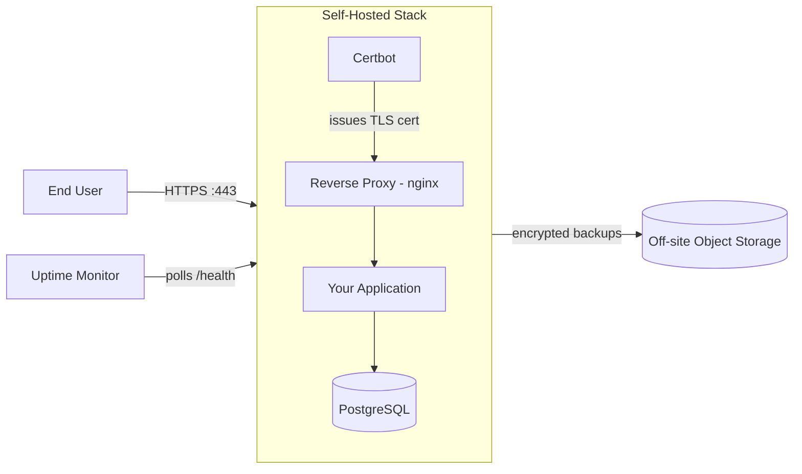
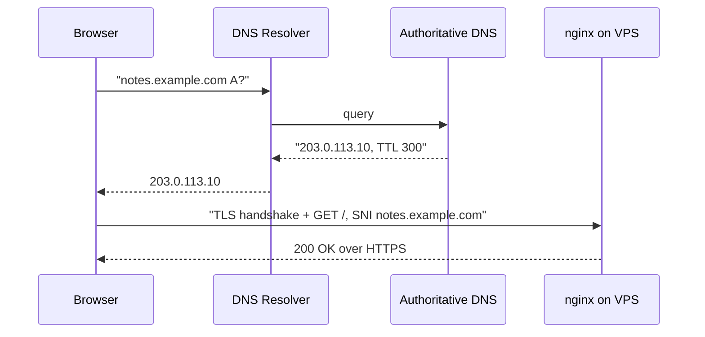
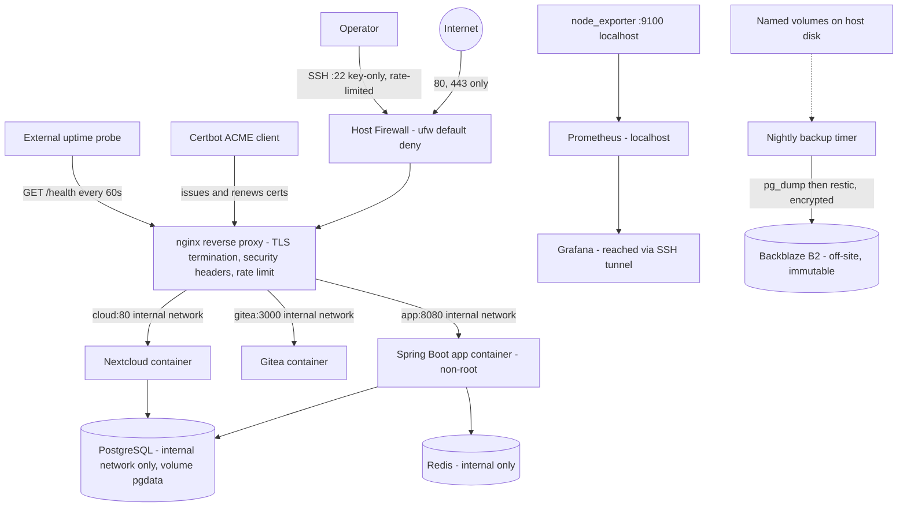
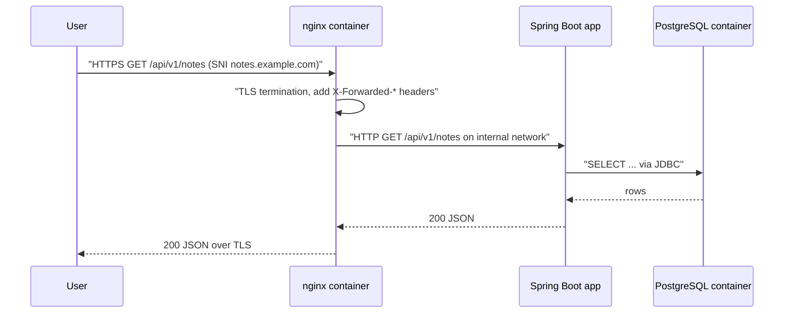

# How to host your own X

## Blogs and websites

## Medium

## Youtube

- [Host Your Own Browser and OS](https://www.youtube.com/watch?v=sXMCzsCfopQ)
- [Host Your Own Search Engine](https://www.youtube.com/watch?v=4KDDkNMxSLY)

## Theory

### Topics Covered

1. [Introduction to Self-Hosting](#introduction-to-self-hosting)
2. [Self-Hosting vs Managed Services](#self-hosting-vs-managed-services)
3. [Characteristics](#characteristics)
4. [Components of a Self-Hosted Stack](#components-of-a-self-hosted-stack)
5. [Hosting Fundamentals: DNS, Reverse Proxy, TLS, Firewall, Ports](#hosting-fundamentals-dns-reverse-proxy-tls-firewall-ports)
6. [Deployment Options Compared](#deployment-options-compared)
7. [Storage and Backup Strategy](#storage-and-backup-strategy)
8. [Monitoring, Logging, and Alerting](#monitoring-logging-and-alerting)
9. [Update and Patch Strategy](#update-and-patch-strategy)
10. [Security Hardening](#security-hardening)
11. [Cost Breakdown](#cost-breakdown)
12. [Benefits](#benefits)
13. [Pros](#pros)
14. [Cons](#cons)
15. [Challenges](#challenges)
16. [Best Practices](#best-practices)
17. [When to Self-Host and When Not To](#when-to-self-host-and-when-not-to)
18. [Use Cases](#use-cases)
19. [Reference Architecture of a Self-Hosted Stack](#reference-architecture-of-a-self-hosted-stack)
20. [Java and Spring Boot Implementation Guide: Self-Hosting a Spring Boot Application on a VPS](#java-and-spring-boot-implementation-guide-self-hosting-a-spring-boot-application-on-a-vps)
21. [Interview Questions and Answers](#interview-questions-and-answers)

---

### Introduction to Self-Hosting

Self-hosting means running a service or application on infrastructure you control — a home server, a rented virtual private server (VPS), or bare metal in a colocation rack — instead of consuming the equivalent managed offering from a cloud provider. "Host your own X" covers a wide spectrum: your own cloud storage (Nextcloud instead of Google Drive), your own git server (Gitea instead of GitHub), your own analytics (Plausible instead of Google Analytics), your own password manager (Vaultwarden instead of a hosted vault), your own chat (Matrix instead of Slack), or an application you wrote yourself. The awesome-selfhosted catalog lists hundreds of such self-hostable replacements.

The problem self-hosting solves is control. When a third party hosts your data and your software, they set the pricing, the privacy policy, the feature roadmap, the API limits, the data-retention policy — and the shutdown date. Google has discontinued dozens of products; hosted services routinely reprice, degrade free tiers, or train models on user data. Self-hosting trades money and your own time for sovereignty over data, behavior, and cost structure.

The counterweight is responsibility. The moment you run your own stack, you become the SRE team, the security team, and the on-call rotation. Disk full at 3 a.m., a CVE in OpenSSL, a failed backup you never tested — all of it is yours. Every decision in this document is a point on that trade-off spectrum.



**Why self-hosting matters**

- **Data ownership and privacy**: your files, passwords, metrics, and messages never leave hardware you control; no third party can mine, sell, or subpoena them without you knowing.
- **Cost control**: a $6/month VPS can replace several $10-30/month SaaS subscriptions; cost is flat and predictable instead of per-seat.
- **No vendor lock-in**: data lives in standard formats (Postgres tables, files on disk) that you can export, diff, and move at any time.
- **Learning leverage**: running a real stack end-to-end — DNS, TLS, reverse proxy, containers, backups, monitoring — is the fastest way to build production engineering intuition.
- **Customization**: you can patch the software, add plugins, change retention rules, and integrate services with each other in ways no SaaS permits.

**Real-life use cases**

- **Personal cloud**: Nextcloud for files/calendar/contacts, Immich for photos, Vaultwarden for passwords.
- **Development infrastructure**: Gitea or GitLab CE for git, Drone/Woodpecker for CI, Harbor for a container registry.
- **Self-built applications**: your own Spring Boot API, side project, or blog on a $6 VPS instead of a PaaS bill.
- **Home automation and media**: Home Assistant, Jellyfin, Pi-hole (network-wide ad blocking via self-hosted DNS).
- **Team tooling on a budget**: Mattermost instead of Slack, Plausible instead of Google Analytics, Outline instead of Notion.

---

### Self-Hosting vs Managed Services

The honest comparison, dimension by dimension:

| Dimension | Self-hosted | Managed service |
|-----------|-------------|-----------------|
| Data control | Full — data on your disks, your keys | Provider holds data; export varies |
| Privacy | As good as your hardening | Subject to provider's policy and jurisdiction |
| Money cost | Low and flat ($5-40/month VPS) | Per-seat, per-GB, per-request; grows with usage |
| Time cost | High — you operate everything | Near zero — provider operates it |
| Availability | Single node unless you build HA | 99.9-99.99% SLAs out of the box |
| Scaling | Vertical first; horizontal is on you | Automatic or one slider |
| Security | Your responsibility end-to-end | Shared-responsibility model |
| Backups | You design, run, and test them | Usually included, sometimes restore-limited |
| Features/pace | Whatever the OSS project ships | Polished, frequently updated |
| Exit cost | Near zero — you already have the data | Migration/export projects |

**The decision rule:** self-host when the data is sensitive, the workload is small and steady, you want to learn, or the SaaS pricing model punishes your usage. Buy managed when the service is undifferentiated toil (email deliverability is the classic example), when you need an SLA you cannot personally provide, or when your time is worth more than the subscription.

**Interview note:** saying "self-host everything for control" is as weak an answer as "use managed everything for velocity." A strong answer prices *your own operational time* and names the specific services where each side wins (e.g., "self-host the git server, pay for managed email").

---

### Characteristics

Each characteristic is explained with what it means and why it matters in practice.

- **Full control of the stack**
  You choose the OS, runtime, versions, configuration, and data location. *Why it matters:* every bug is debuggable and every behavior is changeable — but nothing is someone else's job.

- **Single-operator responsibility**
  One person (you) handles provisioning, security, backups, and incident response. *Why it matters:* bus factor of one; documentation and automation are how you compensate.

- **Flat, predictable cost**
  A VPS costs the same whether it serves 10 or 10,000 requests a day. *Why it matters:* SaaS pricing scales with success; self-hosted cost scales only when you outgrow the box.

- **Vertical scaling first**
  The default scaling move is a bigger VPS (more vCPU/RAM), not more nodes. *Why it matters:* vertical scaling is trivially simple and covers far more load than people assume — a $24 VPS serves most personal and community workloads.

- **Single point of failure by default**
  One node means one disk failure or one bad deploy takes the service down. *Why it matters:* you must consciously decide which availability you actually need instead of paying for HA you do not.

- **Everything is a file or a database row**
  State lives in a filesystem volume and a database you can inspect with standard tools. *Why it matters:* backup, migration, and disaster recovery reduce to copying bytes — no proprietary export wizards.

- **Security surface is yours**
  Every open port, every stale package, every weak password is your exposure. *Why it matters:* a self-hosted box on the public internet is scanned within minutes of its first connection; hardening is not optional.

- **Upgrade cadence is your choice**
  You decide when to upgrade — or whether to stay on a pinned version for years. *Why it matters:* you gain stability and lose automatic security fixes; you must replace the vendor's update pipeline with your own.

---

### Components of a Self-Hosted Stack

A production-grade self-hosted setup consists of these components, from the outside in.

- **Domain registrar and DNS zone**
  *Purpose:* gives the service a stable name. *Responsibilities:* register the domain, host the DNS zone (registrar DNS, Cloudflare, or self-hosted authoritative DNS), publish A/AAAA records pointing at the server. *Example:* `notes.example.com` → A record → `203.0.113.10`, TTL 300 so IP changes propagate quickly.

- **Server (VPS, bare metal, or home machine)**
  *Purpose:* runs the workloads. *Responsibilities:* provide compute, memory, disk, and a public IP. *How chosen:* a VPS from Hetzner/DigitalOcean/Linode is the default; home servers add NAT traversal (port forwarding, or a tunnel like Tailscale/Cloudflare Tunnel) as an extra problem.

- **Operating system and base hardening**
  *Purpose:* the trusted base. *Responsibilities:* a minimal, supported OS (Ubuntu LTS or Debian stable), a non-root sudo user, SSH key authentication, a host firewall (ufw/nftables), automatic security updates.

- **Container runtime (Docker)**
  *Purpose:* package and isolate applications. *Responsibilities:* run containers from pinned image tags, restart policies, log drivers, networks isolating services from the host and each other.

- **Reverse proxy (nginx/Caddy/Traefik)**
  *Purpose:* the single public entry point. *Responsibilities:* listen on 80/443, terminate TLS, route by hostname to internal services, set security headers, rate-limit, compress. *Why it exists:* applications should bind to localhost or a private container network and never own TLS themselves.

- **TLS certificate manager (Certbot / ACME client)**
  *Purpose:* free, automated certificates from Let's Encrypt. *Responsibilities:* prove domain control via the ACME HTTP-01 or DNS-01 challenge, obtain certificates, renew them every 60-90 days, reload the proxy on renewal.

- **Application services**
  *Purpose:* the actual software — your Spring Boot app, Nextcloud, Gitea. *Responsibilities:* read configuration from environment, expose a health endpoint, run as non-root, keep state in named volumes.

- **Database and stateful services**
  *Purpose:* durable state. *Responsibilities:* PostgreSQL/MySQL/Redis with data on a named volume, access restricted to the container network, credentials supplied via environment or secrets files.

- **Backup agent**
  *Purpose:* disaster recovery. *Responsibilities:* consistent database dumps (`pg_dump`), incremental encrypted file backups (restic/borg), shipping to off-site storage, and periodic restore tests.

- **Monitoring and alerting**
  *Purpose:* tell you it is broken before a user does. *Responsibilities:* metrics (node_exporter + Prometheus + Grafana), uptime checks (Uptime Kuma or an external probe), log aggregation (journald, Loki), and an alert channel you actually read.

- **Firewall and network policy**
  *Purpose:* minimize exposed surface. *Responsibilities:* default-deny inbound, allow only 22/80/443 (and ideally restrict 22 to your IPs), rate-limit SSH, and keep application ports unpublished from the host.

---

### Hosting Fundamentals: DNS, Reverse Proxy, TLS, Firewall, Ports

These five mechanisms turn a process running on a Linux box into a reachable, trustworthy service. They are the parts most tutorials hand-wave and most outages involve.

**1. Domain and DNS records**

A domain name decouples your service's identity from any particular IP address. The records that matter for hosting a web app:

| Record | Purpose | Example |
|--------|---------|---------|
| `A` | Maps a name to an IPv4 address | `notes.example.com. 300 IN A 203.0.113.10` |
| `AAAA` | Maps a name to an IPv6 address | `notes.example.com. 300 IN AAAA 2001:db8::10` |
| `CNAME` | Aliases one name to another | `www.example.com. 300 IN CNAME example.com.` |
| `MX` | Mail exchangers for the domain (needed if you receive mail) | `example.com. 300 IN MX 10 mail.example.com.` |
| `TXT` | Verification and policy (SPF, DKIM, ACME DNS-01) | `_acme-challenge.notes.example.com. IN TXT "..."` |
| `CAA` | Restricts which CAs may issue certs for the domain | `example.com. IN CAA 0 issue "letsencrypt.org"` |

Practical rules: use a short TTL (300s) while you are actively migrating, then raise it (3600s+) for stability; never `CNAME` the apex (it is illegal to coexist with other records there — use ALIAS/ANAME if your provider offers it); remember DNS is cached, so "I changed the record" never means "everyone sees it now."



The diagram shows why both halves must be right: DNS gets the client to your IP; TLS (via SNI) and the reverse proxy get the right certificate and the right backend for that hostname.

**2. Reverse proxy with nginx**

The reverse proxy accepts all public traffic and forwards it to internal services that are not directly reachable. Minimal production server block:

```nginx
server {
    listen 443 ssl;
    http2 on;
    server_name notes.example.com;

    ssl_certificate     /etc/letsencrypt/live/notes.example.com/fullchain.pem;
    ssl_certificate_key /etc/letsencrypt/live/notes.example.com/privkey.pem;
    ssl_protocols TLSv1.2 TLSv1.3;

    client_max_body_size 25m;
    add_header X-Content-Type-Options nosniff always;
    add_header X-Frame-Options DENY always;
    add_header Referrer-Policy strict-origin-when-cross-origin always;

    location / {
        proxy_pass http://app:8080;
        proxy_set_header Host $host;
        proxy_set_header X-Real-IP $remote_addr;
        proxy_set_header X-Forwarded-For $proxy_add_x_forwarded_for;
        proxy_set_header X-Forwarded-Proto $scheme;
        proxy_read_timeout 60s;
    }
}
```

Why each piece exists: `Host` preserves the original hostname (the app may serve several vhosts); `X-Forwarded-For` carries the real client IP so rate limiting and logs are meaningful; `X-Forwarded-Proto` tells the app the request was HTTPS so it generates correct redirect URLs and marks cookies `Secure`; `client_max_body_size` must match the app's upload limit or you get confusing 413s at the proxy layer.

**3. TLS with Let's Encrypt and Certbot**

Let's Encrypt issues free 90-day certificates via the ACME protocol. The HTTP-01 challenge flow: certbot places a token at `/.well-known/acme-challenge/<token>`, the CA fetches it over port 80, and proof of domain control earns a certificate. Operational rules:

- Port 80 must stay open and answer ACME challenges even when everything else redirects to HTTPS — put the challenge `location` before the redirect.
- Automate renewal (`certbot renew` via systemd timer or the renew-loop sidecar in the walkthrough); certs expire every 90 days and manual renewal *will* be forgotten once.
- Reload (not restart) nginx after renewal: `nginx -s reload` or `docker exec nginx nginx -s reload` — zero-downtime.
- Use the DNS-01 challenge only when port 80 is unreachable (home servers behind CGNAT) or when you need wildcard certificates.

**4. Firewall with ufw**

Default-deny inbound, explicit allows, nothing else:

```bash
sudo ufw default deny incoming
sudo ufw default allow outgoing
sudo ufw allow 80/tcp
sudo ufw allow 443/tcp
sudo ufw limit 22/tcp        # allow + rate-limit SSH against brute force
sudo ufw enable
sudo ufw status verbose
```

The dangerous subtlety with Docker: **Docker publishes ports by inserting iptables rules that bypass ufw.** A `-p 5432:5432` in a compose file exposes Postgres to the internet even with ufw denying it. Fixes: never publish stateful-service ports (keep them on the internal container network), or publish to loopback only (`127.0.0.1:5432:5432`) when you need local access.

**5. Ports: what is open and why**

| Port | Service | Exposure |
|------|---------|----------|
| 22 | SSH | Open, rate-limited, key-only; optionally restricted to your IPs or moved behind a VPN/Tailscale |
| 80 | HTTP | Open — only for ACME challenges and redirect to 443 |
| 443 | HTTPS | Open — the only application entry point |
| 8080 (app) | Spring Boot | **Not published** — bound to the container network or 127.0.0.1 |
| 5432 (Postgres) | Database | **Never published** — internal network only |
| 9100/9090/3000 | node_exporter/Prometheus/Grafana | Not published; reach Grafana over an SSH tunnel (`ssh -L 3000:localhost:3000`) or behind proxy auth |

---

### Deployment Options Compared

Five ways to run the same application, from least to most abstraction.

- **Bare process on the host (systemd + binary/JAR)**
  Install Java, copy the JAR, write a systemd unit. *Pros:* zero abstraction overhead, trivially debuggable, lowest memory footprint. *Cons:* host-wide dependency conflicts, manual rollbacks, environment drift between machines. *Use when:* one app, one box, you want maximum simplicity and the app is the box's whole purpose.

- **Bare metal / home server**
  Your hardware in your home or a colocation rack. *Pros:* cheapest per unit of compute at steady state, full hardware control, no noisy neighbors. *Cons:* you own power, disks, noise, and uplink; home hosting adds CGNAT/port-forwarding problems and your residential IP in blocklists. *Use when:* data must physically stay home, or steady workloads make VPS rental uneconomic over 2-3 years.

- **VPS with manual setup**
  Rent a VM, configure it with SSH + a runbook (or Ansible). *Pros:* full control, cheap, huge provider choice. *Cons:* snowflake servers if you do not automate; you patch everything. *Use when:* the default starting point for almost everything in this doc.

- **Docker (single containers)**
  Package each service as an image; run with `docker run`. *Pros:* reproducible builds, isolated dependencies, easy rollback to a previous image tag, the same artifact runs locally and on the server. *Cons:* manual wiring of networks/volumes/flags gets unwieldy past two or three services. *Use when:* always, as the packaging layer — even if you orchestrate with something else.

- **docker-compose**
  Declarative multi-container definition in one YAML file. *Pros:* the whole stack — app, database, proxy, certbot — is one reviewable file; `docker compose up -d` recreates it exactly; per-project networks and volumes; restart policies and healthchecks built in. *Cons:* single host only; no scheduling, autoscaling, or self-healing beyond container restart. *Use when:* 1-10 services on one node — this is the sweet spot for self-hosting and the choice in the walkthrough below.

- **Kubernetes (k3s/k0s/microk8s or managed)**
  Full container orchestration. *Pros:* self-healing, rolling updates, horizontal scaling, declarative everything, the industry-standard operational vocabulary. *Cons:* enormous conceptual and operational surface for one node; even "lightweight" k3s costs ~500 MB RAM and a standing control plane; YAML volume dwarfs the app itself; upgrades are a project. *Use when:* you are running many services for many users, you genuinely need multi-node, or you are deliberately building Kubernetes skills — not because a blog said so.

**Comparison summary**

| Option | Ops overhead | Isolation | Scaling | Right size |
|--------|--------------|-----------|---------|------------|
| systemd + JAR | Lowest | Process-level | Vertical | 1 app, 1 box |
| Docker run | Low | Container | Vertical | 1-3 services |
| docker-compose | Low | Container + network | Vertical | 1-10 services, 1 node |
| k3s/Kubernetes | High | Container + namespace | Horizontal | Multi-node, many services |
| Bare metal (any of above) | + hardware ops | — | You buy it | Steady, data-sensitive |

**Interview note:** the expected senior answer is not "Kubernetes" — it is "docker-compose until a measured constraint forces more." Naming the constraint that would force the move (node failure tolerance, >1 node of traffic, team size) is the signal.

---

### Storage and Backup Strategy

Hosting is easy; recovering is the product. Design storage and backups before the first deploy, because retrofitting them after data exists is how data gets lost.

**The 3-2-1 rule**

Keep **3** copies of important data, on **2** different media, with **1** copy off-site. For a VPS stack that means: the live data on the VPS disk, a local snapshot or dump on the same VPS (fast restores), and an encrypted copy in object storage at a *different* provider (Backblaze B2, S3, a second VPS, or your home NAS). The off-site copy protects against provider account loss, fire, and ransomware; the different-media principle protects against correlated failure.

**Backups vs snapshots — know the difference**

- **Filesystem/volume snapshots** (LVM, ZFS, ZFS/btrfs, provider volume snapshots) are point-in-time, near-instant, and space-efficient — but they live on the same failure domain as the data and are not application-consistent for databases (a snapshot of a running Postgres data directory can capture a torn write; it is usually recoverable via WAL replay but must be tested).
- **Logical backups** (`pg_dump`, `mysqldump`) are application-consistent and portable across versions — the gold standard for databases — but slower and larger.
- **File-level incremental backup tools** (restic, borg) give deduplicated, encrypted, versioned archives to object storage — ideal for everything that is not a live database.

The correct stack for a self-hosted Postgres, for example: nightly `pg_dump` → restic the dump and the named volumes → B2 bucket with object-lock/immutability for ransomware resistance.

**Reference backup script (run by cron/systemd timer)**

```bash
#!/usr/bin/env bash
set -euo pipefail
STAMP="$(date -u +%Y%m%dT%H%M%SZ)"
DUMP="/backups/pg/notes-${STAMP}.sql.gz"

# 1. Consistent logical dump from inside the container
docker exec postgres pg_dump -U notes notes | gzip > "${DUMP}"

# 2. Encrypted, deduplicated, versioned archive off-site
restic -r b2:selfhost-backups:/notes backup /backups/pg /var/lib/docker/volumes/notes_data

# 3. Retention: 7 daily, 4 weekly, 6 monthly
restic -r b2:selfhost-backups:/notes forget --prune \
    --keep-daily 7 --keep-weekly 4 --keep-monthly 6
```

**The rules that make backups real**

- **Automate and alert on failure.** A backup that requires you to remember it does not exist. Monitor the job's exit status (Healthchecks.io dead-man's switch is one HTTP ping at the end of the script).
- **Test restores on a schedule.** An untested backup is a hypothesis, not a backup. Once a quarter: spin a throwaway container, restore the dump, boot the app against it, spot-check data. Automate the drill if you can.
- **Encrypt before shipping.** Backup storage is a breach waiting to happen; restic/borg encrypt client-side by default.
- **Define RPO and RTO explicitly.** Nightly dumps mean you accept losing up to 24 hours of data (RPO 24h) and an hour to restore (RTO 1h). If that is unacceptable, move to WAL archiving (RPO of minutes) — but say the numbers out loud first; for most personal services nightly is correct.
- **Keep backups out of the blast radius.** Credentials for the backup bucket on the server should be append-only/write-only where the provider supports it, so an attacker who owns the box cannot delete the backups too.

---

### Monitoring, Logging, and Alerting

Without telemetry you do not have a service, you have a hope. The minimum viable observability stack for one VPS:

- **Host metrics — node_exporter + Prometheus + Grafana.** node_exporter exposes CPU, memory, disk, network on `:9100`; Prometheus scrapes it every 15s and stores a month of history; Grafana dashboards show it. Disk usage is the single most important metric on a self-hosted box — "disk full" causes more outages than everything else combined. Alert at 80% disk, not 100%.
- **Application metrics — Micrometer + Prometheus.** Spring Boot exposes `/actuator/prometheus` via Micrometer: JVM memory, HTTP latency percentiles, datasource pool usage. Scrape it on the internal network only (never publish actuator publicly).
- **Uptime checks — Uptime Kuma (self-hosted) or an external probe (UptimeRobot, Healthchecks.io).** Poll `https://notes.example.com/health` every 60s from *outside* your server. Internal monitoring cannot detect "the whole VPS is down" — the watcher must not share fate with the watched.
- **Logs — journald + Docker json-file with rotation, optionally Loki.** Configure Docker's log driver with `max-size: 10m, max-file: 3` or a chatty container will fill the disk (see above about disk being the #1 outage cause). `docker compose logs --since 1h` and `journalctl -u notes-stack` cover 95% of debugging; add Grafana Loki + Promtail when you outgrow grep.
- **Alerting — one channel you actually read.** Alertmanager (or Uptime Kuma's built-in notifiers) → email/Telegram/Slack. Alerts must be *actionable*: page on "service down," "disk > 80%," "certificate expires < 14 days," "backup job failed" — and nothing else, or you will train yourself to ignore the channel.

A healthy self-hosted stack generates roughly one alert per month, and every one of them is real.

---

### Update and Patch Strategy

Unpatched internet-facing software is the top way self-hosted boxes get compromised; blind auto-updates are the top way they break themselves. The strategy balances the two:

- **OS security patches: automate.** `unattended-upgrades` (Debian/Ubuntu) installs security updates automatically and can reboot at a scheduled window if required. The risk of a security patch breaking something is far lower than the risk of running unpatched OpenSSL on the internet.
- **OS feature upgrades: manual and scheduled.** Distribution upgrades (`do-release-upgrade`) quarterly or per LTS cycle, after a snapshot, with a rollback plan.
- **Container images: pin, review, update deliberately.** Never deploy `latest` — pin `postgres:16.4-alpine`, not `postgres:16`. Subscribe to release feeds (GitHub releases, Renovate, or Diun/Watchtower in *notify-only* mode), then update with `docker compose pull && docker compose up -d` during a maintenance window. Fully automatic container updates (Watchtower in apply mode) are acceptable for low-stakes personal services and unacceptable for anything with data you care about.
- **Application config and migrations: rehearsal matters.** Database migrations are the dangerous part of any upgrade — read the changelog, snapshot first (`docker exec postgres pg_dump ...` takes seconds for small databases), know the rollback command before you need it.
- **Rollback strategy: image tags are your time machine.** Because the previous version's image is still local, rollback is `docker compose up -d` with the old tag — *unless* the new version ran an irreversible migration. That is why migrations get a dump first, every time, no exceptions.

---

### Security Hardening

A fresh VPS receives its first SSH brute-force attempts within minutes. Hardening is a checklist you apply at provisioning time, then maintain:

**SSH (the front door)**

```text
# /etc/ssh/sshd_config.d/hardening.conf
PermitRootLogin no
PasswordAuthentication no
PubkeyAuthentication yes
MaxAuthTries 3
AllowUsers deploy
```

- Key-only authentication, root login disabled, one named sudo user. This alone eliminates password brute force as a threat.
- Optionally restrict port 22 to your IPs (`ufw allow from 203.0.113.0/24 to any port 22`) or remove public SSH entirely and administer over Tailscale/WireGuard.
- Changing the SSH port is security theater — it reduces log noise, not risk. Do it for quiet logs if you like, but do not count it as a control.

**fail2ban (the bouncer)**

fail2ban parses logs and firewall-bans IPs after repeated failures (SSH, nginx auth, app login endpoints). With key-only SSH it is defense-in-depth rather than a primary control; its real value is banning credential stuffers against your *application's* login page.

**Least privilege everywhere**

- Containers run as non-root (`USER` in the Dockerfile; Spring Boot images use a dedicated user).
- One database user per application with only the grants it needs — the app that serves reads should not hold `DROP TABLE`.
- sudo limited to the deploy user; no shared accounts.
- Unnecessary services disabled (`systemctl list-unit-files --state=enabled` should be a short list you recognize).

**Secrets management**

- **Minimum viable:** an `.env` file with `chmod 600`, owned by the deploy user, never committed to git, referenced by compose. This is honest and sufficient for a single-operator box.
- **Better:** Docker secrets (`secrets:` in compose) mounted under `/run/secrets`, so secrets never appear in `docker inspect` environment output.
- **At scale:** SOPS-encrypted files in git (age keys), HashiCorp Vault, or a cloud secret manager. Do not start here — Vault is itself a service you must then host, patch, and back up.
- Whatever the mechanism: secrets live in exactly one place, rotation is a known procedure, and applications read them via environment/injection (see the `@Value` wiring in the walkthrough), never from source code.

**Network-level controls**

- ufw default-deny inbound (above); remember Docker bypasses ufw for published ports.
- Internal services (database, metrics) bound to the container network or loopback only.
- TLS 1.2+ only, strong cipher defaults from Mozilla's SSL config generator, HSTS once you are confident everything is HTTPS.
- Security headers at the proxy; rate limiting on login and signup endpoints.

**Keep it boring:** CIS benchmark the host once (Lynis gives a quick audit), enable unattended security upgrades, and review listening ports after every change (`ss -tulpn`). Most self-hosted compromises are an exposed database port or a three-year-old WordPress plugin, not exotic attacks.

---

### Cost Breakdown

Realistic monthly costs for the reference stack in this document (one VPS hosting 3-5 services):

| Item | Option | Cost |
|------|--------|------|
| VPS (2 vCPU / 4 GB / 80 GB NVMe) | Hetzner / DigitalOcean / OVH | $5-10/month |
| Domain | any registrar | $10-15/**year** (~$1/month) |
| TLS certificates | Let's Encrypt | $0 |
| Backup storage (50 GB) | Backblaze B2 / S3 Glacier | ~$0.30/month |
| External uptime monitoring | UptimeRobot free tier / Healthchecks.io free tier | $0 |
| Email sending (notifications) | transactional email free tier or self-hosted (not recommended) | $0-5/month |
| **Total** | | **~$7-17/month** |

Compare with the managed equivalent of the same capability set: managed Postgres alone starts at $15-25/month, a PaaS dyno per app $7-25/month, SaaS subscriptions (password manager, cloud storage, analytics) $10-30/month *each*. The self-hosted stack replaces $50-150/month of subscriptions with ~$10/month — at the price of perhaps 1-3 hours/month of maintenance once set up, and 10-30 hours of initial learning and setup.

The honest accounting includes your time: if the goal is saving money on a service worth $8/month and you value your time at $50/hour, self-hosting it never pays back. The reasons that survive accounting are privacy, learning, and cases where SaaS pricing scales with seats or usage while your VPS price does not.

---

### Benefits

- **Sovereignty over data and behavior.** Retention, access, export, and deletion policies are yours; a ToS change can never take your photos hostage.
- **Skill compounding.** Operating DNS, TLS, containers, backups, and monitoring on real traffic builds the same muscle as production SRE work — and it is yours to demonstrate.
- **Predictable economics.** Flat VPS pricing decouples cost from growth; ten thousand extra requests cost $0.
- **Composability.** Self-hosted services integrate directly — Gitea webhooks into your CI into your registry into your deploy script — with no API tier gates.
- **Resilience against vendor failure.** Providers sunset products and reprice; your stack keeps running as long as you keep paying one small invoice.

---

### Pros

- Full control of versions, configuration, and upgrade timing.
- Data locality: bytes stay on hardware (and in jurisdictions) you chose.
- Flat, low cost at small-to-medium scale.
- No per-seat pricing — share your instance with family or a whole community.
- Standard, inspectable state: files and SQL, not proprietary formats.
- Deep learning value and portfolio credibility.
- No rate limits, no API quotas, no feature paywalls.
- Services can outlive their vendors because you hold the code and the data.

---

### Cons

- **You are on call.** Every outage, every full disk, every expired certificate is yours — including during holidays.
- **Availability ceiling.** A single VPS realistically delivers ~99.5-99.9% (hours of downtime per month/year across reboots and incidents), not the 99.99% of managed platforms.
- **Security burden.** Hardening, patching, and monitoring are continuous obligations, and mistakes are publicly exploitable within hours.
- **Backup discipline.** Backups exist only if you automate, ship off-site, and test restores — all self-imposed.
- **Time cost.** Initial setup is measured in evenings; maintenance in hours per month; incidents whenever they choose.
- **Some services resist self-hosting.** Email deliverability (IP reputation, SPF/DKIM/DMARC, blocklists) is the canonical example of a service where self-hosting is a losing battle.
- **Scaling cliff.** When you outgrow one box, complexity jumps from "edit a compose file" to real distributed-systems work.
- **Home-hosting extras.** CGNAT, dynamic IPs, residential blocklists, power and uplink reliability all become your problem.

---

### Challenges

- **Technical: TLS and certificate lifecycle.** Certificates expire every 90 days; a failed renewal is a hard outage with scary browser warnings. *Mitigation:* automated renewal with a deploy hook that reloads nginx, plus certificate-expiry monitoring with a 14-day alert.
- **Technical: email deliverability.** Residential and cheap-VPS IP ranges are broadly blocklisted; SPF, DKIM, DMARC, and reverse DNS are table stakes and still not enough. *Mitigation:* relay through a transactional email provider; self-host receiving if you must, rarely sending.
- **Scalability: the single-node wall.** Vertical scaling has a ceiling, and splitting stateful services across nodes is a step-function in complexity. *Mitigation:* scale vertically shamelessly (a 16-vCPU VPS serves enormous traffic), cache at the proxy, and accept the ceiling consciously.
- **Performance: shared, modest hardware.** Noisy-neighbor vCPUs and small disks mean JVM heap sizing, connection pools, and Postgres `shared_buffers` actually matter. *Mitigation:* right-size the JVM (`-Xmx` well under RAM), keep Postgres tuned with PGTune, and watch p99 latency in Grafana instead of guessing.
- **Reliability: single points of failure everywhere.** One node, one disk, one operator. *Mitigation:* restart policies and systemd for process failure, tested off-site backups for data failure, documented runbooks for operator unavailability.
- **Maintainability: snowflake servers.** Six months of manual tweaks and nobody — including you — knows how the box works anymore. *Mitigation:* everything in the compose file, everything in git, provisioning scripted (Ansible or even a well-kept bootstrap script), changes made by editing the repo and applying, never by SSH-improvisation.
- **Operational: alert fatigue and silent failure.** Too many alerts → ignored alerts; too few → a dead backup job discovered a year later. *Mitigation:* alert only on user-visible failure, disk, certificate expiry, and backup failure; use dead-man's-switch monitoring for cron jobs so *absence* of a signal also alerts.
- **Security: public exposure from minute one.** Automated scanners find new IPs and new services within minutes. *Mitigation:* harden before installing applications, default-deny firewall, no published database ports, key-only SSH, unattended security updates.

---

### Best Practices

Each practice is paired with *why* it exists — the failure it prevents.

- **Pin every image version.** *Why:* `latest` makes builds non-reproducible and upgrades accidental; a pin plus a deliberate bump is the difference between a changelog you read and a surprise at 2 a.m.
- **One reverse proxy owns 80/443; apps never bind public ports.** *Why:* centralizes TLS, headers, rate limiting, and access control in one audited place instead of N application configurations, and keeps accident-prone ports off the internet by construction.
- **Keep databases on internal networks, never published.** *Why:* an exposed Postgres/MySQL port is found and attacked within hours; there is no legitimate reason for the internet to reach your database.
- **Automate certificate renewal and monitor expiry.** *Why:* the single most common self-hosted outage is an expired cert that someone "meant to renew."
- **3-2-1 backups with scheduled restore tests.** *Why:* backups fail silently; only a restore test distinguishes a backup from a pile of bytes.
- **Everything declarative and in git.** *Why:* the compose file, nginx config, and systemd units *are* the documentation; when the box dies, `git clone` + one command rebuilds the service.
- **External uptime monitoring.** *Why:* monitoring that shares fate with the system it watches reports nothing precisely when it matters most.
- **Rotate logs and watch disk.** *Why:* unrotated container logs are the classic slow-motion disk-full outage; a 10 MB cap per container makes it impossible.
- **Alert minimally and on symptoms.** *Why:* alert on "users cannot reach the service," not on CPU spikes; every non-actionable alert teaches you to ignore the actionable ones.
- **Run containers as non-root and keep images updated.** *Why:* defense in depth — a container escape as root is a host compromise; as an unprivileged user it is usually a dead end.
- **Document your own runbook.** *Why:* the person debugging at 3 a.m. is you in six months, with none of today's context; write the restore procedure while it is fresh.
- **Rehearse failure.** *Why:* reboot the box, delete a container, restore a backup into a throwaway container — the first time each procedure runs should not be during an incident.

---

### When to Self-Host and When Not To

**Self-host when:**

- The data is personal or sensitive (photos, passwords, files, health data) and privacy is a primary requirement.
- The workload is small, steady, and vertical-scalable — personal tools, community sites, side projects, homelabs.
- SaaS pricing punishes your usage shape: many seats, large storage, high request volume.
- You want operational skills that only come from owning production.
- You need customization or integration the vendor will never offer.
- You are deliberately de-platforming from a provider whose incentives diverge from yours.

**Do not self-host when:**

- **Email sending.** Deliverability is an IP-reputation economy you cannot win from a VPS; relay it.
- **You need an SLA.** Other people's money depending on your uptime means managed HA, not goodwill.
- **The service is undifferentiated toil.** If operating it teaches you nothing and costs you sleep, pay the $10.
- **Your threat model is beyond your skill.** Hosting data that hostile governments or organized criminals want requires more than a checklist.
- **You will not maintain it.** An unmaintained internet-facing service is worse than none — it is a future breach notification.
- **Time is the scarce resource.** If an hour of your time costs more than a year of the subscription, the subscription wins.

---

### Use Cases

- **Personal data cloud.** Nextcloud (files, calendar, contacts), Immich (photo backup with ML search), Vaultwarden (passwords). *Why self-hosted:* this is exactly the data you least want mined; storage-heavy usage makes SaaS pricing worst.
- **Development platform.** Gitea (git), Woodpecker/Drone (CI), Harbor or a simple registry (images). *Why:* unlimited private repos and build minutes at flat cost; CI secrets never leave your hardware.
- **Own applications and APIs.** Your Spring Boot services, bots, and side projects (see the walkthrough). *Why:* a $6 VPS replaces per-dyno PaaS bills and teaches real deployment.
- **Home automation and media.** Home Assistant, Jellyfin, Navidrome. *Why:* local control keeps the house working when the internet (or the vendor's cloud) is down.
- **Network services.** Pi-hole or AdGuard Home (DNS-level ad blocking), WireGuard/Tailscale exit node, authoritative DNS. *Why:* these must be infrastructure you trust absolutely.
- **Community and team tools.** Mattermost (chat), Outline or BookStack (docs), Plausible (analytics), Vaultwarden orgs. *Why:* per-seat SaaS pricing scales badly; communities do not.
- **Learning lab.** A deliberately over-engineered blog on k3s to build Kubernetes fluency. *Why:* the explicit goal is skills, and the blast radius of failure is one blog.

---

### Reference Architecture of a Self-Hosted Stack



**How to read it:**

- The firewall admits exactly three ports; everything else in the diagram is unreachable from the internet by construction, not by vigilance.
- nginx is the only TLS endpoint and the only routing decision-maker; application containers listen on an internal Docker network and have no published ports.
- Stateful services (Postgres, Redis) and observability (Prometheus, Grafana) are localhost/internal only — Grafana is reached over an SSH tunnel, so it never needs a public login page at all.
- The backup path is one-way: the server can push encrypted archives to off-site storage but its stored credentials cannot delete or read prior archives (bucket immutability), so a fully compromised server cannot destroy the backups.
- The external uptime probe is the only component that can detect total server failure, because every other component shares fate with the server.

---

### Java and Spring Boot Implementation Guide: Self-Hosting a Spring Boot Application on a VPS

End-to-end: from an empty VPS to a TLS-secured, containerized Spring Boot API with Postgres, auto-renewed certificates, restart-on-boot, and config injected via environment. The app is a small notes API — the pattern works for any Spring Boot service.

**Step 0 — provision and point DNS**

1. Create a VPS (Ubuntu 24.04 LTS, 2 vCPU/4 GB). Note its IPv4: `203.0.113.10`.
2. Create the DNS record: `notes.example.com. 300 IN A 203.0.113.10`. Verify with `dig +short notes.example.com` before continuing — certbot will fail against a name that does not resolve yet.
3. Bootstrap the host: create the `deploy` sudo user, install your SSH key, apply the sshd hardening and ufw rules from the sections above, enable `unattended-upgrades`, install Docker (`curl -fsSL https://get.docker.com | sh`), add `deploy` to the `docker` group.

**Step 1 — the application reads everything from environment (`@Value` and friends)**

The twelve-factor rule: the same image runs everywhere; only the environment differs. Spring Boot binds environment variables to properties automatically (`SPRING_DATASOURCE_URL` → `spring.datasource.url`), and `@Value` injects them where defaults make local development pleasant:

```java
import org.springframework.beans.factory.annotation.Value;
import org.springframework.stereotype.Component;

@Component
public class AppInfo {

    private final String appName;
    private final String version;
    private final String environment;

    public AppInfo(
            @Value("${app.name:notes-api}") String appName,
            @Value("${app.version:0.0.0}") String version,
            @Value("${app.environment:local}") String environment) {
        this.appName = appName;
        this.version = version;
        this.environment = environment;
    }

    public String describe() {
        return appName + " " + version + " (" + environment + ")";
    }
}
```

DTOs are records with Bean Validation; the controller is thin; the service owns logic; a `@RestControllerAdvice` turns failures into a stable error contract:

```java
import jakarta.validation.constraints.NotBlank;
import jakarta.validation.constraints.Size;

public record CreateNoteRequest(
        @NotBlank @Size(max = 200) String title,
        @NotBlank @Size(max = 10_000) String body) {}

public record NoteResponse(long id, String title, String body, Instant createdAt) {}
```

```java
import jakarta.validation.Valid;
import org.springframework.http.HttpStatus;
import org.springframework.web.bind.annotation.*;

import java.util.List;

@RestController
@RequestMapping("/api/v1/notes")
public class NoteController {

    private final NoteService noteService;

    public NoteController(NoteService noteService) {
        this.noteService = noteService;
    }

    @PostMapping
    @ResponseStatus(HttpStatus.CREATED)
    public NoteResponse create(@Valid @RequestBody CreateNoteRequest request) {
        return noteService.create(request);
    }

    @GetMapping
    public List<NoteResponse> list() {
        return noteService.list();
    }
}
```

```java
import org.springframework.stereotype.Service;
import org.springframework.transaction.annotation.Transactional;

import java.util.List;

@Service
public class NoteService {

    private final NoteRepository noteRepository;

    public NoteService(NoteRepository noteRepository) {
        this.noteRepository = noteRepository;
    }

    @Transactional
    public NoteResponse create(CreateNoteRequest request) {
        Note saved = noteRepository.save(new Note(request.title(), request.body()));
        return toResponse(saved);
    }

    @Transactional(readOnly = true)
    public List<NoteResponse> list() {
        return noteRepository.findAllByOrderByCreatedAtDesc().stream()
                .map(this::toResponse)
                .toList();
    }

    private NoteResponse toResponse(Note note) {
        return new NoteResponse(note.getId(), note.getTitle(), note.getBody(), note.getCreatedAt());
    }
}
```

```java
import org.springframework.http.HttpStatus;
import org.springframework.http.ResponseEntity;
import org.springframework.web.bind.MethodArgumentNotValidException;
import org.springframework.web.bind.annotation.ExceptionHandler;
import org.springframework.web.bind.annotation.RestControllerAdvice;

import java.util.List;
import java.util.Map;

@RestControllerAdvice
public class GlobalExceptionHandler {

    @ExceptionHandler(MethodArgumentNotValidException.class)
    public ResponseEntity<Map<String, Object>> validation(MethodArgumentNotValidException ex) {
        List<Map<String, String>> details = ex.getBindingResult().getFieldErrors().stream()
                .map(f -> Map.of("field", f.getField(), "message", String.valueOf(f.getDefaultMessage())))
                .toList();
        return ResponseEntity.status(HttpStatus.BAD_REQUEST)
                .body(Map.of("error", "VALIDATION_FAILED", "details", details));
    }
}
```

Health and metrics for the monitoring stack come from Actuator (`/actuator/health`, `/actuator/prometheus`) — exposed on the internal network only, and the `/health` endpoint is what nginx-proxied uptime probes hit.

**Step 2 — build the image (multi-stage Dockerfile)**

```dockerfile
# ---- build stage ----
FROM eclipse-temurin:21-jdk AS build
WORKDIR /workspace
COPY . .
RUN ./mvnw -q -DskipTests package

# ---- runtime stage ----
FROM eclipse-temurin:21-jre
RUN useradd --system --uid 10001 app
WORKDIR /app
COPY --from=build /workspace/target/notes-api-*.jar /app/app.jar
USER app
EXPOSE 8080
ENTRYPOINT ["java", "-XX:MaxRAMPercentage=75", "-jar", "/app/app.jar"]
```

Key decisions: the JRE-only runtime stage keeps the image small and strips the compiler toolchain from the attack surface; the process runs as UID 10001, never root; `MaxRAMPercentage` lets the JVM size its heap from the container limit instead of the host's RAM. Build and tag deliberately: `docker build -t notes-api:1.4.2 .`

**Step 3 — docker-compose: app + postgres + nginx + certbot**

```yaml
services:
  postgres:
    image: postgres:16.4-alpine
    restart: unless-stopped
    environment:
      POSTGRES_DB: notes
      POSTGRES_USER: notes
      POSTGRES_PASSWORD: ${POSTGRES_PASSWORD}
    volumes:
      - pgdata:/var/lib/postgresql/data
    healthcheck:
      test: ["CMD-SHELL", "pg_isready -U notes -d notes"]
      interval: 10s
      timeout: 5s
      retries: 5
    networks: [internal]

  app:
    image: notes-api:1.4.2
    restart: unless-stopped
    environment:
      SPRING_DATASOURCE_URL: jdbc:postgresql://postgres:5432/notes
      SPRING_DATASOURCE_USERNAME: notes
      SPRING_DATASOURCE_PASSWORD: ${POSTGRES_PASSWORD}
      APP_ENVIRONMENT: production
      SERVER_PORT: "8080"
    depends_on:
      postgres:
        condition: service_healthy
    networks: [internal]

  nginx:
    image: nginx:1.27-alpine
    restart: unless-stopped
    ports:
      - "80:80"
      - "443:443"
    volumes:
      - ./nginx.conf:/etc/nginx/conf.d/default.conf:ro
      - letsencrypt:/etc/letsencrypt
      - certbot-webroot:/var/www/certbot
    depends_on: [app]
    networks: [internal]

  certbot:
    image: certbot/certbot:v2.11.0
    restart: unless-stopped
    volumes:
      - letsencrypt:/etc/letsencrypt
      - certbot-webroot:/var/www/certbot
    entrypoint: >
      /bin/sh -c "trap exit TERM;
      while :; do
        certbot renew --webroot -w /var/www/certbot --quiet --deploy-hook 'echo renewed';
        sleep 12h & wait $$!;
      done"
    networks: [internal]

volumes:
  pgdata:
  letsencrypt:
  certbot-webroot:

networks:
  internal:
```

Why it is shaped this way: only nginx publishes ports — Postgres and the app are unreachable from the internet because they are on the `internal` network with no `ports:` mapping. `POSTGRES_PASSWORD` comes from a root-owned `.env` file (`chmod 600`) that compose reads automatically. The healthcheck-gated `depends_on` prevents the app from crash-looping against a still-initializing database.

**Step 4 — nginx config (HTTP→HTTPS, ACME challenge, proxy)**

```nginx
server {
    listen 80;
    server_name notes.example.com;

    location /.well-known/acme-challenge/ {
        root /var/www/certbot;
    }
    location / {
        return 301 https://$host$request_uri;
    }
}

server {
    listen 443 ssl;
    http2 on;
    server_name notes.example.com;

    ssl_certificate     /etc/letsencrypt/live/notes.example.com/fullchain.pem;
    ssl_certificate_key /etc/letsencrypt/live/notes.example.com/privkey.pem;
    ssl_protocols TLSv1.2 TLSv1.3;

    location / {
        proxy_pass http://app:8080;
        proxy_set_header Host $host;
        proxy_set_header X-Real-IP $remote_addr;
        proxy_set_header X-Forwarded-For $proxy_add_x_forwarded_for;
        proxy_set_header X-Forwarded-Proto $scheme;
    }

    location /health {
        proxy_pass http://app:8080/actuator/health;
    }
}
```

First-time issuance (the chicken-and-egg step — start nginx with only the HTTP block, issue, then enable the 443 block):

```bash
docker compose up -d nginx
docker run --rm \
  -v notes_certbot-webroot:/var/www/certbot \
  -v notes_letsencrypt:/etc/letsencrypt \
  certbot/certbot:v2.11.0 certonly --webroot -w /var/www/certbot \
  -d notes.example.com --email you@example.com --agree-tos --no-eff-email
docker compose up -d
docker compose exec nginx nginx -s reload
```

**Step 5 — restart on boot and crash: restart policy + systemd belt-and-suspenders**

`restart: unless-stopped` handles container crashes and daemon restarts. To also bring the whole stack up after a host reboot even if Docker's own startup ordering misbehaves, a systemd unit that owns the compose project:

```ini
# /etc/systemd/system/notes-stack.service
[Unit]
Description=Notes self-hosted stack (docker compose)
Requires=docker.service
After=docker.service network-online.target

[Service]
Type=oneshot
RemainAfterExit=yes
WorkingDirectory=/opt/notes
ExecStart=/usr/bin/docker compose up -d
ExecStop=/usr/bin/docker compose down
TimeoutStartSec=0

[Install]
WantedBy=multi-user.target
```

```bash
sudo systemctl enable --now notes-stack.service
```

**Step 6 — deploy and update procedure**

```bash
# deploy a new version
docker build -t notes-api:1.4.3 .
sed -i 's/notes-api:1.4.2/notes-api:1.4.3/' docker-compose.yml
docker exec postgres pg_dump -U notes notes | gzip > /backups/pre-upgrade.sql.gz   # always before migrations
docker compose up -d app
docker compose ps && curl -fsS https://notes.example.com/health
# rollback: restore the old tag in compose, docker compose up -d app
```

**Step 7 — wire in the rest of the stack** (from the sections above): nightly `pg_dump` + restic timer, node_exporter + Uptime Kuma or an external probe, log rotation on the Docker daemon. Total elapsed time for a first run: an evening. Subsequent apps on the same box: under an hour, because nginx, certbot, backups, and monitoring are already there — the marginal cost of self-hosting the *next* service approaches zero, which is exactly how homelabs grow.



---

### Interview Questions and Answers

**Beginner**

- **Q: What does it mean to self-host an application?**
  **A:** Running software on infrastructure you control — a VPS, home server, or bare metal — instead of a provider's managed platform. You own provisioning, security, updates, backups, and monitoring; in exchange you get full control over data, configuration, and cost. The canonical spectrum runs from "one JAR under systemd on a $6 VPS" to "multi-node Kubernetes in your basement."

- **Q: What is a reverse proxy and why does almost every self-hosted stack have one?**
  **A:** A reverse proxy (nginx, Caddy, Traefik) is the single public entry point that accepts client connections and forwards them to internal services. It centralizes TLS termination, hostname-based routing, security headers, compression, and rate limiting in one place, and it lets application processes bind to private interfaces only — so the database-admin port of every app is not a separate public-attack-surface decision. *Follow-up: reverse proxy vs forward proxy?* A forward proxy acts for clients (hiding them from servers); a reverse proxy acts for servers (hiding them from clients).

- **Q: How does Let's Encrypt issue a certificate for your domain?**
  **A:** Via the ACME protocol's domain-validation challenges. In HTTP-01, the CA must fetch a token from `http://yourdomain/.well-known/acme-challenge/<token>` — proving you control what the domain's web server serves. In DNS-01, you publish a TXT record at `_acme-challenge.yourdomain` — proving zone control, and the only way to get wildcard certificates. Certificates last 90 days, so renewal must be automated; certbot's systemd timer or a renewal sidecar handles it, reloading the proxy on success.

- **Q: What DNS records do you need to host a web app on your own domain?**
  **A:** Minimally an `A` record (name → IPv4) and ideally `AAAA` (name → IPv6). `CNAME` for aliasing subdomains like `www` to the canonical name. If the domain also handles email: `MX`, plus `TXT` records for SPF/DKIM. A `CAA` record restricting issuance to Let's Encrypt is cheap hardening. *Common mistake:* trying to `CNAME` the apex domain — forbidden because a name with a CNAME cannot hold other records, and the apex must hold SOA/NS.

**Intermediate**

- **Q: Docker, docker-compose, or Kubernetes for a self-hosted stack — how do you choose?**
  **A:** By the constraint, not the fashion. One app on one box: systemd or a single container. A handful of services on one node: docker-compose — the whole stack declaratively in one file, with networks, volumes, healthchecks, and restart policies, and near-zero operational overhead. Kubernetes (or k3s) only when you need multi-node placement, self-healing across machines, or many tenants/services — you pay a standing control-plane cost in RAM, complexity, and upgrade churn that a personal stack cannot amortize. *Trade-off to name:* compose scales vertically only; the day node failure tolerance becomes a requirement, you are re-platforming, not tuning.

- **Q: Explain the 3-2-1 backup rule and how you apply it to self-hosted Postgres.**
  **A:** Three copies, two media, one off-site. Concretely: the live database on the VPS disk; a nightly `pg_dump` (logical, application-consistent) kept locally for fast restores; and an encrypted, deduplicated archive (restic/borg) pushed to object storage at a *different* provider. Two rules make it real: automate with failure alerting (a dead-man's switch like Healthchecks.io), and test restores on a schedule — an untested backup is a hypothesis. *Follow-up: why `pg_dump` and not just a volume snapshot?* A snapshot of a running database can capture torn pages; it is usually recoverable via WAL, but the logical dump is consistent by construction and portable across Postgres versions.

- **Q: How do you secure SSH on a public VPS?**
  **A:** Key-only authentication (`PasswordAuthentication no`), root login disabled, one named sudo user, `MaxAuthTries 3`, and `ufw limit 22/tcp` to slow scanners. Stronger: restrict port 22 to your source IPs, or remove public SSH entirely and administer over Tailscale/WireGuard. fail2ban as defense in depth. *Common mistake:* treating a changed SSH port as a security control — it is log-noise reduction; port scans find it in seconds.

- **Q: Your Docker host has ufw set to default-deny, yet your Postgres got scanned from the internet. How?**
  **A:** Docker manages its own iptables chains and published ports (`-p 5432:5432`) bypass ufw rules entirely — the most common self-hosting footgun. Fixes: do not publish stateful services at all (internal container network only), publish to loopback (`127.0.0.1:5432:5432`) when local access is needed, and audit reality with `ss -tulpn` and an external port scan instead of trusting the firewall config.

- **Q: How do you keep a self-hosted box patched without it breaking itself?**
  **A:** Split by risk class. OS security updates: automate (`unattended-upgrades`) — the exploit risk dwarfs the regression risk. OS upgrades: manual, quarterly, after a snapshot. Container images: pinned tags, update deliberately in a maintenance window after reading changelogs, dump the database before any app upgrade that may migrate it. Rollback is the previous image tag, which is why tags are pinned in the first place.

**Advanced**

- **Q: A container running your app crashes at 3 a.m. Walk through what should happen and how you find out.**
  **A:** Docker's `restart: unless-stopped` restarts the process within seconds; if the crash is at the host level, the systemd unit recreates the project on boot. Detection must not depend on those working: an external uptime probe (not co-located with the server — shared fate) polls `/health` every 60s and alerts after consecutive failures; Prometheus records the restart (`container_start_time_seconds` jump) and the app's own metrics show the gap. In the morning, `docker compose logs --since 12h` plus journald explain the cause; if it is OOM, the JVM's `MaxRAMPercentage` vs container limit is the first suspect. The senior point: restarts are masked failures — alert on restart *count*, not just downtime.

- **Q: How do you deploy updates on a single VPS without downtime?**
  **A:** Honestly: you mostly do not, and that is usually fine — a `docker compose up -d app` costs 2-10 seconds of downtime, acceptable for personal services. If it matters: run two app containers (`app-blue`, `app-green`) behind nginx, deploy to the idle one, health-check it, flip `proxy_pass` (or an upstream with both, taking one out of rotation), `nginx -s reload`. The hard part is never the web tier — it is database migrations, which must be backward-compatible (expand-only migrations, contract in a later release) for any zero-downtime scheme to work. *Trade-off to name:* blue/green doubles app memory on a small box; many self-hosters consciously choose the 5-second blip.

- **Q: Design secrets management for a self-hosted stack.**
  **A:** Proportionate layers. Minimum viable: a `chmod 600` `.env` on the host, read by compose, never committed — honest and sufficient for one operator. Better: Docker secrets mounted under `/run/secrets` so values stay out of `docker inspect` and process environments. At the point you want secrets *in git* (for the everything-in-git benefit), SOPS with age keys encrypts them at rest in the repo. Vault or a cloud secret manager only when you have multiple operators and rotation requirements — because then you are also hosting, backing up, and unsealing Vault. Whatever the layer: one source of truth, a written rotation procedure, apps reading via injection (`@Value`/environment), never from source.

**Senior / system design**

- **Q: When is self-hosting the wrong answer? Argue against it.**
  **A:** Email sending (IP-reputation economy you cannot win); anything with a real SLA owed to other people's money (you cannot buy yourself a 99.99% you have not engineered); undifferentiated toil where your hourly rate exceeds a decade of subscription fees; threat models above your skill (hosting data that states or organized crime actively want); and anything you will not maintain — an unpatched internet-facing service is a liability, not an asset. The strongest signal in this answer is pricing *operational time* and *risk* alongside the invoice, and naming the specific services that stay managed.

- **Q: Your single-VPS self-hosted service gets popular — 10x traffic overnight. What breaks first, in what order, and what do you do?**
  **A:** Typical order on a 2 vCPU/4 GB box: (1) application thread pool / connection pool saturation (Tomcat default 200 threads, HikariCP default 10 connections) — visible as p99 latency climbing before CPU does; (2) Postgres connections and `shared_buffers` pressure; (3) JVM heap/GC thrash if sized naively; (4) CPU; (5) disk I/O. Response: cache static and hot responses at nginx (microcaching even 1-5s absorbs stampedes), rate-limit expensive endpoints, then scale vertically — a bump to 8 vCPU/16 GB is a 5-minute resize and covers another order of magnitude. Only beyond that do you pay real complexity: read replicas, object storage offload, a second node behind the proxy. The senior point is that vertical scaling is *boring and works* far past where people assume.

- **Q: Design the migration path from this single-VPS stack to a highly available setup without a rewrite.**
  **A:** Move state first, compute second. (1) Database to managed HA Postgres (or a primary/replica pair on two VPSes) — the app is already stateless containers reading config from environment, so it moves unchanged. (2) Object storage for user uploads instead of local volumes. (3) Two app nodes behind a load balancer (managed LB, or nginx/HAProxy pair with keepalived), compose graduated to a scheduler only if needed. (4) Health checks and deploys become rolling. Each step is independently valuable and reversible; the application code never changes because the twelve-factor discipline (config from env, state externalized, stateless processes) was the actual HA preparation. That is the answer to name: you did not get lucky, the original design choices are what made migration boring.

- **Q: Compare the real five-year cost of the self-hosted stack versus the managed equivalent.**
  **A:** Money: ~$10/month VPS + ~$1/month domain + ~$0.30 backups ≈ $700 over five years; the managed equivalent (managed Postgres $15-25/month, PaaS apps $7-25/month each, three SaaS subscriptions at $10-30/month) lands between $5,000 and $12,000. Time: initial setup 10-30 hours, then 1-3 hours/month of maintenance ≈ 60-200 hours over five years. The answer that gets hired states both ledgers, then decides by *goal*: for learning, privacy, and flat-cost community services, self-hosting wins clearly; for a business whose runway depends on the founder's hours, the managed invoice is the cheapest line item on the page.
