# Design Leaderboard

## Blogs and websites

## Medium

## Youtube

## Theory

### Topics Covered

1. [Introduction and Problem Statement](#introduction-and-problem-statement)
2. [Functional Requirements](#functional-requirements)
3. [Non-Functional Requirements](#non-functional-requirements)
4. [Capacity Estimation (back-of-envelope)](#capacity-estimation-back-of-envelope)
5. [Characteristics](#characteristics)
6. [Components](#components)
7. [Leaderboard Design Patterns](#leaderboard-design-patterns)
8. [Benefits](#benefits)
9. [Pros](#pros)
10. [Cons](#cons)
11. [Challenges](#challenges)
12. [Best Practices](#best-practices)
13. [When to Use / When Not to Use](#when-to-use-when-not-to-use)
14. [Use Cases](#use-cases)
15. [Data Model and APIAPI Design](#data-model-and-apiapi-design)
16. [High-Level Design](#high-level-design)
17. [Deep Dive: Redis Sorted Sets and Ranking at Scale](#deep-dive-redis-sorted-sets-and-ranking-at-scale)
18. [Replication Strategies](#replication-strategies)
19. [Failure Detection and Membership](#failure-detection-and-membership)
20. [High Availability and Scalability](#high-availability-and-scalability)
21. [Performance and Optimization](#performance-and-optimization)
22. [Encryption and Key Management](#encryption-and-key-management)
23. [Authentication and Authorization](#authentication-and-authorization)
24. [Security Threats and Mitigations](#security-threats-and-mitigations)
25. [Observability and Logging](#observability-and-logging)
26. [Real-World Implementations](#real-world-implementations)
27. [Architectural Patterns](#architectural-patterns)
28. [Java and Spring Boot Implementation Guide](#java-and-spring-boot-implementation-guide)
29. [Interview Questions and Answers](#interview-questions-and-answers)

---
---
---

### Introduction and Problem Statement

A leaderboard is a ranking system that orders players or users by a numeric score and answers three questions very fast: "Who are the top K?", "What is my rank?", and "Who is ranked around me?". Leaderboards are everywhere in consumer software: mobile games rank players by points, fitness apps rank users by steps, coding platforms rank contestants by rating, sales dashboards rank teams by revenue, and streaming platforms rank creators by watch time.

The problem is deceptively hard because of scale and freshness. Ranking is a global ordering over millions of rows. A naive implementation — `SELECT user_id, score FROM scores ORDER BY score DESC LIMIT 100` — requires the database to sort or maintain an index over the whole table, and computing one user's rank requires counting how many users have a higher score (`O(N)` scan even with an index, because rank is a count, not a lookup). When 10,000 score updates arrive per second and 25,000 rank queries arrive per second, a relational database cannot sustain that with acceptable latency and cost.

The canonical solution is to keep the ranking in an in-memory data structure that maintains order natively — the Redis sorted set — and use the relational database as the durable system of record. Redis sorted sets answer top-K, exact rank, and range-around-rank queries in `O(log N + K)`, which is effectively a few microseconds at 100M members.

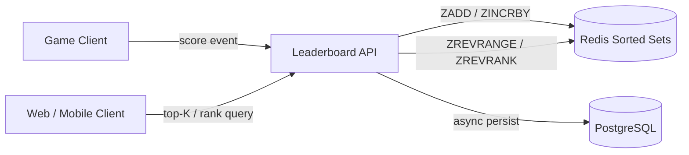

**Why leaderboards matter**

- They drive engagement: competition and visible progress retain users.
- They are read-heavy, latency-sensitive features directly in the user's critical path.
- They are a canonical interview problem because they exercise data-structure choice, caching, sharding, consistency trade-offs, and capacity math in one small surface area.

**Real-life use cases**

- **Gaming**: global and friends leaderboards in games such as Fortnite, PUBG Mobile, and Candy Crush.
- **Fitness**: weekly step-count rankings among friends in Fitbit or Strava segments.
- **E-learning and competitive programming**: Codeforces, LeetCode, and HackerRank contest ratings.
- **Creator platforms**: trending creators ranked by recent engagement.
- **Enterprise**: sales-team leaderboards and gamified support queues.

---

### Functional Requirements

1. **Submit or update a score.** A client submits a score event for a user. The system supports absolute scores ("set score to 5,000") and incremental scores ("add 150 points").
2. **Get the global top-K leaderboard.** Return the top 10 or top 100 users with their scores, ordered descending, with ties broken deterministically.
3. **Get a user's rank.** Return the exact rank (1-based) of any user, plus their score.
4. **Get players around a user ("rank-around-me").** Return the N users ranked immediately above and below a given user, so the UI can show the user in context.
5. **Support multiple leaderboards.** Daily, weekly, monthly, all-time, per-game, per-region, and per-friend-group leaderboards coexist and update from the same score events.
6. **Real-time updates.** A score submission is reflected in rank queries within one second.
7. **Historical snapshots.** Persist daily/weekly results before time-windowed leaderboards reset, so past winners remain queryable.
8. **Pagination.** Clients can page through the full leaderboard, not just the top 100.
9. **Score correction and removal.** Support administrative score adjustments, bans, and user removal from boards.

---

### Non-Functional Requirements

| Requirement | Target | Rationale |
|-------------|--------|-----------|
| Rank query latency | p99 < 10 ms | Leaderboards render on app screens; must feel instant |
| Score update latency | p99 < 50 ms | In the game's post-match critical path |
| Scale | 100M+ users, 10K+ score updates/second peak | Large mobile-game scale |
| Read QPS | 25K average, 100K peak | Read:write ratio roughly 10:1 |
| Consistency | Near real-time (< 1 second lag from update to visibility) | Strict serializability is unnecessary; users tolerate sub-second staleness |
| Availability | 99.99% | Leaderboard downtime degrades engagement but is not life-critical |
| Durability | No acknowledged score may be lost (RPO ≈ 0 for the source of truth) | Scores represent user achievement and sometimes money |
| Data size | Tens of GB in memory for ranking structures | Must fit RAM or be sharded |

**Interview note:** be explicit that leaderboards tolerate *eventual consistency* on reads but require *durability* on writes. This distinction drives the whole architecture: Redis for speed, a database for durability, and asynchronous reconciliation between them.

---

### Capacity Estimation (back-of-envelope)

Assumptions: 100M registered users, 10M daily active users (DAU), each active user produces on average 5 score events per day, and views leaderboard screens 25 times per day.

**1. Write QPS (score updates)**

```
Updates per day   = 10M DAU × 5 events = 50M updates/day
Average write QPS = 50M / 86,400 s     ≈ 580 updates/second
Peak write QPS    = 3× average (evening peak, tournament ends) ≈ 2,000/second
Burst (event end) = up to 10,000/second for short windows
```

**2. Read QPS (top-K, rank, around-me)**

```
Reads per day     = 10M DAU × 25 views = 250M reads/day
Average read QPS  = 250M / 86,400 s    ≈ 2,900/second
Peak read QPS     = 10× average        ≈ 30,000/second
```

Read:write ratio ≈ 5:1 to 10:1 — moderately read-heavy. Both sides must be cheap; a single Redis node handles ~100K+ simple ops/second, so one primary handles this load, but we shard for memory, not for QPS.

**3. Storage for the ranking structure (Redis sorted set)**

A sorted-set member costs roughly:

```
user_id (8-byte long encoded)      ≈  8–16 bytes
score (double)                     ≈  8 bytes
skiplist node + hash entry         ≈ 60–90 bytes overhead
Total per member                   ≈ ~90–100 bytes

100M members × 100 bytes ≈ 10 GB per leaderboard
```

Ten GB fits on one large Redis node, but with 5 leaderboards (daily, weekly, monthly, all-time, per-region rollup) we plan for ~50 GB and shard across a Redis Cluster. Note the daily board holds only one day's active users (10M members ≈ 1 GB), so per-window boards are much smaller.

**4. Persistent storage (PostgreSQL)**

```
Score events/day = 50M
Row size (user_id, score delta, board, ts) ≈ 100 bytes
50M × 100 bytes = 5 GB/day of raw events
Kept 30 days hot + archived to object storage ≈ 150 GB hot
Current-score table: 100M rows × 60 bytes ≈ 6 GB
```

**5. Bandwidth**

```
Top-100 response: 100 entries × ~60 bytes JSON ≈ 6 KB
Peak read bandwidth: 30,000 QPS × 6 KB ≈ 180 MB/s
```

180 MB/s of egress is significant — it justifies CDN/edge caching for the public top-100 (a few seconds of staleness is fine) and compact response formats.

**Summary table**

| Metric | Value |
|--------|-------|
| Peak write QPS | ~2K (10K burst) |
| Peak read QPS | ~30K |
| Redis memory (all boards) | ~50 GB, sharded |
| DB growth | ~5 GB/day events |
| Peak egress | ~180 MB/s |

---

### Characteristics

Each characteristic is explained with what it means, why it matters, and a practical example.

- **Ranking is a global ordering**
  A rank depends on every other user's score, not just the user's own row. This is why rank queries are expensive in a relational database and why an ordered in-memory structure is used. *Example:* moving from rank 5 to rank 4 requires only that you pass one player, but *verifying* that requires knowing everyone's score.

- **Write-heavy and read-heavy simultaneously**
  Score events stream in continuously while users poll their ranks. The system must not let writes starve reads. *Example:* a tournament end triggers a write burst exactly when everyone refreshes the final standings.

- **Tolerant of slight staleness**
  Users cannot perceive a 500 ms lag between a score update and the leaderboard reflecting it. This permits asynchronous persistence and cached reads, dramatically reducing cost.

- **Time-windowed by nature**
  Most leaderboards reset: daily, weekly, season-long. The data model must treat "leaderboard instance" as a first-class, expirable entity. *Example:* `leaderboard:daily:2026-04-25` is a different ranking from `leaderboard:daily:2026-04-26`.

- **Highly skewed access**
  The top of the board and the requesting user's neighborhood are read orders of magnitude more often than the middle. *Example:* the top-100 key range and the viewer's ±5 ranks account for the vast majority of reads, which makes caching very effective.

- **Deterministic tie-breaking is required**
  Scores collide constantly. Without a deterministic rule, two users with equal scores could see different orderings on different requests, which looks like a bug. Ties are usually broken by "who reached the score first".

- **In-memory friendly**
  The working set (user id + score) is tiny — around 100 bytes per user. Even 100M users fit in tens of GB of RAM, which is why in-memory ranking is practical at all.

- **Sensitive to cheating**
  Because leaderboard position has social and sometimes monetary value, score ingestion needs validation and anti-cheat hooks. A fake score is a data-integrity problem, not just a UX problem.

---

### Components

A production leaderboard system consists of these components.

- **Score ingestion API**
  *Purpose:* accept score events from game servers or clients. *Responsibilities:* authenticate the caller (scores should come from trusted game servers, not raw clients, to limit cheating), validate payload shape, enforce idempotency, and write to the ranking store and the event log. *How it works:* a stateless REST/gRPC service behind a load balancer, horizontally scaled. *Real-world example:* game backends typically sign score submissions server-side after validating the match outcome.

- **Ranking engine (Redis sorted sets)**
  *Purpose:* maintain the live ordering. *Responsibilities:* apply score updates (`ZADD`/`ZINCRBY`), serve top-K (`ZREVRANGE`), rank (`ZREVRANK`), and range-around-rank queries. *How it works:* a skip list plus a hash map gives `O(log N)` updates and rank queries with microsecond latency. *Relationship:* it is the read-optimized projection of the durable event log. *Example:* one Redis Cluster shard holds `leaderboard:alltime` for a 30M-user game.

- **Score event log (Kafka or Kinesis)**
  *Purpose:* durable, replayable record of every score event. *Responsibilities:* decouple ingestion from persistence and downstream consumers (anti-cheat, analytics, achievements). *How it works:* ingestion API publishes an event; consumers update Redis, PostgreSQL, and analytics independently. *Relationship:* the source of truth for rebuilding Redis after a failure.

- **Persistent store (PostgreSQL)**
  *Purpose:* durability and historical queries. *Responsibilities:* store current scores, score events, and snapshots; serve as fallback when Redis is unavailable or rebuilding. *How it works:* a consumer applies batched updates from the event log. *Relationship:* Redis is the fast path; PostgreSQL is the durable fallback and audit trail.

- **Snapshot service**
  *Purpose:* freeze time-windowed leaderboards before reset. *Responsibilities:* at window close, read the full ranking from Redis (`ZREVRANGE` in pages), write a snapshot table/object, then let the Redis key expire. *How it works:* scheduled job coordinated against the window boundary. *Example:* at 00:00 UTC, snapshot `leaderboard:daily:<yesterday>` to `leaderboard_snapshots` before the key's TTL deletes it.

- **Query API / read path**
  *Purpose:* serve top-K, rank, and around-me queries. *Responsibilities:* check the edge/local cache, query Redis, fall back to PostgreSQL on miss or outage, and shape the response (usernames, avatars joined from a profile service or cache).

- **Profile/enrichment service**
  *Purpose:* leaderboard entries need display names and avatars, not just user ids. *Responsibilities:* batch-resolve user ids to profile data, ideally from a cache, to keep the hot path fast.

- **Anti-cheat / validation service**
  *Purpose:* detect impossible scores. *Responsibilities:* consume the event log asynchronously, apply heuristic or ML rules (score jump limits, play-time correlation), and trigger corrections or bans. *Relationship:* consumes the same event log; can issue compensating updates to Redis.

- **Cache layer (CDN + application cache)**
  *Purpose:* absorb the heavy read skew toward top-100. *Responsibilities:* cache the public top-K response for a few seconds at the CDN; cache per-user rank responses briefly. *Relationship:* sits in front of the query API, reducing Redis QPS by an order of magnitude.

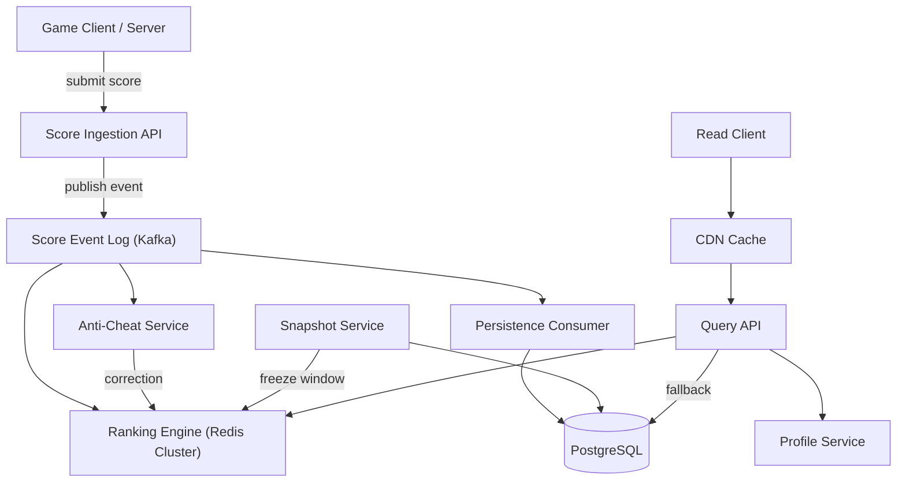

---

### Leaderboard Design Patterns

Each pattern: what it is, the problem it solves, how it works, when to use it, trade-offs, and a real-world example.

- **Sorted-set ranking (single-structure pattern)**
  *What:* keep the whole board in one Redis sorted set keyed by user id. *Problem solved:* rank and top-K queries become `O(log N + K)` instead of `O(N log N)` sorts. *How:* Redis maintains a skip list ordered by score; the hash map maps member to node for direct access. *When to use:* whenever the board fits in memory — the default choice. *Advantages:* simplest correct solution, atomic operations, native rank semantics. *Disadvantages:* bounded by single-shard memory; cross-shard rank is impossible without extra machinery. *Example:* Redis documentation itself recommends sorted sets for leaderboards; most mobile-game backends start here.

- **Key-per-window pattern**
  *What:* one Redis key per leaderboard instance: `leaderboard:daily:2026-04-25`, `leaderboard:weekly:2026-W17`, `leaderboard:alltime`. *Problem solved:* resets and multiple concurrent boards without in-place data surgery. *How:* writers fan out one score event to every applicable key; each time-windowed key gets a TTL slightly longer than the window; a snapshot job persists results before expiry. *Advantages:* clean isolation, automatic cleanup via TTL, trivial to add new board types. *Disadvantages:* write amplification (one event → N writes); memory grows with board count. *Example:* a game writes each match score to the daily, weekly, and all-time keys in one pipeline.

- **Composite-score tie-breaking**
  *What:* encode the tiebreaker into the score itself: `score = actual_score × 10^10 + (MAX_TS − timestamp)`. *Problem solved:* Redis orders by score only; members with equal scores are ordered lexicographically by member, which is arbitrary for ranking. *How:* scale the real score up and embed the inverted timestamp so earlier achievers rank higher. *When to use:* when "first to reach the score wins". *Advantages:* zero extra data structures, fully deterministic. *Disadvantages:* loses precision beyond 2^53 doubles; cannot change tiebreak rules retroactively; actual score must be recoverable by division. *Example:* `points = 4500`, reached at epoch second `1714000000` → composite `4500 × 10^10 + (9999999999 − 1714000000)`.

- **Bucket-based sharded ranking**
  *What:* divide the score range into fixed buckets; each bucket (on any shard) stores a count and a per-bucket sorted set. *Problem solved:* cross-shard ranking when no single shard can hold the board. *How:* `rank = Σ counts of all higher buckets + rank within own bucket`. *When to use:* beyond ~100M users per board or when boards are inherently partitioned (per region) but a global view is still needed. *Advantages:* horizontal scalability with bounded error only if buckets are coarse. *Disadvantages:* exact within-bucket rank still needs a per-bucket structure; bucket boundaries need tuning; more moving parts. *Example:* a global leaderboard with regional shards sums regional bucket counts to compute a global rank.

- **Approximate ranking**
  *What:* use probabilistic structures (t-digest sketches, bucket histograms) to estimate rank. *Problem solved:* exact global rank at extreme scale is expensive; "you are approximately #1,234,567" is good enough for some products. *When to use:* casual social leaderboards, percentile displays ("top 5%"). *Advantages:* tiny memory, trivially shardable. *Disadvantages:* not exact — unacceptable for competitive top-100 or prizes. *Example:* a fitness app showing "top 12% this week" from a sketch merged across shards.

- **Event-sourced score pipeline**
  *What:* treat score events as the source of truth; Redis and PostgreSQL are projections. *Problem solved:* Redis is volatile; ranks must be rebuildable after failure. *How:* every update is appended to Kafka before (or while) it is applied; consumers rebuild projections by replay. *Advantages:* full auditability, rebuildability, multiple independent consumers (anti-cheat, analytics). *Disadvantages:* operational complexity, replay lag during recovery. *Example:* after a Redis failover, a rebuilder replays the last 24 hours of events to reconstruct the daily board in minutes.

- **Read-through cache for the hot head**
  *What:* cache the top-100 response at CDN/application level for 1–5 seconds. *Problem solved:* extreme read skew on the top of the board. *Advantages:* 10× reduction in Redis read QPS. *Disadvantages:* bounded staleness; invalidation on every write would defeat the purpose, so TTL-only caching is used. *Example:* the public leaderboard web page served from a CDN with a 3-second TTL.

---

### Benefits

- **Microsecond-to-millisecond query latency.** Sorted sets answer top-K and rank queries in `O(log N + K)`; at 100M members this is microseconds in memory. Users perceive the leaderboard as instantaneous, which is the product requirement.
- **Horizontal scalability with a clear path.** Start with one sorted set; add key-per-window for board types; add Redis Cluster sharding by board; add bucket-based ranking only when a single board outgrows one shard. Each step is incremental and well understood.
- **Cheap at scale.** The working set is ~100 bytes per user. Ranking 100M users costs roughly 10 GB of RAM — far cheaper than sustaining equivalent query load on a relational database.
- **Clean separation of concerns.** Redis serves reads, Kafka orders events, PostgreSQL guarantees durability, and the snapshot service handles history. Each component scales and fails independently.
- **Deterministic and auditable.** Composite-score tie-breaking makes ordering reproducible; the event log makes every score change traceable, which matters for disputes and prizes.
- **Product flexibility.** New leaderboard types (a weekend tournament, a regional board) are new keys and configuration, not schema migrations.

---

### Pros

- **Native ranking semantics.** Redis sorted sets implement exactly the operations a leaderboard needs — no application-side sorting, no rank-count queries.
- **Atomic updates.** `ZINCRBY` is atomic, so concurrent score events for the same user never lose increments — no row locks, no optimistic-retry loops on the hot path.
- **Low operational ceiling.** One Redis primary handles ~100K ops/second; most products never need more than a small cluster.
- **TTL-based lifecycle.** Time-windowed boards clean themselves up; storage does not grow unboundedly.
- **Graceful degradation.** If Redis is lost, the system falls back to the database with degraded latency, then rebuilds Redis from the event log — no permanent data loss.

---

### Cons

- **Volatile primary store.** Redis is memory-first; a misconfigured persistence or failover can drop recent updates. Mitigation: AOF persistence, replicas, event log as source of truth.
- **Single-shard limit per board.** A sorted set lives on one shard; a single board bigger than one shard's memory forces the bucket-based redesign, which is a significant complexity jump.
- **Write amplification across boards.** Fanning one score event to daily/weekly/monthly/all-time keys multiplies writes and memory; dozens of board types become expensive.
- **Tie-breaking rigidity.** The composite-score trick bakes one tiebreak rule into stored values; changing the rule means rewriting every score.
- **Eventual-consistency artifacts.** Users occasionally see a rank that lags their last game by a second, or a cached top-100 that is 3 seconds old; product teams must accept and design around this.
- **Anti-cheat burden.** Because the feature is competitive, score ingestion cannot trust clients, adding server-side validation infrastructure that a naive design omits.

---

### Challenges

- **Technical: exact rank is a global computation.** Rank inherently depends on the entire dataset. Any sharding scheme must either centralize ordering (single sorted set) or aggregate counts across shards (buckets). There is no free lunch; this is the core design constraint interviewers probe.
- **Scalability: the cross-shard wall.** Sorted sets do not span shards. When one board exceeds single-shard memory (~25–50 GB practical), you must switch to bucket-based ranking with explicit cross-shard aggregation, or split the board by dimension (game, region) so no board is individually huge.
- **Performance: hot keys and burst traffic.** Tournament ends create 10× write bursts against the same keys. Pipelining, connection pooling, and writing through an event log absorb bursts; a naive synchronous write path will time out exactly when the leaderboard matters most.
- **Reliability: Redis failover with in-flight writes.** Failover can lose seconds of updates. Mitigations: AOF `everysec`, waiting on replicas where affordable, and rebuilding from the event log. RPO is bounded by the event log, not by Redis.
- **Maintainability: board-type proliferation.** Product teams add boards faster than operations retires them. Each board multiplies write volume and memory; governance (board registry, TTL policy, capacity review) is required.
- **Operational: snapshot correctness at window boundaries.** Events arriving exactly at midnight must be attributed to the correct window. Use event timestamps (not processing time) and a small grace period before snapshotting.
- **Security: score integrity.** Clients lie. Scores must be submitted or at least countersigned by trusted game servers, rate-limited per user, and screened by anti-cheat heuristics; otherwise the leaderboard rewards cheaters and honest users disengage.
- **Consistency across projections.** Redis, PostgreSQL, and snapshots can disagree transiently. Periodic reconciliation (compare Redis `ZSCORE` against DB totals on a sample) detects drift before users do.

---

### Best Practices

- **Make the event log the source of truth.** *Why:* Redis is a projection and can be rebuilt; if Redis is the only copy, a failover becomes data loss. *Example:* publish the score event to Kafka, acknowledge the client after the Redis apply, and let a consumer persist to PostgreSQL asynchronously.
- **Use `ZINCRBY` for additive scores, `ZADD` for absolute scores.** *Why:* conflating the two causes lost updates. A "score = max(old, new)" game needs `ZADD` with the `GT` flag; a points-accumulation game needs `ZINCRBY`. Choosing wrong is a common production bug.
- **Pipeline fan-out writes.** *Why:* writing one event to 4 board keys as 4 round trips quadruples latency; a single pipeline (or a Lua script) makes it one round trip and effectively atomic.
- **Attach TTLs to every time-windowed key — and snapshot before expiry.** *Why:* TTL prevents unbounded growth, but expiry without a snapshot deletes history. Set TTL = window + grace period, and run the snapshot job inside the grace period.
- **Cache only the hot head, briefly.** *Why:* the top-100 response changes constantly, so long TTLs serve stale winners; but a 1–5 second TTL absorbs the read skew with imperceptible staleness. Do not cache personalized rank queries at the CDN.
- **Never trust client-submitted scores.** *Why:* any value the client controls will be forged. Validate on trusted servers, cap per-event deltas, and monitor per-user score velocity.
- **Plan the rebuild path before you need it.** *Why:* Redis will fail eventually. A tested replay-from-log rebuilder turns a crisis into a routine operation; an untested one turns it into an outage plus data reconciliation.
- **Monitor rank-query latency and Redis memory per board.** *Why:* memory growth is the early-warning signal for hitting the single-shard wall; latency regression on `ZREVRANGE` with large K indicates oversized page requests.
- **Use deterministic tie-breaking from day one.** *Why:* retrofitting composite scores requires rewriting all stored scores; shipping without it produces visibly nondeterministic ordering that users report as a bug.
- **Bound page sizes in the API.** *Why:* `ZREVRANGE 0 -1` on a 100M-member set transfers gigabytes; enforce `limit ≤ 100` and cursor-style pagination.

---

### When to Use / When Not to Use

**Use this Redis-sorted-set leaderboard design when:**

- You need real-time top-K, exact rank, or rank-around-me queries over up to ~100M entries.
- Score updates are frequent (hundreds to tens of thousands per second) and reads are latency-sensitive.
- Slight read staleness (< 1 s) is acceptable — true for virtually all product leaderboards.
- The ranking key is a single numeric score (or a composite encodable in a double).

**Consider alternatives when:**

- **Ranking is over multiple dimensions** (e.g., rank by win rate with minimum-game thresholds and regional filters): a search engine (Elasticsearch/OpenSearch) or an OLAP store with scheduled materialization is a better fit than sorted sets.
- **Only periodic standings are needed** (hourly/daily refreshed): a scheduled batch job over the database producing a materialized table is far simpler — do not run Redis for a leaderboard that updates once an hour.
- **The dataset is small** (< 1M users, low QPS): a PostgreSQL table with an index on `(board_id, score DESC)` and a window function (`RANK() OVER`) is correct, durable, and operationally trivial. Redis is optional acceleration, not a requirement.
- **Exact global rank at massive multi-shard scale with strong consistency:** this is genuinely hard; consider whether approximate rank or percentile ("top 3%") satisfies the product need instead.

**Decision factors:** dataset size per board, update rate, read latency target, tolerance for staleness, number of board types, and whether rank must be exact. Small + exact + durable → PostgreSQL. Large + fast + slightly stale → Redis sorted sets. Multi-dimensional or approximate → search/OLAP or sketches.

---

### Use Cases

**Use case 1: Mobile battle-royale game, global + seasonal boards**

- *Problem:* 40M players, 5K score updates/second at match end bursts, players check rank after every match; seasonal board resets every 8 weeks and winners receive prizes.
- *Proposed solution:* one sorted set per season (`leaderboard:season:12`) plus an all-time key; composite scores for first-to-achieve tie-breaking; Kafka event log; PostgreSQL persistence; snapshot at season end with a signed, auditable snapshot table for prize distribution.
- *Suitability:* perfect fit — single numeric score, exact rank required, slight staleness acceptable.
- *How it works:* match servers (trusted) submit scores; ingestion publishes to Kafka and applies `ZINCRBY` to both keys in a pipeline; query API serves rank from Redis; at season close, the snapshot job pages the full set to durable storage before TTL expiry.
- *Trade-offs:* prizes require the snapshot, not the volatile Redis state, to be authoritative — an explicit consistency boundary the product must respect.

**Use case 2: Fitness app friends leaderboard**

- *Problem:* users compete on weekly steps within friend groups of 5–200 people; millions of small, disjoint boards.
- *Proposed solution:* key-per-group (`leaderboard:friends:<group_id>:2026-W17`) with 8-day TTL; no global board at all.
- *Suitability:* ideal — each sorted set is tiny (≤ 200 members), so memory is trivial and operations are `O(1)`-ish; key-per-window handles weekly reset.
- *How it works:* step-sync events fan out to the user's group keys; reads hit the small group key; TTL expires last week's boards automatically.
- *Trade-offs:* a user in 50 groups fans out 50 writes per sync — acceptable because group boards are small, but a cap on group memberships keeps fan-out bounded.

**Use case 3: Competitive programming contest platform**

- *Problem:* live contest standings where score depends on points *and* penalty time — a two-dimensional ranking with a deterministic tiebreak (lower penalty wins at equal points).
- *Proposed solution:* composite score: `points × 10^12 + (MAX_PENALTY − penalty_seconds)`; one sorted set per contest; standings page cached 2 seconds.
- *Suitability:* good fit because the tiebreak is static and encodable; exact rank is mandatory during contests.
- *How it works:* each accepted submission recomputes the composite score and `ZADD`s it; `ZREVRANGE` serves standings; after the contest, the final standings are snapshotted into the ratings pipeline.
- *Trade-offs:* composite encoding fixes the tiebreak rule forever for that contest; a rules change mid-contest would require rewriting every entry — acceptable because contest rules are fixed in advance.

**Use case 4: E-commerce flash-sale "top buyers" engagement board**

- *Problem:* marketing wants a live "top 100 shoppers this hour" board during a 2-hour flash sale, then it disappears.
- *Proposed solution:* a single key `leaderboard:flash:<sale_id>` with a 3-hour TTL, no persistence beyond the event log, CDN-cached top-100 with 2-second TTL.
- *Suitability:* ephemeral, read-heavy, exact rank irrelevant below the top — minimal infrastructure.
- *Trade-offs:* no historical requirement means skipping PostgreSQL persistence entirely, at the cost of no audit trail — fine for marketing, unacceptable for anything with prizes.

---

### Data Model and APIAPI Design

Base path: `/api/v1/leaderboards`. All mutations require service-to-service authentication (mTLS or signed JWT); reads require a user token. Versioning is via the URL path (`/v1`); additive changes only within a version.

**1. Submit a score**

```
POST /api/v1/leaderboards/{boardId}/scores
Idempotency-Key: 9f1c2a7e-…
Authorization: Bearer <service-token>
Content-Type: application/json

{
  "userId": "u-84521",
  "scoreDelta": 150,          // or "score": 5200 for absolute
  "mode": "INCREMENT",        // INCREMENT | SET | MAX
  "occurredAt": "2026-04-25T14:03:11Z"
}
```

Response `200 OK`:

```json
{
  "userId": "u-84521",
  "boardId": "alltime",
  "newScore": 128450,
  "rank": 1532,
  "processedAt": "2026-04-25T14:03:11.042Z",
  "idempotentReplay": false
}
```

Validation: `userId` required; exactly one of `score`/`scoreDelta`; `scoreDelta` within ±1,000,000 (anti-cheat sanity bound); `occurredAt` not in the future. Repeated `Idempotency-Key` returns the stored original response with `idempotentReplay: true` and HTTP 200.

**2. Get top-K**

```
GET /api/v1/leaderboards/alltime/top?limit=25&offset=0
```

Response `200 OK`:

```json
{
  "boardId": "alltime",
  "entries": [
    { "rank": 1, "userId": "u-103", "score": 982130, "username": "aria", "avatarUrl": "…" },
    { "rank": 2, "userId": "u-882", "score": 981004, "username": "kenji", "avatarUrl": "…" }
  ],
  "limit": 25,
  "offset": 0,
  "nextOffset": 25,
  "generatedAt": "2026-04-25T14:03:12Z"
}
```

`limit` defaults to 10, max 100 (enforced). `offset`+`limit` provide pagination; `sort` is fixed descending by score and is therefore not a parameter.

**3. Get a user's rank**

```
GET /api/v1/leaderboards/alltime/rank/u-84521
```

Response `200 OK`: `{ "userId": "u-84521", "score": 128450, "rank": 1532, "totalPlayers": 84211377 }` — `404` if the user is not on the board.

**4. Get players around a user**

```
GET /api/v1/leaderboards/alltime/around/u-84521?radius=5
```

Returns up to 11 entries centered on the user (fewer near the boundaries). Radius defaults to 5, max 50.

**5. List boards / snapshot history**

```
GET /api/v1/leaderboards?type=DAILY&activeOnly=true
GET /api/v1/snapshots/daily/2026-04-24/top?limit=100
```

**Status codes and errors**

| Code | Meaning |
|------|---------|
| 200 | Success (including idempotent replays) |
| 400 | Validation failure — body: `{ "error": "VALIDATION_FAILED", "details": [ { "field": "scoreDelta", "message": "must be ≤ 1000000" } ] }` |
| 401/403 | Missing or insufficient authentication |
| 404 | Board or user not found |
| 409 | Conflicting reuse of an `Idempotency-Key` with a different payload |
| 429 | Rate limited — `Retry-After` header included |
| 503 | Ranking store unavailable, serving fallback or retry later |

Rate limiting: 60 score submissions per user per minute, 600 reads per user per minute, enforced at the gateway with per-identity token buckets. Idempotency keys are stored for 24 hours.

---

#### Data Modeling

Relational model for the durable store (Redis keys are a projection, detailed in the Deep Dive):

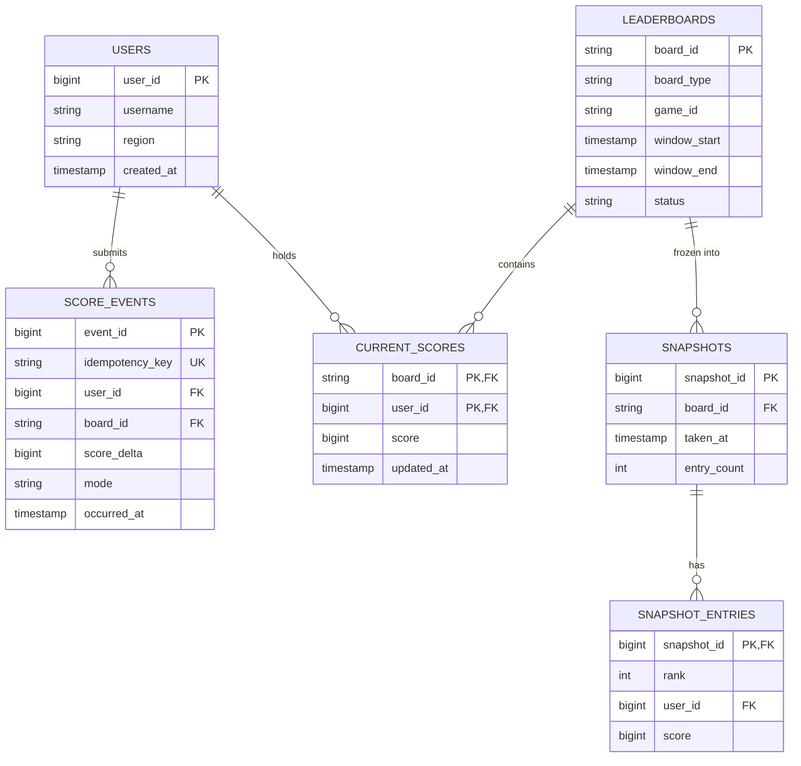

**Design notes**

- `SCORE_EVENTS` is append-only (event log mirror): full audit trail, replayable into Redis. Partitioned by day (`occurred_at`) because it grows ~5 GB/day; old partitions are archived to object storage and dropped.
- `CURRENT_SCORES` has a composite PK `(board_id, user_id)` and is the DB fallback for rank queries (with `RANK() OVER` — slow but correct). Index `(board_id, score DESC)` supports top-K from the DB during Redis outages.
- `idempotency_key` has a unique constraint — the database itself rejects duplicate submissions, which makes idempotency race-safe without distributed locks.
- Normalization vs denormalization: events and current scores are intentionally separate (write-optimized log vs read-optimized state). `SNAPSHOT_ENTRIES` denormalizes rank + score + user id deliberately: snapshots are immutable and read-only, so joins at read time would be pure overhead.
- Partitioning: `SCORE_EVENTS` by day; `CURRENT_SCORES` is hash-sharded by `board_id` only if it outgrows one instance; Redis keys are sharded by board (each board's sorted set lives entirely on one shard).

---

### High-Level Design

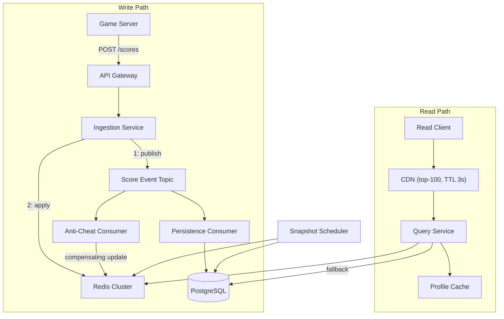

**Request flow — score update**

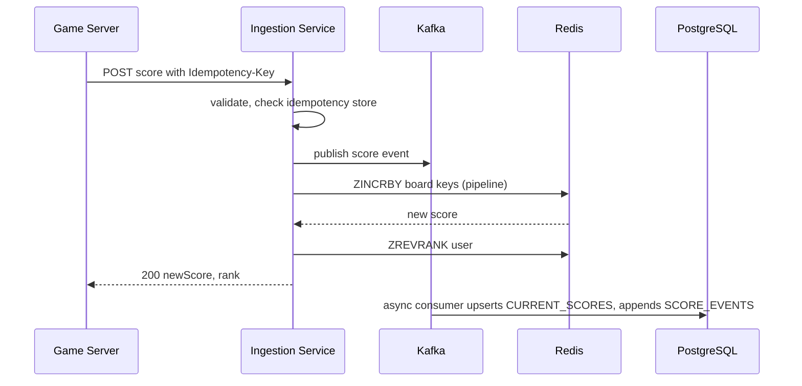

**Request flow — rank-around-me**

1. Query service checks the application cache for the user's recent rank response.
2. On miss: `ZREVRANK board user` → `ZREVRANGE board (rank-5) (rank+5) WITHSCORES` in one pipeline.
3. Batch-resolve user ids to usernames/avatars from the profile cache.
4. If Redis is unavailable: fall back to PostgreSQL with a window function over `CURRENT_SCORES` and mark the response `degraded: true`.

**Scaling and failure handling**

- Ingestion and query services are stateless — scale horizontally behind the gateway.
- Redis Cluster shards whole boards; a replica per shard provides failover. On failover, recent writes are recovered by replaying the event topic from the last acknowledged offset.
- Kafka absorbs write bursts (tournament ends) so PostgreSQL consumers can lag without back-pressuring the game path.
- Snapshot scheduler is idempotent per window: re-running it overwrites the same snapshot rows keyed by `(snapshot_id, rank)`.

---

### Deep Dive: Redis Sorted Sets and Ranking at Scale

**Why sorted sets are the perfect structure**

A Redis sorted set combines a hash map (member → score, `O(1)` lookup) with a skip list (members ordered by score). A skip list is a probabilistic balanced structure: roughly `O(log N)` for insert, delete, and rank queries, with rank computed by walking the list and summing span counters stored on each forward pointer. In practice, at 100M members, `ZADD` and `ZREVRANK` complete in tens of microseconds.

Core commands used by this design:

```
ZADD leaderboard <score> <user_id>        → O(log N)     add/update (absolute)
ZINCRBY leaderboard <delta> <user_id>     → O(log N)     atomic increment
ZREVRANK leaderboard <user_id>            → O(log N)     rank, 0-based, highest first
ZRANK leaderboard <user_id>               → O(log N)     rank, ascending
ZREVRANGE leaderboard 0 9 WITHSCORES      → O(log N + K) top 10
ZREVRANGE leaderboard <rank-5> <rank+5>   → O(log N + K) around-me
ZRANGEBYSCORE leaderboard <min> <max>     → O(log N + M) score-band queries
ZCARD leaderboard                         → O(1)         total players
ZSCORE leaderboard <user_id>              → O(1)         user's score
ZREMRANGEBYRANK leaderboard 0 <-1000001>  → O(log N + M) trim to top 1M
```

**Score update flow (end to end)**

1. Trusted game server POSTs the score with an idempotency key.
2. Ingestion validates, checks the idempotency store (Redis `SET NX` or DB unique constraint).
3. Event published to Kafka (durable ordering).
4. Pipeline to Redis: `ZINCRBY daily-key`, `ZINCRBY weekly-key`, `ZINCRBY alltime-key`, then `ZREVRANK alltime-key user` — one round trip, all atomic per command.
5. Respond with new score and rank. Total server-side latency: typically < 5 ms.

**Rank-around-me**

Because `ZREVRANK` is `O(log N)` and `ZREVRANGE` is `O(log N + K)`, the around-me query is two cheap commands pipelined. Edge cases: if `rank - radius < 0`, clamp to 0; if the user is last, the range returns fewer than `2×radius+1` entries — the API must not pad with placeholders.

**Tie-breaking with composite scores**

Redis orders equal scores lexicographically by member — nondeterministic for product purposes. Solution (preserved from the original design):

```
score = actual_score × 10^10 + (MAX_TIMESTAMP − timestamp)
```

Higher actual score wins; at equal scores, the earlier timestamp produces the larger composite and ranks higher. Constraints: doubles are exact only up to 2^53, so `actual_score × 10^10` must stay below ~9 × 10^15 (actual scores up to ~900,000 with 10^10 scaling — choose the scale factor for your score range); decode with `floor(composite / 10^10)` when displaying raw scores. Alternative when the composite is impossible (score range too large): store a tiebreak value in a parallel hash and sort in the application — slower, so prefer sizing the composite correctly.

**Multiple leaderboards and lifecycle**

```
Keys:
  leaderboard:global            → all-time scores (no TTL)
  leaderboard:daily:2026-04-25  → daily leaderboard (TTL = 2 days)
  leaderboard:weekly:2026-W17   → weekly leaderboard (TTL = 9 days)

Daily reset:
  - Writers simply start using the new day's key (key name derived from event date)
  - TTL on old keys gives automatic cleanup
  - Snapshot job persists the full ranking to PostgreSQL before expiry (historical)
```

Deriving the key from the event's `occurredAt` (not wall-clock processing time) keeps boundary events in the correct window.

**Sharding beyond a single Redis node**

For 100M+ users where one Redis cannot hold all data — the three classic options:

```
Option 1: Shard by user_id hash
  Each shard holds a subset of users for the same board.
  Problem: cross-shard ranking is hard — no shard knows the global
  ordering, so top-K requires a merge and exact rank is impossible
  without extra structures.

Option 2: Bucket-based ranking
  Divide the score range into buckets (e.g., 0-999, 1000-1999, …).
  Each bucket (sharded freely) tracks the count of users in it and a
  small per-bucket sorted set.
  rank = (sum of counts in all higher buckets) + (rank within own bucket)
  → exact if per-bucket sets are exact; scales horizontally.

Option 3: Approximate ranking
  Use sketch structures (t-digest / histograms) merged across shards.
  Acceptable for "You are approximately ranked #1,234,567" or
  percentile displays. Never for prize-relevant top-K.
```

The preferred scaling axis is actually **sharding by board** (game, region, season): `leaderboard:game:chess:alltime` and `leaderboard:game:puzzle:alltime` live on different shards. Each individual board stays on one shard, preserving exact rank within it. Bucket-based ranking is the escape hatch only when a *single* board outgrows one shard (~25–50 GB practical limit).

**Fallback to the database and periodic recompute**

Redis is a projection. Two safety mechanisms keep it honest:

1. **Read fallback:** if a rank query finds no member (`ZREVRANK` returns nil) but the user exists in `CURRENT_SCORES`, the query service lazily backfills Redis (`ZADD` from the DB value) and answers from the DB. If Redis is down entirely, top-K is served from the `(board_id, score DESC)` index and rank via `RANK() OVER` — slower (tens of ms), but available.
2. **Periodic recompute / reconciliation:** a scheduled job samples users (e.g., 0.1% hourly), compares `ZSCORE` against `CURRENT_SCORES.score`, and repairs drift. After any Redis failover or replay, a full recompute rebuilds the affected board from the event log or from `CURRENT_SCORES`. Alert on drift rate above a threshold — drift means a bug in the write path, not just noise.

**Persistence and replication settings that matter**

- AOF with `appendfsync everysec`: at most ~1 s of Redis-side loss on crash (the event log covers the rest).
- One replica per shard; automatic failover via Redis Cluster or Sentinel.
- `maxmemory-policy noeviction` on ranking shards: evicting leaderboard members would silently corrupt ranks — runaway memory must page an operator, not evict data.

---

### Replication Strategies

**What it means**

Replication Strategies determine how data and state are copied across multiple nodes in Leaderboard. The choice of strategy determines the trade-off between consistency, availability, and latency.

**Why it matters**

Leaderboard must replicate data to prevent loss and serve reads from multiple nodes. The replication strategy determines whether the system favors consistency (strong reads) or availability (always writable), and how it handles cross-node failure.

**How it works**

**Leader-based (single-leader)**: A single primary node accepts all writes; followers replicate changes asynchronously or semi-synchronously. Reads can be served from any replica. This strategy favors strong consistency for writes but creates a write bottleneck at the leader.

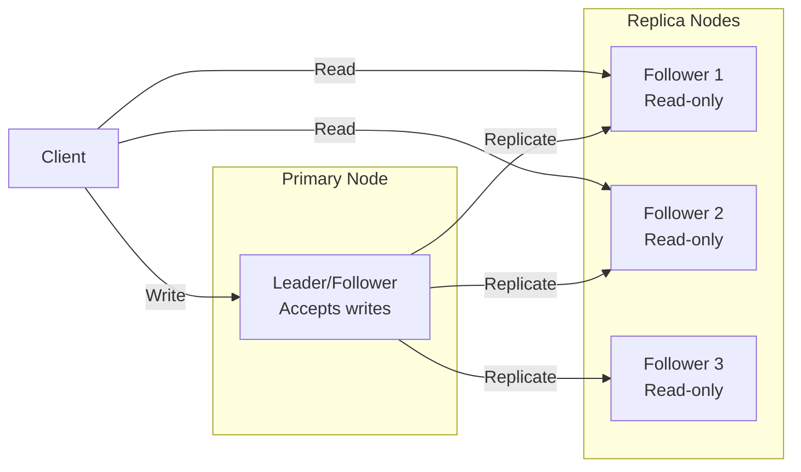

*Leader-based replication: a single primary node accepts all writes and replicates them to read-only followers. Clients can read from any replica for scaled read throughput, but all writes go through the leader.*

**Multi-leader (multi-master)**: Multiple nodes accept writes and exchange updates with each other. This enables low-latency writes in different regions but requires conflict resolution (last-write-wins, merge functions, or CRDTs).

**Leaderless (quorum-based)**: Any node can accept writes; a quorum of nodes must agree. Read and write quorums are configured so that at least one node overlaps between them (R + W > N). This maximizes availability and write scalability.

**Trade-offs for Leaderboard**:

| Strategy | Use Case | Pros | Cons |
|---|---|---|---|
| Leader-based | user scores, exact ranking data | Strong consistency, simple | Write bottleneck, leader failure risk |
| Multi-leader | public rankings, anonymized ranges | Low-latency global writes | Conflict resolution, complex |
| Leaderless | Caching, counters | High availability, no bottleneck | Eventual consistency, read repair overhead |

**Real-world implementations**

- **Redis**: Leader-follower replication with asynchronous replication; Sentinel handles failover.
- **Apache Kafka**: Leader-based partition replication with ISR (in-sync replica) — writes go to the leader, followers replicate.
- **Cassandra**: Tunable consistency with leaderless quorum (R + W > N).
- **DynamoDB Global Tables**: Multi-master active-active across regions.

### Failure Detection and Membership

**What it means**

Failure Detection and Membership is the mechanism by which Leaderboard determines which nodes are alive and part of the cluster. Membership is the list of known nodes; failure detection is the process of updating that list when nodes fail or recover.

**Why it matters**

Leaderboard must route requests only to healthy nodes and trigger failover when a node goes down. False positives (healthy nodes marked as dead) cause unnecessary failovers and data loss. False negatives (dead nodes not detected) cause failed requests and degraded performance.

**How it works**

**Heartbeat-based detection**: Each node sends a heartbeat (ping) to a subset of peers at regular intervals. If a node misses N consecutive heartbeats, it is marked as suspect. The gossip protocol distributes membership information: each node exchanges its view of the cluster with a random peer, and the information propagates gossip-style.

```mermaid
sequenceDiagram
    participant A as Node A
    participant B as Node B
    participant C as Node C

    loop Every 1s
        A->>B: Heartbeat (ping)
        B-->>A: Heartbeat (ack)
    end
    B->>C: Gossip: A is alive
    C->>A: Gossip: B is alive
    Note over A,B,C: View converges in O(log N) rounds
```

*Gossip-based failure detection: each node periodically pings a random subset of peers and gossips its view of the cluster. The membership list converges in O(log N) rounds.*

**Phi Accrual Failure Detector**: Instead of a fixed timeout, the detector measures the time between consecutive heartbeats and computes a phi (φ) value — the probability that the node is dead given the observed heartbeat pattern. φ is compared against a threshold (typically 1–8); higher thresholds reduce false positives but increase detection latency.

**SWIM (Scalable Weakly-consistent Infection-style Process group Membership Protocol)**: Nodes ping a random subset of cluster members. If a ping fails, the node is marked "suspect" and the failure is "infected" (gossiped) to other nodes. This is O(log N) per failure detection cycle and scales to large clusters.

**Trade-offs**:

| Approach | Strengths | Weaknesses |
|---|---|---|
| Heartbeat (timeout-based) | Simple, deterministic | False positives under load |
| Phi Accrual | Adaptive threshold | Needs historical data |
| SWIM | Scales to 1000s of nodes | Eventual consistency |

**Real-world implementations**

- **AWS Route 53 Health Checks**: Uses TCP/HTTP health checks with configurable thresholds to remove unhealthy instances from DNS rotation.
- **Kubernetes**: Uses the kubelet heartbeat (every 10s) to determine node liveness; nodes missing 3 consecutive heartbeats are marked NotReady.
- **Consul**: Uses SWIM protocol for membership and failure detection; supports both LAN and WAN gossip.
- **Akka Cluster**: Uses Phi Accrual failure detector with configurable φ thresholds.

### High Availability and Scalability

**What it means**

High Availability and Scalability determines how Leaderboard continues operating when nodes or entire zones fail, and how capacity is added as demand grows. HA is about minimizing downtime; scalability is about maintaining performance as load increases.

**Why it matters**

Leaderboard must stay operational even when individual nodes, availability zones, or entire regions fail. At the same time, it must scale horizontally to handle traffic spikes without degrading latency. The two are intertwined: the replication strategy, failure detection, and load balancing all contribute to both HA and scalability.

**How it works**

**Availability zones (AZs)**: Nodes are distributed across multiple AZs within a region. Each AZ is an independent failure domain (power, networking, physical security). A load balancer distributes requests across AZs; if one AZ fails, traffic is routed to the remaining AZs with no data loss (assuming replication is in place).

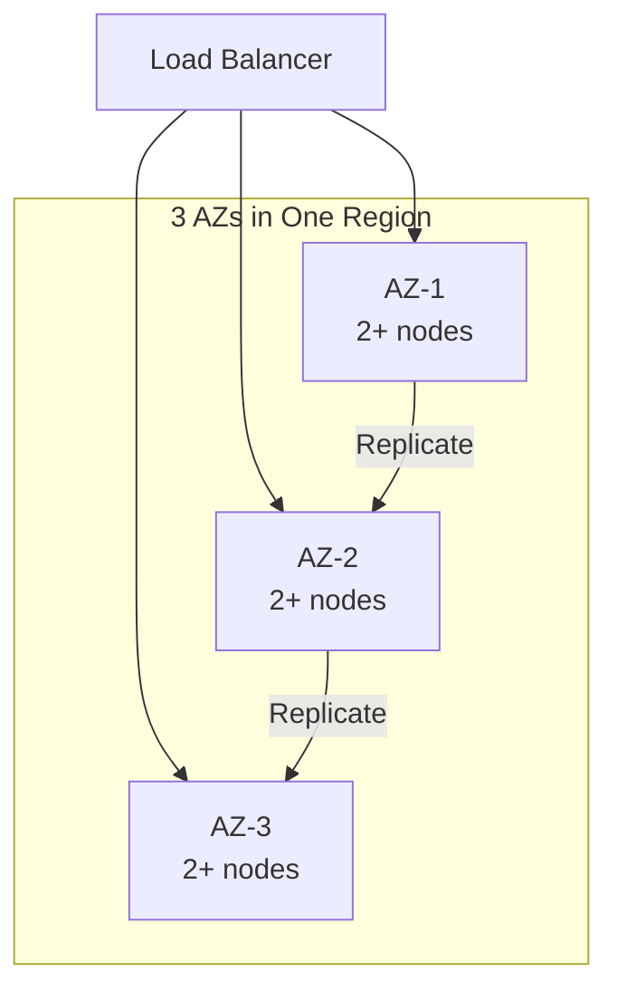

*Multi-AZ deployment: a load balancer distributes traffic across three availability zones. Each AZ has multiple nodes. Data is replicated across AZs so that losing one AZ does not cause data loss or service interruption.*

**Load balancing**: A load balancer distributes incoming requests across healthy nodes. Algorithms include round-robin, least connections, and weighted routing. Health checks ensure traffic only goes to healthy nodes. For Leaderboard, the load balancer also considers **Score ingestion API**
  *Purpose:* accept score events from game servers or cl when routing.

**Auto-scaling**: The system automatically adds or removes nodes based on metrics (CPU, memory, request rate). Scale-out policies add nodes when load exceeds a threshold; scale-in policies remove nodes during low load. For stateful services like Leaderboard, scale-out involves rebalancing partitions (moving data and connections to the new node).

**Failover and recovery**: When a node fails, the load balancer detects it (via health checks or failure detection) and stops sending traffic. A new node is provisioned (or a standby is promoted) and begins serving. For Leaderboard, failover must preserve user scores, exact ranking data data — this is achieved through replication with a quorum of healthy nodes.

**Scalability patterns**:

1. **Horizontal partitioning (sharding)**: Split data by a partition key (e.g., user_id, session_id) and distribute partitions across nodes. New nodes take ownership of additional partitions.

2. **Consistent hashing**: Minimize data movement on scale-out — only 1/N of the data moves to the new node. Nodes and partitions are placed on a ring; a request for key X is routed to the next node clockwise from hash(X).

3. **Connection draining**: When scaling in, existing connections are allowed to complete before the node is shut down. For Leaderboard, this means draining active 1. sessions gracefully.

**Real-world implementations**

- **Netflix OSS (Eureka + Zuul + Ribbon)**: Service discovery with Eureka, edge routing with Zuul, and client-side load balancing with Ribbon. Scales to thousands of instances.
- **Kubernetes HPA + VPA**: Horizontal Pod Autoscaler scales pods based on CPU/memory; Vertical Pod Autoscaler adjusts resource requests based on historical usage.
- **AWS ALB + Auto Scaling Groups**: Application Load Balancer with auto-scaling groups across AZs; health checks replace unhealthy instances automatically.

### Performance and Optimization

**What it means**

Performance and Optimization covers the techniques Leaderboard uses to achieve low latency, high throughput, and efficient resource usage. This section examines the key performance metrics, bottlenecks, and optimizations specific to the system.

**Why it matters**

Leaderboard faces competing pressures: users demand low latency, the system must handle high throughput, and infrastructure costs must be controlled. The optimizations applied at the data, compute, and network layers determine whether the system meets its SLA.

**How it works**

**Latency layers**: Latency in Leaderboard comes from three layers:
1. **Network**: Round-trip time from client to the nearest edge node / load balancer.
2. **Application**: Request processing time on the server (CPU, I/O, lock contention).
3. **Data**: Time to read/write from storage (cache hit vs. database query).

The 99th-percentile latency is the key metric for user-facing systems — it determines the worst-case experience.

**Caching strategies**: Leaderboard uses multiple cache layers:
- **Edge cache**: Static assets (images, CSS, JS) served from a CDN at the edge. For Leaderboard, this caches public rankings, anonymized ranges that doesn't change frequently.
- **Application cache**: In-memory cache (e.g., Redis, Memcached) for frequently accessed data. Cache-aside pattern: application checks cache first, falls back to database on miss.
- **Local cache**: In-process cache (e.g., Caffeine, Guava) for data accessed within a single request. Avoids network round-trips.

**Batching and pipelining**: Leaderboard batches small operations (e.g., writes, log flushes) to amortize per-operation overhead. Pipelining allows multiple requests to be in flight simultaneously.

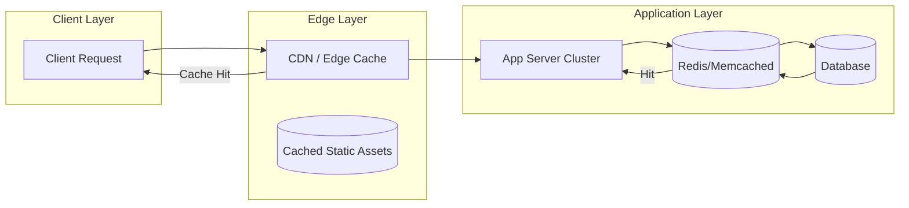

*Caching hierarchy: clients first hit the edge CDN/cache; if the response is cached, it is returned immediately. Otherwise, the request reaches the application, which checks its in-memory/application cache (e.g., Redis) before falling back to the database. This minimizes latency from each layer.*

**Connection pooling**: Leaderboard maintains a pool of database connections to avoid the TCP handshake overhead on every request. Pool size is tuned to match the database's capacity.

**Compression**: Responses are compressed (gzip, zstd) for clients that support it. At the network layer, gRPC uses HPACK header compression.

**Indexing**: Database tables are indexed on frequently queried fields. For Leaderboard, indexes cover **Ranking engine (Redis sorted sets)**
  *Purpose:* maintain the live ordering.  and **Score event log (Kafka or Kinesis)**
  *Purpose:* durable, replayable record o for fast lookups.

**Asynchronous processing**: Non-critical background work (e.g., analytics, cleanup, notifications) is offloaded to message queues and processed asynchronously, keeping the request path fast.

**Resource isolation**: CPU and memory are allocated per service (containers with cgroup limits). This prevents a single misbehaving service from degrading the entire system.

**Metrics for Leaderboard**:

| Metric | Target | How to Measure |
|---|---|---|
| P99 latency | < 1s | Load test with realistic traffic |
| Throughput | 1K RPS | Request rate under peak load |
| Error rate | < 0.1% | 5xx / total requests |
| Cache hit ratio | > 90% | cache_hits / (cache_hits + misses) |
| Resource utilization | < 80% CPU, < 85% memory | Container metrics |

**Real-world implementations**

- **Google's HTTP Load Balancer**: Global load balancing with edge PoPs; routes users to the nearest healthy backend.
- **Cloudflare**: Edge cache with Argo Smart Routing that dynamically routes traffic to avoid congestion.
- **Redis**: Used as an application cache with configurable eviction policies (LRU, LFU, TTL).

### Encryption and Key Management

**What it means**

Encryption and Key Management in Leaderboard ensures that data is protected both at rest (stored on disk) and in transit (moving between services). Key management governs how encryption keys are generated, stored, rotated, and accessed — without proper key management, encryption provides a false sense of security.

**Why it matters**

Leaderboard handles user scores, exact ranking data that must be encrypted both at rest and in transit. Scaling Leaderboard to handle increasing load while maintaining data consistency, low latency, and fault tolerance requires careful key management: keys must be rotated regularly, scoped to prevent cross-contamination, and audited for compliance. A single key compromise could expose sensitive data.

**How it works**

**At-rest encryption**: Data stored in **Score ingestion API**
  *Purpose:* accept score events from game servers or cl, **Ranking engine (Redis sorted sets)**
  *Purpose:* maintain the live ordering.  and databases is encrypted using AES-256-GCM. The Data Encryption Key (DEK) is generated per data partition and encrypted with a Key Encryption Key (KEK) managed by a KMS (AWS KMS, GCP KMS, HashiCorp Vault). Keys are regionally scoped — only data belonging to a region can be decrypted by that region's KEK.

**In-transit encryption**: All inter-service communication uses TLS 1.3 or mTLS for service-to-service auth. Cross-region communication of public rankings, anonymized ranges uses TLS + optional application-level encryption. user scores, exact ranking data is NEVER transmitted in plaintext or across region boundaries.

**Key hierarchy**:
```
Master Key (HSM-backed, KMS-managed)
  └─ KEK (per region, per service)
     └─ DEK (per data partition, rotated every 90 days)
        └─ Data (encrypted with DEK)
```

**Key rotation**: KEKs rotate annually (automatic via KMS); DEKs rotate per object or per 90 days. Applications handle key version headers transparently — a DEK version is stored alongside the encrypted data.

**Cross-region key sharing**: For non-restricted data (public rankings, anonymized ranges), a shared key is imported into each region's KMS. Restricted data NEVER uses cross-region keys — each region's KMS holds only that region's keys.

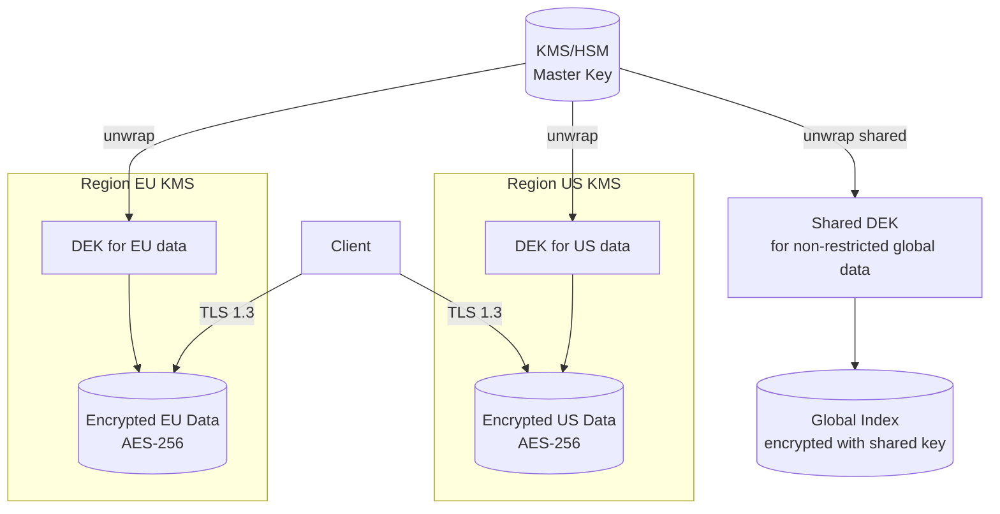

*Encryption key hierarchy: master keys are managed by an HSM-backed KMS and never leave the KMS. Each region has its own KEK. Data encryption keys (DEKs) are generated per partition and encrypted with the regional KEK. Only non-restricted global data uses a shared cross-region key. All client traffic uses TLS 1.3.*

**Java/Spring Boot Implementation**

```java
@Service
@RequiredArgsConstructor
public class DataEncryptionService {

    private final AWSKMS kms;
    @Value("${app.region}")
    private String region;
    @Value("${app.encryption.dek-ttl-minutes:1440}")
    private int dekTtlMinutes;

    private final Map<String, SecretKey> dekCache = new ConcurrentHashMap<>();

    public EncryptedData encrypt(String plaintext, String partitionId) {
        SecretKey dek = getOrCreateDek(partitionId);
        byte[] ciphertext = CryptoUtils.encrypt(plaintext.getBytes(StandardCharsets.UTF_8), dek);
        String dekCiphertext = kms.encrypt(EncryptRequest.builder()
            .keyId("arn:aws:kms:" + region + ":master-key")
            .plaintext(SdkBytes.fromByteArray(dek.getEncoded()))
            .build()).ciphertextBlob().asByteArray();
        return new EncryptedData(ciphertext, dekCiphertext, Instant.now());
    }

    private SecretKey getOrCreateDek(String partitionId) {
        return dekCache.computeIfAbsent(partitionId, id -> {
            try {
                return KeyGenerator.getInstance("AES").generateKey();
            } catch (NoSuchAlgorithmException e) {
                throw new IllegalStateException("Cannot generate DEK", e);
            }
        });
    }
}
```

*Spring Boot encryption service: DEKs are cached per-partition with TTL. Each DEK is encrypted via AWS KMS using a regional master key. The encrypted DEK (ciphertext) is stored alongside the data — only the KMS for that region can decrypt it.*

**Real-world implementations**

- **AWS KMS**: Managed HSM-backed key service; supports automatic key rotation and custom key stores.
- **HashiCorp Vault**: Open-source key management; supports transit encryption (encrypt/decrypt without storing keys).
- **Google Cloud KMS**: Hardware-backed key management with IAM-based access control.

### Authentication and Authorization

**What it means**

Authentication and Authorization (AuthN/AuthZ) in Leaderboard control who can access the system and what they can do. Authentication verifies identity; authorization determines permissions. In a distributed system like Leaderboard, auth must work across multiple nodes while respecting data boundaries — a user authenticated in one region should not have their session data or tokens replicated to regions where it is not permitted.

**Why it matters**

Leaderboard must verify identity at the edge and enforce authorization at every service boundary. user scores, exact ranking data must be protected — only users with appropriate roles should access it. At the same time, public rankings, anonymized ranges data should be accessible to a wider audience with minimal friction.

**How it works**

**Authentication (who are you?)**:
- **JWT tokens**: Users authenticate through their home region's identity provider. The region returns a JWT (JSON Web Token) signed by a regional signing key. Tokens include claims like `iss` (issuer region), `sub` (subject/user ID), `home_region`, `roles`, and `exp` (expiry). Tokens are scoped per region — a token issued by region A cannot access restricted data in region B.
- **mTLS for service-to-service**: Internal services authenticate each other using mutual TLS certificates issued by a per-region Certificate Authority (CA). No shared secrets cross region boundaries.
- **Session management**: Sessions are stored regionally (Redis) and never replicated cross-region for restricted data. Session IDs are opaque UUIDs; the session store maps session ID → user context.

**Authorization (what can you do?)**:
- **RBAC (Role-Based Access Control)**: Users are assigned roles per region. Common roles: `region_admin` (full access to region data), `auditor` (read-only audit), `viewer` (read public data only). Roles are stored in the regional database and cached locally for sub-1ms lookups.
- **ABAC (Attribute-Based Access Control)**: Fine-grained permissions based on attributes (e.g., `home_region == request_region AND role == admin`). This allows expressing complex policies like "users can only access restricted data in their home region."
- **Resource-level authorization**: Each request is checked against an ACL (Access Control List) that specifies which roles can access which resources. For Leaderboard, restricted resources require the `admin` role + matching region.

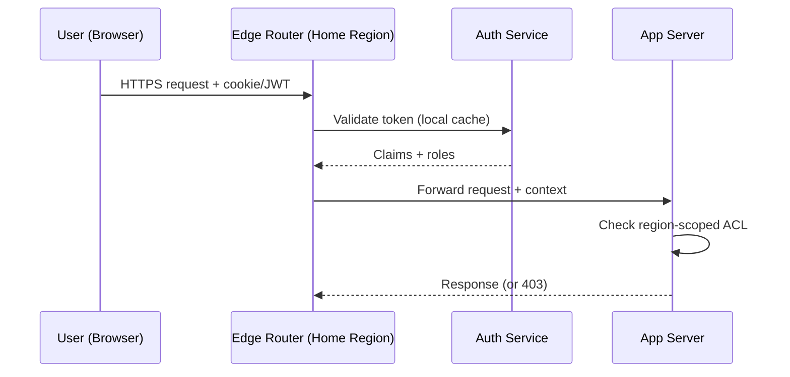

*Authentication flow: the user's token is validated by the regional auth service (claims cached locally). The edge router forwards the request with the security context. Each app server checks the region-scoped ACL before accessing restricted data.*

**Java/Spring Boot Implementation**

```java
@Service
@RequiredArgsConstructor
public class AuthorizationService {

    private final UserTokenRepository tokenRepository;
    @Value("${app.region}")
    private String currentRegion;

    public boolean canAccessResource(String userId, String resourceRegion,
                                     String action, JWTClaims claims) {
        String userHomeRegion = claims.getStringClaim("home_region");
        List<String> roles = claims.getStringListClaim("roles");

        if (!roles.contains(action)) {
            return false;
        }

        if (resourceRegion.equals(userHomeRegion)) {
            return true;
        }

        if (resourceRegion.equals("global")) {
            return roles.contains("global_reader");
        }

        return false;
    }
}

@RestController
@RequiredArgsConstructor
@RequestMapping("/api/v1")
public class RegionController {
    private final AuthorizationService authService;

    @GetMapping("/data/{region}/profile")
    public ResponseEntity<?> getProfile(
            @PathVariable String region,
            @RequestHeader("Authorization") String token) {
        JWTClaims claims = JwtUtils.parseAndValidate(token, currentRegion);

        if (!authService.canAccessResource(
                claims.getStringClaim("sub"), region, "read", claims)) {
            return ResponseEntity.status(HttpStatus.FORBIDDEN).build();
        }

        return ResponseEntity.ok(profileService.getByRegion(region));
    }
}
```

*Spring Boot authorization service: checks both the user's role and whether the requested resource violates region boundaries. The `canAccessResource` method returns false if a user from region EU tries to access restricted data in region US.*

**Real-world implementations**

- **Auth0**: JWT-based authentication with regional endpoints; supports custom rules for ABAC.
- **Okta**: Multi-region identity management with adaptive MFA and ThreatInsight for anomaly detection.
- **AWS Cognito**: Regional user pools with IAM integration; tokens are region-scoped by default.

### Security Threats and Mitigations

**What it means**

Security Threats and Mitigations catalog the attack surface of Leaderboard, the most likely threats, and the corresponding defenses. Every distributed system has unique threat vectors — Leaderboard is no exception.

**Why it matters**

Leaderboard handles user scores, exact ranking data that attackers might target. Scaling Leaderboard to handle increasing load while maintaining data consistency, low latency, and fault tolerance expands the attack surface: more nodes, more network paths, more failure modes. Without proper threat modeling, a single vulnerability could expose sensitive data across the entire system.

**Threat model**:

| Threat | Likelihood | Impact | Mitigation |
|---|---|---|---|
| Data exfiltration (cross-region) | High | Critical | Region-scoped keys, no cross-region replication of restricted data |
| Man-in-the-middle (inter-service) | Medium | High | mTLS between all services |
| Replay attacks | Medium | High | Token expiry + nonce |
| DDoS at the edge | High | High | Rate limiting + edge filtering (Cloudflare, AWS Shield) |
| PII leakage in logs | High | High | PII redaction + field-level access control |
| Session hijacking | Medium | Medium | Short-lived tokens + IP binding |
| Privilege escalation | Low | Critical | Least-privilege RBAC + audit logs |
| Cache poisoning | Low | Medium | Cache invalidation on write + signed cache keys |

**How it works**

**Data exfiltration prevention**: Leaderboard enforces data residency by design — user scores, exact ranking data is never replicated cross-region. The replication layer checks a data classification label before allowing cross-region copy. A database-level policy (e.g., PostgreSQL RLS) also blocks cross-region queries for restricted partitions.

**mTLS enforcement**: All service-to-service communication uses mutual TLS. Certificates are issued by a per-region CA and rotated every 30 days. Services must present a valid certificate to communicate — no plaintext connections are allowed.

**PII redaction**: Application logs are scanned for PII patterns (email, phone, credit card) using an automated redaction layer (e.g., AWS Macie, Google DLP). public rankings, anonymized ranges is logged freely; restricted fields are masked or dropped before logging.

```mermaid
graph TD
    subgraph "Threat Surface"
        Client[Client]
        Edge[Edge Router / WAF]
        App[App Server]
        DB[(Database)]
        Cache[(Cache)]
        Logs[Log Store]
    end

    Client -->|HTTPS| Edge
    Edge -->|mTLS| App
    App -->|mTLS| DB
    App -->|Read| Cache
    App -->|Write| DB
    App -->|Log| Logs

    subgraph "Mitigations"
        WAF[AWS WAF /<br/>Cloudflare]
        DLP[PII Redaction<br/>(Macie/DLP)]
        FIM[File Integrity<br/>Monitoring]
    end

    Edge -.-> WAF
    Logs -.-> DLP
    DB -.-> FIM
```

*Threat mitigation diagram: the WAF at the edge blocks DDoS and injection attacks. mTLS protects all service-to-service communication. PII redaction scans logs before storage. File integrity monitoring alerts on database tampering.*

**Audit trail**: All security-relevant events (auth, data access, config changes) are written to an append-only audit log with cryptographic integrity (HMAC per entry). The log covers user scores, exact ranking data access — who accessed what, when, and from where.

**Real-world implementations**

- **Cloudflare**: Zero-trust model (All Connections to All Networks) with mTLS everywhere; uses GeoIP blocking and rate limiting for DDoS mitigation.
- **Google BeyondCorp**: Zero-trust network security model; all access is authenticated and authorized at the request level.

### Observability and Logging

**What it means**

Observability and Logging in Leaderboard provide visibility into system behavior through three pillars: **metrics** (aggregates and counters), **logs** (structured event records), and **traces** (distributed request timelines). Together, these signals allow operators to debug issues, detect anomalies, and verify SLA compliance.

**Why it matters**

Distributed systems like Leaderboard are inherently opaque — failures can cascade across services in unexpected ways. Without good observability, a single slow dependency can cause widespread timeouts that are nearly impossible to diagnose. Scaling Leaderboard to handle increasing load while maintaining data consistency, low latency, and fault tolerance makes observability even more critical: operators need to see cross-region latency, regional failures, and data-residency violations.

**How it works**

**Metrics**: Leaderboard instruments every service with Prometheus-style metrics:
- **Request rate, error rate, duration (the "RED" metrics)**: Tracks per-endpoint HTTP latency and error counts.
- **System metrics**: CPU, memory, disk I/O, network throughput per node.
- **Business metrics**: For Leaderboard, this includes metrics like "**Ranking engine (Redis sorted sets)**
  *Purpose:* maintain the live ordering.  fill rate" and "reservation conflict rate".

Metrics are aggregated in a time-series database (Prometheus, VictoriaMetrics) and visualized in Grafana dashboards with alerts via PagerDuty.

**Logs**: Leaderboard uses structured logging (JSON format) with standardized fields:
- `timestamp`: ISO 8601 UTC
- `level`: DEBUG, INFO, WARN, ERROR
- `service`: originating service name
- `trace_id`: distributed trace identifier (for correlation)
- `span_id`: current operation span
- `region`: the region that processed the request
- `data_class`: RESTRICTED or NON_RESTRICTED

user scores, exact ranking data access is logged with full context (user, action, resource). public rankings, anonymized ranges logs are aggregated and may have reduced retention.

**Distributed tracing**: Every request is assigned a trace ID at the edge. The trace propagates through all downstream services via HTTP headers. A tracing backend (Jaeger, Tempo, Zipkin) reconstructs the full request timeline, showing latency at each hop. For Leaderboard, traces include region boundaries — a cross-region call is annotated as such.

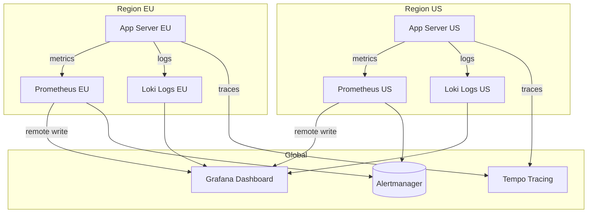

*Observability architecture: each region runs its own Prometheus (metrics) and Loki (logs) instances. A global Grafana instance queries all regional backends. Traces are collected centrally in Tempo. Alerts fire from each region's Prometheus to Alertmanager.*

**Alerting**: Leaderboard defines SLO-based alerts:
- **Latency**: P99 > 1s for 5 minutes → page.
- **Error rate**: > 1% for 10 minutes → page.
- **Availability**: < 99.5% for 15 minutes → page.
- **Data residency violation**: any restricted data detected outside its region → critical page.

**Java/Spring Boot Implementation**

```java
@Component
@RequiredArgsConstructor
@Slf4j
public class ObservabilityContext {

    @Value("${app.region}")
    private String region;

    public void logAccess(String userId, String resource, String action,
                          boolean restricted) {
        log.info("access_event userId={} resource={} action={} region={} data_class={}",
            userId, resource, action, region, restricted ? "RESTRICTED" : "NON_RESTRICTED");
    }
}

@RestController
@RequiredArgsConstructor
@Slf4j
public class ApiController {
    private final ObservabilityContext obs;
    private final UserService userService;

    @GetMapping("/api/v1/profile")
    public ResponseEntity<ProfileResponse> getProfile(
            @AuthenticationPrincipal UserDetails user) {
        String traceId = MDC.get("traceId");
        long start = System.nanoTime();

        try {
            ProfileResponse response = userService.getProfile(user.getId());
            obs.logAccess(user.getId(), "profile", "read", true);

            return ResponseEntity.ok(response);
        } finally {
            long durationMs = (System.nanoTime() - start) / 1_000_000;
            log.info("profile_read traceId={} latencyMs={} region={}",
                traceId, durationMs, obs.region);
        }
    }
}
```

*Spring Boot observability: the `ObservabilityContext` logs structured access events with data classification. The controller records latency and trace ID for every request, enabling SLO-based alerting.*

**Real-world implementations**

- **Netflix OSS (Atlas + Zipkin + Servo)**: Metrics via Atlas, traces via Zipkin, instrumented via Servo. Scales to over 700 billion requests/day.
- **Google SRE Workbook**: Comprehensive observability with SLI/SLO/SLI definition; uses Borgmon for metrics and Dapper for tracing.
- **AWS Observability**: CloudWatch for metrics, X-Ray for tracing, CloudWatch Logs for structured logs.

### Real-World Implementations

**Leaderboard in production**

- **Leaderboard platforms**: widely used leaderboard platform

**Key takeaways**

- Scalability patterns proven in production at scale
- Common pitfalls and how to avoid them
- Integration with existing infrastructure and monitoring

### Architectural Patterns

**Patterns relevant to Leaderboard**

- **Layered/Clean Architecture**: Separates business logic from infrastructure concerns, enabling independent testing and maintenance.
- **Database-per-Service**: Each service manages its own data store, providing isolation but complicating cross-service queries.
- **Event-Driven Architecture**: Decouples services through asynchronous events; enables loose coupling and independent scaling.
- **CQRS (Command Query Responsibility Segregation)**: Separates read and write models for independent optimization; read models can be denormalized for query performance.
- **Saga Pattern**: Manages distributed transactions through a sequence of local transactions with compensating actions on failure.

**Pattern trade-offs**

- Layered architecture is simple to implement but can create tight coupling between layers over time.
- Database-per-service provides schema independence but requires careful design of cross-service consistency.
- Event-driven architecture enables loose coupling but introduces eventual consistency and debugging complexity.
- CQRS optimizes read/write paths independently but doubles the number of data models to maintain.
- Sagas handle long-running transactions but require idempotent compensations and careful state management.

### Java and Spring Boot Implementation Guide

This guide implements the write and read paths with Spring Boot 3.x and Spring Data Redis. Key choices: constructor injection everywhere, externalized configuration via `@Value`, records as DTOs, Bean Validation, and pipelined Redis calls.

**1. DTOs and validation**

```java
import jakarta.validation.constraints.*;

public record ScoreSubmissionRequest(
        @NotBlank String userId,
        @NotNull SubmissionMode mode,
        @DecimalMin(value = "-1000000") @DecimalMax(value = "1000000") Long scoreDelta,
        @Positive Long score,
        @NotNull Instant occurredAt) {

    @AssertTrue(message = "Provide score for SET/MAX modes or scoreDelta for INCREMENT mode")
    public boolean isPayloadConsistent() {
        return switch (mode) {
            case INCREMENT -> scoreDelta != null && score == null;
            case SET, MAX  -> score != null && scoreDelta == null;
        };
    }
}

public enum SubmissionMode { INCREMENT, SET, MAX }

public record ScoreSubmissionResponse(
        String userId, String boardId, long newScore, long rank, boolean idempotentReplay) {}

public record LeaderboardEntry(long rank, String userId, long score, String username) {}

public record LeaderboardPage(String boardId, List<LeaderboardEntry> entries, int limit, int offset) {}
```

**2. Ranking service — Spring Data Redis sorted-set operations**

```java
import org.springframework.beans.factory.annotation.Value;
import org.springframework.data.redis.core.StringRedisTemplate;
import org.springframework.data.redis.core.ZSetOperations;
import org.springframework.stereotype.Service;

import java.time.LocalDate;
import java.time.ZoneOffset;
import java.util.List;
import java.util.Set;

@Service
public class LeaderboardService {

    private final StringRedisTemplate redis;
    private final ZoneOffset boardZone;

    public LeaderboardService(StringRedisTemplate redis,
                              @Value("${leaderboard.board-zone:UTC}") ZoneOffset boardZone) {
        this.redis = redis;
        this.boardZone = boardZone;
    }

    /** Keys derived from the event timestamp keep boundary events in the right window. */
    public List<String> boardKeysFor(Instant occurredAt) {
        LocalDate day = occurredAt.atOffset(boardZone).toLocalDate();
        return List.of(
                "leaderboard:alltime",
                "leaderboard:daily:" + day,
                "leaderboard:weekly:" + day.getYear() + "-W" + weekOf(day));
    }

    /** Fan out one score event to every applicable board in a single pipeline. */
    public long submitScore(ScoreSubmissionRequest req) {
        List<String> keys = boardKeysFor(req.occurredAt());
        List<Object> results = redis.executePipelined((RedisCallback<Object>) connection -> {
            for (String key : keys) {
                var zSet = connection.zSetCommands();
                byte[] rawKey = redis.getStringSerializer().serialize(key);
                byte[] member = redis.getStringSerializer().serialize(req.userId());
                switch (req.mode()) {
                    case INCREMENT -> zSet.zIncrBy(rawKey, req.scoreDelta(), member);
                    case SET       -> zSet.zAdd(rawKey, req.score(), member);
                    case MAX       -> zSet.zAdd(rawKey, req.score(), member,
                                                RedisZSetCommands.ZAddArgs.gt());
                }
            }
            return null;
        });
        // First pipeline result is the new all-time score (ZINCRBY returns it; ZADD returns count).
        return currentScore("leaderboard:alltime", req.userId());
    }

    public long currentScore(String boardKey, String userId) {
        Double score = redis.opsForZSet().score(boardKey, userId);
        return score == null ? 0L : score.longValue();
    }

    /** 1-based rank, or empty if the user is not ranked. */
    public OptionalLong rankOf(String boardKey, String userId) {
        Long zeroBased = redis.opsForZSet().reverseRank(boardKey, userId);
        return zeroBased == null ? OptionalLong.empty() : OptionalLong.of(zeroBased + 1);
    }

    public List<LeaderboardEntry> top(String boardKey, int offset, int limit) {
        Set<ZSetOperations.TypedTuple<String>> tuples =
                redis.opsForZSet().reverseRangeWithScores(boardKey, offset, offset + limit - 1L);
        return toEntries(tuples, offset);
    }

    /** Rank-around-me: two pipelined O(log N) operations. */
    public List<LeaderboardEntry> around(String boardKey, String userId, int radius) {
        Long rank = redis.opsForZSet().reverseRank(boardKey, userId);
        if (rank == null) return List.of();
        long start = Math.max(0, rank - radius);
        long end = rank + radius;
        Set<ZSetOperations.TypedTuple<String>> tuples =
                redis.opsForZSet().reverseRangeWithScores(boardKey, start, end);
        return toEntries(tuples, (int) start);
    }

    private List<LeaderboardEntry> toEntries(Set<ZSetOperations.TypedTuple<String>> tuples, int startRank) {
        if (tuples == null) return List.of();
        AtomicInteger rank = new AtomicInteger(startRank + 1);
        return tuples.stream()
                .map(t -> new LeaderboardEntry(rank.getAndIncrement(), t.getValue(),
                        t.getScore() == null ? 0 : t.getScore().longValue(), null))
                .toList();
    }

    private int weekOf(LocalDate day) {
        return day.get(java.time.temporal.WeekFields.ISO.weekOfWeekBasedYear());
    }
}
```

**3. Idempotency guard**

```java
@Service
public class IdempotencyService {

    private final StringRedisTemplate redis;
    private final Duration ttl;

    public IdempotencyService(StringRedisTemplate redis,
                              @Value("${leaderboard.idempotency-ttl:PT24H}") Duration ttl) {
        this.redis = redis;
        this.ttl = ttl;
    }

    /** Returns true the first time this key is seen; false on replays. */
    public boolean claim(String key) {
        Boolean first = redis.opsForValue()
                .setIfAbsent("idempotency:" + key, "claimed", ttl);
        return Boolean.TRUE.equals(first);
    }
}
```

**4. REST controller**

```java
import jakarta.validation.Valid;
import jakarta.validation.constraints.Max;
import jakarta.validation.constraints.Min;
import org.springframework.http.ResponseEntity;
import org.springframework.validation.annotation.Validated;
import org.springframework.web.bind.annotation.*;

@RestController
@RequestMapping("/api/v1/leaderboards")
@Validated
public class LeaderboardController {

    private final LeaderboardService leaderboardService;
    private final IdempotencyService idempotencyService;

    public LeaderboardController(LeaderboardService leaderboardService,
                                 IdempotencyService idempotencyService) {
        this.leaderboardService = leaderboardService;
        this.idempotencyService = idempotencyService;
    }

    @PostMapping("/{boardId}/scores")
    public ResponseEntity<ScoreSubmissionResponse> submit(
            @PathVariable String boardId,
            @RequestHeader("Idempotency-Key") String idempotencyKey,
            @Valid @RequestBody ScoreSubmissionRequest request) {

        if (!idempotencyService.claim(idempotencyKey)) {
            long score = leaderboardService.currentScore("leaderboard:" + boardId, request.userId());
            long rank = leaderboardService.rankOf("leaderboard:" + boardId, request.userId()).orElse(0);
            return ResponseEntity.ok(new ScoreSubmissionResponse(
                    request.userId(), boardId, score, rank, true));
        }
        long newScore = leaderboardService.submitScore(request);
        long rank = leaderboardService.rankOf("leaderboard:" + boardId, request.userId()).orElse(0);
        return ResponseEntity.ok(new ScoreSubmissionResponse(
                request.userId(), boardId, newScore, rank, false));
    }

    @GetMapping("/{boardId}/top")
    public LeaderboardPage top(@PathVariable String boardId,
                               @RequestParam(defaultValue = "10") @Min(1) @Max(100) int limit,
                               @RequestParam(defaultValue = "0") @Min(0) int offset) {
        return new LeaderboardPage(boardId,
                leaderboardService.top("leaderboard:" + boardId, offset, limit), limit, offset);
    }

    @GetMapping("/{boardId}/around/{userId}")
    public List<LeaderboardEntry> around(@PathVariable String boardId,
                                         @PathVariable String userId,
                                         @RequestParam(defaultValue = "5") @Min(1) @Max(50) int radius) {
        return leaderboardService.around("leaderboard:" + boardId, userId, radius);
    }
}
```

**5. Global exception handling**

```java
@RestControllerAdvice
public class GlobalExceptionHandler {

    @ExceptionHandler(MethodArgumentNotValidException.class)
    public ResponseEntity<Map<String, Object>> validation(MethodArgumentNotValidException ex) {
        List<Map<String, String>> details = ex.getBindingResult().getFieldErrors().stream()
                .map(f -> Map.of("field", f.getField(), "message",
                        String.valueOf(f.getDefaultMessage())))
                .toList();
        return ResponseEntity.badRequest()
                .body(Map.of("error", "VALIDATION_FAILED", "details", details));
    }

    @ExceptionHandler(ConstraintViolationException.class)
    public ResponseEntity<Map<String, Object>> constraint(ConstraintViolationException ex) {
        return ResponseEntity.badRequest()
                .body(Map.of("error", "VALIDATION_FAILED", "details", ex.getMessage()));
    }
}
```

**6. Snapshot scheduler (persist before TTL expiry)**

```java
@Component
public class SnapshotScheduler {

    private final LeaderboardService leaderboardService;
    private final SnapshotRepository snapshotRepository;
    private final StringRedisTemplate redis;

    public SnapshotScheduler(LeaderboardService leaderboardService,
                             SnapshotRepository snapshotRepository,
                             StringRedisTemplate redis) {
        this.leaderboardService = leaderboardService;
        this.snapshotRepository = snapshotRepository;
        this.redis = redis;
    }

    /** Runs in the grace period between window close and key expiry. */
    @Scheduled(cron = "0 10 0 * * *", zone = "UTC")
    public void snapshotYesterdaysDailyBoard() {
        String key = "leaderboard:daily:" + LocalDate.now(ZoneOffset.UTC).minusDays(1);
        int offset = 0;
        while (true) {
            List<LeaderboardEntry> page = leaderboardService.top(key, offset, 1000);
            if (page.isEmpty()) break;
            snapshotRepository.saveBatch(key, page);
            offset += page.size();
        }
    }
}
```

Configuration in `application.yml`: `spring.data.redis.cluster.nodes`, connection pool sizes (`lettuce.pool.max-active: 64`), and the custom `leaderboard.*` properties injected above via `@Value`. Interview point: note how *no* ranking state lives in the application tier — every instance is interchangeable, which is what allows the service to scale horizontally and recover from instance loss without data loss.

---

### Interview Questions and Answers

**Beginner**

- **Q: What data structure would you use to implement a leaderboard and why?**
  **A:** A Redis sorted set. It keeps members ordered by score using a skip list plus a hash map, giving `O(log N)` score updates (`ZADD`/`ZINCRBY`), `O(log N)` rank queries (`ZREVRANK`), and `O(log N + K)` top-K retrieval (`ZREVRANGE`) — all in-memory, so microseconds in practice. A relational database requires counting higher-scored rows for rank (`O(N)` with an index) and cannot sustain tens of thousands of such queries per second.

- **Q: What is the difference between `ZADD` and `ZINCRBY`?**
  **A:** `ZADD` sets a member's score to an absolute value (with `GT`/`LT` flags for conditional updates); `ZINCRBY` atomically adds a delta to the current score. Points-accumulation games need `ZINCRBY`; best-score games need `ZADD` with `GT`. Using `ZADD` where `ZINCRBY` was needed causes lost increments under concurrency.

- **Q: How do you get the users ranked around a specific user?**
  **A:** `ZREVRANK board user` to get the 0-based rank, then `ZREVRANGE board (rank-radius) (rank+radius) WITHSCORES`, clamping the start at 0. Both are `O(log N + K)` and can be pipelined into one round trip.

- **Q: Why not just use `ORDER BY score DESC LIMIT 100` in PostgreSQL?**
  **A:** Top-K is actually feasible with a proper index, but the killer query is a single user's *rank*: it requires counting all higher scores, which is `O(N)` even indexed. At 100M rows and 25K rank queries/second, that is untenable. Redis answers rank in `O(log N)`.

**Intermediate**

- **Q: How do you handle multiple leaderboards (daily, weekly, all-time)?**
  **A:** Key-per-window: `leaderboard:daily:2026-04-25`, `leaderboard:weekly:2026-W17`, `leaderboard:alltime`. One score event fans out to every applicable key in a pipeline; time-windowed keys carry TTLs slightly longer than the window for automatic cleanup; a snapshot job persists the final standings to the database inside the grace period before expiry. Follow-up: *what is the cost?* Write amplification — one event becomes N writes — so board count is governed.

- **Q: How do you break ties between users with equal scores?**
  **A:** Redis orders equal scores lexicographically by member, which is arbitrary. The standard fix is a composite score: `actual_score × 10^10 + (MAX_TS − timestamp)`, so earlier achievers rank higher, deterministically, with zero extra structures. Watch the 2^53 double-precision limit when choosing the scale factor. *Common mistake:* trying to fix ties at read time in the application — nondeterministic across requests and expensive.

- **Q: How do you make score submission idempotent?**
  **A:** The client (a trusted game server) sends an `Idempotency-Key` header; the server claims it with `SET NX` plus TTL (or relies on a unique constraint in the events table). A replay returns the stored result without re-applying the delta. This protects against client retries and `at-least-once` consumers double-applying `ZINCRBY` deltas — which, unlike absolute scores, are not naturally idempotent.

- **Q: What happens to your leaderboard if Redis crashes?**
  **A:** Three layers: (1) AOF `everysec` limits Redis-side loss to ~1 s; (2) a replica fails over automatically; (3) the Kafka event log is the real source of truth — a rebuilder replays recent events to restore exact state. During the outage, reads fall back to PostgreSQL with degraded latency.

**Advanced**

- **Q: One board outgrows a single Redis shard. What are your options?**
  **A:** (1) Shard by board dimension (game/region/season) so no single board is huge — preferred, keeps exact rank. (2) Bucket-based ranking: fixed score buckets with per-bucket counts and sorted sets sharded freely; rank = sum of higher-bucket counts + within-bucket rank — exact but complex. (3) Approximate ranking with sketches merged across shards — only when exact rank is not required. *Trade-off discussion:* option 1 changes product semantics (no global board), option 2 changes engineering complexity, option 3 changes accuracy — a senior answer names all three and who pays each cost.

- **Q: Why is exact global rank impossible across user-hash-sharded sorted sets?**
  **A:** Rank is a count of all members with a higher score. If members are distributed by user hash, no shard knows how many members on other shards outrank a given user, and there is no ordering between shards. You would need to gather counts per score range from every shard per query — which is exactly the bucket-based pattern. Hash sharding destroys the ordering invariant that makes sorted sets useful.

- **Q: How do you keep Redis, PostgreSQL, and snapshots consistent?**
  **A:** Accept they are eventually consistent projections of the event log, then engineer the boundaries: the log is authoritative; the DB consumer checkpoints offsets; a reconciliation job samples `ZSCORE` vs `CURRENT_SCORES` and repairs drift; snapshots are taken from Redis inside the TTL grace period using event-time-derived keys; after failover, full recompute from the log. State explicitly which store is authoritative for which decision (snapshot for prizes, Redis for display).

- **Q: How do you prevent cheating on the leaderboard?**
  **A:** Never accept scores from untrusted clients — scores come from game servers that validated the match, or carry a server signature. Bound per-event deltas and per-user score velocity, rate-limit submissions, run an asynchronous anti-cheat consumer over the event log (heuristics or ML), and support compensating updates and bans. *Common mistake:* designing the ranking pipeline beautifully while leaving the write path open to forged scores — the feature then rewards cheaters.

**Senior / system design**

- **Q: Estimate the memory needed to rank 100M users, and decide your topology.**
  **A:** ~100 bytes per member (id + double + skip-list/hash overhead) → ~10 GB per board. With 5 board types, ~50 GB — a small Redis Cluster with one shard per large board plus replicas. The key insight to volunteer: memory, not QPS, drives sharding — a single Redis node already handles ~100K ops/second, more than the ~30K peak read QPS estimated for 10M DAU.

- **Q: Design the prize-award flow for a seasonal leaderboard.**
  **A:** The volatile Redis state must never be the prize authority. At season close: stop accepting events with `occurredAt` beyond the boundary (event-time, not processing-time), wait a grace period for in-flight events, run the idempotent snapshot job paging `ZREVRANGE` into `SNAPSHOT_ENTRIES`, verify entry count against `ZCARD`, award prizes from the snapshot, then let TTL reclaim the key. Auditors can replay the event log to verify the snapshot independently.

- **Q: Your write path fans out to 4 boards. Latency at tournament end spikes. Diagnose and fix.**
  **A:** Likely causes: (1) four sequential round trips instead of a pipeline — fix with pipelining or a Lua script; (2) the same hot keys hammered by a burst — Kafka in front of Redis absorbs the burst, and acknowledging the client after the Redis apply (not the DB persist) keeps the critical path to one round trip; (3) rank fetched synchronously — it is already pipelined; if not needed synchronously, drop it from the response. A senior answer also mentions connection-pool saturation as the symptom that appears first in metrics.

- **Q: When would you choose PostgreSQL-only for a leaderboard?**
  **A:** Small dataset (< ~1M users per board), modest QPS, no real-time requirement, or periodic (hourly/daily) standings. An index on `(board_id, score DESC)` serves top-K, and `RANK() OVER` serves rank at tens of milliseconds. Adding Redis there is operational cost without user-visible benefit. The interview signal is resisting resume-driven design: justify every component from requirements.

- **Q: How would you design a friends leaderboard differently from a global one?**
  **A:** Invert the topology: many tiny boards (key per friend group with TTL) instead of one huge board. Writes fan out to every group the user belongs to — bounded by a group-membership cap. Reads are trivially cheap. The interesting trade-off is fan-out cost vs. read-time computation; the alternative (compute ranks at read time over friends' scores) moves cost to the read path and breaks the around-me semantics users expect.
