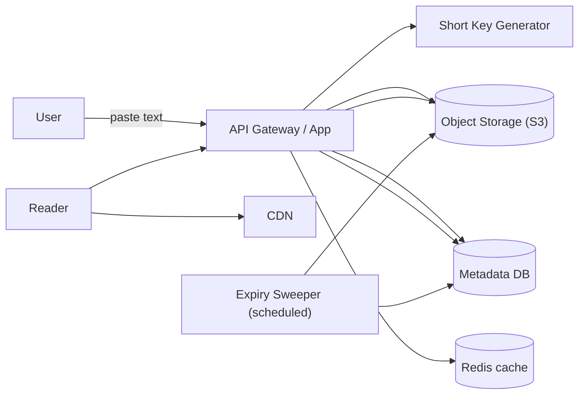
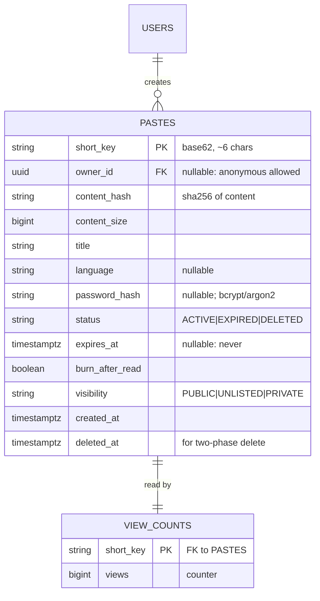
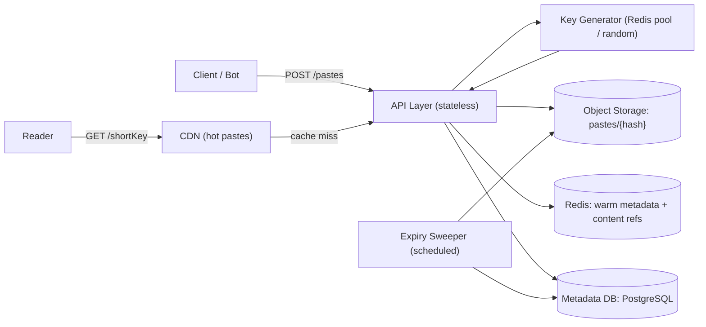
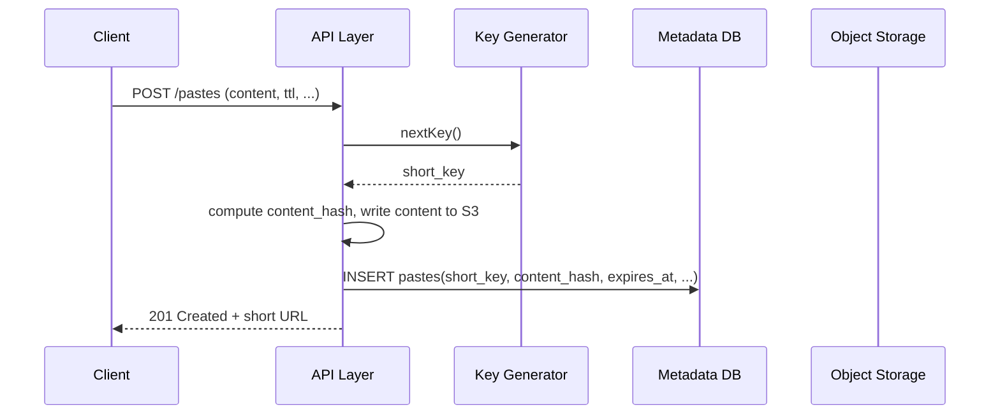
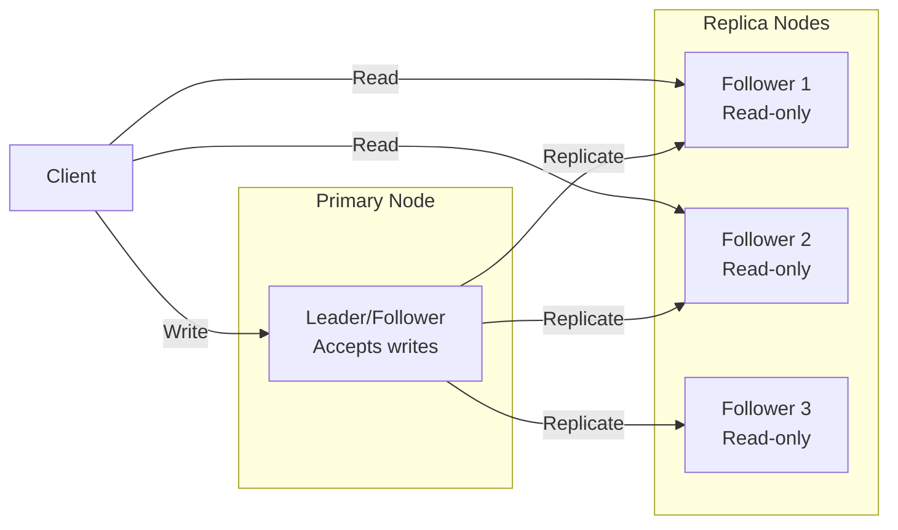
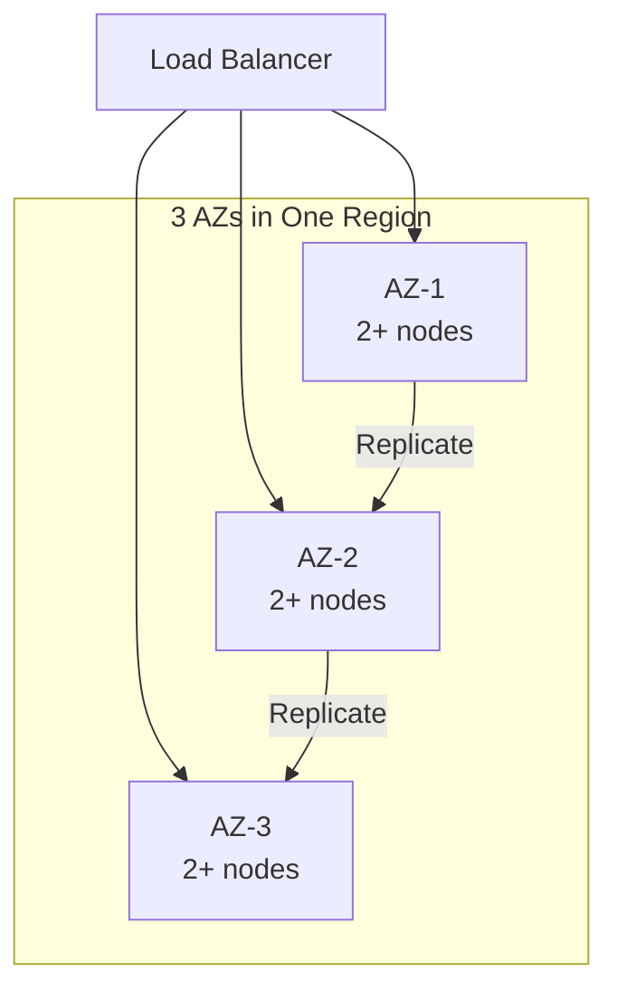
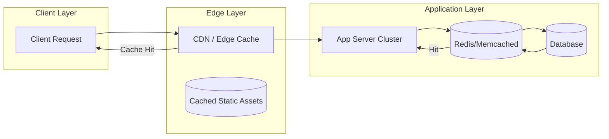
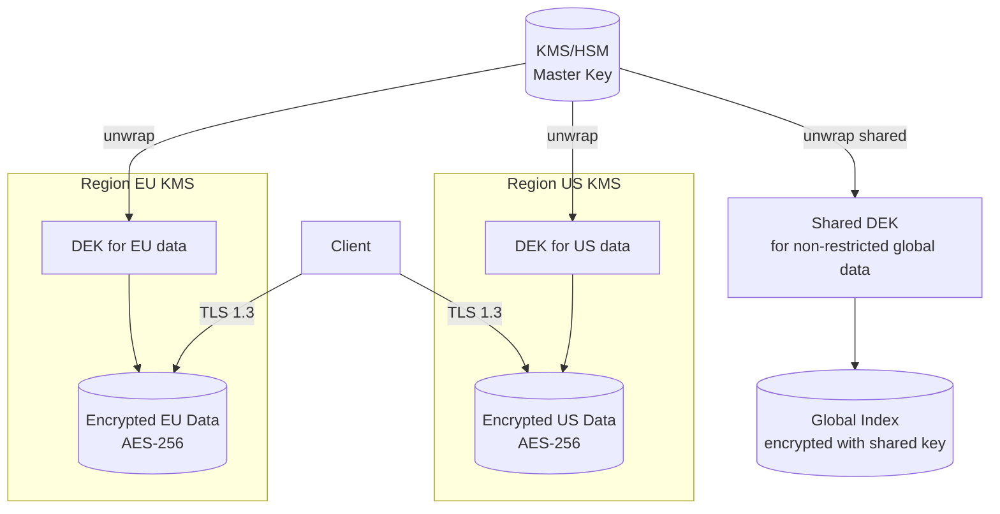
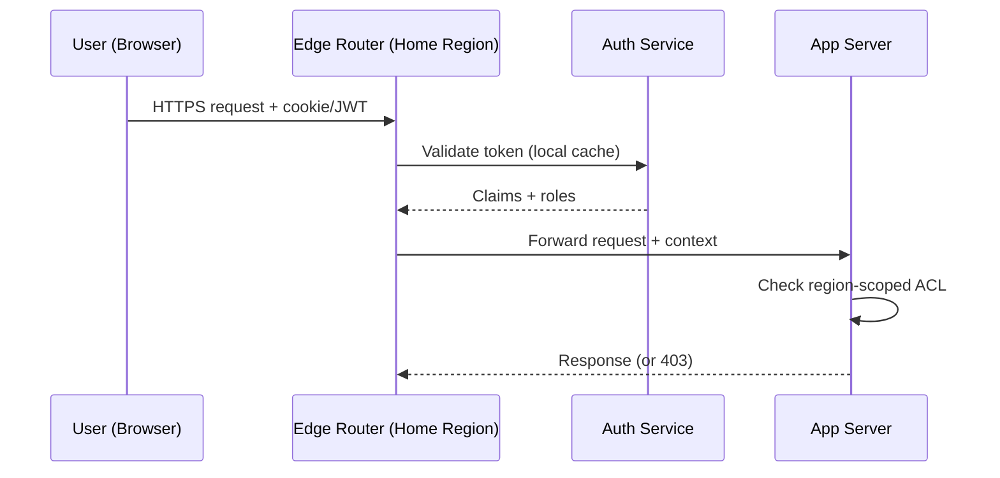
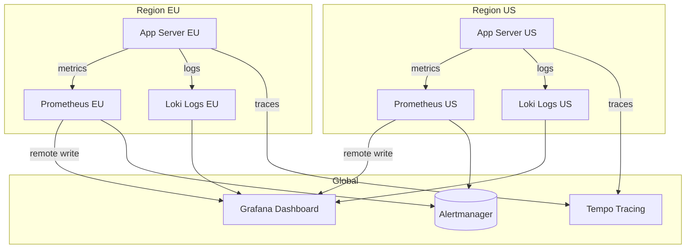

# Design Text Storage Service like Pastebin

## Blogs and websites

## Medium

## Youtube

## Theory

### Topics Covered

1. [Introduction and Problem Statement](#introduction-and-problem-statement)
2. [Functional Requirements](#functional-requirements)
3. [Non-Functional Requirements](#non-functional-requirements)
4. [Capacity Estimation](#capacity-estimation)
5. [Characteristics](#characteristics)
6. [Components](#components)
7. [Architectural Patterns](#architectural-patterns)
8. [Benefits](#benefits)
9. [Pros](#pros)
10. [Cons](#cons)
11. [Challenges](#challenges)
12. [Best Practices](#best-practices)
13. [When to Use / When Not to Use](#when-to-use-when-not-to-use)
14. [Use Cases](#use-cases)
15. [Data Model and APIAPI Design and Contract](#data-model-and-apiapi-design-and-contract)
16. [High-Level Design](#high-level-design)
17. [Deep Dive](#deep-dive)
18. [Replication Strategies](#replication-strategies)
19. [Failure Detection and Membership](#failure-detection-and-membership)
20. [High Availability and Scalability](#high-availability-and-scalability)
21. [Performance and Optimization](#performance-and-optimization)
22. [Encryption and Key Management](#encryption-and-key-management)
23. [Authentication and Authorization](#authentication-and-authorization)
24. [Security Threats and Mitigations](#security-threats-and-mitigations)
25. [Observability and Logging](#observability-and-logging)
26. [Real-World Implementations](#real-world-implementations)
27. [Java and Spring Boot Implementation Guide](#java-and-spring-boot-implementation-guide)
28. [Interview Questions and Answers](#interview-questions-and-answers)

---
---
---

### Introduction and Problem Statement

Design a text storage and sharing service — a Pastebin — where users can store text snippets, receive a unique short URL, and share it. Pastes optionally support expiration (1 hour / 1 day / 1 week / never), password protection, syntax highlighting for code, user accounts, and programmatic API access.

**What problem does it solve?** Ephemeral, frictionless sharing of text — logs, crash dumps, config snippets, code blocks — that are too big or too messy for chat/email and too ephemeral for a wiki. The product value is speed and disposability: paste → link → send, in seconds.

**Why is it an interesting system design problem?** It is the canonical "short key, big object" system and exercises four patterns every backend engineer meets:

1. **Short, collision-free key generation** under load (and the predictability/sequencing trade-off).
2. **Hot-key write contention** if you derive keys from a single counter.
3. **Read-heavy, skewed workloads** — a handful of viral pastes carry most traffic.
4. **TTL / expiration lifecycle** including lazy and active deletion, and the subtleties of a "burn after read" feature.



The diagram shows the read path (CDN → cache → object storage) and the write path (key generation → metadata + object storage), plus the scheduled expiry sweep. Content lives in object storage; the DB holds only metadata and the short-key→object mapping.

**Real-life use cases**

- **Developer log/crash sharing**: "here's the stack trace, pastebin it" — the original Pastebin use case.
- **Code snippet sharing**: GitHub Gists, GitLab Snippets — with syntax highlighting and accounts.
- **Paste-as-a-service for bots**: CI bots that dump build logs to an expiring paste on failure.
- **Temporary config/secret sharing**: ephemeral, often password-protected pastes used in incident response or handoffs.
- **Whistleblower / secure-drop-style drop boxes**: one-time-read ("burn after read") self-destructing pastes.

---

### Functional Requirements

1. **Create a paste** with text content and receive a unique short URL (path component only, e.g. `https://pb.example.com/4c92`).
2. **Read a paste** by short URL, optionally after entering a password.
3. **Expiration**: per-paste TTL chosen at creation (1 hour, 1 day, 1 week, 1 month, never) and enforced on read; a background sweeper physically deletes expired pastes.
4. **Password protection**: an optional reader-supplied password; verified server-side, never stored in plaintext (stored as a salted hash).
5. **Syntax highlighting**: a language identifier (e.g. `python`, `sql`) used by the frontend (and the API) to format code; unknown identifiers render as plain text.
6. **Burn-after-read (one-time view)**: a flag making the paste delete itself after the first successful read.
7. **User accounts (optional)**: authenticated users get a dashboard of "my pastes" and the ability to delete/edit their own pastes; anonymous creation is allowed.
8. **API access**: a REST API for create/read/delete, token-authenticated, rate-limited, suitable for bots/CI.
9. **View counting**: increment a view counter per read (excluding the creator and password-protected reads before the password is supplied).

Out of scope for the basic design: paste editing history (versioning), encryption-at-rest with a user-key ("zero-knowledge pastes" — a much harder problem), and paste commenting/threaded discussion (that's a different product).

---

### Non-Functional Requirements

- **Scale**: 10M+ pastes/day created, 100M+ reads/day (read-heavy ~10:1). A small number of pastes go viral (1M+ views).
- **Latency**: create < 200 ms p99 (this is basically the key-generation + metadata-write latency); read < 100 ms p99 for cached content, higher on cache miss (acceptable for non-viral pastes).
- **Availability**: 99.9% target; reads must degrade gracefully under load (cache the hell out of it).
- **Storage**: average paste 10 KB; retention follows TTL; expect rapid growth, so storage cost (S3) dominates compute cost.
- **Durability**: an acknowledged paste must not be lost before its TTL. The metadata and the content are both durable by their substrate (PostgreSQL and S3 respectively).
- **Predictable, non-guessable URLs**: short keys must avoid trivial enumeration that lets a user scrape all pastes (important for "private by obscurity" pastes, even though obscurity is not security).

---

### Capacity Estimation

Back-of-envelope for "10M pastes/day":

**Write side**

- 10M pastes/day ÷ 86400s ≈ **116 pastes/sec average**, with bursts (a CI bot storm) up to ~5K/sec. Trivial for the API tier — the constraint is key-generation contention, not request rate.
- Content: 10 KB average × 10M/day → **~100 GB/day ≈ 1 TB every 10 days ≈ 36 TB/year** of new text. At S3's ~$0.023/GB-month, raw storage is a few hundred dollars/month — small; **egress is the real cost line**.

**Read side**

- 100M reads/day ≈ **1,160 reads/sec average**, but heavily skewed: a handful of viral pastes (think a paste posted in a popular Hacker News thread) can spike to 50K–100K reads/sec on one key. The design must survive one-key-at-100K-RPS — i.e. aggressive caching with a small blast radius on cache eviction.

**Key space and collisions**

- 6-character base-62 key: 62⁶ ≈ 56.8 billion keys. At 10M pastes/day, collision probability is negligible until ~1% of the keyspace is used (birthday: sqrt(56.8B) ≈ 238K pastes for 50% collision odds) — so a 6-char space is fine for this scale but tight; 7 chars (3.5T) is the safe default. This is the kind of back-of-envelope number interviewers want to see, not just "it's big".

**Cache sizing**

- If ~1% of pastes are hot (1M hot keys × 10 KB ≈ 10 GB), a modest Redis cluster (e.g. 3 nodes) covers the hot set. The long tail (cold pastes) is re-read from S3 via the cache-on-miss path.

**Key takeaway for interviews**: this system's pressure points are **hot-key reads** and **key-space/collision discipline**, not storage or write rate. State the skew explicitly.

---

### Characteristics

- **Short key, large object**
  What it means: the URL is a tiny identifier, the content is potentially megabytes. Why it matters: the system must keep the identifier space large/coolded and the object cheap — which means separate key generation from storage, and object storage for content. How it works: a short key maps (DB row) → a storage key (S3 path); reads join cache → metadata → content.

- **Read-heavy with extreme skew**
  What it means: 10:1 read-to-write, and a power-law distribution where a few pastes absorb most reads. Why it matters: caching is not an optimization, it's a correctness concern for latency and availability — a viral paste with no cache will DDOS your origin. How it works: CDN for the hottest content, Redis cache-aside for the warm tier, lazy population on miss.

- **Ephemeral by design**
  What it means: pastes are intentionally disposable; TTL is the primary lifecycle control. Why it matters: the system must *reliably* forget — both lazily (expired on read) and actively (sweeper deletes bytes and metadata). The data lifecycle is as important as the data itself.

- **Predictable but non-guessable**
  What it means: URLs are short and sequential-ish (shareable, human-friendly) but not trivially enumerable. Why it matters: "private by obscurity" is the privacy model for anonymous pastes — the URL is the secret. How it works: either a random key (56B space, 6 chars) or a key-generating service that hands out non-sequential codes.

- **Burn-after-read semantics**
  What it means: a flag making the paste self-delete on first read. Why it matters: the read path can no longer be purely read-optimized; it must perform a write (delete) on read under concurrency. How it works: read the content, then delete in the same transaction (or mark consumed + a sweeper reclaims), with the delete idempotent so a double-read window doesn't error.

- **Content-addressable potential**
  What it means: identical content can be deduplicated by storing under a content hash. Why it matters: pastes of the same crash log from the same build are extremely common — dedup cuts storage and serves warm copies from cache. How it works: `PUT` keyed by `sha256(content)`; the row stores the hash as the storage key, and a separate short-key table maps the public short URL to the content hash.

---

### Components

- **API / Edge (stateless service)**
  Purpose: terminate HTTP, route create/read/delete. Responsibilities: input validation, auth (optional), issuing short keys, enforcing password checks and burn-after-read deletes, rate limiting. How it works: horizontally scaled behind a load balancer; no local paste state. Relationship: the sole writer of metadata, the reader of content via the cache. Real-world example: a Spring Boot service behind CloudFront + an ALB.

- **Short Key Generator**
  Purpose: produce unique, short, non-sequential public identifiers. Responsibilities: generate a key, assert uniqueness, return it. How it works: either a random generator with a collision retry, or a pre-generated key pool (a background service fills a Redis `SET` of ready keys, and create-pop takes one with `SPOP`/`LPOP`) — the pool model is what removes write-path contention for a single sequential counter. Relationship: called by the API during paste creation. Real-world example: Bitly's hashid/key pool architecture.

- **Metadata Store (relational DB)**
  Purpose: the mapping `short_key → {owner, storage_key, password_hash, expires_at, burn_after_read, language, created_at, view_count, status}`. Responsibilities: enforce short-key uniqueness, store TTLs and access-control flags, track view counts. Real-world example: PostgreSQL with a `short_key` unique index. The DB is the source of truth for the mapping; content bytes live elsewhere.

- **Content Store (object storage)**
  Purpose: durable, cheap storage of the paste text. Responsibilities: 11-nines durability, cheap capacity, lifecycle rules. How it works: a content key like `pastes/{hash}` or `pastes/{short_key}`; the API fetches it on read. Relationship: addressed by the metadata row's `content_key`. Real-world example: S3, GCS, or MinIO.

- **Cache (Redis or CDN)**
  Purpose: keep hot pastes off the origin. Responsibilities: serve reads for viral pastes at 100K+ RPS. How it works: cache-aside on read; lazy populate on miss; the hottest pastes additionally hit the CDN. Relationship: sits between API and metadata/content stores. Real-world example: Redis for warm keys, CloudFront for the top tier of viral pastes.

- **Expiry Sweeper (scheduled)**
  Purpose: proactively delete expired pastes. Responsibilities: scan `WHERE expires_at < now() AND status = 'ACTIVE'` in batches, delete content from object storage and rows from the DB. How it works: cursor/batched scans with `LIMIT` and an index on `(expires_at, status)`; idempotent deletes; runs every few minutes to hours depending on cost tolerance. Relationship: the only deleter of real data; everything else (lazy deletion on read) is a safety net. Real-world example: cron jobs in every paste service.

- **Syntax Highlighter**
  Purpose: render code with language-aware styling. Responsibilities: map a `language` string to a highlight.js/prism CSS bundle, or render server-side for the API. How it works: a curated dictionary of supported languages; unknown or `null` renders as plain text. Relationship: metadata-only concern (the `language` field). At Pastebin scale this is a frontend concern; the API just validates the identifier against an allowlist.

---

### Architectural Patterns

- **Cache-Aside (Lazy Loading)**
  What it is: read from cache; on miss, load from the backing store and populate the cache. Problem it solves: a read-heavy workload hammering the metadata DB on every hit. How it works: `GET cache:{short_key}` → miss → `SELECT content_key FROM pastes WHERE short_key = ?` → fetch content from S3 → `SET` cache with short TTL. When to use: read-heavy, tolerate-brief-staleness workloads. When not: hot keys whose access pattern invalidates faster than the TTL stabilizes. Advantages: simple, falls back to DB on cache failure. Disadvantages: first-hit latency, thundering herd on eviction (mitigate with single-flight), stale for up to TTL. Real-world example: essentially every high-traffic key/value store.

- **Pre-Generated Key Pool**
  What it is: a background job fills a pool of ready short keys; creation takes one, no generation work at write time. Problem it solves: the sequential single-counter bottleneck (if your short key is `base62(autoincrement)`, one row is hot under writes). How it works: `LPOP` from a Redis list (or `SPOP` from a set); the pool refills asynchronously. When to use: very high create-throughput, want short non-sequential keys. When not: small scale where a single counter is fine. Advantages: no write contention, keys can be randomized. Disadvantages: operational surface (pool monitoring, refill cadence, key-space exhaustion), slight risk of unused keys (accept it). Real-world example: Bitly's hashid/key pool architecture.

- **Content Addressing for Deduplication**
  What it is: store content under `sha256(content)`, collapse identical content to one object. Problem it solves: repeated uploads of the same log/crash are common and expensive in naive storage. How it works: compute the hash, `PUT` under that key (idempotent), store only the short-key → content-hash mapping. When to use: high duplicate content rate. When not: every paste unique (rare for a log-sharing service). Advantages: storage and cache-hit savings. Disadvantages: you lose per-user ownership of the object unless you track it separately; dedup is a storage concern, not a key concern — keep the public short key random anyway. Real-world example: Dropbox's content addressing (different domain, same idea).

- **Lazy + Active Expiration (Two-Phase TTL)**
  What it is: expire on read (lazy) AND a background sweeper (active). Problem it solves: a single mechanism is insufficient — lazy-only leaks deleted objects (storage cost, and "pastes that should be gone still exist"); active-only is a slow scan that can't catch a delete-and-read race. How it works: read checks `expires_at < now()` → 404 and (optionally) deletes; sweeper scans `WHERE expires_at < now()` in batches and deletes. When to use: any TTL-based system. Advantages: correctness + cost control. Disadvantages: two code paths to keep consistent. Real-world example: Redis TTL + RDB/AOF, CDN cache TTL, every paste service.

- **Idempotent Delete / Read-Triggered Delete**
  What it is: a burn-after-read paste deletes itself on first read; the delete is idempotent so a double-read window returns 404, not an error. Problem it solves: the "one-time view" feature under concurrent reads and retries. How it works: in the read transaction, fetch content → `DELETE FROM pastes WHERE short_key = ? AND burn_after_read AND status='ACTIVE'`; subsequent reads find nothing → 404. The transaction makes the read-then-delete atomic for a single key. When to use: self-destructing messages. Advantages: strong one-time semantics. Disadvantages: a retry that re-fetched after a network blip but before the response returned may get 404 (the content already "disappeared") — acceptable for a burn-after-read but worth warning users.

---

### Benefits

- **Frictionless anonymous sharing**
  No account, no formatting, no app install — paste → link → send. In production this low-friction path is exactly why paste services are reflexively used for log/crash sharing in chat. The architecture supports it by making the short key the only identity needed.

- **Read path scales independently of write cost**
  Writes are cheap (a metadata insert + one S3 PUT); reads are served from CDN/Redis with near-zero origin cost. This asymmetry is why a viral paste (1M views) costs pennies in compute despite 1M requests — it is cache hits, not origin work.

- **Disposability is a feature, not a bug**
  TTL-based expiration means you rarely need user-deletion or legal takedown workflows for the bulk of content — it deletes itself. The system is designed to forget, which dramatically lowers the long-term storage and moderation burden versus a general-purpose storage product.

- **Content dedup cuts real costs**
  Crash logs from the same build, pasted dozens of times, collapse to one object. For a CI bot ecosystem this is a large fraction of writes — dedup is a direct storage + egress win.

- **Self-destructing pastes enable sensitive sharing**
  Burn-after-read gives a crude "disappearing message" capability without encryption-at-rest — useful for incident response, temporary credential sharing, and whistleblower drop boxes.

---

### Pros

- **Short, clean URL is the entire UX.** The `short_key → content` mapping is a single DB lookup (or a cache hit), so the API stays trivial — most of the complexity is scale handling, not routing.
- **Reads are CDN-cacheable in the simplest possible shape.** No server-side session, no personalization (pastes are either public or password-gated with a per-paste cache key) — CDN edge caching works out of the box.
- **Object storage for content = cheap durability.** The metadata DB never touches multi-MB payloads; the bytes live where they belong (S3-class), and the DB row stays tiny.
- **Two-phase TTL (lazy + active) is robust.** Lazy deletion handles the correctness (expired reads return 404) and catches never-seen-again pastes at zero sweep cost; the active sweeper bounds storage growth for the popular ones.
- **The short key never needs to be sequential or queryable.** That freedom lets you pick the generation strategy (random vs. pool) purely on throughput/guessability grounds, without schema constraints.

### Cons

- **Obscurity is the only access control for anonymous pastes.** A guessed or brute-forced short key exposes the content — this is acceptable for a public pastebin but is a real security property to state explicitly. Password protection exists for sensitive pastes, but the default is public-once-URL-shared.
- **Hot-key write contention exists if you derive keys sequentially.** A single auto-increment counter sharded by nothing creates one hot row under high create rates; the pre-generated key pool (or random keys) is the escape hatch, not an optional optimization.
- **Cache invalidation timing is user-visible.** With a short TTL and a hot key, the period between an edit/delete and cache expiry shows stale data to readers — for a read-only paste this is fine; for editable pastes it needs versioned URL keys or cache busting.
- **Egress costs scale with virality.** A single paste linked from a front-page article can generate millions of reads; object storage egress is pay-per-byte with no magic discount. The CDN helps but cache misses still cost money — viral pastes are the cost-control risk.
- **Burn-after-read has a double-read ambiguity.** If the reader's client retries after the read but before the response (e.g. due to a dropped connection), the retry may 404 even though the user "got" the content — the paste is consumed, but the UX is "it just vanished". Document this as a property, not a bug.

---

### Challenges

- **Technical: key-space sizing and collision handling.** Too short a key (5 chars) risks collisions at scale; too long is ugly. The design must pick a size with comfortable headroom, detect a collision on creation, and retry — and the retry must be idempotent under client re-submission (an `Idempotency-Key` on create). Bonus complexity: avoiding *predictability* that enables enumeration scraping.
- **Scalability: hot-key reads under viral load.** One paste linked from a popular page can spike to 100K+ RPS. Mitigations stack: CDN edge caching at the top, then Redis cache-aside with single-flight (so 50K concurrent misses for the same key trigger one origin fetch, not 50K), then versioned keys so the cache is always correct. The failure mode without this is origin meltdown.
- **Performance: first-hit latency on cache miss.** A viral paste that was evicted must be re-fetched from S3 into the DB+cache before the first reader gets it. For a popular paste this causes a thundering herd — the single-flight coalescer and a small warm reserve (pre-warming recent pastes after a cache flush) are the operational answer.
- **Reliability: the expiry sweeper must not fall behind.** If the sweeper can't keep up with expiration, storage grows unbounded and expired pastes still cost money. The scan must be a cheap indexed cursor `(expires_at, status)` with a bounded `LIMIT`, and the sweep must be idempotent (a paste being swept twice is harmless) so crashes mid-batch are safe.
- **Maintainability: dedup vs. ownership.** Content addressing deduplicates objects, but you still need per-user or per-short-key ownership (for delete/edit). The trap is storing only `hash → content` and forgetting `short_key → hash` as a separate table with its own lifecycle — then you can't delete one user's paste without affecting everyone sharing the content.
- **Operational: password-protected pastes break CDN caching.** A CDN can't cache a paste whose content depends on a reader-supplied secret, so password pastes always hit the origin. Mitigate by caching only unprotected pastes long-term and short-TTL'ing the protected ones — accept lower efficiency for sensitive content.
- **Security: abuse and illegal content.** Pastebins are magnets for spam, malware dumps, and illegal content. The system must support: per-IP/user rate limits on create, abuse reporting → `REPORTED` state, content scanning hooks, and lawful takedown → immediate unpublish + audit log. The design assumes moderation exists from day one.

---

### Best Practices

- **Make the short key cool and non-sequential by default.** Use random base-62 keys (62⁶ = 56B, comfortable headroom for billions) unless you have a measured write-contestion problem that demands the pre-generated pool. Why: sequential keys leak paste volume (a competitive intelligence leak) and create a single hot write row.
- **Separate bytes from metadata, always.** Store content in object storage, metadata in the DB. Why: databases are the expensive part of your stack; never store a blob larger than a thumbnail row in them. A common candidate failure is "I'll store blobs in S3 *except* for small pastes" — the size threshold becomes a migration one day.
- **Lazy delete on read plus a batched active sweeper.** Why: lazy covers correctness (expired reads are 404s) at zero sweep cost for unpopular pastes; the active sweep reins in storage growth and stale-cache exposure for everything else. Two mechanisms, each optimal at what it covers.
- **Cache with single-flight on the hot key.** Why: a viral paste evicted from cache triggers a herd of identical origin fetches. A per-key mutex/coalescer turns N concurrent misses into 1 fetch + N waiters — the single most important read-path safeguard for this workload.
- **Version content keys after edits.** Why: immutable content URLs (e.g. `pastes/{hash}` or `pastes/{key}?v=3`) let you cache forever. For editable pastes, a new content key on edit invalidates the CDN cleanly instead of via purge APIs (which are slow and rate-limited).
- **Delete is two-phase (soft + async purge).** Mark the row deleted (vanishes from listings immediately), purge bytes via a job after a grace period. Why: enables undo, protects against purge-job bugs deleting live content, and decouples the user-facing response from the expensive storage delete.
- **Enforce rate limits on create, generously on read.** Create limits stop paste-spam bots; read limits protect the cache-aside path. Why: this service's abuse model is write-oriented (spam/bot dumps), and the read path is already cheap — tight read limits would hurt virality.
- **Treat obscurity as a property, not security.** A private-by-obscurity paste is private *only* against accidental discovery. If true secrecy is required, the product is "encrypted pastes" — a different system. State this boundary clearly in the API contract and the security doc.

---

### When to Use / When Not to Use

**This design is appropriate when:**

- You need ephemeral, link-based sharing of text — logs, snippets, configs, crash dumps.
- Writes are modest, reads are bursty and skewed (viral pastes possible).
- Anonymous creation is a feature (low friction), and "URL is the secret" is an acceptable privacy model.
- You can store content in object storage and only metadata in a relational DB.

**This design is not appropriate when:**

- **True confidentiality is required** — use a client-side encrypted store ("zero-knowledge pastes"); obscurity is not encryption.
- **Long-term, curated documents** — pastes are disposable; for persistent docs, wikis/document stores are the right product.
- **Collaborative editing** — no versioning/concurrency here; that is a different design.
- **Non-text content at scale** — extend to images/video only once you need it; text-only keeps the content-addressing and CDN story simple.
- **Legal/compliance archives** — the TTL/expiry model fights retention requirements; regulated retention wants append-only, never-deleted storage.

**Alternatives to consider:** GitHub/GitLab Gists (for developers), shared Google Doc (for collaboration), S3 presigned URLs + an index (for a one-off large dump), a managed logging sink with a TTL bucket (for operational logs).

**Decision factors:** required privacy model, expected read:write ratio and skew, whether content is text-only, moderation obligations, and whether disposability is a feature.

---

### Use Cases

#### Use Case 1: CI/CD bot that dumps build failure logs on failure

- **Problem**: a build fails, the team needs the full log immediately, but CI logs are behind auth and unwieldy to link.
- **Proposed solution**: the CI bot creates a paste of the failure log (anonymously or with a service token), copies the short URL into the PR comment + Slack notification.
- **Why suitable**: create is cheap and fast; the paste is read by humans once; short TTL (1 day) auto-cleans.
- **How it works**: bot POSTs log → service stores in S3 under content hash (dedup across rebuilds of the same failure) → returns short URL → TTL 1 day.
- **Trade-offs**: anonymous creates from bots must be rate-limited per-repo/service-token to stop spam; content should be auto-redacted for secrets (a pipeline stage) before paste creation.

#### Use Case 2: Developer sharing a crash stack trace in chat

- **Problem**: "my service is throwing, here's the 5,000-line stack + env dump" — too big for chat, gets mangled by truncation/formatting.
- **Proposed solution**: paste → short URL → drop in chat. One-time read optional.
- **Why suitable**: read-heavy after share; hot-key caching handles everyone opening the same link; burn-after-read for the paranoid.
- **How it works**: paste created with 1-hour TTL (auto-expiry, no cleanup needed by dev); readers hit CDN.
- **Trade-offs**: if the same crash recurs, dedup serves the prior paste (good) but the dev may want a fresh one (allow force-new-paste flag).

#### Use Case 3: Incident-response temporary credential / note sharing

- **Problem**: during an incident, a team needs to share a temporary, sensitive note or one-time credential; it must not persist.
- **Proposed solution**: a burn-after-read, password-protected paste with a short TTL.
- **Why suitable**: one-time read gives self-destruction; password adds a second factor; TTL bounds the lifetime even if the URL leaks.
- **How it works**: creator sets burn-after-read + password + 1-hour TTL; the read path deletes on first successful (post-password) read.
- **Trade-offs**: this is still obscurity-based, not cryptographic secrecy — document the threat model (threat: the URL leaks; mitigation: password + short TTL + auto-delete). For truly secret data, use a secrets manager with a TTL lease instead.

#### Design Decision Matrix (preserved from original design)

| Decision | Choice | Reason |
|----------|--------|--------|
| URL generation | Pre-generated key pool (or random 6-char base62) | Fast, no collision, no single-counter write contention |
| Content storage | S3 (separate from metadata) | Cost-effective for blobs; content-addressable for dedup |
| Caching | CDN + Redis cache-aside | Popular pastes served from edge; warm tier on Redis |
| Expiration | Lazy on read + active hourly sweep | Minimal read latency, bounded storage growth |
| Deduplication | SHA-256 of content → storage key | Identical content → same object; transparent savings |

---

### Data Model and APIAPI Design and Contract

Base path `/api/v1`, anonymous creation allowed; authenticated endpoints use `Authorization: Bearer <token>`. One error envelope everywhere: `{ "code": "STRING_CODE", "message": "human readable", "details": [] }`.

**Create a paste**

```
POST /api/v1/pastes
Idempotency-Key: a3f1...                (client UUID per user intent — prevents duplicate paste on retry)
Content-Type: application/json

{
  "content": "Traceback (most recent call last):\n  ...",
  "title": "build-42 crash",            // optional
  "language": "python",                 // for syntax highlighting
  "expiresIn": "1d",                    // 1h | 1d | 1w | 1mo | never  (default 1d)
  "password": "s3cret",                 // optional — hashed+salted, never stored
  "burnAfterRead": false,               // optional — self-destruct on first read
  "public": true                        // false = unlisted (still URL-accessible, not indexed)
}
```

`201 Created`:

```json
{
  "shortKey": "4c92aZ",
  "url": "https://pb.example.com/4c92aZ",
  "contentHash": "9f2e...a1",
  "expiresAt": "2026-08-21T15:00:00Z",
  "status": "READY"
}
```

Validation: `content` ≤ 10 MB (25 MB for authenticated/paid tiers), 200-char title, language from an allowlist. Errors: `400 VALIDATION_FAILED` (with per-field details), `409 CONFLICT` if `Idempotency-Key` repeats with different content (return the prior paste), `429 RATE_LIMITED`.

**Read a paste**

```
GET /api/v1/pastes/{shortKey}
X-Paste-Password: s3cret            // only if password-protected; via header, not query (query leaks into logs/Referer)
```

`200 OK`:

```json
{
  "shortKey": "4c92aZ",
  "title": "build-42 crash",
  "language": "python",
  "createdAt": "2026-08-20T15:00:00Z",
  "expiresAt": "2026-08-21T15:00:00Z",
  "content": "...",
  "protected": true
}
```

On read of a burn-after-read paste: `200` with content now, but any later read (same key) returns `410 GONE` ("this paste has self-destructed"). On expiry: `404 NOT_FOUND`. On wrong password: `401 UNAUTHORIZED` (use 401, not 403, to avoid confirming the paste exists to non-holders).

**Delete a paste**

```
DELETE /api/v1/pastes/{shortKey}
Authorization: Bearer <owner token or admin>
Idempotency-Key: d4e5...
```

`204 No Content` on success; `204` again on repeat (idempotent); `404` if not found; `403` if not the owner.

**List my pastes (authenticated)**

```
GET /api/v1/me/pastes?cursor=...&limit=50&status=active
```

Cursor (keyset) pagination on `(created_at, short_key) DESC`. `status` filter: `active | expired | deleted`. Response: `{ "items": [...], "nextCursor": "..." }`.

**Contract-wide decisions**

- **Idempotency** on create and delete — a retry returns the same result. Create idempotency is especially important for bots that retry on timeouts.
- **Password via header, never query string** — avoids leaking the password in access logs and the `Referer` header.
- **Status codes carry meaning**: `410 GONE` for a consumed burn-after-read paste (distinct from `404`), `401` vs `403` on password checks (do not confirm existence to non-holders).
- **Keys are short lowercase base-62** (`[a-z0-9]`) — URL-safe, no characters to escape.
- **Rate limiting**: per-IP on anonymous create (`X-RateLimit-*` headers on responses, `Retry-After` on `429`); higher limits for authenticated; reads essentially unlimited but CDN-cached.
- **Versioning**: path-based `/v1`; the short URL path (`/shortKey`) is versionless and stable (it is a user-facing permalink), but the `/api/v1/pastes/...` endpoints may evolve.

---

#### Data Modeling

```
pastes:     short_key (PK), owner_id (FK, nullable), content_hash, content_size,
            title, language, password_hash (nullable), status, expires_at,
            burn_after_read, visibility, created_at, deleted_at
view_counts: short_key (FK PK), views                       (separate, hot table)
```



**Design decisions**

- **`short_key` is the PK and the sole lookup key.** Everything resolves through it in O(log n). The row is tiny (a few columns) so it caches well in RAM. Never use a surrogate `id` for lookups — the short key IS the identity.
- **`content_hash` is NOT a uniqueness constraint** (different owners can paste identical text that is then deduplicated at the storage layer). It is an index for "find duplicate content" and the basis of the storage key for content addressing.
- **`view_counts` is a separate table** so view increments (extremely hot on viral pastes) don't contend with the paste row and don't risk the row being evicted from cache as "hot and write-contended". Updated via atomic `UPDATE view_counts SET views = views + 1` with batching or a Redis counter that flushes periodically.
- **`status` is a real state** (`ACTIVE | EXPIRED | DELETED`), not a boolean. Listings and read checks filter on it via partial indexes; the sweeper transitions `ACTIVE → EXPIRED/DELETED` and then purges. Soft delete (`deleted_at`) supports the two-phase delete.
- **Password stored as a salted, slow hash** (bcrypt/argon2) — never plaintext, never reversible. Compared in constant time on read.
- **Indexes**: `short_key` PK (lookups), `owner_id` (my-pastes listing), `expires_at` (the sweeper cursor — must cover status), `(owner_id, created_at DESC, short_key)` for keyset listing pagination.
- **Partitioning**: at 10M+ pastes/year, `view_counts` and the sweeper scans on `pastes` benefit from a monthly `created_at` range partition. Reads by `short_key` (random-ish base62) don't partition cleanly, so the primary table stays whole — partitioning is driven by the append-heavy, time-ordered access patterns (view increments, expiry scans), not the PK lookups.

---

### High-Level Design

The original architecture sketch (preserved):

```
┌──────────┐     ┌──────────┐     ┌────────────────────────────┐
│  Client  │────▶│  API GW  │────▶│    Application Layer        │
│          │     └──────────┘     │                             │
└──────────┘                      │  ┌───────────────────────┐  │
                                   │  │ Paste Service          │  │
                                   │  │  - Create paste        │  │
                                   │  │  - Read paste          │  │
                                   │  │  - Generate short URL  │  │
                                   │  └──────────┬────────────┘  │
                                   └─────────────┼───────────────┘
                                                 │
                                   ┌─────────────┼─────────────┐
                                   ▼                           ▼
                            ┌────────────┐             ┌────────────┐
                            │  Metadata  │             │  Content   │
                            │  DB        │             │  Store     │
                            │ (MySQL)    │             │ (S3/Blob)  │
                            └────────────┘             └────────────┘
```

The canonical component diagram (with the scaling/CDN layer made explicit):



**Component responsibilities and communication**

- **API Layer**: create/read/delete + auth, rate limiting, password checks, burn-after-read deletes, view-count increments. Stateless, scaled horizontally. Reads hit CDN → Redis → DB → S3 on miss.
- **Key Generator**: supplies a short key on create. The pool model (Redis `LPOP` of pre-generated keys) decouples key generation from the write transaction and removes counter contention entirely.
- **Metadata DB**: the `short_key → content_hash, owner, TTL, status` mapping — tiny rows, PK lookups. Write primary for creates/deletes; reads prefer cache.
- **Object Storage**: the paste bytes, keyed by content hash for dedup. Never read through the API on the hot path — CDN serves cached content.
- **Sweeper**: the only component that deletes real data — batched, idempotent expiry scans.

**Read path**

```
Client → CDN (cached hot pastes)
   ↓ cache miss
API → Redis (warm metadata + content ref)
   ↓ cache miss
Metadata DB (get content_hash for short_key)
   ↓
Object Storage S3 (fetch bytes)
   ↓
Populate Redis + CDN, return to client
```

**Request flow — create a paste**



The content is written to S3 *during* the create call so the response is consistent, but the content is immutable — all later reads are CDN-cacheable with a stable key. The short-key allocation and the DB row insert are the only coordination points, keeping create latency low.

**Scaling strategy**

- **Reads**: CDN at the edge absorbs viral pastes (100K+ RPS); Redis cache-aside with single-flight coalescence handles warm keys; object storage is the durable fallback.
- **Writes**: short-key pool removes the write-contention bottleneck; creates are independent and parallelize; S3 multipart for large pastes (>~50 MB).
- **Sweeper**: batched cursor over an indexed `expires_at` scan, `FOR UPDATE SKIP LOCKED` if multiple instances, idempotent deletes — scales with the expiry window, not with active read traffic.

**Failure handling**

- Cache miss but S3 unreachable: read fails with `502`/`503`; the short key still resolves in metadata — the content key is correct, the failure is transient. Document this as "your data is safe, try again."
- Sweeper down: expired pastes still 404 on read (lazy deletion) — correctness preserved; only the physical byte reclamation lags (storage cost grows). Acceptable degradation.
- S3 down at create: the create call fails — content was computed but is unreferenced. A reaper job deletes `pastes` rows whose content never landed in S3 (created within the last N minutes with no confirmed `READY`).
- DB down: creates and deletions pause; reads still serve hot pastes from CDN. For a read-heavy, read-optimized service, read availability is the priority — design to degrade writes before reads.

---

### Deep Dive

#### Short Key Generation: The Three Approaches

The design note in the original sketch enumerated three options; here is the full engineering analysis:

1. **Auto-increment + Base62 (`Option 1`)**. Pro: simple, sequential, dense keyspace. Con: **predictable and scrapeable** — a competitor can estimate your daily paste volume by the last key, and brute-force `000000`…`zzzzzz` to enumerate *all* pastes. Also, single-point write contention on the sequence under high create rates (though modern databases handle this better than people fear). Bottom line: fine for a private/internal tool, never for a public paste service.

2. **Random 6-8 char string (`Option 2`)**. Pro: not predictable (no volume leak, no enumeration). Con: collision probability is real and must be handled — `62⁶ ≈ 56.8B`, so at 10M pastes/day you reach 1% collision risk only around 75M pastes (birthday formula), which is years away — but the collision must still be detected and retried, and the retry must be idempotent (an `Idempotency-Key` on create makes "I already created a paste for this intent" safe). **This is the default choice** for a public service.

3. **Pre-generated key pool (`Option 3`)**. Pro: no generation work at write time (just take one), no collision risk, keys can still be randomized. Con: operational surface — the pool must monitor fill level and refill, key exhaustion must be alerted, and unused keys are a (small) cost. The right choice when **write throughput on key allocation is the bottleneck** (e.g. a bot storm creating 5K pastes/sec, where even a random-with-retry has a measurable tail).

**The subtlety worth knowing for interviews**: "non-sequential" is the security property, not just "random". A `base62(autoincrement)` encoded differently is still sequential. True unpredictability requires entropy from a CSPRNG or a pool that was itself filled from a CSPRNG — and the pool model is what lets you have both unpredictability and zero write-contention simultaneously.

#### Content Storage: Object Storage vs Database

| Factor | Object Storage (S3) | Relational DB |
|---|---|---|
| Cost per GB | ~$0.023/month | ~$0.10–0.50/month on transactional storage |
| Durability | 11 nines | 3–5 nines (unless geo-replicated) |
| Reads at scale | CDN-direct, unlimited | DB connection/memory bound |
| Versioning | native | must model |
| Queryability | none (only by key) | rich |
| Best for | large, immutable blobs | small, relational, queryable data |

The decision is not a trade-off but a category error to store pastes in the DB. Pastes are large, immutable, and fetched by key — that is the exact workload object storage was built for, and it is why every production paste service (Pastebin, GitHub Gists, Hastebin, etc.) stores content in blob storage and metadata in the DB.

#### Caching the Hot Key

A viral paste linked from Hacker News front page can hit 100K RPS. The caching stack must absorb it:

- **CDN (top tier)**: immutable content URLs with `Cache-Control: public, max-age=2592000` (or longer for never-expiring pastes). The CDN is the only thing that survives 100K RPS.
- **Redis cache-aside (warm tier)**: key = `paste:{short_key}:{version}`; on miss, fetch metadata + content ref from DB, fetch content from S3, populate. Short TTL (1–5 min) for `ACTIVE` pastes to bound staleness around edits/deletes/expiry.
- **Single-flight**: coalesce the herd. 50K concurrent misses for the same evicted key become 1 origin fetch + 50K waiters. Without this, the cache miss itself becomes a 50K-RPS hammer on the origin.

#### Deduplication and Content Addressing

`content_hash = sha256(content)` becomes both the storage key (`pastes/{hash}`) and the dedup key. Two pastes with identical content share one object. Implications:

- Storage savings are real (CI bots paste the same crash log constantly).
- **But ownership is per short-key, not per object**: a separate `shorts` table maps each `short_key → content_hash`, so deleting one user's paste revokes that mapping without touching the shared object — it is GC'd by a sweep only when zero short keys reference it.
- **Burn-after-read vs dedup conflict**: if paste A (no burn) and paste B (burn) share a content hash and B is read-then-deleted, the bytes are still referenced by A — so deletion must decrement a reference count, not blindly delete the object. This is the kind of subtle correctness interaction interviewers probe for.

#### Expiration and View Counting

- **Lazy deletion on read**: every read checks `expires_at < now()` (or a `status` index) and returns `404` if expired, deleting the row. This makes expiry correctness immediate for the reader and costs nothing for pastes nobody ever reads again.
- **Active sweeper**: indexed scan on `(expires_at, status) WHERE status='ACTIVE'`, batched with `LIMIT`, idempotent deletes. The two mechanisms together mean storage growth is bounded and correctness is not dependent on a background job.
- **View counting**: the `view_counts` table is separate from `pastes` so the hot counter doesn't contend with reads/writes of the paste row and doesn't blow the paste row out of cache. Updates use atomic `UPDATE view_counts SET views = views + 1` — or a Redis counter flushed periodically to absorb sub-millisecond read traffic, with a reconciliation job to catch counter drift against the authoritative DB.

---

### Replication Strategies

**What it means**

Replication Strategies determine how data and state are copied across multiple nodes in Text Storage Service like Pastebin. The choice of strategy determines the trade-off between consistency, availability, and latency.

**Why it matters**

Text Storage Service like Pastebin must replicate data to prevent loss and serve reads from multiple nodes. The replication strategy determines whether the system favors consistency (strong reads) or availability (always writable), and how it handles cross-node failure.

**How it works**

**Leader-based (single-leader)**: A single primary node accepts all writes; followers replicate changes asynchronously or semi-synchronously. Reads can be served from any replica. This strategy favors strong consistency for writes but creates a write bottleneck at the leader.



*Leader-based replication: a single primary node accepts all writes and replicates them to read-only followers. Clients can read from any replica for scaled read throughput, but all writes go through the leader.*

**Multi-leader (multi-master)**: Multiple nodes accept writes and exchange updates with each other. This enables low-latency writes in different regions but requires conflict resolution (last-write-wins, merge functions, or CRDTs).

**Leaderless (quorum-based)**: Any node can accept writes; a quorum of nodes must agree. Read and write quorums are configured so that at least one node overlaps between them (R + W > N). This maximizes availability and write scalability.

**Trade-offs for Text Storage Service like Pastebin**:

| Strategy | Use Case | Pros | Cons |
|---|---|---|---|
| Leader-based | paste content, author info, IP logs | Strong consistency, simple | Write bottleneck, leader failure risk |
| Multi-leader | paste IDs, anonymized stats | Low-latency global writes | Conflict resolution, complex |
| Leaderless | Caching, counters | High availability, no bottleneck | Eventual consistency, read repair overhead |

**Real-world implementations**

- **Redis**: Leader-follower replication with asynchronous replication; Sentinel handles failover.
- **Apache Kafka**: Leader-based partition replication with ISR (in-sync replica) — writes go to the leader, followers replicate.
- **Cassandra**: Tunable consistency with leaderless quorum (R + W > N).
- **DynamoDB Global Tables**: Multi-master active-active across regions.

### Failure Detection and Membership

**What it means**

Failure Detection and Membership is the mechanism by which Text Storage Service like Pastebin determines which nodes are alive and part of the cluster. Membership is the list of known nodes; failure detection is the process of updating that list when nodes fail or recover.

**Why it matters**

Text Storage Service like Pastebin must route requests only to healthy nodes and trigger failover when a node goes down. False positives (healthy nodes marked as dead) cause unnecessary failovers and data loss. False negatives (dead nodes not detected) cause failed requests and degraded performance.

**How it works**

**Heartbeat-based detection**: Each node sends a heartbeat (ping) to a subset of peers at regular intervals. If a node misses N consecutive heartbeats, it is marked as suspect. The gossip protocol distributes membership information: each node exchanges its view of the cluster with a random peer, and the information propagates gossip-style.

```mermaid
sequenceDiagram
    participant A as Node A
    participant B as Node B
    participant C as Node C

    loop Every 1s
        A->>B: Heartbeat (ping)
        B-->>A: Heartbeat (ack)
    end
    B->>C: Gossip: A is alive
    C->>A: Gossip: B is alive
    Note over A,B,C: View converges in O(log N) rounds
```

*Gossip-based failure detection: each node periodically pings a random subset of peers and gossips its view of the cluster. The membership list converges in O(log N) rounds.*

**Phi Accrual Failure Detector**: Instead of a fixed timeout, the detector measures the time between consecutive heartbeats and computes a phi (φ) value — the probability that the node is dead given the observed heartbeat pattern. φ is compared against a threshold (typically 1–8); higher thresholds reduce false positives but increase detection latency.

**SWIM (Scalable Weakly-consistent Infection-style Process group Membership Protocol)**: Nodes ping a random subset of cluster members. If a ping fails, the node is marked "suspect" and the failure is "infected" (gossiped) to other nodes. This is O(log N) per failure detection cycle and scales to large clusters.

**Trade-offs**:

| Approach | Strengths | Weaknesses |
|---|---|---|
| Heartbeat (timeout-based) | Simple, deterministic | False positives under load |
| Phi Accrual | Adaptive threshold | Needs historical data |
| SWIM | Scales to 1000s of nodes | Eventual consistency |

**Real-world implementations**

- **AWS Route 53 Health Checks**: Uses TCP/HTTP health checks with configurable thresholds to remove unhealthy instances from DNS rotation.
- **Kubernetes**: Uses the kubelet heartbeat (every 10s) to determine node liveness; nodes missing 3 consecutive heartbeats are marked NotReady.
- **Consul**: Uses SWIM protocol for membership and failure detection; supports both LAN and WAN gossip.
- **Akka Cluster**: Uses Phi Accrual failure detector with configurable φ thresholds.

### High Availability and Scalability

**What it means**

High Availability and Scalability determines how Text Storage Service like Pastebin continues operating when nodes or entire zones fail, and how capacity is added as demand grows. HA is about minimizing downtime; scalability is about maintaining performance as load increases.

**Why it matters**

Text Storage Service like Pastebin must stay operational even when individual nodes, availability zones, or entire regions fail. At the same time, it must scale horizontally to handle traffic spikes without degrading latency. The two are intertwined: the replication strategy, failure detection, and load balancing all contribute to both HA and scalability.

**How it works**

**Availability zones (AZs)**: Nodes are distributed across multiple AZs within a region. Each AZ is an independent failure domain (power, networking, physical security). A load balancer distributes requests across AZs; if one AZ fails, traffic is routed to the remaining AZs with no data loss (assuming replication is in place).



*Multi-AZ deployment: a load balancer distributes traffic across three availability zones. Each AZ has multiple nodes. Data is replicated across AZs so that losing one AZ does not cause data loss or service interruption.*

**Load balancing**: A load balancer distributes incoming requests across healthy nodes. Algorithms include round-robin, least connections, and weighted routing. Health checks ensure traffic only goes to healthy nodes. For Text Storage Service like Pastebin, the load balancer also considers **API / Edge (stateless service)**
  Purpose: terminate HTTP, route create/read/ when routing.

**Auto-scaling**: The system automatically adds or removes nodes based on metrics (CPU, memory, request rate). Scale-out policies add nodes when load exceeds a threshold; scale-in policies remove nodes during low load. For stateful services like Text Storage Service like Pastebin, scale-out involves rebalancing partitions (moving data and connections to the new node).

**Failover and recovery**: When a node fails, the load balancer detects it (via health checks or failure detection) and stops sending traffic. A new node is provisioned (or a standby is promoted) and begins serving. For Text Storage Service like Pastebin, failover must preserve paste content, author info, IP logs data — this is achieved through replication with a quorum of healthy nodes.

**Scalability patterns**:

1. **Horizontal partitioning (sharding)**: Split data by a partition key (e.g., user_id, session_id) and distribute partitions across nodes. New nodes take ownership of additional partitions.

2. **Consistent hashing**: Minimize data movement on scale-out — only 1/N of the data moves to the new node. Nodes and partitions are placed on a ring; a request for key X is routed to the next node clockwise from hash(X).

3. **Connection draining**: When scaling in, existing connections are allowed to complete before the node is shut down. For Text Storage Service like Pastebin, this means draining active 1. sessions gracefully.

**Real-world implementations**

- **Netflix OSS (Eureka + Zuul + Ribbon)**: Service discovery with Eureka, edge routing with Zuul, and client-side load balancing with Ribbon. Scales to thousands of instances.
- **Kubernetes HPA + VPA**: Horizontal Pod Autoscaler scales pods based on CPU/memory; Vertical Pod Autoscaler adjusts resource requests based on historical usage.
- **AWS ALB + Auto Scaling Groups**: Application Load Balancer with auto-scaling groups across AZs; health checks replace unhealthy instances automatically.

### Performance and Optimization

**What it means**

Performance and Optimization covers the techniques Text Storage Service like Pastebin uses to achieve low latency, high throughput, and efficient resource usage. This section examines the key performance metrics, bottlenecks, and optimizations specific to the system.

**Why it matters**

Text Storage Service like Pastebin faces competing pressures: users demand low latency, the system must handle high throughput, and infrastructure costs must be controlled. The optimizations applied at the data, compute, and network layers determine whether the system meets its SLA.

**How it works**

**Latency layers**: Latency in Text Storage Service like Pastebin comes from three layers:
1. **Network**: Round-trip time from client to the nearest edge node / load balancer.
2. **Application**: Request processing time on the server (CPU, I/O, lock contention).
3. **Data**: Time to read/write from storage (cache hit vs. database query).

The 99th-percentile latency is the key metric for user-facing systems — it determines the worst-case experience.

**Caching strategies**: Text Storage Service like Pastebin uses multiple cache layers:
- **Edge cache**: Static assets (images, CSS, JS) served from a CDN at the edge. For Text Storage Service like Pastebin, this caches paste IDs, anonymized stats that doesn't change frequently.
- **Application cache**: In-memory cache (e.g., Redis, Memcached) for frequently accessed data. Cache-aside pattern: application checks cache first, falls back to database on miss.
- **Local cache**: In-process cache (e.g., Caffeine, Guava) for data accessed within a single request. Avoids network round-trips.

**Batching and pipelining**: Text Storage Service like Pastebin batches small operations (e.g., writes, log flushes) to amortize per-operation overhead. Pipelining allows multiple requests to be in flight simultaneously.



*Caching hierarchy: clients first hit the edge CDN/cache; if the response is cached, it is returned immediately. Otherwise, the request reaches the application, which checks its in-memory/application cache (e.g., Redis) before falling back to the database. This minimizes latency from each layer.*

**Connection pooling**: Text Storage Service like Pastebin maintains a pool of database connections to avoid the TCP handshake overhead on every request. Pool size is tuned to match the database's capacity.

**Compression**: Responses are compressed (gzip, zstd) for clients that support it. At the network layer, gRPC uses HPACK header compression.

**Indexing**: Database tables are indexed on frequently queried fields. For Text Storage Service like Pastebin, indexes cover **Short Key Generator**
  Purpose: produce unique, short, non-sequential public  and **Metadata Store (relational DB)**
  Purpose: the mapping `short_key → {owner, s for fast lookups.

**Asynchronous processing**: Non-critical background work (e.g., analytics, cleanup, notifications) is offloaded to message queues and processed asynchronously, keeping the request path fast.

**Resource isolation**: CPU and memory are allocated per service (containers with cgroup limits). This prevents a single misbehaving service from degrading the entire system.

**Metrics for Text Storage Service like Pastebin**:

| Metric | Target | How to Measure |
|---|---|---|
| P99 latency | < 1s | Load test with realistic traffic |
| Throughput | 1K RPS | Request rate under peak load |
| Error rate | < 0.1% | 5xx / total requests |
| Cache hit ratio | > 90% | cache_hits / (cache_hits + misses) |
| Resource utilization | < 80% CPU, < 85% memory | Container metrics |

**Real-world implementations**

- **Google's HTTP Load Balancer**: Global load balancing with edge PoPs; routes users to the nearest healthy backend.
- **Cloudflare**: Edge cache with Argo Smart Routing that dynamically routes traffic to avoid congestion.
- **Redis**: Used as an application cache with configurable eviction policies (LRU, LFU, TTL).

### Encryption and Key Management

**What it means**

Encryption and Key Management in Text Storage Service like Pastebin ensures that data is protected both at rest (stored on disk) and in transit (moving between services). Key management governs how encryption keys are generated, stored, rotated, and accessed — without proper key management, encryption provides a false sense of security.

**Why it matters**

Text Storage Service like Pastebin handles paste content, author info, IP logs that must be encrypted both at rest and in transit. Scaling Text Storage Service like Pastebin to handle increasing load while maintaining data consistency, low latency, and fault tolerance requires careful key management: keys must be rotated regularly, scoped to prevent cross-contamination, and audited for compliance. A single key compromise could expose sensitive data.

**How it works**

**At-rest encryption**: Data stored in **API / Edge (stateless service)**
  Purpose: terminate HTTP, route create/read/, **Short Key Generator**
  Purpose: produce unique, short, non-sequential public  and databases is encrypted using AES-256-GCM. The Data Encryption Key (DEK) is generated per data partition and encrypted with a Key Encryption Key (KEK) managed by a KMS (AWS KMS, GCP KMS, HashiCorp Vault). Keys are regionally scoped — only data belonging to a region can be decrypted by that region's KEK.

**In-transit encryption**: All inter-service communication uses TLS 1.3 or mTLS for service-to-service auth. Cross-region communication of paste IDs, anonymized stats uses TLS + optional application-level encryption. paste content, author info, IP logs is NEVER transmitted in plaintext or across region boundaries.

**Key hierarchy**:
```
Master Key (HSM-backed, KMS-managed)
  └─ KEK (per region, per service)
     └─ DEK (per data partition, rotated every 90 days)
        └─ Data (encrypted with DEK)
```

**Key rotation**: KEKs rotate annually (automatic via KMS); DEKs rotate per object or per 90 days. Applications handle key version headers transparently — a DEK version is stored alongside the encrypted data.

**Cross-region key sharing**: For non-restricted data (paste IDs, anonymized stats), a shared key is imported into each region's KMS. Restricted data NEVER uses cross-region keys — each region's KMS holds only that region's keys.



*Encryption key hierarchy: master keys are managed by an HSM-backed KMS and never leave the KMS. Each region has its own KEK. Data encryption keys (DEKs) are generated per partition and encrypted with the regional KEK. Only non-restricted global data uses a shared cross-region key. All client traffic uses TLS 1.3.*

**Java/Spring Boot Implementation**

```java
@Service
@RequiredArgsConstructor
public class DataEncryptionService {

    private final AWSKMS kms;
    @Value("${app.region}")
    private String region;
    @Value("${app.encryption.dek-ttl-minutes:1440}")
    private int dekTtlMinutes;

    private final Map<String, SecretKey> dekCache = new ConcurrentHashMap<>();

    public EncryptedData encrypt(String plaintext, String partitionId) {
        SecretKey dek = getOrCreateDek(partitionId);
        byte[] ciphertext = CryptoUtils.encrypt(plaintext.getBytes(StandardCharsets.UTF_8), dek);
        String dekCiphertext = kms.encrypt(EncryptRequest.builder()
            .keyId("arn:aws:kms:" + region + ":master-key")
            .plaintext(SdkBytes.fromByteArray(dek.getEncoded()))
            .build()).ciphertextBlob().asByteArray();
        return new EncryptedData(ciphertext, dekCiphertext, Instant.now());
    }

    private SecretKey getOrCreateDek(String partitionId) {
        return dekCache.computeIfAbsent(partitionId, id -> {
            try {
                return KeyGenerator.getInstance("AES").generateKey();
            } catch (NoSuchAlgorithmException e) {
                throw new IllegalStateException("Cannot generate DEK", e);
            }
        });
    }
}
```

*Spring Boot encryption service: DEKs are cached per-partition with TTL. Each DEK is encrypted via AWS KMS using a regional master key. The encrypted DEK (ciphertext) is stored alongside the data — only the KMS for that region can decrypt it.*

**Real-world implementations**

- **AWS KMS**: Managed HSM-backed key service; supports automatic key rotation and custom key stores.
- **HashiCorp Vault**: Open-source key management; supports transit encryption (encrypt/decrypt without storing keys).
- **Google Cloud KMS**: Hardware-backed key management with IAM-based access control.

### Authentication and Authorization

**What it means**

Authentication and Authorization (AuthN/AuthZ) in Text Storage Service like Pastebin control who can access the system and what they can do. Authentication verifies identity; authorization determines permissions. In a distributed system like Text Storage Service like Pastebin, auth must work across multiple nodes while respecting data boundaries — a user authenticated in one region should not have their session data or tokens replicated to regions where it is not permitted.

**Why it matters**

Text Storage Service like Pastebin must verify identity at the edge and enforce authorization at every service boundary. paste content, author info, IP logs must be protected — only users with appropriate roles should access it. At the same time, paste IDs, anonymized stats data should be accessible to a wider audience with minimal friction.

**How it works**

**Authentication (who are you?)**:
- **JWT tokens**: Users authenticate through their home region's identity provider. The region returns a JWT (JSON Web Token) signed by a regional signing key. Tokens include claims like `iss` (issuer region), `sub` (subject/user ID), `home_region`, `roles`, and `exp` (expiry). Tokens are scoped per region — a token issued by region A cannot access restricted data in region B.
- **mTLS for service-to-service**: Internal services authenticate each other using mutual TLS certificates issued by a per-region Certificate Authority (CA). No shared secrets cross region boundaries.
- **Session management**: Sessions are stored regionally (Redis) and never replicated cross-region for restricted data. Session IDs are opaque UUIDs; the session store maps session ID → user context.

**Authorization (what can you do?)**:
- **RBAC (Role-Based Access Control)**: Users are assigned roles per region. Common roles: `region_admin` (full access to region data), `auditor` (read-only audit), `viewer` (read public data only). Roles are stored in the regional database and cached locally for sub-1ms lookups.
- **ABAC (Attribute-Based Access Control)**: Fine-grained permissions based on attributes (e.g., `home_region == request_region AND role == admin`). This allows expressing complex policies like "users can only access restricted data in their home region."
- **Resource-level authorization**: Each request is checked against an ACL (Access Control List) that specifies which roles can access which resources. For Text Storage Service like Pastebin, restricted resources require the `admin` role + matching region.



*Authentication flow: the user's token is validated by the regional auth service (claims cached locally). The edge router forwards the request with the security context. Each app server checks the region-scoped ACL before accessing restricted data.*

**Java/Spring Boot Implementation**

```java
@Service
@RequiredArgsConstructor
public class AuthorizationService {

    private final UserTokenRepository tokenRepository;
    @Value("${app.region}")
    private String currentRegion;

    public boolean canAccessResource(String userId, String resourceRegion,
                                     String action, JWTClaims claims) {
        String userHomeRegion = claims.getStringClaim("home_region");
        List<String> roles = claims.getStringListClaim("roles");

        if (!roles.contains(action)) {
            return false;
        }

        if (resourceRegion.equals(userHomeRegion)) {
            return true;
        }

        if (resourceRegion.equals("global")) {
            return roles.contains("global_reader");
        }

        return false;
    }
}

@RestController
@RequiredArgsConstructor
@RequestMapping("/api/v1")
public class RegionController {
    private final AuthorizationService authService;

    @GetMapping("/data/{region}/profile")
    public ResponseEntity<?> getProfile(
            @PathVariable String region,
            @RequestHeader("Authorization") String token) {
        JWTClaims claims = JwtUtils.parseAndValidate(token, currentRegion);

        if (!authService.canAccessResource(
                claims.getStringClaim("sub"), region, "read", claims)) {
            return ResponseEntity.status(HttpStatus.FORBIDDEN).build();
        }

        return ResponseEntity.ok(profileService.getByRegion(region));
    }
}
```

*Spring Boot authorization service: checks both the user's role and whether the requested resource violates region boundaries. The `canAccessResource` method returns false if a user from region EU tries to access restricted data in region US.*

**Real-world implementations**

- **Auth0**: JWT-based authentication with regional endpoints; supports custom rules for ABAC.
- **Okta**: Multi-region identity management with adaptive MFA and ThreatInsight for anomaly detection.
- **AWS Cognito**: Regional user pools with IAM integration; tokens are region-scoped by default.

### Security Threats and Mitigations

**What it means**

Security Threats and Mitigations catalog the attack surface of Text Storage Service like Pastebin, the most likely threats, and the corresponding defenses. Every distributed system has unique threat vectors — Text Storage Service like Pastebin is no exception.

**Why it matters**

Text Storage Service like Pastebin handles paste content, author info, IP logs that attackers might target. Scaling Text Storage Service like Pastebin to handle increasing load while maintaining data consistency, low latency, and fault tolerance expands the attack surface: more nodes, more network paths, more failure modes. Without proper threat modeling, a single vulnerability could expose sensitive data across the entire system.

**Threat model**:

| Threat | Likelihood | Impact | Mitigation |
|---|---|---|---|
| Data exfiltration (cross-region) | High | Critical | Region-scoped keys, no cross-region replication of restricted data |
| Man-in-the-middle (inter-service) | Medium | High | mTLS between all services |
| Replay attacks | Medium | High | Token expiry + nonce |
| DDoS at the edge | High | High | Rate limiting + edge filtering (Cloudflare, AWS Shield) |
| PII leakage in logs | High | High | PII redaction + field-level access control |
| Session hijacking | Medium | Medium | Short-lived tokens + IP binding |
| Privilege escalation | Low | Critical | Least-privilege RBAC + audit logs |
| Cache poisoning | Low | Medium | Cache invalidation on write + signed cache keys |

**How it works**

**Data exfiltration prevention**: Text Storage Service like Pastebin enforces data residency by design — paste content, author info, IP logs is never replicated cross-region. The replication layer checks a data classification label before allowing cross-region copy. A database-level policy (e.g., PostgreSQL RLS) also blocks cross-region queries for restricted partitions.

**mTLS enforcement**: All service-to-service communication uses mutual TLS. Certificates are issued by a per-region CA and rotated every 30 days. Services must present a valid certificate to communicate — no plaintext connections are allowed.

**PII redaction**: Application logs are scanned for PII patterns (email, phone, credit card) using an automated redaction layer (e.g., AWS Macie, Google DLP). paste IDs, anonymized stats is logged freely; restricted fields are masked or dropped before logging.

```mermaid
graph TD
    subgraph "Threat Surface"
        Client[Client]
        Edge[Edge Router / WAF]
        App[App Server]
        DB[(Database)]
        Cache[(Cache)]
        Logs[Log Store]
    end

    Client -->|HTTPS| Edge
    Edge -->|mTLS| App
    App -->|mTLS| DB
    App -->|Read| Cache
    App -->|Write| DB
    App -->|Log| Logs

    subgraph "Mitigations"
        WAF[AWS WAF /<br/>Cloudflare]
        DLP[PII Redaction<br/>(Macie/DLP)]
        FIM[File Integrity<br/>Monitoring]
    end

    Edge -.-> WAF
    Logs -.-> DLP
    DB -.-> FIM
```

*Threat mitigation diagram: the WAF at the edge blocks DDoS and injection attacks. mTLS protects all service-to-service communication. PII redaction scans logs before storage. File integrity monitoring alerts on database tampering.*

**Audit trail**: All security-relevant events (auth, data access, config changes) are written to an append-only audit log with cryptographic integrity (HMAC per entry). The log covers paste content, author info, IP logs access — who accessed what, when, and from where.

**Real-world implementations**

- **Cloudflare**: Zero-trust model (All Connections to All Networks) with mTLS everywhere; uses GeoIP blocking and rate limiting for DDoS mitigation.
- **Google BeyondCorp**: Zero-trust network security model; all access is authenticated and authorized at the request level.

### Observability and Logging

**What it means**

Observability and Logging in Text Storage Service like Pastebin provide visibility into system behavior through three pillars: **metrics** (aggregates and counters), **logs** (structured event records), and **traces** (distributed request timelines). Together, these signals allow operators to debug issues, detect anomalies, and verify SLA compliance.

**Why it matters**

Distributed systems like Text Storage Service like Pastebin are inherently opaque — failures can cascade across services in unexpected ways. Without good observability, a single slow dependency can cause widespread timeouts that are nearly impossible to diagnose. Scaling Text Storage Service like Pastebin to handle increasing load while maintaining data consistency, low latency, and fault tolerance makes observability even more critical: operators need to see cross-region latency, regional failures, and data-residency violations.

**How it works**

**Metrics**: Text Storage Service like Pastebin instruments every service with Prometheus-style metrics:
- **Request rate, error rate, duration (the "RED" metrics)**: Tracks per-endpoint HTTP latency and error counts.
- **System metrics**: CPU, memory, disk I/O, network throughput per node.
- **Business metrics**: For Text Storage Service like Pastebin, this includes metrics like "**Short Key Generator**
  Purpose: produce unique, short, non-sequential public  fill rate" and "reservation conflict rate".

Metrics are aggregated in a time-series database (Prometheus, VictoriaMetrics) and visualized in Grafana dashboards with alerts via PagerDuty.

**Logs**: Text Storage Service like Pastebin uses structured logging (JSON format) with standardized fields:
- `timestamp`: ISO 8601 UTC
- `level`: DEBUG, INFO, WARN, ERROR
- `service`: originating service name
- `trace_id`: distributed trace identifier (for correlation)
- `span_id`: current operation span
- `region`: the region that processed the request
- `data_class`: RESTRICTED or NON_RESTRICTED

paste content, author info, IP logs access is logged with full context (user, action, resource). paste IDs, anonymized stats logs are aggregated and may have reduced retention.

**Distributed tracing**: Every request is assigned a trace ID at the edge. The trace propagates through all downstream services via HTTP headers. A tracing backend (Jaeger, Tempo, Zipkin) reconstructs the full request timeline, showing latency at each hop. For Text Storage Service like Pastebin, traces include region boundaries — a cross-region call is annotated as such.



*Observability architecture: each region runs its own Prometheus (metrics) and Loki (logs) instances. A global Grafana instance queries all regional backends. Traces are collected centrally in Tempo. Alerts fire from each region's Prometheus to Alertmanager.*

**Alerting**: Text Storage Service like Pastebin defines SLO-based alerts:
- **Latency**: P99 > 1s for 5 minutes → page.
- **Error rate**: > 1% for 10 minutes → page.
- **Availability**: < 99.5% for 15 minutes → page.
- **Data residency violation**: any restricted data detected outside its region → critical page.

**Java/Spring Boot Implementation**

```java
@Component
@RequiredArgsConstructor
@Slf4j
public class ObservabilityContext {

    @Value("${app.region}")
    private String region;

    public void logAccess(String userId, String resource, String action,
                          boolean restricted) {
        log.info("access_event userId={} resource={} action={} region={} data_class={}",
            userId, resource, action, region, restricted ? "RESTRICTED" : "NON_RESTRICTED");
    }
}

@RestController
@RequiredArgsConstructor
@Slf4j
public class ApiController {
    private final ObservabilityContext obs;
    private final UserService userService;

    @GetMapping("/api/v1/profile")
    public ResponseEntity<ProfileResponse> getProfile(
            @AuthenticationPrincipal UserDetails user) {
        String traceId = MDC.get("traceId");
        long start = System.nanoTime();

        try {
            ProfileResponse response = userService.getProfile(user.getId());
            obs.logAccess(user.getId(), "profile", "read", true);

            return ResponseEntity.ok(response);
        } finally {
            long durationMs = (System.nanoTime() - start) / 1_000_000;
            log.info("profile_read traceId={} latencyMs={} region={}",
                traceId, durationMs, obs.region);
        }
    }
}
```

*Spring Boot observability: the `ObservabilityContext` logs structured access events with data classification. The controller records latency and trace ID for every request, enabling SLO-based alerting.*

**Real-world implementations**

- **Netflix OSS (Atlas + Zipkin + Servo)**: Metrics via Atlas, traces via Zipkin, instrumented via Servo. Scales to over 700 billion requests/day.
- **Google SRE Workbook**: Comprehensive observability with SLI/SLO/SLI definition; uses Borgmon for metrics and Dapper for tracing.
- **AWS Observability**: CloudWatch for metrics, X-Ray for tracing, CloudWatch Logs for structured logs.

### Real-World Implementations

**Text Storage Service like Pastebin in production**

- **Text Storage Service like Pastebin platforms**: widely used text storage service like pastebin platform

**Key takeaways**

- Scalability patterns proven in production at scale
- Common pitfalls and how to avoid them
- Integration with existing infrastructure and monitoring

### Java and Spring Boot Implementation Guide

Production shape: thin `@RestController`, logic in `@Service` beans, external configuration via `@Value`, cache-aside with Spring Cache + Spring Data Redis, `@Scheduled` sweeper, async content upload to object storage.

#### JPA Entity

```java
@Entity
@Table(name = "pastes")
public class Paste {

    @Id
    @Column(name = "short_key", length = 12, nullable = false, updatable = false)
    private String shortKey;

    @Column(name = "owner_id")
    private UUID ownerId;                       // nullable: anonymous allowed

    @Column(name = "content_hash", nullable = false, length = 64)
    private String contentHash;                 // sha256 hex

    @Column(name = "content_size", nullable = false)
    private long contentSize;

    @Column(length = 200)
    private String title;

    @Column(length = 32)
    private String language;                    // highlight.js identifier

    @Column(name = "password_hash", length = 128)
    private String passwordHash;                // bcrypt/argon2; null if unprotected

    @Enumerated(EnumType.STRING)
    @Column(nullable = false)
    private PasteStatus status;                 // ACTIVE, EXPIRED, DELETED

    @Column(name = "expires_at")
    private Instant expiresAt;                  // null = never

    @Column(name = "burn_after_read", nullable = false)
    private boolean burnAfterRead;

    @Column(nullable = false)
    private String visibility;                  // PUBLIC, UNLISTED, PRIVATE

    @Column(name = "created_at", nullable = false)
    private Instant createdAt;

    @Column(name = "deleted_at")
    private Instant deletedAt;                  // two-phase delete

    protected Paste() {}
    // factory / getters omitted
}
```

#### Key Generator (the non-sequential, non-contended choice)

```java
@Service
public class ShortKeyGenerator {

    private final StringRedisTemplate redis;
    private final SecureRandom random;
    private final int keyLength;
    private final String alphabet;
    private final int poolRefillThreshold;
    private final int poolRefillAmount;

    public ShortKeyGenerator(StringRedisTemplate redis,
                             @Value("${app.key.alphabet:abcdefghijklmnopqrstuvwxyz0123456789}") String alphabet,
                             @Value("${app.key.length:7}") int keyLength,
                             @Value("${app.key.pool-refill-threshold:500}") int poolRefillThreshold,
                             @Value("${app.key.pool-refill-amount:5000}") int poolRefillAmount) {
        this.redis = redis;
        this.alphabet = alphabet;
        this.keyLength = keyLength;
        this.poolRefillThreshold = poolRefillThreshold;
        this.poolRefillAmount = poolRefillAmount;
        this.random = new SecureRandom();
    }

    /** Take a pre-generated key from the pool (non-contended); refill the pool async if low. */
    public String nextKey() {
        String key = redis.opsForList().leftPop("paste:keys");
        if (key == null) {
            key = randomKey();                 // fallback: random generation
        }
        refillIfNeeded();
        return key;
    }

    private String randomKey() {
        char[] buf = new char[keyLength];
        for (int i = 0; i < buf.length; i++) {
            buf[i] = alphabet.charAt(random.nextInt(alphabet.length()));
        }
        return new String(buf);
    }

    private void refillIfNeeded() {
        if (redis.opsForList().size("paste:keys") < poolRefillThreshold) {
            List<String> batch = new ArrayList<>(poolRefillAmount);
            for (int i = 0; i < poolRefillAmount; i++) {
                batch.add(randomKey());
            }
            redis.opsForList().rightPushAll("paste:keys", batch);
        }
    }
}
```

The pool is filled with CSPRNG-random keys (unpredictable) and `leftPop` is atomic, so concurrent creators never collide and never block on a shared counter. The fallback to `randomKey()` guarantees availability even if the pool is empty (and the key is checked for uniqueness at DB insert via the `short_key` unique constraint — collisions are astronomically unlikely at length 7 over base-36).

#### Paste Service (create with idempotency + dedup)

```java
@Service
public class PasteService {

    private final PasteRepository pastes;
    private final ShortKeyGenerator keyGenerator;
    private final ObjectStorageClient storage;
    private final CacheManager cacheManager;
    private final IdempotencyRepository idempotency;
    private final long maxContentBytes;

    public PasteService(PasteRepository pastes,
                        ShortKeyGenerator keyGenerator,
                        ObjectStorageClient storage,
                        CacheManager cacheManager,
                        IdempotencyRepository idempotency,
                        @Value("${app.content.max-bytes:10485760}") long maxContentBytes) {
        this.pastes = pastes;
        this.keyGenerator = keyGenerator;
        this.storage = storage;
        this.cacheManager = cacheManager;
        this.idempotency = idempotency;
        this.maxContentBytes = maxContentBytes;
    }

    public PasteView create(String idempotencyKey, CreatePasteRequest req) {
        PasteView existing = idempotency.findResponse(req.userId(), idempotencyKey);
        if (existing != null) {
            return existing;                 // idempotent retry
        }
        if (req.content().length() > maxContentBytes) {
            throw new PayloadTooLargeException(maxContentBytes);
        }
        String contentHash = Hashing.sha256().hashString(req.content(), StandardCharsets.UTF_8).toString();
        String shortKey = keyGenerator.nextKey();

        Paste paste = Paste.create(shortKey, req, contentHash);
        pastes.save(paste);
        storage.put(contentHash, req.content());   // immutable content key → CDN-cacheable

        PasteView view = PasteView.from(paste);
        idempotency.store(req.userId(), idempotencyKey, view);
        return view;
    }
}
```

Dedup is invisible here (same content → same `contentHash` → same S3 key), but each paste still gets its own `short_key` row — ownership is per short key, so deleting one user's paste doesn't affect another's. The `Idempotency-Key` makes retries safe.

#### Read Service with Cache-Aside + Single-Flight

```java
@Service
public class PasteReadService {

    private final PasteRepository pastes;
    private final ObjectStorageClient storage;
    private final StringRedisTemplate redis;
    private final CacheManager cacheManager;

    public PasteReadService(PasteRepository pastes,
                            ObjectStorageClient storage,
                            StringRedisTemplate redis,
                            CacheManager cacheManager) {
        this.pastes = pastes;
        this.storage = storage;
        this.redis = redis;
        this.cacheManager = cacheManager;
    }

    @Cacheable(value = "pastes", key = "#shortKey")
    public PasteDocument read(String shortKey, String password) {
        Paste paste = pastes.findByShortKey(shortKey)
                .orElseThrow(() -> new PasteNotFoundException(shortKey));
        if (paste.isExpiredOrDeleted()) {
            throw new PasteNotFoundException(shortKey);   // 404 for expired/deleted
        }
        if (paste.hasPassword() && !paste.matchesPassword(password)) {
            throw new InvalidPasswordException();
        }
        String content = storage.get(paste.getContentHash());
        if (content == null) {
            throw new PasteNotFoundException(shortKey);   // metadata row, no content: reaper territory
        }
        return PasteDocument.from(paste, content);
    }
}
```

`@Cacheable` (backed by Redis via Spring Cache) is the warm tier; the `@Cacheable` key is the short key. For the viral-key herd problem, `@Cacheable` alone does not coalesce — a production system would wrap the load in a `java.util.concurrent` `CompletableFuture` cache or Resilience4j's `Bulkhead`/`decorator` so concurrent callers share one load. (Noted here so the candidate discussing caching mentions single-flight explicitly.)

#### Sweeper and View Counter

```java
@Component
public class ExpirySweeper {

    private final PasteRepository pastes;
    private final ObjectStorageClient storage;
    private final int batchSize;
    private final String ownerUserId;

    public ExpirySweeper(PasteRepository pastes,
                         ObjectStorageClient storage,
                         @Value("${app.sweeper.batch-size:500}") int batchSize,
                         @Value("${app.sweeper.owner-user-id:sweeper}") String ownerUserId) {
        this.pastes = pastes;
        this.storage = storage;
        this.batchSize = batchSize;
        this.ownerUserId = ownerUserId;
    }

    @Scheduled(fixedDelayString = "${app.sweeper.interval:PT5M}")
    @Transactional
    public void sweepExpired() {
        Instant now = Instant.now();
        while (true) {
            List<Paste> batch = pastes.findExpiredActive(now, batchSize);  // FOR UPDATE SKIP LOCKED
            if (batch.isEmpty()) {
                break;
            }
            for (Paste paste : batch) {
                storage.delete(paste.getContentHash());   // best-effort: content may be shared (ref-counted)
                paste.markDeleted();
                pastes.save(paste);
            }
        }
    }
}
```

`FOR UPDATE SKIP LOCKED` means multiple sweeper instances safely partition the expired rows. Deletion is idempotent and best-effort for the content (deduplicated content stays live if other short keys reference it — a ref-counted GC would handle that in a fuller design).

```java
@Repository
public interface PasteRepository extends JpaRepository<Paste, String> {

    @Lock(LockModeType.PESSIMISTIC_WRITE)
    @Query("select p from Paste p where p.status = 'ACTIVE' and p.expiresAt < :now order by p.expiresAt")
    List<Paste> findExpiredActive(@Param("now") Instant now, Pageable pageable);

    @Modifying
    @Query("update ViewCount vc set vc.views = vc.views + 1 where vc.shortKey = :shortKey")
    void incrementView(@Param("shortKey") String shortKey);
}
```

#### Controller and Error Handling

```java
@RestController
@RequestMapping("/api/v1/pastes")
@Validated
public class PasteController {

    private final PasteService pasteService;
    private final PasteReadService readService;

    public PasteController(PasteService pasteService, PasteReadService readService) {
        this.pasteService = pasteService;
        this.readService = readService;
    }

    @PostMapping
    public ResponseEntity<PasteView> create(
            @RequestHeader(value = "Idempotency-Key", required = false) String idempotencyKey,
            @RequestAttribute(value = "userId", required = false) UUID userId,
            @Valid @RequestBody CreatePasteRequest request) {
        PasteView created = pasteService.create(idempotencyKey, request.withUser(userId));
        return ResponseEntity.status(HttpStatus.CREATED).body(created);
    }

    @GetMapping("/{shortKey}")
    public PasteDocument read(@PathVariable String shortKey,
                              @RequestHeader(value = "X-Paste-Password", required = false) String password) {
        try {
            return readService.read(shortKey, password);
        } catch (InvalidPasswordException e) {
            throw new ResponseStatusException(HttpStatus.UNAUTHORIZED, "invalid password");
        }
    }
}

public record CreatePasteRequest(
        @NotBlank @Size(max = 10_485_760) String content,
        @Size(max = 200) String title,
        @Size(max = 32) String language,
        @NotBlank String expiresIn,
        String password,
        Boolean burnAfterRead,
        String visibility,
        UUID userId) { }
```

```java
@RestControllerAdvice
public class ApiExceptionHandler {

    @ExceptionHandler(PasteNotFoundException.class)
    public ResponseEntity<ApiError> notFound(PasteNotFoundException ex) {
        return ResponseEntity.status(HttpStatus.NOT_FOUND)
                .body(new ApiError("PASTE_NOT_FOUND", "The paste does not exist or has expired", List.of()));
    }
}
```

The status-code discipline is deliberate: expired and deleted pastes both 404 (don't distinguish — that would let an attacker enumerate existence), wrong password is 401 (don't confirm existence to non-holders), and a burned paste returns `410 GONE` on the second read (distinct from "never existed").

---

### Interview Questions and Answers

**Beginner**

- **Q: Where do you store paste content — the database or object storage?**
  **A:** Object storage (S3/GCS). Content is large, immutable, and fetched by key — exactly the workload object storage was designed for. The DB stores only the short_key → content_hash mapping and metadata. Common mistake: storing blobs in the DB or streaming uploads through the app server; both waste the most expensive tier of your stack.

- **Q: What are the three ways to generate the short key, and which do you pick?**
  **A:** (1) `base62(auto_increment)` — simple but predictable/scrapeable and a counter bottleneck. (2) Random N-char string — unpredictable but needs collision handling. (3) Pre-generated pool — no generation work at write time, no collisions, keys can be randomized. For a public service I pick random keys (unpredictable, comfortable collision headroom at length 7) and use the pool model under write pressure. The interview insight: "short" and "non-sequential" are the two real requirements; "sequential" is a common wrong answer.

- **Q: How does a paste get a short URL, and how does a read resolve it?**
  **A:** Create: generate key → store content in S3 (keyed by `sha256(content)`) → INSERT a `pastes` row keyed by `short_key` → return `https://pb/KEY`. Read: `SELECT content_hash FROM pastes WHERE short_key = ?` → fetch bytes from S3 (CDN in front) → return. It is a single DB lookup + one object fetch — the simplicity is the point.

**Intermediate**

- **Q: How do you avoid serving expired pastes without a slow scan on every read?**
  **A:** Filter by `status` in a partial index (`WHERE status = 'ACTIVE'` plus `expires_at`), so the read lookup naturally misses expired rows, and return 404. A scheduled sweeper flips `status` and physically deletes — two-phase: correctness is immediate (404), storage reclamation is eventual. Expected follow-up: *why lazy AND active?* — lazy handles the correctness cheaply for pastes nobody re-reads; active reclaims the bytes of pastes that are frequently visited post-expiry.

- **Q: A paste goes viral — your read tier melts. What do you check first?**
  **A:** Cache hit ratio and the single-flight coalescing. A viral paste evicted from cache triggers a thundering herd (N concurrent readers each fetch from S3/DB). Confirm Redis/ CDN are caching it; if not, the single-flight wrapper turns N origin fetches into 1; if yes, confirm the TTL and CDN `max-age` are long enough. The deeper answer: hot-key reads are the canonical cache-coalescing problem — design the cache key and TTL around the access pattern, not the default.

- **Q: How do you count views accurately without contention on the paste row?**
  **A:** A separate `view_counts` table (or a Redis counter flushed periodically). Updating `views` on the paste row itself would make the row hot and write-contended and could evict it from cache. The view counter is the natural write-hot companion to a read-hot paste — separate them. Mention the counter-drift reconciliation job (the Redis counter vs the DB) as the operational cost.

- **Q: How does deduplication interact with delete?**
  **A:** If two pastes share a content hash and you delete one, the object must stay (the other still references it). So delete must decrement a reference count and only GC the content object at count zero — or you accept "orphaned dead objects" swept by a separate GC job. The common mistake: `DELETE object` on first paste delete, breaking the other paste. This is the "dedup + burn-after-read" interaction interviewers love.

**Advanced**

- **Q: How do you store and serve password-protected pastes behind a CDN without leaking the password or caching the wrong content?**
  **A:** The password is never in the URL (avoids Referer/logs leakage) — use a header (`X-Paste-Password`). The CDN cache key must include a signal that the paste is protected (or you cache only unprotected pastes at the CDN edge, and protected pastes are served with a short TTL / no-cache from the origin). The password hash is stored salted with bcrypt/argon2, compared in constant time. Discussion points: cache keyed by `(short_key, is_protected)` to avoid serving a protected paste's 401 page to someone who hasn't supplied the password, and never caching the password-protected read response at the CDN.

- **Q: A bot farm is spamming paste creation. How does the design absorb it?**
  **A:** Rate-limit creation per IP (and harder per signature for authenticated users), with the key generation pool absorbing the *rate* (not the contention). Critically, rate-limiting must apply *before* key generation and storage — otherwise the bot still consumes keys, storage keys, and DB rows before being rejected. Flag the abuse signal (create rate / unique IPs / content similarity) so you can auto-quarantine and feed it to content scanning. Expected follow-up: *why not just rate-limit at the CDN?* — because anonymous abuse via many IPs and the desire to let the CDN cache reads mean you need per-account-per-IP limits at the API, not edge-wide limits.

- **Q: How does idempotency work on create, and why is an `Idempotency-Key` better than deduplication by content hash?**
  **A:** The client generates a UUID per user intent and sends `Idempotency-Key`; the server stores `(user, key) → response` and returns the stored response on retry. Content-hash dedup is *storage* (save bytes) not *request* idempotency — two distinct pastes can have identical content and must remain two pastes. Key insight: idempotency is per-intent, dedup is per-content; conflating them loses pastes.

**Senior / System Design**

- **Q: Design Pastebin for 100M pastes/day and viral reads at 1M RPS. What changes?**
  **A:** The data model survives; the infrastructure changes. Key generation: move to the pre-generated pool (or a KGS service like Instagram's) to remove write contention entirely, with a 7–8 char random key space. Content: multi-region object storage with global CDN, edge cache with long TTLs for immutable content. Metadata: shard `pastes` by `short_key` hash (random keys distribute evenly); the sweeper scans per-shard. Reads: CDN (handles 1M RPS) + Redis cache-aside with single-flight for warm keys. Writes: the create path is already a single insert + one S3 PUT, so it parallelizes; the constraint is the key pool and the metadata shard write fan-out. Expected discussion: why you do NOT shard by time (short keys are random, so time sharding gives no locality and no hot-spot relief) and why the sweeper must be global (not per-shard) to bound total storage growth.

- **Q: How do you handle a controversial paste that goes viral and attracts a takedown request?**
  **A:** Two-phase delete: flip `status = 'DELETED'` immediately (unpublishes from all reads and listings — the CDN cache TTL must be short or the purge API must be called) and queue the content bytes + DB row for physical reclaim after a legal-safety grace period. The design requirement: the system can unpublish faster than the CDN TTL — so either short CDN TTLs for `DELETED`-able content, or a fast purge API (CloudFront purge by path) you can call on demand. Preserve an audit log of the takedown and the grace-period purge. Interview lesson: disposability is great for cost, but a takedown must be *fast*, which conflicts with long cache TTLs — make the TTL policy content-class aware.

- **Q: What are the most common mistakes candidates make on this problem?**
  **A:** (1) Storing paste content in the database (blob in DB). (2) Using `base62(autoincrement)` and not flagging the predictability/enumeration risk. (3) Checking-then-taking short keys without atomicity (collision storms). (4) Reading stock... er, reading paste availability from a cache right after expiry and trusting it (the expired-but-cached-paste bug). (5) Updating view counts on the paste row (contention + cache eviction). (6) Deleting deduplicated content on one paste's delete (breaks the other paste). (7) Treating a 404 for expired vs deleted the same and leaking existence. (8) No idempotency on create, so retries from flaky networks double-paste. Each maps to a real production incident.

---

---

---

---

