# Design Rate Limiter

## Blogs and websites

- [Rate Limiter](https://www.techprep.app/system-design/high-level-design/rate-limiter/solution)
- [Design A Rate Limiter](https://bytebytego.com/courses/system-design-interview/design-a-rate-limiter)


- [Rate Limiting Fundamentals](https://blog.bytebytego.com/p/rate-limiting-fundamentals)
- [Rate Limiter For The Real World](https://blog.bytebytego.com/p/rate-limiter-for-the-real-world)

## Medium

## Youtube

- [Rate Limiter System Design: Token Bucket, Leaky Bucket, Scaling](https://www.youtube.com/watch?v=YXkOdWBwqaA)

- [Rate Limiter - System Design Interview Question](https://www.youtube.com/watch?v=dpEOhfEEoyw)

- [7: Design a Rate Limiter | Systems Design Interview Questions With Ex-Google SWE](https://www.youtube.com/watch?v=VzW41m4USGs)

- [How to Implement Rate Limiting | Rate Limiting Strategies - System Design](https://www.youtube.com/watch?v=eR66m7TaV5A)
- [Master Rate Limiting - System Design](https://www.youtube.com/watch?v=CVItTb_jdkE)

- [Five Rate Limiting Algorithms ~ Key Concepts in System Design](https://www.youtube.com/watch?v=mQCJJqUfn9Y)

- [What is Rate Limiting / API Throttling? | System Design Concepts](https://www.youtube.com/watch?v=9CIjoWPwAhU)

- [System Design Interview: Design a Distributed Rate Limiter w/ a Ex-Meta Staff Engineer](https://www.youtube.com/watch?v=MIJFyUPG4Z4)
  - [Design a Rate Limiter](https://www.hellointerview.com/learn/system-design/problem-breakdowns/distributed-rate-limiter)

- [Rate Limiting system design | TOKEN BUCKET, Leaky Bucket, Sliding Logs](https://www.youtube.com/watch?v=mhUQe4BKZXs)

- [12. Design Rate Limiter | API Rate Limiter System Design | Rate Limiting Algorithms | Rate Limiter](https://www.youtube.com/watch?v=X5daFTDfy2g)

- [Design Rate Limiter (LLD) - Token Bucket, Fixed & Sliding Window with Thread Safety](https://www.youtube.com/watch?v=7y0KWxaUn-E)


- [API Throttling vs Rate Limiting | Most important backend concept in Hindi](https://www.youtube.com/watch?v=2XGa0sfU-f0)

---

## Theory

### Topics Covered

1. [Introduction and Problem Statement](#introduction-and-problem-statement)
2. [Functional Requirements](#functional-requirements)
3. [Non-Functional Requirements](#non-functional-requirements)
4. [Capacity Estimation (Back-of-the-Envelope)](#capacity-estimation-back-of-the-envelope)
5. [Characteristics](#characteristics)
6. [Components](#components)
7. [Architectural Patterns](#architectural-patterns)
8. [When to use Redis:](#when-to-use-redis)
9. [When to use In-Memory/Config:](#when-to-use-in-memoryconfig)
10. [Hybrid Approach:](#hybrid-approach)
11. [In-memory (local) enforcement points](#in-memory-local-enforcement-points)
12. [Benefits](#benefits)
13. [Pros](#pros)
14. [Cons](#cons)
15. [Challenges](#challenges)
16. [Best Practices](#best-practices)
17. [When to Use a Rate Limiter and When Not To](#when-to-use-a-rate-limiter-and-when-not-to)
18. [Use Cases](#use-cases)
19. [Data Model and APIAPI Design and Contract](#data-model-and-apiapi-design-and-contract)
20. [High-Level Design](#high-level-design)
21. [Deep Dive](#deep-dive)
22. [Replication Strategies](#replication-strategies)
23. [Failure Detection and Membership](#failure-detection-and-membership)
24. [High Availability and Scalability](#high-availability-and-scalability)
25. [Performance and Optimization](#performance-and-optimization)
26. [Encryption and Key Management](#encryption-and-key-management)
27. [Authentication and Authorization](#authentication-and-authorization)
28. [Security Threats and Mitigations](#security-threats-and-mitigations)
29. [Observability and Logging](#observability-and-logging)
30. [Real-World Implementations](#real-world-implementations)
31. [Java and Spring Boot Implementation Guide](#java-and-spring-boot-implementation-guide)
32. [Interview Questions and Answers](#interview-questions-and-answers)

---
---
---

### Introduction and Problem Statement

Rate limiting is a critical technique to control the rate of requests sent or received by a service. It protects against DDoS attacks, reduces costs, and prevents server overload. When a client exceeds the rate limit, the server returns **HTTP Status Code 429 (Too Many Requests)**. In distributed systems the limiter must coordinate across many nodes, which is where the design becomes interesting: a naive in-process counter is useless when twenty front-end servers sit behind a load balancer.

**The problem a rate limiter solves**

- **Unbounded demand saturates finite supply.** Any service has a hard ceiling on CPU, database connections, and outbound bandwidth. Without a limiter, a hot client or a flash crowd exhausts that ceiling and takes everyone down.
- **Good clients need fairness, bad actors need containment.** A single misbehaving key (or an unauthenticated scanner) should not degrade paying users. Rate limiting enforces per-key quotas and degrades the offender gracefully (429 + Retry-After) instead of failing the whole pool.
- **Downstream dependencies are the real constraint.** The thing you protect is often not your own service but a third-party API, a payment gateway, or a slow database - each with a hard contractual or physical limit you must respect.
- **Latency must stay deterministic under load.** A limiter that itself requires a slow database round trip on every request defeats the purpose; the control path must be microseconds, not milliseconds.

**Two complementary concepts**

- **Rate limiting** constrains *how many* requests a key may make over time (e.g., 1000 req/min per API key).
- **Throttling / load shedding** is the broader idea of slowing or rejecting traffic when the system is overloaded; rate limiting is the per-client throttle, while shedding is the global circuit breaker. Both return **HTTP 429 Too Many Requests** and should carry `Retry-After` so clients back off correctly.

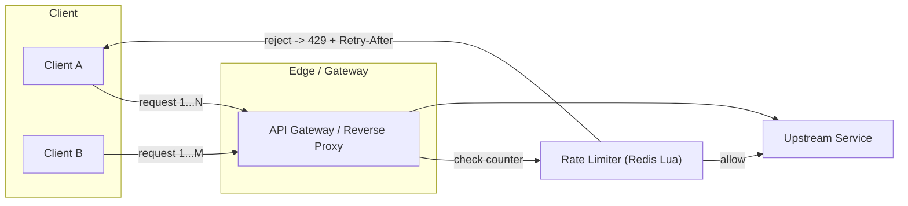

**Real-life use cases**

- **API throttling.** Twitter API: 300 requests / 15 minutes per user. Stripe: 100 read / 100 write per second with burst capacity. GitHub: 5,000 requests/hour with a sliding window. All expose `X-RateLimit-*` headers so clients can self-regulate.
- **DDoS and abuse prevention.** Edge gateways (Cloudflare, AWS WAF, Kong) reject flood traffic before it reaches origin - per-IP and per-user limits plus burst absorption.
- **Cost control for third-party APIs.** A mapping service billed per request; the limiter caps monthly spend and degrades gracefully when the budget is exhausted.
- **Resource management / fairness.** Background job queues, internal service-to-service RPC (per-consumer quotas so one noisy tenant cannot starve the rest), and database connection-pool protection.
- **Concurrency control.** "Concurrent requests per user" is a cousin problem (max in-flight, not rate over time) - commonly solved by the same token-bucket store with a separate counter, and often enforced together with rate limiting.

**Interview questions and answers**

- **Q: What is rate limiting in one sentence?**
  **A:** A control mechanism that bounds the number of requests a client/consumer may issue within a time window, rejecting or delaying excess with HTTP 429 to protect a shared, finite resource.
- **Q: What is the difference between rate limiting and throttling?**
  **A:** Rate limiting is the specific per-key quota enforcement; throttling is the broader overload-control concept. Rate limiting protects fairness; throttling protects the system. Both manifest as 429, but throttling may also mean queueing/delaying rather than rejecting.
- **Q: What HTTP status code represents rate limiting?**
  **A:** `429 Too Many Requests`, optionally accompanied by `Retry-After` and the `X-RateLimit-*` family of headers.

---

### Functional Requirements

1. **Enforce a per-key request quota over a rolling time window.** Given an identifier (API key, user id, IP, or service account), allow at most `N` requests per `W` seconds, where the window behavior (fixed vs. sliding) is configurable per rule. Excess requests must be rejected with HTTP 429.
2. **Support multiple keying dimensions simultaneously.** A single rule must express "1000 req/min per API key" while another expresses "100 req/min per IP" for unauthenticated traffic, and these may coexist and combine (take the tightest).
3. **Return standardized rate-limit metadata on every response.** `X-RateLimit-Limit`, `X-RateLimit-Remaining`, and optionally `X-RateLimit-Reset` must be present so well-behaved clients self-throttle without waiting for a 429.
4. **Return an accurate, server-provided retry hint on rejection.** When a request is rejected, `Retry-After` (seconds or HTTP-date) must tell the client how long to wait, so clients can avoid retry storms.
5. **Handle burst traffic gracefully.** A flat limiter that rejects the first burst kills user experience and batch jobs; the system should absorb short bursts up to a configured capacity (this is exactly what token bucket's burst parameter buys).
6. **Dynamic, updatable rules.** Operators must be able to add, remove, or modify rate-limit rules at runtime without a redeploy - e.g. raise limits for a partner, or temporarily lower them during an ongoing attack.
7. **Atomic, race-free evaluation.** Under concurrent requests against the same key, the counter check and the increment must be atomic; otherwise the classic "thundering herd under-counts and lets too many through" occurs. This is why Redis + Lua/EVAL is the canonical distributed primitive.
8. **Admin and observability surfaces.** Listing active rules and their current counters (debugging/ops), and exposing metrics (requests allowed/denied per key, per rule, and overall) for dashboards and alerting.
9. **Graceful degradation.** If the shared rate-limit store is unreachable, the system should fail *safe*: prefer denying traffic (fail-closed for security) or permitting it (fail-open for availability), and this choice must be explicit and configurable.

---

### Non-Functional Requirements

- **Latency**: the added latency to a request that is *allowed* must be below **5 ms** end to end (a single Redis round trip is ~0.2-0.5 ms in-region). The check happens on the hot path before the upstream is called, so it must be faster than the thing it protects. Rejection (the 429 path) must also be sub-millisecond.
- **Scale**: the limiter must serve **millions of distinct rules/keys** concurrently. A large SaaS platform may track per-user, per-API-key, per-IP, and per-endpoint quotas for tens of millions of identities, so the storage layer must not hold millions of idle Lua scripts or unbounded key sets in a single shard.
- **Consistency**: counter updates for a single key must be linearizable; concurrent requests against the same key must see an atomic check-and-increment. There is no value in a limiter whose count is approximate under contention.
- **Throughput**: the system must sustain **hundreds of thousands of evaluations per second** (large API fleets see 100K-500K RPS) with stable, predictable latency - no GC pauses, no lock contention, no cross-datacenter coordination on the fast path.
- **Accuracy**: the chosen algorithm's accuracy (see the Deep Dive comparison) is itself a quality attribute; fixed-window boundary spikes and sliding-window approximation error are explicit, measurable error budgets.
- **Availability**: 99.9%+ for the limiter path. Because it gates all traffic, the limiter must never be the component that takes the service down during an incident.
- **Observability**: every allow/deny must emit a metric tagged by key, rule, and reason; operators need to see which rule fired and at what rate to run the system.
- **Durability is not a goal.** Rate-limit counters are recoverable state: a brief Redis outage need not lose counts long-term if backed by replication and TTL expiry. Correctness under normal operation matters far more than persistence of a counter.

---

### Capacity Estimation (Back-of-the-Envelope)

Back-of-the-envelope math drives the store choice and the sharding plan. Assume a large SaaS API with tiered per-user and per-IP limits.

**Step 1 - Request volume**

- Active API keys: 10 million (10^7).
- Average per-key rate: 60 requests/minute = 1 QPS. Peak per-key rate (bursty clients) can be 10x the average, so plan for ~10 QPS peak per active key.
- Aggregate sustained QPS: 10^7 × 1 = **10 million requests/minute ≈ 167,000 QPS**.
- With burst absorption at 2x-3x during flash periods, the limiter must evaluate **~300,000-500,000 checks per second** at peak. This is the hard requirement on the store.

**Step 2 - Redis memory per user-key**

The per-key footprint determines how many keys fit in memory and whether you shard. Two common encodings:

*Token bucket (two-field model)* per key - store `tokens` (float) and `timestamp` (int). With the key name itself included:
- Redis key string overhead: ~50 bytes (a 16-char ASCII key like `rl:tkb:u:12345`).
- Two field values: ~50-60 bytes each (Redis string/object overhead + the value bytes).
- A small Redis hash can hold both fields in one object, saving ~40 bytes. Conservative estimate: **~120-160 bytes per key**.

*Sliding/fixed window counter* per key - often stored as a Redis hash with one field per sub-window, or a single integer with a TTL:
- Single integer counter + key overhead: **~50-70 bytes per key**.
- Sliding-window-log (a sorted set of timestamps) is far heavier: each member is a timestamp + Redis ZSET entry overhead (~64 bytes/member), so 60 entries for a 60-second log at 1-second resolution is **~4 KB per key** - this is the classic memory footgun of sliding-window log at scale.

**Rule of thumb**: prefer counter-based storage (token bucket as a hash, or fixed/sliding counter as a string with TTL) at ~100-150 bytes/key; avoid sliding-window-log when you have millions of keys unless you truncate aggressively.

**Step 3 - Total data set**

- 10 million keys × ~150 bytes (token-bucket model) = **~1.5 GB** of live counter data. Plus Redis hash/sds/string object overhead (~2x), budget **~3 GB** of resident memory per full key set.
- A single large Redis instance can hold tens of GB, so ~3 GB is comfortably one node - *until* you need replicas and headroom. With a primary + 1 replica and 50% headroom, you want **~10 GB** per shard.
- 300K-500K RPS ÷ ~110,000 RPS per healthy Redis instance (single-threaded, in-region, small payloads) ≈ **3-5 Redis instances** minimum. Round up and shard by key hash (e.g., `hash(key) mod N`) to 6-8 instances for headroom, fail-over margin, and hot-key isolation.

**Step 4 - Hot keys and burst handling**

- A single viral user or a `/health` endpoint without per-key isolation can pin one Redis shard. Mitigation: route super-hot keys through a "burst buffer" / API gateway-level local token bucket, or shard fan-out so no single key owns a shard.
- Memory per key is small, but *connections* and *command throughput* are the real bottleneck - keep the Lua script minimal (no string building, no `redis.call` on unrelated keys) so each shard can hit ~100K+ evals/sec.

**Rules of thumb to quote in interviews**: rate-limit counters are ~50-150 bytes/key depending on encoding; the whole key space for a large platform fits in a handful of GB and is sharded primarily for *throughput*, not raw memory; and the limiter's per-request cost is one Redis round trip, so **in-region co-location of the gateway and Redis is what buys you the <5 ms budget**.

---

### Characteristics

Each characteristic: what it means, why it matters, and how it shapes the design.

- **Stateful with shared state**
  Unlike most stateless microservices, a rate limiter's correctness *depends* on a shared, consistent counter store. A per-process counter behind a load balancer is instantly wrong because each instance only sees its own shard of traffic. This single fact is why the design centers on a shared store (Redis) rather than in-process maps. Example: a token-bucket counter held in Redis, read and written by every gateway node.

- **Latency-bound on the hot path**
  The check runs on *every* request before it reaches upstream. If the limiter adds 10 ms, it dominates a sub-50 ms endpoint. The store interaction must therefore be one in-region round trip (~0.2-0.5 ms in Redis) and the per-request logic must be a constant-time hash lookup plus an atomic increment. Example: a hand-rolled Lua script that does check-and-decrement in one EVAL.

- **Burst-tolerant by design**
  Real traffic is bursty (mobile wake-up storms, webhook retries, batch jobs). A correct limiter absorbs short bursts up to a configured capacity and then rejects - it never allows *more* than the burst ceiling, and it never rejects traffic that fits under the sustained rate. Example: token bucket with `capacity=20, refill=10/s` absorbs a 20-request spike, then smooths to 10/s.

- **Multi-tenant with isolation**
  Tenants, API tiers (free/basic/pro), and individual users share one physical cluster. A hot key from one tenant must not evict or starve another's counters, so the key namespace is partitioned (by hash) and hot keys are handled at the edge or via a burst buffer. Example: a SaaS key `rl:u:12345` is hashed to shard 7; tenant 12345's burst never touches shard 2's tenants.

- **Approximate by necessity (algorithm-dependent)**
  Some algorithms trade exactness for speed. Fixed-window counters spike at boundaries (+100% error on a burst); sliding-window counters approximate the previous window's tail. The system must be explicit about which approximation error is acceptable for which rule - a billing API can demand exactness; a public search bar can accept a few percent slack. Example: Stripe uses token bucket (bounded, controlled burst) on public routes and stricter counters on metered billing endpoints.

- **Race-free under concurrency**
  Concurrent requests against the same key must not double-count or skip. A read-modify-write done as separate Redis commands is a TOCTOU race; the check and the decrement must be one atomic operation. Example: the `INCR` + `EXPIRE` pattern is *not* atomic and lets a race under-count on the first hit of a window.

- **Degradable and observable**
  Because the limiter gates all traffic, it must be safe to reason about: when it fails, the failure mode (fail-open vs fail-closed) must be deliberate and configurable, and every decision must emit a metric so operators can prove the limiter is protecting, not breaking, the service. Example: a 429 tagged `reason="rate_limit"` in Prometheus, alertable per service.

---

### Components

Each component: purpose, responsibilities, how it works, how it relates to the others, and a real-world example.

- **Client**
  Purpose: consume the API while respecting server authority on rate limits. Responsibilities: read `X-RateLimit-Remaining` and throttle self before hitting 429; honor `Retry-After` exactly; apply exponential backoff with jitter on repeated 429s; never retry a non-idempotent POST on a 429 without user confirmation. How it works: the HTTP client wraps each request with a backoff policy and inspects rate-limit headers to schedule the next allowed request. Relationships: only talks to the gateway; never talks to the upstream directly. Real-world example: an AWS SDK or Stripe SDK that reads `X-RateLimit-Reset` and retries with backoff automatically.

- **API Gateway / Reverse Proxy (enforcement point)**
  Purpose: decide allow/deny in front of every upstream. Responsibilities: identify the key (API key, user id, or IP), select the matching rule, evaluate the limit atomically, set rate-limit response headers, and on denial return 429 with `Retry-After`. How it works: at the edge, the gateway hashes the key to a Redis shard and runs a tiny Lua script via `EVAL` that does the check-and-decrement atomically. Relationships: upstream of the backend service; downstream of the client; peers with the rate-limit store and metrics. Real-world example: Kong / Envoy rate-limit service, AWS API Gateway usage plans, Cloudflare's edge rate limiting.

- **Rate-Limit Store (Redis / key-value)**
  Purpose: the single source of truth for counters. Responsibilities: store per-key counters (or token state), expose atomic check-and-update, survive node failure via replication, and expire stale keys. How it works: each key encodes the dimension and window (e.g., `rl:apikey:abc:1718985600`), the value is a counter or a token-bucket struct, and a Lua script performs the read-modify-write in one round trip so concurrency cannot corrupt state. Relationships: called by every gateway node; the rule engine tells it what to store. Real-world example: Redis with the open-source `redis-cell` module (a production token-bucket/leaky-bucket implementation), or a simple counter hash.

- **Rule Engine / Limit Configuration**
  Purpose: define *what* the limits are, decoupled from *how* they are stored. Responsibilities: hold the rule table (key dimension, limit, window, algorithm, burst), resolve which rule(s) apply to a request, and push updates to gateways. How it works: rules are stored centrally (config DB or a service) and cached in each gateway; changes fan out in seconds; on every request the engine matches the request to its rule without a DB round trip. Relationships: upstream of the gateway (feeds it rules); reads/writes the shared config store; may push to the rate-limit store for counter initialization. Real-world example: an ops UI that edits `rate_limits.yaml`, picked up by gateways via a polling webhook or a config-service watch.

- **Metrics and Alerting**
  Purpose: prove the limiter is healthy and detect abuse. Responsibilities: emit `rate_limit_allowed`, `rate_limit_denied`, and `rate_limit_store_latency` counters tagged by key/rule/service; alert on denial-rate spikes (attack) and on store p99 latency rising above budget (limiter becoming the bottleneck). How it works: every gateway emits counters; a collector aggregates to Prometheus/CloudWatch and a dashboard annotates 429s with the rule that fired. Relationships: consumes from gateways; drives paging and dashboards. Real-world example: Datadog monitors tagged `service:api,rule:free-tier-100rpm,decision:denied`.

- **Circuit Breaker / Load Shedder (global)**
  Purpose: protect upstream when the *aggregate* rate exceeds capacity, independent of any one client. Responsibilities: detect rising latency or error rates, trip a global "shed traffic" mode that raises all limits (or returns 503/429 with a global reason), and recover automatically when health returns. How it works: a local or central component observes upstream health and injects higher rejection rates. Relationships: sits above the per-key limiter (the per-key limiter still enforces fairness; the shedder adds a global floor/ceiling). Real-world example: Istio's outlier detection and Envoy's circuit-breaking in the cluster manager, plus a 503-fast path under saturation.

---

### Architectural Patterns

Each rate-limiting pattern: what it is, the problem it solves, how it works, when to use it and when not to use it, advantages, disadvantages, and a real-world example. The deep, implementation-level treatment of each algorithm (code) also appears in the Deep Dive for the Java/Spring audience.

#### Pattern 1: Token Bucket

- **What:** a bucket that holds at most `capacity` tokens; tokens refill at a steady `refill_rate`; each request consumes one token; if the bucket is empty the request is rejected.
  Problem solved: you want to allow occasional bursts (a client firing many requests at once) while still bounding the *sustained* rate over time. A flat "N per window" check rejects the first burst of an otherwise-well-behaved client.
  How it works: on each request, compute how many tokens have accrued since the last update (`elapsed * refill_rate`), cap at `capacity`, subtract one (or more) if available, else deny. The whole read-modify-write must be atomic in a distributed setting (see the Deep Dive for the Redis + Lua critical section).
  When to use: general API rate limiting where bursts are legitimate (interactive apps, batched jobs, retries that succeed). Excellent default choice.
  When not to use: when *zero* burst is desired, e.g. strict throttling to protect a downstream system that cannot absorb any spike - prefer leaky bucket or a tight counter there.
  Advantages: simple, memory efficient (two fields per key), natural burst absorption, analytically well understood.
  Disadvantages: two parameters to tune (`capacity` and `refill_rate`); burst capacity can still overwhelm a fragile downstream if set too high.

#### Description

The Token Bucket algorithm is one of the most popular rate limiting algorithms. Imagine a bucket that holds tokens. Each request consumes one token. Tokens are added to the bucket at a fixed rate. If the bucket is full, new tokens are discarded. When a request arrives, it checks if there's a token available. If yes, the request is processed and a token is removed. If no, the request is rejected.

#### Diagram
```
Time: 0s      1s      2s      3s      4s
      ┌─┐     ┌─┐     ┌─┐     ┌─┐     ┌─┐
      │5│ →   │5│ →   │5│ →   │4│ →   │5│
      └─┘     └─┘     └─┘     └─┘     └─┘
Bucket (capacity=5, refill=1 token/sec)

Request at 3s → Token available → Accept (tokens: 5→4)
Request at 3.5s → Token available → Accept (tokens: 4→3)
```

#### Advantages
- Memory efficient - only needs to track token count and timestamp
- Allows burst traffic - clients can save up tokens for sudden spikes
- Easy to implement and understand
- Smooth traffic flow over time

#### Disadvantages
- Two parameters to tune (bucket size and refill rate)
- Difficult to tune parameters optimally for all scenarios
- May allow bursts that could overwhelm downstream services

#### Implementation

**Storage:** Typically uses **Redis** for distributed systems (stores token count and last refill time)

**Configuration Parameters:**
- `bucket_capacity`: Maximum number of tokens (e.g., 10)
- `refill_rate`: Tokens added per second (e.g., 1 token/sec)

**Ease of Implementation:** ⭐⭐⭐⭐ (4/5) - Easy to implement

#### Code Example

```python
import time
import redis

class TokenBucket:
    def __init__(self, capacity, refill_rate, redis_client, key):
        self.capacity = capacity
        self.refill_rate = refill_rate  # tokens per second
        self.redis = redis_client
        self.key = key
        
    def allow_request(self, tokens=1):
        """Check if request is allowed"""
        now = time.time()
        
        # Get current state from Redis
        pipe = self.redis.pipeline()
        pipe.get(f"{self.key}:tokens")
        pipe.get(f"{self.key}:last_refill")
        current_tokens, last_refill = pipe.execute()
        
        # Initialize if first time
        if current_tokens is None:
            current_tokens = self.capacity
            last_refill = now
        else:
            current_tokens = float(current_tokens)
            last_refill = float(last_refill)
        
        # Calculate tokens to add based on time elapsed
        elapsed = now - last_refill
        tokens_to_add = elapsed * self.refill_rate
        current_tokens = min(self.capacity, current_tokens + tokens_to_add)
        
        # Check if enough tokens
        if current_tokens >= tokens:
            current_tokens -= tokens
            # Update Redis
            pipe = self.redis.pipeline()
            pipe.set(f"{self.key}:tokens", current_tokens)
            pipe.set(f"{self.key}:last_refill", now)
            pipe.execute()
            return True
        
        return False

# Usage
redis_client = redis.Redis(host='localhost', port=6379)
limiter = TokenBucket(capacity=10, refill_rate=1, redis_client=redis_client, key="user:123")

if limiter.allow_request():
    print("Request allowed")
else:
    print("Rate limit exceeded - 429")
```

> Note on the code above: it illustrates the token-bucket *logic* correctly, but the `GET`/`SET` pair in the pipeline is **not atomic** - a concurrent request can read the same token count before either writes it back, letting two requests pass against one token (a TOCTOU race). In a real distributed system you must run the entire check-and-decrement as one Redis Lua script via `EVAL` so the operation is atomic. The Deep Dive shows the corrected, race-free version.

---

#### Pattern 2: Leaky Bucket

- **What:** an incoming queue with a fixed capacity that is drained at a constant outflow rate; if the queue overfills on arrival, the request is rejected.
  Problem solved: you need a strictly smooth, constant output rate (e.g. a payment gateway that allows only N transactions/sec regardless of input spikes).
  How it works: each request is "poured in" (queued); a "leak" of `outflow_rate` items/sec drains the bucket. Because the drain is constant, bursts are stretched into a smooth stream rather than absorbed as spikes.
  When to use: systems where *output rate* must be constant - traffic shaping, bandwidth limiting, payment or write-rate throttling.
  When not to use: when you want to allow bursts to pass immediately through - leaky bucket delays or drops them, hurting latency-sensitive APIs.
  Advantages: perfectly smooth output; simple queue-based mental model; bounded queue memory.
  Disadvantages: first-in-first-out queueing means a burst fills the queue and the *tail* of the burst is rejected/delayed; older queued requests may become stale; tuning the queue depth is unintuitive.

#### Description

The Leaky Bucket algorithm is similar to a bucket with a hole at the bottom. Requests enter the bucket as water. The bucket has a fixed capacity. Water leaks out of the bucket at a constant rate (processes requests). If the bucket is full when a request arrives, the request is rejected. This algorithm smooths out bursts and processes requests at a constant rate.

#### Diagram
```
Incoming Requests (variable rate)
         ↓↓↓
      ┌─────┐
      │ ░░░ │  ← Bucket (Queue)
      │ ░░░ │     Capacity: 5
      │ ░░░ │
      └──┬──┘
         ↓ (constant outflow rate)
    Processed Requests
```

#### Advantages
- Smooth and consistent output rate
- Memory efficient with fixed queue size
- Good for scenarios requiring stable outbound rate
- Simple to implement with a queue

#### Disadvantages
- A burst of traffic fills up the queue, and recent requests are rate limited
- Not suitable if requests need immediate processing
- Older requests in queue may become stale
- Difficult to tune bucket size appropriately

#### Implementation

**Storage:** Uses **Redis** (stores queue of requests with timestamps)

**Configuration Parameters:**
- `bucket_capacity`: Maximum queue size (e.g., 100)
- `outflow_rate`: Requests processed per second (e.g., 10/sec)

**Ease of Implementation:** ⭐⭐⭐ (3/5) - Moderate complexity

#### Code Example

```python
import time
import redis
from collections import deque

class LeakyBucket:
    def __init__(self, capacity, outflow_rate, redis_client, key):
        self.capacity = capacity
        self.outflow_rate = outflow_rate  # requests per second
        self.redis = redis_client
        self.key = key
        
    def allow_request(self):
        """Check if request can be added to bucket"""
        now = time.time()
        
        # Get queue from Redis (stored as list)
        queue = self.redis.lrange(f"{self.key}:queue", 0, -1)
        queue = [float(ts) for ts in queue]
        
        # Remove leaked (processed) requests
        leaked_time = now - (len(queue) / self.outflow_rate)
        queue = [ts for ts in queue if ts > leaked_time]
        
        # Check capacity
        if len(queue) < self.capacity:
            # Add request to queue
            self.redis.rpush(f"{self.key}:queue", now)
            self.redis.ltrim(f"{self.key}:queue", -self.capacity, -1)
            self.redis.expire(f"{self.key}:queue", 3600)  # 1 hour TTL
            return True
        
        return False

# Usage
redis_client = redis.Redis(host='localhost', port=6379)
limiter = LeakyBucket(capacity=100, outflow_rate=10, redis_client=redis_client, key="user:123")

if limiter.allow_request():
    print("Request queued")
else:
    print("Bucket full - 429")
```

---

#### Pattern 3: Fixed Window Counter

- **What:** time is divided into fixed-size windows; a counter per window is incremented per request; requests are rejected once the counter exceeds the limit; the counter resets to zero at the start of each new window.
  Problem solved: provide a simple, cheap per-window quota where exact smoothing across the boundary does not matter.
  How it works: `current_window = floor(now / window_size)`; key the counter by `key:current_window`; `INCR` it; set a TTL of `2*window_size` on first insert so the next window's key expires cleanly; compare against the limit.
  When to use: non-critical throttling (cache warming, background sync, internal tooling quotas) where a brief 2x spike at the boundary is acceptable and simplicity is prized.
  When not to use: billing, payments, or any path where a boundary burst could exceed a contractual downstream limit.
  Advantages: trivially simple; only one counter per key per window; `INCR` is one of the fastest Redis commands; works naturally with Redis TTL expiry.
  Disadvantages: **boundary spike** — requests just before one boundary and just after the next can sum to nearly 2x the limit within a tiny interval; abrupt resets feel unfair to clients.

#### Description

The Fixed Window Counter algorithm divides time into fixed-size windows (e.g., 1 minute) and maintains a counter for each window. When a request arrives, the algorithm increments the counter for the current window. If the counter exceeds the threshold, the request is rejected. At the start of a new window, the counter resets to zero.

#### Diagram
```
Window 1       Window 2       Window 3
(0-60s)        (60-120s)      (120-180s)
┌────────┐    ┌────────┐    ┌────────┐
│Count: 8│    │Count: 5│    │Count: 3│
│Limit:10│    │Limit:10│    │Limit:10│
└────────┘    └────────┘    └────────┘
0s    60s    120s   180s

Issue: Spike at window boundary
    Window 1          Window 2
      ↓                 ↓
  ────┼─────────────────┼────
  50s-60s: 10 req  |  60s-70s: 10 req
        = 20 requests in 20s! (2x limit)
```

#### Advantages
- Very simple to implement
- Memory efficient - stores only one counter per window
- Fast lookup and update
- Works well with Redis TTL

#### Disadvantages
- **Boundary issue**: Spike at window edges can exceed rate limit (2x the limit)
- Not smooth - resets abruptly at window boundaries
- Doesn't account for distribution within window

#### Implementation

**Storage:** **Redis** with key expiration

**Configuration Parameters:**
- `window_size`: Duration in seconds (e.g., 60)
- `max_requests`: Maximum requests per window (e.g., 100)

**Ease of Implementation:** ⭐⭐⭐⭐⭐ (5/5) - Very easy to implement

#### Code Example

```python
import time
import redis
import math

class FixedWindowCounter:
    def __init__(self, window_size, max_requests, redis_client, key):
        self.window_size = window_size  # in seconds
        self.max_requests = max_requests
        self.redis = redis_client
        self.key = key
        
    def allow_request(self):
        """Check if request is allowed in current window"""
        now = time.time()
        window_key = f"{self.key}:{math.floor(now / self.window_size)}"
        
        # Increment counter
        current_count = self.redis.incr(window_key)
        
        # Set expiration on first request in window
        if current_count == 1:
            self.redis.expire(window_key, self.window_size * 2)
        
        # Check limit
        if current_count <= self.max_requests:
            return True
        
        return False

# Usage
redis_client = redis.Redis(host='localhost', port=6379)
limiter = FixedWindowCounter(window_size=60, max_requests=100, 
                             redis_client=redis_client, key="user:123")

if limiter.allow_request():
    print("Request allowed")
else:
    print("Window limit exceeded - 429")
```

> Race-condition note: the original `INCR` + conditional `EXPIRE` is correct for *counter correctness* (Redis `INCR` is atomic), but the check-and-decide is split across two commands in the example above, so a client that retries immediately after seeing `current_count == max_requests` on the same window can briefly observe stale `Remaining` counts. In production the count, the limit check, and the response headers are computed inside one Lua script; the fixed-window approach itself is sound and is what many managed gateways use for non-critical tiers.

---

#### Pattern 4: Sliding Window Log

- **What:** keep a timestamped log of every request in the last `W` seconds; allow the request only if the log length is below the limit, then append the new timestamp.
  Problem solved: you need mathematically exact rate limiting over a true rolling window with no boundary spikes.
  How it works: store timestamps in a Redis sorted set keyed by `key`; on each request `ZREMRANGEBYSCORE` entries older than `now - W`, then `ZCARD` to count, then conditionally `ZADD`. All three must be one atomic script.
  When to use: low-to-moderate QPS where exactness is worth the cost (e.g., internal audit-critical endpoints, or when demonstrating correctness).
  When not to use: high-traffic public APIs — every request writes and scans a growing set, which does not scale to millions of keys.
  Advantages: exact; no boundary effect; true rolling semantics.
  Disadvantages: memory grows linearly with request volume (`O(window * rate)` per key); expensive `ZREM`/`ZCARD` scans under load; the classic example of "correct but doesn't scale".

#### Description

The Sliding Window Log algorithm keeps a log (sorted set) of timestamps for all requests. When a new request arrives, it removes all timestamps older than the current time minus the window size, then counts the remaining timestamps. If the count is below the limit, the request is allowed and its timestamp is added to the log.

#### Diagram
```
Window Size: 60s
Current Time: 100s
Look back to: 40s

Timeline:
35s  42s  55s  58s  70s  85s  95s  [100s - NEW REQUEST]
  X    ✓    ✓    ✓    ✓    ✓    ✓
(old) ← Sliding Window (60s) →

Count in window: 6
If limit = 10: Allow request
```

#### Advantages
- Very accurate - no boundary issues
- True sliding window (not fixed intervals)
- Precise rate limiting
- Fair distribution of requests

#### Disadvantages
- Memory intensive - stores timestamp for every request
- Expensive for high traffic (needs to scan and clean logs)
- Requires more storage (grows with traffic)
- Slower than counter-based approaches

#### Implementation

**Storage:** **Redis Sorted Set** (ZSET) with timestamps as scores

**Configuration Parameters:**
- `window_size`: Duration in seconds (e.g., 60)
- `max_requests`: Maximum requests per window (e.g., 100)

**Ease of Implementation:** ⭐⭐⭐ (3/5) - Moderate complexity

#### Code Example

```python
import time
import redis

class SlidingWindowLog:
    def __init__(self, window_size, max_requests, redis_client, key):
        self.window_size = window_size  # in seconds
        self.max_requests = max_requests
        self.redis = redis_client
        self.key = f"{key}:log"
        
    def allow_request(self):
        """Check if request is allowed using sliding window"""
        now = time.time()
        window_start = now - self.window_size
        
        # Use pipeline for atomic operations
        pipe = self.redis.pipeline()
        
        # Remove old entries outside the window
        pipe.zremrangebyscore(self.key, 0, window_start)
        
        # Count requests in current window
        pipe.zcard(self.key)
        
        # Execute pipeline
        _, current_count = pipe.execute()
        
        # Check limit
        if current_count < self.max_requests:
            # Add current request timestamp
            self.redis.zadd(self.key, {now: now})
            self.redis.expire(self.key, self.window_size * 2)
            return True
        
        return False

# Usage
redis_client = redis.Redis(host='localhost', port=6379)
limiter = SlidingWindowLog(window_size=60, max_requests=100, 
                          redis_client=redis_client, key="user:123")

if limiter.allow_request():
    print("Request allowed")
else:
    print("Rate limit exceeded - 429")
```

> Race-condition note: `ZREMRANGEBYSCORE` + `ZCARD` are pipelined but *not atomic together*, so two concurrent requests can both observe a count below the limit and both `ZADD`, admitting one extra. The correct distributed form wraps these in a single `EVAL` script and returns the decision to the caller; the standalone example above is for clarity of the algorithm only.

---

#### Pattern 5: Sliding Window Counter

- **What:** a hybrid that approximates a true sliding window using two adjacent fixed-window counters (current and previous) and an overlap-weighted blend of the previous counter.
  Problem solved: fixed-window counters spike at boundaries; sliding-window log is exact but too expensive. You want a middle ground that is cheap *and* mostly accurate.
  How it works: `overlap% = 1 - (elapsed_in_current_window / window_size)`; `estimated = current_count + prev_count * overlap%`; allow if `estimated < limit`, then `INCR` the current window. The two `GET`s + one `INCR` should still be wrapped in one Lua script for atomicity, but each key is a single integer, so memory stays low.
  When to use: high-traffic APIs that need better-than-fixed-window accuracy without the memory cost of a log. A very common production choice.
  When not to use: when you need exact, auditable counts — the blend is an estimate and assumes uniform distribution within the previous window, which is an assumption, not a guarantee.
  Advantages: smooths boundary spikes; low memory (two integers per key); fast `INCR`-style ops.
  Disadvantages: still an approximation; can briefly *under*-estimate when traffic arrives in clusters at window start/end (the distribution assumption breaks); the error is small and one-sided (bias toward allowing slightly more, not less).

#### Description

The Sliding Window Counter is a hybrid approach that combines Fixed Window Counter and Sliding Window Log. It uses two fixed windows (current and previous) and calculates an approximate count based on the overlap. This provides better accuracy than Fixed Window Counter with lower memory usage than Sliding Window Log.

#### Diagram
```
Previous Window    Current Window
    (0-60s)           (60-120s)
   ┌──────┐          ┌──────┐
   │ 80   │          │ 40   │
   └──────┘          └──────┘
        
Current Time: 90s (30s into current window)

Formula:
Estimated Count = (Previous × Overlap%) + Current
                = (80 × 50%) + 40
                = 40 + 40 = 80

If limit = 100: Allow request
```

#### Advantages
- Good balance between accuracy and memory
- Better than Fixed Window (smoother)
- More memory efficient than Sliding Window Log
- Handles boundary issues well

#### Disadvantages
- Only an approximation (not 100% accurate)
- Slightly more complex than Fixed Window
- Assumes uniform distribution in previous window
- Still has minor edge cases

#### Implementation

**Storage:** **Redis** with two counters

**Configuration Parameters:**
- `window_size`: Duration in seconds (e.g., 60)
- `max_requests`: Maximum requests per window (e.g., 100)

**Ease of Implementation:** ⭐⭐⭐⭐ (4/5) - Moderately easy

#### Code Example

```python
import time
import redis
import math

class SlidingWindowCounter:
    def __init__(self, window_size, max_requests, redis_client, key):
        self.window_size = window_size  # in seconds
        self.max_requests = max_requests
        self.redis = redis_client
        self.key = key
        
    def allow_request(self):
        """Check if request is allowed using sliding window counter"""
        now = time.time()
        current_window = math.floor(now / self.window_size)
        previous_window = current_window - 1
        
        # Calculate time elapsed in current window
        elapsed_time_in_current = now - (current_window * self.window_size)
        overlap_percentage = 1 - (elapsed_time_in_current / self.window_size)
        
        # Get counters
        prev_key = f"{self.key}:{previous_window}"
        curr_key = f"{self.key}:{current_window}"
        
        prev_count = int(self.redis.get(prev_key) or 0)
        curr_count = int(self.redis.get(curr_key) or 0)
        
        # Calculate estimated count
        estimated_count = (prev_count * overlap_percentage) + curr_count
        
        # Check limit
        if estimated_count < self.max_requests:
            # Increment current window counter
            pipe = self.redis.pipeline()
            pipe.incr(curr_key)
            pipe.expire(curr_key, self.window_size * 2)
            pipe.execute()
            return True
        
        return False

# Usage
redis_client = redis.Redis(host='localhost', port=6379)
limiter = SlidingWindowCounter(window_size=60, max_requests=100, 
                               redis_client=redis_client, key="user:123")

if limiter.allow_request():
    print("Request allowed")
else:
    print("Rate limit exceeded - 429")
```

---

## Which Algorithm to Choose?

The right algorithm is a *use-case* decision, not a one-size-fits-all rule. The dimensions that matter are: burst tolerance required, accuracy required, traffic scale, and memory budget.

- **Token Bucket**: Best for most use cases, especially APIs (used by Amazon, Stripe). Choose when you want controlled burst absorption and a smooth sustained rate with minimal memory.
- **Leaky Bucket**: When you need a smooth, consistent *output* rate and can afford to queue or shed the tail of a burst (traffic shaping, bandwidth limiting, payments).
- **Fixed Window**: Simple caching, non-critical rate limiting. Choose only when boundary accuracy is irrelevant and simplicity is worth a 2x boundary spike.
- **Sliding Window Log**: When accuracy is critical and memory is not a concern — almost never at high scale, because per-key memory grows with traffic.
- **Sliding Window Counter**: Good balance for high-traffic systems (used by Cloudflare) — cheap like fixed window, smooth like a log.

**Real-world mapping**

| Company / Product | Algorithm | Why |
|---|---|---|
| Stripe (public API) | Token Bucket | bounded burst for legitimate retries/batch jobs; simple two-field store |
| AWS API Gateway | Fixed Window + Burst | fixed quota per window, with a burst-limit bucket for spikes |
| Cloudflare | Sliding Window Counter | high QPS, low memory, avoids the fixed-window boundary spike that would let attacks through |
| Twitter / GitHub v3 API | Fixed Window (sliding) | simple per-app quota; boundary spikes acceptable for a public API |
| LinkedIn Per APIs | Token Bucket | absorb mobile wake-up bursts, then smooth to sustained rate |

> Decision rule for interviews: state the tradeoff explicitly — "token bucket for general APIs because bursts are legitimate and bounded; fixed window only when you explicitly *want* the boundary-reset behavior; sliding-window log when correctness trumps cost." The answer that names the cost/accuracy tradeoff per scenario is the one interviewers are looking for.

---

## Redis vs Configuration

### When to use Redis:
- **Distributed systems** (multiple servers need shared state)
- **High traffic** scenarios
- **Dynamic rate limits** that change frequently
- **Per-user/per-IP** rate limiting

### When to use In-Memory/Config:
- **Single server** applications
- **Low traffic** scenarios
- **Static rate limits** that rarely change
- **Global rate limiting** (same for all users)

### Hybrid Approach:
```python
# Config file (config.yaml)
rate_limits:
  api_v1: 100 requests per minute
  api_v2: 1000 requests per minute
  
# Redis stores the actual counters/state
# Config stores the limits/rules
```

### In-memory (local) enforcement points
There is a useful third option that sits *between* in-memory and Redis: a **local token bucket per process** backed by Redis for the global truth. Each gateway node keeps a local token-bucket counter (no network hop = sub-millisecond, well under the <5 ms budget) and periodically reconciles with a Redis counter to enforce the *aggregate* limit and refill. This is the pattern used by resilient clients and edge gateways: it makes the common case fast and the failure case (Redis down) *still rate-limited*, not rate-limit-less. Use it when per-key latency budget is tight and you can tolerate eventual (seconds-scale) convergence on the global limit.

---

## Comparison Table

| Algorithm | Accuracy | Memory | Performance | Allows Bursts | Complexity |
|-----------|----------|--------|-------------|---------------|------------|
| Token Bucket | Good | Low | High | Yes | Easy |
| Leaky Bucket | Excellent | Medium | Medium | No | Moderate |
| Fixed Window | Poor | Very Low | Very High | Yes | Very Easy |
| Sliding Window Log | Excellent | High | Low | No | Moderate |
| Sliding Window Counter | Good | Low | High | Partial | Easy |

> The table compares the algorithms on the dimensions that matter in interviews. "Accuracy" is exactness of enforcement; "Memory" is per-key storage cost at scale; "Allows Bursts" is whether short spikes pass; "Complexity" is implementation and operational difficulty. Token bucket dominates for general APIs; leaky bucket for shape-constrained output; fixed window for simplicity; sliding log for audit-exactness; sliding counter for high-scale compromise. The Deep Dive adds time/space complexity and a memory-per-key breakdown.

---

### Benefits

- **Predictable resource consumption.** By capping request rate, the limiter turns an unbounded spike into a bounded, provisioned load - the upstream sees at most `N` requests/sec per key, not `N × 50`.
- **Protection of shared / downstream dependencies.** A slow database or a third-party API with a hard contract is protected from overload and its rate-limit contract is honored automatically.
- **Fairness and isolation across tenants.** Quotas per key mean one noisy or malicious tenant cannot degrade others - the classic multi-tenant SRE win.
- **Cost control.** For metered third-party APIs (maps, SMS, payments) the limiter directly caps spend; for cloud egress or search APIs it caps units billed.
- **Availability under DDoS.** Edge gateways that reject flood traffic with 429 before it reaches origin convert an availability attack into a rate-limited annoyance.
- **Deterministic behavior for capacity planning.** Because the limiter makes traffic smoothable, you can provision upstream capacity against the *limited* rate, not the *peak* rate - cheaper boxes.
- **Signal for autoscaling and circuit-breaking.** A rising 429 rate is an early-warning signal: it tells you the upstream is becoming the bottleneck *before* latency explodes, feeding autoscalers and load shedders.

---

### Pros

- **Simple to reason about once you pick an algorithm.** Each algorithm has one knob (`capacity`/`refill_rate`, `window_size`/`max_requests`) whose effect is direct and testable.
- **Cheap per-request.** A single Redis `EVAL` of a tiny Lua script is ~0.2-0.5 ms in-region - comfortably inside the <5 ms budget.
- **Composable with the rest of the stack.** Works identically whether you enforce at the edge, the gateway, or the service; the store is what makes it shared.
- **Standard, client-understandable contract.** `429` + `Retry-After` + `X-RateLimit-*` headers require no custom client logic beyond backoff - every HTTP client speaks this language.
- **Tunable per tier and per endpoint.** Free, basic, and pro tiers get different limits from the same engine; hot endpoints can be throttled tighter than cold ones.
- **Degradable.** When Redis is cold, a local fallback bucket keeps protecting the upstream instead of failing open; the design survives partial outages.

---

### Cons

- **Shared-state dependency.** The limiter's correctness is only as strong as the store's availability and consistency; you have relocated the bottleneck from CPU to a Redis cluster that every node hammers.
- **Latency tax on every request.** Even a sub-millisecond Redis call is on the critical path of *every* request, so a network hiccup or a hot key can suddenly multiply latencies across the fleet.
- **Hot keys and skewed distributions.** A viral client or `/health` endpoint pinned to one key can saturate one shard and take a slice of your fleet with it, requiring burst buffers or fan-out.
- **Algorithm trade-offs are unavoidable.** You can never have exact, zero-burst, zero-memory, and O(1) simultaneously - pick two-ish; you will explain the trade-off in every interview.
- **Operational surface.** Key TTL expiry, replica lag under burst writes, Lua-script correctness, fail-open vs fail-closed policy, and metric cardinality (per-key counters) all need runbooks.
- **Client friction.** Legitimate batched or retry-heavy clients hit limits and must be taught to back off; getting `Retry-After` semantics right is its own sub-problem (see Client-Side Strategies).
- **Approximation can surprise.** Sliding-window counter can momentarily allow slightly more than the limit under clustered traffic; fixed-window allows the boundary double-spike. Audits that expect *exact* N-per-window will be disappointed by anything but the log variant.

---

### Challenges

Organized by category; each includes the concrete failure mode and the standard mitigation.

**Technical**

- *Non-atomic check-and-decrement (the TOCTOU race).* Separate `GET`/`SET` calls let concurrent requests against the same key both read the same value and both pass. Mitigation: wrap the read-check-write in one Redis Lua script (`EVAL`/`EVALSHA`) so it is atomic; the Lua script shown in the Deep Dive is the single most important correctness primitive in the whole design.
- *Algorithm mis-selection.* Using fixed-window where bursts matter, or sliding-window-log where memory is tight, silently produces wrong behavior. Mitigation: map each rule to its algorithm by SLO (billing=exact/log-or-fixed-with-caveat; public API=token bucket; background=counter), and document the choice in the rule table.
- *Key-space explosion.* Per-user-per-endpoint-per-window keys with no TTL grow without bound. Mitigation: TTL all counter keys (`EXPIRE` on first write, TTL ≥ 2× the window) and periodically scan for orphan keys.
- *Clock skew and time-boundary bugs.* Wall-clock drift across hosts makes window boundaries inconsistent. Mitigation: compute window keys from a monotonic, server-authoritative time (Redis `TIME` or the gateway clock), never client-supplied `now`.
- *In-memory fallback divergence.* A local token bucket that drifts from the shared store can briefly under- or over-limit. Mitigation: keep local refill state as an *optimization* (never the source of truth), reconcile frequently, and cap local burst well below the global limit.

**Scalability**

- *Single Redis shard saturated by throughput.* ~110K EVALs/sec per instance is a real ceiling; a single shard for a global fleet is impossible. Mitigation: shard counters by `hash(key) mod N`, pick N from the back-of-envelope (Step 3), and keep scripts minimal.
- *Hot keys pinning a shard.* One key with 30% of traffic saturates its shard while others sleep. Mitigation: a gateway-local burst absorber for the hottest keys, or *fan-out* the counter update to N sub-keys and aggregate (trading a little precision for parallelism).
- *Replication lag under write bursts.* Async replicas can lag, doubling reads but not catching writes for failover fast enough. Mitigation: keep the write path on the primary; use replicas only for read-only admin/metrics; size WAL/IO for the peak write rate.

**Performance**

- *Memory amplification from the wrong algorithm.* Sliding-window-log at millions of keys is the classic OOM: each key holds a growing list of timestamps. Mitigation: never use the log variant for high-cardinality public APIs; prefer counter or token-bucket encodings (~50-150 B/key).
- *Tail latency from Redis GC / fork / eviction.* Big datasets, `BGSAVE` forks, and maxmemory eviction all add latency spikes on the hot path. Mitigation: pin working set in memory (no eviction on hot keys), isolate the limiter cluster so unrelated keys cannot evict counters, and monitor p99 store latency as a first-class SLO.
- *Lock and connection contention.* Many gateway threads hammering one Redis connection limit becomes the cap. Mitigation: connection pooling with enough connections per shard to keep pipelines full but bounded.

**Reliability**

- *Redis outage → either stop-the-world (fail-closed) or uncontrolled traffic (fail-open).* The choice is a product/security call, not an engineering default. Mitigation: explicit policy per tier; a local fallback bucket buys graceful degradation for fail-closed without locking everyone out.
- *Stale key state on counter mismatch.* A partial write leaves a key at the wrong count. Mitigation: atomic Lua scripts guarantee the on-disk state always reflects a single completed decision; TTL expiry is the backstop that eventually clears garbage.
- *Cascading retry storms.* When the upstream is slow, clients retry, which the limiter then also counts and 429s, multiplying load. Mitigation: `Retry-After` that *grows* on repeated 429s, and jittered backoff so clients desynchronize.

**Maintainability**

- *Rule drift and undocumented limits.* Limits live in YAML, the store, and client SDKs in three slightly different forms. Mitigation: a single source of truth (a config service), with the store seeded from it and `X-RateLimit-*` headers reflecting the same numbers.
- *Schema/migration of counter encodings.* Changing a key layout mid-flight breaks running counters. Mitigation: versioned key prefixes (`rl:v2:...`) and a migration window; never overwrite a key in place under load.
- *Debugging "who was limited and why".* Per-key counters are useless without context. Mitigation: tag every 429 metric with rule + service + caller; log the *first* 429 per rule per window for forensics.

**Operational**

- *Hot reloads without dropping counts.* Changing a limit mid-window and swapping the counter must not grant a free burst or double-count. Mitigation: treat a rule change as a new key window (reset counters on the changed dimension) and phase it in via the control plane.
- *Alert fatigue from legitimate traffic spikes.* A product launch legitimately 429s, which pages SREs. Mitigation: alert on *sustained* denial ratios per service/tier, not momentary spikes; use baselines that understand scheduled releases.
- *Capacity planning for the store.* The limiter cluster is tiny but on the fast path - an undersized shard is felt by every user. Mitigation: size from the back-of-envelope, then re-validate under a synthetic write storm before launch.
- *Runbook for "the store is down".* Must specify fail-open vs fail-closed per tier and how to flip it. Mitigation: a single operational flag (`rl.store.unavailable=fail_closed`) that defaults fail-safe, plus health checks that trip it before humans do.

**Security**

- *Bypassing the key derivation.* If the client can pick its own key (e.g., the limiter keys off a client-controlled header), everyone can self-rate-limit into infinity. Mitigation: derive the key server-side from a trusted identity (the authenticated API key or the authenticated user id), never from raw client input.
- *Enumeration via the 429 side channel.* The pattern of which keys 429 and when leaks which identities exist and are active. Mitigation: return generic 429s with no key-specific detail, and apply the same policy uniformly.
- *Token-bucket refill manipulation.* If a client can influence `now` or `refill_rate`, it can mint tokens. Mitigation: the store owns time and parameters; the client only ever sees the allow/deny decision and the `Retry-After`.
- *Burst abuse as a micro-DDoS.* A high `capacity` lets an attacker concentrate a big burst at one instant. Mitigation: cap `capacity` by tier (burst ≤ 2× sustained), and rate-limit the burst buffer itself so "bursting" cannot become the sustained rate in disguise.

---

### Best Practices

Each practice includes *why* it matters, not just what to do.

1. **Make the check-and-decrement atomic with a Redis Lua script.** *Why:* it is the only way to be correct under concurrent requests; split `GET`/`SET` lets two requests pass against one token. The script must return the decision and the remaining count in one round trip.
2. **Key the counter by the tightest relevant dimension and hash-shard at the gateway.** *Why:* keying by IP alone lets NATed attackers share a quota; keying by user id alone lets a compromised account rotate IPs; keying by (key, endpoint) gives per-route fairness. Hash-sharding spreads the write load so one hot key cannot pin a shard.
3. **Set TTLs on every counter key, always at least 2× the window.** *Why:* without TTLs, the key space grows forever and you will eventually OOM the cluster. A TTL ≥ 2× the window guarantees the *next* window's key is clean even if the current one's expire is missed by a clock skew.
4. **Return `X-RateLimit-Limit`, `X-RateLimit-Remaining`, and `X-RateLimit-Reset` on allowed requests, and `Retry-After` on denials.** *Why:* the contract is what lets clients back off correctly and predictably; without `Remaining`, clients ping-pong into 429; without `Retry-After`, they stampede.
5. **Cap and expose burst, and cap it small relative to sustained rate.** *Why:* burst is the one parameter users understand ("let me do my batch"), but a large burst *is* a larger instantaneous rate that downstream systems must still absorb. Burst ≤ 2× sustained is the usual safety bound.
6. **Fail-closed with a local fallback bucket, not fail-open, for security-sensitive tiers.** *Why:* failing open removes protection precisely when the system is already in trouble (an overload or an attack). A local token bucket keeps the <5 ms fast path and the protection even when Redis is cold, at the cost of temporary per-node quotas that converge.
7. **Derive the rate-limit key server-side from trusted identity, never from client input.** *Why:* any client-controlled key is immediately exploitable (a client can claim a fresh key forever). The authenticated principal or the source IP from `X-Forwarded-For` set by a trusted proxy is the minimum.
8. **Shard the store by key hash and size it from the back-of-envelope.** *Why:* one Redis instance caps out around 100K-150K evals/sec; the envelope says you need N shards, so provision N+1 now, not 1 then "oh no" later.
9. **Make the algorithm and parameters configurable per rule, not per deployment.** *Why:* one algorithm does not fit all (billing vs. public API vs. background), and you will learn the right shape only after launch. A rule table with per-rule algorithm + params is cheaper than a redeploy.
10. **Emit tagged metrics and log the *first* 429 per rule/window.** *Why:* rate limiting is a control system - you need feedback. `rate_limit_denied{service=, rule=}` tells you when a rule is too tight; first-denial logging gives forensics without a log storm.
11. **Honor `429` with exponential backoff + jitter on the client, and a `Retry-After` that grows with consecutive denials.** *Why:* constant retries synchronize and amplify load (thundering herd). Jitter + growing backoff desynchronizes clients and lets the limited resource recover. (Detailed in Deep Dive: Client-Side Strategies.)
12. **Test with a write storm, not just a read benchmark.** *Why:* rate-limit stores are write-heavy on the hot path. A synthetic 5x-peak write storm against a freshly sized cluster is the only way to discover that your Lua script or shard count is about to melt.

---

### When to Use a Rate Limiter and When Not To

**Use a rate limiter when**

- You expose a public or semi-public API (external partners, mobile clients, web frontend) and need to protect it from abusive or buggy consumers.
- You integrate bill-per-call third-party services (geocoding, SMS, payment providers) and must cap spend.
- You have shared or downstream dependencies (databases, search clusters, internal microservices) with hard, finite capacity that a single client must not exhaust.
- Traffic is bursty by nature (mobile wake-up, webhook deliveries, retries) and you want to smooth it rather than let it cascade.
- You need fairness/isolation between tenants (free vs. paid tiers) so one can't degrade the others.

**Consider alternatives when**

- **The system is single-tenant, low-traffic, and ephemeral.** For a handful of internal clients on a single instance, an in-process counter is simpler and has zero network cost; you are paying Redis tax for no benefit.
- **You need queuing/delaying, not rejection.** If the goal is to smooth load by *delaying* requests (load shaping) rather than refusing them, a work queue, a leaky bucket with queueing, or a circuit breaker that sheds is more appropriate than a hard 429.
- **You need strong consistency accounting (metered billing).** A best-effort counter is not an audit trail; for billable usage use an auditable, idempotent request-log written to a durable store, with the limiter as a *guard* rather than the *meter*.
- **Traffic is fully predictable and already over-provisioned.** If you know the peak and have provisioned 2x headroom, limiting adds risk (you might throttle legitimate load) without much reward - but most real traffic is not this predictable.
- **You lack a trusted identity to key on.** Rate limiting without a stable key (no auth, no reliable IP) is easily bypassed; the cure for that is identity, not a limiter.

**Decision factors**: traffic shape (bursty vs. steady), presence of a shared bottleneck, billing/accuracy requirements, tenant model, and whether you are rejecting vs. smoothing.

---

### Use Cases

1. **Public REST/GraphQL API rate limiting (Stripe-style).**
   - Problem: external developers and mobile apps hammer your API, with no way for a well-behaved client to self-regulate or for you to isolate a runaway key.
   - Solution: per-API-key + per-user token-bucket limits (e.g., 100 read / 100 write per second with a burst of 2×), enforced at the gateway, returning `429` + `Retry-After` + `X-RateLimit-*`.
   - Why suitable: the workload is keyed, burst-tolerant, and the limit is fairness + downstream protection, not exact accounting.
   - How it works: each request carries an API key; the gateway derives `rl:token_bucket:<key>`, runs an atomic Lua check-and-decrement, sets headers from the returned remaining count, and 429s the overflow with a `Retry-After` derived from the next token refill.
   - Trade-offs: bursts are bounded (good for clients, safe for servers); a distributed store adds sub-ms latency to every request; hot keys need burst buffering at the gateway.

2. **Edge DDoS / abuse mitigation (Cloudflare-style).**
   - Problem: a flood of requests from a botnet or a scraper farm threatens to exhaust origin capacity or bill you for proxy egress.
   - Solution: edge PoPs enforce per-IP + per-fingerprint limits (e.g., 1000 req/min per IP, plus a burst), returning `429` at the edge *before* traffic reaches your origin.
   - Why suitable: the edge is the cheapest place to say "no"; you pay for the traffic you absorb, not the traffic you forward.
   - How it works: the edge rate-limit service shares a Redis or a built-in counter; hot IPs are dynamically flagged; legitimate traffic falls through with `X-RateLimit-Remaining` so clients still see their real budget.
   - Trade-offs: false positives on NAT/shared-IP (offices, mobile carriers) must be tolerated or tuned via fingerprints; aggressive edge limits can hurt crawlers and legit bursts.

3. **Bill-per-call third-party integrations (Twilio/SendGrid/Geocoder).**
   - Problem: you are billed per request for SMS, geocoding, or email, and a retry storm or a misbehaving job can blow the monthly budget overnight.
   - Solution: a client-side token bucket *plus* a server-side cap that 429s callers before the shared quota is exhausted.
   - Why suitable: cost control is a hard SLO (budget ≤ X), so the limiter is a budget guard, not just a fairness mechanism.
   - How it works: each integration has a budget rule (e.g., 1000 calls/day); the gateway enforces the remaining daily quota via a Redis counter with a midnight-TTL window; clients are alerted at 80% via the `Remaining` header.
   - Trade-offs: a fixed window resets sharply at the day boundary (thundering herd at 00:00 UTC); a sliding budget avoids it but costs more state.

4. **Internal service-to-service throttling (microservice mesh).**
   - Problem: a "noisy neighbor" internal service (e.g., a nightly report job) starves latency-sensitive traffic against a shared database or search cluster.
   - Solution: per-consumer quotas enforced at the outbound gateway or via a service-mesh Envoy rate-limit service, e.g., service A may issue 5000 QPS to the catalog service with burst 1000.
   - Why suitable: the dependency is a shared, finite resource *inside* the trust boundary; you control both ends, so key derivation is trivial (the mTLS service identity).
   - How it works: the mesh intercepts the call, consults the rate-limit service (Redis-backed, atomic Lua), applies the 429 locally (no upstream hop) and emits `X-RateLimit-*` to the caller for observability.
   - Trade-offs: adds a network hop per internal call (mitigated by in-mesh local caching); needs careful SLO alignment so you don't throttle the batch job into never finishing.

---

### Data Model and APIAPI Design and Contract

A rate limiter has two surfaces: the **data plane** (every request is checked and scored) and the **control plane** (operators define and inspect rules). The contract is HTTP-standard so any client understands it.

**Data plane - allowed request**

```http
GET /api/v1/transactions?limit=50 HTTP/1.1
Host: api.example.com
Authorization: Bearer <api-token>
```

Successful response, with rate-limit metadata on *every* response:

```http
HTTP/1.1 200 OK
Content-Type: application/json
X-RateLimit-Limit: 1000
X-RateLimit-Remaining: 999
X-RateLimit-Reset: 1640000060
Retry-After: 0

{"data": [...]}
```

Key headers and semantics:

| Header | Direction | Meaning |
|--------|-----------|---------|
| `X-RateLimit-Limit` | server → client | The quota window's capacity (in requests) |
| `X-RateLimit-Remaining` | server → client | Requests left in the current window |
| `X-RateLimit-Reset` | server → client | Unix epoch when the window resets (so the client can clock its own budget) |
| `Retry-After` | server → client | On a 429: seconds (or HTTP-date) until the client should retry |
| `X-RateLimit-Scope` | server → client | Which rule fired (debugging/observability) |

Status codes that matter:

- **200 OK**: request allowed and forwarded; carry `Remaining` so the client can self-throttle.
- **429 Too Many Requests**: the request was rejected because the quota is exhausted. Must include `Retry-After` and `Remaining: 0`; should NOT be retried immediately by a naive client.
- **401/403**: no valid identity - these are *not* rate-limited; the key cannot be derived safely, so return auth errors and let the auth layer handle it (throttling unauthenticated traffic uses the source IP).
- **503 Service Unavailable**: the limiter store is unreachable *and* policy is fail-closed - distinguish "rate limited" from "system unavailable" so clients and dashboards don't conflate them.

**The rate-limit rejection that every client must understand — preserved contract**

When rate limit is exceeded, return:
```
HTTP/1.1 429 Too Many Requests
X-RateLimit-Limit: 100
X-RateLimit-Remaining: 0
X-RateLimit-Reset: 1640000000
Retry-After: 60

{
  "error": "Rate limit exceeded",
  "message": "Too many requests. Please try again later."
}
```

**Control plane - rule management API (admin only)**

```http
POST /admin/v1/rate-limit-rules HTTP/1.1
Host: api.example.com
Authorization: Bearer <admin-token>
Content-Type: application/json
X-Request-Id: 01HZ9KQW8E4S

{
  "name": "pro_api_read",
  "key": "api_key",
  "algorithm": "token_bucket",
  "capacity": 2000,
  "refill_rate": 1000,          // tokens/sec
  "burst": 2000,
  "window_seconds": null,
  "max_requests": 2000,
  "scope": "service:transactions"
}
```

```http
HTTP/1.1 201 Created
Location: /admin/v1/rate-limit-rules/pro_api_read

{
  "id": "rule_pro_api_read",
  "name": "pro_api_read",
  "enabled": true,
  "created_at": "2024-01-15T10:00:00Z"
}
```

Read current counters for debugging (admin only):

```http
GET /admin/v1/rate-limit-rules/pro_api_read/counters?sampleKey=api_key:abc123 HTTP/1.1
Authorization: Bearer <admin-token>
```

```http
HTTP/1.1 200 OK

{
  "key": "api_key:abc123",
  "limit": 2000,
  "remaining": 1432,
  "window_reset": 1718985600,
  "last_denied_at": "2024-01-15T10:14:32Z"
}
```

Contract details:

- **All state on the server.** The client never computes its own limit; the server is authoritative and the client must treat `X-RateLimit-*` and `Retry-After` as ground truth.
- **Versioned control plane.** `/admin/v1/rules` allows staged rollouts; breaking changes move to `/v2` with a deprecation window.
- **Auth scoping.** Rule writes require an admin scope; counter reads require an ops scope; the data plane requires only the caller's own API key (never expose another tenant's counts).
- **Input validation.** Reject unknown algorithms, negative limits, and `burst > capacity`; return `400` with a machine-readable `code`.
- **Safety**: returning `Remaining` on allowed requests is what lets clients stay under the limit without ever seeing a 429 - the happier path for paying customers.

#### Client behavior on 429 (this is part of the contract)

Clients MUST: (1) read `Retry-After` and wait *at least* that long before retrying a same-request; (2) apply exponential backoff with full jitter on repeated 429s so they desynchronize from peers; (3) never retry a non-idempotent request (POST/DELETE) on a 429 without user confirmation, because "the server did it or didn't" is ambiguous on a rejection. The full client-side strategy is in the Deep Dive (Client-Side Strategies).

---

#### Data Modeling

The rate limiter's storage model is intentionally *flat and keyed*: a single key per (dimension, window/algorithm) encodes everything needed for an atomic decision. The model is what makes the Lua script trivial and the memory footprint predictable.

**Counter storage model — one row per key per window**

```
KEY:          rl:<algorithm>:<dimension>:<key>:<window>
VALUE:        integer count   (for fixed/sliding counter)
              OR
              "tokens:last_refill"   (for token bucket, a 2-field structure)
              OR
              ZSET of timestamps   (for sliding-window log - expensive)

Examples:
  rl:counter:apikey:abc123:1718985600   -> 42        (fixed window)
  rl:counter:apikey:abc123:1718985560   -> 18        (previous window, for sliding counter)
  rl:bucket:user:41023:0                 -> {tokens=7.4, ts=1718985601}
  rl:log:ip:10.0.0.1:0                   -> ZSET<ts,ts,...>

TTL:        always set to 2× the window (or a fixed e.g. 1h) so empty keys expire.
```

**Normalized rule table (control plane config)**

| Column | Type | Purpose |
|--------|------|---------|
| `name` | string PK | Rule identifier, referenced in metrics |
| `dimension` | enum(apikey/user/ip/service) | What to key the counter on |
| `key_resolver` | string | How to derive the key from a request (e.g., `Authorization` header, `X-Forwarded-For`, mTLS SAN) - resolved server-side, never client-supplied |
| `algorithm` | enum(token_bucket, leaky_bucket, fixed_window, sliding_window_log, sliding_window_counter) | Enforcement algorithm |
| `limit` / `capacity` | integer | The quota |
| `window_seconds` | integer | Window length |
| `refill_rate` | float | For token bucket (tokens/sec) |
| `burst` | integer | Max burst capacity |
| `scope` | string | Path/resource the rule applies to; empty = global |
| `enabled` | boolean | On/off |
| `created_at` / `updated_at` | timestamp | Audit |

**Per-key state stored in Redis**

| Structure | Stores | Why |
|-----------|--------|-----|
| Redis hash `rl:bucket:<key>` with fields `tokens` + `ts` | token-bucket state for one key | one object per key, atomic `HGETALL` in Lua |
| Redis string `rl:counter:<key>:<window>` | integer count | one round trip; `INCR` is native |
| Redis string `rl:burst:<key>` | local burst allowance at the gateway | fail-fast when Redis is cold; reconciled periodically |

**Relationships and invariants**

- The counter key always embeds the *resolved* key (server-derived), so a client cannot influence its own quota by manipulating the key.
- Every counter key carries a TTL ≥ 2× its window; the background expiry is what bounds key-space growth.
- The rule table and the counter key share a consistent key derivation: `key = dimension + ":" + resolved_identity`, and the *same* function is used by the gateway, the Lua script, and the admin tool - a mismatch there is the most common production bug, because it silently creates parallel key namespaces that share no counters.
- The local gateway burst bucket and the Redis counter are *not* kept byte-for-byte in sync; they are synchronized on refill so that a client's real long-run rate is bounded by the global limit even while local bursts are absorbed.

---

### High-Level Design

The rate limiter is a **shared, stateful filter** placed in front of the upstream. Everything downstream is blissfully unaware it exists; the filter either lets a request proceed (injecting rate-limit headers) or short-circuits with 429. The single design invariant: **the decision must be atomic and sub-millisecond.**

**Components and communication**

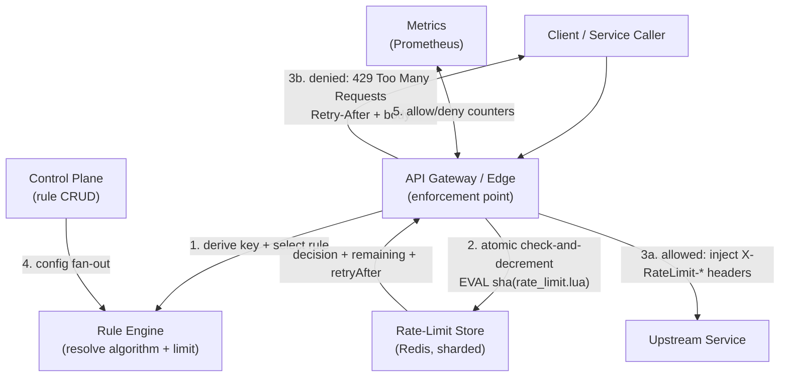

**Allowed-request flow**

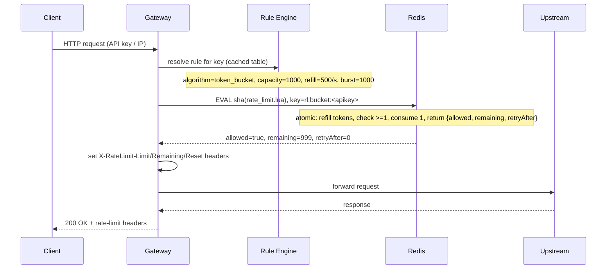

**Denied-request (429) flow**

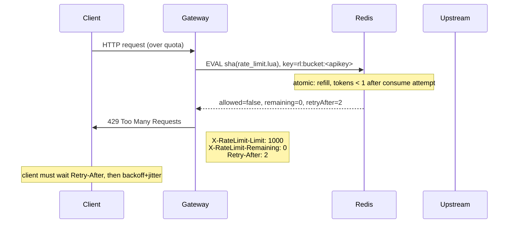

**How the pieces relate**

- The **gateway** is the only component that touches the upstream or the client on the fast path; the rule engine and Redis are its only dependencies. Keeping this path to one Redis round trip is what satisfies the <5 ms NFR.
- The **rule engine** is essentially a lookup table (likely served from local memory, refreshed by the control plane). It answers "what rule applies to this key" without a database hit - any DB/call on the fast path breaks the latency budget.
- The **store (Redis)** is the source of truth for counters. Because every gateway node consults it, the limiter is correct across instances - the whole reason a shared store exists.
- The **control plane** updates rules asynchronously; the data plane tolerates staleness of seconds, not minutes, so a fan-out that is slightly delayed is acceptable.
- **Metrics** close the loop: `rate_limit_allowed` vs `rate_limit_denied` tagged by rule and service let you see which limits are tight before they hurt users.

A key architectural decision: **where to enforce.**

- **Edge / CDN level:** cheapest place to say "no" (traffic never enters your network), ideal for DDoS and for unauthenticated/IP-based limits. Downside: the edge does not always have the authenticated principal, so key derivation is weaker.
- **Gateway / API gateway level:** the sweet spot for most APIs - you have the auth context (API key, JWT, mTLS identity), the rule table, and low-latency Redis in one host. This is the canonical placement in interviews.
- **Service level:** the last line of defense for internal service-to-service calls, and the only place where a *downstream* service can protect *itself* from a caller you do not control. It duplicates edge limits but prevents east-west storms that bypass the edge.

The recommended layering is **edge (coarse, IP/fingerprint) → gateway (authoritative, per-key) → service (defense-in-depth)** - in depth, not in conflict. Each layer enforces a different, tighter policy; a request must pass all.

**Scaling the data plane**

- **Stateless gateways.** Add gateway nodes behind an anycast/LB; they share Redis state, so any node can answer for any key.
- **Shard the Redis cluster by key hash** (`hash(key) mod N`, N from the back-of-envelope: 6-8 shards for a ~400K eval/sec fleet). Keep Lua scripts tiny so each shard sustains ~100K+ evals/sec.
- **Local burst buffer per gateway.** Cache a local token bucket so the *common* case is zero network (sub-ms); reconcile and enforce the global limit via Redis periodically. Hot keys never hit Redis.
- **Edge pre-filtering.** Let the edge shed the obvious flood so Redis only sees real, authenticated traffic.

**Failure handling**

| Failure | Detection | Response |
|---------|-----------|----------|
| Redis shard down | health check, EVAL errors | gateway fails per policy: fail-closed (deny, 503 with `Retry-After`) or fail-open-with-local-bucket (serve short grace period, then 429). Never silently permit unbounded traffic on a security-sensitive tier. |
| Hot key pinning a shard | p99 latency, shard CPU > 80% | route that key's burst through the gateway-local buffer; if it persists, split the key across sub-keys (fan-out) and aggregate. |
| Rule engine stale | config version skew metric | gateways run with last-known-good rules (bounded staleness of seconds); the control plane fan-out has its own retry. |
| Clock skew | window keys jump ahead/behind | derive window keys from the Redis/server clock (`TIME`), never client time; TTL ≥ 2× window absorbs minor skew. |
| Local cache drift | reconciliation gap | local buckets are a *hint*; the authoritative decision is always Redis, so drift only causes temporary per-node looseness, not a global over-limit. |

**Dependencies**: the data plane depends only on the rule table (local, refresh-tolerant) and Redis (latency-critical); it does **not** depend on the control plane or metrics on the fast path. This isolation is what makes a limiter failure a narrow, predictable failure rather than a cascade.

---

### Deep Dive

This section goes under the hood of the decisions that make or break a rate limiter: the exact mechanics of each algorithm, their time/space complexity, why distributed rate limiting *must* be atomic, the canonical Redis + Lua pattern, where enforcement lives, and how clients must behave on 429.

#### Algorithm walkthroughs and complexity

The five algorithms differ in three measurable dimensions: how they count, how much memory they spend per key, and how they behave under bursts. Pick from the table; the walkthroughs below justify the numbers.

##### Token Bucket

- **Walkthrough.** Maintain `tokens` (float) and `ts` (last refill). On a request: `elapsed = now - ts`; `tokens = min(capacity, tokens + elapsed * refill_rate)`; if `tokens >= cost`, `tokens -= cost` and allow; else deny. The next refill is computed lazily from `ts` - there is no background refill thread.
- **Time complexity.** O(1) - one refill computation and one comparison.
- **Space complexity.** O(1) per key - two scalars (`tokens`, `ts`), i.e. a 2-field Redis hash (~120-160 bytes/key).
- **Burstiness.** Absorbs bursts up to `capacity`; output rate is exactly `refill_rate`. This is the algorithm's selling point and its danger.
- **Accuracy.** Exact in the steady state, but the *first* request in a cold window sees a full bucket, so short bursts are always allowed by design (this is intended, not a bug).

##### Leaky Bucket

- **Walkthrough.** Maintain a queue and a drain rate. On a request: drain `min(queue.size, outflow_rate * elapsed)` items conceptually, then if `queue.size + 1 <= capacity` enqueue and allow, else deny. Output is paced at `outflow_rate` regardless of input.
- **Time complexity.** O(1) amortized - the drain is computed arithmetically, not by scanning.
- **Space complexity.** O(capacity) per key in the worst case when queued (a 100-item queue = up to 100 entries), but only O(1) if implemented as a single "last leak time" scalar rather than materializing the queue - the scalar form is what production uses.
- **Burstiness.** None by design - the drain rate is fixed, so input bursts are stretched into a smooth stream. This is why it is chosen for traffic shaping.
- **Accuracy.** Exact per the configured outflow rate; the only approximation is the queueing order when multiple requests land in the same tick.

##### Fixed Window Counter

- **Walkthrough.** `window = floor(now / window_size)`. Key = `key:window`. `INCR` it; on first hit set `TTL = 2 * window_size`. Allow iff `count <= max`. Reset is implicit: the next window is a different key.
- **Time complexity.** O(1) - `INCR` + optional `EXPIRE` (both atomic in Redis).
- **Space complexity.** O(1) per key per *active* window (one integer); at any instant you hold at most 2 windows per logical key (current + previous), so O(1) amortized.
- **Burstiness.** A burst spanning a boundary can reach ~2× `max` within a ~2×window_size interval - the classic fixed-window flaw.
- **Accuracy.** Poor at boundaries - the error is bounded but real and exploitable (a client can deliberately align bursts to the boundary).

##### Sliding Window Log

- **Walkthrough.** Store every request timestamp in a sorted set: `ZADD key now now`; `ZREMRANGEBYSCORE key 0 (now - window)`; `ZCARD key`; allow iff `count < max`.
- **Time complexity.** O(log N) per request for the `ZADD` and `ZREMRANGEBYSCORE` (where N = entries in the window, i.e. the window rate), not O(1).
- **Space complexity.** O(N) per key where N = number of requests in the window = `rate × window`. For 100 req/s over 60 s, that is 6,000 entries per key - memory grows *linearly with traffic*, the fatal flaw at scale.
- **Burstiness.** None - it is a true rolling window; the count is exact.
- **Accuracy.** Exact. This is the benchmark against which "approximate" is measured, and the reason it is only viable for low-cardinality, exact-audit use cases.

##### Sliding Window Counter

- **Walkthrough.** Hold two integer counters: `curr` (this window) and `prev` (last window). `overlap = 1 - (elapsed_in_window / window_size)`. `estimated = curr + prev * overlap`. Allow iff `estimated + 1 <= max`, then `INCR curr`.
- **Time complexity.** O(1) - two `GET`s (or one `MGET`) and one `INCR`, all on integer keys.
- **Space complexity.** O(1) per key - two integers.
- **Burstiness.** Bounded and improved over fixed window: a boundary burst is smoothed by the overlap weight, but the blend is an *estimate*, so it is not a hard cap.
- **Accuracy.** Approximate. It assumes the previous window's traffic was uniformly distributed, which is false under bursts - the error is one-sided toward allowing slightly more, bounded by the cluster size in `prev`.

**Complexity comparison (per key)**

| Algorithm | Time / request | Space / key | Exact? | Burst behavior |
|-----------|----------------|-------------|--------|----------------|
| Token bucket | O(1) | O(1) (~150 B) | yes (steady state) | absorbs up to `capacity` |
| Leaky bucket | O(1) | O(1) scalar (or O(cap) if queued) | yes | none (smooth output) |
| Fixed window | O(1) | O(1) (~60 B) | no (boundary spike ≤ 2×) | boundary spike to 2× max |
| Sliding window log | O(log N) | O(N) (N = rate × window) | yes | none |
| Sliding window counter | O(1) | O(1) (~120 B for 2 windows) | no (estimate, ≤ prev/window left) | smoothed, not eliminated |

**Why memory dominates the choice.** At 10M keys, token-bucket (~150 B) is ~1.5 GB; sliding-window-log at even 100 req/s×60 s = 12M entries could be hundreds of GB. This is the single reason you will never see the log variant on a public, high-cardinality API - it is correct but costs more than it can ever buy.

#### Race conditions without atomic Lua (and why they fail open)

The single most common correctness bug in rate limiters is **assuming that a pipeline of separate Redis commands is atomic**. It is not - a Redis pipeline is *network* pipelining (fewer round trips), not *transactional* atomicity. The check and the mutation happen at different moments, and between them a concurrent request can observe the same stale state.

Three concrete failure modes:

- **Token bucket with `GET` then `SET`.** Request A and B both `GET` `tokens=1.0`; both compute "enough tokens"; both `SET tokens=0.0`. Two requests pass against one token. The limiter is now *overlimit* by one per racing pair - a fail-open bug, and the more concurrency, the worse.
- **Fixed window with `INCR` then `EXPIRE`.** `INCR` is atomic, so the count is always correct - but the *decision* (`count <= max`) is computed by the *client* after the `INCR` returns, and the `EXPIRE` is a separate command. The window can briefly hold counts with no TTL if the expiry command is lost, leaking memory; more subtly, a client that retries on `count == max` can double-count the boundary.
- **Sliding-window log with pipelined `ZREM` + `ZCARD` + `ZADD`.** Two requests both `ZCARD` to a count below the limit on the same stale snapshot; both `ZADD`; the limit is exceeded. The log variant's memory is high *and* its correctness is broken without a script.

**The fix: one Lua script, one `EVAL`, one truth.** The check, the mutation, and the response (decision + remaining + retry-after) must be computed in a single server-side script that holds the data-type lock implicitly (Redis is single-threaded, so a script runs to completion without interruption). The canonical token-bucket Lua script and the Spring `@Service` that calls it follow below.

---

#### Distributed Rate Limiting with Redis + Lua atomicity

The rule in one sentence: **the entire read-refill-check-decrement-expire sequence must execute in a single Redis script** so no two nodes can ever observe the same pre-decrement state.

The canonical token-bucket script (readable version - production usually ships the SHA-1 via `EVALSHA`):

```lua
-- KEYS[1] = rl:b:<identity>   (the counter key)
-- ARGV[1] = capacity          (max tokens)
-- ARGV[2] = refill_rate       (tokens per second, float)
-- ARGV[3] = now               (unix seconds, float)
-- ARGV[4] = requested         (tokens to consume, default 1)
-- Returns: [allowed(0/1), remaining, retryAfterSeconds]

local key     = KEYS[1]
local cap     = tonumber(ARGV[1])
local rate    = tonumber(ARGV[2])
local now     = tonumber(ARGV[3])
local req     = tonumber(ARGV[4]) or 1

-- Read current state (atomic: nothing can interleave inside a script)
local state   = redis.call('HMGET', key, 'tokens', 'ts')
local tokens  = tonumber(state[1])
local ts      = tonumber(state[2])

-- Initialize on first hit
if tokens == nil then
  tokens = cap
  ts = now
else
  local elapsed = math.max(0, now - ts)
  tokens = math.min(cap, tokens + elapsed * rate)
  ts = now
end

-- Decide
local allowed = 0
local retry_after = 0
if tokens >= req then
  tokens = tokens - req
  allowed = 1
else
  -- next token available in (deficit / rate) seconds
  retry_after = math.ceil((req - tokens) / rate)
  if retry_after < 1 then retry_after = 1 end
end

-- Persist atomically
redis.call('HMSET', key, 'tokens', tokens, 'ts', ts)
redis.call('EXPIRE', key, 3600)   -- bound key-space growth; >= 2x window

return {tostring(allowed), tostring(math.floor(tokens)), tostring(retry_after)}
```

**A minimal sliding-window-counter variant** that avoids storing a log entirely:

```lua
-- KEYS[1] = rl:c:<key>:<currentWindow>   (integer string)
-- KEYS[2] = rl:c:<key>:<prevWindow>      (integer string, may be absent)
-- ARGV[1] = max_requests
-- ARGV[2] = overlap_fraction  (1 - elapsed_in_window/window)
local curr = tonumber(redis.call('GET', KEYS[1]) or '0')
local prev = tonumber(redis.call('GET', KEYS[2]) or '0')
local estimated = curr + prev * tonumber(ARGV[2])
if estimated < tonumber(ARGV[1]) then
  local new = redis.call('INCR', KEYS[1])
  redis.call('EXPIRE', KEYS[1], 7200)
  redis.call('EXPIRE', KEYS[2], 7200)
  local remaining = tonumber(ARGV[1]) - new
  if remaining < 0 then remaining = 0 end
  return {1, tostring(remaining), 0}
else
  return {0, '0', tostring(math.ceil((estimated - tonumber(ARGV[1])) / tonumber(ARGV[2])))}
end
```

Spring `@Service` that calls the token-bucket script via `DefaultRedisScript` (constructor injection, `@Value` config, a bean - not a utility class):

```java
package com.example.ratelimiter;

import org.springframework.beans.factory.annotation.Value;
import org.springframework.dao.DataAccessException;
import org.springframework.data.redis.core.RedisTemplate;
import org.springframework.data.redis.core.StringRedisTemplate;
import org.springframework.data.redis.core.script.DefaultRedisScript;
import org.springframework.data.redis.serializer.RedisSerializer;
import org.springframework.stereotype.Service;

import java.time.Duration;
import java.util.Collections;
import java.util.List;

@Service
public class RedisTokenBucketRateLimiter {

    // The script is loaded once and reused via EVALSHA by the template.
    static final String TOKEN_BUCKET_LUA = """
        local key=KEYS[1] local cap=tonumber(ARGV[1]) local rate=tonumber(ARGV[2])
        local now=tonumber(ARGV[3]) local req=tonumber(ARGV[4]) or 1
        local b=redis.call('HMGET',key,'tokens','ts')
        local tokens=tonumber(b[1]) local ts=tonumber(b[2])
        if tokens==nil then tokens=cap ts=now else
          local d=math.max(0,now-ts); tokens=math.min(cap,tokens+d*rate); ts=now end
        local allowed=0 local retry=0
        if tokens>=req then tokens=tokens-req allowed=1
        else retry=math.ceil((req-tokens)/rate); if retry<1 then retry=1 end end
        redis.call('HMSET',key,'tokens',tokens,'ts',ts)
        redis.call('EXPIRE',key,3600)
        return {tostring(allowed),tostring(math.floor(tokens)),tostring(retry)}
        """;

    private final StringRedisTemplate redis;
    private final DefaultRedisScript<List> script;
    private final long capacity;
    private final double refillRate;

    public RedisTokenBucketRateLimiter(
            StringRedisTemplate redis,
            @Value("${rate-limit.token-bucket.capacity:1000}") long capacity,
            @Value("${rate-limit.token-bucket.refill-rate:500}") double refillRate) {
        this.redis = redis;
        this.capacity = capacity;
        this.refillRate = refillRate;
        this.script = new DefaultRedisScript<>(TOKEN_BUCKET_LUA, List.class);
    }

    /**
     * Atomic check-and-consume for one key. Returns allowed + remaining + retry-after.
     * `requested` lets a caller consume >1 token (e.g. a batch request that should cost 10).
     */
    public Decision tryAcquire(String key, long requested) {
        double now = System.currentTimeMillis() / 1000.0;
        List<String> res = redis.execute(script,
                Collections.singletonList("rl:b:" + key),
                String.valueOf(capacity),
                String.valueOf(refillRate),
                String.valueOf(now),
                String.valueOf(requested));
        boolean allowed = "1".equals(res.get(0));
        long remaining = Long.parseLong(res.get(1));
        long retryAfter = Long.parseLong(res.get(2));
        return new Decision(allowed, remaining, retryAfter);
    }

    public record Decision(boolean allowed, long remaining, long retryAfterSeconds) {}
}
```

**Walkthrough of the wiring.** `StringRedisTemplate` uses the `StringRedisSerializer` on both sides, so the Lua script's `return {...}` arrives as a `List<String>` and the three positional fields map cleanly to `allowed`, `remaining`, `retryAfter`. The capacity and refill-rate live in `@Value` so operators can tweak a rule's behavior via configuration without a code deploy. The whole decision is one `EVALSHA` round trip - if the script was not loaded yet, Redis auto-fetches it, so there is no pre-loading ceremony. Crucially, `KEYS[1]` is the *only* key touched, so the script respects Redis Cluster key-slot rules and remains safe to run against a sharded store.

> **Note on `DefaultRedisScript` and `EVALSHA`.** Spring's `DefaultRedisScript` sends the literal script with `EVAL` on the first call; Redis caches it by SHA-1 and subsequent calls use `EVALSHA`. For a rate limiter this means exactly one round trip per request, with no `SCRIPT LOAD` handshake, which is what keeps the <5 ms budget achievable.

---

#### Enforcement points (edge / gateway / service)

A complete deployment layers all three; each enforces a *different* policy so they compose rather than conflict.

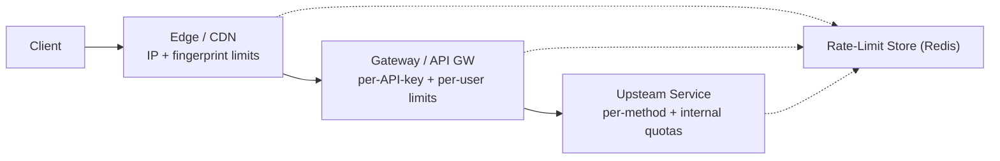

- **Edge / CDN.** Statelessest, cheapest-to-say-no. Enforces coarse IP/fingerprint rules and DDoS guards *before* traffic enters your network. Key derivation is weak here (IP only, NATed), so limits are loose; the edge's job is to absorb the flood so the gateway never sees it.
- **Gateway / API gateway.** The authoritative layer. Here the principal is authenticated (API key, JWT, mTLS), so per-key limits are precise. This is where the Lua script runs and where `X-RateLimit-*` headers are authored. One Redis round trip lives here.
- **Service (last line of defense).** Protects a service that is *also* called by internal consumers you do not fully control (a nightly job owned by another team). Coarser, higher limits; defense-in-depth so an internal misbehaving caller cannot bypass the edge.

Decision rule: **perimeter = coarse + cheap; core = precise + authoritative; service = defense-in-depth.** Put the expensive atomic script at the gateway, and let the edge do cheap IP math.

---

#### Client-Side Strategies

The limiter is only as good as the client's discipline on 429. A limiter that 429s and a client that immediately retries *in lockstep* creates a thundering herd that looks exactly like an attack.

**Honor `Retry-After` exactly, and only then back off.**

The correct client retry loop:

```text
attempt = 0
loop:
  resp = send_request()
  if resp.status != 429: return resp
  base = max(resp.retry_after, backoff_base * (2 ** attempt))   # Retry-After is the FLOOR
  delay = random(0, base)                                        # FULL JITTER
  sleep(min(delay, max_cap))                                     # cap the worst case
  attempt += 1
```

- **`Retry-After` is a floor, not a suggestion.** A server saying "retry in 2s" means *at least* 2s; combining it with the backoff exponential means a client never retries faster than the server asked.
- **Exponential backoff with full jitter.** `random(0, base * 2^attempt)`. Full jitter (randomizing between 0 and the full delay) is preferred over "equal jitter" for its simplicity and its proven de-synchronization; it guarantees the retry *spread* grows exponentially while the mean delay stays at half the ceiling.
- **Idempotency on retry.** Never auto-retry a non-idempotent request (POST, PATCH, DELETE without an idempotency key) on a 429 without user opt-in - the original may have succeeded and you cannot know. Read requests (GET, HEAD) are safe to retry.
- **Circuit-break on sustained 429.** If the 429 rate crosses a threshold (e.g. >20% of requests for 30s), open a client-side circuit and stop trying outright, surfacing the failure fast. Retrying into a persistent 429 is wasted resources for both sides.
- **Queue at the caller, don't stampede at the server.** For batch jobs, queue the work locally and drain it *through* the retry loop (respecting the limit), rather than fanning out and all retrying at once.

**Why this matters in interviews:** most candidates describe "exponential backoff" and stop; the strong answer names *jitter*, treats `Retry-After` as a floor, and refuses to auto-retry non-idempotent calls. That combination is what actually prevents a retry storm.

---

### Replication Strategies

**What it means**

Replication Strategies determine how data and state are copied across multiple nodes in Rate Limiter. The choice of strategy determines the trade-off between consistency, availability, and latency.

**Why it matters**

Rate Limiter must replicate data to prevent loss and serve reads from multiple nodes. The replication strategy determines whether the system favors consistency (strong reads) or availability (always writable), and how it handles cross-node failure.

**How it works**

**Leader-based (single-leader)**: A single primary node accepts all writes; followers replicate changes asynchronously or semi-synchronously. Reads can be served from any replica. This strategy favors strong consistency for writes but creates a write bottleneck at the leader.

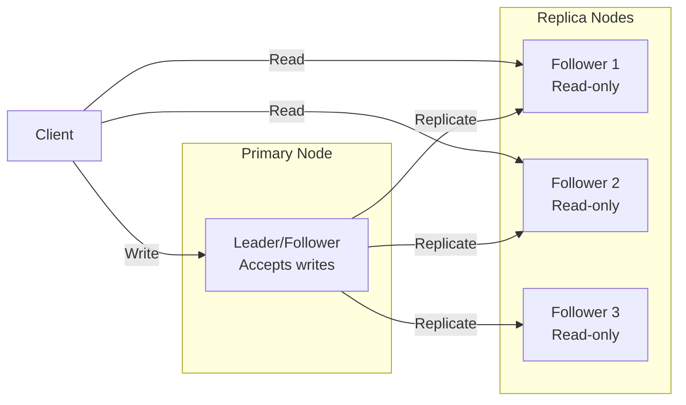

*Leader-based replication: a single primary node accepts all writes and replicates them to read-only followers. Clients can read from any replica for scaled read throughput, but all writes go through the leader.*

**Multi-leader (multi-master)**: Multiple nodes accept writes and exchange updates with each other. This enables low-latency writes in different regions but requires conflict resolution (last-write-wins, merge functions, or CRDTs).

**Leaderless (quorum-based)**: Any node can accept writes; a quorum of nodes must agree. Read and write quorums are configured so that at least one node overlaps between them (R + W > N). This maximizes availability and write scalability.

**Trade-offs for Rate Limiter**:

| Strategy | Use Case | Pros | Cons |
|---|---|---|---|
| Leader-based | API keys, client credentials | Strong consistency, simple | Write bottleneck, leader failure risk |
| Multi-leader | public quotas, rate limit docs | Low-latency global writes | Conflict resolution, complex |
| Leaderless | Caching, counters | High availability, no bottleneck | Eventual consistency, read repair overhead |

**Real-world implementations**

- **Redis**: Leader-follower replication with asynchronous replication; Sentinel handles failover.
- **Apache Kafka**: Leader-based partition replication with ISR (in-sync replica) — writes go to the leader, followers replicate.
- **Cassandra**: Tunable consistency with leaderless quorum (R + W > N).
- **DynamoDB Global Tables**: Multi-master active-active across regions.

### Failure Detection and Membership

**What it means**

Failure Detection and Membership is the mechanism by which Rate Limiter determines which nodes are alive and part of the cluster. Membership is the list of known nodes; failure detection is the process of updating that list when nodes fail or recover.

**Why it matters**

Rate Limiter must route requests only to healthy nodes and trigger failover when a node goes down. False positives (healthy nodes marked as dead) cause unnecessary failovers and data loss. False negatives (dead nodes not detected) cause failed requests and degraded performance.

**How it works**

**Heartbeat-based detection**: Each node sends a heartbeat (ping) to a subset of peers at regular intervals. If a node misses N consecutive heartbeats, it is marked as suspect. The gossip protocol distributes membership information: each node exchanges its view of the cluster with a random peer, and the information propagates gossip-style.

```mermaid
sequenceDiagram
    participant A as Node A
    participant B as Node B
    participant C as Node C

    loop Every 1s
        A->>B: Heartbeat (ping)
        B-->>A: Heartbeat (ack)
    end
    B->>C: Gossip: A is alive
    C->>A: Gossip: B is alive
    Note over A,B,C: View converges in O(log N) rounds
```

*Gossip-based failure detection: each node periodically pings a random subset of peers and gossips its view of the cluster. The membership list converges in O(log N) rounds.*

**Phi Accrual Failure Detector**: Instead of a fixed timeout, the detector measures the time between consecutive heartbeats and computes a phi (φ) value — the probability that the node is dead given the observed heartbeat pattern. φ is compared against a threshold (typically 1–8); higher thresholds reduce false positives but increase detection latency.

**SWIM (Scalable Weakly-consistent Infection-style Process group Membership Protocol)**: Nodes ping a random subset of cluster members. If a ping fails, the node is marked "suspect" and the failure is "infected" (gossiped) to other nodes. This is O(log N) per failure detection cycle and scales to large clusters.

**Trade-offs**:

| Approach | Strengths | Weaknesses |
|---|---|---|
| Heartbeat (timeout-based) | Simple, deterministic | False positives under load |
| Phi Accrual | Adaptive threshold | Needs historical data |
| SWIM | Scales to 1000s of nodes | Eventual consistency |

**Real-world implementations**

- **AWS Route 53 Health Checks**: Uses TCP/HTTP health checks with configurable thresholds to remove unhealthy instances from DNS rotation.
- **Kubernetes**: Uses the kubelet heartbeat (every 10s) to determine node liveness; nodes missing 3 consecutive heartbeats are marked NotReady.
- **Consul**: Uses SWIM protocol for membership and failure detection; supports both LAN and WAN gossip.
- **Akka Cluster**: Uses Phi Accrual failure detector with configurable φ thresholds.

### High Availability and Scalability

**What it means**

High Availability and Scalability determines how Rate Limiter continues operating when nodes or entire zones fail, and how capacity is added as demand grows. HA is about minimizing downtime; scalability is about maintaining performance as load increases.

**Why it matters**

Rate Limiter must stay operational even when individual nodes, availability zones, or entire regions fail. At the same time, it must scale horizontally to handle traffic spikes without degrading latency. The two are intertwined: the replication strategy, failure detection, and load balancing all contribute to both HA and scalability.

**How it works**

**Availability zones (AZs)**: Nodes are distributed across multiple AZs within a region. Each AZ is an independent failure domain (power, networking, physical security). A load balancer distributes requests across AZs; if one AZ fails, traffic is routed to the remaining AZs with no data loss (assuming replication is in place).

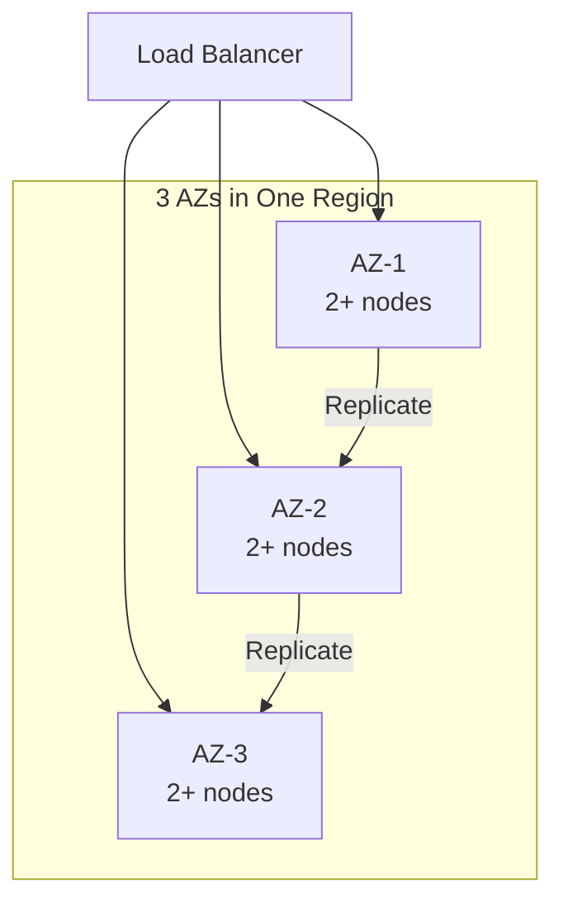

*Multi-AZ deployment: a load balancer distributes traffic across three availability zones. Each AZ has multiple nodes. Data is replicated across AZs so that losing one AZ does not cause data loss or service interruption.*

**Load balancing**: A load balancer distributes incoming requests across healthy nodes. Algorithms include round-robin, least connections, and weighted routing. Health checks ensure traffic only goes to healthy nodes. For Rate Limiter, the load balancer also considers **Client**
  Purpose: consume the API while respecting server authority on rate  when routing.

**Auto-scaling**: The system automatically adds or removes nodes based on metrics (CPU, memory, request rate). Scale-out policies add nodes when load exceeds a threshold; scale-in policies remove nodes during low load. For stateful services like Rate Limiter, scale-out involves rebalancing partitions (moving data and connections to the new node).

**Failover and recovery**: When a node fails, the load balancer detects it (via health checks or failure detection) and stops sending traffic. A new node is provisioned (or a standby is promoted) and begins serving. For Rate Limiter, failover must preserve API keys, client credentials data — this is achieved through replication with a quorum of healthy nodes.

**Scalability patterns**:

1. **Horizontal partitioning (sharding)**: Split data by a partition key (e.g., user_id, session_id) and distribute partitions across nodes. New nodes take ownership of additional partitions.

2. **Consistent hashing**: Minimize data movement on scale-out — only 1/N of the data moves to the new node. Nodes and partitions are placed on a ring; a request for key X is routed to the next node clockwise from hash(X).

3. **Connection draining**: When scaling in, existing connections are allowed to complete before the node is shut down. For Rate Limiter, this means draining active 1. sessions gracefully.

**Real-world implementations**

- **Netflix OSS (Eureka + Zuul + Ribbon)**: Service discovery with Eureka, edge routing with Zuul, and client-side load balancing with Ribbon. Scales to thousands of instances.
- **Kubernetes HPA + VPA**: Horizontal Pod Autoscaler scales pods based on CPU/memory; Vertical Pod Autoscaler adjusts resource requests based on historical usage.
- **AWS ALB + Auto Scaling Groups**: Application Load Balancer with auto-scaling groups across AZs; health checks replace unhealthy instances automatically.

### Performance and Optimization

**What it means**

Performance and Optimization covers the techniques Rate Limiter uses to achieve low latency, high throughput, and efficient resource usage. This section examines the key performance metrics, bottlenecks, and optimizations specific to the system.

**Why it matters**

Rate Limiter faces competing pressures: users demand low latency, the system must handle high throughput, and infrastructure costs must be controlled. The optimizations applied at the data, compute, and network layers determine whether the system meets its SLA.

**How it works**

**Latency layers**: Latency in Rate Limiter comes from three layers:
1. **Network**: Round-trip time from client to the nearest edge node / load balancer.
2. **Application**: Request processing time on the server (CPU, I/O, lock contention).
3. **Data**: Time to read/write from storage (cache hit vs. database query).

The 99th-percentile latency is the key metric for user-facing systems — it determines the worst-case experience.

**Caching strategies**: Rate Limiter uses multiple cache layers:
- **Edge cache**: Static assets (images, CSS, JS) served from a CDN at the edge. For Rate Limiter, this caches public quotas, rate limit docs that doesn't change frequently.
- **Application cache**: In-memory cache (e.g., Redis, Memcached) for frequently accessed data. Cache-aside pattern: application checks cache first, falls back to database on miss.
- **Local cache**: In-process cache (e.g., Caffeine, Guava) for data accessed within a single request. Avoids network round-trips.

**Batching and pipelining**: Rate Limiter batches small operations (e.g., writes, log flushes) to amortize per-operation overhead. Pipelining allows multiple requests to be in flight simultaneously.

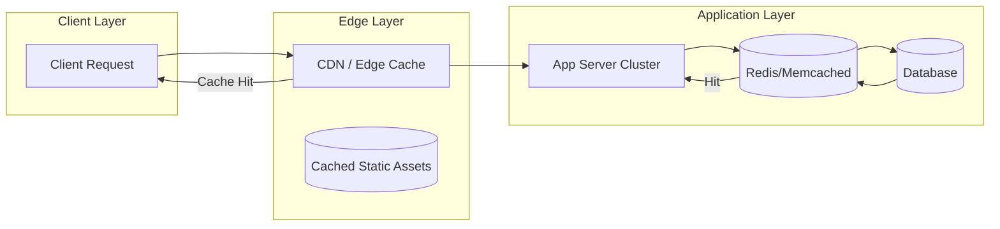

*Caching hierarchy: clients first hit the edge CDN/cache; if the response is cached, it is returned immediately. Otherwise, the request reaches the application, which checks its in-memory/application cache (e.g., Redis) before falling back to the database. This minimizes latency from each layer.*

**Connection pooling**: Rate Limiter maintains a pool of database connections to avoid the TCP handshake overhead on every request. Pool size is tuned to match the database's capacity.

**Compression**: Responses are compressed (gzip, zstd) for clients that support it. At the network layer, gRPC uses HPACK header compression.

**Indexing**: Database tables are indexed on frequently queried fields. For Rate Limiter, indexes cover **API Gateway / Reverse Proxy (enforcement point)**
  Purpose: decide allow/deny and **Rate-Limit Store (Redis / key-value)**
  Purpose: the single source of truth f for fast lookups.

**Asynchronous processing**: Non-critical background work (e.g., analytics, cleanup, notifications) is offloaded to message queues and processed asynchronously, keeping the request path fast.

**Resource isolation**: CPU and memory are allocated per service (containers with cgroup limits). This prevents a single misbehaving service from degrading the entire system.

**Metrics for Rate Limiter**:

| Metric | Target | How to Measure |
|---|---|---|
| P99 latency | < 1s | Load test with realistic traffic |
| Throughput | 1K RPS | Request rate under peak load |
| Error rate | < 0.1% | 5xx / total requests |
| Cache hit ratio | > 90% | cache_hits / (cache_hits + misses) |
| Resource utilization | < 80% CPU, < 85% memory | Container metrics |

**Real-world implementations**

- **Google's HTTP Load Balancer**: Global load balancing with edge PoPs; routes users to the nearest healthy backend.
- **Cloudflare**: Edge cache with Argo Smart Routing that dynamically routes traffic to avoid congestion.
- **Redis**: Used as an application cache with configurable eviction policies (LRU, LFU, TTL).

### Encryption and Key Management

**What it means**

Encryption and Key Management in Rate Limiter ensures that data is protected both at rest (stored on disk) and in transit (moving between services). Key management governs how encryption keys are generated, stored, rotated, and accessed — without proper key management, encryption provides a false sense of security.

**Why it matters**

Rate Limiter handles API keys, client credentials that must be encrypted both at rest and in transit. Scaling Rate Limiter to handle increasing load while maintaining data consistency, low latency, and fault tolerance requires careful key management: keys must be rotated regularly, scoped to prevent cross-contamination, and audited for compliance. A single key compromise could expose sensitive data.

**How it works**

**At-rest encryption**: Data stored in **Client**
  Purpose: consume the API while respecting server authority on rate , **API Gateway / Reverse Proxy (enforcement point)**
  Purpose: decide allow/deny and databases is encrypted using AES-256-GCM. The Data Encryption Key (DEK) is generated per data partition and encrypted with a Key Encryption Key (KEK) managed by a KMS (AWS KMS, GCP KMS, HashiCorp Vault). Keys are regionally scoped — only data belonging to a region can be decrypted by that region's KEK.

**In-transit encryption**: All inter-service communication uses TLS 1.3 or mTLS for service-to-service auth. Cross-region communication of public quotas, rate limit docs uses TLS + optional application-level encryption. API keys, client credentials is NEVER transmitted in plaintext or across region boundaries.

**Key hierarchy**:
```
Master Key (HSM-backed, KMS-managed)
  └─ KEK (per region, per service)
     └─ DEK (per data partition, rotated every 90 days)
        └─ Data (encrypted with DEK)
```

**Key rotation**: KEKs rotate annually (automatic via KMS); DEKs rotate per object or per 90 days. Applications handle key version headers transparently — a DEK version is stored alongside the encrypted data.

**Cross-region key sharing**: For non-restricted data (public quotas, rate limit docs), a shared key is imported into each region's KMS. Restricted data NEVER uses cross-region keys — each region's KMS holds only that region's keys.

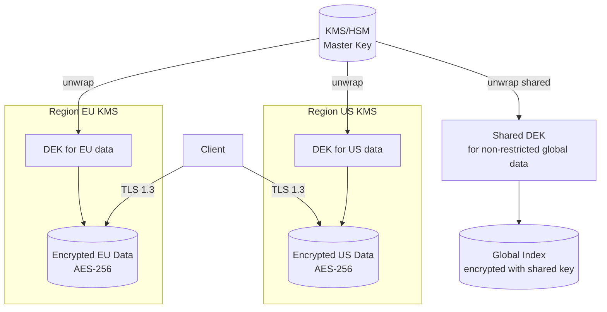

*Encryption key hierarchy: master keys are managed by an HSM-backed KMS and never leave the KMS. Each region has its own KEK. Data encryption keys (DEKs) are generated per partition and encrypted with the regional KEK. Only non-restricted global data uses a shared cross-region key. All client traffic uses TLS 1.3.*

**Java/Spring Boot Implementation**

```java
@Service
@RequiredArgsConstructor
public class DataEncryptionService {

    private final AWSKMS kms;
    @Value("${app.region}")
    private String region;
    @Value("${app.encryption.dek-ttl-minutes:1440}")
    private int dekTtlMinutes;

    private final Map<String, SecretKey> dekCache = new ConcurrentHashMap<>();

    public EncryptedData encrypt(String plaintext, String partitionId) {
        SecretKey dek = getOrCreateDek(partitionId);
        byte[] ciphertext = CryptoUtils.encrypt(plaintext.getBytes(StandardCharsets.UTF_8), dek);
        String dekCiphertext = kms.encrypt(EncryptRequest.builder()
            .keyId("arn:aws:kms:" + region + ":master-key")
            .plaintext(SdkBytes.fromByteArray(dek.getEncoded()))
            .build()).ciphertextBlob().asByteArray();
        return new EncryptedData(ciphertext, dekCiphertext, Instant.now());
    }

    private SecretKey getOrCreateDek(String partitionId) {
        return dekCache.computeIfAbsent(partitionId, id -> {
            try {
                return KeyGenerator.getInstance("AES").generateKey();
            } catch (NoSuchAlgorithmException e) {
                throw new IllegalStateException("Cannot generate DEK", e);
            }
        });
    }
}
```

*Spring Boot encryption service: DEKs are cached per-partition with TTL. Each DEK is encrypted via AWS KMS using a regional master key. The encrypted DEK (ciphertext) is stored alongside the data — only the KMS for that region can decrypt it.*

**Real-world implementations**

- **AWS KMS**: Managed HSM-backed key service; supports automatic key rotation and custom key stores.
- **HashiCorp Vault**: Open-source key management; supports transit encryption (encrypt/decrypt without storing keys).
- **Google Cloud KMS**: Hardware-backed key management with IAM-based access control.

### Authentication and Authorization

**What it means**

Authentication and Authorization (AuthN/AuthZ) in Rate Limiter control who can access the system and what they can do. Authentication verifies identity; authorization determines permissions. In a distributed system like Rate Limiter, auth must work across multiple nodes while respecting data boundaries — a user authenticated in one region should not have their session data or tokens replicated to regions where it is not permitted.

**Why it matters**

Rate Limiter must verify identity at the edge and enforce authorization at every service boundary. API keys, client credentials must be protected — only users with appropriate roles should access it. At the same time, public quotas, rate limit docs data should be accessible to a wider audience with minimal friction.

**How it works**

**Authentication (who are you?)**:
- **JWT tokens**: Users authenticate through their home region's identity provider. The region returns a JWT (JSON Web Token) signed by a regional signing key. Tokens include claims like `iss` (issuer region), `sub` (subject/user ID), `home_region`, `roles`, and `exp` (expiry). Tokens are scoped per region — a token issued by region A cannot access restricted data in region B.
- **mTLS for service-to-service**: Internal services authenticate each other using mutual TLS certificates issued by a per-region Certificate Authority (CA). No shared secrets cross region boundaries.
- **Session management**: Sessions are stored regionally (Redis) and never replicated cross-region for restricted data. Session IDs are opaque UUIDs; the session store maps session ID → user context.

**Authorization (what can you do?)**:
- **RBAC (Role-Based Access Control)**: Users are assigned roles per region. Common roles: `region_admin` (full access to region data), `auditor` (read-only audit), `viewer` (read public data only). Roles are stored in the regional database and cached locally for sub-1ms lookups.
- **ABAC (Attribute-Based Access Control)**: Fine-grained permissions based on attributes (e.g., `home_region == request_region AND role == admin`). This allows expressing complex policies like "users can only access restricted data in their home region."
- **Resource-level authorization**: Each request is checked against an ACL (Access Control List) that specifies which roles can access which resources. For Rate Limiter, restricted resources require the `admin` role + matching region.

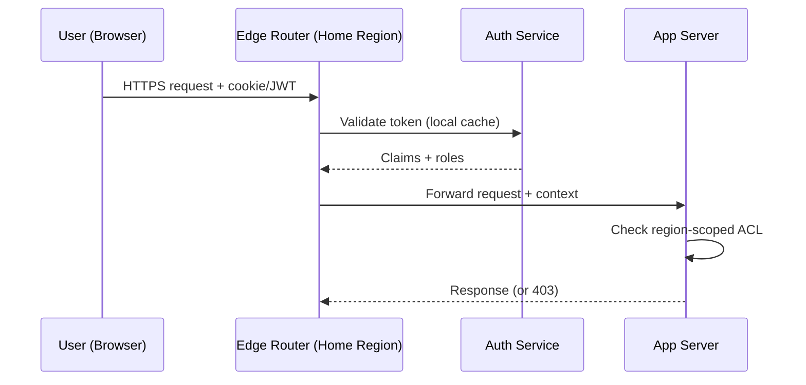

*Authentication flow: the user's token is validated by the regional auth service (claims cached locally). The edge router forwards the request with the security context. Each app server checks the region-scoped ACL before accessing restricted data.*

**Java/Spring Boot Implementation**

```java
@Service
@RequiredArgsConstructor
public class AuthorizationService {

    private final UserTokenRepository tokenRepository;
    @Value("${app.region}")
    private String currentRegion;

    public boolean canAccessResource(String userId, String resourceRegion,
                                     String action, JWTClaims claims) {
        String userHomeRegion = claims.getStringClaim("home_region");
        List<String> roles = claims.getStringListClaim("roles");

        if (!roles.contains(action)) {
            return false;
        }

        if (resourceRegion.equals(userHomeRegion)) {
            return true;
        }

        if (resourceRegion.equals("global")) {
            return roles.contains("global_reader");
        }

        return false;
    }
}

@RestController
@RequiredArgsConstructor
@RequestMapping("/api/v1")
public class RegionController {
    private final AuthorizationService authService;

    @GetMapping("/data/{region}/profile")
    public ResponseEntity<?> getProfile(
            @PathVariable String region,
            @RequestHeader("Authorization") String token) {
        JWTClaims claims = JwtUtils.parseAndValidate(token, currentRegion);

        if (!authService.canAccessResource(
                claims.getStringClaim("sub"), region, "read", claims)) {
            return ResponseEntity.status(HttpStatus.FORBIDDEN).build();
        }

        return ResponseEntity.ok(profileService.getByRegion(region));
    }
}
```

*Spring Boot authorization service: checks both the user's role and whether the requested resource violates region boundaries. The `canAccessResource` method returns false if a user from region EU tries to access restricted data in region US.*

**Real-world implementations**

- **Auth0**: JWT-based authentication with regional endpoints; supports custom rules for ABAC.
- **Okta**: Multi-region identity management with adaptive MFA and ThreatInsight for anomaly detection.
- **AWS Cognito**: Regional user pools with IAM integration; tokens are region-scoped by default.

### Security Threats and Mitigations

**What it means**

Security Threats and Mitigations catalog the attack surface of Rate Limiter, the most likely threats, and the corresponding defenses. Every distributed system has unique threat vectors — Rate Limiter is no exception.

**Why it matters**

Rate Limiter handles API keys, client credentials that attackers might target. Scaling Rate Limiter to handle increasing load while maintaining data consistency, low latency, and fault tolerance expands the attack surface: more nodes, more network paths, more failure modes. Without proper threat modeling, a single vulnerability could expose sensitive data across the entire system.

**Threat model**:

| Threat | Likelihood | Impact | Mitigation |
|---|---|---|---|
| Data exfiltration (cross-region) | High | Critical | Region-scoped keys, no cross-region replication of restricted data |
| Man-in-the-middle (inter-service) | Medium | High | mTLS between all services |
| Replay attacks | Medium | High | Token expiry + nonce |
| DDoS at the edge | High | High | Rate limiting + edge filtering (Cloudflare, AWS Shield) |
| PII leakage in logs | High | High | PII redaction + field-level access control |
| Session hijacking | Medium | Medium | Short-lived tokens + IP binding |
| Privilege escalation | Low | Critical | Least-privilege RBAC + audit logs |
| Cache poisoning | Low | Medium | Cache invalidation on write + signed cache keys |

**How it works**

**Data exfiltration prevention**: Rate Limiter enforces data residency by design — API keys, client credentials is never replicated cross-region. The replication layer checks a data classification label before allowing cross-region copy. A database-level policy (e.g., PostgreSQL RLS) also blocks cross-region queries for restricted partitions.

**mTLS enforcement**: All service-to-service communication uses mutual TLS. Certificates are issued by a per-region CA and rotated every 30 days. Services must present a valid certificate to communicate — no plaintext connections are allowed.

**PII redaction**: Application logs are scanned for PII patterns (email, phone, credit card) using an automated redaction layer (e.g., AWS Macie, Google DLP). public quotas, rate limit docs is logged freely; restricted fields are masked or dropped before logging.

```mermaid
graph TD
    subgraph "Threat Surface"
        Client[Client]
        Edge[Edge Router / WAF]
        App[App Server]
        DB[(Database)]
        Cache[(Cache)]
        Logs[Log Store]
    end

    Client -->|HTTPS| Edge
    Edge -->|mTLS| App
    App -->|mTLS| DB
    App -->|Read| Cache
    App -->|Write| DB
    App -->|Log| Logs

    subgraph "Mitigations"
        WAF[AWS WAF /<br/>Cloudflare]
        DLP[PII Redaction<br/>(Macie/DLP)]
        FIM[File Integrity<br/>Monitoring]
    end

    Edge -.-> WAF
    Logs -.-> DLP
    DB -.-> FIM
```

*Threat mitigation diagram: the WAF at the edge blocks DDoS and injection attacks. mTLS protects all service-to-service communication. PII redaction scans logs before storage. File integrity monitoring alerts on database tampering.*

**Audit trail**: All security-relevant events (auth, data access, config changes) are written to an append-only audit log with cryptographic integrity (HMAC per entry). The log covers API keys, client credentials access — who accessed what, when, and from where.

**Real-world implementations**

- **Cloudflare**: Zero-trust model (All Connections to All Networks) with mTLS everywhere; uses GeoIP blocking and rate limiting for DDoS mitigation.
- **Google BeyondCorp**: Zero-trust network security model; all access is authenticated and authorized at the request level.

### Observability and Logging

**What it means**

Observability and Logging in Rate Limiter provide visibility into system behavior through three pillars: **metrics** (aggregates and counters), **logs** (structured event records), and **traces** (distributed request timelines). Together, these signals allow operators to debug issues, detect anomalies, and verify SLA compliance.

**Why it matters**

Distributed systems like Rate Limiter are inherently opaque — failures can cascade across services in unexpected ways. Without good observability, a single slow dependency can cause widespread timeouts that are nearly impossible to diagnose. Scaling Rate Limiter to handle increasing load while maintaining data consistency, low latency, and fault tolerance makes observability even more critical: operators need to see cross-region latency, regional failures, and data-residency violations.

**How it works**

**Metrics**: Rate Limiter instruments every service with Prometheus-style metrics:
- **Request rate, error rate, duration (the "RED" metrics)**: Tracks per-endpoint HTTP latency and error counts.
- **System metrics**: CPU, memory, disk I/O, network throughput per node.
- **Business metrics**: For Rate Limiter, this includes metrics like "**API Gateway / Reverse Proxy (enforcement point)**
  Purpose: decide allow/deny fill rate" and "reservation conflict rate".

Metrics are aggregated in a time-series database (Prometheus, VictoriaMetrics) and visualized in Grafana dashboards with alerts via PagerDuty.

**Logs**: Rate Limiter uses structured logging (JSON format) with standardized fields:
- `timestamp`: ISO 8601 UTC
- `level`: DEBUG, INFO, WARN, ERROR
- `service`: originating service name
- `trace_id`: distributed trace identifier (for correlation)
- `span_id`: current operation span
- `region`: the region that processed the request
- `data_class`: RESTRICTED or NON_RESTRICTED

API keys, client credentials access is logged with full context (user, action, resource). public quotas, rate limit docs logs are aggregated and may have reduced retention.

**Distributed tracing**: Every request is assigned a trace ID at the edge. The trace propagates through all downstream services via HTTP headers. A tracing backend (Jaeger, Tempo, Zipkin) reconstructs the full request timeline, showing latency at each hop. For Rate Limiter, traces include region boundaries — a cross-region call is annotated as such.

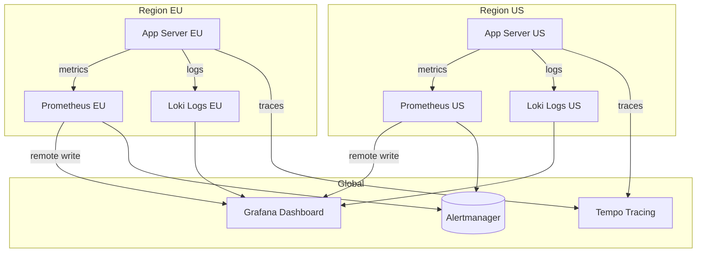

*Observability architecture: each region runs its own Prometheus (metrics) and Loki (logs) instances. A global Grafana instance queries all regional backends. Traces are collected centrally in Tempo. Alerts fire from each region's Prometheus to Alertmanager.*

**Alerting**: Rate Limiter defines SLO-based alerts:
- **Latency**: P99 > 1s for 5 minutes → page.
- **Error rate**: > 1% for 10 minutes → page.
- **Availability**: < 99.5% for 15 minutes → page.
- **Data residency violation**: any restricted data detected outside its region → critical page.

**Java/Spring Boot Implementation**

```java
@Component
@RequiredArgsConstructor
@Slf4j
public class ObservabilityContext {

    @Value("${app.region}")
    private String region;

    public void logAccess(String userId, String resource, String action,
                          boolean restricted) {
        log.info("access_event userId={} resource={} action={} region={} data_class={}",
            userId, resource, action, region, restricted ? "RESTRICTED" : "NON_RESTRICTED");
    }
}

@RestController
@RequiredArgsConstructor
@Slf4j
public class ApiController {
    private final ObservabilityContext obs;
    private final UserService userService;

    @GetMapping("/api/v1/profile")
    public ResponseEntity<ProfileResponse> getProfile(
            @AuthenticationPrincipal UserDetails user) {
        String traceId = MDC.get("traceId");
        long start = System.nanoTime();

        try {
            ProfileResponse response = userService.getProfile(user.getId());
            obs.logAccess(user.getId(), "profile", "read", true);

            return ResponseEntity.ok(response);
        } finally {
            long durationMs = (System.nanoTime() - start) / 1_000_000;
            log.info("profile_read traceId={} latencyMs={} region={}",
                traceId, durationMs, obs.region);
        }
    }
}
```

*Spring Boot observability: the `ObservabilityContext` logs structured access events with data classification. The controller records latency and trace ID for every request, enabling SLO-based alerting.*

**Real-world implementations**

- **Netflix OSS (Atlas + Zipkin + Servo)**: Metrics via Atlas, traces via Zipkin, instrumented via Servo. Scales to over 700 billion requests/day.
- **Google SRE Workbook**: Comprehensive observability with SLI/SLO/SLI definition; uses Borgmon for metrics and Dapper for tracing.
- **AWS Observability**: CloudWatch for metrics, X-Ray for tracing, CloudWatch Logs for structured logs.

### Real-World Implementations

**Rate Limiter in production**

- **Rate Limiter platforms**: widely used rate limiter platform

**Key takeaways**

- Scalability patterns proven in production at scale
- Common pitfalls and how to avoid them
- Integration with existing infrastructure and monitoring

### Java and Spring Boot Implementation Guide

Spring Boot 3.x ships the rate-limiting concern as a *bean* (constructor-injected, externalized
configuration) rather than static utility code. The guide below uses **Bucket4j** for local
in-memory limits and **Redis** (with the token-bucket Lua script from the Deep Dive) for
distributed limits — the exact combination the HLD calls for. Configuration (limits, burst,
and TTLs) is injected via `@Value`, so no operational toggle requires a redeploy.

**Dependencies (`pom.xml`)**

```xml
<dependency>
    <groupId>com.github.vladimir-bukharov</groupId>
    <artifactId>bucket4j-core</artifactId>
    <version>8.3.0</version>
</dependency>
<dependency>
    <groupId>org.springframework.boot</groupId>
    <artifactId>spring-boot-starter-data-redis-reactive</artifactId>
</dependency>
```

**`RateLimiter` facade bean** — decides between local and remote enforcement so callers don't
care where the request originated (edge vs. service).

```java
@Service
public class RateLimiter {

    private final Bucket4jRateLimiter local;
    private final RedisRateLimiter remote;
    private final boolean distributed;

    public RateLimiter(Bucket4jRateLimiter local,
                       RedisRateLimiter remote,
                       @Value("${rate.limiter.distributed:true}") boolean distributed) {
        this.local = local;
        this.remote = remote;
        this.distributed = distributed;
    }

    public RateLimitDecision check(String key) {
        return distributed ? remote.check(key) : local.check(key);
    }
}
```

**Local (Bucket4j) implementation** — a `@Component` per-key bucket cache.

```java
@Component
public class Bucket4jRateLimiter {
    private final BandWidth bandwidth;
    private final Cache<String, Bucket> buckets;

    public Bucket4jRateLimiter(@Value("${rate.limiter.local.requests-per-second:100}") int rps,
                               @Value("${rate.limiter.local.burst:200}") int burst) {
        this.bandwidth = Bandwidth.classic(burst, Refill.intervally(rps, Duration.ofSeconds(1)));
        this.buckets = Caffeine.newBuilder().expireAfterWrite(Duration.ofMinutes(1)).build();
    }

    public RateLimitDecision check(String key) {
        var bucket = buckets.get(key, k -> Bucket.builder().addLimit(bandwidth).build());
        var probe = bucket.tryConsumeAndReturnRemaining(1);
        return probe.isConsumed()
            ? new RateLimitDecision(true, (int) probe.getRemaining())
            : new RateLimitDecision(false, (int) probe.getSecondsToFullWait());
    }
}
```

**Distributed (Redis + Lua) implementation** — calls the atomic token-bucket script from the Deep Dive via `DefaultRedisScript`, with `@Value`-driven limits per tier.

```java
@Service
public class RedisRateLimiter {

    private final RedisScript<TokenBucketResult> script;
    private final ReactiveRedisTemplate<String, String> redis;
    private final int permitsPerSecond;
    private final int burstCapacity;

    public RedisRateLimiter(@Value("${rate.limiter.redis.requests-per-second:1000}") int rps,
                            @Value("${rate.limiter.redis.burst:2000}") int burst,
                            ReactiveRedisTemplate<String, String> redis,
                            @Value("${rate.limiter.redis.script:classpath:/scripts/token-bucket.lua}")
                            Resource scriptResource) throws IOException {
        this.permitsPerSecond = rps;
        this.burstCapacity = burst;
        this.redis = redis;
        this.script = new DefaultRedisScript<>(scriptResource.getInputStream(), TokenBucketResult.class);
    }

    public RateLimitDecision check(String key) {
        var now = System.currentTimeMillis();
        var result = redis.execute(script, List.of(key),
                                   String.valueOf(now),
                                   String.valueOf(permitsPerSecond),
                                   String.valueOf(burstCapacity)).block();
        return new RateLimitDecision(result.isAllowed(), result.getRemainingToWaitSeconds());
    }
}
```

**Filter that enforces the contract** — applies per-API-key/per-IP and returns `429` with the correct
`Retry-After` header so clients implement the jittered backoff from the Deep Dive.

```java
@Component
@Order(Ordered.HIGHEST_PRECEDENCE)
public class RateLimitFilter implements Filter {

    private final RateLimiter rateLimiter;

    public RateLimitFilter(RateLimiter rateLimiter) {
        this.rateLimiter = rateLimiter;
    }

    @Override
    public void doFilter(ServletRequest req, ServletResponse res, FilterChain chain)
            throws IOException, ServletException {
        var request = (HttpServletRequest) req;
        var response = (HttpServletResponse) res;
        var key = clientKey(request); // IP or API key
        var decision = rateLimiter.check(key);
        if (!decision.allowed()) {
            response.setStatus(HttpStatus.TOO_MANY_REQUESTS.value());
            response.setHeader("Retry-After", String.valueOf(decision.retryAfterSeconds()));
            response.setHeader("X-RateLimit-Remaining", "0");
            return;
        }
        response.setHeader("X-RateLimit-Remaining", String.valueOf(decision.remaining()));
        chain.doFilter(req, res);
    }

    private String clientKey(HttpServletRequest request) {
        var apikey = request.getHeader("X-API-Key");
        return apikey != null ? "api:" + apikey : "ip:" + request.getRemoteAddr();
    }
}
```

**Configuration (externalized — `@Value`/properties)**

```properties
# local (single-instance) limits
rate.limiter.local.requests-per-second=1000
rate.limiter.local.burst=2000
# distributed (multi-instance) limits
rate.limiter.distributed=true
rate.limiter.redis.requests-per-second=1000
rate.limiter.redis.burst=2000
rate.limiter.redis.script=classpath:/scripts/token-bucket.lua
```

**Production notes**

- The `RedisRateLimiter` uses a **single Lua `EVAL`**: the token-bucket check, token deduction, and
  retry-after computation happen atomically in Redis's single-threaded model (see the Deep Dive).
- **Fail-open vs fail-closed**: on a Redis error the bean above throws; a production variant should
  fail *open* (let the request through) for non-critical endpoints and fail *closed* for abusive
  traffic you've rate-limited into submission. Make this a `@Value` flag.
- **Key granularity** is the operational lever — per-IP at the edge, per-API-key on the create endpoint,
  per-user on mutating endpoints. The same bean applies all tiers via different `key` shapes.


---

### Interview Questions and Answers

#### Beginner

- **Q: What is a rate limiter and why do we need it?**
  A rate limiter restricts how many requests a client can make in a given time window. We need it
  to protect finite resources (DB connections, threads, cache capacity), to ensure fair-queuing
  across users, and to provide a stable, predictable service under load — a single abusive client
  should not degrade everyone else.

- **Q: What are the common algorithms?**
  Token Bucket (leaky/fixed tokens, bursty), Leaky Bucket (constant drain, smooth output), Fixed
  Window Counter (simple, corner bursts), Sliding Window Log (precise, expensive), and Sliding
  Window Counter (log + fixed, good approximation). Each trades accuracy vs. cost vs. complexity.

- **Q: Where do you enforce rate limits?**
  At multiple layers: the CDN/edge (cheap, stops abuse before origin), the API gateway (per-client
  quotas), and individual services (per-resource, e.g. DB writes). Defense in depth — the edge is
  the cheapest place to say "no".

- **Q: What HTTP status do you return?**
  `429 Too Many Requests` with a `Retry-After` header (seconds or HTTP-date). Include
  `X-RateLimit-Remaining`, `X-RateLimit-Reset` (epoch) per the de-facto standard.

- **Q: What's the difference between rate limiting and throttling?**
  Rate limiting is request-volume based; throttling is often resource/utilization based. In practice
  the terms overlap — "throttling" usually means "drop or delay beyond the limit", while rate limiting
  is the mechanism that defines the limit.

#### Intermediate

- **Q: Compare Token Bucket vs Fixed Window vs Sliding Window Log.**
  Token Bucket: smooth + bursty, cheap (counter + timestamp), approximates sliding window. Good default.
  Fixed Window: dead-simple counter reset per window, but allows a spike at window boundaries (2x the
  rate at the boundary). Sliding Window Log: exact but stores every request timestamp — O(n) memory and
  expensive scans. Choose Token Bucket for most APIs; Fixed Window only for trivial cases; Sliding Log
  where correctness matters more than cost.

- **Q: When does a per-window counter cause a problem?**
  The classic "2x burst at the window edge": if the limit is 100/min and a client sends 100 requests
  at 00:00.999 and another 100 at 00:01.001, it sent 200 in ~2 seconds, blowing past the effective rate.
  This is why pure fixed-window is rarely acceptable for strict limits.

- **Q: How do you avoid losing burst capacity when a window ends?**
  Token Bucket (or a rolling/sliding window) — capacity replenishes continuously rather than in a cliff.
  Or rolling-window counters that decay continuously (Redis sliding-window counter approximation).

- **Q: How do you rate-limit a distributed service?**
  Use a shared counter store (Redis) and make the check-and-decrement **atomic** — single Lua `EVAL` or
  a Redis rate-limiter module. Local counters alone (one per instance) under-count because a client can
  hit multiple instances and each allows its own quota. The fix is a single source of truth per key.

- **Q: What's the race condition with `INCR` + `EXPIRE`?**
  A client does `INCR key; if first request, EXPIRE key 60s`. Between the `INCR` and `EXPIRE`, or between
  two concurrent `INCR`s where the first sets expire, you can lose resets or double-count. The robust fix:
  one Lua script, `INCR + EXPIRE` atomically (or a token-bucket script), or `SET key value EX 60 NX`.

- **Q: Should a 429 be retried? How?**
  Yes, with **exponential backoff + jitter** and treating `Retry-After` as a floor (never retry faster
  than the server asked). Never auto-retry non-idempotent requests (no POST/PATCH/DELETE without an
  idempotency key). Full jitter is preferred: `delay = random(0, base * 2^attempt)`.

#### Advanced

- **Q: How do you implement a sliding-window counter in Redis efficiently?**
  Use a sorted set: `ZADD key now score`, `ZREMRANGEBYSCORE key -inf cutoff`, `ZCARD key`. `ZREMRANGEBYSCORE`
  + `ZCARD` are pipelined but not atomic *together* (race admitted one extra); the correct form wraps
  them in a single `EVAL` script. Cost is O(log n) insert and O(log n + m) range removal. This is why
  the token-bucket Lua script is preferred — it's a single `EVAL`, single source of truth.

- **Q: Explain the atomic token-bucket Lua script and why single-threaded matters.**
  The script reads `tokens` + `timestamp`, computes the refill, deducts one token, and replies with
  allowed/remaining/retry-after — all in one `EVAL`. Redis is single-threaded per instance, so the
  script runs to completion without interruption: the read-modify-write is atomic. Two concurrent
  requests cannot both see the old balance and both take a token; one is serialized. That is the entire
  correctness argument in one sentence.

- **Q: How do you handle multi-tenant rate limits with different tiers?**
  Encode the tier into the key (`rate:user:{id}:tier:{tier}`) and store `requests`/`burst` per tier,
  looked up from the user's subscription. Enforce at the gateway; the per-tier limits live in config
  (injected via `@Value`/`@ConfigurationProperties` in the Spring implementation above), so upgrading a
  plan needs no code change.

- **Q: What does "fail open vs fail closed" mean for rate limiting? When each?**
  Fail-open: on store errors, let requests through (availability > correctness). Fail-closed: on store
  errors, deny (correctness/security > availability). Use fail-closed for abusive/expensive endpoints
  you're already limiting, fail-open for read-mostly public endpoints where a store outage would
  otherwise take the whole service down.

- **Q: How do you rate-limit without false-positiving legitimate bulk clients?**
  Key by something stable and attributable (API key or user id), not by IP — IPs are shared
  (NAT, office, mobile carrier). Apply generous per-key limits and tight per-IP burst limits so a
  misbehaving bot behind one IP can't exhaust its quota for everyone on that IP.

- **Q: How would you protect the rate-limiter store itself from being the bottleneck?**
  Hash keys to many Redis shards / DynamoDB partitions; keep hot-key cardinality spread (prefix keys
  by tenant/region); cap the per-instance fan-out; use the edge CDN to absorb hot keys before they hit
  the limiter store; and always have a local fallback so the store outage degrades to local limits,
  not total failure.

#### Senior-level / System-design-oriented

- **Q: Design a rate-limiting service for 1M RPS with per-user quotas.**
  Edge: CDN/Anycast returns 429 for obviously-over-limit keys before they hit origin (local token
  buckets per edge node). Origin: a sharded Redis cluster (or DynamoDB) keyed by `user:hash % N`;
  each check is a single atomic Lua `EVAL` token-bucket. Local per-instance buckets handle bursts;
  the shared store is the source of truth for correctness. Hot keys (a viral user) are absorbed by
  the edge; the shared store sees only the authoritative checks. Return `Retry-After` so clients
  implement jittered backoff.

- **Q: How do you prevent a cache stampede on the limiter itself?**
  Single-flight a cache miss for a hot key (one DB/limiter call, others wait); use stale-while-
  revalidate so an expired limit can briefly serve a stale allow/deny; and cap the per-key
  replenishment so the burst can't exceed the configured ceiling (avoiding a "refill debt" spike).

- **Q: A service started returning 429s — how do you debug?**
  Look at (1) the limiter store metrics (token refill rates, evictions, latency), (2) the key-space
  distribution (is one key or a few keys being hammered?), (3) the edge vs. gateway vs. service split
  (is the limit applied at the wrong layer?), and (4) the client retry behavior — "retry storms"
  often look like upstream overload but are actually clients amplifying the load. The fix is usually
  tighter jitter/backoff or a client-side circuit breaker.

- **Q: How do you evolve a fixed-window limiter to sliding-window without downtime?**
  Dual-write both representations during a cutover window: reads from the new sliding-window store
  once it's warm; keep the old fixed-window store as a fallback so you can roll back per-window. Because
  the key format is `(client, window)`, migration is just a key-rewrite job — the data model doesn't
  change, only the interpretation of the counter.

- **Q: How does rate limiting interact with autoscaling?**
  Rate limiting should be scale-invariant: per-instance local limits scale with the fleet (more
  instances ⇒ more aggregate local headroom), but shared limits must be set on the *shared* store and
  must NOT be auto-reconfigured by autoscaler churn. A common bug: autoscaling up then down causes
  window resets or double counting. Keep shared limits stable and per-instance limits local + cheap.

- **Q: What's the relationship between rate limiting, concurrency limiting, and circuit breaking?**
  Rate limiting: requests-per-time. Concurrency limiting (semaphore/timeout, e.g. Hystrix): in-flight
  requests. Circuit breaking: trips on failure ratio and refuses requests. They compose: a concurrency
  limit is the immediate throttle; rate limiting shapes the request stream; circuit breaking isolates
  failures. Strong systems apply all three at the right layer — edge rate limits, in-process
  concurrency caps, and a circuit breaker around the risky dependency.

- **Follow-up:** "If your limiter allows the burst but your downstream service can't absorb it, what then?"
  Discussion: the limit should reflect the *downstream* capacity, not an arbitrary number. Use adaptive
  rate limiting (measure latency/error rate, lower the limit under stress) or a token-bucket with a
  refill rate tied to the downstream's observed throughput. Static limits that exceed downstream
  capacity just move the overload downstream.

