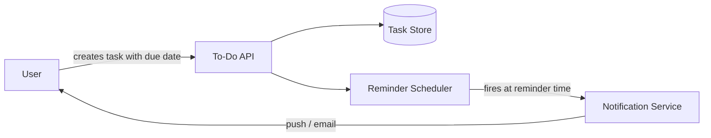
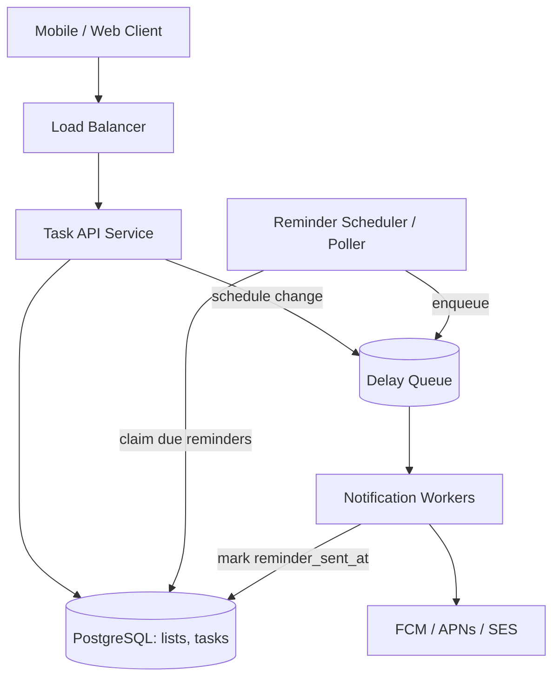
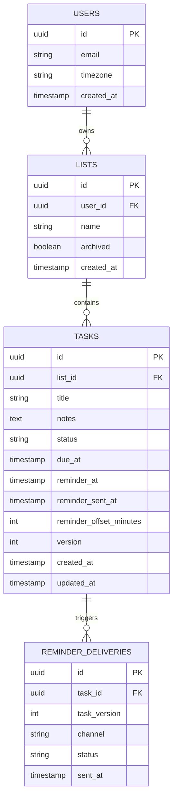
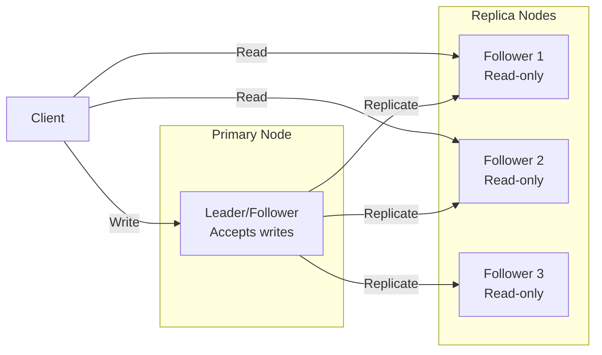
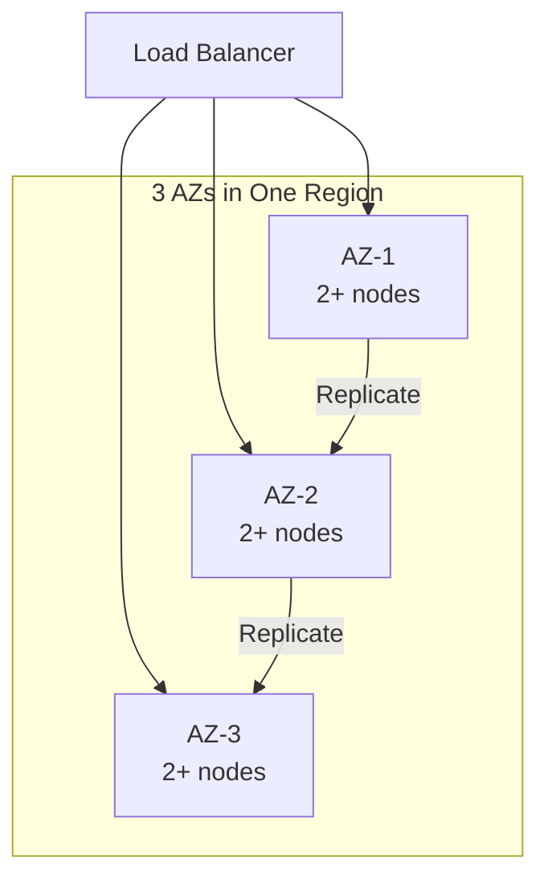
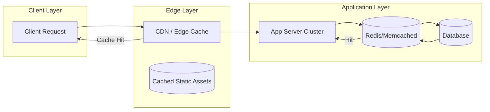
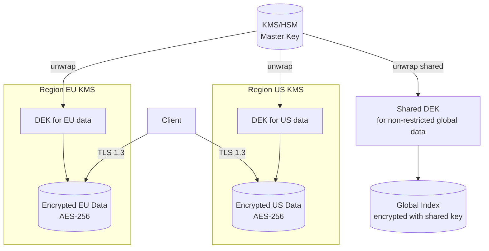
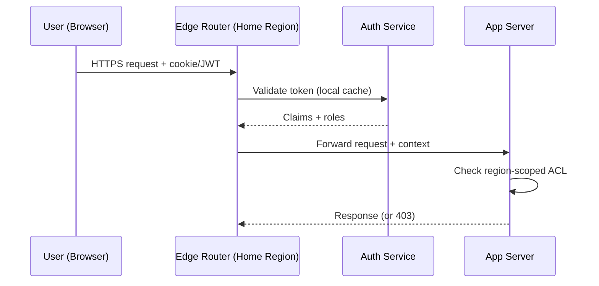
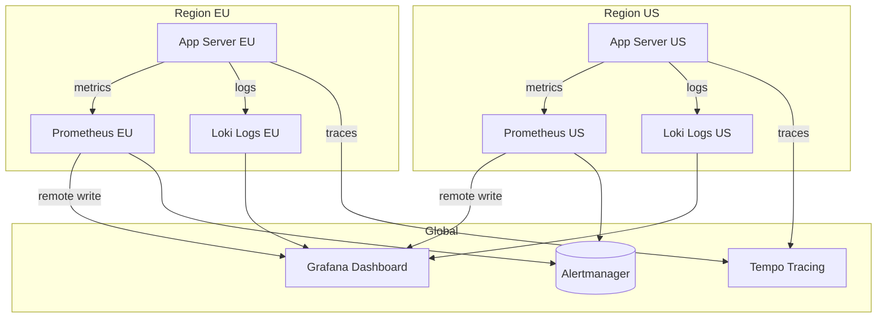

# Design a To-Do List Application with Reminders

## Blogs and websites

## Medium

## Youtube

## Theory

### Topics Covered

1. [Introduction / Problem Statement](#introduction-problem-statement)
2. [Functional Requirements](#functional-requirements)
3. [Non-Functional Requirements](#non-functional-requirements)
4. [Capacity Estimation](#capacity-estimation)
5. [Characteristics](#characteristics)
6. [Components](#components)
7. [Architectural Patterns](#architectural-patterns)
8. [Benefits](#benefits)
9. [Pros](#pros)
10. [Cons](#cons)
11. [Challenges](#challenges)
12. [Best Practices](#best-practices)
13. [When to Use / When Not to Use](#when-to-use-when-not-to-use)
14. [Use Cases](#use-cases)
15. [Data Model and APIAPI Design](#data-model-and-apiapi-design)
16. [High-Level Design](#high-level-design)
17. [Deep Dive](#deep-dive)
18. [Replication Strategies](#replication-strategies)
19. [Failure Detection and Membership](#failure-detection-and-membership)
20. [High Availability and Scalability](#high-availability-and-scalability)
21. [Performance and Optimization](#performance-and-optimization)
22. [Encryption and Key Management](#encryption-and-key-management)
23. [Authentication and Authorization](#authentication-and-authorization)
24. [Security Threats and Mitigations](#security-threats-and-mitigations)
25. [Observability and Logging](#observability-and-logging)
26. [Real-World Implementations](#real-world-implementations)
27. [Java and Spring Boot Implementation Guide](#java-and-spring-boot-implementation-guide)
28. [Interview Questions and Answers](#interview-questions-and-answers)

---
---
---

### Introduction / Problem Statement

Design a to-do list application where users can create tasks, organize them into lists, set due dates, and receive reminders before a task is due.

A to-do application is deceptively simple. The CRUD surface is trivial, but the reminder subsystem is a distributed scheduling problem: millions of future events must fire close to their scheduled time, exactly once, even across server restarts, deployments, and task edits. That scheduling core is what interviewers probe, because it exercises time-based data modeling, queueing, idempotency, time-zone handling, and concurrency.

**Why this problem exists**

- People externalize memory: tasks move from the brain into a trusted system.
- Deadlines without timely nudges are useless; the reminder is the product's core value.
- Tasks change constantly, so the schedule must be continuously recomputed.

**Real-life use cases**

- **Personal productivity**: Todoist, Microsoft To Do, Google Tasks, Apple Reminders.
- **Team task management**: Asana, Trello, Jira issues with due dates and SLA reminders.
- **Operational reminders**: medication reminders in health apps, bill-payment reminders in fintech, appointment reminders in scheduling systems.



The diagram shows the two halves of the system: a synchronous CRUD half (user to API to database) and an asynchronous time-driven half (scheduler to notification) that must deliver the reminder at the right moment without user interaction.

---

### Functional Requirements

1. **User and list management**
   - Create, rename, archive, and delete lists.
   - Every task belongs to exactly one list; deleting a list deletes or orphans its tasks according to a chosen policy.
2. **Task CRUD**
   - Create a task with a title, optional notes, and an optional due date/time.
   - Update any mutable field (title, notes, due time, reminder offset).
   - Delete a task (soft delete preferred so reminders and history can be reconciled).
3. **Completion**
   - Mark a task complete and incomplete; completing a task must cancel any pending reminder.
4. **Reminders**
   - Set an optional reminder offset per task (for example, 30 minutes before due).
   - Deliver a reminder notification (push and/or email) at `due_at - reminder_offset`.
   - Recompute and reschedule the reminder whenever the due time or offset changes.
   - Do not deliver reminders for completed or deleted tasks.
5. **Queries**
   - List tasks per list, with filtering by completion state and sorting by due date.
   - "Today" and "overdue" views across all lists of a user.
6. **Multi-device access**
   - The same account is usable from web, iOS, and Android clients concurrently.

---

### Non-Functional Requirements

- **Scale**: Millions of registered users, each with a modest number of tasks (tens, not millions). Reminder delivery must be timely at peak (morning hours in each time zone create load spikes).
- **Latency**: CRUD operations under 200 ms at p99. Reminder delivery within 60 seconds of the scheduled time at p99.
- **Reliability**: Reminders must not be missed even if a server restarts mid-scan; at-least-once scheduling with idempotent delivery is the baseline.
- **Availability**: Task CRUD at 99.9% monthly availability; reminder delivery may lag slightly but must eventually happen.
- **Consistency**: A task update (new due time) and the reminder for it must never disagree permanently; short races are acceptable if resolved (cancel old reminder, schedule new one).
- **Durability**: Once a task is created and acknowledged, it must survive any single-node failure (replicated storage, no in-memory-only state).
- **Security and privacy**: Tasks are private per user; all access is authorized per user ID; notification payloads must not leak task content to third parties beyond what is necessary.

---

### Capacity Estimation

Back-of-envelope math for a mid-size deployment. Adjust the assumptions, keep the method.

**Users and tasks**

- Registered users: 10 million.
- Daily active users (DAU): 10% → 1 million DAU.
- Average tasks per user: 20 → **200 million tasks** total.
- Average reminders per task: 0.5 (half of tasks have reminders) → **100 million reminders** over the system's life; about **2 million reminders per day** fire (assuming ~2% of tasks are due on any given day).

**QPS**

- Task operations per DAU per day: ~20 (create, complete, edit, list views).
- Total operations per day: 1M × 20 = 20 million → average ≈ **230 QPS**.
- Peak (morning/evening sync bursts, ~3× average): **~700 QPS** — trivially handled by a few application nodes.
- Reminder fires per day: 2M → average ≈ **23 fires/second**, peak ~3× ≈ **70 fires/second**. The scheduler must scan/claim and dispatch at this rate with headroom for 10× spikes (New Year resolutions, Monday mornings).

**Storage**

- Task row: id (16 B), list_id (16 B), title (~100 B), notes (~500 B avg), timestamps (~32 B), flags/version (~16 B), indexes overhead (~2×) → **~1.5 KB per task**.
- 200M tasks × 1.5 KB ≈ **300 GB** — fits comfortably in a single well-provisioned relational database; partition or archive completed tasks older than N years if growth demands it.
- Reminder deliveries log (90-day retention): 2M/day × 90 × ~300 B ≈ **54 GB**.

**Bandwidth**

- Read response: a task list page of 50 tasks × 1.5 KB ≈ 75 KB → at 700 QPS peak with heavy reads, **~50 MB/s egress** worst case; CDN and mobile sync deltas reduce this drastically.

**Key takeaways for the interview**

- The CRUD load is small; the interesting capacity problem is the **time-ordered scan**: finding reminders that are due now, cheaply, every few seconds.
- An index on `(reminder_at)` where reminders are pending makes the poller O(due-now) instead of O(all-tasks).

---

### Characteristics

- **Time-driven core**
  What it means: the system's distinguishing behavior (reminders) is triggered by wall-clock time, not by user requests.
  Why it matters: time-driven work cannot rely on request threads; it needs a scheduler, a queue, or a poller that runs without a user.
  How it works: each task stores a precomputed `reminder_at`; a background component continuously moves due reminders toward a notification channel.
  Example: a task due 6:00 PM with a 30-minute offset produces `reminder_at = 5:30 PM`; the scheduler fires at 5:30 regardless of whether the app is open.

- **Read/write symmetry with low per-user data**
  Each user owns a small dataset. There are no hot shared rows, so sharding by `user_id` is natural and contention is minimal.

- **Mutable schedule**
  Due dates change frequently. Every mutation that touches `due_at` or the offset must atomically recompute `reminder_at`, otherwise reminders fire at stale times.

- **Soft state machine per task**
  A task moves between pending and completed; reminders only make sense for pending tasks. Completion is a cancellation signal for the scheduler.

- **Idempotent side effects**
  A reminder may be claimed and dispatched more than once (retries, crashes), so delivery must be deduplicated.

- **Multi-channel notification**
  Push and email have different latency, cost, and failure profiles; the system abstracts them behind a notification interface.

- **User-scoped authorization**
  Every query and mutation is filtered by the authenticated user's ID; there is no shared data, which simplifies both security and caching.

- **Offline-tolerant clients**
  Mobile clients sync deltas; the server is the source of truth for `reminder_at` computation so a client clock skew cannot break scheduling.

---

### Components

- **API layer (REST service)**
  Purpose: exposes list/task CRUD to clients.
  Responsibilities: authentication, authorization scoping by user, validation, computing `reminder_at` on writes, emitting schedule-change events.
  How it works: stateless Spring Boot service behind a load balancer; persists to the relational database.
  Relationship: the only writer of task state; publishes reminder jobs to the scheduling subsystem.
  Real-world example: the Todoist sync API validates client mutations and returns authoritative state.

- **Task store (relational database)**
  Purpose: durable source of truth for lists, tasks, and reminder metadata.
  Responsibilities: transactional consistency of task updates plus reminder rescheduling, indexed access to due reminders.
  Relationship: read by the API for queries and by the scheduler for due-reminder scans.
  Real-world example: PostgreSQL with a partial index on pending reminders.

- **Reminder scheduler**
  Purpose: moves reminders from "pending" to "dispatched" at the right time.
  Responsibilities: find due reminders, claim them atomically (so two scheduler instances never grab the same row), publish to the queue, handle reschedules.
  How it works: either a periodic poller scanning `tasks WHERE reminder_at <= now() AND completed = false AND reminder_sent_at IS NULL`, or a consumer of a delay queue (for example, RabbitMQ delayed messages, SQS message timers, or a Redis sorted set).
  Real-world example: Quartz cluster, a Kubernetes CronJob-style deployment, or a custom poller with leader election.

- **Message queue / delay queue**
  Purpose: decouples scheduling from delivery, buffers spikes, enables retries.
  Responsibilities: hold reminder jobs until workers process them; support delayed visibility for true delay-queue implementations.
  Relationship: written by the scheduler, read by notification workers.
  Real-world example: Amazon SQS with per-message `DelaySeconds`, RabbitMQ with the delayed-message plugin, Kafka plus a delay-topic pattern, or Redis ZSET polled by score.

- **Notification workers**
  Purpose: turn reminder jobs into actual push/email deliveries.
  Responsibilities: render the message, call the push/email provider, record delivery outcome, mark the task's `reminder_sent_at` for idempotency.
  Relationship: downstream of the queue; writes delivery records back to the database.
  Real-world example: a small Spring Boot service consuming from SQS with visibility-timeout-based retries.

- **Push/email providers**
  Purpose: the last mile to the user.
  Relationship: external SaaS called by workers (APNs/FCM for push, SES/SendGrid for email).
  Real-world example: Firebase Cloud Messaging for Android and web push.

- **Clock/timezone service (library-level)**
  Purpose: convert user-local times to UTC consistently.
  Responsibilities: store all timestamps in UTC; keep the user's IANA timezone (`America/New_York`) for display and for wall-clock reminders like "9 AM my time".
  Real-world example: `java.time` with `ZoneId` on the server; never trust client-supplied UTC conversions alone.



---

### Architectural Patterns

- **Transactional Outbox**
  What it is: write the state change and an "event to publish" row in the same database transaction; a relay publishes outbox rows to the queue.
  Problem it solves: the dual-write problem — updating the task and publishing a reminder job are two writes; without the outbox, a crash between them loses the job or publishes a phantom one.
  How it works: `UPDATE tasks ...` and `INSERT INTO outbox (...)` commit together; a publisher reads unpublished outbox rows and sends them to the broker, then marks them published.
  When to use: whenever a state change must reliably trigger a message. When not: fire-and-forget events where loss is acceptable.
  Advantages: atomicity without distributed transactions. Disadvantages: extra table and relay component; at-least-once publishing requires idempotent consumers.
  Real-world example: Debezium CDC streaming an outbox table to Kafka.

- **Polling Publisher (periodic scan)**
  What it is: a scheduler that periodically queries for due work.
  Problem it solves: no broker dependency for delayed delivery; the database remains the single source of truth.
  How it works: `SELECT ... WHERE reminder_at <= now() AND reminder_sent_at IS NULL FOR UPDATE SKIP LOCKED LIMIT N` every poll interval.
  When to use: coarse timing (± poll interval) is acceptable — a reminder 30 seconds late is fine. When not: sub-second precision or extremely high due-event rates.
  Advantages: simple, self-healing after crashes, no extra infra. Disadvantages: poll-interval latency, wasted queries when idle, needs `SKIP LOCKED` or leader election to scale out.
  Real-world example: the original design in this document's architecture diagram and many production cron-based reminder systems.

- **Delay Queue**
  What it is: a queue where each message becomes visible at a per-message timestamp.
  Problem it solves: precise timing without scanning the whole table.
  How it works: on task creation, publish a message visible at `reminder_at`; consumers only see it when due.
  Advantages: precise, no polling load. Disadvantages: rescheduling is awkward (you cannot edit an in-flight delayed message — you must version messages and let consumers discard stale ones); SQS caps delay at 15 minutes, so long-range reminders need a hybrid design.
  Real-world example: RabbitMQ delayed message plugin; Redis `ZADD reminders <epoch> taskId` consumed by score.

- **Idempotent Consumer**
  What it is: the worker records that a reminder for task version N was delivered and ignores duplicates.
  Problem it solves: at-least-once queues plus retries mean the same reminder can arrive twice.
  How it works: `reminder_sent_at IS NULL` guard plus a unique constraint on `(task_id, task_version)` in a deliveries table.
  Advantages: exactly-once effect from at-least-once transport. Disadvantages: extra write per delivery.

- **State Machine**
  What it is: tasks have explicit states (pending → completed / deleted) and transitions are validated.
  Problem it solves: prevents reminders for completed tasks and invalid operations like completing a deleted task.
  Real-world example: modeled explicitly with a `status` column rather than a bare boolean when states grow (archived, snoozed).

- **Leader Election (for the poller)**
  What it is: only one scheduler instance runs the scan loop, or every instance uses row-level claiming.
  Problem it solves: duplicate dispatch from multiple poller replicas.
  How it works: either a distributed lock (ShedLock, ZooKeeper) or lock-free claiming via `FOR UPDATE SKIP LOCKED`.
  Advantages of `SKIP LOCKED`: no lock service needed and natural work-sharing across instances. Disadvantages: database-centric, does not generalize to non-database work.

- **Cache-Aside for hot reads**
  What it is: read-through caching of task lists per user with explicit invalidation on writes.
  Problem it solves: repeated "open the app" list loads.
  When to use: only when read QPS justifies it — at this scale the database usually suffices; mention it as a scale lever.

---

### Benefits

- **Reliable time-based engagement**
  Users trust the app because reminders fire even if the app was never opened again after creating the task. This reliability is the retention driver for the entire product category.

- **Simple mental model, simple CRUD**
  Lists and tasks map directly to relational tables, so the domain is easy to reason about, onboard engineers into, and extend (tags, subtasks, sharing).

- **Loose coupling via the queue**
  The API never calls push/email providers synchronously. A provider outage delays notifications but never fails task creation, protecting the write path's availability.

- **Horizontal scalability**
  Stateless API nodes scale behind a load balancer; scheduler instances share work via row claiming; workers scale with queue depth. Each tier scales independently.

- **Failure isolation and graceful degradation**
  If the scheduler dies, CRUD keeps working and reminders resume from the database when it restarts — the database is the retry log.

- **Auditability**
  A deliveries table recording every reminder attempt provides an audit trail for "why didn't I get reminded" support tickets, which are the most common complaint in this product category.

---

### Pros

- **Durable scheduling without exotic infrastructure**
  Because `reminder_at` is a column in the task table, the schedule survives process restarts, redeployments, and even broker loss (with the outbox pattern). Many real systems run exactly this design for years before needing a delay queue.

- **Natural consistency story**
  Task update and reminder reschedule happen in one database transaction, so there is no window where the task says one due time and the schedule says another (the outbox closes the last gap for queued jobs).

- **Cheap at small and medium scale**
  The entire design runs on one database, one queue, and a few service instances; operational cost stays low well past millions of users.

- **Easy idempotency**
  The reminder's identity is derivable from `(task_id, due_at)` or a task version, so deduping deliveries needs no external coordination.

- **Clear failure semantics**
  Every component's failure mode is understandable: poller down → reminders delayed, not lost; worker down → queue grows; provider down → retry with backoff. This makes on-call runbooks short.

---

### Cons

- **Poller timing granularity**
  A poll interval of 30 seconds means reminders can be up to 30 seconds late (plus processing time). For a to-do app this is acceptable; for trading systems it is not. Mitigation: shorter interval, or delay queue for precision.

- **Database load from scanning**
  A naive poller scans repeatedly; without a partial index (`WHERE reminder_sent_at IS NULL AND completed = false`) the scan degrades as history grows. Mitigation: partial index plus archiving completed tasks.

- **Duplicate risk without discipline**
  At-least-once delivery means a missing unique constraint or a missing `reminder_sent_at` check immediately becomes duplicate push notifications — a very visible bug.

- **Timezone and DST complexity**
  "Remind me at 9 AM local" across daylight-saving transitions and user travel is genuinely hard; UTC-only modeling breaks user expectations, and local-time modeling breaks absolute scheduling. A hybrid (store both) is required.

- **Reschedule storms**
  Features like "snooze all reminders by one hour" or bulk due-date edits create bursts of recomputation and queue traffic that must be rate-smoothed.

- **Queue delay limits**
  Managed delay queues (SQS: 15 minutes max) cannot hold a reminder set for next month, forcing a hybrid poller-plus-delay-queue design anyway.

---

### Challenges

- **Technical — exactly-once effect**
  Guaranteeing "user gets one reminder" across retries, worker crashes, and redeliveries requires idempotent consumers and unique constraints; the hard part is that the send itself (push/email) is not transactional with the dedup write.

- **Scalability — the due-now hotspot**
  At peak, tens of thousands of reminders become due in the same minute. The claim query must be index-driven and batched (`LIMIT N` with `SKIP LOCKED`), or the database becomes the bottleneck.

- **Performance — list views**
  The "today" view aggregates across lists; without proper indexing on `(user_id, due_at)` it becomes a full per-user scan. Mobile sync APIs need delta tokens to avoid resending everything.

- **Reliability — clock correctness**
  Servers must use NTP-synchronized clocks; a scheduler instance with a fast clock fires reminders early. All comparisons must use the database's `now()` or a single clock source, never mixed.

- **Maintainability — evolving reminder rules**
  Recurring tasks, snooze, per-list quiet hours, and smart reminders ("when I arrive at the office" is location-triggered) all stress a schema designed for one-shot `reminder_at`. The model must version reminder intent.

- **Operational — provider outages**
  FCM/APNs/SES degrade. Workers need circuit breakers, exponential backoff, and dead-letter queues; an outage during the morning peak must not lose reminders.

- **Security — notification content leakage**
  Push notifications render on lock screens and pass through Google/Apple infrastructure. Sensitive task titles may need suppression ("You have a reminder" vs. full title) as a user setting.

- **Operational — backfills**
  Schema migrations over 200M task rows (for example, adding `task_version`) need online migration techniques: add column nullable, backfill in batches, then enforce.

---

### Best Practices

- **Store all timestamps in UTC; store the user's IANA timezone separately**
  Why: UTC is monotonic and DST-free, so scheduling math is always correct. Display converts to local. Example: store `due_at = 2026-03-08T14:00:00Z` and `timezone = America/New_York`; render 9:00 AM or 10:00 AM depending on DST.

- **Precompute `reminder_at` on write, never at read time**
  Why: the scheduler's query must be a dumb index lookup; computing offsets per row in the scan would defeat indexing. Recompute in the same transaction that changes `due_at` or the offset.

- **Use a partial index for the scheduler query**
  Why: `CREATE INDEX ON tasks (reminder_at) WHERE reminder_sent_at IS NULL AND completed = false` keeps the index tiny (only pending reminders), so the scan is proportional to work, not history.

- **Claim rows with `FOR UPDATE SKIP LOCKED`**
  Why: multiple poller/worker instances can share the scan without a distributed lock service; locked rows are skipped, giving natural partitioning and crash safety (locks release on transaction rollback).

- **Make every delivery idempotent**
  Why: queues are at-least-once. Guard on `reminder_sent_at` and enforce `UNIQUE(task_id, task_version)` in the deliveries table so even a double-claim cannot double-send.

- **Cancel reminders on completion and deletion in the same transaction**
  Why: a reminder for a task completed one minute ago is a product bug users notice. Set a `reminder_cancelled` flag or clear `reminder_at` when the task completes.

- **Version tasks and tag reminder jobs with the version**
  Why: with delay queues you cannot edit an in-flight job. Consumers compare the job's version against the task's current version and discard stale jobs, which cleanly solves rescheduling.

- **Bound every worker retry loop and use a DLQ**
  Why: a poison message (malformed payload, provider bug) must not block the queue. After N attempts with exponential backoff, move to a dead-letter queue and alert.

- **Rate-limit notification sends per user**
  Why: a bug that schedules 500 reminders for one user must not spam them into uninstalling the app; collapse bursts ("5 tasks due soon").

- **Emit metrics on scheduling lag**
  Why: `now() - reminder_at` at dispatch time is the single best health signal for the reminder pipeline; alert when p99 lag exceeds the SLA (60 seconds).

---

### When to Use / When Not to Use

**Use this design when**

- You need reliable one-shot or simple recurring reminders for user-owned tasks.
- Timing precision on the order of seconds-to-a-minute is acceptable.
- Data is naturally partitioned by user with no cross-user hot spots.
- You want to run on commodity infrastructure (one RDBMS + one queue).

**Consider alternatives when**

- **Sub-second or massive-scale scheduling** (millions of events per minute): use a dedicated scheduling system — a timing wheel (as in Kafka's delayed operations or Netty's `HashedWheelTimer` for in-process work) or a distributed job scheduler (for example, a Temporal workflow per task).
- **Complex calendars**: recurring events with exceptions, shared calendars, and invites fit the iCalendar (RRULE) model — model recurrence rules instead of precomputed `reminder_at` rows.
- **Real-time collaboration**: shared live lists with presence and operational transforms need CRDT/OT-based sync rather than simple REST deltas.

**Decision factors**

- Timing precision requirement, event rate at peak, retention/history size, number of notification channels, recurrence complexity, team familiarity with brokers versus databases.

---

### Use Cases

**1. Personal productivity app (the baseline)**

- Problem: millions of individual users, each with tens of tasks and occasional reminders.
- Proposed solution: exactly this design — relational store, poller with `SKIP LOCKED`, queue, push/email workers.
- Why suitable: per-user data is small; the poller's load tracks pending reminders, not total tasks; availability of the write path is protected by the async notification path.
- How it works: create task → compute `reminder_at` → poller claims due rows → worker sends FCM push → `reminder_sent_at` recorded.
- Trade-offs: accepts up to one poll interval of lateness in exchange for operational simplicity.

**2. Bill-payment reminders for a fintech**

- Problem: users must be reminded days before bill due dates; missing a reminder has financial consequences; reminders may be scheduled months out.
- Proposed solution: poller as source of truth (delay queues cannot hold months), email plus push, deliveries table as the audit log required for compliance, escalation (repeat reminder if unpaid by due date).
- Why suitable: durability and auditability are the strengths of this design; timing precision of minutes is fine.
- Trade-offs: requires the recurrence/escalation model to be explicit (a `reminder_schedule` table) rather than a single offset.

**3. Medication adherence reminders**

- Problem: daily recurring reminders at wall-clock times ("8 AM every day"), with snooze and taken/not-taken tracking.
- Proposed solution: recurrence rule per task; after each firing, the worker computes the next `reminder_at` from the rule and the user's timezone; completion resets the schedule.
- Why suitable: the UTC storage plus IANA timezone model handles DST correctly, which is the main correctness risk for daily medications.
- Trade-offs: wall-clock recurrence must survive timezone changes when the user travels — recompute next fire time on timezone update.

**4. Team task management with SLA nudges**

- Problem: tasks assigned across a team; reminders escalate to a manager when a due date passes uncompleted.
- Proposed solution: same pipeline, plus a second class of scheduled job (the SLA deadline) and a routing rule in the worker (assignee first, manager on overdue).
- Why suitable: the claim-based poller naturally supports multiple job types via a `kind` column.
- Trade-offs: shared team lists introduce cross-user reads, so list-level authorization and caching become necessary.

---

### Data Model and APIAPI Design

REST, JSON, versioned under `/api/v1`. All timestamps are ISO-8601 UTC. All endpoints require `Authorization: Bearer <JWT>`; the user ID comes from the token, never from the request body.

**Core endpoints (preserved and extended from the original design)**

```
POST   /api/v1/lists                          create a list
GET    /api/v1/lists                          list the user's lists
POST   /api/v1/lists/{listId}/tasks           create a task in a list
GET    /api/v1/lists/{listId}/tasks           list tasks (filter/sort/paginate)
GET    /api/v1/tasks/{taskId}                 fetch one task
PATCH  /api/v1/tasks/{taskId}                 update fields (incl. complete)
DELETE /api/v1/tasks/{taskId}                 delete a task
GET    /api/v1/tasks/today                    today + overdue view across lists
```

**Create a task**

`POST /api/v1/lists/{listId}/tasks`

```json
{
  "title": "Pay electricity bill",
  "notes": "Account 4412, autopay failed last month",
  "dueAt": "2026-06-15T17:00:00Z",
  "reminderOffsetMinutes": 60
}
```

Validation: `title` required, 1–200 chars; `reminderOffsetMinutes` 0–10080 (one week); `dueAt` may be null (no reminder then). The server computes `reminderAt = dueAt - offset` and persists both.

Response `201 Created`:

```json
{
  "id": "8f3a1c2e-7b6d-4e21-9f0a-2c5d7e9b1a34",
  "listId": "3c9d...",
  "title": "Pay electricity bill",
  "status": "PENDING",
  "dueAt": "2026-06-15T17:00:00Z",
  "reminderAt": "2026-06-15T16:00:00Z",
  "version": 1,
  "createdAt": "2026-06-10T09:30:00Z"
}
```

**Update / complete a task**

`PATCH /api/v1/tasks/{taskId}` — partial update; sending `{ "status": "COMPLETED" }` cancels the pending reminder; sending a new `dueAt` recomputes `reminderAt` and bumps `version` (stale queued jobs carrying an older version are discarded by workers).

**List tasks with pagination, filtering, sorting**

`GET /api/v1/lists/{listId}/tasks?status=PENDING&sort=dueAt,asc&cursor=eyJpZCI6...&limit=50`

Cursor-based pagination (not offset) so concurrent edits do not duplicate or skip items. Response includes `nextCursor` when more pages exist.

**Error responses**

Consistent problem-details shape; status codes: `400` validation, `401` unauthenticated, `403` list/task owned by another user, `404` unknown id, `409` version conflict on concurrent update, `429` rate limited.

```json
{
  "type": "https://api.example.com/problems/validation",
  "title": "Validation failed",
  "status": 400,
  "errors": [
    { "field": "reminderOffsetMinutes", "message": "must be between 0 and 10080" }
  ]
}
```

**Cross-cutting concerns**

- **Idempotency**: `POST` accepts an `Idempotency-Key` header; keys are stored per user for 24 hours so a retried mobile request cannot create duplicate tasks.
- **Optimistic concurrency**: `PATCH` may send `If-Match: "3"` (the version); a mismatch returns `409`, protecting multi-device edits.
- **Rate limiting**: per-user token bucket (for example, 100 writes/minute); `429` includes `Retry-After`.
- **Versioning**: URI version `v1`; breaking changes get `v2` while `v1` stays supported for one release cycle.

---

#### Data Modeling

**Entities and relationships**

A user owns many lists; a list contains many tasks; a task triggers zero or more reminder deliveries. One row per delivery attempt gives idempotency and auditability.



**Keys, constraints, indexes**

- PKs: surrogate UUIDs (generated client- or server-side) so bulk inserts never contend on sequences.
- FKs: `tasks.list_id → lists.id`, `reminder_deliveries.task_id → tasks.id`, both `ON DELETE CASCADE` from their parent (deleting a list deletes its tasks and their deliveries).
- `UNIQUE (task_id, task_version)` on `REMINDER_DELIVERIES` — the idempotency backstop.
- Check constraints: `reminder_offset_minutes BETWEEN 0 AND 10080`; `status IN ('PENDING','COMPLETED','DELETED')`.
- Indexes:
  - `tasks (list_id, due_at)` — list views and sorting.
  - Partial: `tasks (reminder_at) WHERE status = 'PENDING' AND reminder_at IS NOT NULL AND reminder_sent_at IS NULL` — the scheduler scan.
  - `lists (user_id)` — per-user list queries.

**Normalization vs denormalization**

The model is normalized (3NF): no derived data is stored except `reminder_at`, which is a **deliberate denormalization**: it is derivable from `due_at - offset` but stored so the scheduler query is a pure index lookup. The invariant is maintained transactionally on every write.

**Data lifecycle**

- Completed tasks are retained (users review history) but excluded from hot indexes by the partial-index predicate.
- Deliveries older than 90 days are archived to cold storage.
- Deleting a user cascades or anonymizes all owned data (privacy requirement).

**Partitioning**

At this scale a single PostgreSQL primary with read replicas suffices. Growth levers, in order: archive old completed tasks; partition `REMINDER_DELIVERIES` by month (`PARTITION BY RANGE (sent_at)`); shard by `user_id` hash only when write volume or storage forces it.

---

### High-Level Design

**Major components and responsibilities**

1. Client (web/iOS/Android) — renders tasks, queues offline edits, syncs deltas.
2. Load balancer — TLS termination, routing to stateless API nodes.
3. Task API service — CRUD, auth, `reminder_at` computation, outbox writes.
4. PostgreSQL — source of truth (lists, tasks, deliveries, outbox).
5. Reminder scheduler — claims due reminders (`SKIP LOCKED`), enqueues jobs.
6. Queue — decouples scheduling from delivery; buffers peaks.
7. Notification workers — render, call providers, record delivery, mark `reminder_sent_at`.
8. Providers — FCM/APNs for push, SES/SendGrid for email.

**Write flow — create a task with a reminder**

```mermaid
sequenceDiagram
    participant C as Client
    participant A as Task API
    participant D as PostgreSQL
    participant O as Outbox Relay
    participant Q as Queue
    C->>A: POST /lists/{id}/tasks (title, dueAt, offset)
    A->>A: validate, compute reminderAt = dueAt - offset
    A->>D: BEGIN; INSERT task; INSERT outbox(scheduled, v1); COMMIT
    A-->>C: 201 Created (task, reminderAt)
    O->>D: poll unpublished outbox rows
    O->>Q: publish reminder job (taskId, version 1, fireAt)
    O->>D: mark outbox row published
```

The outbox guarantees the schedule event is never lost between the database commit and the broker publish; the relay is idempotent because consumers dedupe by `(taskId, version)`.

**Reminder delivery flow**

```mermaid
sequenceDiagram
    participant S as Scheduler
    participant D as PostgreSQL
    participant Q as Queue
    participant W as Worker
    participant P as Provider (FCM/SES)
    loop every poll interval
        S->>D: SELECT due reminders FOR UPDATE SKIP LOCKED LIMIT 500
        S->>Q: enqueue claimed jobs
        S->>D: COMMIT (locks released)
    end
    W->>Q: consume job (taskId, version)
    W->>D: check task still pending and version matches
    alt stale or completed
        W->>Q: ack and discard
    else valid
        W->>P: send push/email
        P-->>W: success
        W->>D: INSERT delivery row; SET reminder_sent_at = now()
        W->>Q: ack
    end
```

The version check is what makes rescheduling safe: an edited task enqueues a new job and invalidates the old one without needing to retract messages from the broker.

**Scaling strategy**

API nodes scale horizontally; the scheduler scales to a few instances sharing work via `SKIP LOCKED`; workers scale with queue depth (autoscaler on queue length). The database scales with read replicas for list views and a single primary for writes.

**Failure handling**

- API crash mid-write: transaction rolls back; no task, no outbox row — consistent.
- Scheduler crash after claim, before enqueue: transaction rolls back, rows unlock, next poll reclaims — self-healing.
- Worker crash after send, before marking `reminder_sent_at`: job redelivers; the deliveries unique constraint makes the second attempt a no-op after re-checking provider state, or in the worst case a rare duplicate push — accepted and measurable via the deliveries table.
- Broker down: outbox rows accumulate; relay backfills when it recovers.

---

### Deep Dive

#### 1. Reminder scheduling: poller vs delay queue vs timing wheel

Three viable implementations, in increasing complexity:

- **Database poller** (chosen here): a partial index makes the scan cheap; correctness survives restarts for free; timing granularity equals the poll interval. Operationally the simplest, and at 70 fires/second peak it is nowhere near its limits.
- **Delay queue** (SQS `DelaySeconds`, RabbitMQ delayed plugin, Redis ZSET): precise timing and no idle polling, but (a) managed delays cap out (SQS: 15 minutes), (b) you cannot edit an in-flight delayed message, so rescheduling requires version tagging and consumer-side discard, and (c) recovery after broker loss needs the outbox anyway.
- **Timing wheel** (Kafka-style hierarchical wheel, Netty `HashedWheelTimer`): in-memory O(1) scheduling for very high event rates; wrong fit here because it is not durable and the event rate does not justify it — but naming it in an interview shows range.

Hybrid is the honest production answer: poller owns correctness and long horizons; anything due within the delay window can be pushed into a delay queue for tighter timing.

#### 2. Idempotency and the exactly-once illusion

The send call to FCM/SES cannot participate in the database transaction. So exactly-once is impossible in the literal sense; what is achievable is an **exactly-once effect**:

1. Unique constraint `UNIQUE(task_id, task_version)` on deliveries — a database-enforced single-execution token.
2. Check-then-act inside one transaction: insert the delivery row (fails on duplicate → skip) then mark `reminder_sent_at`.
3. The residual risk window: crash after the provider accepted but before the commit — a duplicate push slips through. It is bounded, rare, and visible in the deliveries table; product accepts it because the alternative (distributed transaction with the provider) does not exist.

Interviewers want to hear this articulated: at-least-once transport + idempotent consumer ≈ exactly-once semantics, with a named residual window.

#### 3. Rescheduling and cancellation races

Two mutations can race with an in-flight reminder: the user edits `due_at`, or completes the task, while the job sits in the queue.

- Every write that affects scheduling bumps `tasks.version` and recomputes `reminder_at` in the same transaction.
- Jobs carry the version they were created from; workers discard mismatches.
- Completion sets `status = COMPLETED`; workers discard jobs for non-pending tasks.
- Residual race: worker checked validity, user completes the task, worker sends anyway. Bounded by milliseconds; acceptable — the notification is at worst slightly stale, never wrong about past fact ("was due at 5 PM" was true when sent).

#### 4. Time zones and DST

- Store `due_at` and `reminder_at` in UTC always.
- Store the user's IANA zone; "remind me at 9 AM" for daily recurring tasks means: compute the next local 9 AM, convert to UTC with the zone's rules at that future date (DST-aware), store the UTC instant.
- On timezone change (user travels), recompute future wall-clock reminders; leave absolute-deadline reminders (a flight departure) untouched — the distinction between *wall-clock intent* and *absolute intent* is a subtle schema decision (a boolean on the task).
- Never schedule from client-supplied UTC conversions alone; the server's tz database is the authority.

#### 5. Notification fan-out and provider resilience

- Channel selection per user (push if a device token exists, email fallback, both optionally).
- Circuit breaker per provider; when FCM trips, fall back to email for urgent reminders.
- Exponential backoff with jitter on 5xx/throttle responses; provider 4xx (invalid token) is not retried — the device token is deactivated instead.
- Per-user burst collapsing: if N reminders for one user fire within a minute, send one aggregated notification.

#### 6. The claim query as the scaling bottleneck

The scheduler's entire throughput rests on one query. Rules:

- Partial index so the index only contains pending, unsent reminders.
- `FOR UPDATE SKIP LOCKED` so instances share work without a lock service.
- Batch (`LIMIT 500`) and commit promptly; long transactions hold locks and bloat.
- Never compute in the scan (`WHERE due_at - interval ...`); only compare the precomputed column.
- Monitor scan latency; at ~100k pending reminders this query is single-digit milliseconds on modest hardware.

---

### Replication Strategies

**What it means**

Replication Strategies determine how data and state are copied across multiple nodes in To-Do List Application with Reminders. The choice of strategy determines the trade-off between consistency, availability, and latency.

**Why it matters**

To-Do List Application with Reminders must replicate data to prevent loss and serve reads from multiple nodes. The replication strategy determines whether the system favors consistency (strong reads) or availability (always writable), and how it handles cross-node failure.

**How it works**

**Leader-based (single-leader)**: A single primary node accepts all writes; followers replicate changes asynchronously or semi-synchronously. Reads can be served from any replica. This strategy favors strong consistency for writes but creates a write bottleneck at the leader.



*Leader-based replication: a single primary node accepts all writes and replicates them to read-only followers. Clients can read from any replica for scaled read throughput, but all writes go through the leader.*

**Multi-leader (multi-master)**: Multiple nodes accept writes and exchange updates with each other. This enables low-latency writes in different regions but requires conflict resolution (last-write-wins, merge functions, or CRDTs).

**Leaderless (quorum-based)**: Any node can accept writes; a quorum of nodes must agree. Read and write quorums are configured so that at least one node overlaps between them (R + W > N). This maximizes availability and write scalability.

**Trade-offs for To-Do List Application with Reminders**:

| Strategy | Use Case | Pros | Cons |
|---|---|---|---|
| Leader-based | user todos, task details, team assignments | Strong consistency, simple | Write bottleneck, leader failure risk |
| Multi-leader | public task status, anonymized completion stats | Low-latency global writes | Conflict resolution, complex |
| Leaderless | Caching, counters | High availability, no bottleneck | Eventual consistency, read repair overhead |

**Real-world implementations**

- **Redis**: Leader-follower replication with asynchronous replication; Sentinel handles failover.
- **Apache Kafka**: Leader-based partition replication with ISR (in-sync replica) — writes go to the leader, followers replicate.
- **Cassandra**: Tunable consistency with leaderless quorum (R + W > N).
- **DynamoDB Global Tables**: Multi-master active-active across regions.

### Failure Detection and Membership

**What it means**

Failure Detection and Membership is the mechanism by which To-Do List Application with Reminders determines which nodes are alive and part of the cluster. Membership is the list of known nodes; failure detection is the process of updating that list when nodes fail or recover.

**Why it matters**

To-Do List Application with Reminders must route requests only to healthy nodes and trigger failover when a node goes down. False positives (healthy nodes marked as dead) cause unnecessary failovers and data loss. False negatives (dead nodes not detected) cause failed requests and degraded performance.

**How it works**

**Heartbeat-based detection**: Each node sends a heartbeat (ping) to a subset of peers at regular intervals. If a node misses N consecutive heartbeats, it is marked as suspect. The gossip protocol distributes membership information: each node exchanges its view of the cluster with a random peer, and the information propagates gossip-style.

```mermaid
sequenceDiagram
    participant A as Node A
    participant B as Node B
    participant C as Node C

    loop Every 1s
        A->>B: Heartbeat (ping)
        B-->>A: Heartbeat (ack)
    end
    B->>C: Gossip: A is alive
    C->>A: Gossip: B is alive
    Note over A,B,C: View converges in O(log N) rounds
```

*Gossip-based failure detection: each node periodically pings a random subset of peers and gossips its view of the cluster. The membership list converges in O(log N) rounds.*

**Phi Accrual Failure Detector**: Instead of a fixed timeout, the detector measures the time between consecutive heartbeats and computes a phi (φ) value — the probability that the node is dead given the observed heartbeat pattern. φ is compared against a threshold (typically 1–8); higher thresholds reduce false positives but increase detection latency.

**SWIM (Scalable Weakly-consistent Infection-style Process group Membership Protocol)**: Nodes ping a random subset of cluster members. If a ping fails, the node is marked "suspect" and the failure is "infected" (gossiped) to other nodes. This is O(log N) per failure detection cycle and scales to large clusters.

**Trade-offs**:

| Approach | Strengths | Weaknesses |
|---|---|---|
| Heartbeat (timeout-based) | Simple, deterministic | False positives under load |
| Phi Accrual | Adaptive threshold | Needs historical data |
| SWIM | Scales to 1000s of nodes | Eventual consistency |

**Real-world implementations**

- **AWS Route 53 Health Checks**: Uses TCP/HTTP health checks with configurable thresholds to remove unhealthy instances from DNS rotation.
- **Kubernetes**: Uses the kubelet heartbeat (every 10s) to determine node liveness; nodes missing 3 consecutive heartbeats are marked NotReady.
- **Consul**: Uses SWIM protocol for membership and failure detection; supports both LAN and WAN gossip.
- **Akka Cluster**: Uses Phi Accrual failure detector with configurable φ thresholds.

### High Availability and Scalability

**What it means**

High Availability and Scalability determines how To-Do List Application with Reminders continues operating when nodes or entire zones fail, and how capacity is added as demand grows. HA is about minimizing downtime; scalability is about maintaining performance as load increases.

**Why it matters**

To-Do List Application with Reminders must stay operational even when individual nodes, availability zones, or entire regions fail. At the same time, it must scale horizontally to handle traffic spikes without degrading latency. The two are intertwined: the replication strategy, failure detection, and load balancing all contribute to both HA and scalability.

**How it works**

**Availability zones (AZs)**: Nodes are distributed across multiple AZs within a region. Each AZ is an independent failure domain (power, networking, physical security). A load balancer distributes requests across AZs; if one AZ fails, traffic is routed to the remaining AZs with no data loss (assuming replication is in place).



*Multi-AZ deployment: a load balancer distributes traffic across three availability zones. Each AZ has multiple nodes. Data is replicated across AZs so that losing one AZ does not cause data loss or service interruption.*

**Load balancing**: A load balancer distributes incoming requests across healthy nodes. Algorithms include round-robin, least connections, and weighted routing. Health checks ensure traffic only goes to healthy nodes. For To-Do List Application with Reminders, the load balancer also considers **API layer (REST service)**
  Purpose: exposes list/task CRUD to clients.
  Res when routing.

**Auto-scaling**: The system automatically adds or removes nodes based on metrics (CPU, memory, request rate). Scale-out policies add nodes when load exceeds a threshold; scale-in policies remove nodes during low load. For stateful services like To-Do List Application with Reminders, scale-out involves rebalancing partitions (moving data and connections to the new node).

**Failover and recovery**: When a node fails, the load balancer detects it (via health checks or failure detection) and stops sending traffic. A new node is provisioned (or a standby is promoted) and begins serving. For To-Do List Application with Reminders, failover must preserve user todos, task details, team assignments data — this is achieved through replication with a quorum of healthy nodes.

**Scalability patterns**:

1. **Horizontal partitioning (sharding)**: Split data by a partition key (e.g., user_id, session_id) and distribute partitions across nodes. New nodes take ownership of additional partitions.

2. **Consistent hashing**: Minimize data movement on scale-out — only 1/N of the data moves to the new node. Nodes and partitions are placed on a ring; a request for key X is routed to the next node clockwise from hash(X).

3. **Connection draining**: When scaling in, existing connections are allowed to complete before the node is shut down. For To-Do List Application with Reminders, this means draining active 1. sessions gracefully.

**Real-world implementations**

- **Netflix OSS (Eureka + Zuul + Ribbon)**: Service discovery with Eureka, edge routing with Zuul, and client-side load balancing with Ribbon. Scales to thousands of instances.
- **Kubernetes HPA + VPA**: Horizontal Pod Autoscaler scales pods based on CPU/memory; Vertical Pod Autoscaler adjusts resource requests based on historical usage.
- **AWS ALB + Auto Scaling Groups**: Application Load Balancer with auto-scaling groups across AZs; health checks replace unhealthy instances automatically.

### Performance and Optimization

**What it means**

Performance and Optimization covers the techniques To-Do List Application with Reminders uses to achieve low latency, high throughput, and efficient resource usage. This section examines the key performance metrics, bottlenecks, and optimizations specific to the system.

**Why it matters**

To-Do List Application with Reminders faces competing pressures: users demand low latency, the system must handle high throughput, and infrastructure costs must be controlled. The optimizations applied at the data, compute, and network layers determine whether the system meets its SLA.

**How it works**

**Latency layers**: Latency in To-Do List Application with Reminders comes from three layers:
1. **Network**: Round-trip time from client to the nearest edge node / load balancer.
2. **Application**: Request processing time on the server (CPU, I/O, lock contention).
3. **Data**: Time to read/write from storage (cache hit vs. database query).

The 99th-percentile latency is the key metric for user-facing systems — it determines the worst-case experience.

**Caching strategies**: To-Do List Application with Reminders uses multiple cache layers:
- **Edge cache**: Static assets (images, CSS, JS) served from a CDN at the edge. For To-Do List Application with Reminders, this caches public task status, anonymized completion stats that doesn't change frequently.
- **Application cache**: In-memory cache (e.g., Redis, Memcached) for frequently accessed data. Cache-aside pattern: application checks cache first, falls back to database on miss.
- **Local cache**: In-process cache (e.g., Caffeine, Guava) for data accessed within a single request. Avoids network round-trips.

**Batching and pipelining**: To-Do List Application with Reminders batches small operations (e.g., writes, log flushes) to amortize per-operation overhead. Pipelining allows multiple requests to be in flight simultaneously.



*Caching hierarchy: clients first hit the edge CDN/cache; if the response is cached, it is returned immediately. Otherwise, the request reaches the application, which checks its in-memory/application cache (e.g., Redis) before falling back to the database. This minimizes latency from each layer.*

**Connection pooling**: To-Do List Application with Reminders maintains a pool of database connections to avoid the TCP handshake overhead on every request. Pool size is tuned to match the database's capacity.

**Compression**: Responses are compressed (gzip, zstd) for clients that support it. At the network layer, gRPC uses HPACK header compression.

**Indexing**: Database tables are indexed on frequently queried fields. For To-Do List Application with Reminders, indexes cover **Task store (relational database)**
  Purpose: durable source of truth for list and **Reminder scheduler**
  Purpose: moves reminders from "pending" to "dispatched" for fast lookups.

**Asynchronous processing**: Non-critical background work (e.g., analytics, cleanup, notifications) is offloaded to message queues and processed asynchronously, keeping the request path fast.

**Resource isolation**: CPU and memory are allocated per service (containers with cgroup limits). This prevents a single misbehaving service from degrading the entire system.

**Metrics for To-Do List Application with Reminders**:

| Metric | Target | How to Measure |
|---|---|---|
| P99 latency | < 1s | Load test with realistic traffic |
| Throughput | 1K RPS | Request rate under peak load |
| Error rate | < 0.1% | 5xx / total requests |
| Cache hit ratio | > 90% | cache_hits / (cache_hits + misses) |
| Resource utilization | < 80% CPU, < 85% memory | Container metrics |

**Real-world implementations**

- **Google's HTTP Load Balancer**: Global load balancing with edge PoPs; routes users to the nearest healthy backend.
- **Cloudflare**: Edge cache with Argo Smart Routing that dynamically routes traffic to avoid congestion.
- **Redis**: Used as an application cache with configurable eviction policies (LRU, LFU, TTL).

### Encryption and Key Management

**What it means**

Encryption and Key Management in To-Do List Application with Reminders ensures that data is protected both at rest (stored on disk) and in transit (moving between services). Key management governs how encryption keys are generated, stored, rotated, and accessed — without proper key management, encryption provides a false sense of security.

**Why it matters**

To-Do List Application with Reminders handles user todos, task details, team assignments that must be encrypted both at rest and in transit. Scaling To-Do List Application with Reminders to handle increasing load while maintaining data consistency, low latency, and fault tolerance requires careful key management: keys must be rotated regularly, scoped to prevent cross-contamination, and audited for compliance. A single key compromise could expose sensitive data.

**How it works**

**At-rest encryption**: Data stored in **API layer (REST service)**
  Purpose: exposes list/task CRUD to clients.
  Res, **Task store (relational database)**
  Purpose: durable source of truth for list and databases is encrypted using AES-256-GCM. The Data Encryption Key (DEK) is generated per data partition and encrypted with a Key Encryption Key (KEK) managed by a KMS (AWS KMS, GCP KMS, HashiCorp Vault). Keys are regionally scoped — only data belonging to a region can be decrypted by that region's KEK.

**In-transit encryption**: All inter-service communication uses TLS 1.3 or mTLS for service-to-service auth. Cross-region communication of public task status, anonymized completion stats uses TLS + optional application-level encryption. user todos, task details, team assignments is NEVER transmitted in plaintext or across region boundaries.

**Key hierarchy**:
```
Master Key (HSM-backed, KMS-managed)
  └─ KEK (per region, per service)
     └─ DEK (per data partition, rotated every 90 days)
        └─ Data (encrypted with DEK)
```

**Key rotation**: KEKs rotate annually (automatic via KMS); DEKs rotate per object or per 90 days. Applications handle key version headers transparently — a DEK version is stored alongside the encrypted data.

**Cross-region key sharing**: For non-restricted data (public task status, anonymized completion stats), a shared key is imported into each region's KMS. Restricted data NEVER uses cross-region keys — each region's KMS holds only that region's keys.



*Encryption key hierarchy: master keys are managed by an HSM-backed KMS and never leave the KMS. Each region has its own KEK. Data encryption keys (DEKs) are generated per partition and encrypted with the regional KEK. Only non-restricted global data uses a shared cross-region key. All client traffic uses TLS 1.3.*

**Java/Spring Boot Implementation**

```java
@Service
@RequiredArgsConstructor
public class DataEncryptionService {

    private final AWSKMS kms;
    @Value("${app.region}")
    private String region;
    @Value("${app.encryption.dek-ttl-minutes:1440}")
    private int dekTtlMinutes;

    private final Map<String, SecretKey> dekCache = new ConcurrentHashMap<>();

    public EncryptedData encrypt(String plaintext, String partitionId) {
        SecretKey dek = getOrCreateDek(partitionId);
        byte[] ciphertext = CryptoUtils.encrypt(plaintext.getBytes(StandardCharsets.UTF_8), dek);
        String dekCiphertext = kms.encrypt(EncryptRequest.builder()
            .keyId("arn:aws:kms:" + region + ":master-key")
            .plaintext(SdkBytes.fromByteArray(dek.getEncoded()))
            .build()).ciphertextBlob().asByteArray();
        return new EncryptedData(ciphertext, dekCiphertext, Instant.now());
    }

    private SecretKey getOrCreateDek(String partitionId) {
        return dekCache.computeIfAbsent(partitionId, id -> {
            try {
                return KeyGenerator.getInstance("AES").generateKey();
            } catch (NoSuchAlgorithmException e) {
                throw new IllegalStateException("Cannot generate DEK", e);
            }
        });
    }
}
```

*Spring Boot encryption service: DEKs are cached per-partition with TTL. Each DEK is encrypted via AWS KMS using a regional master key. The encrypted DEK (ciphertext) is stored alongside the data — only the KMS for that region can decrypt it.*

**Real-world implementations**

- **AWS KMS**: Managed HSM-backed key service; supports automatic key rotation and custom key stores.
- **HashiCorp Vault**: Open-source key management; supports transit encryption (encrypt/decrypt without storing keys).
- **Google Cloud KMS**: Hardware-backed key management with IAM-based access control.

### Authentication and Authorization

**What it means**

Authentication and Authorization (AuthN/AuthZ) in To-Do List Application with Reminders control who can access the system and what they can do. Authentication verifies identity; authorization determines permissions. In a distributed system like To-Do List Application with Reminders, auth must work across multiple nodes while respecting data boundaries — a user authenticated in one region should not have their session data or tokens replicated to regions where it is not permitted.

**Why it matters**

To-Do List Application with Reminders must verify identity at the edge and enforce authorization at every service boundary. user todos, task details, team assignments must be protected — only users with appropriate roles should access it. At the same time, public task status, anonymized completion stats data should be accessible to a wider audience with minimal friction.

**How it works**

**Authentication (who are you?)**:
- **JWT tokens**: Users authenticate through their home region's identity provider. The region returns a JWT (JSON Web Token) signed by a regional signing key. Tokens include claims like `iss` (issuer region), `sub` (subject/user ID), `home_region`, `roles`, and `exp` (expiry). Tokens are scoped per region — a token issued by region A cannot access restricted data in region B.
- **mTLS for service-to-service**: Internal services authenticate each other using mutual TLS certificates issued by a per-region Certificate Authority (CA). No shared secrets cross region boundaries.
- **Session management**: Sessions are stored regionally (Redis) and never replicated cross-region for restricted data. Session IDs are opaque UUIDs; the session store maps session ID → user context.

**Authorization (what can you do?)**:
- **RBAC (Role-Based Access Control)**: Users are assigned roles per region. Common roles: `region_admin` (full access to region data), `auditor` (read-only audit), `viewer` (read public data only). Roles are stored in the regional database and cached locally for sub-1ms lookups.
- **ABAC (Attribute-Based Access Control)**: Fine-grained permissions based on attributes (e.g., `home_region == request_region AND role == admin`). This allows expressing complex policies like "users can only access restricted data in their home region."
- **Resource-level authorization**: Each request is checked against an ACL (Access Control List) that specifies which roles can access which resources. For To-Do List Application with Reminders, restricted resources require the `admin` role + matching region.



*Authentication flow: the user's token is validated by the regional auth service (claims cached locally). The edge router forwards the request with the security context. Each app server checks the region-scoped ACL before accessing restricted data.*

**Java/Spring Boot Implementation**

```java
@Service
@RequiredArgsConstructor
public class AuthorizationService {

    private final UserTokenRepository tokenRepository;
    @Value("${app.region}")
    private String currentRegion;

    public boolean canAccessResource(String userId, String resourceRegion,
                                     String action, JWTClaims claims) {
        String userHomeRegion = claims.getStringClaim("home_region");
        List<String> roles = claims.getStringListClaim("roles");

        if (!roles.contains(action)) {
            return false;
        }

        if (resourceRegion.equals(userHomeRegion)) {
            return true;
        }

        if (resourceRegion.equals("global")) {
            return roles.contains("global_reader");
        }

        return false;
    }
}

@RestController
@RequiredArgsConstructor
@RequestMapping("/api/v1")
public class RegionController {
    private final AuthorizationService authService;

    @GetMapping("/data/{region}/profile")
    public ResponseEntity<?> getProfile(
            @PathVariable String region,
            @RequestHeader("Authorization") String token) {
        JWTClaims claims = JwtUtils.parseAndValidate(token, currentRegion);

        if (!authService.canAccessResource(
                claims.getStringClaim("sub"), region, "read", claims)) {
            return ResponseEntity.status(HttpStatus.FORBIDDEN).build();
        }

        return ResponseEntity.ok(profileService.getByRegion(region));
    }
}
```

*Spring Boot authorization service: checks both the user's role and whether the requested resource violates region boundaries. The `canAccessResource` method returns false if a user from region EU tries to access restricted data in region US.*

**Real-world implementations**

- **Auth0**: JWT-based authentication with regional endpoints; supports custom rules for ABAC.
- **Okta**: Multi-region identity management with adaptive MFA and ThreatInsight for anomaly detection.
- **AWS Cognito**: Regional user pools with IAM integration; tokens are region-scoped by default.

### Security Threats and Mitigations

**What it means**

Security Threats and Mitigations catalog the attack surface of To-Do List Application with Reminders, the most likely threats, and the corresponding defenses. Every distributed system has unique threat vectors — To-Do List Application with Reminders is no exception.

**Why it matters**

To-Do List Application with Reminders handles user todos, task details, team assignments that attackers might target. Scaling To-Do List Application with Reminders to handle increasing load while maintaining data consistency, low latency, and fault tolerance expands the attack surface: more nodes, more network paths, more failure modes. Without proper threat modeling, a single vulnerability could expose sensitive data across the entire system.

**Threat model**:

| Threat | Likelihood | Impact | Mitigation |
|---|---|---|---|
| Data exfiltration (cross-region) | High | Critical | Region-scoped keys, no cross-region replication of restricted data |
| Man-in-the-middle (inter-service) | Medium | High | mTLS between all services |
| Replay attacks | Medium | High | Token expiry + nonce |
| DDoS at the edge | High | High | Rate limiting + edge filtering (Cloudflare, AWS Shield) |
| PII leakage in logs | High | High | PII redaction + field-level access control |
| Session hijacking | Medium | Medium | Short-lived tokens + IP binding |
| Privilege escalation | Low | Critical | Least-privilege RBAC + audit logs |
| Cache poisoning | Low | Medium | Cache invalidation on write + signed cache keys |

**How it works**

**Data exfiltration prevention**: To-Do List Application with Reminders enforces data residency by design — user todos, task details, team assignments is never replicated cross-region. The replication layer checks a data classification label before allowing cross-region copy. A database-level policy (e.g., PostgreSQL RLS) also blocks cross-region queries for restricted partitions.

**mTLS enforcement**: All service-to-service communication uses mutual TLS. Certificates are issued by a per-region CA and rotated every 30 days. Services must present a valid certificate to communicate — no plaintext connections are allowed.

**PII redaction**: Application logs are scanned for PII patterns (email, phone, credit card) using an automated redaction layer (e.g., AWS Macie, Google DLP). public task status, anonymized completion stats is logged freely; restricted fields are masked or dropped before logging.

```mermaid
graph TD
    subgraph "Threat Surface"
        Client[Client]
        Edge[Edge Router / WAF]
        App[App Server]
        DB[(Database)]
        Cache[(Cache)]
        Logs[Log Store]
    end

    Client -->|HTTPS| Edge
    Edge -->|mTLS| App
    App -->|mTLS| DB
    App -->|Read| Cache
    App -->|Write| DB
    App -->|Log| Logs

    subgraph "Mitigations"
        WAF[AWS WAF /<br/>Cloudflare]
        DLP[PII Redaction<br/>(Macie/DLP)]
        FIM[File Integrity<br/>Monitoring]
    end

    Edge -.-> WAF
    Logs -.-> DLP
    DB -.-> FIM
```

*Threat mitigation diagram: the WAF at the edge blocks DDoS and injection attacks. mTLS protects all service-to-service communication. PII redaction scans logs before storage. File integrity monitoring alerts on database tampering.*

**Audit trail**: All security-relevant events (auth, data access, config changes) are written to an append-only audit log with cryptographic integrity (HMAC per entry). The log covers user todos, task details, team assignments access — who accessed what, when, and from where.

**Real-world implementations**

- **Cloudflare**: Zero-trust model (All Connections to All Networks) with mTLS everywhere; uses GeoIP blocking and rate limiting for DDoS mitigation.
- **Google BeyondCorp**: Zero-trust network security model; all access is authenticated and authorized at the request level.

### Observability and Logging

**What it means**

Observability and Logging in To-Do List Application with Reminders provide visibility into system behavior through three pillars: **metrics** (aggregates and counters), **logs** (structured event records), and **traces** (distributed request timelines). Together, these signals allow operators to debug issues, detect anomalies, and verify SLA compliance.

**Why it matters**

Distributed systems like To-Do List Application with Reminders are inherently opaque — failures can cascade across services in unexpected ways. Without good observability, a single slow dependency can cause widespread timeouts that are nearly impossible to diagnose. Scaling To-Do List Application with Reminders to handle increasing load while maintaining data consistency, low latency, and fault tolerance makes observability even more critical: operators need to see cross-region latency, regional failures, and data-residency violations.

**How it works**

**Metrics**: To-Do List Application with Reminders instruments every service with Prometheus-style metrics:
- **Request rate, error rate, duration (the "RED" metrics)**: Tracks per-endpoint HTTP latency and error counts.
- **System metrics**: CPU, memory, disk I/O, network throughput per node.
- **Business metrics**: For To-Do List Application with Reminders, this includes metrics like "**Task store (relational database)**
  Purpose: durable source of truth for list fill rate" and "reservation conflict rate".

Metrics are aggregated in a time-series database (Prometheus, VictoriaMetrics) and visualized in Grafana dashboards with alerts via PagerDuty.

**Logs**: To-Do List Application with Reminders uses structured logging (JSON format) with standardized fields:
- `timestamp`: ISO 8601 UTC
- `level`: DEBUG, INFO, WARN, ERROR
- `service`: originating service name
- `trace_id`: distributed trace identifier (for correlation)
- `span_id`: current operation span
- `region`: the region that processed the request
- `data_class`: RESTRICTED or NON_RESTRICTED

user todos, task details, team assignments access is logged with full context (user, action, resource). public task status, anonymized completion stats logs are aggregated and may have reduced retention.

**Distributed tracing**: Every request is assigned a trace ID at the edge. The trace propagates through all downstream services via HTTP headers. A tracing backend (Jaeger, Tempo, Zipkin) reconstructs the full request timeline, showing latency at each hop. For To-Do List Application with Reminders, traces include region boundaries — a cross-region call is annotated as such.



*Observability architecture: each region runs its own Prometheus (metrics) and Loki (logs) instances. A global Grafana instance queries all regional backends. Traces are collected centrally in Tempo. Alerts fire from each region's Prometheus to Alertmanager.*

**Alerting**: To-Do List Application with Reminders defines SLO-based alerts:
- **Latency**: P99 > 1s for 5 minutes → page.
- **Error rate**: > 1% for 10 minutes → page.
- **Availability**: < 99.5% for 15 minutes → page.
- **Data residency violation**: any restricted data detected outside its region → critical page.

**Java/Spring Boot Implementation**

```java
@Component
@RequiredArgsConstructor
@Slf4j
public class ObservabilityContext {

    @Value("${app.region}")
    private String region;

    public void logAccess(String userId, String resource, String action,
                          boolean restricted) {
        log.info("access_event userId={} resource={} action={} region={} data_class={}",
            userId, resource, action, region, restricted ? "RESTRICTED" : "NON_RESTRICTED");
    }
}

@RestController
@RequiredArgsConstructor
@Slf4j
public class ApiController {
    private final ObservabilityContext obs;
    private final UserService userService;

    @GetMapping("/api/v1/profile")
    public ResponseEntity<ProfileResponse> getProfile(
            @AuthenticationPrincipal UserDetails user) {
        String traceId = MDC.get("traceId");
        long start = System.nanoTime();

        try {
            ProfileResponse response = userService.getProfile(user.getId());
            obs.logAccess(user.getId(), "profile", "read", true);

            return ResponseEntity.ok(response);
        } finally {
            long durationMs = (System.nanoTime() - start) / 1_000_000;
            log.info("profile_read traceId={} latencyMs={} region={}",
                traceId, durationMs, obs.region);
        }
    }
}
```

*Spring Boot observability: the `ObservabilityContext` logs structured access events with data classification. The controller records latency and trace ID for every request, enabling SLO-based alerting.*

**Real-world implementations**

- **Netflix OSS (Atlas + Zipkin + Servo)**: Metrics via Atlas, traces via Zipkin, instrumented via Servo. Scales to over 700 billion requests/day.
- **Google SRE Workbook**: Comprehensive observability with SLI/SLO/SLI definition; uses Borgmon for metrics and Dapper for tracing.
- **AWS Observability**: CloudWatch for metrics, X-Ray for tracing, CloudWatch Logs for structured logs.

### Real-World Implementations

**To-Do List Application with Reminders in production**

- **To-Do List Application with Reminders platforms**: widely used to-do list application with reminders platform

**Key takeaways**

- Scalability patterns proven in production at scale
- Common pitfalls and how to avoid them
- Integration with existing infrastructure and monitoring

### Java and Spring Boot Implementation Guide

Production-oriented skeleton: Spring Boot 3.x, Java 17+, Spring Data JPA, Bean Validation. Configuration is externalized via `@Value`; all beans use constructor injection.

#### 1. JPA entities

```java
import jakarta.persistence.*;
import java.time.Instant;
import java.util.UUID;

@Entity
@Table(name = "tasks", indexes = {
    @Index(name = "idx_tasks_list_due", columnList = "list_id, due_at")
})
public class TaskEntity {

    @Id
    private UUID id;

    @Column(name = "list_id", nullable = false)
    private UUID listId;

    @Column(nullable = false, length = 200)
    private String title;

    @Column(columnDefinition = "text")
    private String notes;

    @Enumerated(EnumType.STRING)
    @Column(nullable = false, length = 20)
    private TaskStatus status = TaskStatus.PENDING;

    @Column(name = "due_at")
    private Instant dueAt;

    @Column(name = "reminder_at")
    private Instant reminderAt;

    @Column(name = "reminder_sent_at")
    private Instant reminderSentAt;

    @Column(name = "reminder_offset_minutes")
    private Integer reminderOffsetMinutes;

    @Version
    private int version;

    @Column(name = "created_at", nullable = false)
    private Instant createdAt = Instant.now();

    protected TaskEntity() {
        // for JPA
    }

    public TaskEntity(UUID listId, String title, String notes, Instant dueAt, Integer reminderOffsetMinutes) {
        this.id = UUID.randomUUID();
        this.listId = listId;
        this.title = title;
        this.notes = notes;
        this.dueAt = dueAt;
        this.reminderOffsetMinutes = reminderOffsetMinutes;
        recomputeReminder();
    }

    /** Single place where the scheduling invariant lives. */
    public void recomputeReminder() {
        this.reminderAt = (dueAt != null && reminderOffsetMinutes != null)
            ? dueAt.minusSeconds(reminderOffsetMinutes * 60L)
            : null;
    }

    public void complete() {
        this.status = TaskStatus.COMPLETED;
        this.reminderAt = null; // cancel pending reminder
    }

    public void markReminderSent(Instant sentAt) {
        this.reminderSentAt = sentAt;
    }

    // getters omitted for brevity
}

enum TaskStatus { PENDING, COMPLETED, DELETED }
```

The partial scheduler index is created by a Flyway migration, not the JPA `@Index` annotation, because Hibernate cannot express partial indexes:

```sql
CREATE INDEX idx_tasks_due_reminders
    ON tasks (reminder_at)
    WHERE status = 'PENDING' AND reminder_at IS NOT NULL AND reminder_sent_at IS NULL;
```

#### 2. DTOs and validation

```java
import jakarta.validation.constraints.Max;
import jakarta.validation.constraints.Min;
import jakarta.validation.constraints.NotBlank;
import jakarta.validation.constraints.Size;
import java.time.Instant;

public record CreateTaskRequest(
    @NotBlank @Size(max = 200) String title,
    @Size(max = 10_000) String notes,
    Instant dueAt,
    @Min(0) @Max(10_080) Integer reminderOffsetMinutes
) {}

public record TaskResponse(
    String id,
    String title,
    String status,
    Instant dueAt,
    Instant reminderAt,
    int version
) {}

public record UpdateTaskRequest(
    @Size(max = 200) String title,
    String notes,
    Instant dueAt,
    @Min(0) @Max(10_080) Integer reminderOffsetMinutes,
    TaskStatus status
) {}
```

Records give immutability and compact serialization for free; Bean Validation annotations run via `@Valid` on the controller.

#### 3. Controller

```java
import jakarta.validation.Valid;
import org.springframework.http.HttpStatus;
import org.springframework.http.ResponseEntity;
import org.springframework.web.bind.annotation.*;
import java.util.UUID;

@RestController
@RequestMapping("/api/v1")
public class TaskController {

    private final TaskService taskService;

    public TaskController(TaskService taskService) {
        this.taskService = taskService;
    }

    @PostMapping("/lists/{listId}/tasks")
    public ResponseEntity<TaskResponse> create(
            @PathVariable UUID listId,
            @Valid @RequestBody CreateTaskRequest request,
            @RequestHeader("X-User-Id") UUID userId) {
        TaskResponse created = taskService.createTask(userId, listId, request);
        return ResponseEntity.status(HttpStatus.CREATED).body(created);
    }

    @PatchMapping("/tasks/{taskId}")
    public TaskResponse update(
            @PathVariable UUID taskId,
            @Valid @RequestBody UpdateTaskRequest request,
            @RequestHeader("X-User-Id") UUID userId) {
        return taskService.updateTask(userId, taskId, request);
    }

    @GetMapping("/lists/{listId}/tasks")
    public PagedTasks list(
            @PathVariable UUID listId,
            @RequestParam(defaultValue = "PENDING") TaskStatus status,
            @RequestParam(required = false) String cursor,
            @RequestParam(defaultValue = "50") int limit,
            @RequestHeader("X-User-Id") UUID userId) {
        return taskService.listTasks(userId, listId, status, cursor, limit);
    }
}
```

In production the `X-User-Id` header is populated by an authentication filter that validates the JWT and rejects the request before it reaches the controller.

#### 4. Service layer

```java
import org.springframework.beans.factory.annotation.Value;
import org.springframework.stereotype.Service;
import org.springframework.transaction.annotation.Transactional;
import java.time.Instant;
import java.util.UUID;

@Service
public class TaskService {

    private final TaskRepository taskRepository;
    private final TaskListRepository listRepository;
    private final ReminderEventPublisher eventPublisher;
    private final int defaultOffsetMinutes;

    public TaskService(
            TaskRepository taskRepository,
            TaskListRepository listRepository,
            ReminderEventPublisher eventPublisher,
            @Value("${app.reminders.default-offset-minutes:30}") int defaultOffsetMinutes) {
        this.taskRepository = taskRepository;
        this.listRepository = listRepository;
        this.eventPublisher = eventPublisher;
        this.defaultOffsetMinutes = defaultOffsetMinutes;
    }

    @Transactional
    public TaskResponse createTask(UUID userId, UUID listId, CreateTaskRequest request) {
        var list = listRepository.findByIdAndUserId(listId, userId)
            .orElseThrow(() -> new ResourceNotFoundException("list", listId));

        int offset = request.reminderOffsetMinutes() != null
            ? request.reminderOffsetMinutes()
            : defaultOffsetMinutes;

        var task = new TaskEntity(list.getId(), request.title(), request.notes(),
            request.dueAt(), request.dueAt() != null ? offset : null);
        taskRepository.save(task);

        if (task.getReminderAt() != null) {
            eventPublisher.publishScheduled(task.getId(), task.getVersion(), task.getReminderAt());
        }
        return TaskResponse.from(task);
    }

    @Transactional
    public TaskResponse updateTask(UUID userId, UUID taskId, UpdateTaskRequest request) {
        var task = taskRepository.findByIdAndListUserId(taskId, userId)
            .orElseThrow(() -> new ResourceNotFoundException("task", taskId));

        if (request.status() == TaskStatus.COMPLETED) {
            task.complete();
        } else {
            task.applyUpdates(request.title(), request.notes(),
                request.dueAt(), request.reminderOffsetMinutes()); // recomputes reminderAt
            if (task.getReminderAt() != null) {
                eventPublisher.publishScheduled(task.getId(), task.getVersion(), task.getReminderAt());
            }
        }
        return TaskResponse.from(taskRepository.save(task));
    }
}
```

Key points to explain in an interview:

- `ReminderEventPublisher` writes to the outbox table inside the same `@Transactional` boundary — this is the transactional outbox pattern, not a direct broker call.
- `@Version` on the entity gives optimistic locking for free: two devices editing the same task produce one winner and a `409`-mappable `OptimisticLockException`.
- The default offset comes from configuration (`@Value`), so product can change it without a deploy.

#### 5. Scheduler with row claiming

```java
import org.springframework.beans.factory.annotation.Value;
import org.springframework.scheduling.annotation.Scheduled;
import org.springframework.stereotype.Component;
import org.springframework.transaction.annotation.Transactional;

@Component
public class ReminderScheduler {

    private final TaskRepository taskRepository;
    private final ReminderJobQueue jobQueue;
    private final int batchSize;

    public ReminderScheduler(
            TaskRepository taskRepository,
            ReminderJobQueue jobQueue,
            @Value("${app.reminders.batch-size:500}") int batchSize) {
        this.taskRepository = taskRepository;
        this.jobQueue = jobQueue;
        this.batchSize = batchSize;
    }

    @Scheduled(fixedDelayString = "${app.reminders.poll-interval-ms:30000}")
    @Transactional
    public void dispatchDueReminders() {
        var due = taskRepository.claimDueReminders(Instant.now(), batchSize);
        for (var task : due) {
            jobQueue.enqueue(new ReminderJob(task.getId(), task.getVersion(), task.getReminderAt()));
        }
        // commit releases the SKIP LOCKED row locks
    }
}
```

Repository claiming query (native, because JPA cannot express `SKIP LOCKED`):

```java
@Query(value = """
    SELECT * FROM tasks
    WHERE status = 'PENDING'
      AND reminder_at IS NOT NULL
      AND reminder_sent_at IS NULL
      AND reminder_at <= :now
    ORDER BY reminder_at
    LIMIT :limit
    FOR UPDATE SKIP LOCKED
    """, nativeQuery = true)
List<TaskEntity> claimDueReminders(@Param("now") Instant now, @Param("limit") int limit);
```

Multiple scheduler replicas can run this concurrently — `SKIP LOCKED` partitions the work — so the scheduler is horizontally scalable without ZooKeeper or ShedLock.

#### 6. Notification worker with idempotent delivery

```java
import org.springframework.stereotype.Service;
import org.springframework.transaction.annotation.Transactional;
import java.time.Instant;

@Service
public class ReminderDeliveryService {

    private final TaskRepository taskRepository;
    private final DeliveryRepository deliveryRepository;
    private final NotificationGateway notificationGateway;

    public ReminderDeliveryService(TaskRepository taskRepository,
                                   DeliveryRepository deliveryRepository,
                                   NotificationGateway notificationGateway) {
        this.taskRepository = taskRepository;
        this.deliveryRepository = deliveryRepository;
        this.notificationGateway = notificationGateway;
    }

    @Transactional
    public void deliver(ReminderJob job) {
        var task = taskRepository.findById(job.taskId()).orElse(null);

        // discard stale (rescheduled), completed, or already-sent jobs
        if (task == null
                || task.getStatus() != TaskStatus.PENDING
                || task.getVersion() != job.taskVersion()
                || task.getReminderSentAt() != null) {
            return;
        }

        boolean alreadyDelivered = deliveryRepository
            .existsByTaskIdAndTaskVersion(task.getId(), job.taskVersion());
        if (alreadyDelivered) {
            return;
        }

        notificationGateway.sendReminder(task); // push and/or email
        deliveryRepository.save(new DeliveryEntity(task.getId(), job.taskVersion(), Instant.now()));
        task.markReminderSent(Instant.now());
    }
}
```

The `UNIQUE(task_id, task_version)` constraint on the deliveries table is the final backstop: even if two workers race past the `existsBy...` check, one insert fails and that worker skips.

#### 7. Global exception handling

```java
import org.springframework.http.HttpStatus;
import org.springframework.http.ProblemDetail;
import org.springframework.web.bind.MethodArgumentNotValidException;
import org.springframework.web.bind.annotation.ControllerAdvice;
import org.springframework.web.bind.annotation.ExceptionHandler;

@ControllerAdvice
public class GlobalExceptionHandler {

    @ExceptionHandler(ResourceNotFoundException.class)
    public ProblemDetail notFound(ResourceNotFoundException ex) {
        var problem = ProblemDetail.forStatusAndDetail(HttpStatus.NOT_FOUND, ex.getMessage());
        problem.setTitle("Resource not found");
        return problem;
    }

    @ExceptionHandler(MethodArgumentNotValidException.class)
    public ProblemDetail validation(MethodArgumentNotValidException ex) {
        var problem = ProblemDetail.forStatusAndDetail(HttpStatus.BAD_REQUEST, "Request validation failed");
        problem.setTitle("Validation failed");
        problem.setProperty("errors", ex.getBindingResult().getFieldErrors().stream()
            .map(e -> e.getField() + ": " + e.getDefaultMessage())
            .toList());
        return problem;
    }
}
```

Spring 6's `ProblemDetail` implements RFC 7807, matching the error contract in the API Design section.

#### 8. Configuration

```yaml
app:
  reminders:
    default-offset-minutes: 30
    poll-interval-ms: 30000
    batch-size: 500
spring:
  datasource:
    url: jdbc:postgresql://db:5432/todo
  jpa:
    hibernate:
      ddl-auto: validate   # schema owned by Flyway migrations
```

`ddl-auto: validate` is deliberate: production schema changes go through versioned migrations, never Hibernate auto-DDL.

---

### Interview Questions and Answers

**Beginner**

- **Q: How would you model a to-do list app?**
  **A:** Three core entities — users, lists, tasks — with one-to-many relationships. Tasks carry `due_at`, a precomputed `reminder_at`, a status, and an optimistic-locking version. Deliveries are a separate append-only table keyed by `(task_id, task_version)` for idempotency and auditability.
  *Follow-up: why precompute `reminder_at`?* So the scheduler query is a pure index lookup; computing offsets per row would defeat indexing as data grows.

- **Q: Which database would you choose and why?**
  **A:** A relational database (PostgreSQL). The domain is relational (users → lists → tasks), transactional consistency matters (task update + reschedule in one transaction), and scale is moderate. NoSQL would fit for sharding simplicity but loses transactions across the reschedule invariant.
  *Common mistake:* choosing Cassandra/DynamoDB for "scale" without noticing that the transactional reschedule becomes two non-atomic writes.

- **Q: How does a reminder get delivered?**
  **A:** On write, `reminder_at = due_at - offset` is computed. A scheduler periodically claims due rows with `FOR UPDATE SKIP LOCKED`, enqueues jobs, and workers send push/email, then mark `reminder_sent_at`. The database is the source of truth, so restarts never lose reminders.

**Intermediate**

- **Q: Poller or delay queue — which do you pick and why?**
  **A:** Start with a poller: self-healing, no extra infrastructure, correct across restarts, and ±30-second precision is fine for reminders. Add a delay queue for precision later, noting its limits (SQS 15-minute max delay, no in-place edit of delayed messages, so rescheduling needs version tagging). A timing wheel is for much higher event rates and is in-memory, hence not durable.
  *Expected discussion:* the hybrid — poller for correctness and long horizons, delay queue for the imminent window.

- **Q: How do you prevent duplicate reminders?**
  **A:** Layered: (1) row claiming with `SKIP LOCKED` so two schedulers never grab the same row; (2) workers check `reminder_sent_at` and a deliveries unique constraint `(task_id, task_version)`; (3) acknowledge the queue message only after the delivery record commits. A crash between send and commit can still produce a rare duplicate push — the exactly-once effect is the achievable guarantee, and the residual window should be named.
  *Common mistake:* claiming exactly-once delivery. Interviewers treat that as a red flag.

- **Q: The user edits the due time while a reminder is queued. What happens?**
  **A:** The update bumps the task `version` and recomputes `reminder_at` in the same transaction; a new job carrying the new version is published. The old job cannot be retracted from the broker, so workers discard any job whose version no longer matches the task. Stale-message discard replaces message retraction.
  *Follow-up: why not update the queued message?* Because queues generally do not support editing in-flight delayed messages, and even where they do, racing edits are harder to reason about than version checks.

- **Q: How do you handle time zones?**
  **A:** All stored timestamps are UTC; the user's IANA zone is stored on the profile. Display converts to local. For wall-clock intents ("9 AM daily"), the next fire time is computed from the zone's rules at the future date (DST-aware) and stored as a UTC instant. Timezone changes trigger recomputation of future wall-clock reminders only.

- **Q: How do you complete a task and guarantee its reminder never fires?**
  **A:** `complete()` sets status and clears `reminder_at` in one transaction. Workers filter jobs for non-pending tasks before sending, so even an already-queued job is discarded. The residual race (send in flight at completion instant) is milliseconds-wide and acceptable.

**Advanced**

- **Q: Design the scheduler for 10× scale. What breaks first?**
  **A:** The claim query. Mitigations: the partial index keeps the scanned set proportional to due-now work; batching with `LIMIT` bounds lock time; multiple poller instances share via `SKIP LOCKED`; if the database still saturates, move imminent reminders into a delay queue and keep the poller as the long-horizon backstop. Workers and API nodes were already horizontally scalable.
  *Expected discussion:* why a distributed lock (ShedLock) is the weaker option — it serializes instead of partitioning.

- **Q: How does the system behave during a notification provider outage at morning peak?**
  **A:** Workers hit provider errors, back off with jitter, and trip a circuit breaker; jobs either retry via queue redelivery or land in a DLQ after N attempts; reminders are not lost because `reminder_sent_at` stays null and the poller (or DLQ re-drive) picks them up when the provider recovers. Metrics on scheduling lag (`now - reminder_at`) trigger the alert.
  *Trade-off:* a long outage means late reminders; product decides a staleness cutoff (do not send a 6-hour-old reminder).

- **Q: How do you make `POST /tasks` idempotent for flaky mobile networks?**
  **A:** Client sends an `Idempotency-Key` (a UUID generated per user intent). The server stores keys per user with the resulting task ID for 24 hours; a retry with the same key returns the original response instead of creating a duplicate. Uniqueness is enforced by a database constraint on `(user_id, idempotency_key)`.

- **Q: Recurring tasks — what changes?**
  **A:** A `recurrence_rule` (RRULE string or structured columns) on the task. When a reminder fires or the task completes, the worker computes the next occurrence's `reminder_at` from the rule and the user's zone, and writes it transactionally. Daily wall-clock recurrences must be computed against the zone's future UTC offsets to survive DST.
  *Common mistake:* scheduling all future occurrences up front — unbounded rows and wrong across DST/zone changes.

**Senior / system design**

- **Q: Walk through every failure mode between "user sets a reminder" and "phone buzzes".**
  **A:** API crash → transaction rollback, no partial state. Commit succeeded but outbox relay down → row accumulates, backfills on recovery. Scheduler crash post-claim → rollback, next poll reclaims. Broker loss → outbox is the durable log. Worker crash post-send → redelivery, deduped by the unique constraint. Provider 4xx (bad device token) → deactivate token, fall back to email. Provider 5xx → backoff, DLQ, re-drive. Each mode names its mechanism; the deliveries table makes every mode observable.

- **Q: What consistency guarantees does a user observe across two devices?**
  **A:** Writes are serialized by optimistic locking (`@Version`); a device editing a stale copy gets `409` and must merge or retry. Reads are read-your-writes for the writer (same primary) and eventually consistent (replica lag, milliseconds) for other devices. Mobile sync uses delta tokens so a device never re-downloads full lists.

- **Q: What would you deliberately not build, and why?**
  **A:** (1) Not a timing wheel — durability beats scheduling throughput at this rate. (2) Not multi-datacenter active-active — per-user data can be region-pinned; active-active buys little and costs conflict resolution. (3) Not a workflow engine for task status — two states plus soft delete do not justify it. Senior answers are defined by disciplined scope cuts with stated triggers for revisiting them.

- **Q: How would you shard if a single primary stops handling writes?**
  **A:** Shard by `user_id` hash — every query and every reminder scan is user-scoped or due-time-scoped. The scheduler would fan out one poller per shard (or route claims through a shard-aware job). Cross-shard queries do not exist in this domain except analytics, which reads from a replica or warehouse. Rebalancing uses consistent hashing or directory-based placement (Vitess-style).

- **Q: Design the "Today" view to stay fast at 200M tasks.**
  **A:** Index `(list_id, due_at)` plus a per-user covering path: fetch the user's list IDs (cached), then range-scan `due_at <= endOfDay` per list, or maintain a denormalized `tasks(user_id, due_at)` index variant. Bound the result with cursor pagination. The heavier answer materializes a daily rollup table updated by the scheduler — justified only when the index path measurably misses the 200 ms SLA.
