# Design Tiny Url or bit.ly

## Blogs and websites

- [Tiny URL (URL Shortener)](https://www.techprep.app/system-design/high-level-design/tiny-url/solution)

## Medium

## Youtube

- [System Design for Beginners (Full Guide)](https://www.youtube.com/watch?v=BAVrwcPDa-k)
- [How Does a URL Shortener Work?](https://www.youtube.com/watch?v=HHUi8F_qAXM)
- [Tiny URL - System Design Interview Question (URL shortener)](https://www.youtube.com/watch?v=Cg3XIqs_-4c)
- [System Design Interview Question: Design URL Shortener](https://www.youtube.com/watch?v=16d35un5a9Q)

- [TinyURL System Design | URL Shortner System Design Interview Question | Bitly System Design](https://www.youtube.com/watch?v=AVztRY77xxA)
- [7. Design URL Shortening Service like TinyURL | Design URL Shortener | System design interview quest](https://www.youtube.com/watch?v=C7_--hAhiaM)
- [Design a URL Shortener (Bitly) - System Design Interview](https://www.youtube.com/watch?v=qSJAvd5Mgio)


- [Design a URL Shortener (TinyURL, Bit.ly) | Systems Design Questions 3.0 With Ex-Google SWE](https://www.youtube.com/watch?v=xFeWVugaouk)
- [Beginner System Design Interview: Design Bitly w/ a Ex-Meta Staff Engineer](https://www.youtube.com/watch?v=iUU4O1sWtJA)


- [Create a Custom URL Shortener using Node.JS and MongoDB](https://www.youtube.com/watch?v=4WvX9dBjiJo)

## Theory

---

### Topics Covered

1. [Introduction and Problem Statement](#introduction-and-problem-statement)
2. [Functional Requirements](#functional-requirements)
3. [Non-Functional Requirements](#non-functional-requirements)
4. [Shared Capacity Planning](#shared-capacity-planning)
5. [API Design and Contract](#api-design-and-contract)
6. [Characteristics](#characteristics)
7. [Components](#components)
8. [Patterns](#patterns)
9. [Benefits](#benefits)
10. [Pros](#pros)
11. [Cons](#cons)
12. [Challenges](#challenges)
13. [Best Practices](#best-practices)
14. [When to Use and When Not to Use](#when-to-use-and-when-not-to-use)
15. [Use Cases](#use-cases)
16. [Data Modeling](#data-modeling)
17. [High-Level Design](#high-level-design)
18. [Approach 1: High-Scale Distributed System (Cassandra + ID Range Service)](#approach-1-high-scale-distributed-system-cassandra--id-range-service)
19. [Approach 2: Moderate-Scale Relational System (PostgreSQL + Replicas)](#approach-2-moderate-scale-relational-system-postgresql--replicas)
20. [Approach 3: AWS-Native Architecture](#approach-3-aws-native-architecture)
21. [Deep Dive](#deep-dive)
22. [Java and Spring Boot Implementation Guide](#java-and-spring-boot-implementation-guide)
23. [Recommendation Summary](#recommendation-summary)
24. [Interview Questions and Answers](#interview-questions-and-answers)

---

### Introduction and Problem Statement

A URL shortener (TinyURL, bit.ly, t.co) maps a long destination URL to a short, shareable
link (`https://short.ly/abc123`) and redirects that link back to the original URL. The core
product value is brevity and shareability — fitting URLs into constrained media (SMS,
Twitter's 280-char limit, QR codes) and brandable/short links for marketing.

**Why is it an interesting system design problem?** It looks like trivial CRUD but hides three
classic distributed-systems challenges that the design must solve explicitly:

1. **Hot-key write contention** — if the short code is derived from a single sequential counter,
   every create writes the same row/key, and a viral marketing campaign collapses the system.
2. **Redirect performance at massive scale** — the redirect path is read-only and must serve
   millions of requests/sec with ~10 ms latency; it cannot touch the application's slow path.
3. **Unbounded growth of a monotonic ID space** — a single auto-increment counter is forever
   coupled to a single shard's capacity.

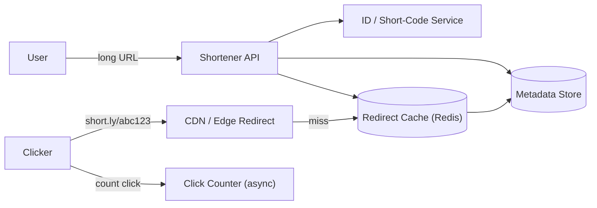

The diagram separates the **write path** (long URL → ID service → metadata store) from the
**read/redirect path** (short code → CDN → cache → metadata → Location redirect). The click
counter is decoupled from the redirect so redirection stays fast.

**Real-life use cases**

- **Marketing attribution**: branded short domains (`go.company.com/campaign`) carry tracking
  params and make URLs scannable; every click is attributed to a campaign.
- **Social/media platforms**: Twitter's `t.co` wraps every link for safety and analytics; SMS
  and QR codes need short URLs.
- **Email campaigns**: newsletters and phishing-protection systems rewrite links through a
  shortener to track opens/clicks and to disable malicious links post-send.
- **App deep links**: short URLs route into mobile apps via deferred deep linking
  (Branch, Firebase Dynamic Links) — the short link encodes both the destination and the
  post-install routing.

---

### Functional Requirements

1. **Shorten a URL**: given a long URL, create a short link that redirects to it; return the
   short code. Authenticated users may optionally supply a custom alias.
2. **Redirect**: `GET /{shortCode}` returns a `301`/`302` redirect to the stored long URL,
   or `404`/`410` if not found / expired / disabled.
3. **Custom aliases**: allow the user to pick a vanity short code (e.g. `/newsletter`), with
   collision detection and reservation.
4. **Expiration / TTL**: pastes/redirects can be time-bounded (expire after N days); expired
   short links return `410 Gone`.
5. **Disabling / deactivating links**: revoke a short link (e.g. for abuse) without deleting the
   row — it returns `410 Gone`.
6. **Analytics / click tracking**: count clicks per short link, optionally with timestamp, IP
   geolocation, user agent, and referrer — recorded without slowing the redirect.
7. **User accounts (optional)**: a dashboard of "my links", ability to edit destination /
   delete / change TTL, and quota enforcement.
8. **Link safety**: optionally check destinations against a blocklist (phishing/malware) before
   serving the redirect, especially for anonymous-created links.

Out of scope for the basic design: user-specific click analytics dashboards, A/B testing of
destinations, and full link-management platforms (those are Bitly-as-a-product, a larger scope).

---

### Non-Functional Requirements

- **Scale**: 1B+ redirects/month baseline (~400–500 redirects/sec average, spikes to 50K–500K
  redirects/sec during a viral campaign); 1M+ new shortens/day (~12 shortens/sec average, with
  burst campaigns).
- **Latency**: redirect < 10 ms p99 (read path is the user-facing SLA; users bounce on slow
  redirects); create < 50 ms p99.
- **Availability**: 99.9%+ for redirects (a down redirect service kills the marketing funnel);
  reads must stay available even if writes are briefly impaired.
- **Durability**: an acknowledged short link must persist; redirecting to a dead link is a
  severe trust failure.
- **Uniqueness**: short codes must be unique — collisions are a correctness bug, not a rate
  feature.

---

### Shared Capacity Planning

Before picking an architecture, nail the numbers. Every design decision flows from these estimates.

#### Step 1 — Traffic Volume

| Metric | Calculation | Result |
|---|---|---|
| Seconds in a year | $60 \times 60 \times 24 \times 365$ | $31.5\text{ M sec/yr}$ |
| Seconds in 10 years | $31.5\text{ M} \times 10$ | $315\text{ M seconds}$ |
| Total writes (10 yr) | $1{,}000\text{ writes/s} \times 315\text{ M s}$ | **315 Billion URLs** |
| Peak reads | $1{,}000 \times 100\text{ (read amplification)}$ | **100,000 req/s** |

The 10×–100× read/write ratio is typical: URL shorteners are write-once, read-many. A viral link can receive millions of redirects minutes after creation.

#### Step 2 — Short Code Length

The character alphabet is digits + uppercase + lowercase = **62 characters**.

$$62^n \geq 315 \times 10^9 \quad \Rightarrow \quad n = 7$$

| Length | Namespace | Covers 315 B? | Headroom |
|---|---|---|---|
| 6 chars | $62^6 \approx 56.8\text{ B}$ | No ($56.8\text{ B} < 315\text{ B}$) | — |
| **7 chars** | $62^7 \approx 3.52\text{ T}$ | **Yes** | ~11× above requirement |
| 8 chars | $62^8 \approx 218\text{ T}$ | Yes (overkill) | 692× |

**→ 7 Base62 characters** is the minimum safe length for this scale.

#### Step 3 — Storage Sizing

Per-row estimate:

| Field | Size | Notes |
|---|---|---|
| `short_code` | 7 B | Fixed-length Base62 string |
| `long_url` | ~100 B | Average URL ~75–100 chars |
| `user_id`, metadata | ~500 B | Owner info, tags, creation IP |
| Timestamps, flags | ~200 B | `created_at`, `expire_at`, `is_deleted` |
| **Row total** | **~1 KB** | Rounded for back-of-envelope |

Raw storage for 315 B rows:

$$315\text{ B} \times 1\text{ KB} = 315\text{ TB}$$

With replication:

| Approach | Replication strategy | Total disk |
|---|---|---|
| Approach 1 — Cassandra RF=3 | 3 copies of every row | $315\text{ TB} \times 3 \approx \mathbf{945\text{ TB}}$ |
| Approach 2 — PostgreSQL 1 primary + 2 replicas | 3 copies of every row | $315\text{ TB} \times 3 \approx \mathbf{945\text{ TB}}$ |

This is spread across many machines (each node typically 4–16 TB of NVMe), so the per-node count is manageable.

#### Step 4 — Bandwidth

**Write path (inbound to Write Service):**

$$1{,}000\text{ writes/s} \times 1\text{ KB/request} \approx \mathbf{1\text{ MB/s inbound}}$$

Negligible — a single 1 Gbps NIC handles this with 99% headroom.

**Read path (outbound from Redirect Service):**

A redirect response is just HTTP headers with a `Location` field — roughly 200–400 bytes:

$$100{,}000\text{ req/s} \times 400\text{ B} \approx \mathbf{40\text{ MB/s outbound}}$$

A single 1 Gbps NIC (≈125 MB/s capacity) can handle this on one server, but the load will be distributed across ~20–30 redirect nodes for fault tolerance.

#### Step 5 — Cache (Redis RAM) Sizing

URL popularity follows a **power-law (Zipf) distribution** — a tiny fraction of URLs gets the vast majority of clicks. This makes caching highly effective.

| Percentile cached | URL count | RAM needed |
|---|---|---|
| Top 1% of 315 B | 3.15 B URLs | $\approx 3\text{ TB}$ — too large for single node |
| Top 0.1% | 315 M URLs | $\approx 315\text{ GB}$ — cluster of large nodes |
| **Top 0.01% (hot tier)** | **31.5 M URLs** | $\approx \mathbf{32\text{ GB}}$ — fits in one 64 GB Redis node |

A 64 GB Redis node with **LRU eviction** naturally keeps the hottest URLs resident. With a **99% cache-hit rate**, only 1,000 of the 100,000 redirect req/s actually reach the database — a **100× reduction** in DB read load.

> **Cache stampede** — when a popular URL's cache entry expires, many concurrent threads miss simultaneously and all query the database at once. Mitigate with a short random TTL jitter (e.g. `TTL ± random(0, 60s)`) or probabilistic early recompute (recompute slightly before expiry using `SETNX` / a distributed lock).

#### Step 6 — Application Server Sizing

| Service | Traffic | Latency target | Throughput per node | Nodes |
|---|---|---|---|---|
| Write Service | 1,000 writes/s | p99 < 100 ms | ~200 writes/s | **5–10** |
| Redirect Service | 100,000 req/s | p99 < 20 ms | ~5,000 req/s (cache hit path) | **20–30** |
| ID Range Service | Peaks with writes | p99 < 5 ms | Single Redis `INCRBY` per 100 K | **2–3 (stateless)** |

Always provision 2× of the calculated minimum for burst capacity, rolling deploys, and hardware failures.

### API Design and Contract

| Endpoint | Purpose | Success | Client errors |
|---|---|---|---|
| `POST /url` | Create short URL | `201 Created` | `400 Bad Request`, `409 Conflict` |
| `GET /{shortCode}` | Redirect to long URL | `301`/`302` | `404 Not Found`, `410 Gone` |

> **301 vs 302** — 301 lets browsers cache the redirect permanently, reducing server load. 302 forces every request through the server, giving you analytics visibility. Choose based on whether analytics matter more than infrastructure cost.

The redirect is the user-facing path and carries the full weight of the SLA. It must be a `301` *or* `302` with a `Location` header and no body, served from cache, with click counting decoupled (see High-Level Design). Error semantics: `404` for never-created codes (a miss), `410 Gone` for expired or revoked codes (a former paste). Never return a `200` page for a miss — that breaks the contract and the browser back-button expectation of a redirect.

**Extended contract details**

- **`POST /url` body**: `{ "longUrl": "https://example.com/...", "customAlias": "newsletter", "ownerId": "...", "expiresAt": "...", "isPublic": true }`.
- **`POST /url` response**: `201` with `{ "shortCode": "abc123", "shortUrl": "https://short.ly/abc123", "expiresAt": "..." }`.
- **Validation**: `longUrl` must be a valid http/https URL; `customAlias` must satisfy `[a-zA-Z0-9_-]{4,32}` and not collide; reject on private-IP/long-TLD abuse (SSRF protection on the redirect target — see Challenges).
- **Rate limiting**: create is heavily limited per IP/user (shorten is cheap to abuse for spam/scam); read is unlimited but CDN-cached. `429` responses include `Retry-After` and `X-RateLimit-*` headers.
- **Idempotency**: `POST /url` is idempotent by `(longUrl, customAlias, ownerId)` for a window — re-shortening the same request returns the same link.
- **Security headers**: the redirect response itself carries no sensitive data, but the *create* endpoint needs auth for privileged features and SSRF-safe validation of the destination.

---

### Characteristics

- **Read-heavy, write-light**
  What it means: redirects outnumber creates ~1000:1. Why it matters: the entire architecture is optimized so creates touch a fast write path and redirects touch only the cache edge. How it works: writes update one metadata row; reads never touch the writer at steady state.

- **Sub-millisecond redirect latency**
  What it means: the redirect path is measured in milliseconds because users notice a slow link. Why it matters: a viral short link can be clicked by millions; a 10 ms redirect vs a 100 ms redirect is a huge UX and bounce difference. How it works: the short-code→destination mapping must be cache-resident or served from an in-memory store, with a single disk/DB hop as the fallback.

- **Write-path hot-key pressure**
  What it means: any scheme deriving the short code from a single monotonic counter (or a single hash shard) centralizes creates. Why it matters: under a burst campaign, one key/row/table is the bottleneck. How it works: the standard mitigation is an ID-generation service that hands out disjoint ranges (Approach 1), or a hash-based key space that shards by code.

- **URL as the contract**
  What it means: the short URL is a public, immutable, forever contract — once printed on a billboard, the link must resolve forever (or explicitly `410`). Why it matters: unlike a session or a token, you cannot recall a short link. How it works: no deletion of live links without becoming a `410`; TTL/expiration is opt-in per paste, not the default.

- **Unbounded key growth**
  What it means: the short-code space grows monotonically. Why it matters: a sequential scheme is eventually consistent across a single shard and cannot shard without re-keying. How it works: the ID service owns disjoint ranges so the space never needs re-partitioning (vs. hash-partitioning the metadata table by short code).

- **Analytics without slowing the redirect**
  What it means: click counting, geo, referer must not inflate the user-visible redirect latency. Why it matters: every microsecond added to the redirect multiplies across millions of clicks. How it works: fire-and-forget logging (queue or UDP/statsd) on the redirect path; never wait for analytics before responding.

---

### Components

- **Redirect Service / Edge redirect**
  Purpose: resolve `shortCode → longUrl` and `301`/`302` redirect. Responsibilities: serve from cache, fall back to metadata, never block on analytics. How it works: the hottest tier (CDN or an in-memory store at the edge); the slow path to DB is the fallback, never the default. Real-world example: bit.ly's edge redirector, t.co's redirect at the CDN edge.

- **Shorten (Create) Service**
  Purpose: validate, generate the short code, persist the mapping. Responsibilities: URL validation (SSRF), custom-alias reservation, ID generation, write to metadata store. How it works: the write path is rate-limited and authenticated for privileged features; it does *not* serve redirects. Real-world example: the API tier that writes to DynamoDB or Cassandra.

- **ID / Short-Code Generator (or ID Range Service)**
  Purpose: produce unique short codes. Responsibilities: uniqueness, monotonicity (if sequential), and — critically — handing out *disjoint ranges* so creates are not serialized on one counter. How it works: Approach 1 uses a range service (e.g. Snowflake-like, or a PostgreSQL `bigserial` range allocator) so each app instance owns a range and encodes `rangeStart + offset` → base62. Random/hash-based schemes sidestep range management entirely. Relationship: called by the create service, never by the redirect path.

- **Metadata Store**
  Purpose: the authoritative `shortCode → longUrl (+owner, ttl, status)` mapping. Responsibilities: uniqueness (unique index on short_code), durability, serving cache misses. Real-world example: Cassandra (wide rows, range queries), PostgreSQL (simple, strong consistency), DynamoDB (single-digit ms at any scale). The store choice is the headline architecture decision — it is the entire system's durability and consistency boundary.

- **Redirect Cache (in-memory / Redis)**
  Purpose: serve the redirect at memory speed. Responsibilities: hold the hot short-code→URL map, support TTL-aligned eviction, serve misses by loading from the metadata store. How it works: cache-aside; the redirect service `GET shortCode` → miss → `SELECT longUrl FROM ...` → populate. Real-world example: Redis cluster at the core, with CDN at the edge doubling as cache.

- **Click Counter (async)**
  Purpose: count and attribute clicks without slowing redirects. Responsibilities: append-only click events with timestamp/IP/UA/referrer, eventual aggregation. How it works: the redirect service emits a fire-and-forget event (queue or statsd) and responds immediately; a separate processor aggregates counts into analytics. Relationship: decouples the redirect SLA from analytics processing. Real-world example: Kafka topics fed by edge redirects.

- **CDN Edge**
  Purpose: serve redirects (and cached mappings) from the edge. Responsibilities: terminate TLS close to users, cache redirects, forward only misses. How it works: either an edge function that looks up the mapping and returns the 30x, or a CDN caching reverse-proxy in front of the redirect service. Real-world example: CloudFront + Lambda@Edge, Cloudflare Workers KV.

---

### Patterns

- **Edge Redirect (the redirect never touches origin for hot links)**
  What it is: the 30x is resolved and returned at the CDN edge (worker / cached reverse proxy). Problem it solves: millions of redirects/sec without app servers. How it works: the short-code→URL map is in an edge-keyed store (KV or Redis at the edge); a cache miss falls through to origin. When to use: any link-shortener reaching >10K redirects/sec or serving global traffic. When not: tiny scale where an app server is simpler. Advantages: near-zero origin cost for the read path, global low latency. Disadvantages: cold-edge KV misses still hit origin (mitigate with warm cache), operational complexity of edge functions. Real-world example: bit.ly's edge redirect, t.co.

- **Disjoint Key Ranges (no single-counter bottleneck)**
  What it is: instead of one global counter, an ID service hands out a range (e.g. 1–1M, 1M–2M) to each app instance; the code is `rangeOffset + localCounter`, encoded to base62. Problem it solves: the single hot row/key under creates. How it works: the range service allocates via a single `UPDATE ... RETURNING` on a ranges table (or a Snowflake-style distributed generator), each instance counts within its range. When to use: when short codes are sequential-ish and create throughput matters. When not: random/hash codes make this unnecessary. Advantages: monotonically increasing keys (storage and cache friendly), no cross-shard coordination per create. Disadvantages: requires a range service and range-exhaustion handling. Real-world example: Twitter's Snowflake, Instagram's ID service.

- **Write-Through / Cache-Aside on the Redirect Path**
  What it is: cache the short-code→URL mapping; populate on miss from the metadata store. Problem it solves: the redirect path must be fast and must not fan out. How it works: `GET cache:{code}` → miss → `SELECT` → `SETEX` cache → respond; writes invalidate/update the cache entry. When to use: the redirect path always. Advantages: simple, DB failure is contained to the cold tail. Disadvantages: brief staleness (acceptable — a long URL doesn't change), invalidation races (mitigate with versioned cache keys: `cache:{code}:{version}`).

- **Decoupled Analytics via Fire-and-Forget Events**
  What it is: count clicks asynchronously so the redirect is never delayed by analytics. Problem it solves: analytics processing cost must not inflate the redirect SLA. How it works: emit a click event (Kafka/queue/statsd) and respond 30x immediately; a separate worker aggregates into a time-series/DB. When to use: always, unless you have no analytics requirement. Advantages: clean SLA separation, independent scaling. Disadvantages: at-least-once delivery (click counts can over-count; acceptable for analytics). Real-world example: every major ad/analytics platform.

- **TTL / Expiration by Design**
  What it is: pastes carry an `expires_at`; expired codes return `410`. Problem it solves: unbounded growth of the metadata table (a real cost at billions of rows). How it works: a `created_at`/`expires_at` index powers both the lazy 410-on-read and an active sweeper (Approach 1 deep dive). When to use: when the use case allows expiry (marketing links usually do not; throwaway pastes do). Advantages: bounded storage, GDPR/right-to-be-forgotten alignment. Disadvantages: a link printed on a billboard that expires is a broken customer experience — make TTL opt-in and long by default.

---

### Benefits

- **Cheap, fast reads at any scale.** The short-code→URL mapping is tiny and cacheable, so the redirect path costs pennies even at millions of requests/sec — the read path does not scale with the team size or budget linearly, it scales with cache hit ratio.
- **Immutable, durable links.** Once created, a short link is a forever contract. This is a feature, not a bug: it makes short links trustworthy for print, email, and social (a billboard URL never rots). The flip side (can't recall) is why `410` must be explicit and rare.
- **Separation of hot read path from write path.** Creates and redirects use different code paths, stores (sometimes entirely different engines), and caches. This isolation lets you scale the read path aggressively and the write path conservatively — and means a write-path incident never takes down redirects.
- **Analytics without SLA risk.** Because click counting is decoupled, you can add geo/referrer/user-agent attribution, A/B tests, and abuse detection on the event stream without ever touching the user-facing redirect latency.
- **Edge delivery.** Resolving the redirect at the CDN edge (not the origin) means the origin sees only cache misses — so a viral link on the front page of Reddit does not wake the on-call engineer.

---

### Pros

- **Redirects are sub-millisecond when cached.** The entire mapping for a hot short code fits in a few bytes; an edge cache or Redis serves it in microseconds, so the redirect SLA is dominated by network round-trip, not by your application.
- **Creates are cheap and rare.** At 12 creates/sec average, even a single database can absorb the writes — the hard part is key uniqueness and range allocation, not write throughput. This is why many shorteners start relational and only shard when a single write shard becomes the ceiling.
- **Strong consistency on the write path is affordable.** Since creates are rare, you can afford a strongly consistent store or a single-writer range allocator; you do not need the write path to be highly available or eventually consistent — the redirect path is what must be always-on.
- **The data model is trivially simple.** One mapping, a few attributes. Simplicity is the reason the domain is so interview-friendly: almost all the complexity is in *how it scales*, not in what it stores.
- **URLs are stable, shareable, and cacheable forever.** This enables aggressive CDN caching (years-long TTLs on redirects) that no other product feature can break.

### Cons

- **Short codes are enumerable if predictable.** Sequential or low-entropy codes (`base62(autoincrement)` with no entropy) let an attacker scrape/guess links and access "private" pastes. Mitigation: add entropy (random component), longer codes, or a key service that emits non-sequential codes. This is a real security property, not a hypothetical.
- **A single short code is a forever liability.** If a short link is printed on a million flyers and the destination is compromised later, you cannot recall it — you can only `410` it (breaking the flyers) or redirect it to a safe page. URL shorteners are high-value for phishing precisely because the destination can be changed; treat redirect destination mutation as a privileged, audited operation.
- **Redirect analytics are coarse and spoofable.** User-agent and referer are client-supplied and trivially forged; IP geolocation is imprecise; and HTTPS strips the referer across origins. Do not rely on click analytics for security or billing.
- **SSRF risk on the destination.** Accepting arbitrary `longUrl`s and then *fetching or embedding* them (preview/thumbnail) turns your service into an SSRF proxy. Even redirect-only shorteners must validate the destination (block private IPv4/6, localhost, metadata endpoints, and `.internal`/`.local` TLDs) and re-resolve at redirect time. This is an easy correctness gap in interviews.
- **Write-path hot key under sequential schemes.** A single counter is the bottleneck under burst campaigns; the fix is the range-service or random scheme, but that adds complexity. Many teams start sequential and refactor under pain — a deliberate trade-off.

---

### Challenges

- **Technical: key uniqueness under concurrency at scale.** Without a single-writer range allocator or a collision check, concurrent app instances generating sequential keys collide or race on the shared counter. The distributed solution is either a range service (Approach 1) or a random keyspace large enough that collisions are astronomically unlikely and handled by a `GET`-then-`retry` in the rare case. The wrong answer is a read-then-write check-then-insert on a shared counter.
- **Scalability: the redirect hot key / the viral link.** One short code receiving millions of clicks becomes a single cache-key hot spot. Mitigations: edge caching (the CDN absorbs it), cache warming a fresh code before promotion, and single-flight so a cache miss for a viral code triggers one origin fetch, not a stampede.
- **Performance: redirect latency budget.** The redirect must be faster than a human-perceivable threshold (~10 ms includes network). That budget buys very little headroom, so anything beyond a cache hit (DB read, analytics emit) must be on the critical path only for cold keys — which is why analytics are decoupled and why DB reads are strictly the miss path.
- **Reliability: redirect availability vs. create availability.** At billion-row scale, a metadata-store outage takes down *all* redirects (cache miss → origin → 5xx). The design goal is that cache hit ratio + CDN coverage make the origin rarely hit — and that a metadata store outage degrades to "stale cache serves for a while" rather than total failure. Plan cache TTLs and stale-while-revalidate accordingly.
- **Maintainability: schema and code evolution on a forever link.** The short-code→long-URL mapping cannot change shape casually (old links must keep resolving). Schema changes (adding fields, splitting tables) must be backward-compatible; large backfill jobs can lock the write path. Version the internal record format and migrate lazily on read.
- **Operational: range exhaustion and key reuse.** A range-key service must detect range exhaustion and issue a new range without downtime; reusing ranges across app instances risks collision. Monitor the high-water mark of each range and alert at 90% utilization.
- **Security: SSRF and link abuse.** Beyond SSRF (above), anonymous shortening is a spam/scam vector. Countermeasures: create rate limits (strong), link-preview validation, and — for higher trust — manual review or phone/SMS verification for bulk creation. The redirect itself should also set `Referrer-Policy: no-referrer` and, if serving previews, sandbox them.
- **Compliance: right-to-be-forgotten vs. link permanence.** GDPR "right to erasure" conflicts with the immutability contract. Design a `410`-only lifecycle and ensure the metadata row is soft-deleted then hard-purged on a schedule; content (none here — just a URL) is not an issue, but logs/analytics may need the same treatment.

---

### Best Practices

- **Cache the redirect at the edge and keep the origin cold-path small.** Why: a viral link lives and dies by cache hit ratio. Long TTLs on redirects, warm the cache for fresh high-traffic codes, and make a cache miss a single key-value lookup — never a join or a scan.
- **Decouple click analytics from the redirect.** Why: analytics is the easiest thing to accidentally put on the critical path. Emit a click event and return the 30x immediately; aggregate later. The redirect SLA should never wait on a database write.
- **Use a range-ID service (or random codes) for creates — never a shared counter.** Why: the shared counter is the first thing to break under a burst. Even if you don't need the burst today, the refactor from "I'll use a counter" to "I need ranges" is a migration that touches the core write path — pick the range/random scheme up front and avoid it.
- **Validate and re-resolve redirect destinations at serve time (SSRF protection).** Why: validating at create time is insufficient if the destination IP later points to a metadata endpoint. Re-resolve and re-check the destination IP against the private-IP block on each redirect (or at least on cache miss), and block `.internal`/`.local` and bare IPs where the product allows.
- **Make `410` the only way to "delete" a live link, and make it rare + audited.** Why: a live short link is a public contract; soft-deleting it silently breaks embeds/QR codes without warning. Expose explicit disable (→ `410`) with an audit trail, and prefer redirect-to-a-safe-page over a naked `404` for revoked links.
- **Version the internal mapping record and migrate on read.** Why: you cannot bulk-rewrite billions of short-link rows safely. A versioned internal schema with read-time migration keeps old links resolving while new writes use the new shape.
- **Rate-limit creation aggressively, reads permissively.** Why: creation is the abuse vector (scam/phishing links) and is cheap to limit per IP; reads are cheap to serve from cache and are the product's purpose — tightening read limits hurts virality.

---

### When to Use and When Not to Use

**This design is appropriate when:**

- You need short, shareable links at meaningful scale (marketing, social media, email).
- Redirects must be fast and highly available (the link is in print/SMS/social — user experience directly).
- Create rate is low relative to read rate (the read-heavy asymmetry holds).

**This design is not appropriate when:**

- **You need end-to-end encryption or zero-knowledge links** — standard shorteners are transparent; encrypted/encrypted-at-rest links (e.g. one-time encrypted notes like Privnote) are a different design.
- **Links are high-security by design** — a shortener that anyone can create links on is a phishing amplifier; you need abuse review, domain allowlisting, and user verification, which changes the threat model substantially.
- **You need full link-management (auditing, teams, SSO, A/B destinations)** — at that point you are building Bitly-as-a-product; the simple redirect system is a starting point, not the end state.

**Alternatives to consider:** a managed shortener (Bitly, Rebrandly, Firebase Dynamic Links) when links are not your core product; t.co/Firebase Dynamic Links for mobile deep-linking; a reverse proxy `rewrite` rule for an internal, low-scale mapping.

**Decision factors:** expected redirect volume and latency budget, whether links must be permanent or TTL'd, the abuse/vishing risk tolerance, and whether analytics/attribution are a product feature or incidental.

---

### Use Cases

#### Use Case 1: Marketing campaign short links (`go.company.com/spring-sale`)

- **Problem**: marketing runs many campaigns; long UTM-laden URLs are unwieldy in SMS, QR codes, and print; each needs attribution and a branded short domain.
- **Proposed solution**: a create endpoint that issues branded vanity codes (reserved per-campaign) pointing to the full UTM URL, with click analytics streamed to the attribution warehouse.
- **Why suitable**: creates are rare (per campaign), redirects are hot and cacheable, and the edge redirect means the billboard link never depends on the marketing service staying up.
- **How it works**: `POST /url` with `customAlias` and `ownerId=campaign` reserves the code; the redirect is resolved at the CDN edge; clicks are emitted to Kafka for attribution.
- **Trade-offs**: vanity codes must be reserved (409 on collision), so a campaign service must handle conflicts; a revoked/deleted campaign link returns 410 (print materials can't be updated).

#### Use Case 2: Twitter/X t.co-style link wrapping

- **Problem**: every link in a tweet must be short, wrapped for safety/analytics, and resolved quickly at massive volume (hundreds of thousands of redirects/sec globally).
- **Proposed solution**: server-side wrapping at tweet-compose time into `t.co/XXXX`, with the redirect resolved at the CDN edge from a KV store; unwrapping/redirect happens without origin contact for cached codes.
- **Why suitable**: the extreme read skew (a few viral links dominate) and the global-latency requirement make edge resolution essential — this is the canonical "edge redirect" use case.
- **How it works**: tweet composer calls `POST /url` → edge KV populated; at click, edge worker returns 30x; click event streamed asynchronously.
- **Trade-offs**: edge KV cold misses still hit origin (cache warming for high-profile links mitigates); link safety requires inspecting destination content, which is an async queue off the redirect path to avoid latency.

#### Use Case 3: One-time self-destructing notes (a pastebin-flavored short link)

- **Problem**: a shareable link that is valid for a limited number of reads or time, then is gone.
- **Proposed solution**: add a `readCount`/`maxReads` and `expiresAt` to the mapping; the redirect service decrements `maxReads` atomically and returns 410 when exhausted.
- **Why suitable**: reuses the same redirect/cache machinery with a stateful twist; the short-code→URL map is still the core, but now reads have side effects.
- **How it works**: the redirect service, on a cache miss, `UPDATE links SET read_count = read_count + 1 WHERE short_code = ? AND read_count < max_reads RETURNING *`; serve the 30x if a row comes back, else 410 and let a sweeper hard-delete. Cache the "410" outcome briefly too (don't let exhausted links hammer the DB).
- **Trade-offs**: the read-side becomes stateful, so cache invalidation on exhaustion is essential (a cached 30x would over-serve a consumed link); this is the point where "short link" and "one-time link" diverge architecturally.

---

### High-Level Design

This section unifies the three approaches below (Approach 1: Cassandra + range service; Approach 2: PostgreSQL + replicas; Approach 3: AWS-native) into the canonical architecture every variant shares:

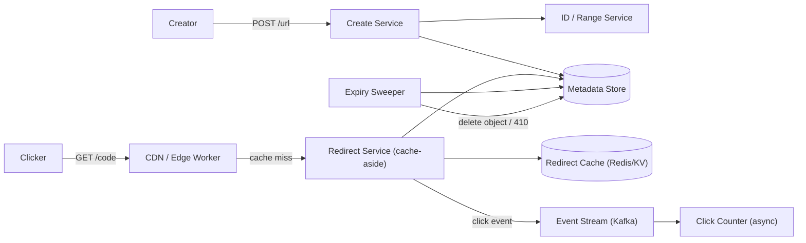

**The three invariant responsibilities, regardless of approach:**

1. **Resolve `shortCode → longUrl` from cache, falling back to metadata.** This is the redirect path; it must be cache-resident for hot codes and must never fan out (one lookup, one redirect). Click counting happens *after* the redirect decision, fire-and-forget.
2. **Create: validate → allocate short code → persist mapping.** This is the write path; uniqueness is the hard part, and the approach decision is entirely about *how* uniqueness and range are achieved (range service vs random vs managed service).
3. **Keep expired/revoked links returning 410 and reclaimed.** Lazy (410 on read) + active (sweeper) — identical to the pastebin expiry design.

**Redirect flow**

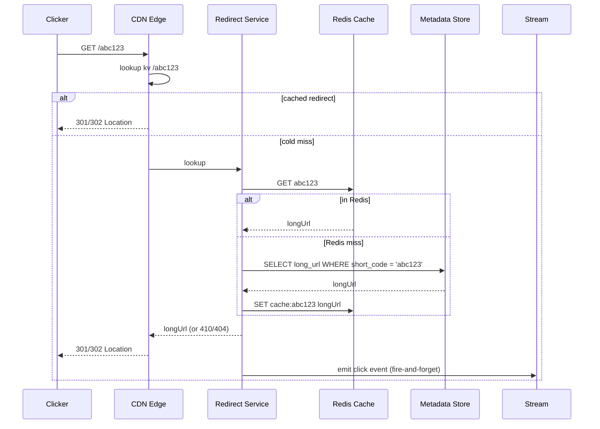

The click event is emitted *after* the redirect decision is made and the response is already in flight to the client — analytics latency never enters the user-visible redirect latency.

**Scaling strategy**

- **Reads**: edge cache (CDN/KV) absorbs the hot tail; Redis cache-aside handles warm codes; metadata store sees only cold misses. Redirect service scales on cache-hit-ratio, not on CPU.
- **Writes**: the create path is rare; the constraint is key uniqueness/range allocation, which is why Approach 1 uses a range service and random schemes use a large keyspace.
- **The viral code problem**: cache the `410`/`404` outcome briefly too (don't let an exhausted or revoked code hammer the DB), and warm the cache for high-profile codes before promotion.

**Failure handling**

- Metadata store outage: cached redirects still work; uncached codes 404/5xx. The SLA goal is high cache hit ratio + long TTLs so this is rare.
- Range service outage (Approach 1): creates fail (no new codes) but redirects keep working — the correct failure priority.
- CDN outage: falls back to the redirect service, which falls back to Redis, which falls back to the metadata store — each layer a strict fallback, never a hard dependency for the others.

---

### Approach 1: High-Scale Distributed System (Cassandra + ID Range Service)

**When to use:** sustained internet-scale traffic, hundreds of billions of rows, global user base, strong availability requirement over strict consistency.

#### System Architecture

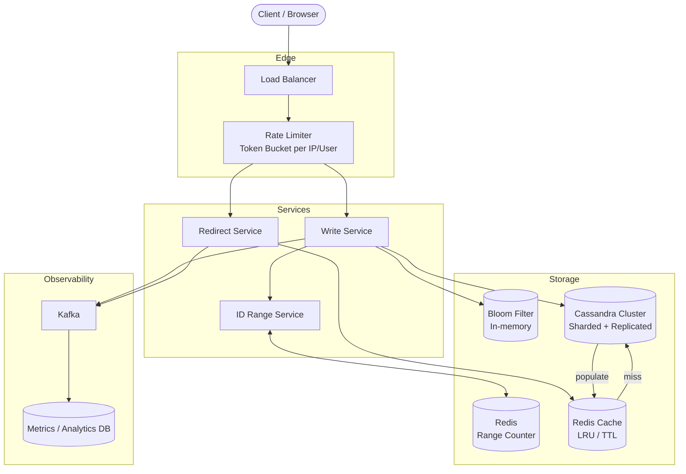

#### ID Generation: Two Strategies

The core challenge is producing a unique, non-guessable 7-character short code at high velocity.

**Strategy A — Hashing (non-deterministic)**

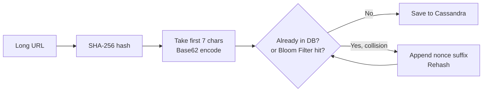

- Pros: same long URL always maps to the same short code (idempotent).
- Cons: each collision requires an extra DB/Bloom Filter lookup; under high load collisions add latency; the flow is non-deterministic.
- The Bloom Filter acts as a first gate — if the filter says "definitely not present", skip the DB read entirely. False positives cause a redundant DB check (safe); false negatives are impossible.

**Strategy B — Range Service (deterministic, preferred)**

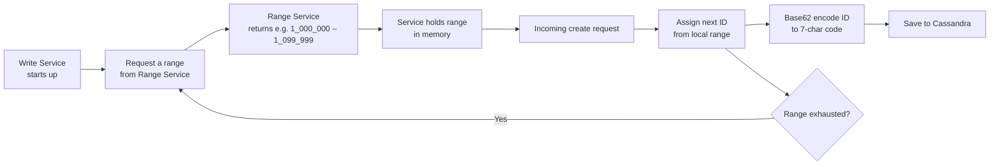

The full numeric space is $0$ to $3.52\text{ T}$ (the $62^7$ ceiling). The Range Service partitions this into chunks (e.g., 100,000 IDs per chunk). Each Write Service instance claims a chunk at startup and works through it locally, only contacting the Range Service again when the chunk runs out.

| Property | Hash Strategy | Range Strategy |
|---|---|---|
| Speed | Slower (collision retry) | Fast (no DB round-trip per ID) |
| Predictability | Non-deterministic | Deterministic / sequential |
| Collision risk | Possible | None |
| Loss on crash | None | Up to one chunk (~0.003% of capacity) |
| Recommended | Secondary / custom aliases | Primary write path |

#### Write Flow (Sequence)

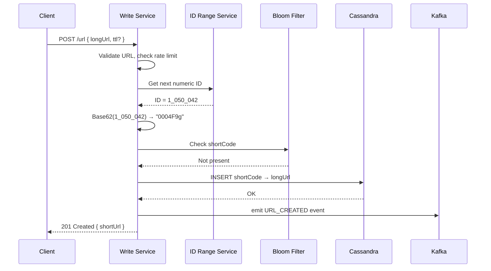

#### Redirect Flow (Sequence)

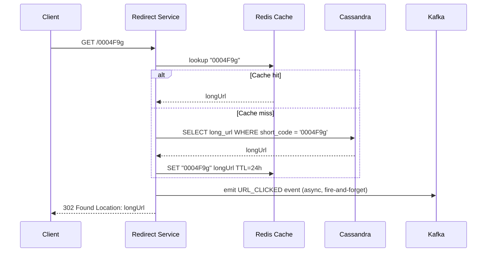

#### Database Layer (Cassandra)

Cassandra stores the data in two tables partitioned by access pattern:

- **`url_by_code`** — primary redirect lookup, partitioned by `short_code` so any node can handle any redirect.
- **`code_by_url_hash`** — reverse lookup for idempotent creates (same long URL → same short code).

Sharding is automatic in Cassandra through consistent hashing of the partition key. Replication factor of 3 across multiple data centres gives fault tolerance.

#### Observability Pipeline

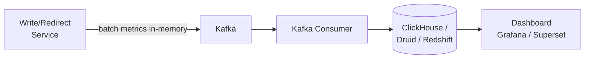

Metrics are buffered in-process to avoid per-request DB writes on the hot redirect path. A background thread flushes them to Kafka every few seconds, keeping redirect latency unaffected.

#### Additional Considerations

| Concern | Approach |
|---|---|
| Custom alias | Bloom Filter or DB lookup before insert; `409` on conflict |
| Expiration | Store `expire_at`; TTL in Cassandra or a cron soft-delete job |
| Rate limiting | Token bucket per user/IP at the API gateway |
| URL validation | Reject non-HTTP(S), oversized, or malformed URLs at ingress |
| Security | HTTPS/HSTS, WAF, abuse/phishing URL blocklist |

### Java and Spring Boot Implementation Guide

Each architectural approach below ships a production-oriented Spring Boot (3.x) implementation. The three implementations are:

- **Approach 1** (Cassandra + ID range service): a Spring Boot service backed by Cassandra, with a centralized range-ID service for unique short codes and Kafka for decoupled click events. See `Spring Boot Implementation (Approach 1 — Cassandra + Kafka)`.
- **Approach 2** (PostgreSQL + replicas): a simpler, strongly-consistent Spring Boot service behind a PostgreSQL primary with read replicas — see `Spring Boot Implementation (Approach 2 — PostgreSQL + Kafka)`.
- **Approach 3** (AWS-native): the write path implemented as AWS Lambda using Java + Spring Boot (Spring Cloud Function), with a Node.js `Lambda@Edge` redirector — see `AWS Lambda (Write) — Java / Spring Boot`.

Common concerns across all three implementations:

- The **redirect path** returns a `301`/`302` from the CDN/edge and must never synchronously hit the database for a hot code.
- **Click counting is decoupled**: the redirect service emits a `ClickEvent` to Kafka/fire-and-forget and responds immediately.
- The **create endpoint** validates the `longUrl` (SSRF-safe), reserves vanity aliases, and returns `400`/`409` clearly.
- **External configuration** (DB contact points, cache TTLs, rate-limit thresholds, redirect type 301 vs 302) is injected via Spring `@Value`/`@ConfigurationProperties`, so no operational toggle requires a redeploy.
- All three follow the same component split: the redirect logic is stateless and scales independently of the create service — which is the central system-design invariant for this domain.

#### Spring Boot Implementation (Approach 1 — Cassandra + Kafka)

**Key dependencies**

```xml
<!-- pom.xml -->
<dependency>
    <groupId>org.springframework.boot</groupId>
    <artifactId>spring-boot-starter-data-cassandra</artifactId>
</dependency>
<dependency>
    <groupId>org.springframework.boot</groupId>
    <artifactId>spring-boot-starter-data-redis</artifactId>
</dependency>
<dependency>
    <groupId>org.springframework.kafka</groupId>
    <artifactId>spring-kafka</artifactId>
</dependency>
```

**`application.yml`**

```yaml
spring:
  data:
    cassandra:
      keyspace-name: url_shortener
      contact-points: cassandra1,cassandra2,cassandra3
      port: 9042
      local-datacenter: datacenter1
      request:
        consistency: LOCAL_QUORUM   # RF/2+1 nodes in local DC must agree
    redis:
      host: redis-primary
      port: 6379
  kafka:
    bootstrap-servers: kafka-broker1:9092,kafka-broker2:9092
    producer:
      acks: "1"            # leader ack — good balance of speed and durability
      linger-ms: 5         # batch up to 5 ms of events before flushing
      batch-size: 16384    # bytes per producer batch
      key-serializer: org.apache.kafka.common.serialization.StringSerializer
      value-serializer: org.springframework.kafka.support.serializer.JsonSerializer
```

**`UrlEntity.java`** — Cassandra table mapping

```java
@Table("url_by_code")
public class UrlEntity {

    @PrimaryKey                   // maps to Cassandra partition key
    private String shortCode;

    @Column("long_url")
    private String longUrl;

    @Column("created_at")
    private Instant createdAt;

    @Column("expire_at")
    private Instant expireAt;

    @Column("user_id")
    private String userId;

    @Column("is_deleted")
    private boolean deleted;

    // getters / setters omitted
}
```

**`UrlRepository.java`**

```java
@Repository
public interface UrlRepository extends CassandraRepository<UrlEntity, String> {}
```

**`Base62Encoder.java`** — shared utility (used by both approaches)

```java
public final class Base62Encoder {

    private static final String ALPHABET =
        "0123456789ABCDEFGHIJKLMNOPQRSTUVWXYZabcdefghijklmnopqrstuvwxyz";

    private Base62Encoder() {}

    public static String encode(long num) {
        if (num < 0) throw new IllegalArgumentException("num must be non-negative");
        if (num == 0) return "0000000";
        StringBuilder sb = new StringBuilder();
        while (num > 0) {
            sb.append(ALPHABET.charAt((int) (num % 62)));
            num /= 62;
        }
        String code = sb.reverse().toString();
        return "0".repeat(Math.max(0, 7 - code.length())) + code; // left-pad to 7 chars
    }
}
```

**`IdRangeService.java`** — Redis-backed range allocator

```java
@Service
public class IdRangeService {

    private static final long RANGE_SIZE = 100_000L;

    private final StringRedisTemplate redis;
    private long nextId   = 0;
    private long rangeEnd = -1;

    public IdRangeService(StringRedisTemplate redis) {
        this.redis = redis;
    }

    /**
     * Returns the next globally unique numeric ID.
     *
     * Each JVM instance claims an exclusive block via Redis INCRBY — multiple
     * Write Service replicas will never produce duplicate IDs without any
     * distributed coordination beyond the atomic Redis command.
     *
     * If a server crashes mid-range, those unused IDs are lost, but that is
     * acceptable: we need only 315 B IDs and have 3.52 T available.
     */
    public synchronized long nextId() {
        if (nextId > rangeEnd) {
            Long newTop = redis.opsForValue().increment("url:id:counter", RANGE_SIZE);
            if (newTop == null) throw new IllegalStateException("Redis unavailable");
            rangeEnd = newTop - 1;
            nextId   = newTop - RANGE_SIZE;
        }
        return nextId++;
    }
}
```

**`ClickEvent.java`** — Kafka message

```java
public record ClickEvent(
    String  shortCode,
    String  userAgent,
    String  remoteAddr,
    Instant clickedAt
) {}
```

**`UrlService.java`** — core business logic

```java
@Service
public class UrlService {

    private final UrlRepository                     urlRepo;
    private final IdRangeService                    idRangeService;
    private final StringRedisTemplate               redis;
    private final KafkaTemplate<String, ClickEvent> kafka;

    public UrlService(UrlRepository urlRepo, IdRangeService idRangeService,
                      StringRedisTemplate redis,
                      KafkaTemplate<String, ClickEvent> kafka) {
        this.urlRepo        = urlRepo;
        this.idRangeService = idRangeService;
        this.redis          = redis;
        this.kafka          = kafka;
    }

    public String create(String longUrl, String customAlias, Duration ttl) {
        String shortCode = (customAlias != null && !customAlias.isBlank())
            ? customAlias
            : Base62Encoder.encode(idRangeService.nextId());

        UrlEntity entity = new UrlEntity();
        entity.setShortCode(shortCode);
        entity.setLongUrl(longUrl);
        entity.setCreatedAt(Instant.now());
        entity.setExpireAt(ttl != null ? Instant.now().plus(ttl) : null);
        entity.setDeleted(false);
        urlRepo.save(entity);

        return shortCode;
    }

    public String resolve(String shortCode) {
        // L1: Redis cache — O(1), sub-millisecond
        String cached = redis.opsForValue().get("url:" + shortCode);
        if (cached != null) return cached;

        // L2: Cassandra — single-partition read, ~2–5 ms
        UrlEntity entity = urlRepo.findById(shortCode)
            .filter(e -> !e.isDeleted())
            .filter(e -> e.getExpireAt() == null || e.getExpireAt().isAfter(Instant.now()))
            .orElseThrow(() -> new UrlNotFoundException(shortCode));

        // Populate cache; honour the URL's own expiry as the upper bound
        Duration cacheTtl = entity.getExpireAt() != null
            ? Duration.between(Instant.now(), entity.getExpireAt())
            : Duration.ofHours(24);
        redis.opsForValue().set("url:" + shortCode, entity.getLongUrl(), cacheTtl);

        return entity.getLongUrl();
    }

    public void emitClick(String shortCode, String userAgent, String remoteAddr) {
        // Fire-and-forget: send() returns a Future; we do NOT call .get()
        // so the redirect response is never delayed by Kafka latency
        kafka.send("url.clicks", shortCode,
            new ClickEvent(shortCode, userAgent, remoteAddr, Instant.now()));
    }
}
```

**`UrlController.java`**

```java
@RestController
public class UrlController {

    private final UrlService urlService;

    public UrlController(UrlService urlService) {
        this.urlService = urlService;
    }

    @PostMapping("/url")
    public ResponseEntity<Map<String, String>> create(
            @RequestBody @Valid CreateUrlRequest request) {
        String code = urlService.create(
            request.longUrl(), request.customAlias(), request.ttl());
        return ResponseEntity.status(HttpStatus.CREATED)
                .body(Map.of("shortUrl", "https://short.ly/" + code));
    }

    // Regex in @GetMapping ensures only 7-char alphanumeric codes reach this handler;
    // anything else falls through to a 404 without entering business logic
    @GetMapping("/{shortCode:[A-Za-z0-9]{7}}")
    public ResponseEntity<Void> redirect(
            @PathVariable String shortCode,
            HttpServletRequest httpRequest) {
        String longUrl = urlService.resolve(shortCode);
        urlService.emitClick(shortCode,
            httpRequest.getHeader("User-Agent"),
            httpRequest.getRemoteAddr());
        return ResponseEntity.status(HttpStatus.FOUND)
                .location(URI.create(longUrl))
                .build();
    }
}
```

---

### Approach 2: Moderate-Scale Relational System (PostgreSQL + Replicas)

**When to use:** lower write rate (200–300/sec), total data in the tens of TB range, small team that values simplicity, strong consistency, and familiar SQL tooling.

#### System Architecture

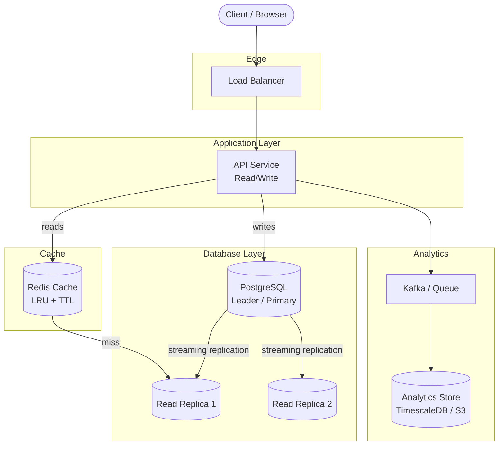

#### Why PostgreSQL works here

PostgreSQL uses a **B+ Tree** index on `short_code` (declared `UNIQUE`). Lookups on the primary key or unique index are $O(\log n)$ and very fast. A single well-tuned PostgreSQL instance on NVMe storage can serve tens of terabytes and billions of rows. Table size is capped at 32 TB per table, but multiple tables or partitioning by date/range can extend this further.

For write scale-out, **Citus** adds transparent sharding on top of standard PostgreSQL without changing application SQL. This is a safe migration path: start single-node, shard later when metrics justify it.

#### Redirect Read Path

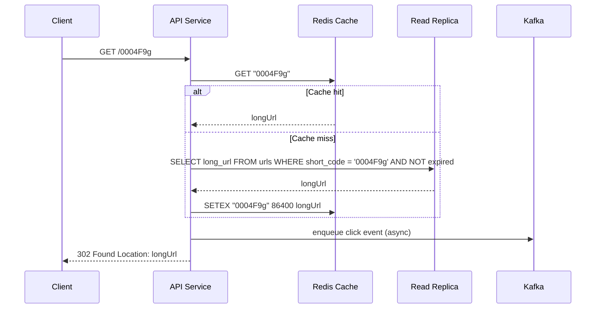

#### Write Path and ID Generation

PostgreSQL's `BIGSERIAL` (auto-increment) generates a unique integer `id` for every inserted row. The application Base62-encodes that integer to produce the 7-character short code and updates the row in the same transaction. This avoids the need for a separate Range Service — the database itself is the single source of truth for ID allocation.

For idempotency (same long URL → same short code), a `url_dedup` table keyed on `SHA-256(longUrl)` is checked before inserting.

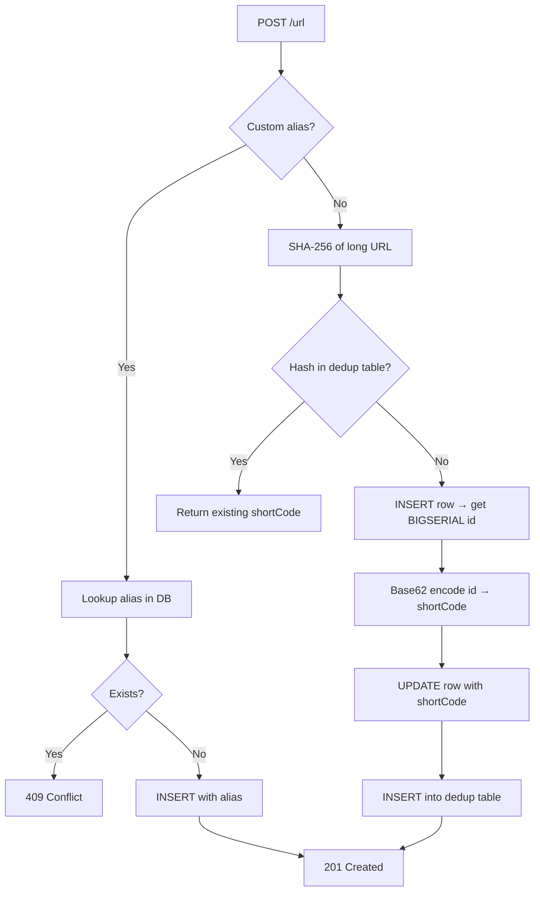

#### Database Design Comparison

| Property | Cassandra (Approach 1) | PostgreSQL (Approach 2) |
|---|---|---|
| Consistency | Eventual (tunable) | Strong (ACID) |
| Write throughput | Very high (leaderless) | High (single leader) |
| Read throughput | High (any replica) | High (read replicas + cache) |
| Sharding | Built-in (consistent hashing) | Manual / Citus extension |
| Operational complexity | Higher | Lower |
| Index type | Partition key (hash) | B+ Tree (ordered) |
| Best for | 315 TB+, global scale | Tens of TB, single region |

#### Caching Strategy

Both approaches use Redis for hot redirects. For a URL shortener, **read-through caching with LRU eviction** makes sense:

- On redirect: check cache first, fall through to DB on miss, populate cache.
- TTL set to 24 hours (or to the URL's `expire_at`, whichever is sooner).
- For Approach 2 the cache also insulates the read replicas from the ~100x read amplification.

#### Spring Boot Implementation (Approach 2 — PostgreSQL + Kafka)

**Key dependencies**

```xml
<!-- pom.xml -->
<dependency>
    <groupId>org.springframework.boot</groupId>
    <artifactId>spring-boot-starter-data-jpa</artifactId>
</dependency>
<dependency>
    <groupId>org.postgresql</groupId>
    <artifactId>postgresql</artifactId>
</dependency>
<dependency>
    <groupId>org.springframework.boot</groupId>
    <artifactId>spring-boot-starter-cache</artifactId>
</dependency>
<dependency>
    <groupId>org.springframework.boot</groupId>
    <artifactId>spring-boot-starter-data-redis</artifactId>
</dependency>
<dependency>
    <groupId>org.springframework.kafka</groupId>
    <artifactId>spring-kafka</artifactId>
</dependency>
```

**`application.yml`**

```yaml
spring:
  datasource:
    url: jdbc:postgresql://pg-primary:5432/url_shortener
    username: app
    password: ${DB_PASSWORD}
    hikari:
      maximum-pool-size: 20    # keep DB connections bounded; pair with PgBouncer
      minimum-idle: 5
  jpa:
    hibernate:
      ddl-auto: validate       # never let Hibernate auto-migrate in production
    properties:
      hibernate.dialect: org.hibernate.dialect.PostgreSQLDialect
  cache:
    type: redis                # @Cacheable annotations route through Redis
  data:
    redis:
      host: redis-primary
      port: 6379
  kafka:
    bootstrap-servers: kafka-broker1:9092,kafka-broker2:9092
    producer:
      acks: "1"
      key-serializer: org.apache.kafka.common.serialization.StringSerializer
      value-serializer: org.springframework.kafka.support.serializer.JsonSerializer
```

**`UrlEntity.java`** — JPA entity

```java
@Entity
@Table(
    name = "urls",
    indexes = @Index(name = "idx_urls_expire_at", columnList = "expire_at")
)
public class UrlEntity {

    @Id
    @GeneratedValue(strategy = GenerationType.IDENTITY)  // BIGSERIAL in PostgreSQL
    private Long id;

    @Column(name = "short_code", unique = true, nullable = false, length = 16)
    private String shortCode;

    @Column(name = "long_url", nullable = false, length = 2048)
    private String longUrl;

    @Column(name = "user_id")
    private Long userId;

    @Column(name = "created_at", nullable = false, updatable = false)
    private Instant createdAt = Instant.now();

    @Column(name = "expire_at")
    private Instant expireAt;

    @Column(name = "is_deleted", nullable = false)
    private boolean deleted = false;

    // getters / setters omitted
}
```

**`UrlRepository.java`**

```java
@Repository
public interface UrlRepository extends JpaRepository<UrlEntity, Long> {

    Optional<UrlEntity> findByShortCodeAndDeletedFalse(String shortCode);

    boolean existsByShortCode(String shortCode);
}
```

**`UrlService.java`** — with Spring Cache (`@Cacheable`) backed by Redis

```java
@Service
@Transactional
public class UrlService {

    private final UrlRepository                     urlRepo;
    private final KafkaTemplate<String, ClickEvent> kafka;

    public UrlService(UrlRepository urlRepo,
                      KafkaTemplate<String, ClickEvent> kafka) {
        this.urlRepo = urlRepo;
        this.kafka   = kafka;
    }

    /**
     * @Cacheable: on first call, Spring executes the method body, caches the
     * returned String in Redis under key "urls::{shortCode}", and returns it.
     * Subsequent calls with the same shortCode skip the method body entirely
     * and return the cached value directly from Redis.
     */
    @Transactional(readOnly = true)
    @Cacheable(value = "urls", key = "#shortCode", unless = "#result == null")
    public String resolve(String shortCode) {
        return urlRepo.findByShortCodeAndDeletedFalse(shortCode)
            .filter(e -> e.getExpireAt() == null || e.getExpireAt().isAfter(Instant.now()))
            .map(UrlEntity::getLongUrl)
            .orElseThrow(() -> new UrlNotFoundException(shortCode));
    }

    /**
     * @CacheEvict removes the cached entry when a URL is soft-deleted,
     * preventing stale cache hits after deletion.
     */
    @CacheEvict(value = "urls", key = "#shortCode")
    public void delete(String shortCode) {
        urlRepo.findByShortCodeAndDeletedFalse(shortCode).ifPresent(e -> {
            e.setDeleted(true);
            urlRepo.save(e);
        });
    }

    public String create(String longUrl, String customAlias, Duration ttl) {
        if (customAlias != null && urlRepo.existsByShortCode(customAlias)) {
            throw new AliasAlreadyTakenException(customAlias);
        }

        UrlEntity entity = new UrlEntity();
        entity.setLongUrl(longUrl);
        // Use the custom alias directly, or a temporary placeholder that will
        // be replaced once we have the auto-generated PK
        entity.setShortCode(customAlias != null ? customAlias : "TEMP_" + UUID.randomUUID());
        entity.setExpireAt(ttl != null ? Instant.now().plus(ttl) : null);

        UrlEntity saved = urlRepo.save(entity);   // triggers BIGSERIAL; saved.getId() is now set

        if (customAlias == null) {
            // Derive the short code from the auto-generated PK and update it
            String derived = Base62Encoder.encode(saved.getId());
            saved.setShortCode(derived);
            urlRepo.save(saved);                  // one extra UPDATE per create — acceptable
        }

        return saved.getShortCode();
    }

    public void emitClick(String shortCode, String userAgent, String remoteAddr) {
        kafka.send("url.clicks", shortCode,
            new ClickEvent(shortCode, userAgent, remoteAddr, Instant.now()));
    }
}
```

**`UrlController.java`** — identical REST interface to Approach 1

```java
@RestController
public class UrlController {

    private final UrlService urlService;

    public UrlController(UrlService urlService) {
        this.urlService = urlService;
    }

    @PostMapping("/url")
    public ResponseEntity<Map<String, String>> create(
            @RequestBody @Valid CreateUrlRequest request) {
        String code = urlService.create(
            request.longUrl(), request.customAlias(), request.ttl());
        return ResponseEntity.status(HttpStatus.CREATED)
                .body(Map.of("shortUrl", "https://short.ly/" + code));
    }

    @GetMapping("/{shortCode:[A-Za-z0-9]{7}}")
    public ResponseEntity<Void> redirect(
            @PathVariable String shortCode,
            HttpServletRequest httpRequest) {
        String longUrl = urlService.resolve(shortCode);
        urlService.emitClick(shortCode,
            httpRequest.getHeader("User-Agent"),
            httpRequest.getRemoteAddr());
        return ResponseEntity.status(HttpStatus.FOUND)
                .location(URI.create(longUrl))
                .build();
    }
}
```

> **Key difference from Approach 1**: in Approach 2, Spring Cache's `@Cacheable` handles Redis automatically so you don't need to manually call `redis.opsForValue().set(...)`. In Approach 1, manual cache management is used because Cassandra entities need custom TTL alignment logic that Spring Cache doesn't expose out of the box.

#### When to Evolve Approach 2 → Approach 1

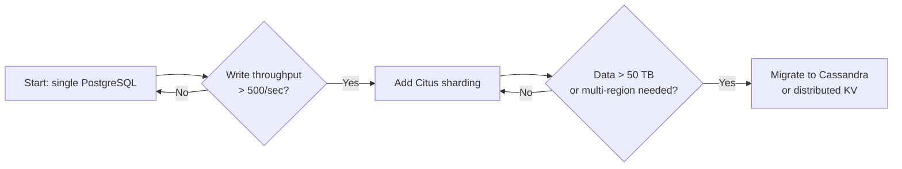

---

### Deep Dive

---

#### Apache Kafka

Kafka is a distributed, **append-only commit log**. Data is written sequentially to disk, making it extremely fast for high-throughput event streams.

**Core concepts**

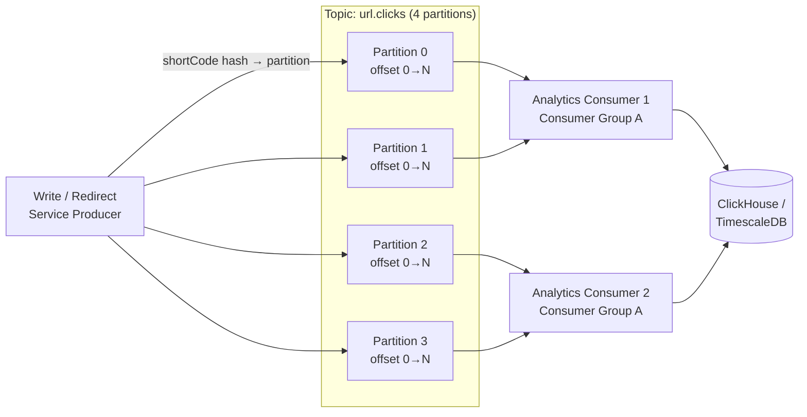

- **Topic**: a named, ordered stream of messages. Messages are never removed on read — they expire after the configured retention window (e.g. 7 days).
- **Partition**: a topic is split into partitions for parallelism. Each partition is an ordered, immutable sequence; ordering is guaranteed only within a partition.
- **Partition key**: using `shortCode` as the key means all clicks for the same URL land on the same partition — useful if consumers need per-URL aggregation in order.
- **Consumer group**: multiple consumer instances share a group name. Kafka assigns each partition to exactly one consumer in the group, giving horizontal scale without duplicate processing.
- **Offset**: each message has a numeric offset within its partition. Consumers commit their offset to Kafka, enabling restart-from-last-position after a crash.

**Producer configuration choices**

| Setting | Value | Reason |
|---|---|---|
| `acks` | `1` | Leader persists the message before acking. Fast write, acceptable risk of losing un-replicated messages on leader crash. Use `all` for stricter durability. |
| `linger.ms` | `5` | Wait up to 5 ms for more messages to batch together before sending. Greatly reduces network calls at high throughput. |
| `batch.size` | `16384` B | Max bytes per batch per partition. Tune up to 65536 for very high volume. |
| `retries` | `3` | Automatically retry transient failures (network blip, leader election). |
| `idempotence` | `true` | Enables exactly-once producer semantics — prevents duplicate messages on retry. Requires `acks=all`. |

**Why Kafka here instead of a direct DB write?**

The redirect path must respond in < 10 ms. Writing a click record synchronously to the analytics database on every redirect would add 5–50 ms of latency and create a strong coupling between the redirect hot path and the analytics store. Kafka decouples them: the producer emits a fire-and-forget event in microseconds, and the analytics consumer processes it at its own pace.

---

#### Apache Cassandra

Cassandra is a **masterless, wide-column, eventually consistent** store designed for write-heavy, globally distributed workloads.

**Ring architecture and partitioning**

```mermaid
flowchart LR
    subgraph Ring["Cassandra Ring (5 nodes, RF=3)"]
        N1((Node 1\n0–72)) --- N2((Node 2\n73–144))
        N2 --- N3((Node 3\n145–216))
        N3 --- N4((Node 4\n217–288))
        N4 --- N5((Node 5\n289–360))
        N5 --- N1
    end

    C[Client] -->|Murmur3(shortCode)| N1
    N1 -->|replicate| N2
    N1 -->|replicate| N3
```

- Every node owns a range of the hash ring. When a write arrives, the **partition key** (`short_code`) is hashed (Murmur3) and mapped to a ring position. The owning node and the next RF−1 nodes store the replicas.
- Any node can act as a **coordinator** for any request — there is no single leader. The coordinator forwards the request to the replica nodes.
- **Virtual nodes (vnodes)**: instead of one large ring segment per physical node, each node owns many small segments scattered around the ring. This ensures even data distribution as nodes are added or removed.

**Storage engine (LSM tree)**

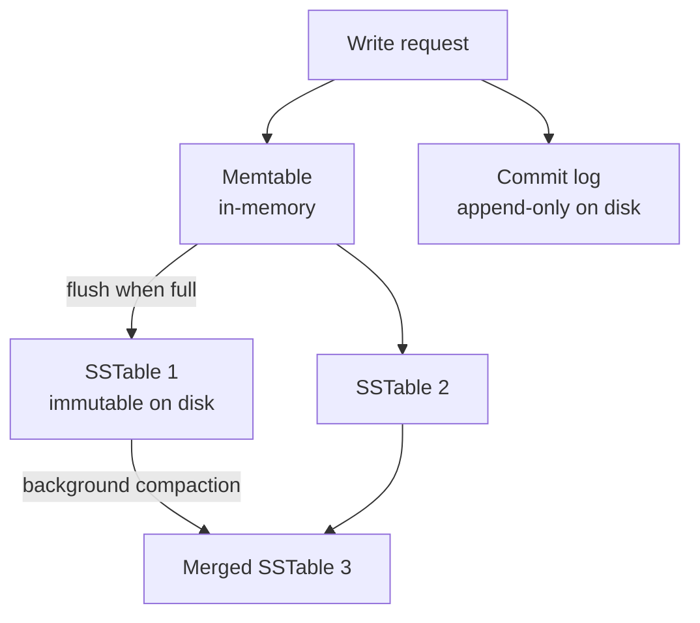

- Writes go to the in-memory **memtable** and the sequential **commit log** simultaneously. Both are sequential writes — this is why Cassandra achieves very high write throughput compared to B-Tree databases (which do random-access page updates).
- When the memtable fills, it is flushed to disk as an immutable **SSTable**.
- Background **compaction** merges SSTables, resolves conflicting versions (last-write-wins by timestamp), and reclaims space from deleted rows (tombstones).

**Consistency levels**

Cassandra lets you choose consistency per query — trading availability for consistency:

| Level | Reads/Writes | Meaning |
|---|---|---|
| `ONE` | 1 replica responds | Fastest; may read stale data |
| `QUORUM` | RF/2+1 replicas agree | Strong within a single DC |
| `LOCAL_QUORUM` | Quorum in local DC only | Best for multi-DC; avoids cross-DC latency |
| `ALL` | All replicas respond | Strongest; lowest availability |

For this system: **`LOCAL_QUORUM` writes** (ensures durability on a majority of nodes) and **`LOCAL_QUORUM` or `ONE` reads** (fast redirects, minor staleness acceptable).

**Data modelling rules**

In Cassandra you model by access pattern, not by normalised entity:

- `url_by_code` — partition key is `short_code`. The entire row lives on one partition, so any redirect lookup is a single-partition read touching at most RF nodes.
- No JOINs exist; denormalise by duplicating data into multiple tables if different access patterns are needed.
- Avoid "wide rows" (millions of clustering columns per partition key) — not an issue here since each short code has exactly one row.

---

#### PostgreSQL

PostgreSQL is an ACID-compliant relational database with a rich set of internal mechanisms that make it reliable and efficient at moderate scale.

**MVCC — Multi-Version Concurrency Control**

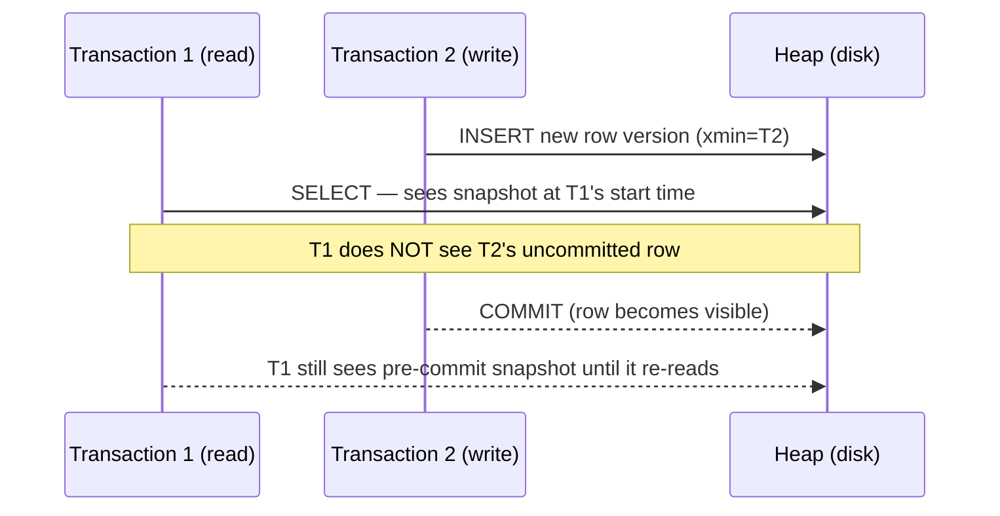

- Every write creates a **new row version** tagged with the transaction ID. Readers see a consistent snapshot of the database as it was at their transaction start — readers never block writers and writers never block readers.
- Dead row versions accumulate and must be reclaimed by **VACUUM** (`autovacuum` runs this in the background automatically).

**WAL — Write-Ahead Log**

All changes are written to the WAL (an append-only file on disk) before being applied to data pages. This gives:
- **Crash recovery**: on restart, PostgreSQL replays the WAL from the last checkpoint.
- **Streaming replication**: the primary continuously ships WAL records to standby replicas over a TCP connection. Standbys apply the WAL in order and can serve read queries.

**B+ Tree index**

The `short_code` UNIQUE index is stored as a B+ Tree:
- For 315 B rows with a fan-out of ~500 entries per page, tree height ≈ $\log_{500}(315 \times 10^9) \approx 6$ levels. A lookup touches ~6 pages.
- Leaf nodes form a doubly-linked list, making range scans efficient.
- An **index-only scan** can answer `SELECT long_url WHERE short_code = ?` purely from the index without reading the heap, if `long_url` is included as a covering column.

**Connection pooling with PgBouncer**

PostgreSQL forks one OS process per connection — 10,000 direct connections would consume enormous RAM and CPU. **PgBouncer** (transaction-mode pooling) sits in front of PostgreSQL and multiplexes many application connections onto a small pool of 20–100 actual Postgres backends, dramatically reducing overhead.

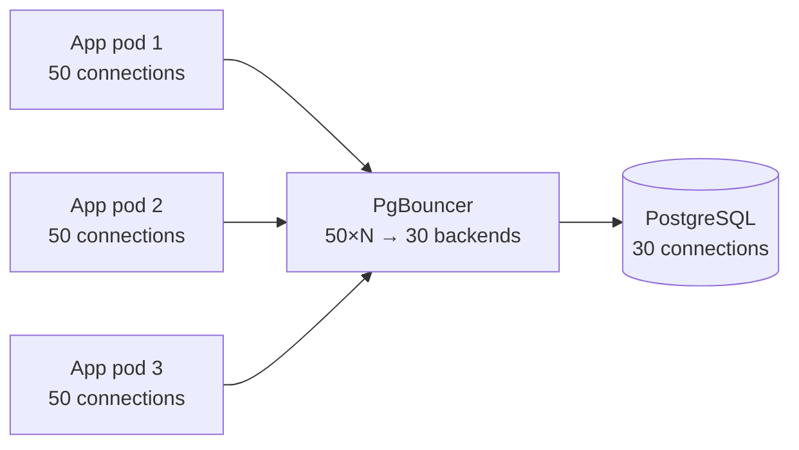

---

#### Redis

Redis is a **single-threaded, in-memory data structure server**. Its event loop processes one command at a time — there are no locks, no thread context switches, and no CPU cache misses from concurrent access. This is why it achieves sub-millisecond latency at very high QPS.

**How it is used here**

| Use case | Command | Notes |
|---|---|---|
| URL cache (Approach 1 manual) | `SET url:{code} {longUrl} EX {seconds}` | TTL aligned to URL's `expire_at` |
| URL cache (Approach 2 via Spring Cache) | Managed by `@Cacheable` / `@CacheEvict` | Spring uses `SETEX` + `GET` internally |
| ID range counter (Approach 1) | `INCRBY url:id:counter 100000` | Atomic; returns new top of range |

**Eviction policies**

When Redis reaches its `maxmemory` limit it evicts keys according to the configured policy:

| Policy | Behaviour | Best for |
|---|---|---|
| `allkeys-lru` | Evict least-recently-used key across all keys | URL cache (hot URLs stay resident) |
| `allkeys-lfu` | Evict least-frequently-used key | Workloads with a few extremely viral URLs |
| `volatile-lru` | LRU, but only among keys with a TTL set | Mixed cache + session store |
| `noeviction` | Return error when memory full | Range counter (must never lose this key) |

Use two separate Redis instances — or two logical databases — if you need different eviction policies: `allkeys-lru` for the URL cache, `noeviction` for the ID range counter.

**Persistence options**

For the URL cache you typically disable persistence (pure cache can be rebuilt from Cassandra/PostgreSQL on restart). For the ID range counter, losing the counter on restart could cause ID collisions:

| Mode | How it works | Recovery risk |
|---|---|---|
| **None** (cache only) | Data lost on restart | Acceptable for URL cache |
| **RDB** | Point-in-time snapshot every N seconds | Lose up to N seconds of increments |
| **AOF** | Append every write command to a log | Near-zero data loss; slightly slower |

For the range counter, AOF with `fsync=everysec` is a good default — at most one second of range allocation is lost on a crash, and since we have 11× headroom over requirements, skipping a small range is acceptable.

---

### Approach 3: AWS-Native Architecture

**When to use:** you want managed infrastructure with minimal operational burden, can tolerate AWS vendor lock-in, and need to match internet-scale traffic (1,000 writes/s, 100,000 redirects/s) without running your own Cassandra or Kafka clusters.

The goal is to use **well-understood managed AWS services** that each solve exactly one problem, without over-engineering.

#### AWS Service Map

| Concern | AWS Service | Why |
|---|---|---|
| DNS / global entry point | Route 53 + CloudFront | GeoDNS + edge caching for redirect responses |
| API / HTTP routing | API Gateway + ALB | Rate limiting, auth, routing to Lambda / ECS |
| Write logic | AWS Lambda (or ECS Fargate) | Serverless for low-traffic writes; Fargate for sustained 1K/s |
| Redirect logic | AWS Lambda@Edge | Runs at CloudFront edge — sub-10 ms redirects from cache |
| Short ID generation | DynamoDB atomic counter | `ADD` operation is atomic across regions |
| Primary data store | DynamoDB | Managed, serverless NoSQL; handles 315 TB with on-demand scaling |
| Redirect cache | CloudFront (CDN cache) | Free cache hit for hot URLs at edge — no Redis needed at scale |
| In-region hot cache | ElastiCache (Redis) | L2 cache for Lambda@Edge origin miss path |
| Async analytics | Amazon Kinesis Data Streams | Managed Kafka-equivalent; feeds analytics pipeline |
| Analytics store | Amazon S3 + Athena | Store raw click events cheaply; query with SQL on demand |
| Secrets | AWS Secrets Manager | Credentials for DynamoDB, ElastiCache |
| Observability | CloudWatch + X-Ray | Metrics, distributed tracing |

#### Architecture Diagram

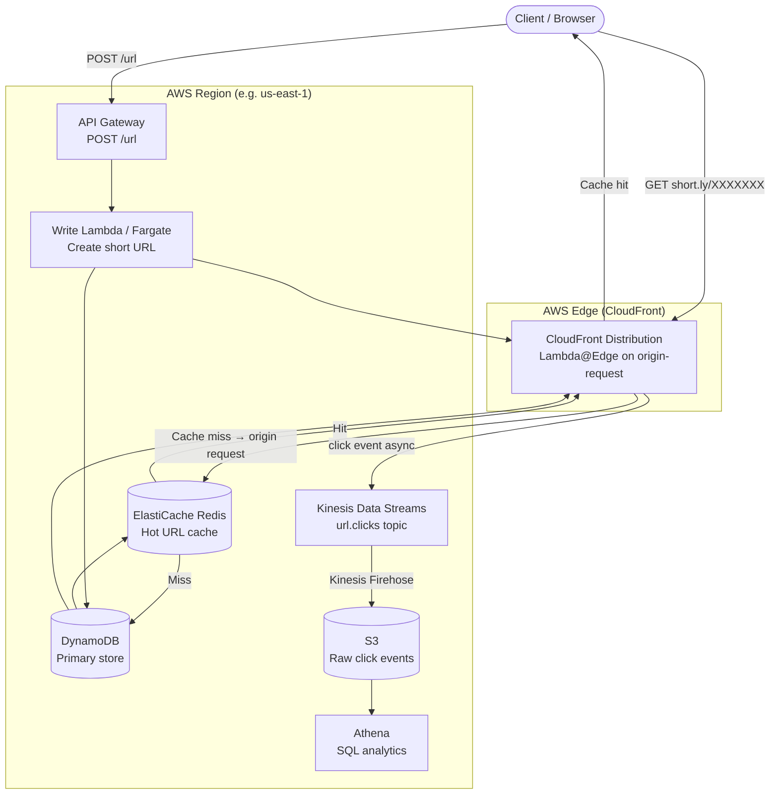

#### Data Flow

**Create (write path)**

1. Client `POST /url` hits API Gateway (rate-limited by AWS WAF rule attached to the gateway).
2. Lambda reads the request, calls DynamoDB `UpdateItem` with `ADD counter 1` to get a globally unique numeric ID.
3. Encodes the ID to Base62 → 7-char short code.
4. `PutItem` to DynamoDB with the URL mapping.
5. Returns `201 Created` with the short URL.
6. CloudFront cache is not pre-warmed; it fills naturally on first redirect.

**Redirect (read path)**

1. Client `GET short.ly/XXXXXXX` hits the nearest CloudFront PoP.
2. CloudFront checks its edge cache — **cache hit** returns `302` immediately from edge, no backend involved (sub-5 ms).
3. **Cache miss** triggers Lambda@Edge `origin-request` function:
   - Checks ElastiCache Redis (in-region).
   - On Redis miss, reads DynamoDB.
   - Returns `Location` header; CloudFront caches the response at edge for the TTL duration.
4. Lambda@Edge sends a click event to Kinesis asynchronously.

#### Sequence Diagram (redirect with cold edge cache)

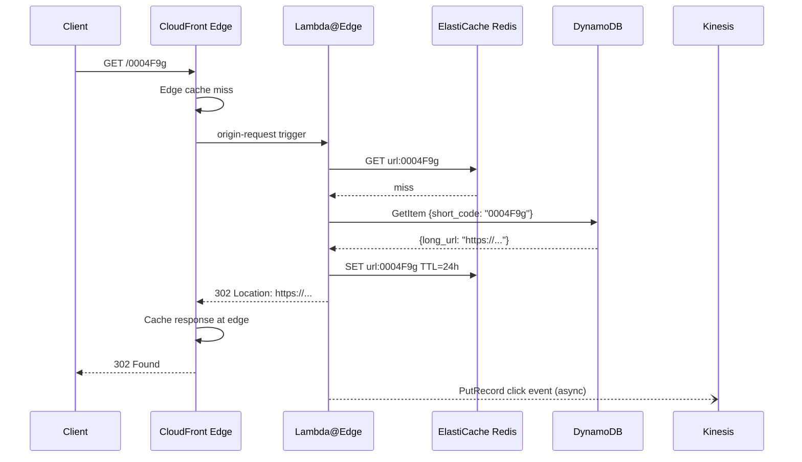

#### DynamoDB Table Design

```
Table name : url_mappings
Partition key : short_code (String)
Billing mode  : On-Demand (auto-scales to any throughput)
TTL attribute : expire_at (epoch seconds — DynamoDB deletes expired items automatically)
```

| Attribute | Type | Notes |
|---|---|---|
| `short_code` (PK) | S | 7-char Base62 string |
| `long_url` | S | Original URL |
| `user_id` | S | Owner (optional) |
| `created_at` | N | Unix epoch ms |
| `expire_at` | N | Unix epoch seconds — DynamoDB TTL field |

**Atomic ID counter** (separate table):

```
Table name : id_counter
Partition key : counter_name (String)

UpdateItem:
  Key: {counter_name: "global"}
  UpdateExpression: "ADD #v :inc"
  ExpressionAttributeNames: {"#v": "value"}
  ExpressionAttributeValues: {":inc": 1}
  ReturnValues: UPDATED_NEW
```

This is simpler than a range service: DynamoDB guarantees the `ADD` is atomic even across concurrent Lambda invocations, so no two invocations ever get the same ID.

#### CloudFront Cache Configuration

```json
{
  "DefaultCacheBehavior": {
    "ViewerProtocolPolicy": "redirect-to-https",
    "CachePolicyId": "<custom-policy-id>",
    "OriginRequestPolicyId": "<origin-request-policy-id>",
    "LambdaFunctionAssociations": [
      {
        "EventType": "origin-request",
        "LambdaFunctionARN": "arn:aws:lambda:us-east-1:ACCOUNT:function:redirect-fn:LIVE"
      }
    ]
  }
}
```

Cache policy:
- **Cache key**: path only (`/0004F9g`) — do not include headers or query strings.
- **Default TTL**: `86400` seconds (24 h). Override per URL via `Cache-Control` header from Lambda@Edge.
- **Invalidation**: call `cloudfront.createInvalidation` when a URL is deleted or updated.

#### AWS Lambda (Write) — Java / Spring Boot

The write Lambda is a standard Spring Boot app packaged with the `aws-serverless-java-container` adapter. For sustained 1,000 writes/s, consider ECS Fargate instead (avoids cold-start variability).

```java
// WriteUrlHandler.java — AWS Lambda handler (Spring Boot adapter)
@Component
public class WriteUrlHandler
    implements RequestHandler<APIGatewayProxyRequestEvent, APIGatewayProxyResponseEvent> {

    private final DynamoDbClient dynamo;
    private static final String TABLE      = "url_mappings";
    private static final String CTR_TABLE  = "id_counter";

    public WriteUrlHandler(DynamoDbClient dynamo) {
        this.dynamo = dynamo;
    }

    @Override
    public APIGatewayProxyResponseEvent handleRequest(
            APIGatewayProxyRequestEvent event, Context context) {

        CreateUrlRequest req = parse(event.getBody());
        String longUrl       = validate(req.longUrl());

        long id        = allocateId();
        String code    = Base62Encoder.encode(id);

        Map<String, AttributeValue> item = Map.of(
            "short_code",  AttributeValue.fromS(code),
            "long_url",    AttributeValue.fromS(longUrl),
            "created_at",  AttributeValue.fromN(String.valueOf(Instant.now().toEpochMilli()))
        );

        dynamo.putItem(PutItemRequest.builder()
            .tableName(TABLE)
            .item(item)
            .conditionExpression("attribute_not_exists(short_code)") // prevent overwrites
            .build());

        return response(201, Map.of("shortUrl", "https://short.ly/" + code));
    }

    private long allocateId() {
        UpdateItemResponse resp = dynamo.updateItem(UpdateItemRequest.builder()
            .tableName(CTR_TABLE)
            .key(Map.of("counter_name", AttributeValue.fromS("global")))
            .updateExpression("ADD #v :inc")
            .expressionAttributeNames(Map.of("#v", "value"))
            .expressionAttributeValues(Map.of(":inc", AttributeValue.fromN("1")))
            .returnValues(ReturnValue.UPDATED_NEW)
            .build());

        return Long.parseLong(resp.attributes().get("value").n());
    }
}
```

#### Lambda@Edge (Redirect) — Node.js

Lambda@Edge runs at CloudFront edge PoPs and must be in `us-east-1`. Node.js is preferred here because it has near-zero cold-start time compared to JVM-based runtimes.

```js
// redirect.mjs — Lambda@Edge origin-request handler
import { DynamoDBClient, GetItemCommand }   from "@aws-sdk/client-dynamodb";
import { createClient }                      from "redis";

const dynamo = new DynamoDBClient({ region: "us-east-1" });
// Redis client is initialised once per container and reused across invocations
let redis;

async function getRedis() {
  if (!redis) {
    redis = createClient({ url: process.env.REDIS_URL });
    await redis.connect();
  }
  return redis;
}

export const handler = async (event) => {
  const request   = event.Records[0].cf.request;
  const shortCode = request.uri.replace(/^\//, "");    // strip leading "/"

  // 1. Redis cache
  const rc = await getRedis();
  let longUrl = await rc.get(`url:${shortCode}`);

  if (!longUrl) {
    // 2. DynamoDB
    const result = await dynamo.send(new GetItemCommand({
      TableName: "url_mappings",
      Key: { short_code: { S: shortCode } },
      ProjectionExpression: "long_url, expire_at",
    }));

    const item = result.Item;
    if (!item || (item.expire_at && Number(item.expire_at.N) < Date.now() / 1000)) {
      return { status: "404", body: "Not found" };
    }

    longUrl = item.long_url.S;
    await rc.set(`url:${shortCode}`, longUrl, { EX: 86400 });
  }

  // 3. Emit click event (fire-and-forget — no await)
  emitClick(shortCode, request.headers).catch(() => {});

  // 4. Redirect response — CloudFront will cache this at the edge
  return {
    status: "302",
    headers: {
      location:        [{ key: "Location",        value: longUrl }],
      "cache-control": [{ key: "Cache-Control",   value: "public, max-age=86400" }],
    },
  };
};
```

#### AWS WAF Rate Limiting

Attach a WAF Web ACL to both API Gateway (writes) and CloudFront (redirects):

```json
{
  "Rules": [
    {
      "Name": "RateLimitWrites",
      "Priority": 1,
      "Action": { "Block": {} },
      "Statement": {
        "RateBasedStatement": {
          "Limit": 100,
          "AggregateKeyType": "IP"
        }
      },
      "VisibilityConfig": { "MetricName": "RateLimitWrites", "SampledRequestsEnabled": true }
    }
  ]
}
```

This blocks any single IP that sends more than 100 `POST /url` requests per 5-minute window — a practical defence against abuse without application-layer code.

#### Analytics Pipeline

```mermaid
flowchart LR
    LE["Lambda@Edge"] -->|PutRecord| KDS["Kinesis Data Streams<br/>20 shards · 1 MB/s each"]
    KDS --> FH["Kinesis Firehose<br/>buffer: 5 min or 128 MB"]
    FH -->|"Parquet + Snappy"| S3[("S3 Bucket<br/>url-analytics/year=YYYY/")]
    S3 --> ATH["Amazon Athena<br/>SQL on S3"]
    ATH --> QS["QuickSight<br/>Dashboard"]
```

- **Kinesis shards**: at 100,000 redirects/s and ~200 bytes per click event: $100\text{K} \times 200\text{ B} = 20\text{ MB/s}$. Each shard handles 1 MB/s, so you need **20 shards**.
- **Firehose**: buffers records and writes compressed Parquet to S3, making Athena queries cheap.
- **Athena**: serverless SQL on S3 — pay per query, no cluster to manage.

#### Cost Profile (rough order of magnitude)

| Service | Assumption | Est. monthly cost |
|---|---|---|
| CloudFront | 100K redirects/s × 99% hit rate × ~$0.0085/10K req | ~$700 |
| Lambda@Edge | 1% miss × 100K/s × 2.6B invocations | ~$500 |
| DynamoDB (on-demand) | 1K writes/s + 1K reads/s (cache miss) | ~$1,200 |
| ElastiCache (cache.r7g.large) | 2-node cluster | ~$300 |
| Kinesis (20 shards) | $0.015/shard/hr | ~$220 |
| S3 + Athena | Storage + queries | ~$100 |
| **Total** | | **~$3,000–4,000/month** |

Costs drop significantly if the CloudFront cache-hit rate is high (99%+), since Lambda@Edge invocations and DynamoDB reads become rare.

---

### Recommendation Summary

| Scenario | Use |
|---|---|
| Large team, global scale, 315 TB+, 1000+ writes/sec, full control | Approach 1 (Cassandra + Range Service) |
| Small/medium team, single region, <50 TB, <500 writes/sec | Approach 2 (PostgreSQL + Replicas) |
| Managed infra, AWS ecosystem, fast time-to-market | **Approach 3 (AWS-native)** |
| Moderate scale today, expecting growth | Approach 2 now → Citus → Approach 1 later |

---

### Interview Questions and Answers

#### Beginner

- **Q: How does a URL shortener work at a high level?**
  A shortener has two operations: `POST /url { longUrl }` returns a short code, and
  `GET /{shortCode}` returns an HTTP `301`/`302` redirect to the long URL. The trick is not
  the API — it's making the redirect fast and making short codes unique at scale.

- **Q: What are the main design trade-offs in choosing a short code?**
  Between a *short* code (small keyspace, collision-prone, enumerable) and a *long* code
  (collision-free, hard to guess, less shareable). Random codes are unguessable; sequential
  codes are cache/storage friendly but guessable. The classic answer: use a random or
  range-allocated code, and size the keyspace so collision probability is negligible.

- **Q: How would you generate a unique short code?**
  Three common answers: (1) base62-encode a sequential DB auto-increment — simple but a hot
  key and guessable; (2) a distributed ID generator (Snowflake) — monotonic and sharded;
  (3) a cryptographically random string in a large base62 keyspace — unguessable but
  collision-checked. Each trades simplicity, distribution, and security differently.

- **Q: Would you use a relational database or NoSQL?**
  Start with whatever the team knows (PostgreSQL is a fine starting point — see Approach 2).
  Move to a wide-column store (Cassandra) or a managed key-value store when you need to shard
  beyond a single node's capacity and when the access pattern is purely short-code lookup
  with range writes. The store decision is the headline architecture decision.

- **Q: What cache strategy do you use on the redirect path?**
  Cache-aside: `GET cache:{shortCode}` → miss → `SELECT longUrl FROM links WHERE short_code = ?`
  → `SET cache:{shortCode} longUrl EX ttl`. Because redirects are read-heavy and hot codes are
  heavily skewed, this collapses almost all traffic to memory. Warm cache before promoting a
  high-traffic code.

#### Intermediate

- **Q: How do you handle hot keys under sequential code generation?**
  Don't use a single global counter. Give each application instance a *disjoint range* from a
  range-ID service (`SELECT range_start FROM ranges ... RETURNING`), encode
  `rangeStart + localCounter` to base62, and request a new range when the current one is
  exhausted. This removes the single-writer bottleneck; writes now fan out across ranges.

- **Q: How do you guarantee uniqueness under concurrent creates?**
  With ranges, uniqueness comes from disjoint keyspaces (no coordination needed per create).
  With random codes, the keyspace is so large that collisions are astronomically rare; handle
  the rare collision with a `GET`-then-`retry` (or a unique DB constraint + retry on `23505`).
  The wrong answer is a read-then-write check-then-insert on a shared counter under high
  concurrency.

- **Q: 301 or 302 for the redirect?**
  `301` (permanent) lets browsers/CDNs cache the redirect — fewer origin hits, lower cost, but
  you lose per-request analytics and changing the destination later breaks caching. `302`
  (temporary) hits the server every time — full analytics visibility but higher infrastructure
  cost. Many systems return `301` for the public redirect and `302` only during an override
  window.

- **Q: How do you prevent the redirect path from being slowed by click analytics?**
  Emit a click event (to Kafka or a metrics sink) *after* the redirect decision and return the
  30x immediately; never block the response on an analytics write. This is the "decouple
  analytics from the redirect" pattern — and it's the single most important SLA protection.

- **Q: How do you handle link expiration and revocation?**
  Store `expires_at` on the link. Lazy path: on redirect, return `410 Gone` if expired/revoked
  (and cache the 410 briefly to avoid DB hits). Active path: a sweeper deletes expired rows
  (or marks them 410). Always prefer explicit `410` over silent `404` for a former live link.

- **Q: How would you estimate capacity / storage?**
  Traffic: ~500 writes/sec write + ~6000 reads/sec read ⇒ read/write ≈ 12:1. Key size: 128-bit
  SHA-256 digest (base64 = 43 chars). 100B rows ⇒ 4KB/row ⇒ ~68 TB of data (plus replicas
  and indexes, so ~200 TB). Storage grows ~64 GB/year, so 5 years ⇒ 1 TB/year storage. Use
  these to size DynamoDB RCUs/WCUS, Cassandra nodes, or Postgres.

- **Q: What are the differences between the approaches?**
  Approach 1 (Cassandra + ID range service) — best for internet-scale, global, fully controlled;
  highest ops burden. Approach 2 (PostgreSQL + replicas) — best for small/medium teams,
  single region, simplest; scales to ~50 TB. Approach 3 (AWS-native) — best for teams embedded
  in AWS wanting managed infra; fast time-to-market, pay-per-use.

#### Advanced

- **Q: How would you shard this system?**
  By short code. The short code is derived from a key (hash or range-allocated), so the
  sharding key is the short code itself — this means the redirect path is naturally
  partition-tolerant: any shard can answer a redirect for its key range. The write path
  (create) must go to the right shard, which the ID-generation scheme already controls.

- **Q: How do you handle a cache stampede on a cold, suddenly-viral short code?**
  Single-flight: one in-flight cache miss for a given code; all other concurrent misses wait
  on the same DB fetch and then populate cache together. Or pre-warm the cache for a code
  before it goes viral (e.g., cache it as soon as it's created for a "featured" link).

- **Q: What are the security concerns with a URL shortener?**
  (1) SSRF: never fetch the long URL server-side (preview/thumbnail) without private-IP
  blocking; even redirect-only must re-resolve at serve time because a previously public IP
  can become a metadata endpoint. (2) Abuse/phishing: short codes hide destinations, so
  anonymous shortening is a scam vector — rate-limit creates and blocklist known-bad domains.
  (3) Enumeration: short/predictable codes leak "private" pastes; use unguessable codes or
  per-user ACLs. (4) A revoked live link can't be recalled — audit all destination mutations.

- **Q: How would you do A/B testing of destinations for a short link?**
  Don't: a short link is a stable contract. If you need A/B, introduce a *new* short link for
  each variant and split at the application layer (the campaign), or use a routing layer in
  front of the long URL that records the experiment and redirects.

- **Q: How do you migrate from Approach 2 to Approach 1?**
  Keep the short-code→long-URL API stable (short codes are forever). Dual-write new shortens
  to both stores (or route by short-code prefix/shard), backfill read-side from the old store,
  and cut over by key range. Because long URLs are immutable per code, the data model maps
  cleanly; the hard part is the range-allocation cut-in on the write path.

#### Senior-level / System-design-oriented

- **Q: How do you keep a billion-row short-code table efficient?**
  The lookup is by short code. In PostgreSQL, `short_code` as the primary key (hash or
  btree) gives O(log n) and fits in RAM at scale. In Cassandra, the short code is the
  partition key. Either way, the key is *single-row-point-lookup friendly* — never scan. Add a
  `created_at` index only for the sweeper; don't index what you don't look up.

- **Q: A short link in a billboard is broken — what do you do?**
  You can't recall it. Your options: (a) `410` it (breaks the billboard, bad for UX),
  (b) repoint the short code to a safe "link expired/removed" landing page (preserves the
  link resolving, bad for trust if users expect the original destination), or (c) fix the
  destination and restore (best, if safe). The lesson: destination mutation must be audited
  and ideally immutable in production.

- **Q: How do you make the redirect available-zone/region fault-tolerant?**
  Serve redirects from the CDN edge (or an in-region cache with an active-active metadata
  store). The metadata store should be multi-region with read replicas; a write to a new
  short code in one region must replicate before the link is "live" (or accept a write-fail
  race). Cache TTLs + stale-while-revalidate keep redirects serving during a region outage.

- **Q: How do you design for GDPR "right to be forgotten" on a forever link?**
  Soft-delete → return `410` (preserves the immutability contract for embeds), then hard-purge
  the row on a schedule. Logs/Click events must be TTL'd too. The tension is the product
  contract (links are forever) vs legal (data is deletable) — design `410` as the canonical
  "unpublished link" state up front.

- **Q: Walk me through the full redirect flow at a billion requests/month.**
  Click hits the CDN edge; edge KV/cache lookup of `/{code}` → cache hit ⇒ return `301`
  `Location` from the edge, emit a click event asynchronously. Cache miss ⇒ fall back to an
  in-memory redirect service ⇒ Redis cache-aside ⇒ metadata store (Cassandra/DynamoDB) ⇒
  populate Redis and serve. Creates are rare (range-ID service ⇒ Cassandra), clicks are
  streamed to Kafka ⇒ click counter/analytics warehouse. The metadata store sees only cold
  misses; the edge absorbs the viral tail.

- **Q: What would you build first if you had to ship a MVP tomorrow?**
  Approach 2: a single Spring Boot service with PostgreSQL, a `short_code` PK unique index,
  base62-encoded auto-increment, Redis cache-aside for redirects, and a background sweeper for
  TTL. It's correct, simple, and scales to ~500 writes/sec — enough to buy time. The moment the
  counter becomes a hot key or writes exceed the shard, you introduce the range-ID service and
  migrate to Approach 1. Ship the simplest correct thing first; restructure under measured
  pressure, not hypothetical scale.

- **Follow-up an interviewer often asks:** "Is the short code in your range scheme still
  guessable, and does that matter?"
  Discussion: range-allocated codes are monotonic and therefore guessable (an attacker can
  enumerate `/000001`, `/000002`...). If links are public-by-default that's fine; if any link
  is sensitive, add entropy (a random prefix/suffix) or move to a random keyspace and accept
  collision checks. The honest answer is "it depends on the threat model" — public marketing
  links don't need entropy; private/notes do.
