# Design Webhook

## Blogs and websites

## Medium

## Youtube

- [System Design Interview: Design a Webhook Service w/ a Google Engineer](https://www.youtube.com/watch?v=4C9SVQVmUxs)


## Theory

### Topics Covered

1. [Introduction to Webhooks](#introduction-to-webhooks)
2. [Characteristics](#characteristics)
3. [Pros](#pros)
4. [Cons](#cons)
5. [Use Cases](#use-cases)
6. [Components](#components)
7. [Webhook Patterns](#webhook-patterns)
8. [Benefits](#benefits)
9. [Challenges](#challenges)
10. [Best Practices](#best-practices)
11. [When to Use Webhooks](#when-to-use-webhooks)
12. [Webhook vs Polling vs WebSocket](#webhook-vs-polling-vs-websocket)
13. [Webhook Lifecycle and Delivery Flow](#webhook-lifecycle-and-delivery-flow)
14. [Subscription and Registration Model](#subscription-and-registration-model)
15. [Event Design and Payload Format](#event-design-and-payload-format)
16. [Security: Signatures and Verification](#security-signatures-and-verification)
17. [Retries and Delivery Guarantees](#retries-and-delivery-guarantees)
18. [Ordering and Idempotency](#ordering-and-idempotency)
19. [Durability, Dead Letter Queues and Outbox Pattern](#durability-dead-letter-queues-and-outbox-pattern)
20. [Rate Limiting, Throttling and Backpressure](#rate-limiting-throttling-and-backpressure)
21. [Observability and Monitoring](#observability-and-monitoring)
22. [High Availability and Scalability](#high-availability-and-scalability)
23. [Real-World Webhook Providers](#real-world-webhook-providers)
24. [Data Model and API](#data-model-and-api)
25. [Replication Strategies](#replication-strategies)
26. [Failure Detection and Membership](#failure-detection-and-membership)
27. [Performance and Optimization](#performance-and-optimization)
28. [Encryption and Key Management](#encryption-and-key-management)
29. [Authentication and Authorization](#authentication-and-authorization)
30. [Security Threats and Mitigations](#security-threats-and-mitigations)
31. [Observability and Logging](#observability-and-logging)
32. [Real-World Implementations](#real-world-implementations)
33. [Architectural Patterns](#architectural-patterns)
34. [Java and Spring Boot Implementation Guide](#java-and-spring-boot-implementation-guide)
35. [Interview Questions and Answers](#interview-questions-and-answers)

---
---
---

### Introduction to Webhooks

A webhook is a user-defined HTTP callback. When an event occurs in a source system, the source sends an HTTP request, usually `POST`, to a URL registered by the consumer. The request payload contains details about the event.

Unlike polling, where the consumer repeatedly asks the provider "has anything changed?", a webhook reverses the direction of communication. The provider pushes the event to the consumer as soon as it happens.

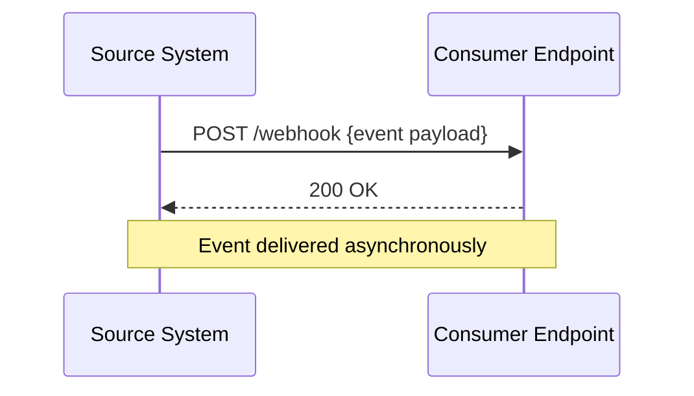

**Why webhooks matter**

- They provide near-real-time event delivery without continuous polling.
- They reduce load on the provider because no polling requests are generated.
- They allow integrations to react to changes without a persistent connection.

**Real-life use cases**

- **Payment providers**: Stripe sends `payment_intent.succeeded` events to merchant endpoints.
- **CI/CD platforms**: GitHub sends `push` and `pull_request` events to Jenkins, CircleCI, or custom servers.
- **Messaging platforms**: Slack sends event notifications to app endpoints.
- **E-commerce**: Shopify sends order-created events to inventory and fulfillment systems.
- **Identity providers**: Auth0 sends signup and login events to applications.

**Interview questions and answers**

- **Q: What is a webhook?**
  **A:** A webhook is an HTTP callback that delivers event notifications from a provider to a consumer-registered URL in real time.

- **Q: How is a webhook different from an API?**
  **A:** An API is request-driven: the client pulls data by calling an endpoint. A webhook is event-driven: the provider pushes data to the client when an event occurs.

- **Q: Why use webhooks instead of polling?**
  **A:** Webhooks reduce latency, network traffic, and provider load. Polling repeatedly checks for changes even when none exist.

---

### Characteristics

Each characteristic is explained in detail.

- **Event-driven**
  Delivery is triggered by a state change or business event rather than by a client request. The producer decides when to notify the consumer.

- **Asynchronous by nature**
  The producer does not wait for the consumer to finish processing the event. It sends the HTTP request and usually only waits for a short acknowledgement.

- **HTTP-based**
  Webhooks are built on standard HTTP, usually `POST` requests with JSON payloads. This makes them compatible with almost any technology stack.

- **Consumer-registered endpoints**
  The consumer must provide a public URL where it wants to receive events. This subscription model gives the consumer control over where events go.

- **Push-based delivery**
  Data flows from producer to consumer automatically. The consumer does not need to schedule or invoke anything.

- **Single-direction communication**
  The source sends events to the target. The target's response is primarily an acknowledgement, not a full conversation.

- **Idempotency required**
  Networks can fail or time out, so providers may retry. Consumers must make event handlers idempotent to avoid processing the same event twice.

- **Usually stateless on the provider side**
  The provider may not maintain a persistent connection or session with the consumer. Each delivery is an independent HTTP request.

- **May support signing and authentication**
  Providers can sign payloads with a shared secret so consumers can verify authenticity and integrity.

- **Can deliver at least once**
  Most webhook systems offer at-least-once delivery. Exactly-once delivery is generally impossible without consumer-side deduplication.

- **Requires retry and failure handling**
  Because endpoints can be down, slow, or return errors, a reliable webhook system needs retries, backoff, and a dead-letter strategy.

---

### Pros

- **Real-time notifications**
  Events reach the consumer almost immediately after they happen.

- **Efficient**
  No polling means no wasted requests when there is no new data.

- **Simple to integrate**
  Both producer and consumer only need HTTP and JSON support.

- **Low latency compared with polling**
  Polling introduces a delay equal to the polling interval; webhooks reduce that delay.

- **Reduced provider load**
  The provider only sends data when an event occurs.

- **Loose coupling**
  The producer does not need to understand the consumer's internal implementation, only the registered URL and payload contract.

- **Widely supported**
  Payment gateways, code hosts, SaaS platforms, and internal systems commonly expose webhooks.

- **Easy horizontal scaling**
  HTTP endpoints can be scaled behind load balancers and queues.

- **Good observability**
  Delivery attempts, responses, and latency can be logged and monitored.

---

### Cons

- **No guaranteed delivery without extra work**
  A simple HTTP POST can be lost if the consumer is down. Reliable delivery requires retries and persistence.

- **Consumer endpoint must be publicly reachable**
  Local development and private networks require tunnels or ingress configuration.

- **Security risks**
  Unverified endpoints can be abused for SSRF, replay attacks, or spoofed payloads if signatures and authentication are absent.

- **Delivery failures require handling**
  Consumers must handle downtime, timeouts, malformed payloads, and duplicate events.

- **Potential for event loss**
  If the provider does not persist events or implement retries, events can be lost permanently.

- **No built-in backpressure**
  A sudden burst of events can overwhelm a slow consumer unless the system queues and throttles deliveries.

- **Ordering is not always guaranteed**
  Retries and distributed delivery can reorder events, so consumers should not assume strict ordering.

- **Harder to test locally**
  Receiving real webhooks requires a public URL or a tool such as ngrok or a local tunnel.

- **Monitoring burden**
  Consumers must track missed deliveries, failures, and duplicate events themselves.

---

### Use Cases

Each use case is described with a real-world example.

- **Payment notifications**
  Stripe and PayPal send events such as `charge.succeeded` and `refund.created`. Merchants use these events to update order status and trigger fulfillment.

- **Code repository events**
  GitHub and GitLab send `push`, `pull_request`, `issue`, and `release` events. CI/CD systems start builds, run tests, and deploy code.

- **E-commerce order and inventory updates**
  Shopify and WooCommerce notify when orders are created, paid, or cancelled. Fulfillment and accounting systems react to those events.

- **Identity and authentication events**
  Auth0, Okta, and Firebase send signup, login, and user-updated events. Applications sync user data or trigger onboarding flows.

- **Messaging and collaboration**
  Slack and Discord send bot events and app mentions. Bots respond, update channels, or notify users.

- **Subscription lifecycle**
  Billing platforms send `subscription.created`, `renewed`, `cancelled`, and `past_due` events. SaaS apps update entitlements.

- **CRM and marketing automation**
  Salesforce and HubSpot send contact and deal events. Marketing systems segment users and trigger campaigns.

- **Monitoring and incident response**
  Datadog, Grafana, and PagerDuty send alerts. Incident tools page engineers or open tickets.

- **Form and workflow automation**
  Form services send submission events. Workflow engines start approvals or create records.

- **Internal event propagation**
  A monolith or service mesh can use webhooks to notify external partners or legacy systems without sharing a message broker.

---

### Components

A complete webhook system has these components.

- **Event producer**
  The system that detects a change and creates an event. It knows which consumers are subscribed to which event types.

- **Subscription registry**
  Stores consumer endpoints, event types, secrets, and delivery settings. It determines who should receive each event.

- **Event queue**
  Buffers events between production and delivery. The queue decouples event generation from HTTP delivery and enables backpressure.

- **Delivery worker / dispatcher**
  Reads events from the queue and sends HTTP requests to consumer endpoints.

- **Retry scheduler**
  Requeues failed deliveries with exponential backoff and maximum attempt limits.

- **Dead letter queue (DLQ)**
  Holds events that cannot be delivered after all retries, allowing operators to inspect and replay them.

- **Signature / security module**
  Generates and verifies signatures, timestamps, and shared secrets.

- **Rate limiter / throttler**
  Limits deliveries per consumer to prevent overwhelming endpoints.

- **Consumer endpoint**
  The public HTTP endpoint owned by the consumer that receives and processes events.

- **Observability stack**
  Logs, metrics, tracing, and dashboards track delivery success, latency, failures, and queue depth.

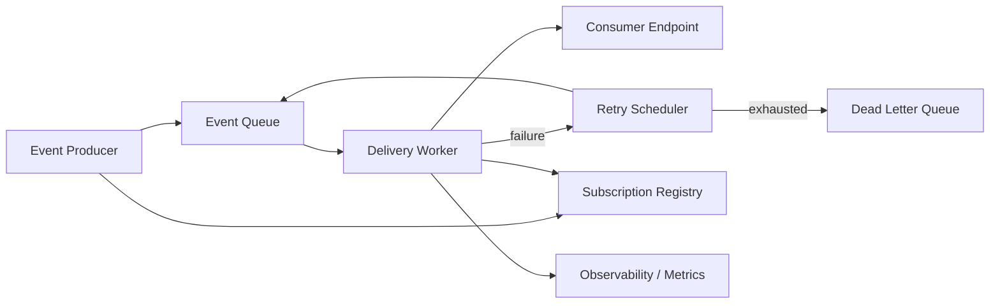

---

### Webhook Patterns

- **Fire-and-forget delivery**
  The producer sends one HTTP request and considers the event delivered after a `2xx` response. Simple but less reliable.

- **Persistent queue with retry**
  Events are stored in a queue and delivered asynchronously. Failed deliveries are retried with backoff.

- **Signed webhooks**
  The producer includes a signature header computed with a shared secret. The consumer verifies it before processing.

- **At-least-once delivery with idempotent consumers**
  The provider may deliver duplicates, and the consumer deduplicates by event ID.

- **Dead letter queue pattern**
  Permanently failing events are moved to a DLQ for inspection, replay, or manual handling.

- **Outbox pattern**
  The producer writes events to a database table in the same transaction as the business change. A background process publishes them, ensuring no event is lost.

- **Webhook gateway / adapter**
  A central gateway normalizes events from multiple providers into one internal event format.

- **Fan-out delivery**
  One event is delivered to many subscribers. This is common in SaaS platforms and event buses.

- **Backpressure with queue and rate limiting**
  A queue absorbs bursts, and per-consumer rate limits protect slow endpoints.

- **Replay and reconciliation**
  The provider keeps an event history and allows consumers to replay events or re-sync missed data.

---

### Benefits

- **Real-time responsiveness**
  Systems react immediately to changes rather than waiting for the next poll.

- **Reduced infrastructure cost**
  Polling requires constant request capacity; webhooks generate traffic only when events occur.

- **Simpler consumer logic**
  Consumers only handle events they care about instead of maintaining polling state and change detection.

- **Loose coupling**
  Producers and consumers interact through a documented HTTP contract.

- **Flexible integration**
  Webhooks work across languages, clouds, and organizations because they use standard HTTP.

- **Scalability**
  Queues, workers, and stateless HTTP endpoints make webhook delivery horizontally scalable.

- **Better user experience**
  Real-time notifications enable instant payments, deployments, chat messages, and alerts.

- **Provider transparency**
  Event payloads often contain rich context, allowing consumers to react without making follow-up API calls.

---

### Challenges

- **Reliable delivery**
  Endpoints fail, networks partition, and timeouts occur. Guaranteeing delivery requires retries and persistence.

- **Duplicate events**
  Retries can create duplicates. Consumers must deduplicate by event ID.

- **Security**
  Producers must sign payloads and consumers must verify signatures, reject replays, and avoid SSRF.

- **Endpoint discovery and validation**
  Consumers must provide reachable URLs, and providers should validate ownership to prevent abuse.

- **Ordering**
  Concurrent delivery and retries can reorder events, complicating consumer processing.

- **Slow consumers**
  A consumer that cannot keep up can build queue backlogs and increase latency.

- **Payload versioning**
  Changing the event schema can break consumers. Producers need versioned, backward-compatible payloads.

- **Failure observability**
  Without delivery logs and metrics, dropped events are hard to detect.

- **Testing and local development**
  Receiving real events requires public ingress or tunnel tools.

- **Handling partial failures**
  Some subscribers may succeed while others fail, requiring per-subscriber tracking and isolation.

---

### Best Practices

- **Use HTTPS everywhere**
  Encrypt webhook traffic in transit.

- **Sign every payload**
  Include an HMAC signature and a timestamp so consumers can verify authenticity and reject stale requests.

- **Include a unique event ID**
  Consumers use the ID for idempotent processing.

- **Version the payload schema**
  Use a version field or versioned endpoint to allow backward-compatible changes.

- **Persist events before delivery**
  Write events to a durable queue or database so they survive producer restarts.

- **Retry with exponential backoff and jitter**
  Start with short delays and increase them, adding random jitter to avoid thundering herds.

- **Set a maximum retry count**
  Move events that exceed the limit to a dead letter queue.

- **Respect consumer response codes**
  Treat `2xx` as success, `4xx` as possibly permanent, and `5xx` or timeouts as retryable.

- **Rate limit per endpoint**
  Prevent a single slow consumer from affecting other subscribers.

- **Validate consumer endpoints during registration**
  Send a verification challenge to confirm the URL is controlled by the subscriber.

- **Monitor delivery metrics**
  Track queue depth, delivery latency, success rate, retries, and dead letter count.

- **Make consumers idempotent**
  Store processed event IDs and ignore duplicates.

- **Provide replay and reconciliation APIs**
  Allow consumers to fetch missed events or re-sync state after outages.

---

### When to Use Webhooks

- **Use webhooks when** you need near-real-time event delivery.
- **Use webhooks when** changes are infrequent or unpredictable, making polling wasteful.
- **Use webhooks when** you are integrating external systems over the internet.
- **Use webhooks when** the consumer has a public HTTP endpoint.
- **Use webhooks when** loose coupling and event-driven integration are preferred.
- **Use webhooks when** consumers need to react to a specific state change without continuous queries.

**Prefer polling when**

- The consumer cannot expose a public endpoint.
- Changes are frequent enough that polling overhead is acceptable.
- You need a simple, stateless integration.
- The provider does not support webhooks.

**Prefer WebSocket or streaming when**

- You need bidirectional, low-latency communication.
- Events are extremely frequent and continuous.
- A persistent connection is already available.

---

### Webhook vs Polling vs WebSocket

| Aspect | Webhook | Polling | WebSocket |
|---|---|---|---|
| Direction | Push | Pull | Bidirectional push/pull |
| Latency | Near real time | Depends on interval | Very low |
| Connection | Short-lived HTTP request | Repeated HTTP requests | Persistent TCP connection |
| Provider load | Low | High when idle | Moderate |
| Complexity | Medium | Low | Higher |
| Firewall/NAT friendliness | Good | Good | More complex |
| Use case | Event notifications | Simple checks | Live chat, streams, collaboration |

**Real-life examples**

- Webhook: Stripe sends a payment event to a merchant.
- Polling: a script checks an email inbox every minute.
- WebSocket: a collaborative editor syncs cursor positions.

**Interview questions and answers**

- **Q: When would you choose polling over webhooks?**
  **A:** When the consumer cannot expose an endpoint, when events are frequent enough that polling is simple and acceptable, or when the provider does not support webhooks.

- **Q: Why are webhooks unsuitable for continuous bidirectional communication?**
  **A:** Each webhook is a separate HTTP request, so maintaining a continuous conversation would be inefficient. WebSocket is a better fit for frequent two-way communication.

---

### Webhook Lifecycle and Delivery Flow

The lifecycle of a webhook event consists of creation, queueing, delivery, acknowledgement, retry, and final success or dead-lettering.

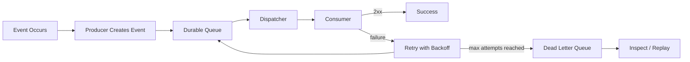

**Detailed steps**

1. A business action creates an event.
2. The producer enriches the event with an ID, timestamp, type, and payload.
3. The event is written to a durable queue or database transaction.
4. A dispatcher reads the event and looks up matching subscriptions.
5. The dispatcher sends a signed `POST` request to each consumer endpoint.
6. The consumer validates the signature and processes the event.
7. The consumer returns `2xx` on success.
8. On failure, the dispatcher retries with backoff.
9. After exhausting retries, the event is moved to a dead letter queue.
10. Observability systems record every attempt.

**Interview questions and answers**

- **Q: Why write the event to a queue before sending the HTTP request?**
  **A:** To make delivery durable and decouple event creation from potentially slow or failing HTTP calls. The queue survives restarts and enables retries.

- **Q: What is the difference between an acknowledgement and processing completion?**
  **A:** A `2xx` response normally means the consumer received the event, not necessarily that it finished all business processing. Consumers can process asynchronously and acknowledge after durable receipt.

---

### Subscription and Registration Model

A consumer registers one or more webhook endpoints with the provider. The subscription usually includes:

- Target URL
- Event types to receive
- Optional secret for signing
- Delivery configuration such as retries and rate limits
- Status such as active, disabled, or failing

**Registration challenge**

The provider sends a one-time verification token to the endpoint. The consumer must echo it back or respond correctly before the subscription becomes active. This proves the consumer controls the URL.

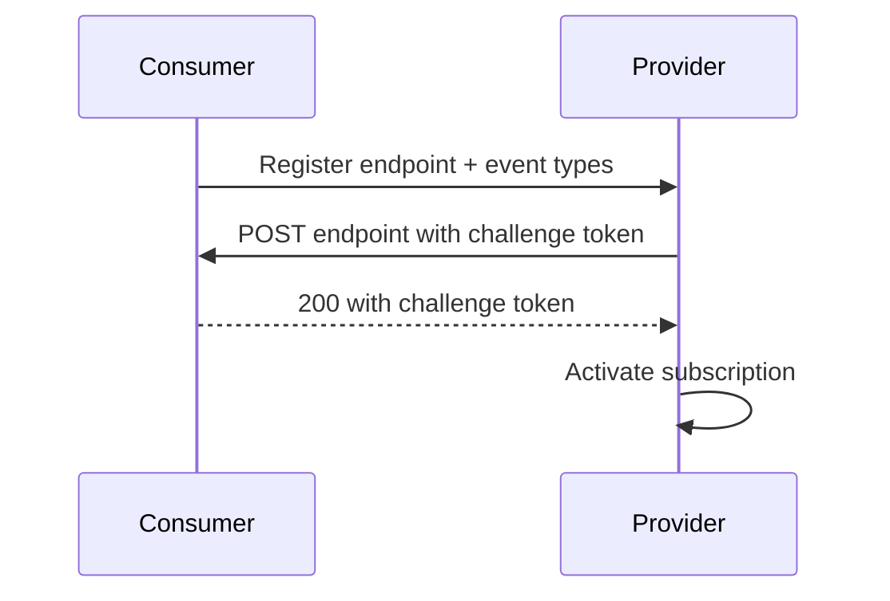

**Java example: subscription model**

```java
import java.util.Set;

public class WebhookSubscription {

    private String id;
    private String endpointUrl;
    private Set<String> eventTypes;
    private String signingSecret;
    private boolean active;

    public WebhookSubscription(String id, String endpointUrl,
                               Set<String> eventTypes, String signingSecret) {
        this.id = id;
        this.endpointUrl = endpointUrl;
        this.eventTypes = eventTypes;
        this.signingSecret = signingSecret;
    }

    public String getId() {
        return id;
    }

    public String getEndpointUrl() {
        return endpointUrl;
    }

    public Set<String> getEventTypes() {
        return eventTypes;
    }

    public String getSigningSecret() {
        return signingSecret;
    }

    public boolean isActive() {
        return active;
    }

    public void setActive(boolean active) {
        this.active = active;
    }
}
```

**Interview questions and answers**

- **Q: Why validate a webhook endpoint before enabling it?**
  **A:** To prevent sending sensitive events to arbitrary or attacker-controlled URLs and to confirm the subscriber owns the endpoint.

- **Q: What happens when a subscription repeatedly fails?**
  **A:** The provider should mark it disabled after enough failures, alert the owner, and preserve events or allow replay instead of sending indefinitely.

---

### Event Design and Payload Format

A well-designed webhook payload is structured, versioned, and self-describing.

```json
{
  "id": "evt_01HX8YQ5K2N4V",
  "type": "order.created",
  "created_at": "2026-08-19T10:30:00Z",
  "api_version": "2026-08-01",
  "data": {
    "order_id": "ord_123",
    "customer_id": "cus_456",
    "amount": 4999,
    "currency": "usd"
  }
}
```

**Design principles**

- Include a unique `id` for deduplication.
- Include an event `type` so consumers can route handlers.
- Include `created_at` or `occurred_at`.
- Include a schema or API version.
- Keep the `data` object focused on the changed resource.
- Use UTC ISO-8601 timestamps.
- Use consistent field naming across event types.
- Avoid nested objects that are unnecessarily large.

**Java example: generic event envelope**

```java
import com.fasterxml.jackson.annotation.JsonProperty;
import java.time.Instant;
import java.util.Map;

public class WebhookEvent {

    private String id;
    private String type;

    @JsonProperty("created_at")
    private Instant createdAt;

    @JsonProperty("api_version")
    private String apiVersion;

    private Map<String, Object> data;

    public WebhookEvent() {
    }

    public WebhookEvent(String id, String type, Instant createdAt,
                        String apiVersion, Map<String, Object> data) {
        this.id = id;
        this.type = type;
        this.createdAt = createdAt;
        this.apiVersion = apiVersion;
        this.data = data;
    }

    public String getId() {
        return id;
    }

    public String getType() {
        return type;
    }

    public Instant getCreatedAt() {
        return createdAt;
    }

    public String getApiVersion() {
        return apiVersion;
    }

    public Map<String, Object> getData() {
        return data;
    }
}
```

**Interview questions and answers**

- **Q: Why is event ID important?**
  **A:** It allows consumers to deduplicate retries and idempotently process events.

- **Q: Why version webhook payloads?**
  **A:** Schema changes can break consumers. Versioning lets producers evolve payloads while consumers migrate at their own pace.

---

### Security: Signatures and Verification

Webhooks must be protected from spoofing and tampering. The most common approach is HMAC signing.

**How HMAC signing works**

1. The provider and consumer share a secret.
2. The provider computes a hash over the raw request body and timestamp using the secret.
3. The provider sends the signature and timestamp in headers.
4. The consumer recomputes the signature and compares it in constant time.
5. The consumer checks that the timestamp is recent to prevent replay.

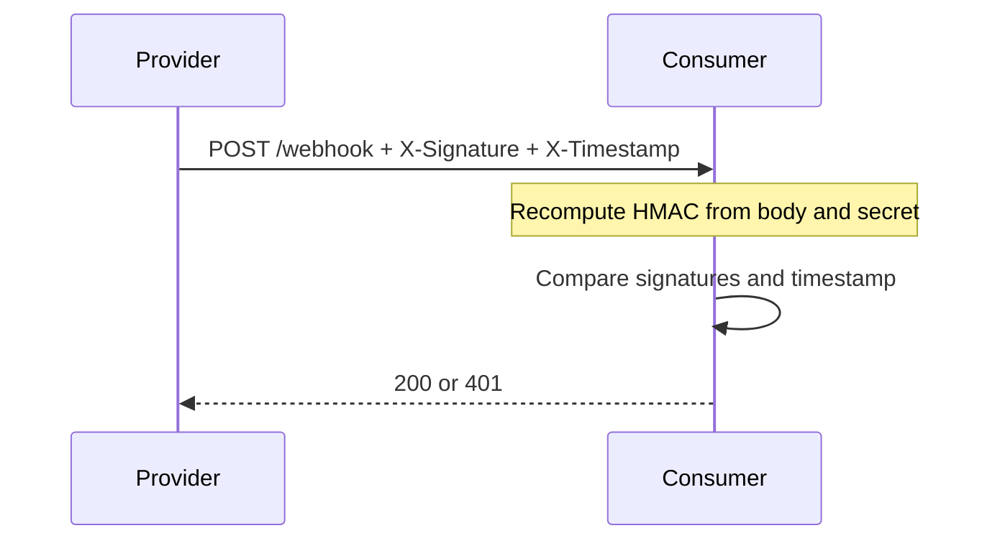

**Java example: HMAC signing and verification**

```java
import javax.crypto.Mac;
import javax.crypto.spec.SecretKeySpec;
import java.nio.charset.StandardCharsets;
import java.security.MessageDigest;
import java.util.Base64;

public final class WebhookSignature {

    private WebhookSignature() {
    }

    public static String sign(String payload, String secret) {
        try {
            Mac mac = Mac.getInstance("HmacSHA256");
            mac.init(new SecretKeySpec(secret.getBytes(StandardCharsets.UTF_8), "HmacSHA256"));
            byte[] signature = mac.doFinal(payload.getBytes(StandardCharsets.UTF_8));
            return Base64.getEncoder().encodeToString(signature);
        } catch (Exception e) {
            throw new IllegalStateException("Unable to sign payload", e);
        }
    }

    public static boolean verify(String payload, String secret, String expected) {
        String actual = sign(payload, secret);
        return MessageDigest.isEqual(
            actual.getBytes(StandardCharsets.UTF_8),
            expected.getBytes(StandardCharsets.UTF_8)
        );
    }
}
```

**Real-life use**

- Stripe uses `Stripe-Signature` with a timestamp and signed payload.
- GitHub uses `X-Hub-Signature-256`.
- Shopify uses `X-Shopify-Hmac-Sha256`.

**Interview questions and answers**

- **Q: Why include a timestamp in the signature?**
  **A:** To prevent replay attacks. The consumer can reject requests whose timestamp is outside a small allowed window.

- **Q: Why compare signatures in constant time?**
  **A:** Constant-time comparison prevents timing attacks that could help an attacker guess the correct signature.

---

### Retries and Delivery Guarantees

A webhook delivery can fail because the endpoint is unreachable, times out, or returns an error. Reliable systems retry automatically.

**Retry policy**

- Start with a short delay.
- Use exponential backoff, for example 1s, 5s, 25s, 2m, 10m.
- Add jitter to avoid synchronized retries.
- Stop after a configured maximum number of attempts.
- Move failed events to a dead letter queue.

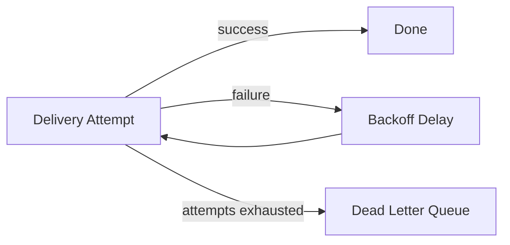

**Delivery guarantees**

- **At-most-once**: send once, no retry. Simple but may lose events.
- **At-least-once**: retry until acknowledged. Most webhook systems use this. Consumers must handle duplicates.
- **Exactly-once**: practically impossible end to end without consumer cooperation and deduplication.

**Java example: exponential backoff calculator**

```java
public final class BackoffPolicy {

    private BackoffPolicy() {
    }

    public static long delayMillis(int attempt, long baseMillis, double maxMillis, double jitterRatio) {
        double exponential = baseMillis * Math.pow(2, attempt);
        double capped = Math.min(exponential, maxMillis);
        double jitter = capped * jitterRatio * (Math.random() * 2 - 1);
        return Math.max(0L, Math.round(capped + jitter));
    }
}
```

**Interview questions and answers**

- **Q: Which HTTP responses should be retried?**
  **A:** Generally `5xx`, network timeouts, and `429` after the retry-after interval. Most `4xx` errors indicate a bad request and should not be retried.

- **Q: Why is exactly-once delivery difficult?**
  **A:** The producer cannot know whether the consumer processed an event if the acknowledgement is lost. Consumer-side deduplication is required to achieve effective exactly-once processing.

---

### Ordering and Idempotency

Webhook systems often cannot guarantee global ordering because retries, parallel workers, and network delays can reorder events.

**Ordering strategies**

- Process events through a single queue per consumer or per aggregate to preserve order.
- Use sequence numbers in events so consumers can detect gaps.
- Accept that ordering is best-effort for independent events.

**Idempotency strategies**

- Include a unique event ID.
- Store processed IDs in a database with a unique constraint.
- Make handlers naturally idempotent, for example using `UPSERT` instead of insert.
- Use idempotency keys for downstream side effects.

**Java example: deduplicating processor**

```java
import java.util.concurrent.ConcurrentHashMap;
import java.util.concurrent.ConcurrentMap;

public class IdempotentEventProcessor {

    private final ConcurrentMap<String, Boolean> processed = new ConcurrentHashMap<>();

    public boolean process(WebhookEvent event) {
        return processed.putIfAbsent(event.getId(), Boolean.TRUE) == null;
    }
}
```

For durable deduplication, store IDs in a database with a unique index rather than in memory.

**Interview questions and answers**

- **Q: How do you handle duplicate webhook events?**
  **A:** Persist the event ID and use a unique constraint or compare-and-set to ensure the same event is processed only once.

- **Q: Can webhooks guarantee strict ordering?**
  **A:** Not inherently. Ordering requires explicit sequencing, partitioning by aggregate ID, or ordered delivery infrastructure.

---

### Durability, Dead Letter Queues and Outbox Pattern

**Durability**

The producer should persist events before attempting delivery. This prevents loss if the producer crashes. Common durable stores are databases, Kafka, Redis Streams, or a dedicated queue.

**Dead letter queue**

After retries fail, events go to a DLQ. Operators can inspect the payload and failure reason, then replay or discard it.

**Outbox pattern**

The producer writes the business change and the webhook event to the same database transaction. A background relay publishes the event. This guarantees the event is not lost and avoids dual-write problems.

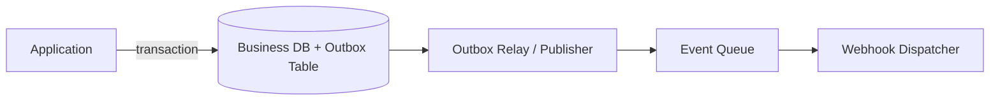

**Java example: outbox publisher skeleton**

```java
import org.springframework.stereotype.Service;
import org.springframework.transaction.annotation.Transactional;
import org.springframework.jdbc.core.JdbcTemplate;

@Service
public class OrderService {

    private final JdbcTemplate jdbcTemplate;

    public OrderService(JdbcTemplate jdbcTemplate) {
        this.jdbcTemplate = jdbcTemplate;
    }

    @Transactional
    public void createOrder(String orderId, String customerId, long amountCents) {
        jdbcTemplate.update(
            "INSERT INTO orders (order_id, customer_id, amount_cents) VALUES (?, ?, ?)",
            orderId, customerId, amountCents
        );

        jdbcTemplate.update(
            "INSERT INTO outbox (event_id, event_type, payload, created_at) VALUES (?, ?, ?, now())",
            "evt_" + orderId, "order.created", "{\"order_id\":\"" + orderId + "\"}"
        );
    }
}
```

**Interview questions and answers**

- **Q: What problem does the outbox pattern solve?**
  **A:** It ensures the business change and event are written atomically, preventing a successful change with a missing event or an event for a failed change.

- **Q: What is the purpose of a dead letter queue?**
  **A:** It isolates events that cannot be delivered after all retries so they can be inspected and replayed without blocking normal delivery.

---

### Rate Limiting, Throttling and Backpressure

A burst of events can overwhelm consumers. Webhook systems need to control the delivery rate.

- **Per-consumer rate limit**
  Limit how many requests per second a single endpoint receives.

- **Token bucket algorithm**
  Allows bursts up to a bucket size while enforcing a steady average rate.

- **Leaky bucket algorithm**
  Smooths traffic by processing events at a fixed rate.

- **Concurrent delivery limit**
  Limit how many HTTP requests are in flight to a single consumer.

- **Queue-based backpressure**
  The queue absorbs bursts, and workers process events at a sustainable rate.

- **Adaptive throttling**
  Slow down when the consumer latency increases or failures rise.

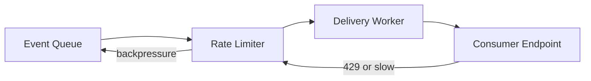

**Java example: simple token bucket**

```java
public class TokenBucket {

    private final long capacity;
    private final double refillPerSecond;
    private double tokens;
    private long lastRefillNanos;

    public TokenBucket(long capacity, double refillPerSecond) {
        this.capacity = capacity;
        this.refillPerSecond = refillPerSecond;
        this.tokens = capacity;
        this.lastRefillNanos = System.nanoTime();
    }

    public synchronized boolean tryAcquire() {
        refill();
        if (tokens >= 1) {
            tokens -= 1;
            return true;
        }
        return false;
    }

    private void refill() {
        long now = System.nanoTime();
        double elapsedSeconds = (now - lastRefillNanos) / 1_000_000_000.0;
        tokens = Math.min(capacity, tokens + elapsedSeconds * refillPerSecond);
        lastRefillNanos = now;
    }
}
```

**Interview questions and answers**

- **Q: Why rate limit webhook deliveries?**
  **A:** To protect consumers from bursts, prevent connection exhaustion, and avoid triggering their own rate limits.

- **Q: How does a token bucket differ from a leaky bucket?**
  **A:** A token bucket permits bursts up to the bucket size, while a leaky bucket enforces a smooth fixed-rate outflow.

---

### Observability and Monitoring

A production webhook system must answer these questions:

- How many events were delivered successfully?
- What is the delivery latency?
- How deep is the queue?
- How many retries and dead-letter events exist?
- Which consumers are failing?

**Key metrics**

- Delivery success rate
- Delivery latency percentiles
- Queue depth and age
- Retry count
- Dead letter count
- Per-endpoint failure rate
- Consumer response time

**Logs and tracing**

- Assign each event a correlation or trace ID.
- Log every delivery attempt with endpoint, status code, and duration.
- Preserve payload hashes for debugging without exposing sensitive data.

**Dashboards and alerts**

- Alert on high failure rate or deep queues.
- Alert when a single consumer repeatedly fails.
- Provide per-subscription drill-down views.

**Interview questions and answers**

- **Q: Which metric best indicates a slow consumer?**
  **A:** Consumer response latency combined with queue depth growth and increasing retries.

- **Q: Why use correlation IDs?**
  **A:** They link an event across producer logs, queue, delivery attempts, and consumer processing for easier debugging.

---

### High Availability and Scalability

A webhook system must remain available during traffic spikes and node failures.

**High availability**

- Deploy multiple stateless dispatcher instances.
- Use a durable, replicated queue.
- Store subscriptions in a replicated database.
- Run producers and consumers in multiple availability zones.
- Use leader election or partitioned workers to avoid duplicate delivery from multiple instances.

**Scalability**

- Scale delivery workers horizontally.
- Partition the queue by consumer or event type.
- Use asynchronous non-blocking HTTP clients for high concurrency.
- Cache subscriptions locally to reduce database load.
- Use connection pooling and per-consumer limits.

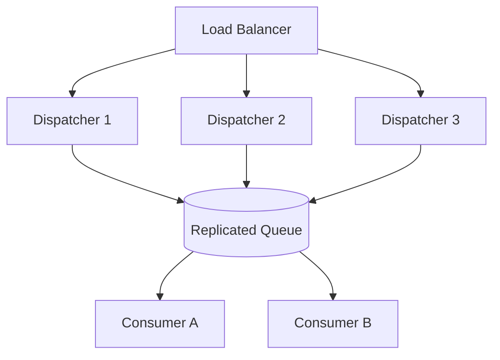

**Interview questions and answers**

- **Q: How do you avoid duplicate delivery when multiple dispatcher instances read the same queue?**
  **A:** Use a queue with claim/lease semantics, partition ownership, or a lock so only one worker processes a given event at a time.

- **Q: How do you scale delivery to millions of endpoints?**
  **A:** Use partitioned queues, horizontally scaled workers, asynchronous HTTP clients, local subscription caches, and per-consumer rate limiting.

---

### Real-World Webhook Providers

- **Stripe**
  Sends payment events with signed payloads, automatic retries, and a dashboard for event inspection.

- **GitHub**
  Sends repository events with HMAC signatures and supports delivery logs, redelivery, and multiple event types.

- **Shopify**
  Provides order, product, and customer webhooks with HMAC signing and versioned payloads.

- **Slack**
  Uses webhooks both for incoming messages and outgoing bot events.

- **Twilio**
  Sends call and message events to customer endpoints.

- **Auth0**
  Sends authentication lifecycle events to logs and custom webhooks.

- **Datadog**
  Uses webhooks to send monitor alerts to chat and incident tools.

- **PagerDuty**
  Receives and sends webhook events for incident management.

**Interview questions and answers**

- **Q: What features do mature webhook providers usually include?**
  **A:** Signed payloads, retries, delivery logs, replay, endpoint validation, event filtering, and a dashboard.

- **Q: How can a consumer test Stripe webhooks locally?**
  **A:** Use the Stripe CLI to forward events to a local server, or use a tunnel such as ngrok to expose the local endpoint.

---

### Data Model and API

**Entities and Relationships**

The core data model for Webhook includes:

- **Primary entity**: the main data object managed by the system
- **Related entities**: supporting objects with foreign-key relationships
- **Audit/log tables**: for tracking changes and events

**API Contract**

- `GET /api/v1/webhook` — List items
- `GET /api/v1/webhook/:id` — Get item by ID
- `POST /api/v1/webhook` — Create item
- `PUT /api/v1/webhook/:id` — Update item
- `DELETE /api/v1/webhook/:id` — Delete item

**Database Schema**

- Primary store: relational database (PostgreSQL/MySQL)
- Indexes on frequently queried fields
- Foreign key constraints for referential integrity
- Connection pooling for efficient database access

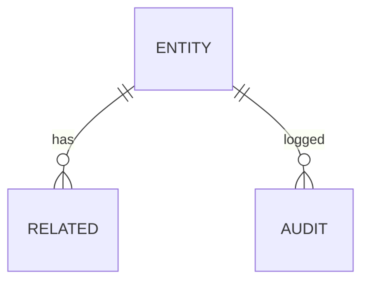

### Replication Strategies

**What it means**

Replication Strategies determine how data and state are copied across multiple nodes in Webhook. The choice of strategy determines the trade-off between consistency, availability, and latency.

**Why it matters**

Webhook must replicate data to prevent loss and serve reads from multiple nodes. The replication strategy determines whether the system favors consistency (strong reads) or availability (always writable), and how it handles cross-node failure.

**How it works**

**Leader-based (single-leader)**: A single primary node accepts all writes; followers replicate changes asynchronously or semi-synchronously. Reads can be served from any replica. This strategy favors strong consistency for writes but creates a write bottleneck at the leader.

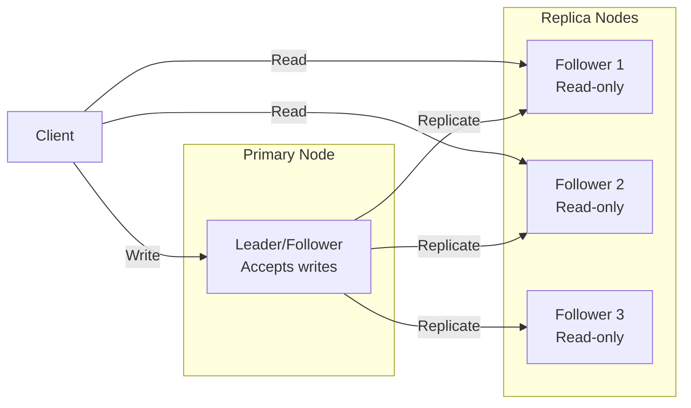

*Leader-based replication: a single primary node accepts all writes and replicates them to read-only followers. Clients can read from any replica for scaled read throughput, but all writes go through the leader.*

**Multi-leader (multi-master)**: Multiple nodes accept writes and exchange updates with each other. This enables low-latency writes in different regions but requires conflict resolution (last-write-wins, merge functions, or CRDTs).

**Leaderless (quorum-based)**: Any node can accept writes; a quorum of nodes must agree. Read and write quorums are configured so that at least one node overlaps between them (R + W > N). This maximizes availability and write scalability.

**Trade-offs for Webhook**:

| Strategy | Use Case | Pros | Cons |
|---|---|---|---|
| Leader-based | webhook payloads, delivery logs | Strong consistency, simple | Write bottleneck, leader failure risk |
| Multi-leader | delivery status, public configs | Low-latency global writes | Conflict resolution, complex |
| Leaderless | Caching, counters | High availability, no bottleneck | Eventual consistency, read repair overhead |

**Real-world implementations**

- **Redis**: Leader-follower replication with asynchronous replication; Sentinel handles failover.
- **Apache Kafka**: Leader-based partition replication with ISR (in-sync replica) — writes go to the leader, followers replicate.
- **Cassandra**: Tunable consistency with leaderless quorum (R + W > N).
- **DynamoDB Global Tables**: Multi-master active-active across regions.

### Failure Detection and Membership

**What it means**

Failure Detection and Membership is the mechanism by which Webhook determines which nodes are alive and part of the cluster. Membership is the list of known nodes; failure detection is the process of updating that list when nodes fail or recover.

**Why it matters**

Webhook must route requests only to healthy nodes and trigger failover when a node goes down. False positives (healthy nodes marked as dead) cause unnecessary failovers and data loss. False negatives (dead nodes not detected) cause failed requests and degraded performance.

**How it works**

**Heartbeat-based detection**: Each node sends a heartbeat (ping) to a subset of peers at regular intervals. If a node misses N consecutive heartbeats, it is marked as suspect. The gossip protocol distributes membership information: each node exchanges its view of the cluster with a random peer, and the information propagates gossip-style.

```mermaid
sequenceDiagram
    participant A as Node A
    participant B as Node B
    participant C as Node C

    loop Every 1s
        A->>B: Heartbeat (ping)
        B-->>A: Heartbeat (ack)
    end
    B->>C: Gossip: A is alive
    C->>A: Gossip: B is alive
    Note over A,B,C: View converges in O(log N) rounds
```

*Gossip-based failure detection: each node periodically pings a random subset of peers and gossips its view of the cluster. The membership list converges in O(log N) rounds.*

**Phi Accrual Failure Detector**: Instead of a fixed timeout, the detector measures the time between consecutive heartbeats and computes a phi (φ) value — the probability that the node is dead given the observed heartbeat pattern. φ is compared against a threshold (typically 1–8); higher thresholds reduce false positives but increase detection latency.

**SWIM (Scalable Weakly-consistent Infection-style Process group Membership Protocol)**: Nodes ping a random subset of cluster members. If a ping fails, the node is marked "suspect" and the failure is "infected" (gossiped) to other nodes. This is O(log N) per failure detection cycle and scales to large clusters.

**Trade-offs**:

| Approach | Strengths | Weaknesses |
|---|---|---|
| Heartbeat (timeout-based) | Simple, deterministic | False positives under load |
| Phi Accrual | Adaptive threshold | Needs historical data |
| SWIM | Scales to 1000s of nodes | Eventual consistency |

**Real-world implementations**

- **AWS Route 53 Health Checks**: Uses TCP/HTTP health checks with configurable thresholds to remove unhealthy instances from DNS rotation.
- **Kubernetes**: Uses the kubelet heartbeat (every 10s) to determine node liveness; nodes missing 3 consecutive heartbeats are marked NotReady.
- **Consul**: Uses SWIM protocol for membership and failure detection; supports both LAN and WAN gossip.
- **Akka Cluster**: Uses Phi Accrual failure detector with configurable φ thresholds.

### Performance and Optimization

**What it means**

Performance and Optimization covers the techniques Webhook uses to achieve low latency, high throughput, and efficient resource usage. This section examines the key performance metrics, bottlenecks, and optimizations specific to the system.

**Why it matters**

Webhook faces competing pressures: users demand low latency, the system must handle high throughput, and infrastructure costs must be controlled. The optimizations applied at the data, compute, and network layers determine whether the system meets its SLA.

**How it works**

**Latency layers**: Latency in Webhook comes from three layers:
1. **Network**: Round-trip time from client to the nearest edge node / load balancer.
2. **Application**: Request processing time on the server (CPU, I/O, lock contention).
3. **Data**: Time to read/write from storage (cache hit vs. database query).

The 99th-percentile latency is the key metric for user-facing systems — it determines the worst-case experience.

**Caching strategies**: Webhook uses multiple cache layers:
- **Edge cache**: Static assets (images, CSS, JS) served from a CDN at the edge. For Webhook, this caches delivery status, public configs that doesn't change frequently.
- **Application cache**: In-memory cache (e.g., Redis, Memcached) for frequently accessed data. Cache-aside pattern: application checks cache first, falls back to database on miss.
- **Local cache**: In-process cache (e.g., Caffeine, Guava) for data accessed within a single request. Avoids network round-trips.

**Batching and pipelining**: Webhook batches small operations (e.g., writes, log flushes) to amortize per-operation overhead. Pipelining allows multiple requests to be in flight simultaneously.

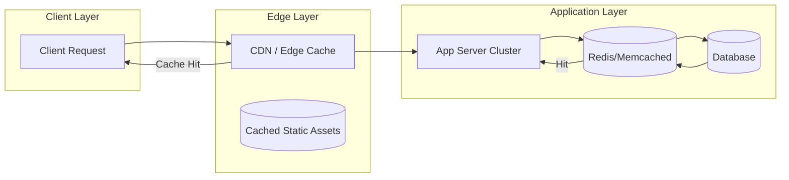

*Caching hierarchy: clients first hit the edge CDN/cache; if the response is cached, it is returned immediately. Otherwise, the request reaches the application, which checks its in-memory/application cache (e.g., Redis) before falling back to the database. This minimizes latency from each layer.*

**Connection pooling**: Webhook maintains a pool of database connections to avoid the TCP handshake overhead on every request. Pool size is tuned to match the database's capacity.

**Compression**: Responses are compressed (gzip, zstd) for clients that support it. At the network layer, gRPC uses HPACK header compression.

**Indexing**: Database tables are indexed on frequently queried fields. For Webhook, indexes cover **Subscription registry**
  Stores consumer endpoints, event types, secrets, and and **Event queue**
  Buffers events between production and delivery. The queue deco for fast lookups.

**Asynchronous processing**: Non-critical background work (e.g., analytics, cleanup, notifications) is offloaded to message queues and processed asynchronously, keeping the request path fast.

**Resource isolation**: CPU and memory are allocated per service (containers with cgroup limits). This prevents a single misbehaving service from degrading the entire system.

**Metrics for Webhook**:

| Metric | Target | How to Measure |
|---|---|---|
| P99 latency | < 1s | Load test with realistic traffic |
| Throughput | 1K RPS | Request rate under peak load |
| Error rate | < 0.1% | 5xx / total requests |
| Cache hit ratio | > 90% | cache_hits / (cache_hits + misses) |
| Resource utilization | < 80% CPU, < 85% memory | Container metrics |

**Real-world implementations**

- **Google's HTTP Load Balancer**: Global load balancing with edge PoPs; routes users to the nearest healthy backend.
- **Cloudflare**: Edge cache with Argo Smart Routing that dynamically routes traffic to avoid congestion.
- **Redis**: Used as an application cache with configurable eviction policies (LRU, LFU, TTL).

### Encryption and Key Management

**What it means**

Encryption and Key Management in Webhook ensures that data is protected both at rest (stored on disk) and in transit (moving between services). Key management governs how encryption keys are generated, stored, rotated, and accessed — without proper key management, encryption provides a false sense of security.

**Why it matters**

Webhook handles webhook payloads, delivery logs that must be encrypted both at rest and in transit. Scaling Webhook to handle increasing load while maintaining data consistency, low latency, and fault tolerance requires careful key management: keys must be rotated regularly, scoped to prevent cross-contamination, and audited for compliance. A single key compromise could expose sensitive data.

**How it works**

**At-rest encryption**: Data stored in **Event producer**
  The system that detects a change and creates an event. It k, **Subscription registry**
  Stores consumer endpoints, event types, secrets, and and databases is encrypted using AES-256-GCM. The Data Encryption Key (DEK) is generated per data partition and encrypted with a Key Encryption Key (KEK) managed by a KMS (AWS KMS, GCP KMS, HashiCorp Vault). Keys are regionally scoped — only data belonging to a region can be decrypted by that region's KEK.

**In-transit encryption**: All inter-service communication uses TLS 1.3 or mTLS for service-to-service auth. Cross-region communication of delivery status, public configs uses TLS + optional application-level encryption. webhook payloads, delivery logs is NEVER transmitted in plaintext or across region boundaries.

**Key hierarchy**:
```
Master Key (HSM-backed, KMS-managed)
  └─ KEK (per region, per service)
     └─ DEK (per data partition, rotated every 90 days)
        └─ Data (encrypted with DEK)
```

**Key rotation**: KEKs rotate annually (automatic via KMS); DEKs rotate per object or per 90 days. Applications handle key version headers transparently — a DEK version is stored alongside the encrypted data.

**Cross-region key sharing**: For non-restricted data (delivery status, public configs), a shared key is imported into each region's KMS. Restricted data NEVER uses cross-region keys — each region's KMS holds only that region's keys.

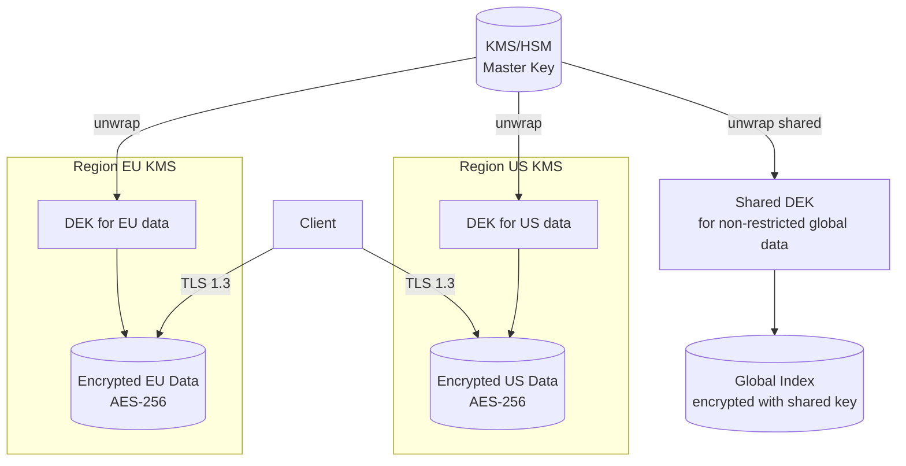

*Encryption key hierarchy: master keys are managed by an HSM-backed KMS and never leave the KMS. Each region has its own KEK. Data encryption keys (DEKs) are generated per partition and encrypted with the regional KEK. Only non-restricted global data uses a shared cross-region key. All client traffic uses TLS 1.3.*

**Java/Spring Boot Implementation**

```java
@Service
@RequiredArgsConstructor
public class DataEncryptionService {

    private final AWSKMS kms;
    @Value("${app.region}")
    private String region;
    @Value("${app.encryption.dek-ttl-minutes:1440}")
    private int dekTtlMinutes;

    private final Map<String, SecretKey> dekCache = new ConcurrentHashMap<>();

    public EncryptedData encrypt(String plaintext, String partitionId) {
        SecretKey dek = getOrCreateDek(partitionId);
        byte[] ciphertext = CryptoUtils.encrypt(plaintext.getBytes(StandardCharsets.UTF_8), dek);
        String dekCiphertext = kms.encrypt(EncryptRequest.builder()
            .keyId("arn:aws:kms:" + region + ":master-key")
            .plaintext(SdkBytes.fromByteArray(dek.getEncoded()))
            .build()).ciphertextBlob().asByteArray();
        return new EncryptedData(ciphertext, dekCiphertext, Instant.now());
    }

    private SecretKey getOrCreateDek(String partitionId) {
        return dekCache.computeIfAbsent(partitionId, id -> {
            try {
                return KeyGenerator.getInstance("AES").generateKey();
            } catch (NoSuchAlgorithmException e) {
                throw new IllegalStateException("Cannot generate DEK", e);
            }
        });
    }
}
```

*Spring Boot encryption service: DEKs are cached per-partition with TTL. Each DEK is encrypted via AWS KMS using a regional master key. The encrypted DEK (ciphertext) is stored alongside the data — only the KMS for that region can decrypt it.*

**Real-world implementations**

- **AWS KMS**: Managed HSM-backed key service; supports automatic key rotation and custom key stores.
- **HashiCorp Vault**: Open-source key management; supports transit encryption (encrypt/decrypt without storing keys).
- **Google Cloud KMS**: Hardware-backed key management with IAM-based access control.

### Authentication and Authorization

**What it means**

Authentication and Authorization (AuthN/AuthZ) in Webhook control who can access the system and what they can do. Authentication verifies identity; authorization determines permissions. In a distributed system like Webhook, auth must work across multiple nodes while respecting data boundaries — a user authenticated in one region should not have their session data or tokens replicated to regions where it is not permitted.

**Why it matters**

Webhook must verify identity at the edge and enforce authorization at every service boundary. webhook payloads, delivery logs must be protected — only users with appropriate roles should access it. At the same time, delivery status, public configs data should be accessible to a wider audience with minimal friction.

**How it works**

**Authentication (who are you?)**:
- **JWT tokens**: Users authenticate through their home region's identity provider. The region returns a JWT (JSON Web Token) signed by a regional signing key. Tokens include claims like `iss` (issuer region), `sub` (subject/user ID), `home_region`, `roles`, and `exp` (expiry). Tokens are scoped per region — a token issued by region A cannot access restricted data in region B.
- **mTLS for service-to-service**: Internal services authenticate each other using mutual TLS certificates issued by a per-region Certificate Authority (CA). No shared secrets cross region boundaries.
- **Session management**: Sessions are stored regionally (Redis) and never replicated cross-region for restricted data. Session IDs are opaque UUIDs; the session store maps session ID → user context.

**Authorization (what can you do?)**:
- **RBAC (Role-Based Access Control)**: Users are assigned roles per region. Common roles: `region_admin` (full access to region data), `auditor` (read-only audit), `viewer` (read public data only). Roles are stored in the regional database and cached locally for sub-1ms lookups.
- **ABAC (Attribute-Based Access Control)**: Fine-grained permissions based on attributes (e.g., `home_region == request_region AND role == admin`). This allows expressing complex policies like "users can only access restricted data in their home region."
- **Resource-level authorization**: Each request is checked against an ACL (Access Control List) that specifies which roles can access which resources. For Webhook, restricted resources require the `admin` role + matching region.

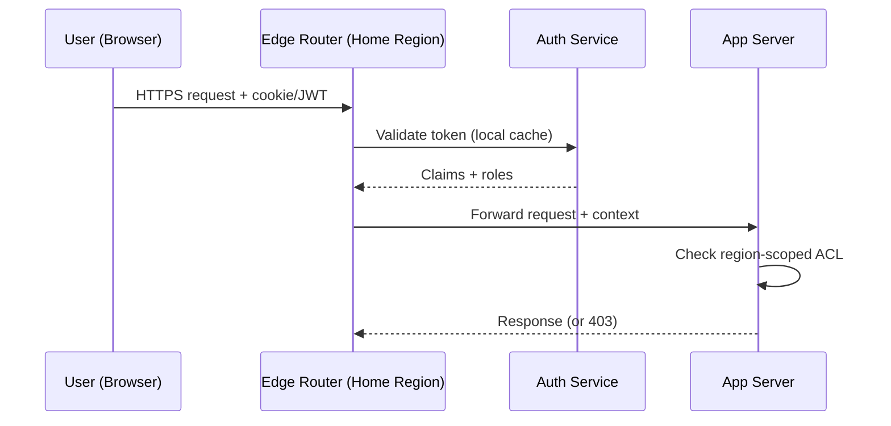

*Authentication flow: the user's token is validated by the regional auth service (claims cached locally). The edge router forwards the request with the security context. Each app server checks the region-scoped ACL before accessing restricted data.*

**Java/Spring Boot Implementation**

```java
@Service
@RequiredArgsConstructor
public class AuthorizationService {

    private final UserTokenRepository tokenRepository;
    @Value("${app.region}")
    private String currentRegion;

    public boolean canAccessResource(String userId, String resourceRegion,
                                     String action, JWTClaims claims) {
        String userHomeRegion = claims.getStringClaim("home_region");
        List<String> roles = claims.getStringListClaim("roles");

        if (!roles.contains(action)) {
            return false;
        }

        if (resourceRegion.equals(userHomeRegion)) {
            return true;
        }

        if (resourceRegion.equals("global")) {
            return roles.contains("global_reader");
        }

        return false;
    }
}

@RestController
@RequiredArgsConstructor
@RequestMapping("/api/v1")
public class RegionController {
    private final AuthorizationService authService;

    @GetMapping("/data/{region}/profile")
    public ResponseEntity<?> getProfile(
            @PathVariable String region,
            @RequestHeader("Authorization") String token) {
        JWTClaims claims = JwtUtils.parseAndValidate(token, currentRegion);

        if (!authService.canAccessResource(
                claims.getStringClaim("sub"), region, "read", claims)) {
            return ResponseEntity.status(HttpStatus.FORBIDDEN).build();
        }

        return ResponseEntity.ok(profileService.getByRegion(region));
    }
}
```

*Spring Boot authorization service: checks both the user's role and whether the requested resource violates region boundaries. The `canAccessResource` method returns false if a user from region EU tries to access restricted data in region US.*

**Real-world implementations**

- **Auth0**: JWT-based authentication with regional endpoints; supports custom rules for ABAC.
- **Okta**: Multi-region identity management with adaptive MFA and ThreatInsight for anomaly detection.
- **AWS Cognito**: Regional user pools with IAM integration; tokens are region-scoped by default.

### Security Threats and Mitigations

**What it means**

Security Threats and Mitigations catalog the attack surface of Webhook, the most likely threats, and the corresponding defenses. Every distributed system has unique threat vectors — Webhook is no exception.

**Why it matters**

Webhook handles webhook payloads, delivery logs that attackers might target. Scaling Webhook to handle increasing load while maintaining data consistency, low latency, and fault tolerance expands the attack surface: more nodes, more network paths, more failure modes. Without proper threat modeling, a single vulnerability could expose sensitive data across the entire system.

**Threat model**:

| Threat | Likelihood | Impact | Mitigation |
|---|---|---|---|
| Data exfiltration (cross-region) | High | Critical | Region-scoped keys, no cross-region replication of restricted data |
| Man-in-the-middle (inter-service) | Medium | High | mTLS between all services |
| Replay attacks | Medium | High | Token expiry + nonce |
| DDoS at the edge | High | High | Rate limiting + edge filtering (Cloudflare, AWS Shield) |
| PII leakage in logs | High | High | PII redaction + field-level access control |
| Session hijacking | Medium | Medium | Short-lived tokens + IP binding |
| Privilege escalation | Low | Critical | Least-privilege RBAC + audit logs |
| Cache poisoning | Low | Medium | Cache invalidation on write + signed cache keys |

**How it works**

**Data exfiltration prevention**: Webhook enforces data residency by design — webhook payloads, delivery logs is never replicated cross-region. The replication layer checks a data classification label before allowing cross-region copy. A database-level policy (e.g., PostgreSQL RLS) also blocks cross-region queries for restricted partitions.

**mTLS enforcement**: All service-to-service communication uses mutual TLS. Certificates are issued by a per-region CA and rotated every 30 days. Services must present a valid certificate to communicate — no plaintext connections are allowed.

**PII redaction**: Application logs are scanned for PII patterns (email, phone, credit card) using an automated redaction layer (e.g., AWS Macie, Google DLP). delivery status, public configs is logged freely; restricted fields are masked or dropped before logging.

```mermaid
graph TD
    subgraph "Threat Surface"
        Client[Client]
        Edge[Edge Router / WAF]
        App[App Server]
        DB[(Database)]
        Cache[(Cache)]
        Logs[Log Store]
    end

    Client -->|HTTPS| Edge
    Edge -->|mTLS| App
    App -->|mTLS| DB
    App -->|Read| Cache
    App -->|Write| DB
    App -->|Log| Logs

    subgraph "Mitigations"
        WAF[AWS WAF /<br/>Cloudflare]
        DLP[PII Redaction<br/>(Macie/DLP)]
        FIM[File Integrity<br/>Monitoring]
    end

    Edge -.-> WAF
    Logs -.-> DLP
    DB -.-> FIM
```

*Threat mitigation diagram: the WAF at the edge blocks DDoS and injection attacks. mTLS protects all service-to-service communication. PII redaction scans logs before storage. File integrity monitoring alerts on database tampering.*

**Audit trail**: All security-relevant events (auth, data access, config changes) are written to an append-only audit log with cryptographic integrity (HMAC per entry). The log covers webhook payloads, delivery logs access — who accessed what, when, and from where.

**Real-world implementations**

- **Cloudflare**: Zero-trust model (All Connections to All Networks) with mTLS everywhere; uses GeoIP blocking and rate limiting for DDoS mitigation.
- **Google BeyondCorp**: Zero-trust network security model; all access is authenticated and authorized at the request level.

### Observability and Logging

**What it means**

Observability and Logging in Webhook provide visibility into system behavior through three pillars: **metrics** (aggregates and counters), **logs** (structured event records), and **traces** (distributed request timelines). Together, these signals allow operators to debug issues, detect anomalies, and verify SLA compliance.

**Why it matters**

Distributed systems like Webhook are inherently opaque — failures can cascade across services in unexpected ways. Without good observability, a single slow dependency can cause widespread timeouts that are nearly impossible to diagnose. Scaling Webhook to handle increasing load while maintaining data consistency, low latency, and fault tolerance makes observability even more critical: operators need to see cross-region latency, regional failures, and data-residency violations.

**How it works**

**Metrics**: Webhook instruments every service with Prometheus-style metrics:
- **Request rate, error rate, duration (the "RED" metrics)**: Tracks per-endpoint HTTP latency and error counts.
- **System metrics**: CPU, memory, disk I/O, network throughput per node.
- **Business metrics**: For Webhook, this includes metrics like "**Subscription registry**
  Stores consumer endpoints, event types, secrets, and fill rate" and "reservation conflict rate".

Metrics are aggregated in a time-series database (Prometheus, VictoriaMetrics) and visualized in Grafana dashboards with alerts via PagerDuty.

**Logs**: Webhook uses structured logging (JSON format) with standardized fields:
- `timestamp`: ISO 8601 UTC
- `level`: DEBUG, INFO, WARN, ERROR
- `service`: originating service name
- `trace_id`: distributed trace identifier (for correlation)
- `span_id`: current operation span
- `region`: the region that processed the request
- `data_class`: RESTRICTED or NON_RESTRICTED

webhook payloads, delivery logs access is logged with full context (user, action, resource). delivery status, public configs logs are aggregated and may have reduced retention.

**Distributed tracing**: Every request is assigned a trace ID at the edge. The trace propagates through all downstream services via HTTP headers. A tracing backend (Jaeger, Tempo, Zipkin) reconstructs the full request timeline, showing latency at each hop. For Webhook, traces include region boundaries — a cross-region call is annotated as such.

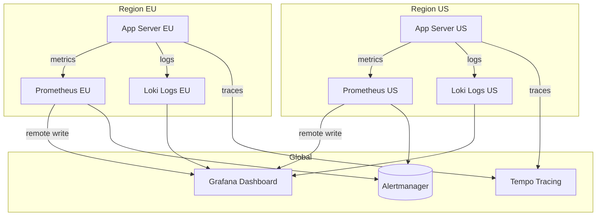

*Observability architecture: each region runs its own Prometheus (metrics) and Loki (logs) instances. A global Grafana instance queries all regional backends. Traces are collected centrally in Tempo. Alerts fire from each region's Prometheus to Alertmanager.*

**Alerting**: Webhook defines SLO-based alerts:
- **Latency**: P99 > 1s for 5 minutes → page.
- **Error rate**: > 1% for 10 minutes → page.
- **Availability**: < 99.5% for 15 minutes → page.
- **Data residency violation**: any restricted data detected outside its region → critical page.

**Java/Spring Boot Implementation**

```java
@Component
@RequiredArgsConstructor
@Slf4j
public class ObservabilityContext {

    @Value("${app.region}")
    private String region;

    public void logAccess(String userId, String resource, String action,
                          boolean restricted) {
        log.info("access_event userId={} resource={} action={} region={} data_class={}",
            userId, resource, action, region, restricted ? "RESTRICTED" : "NON_RESTRICTED");
    }
}

@RestController
@RequiredArgsConstructor
@Slf4j
public class ApiController {
    private final ObservabilityContext obs;
    private final UserService userService;

    @GetMapping("/api/v1/profile")
    public ResponseEntity<ProfileResponse> getProfile(
            @AuthenticationPrincipal UserDetails user) {
        String traceId = MDC.get("traceId");
        long start = System.nanoTime();

        try {
            ProfileResponse response = userService.getProfile(user.getId());
            obs.logAccess(user.getId(), "profile", "read", true);

            return ResponseEntity.ok(response);
        } finally {
            long durationMs = (System.nanoTime() - start) / 1_000_000;
            log.info("profile_read traceId={} latencyMs={} region={}",
                traceId, durationMs, obs.region);
        }
    }
}
```

*Spring Boot observability: the `ObservabilityContext` logs structured access events with data classification. The controller records latency and trace ID for every request, enabling SLO-based alerting.*

**Real-world implementations**

- **Netflix OSS (Atlas + Zipkin + Servo)**: Metrics via Atlas, traces via Zipkin, instrumented via Servo. Scales to over 700 billion requests/day.
- **Google SRE Workbook**: Comprehensive observability with SLI/SLO/SLI definition; uses Borgmon for metrics and Dapper for tracing.
- **AWS Observability**: CloudWatch for metrics, X-Ray for tracing, CloudWatch Logs for structured logs.

### Real-World Implementations

**Webhook in production**

- **Webhook platforms**: widely used webhook platform

**Key takeaways**

- Scalability patterns proven in production at scale
- Common pitfalls and how to avoid them
- Integration with existing infrastructure and monitoring

### Architectural Patterns

**Patterns relevant to Webhook**

- **Layered/Clean Architecture**: Separates business logic from infrastructure concerns, enabling independent testing and maintenance.
- **Database-per-Service**: Each service manages its own data store, providing isolation but complicating cross-service queries.
- **Event-Driven Architecture**: Decouples services through asynchronous events; enables loose coupling and independent scaling.
- **CQRS (Command Query Responsibility Segregation)**: Separates read and write models for independent optimization; read models can be denormalized for query performance.
- **Saga Pattern**: Manages distributed transactions through a sequence of local transactions with compensating actions on failure.

**Pattern trade-offs**

- Layered architecture is simple to implement but can create tight coupling between layers over time.
- Database-per-service provides schema independence but requires careful design of cross-service consistency.
- Event-driven architecture enables loose coupling but introduces eventual consistency and debugging complexity.
- CQRS optimizes read/write paths independently but doubles the number of data models to maintain.
- Sagas handle long-running transactions but require idempotent compensations and careful state management.

### Java and Spring Boot Implementation Guide

This section shows a complete Spring Boot webhook consumer and producer.

#### 1. Webhook consumer controller

```java
import org.springframework.http.HttpStatus;
import org.springframework.http.ResponseEntity;
import org.springframework.web.bind.annotation.*;

@RestController
@RequestMapping("/webhooks")
public class WebhookController {

    private final WebhookService webhookService;

    public WebhookController(WebhookService webhookService) {
        this.webhookService = webhookService;
    }

    @PostMapping("/order")
    public ResponseEntity<Void> receiveOrderEvent(
            @RequestBody String rawPayload,
            @RequestHeader("X-Signature") String signature,
            @RequestHeader("X-Timestamp") String timestamp) {

        if (!webhookService.isValidSignature(rawPayload, signature, timestamp)) {
            return ResponseEntity.status(HttpStatus.UNAUTHORIZED).build();
        }

        webhookService.process(rawPayload);
        return ResponseEntity.ok().build();
    }
}
```

#### 2. Consumer service with deduplication

```java
import com.fasterxml.jackson.databind.ObjectMapper;
import org.springframework.stereotype.Service;

import java.time.Duration;
import java.time.Instant;
import java.util.concurrent.ConcurrentHashMap;
import java.util.concurrent.ConcurrentMap;

@Service
public class WebhookService {

    private final String secret = "shared-secret";
    private final ObjectMapper objectMapper = new ObjectMapper();
    private final ConcurrentMap<String, Boolean> processedEventIds = new ConcurrentHashMap<>();

    public boolean isValidSignature(String payload, String signature, String timestamp) {
        String signedPayload = timestamp + "." + payload;
        return WebhookSignature.verify(signedPayload, secret, signature);
    }

    public void process(String rawPayload) {
        try {
            WebhookEvent event = objectMapper.readValue(rawPayload, WebhookEvent.class);

            if (processedEventIds.putIfAbsent(event.getId(), Boolean.TRUE) != null) {
                return;
            }

            handleEvent(event);
        } catch (Exception e) {
            throw new IllegalStateException("Failed to process webhook", e);
        }
    }

    private void handleEvent(WebhookEvent event) {
        System.out.println("Handling event: " + event.getType());
    }
}
```

#### 3. Webhook producer client

```java
import org.springframework.http.HttpEntity;
import org.springframework.http.HttpHeaders;
import org.springframework.http.MediaType;
import org.springframework.stereotype.Service;
import org.springframework.web.client.RestTemplate;

import java.time.Instant;
import java.util.Map;

@Service
public class WebhookProducer {

    private final RestTemplate restTemplate = new RestTemplate();
    private final String secret = "shared-secret";

    public void send(String endpointUrl, WebhookEvent event) {
        try {
            String payload = new com.fasterxml.jackson.databind.ObjectMapper()
                .writeValueAsString(event);
            String timestamp = Instant.now().toString();
            String signature = WebhookSignature.sign(timestamp + "." + payload, secret);

            HttpHeaders headers = new HttpHeaders();
            headers.setContentType(MediaType.APPLICATION_JSON);
            headers.set("X-Signature", signature);
            headers.set("X-Timestamp", timestamp);

            restTemplate.postForEntity(endpointUrl, new HttpEntity<>(payload, headers), String.class);
        } catch (Exception e) {
            throw new IllegalStateException("Failed to send webhook", e);
        }
    }
}
```

#### 4. Asynchronous delivery with retry using Spring Retry

```java
import org.springframework.retry.annotation.Backoff;
import org.springframework.retry.annotation.Retryable;
import org.springframework.stereotype.Service;
import org.springframework.web.client.RestClientException;

@Service
public class RetryableWebhookSender {

    private final WebhookProducer producer;

    public RetryableWebhookSender(WebhookProducer producer) {
        this.producer = producer;
    }

    @Retryable(
        retryFor = { RestClientException.class },
        maxAttempts = 5,
        backoff = @Backoff(delay = 1000, multiplier = 2)
    )
    public void sendWithRetry(String endpointUrl, WebhookEvent event) {
        producer.send(endpointUrl, event);
    }
}
```

**Interview questions and answers**

- **Q: How do you verify a webhook in Spring Boot?**
  **A:** Read the raw request body, recompute the HMAC signature using the shared secret, compare it to the header in constant time, and check the timestamp.

- **Q: How do you make webhook processing idempotent in Spring Boot?**
  **A:** Store the event ID in a database with a unique constraint or use an atomic in-memory check before performing side effects.

- **Q: How do you test webhooks during local development?**
  **A:** Use a tunnel tool such as ngrok or a provider CLI such as the Stripe CLI to forward events to localhost.

---

### Interview Questions and Answers

**Beginner**

- **Q: What is a webhook?**
  **A:** A webhook is an HTTP callback: when an event happens in a provider, the provider makes an HTTP request (POST) to a URL you registered, delivering the event payload. In other words, instead of your app polling "did anything happen?", the provider pushes the news to you as it happens. Expected contrast: *webhook vs REST API* — an API is pull (you ask), a webhook is push (they tell you).

- **Q: How is a webhook different from an API?**
  **A:** An API is a pull interface — the consumer initiates a request when it wants data. A webhook is a push interface — the provider initiates the request when an event occurs. They are complementary: most systems use both (REST API for queries/state changes, webhooks for notifications). The architectural shift is who holds the connection and who decides timing.

- **Q: Why use webhooks instead of polling?**
  **A:** Three reasons: near-real-time delivery (events show up in seconds, not on the next poll), reduced provider load (no empty polling requests), and lower operational cost (no scheduler spinning on empty intervals). For low-event-frequency systems the efficiency gain is enormous.

- **Q: What does "at-least-once delivery" mean and why does it matter?**
  **A:** It means the provider will deliver a payload one or more times — it retries on failure until the consumer responds with a 2xx. Unlike "exactly once", "at-least-once" is what real webhook systems provide. It matters because the consumer **must be idempotent** — receiving the same event twice must not produce two side effects.

**Intermediate**

- **Q: How do you make a webhook consumer idempotent?**
  **A:** Each event carries an identifier (provider-assigned `X-Delivery-Id` / `X-Webhook-Id`). The consumer records the id (a unique DB constraint, or a Redis `SETNX` with a TTL) and skips reprocessing if it has already seen it. This is the canonical idempotency pattern: dedupe by the provider's event id, not by payload hash. Common mistake: deduplicating by payload hash — two distinct events with identical payloads (e.g. "status changed to X" twice) would be collapsed into one, losing a real event.

- **Q: What HTTP status code should a consumer return, and when?**
  **A:** `2xx` means "delivered, do not retry." `5xx` or a network timeout means "retry." `4xx` is ambiguous — most providers treat it as delivered (no retry) because it means the consumer's endpoint rejected the request as malformed, not that delivery failed. The subtle point: a `4xx` for a *logic* error (e.g. unknown event type) is correctly not retried, but a `4xx` caused by a bug in the handler would silently drop events — log and alert on repeated `4xx`s.

- **Q: How do you verify that a webhook really came from the claimed provider?**
  **A:** Signature verification: providers sign the payload (e.g. Stripe with `HMAC-SHA256(secret, body)` and send it in `Stripe-Signature`; GitHub with `sha256=<hmac>`; Square with a base64 HMAC). The consumer recomputes the HMAC with the shared secret and compares in constant time. Timestamp-windowing (reject if `t` is older than 5 minutes) prevents replay. This is non-negotiable — accepting unsigned webhooks is a remote code execution vector if the payload drives any unsafe handling.

- **Q: Explain a webhook retry strategy and a dead-letter queue.**
  **A:** Exponential backoff with jitter (e.g. 1s → 2s → 4s → … up to ~1 hour), with a max age/retries (e.g. stop after 24h / 30 attempts). Events that exhaust retries are routed to a dead-letter queue (DLQ) for manual inspection. The queue is essential because "no handler could process this" usually means a human decision (schema change, new event type, or a genuine malformed event), not a transient failure.

- **Q: How do you handle ordering guarantees?**
  **A:** Webhooks are *not* ordered — event A created before B may arrive after B. If your consumer needs ordering, it must enforce it: either by sequencing on the consumer side (per-entity queues, a `sequence` per entity) or by making operations commutative/idempotent enough that order doesn't matter. Do not assume provider order; state it in the contract.

**Advanced**

- **Q: Compare the Outbox pattern to direct webhook dispatch for the provider.**
  **A:** Direct dispatch: on `INSERT INTO events`, the provider POSTs to the consumer immediately. If the POST fails or the provider crashes, the event is lost (or double-sent) — delivery is coupled to the request transaction, breaking its atomicity. Outbox: the event and an `outbox` row are written in the same DB transaction as the business change; a separate relay process reads committed outbox rows and dispatches, retrying independently. This guarantees the event is never sent without the state change that caused it (no phantom notifications, no lost events) at the cost of a relay component and at-least-once dispatch (hence the idempotency requirement on the consumer). The outbox is the correct default for any provider that cares about correctness.

- **Q: How would you build a webhook provider that delivers 100K events/sec to 50K consumers?**
  **A:** Decompose heavily: (1) events are appended to a log (Kafka), partitioned by `topic/consumer` for ordering guarantees scoped to what needs ordering; (2) the outbox is replaced by log append (the log *is* the outbox); (3) delivery workers are per-consumer, scaled horizontally, each with its own retry/backoff and DLQ; (4) consumer endpoint health is circuit-breaked and rate-limited per consumer so a slow consumer's backlog doesn't starve others; (5) signatures/delivery ids are produced at ingest. Expected scalability discussion: the per-consumer queue is the backpressure mechanism, and partitioning by consumer (not by event type) is what lets you scale delivery without cross-consumer fan-out thundering herds.

- **Q: How do you handle schema evolution in webhook payloads?**
  **A:** Versioned payloads (`X-Datadog-Event-Rule-Version`, or a `version` field in the JSON) with backward compatibility: never remove fields, only add optional ones; deprecate old fields for a long window. Document a change log and alert consumers via the registered contact. The consumer side should accept a range of versions and log unexpected fields rather than hard-fail. The senior move: pair a `version` field with a content-based signature that signs *the exact bytes delivered* — a signature over a normalized schema would break on additive changes.

- **Q: A consumer reports intermittent duplicate processing despite returning 2xx. What's wrong?**
  **A:** Either the duplicate is genuinely two distinct provider events (not a retry) — check the delivery ids; or the consumer's idempotency window (e.g. Redis `SETNX` TTL) is shorter than the provider's retry window — a late retry arrives after the dedupe key expired and is processed again. Other culprits: the consumer returns 2xx *after* the side effect but *before* recording the delivery id (crash window), or the idempotency store and the side-effect store aren't in the same transaction. The root-cause question is always: is the dedupe key durable for longer than the provider's retry lifetime?

**Senior / System Design**

- **Q: Design a webhook system where consumers can subscribe to many topics/filters. How do you fan out efficiently?**
  **A:** Each event is published to a topic; subscribers express interest (topic + optional field filters). Naive broadcast to all subscribers is O(subscribers × topic) and doesn't scale. Efficient fan-out: (1) an inverted subscription index `topic → subscriber-list` so only relevant subscribers see the event; (2) for filtered subscriptions, evaluate the filter server-side before enqueueing (don't push work to slow consumers); (3) per-subscriber delivery queues with backpressure, so a slow consumer's backlog doesn't throttle everyone; (4) idempotency keys on the subscriber side so retries don't double-deliver. The design tension: richer filtering pushes more compute to the provider (good for slow consumers, bad for provider CPU) — the right granularity (filter by event type and top-level entity, not arbitrary nested fields) is a key decision.

- **Q: When and how do you implement fan-out at the edge (e.g. webhook delivery via a CDN or push network)?**
  **A:** When the fan-out is massive (one event → millions of consumer endpoints, e.g. a social platform like "user X followed" fanned to X's followers), the origin cannot open millions of connections. A push network (e.g. Kafka + a fleet of regional dispatcher workers, or a managed fan-out service) distributes the load; some architectures fan out through a CDN's edge functions for sub-second global delivery. The invariant: the event's source of truth is a durable log/queue, and edge dispatch is a cacheable, retryable projection — a failed edge dispatch falls back to origin delivery with a degraded SLA, never a lost event.

- **Q: What are the most common production pitfalls in webhook systems?**
  **A:** (1) No idempotency on the consumer — duplicates pile up during retries. (2) Replaying events without TTL/dedupe keys. (3) Dispatching inside the request transaction (Outbox violation) → duplicates or losses on crash. (4) Treating `4xx` as "retry" (most providers don't) — a misconfigured endpoint silently drops events. (5) No per-consumer rate limiting — one slow consumer's backlog starves the relay queue. (6) No circuit breaker per consumer — a dead endpoint causes the relay to retry forever. (7) Signing the normalized schema instead of the exact bytes — breaks on additive changes.

---


