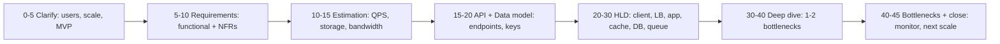
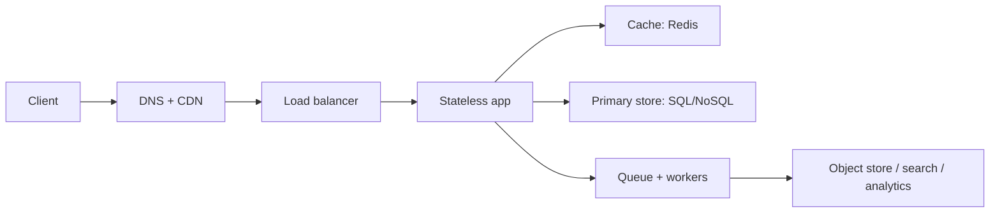

# Interview helper


## Youtube

- [Software interviews are getting insane...](https://www.youtube.com/watch?v=yeuJ4hSmT3s)

## Theory

This page covers how to attack any system-design interview from first hello to final trade-off.
It spans clarification, functional and non-functional requirements, back-of-envelope estimation, API and data-model sketching, high-level design, deep dives, and bottleneck analysis.
Key subtopics: the 45-minute framework, clarifying-question banks, estimation cheat sheets, HLD walkthrough method, deep-dive menu, and evaluation rubrics with senior signals.

## Theory continues

This page turns the idea of system design into a complete operating manual for
interviews at mid to senior level. The guides in this repo give you what to
know about caching, queues, consistency, databases, and scaling. What remains
is how to prove it under interview pressure: which questions to ask first, how
to estimate without a calculator, how to draw the high-level boxes in ten
minutes, which deep dive to invite, and which traps turn strong engineers into
silent diagram drawers.

Think of system-design interviews as decision throughput for hiring, the same
way the architect guide treats architecture as decision throughput for teams.
Coding rounds test what you can build, system-design rounds test what teams get
when they hire you: judgment under ambiguity, requirements carved from vague
prompts, numbers that size the system, APIs that survive clients, data models
that survive growth, and trade-offs stated in the open with people and cost in
mind. Juniors draw boxes, seniors price boxes, and every section below must
show movement from the first altitude to the second.

### 1. Topics Covered

1. [The 45-Min Framework How Every Round Runs](#2-the-45-min-framework-how-every-round-runs)
2. [Clarifying Questions Bank Scope Before Sketch](#3-clarifying-questions-bank-scope-before-sketch)
3. [Estimation Cheat Sheet Numbers Without Panic](#4-estimation-cheat-sheet-numbers-without-panic)
4. [HLD Walkthrough Method Boxes With Reasons](#5-hld-walkthrough-method-boxes-with-reasons)
5. [Deep-Dive Menu Where Seniors Spend Time](#6-deep-dive-menu-where-seniors-spend-time)
6. [Evaluation Rubric Senior Signals Interviewers Score](#7-evaluation-rubric-senior-signals-interviewers-score)
7. [Interview Questions and Answers](#8-interview-questions-and-answers)

Each numbered item links to the matching section below. Headings use plain words so every anchor resolves on GitHub preview.

### 2. The 45-Min Framework How Every Round Runs

Every system-design round runs the same eight beats whether the prompt is
design URL shortener, design WhatsApp, or design Netflix. The prompt changes,
the rhythm does not. Interviewers score coverage across all beats, not depth in
one, so the engineer who budgets time wins over the engineer who perfects one
box. Forty-five minutes means five minutes of clarification, five of
requirements, five of estimation, five of API plus data model, ten of HLD, ten
of deep dive, and five of bottlenecks plus close.

How a strong round actually flows:



The flow above keeps every round inside the same rails. Clarify grounds the
problem in users and constraints, requirements name the MVP slice so scope is
clear, estimation sizes the boxes before they are drawn, API plus data model
freezes the contract, HLD walks one request end to end, deep dive prices one
or two hard choices, and the close names what breaks next and how you would
watch it.

- **0 to 5, clarify and bound:** repeat the prompt in one sentence, then ask
  who uses it, how many, read versus write shape, and what is out of scope.
  Good is so this is a read-heavy public URL shortener for one hundred million
  monthly users, MVP is create plus redirect, analytics is out. Bad is jumping
  to microservices before naming a single user. One concrete bound beats three
  clever boxes because the interviewer can test every later choice against it.
- **5 to 10, requirements in two lists:** write functional needs as verbs the
  demo must show, and non-functional needs as numbers the design must hold.
  Create short link, redirect in under one hundred milliseconds p99, survive
  ten times spike. Availability versus consistency, latency versus cost, and
  durability versus speed get named here, never hidden until the deep dive.
- **10 to 15, estimation on the board:** compute daily actives to QPS, average
  plus peak, storage for five years, cache for hot ten percent, bandwidth for
  redirect or feed fetch. Round aggressively, show powers of ten, and say the
  assumption out loud so the interviewer can correct it once instead of
  watching silent arithmetic for five minutes.
- **15 to 20, API plus data model:** freeze two to four REST or gRPC endpoints
  with method, path, inputs, and status codes, then name the core tables or
  keys with primary key and index per query. Short-code as key, URL plus expiry
  as value, index on owner for listing. Contract first means the HLD has
  something to serve.
- **20 to 30, HLD with a moving request:** draw client, DNS, CDN, load
  balancer, stateless app, cache, primary store, queue plus workers, and
  object store only if blobs exist. Then walk one write and one read through
  every hop with numbers attached. Boxes without a moving request read as
  wallpaper regardless of neatness.
- **30 to 40, deep dive where invited:** pick the one or two bottlenecks the
  estimation exposed and go three levels deeper with a rejected alternative.
  Hot keys, fan-out, exactly-once, or consistency window. Two deep holes beat
  six shallow mentions because seniority lives in priced trade-offs.
- **40 to 45, bottlenecks plus close:** name the single point of failure, the
  next ceiling at ten times scale, the three dashboards and two alerts you
  would ship day one, and what you would build next quarter. End with the
  trade-off summary in thirty seconds and stop on time.

Round timing drills that follow:

- Rehearse with a visible timer: five, five, five, five, ten, ten, five.
- Practice the hard pivot line: given time, I will timebox this and move to HLD.
- Keep one index card per beat so no round skips estimation or the close.

Practical rules that follow:

- Never draw before minute five; no scope means no score for judgment.
- Narrate while drawing so silence never exceeds twenty seconds.
- Ask once per beat if the assumption holds, then commit and move.

### 3. Clarifying Questions Bank Scope Before Sketch

Clarification is scoping, not small talk. Weak candidates ask is this backend
or frontend and stop. Strong candidates bound users, scale, shape, and MVP in
five minutes with ten sharp questions, then state the scope back in one
sentence. Interviewers plant vague prompts on purpose: design Twitter can mean
a timeline for two hundred million readers or a toy posting app, and the hire
signal is who asks before drawing.

Ask in four buckets so nothing is missed under pressure:

- **Users and scale:** who uses this, daily actives versus monthly actives,
  geography and devices, growth in twelve months. Is this ten thousand internal
  users or one hundred million public users. Single region or multi-region from
  day one. The answer picks the QPS band and whether CDN, sharding, or
  multi-region even belong on the board.
- **Read versus write shape:** reads per write, peak versus average, bursty or
  steady, latency budget per path. URL shortener is one hundred to one reads,
  Twitter timeline is a thousand to one, payments are near one to one with
  strict durability. Ask for p50 versus p99 targets and which path may be slow.
- **Features in versus out:** what the MVP demo must show, what is explicitly
  out, what runs offline versus inline. Create plus redirect is in, click
  analytics is a nightly job. Post plus timeline read is in, direct messages
  are out. Write the out list on the board; panels forgive cut scope, they
  penalize silent scope that explodes at minute thirty-five.
- **Constraints and NFRs:** consistency window, availability target, durability
  bar, security and compliance, cost ceiling. Can a like count be eventually
  consistent, can a payment ever lose a write. Must uploads survive a zone
  failure. Is there a PCI, HIPAA, or GDPR shape hiding in the prompt.

Question bank to carry into every round:

| # | Bucket | Ask it this way | What it decides |
|---|---|---|---|
| 1 | Users | How many DAU and MAU, and where do they live | QPS band, CDN, regions |
| 2 | Shape | What is the read to write ratio at peak | Cache, fan-out, queue |
| 3 | Latency | Which path needs p99 under what budget | Sync versus async, indexes |
| 4 | MVP | What two flows must the demo show today | HLD boxes that earn a place |
| 5 | Out | What is explicitly out of scope for now | Time saved for deep dive |
| 6 | Consistency | Which reads may be stale and for how long | SQL versus NoSQL, cache TTL |
| 7 | Availability | What downtime or loss is unacceptable | Replicas, quorum, backups |
| 8 | Data | How big is one item, how long is it kept | Storage math, retention, tiers |
| 9 | Burst | What spike must we survive, ten times normal | Autoscale, backpressure, limits |
| 10 | Cost | Any cost or ops ceiling I should respect | Managed versus self-built picks |

Worked example, URL shortener in sixty seconds:

> So this is a public URL shortener for one hundred million monthly users,
> roughly ten to one reads over writes. MVP is create short link plus redirect
> under one hundred milliseconds p99. Custom aliases are in, click analytics
> is a nightly offline job and out of the hot path. Links live five years,
> eventual staleness of seconds is fine, but no created link may be lost. I
> will assume US plus India traffic and a ten-times festival spike. Does that
> scope hold.

Why this passes: users plus ratio plus MVP plus out plus durability in five
sentences, each with a number. The interviewer can now correct one assumption
instead of rescuing a drifting round.

Practical rules that follow:

- Ask ten questions max, then restate scope and commit.
- Write functional versus non-functional lists where all can see them.
- Never negotiate scope silently mid-HLD; name the cut out loud.

### 4. Estimation Cheat Sheet Numbers Without Panic

Estimation sizes boxes before they are drawn. Interviewers do not grade exact
arithmetic; they grade whether QPS, storage, bandwidth, and cache come out in
powers of ten with stated assumptions. The engineer who says one thousand QPS
average, three thousand peak, therefore six app hosts, wins over the engineer
who hides from numbers and draws a Kubernetes cloud.

Memorize this ladder and reuse it every round:

- **QPS from DAU:** QPS average equals DAU times actions per user divided by
  eighty-six thousand four hundred. One million DAU doing ten reads each is
  about one hundred twenty reads per second average. Multiply by three to five
  for peak, by ten for a sale or final spike. Say the multiplier out loud.
- **Storage for five years:** writes per second times bytes per row times
  seconds per day times days times years. One hundred creates per second at
  five hundred bytes is about four gigabytes per day, about seven terabytes
  for five years with replication factor three. Round to ten terabytes and move.
- **Bandwidth per path:** QPS times bytes per response. One thousand feed reads
  per second at fifty kilobytes is fifty megabytes per second egress. That one
  line decides CDN versus origin, pagination size, and image-thumb policy.
- **Cache for hot ten percent:** hot working set is ten percent of storage or
  one day of reads, whichever is smaller. Seven terabytes of links means tens
  of gigabytes of hot codes fit on two Redis nodes. State hit-ratio target:
  ninety-five percent for redirect, eighty percent for timeline.
- **Hosts from QPS:** one stateless app host holds roughly one to two thousand
  simple QPS or two to five hundred heavy QPS. Three thousand redirect QPS
  means three to six hosts plus two spare. One Postgres primary holds roughly
  five to ten thousand simple QPS; beyond that shard, read-replica, or move
  hot keys to cache.

Powers of ten to keep on the board:

| Unit | Value to use | What it sizes |
|---|---|---|
| Day | 86,400 seconds, round to 100K | DAU to QPS |
| Month | 30 days, 2.6M seconds | Storage per month |
| Year | 365 days, 31.5M seconds | Retention math |
| KB vs MB | 1K = 1,000, 1M = 1,000,000 in interviews | Bandwidth, rows |
| Latency | Memory 100ns, SSD 100us, network 1ms, disk seek 10ms | Cache versus DB call |
| Replication | Factor 3 for durable stores | Final storage bill |

Worked example, pastebin-shaped write path:

> Assume one million DAU, five pastes per user per month, so about two hundred
> writes per second average, one thousand peak. Each paste averages ten
> kilobytes, so about one hundred seventy gigabytes per day, about three
> hundred terabytes for five years at factor three before tiering to object
> store. Reads at ten to one are two thousand per second average, covered by
> CDN for public pastes plus a Redis hot set of one day. Six app hosts cover
> peak with spare.

Why this passes: every number shows its assumption, rounds cleanly, and ends
in a box count. The HLD that follows has sizes, not wishes.

Estimation drills that follow:

- Practice three prompts by hand: URL shortener, rate limiter, notification system.
- Timebox to four minutes; assumptions spoken, not written as essays.
- Always end with peak QPS, five-year storage, hot cache size, host count.

Practical rules that follow:

- Round early and loudly; precision without speed reads as junior.
- Correct one wrong assumption fast rather than defending the math.
- If the interviewer waves off math, keep the peak QPS line and move on.

### 5. HLD Walkthrough Method Boxes With Reasons

HLD is a moving request, not a poster. Juniors draw every AWS icon they know;
seniors draw eight boxes and walk one write plus one read through each hop
with a reason per hop. The board should answer where state lives, where
failure hides, and where scale breaks, in ten minutes with narration.

Draw in this order, left to right, and justify each as you draw:



The flow above fits ninety percent of prompts. Client plus DNS plus CDN
absorbs static and public reads, the load balancer spreads peak, stateless app
holds auth plus validation plus orchestration, cache holds the hot ten
percent, the primary store holds truth, the queue moves slow work offline, and
object or search stores hold blobs and indexes the primary store should never
carry.

- **Client, DNS, CDN first:** name mobile versus web, what is cached and for
  how long, how cache misses fall through. Public reads like short-link
  redirects, images, and feeds earn CDN. Private writes never touch it. One
  sentence per edge: TTL, invalidation, and who serves on miss.
- **Load balancer plus stateless app:** round-robin or least-connections,
  health checks every few seconds, sticky only if you can defend it. App hosts
  are stateless so any host dies safely; sessions live in cache, uploads go
  direct to object store with signed URLs. State on the host is the fail.
- **Cache with a policy, not a wish:** cache-aside for reads, write-through
  for must-not-lose counters, TTL from the consistency answer in minute five.
  Name the key shape: short-code to URL, user-id to timeline slice. Name the
  miss path and the thundering-herd guard: single-flight, jittered TTL, or
  request coalescing.
- **Primary store chosen by query:** one index per query, primary key named
  out loud. Need joins and no-loss writes, pick Postgres. Need wide rows and
  TTL, pick Cassandra or Dynamo. Need feed or search, add the index store
  beside truth, never inside it. Say what the store cannot do; honesty scores.
- **Queue plus workers for slow paths:** notifications, analytics, fan-out,
  transcoding, and webhooks leave the hot path here. Name the queue semantic:
  at-least-once with idempotency keys beats exactly-once claims. Name retry
  with backoff, dead-letter queue, and ordering scope per key, not global.
- **Walk one write and one read end to end:** trace create-link from client to
  app to DB to cache-invalidate to response code, then redirect from client to
  CDN to cache to DB on miss. Attach QPS and latency per hop. A box no request
  touches gets erased before the deep dive.

API plus data-model freeze that precedes the drawing:

```text
POST /v1/links { url, alias?, expiry } -> 201 { code }
GET  /{code} -> 302 Location: url
GET  /v1/links/{code}/stats -> 200 { clicks } (offline job)

Table links(code PK, url, owner_id, created_at, expires_at)
Index by owner_id for listing. Cache key link:{code} -> url, TTL 1 day.
```

Why this passes: two hot endpoints plus one offline endpoint, one table with
a key per query, cache key spelled out. The HLD has a contract to serve.

HLD drills that follow:

- Draw the same eight boxes for three prompts without pausing narration.
- Erase one box per rehearsal and defend why the design still stands.
- End every walkthrough with the single point of failure named.

Practical rules that follow:

- One request moving beats ten boxes standing still.
- Every arrow needs a protocol plus a reason: gRPC inside, REST outside.
- Stop at minute thirty even with a clean board; deep dive is where offers close.

### 6. Deep-Dive Menu Where Seniors Spend Time

Deep dive is where mid-level breadth becomes senior depth. You invite it by
naming the bottleneck first, then drilling three levels with a rejected
alternative at each fork. Pick at most two dives per round; the engineer who
finishes one hot-key story beats the engineer who starts five. Each menu item
below names when to pick it, what to say, and which guide in this repo carries
the full detail.

- **Caching and hot keys:** pick when reads dominate ten to one or more, or
  one celebrity key owns half the traffic. Say cache-aside with TTL from the
  NFR, single-flight on miss, jittered expiry against stampede, and write
  policy per path. Reject cache-everything with the invalidation cost and the
  memory bill from estimation. Pair with the hot-shard split: append a salt or
  isolate the key. Detail in `high-level/concepts/basic/caching.md` and
  `high-level/concepts/advanced/distributed-caches-and-caching-strategies.md`.
- **Load balancing and CDN edges:** pick when peak QPS or global readers
  dominate, such as feed, video, or redirect storms. Say DNS plus anycast CDN
  for static, layer-7 balancer with health checks for app, least-connections
  under uneven cost, and retry budgets so retries never double the peak. Reject
  round-robin-only with the slow-host pileup story. Detail in
  `high-level/concepts/basic/load-balancer-and-proxy-server.md` and
  `high-level/concepts/basic/cdn.md`.
- **Storage, sharding, and consistency:** pick when five-year storage or write
  scale breaks one primary, or the prompt hides a consistency trap like
  payments versus likes. Say query-first store choice, key-based sharding with
  consistent hashing for rebalance, quorum reads and writes where loss is
  forbidden, and the stale window where it is allowed. Reject one-database
  forever with the host-count math. Detail in
  `high-level/concepts/basic/storage.md`,
  `high-level/concepts/advanced/consistent-hashing.md`,
  `high-level/concepts/advanced/consistency.md`, and
  `high-level/concepts/advanced/cap-theorm.md`.
- **Queues and async workers:** pick when slow work threatens the hot path:
  notifications, fan-out, transcoding, analytics. Say at-least-once delivery
  with idempotency keys, per-key ordering, backoff plus dead-letter queue, and
  backpressure with load shedding at peak. Reject synchronous fan-out with the
  p99 multiplication: one slow follower stalls every post. Detail in
  `high-level/concepts/advanced/asynchronus-communication.md` and
  `high-level/concepts/advanced/data-processing.md`.
- **Rate limiting and backpressure:** pick for open APIs, voting, ticketing, or
  any sale spike. Say token bucket per user plus fixed window per IP, headers
  with limit plus remaining, queue-or-drop policy stated, and autoscale bound
  so the database, not the app, is the ceiling. Reject unlimited ingress with
  the ten-times math from estimation. Practice build in
  `high-level/designing/basic/rate-limiter.md`.
- **Feeds, search, and pagination:** pick for Twitter, Yelp, or autocomplete
  prompts where fan-out or ranking hides. Say push versus pull fan-out by
  follower count, cursor pagination never offset, separate search index fed by
  queue, and precomputed timeline slices for celebrities. Reject full scan plus
  offset with the latency table. Detail in `high-level/designing/advanced/twitter.md`
  and `high-level/designing/basic/autocomplete.md`.
- **Bottlenecks, observability, and next scale:** pick for every close, and as
  a full dive for logging, metrics, or multi-region prompts. Say the single
  point of failure, the ten-times ceiling, three dashboards for golden signals
  plus queue depth, and two alerts with owners. Reject more boxes with the
  monitor-first line: what gets watched before what gets built. Detail in
  `high-level/concepts/advanced/observability.md` and
  `high-level/concepts/advanced/scaling-to-one-million.md`.

Deep-dive drills that follow:

- Rehearse one dive per prompt family: shortener goes cache, messenger goes queue.
- State the bottleneck, the two options, the pick with a number, then stop.
- Link each claim to estimation so depth never floats free of math.

Practical rules that follow:

- Two finished dives beat six started threads every round.
- Name one rejected option per dive so trade-offs are scorable.
- Let the interviewer pick the second dive; offer two, drill one.

### 7. Evaluation Rubric Senior Signals Interviewers Score

Interviewers rarely score neatness; they score six signals that predict cheap
to manage and easy to trust. Junior rounds describe boxes completed, senior
rounds describe decisions made under constraint with users affected and systems
left cheaper to run. Map every beat to at least two signals before the loop,
because the panel compares notes on signals, not on diagrams.

- **Scoped before sketched:** seniors bound users, MVP, and out-of-scope in
  five minutes and restate it in one sentence. Signal phrases include for this
  round I assume, analytics is offline and out, I will design for peak not
  average. Anti-signal is drawing microservices before naming a reader.
- **Sized with numbers:** seniors carry QPS, storage, bandwidth, and host
  counts in powers of ten with assumptions spoken. Chose six app hosts from
  three thousand peak QPS, ten terabytes for five years at factor three.
  Engineers who skip estimation read as mid-level regardless of years.
- **Chose with trade-offs stated:** seniors decide in the open and price the
  rejected path. Cache-aside over write-through because staleness of seconds
  is allowed, Postgres over Cassandra because joins outrank write scale here,
  queue over sync fan-out because p99 must survive one slow follower. Say what
  would flip the call.
- **Walked a request end to end:** seniors move one write and one read through
  every hop with protocol and latency attached. The story shape is client to
  CDN to balancer to app to cache to truth to response, with the miss path
  included. Boxes no request touches get erased without nostalgia.
- **Owned failure and cost:** seniors name the single point of failure, the
  next ceiling at ten times, the dashboards and alerts shipping day one, and
  the cost of the pick. Multi-AZ primary with replica lag under a second,
  dead-letter queue with owner, cache bill versus origin bill. Silent
  reliability is the fail this signal screens for.
- **Closed with next scale:** seniors end on what breaks next and what ships
  next quarter, in thirty seconds, on time. Shard by owner when writes cross
  ten thousand per second, move to multi-region when p99 across oceans misses
  budget, cut image weight before buying egress. Trajectory arrow up.

What a scored round looks like in notes:

| Signal | Strong note example | Weak note example |
|---|---|---|
| Scoping | Bounded MVP plus out list in five minutes | Drew boxes with no users named |
| Sizing | Peak QPS plus storage plus hosts stated | No numbers, trusted the cloud |
| Trade-offs | Chose cache-aside, priced write-through | Used Kafka because it is fast |
| Walkthrough | Traced write plus read per hop | Boxes with no moving request |
| Reliability | Named SPOF, lag, DLQ, two alerts | No failure or monitor named |
| Next scale | Named ten-times ceiling plus quarter plan | Done when diagram looked full |

Practical rules that follow:

- Tag each beat with its signal before the loop; panels score signals.
- State assumptions and rejected options out loud; silence is unscorable.
- Bring the artifact habit: endpoint list, key shape, dashboard names.

What separates L4, L5, L6 on the same board:

Levels do not get different prompts; they get different expectations on the
same six signals. L4 must complete the round cleanly, L5 must decide under
trade-offs with cost and failure owned, L6 must simplify across teams and
time. If you target L5 and above, spend less time on boxes and more time on
what you rejected, what breaks at ten times, and what you would not build yet.

- **L4, correct and complete:** bounds scope, sizes peak QPS and storage,
  freezes API plus keys, draws eight boxes, walks one write plus one read.
  Needs prompting to name SPOF or next ceiling. Strong L4 note reads did the
  basics without dropping estimation or walkthrough. Fail mode is silent
  drawing, no numbers, no rejected option.
- **L5, decides and owns:** does everything L4 does, plus prices two options
  with numbers, owns failure plus cost plus monitors, and closes on the
  ten-times ceiling with a quarter plan. Pushes back on vague scale with a
  bound and a reason. Strong L5 note reads chose cache-aside with TTL and
  priced the bill, named lag plus DLQ plus alerts. Fail mode is breadth
  without depth: six dives started, none finished with a number.
- **L6, simplifies and multiplies:** does everything L5 does, plus cuts scope
  to the cheapest MVP that survives peak, reuses managed primitives over
  custom builds, and names org cost: deploys, on-call, migrations. Talks in
  phases: what ships day one, what waits for ten times, what never gets
  built. Strong L6 note reads deferred multi-region until p99 forced it,
  saved a quarter with TTL plus CDN. Fail mode is clever complexity that no
  team can run.

| Level | Expected to show | Hiring note that passes |
|---|---|---|
| L4 | Scope, size, API, HLD, one walkthrough | Completed all beats with numbers stated |
| L5 | Trade-offs priced, SPOF plus cost plus monitors | Decided in open, owned failure and next scale |
| L6 | Phased simplicity, org cost, what not to build | Made system cheaper to run across quarters |

Level drills that follow:

- Record one round and tag each minute with its signal plus level shown.
- Rehearse the L5 upgrade line: I reject X because Y costs Z, flip me if W.
- Rehearse the L6 cut line: I would not build this until ten times because cost.

### 8. Interview Questions and Answers

These are the eight meta-questions interviewers ask with their eyes even when
they ask about Twitter or WhatsApp. Answer each in thirty to sixty seconds,
then point at the board where the proof lives. No story without a number, no
claim without a rejected option.

- **1. Where do you start when the prompt is just design YouTube?**
  Start with users plus shape plus MVP, never with boxes. Say so this is
  upload plus playback for fifty million DAU, reads dominate writes a hundred
  to one, MVP is upload plus stream under two-second start, live chat is out.
  Then ask for peak QPS, object size, retention. You pass because scope fits
  in five sentences and the HLD has a bound to serve.
- **2. How do you do estimation without a calculator or exact numbers?**
  Use powers of ten with assumptions spoken. DAU times actions over one
  hundred thousand for QPS, times three for peak, writes times bytes times
  days times three for five-year storage, QPS times bytes for bandwidth, one
  host per one to two thousand simple QPS. Round loudly: about three thousand
  peak, about ten terabytes, six hosts with spare. You pass because every
  number ends in a box count.
- **3. SQL or NoSQL, how do you choose without guessing?**
  Choose by query plus consistency, then name what you give up. Need joins
  and no-loss writes, pick Postgres; need wide rows with TTL at write scale,
  pick Cassandra or Dynamo; need text or feed ranking, add a search index fed
  by queue beside truth. Say what flips the call: if writes cross ten
  thousand per second I shard or move. You pass because the pick has a price.
- **4. How deep should you go versus staying broad?**
  Stay broad for twenty minutes, then finish one or two dives. Broad means
  eight boxes with one request walking end to end. Deep means one bottleneck
  three levels with a rejected alternative: cache-aside with TTL plus
  single-flight over write-through, at-least-once plus idempotency over sync
  fan-out. Offer two dives, let the interviewer pick one. You pass because
  two finished dives beat six started threads.
- **5. What do you say when you do not know the technology?**
  Say it in one sentence, then reason from first principles. I have not run
  Kafka in prod, here is how I would bound it: at-least-once with per-key
  ordering, backoff plus DLQ, retention for replay, idempotency in workers.
  Ask if that matches their reality, then move. You pass because honesty plus
  mechanics beats bluffing plus brand names.
- **6. How do you handle a bottleneck or single point of failure question?**
  Name one SPOF, one ten-times ceiling, and one monitor before one more box.
  Primary in one AZ fails over to replica with lag under a second, hot shard
  splits with salt, queue depth pages the owner before latency does. Ship
  three dashboards for golden signals plus queue depth, two alerts with
  owners. You pass because failure has an owner and a number, not a hope.
- **7. How do you show seniority without over-engineering?**
  Cut more than you add. Phase the build: day one is stateless app plus cache
  plus primary plus queue, ten times adds sharding plus read replicas, global
  p99 adds CDN plus multi-region. Say what you would not build: no
  Kubernetes from minute zero, no microservices before the request walks.
  Price each phase in hosts and ops load. You pass because the design gets
  cheaper to run, not just bigger to draw.
- **8. How do you close when time is almost up?**
  Stop drawing at minute forty and close in thirty seconds: what you built,
  what breaks next, what ships next. We serve three thousand peak redirects
  on six hosts with ninety-five percent cache hit; at ten times the primary
  writes saturate so we shard by code hash; next quarter we add CDN edge TTL
  and DLQ dashboards. Then stop. You pass because trajectory points up and
  the round ends on time.

Closing drills that follow:

- Rehearse all eight answers in under eight minutes with a timer visible.
- End every rehearsal with the thirty-second close, no trailing sentences.
- Keep one card per answer: claim, number, rejected option, board pointer.

Practical rules that follow:

- Answer meta-questions with board proof, never with theory alone.
- Keep numbers in every answer; unscored silence helps no level.
- Close every round with SPOF, ten-times ceiling, and next build.
