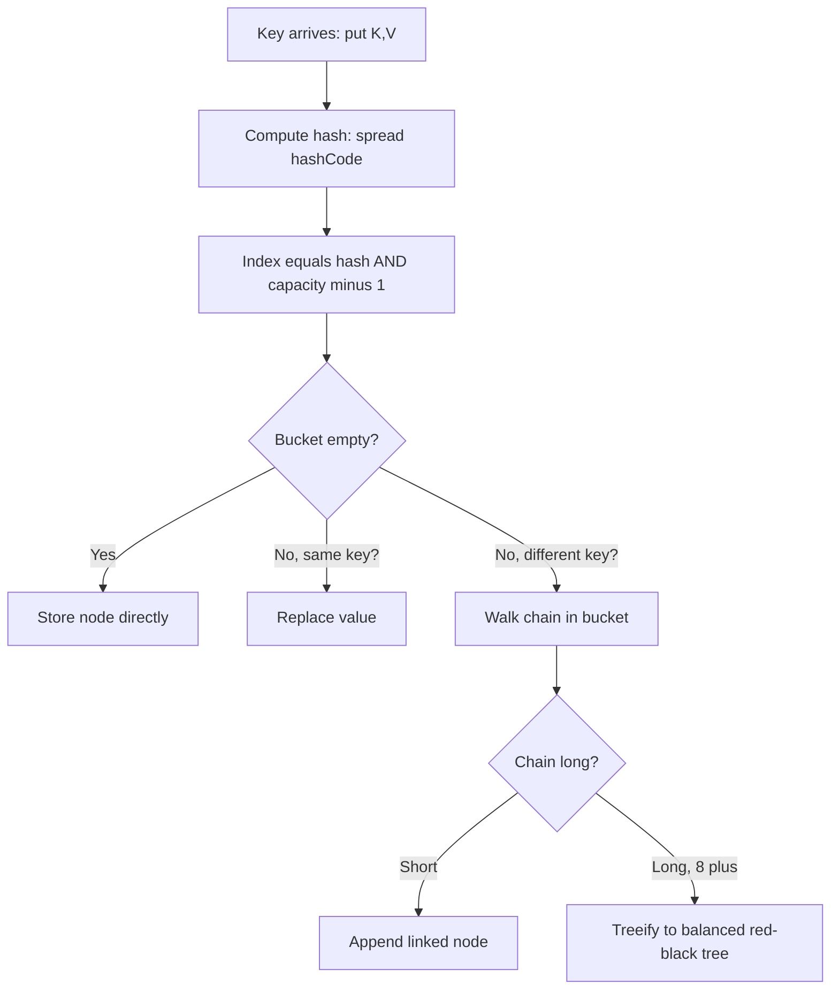
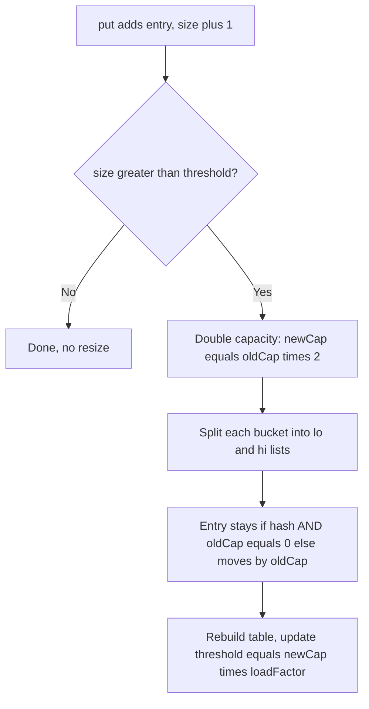
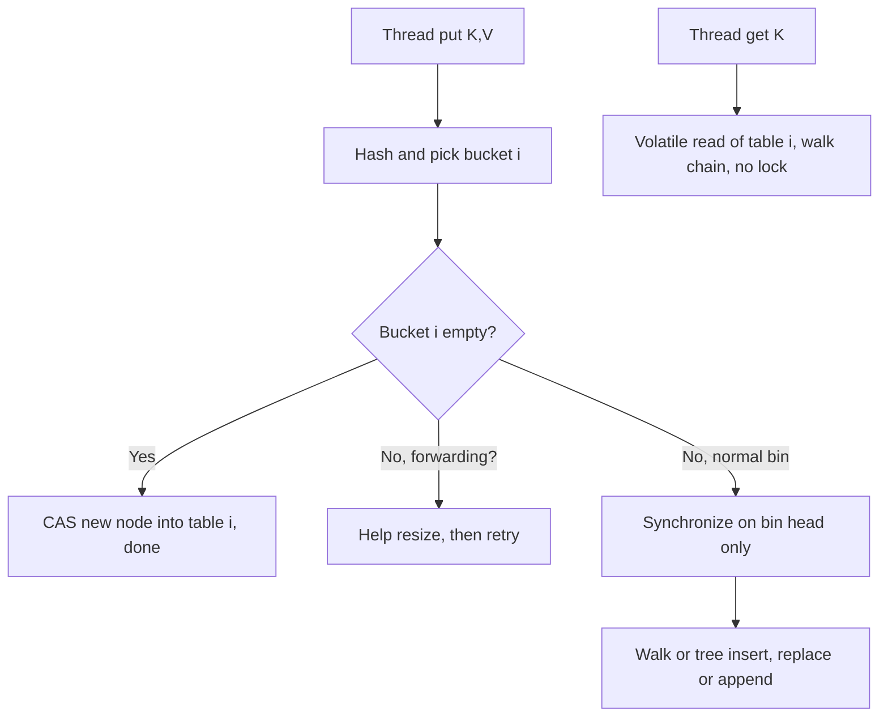

# Implement a hashmap

## Blogs and websites

## Medium

## Youtube

- [12. Hashmap Internal Implementation in java (Hindi) | Implementing your HashMap in Java](https://www.youtube.com/watch?v=AsAymWn7D40)

## Theory

A hash map stores key-value pairs with expected O(1) get/put using a hash function mapping keys to buckets. Must handle collisions (chaining or open addressing), resizing/rehashing, and a good hashCode/equals contract.
Key entities: Bucket/Table, Entry (key/value), Hash function, Load factor.
Core operations: put, get, remove, resize/rehash.

This guide turns that scope note into a complete interview-ready reference for low-level design and Java backend interviews.
You will learn how hashing, buckets, and collision handling produce expected O(1) access, when chaining beats open
addressing, how load factor and resizing keep operations fast, how Java `HashMap` really works internally including
hash spreading and treeification, how `ConcurrentHashMap` scales to many threads, and which pitfalls interviewers
love to probe such as mutable keys, bad `hashCode`, and iteration-order assumptions.
No prior hashing background is assumed; every idea is tied to plain Java code you can write on a whiteboard.

Think of a hash map as a smart array. A hash function converts any key into an array index, the bucket at that index
holds the entry, and a collision policy decides what happens when two keys land in the same bucket. Get it right and
you get array-like speed with map-like flexibility. Get the hash function, equals contract, or resizing wrong and the
same structure degrades into a slow linked list or loses entries entirely. Interviews test whether you can build it
from scratch, explain the trade-offs, and use the JDK class correctly under concurrency.

### 1. Topics Covered

1. [What and Why](#2-what-and-why)
2. [Hashing Buckets and Collisions](#3-hashing-buckets-and-collisions)
3. [Resizing and Load Factor](#4-resizing-and-load-factor)
4. [Complexity and Performance](#5-complexity-and-performance)
5. [Java HashMap Internals and Treeify](#6-java-hashmap-internals-and-treeify)
6. [ConcurrentHashMap Sketch](#7-concurrenthashmap-sketch)
7. [Pitfalls and Best Practices](#8-pitfalls-and-best-practices)
8. [Interview Questions and Answers](#9-interview-questions-and-answers)

Each numbered item links to the matching section below. Headings use plain words so every anchor resolves on GitHub preview.

### 2. What and Why

A hash map is a dictionary abstract data type. It stores associations from keys to values and supports `put(key, value)`,
`get(key)`, `remove(key)`, and `containsKey(key)`. Unlike a list that finds by position and a tree that finds by
comparison, a hash map finds by transformation: it hashes the key to pick a storage slot directly.

You want a hash map when lookups dominate and ordering does not matter. caches keyed by user id, frequency counters,
indexes, memoization tables, symbol tables, session stores, and adjacency sets for graphs are all canonical uses.
If you need sorted order use a `TreeMap`. If you need insertion order use a `LinkedHashMap`. If duplicates with no
key matter use a list or set. Saying this classification aloud earns credit before you write any code.

The core promise is expected O(1) access. There is no magic. The array gives O(1) positional access, and the hash
function converts an arbitrary key into a position. As long as keys spread uniformly across buckets and the table is
not overfull, each bucket holds zero or one entry and lookup is a single array read plus an equals check.

The core risk is collisions. Two different keys can hash to the same bucket because there are infinitely many
possible keys and finitely many buckets. This is guaranteed by the pigeonhole principle, not a bug. Every real
hash map therefore has three parts: a hash function that spreads keys, a bucket array that stores entries, and a
collision strategy that keeps correctness when sharing happens.

The second risk is a bad key contract. In Java the contract is explicit. Equal objects must have equal hash codes.
If `a.equals(b)` then `a.hashCode() == b.hashCode()`. The reverse need not hold: unequal objects may share a hash
code, which is just a collision. If you override `equals` without `hashCode`, or use a mutable field in the hash,
keys become unfindable after mutation. Interviewers ask this in almost every Java round.

A minimal mental model has four entities. The table is a `Node[]` array whose length is always a power of two in
the JDK. A bucket is one slot `table[i]`. An entry holds `hash, key, value, next` for chaining. The hash function
maps `key.hashCode()` to an index, typically `index = (n - 1) & hash` instead of modulo because bitwise AND is
faster when `n` is a power of two.

Core operations in words before code. `put` hashes the key, picks a bucket, walks any chain there, replaces the
value if the key already exists, otherwise appends a new node and resizes if the load threshold is crossed. `get`
hashes, picks the bucket, and walks the chain comparing hash first for speed and `equals` for correctness. `remove`
does the same walk but unlinks the node. `resize` doubles capacity and rehashes entries into the new table. If you
can narrate these four walks without notes, the whiteboard implementation becomes transcription.

Where hash maps sit in system design matters too. An in-memory cache is a hash map plus eviction. A hash index in a
database is a hash map persisted with buckets on pages. Consistent hashing in distributed caches is hashing with
virtual nodes instead of a fixed array. Sharding by `hash(key) % shards` is the same bucket idea scaled across
machines. Naming these connections shows you see the concept beyond one class.

Interviewers also expect you to state what a hash map is not. It does not guarantee iteration order. It is not
thread safe in its basic form. It does not handle nulls the same way everywhere: `HashMap` allows one null key and
many null values, `ConcurrentHashMap` and `Hashtable` reject nulls, and `TreeMap` rejects null keys unless given a
tolerant comparator. Stating these contrasts early prevents follow-up traps.

A good one-minute opener sounds like this. A hash map gives expected O(1) key-value lookup by hashing keys to
buckets in an array. Collisions are handled by chaining or open addressing. A load factor triggers doubling and
rehashing to keep chains short. In Java correctness depends on the equals and hashCode contract, performance on a
well-spread hash, and thread safety on choosing ConcurrentHashMap or external synchronization.

### 3. Hashing Buckets and Collisions

Hashing has three steps. First compute `key.hashCode()`, a 32-bit integer that may be negative and poorly spread.
Second spread it, in the JDK with `h ^ (h >>> 16)` so high bits influence low bits. Third compress to an index with
`(n - 1) & hash`. Each step has a job: step one distinguishes objects, step two defends against weak hash functions
that differ only in high bits, step three fits the range. Forgetting step two is why naive student implementations
cluster badly on keys like `1, 257, 513` when capacity is small.

Buckets are just array slots. With capacity 16, valid indexes are 0 to 15. Ideal state is zero or one entry per
bucket. Load factor measures fullness as `size / capacity`. A good hash keeps the distribution close to uniform so
the longest chain stays tiny. A bad hash sends everything to one bucket and the map becomes a linked list with O(n)
operations. Always blame distribution first when a hash map is slow, not the collision policy.

Collisions are unavoidable and fully handled. When two keys share a bucket, correctness still requires `get` to
return the right value for each key. The two classic families are chaining and open addressing. Java `HashMap` uses
chaining with trees for long chains. Python `dict`, Ruby hashes, and many database hash indexes use flavors of open
addressing. C++ `unordered_map` uses chaining. Know both because the interviewer will ask you to compare.

In chaining each bucket holds a linked list or tree of all entries that hashed there. Insert appends or prepends.
Lookup scans that bucket only. Delete unlinks. Buckets never move, so iterators and references stay stable and the
table can exceed its capacity in element count while chains grow. The price is extra pointers and pointer chasing,
which is cache unfriendly: each hop may miss L1 and cost 80 to 100 ns to DRAM.



The diagram above traces a `put` through a chaining hash map. Hash, index, then three bucket cases: empty stores
directly, same key replaces, different key walks the chain and treeifies only when the chain grows long enough.
Quote it as hash to index, then handle empty, hit, or collision, then grow if needed.

In open addressing every entry lives directly in the table, not in side lists. On collision you probe a sequence
of slots until you find an empty one. Linear probing tries `i, i+1, i+2`. Quadratic probing jumps by squares to
reduce clustering. Double hashing uses a second hash for the step size. Lookup replays the same probe sequence.
Delete cannot simply clear a slot because it would break probe chains, so it writes a tombstone marker that means
occupied in the past, keep probing. Resizing re-inserts live entries and drops tombstones.

The trade-off table below is worth memorizing almost verbatim for interviews.

| Dimension | Chaining | Open addressing |
|---|---|---|
| Storage | Array of list or tree heads plus heap nodes | Single flat array, no pointers |
| Cache behavior | Pointer chasing, more misses | Sequential probing, cache friendly |
| Delete | Easy unlink | Tombstones needed, periodic rehash |
| High load factor | Degrades gracefully, chains grow | Degrades sharply, clustering explodes |
| Memory | Pointer overhead per entry | Dense, but needs slack capacity |
| Concurrency | Easier to lock per bucket | Harder, probes cross buckets |
| JDK example | `HashMap`, `HashSet`, Guava `HashMultimap` | `IdentityHashMap` uses linear probing |

Use this table to answer which would you pick. Pick chaining for general maps, unpredictable deletes, and simpler
concurrency. Pick open addressing for small keys, CPU-cache-sensitive tables, and memory-tight fixed-size caches
where deletions are rare. Python chose a tuned open addressing variant for exactly those cache reasons.

Clustering deserves one crisp paragraph. Linear probing suffers primary clustering: a filled run grows faster
because any key hashing anywhere inside the run extends it, like a traffic jam. Quadratic and double hashing
spread probes and delay the jam but still degrade past load factor 0.7. Chaining has no clustering in this sense;
bad behavior comes only from a bad hash function piling keys into one bucket. If asked why linear probing slows
down suddenly, say runs merge and probe length grows superlinearly with fullness.

A good hash function has three properties. Deterministic: same key always gives the same code during the map
lifetime. Uniform: each bucket gets roughly `size / capacity` keys on real data. Cheap: hashing must not dominate
lookup cost. Cryptographic strength is not required and usually too slow. `Objects.hash` with many fields, string
hashing with caching, and number hashing with bit mixing are standard JDK approaches.

Equality order matters for speed and correctness. Always compare stored hash first, then `==`, then `equals`.
Hash compare is one integer check that rejects most non-matches without a method call. Reference equality short
circuits identity hits and handles tricky cases like enums and interned strings. Only then call `key.equals(k)`
with null guards. Reversing the order to call `equals` first still works but wastes time and risks null errors.

Small worked example cements the idea. Capacity 8, keys A, B, C with hashes 3, 11, 19. Indexes are `hash & 7`:
3, 3, 3. All three collide in bucket 3. Chaining stores `A -> B -> C` in that bucket and other buckets stay empty.
`get(C)` hashes to 3, walks three nodes, returns on the third. Open addressing with linear probing instead stores
A at 3, B at 4, C at 5. `get(C)` probes 3, 4, 5. Same keys, same hashes, different layout. Drawing this on the
board takes thirty seconds and answers most how does collision handling work follow-ups.
### 4. Resizing and Load Factor

Load factor is the fullness ratio that triggers growth. Defined as `size / capacity`, it measures average entries
per bucket. The JDK default is 0.75 with initial capacity 16 and threshold 12. When `size > threshold` the table
doubles to 32, threshold becomes 24, and every entry is rehashed. You pay an occasional O(n) resize to keep every
other operation at expected O(1). Saying you amortize one expensive resize over many cheap puts is the sentence
interviewers want.

Why 0.75. It balances time against space. A lower factor like 0.5 keeps chains very short but wastes half the
array and doubles resize frequency. A higher factor like 0.95 saves memory but chains grow, tail latency spikes,
and open addressing would collapse entirely. 0.75 is the empirical sweet spot for chaining: expected chain length
stays under one, memory waste is bounded at 25 percent slack, and resizes are infrequent enough to amortize. For
custom maps you can tune it: use 0.5 for latency-critical caches, 0.75 default, never above 0.9 with chaining.

Why capacity stays a power of two. Indexing uses `(n - 1) & hash` instead of `hash % n` because bitwise AND is a
single cycle while integer modulo is 10 to 30 cycles. The trick only works when `n` is a power of two, since then
`n - 1` is a bitmask like `15 = 0b1111`. The constructor rounds any requested capacity up to the next power of
two via `tableSizeFor`. If you pass 100 you get 128. Mention this when asked why HashMap capacity is always 16,
32, 64.

Resizing in the JDK is clever, not naive. Because capacity doubles, each entry either stays at its old index or
moves by exactly old capacity: `newIndex = oldIndex` or `oldIndex + oldCap`. The code decides with one bit test
`(e.hash & oldCap) == 0` instead of recomputing modulo per entry. Entries are split into lo and hi lists per
bucket without rehashing from scratch. This keeps resize O(n) with a tiny constant and preserves chain order in
Java 8 plus, which fixed the old transfer reversal that could create cycles under concurrent resize.



The diagram above shows the resize decision on every put. Most puts exit immediately at the threshold check, and
only the occasional put pays for doubling and splitting. That rarity is what makes the O(n) cost amortize away.

Worked numbers help. Start at 16 with threshold 12. Insert 13 entries and the 13th triggers resize to 32 with
threshold 24. Insert up to 24 freely, the 25th resizes to 64. Resizes happen at sizes 12, 24, 48, 96, so an
element inserted early participates in O(log n) resizes and total resize work across n inserts is O(n). Hence
amortized O(1) per put even though one individual put costs O(n). If the interviewer asks for the math, give this
geometric series: `n + n/2 + n/4 ... < 2n`.

Sizing guidance for real code. If you know the final size, construct with it: `new HashMap<>(expectedSize)`. The
JDK divides by load factor internally, so passing 1000 gives capacity 2048 without a single resize. For unknown
growth, defaults are fine. Never pre-size to millions without reason on memory-tight services. And never set
initial capacity 1 to save memory: you will resize on the first few puts and burn more CPU than you saved.

Rehashing versus resizing vocabulary. Resizing changes capacity. Rehashing recomputes placement, which in the JDK
happens as part of resizing since indexes depend on capacity. Some textbooks use rehash to mean building a new
table with a new hash function after detecting attack or skew. In interviews treat them as one event unless asked
to distinguish: resize allocates, rehash replaces.

### 5. Complexity and Performance

Expected versus worst case is the whole story. With a uniform hash and load factor bounded below one, bucket
occupancy follows a Poisson distribution and lookup touches one or two nodes on average: expected O(1). Worst
case with all keys in one bucket is O(n) for lists, O(log n) after treeification in Java 8 plus. Interviews test
whether you qualify every O(1) claim with expected and can name the degenerate input.

| Operation | Expected average | Worst case list | Worst case Java 8 plus tree | Notes |
|---|---|---|---|---|
| `get` | O(1) | O(n) | O(log n) | Walk one bucket only |
| `put` | O(1) amortized | O(n) scan plus O(n) resize | O(log n) in tree bin | Resize cost amortized |
| `remove` | O(1) | O(n) | O(log n) plus untreeify | Unlink and maybe shrink tree |
| `containsKey` | O(1) | O(n) | O(log n) | Same walk as get |
| `resize` | O(n) rare | O(n) | O(n) | Doubles, splits lo and hi |
| `iterate` | O(n + capacity) | O(n + capacity) | O(n + capacity) | Must scan empty buckets too |

Use this table to answer what is the time complexity of HashMap. Lead with expected O(1) get and put amortized,
then volunteer the worst cases and the treeify mitigation. That two-sentence shape beats a bare O(1) answer.

What actually dominates cost in production. Hash computation for long strings, `equals` chains on collisions,GC
pressure from node objects, and cache misses from pointer chasing. A map with 10 million `Long` keys uses several
hundred MB in node overhead alone, which is why fastutil, Eclipse Collections, and `FlatHashMap` styles exist for
primitive keys. If profiling shows map hotspots, check distribution first with longest-chain metrics, then hash
cost, then allocation rate, in that order.

Iteration cost surprises beginners. It is `O(capacity + size)`, not `O(size)`, because the iterator scans the full
table including empty buckets. A map grown to capacity 1M then cleared to 100 entries still scans 1M slots per
iteration until rehashed down. Fix by sizing correctly or copying to a fresh map. Similarly `size()` itself is O(1)
from a cached field, but `isEmpty()` is the preferred check for readability, not speed.

Hash flooding is the adversarial worst case. An attacker crafts many distinct keys with identical hashes, forcing
one giant chain and turning each request into O(n) work: a denial of service. Java mitigated with treeification
so the damage caps at O(log n) per op, plus `String` hashing is not randomized but tree bins blunt the attack.
Python and Ruby randomize string hashing per process instead. Mention both mitigations to show security awareness
when asked about untrusted keys.

One paragraph on alternatives by complexity. Need ordering plus map behavior: `TreeMap` gives O(log n) all ops
with sorted iteration. Need insertion order: `LinkedHashMap` keeps HashMap speed plus a doubly linked list for
O(1) ordered iteration and LRU eviction via `removeEldestEntry`. Need sorted plus hash speed: maintain both or
reconsider requirements. Never claim a hash map sorts; that is the fastest way to fail the round.

### 6. Java HashMap Internals and Treeify

The JDK `HashMap` class is a chaining table with three famous details: power-of-two capacity, hash spreading, and
tree bins. Fields you should name on the board are `Node<K,V>[] table`, `int size`, `int threshold`, `float
loadFactor`, `int modCount`, plus constants `DEFAULT_INITIAL_CAPACITY = 16`, `DEFAULT_LOAD_FACTOR = 0.75f`,
`TREEIFY_THRESHOLD = 8`, `UNTREEIFY_THRESHOLD = 6`, `MIN_TREEIFY_CAPACITY = 64`. Constants alone signal you have
read the source, which most candidates have not.

Hash spreading is one line with a big job:

```java
static final int hash(Object key) {
    int h;
    // XOR high 16 bits into low 16 so poor hashCodes still spread.
    // Null keys hash to 0 and always land in bucket 0.
    return (key == null) ? 0 : (h = key.hashCode()) ^ (h >>> 16);
}
```

This method takes the raw `hashCode` and folds high bits down so they affect bucket choice. Without it, keys whose
codes differ only in high bits would collide whenever capacity is small, because `(n - 1) & hash` looks only at
low bits. The unsigned shift `>>>` brings high entropy down cheaply. Indexing then needs no modulo:

```java
int index = (table.length - 1) & hash; // fast mask, works as capacity is power of two
```

Node layout is minimal on purpose:

```java
static class Node<K, V> implements Map.Entry<K, V> {
    final int hash;  // cached spread hash, avoids recompute on resize
    final K key;     // key reference, never mutated while in map
    V value;         // mutable, replaceable by put
    Node<K, V> next; // chain link inside one bucket
}
```

Each node caches its spread hash so `get`, `put`, and `resize` compare integers instead of rehashing. The key is
final because mutating it in place breaks lookup. The value is non-final because replacement is the point of put.
The `next` pointer forms the per-bucket chain. Tree bins replace these with `TreeNode` objects carrying parent,
left, right, red, and prev links for red-black balancing plus list order.

Put logic narrated then shown. Hash the key, compute the index, handle four cases: empty bucket stores directly,
existing key replaces, tree bin delegates to tree insert, list bin walks and appends or replaces then treeifies if
needed. Afterward increment size, check threshold, resize if crossed. The skeleton below omits tree internals but
keeps every branch visible for whiteboard recall:

```java
public V put(K key, V value) {
    int hash = hash(key);            // spread, null safe
    int n = table.length;
    int i = (n - 1) & hash;          // bucket index
    Node<K, V> first = table[i];
    if (first == null) {
        table[i] = newNode(hash, key, value, null); // empty bucket fast path
    } else {
        Node<K, V> e = first;
        // Walk chain: replace on key match, else append at tail.
        while (true) {
            if (e.hash == hash && (e.key == key || (key != null && key.equals(e.key)))) {
                V old = e.value;     // same key found, replace value only
                e.value = value;
                return old;
            }
            if (e.next == null) {
                e.next = newNode(hash, key, value, null); // append new tail
                if (binCount >= TREEIFY_THRESHOLD - 1) treeifyBin(table, hash);
                break;
            }
            e = e.next;
        }
    }
    if (++size > threshold) resize(); // grow only after a true insert
    return null;
}
```

This example shows why hash compare comes first for speed, why key equality uses identity-or-equals with null
guard, why replacement returns the old value, and why size increments only on insert. Treeify is attempted only
on true appends that push the bin past 8, and resize only when the whole map exceeds threshold.

Get is the same walk without mutation:

```java
public V get(Object key) {
    int hash = hash(key);
    Node<K, V> first = table[(table.length - 1) & hash];
    // Scan one bucket: hash check, then identity, then equals.
    for (Node<K, V> e = first; e != null; e = e.next) {
        if (e.hash == hash && (e.key == key || (key != null && key.equals(e.key))))
            return e.value;
    }
    return null; // null means missing OR mapped to null, use containsKey to tell apart
}
```

This example reminds you that a null return is ambiguous when null values are allowed, which is exactly why
`containsKey` exists. It also shows get never resizes or mutates, so concurrent gets during a resize can observe
stale or split state, the root of HashMap thread-unsafety.
Treeification is the Java 8 answer to hash flooding. When a single bucket grows to `TREEIFY_THRESHOLD = 8`
entries, that bin converts from a linked list to a balanced red-black tree, dropping worst-case lookup in that bin
from O(n) to O(log n). When the bin later shrinks to `UNTREEIFY_THRESHOLD = 6` via removals, it converts back to a
list because tree nodes are roughly twice the size and no longer worth it. The hysteresis gap between 8 and 6
prevents flapping back and forth on repeated put and remove around one size.

There is one guard beginners forget. Treeify happens only if the whole table already has at least
`MIN_TREEIFY_CAPACITY = 64` slots. Below that, a long chain is treated as a sign the table is simply too small, so
`put` resizes instead of treeifying. A map of capacity 16 with 9 colliding keys doubles to 32 first, which may
separate them. Only when collisions survive at capacity 64 does the tree pay off. In interviews phrase it as
resize first to fix crowding, treeify only to fix skew.

Tree bins require ordering. If keys implement `Comparable` with a consistent order, the tree uses `compareTo`.
Otherwise JDK tree bins fall back to `System.identityHashCode` tie-breaks and class-name ordering to keep the tree
deterministic. Either way correctness still rests on `equals`: the tree is only a faster way to find the candidate
node, and the final match check is identical to the list walk. Custom keys do not need to be `Comparable` for
`HashMap` to work, but making them `Comparable` gives cleaner tree performance under collision attack.

```java
final void treeifyBin(Node<K, V>[] tab, int hash) {
    int n = (tab == null) ? 0 : tab.length;
    // Small table: crowding, not skew. Resize instead of treeifying.
    if (n < MIN_TREEIFY_CAPACITY) {
        resize();
        return;
    }
    // Otherwise convert bin at index (n - 1) & hash to a red-black tree.
    // Nodes become TreeNodes with parent, left, right, and red flags.
    // Later removals call untreeify when the bin drops to 6 entries.
}
```

This sketch shows the single decision interviewers probe: the capacity-64 gate before any tree work. It explains
why a tiny map never shows trees no matter how bad the hash is, and why removal must check the untreeify path.
Full red-black rotation code is never asked on a whiteboard; the thresholds and the resize-first rule are.

Custom minimal map for whiteboard practice ties everything together. If you can write this from memory, the JDK
source becomes commentary rather than mystery:

```java
public class SimpleHashMap<K, V> {
    static class Entry<K, V> {
        final int hash; Entry<K, V> next; final K key; V value;
        Entry(int hash, K key, V value, Entry<K, V> next) {
            this.hash = hash; this.key = key; this.value = value; this.next = next;
        }
    }
    private Entry<K, V>[] table = (Entry<K, V>[]) new Entry[16];
    private int size; private static final float LOAD = 0.75f;

    private int index(int hash) { return (table.length - 1) & hash; }

    public V get(K key) {
        int h = (key == null) ? 0 : key.hashCode() ^ (key.hashCode() >>> 16);
        for (Entry<K, V> e = table[index(h)]; e != null; e = e.next)
            if (e.hash == h && (e.key == key || (key != null && key.equals(e.key)))) return e.value;
        return null;
    }

    public void put(K key, V value) {
        int h = (key == null) ? 0 : key.hashCode() ^ (key.hashCode() >>> 16);
        int i = index(h);
        for (Entry<K, V> e = table[i]; e != null; e = e.next)
            if (e.hash == h && (e.key == key || (key != null && key.equals(e.key)))) {
                e.value = value; return; // key exists, replace only
            }
        table[i] = new Entry<>(h, key, value, table[i]); // prepend, O(1)
        if (++size > table.length * LOAD) resize();
    }

    private void resize() {
        Entry<K, V>[] old = table;
        Entry<K, V>[] next = (Entry<K, V>[]) new Entry[old.length * 2];
        table = next;
        for (Entry<K, V> head : old) // rehang every chain into the doubled table
            for (Entry<K, V> e = head; e != null;) {
                Entry<K, V> nxt = e.next;
                int i = (table.length - 1) & e.hash;
                e.next = table[i]; table[i] = e; e = nxt;
            }
    }
}
```

This example implements the full contract in forty lines: spread hash, mask index, prepend on put, replace on
key match, and doubling resize with rehang. Prepending instead of appending keeps insert O(1) without tail
tracking at the cost of reversing chain order, which is fine because map iteration order is unspecified anyway.
Quote this class when asked to implement a hashmap from scratch, then narrate how the JDK adds trees, cached
thresholds, and the lo-hi split optimization on top.

### 7. ConcurrentHashMap Sketch

`HashMap` is not thread safe. Concurrent puts can lose entries, concurrent put and resize can loop the old transfer
code or split chains, and unsynchronized reads may see half-built tables. `Hashtable` fixed this with one lock for
the whole map, which is correct but serializes every thread. `Collections.synchronizedMap` wraps the same way with
the same bottleneck. `ConcurrentHashMap` keeps correctness while letting many threads proceed on different buckets.

Evolution in one line. Java 7 used 16 segments, each a mini hash table with its own lock, so up to 16 threads wrote
concurrently. Java 8 dropped segments and locks each non-empty bucket head with `synchronized` only on that bin,
using CAS for empty bins and volatile reads for lock-free gets. Result: reads are essentially lock free, writes on
distinct buckets never block each other, and resizing happens cooperatively with forwarding nodes.



The diagram above separates the three put paths by bucket state: fast CAS when empty, help-then-retry during
resize, and narrow synchronized block otherwise. Gets never take the lock path at all. Say it as lock the bin,
not the map, and read without locks.

Key mechanisms to name aloud. The table is `volatile Node[]`, so publication of a new table is visible. Empty-bin
insert uses `casTabAt`, a compare-and-set that fails cleanly if another thread won the race. Non-empty bins lock
the first node, keeping critical sections to one bucket. During resize, buckets already moved hold a `ForwardingNode`
that tells late arrivals to help copy or jump to the new table. Size counting uses striped `CounterCell` records
like `LongAdder` to avoid one hot counter, so `size()` sums cells and `mappingCount()` is preferred for exactness.

```java
Map<String, Integer> counts = new ConcurrentHashMap<>();
// Thread-safe frequency count without external locks.
counts.merge("api:login", 1, Integer::sum); // atomic per key
counts.computeIfAbsent("config", k -> loadConfig(k)); // atomic init, loader runs once per key
```

This example shows the two methods interviewers expect over `get` plus `put`. `merge` makes increment atomic per
key with no lost updates. `computeIfAbsent` memoizes expensive loads exactly once per key even under races. Both
run under the bin lock internally, so the lambda must be short and never touch the same map recursively or you
risk deadlock or retry storms. For bulk work prefer `forEach`, `reduce`, and `search` parallel variants that take
a parallelism threshold instead of hand-rolled thread pools.

Rules for choosing correctly. Single thread or confined use: `HashMap`. Many threads, high read ratio, no nulls:
`ConcurrentHashMap` with `merge` and `computeIfAbsent`. Need sorted order plus concurrency: `ConcurrentSkipListMap`
at O(log n). Need insertion order with light concurrency: external `Collections.synchronizedMap` over
`LinkedHashMap` or a separate ordering structure. Never wrap `ConcurrentHashMap` in more synchronization for
single-key ops; add coordination only for multi-key transactions, which no map provides atomically.

### 8. Pitfalls and Best Practices

- **Mutable keys lose entries.** Hash is computed at insert time from current field values. Mutate a key field that
  feeds `hashCode` afterward and `get` looks in the wrong bucket forever. Fix with immutable keys: `String`,
  `Integer`, records, or custom classes with final fields and no setters. In reviews reject any map key with a setter.
- **Equals without hashCode breaks the contract.** Default `Object.hashCode` is identity based, so two equal DTOs land
  in different buckets and `get` returns null despite `equals` saying true. Always override both together, use
  `Objects.hash` over the same fields `equals` compares, and keep both stable for the key lifetime.
- **Null handling differs by class.** `HashMap` allows one null key in bucket 0 and any number of null values.
  `ConcurrentHashMap`, `Hashtable`, and `TreeMap` with natural ordering reject nulls with `NullPointerException`.
  `get` returning null therefore means missing or null-valued in `HashMap`; disambiguate with `containsKey` or
  `getOrDefault` before branching on absence.
- **Iteration order is unspecified and unstable.** Order depends on hashes, capacity, and insertion history, and a
  resize reshuffles it. Never assert on `toString` order or expose it in APIs. Want order: `LinkedHashMap` for
  insertion, `TreeMap` for sorted, `ConcurrentHashMap` plus explicit sorting at the boundary.
- **Fail-fast iterators punish structural change.** Iterating a `HashMap` while another thread or even the same loop
  puts or removes throws `ConcurrentModificationException` via `modCount`. Fix by iterating over a snapshot copy,
  using `removeIf` or iterator `remove`, or switching to `ConcurrentHashMap` iterators which are weakly consistent
  and never throw but may reflect partial updates.
- **Bad hash functions silently degrade to lists.** Returning a constant, using one low-entropy field, or hashing
  without spreading clusters keys. Symptom: one bucket with thousands of nodes while capacity sits empty. Detect by
  logging max chain length in tests, fix by mixing all significant fields and letting the spread step fold high bits.
- **Wrong sizing wastes memory or CPU.** Default 16 with millions of entries resizes a dozen times; pre-sizing to
  billions wastes heap and slows iteration which scans capacity. Pass `expectedSize` to the constructor, remember it
  divides by 0.75 internally, and re-check with heap dumps when maps dominate memory.
- **Caching without eviction leaks.** A static `HashMap` used as a cache grows until `OutOfMemoryError` because entries
  never expire. Prefer `LinkedHashMap.removeEldestEntry` for simple LRU, Guava or Caffeine for weight and time based
  eviction, or `WeakHashMap` only when keys should vanish with their holders and you accept its non-thread-safe quirks.
- **Boxing and node overhead at scale.** Each `Node` plus boxed `Long` or `UUID` key costs tens of bytes beyond payload,
  so 10M entries easily exceed a gigabyte. For primitive keys switch to fastutil, HPPC, or Eclipse Collections maps
  that store unboxed arrays with open addressing. Mention this when asked how to fit a giant frequency table in heap.
- **Equals cost inside hot buckets.** Long `equals` on big lists or arrays inside colliding chains turns each lookup
  into deep comparison. Keep keys small and cheap to compare: ids, interned strings, compact records. Cache derived
  hash codes in immutable keys so repeated puts and gets pay hashing once.

### 9. Interview Questions and Answers

1. **How does a hash map give O(1) get and put?**
   It hashes the key to an array index and stores the entry in that bucket. With a uniform hash and load factor under
   one, each bucket holds about zero or one entry, so lookup is one hash plus one array read plus one equals check.
   Stress expected: collisions make chains longer, and resizing keeps the average short by doubling capacity at 0.75.

2. **Chaining versus open addressing: which and when?**
   Chaining stores colliding entries in per-bucket lists or trees; open addressing probes other slots in the table
   itself. Chaining degrades gracefully, deletes easily, and locks per bucket, so it suits general maps like JDK
   `HashMap`. Open addressing is cache dense with no pointers but needs tombstones and slack capacity, so it suits
   small-key fixed-size tables. Name Python `dict` for probing and `HashMap` for chaining to close the answer.

3. **What do load factor and resizing do, and why double?**
   Load factor is `size / capacity` and the JDK resizes past 0.75. Doubling preserves power-of-two masking, splits
   each bucket into stay or move-by-old-capacity with one bit test, and amortizes the O(n) copy over all inserts
   since the last resize, keeping puts amortized O(1). Pre-size with `new HashMap<>(expected)` to skip resizes when
   the final count is known.

4. **Explain the equals and hashCode contract and what breaks when violated.**
   Equal objects must share hash codes; unequal ones may collide. Overriding `equals` without `hashCode` scatters
   equal keys across buckets so `get` misses. Including mutable fields lets later mutation strand entries in the
   wrong bucket. Fix with immutable keys and `Objects.hash` over exactly the fields `equals` uses.

5. **Walk me through JDK put and get including the spread step.**
   Spread with `h ^ (h >>> 16)` folds high bits low, index with `(n - 1) & hash`, then on `put` store if empty,
   replace if the key matches by hash then identity-or-equals, else append and treeify past 8 or resize past
   threshold. `get` repeats hash and index then walks one bucket the same way, returning null for missing or
   null-valued keys. Mention cached `Node.hash` avoiding recomputation during resize.

6. **What is treeification and why the numbers 8, 6, and 64?**
   Past 8 entries a bin becomes a red-black tree so adversarial collisions cap at O(log n) instead of O(n). At 6 it
   reverts to a list because trees cost double the memory and hysteresis avoids flapping. Below capacity 64 the map
   resizes instead because crowding is likelier than skew. This trio is the hash-flooding defense; quote all three.

7. **Why is HashMap not thread safe, and how does ConcurrentHashMap fix it?**
   Unsynchronized put and resize race on bucket links and the table reference, losing entries or exposing partial
   state to readers. `ConcurrentHashMap` uses volatile tables, CAS into empty bins, `synchronized` on single bin
   heads, forwarding nodes for cooperative resize, and striped counters for size. Reads stay lock free and writes on
   different buckets proceed in parallel. Add that it bans nulls to keep `get` unambiguous under concurrency.

8. **How would you implement a hash map from scratch on a whiteboard?**
   Array of chain heads plus `hash`, `index`, `put`, `get`, and `resize` as in the `SimpleHashMap` above. Narrate
   prepend versus append, replace-on-match returning the old value, threshold at 0.75, and rehang on double. Then
   volunteer upgrades: spread high bits, power-of-two mask, tail tracking or tree bins, and fail-fast `modCount`.

9. **Your service has a huge slow HashMap: how do you diagnose it?**
   Check distribution first: log size, capacity, max chain length, and top bucket occupancy. Then hash quality with a
   histogram of bucket sizes, then key `equals` cost with CPU profiles, then GC from node churn and boxing. Fixes in
   order: repair `hashCode`, shrink key cost, pre-size correctly, consider tree-friendly `Comparable` keys, and for
   primitive keys move to fastutil or HPPC. Mention iteration scanning `capacity + size` when loops are the complaint.

10. **When would you not use a HashMap at all?**
    Need sorted order or range scans: `TreeMap` or `ConcurrentSkipListMap` at O(log n). Need insertion order or LRU:
    `LinkedHashMap`. Need thread safety with high contention: `ConcurrentHashMap` with `merge` and `computeIfAbsent`.
    Need tiny fixed data with cache pressure or primitives at scale: open-addressing or specialized primitive maps.
    Need distributed lookup: consistent hashing or sharding, where the bucket idea scales across machines.

