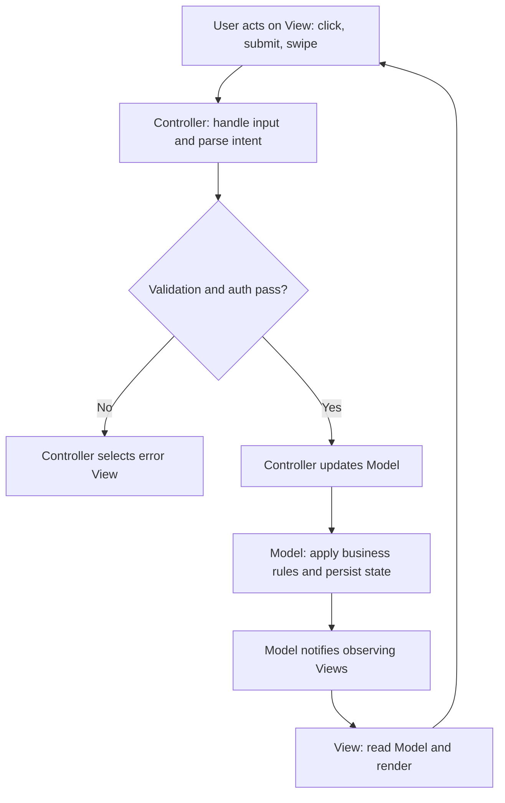
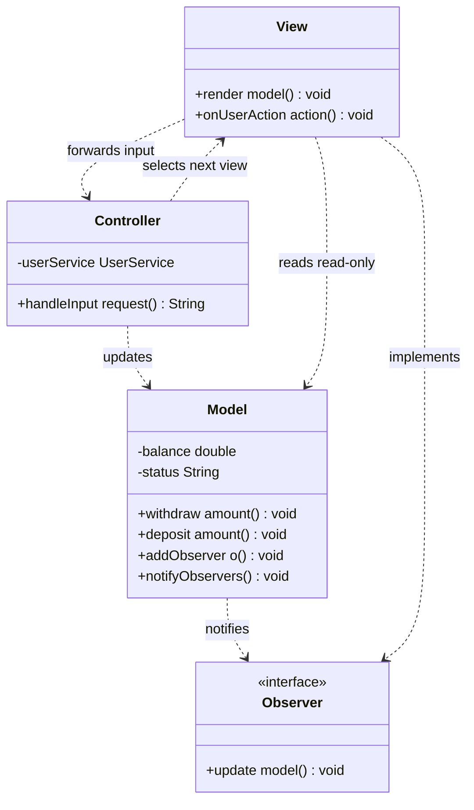

# MVC Architecture Overview

## Blogs and websites

## Medium

## Youtube

- [37. MVC Design Pattern | MVC Architecture Overview | Low Level System Design](https://www.youtube.com/watch?v=lJBbvb7p__o)

## Theory

MVC separates an application into Model (data + business rules), View (presentation), and Controller (input handling). The controller updates the model; views observe model changes, keeping UI decoupled from logic.
Key entities: Model, View, Controller/Observer linkage.
Core operations: handle input, update model, render view.

This guide turns that scope note into a complete interview-ready reference for low-level design interviews.
You will learn what Model View Controller really separates and why, how a request flows from user input
through controller to model and back to the view, what each role owns, how MVC differs from MVP and MVVM,
how Spring MVC maps the pattern to DispatcherServlet and controllers, and which fat-controller and
leaky-model pitfalls make interviewers reject a design.
No framework knowledge is assumed at first; Spring specifics arrive in their own section with plain Java.

Think of MVC as a restaurant. The View is the menu and the plated dish the customer sees, the Model is the
kitchen with recipes, inventory, and business rules, and the Controller is the waiter who takes the order,
carries it to the kitchen, and brings back the finished plate. Diners never walk into the kitchen to cook,
and chefs never take orders at the table. That separation is the whole point: input handling, business
state, and presentation change for different reasons and at different speeds, so they live apart.

### 1. Topics Covered

1. [What MVC Is and Why It Matters](#2-what-mvc-is-and-why-it-matters)
2. [Roles Model View and Controller](#3-roles-model-view-and-controller)
3. [MVC Versus MVP Versus MVVM](#4-mvc-versus-mvp-versus-mvvm)
4. [Spring MVC Sketch](#5-spring-mvc-sketch)
5. [Pitfalls to Avoid](#6-pitfalls-to-avoid)
6. [Interview Questions and Answers](#7-interview-questions-and-answers)
7. [Blogs and Websites](#blogs-and-websites)

Each numbered item links to the matching section below. Headings use plain words so every anchor resolves on GitHub preview.

### 2. What MVC Is and Why It Matters

MVC separates an application into three collaborating roles with one rule: the Model never depends on the
View or the Controller, the View observes the Model but never mutates it directly, and the Controller
translates user input into model operations and selects the next view. The controller updates the model;
views observe model changes, keeping UI decoupled from logic, exactly as the scope note says.

The motivation is change isolation. Business rules change when pricing or validation changes, presentation
changes when designers restyle a page, and input handling changes when a new client such as a mobile app
or REST caller arrives. Without separation every change ripples through one giant class that fetches HTTP
parameters, runs SQL, and concatenates HTML. With MVC each change lands in one place and can be tested
in isolation: models with unit tests, controllers with mock requests, views with snapshot or template tests.

A request flows in a strict triangle rather than a straight line. The user acts on the View, the View
forwards the gesture to the Controller, the Controller mutates the Model, the Model notifies its observers,
and each observing View re-renders from fresh state. The View never writes to the Model on its own, and the
Model never calls into a specific button or page. That one-way dependency is what keeps the UI decoupled.



The diagram above shows the canonical loop. Input enters only through the controller, state changes only
inside the model, and rendering reads but never writes. The error short-circuit matters in interviews:
validation failure never touches the model, it goes straight back to an error view.

Walk the flow with a concrete signup example. The user submits an email and password on a registration
page. The controller extracts the parameters, validates format, and calls `userService.register`. The model
checks uniqueness, hashes the password, and saves the row. On success the model fires a change event, the
profile view pulls the new user and renders a welcome page; on failure the controller picks the signup
form again with an error message. The view never hashes passwords and the model never reads HTTP params.

Web flavors bend the triangle without breaking it. In classic server-side MVC such as Rails or Spring MVC,
the View is a template rendered on the server and the Observer link is a single render pass rather than a
live subscription. In client-side MVC such as Backbone, the View subscribes to model events and re-renders
on every change. In both cases the dependency rule holds: you can swap the view technology without
rewriting business rules, and you can add a JSON view alongside HTML without touching the controller logic.

The payoff interviewers want to hear has four parts:

- **Separation of concerns:** data plus rules, presentation, and input handling each have one home.
- **Testability:** models test without HTTP, controllers test with mocks, views test with fixtures.
- **Parallel work:** backend, frontend, and interaction designers integrate through narrow interfaces.
- **Reuse:** the same model serves HTML pages, REST responses, and CLI output through different views.

### 3. Roles Model View and Controller

Each role has one job, one direction of dependency, and one reason to change. Interviews fail when
candidates recite the acronym without stating who may call whom, so learn the contract cold.

**Model: data plus business rules, knows nothing about UI.**

The Model owns entities, validation, state transitions, and persistence coordination. It exposes
operations such as `registerUser`, `applyDiscount`, or `transferFunds`, enforces invariants, and
notifies observers when state changes. It never imports HTTP classes, never formats dates for display,
and never decides which page comes next. That ignorance is deliberate: the same `Order` model serves a
Thymeleaf page, a JSON API, and a batch job without modification.

A good Model follows four rules that interviewers listen for:

- **Encapsulates state:** fields are private, mutation happens through intention-revealing methods that
  validate first, for example `withdraw` rejects negative amounts before touching the balance.
- **Enforces invariants on every path:** uniqueness, non-null, range, and lifecycle checks live here, not
  scattered across controllers, so no caller can bypass them.
- **Notifies without naming:** it holds a list of generic observers or emits domain events. It never
  references `ProfilePage` or `OrderButton` by name.
- **Stays framework free:** plain classes plus repository interfaces. Framework adapters plug in around it,
  keeping unit tests fast and dependency free.

Two Model flavors appear in questions. A passive Model is a dumb data holder changed only by the
controller, with the controller refreshing the view explicitly; this is what most server-side frameworks
do per request. An active Model pushes change events to subscribed views through Observer, which is what
desktop and client-side MVC need for live updates. Name both to show depth.

**View: presentation only, reads the Model, never writes it.**

The View renders state and forwards gestures. It pulls display-ready data from the Model, formats it,
and displays it as HTML, JSON, or native widgets. It captures clicks and submits, but instead of mutating
state it delegates to the Controller. A template with an `if` that hides an admin button is fine; a
template that computes tax or calls the database is a violation.

View discipline has three checks:

- **No business logic:** no price math, no auth decisions, no direct repository calls. If you cannot render
  the view from a canned Model fixture, logic has leaked in.
- **No direct mutation:** the View never calls `model.setBalance` on its own. Every write goes through the
  Controller so validation and audit run exactly once.
- **Replaceable:** swapping Thymeleaf for React or adding a mobile JSON view requires no Model change. If a
  redesign forces Model edits, the boundary was wrong.

**Controller: input handling, orchestration, flow control, nothing else.**

The Controller translates raw input into Model calls and picks the next View. It parses parameters,
validates shape such as required fields and types, checks permissions, invokes exactly the Model
operations needed, collects the result into a view-model or DTO, and returns the view name or redirect.
It holds no business rules and no HTML. Thin controllers with fat models is the mantra every reviewer
expects to hear.



The diagram above shows the allowed directions. The Controller points at the Model, the Model points only
at the abstract Observer, the View reads the Model and forwards input to the Controller, and the Controller
selects the next View. There is deliberately no arrow from Model to Controller or to a concrete View.

Walk a withdrawal to cement it. The View shows a form and sends `POST /withdraw amount=100` to the
Controller. The Controller parses the amount, rejects non-numbers immediately, loads the session user, and
calls `account.withdraw(100)`. The Model checks funds, updates the balance, persists, and notifies. The
View pulls the new balance and renders success, or the Controller returns the form with an insufficient
funds error if the Model threw. Each step has exactly one owner.

Common follow-up: who creates whom. In server MVC the front controller creates a per-request Controller,
injects services and repositories into it, and the Controller loads the Model for this request. Views are
resolved by name after the handler returns. Controllers and Views are short lived per request, Models and
services are long lived singletons. Stating lifetimes unprompted signals production experience.

### 4. MVC Versus MVP Versus MVVM

Beginners blur three patterns that all separate UI from logic. Each wires the triangle differently, and
interviewers expect you to draw the arrows from memory rather than recite definitions.

| Aspect | MVC Model View Controller | MVP Model View Presenter | MVVM Model View ViewModel |
|---|---|---|---|
| View to logic path | View forwards input to Controller, observes Model | View delegates everything to Presenter, never touches Model | View binds declaratively to ViewModel, never touches Model |
| Logic to view path | Model notifies View via Observer, Controller picks next View | Presenter pushes formatted data to passive View interface | ViewModel exposes observable state, View auto-updates via binding |
| View intelligence | Somewhat active, knows Model read API | Fully passive, only interface methods like `showError` | Declarative, binding expressions plus commands |
| Test seam | Test Model directly, Controller with mock requests | Test Presenter with mock View interface, no UI needed | Test ViewModel as plain state plus commands, no UI needed |
| Best for | Server web apps, Rails, Spring MVC, Backbone | WinForms, legacy Android, GWT where views are hard to test | WPF, SwiftUI, Jetpack Compose, Angular, React with ViewModel |
| Risk when misused | Fat Controller absorbs business rules | Fat Presenter mirrors View, becomes untestable | Logic leaks into binding expressions and code-behind |

- **MVC versus MVP:** MVP cuts the View-to-Model link entirely. The View knows nothing about the Model and
  talks only to the Presenter through an interface, while the Presenter fetches from the Model and pushes
  strings and flags back via methods such as `showOrders` or `showLoading`. This makes the View trivially
  mockable, which is why teams with untestable UI frameworks chose MVP. The cost is a Presenter per screen
  that can bloat into a View twin. Choose MVP when the View technology resists unit testing and you need a
  hard interface seam; keep MVC when Observer or template rendering already gives you that seam.
- **MVC versus MVVM:** MVVM replaces imperative Observer code with declarative data binding. The ViewModel
  holds view-ready state such as `balanceText` and `isWithdrawEnabled` plus commands, and the framework
  synchronizes it with widgets automatically. The View has zero procedural code, just bindings. This shines
  for rich interactive clients with two-way forms, but binding expressions tempt developers to hide business
  rules in XML where no unit test reaches them. Rule of thumb: request-response pages favor MVC, highly
  interactive screens with live validation favor MVVM.
- **How to answer in thirty seconds:** in MVC the View knows the Model for reads and the Controller for
  input; in MVP the View knows only the Presenter and the Model is hidden behind it; in MVVM the View knows
  only the ViewModel through bindings and neither side holds a direct reference. Draw three tiny box
  diagrams while saying it and the interviewer will move on.

### 5. Spring MVC Sketch

Spring MVC is the server-side passive flavor of MVC that most Java interviews assume. A single front
controller servlet receives every request and orchestrates the triangle, so application controllers stay
small and focused on one route each. Learning the six-step dispatch flow by heart answers half of all
Spring MVC questions before any code is discussed.

The dispatch flow runs the same way for every request:

- **DispatcherServlet:** the front controller. It receives the HTTP request, drives the whole pipeline,
  and renders or writes the final response. There is exactly one per application.
- **HandlerMapping:** looks at URL, method, and headers and picks which `@Controller` method handles it.
- **Controller method:** the application code you write. It parses input, calls services holding the Model,
  puts results into a `Model` map, and returns a logical view name or response body.
- **Service plus repository:** the real Model. It enforces business rules and persistence inside
  `@Service` and `@Repository` beans, fully independent of HTTP.
- **ViewResolver plus View:** translates the logical name such as `profile` into a template such as
  `profile.html` and renders it with the `Model` data. For REST, `HttpMessageConverter` writes JSON
  instead of HTML, which is the same Controller plus a different View.
- **Model:** in Spring the word is overloaded. The domain Model is your entities and services, while the
  `org.springframework.ui.Model` map is just the view-model DTO carried to the template. Name the
  distinction explicitly in interviews to avoid confusion.

First the Controller plus view-model handoff. This is the only Spring-coupled code in the design:

```java
// Controller: input handling and flow control only, no business rules.
@Controller
@RequestMapping("/accounts")
public class AccountController {

    private final AccountService accounts; // Domain Model behind an interface.

    public AccountController(AccountService accounts) {
        this.accounts = accounts;
    }

    @GetMapping("/{id}")
    public String showProfile(@PathVariable String id, Model viewModel) {
        // 1. Parse input (done by Spring), 2. call the Model, 3. pick the View.
        Account account = accounts.findById(id); // Throws AccountNotFoundException if missing.
        viewModel.addAttribute("account", account); // View-model DTO for the template.
        return "profile"; // Logical view name, resolved to profile.html.
    }

    @PostMapping("/{id}/withdraw")
    public String withdraw(@PathVariable String id,
                           @RequestParam double amount,
                           Model viewModel) {
        try {
            Account updated = accounts.withdraw(id, amount); // Business rules live inside.
            viewModel.addAttribute("account", updated);
            return "redirect:/accounts/" + id; // Post-redirect-get avoids double submit.
        } catch (InsufficientFundsException ex) {
            viewModel.addAttribute("error", ex.getMessage());
            viewModel.addAttribute("account", accounts.findById(id));
            return "profile"; // Validation failure never touched persistence beyond the guard.
        }
    }

    @ExceptionHandler(AccountNotFoundException.class)
    public String handleMissing(Model viewModel) {
        viewModel.addAttribute("error", "Account not found");
        return "error";
    }
}
```

This block shows thin-controller discipline. The handler takes HTTP-bound parameters, delegates every
decision to `AccountService`, copies the result into the view-model map, and returns a view name or a
redirect string. The `try` plus `catch` keeps the insufficient-funds path rendering the same profile view
with an error attribute, mirroring the error short-circuit from the Section 2 flow diagram. The
`@ExceptionHandler` centralizes the missing-account case so no handler repeats null checks. Nothing here
computes balances, formats currency, or writes SQL.

Next the domain Model that the controller delegates to. It is plain Java with no HTTP imports:

```java
// Model: entities plus business rules, framework free and unit testable.
public final class Account {
    private final String id;
    private double balance;
    private final List<ModelObserver> observers = new ArrayList<>();

    public Account(String id, double balance) {
        this.id = id;
        this.balance = balance;
    }

    public String getId() { return id; }
    public double getBalance() { return balance; }

    public synchronized void withdraw(double amount) {
        // Invariants enforced on every path, no caller can bypass them.
        if (amount <= 0) {
            throw new IllegalArgumentException("Amount must be positive");
        }
        if (amount > balance) {
            throw new InsufficientFundsException("Balance " + balance + " too low");
        }
        balance -= amount;
        notifyObservers();
    }

    public void addObserver(ModelObserver observer) {
        observers.add(observer);
    }

    private void notifyObservers() {
        for (ModelObserver observer : observers) {
            observer.update(this); // Observers see only the abstract update, never the Controller.
        }
    }
}
```

This block is the fat-model counterpart. `withdraw` validates before mutating, keeps the balance
consistent under concurrency with `synchronized`, and notifies generic observers without naming any view
or controller. A `Thymeleaf` profile template reads `account.balance` read-only, a REST view serializes
the same object to JSON, and a unit test drives `withdraw` with no servlet container. If an interviewer
asks where the business logic lives, point here and nowhere else.

Test seams fall out naturally. Test `Account.withdraw` as a pure unit test including negative and
overdraft cases, test `AccountController` with `MockMvc` plus a stubbed `AccountService` asserting view
names and redirect strings, and test the Thymeleaf template with a canned `Account` fixture. Three suites,
three roles, zero cross-contamination.

### 6. Pitfalls to Avoid

The number one interview trap is the fat Controller that quietly absorbs the Model. Symptoms are handlers
hundreds of lines long that validate, compute, query, and format in one method. Defenses are mechanical:
if a handler imports `java.sql`, does arithmetic on money, or concatenates HTML, move that code into a
service or view helper. A handler longer than roughly twenty lines deserves a review comment.

- **Business logic in the View:** templates that compute discounts, check roles, or query repositories.
  Fix by exposing view-ready fields from the Controller and keeping templates to loops, conditionals, and
  formatting. If the view needs a canned fixture to render in tests, logic has leaked.
- **Leaky Model with framework imports:** entities referencing `HttpServletRequest`, session objects, or
  view classes. Fix by depending only on domain types and repository interfaces. The Model must compile
  with zero web dependencies so batch jobs and tests reuse it untouched.
- **Bidirectional dependencies:** Model calling Controllers or concrete Views, View mutating the Model
  directly. Fix by enforcing the Section 3 arrow rules: Controller points at Model, Model points only at
  the Observer abstraction, View reads the Model and forwards writes through the Controller.
- **Shared mutable view-model:** stuffing request state into singleton Controller fields instead of the
  per-request `Model` map or method parameters. Spring controllers are singletons serving concurrent
  threads, so any instance field becomes a race. Keep handlers stateless and pass everything as arguments.
- **Skipping post-redirect-get:** returning a success page directly from a `POST` so refresh resubmits the
  form and double-charges the account. Fix by redirecting after every mutating `POST`, as the withdraw
  handler above does with `redirect:/accounts/{id}`.
- **Anemic Model with smart Controllers:** entities reduced to getters and setters while every invariant
  lives in handlers, so a second caller such as a CLI bypasses all rules. Fix by moving validation and
  transitions into intention-revealing Model methods and making raw setters private or package scoped.
- **Observer memory leaks:** active Models holding strong references to destroyed Views that never
  unsubscribe, common in desktop and mobile MVC. Fix by deregistering in lifecycle callbacks or holding
  observers through weak references, and by preferring single render passes on the server where no
  subscription outlives the request.
- **One Model per View duplication:** cloning `User` into `ProfileUser`, `AdminUser`, and `ApiUser` classes
  that drift apart. Fix with one canonical domain Model plus thin per-view DTOs or projections that map
  from it. Duplicated validation across clones always diverges.

When reviewing a design out loud, run the three-sentence audit: can I test the Model without HTTP, can I
test the Controller with a mocked Model, can I redesign the View without touching the Model. Any no
pinpoints the leaked responsibility precisely.

### 7. Interview Questions and Answers

1. **Explain MVC in one minute.**
   Three roles with one-way dependencies. The Controller translates input into Model operations and picks
   the next View, the Model owns data plus rules and notifies observers, and the View reads the Model and
   forwards gestures to the Controller. Goal: input, state, and presentation change independently and test
   in isolation.
2. **Walk me through a request from click to render.**
   User acts on the View, the View forwards to the Controller, the Controller validates and updates the
   Model, the Model applies rules and notifies observers, and each View re-renders from fresh state.
   Validation failure short-circuits back to an error View without touching the Model. Cite the signup or
   withdrawal example while tracing it.
3. **What does each role own, and what must it never do?**
   Model owns state and invariants, never touches HTTP or HTML. View owns rendering and gesture capture,
   never mutates the Model or computes business values. Controller owns input parsing and flow control,
   never holds business rules or presentation markup. Violations are fat controllers, smart templates, and
   web-importing entities.
4. **Active versus passive Model, which does Spring use?**
   A passive Model is changed only by the Controller, which then refreshes the View explicitly. An active
   Model pushes events to subscribed Views via Observer. Spring MVC is passive per request: the handler
   updates services and returns one view name, with no live subscription. Desktop and client-side MVC need
   the active variant for live updates.
5. **Compare MVC with MVP and MVVM.**
   In MVC the View reads the Model and forwards input to the Controller. In MVP the View knows only the
   Presenter, which hides the Model behind a mockable interface for hard-to-test UIs. In MVVM the View
   binds declaratively to a ViewModel with no direct reference either way, ideal for interactive clients.
   Draw the three arrow diagrams while answering.
6. **Where does business logic live, and how do you keep controllers thin?**
   Exclusively in the Model layer behind service interfaces. Controllers parse, authorize, delegate, pack
   the view-model, and return a view name. Enforce a rough twenty-line handler limit, move money math and
   SQL into services, and unit test rules without any servlet context to prove the split.
7. **Sketch Spring MVC dispatch without looking anything up.**
   `DispatcherServlet` receives the request, `HandlerMapping` picks the `@Controller` method, the method
   calls services and returns a logical view name with a populated `Model` map, `ViewResolver` locates the
   template, and the View renders. For REST the same pipeline ends in an `HttpMessageConverter` writing
   JSON instead of HTML. Distinguish the domain Model from the `Model` view-map while sketching.
8. **What is the most common MVC pitfall you have fixed?**
   A fat Controller doing validation, pricing, and SQL in one handler. I extracted the rules into service
   and entity methods, reduced the handler to parse plus delegate plus view selection, and added unit tests
   for the Model plus `MockMvc` tests for view names. Mention post-redirect-get and stateless singleton
   controllers as companion fixes.
9. **How do you test each MVC layer?**
   Model with plain unit tests covering invariants and edge cases, no container. Controller with `MockMvc`
   and stubbed services asserting status codes, view names, redirects, and error attributes. View with
   fixture-driven template or snapshot tests asserting rendered output for a canned Model. A bug caught by
   the wrong suite reveals a leaked responsibility.
