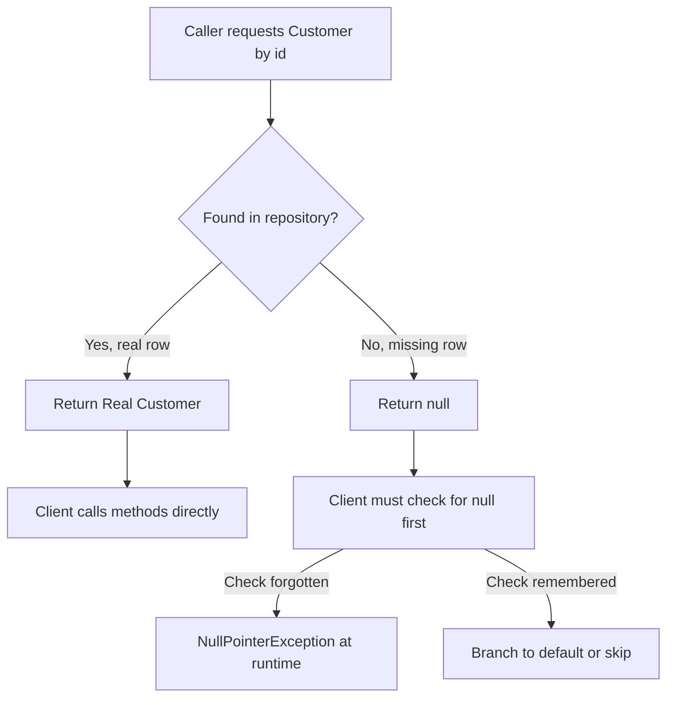
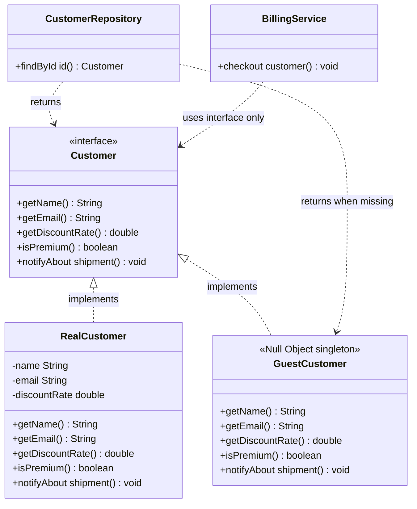

# NULL Object Pattern

## Blogs and websites

## Medium

## Youtube

- [15. LLD of NULL Object Pattern (Hindi) | Design Null Object Pattern | Design Patterns](https://www.youtube.com/watch?v=iDPhxhamuTo)

## Theory

The Null Object pattern replaces null checks with a neutral object implementing the expected interface as a no-op/default. Eliminates repetitive null guards and NullPointerExceptions.
Key entities: Interface, RealObject, NullObject, Client.
Core operations: return NullObject instead of null; client calls methods uniformly.

This guide turns that scope note into a complete interview-ready reference for low-level design interviews.
You will learn why `null` spreads defensive `if` checks through every caller, how a Null Object restores
uniform polymorphism, how to model it with an interface plus real and null implementations, when to prefer
`Optional` or empty collections instead, and which pitfalls make reviewers reject a Null Object.
No framework knowledge is assumed; every example is plain Java with OOP only.

Think of Null Object as a polite stand-in. Instead of handing the client an empty seat marked `null` and
forcing everyone to check whether someone is sitting there, you seat a quiet guest who knows the etiquette:
nods, smiles, does nothing harmful, and never interrupts the flow. The client code keeps talking to the
abstraction without fear of a `NullPointerException`.

### 1. Topics Covered

1. [Problem Null Checks Everywhere](#2-problem-null-checks-everywhere)
2. [Null Object Solution](#3-null-object-solution)
3. [Java Example Customer and Guest](#4-java-example-customer-and-guest)
4. [Null Object Versus Optional and Empty Collections](#5-null-object-versus-optional-and-empty-collections)
5. [When to Use and When to Avoid](#6-when-to-use-and-when-to-avoid)
6. [Pitfalls When Null Object Hides Errors](#7-pitfalls-when-null-object-hides-errors)
7. [Interview Questions and Answers](#8-interview-questions-and-answers)

Each numbered item links to the matching section below. Headings use plain words so every anchor resolves on GitHub preview.

### 2. Problem Null Checks Everywhere

A typical lookup returns `null` when nothing is found. Every caller must then guard before use, and every
forgotten guard becomes a `NullPointerException` in production. The checks duplicate, the happy path drowns
in conditionals, and polymorphism breaks because the client branches on data instead of trusting the type.

Consider a customer lookup used by billing, shipping, and loyalty code:

```java
Customer customer = repository.findById(id);
if (customer != null) {
    invoice.applyDiscount(customer.getDiscountRate());
} else {
    invoice.applyDiscount(0.0);
}
if (customer != null) {
    notifier.sendEmail(customer.getEmail(), "Your order shipped");
}
if (customer != null && customer.isPremium()) {
    loyalty.addPoints(customer.getId(), 100);
}
```

This snippet shows the core pain. Three call sites repeat the same null test, each chooses its own default,
and a fourth caller that forgets the test crashes. Code reviews degenerate into did you check for null, and
unit tests must cover both branches everywhere.

The costs compound as the system grows:

- **Shotgun defaults:** discount `0.0` here, empty string there, skip there. No single place defines absent behavior.
- **Forgotten guards:** any new caller that dereferences directly throws `NullPointerException`.
- **Branch explosion:** cyclomatic complexity rises, coverage demands double, and refactoring is scary.
- **Broken Tell Dont Ask:** clients interrogate the object for nullness instead of sending it a message.
- **API lies:** the signature says it returns a `Customer` but it may return no customer at all.



The diagram above shows why null is a second return contract. One path behaves, the other forces every client to branch, and the forgotten branch fails late at runtime.

The deeper design smell is a missing abstraction. Absence is a legitimate domain answer, guest visitor,
unknown customer, no discount, silent logger, and it deserves its own object with well defined behavior
rather than the absence of an object. Null Object gives that answer a first class representation.

### 3. Null Object Solution

The fix keeps the interface contract but changes what absence means. Instead of returning `null`, the
supplier returns an object that implements the same interface and does the safe neutral thing: zero discount,
empty name, no-op notification, `false` for boolean queries. The client calls methods uniformly and never
branches, because polymorphism now covers both present and absent cases.

Four roles collaborate:

- **Abstract interface:** declares what every variant can do, for example `getName`, `getEmail`,
  `getDiscountRate`, `isPremium`, `notify`. Both real and null types implement it.
- **RealObject:** the normal implementation backed by data, for example a registered `Customer` row.
- **NullObject:** the neutral implementation with hard-coded safe defaults and no-op side effects.
  It carries no state, so one shared instance usually serves the whole application.
- **Client:** uses only the interface. It never tests for `null` because it can never receive `null`.



The diagram above shows the whole pattern. The repository never returns null, the guest stands in for a missing customer, and billing depends only on the abstraction.

A good Null Object follows five rules that interviewers listen for:

- **Same interface, zero surprises:** it implements every method. Clients cannot tell real from null by type.
- **Do nothing or return neutral defaults:** `0.0` discount, `""` or `"Guest"` name, `false` for flags,
  empty list for collections, silent no-op for `sendEmail` or `log`.
- **Stateless and shareable:** no mutable fields, so a single `static final` instance or singleton is enough.
  This also makes it trivially thread safe.
- **Never throw:** a Null Object that throws `UnsupportedOperationException` is just null with extra steps.
- **Created at the boundary:** the repository, factory, or service that would have returned `null` returns the
  Null Object instead. Clients stay clean because the boundary absorbs the missing case once.

Optional `isNull()` or `isGuest()` flags exist in some codebases so callers can branch when they truly need to,
for example showing "Guest checkout" in the UI. Prefer to avoid such checks: every `isNull` test reintroduces
the branching the pattern removed. Push the variation into polymorphic methods instead.

### 4. Java Example Customer and Guest

The example below is plain Java with no frameworks. A `Customer` interface has a real implementation for
registered users and a `GuestCustomer` null implementation for unknown ids. The repository returns the guest
instead of `null`, so billing, notification, and loyalty code runs branch-free.

First the abstraction and its two implementations:

```java
// Abstraction: everything a client needs from a customer.
public interface Customer {
    String getId();
    String getName();
    String getEmail();
    double getDiscountRate();
    boolean isPremium();
    void notifyAbout(String message);
}

// RealObject: backed by database fields, does real work.
public final class RealCustomer implements Customer {
    private final String id;
    private final String name;
    private final String email;
    private final double discountRate;
    private final boolean premium;

    public RealCustomer(String id, String name, String email,
                        double discountRate, boolean premium) {
        this.id = id;
        this.name = name;
        this.email = email;
        this.discountRate = discountRate;
        this.premium = premium;
    }

    @Override
    public String getId() { return id; }

    @Override
    public String getName() { return name; }

    @Override
    public String getEmail() { return email; }

    @Override
    public double getDiscountRate() { return discountRate; }

    @Override
    public boolean isPremium() { return premium; }

    @Override
    public void notifyAbout(String message) {
        // Real side effect: queue an email in production.
        System.out.println("Email to " + email + ": " + message);
    }
}
```

This block defines the contract plus the happy path. `RealCustomer` is immutable, holds real data, and its
`notifyAbout` performs the genuine side effect. Nothing here knows about null handling.

```java
// NullObject: neutral defaults, no-op side effects, shared singleton.
public final class GuestCustomer implements Customer {
    private static final GuestCustomer INSTANCE = new GuestCustomer();

    private GuestCustomer() { }

    public static GuestCustomer getInstance() {
        return INSTANCE;
    }

    @Override
    public String getId() { return "guest"; }

    @Override
    public String getName() { return "Guest"; }

    @Override
    public String getEmail() { return ""; }

    @Override
    public double getDiscountRate() { return 0.0; }

    @Override
    public boolean isPremium() { return false; }

    @Override
    public void notifyAbout(String message) {
        // Deliberate no-op: a guest has nowhere to send mail,
        // and skipping silently is the agreed neutral behavior.
    }
}
```

This block is the heart of the pattern. Every method returns a safe neutral value, `notifyAbout` quietly does
nothing, the private constructor plus static instance enforces a singleton, and the absence of mutable fields
keeps it thread safe. Callers receive a fully usable `Customer` even when nobody was found.

Next the boundary that eliminates null, plus the branch-free client:

```java
import java.util.HashMap;
import java.util.Map;

// Boundary: the only place that knows about absence.
public final class CustomerRepository {
    private final Map<String, Customer> rows = new HashMap<>();

    public void save(Customer customer) {
        rows.put(customer.getId(), customer);
    }

    public Customer findById(String id) {
        // Never returns null: missing rows become the shared guest.
        return rows.getOrDefault(id, GuestCustomer.getInstance());
    }
}

// Client: no null checks, same calls for real and guest customers.
public final class BillingService {
    private final CustomerRepository repository;

    public BillingService(CustomerRepository repository) {
        this.repository = repository;
    }

    public void checkout(String customerId, Invoice invoice) {
        Customer customer = repository.findById(customerId);
        invoice.applyDiscount(customer.getDiscountRate());
        customer.notifyAbout("Your order shipped");
    }
}
```

This block shows why the pattern pays off. `getOrDefault` centralizes the missing case in one line at the
repository boundary, and `checkout` reads as pure happy path: apply discount, send notification, done. A guest
gets `0.0` discount and a silent no-op notify, a real customer gets real values, and neither path can throw
`NullPointerException`. New callers inherit the safety automatically.

### 5. Null Object Versus Optional and Empty Collections

Beginners confuse three tools that all avoid null. Each answers a different question, and interviewers expect
you to pick deliberately rather than defaulting to one.

| Approach | What it says | Client still branches? | Best for |
|---|---|---|---|
| Return `null` | No answer, good luck | Yes, `if != null` everywhere | Almost never, legacy only |
| Null Object | Absent but well behaved stand-in | No, call methods uniformly | Stable neutral behavior exists |
| `Optional<Customer>` | Explicitly maybe present | Yes, `ifPresent` or `orElse` once | Caller must decide the default |
| Empty collection | Zero results, nothing to iterate | No, loop just skips | Multi-valued returns |

- **Null Object versus `Optional`:** `Optional` forces the caller to acknowledge absence at one explicit point,
  which is honest when the default depends on context, for example checkout needs `0.0` discount but support
  tooling needs to display Unknown user. Null Object bakes one agreed default into the type, which is simpler
  when every caller wants the same neutral behavior. Rule of thumb: one shared default means Null Object, caller
  specific defaults mean `Optional`. Never return `Optional` wrapping a Null Object, and never return `null`
  where `Optional` is promised.
- **Null Object versus empty collections:** returning an empty `List` instead of `null` is already the Null Object
  idea applied to collections, and Josh Bloch codified it in Effective Java. A `for` loop over an empty list is a
  built-in no-op, so no special class is needed. Reserve a custom Null Object for single objects with behavior,
  loggers, strategies, customers, policies, where a bare empty value cannot implement the interface.
- **Combinations that work:** repository returns Null Object for the common path and exposes a separate
  `findOptionalById` when a caller genuinely needs to distinguish guest from registered. Collections inside the
  Null Object return empty lists, for example `GuestCustomer.getOrders()` returns `List.of()`, never `null`.

### 6. When to Use and When to Avoid

Use Null Object when absence has one obvious safe meaning: silent logger, no-op command, zero discount guest,
unknown user display name, default pricing strategy. It shines for Strategy, State, and Command hierarchies
where a do-nothing variant keeps invokers clean, and for view rendering where blank defaults beat conditionals.

Avoid it when absence is an error or a decision point. A missing payment method during checkout, a failed login
lookup, or a deleted order must fail loudly or branch explicitly, not glide through as a guest. If callers need
`instanceof` or `isGuest` checks to behave correctly, the pattern has already failed, reach for `Optional` or an
exception instead. Also skip it when defaults differ per caller, when the interface is too wide to fake safely,
or when a framework expects real `null` semantics such as JPA dirty checking.

### 7. Pitfalls When Null Object Hides Errors

The number one interview trap is silent failure. A Null Object that swallows a real problem converts a loud
crash into quiet wrongness: orders billed at zero discount that should have been rejected, emails never sent
with no log trace, guest rows written to analytics as real customers. Three defenses keep it honest.

- **Log at creation, not at use:** the repository or factory that substitutes the guest should log or meter the
  miss once, for example `log.debug("Unknown customer {}, returning guest", id)`. Clients stay silent, the
  boundary stays observable, and dashboards can alert when guest rates spike.
- **Keep neutral values distinguishable:** use sentinel-friendly defaults such as id `"guest"` and name `"Guest"`
  rather than blank strings that pollute joins and reports. Downstream queries can then filter guests explicitly.
- **Never fake identity or persistence:** a Null Object must not be saved back to the database, must not pass
  `isPremium` checks for gated features, and must not accumulate mutable state. Make it immutable, give it a fixed
  id callers would never persist, and document that it is a stand-in. Test both paths: assert guest defaults in
  unit tests and assert the repository returns the singleton for unknown ids.

### 8. Interview Questions and Answers

1. **What is the Null Object pattern in one minute?**
   Provide a no-op implementation of an interface so clients never receive `null`. The factory or repository
   returns the Null Object for missing cases, and callers invoke methods uniformly. Goal: remove repetitive null
   guards and `NullPointerException`s through polymorphism.

2. **Show the Customer and Guest sketch on a whiteboard.**
   Draw interface `Customer` with methods `getDiscountRate` and `notifyAbout`, classes `RealCustomer` and
   `GuestCustomer` implementing it, and `CustomerRepository.findById` returning `Customer`. Annotate the guest
   as a singleton with `0.0` and no-op notify, and state that `BillingService` holds only the interface.

3. **How does it differ from returning `Optional`?**
   Null Object embeds one shared default so the client never branches; `Optional` makes absence explicit so each
   caller chooses its default with `orElse` or `ifPresent`. Prefer Null Object when every caller wants the same
   neutral behavior, `Optional` when handling varies or absence needs attention.

4. **Is an empty list a Null Object?**
   Yes in spirit. An empty collection implements the same iteration contract with zero elements, so loops skip
   naturally. Effective Java recommends returning empty collections over `null`. Custom Null Objects are needed
   only when a single object must implement richer behavior than emptiness.

5. **Why is the Null Object usually a singleton?**
   It holds no mutable state, only constants and no-ops, so one shared instance serves all callers, saves
   allocation, and is inherently thread safe. Enforce it with a private constructor and static accessor.

6. **What is the biggest risk, and how do you mitigate it?**
   Hiding real errors by silently doing nothing. Mitigate by logging the substitution at the boundary, using
   distinguishable sentinel values like id `guest`, never persisting the stand-in, and alerting on abnormal
   guest rates. Absence-as-error cases should throw or return `Optional`, not a Null Object.

7. **When would you reject Null Object in review?**
   When callers still branch on `isNull` or `instanceof`, when defaults differ per caller, when the interface is
   too broad to fake, or when missing data signals failure such as payment or auth lookups. Also reject a Null
   Object that throws, carries mutable state, or gets persisted as if real.

8. **Name a real codebase example beyond Customer and Guest.**
   A `NoOpLogger` whose `info` and `error` methods do nothing when logging is disabled, a `NullPaymentGateway`
   used in tests, `Collections.emptyList` as the JDK built-in, or a default `DiscountStrategy` returning zero.
   Each lets the invoker run identical code whether the feature is present or absent.
