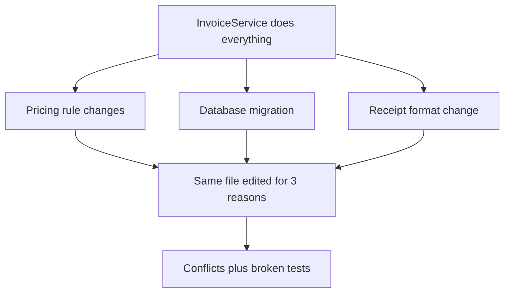
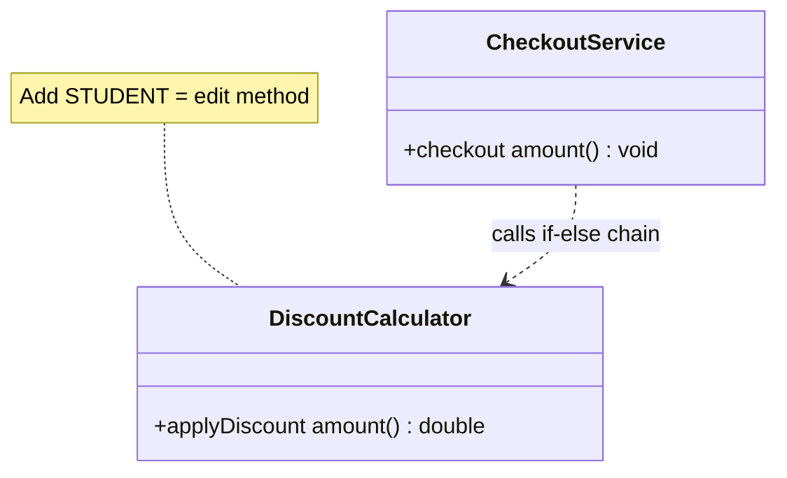
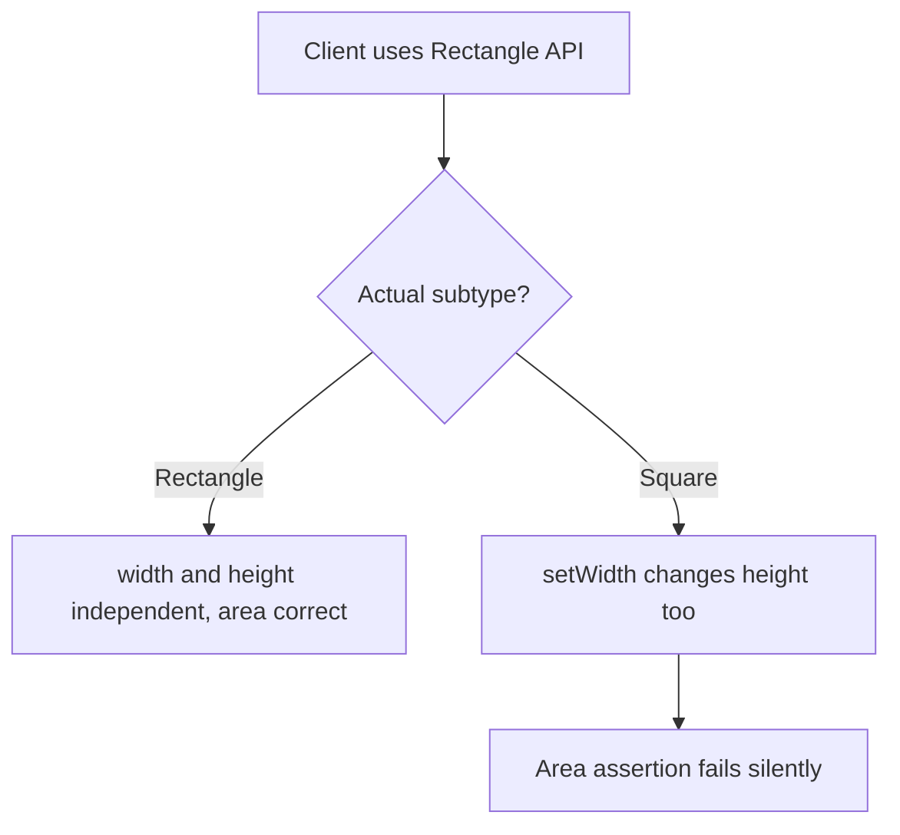
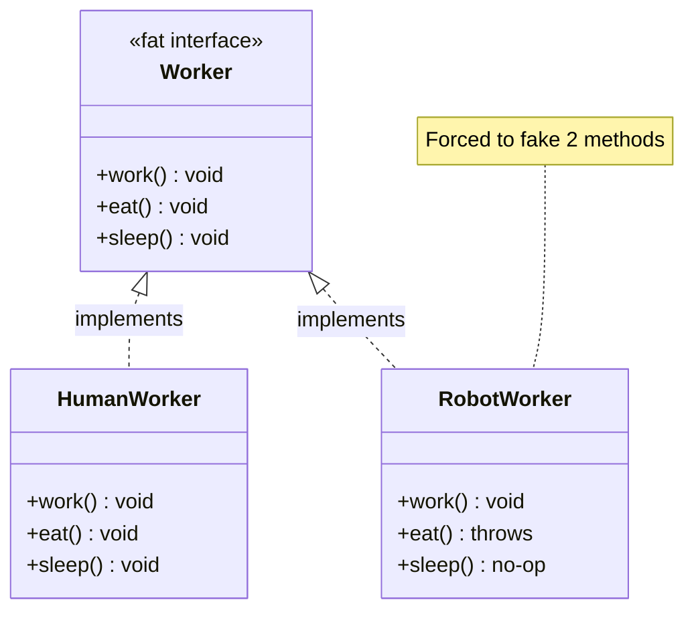
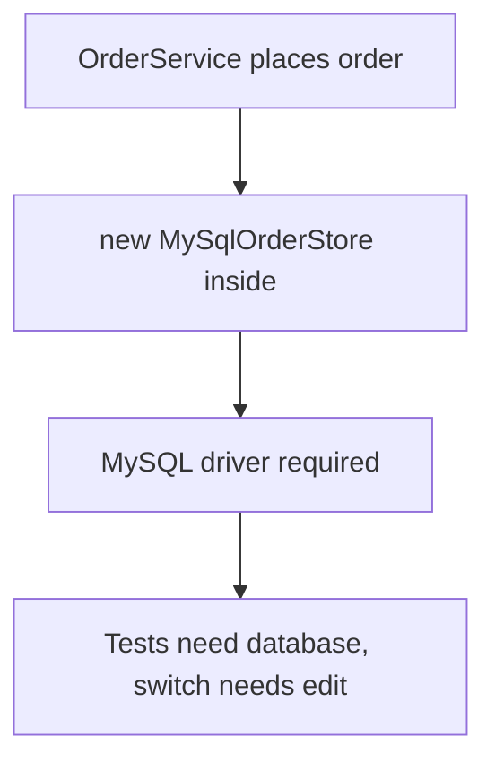
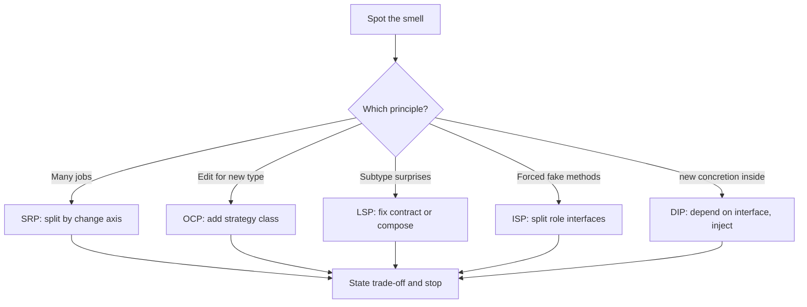

# SOLID Principles

## Blogs and websites

## Medium

## Youtube

- [1. SOLID Principles with Easy Examples (Hindi) | OOPs SOLID Principles - Low Level Design](https://www.youtube.com/watch?v=XI7zep97c-Y)
- [1.1 Liskov Substitution Principle (LSP) with Solution in Java - SOLID Principles of Low Level Design](https://www.youtube.com/watch?v=129QkkXUHeQ)

## Theory

SOLID is five OOP design principles for maintainable code: Single Responsibility, Open/Closed, Liskov Substitution, Interface Segregation, Dependency Inversion. Together they favour small cohesive classes depending on abstractions.
Key entities: SRP, OCP, LSP, ISP, DIP (one line each in interviews).
Core idea: high cohesion, low coupling, depend on abstractions.

This guide turns that scope note into a complete interview-ready reference for low-level design interviews.
You will learn what each of the five principles demands, what its classic violation looks like in plain Java,
how to refactor toward the fixed shape, how the principles reinforce each other, and how to defend trade-offs
when an interviewer pushes back on over-engineering.
No framework knowledge is assumed; every example is plain Java with OOP only.

Think of SOLID as house rules for roommates sharing one kitchen. Single Responsibility gives every cook one job
so nobody trips over each other, Open Closed lets you add a new appliance without rewiring the walls, Liskov
means any substitute cook honours the same recipe contract, Interface Segregation keeps vegetarians from being
handed the meat manual, and Dependency Inversion makes everyone depend on the menu board rather than on one
specific chef. The kitchen keeps working even as cooks and gadgets change.

### 1. Topics Covered

1. [Single Responsibility Principle](#2-single-responsibility-principle)
2. [Open Closed Principle](#3-open-closed-principle)
3. [Liskov Substitution Principle](#4-liskov-substitution-principle)
4. [Interface Segregation Principle](#5-interface-segregation-principle)
5. [Dependency Inversion Principle](#6-dependency-inversion-principle)
6. [SOLID in Interviews](#7-solid-in-interviews)
7. [Interview Questions and Answers](#8-interview-questions-and-answers)

Each numbered item links to the matching section below. Headings use plain words so every anchor resolves on GitHub preview.

### 2. Single Responsibility Principle

A class should have one reason to change, which means one cohesive job. Robert Martin phrased it as one actor
or stakeholder worth serving. In practice you ask what would force this file open: a pricing rule change, a
database migration, and a receipt format change are three different reasons, so they belong in three classes.
SRP is the foundation of SOLID because every other principle is harder when classes do three jobs at once.

Consider an invoice helper that calculates totals, saves to the database, and prints receipts:

```java
// Violation: three reasons to change in one class.
public class InvoiceService {
    private double taxRate;

    public InvoiceService(double taxRate) {
        this.taxRate = taxRate;
    }

    public double calculateTotal(Invoice invoice) {
        double sum = 0.0;
        for (LineItem item : invoice.getItems()) {
            sum += item.getPrice() * item.getQuantity();
        }
        return sum * (1.0 + taxRate);
    }

    public void saveToDatabase(Invoice invoice) {
        // Direct JDBC code mixed with pricing logic.
        System.out.println("INSERT INTO invoices VALUES (" + invoice.getId() + ")");
    }

    public void printReceipt(Invoice invoice) {
        // Formatting code mixed with persistence and pricing.
        System.out.println("=== Receipt " + invoice.getId() + " ===");
        System.out.println("Total: " + calculateTotal(invoice));
    }
}
```

This snippet shows the core pain. The pricing analyst, the database team, and the UI designer all own part of
the same file, so every release risks a merge conflict. Unit testing the tax formula requires constructing a
database connection, printing cannot be tested without pricing, and a change to receipt borders risks breaking
the tax math. Code reviews degenerate into who touched my method, and reuse is impossible because you cannot
take the calculator without dragging persistence along.

The costs compound as the system grows:

- **Fragile merges:** three teams edit one file, conflicts and regressions multiply.
- **Bloated tests:** a unit test for a pure formula needs I/O setup and console capture.
- **Low cohesion:** methods share no state except the invoice passed around, a sign of grouped utilities.
- **Hidden coupling:** a database outage breaks printing even though printing needs no database.
- **No reuse:** the next feature that needs totals without saving cannot reuse this class cleanly.



The diagram above shows why many reasons to change means many ways to break. One class sits at the
intersection of three change axes, so any axis moves the whole class.

The fix splits one god class into three collaborators, each with a single job:

```java
import java.util.List;

// Fixed: pure pricing, no I/O, trivially testable.
public final class InvoiceCalculator {
    private final double taxRate;

    public InvoiceCalculator(double taxRate) {
        this.taxRate = taxRate;
    }

    public double calculateTotal(Invoice invoice) {
        double sum = 0.0;
        for (LineItem item : invoice.getItems()) {
            sum += item.getPrice() * item.getQuantity();
        }
        return sum * (1.0 + taxRate);
    }
}

// Fixed: persistence only, owns SQL and connection handling.
public final class InvoiceRepository {
    public void save(Invoice invoice, double total) {
        System.out.println("INSERT INTO invoices VALUES (" + invoice.getId() + ", " + total + ")");
    }
}

// Fixed: presentation only, owns formatting.
public final class ReceiptPrinter {
    public void print(Invoice invoice, double total) {
        System.out.println("=== Receipt " + invoice.getId() + " ===");
        System.out.println("Total: " + total);
    }
}

// Thin orchestrator: wires the three single-purpose collaborators.
public final class CheckoutService {
    private final InvoiceCalculator calculator;
    private final InvoiceRepository repository;
    private final ReceiptPrinter printer;

    public CheckoutService(InvoiceCalculator calculator,
                           InvoiceRepository repository,
                           ReceiptPrinter printer) {
        this.calculator = calculator;
        this.repository = repository;
        this.printer = printer;
    }

    public void checkout(Invoice invoice) {
        double total = calculator.calculateTotal(invoice);
        repository.save(invoice, total);
        printer.print(invoice, total);
    }
}
```

This block shows why the split pays off. Each class now has one owner and one test style: calculator gets fast
pure unit tests, repository gets integration tests, printer gets golden-output tests. A tax change touches one
file, a database change touches another, and checkout reads as a three-step recipe. The deeper lesson is that
SRP is about change axes, not method counts: a class with ten pricing methods is still single-responsibility
if they all change for the same business reason.

### 3. Open Closed Principle

Software entities should be open for extension but closed for modification. You add new behavior by adding new
code, usually a new class or strategy, rather than editing tested working code and risking regressions. The
mechanism in Java is almost always polymorphism: depend on an interface, plug in new implementations, and leave
the consumer untouched.

Consider a discount calculator that branches on customer type strings:

```java
// Violation: every new customer type edits this method.
public class DiscountCalculator {
    public double applyDiscount(double amount, String customerType) {
        if ("REGULAR".equals(customerType)) {
            return amount * 0.95;
        } else if ("PREMIUM".equals(customerType)) {
            return amount * 0.85;
        } else if ("GUEST".equals(customerType)) {
            return amount;
        }
        throw new IllegalArgumentException("Unknown type: " + customerType);
    }
}
```

This snippet shows the core pain. Adding a STUDENT discount means reopening this method, retesting every
existing branch, and risking a typo that breaks PREMIUM. The `String` type invites misspellings the compiler
cannot catch, the method grows a new `else if` per release, and two developers adding two types collide on the
same lines. The class is open for breakage and closed for safe reuse.

The costs compound as the system grows:

- **Regression risk:** untouched branches must be retested because the method itself changed.
- **Merge hotspot:** all discount work funnels into one conditional chain.
- **No compiler help:** strings and ints carry no behavior, so mistakes surface at runtime.
- **Test bloat:** one test class covers N unrelated rules that change for N unrelated reasons.
- **OCP plus SRP smell:** the calculator owns both dispatch and every rule, two change axes at once.



The diagram above shows the closed-for-extension trap. There is no seam to plug a new rule into, so the only
option is surgery on working code.

The fix replaces the conditional with a strategy interface. New discounts arrive as new classes:

```java
// Fixed: abstraction that is closed to edits, open to new types.
public interface DiscountStrategy {
    double apply(double amount);
}

public final class RegularDiscount implements DiscountStrategy {
    @Override
    public double apply(double amount) {
        return amount * 0.95;
    }
}

public final class PremiumDiscount implements DiscountStrategy {
    @Override
    public double apply(double amount) {
        return amount * 0.85;
    }
}

public final class GuestDiscount implements DiscountStrategy {
    @Override
    public double apply(double amount) {
        return amount;
    }
}

// Consumer depends only on the abstraction, never changes for new types.
public final class PriceCalculator {
    public double finalPrice(double amount, DiscountStrategy strategy) {
        return strategy.apply(amount);
    }
}
```

This block is the textbook OCP shape. `PriceCalculator` is written once and never reopened: a STUDENT discount
arrives as one new file implementing `DiscountStrategy`, with its own unit tests, and zero edits to existing
files. Callers select the strategy at the boundary with a map or factory, so the `if` moves to composition
code that is cheap to change. Interviewers want to hear the trade-off explicitly: one file with three branches
is simpler today, but the strategy pays off the moment the fourth and fifth rules arrive or rules need
independent testing and rollout.

### 4. Liskov Substitution Principle

Any subclass or implementation must be usable wherever its parent type is expected, without breaking the
caller. If a method accepts a `Bird`, every `Bird` subtype must honour the same contract: same preconditions
or weaker, same postconditions or stronger, no surprising exceptions. LSP violations usually appear as a
subclass that narrows behavior, throws where the parent succeeds, or silently does nothing.

Consider a rectangle whose subclass square breaks the area contract:

```java
// Violation: Square cannot honour Rectangle's independent width and height.
public class Rectangle {
    protected int width;
    protected int height;

    public void setWidth(int width) { this.width = width; }
    public void setHeight(int height) { this.height = height; }
    public int area() { return width * height; }
}

public class Square extends Rectangle {
    @Override
    public void setWidth(int width) {
        this.width = width;
        this.height = width;
    }

    @Override
    public void setHeight(int height) {
        this.width = height;
        this.height = height;
    }
}

// Client written against Rectangle breaks for Square.
public final class AreaChecker {
    public static boolean doublesWhenWidthDoubles(Rectangle r) {
        r.setWidth(4);
        r.setHeight(5);
        int before = r.area(); // expects 20
        r.setWidth(8);
        return r.area() == before * 2; // true for Rectangle, false (64) for Square
    }
}
```

This snippet shows the core pain. `Square` looks like a `Rectangle` by language inheritance but not by
behavior: setting width also changes height, so any client that treats dimensions independently computes a
wrong area. The bug is silent, tests written for rectangles pass, and production geometry drifts. The classic
interview trap is answering is-a in English instead of behaves-as in contracts.

A second common violation is throwing `UnsupportedOperationException` from an overridden method, for example
a `ReadOnlyFile` extending `File` whose `write` throws. Every caller holding the parent type must now know
which child it really has, which destroys polymorphism.



The diagram above shows why the failure is behavioral, not syntactic. The code compiles, the types line up,
and the contract still breaks at runtime.

The fix favours composition or a shared abstraction over forced inheritance:

```java
// Fixed: one small abstraction, two independent shapes, no false hierarchy.
public interface Shape {
    int area();
}

public final class Rectangle implements Shape {
    private final int width;
    private final int height;

    public Rectangle(int width, int height) {
        this.width = width;
        this.height = height;
    }

    @Override
    public int area() { return width * height; }
}

public final class Square implements Shape {
    private final int side;

    public Square(int side) {
        this.side = side;
    }

    @Override
    public int area() { return side * side; }
}

// Client depends on Shape and works for every implementation.
public final class PriceEstimator {
    public static int totalArea(java.util.List<Shape> shapes) {
        int sum = 0;
        for (Shape s : shapes) {
            sum += s.area();
        }
        return sum;
    }
}
```

This block shows why the fix holds. Neither shape inherits mutable setters from the other, both honour the
tiny `Shape` contract of returning an area, and `totalArea` never needs `instanceof`. The rule to quote in
interviews: inheritance is for substitutable behavior, not for sharing fields or matching English nouns. When
subtypes need different setters, make objects immutable or split the hierarchy.

### 5. Interface Segregation Principle

Clients should not be forced to depend on methods they do not use. One fat interface with ten methods forces
every implementer to stub out nine irrelevant ones, usually with empty bodies or throws, which are LSP
violations in disguise. The fix splits the fat interface into small cohesive ones so each client depends only
on what it calls.

Consider a worker interface forced onto a robot and a human:

```java
// Violation: one fat interface, every implementer fakes something.
public interface Worker {
    void work();
    void eat();
    void sleep();
}

public final class HumanWorker implements Worker {
    @Override
    public void work() { System.out.println("Writing code"); }

    @Override
    public void eat() { System.out.println("Eating lunch"); }

    @Override
    public void sleep() { System.out.println("Sleeping"); }
}

public final class RobotWorker implements Worker {
    @Override
    public void work() { System.out.println("Assembling parts"); }

    @Override
    public void eat() {
        throw new UnsupportedOperationException("Robots do not eat");
    }

    @Override
    public void sleep() {
        // Silent no-op: misleading, hides the mismatch.
    }
}
```

This snippet shows the core pain. `RobotWorker` must implement `eat` and `sleep` it never needs, so it either
throws and crashes callers holding the `Worker` type, or no-ops and lies. Adding a fifth method like `attend`
forces every implementer to change, and clients that only call `work` still recompile when lunch logic moves.



The diagram above shows the segregation failure. One interface glues three lifecycles together, so the robot
inherits obligations from human biology.

The fix splits capabilities into role interfaces and composes them per implementer:

```java
// Fixed: small role interfaces, implement only what you honour.
public interface Workable {
    void work();
}

public interface Eatable {
    void eat();
}

public interface Sleepable {
    void sleep();
}

public final class HumanWorker implements Workable, Eatable, Sleepable {
    @Override
    public void work() { System.out.println("Writing code"); }

    @Override
    public void eat() { System.out.println("Eating lunch"); }

    @Override
    public void sleep() { System.out.println("Sleeping"); }
}

public final class RobotWorker implements Workable {
    @Override
    public void work() { System.out.println("Assembling parts"); }
}

// Scheduler depends only on the narrow capability it needs.
public final class WorkScheduler {
    public void runShift(java.util.List<Workable> crew) {
        for (Workable w : crew) {
            w.work();
        }
    }
}
```

This block shows why segregation pays off. The robot implements one honest interface, the human composes three,
and the scheduler accepts `List<Workable>` so both plug in without casts. New capabilities arrive as new
interfaces with default adapters, never as forced edits to every class. Quote the heuristic: a client that
imports an interface should use all of it; an `UnsupportedOperationException` is the compiler telling you the
interface is too fat.

### 6. Dependency Inversion Principle

High-level modules should depend on abstractions, not on low-level concretions, and both should depend on the
same interface. In plain terms: the checkout policy should not `new` a MySQL class; both should honour a
`PaymentGateway` or `InvoiceRepository` interface chosen at the boundary. DIP is what makes OCP testable, and
dependency injection is just its delivery mechanism.

Consider an order service hardwired to one database:

```java
// Violation: high-level policy depends directly on a low-level detail.
public final class MySqlOrderStore {
    public void save(Order order) {
        System.out.println("INSERT via MySQL: " + order.getId());
    }
}

public final class OrderService {
    private final MySqlOrderStore store = new MySqlOrderStore();

    public void place(Order order) {
        // Pricing and validation tangled with one concrete store.
        if (order.getAmount() <= 0) {
            throw new IllegalArgumentException("Bad amount");
        }
        store.save(order);
    }
}
```

This snippet shows the core pain. Testing `place` requires a live MySQL instance, switching to Postgres or an
in-memory fake means editing the service, and the `new` inside the constructor hides the dependency from
callers. The high-level ordering policy cannot be reused, reviewed, or reasoned about without dragging the
low-level driver along. Every new storage option reopens tested business logic.



The diagram above shows the inverted-wrong direction. The arrow of dependence points from policy down into
concrete plumbing, so plumbing changes shake policy.

The fix introduces an abstraction owned by the high-level module and injects the detail:

```java
import java.util.HashMap;
import java.util.Map;

// Fixed: abstraction defined by what the policy needs.
public interface OrderStore {
    void save(Order order);
}

public final class MySqlOrderStore implements OrderStore {
    @Override
    public void save(Order order) {
        System.out.println("INSERT via MySQL: " + order.getId());
    }
}

public final class InMemoryOrderStore implements OrderStore {
    private final Map<String, Order> rows = new HashMap<>();

    @Override
    public void save(Order order) {
        rows.put(order.getId(), order);
    }

    public int count() { return rows.size(); }
}

// Fixed: policy depends on the interface, detail injected at construction.
public final class OrderService {
    private final OrderStore store;

    public OrderService(OrderStore store) {
        this.store = store;
    }

    public void place(Order order) {
        if (order.getAmount() <= 0) {
            throw new IllegalArgumentException("Bad amount");
        }
        store.save(order);
    }
}
```

This block shows why inversion pays off. Unit tests inject `InMemoryOrderStore` and run in milliseconds,
production wires `MySqlOrderStore` in `main` or a factory, and switching databases touches composition code,
not the policy. Both sides now depend on `OrderStore`, so the high-level module finally owns its contract.
Interviewers want the one-liner: depend on roles, not on concrete classes, and `new` the concretion once at
the entry point.

### 7. SOLID in Interviews

Interviewers rarely ask recite all five. They show a god class, an `if-else` chain, or a throwing subclass and
ask what smells and how you would refactor. The winning move is to name the violation in one sentence, sketch
the fixed shape, and state the trade-off before they ask. This section gives you that script.

Spotting violations fast is a checklist you can run on any whiteboard code:

- **SRP smell:** the class imports from three layers, pricing plus SQL plus printing, or the description needs
  the word and repeated three times. Ask what forces this file open; two unrelated answers means split it.
- **OCP smell:** a method with a growing `if-else` or `switch` on a type code, where every feature adds a
  branch. Ask where a new variant would go; if the answer is edit this method, propose a strategy interface.
- **LSP smell:** `instanceof` checks before calling, downcasts, or an override that throws
  `UnsupportedOperationException` or weakens the result. Ask can I swap any implementation blind; a no means
  the hierarchy lies.
- **ISP smell:** implementers with empty methods, no-op overrides, or comments like not applicable. Ask does
  every client use every method; a no means split the interface by role.
- **DIP smell:** `new` of a concrete store, driver, or client inside business logic, or imports of
  `java.sql` inside a pricing class. Ask how you would unit test this without the database; pain means invert
  toward an interface and inject it.

Trade-offs keep you from sounding dogmatic. Every principle has a cost, and seniors name it unprompted:

- **SRP cost:** too many tiny classes scatter one flow across ten files and increase navigation. Rule of thumb:
  split by change axis and owner, not by method. One cohesive pricing class with ten methods is fine.
- **OCP cost:** a strategy interface for two branches that never grow is over-engineering. Say it plainly: I
  would keep the `if` for two stable types and extract the interface at the third rule or the first divergent test.
- **LSP cost:** deep hierarchies built for reuse usually break substitution. Prefer composition and small
  interfaces; inheritance only when every subtype truly honours the parent contract.
- **ISP cost:** ten one-method interfaces can clutter discovery. Group genuinely cohesive roles, for example
  `Workable` alone, and combine with multi-interface implements rather than exploding files.
- **DIP cost:** an interface with a single production implementation looks like ceremony until the first unit
  test or database switch. Justify it by test speed and boundary ownership, not by speculation.

How the five reinforce each other is a common follow-up. SRP creates small units worth extending, OCP extends
them without edits, LSP keeps every extension substitutable, ISP keeps the extension contracts narrow, and DIP
wires everything through abstractions. DIP without ISP gives fat abstractions; OCP without LSP gives plug-ins
that crash; SRP without DIP gives small classes still hardwired to concretions. Quote one line: SOLID points
one way, toward depending on small stable abstractions.



The diagram above is your whiteboard closer. Walk the arrow that matches the code, sketch the fix, then land
on the trade-off so the interviewer hears judgment, not just definitions.

### 8. Interview Questions and Answers

1. **Explain SOLID in one minute.**
   Five OOP rules for maintainable code. Single Responsibility gives each class one reason to change, Open
   Closed adds behavior with new code not edits, Liskov keeps subtypes substitutable, Interface Segregation
   prefers small role interfaces, Dependency Inversion depends on abstractions. Together: high cohesion, low
   coupling, depend on roles not concretions.

2. **How do you spot an SRP violation in review?**
   The class mixes layers such as pricing, SQL, and printing, its change history touches three unrelated
   tickets, or testing one method drags in I/O. Fix by splitting along change axes into calculator,
   repository, and printer plus a thin orchestrator, and name the owner of each new class.

3. **When would you NOT apply OCP?**
   Two stable branches with no third on the horizon. A strategy interface with four files for two unchanging
   rules adds navigation without payoff. Say you would keep the conditional, isolate it in one method, and
   extract the interface when the third rule arrives or branches need independent tests and rollout.

4. **Square versus Rectangle: what is really wrong?**
   Behavior, not naming. `Square` inherits independent `setWidth` and `setHeight` it cannot honour, so area
   math written for `Rectangle` silently breaks. Fix with a shared `Shape` interface and immutable
   implementations, or composition. Lesson: inherit substitutable behavior, never just shared fields.

5. **What is the fastest LSP test on a whiteboard?**
   Swap test: can the client run unchanged with any implementation and no `instanceof`, casts, or new
   exceptions. Overrides may weaken preconditions and strengthen postconditions only. A throw, a no-op, or a
   narrowed result where the parent succeeded fails the test.

6. **Fat interface with ten methods: how do you split it?**
   Group by client role, for example `Workable`, `Eatable`, `Sleepable`, and let each class implement only
   what it honours. Consumers accept the narrowest role they need. An `UnsupportedOperationException` in an
   implementer proves the interface was too fat; never ship a required method that throws by design.

7. **How does ISP relate to LSP?**
   A fat interface forces fake implementations that throw or no-op, which are LSP violations wearing a
   different badge. Segregating the interface removes the need to fake, so every remaining implementation can
   be honestly substitutable. Reviewers treat a throwing override as both smells at once.

8. **Show DIP in three lines of Java thinking.**
   Define `OrderStore` as the interface the policy needs, implement it in `MySqlOrderStore` and
   `InMemoryOrderStore`, and construct `OrderService` with an `OrderStore` parameter. Tests inject memory,
   production injects MySQL, policy never edits. `new` appears once at the entry point, never inside logic.

9. **DIP versus dependency injection: are they the same?**
   No. DIP is the principle to depend on abstractions; injection is the delivery trick of passing the
   concretion through a constructor or setter instead of `new` inside. You can invert without a framework:
   plain constructor injection in `main` or a factory is enough for interviews. Frameworks only automate wiring.

10. **Design a parking lot checkout using all five.**
    SRP: `FareCalculator`, `TicketRepository`, `ReceiptPrinter` plus a thin service. OCP: `PricingStrategy`
    interface with hourly, daily, and EV variants added as classes. LSP: every strategy honours the same
    rate contract with no throws. ISP: `Payable` and `Printable` role interfaces, gates depend only on what
    they call. DIP: checkout depends on `TicketRepository` and `PaymentGateway` interfaces injected at the
    boundary, memory fakes for tests.
