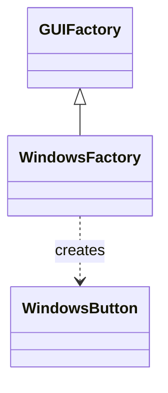

# Abstract Factory Pattern

## Blogs and websites

## Medium

## Youtube

---

## Theory

Provides an interface for creating families of related objects without naming their concrete classes, so products from the same family stay compatible.



*The diagram shows one factory interface with a platform-specific factory creating its matching product.*

### Java Example

*Each concrete factory creates a compatible family of products.*

```java
interface GUIFactory { Button createButton(); }
class WindowsFactory implements GUIFactory {
    public Button createButton() { return new WindowsButton(); }
}
```

### When to Use

- Use when the system must work with multiple families of related products.
- See [Factory](factory.md) for the Factory Method vs Abstract Factory comparison.

---

### Second Java Example: Cloud Infrastructure Families (AWS vs GCP)

Creates matched pairs of compute and storage clients per cloud provider, so an
AWS compute never gets paired with a GCP bucket by accident.

```text
CloudFactory (interface)
├─ createCompute() → Compute
└─ createStorage() → Storage
       ↓
AwsFactory → AwsCompute + AwsStorage (matched pair)
GcpFactory → GcpCompute + GcpStorage (matched pair)
       ↓
BackupService uses only the abstract interfaces
```

*The client depends on the abstract factory and product interfaces; swapping
one factory swaps the whole compatible family at once.*

```java
interface Compute {
    void start(String name);
}

interface Storage {
    void upload(String key, byte[] data);
}

interface CloudFactory {
    Compute createCompute();
    Storage createStorage();
}

class AwsCompute implements Compute {
    public void start(String name) {
        System.out.println("EC2 starting: " + name);
    }
}

class AwsStorage implements Storage {
    public void upload(String key, byte[] data) {
        System.out.println("S3 upload: " + key + " (" + data.length + " bytes)");
    }
}

class GcpCompute implements Compute {
    public void start(String name) {
        System.out.println("GCE starting: " + name);
    }
}

class GcpStorage implements Storage {
    public void upload(String key, byte[] data) {
        System.out.println("GCS upload: " + key + " (" + data.length + " bytes)");
    }
}

class AwsFactory implements CloudFactory {
    public Compute createCompute() { return new AwsCompute(); }
    public Storage createStorage() { return new AwsStorage(); }
}

class GcpFactory implements CloudFactory {
    public Compute createCompute() { return new GcpCompute(); }
    public Storage createStorage() { return new GcpStorage(); }
}

class BackupService {
    private final Compute compute;
    private final Storage storage;

    BackupService(CloudFactory factory) {
        this.compute = factory.createCompute();
        this.storage = factory.createStorage();
    }

    void nightlyBackup(String job) {
        compute.start(job);
        storage.upload(job + ".snap", new byte[1024]);
    }
}

// Usage:
// CloudFactory factory = config.isAws() ? new AwsFactory() : new GcpFactory();
// new BackupService(factory).nightlyBackup("orders-db");
```

*Use this shape when products have a compatibility constraint (compute plus
storage, connection plus dialect, renderer plus widget) that one factory per
family can guarantee at compile time.*

### Abstract Factory vs Factory Method

Use Factory Method for one product, Abstract Factory for a family of them.

| Aspect | Abstract Factory | Factory Method |
|--------|------------------|----------------|
| Scope | Creates families of related products | Creates one product type |
| Interface | One method per product (createA, createB) | One factory method subclasses override |
| Compatibility | Guarantees products from one family work together | No cross-product guarantee |
| Adding a family | Easy: add one factory class | N/A: one hierarchy only |
| Adding a product | Hard: touches every factory and the interface | Easy: add one subclass |

**Rule of thumb:** one product hierarchy points to Factory Method; two or more
products that must ship together point to Abstract Factory.

### Interview Q&A

**Q1: When do you prefer Abstract Factory over Factory Method?**

When the client needs several related objects that must be consistent with
each other. A cloud backup needs a matching compute and storage pair, or a UI
toolkit needs a matching button plus checkbox. Factory Method solves
"which subclass of one product", Abstract Factory solves "which consistent
set of products".

**Q2: What is the main cost of adding a new product type?**

You must extend the factory interface with a new creation method and update
every concrete factory. That is the classic trade-off: families are easy to
add, product kinds are expensive. Mitigate it by keeping product interfaces
narrow, defaulting new methods where the language allows, or splitting a
bloated factory into two smaller ones.

**Q3: How does the pattern enforce product compatibility?**

By construction: the client never calls `new AwsCompute()` directly, it asks
the injected factory for both products. Since each concrete factory only
instantiates its own family, a mismatched pair cannot be built unless someone
mixes two factories, which code review and constructor injection make obvious.

**Q4: How do you keep Abstract Factory testable?**

Program to the factory and product interfaces and inject the factory into the
client (as `BackupService` does above). Tests then inject a fake factory that
returns in-memory fakes and assert the interaction sequence, with one
integration test per real factory proving the family wires to the real SDK.
