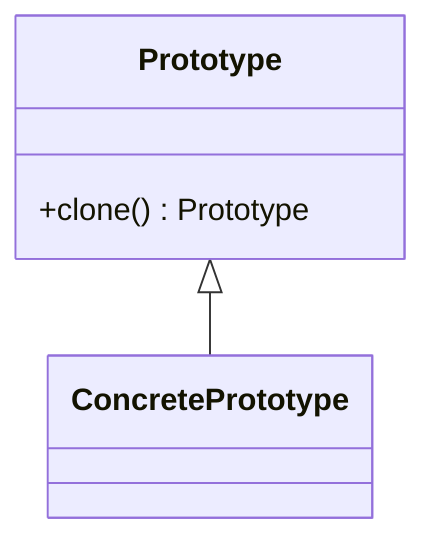

# Prototype Pattern

## Blogs and websites

## Medium

## Youtube

---

## Theory

Creates new objects by cloning a prototype instance instead of building from scratch, useful when creation is expensive or the type is known only at runtime.



*The diagram shows the client cloning a prototype through a common interface instead of calling constructors.*

### Java Example

*The copy must deep-copy mutable fields so it stays independent of the original.*

```java
class Dots implements Cloneable {
    private int[] pts = new int[3];
    public Dots copy() { Dots d = new Dots(); d.pts = pts.clone(); return d; }
}
```

### When to Use
- Use when creating an object costs more than copying one, or many similar instances are needed.

---

### Second Java Example: Invoice Template Cloning (Billing Domain)

A SaaS billing service keeps one approved invoice template per plan. Each new
bill clones the template and tweaks customer fields, instead of rebuilding tax
rules and line-item defaults from the database every time.

```text
InvoiceTemplate (prototype)
├─ planId, taxRate, List<LineItem> items
├─ copy() → deep-clones items list
└─ customize(customer, period)
       ↓
BillingService clones template → sets customer → issues invoice
       ↓
Original template stays pristine for the next customer
```

*Cloning keeps the expensive defaults (tax rules, legal footer, default line
items) while the per-customer copy diverges safely through a deep copy.*

```java
import java.util.ArrayList;
import java.util.List;

class LineItem {
    String sku;
    int qty;
    double unitPrice;

    LineItem(String sku, int qty, double unitPrice) {
        this.sku = sku;
        this.qty = qty;
        this.unitPrice = unitPrice;
    }

    LineItem copy() {                        // Immutable strings share safely
        return new LineItem(sku, qty, unitPrice);
    }
}

class Invoice {
    String planId;
    double taxRate;
    String customerId;
    List<LineItem> items = new ArrayList<>();

    Invoice copy() {                         // Deep-copy mutable item list
        Invoice clone = new Invoice();
        clone.planId = this.planId;
        clone.taxRate = this.taxRate;
        for (LineItem item : this.items) {
            clone.items.add(item.copy());
        }
        return clone;
    }

    double total() {
        double sub = 0;
        for (LineItem item : items) {
            sub += item.qty * item.unitPrice;
        }
        return sub * (1 + taxRate);
    }
}

class BillingService {
    private final Invoice proTemplate;       // Prototype registry entry

    BillingService(Invoice proTemplate) {
        this.proTemplate = proTemplate;
    }

    Invoice bill(String customerId) {
        Invoice invoice = proTemplate.copy();
        invoice.customerId = customerId;     // Only the copy mutates
        return invoice;
    }
}

// Usage:
// BillingService billing = new BillingService(proPlanTemplate);
// Invoice inv = billing.bill("cust-42");
```

*Use this shape when many instances share expensive defaults but diverge per
use: invoice templates, game enemy spawns, report layouts, or ML pipeline
configs.*

### Prototype vs Factory Method

Use cloning when a ready-made instance is the cheapest specification.

| Aspect | Prototype | Factory Method |
|--------|-----------|----------------|
| Object source | Copies an existing instance | Builds a new instance via subclass |
| Configuration | Inherits full state of the prototype | Starts from constructor defaults |
| Cost model | Cheap when setup or lookup is expensive | Cheap when construction is simple |
| Type flexibility | Runtime type decided by which prototype is cloned | Compile-time type decided by subclass |
| Key risk | Shallow-copy bugs on mutable fields | Subclass explosion for variants |

**Rule of thumb:** clone when the template already holds the right state;
construct via Factory Method when a class hierarchy decides the type.

### Interview Q&A

**Q1: Why is deep copy the central concern in Prototype?**

Because a shallow copy shares mutable references with the original, so editing
the clone corrupts the template. The fix is to deep-copy every mutable field
(items list above) while sharing immutable ones. Interviewers expect you to
name exactly which fields need copying and why.

**Q2: When is Prototype faster than `new`?**

When construction involves database lookups, parsing, permission checks, or
assembling large object graphs. Cloning a vetted template skips that work.
For trivial POJOs with two fields, `new` is clearer and no slower in practice.

**Q3: How do you manage many prototypes?**

With a prototype registry: a map from key to template (plan ID to invoice,
enemy type to prefab). The client asks the registry for a key and clones the
result. This keeps lookup logic in one place and avoids scattering templates.

**Q4: Prototype vs copy constructor — which do you pick?**

A copy constructor is explicit, type-safe, and easy to debug for one class.
Prototype adds polymorphism: the client clones through an interface without
knowing the concrete type. Pick Prototype when the runtime type varies;
otherwise a copy constructor or static `copyOf` is simpler.
