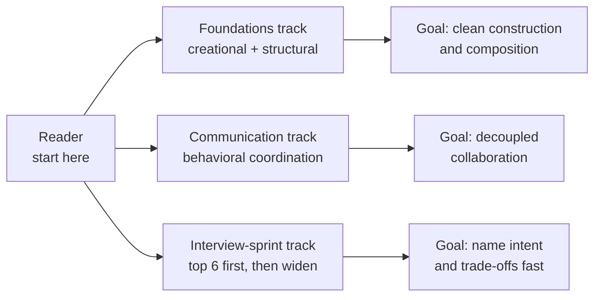

# Design Patterns

A comprehensive guide to understanding and implementing design patterns in software engineering

---

## Topics Index

### Creational Patterns

- [All Creational Design Patterns](creational/creational.md)
- [Singleton](creational/singleton.md)
- [Prototype](creational/prototype.md)
- [Builder](creational/builder.md)
- [Factory](creational/factory.md)
- [Abstract Factory](creational/abstract-factory.md)
- [Object Pool](creational/object-pool.md)


### Structural Patterns

- [All Structural Design Patterns](structural/structural.md)
- [Adapter](structural/adapter.md)
- [Bridge](structural/bridge.md)
- [Composite](structural/composite.md)
- [Decorator](structural/decorator.md)
- [Facade](structural/facade.md)
- [Flyweight](structural/flyweight.md)
- [Proxy](structural/proxy.md)

### Behavioral Patterns

- [All Behavioral Design Patterns](behavioral/behavioral.md)
- [Chain of Responsibility](behavioral/chain-of-responsibility.md)
- [Command](behavioral/command.md)
- [Interpreter](behavioral/interpreter.md)
- [Iterator](behavioral/iterator.md)
- [Mediator](behavioral/mediator.md)
- [Memento](behavioral/memento.md)
- [Observer](behavioral/observer.md)
- [State](behavioral/state.md)
- [Strategy](behavioral/strategy.md)
- [Template Method](behavioral/template.md)
- [Visitor](behavioral/visitor.md)

---

## Theory

Design patterns are reusable solutions to recurring object-design problems.
They matter because they give teams a shared vocabulary for structure, creation, and
collaboration — without them, every codebase reinvents singletons, factories, and observers badly.
Key subtopics: creational patterns that control how objects are made, structural patterns
that compose classes and objects into larger shapes, and behavioral patterns that assign
responsibility and communication.

A pattern is not a library, a framework, or copy-paste code. It is a named idea with
a problem, a structure, and trade-offs. The Gang of Four catalogued 23 of them, and this
subsection covers each one with intent, structure, Java examples, and interview angles.
Once you know the map, you stop asking "which pattern is this" and start asking "what
force does this design resolve, and what does it cost."

This landing page teaches you to reason about patterns before you memorize any single one.
You will learn what a pattern actually captures and why teams bother naming it, which
pattern belongs to which family and when each one pays off, how to choose between
lookalikes such as Factory versus Builder or Adapter versus Facade, in what order to
read this subsection for interviews versus daily design, which misuses turn patterns
into anti-patterns, and how to answer the pattern questions interviewers always ask.

> Scope note: this page is the interview-ready overview for the design-pattern subsection —
> definition, pattern map with when-to-use, selection heuristics, reading map, anti-patterns,
> and Q&A. Deep mechanics live in the linked pages (creational construction logic, structural
> composition wrappers, behavioral communication protocols). It assumes basic OOP — classes,
> interfaces, inheritance, composition — and focuses on the decisions interviewers probe:
> intent, structure, trade-offs, and alternatives.

### Topics Covered

1. [What Design Patterns Are and Why](#1-what-design-patterns-are-and-why)
2. [Pattern Map](#2-pattern-map)
3. [How to Choose the Right Pattern](#3-how-to-choose-the-right-pattern)
4. [How to Learn Them](#4-how-to-learn-them)
5. [Anti-Patterns](#5-anti-patterns)
6. [Interview Questions and Answers](#6-interview-questions-and-answers)

### 1. What Design Patterns Are and Why

A design pattern names a recurring tension and its proven resolution. Every pattern
answers four questions: what problem keeps appearing, in what context it bites, what
arrangement of classes resolves it, and what you give up by adopting that arrangement.
Without the fourth answer, a pattern is just a trick; with it, it becomes engineering judgment.

Patterns exist because object-oriented design reuses the same forces. Construction logic
spreads across call sites. Interfaces do not match. Objects need to collaborate without
hard-coding each other. Hierarchies explode with subclasses. State-dependent behavior
turns into nested conditionals. Each force has been solved many times, and the surviving
shapes earned names so reviewers can say "extract a Strategy here" instead of drawing
boxes for twenty minutes.

Three ideas keep the definition honest. First, patterns describe roles, not concrete
classes — a Strategy is any interchangeable algorithm behind a common interface, not
one specific class. Second, patterns compose: a Factory often returns Strategies, a
Composite often holds Commands, a Decorator often wraps a Bridge. Third, patterns have
cost: indirection, extra types, and lifecycle complexity. A senior answer always pairs
the benefit with the bill.

What patterns give you, end to end:

- **A shared vocabulary.** Saying Observer, Facade, or Builder compresses a design
  review from paragraphs to a sentence the whole team decodes identically.
- **A starting structure.** Class diagrams and sequence sketches let you borrow a
  tested shape instead of deriving one from first principles under deadline.
- **Named trade-offs.** Each pattern documents coupling, extensibility, testability,
  and complexity consequences you can argue explicitly in reviews and interviews.
- **An interview shorthand.** Questions like "design a notification system" or "make
  this extensible without modifying it" are pattern probes in plain clothes.
- **A misuse detector.** Knowing the intent tells you when a Singleton is global-state
  debt or when a Visitor is overkill for a two-case conditional.

A concrete contrast shows why intent matters more than shape. Two designs both add a
wrapper class around a service — one adds caching and access control per call, the other
hides an entire subsystem behind one simple entry point. The first is a Proxy, the second
a Facade. The code looks similar; the forces differ entirely. Interviews reward naming the
force, not just the wrapper.

### 2. Pattern Map

Patterns divide into three families by what they govern: creation, composition, or
collaboration. Creational patterns hide how objects are born. Structural patterns define
how classes and objects assemble into larger shapes. Behavioral patterns decide how
objects share work and talk to each other. Learn the family first and the catalog
shrinks from 23 disconnected names to three design moves.

Creational patterns pay off when construction is complex, variable, or expensive.
Structural patterns pay off when interfaces mismatch or responsibilities need layering
without rewriting. Behavioral patterns pay off when many objects must coordinate while
staying decoupled and extensible.

| Family | Pattern | Intent in one line | When to use it |
|---|---|---|---|
| Creational | Singleton | One shared instance with global access | Single config, registry, or pool coordinator; avoid when it hides dependencies |
| Creational | Factory Method | Subclasses decide which class to instantiate | Creator knows when but not which concrete product is needed |
| Creational | Abstract Factory | Family of related objects without concrete names | UI kits, drivers, or platform variants that must stay consistent |
| Creational | Builder | Step-by-step construction of complex objects | Telescoping constructors, optional fields, immutable assembly |
| Creational | Prototype | Clone a template instead of building anew | Expensive setup, many similar instances, runtime-configured defaults |
| Creational | Object Pool | Reuse expensive objects from a pool | Connections, threads, or buffers where creation cost dominates |
| Structural | Adapter | Convert one interface into what a client expects | Integrating legacy or third-party classes you cannot modify |
| Structural | Bridge | Split abstraction from implementation | Multiple dimensions of variation, shape and renderer, notifier and channel |
| Structural | Composite | Treat single objects and groups uniformly | Trees: files and folders, UI widgets, org hierarchies, menus |
| Structural | Decorator | Add behavior by wrapping, not subclassing | Optional stacked features: compression, encryption, logging streams |
| Structural | Facade | One simple face over a complex subsystem | Onboarding, subsystem entry points, reducing import sprawl |
| Structural | Flyweight | Share intrinsic state across many fine-grained objects | Text rendering, tiles, particles where instances differ by little |
| Structural | Proxy | Stand-in that controls access to another object | Lazy loading, caching, access control, remote stubs |
| Behavioral | Chain of Responsibility | Pass a request along handlers until one acts | Middleware, filters, approval ladders, event bubbling |
| Behavioral | Command | Encapsulate a request as an object | Undo, queues, macros, transactional job scheduling |
| Behavioral | Interpreter | Grammar plus evaluator for a small language | Rules engines, expressions, query DSLs kept deliberately small |
| Behavioral | Iterator | Sequential access without exposing internals | Custom collections, traversal variants, lazy sequences |
| Behavioral | Mediator | Central hub for object communication | Chat rooms, dialogs, coordination without mesh coupling |
| Behavioral | Memento | Snapshot and restore object state | Undo checkpoints, drafts, transactional rollback |
| Behavioral | Observer | Notify dependents on state change | Events, pub-sub, model-view sync, reactive pipelines |
| Behavioral | State | Change behavior when internal state changes | Workflows, connections, parsers driven by explicit states |
| Behavioral | Strategy | Interchangeable algorithms behind one interface | Sorting, pricing, routing, or validation chosen at runtime |
| Behavioral | Template Method | Skeleton algorithm with subclass hook steps | Framework workflows with fixed order and customizable stages |
| Behavioral | Visitor | New operations over a stable object structure | Compilers, ASTs, reporting across document element types |

The fastest way to read the table is by force, not by row. If construction spreads `new`
calls with conditionals across the codebase, reach creational. If two types cannot plug
together or one subclass tree multiplies against another, reach structural. If one class
accumulates conditionals for every behavior variant or every collaborator holds direct
references to the rest, reach behavioral.

```text
Creation messy? -> Creational (Factory / Builder / Prototype / Singleton / Pool)
Interfaces clash or layers tangle? -> Structural (Adapter / Bridge / Facade / Decorator / Proxy)
Objects too coupled or behaviors multiply? -> Behavioral (Strategy / State / Observer / Command)
```

The snippet above is the triage rule reviewers apply in seconds. Construction pain means
the birth logic needs a home. Shape pain means a wrapper, bridge, or facade is missing.
Coordination pain means responsibilities need redistributing across handlers, commands,
observers, or strategies. Name which pain you felt before naming the pattern you picked.

### 3. How to Choose the Right Pattern

Lookalikes cause most pattern mistakes, so learn the pairs explicitly. Factory versus
Builder is the classic: Factory answers which subclass to create from a small decision,
Builder answers how to assemble one complex object step by step. Use a Factory when the
caller knows what it wants but not the concrete class; use a Builder when the caller
knows the class but the constructor needs ten optional arguments.

Adapter versus Facade versus Proxy versus Decorator confuses every beginner because all
four wrap something. The intent separates them cleanly. Adapter converts an interface the
client cannot use into one it can. Facade simplifies a whole subsystem into one entry
point. Proxy controls access to the same interface with lazy, caching, or guard logic.
Decorator adds optional behavior while keeping the interface composable and stackable.

Strategy versus State versus Template Method is the behavior lookalike trio. Strategy
swaps whole algorithms chosen by the client at runtime. State swaps behavior driven by
the object's own internal state transitions. Template Method fixes the algorithm skeleton
in a base class and lets subclasses fill hook steps. Choose Strategy for client-selected
variants, State for self-transitioning workflows, Template Method for framework-controlled
order with extension points.

Three selection heuristics finish the skill. First, prefer composition over inheritance:
Decorator, Strategy, and Bridge beat subclass explosions almost every time. Second, match
the volatility: encapsulate what changes — varying algorithms become Strategies, varying
creation becomes Factories, varying notification becomes Observers. Third, count the
future cases honestly: a Visitor pays off for many operations over stable element types,
but for two cases and a changing hierarchy it is pure overhead — a simple conditional
or Strategy wins.

### 4. How to Learn Them

This subsection is organized by family so you always know where you are. Creational
pages answer how objects come to life, structural pages answer how types fit together,
and behavioral pages answer how objects converse. Read in the order below the first time;
afterwards jump straight to the page matching the interview question.

| Page | What it covers | When to read it |
|---|---|---|
| All Creational Design Patterns | Family overview, comparisons, selection rules | When asked how construction logic stays centralized |
| Singleton, Factory, Abstract Factory | Single instance, single product, product families | When asked who decides which class gets created |
| Builder, Prototype, Object Pool | Assembly, cloning, reuse of expensive objects | When asked how complex or costly construction stays clean |
| All Structural Design Patterns | Family overview, wrapper comparisons | When asked how mismatched types plug together |
| Adapter, Bridge, Facade | Conversion, decoupling, simplification | When asked how legacy code meets new clients safely |
| Composite, Decorator, Proxy, Flyweight | Trees, stacking, stand-ins, sharing | When asked how features layer without subclass sprawl |
| All Behavioral Design Patterns | Family overview, communication styles | When asked how objects coordinate without coupling |
| Chain, Command, Iterator, Mediator | Pipelines, requests as objects, traversal, hubs | When asked how work flows between many parties |
| Memento, Observer, State, Strategy | Snapshots, events, workflows, algorithms | When asked how behavior varies without conditionals |
| Interpreter, Template Method, Visitor | Grammars, skeletons, operations on structures | When asked how rules and traversals stay extensible |

Three reading paths cover the common interview shapes. The foundations path runs
creational to structural: it answers every "build this cleanly" arc from construction
to composition and suits daily design work. The communication path runs behavioral
start to finish: it answers every "these objects must coordinate" arc from events to
workflows. The interview-sprint path hits the highest-yield six — Singleton, Factory,
Builder, Decorator, Observer, Strategy — then widens to Facade, Proxy, Command, State,
Adapter, and Template Method before the remaining pages.



*The diagram above shows the three reading tracks and the design goal each one prepares
you to defend.*

Two cross-cutting notes apply to every page. First, each deep page follows the same
cadence: intent, structure, Java example, use cases, and interview angles — so once you
learn one page's rhythm you can skim any other fast. Second, patterns compose across
pages: a Factory returning Strategies, an Observer fed by Commands, a Composite
traversed by Visitors — interviewers award full marks when you name the pair instead
of one pattern in isolation.

### 5. Anti-Patterns

Patterns stop helping the moment they are applied by shape instead of by force. Learn
the failure set as pairs — how the misuse works in one sentence, which discipline kills
the class — and every pattern scenario becomes judgment rather than recall.

| Anti-pattern | How it works | Discipline that kills the class |
|---|---|---|
| Singleton as global state | Shared mutable instance hides dependencies and breaks tests | Inject dependencies, limit Singleton to truly single coordinators |
| Factory for everything | Trivial `new` calls gain factories with one product | Use Factory when the concrete class varies, plain construction otherwise |
| Builder for two fields | Fluent API outweighs a simple constructor | Use Builder past three to four args or real optionality |
| Adapter pile-up | Adapters wrap adapters until behavior is undebuggable | Fix the source interface or place one Facade, not five conversions |
| Decorator towers | Ten stacked wrappers with invisible ordering | Cap stacks, document order, prefer explicit pipelines past a few layers |
| Proxy surprises | Hidden caching or laziness causes stale reads and latency spikes | Make caching and async behavior visible in names, docs, and metrics |
| Observer leaks | Forgotten subscriptions pile up and fire on dead views | Unsubscribe in lifecycle hooks, prefer weak or scoped subscriptions |
| God Mediator | Hub absorbs all logic and becomes the new monolith | Split mediators per bounded context, keep hub to routing only |
| State explosion | Dozens of states with ad-hoc transitions nobody can audit | Model transitions explicitly, consider tables or workflow engines |
| Visitor overkill | Double dispatch for two cases on a shifting hierarchy | Use conditionals or Strategy until operations clearly outnumber types |
| Pattern hammering | Every review comment proposes a named pattern | Ask what force hurts today; no pain means no pattern |

Two scenarios show how to narrate an answer. First, the Singleton-config trap: tests
pass alone but fail together because global state leaks between cases. State both
controls in one breath — inject the config and reset or scope the instance per test —
plus detection: parallel-test runs that surface shared-state coupling. Second, the
Decorator tower: latency appears only in production because six wrappers each add
serialization nobody measured. Fix by documenting wrapper order, measuring per layer,
and collapsing cold layers into an explicit pipeline with per-stage metrics.

### 6. Interview Questions and Answers

**Q1 (Beginner): What is a design pattern, and why do teams use them?**
A named, reusable resolution to a recurring design tension, with a problem, a structure,
and trade-offs. Teams use patterns for shared vocabulary, tested starting structures,
and explicit trade-off arguments — saying Strategy or Facade compresses a review into
a sentence everyone decodes identically.

**Q2 (Beginner): How are creational, structural, and behavioral patterns different?**
Creational patterns govern how objects are born — Singleton, Factory, Builder, Prototype,
Object Pool. Structural patterns govern how types assemble — Adapter, Bridge, Composite,
Decorator, Facade, Flyweight, Proxy. Behavioral patterns govern how objects collaborate —
Observer, Strategy, State, Command, Chain, Mediator, and the rest.

**Q3 (Beginner): Singleton versus static utility — which do you pick?**
A Singleton guards a single stateful coordinator — config, registry, pool — with
controlled instantiation and an interface you can mock. A static utility suits stateless
helpers with no lifecycle. Prefer injection over either when testability matters, and
never use a Singleton to smuggle mutable globals between unrelated modules.

**Q4 (Intermediate): Factory Method versus Abstract Factory versus Builder?**
Factory Method lets subclasses pick one product's concrete class. Abstract Factory
produces consistent families of related products without naming concretes. Builder
assembles one complex object step by step. Pick by question asked: which class, which
family, or how to construct.

**Q5 (Intermediate): Adapter versus Facade versus Proxy versus Decorator?**
Adapter converts an unusable interface into a usable one. Facade simplifies a subsystem
behind one entry point. Proxy controls access to the same interface with lazy, cache,
or guard logic. Decorator stacks optional behavior while staying composable. Same
wrapping shape, four different forces — name the force.

**Q6 (Intermediate): How do you stay extensible without modifying existing code?**
Close for modification, open for extension: new Strategies for algorithms, new Commands
for actions, new Observers for reactions, new Decorators for features — all behind
stable interfaces. Callers depend on abstractions, and each variant ships as a new type
rather than another branch in old logic.

**Q7 (Intermediate): Observer versus Mediator versus pub-sub — what changes?**
Observer wires subjects directly to dependents for one-to-many events. Mediator routes
many-to-many communication through a hub so colleagues never reference each other.
Pub-sub decouples further through topics or a broker across process boundaries. Move
from direct to hub to broker as fan-out and distance grow.

**Q8 (Senior): Design a notification system supporting email, SMS, push, and new channels.**
Define a Strategy interface per channel behind a Factory that picks senders by user
preference, wrap senders with Decorators for retry and rate limiting, publish domain
events through an Observer or queue, and orchestrate multi-step campaigns with a Chain
of Responsibility or Template Method. New channels arrive as new Strategies; retry policy
changes touch Decorators only, never the domain core.