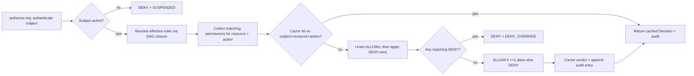
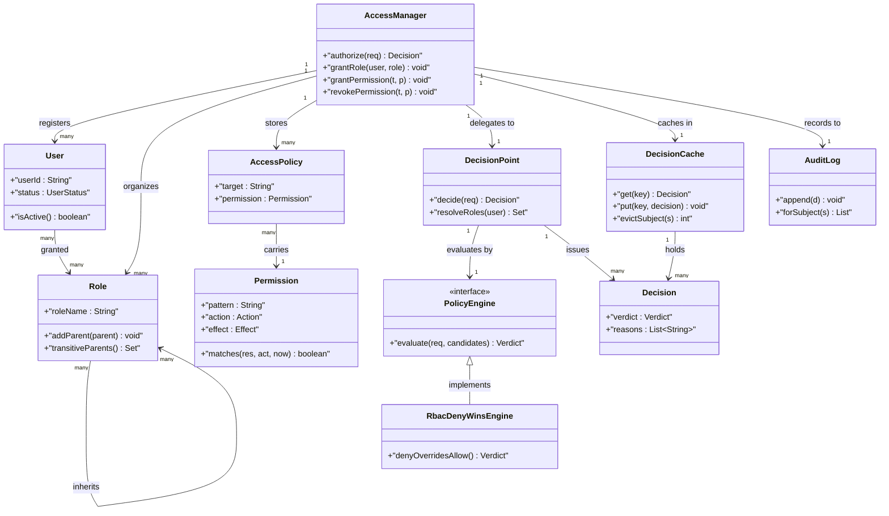
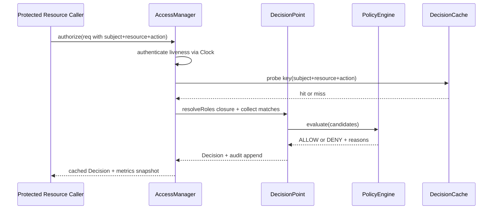

# Design Access Management System

## Blogs and websites

- [Access Management System](https://www.techprep.app/problems/access-management-system?topic=low-level-system-design)

## Medium

## Youtube

## Theory

Design an access-control service that decides who can do what on which resource. Covers user authentication and authorization via role/permission mappings enforced on every protected action.
Key entities: User, Role, Permission, Resource, AccessPolicy.
Core operations: assign roles, grant/revoke permissions, authorize requests.

This guide turns that stub into an interview-ready low-level design: you will clarify an intentionally ambiguous enterprise access-control service, model clean OOP entities around User, Role, Permission, Resource, and AccessPolicy, choose RBAC evaluation (role inheritance plus permission union plus explicit deny) behind a pluggable PolicyEngine evaluated at a central DecisionPoint, gate every protected action behind an authenticated principal plus a cached allow-or-deny verdict plus an auditable decision record, and write plain Java 17 code an interviewer can trace on a whiteboard. The emphasis is on object modeling, evaluation mechanics, and deny-correctness — not SSO protocols, OAuth token cryptography, or distributed session replication.
> Scope note: this is LLD (class design, patterns, in-process concurrency). Company-wide SSO federation, OAuth2/OIDC token issuance, LDAP directory sync, and multi-service distributed policy replication belong to HLD and are mentioned only where they constrain the object model (for example, every authorization carries subjectId plus resourceId plus action plus context so a stale role cache or revoked permission never grants access it should deny).

### Topics Covered

1. [Problem Statement](#problem-statement)
2. [Functional / Non-Functional Requirements](#functional--non-functional-requirements)
3. [Core Entities & Class Design](#core-entities--class-design)
4. [Key Design Decisions & Patterns Used](#key-design-decisions--patterns-used)
5. [Concurrency & Edge Cases](#concurrency--edge-cases)
6. [Java 17 Implementation](#java-17-implementation)
7. [Interview Questions and Answers](#interview-questions-and-answers)

---

### Problem Statement

Design an enterprise `AccessManagementSystem` that answers one question on every protected call: given `subjectId`, `resourceId`, and `action` (READ, WRITE, DELETE, SHARE, ADMIN), return ALLOW or DENY in microseconds. The service registers `User` principals with active or suspended status, organizes them into `Role` hierarchies (ADMIN inherits EDITOR inherits VIEWER), grants `Permission` triples of resource-pattern plus action plus effect (ALLOW or DENY), attaches policies to roles and directly to users, and evaluates each `AccessRequest` at a central `DecisionPoint` that unions all applicable allows, applies explicit-deny-wins, caches the verdict, and records an audit entry. No revoked role may still authorize, no deny may be outvoted by an allow, and no unauthenticated subject may reach evaluation.
A `grantRole(userId, roleName)` links a principal to a role; a `grantPermission` or `revokePermission` mutates the policy store and invalidates affected cache entries; an `authorize(subjectId, resourceId, action)` authenticates the subject, resolves direct plus inherited roles, collects matching permissions, applies deny-overrides, and returns a `Decision` with ALLOW or DENY plus reason codes. Repeated identical requests hit the decision cache without re-walking the role graph; revocations evict exactly the affected keys so correctness never waits on a TTL. An optional `PolicyEngine` seam models rule-based plus role-based evaluation so tests assert deny-wins without a real directory.

**Why this problem exists**

- Real access bugs cluster in three places: revocations that never invalidate caches so a removed role still authorizes for minutes, allow-or-deny conflicts resolved by first-match instead of deny-wins so a broad allow resurrects a narrow deny, and authorization checks scattered across controllers so one forgotten endpoint exposes every resource.
- The domain maps to two classic design ideas: role resolution is a textbook Composite plus Strategy pairing (role hierarchies compose, engines order allow-union versus deny-override evaluation), and enforcement is a textbook Proxy plus Decision family (a decision point fronts every resource with a cached, auditable verdict).
- Interviewers love it because the happy path takes 10 minutes (user plus role plus permission plus authorize) but the follow-ups (where does deny-wins live, who owns cache invalidation, how do inherited roles resolve, how do concurrent grant and revoke stay atomic) separate API recall from modeled reasoning.

**Real-life analogues**

- **AWS IAM and Google Cloud IAM**: principals, roles with inheritance, allow plus explicit-deny policies, central policy simulator and decision cache with revocation-driven invalidation.
- **GitHub repository permissions and Google Docs sharing**: direct user grants layered over team or role grants, SHARE action delegating narrower rights, audit log per decision.
- **Enterprise admin consoles (Okta, Auth0 FGA)**: suspend-or-disable principals, scoped resource patterns, per-request context (time window, IP range) constraining otherwise-valid grants.

**Clarifying questions to ask in the interview (say these out loud)**

1. Topology: one in-process decision service per interview or multi-tenant registry with isolated policy stores?
2. Principal model: human users only, or service accounts and API keys as subjects with the same role links?
3. Role model: flat roles, single-inheritance chain, or DAG with multiple parents and cycle guard?
4. Permission model: resource-id exact match, wildcard patterns, or hierarchical scopes like org slash team slash doc?
5. Conflict rule: explicit-deny-wins globally, most-specific-wins, or first-attached-policy-wins?
6. Context constraints: time windows, IP ranges, MFA-present flags evaluated per request or ignored?
7. Negative grants: standalone deny permissions, suspended users, or resource-level block lists?
8. Cache policy: decision TTL, LRU bound, revocation-driven invalidation, or no cache at all?
9. Audit depth: every decision logged, denials only, or sampled allows with full deny trace?
10. Observability: authorize latency histogram, cache hit rate, deny rate per resource, revocation fan-out counted?

**Assumptions for this guide (state these if the interviewer says "decide yourself")**

- Single `AccessManager` facade with an in-memory user plus role plus policy registry built at construction; actions are a closed `Action` enum.
- Routing default: role DAG with multiple parents, cycle rejected at link time; effective roles equal transitive closure of direct grants.
- Evaluation default: collect all permissions matching subject plus resource plus action, union ALLOWs, then apply explicit-deny-wins; suspended subject short-circuits to DENY.
- Decision TTL: cached verdicts live 5 minutes by injectable `Clock` but any grant or revoke or suspend evicts exactly the affected subject keys eagerly.
- Permissions carry `pattern`, `action`, `effect`, optional `TimeWindow`; resource ids are slash-delimited paths matched by prefix plus star wildcards.
- Amounts need no money math; permission counts stay small so evaluation is O(R times P) in roles times permissions, cached to O(1) on hit.
- In-memory only, no persistence; `authorize` is synchronous and returns a `Decision` record with verdict plus reasons.
- All public methods safe for concurrent use; one monitor guards grant plus revoke plus authorize plus cache invalidation.



The diagram shows the guarded authorization loop from authentication to audit: liveness gates every request, role closure plus permission match gates evaluation, and only cache-miss decisions compute so revocations evict precisely without waiting on TTL expiry.

---

### Functional / Non-Functional Requirements

#### Functional requirements (must-have)

1. **Principal lifecycle and authentication gate**
   - Support `registerUser`, `suspendUser`, `activateUser`; suspended subjects DENY every action without reaching policy evaluation.
   - `authorize` rejects null subject, unknown user, or null action with typed exceptions before any role walk.
2. **Exclusive decision identity**
   - One cached `Decision` per `(subjectId, resourceId, action, contextHash)`; a replay returns the stored verdict without re-walking roles.
   - Direct user grants and inherited role grants compose by union, never by silent overwrite of each other.
3. **Role DAG with inheritance and cycle guard**
   - `createRole`, `addParent(child, parent)` builds a DAG; linking that creates a cycle throws and leaves the graph unchanged.
   - Effective roles equal the transitive closure of direct grants; ADMIN closure includes every descendant permission by construction.
4. **Permission grant and revoke with pattern match**
   - `grantPermission` attaches ALLOW or DENY of an action on a resource pattern to a role or directly to a user.
   - `revokePermission` removes exactly that attachment and evicts affected cache keys; no dangling grant may still authorize.
5. **Deny-wins evaluation at the decision point**
   - `authorize` collects every matching permission, unions ALLOWs, then applies explicit DENY override as the final gate.
   - Time-windowed permissions match only when the request instant falls inside the window via the injectable clock.
6. **Decision cache dual path**
   - Eager invalidation on grant, revoke, suspend, and role-link change evicts exactly keys touching the affected subject or role members.
   - Lazy TTL expiry on `authorize` for entries older than 5 minutes; stale hits re-evaluate through the same commit path as misses.
7. **Pluggable policy engines**
   - `PolicyEngine` interface with `evaluate(request, candidatePermissions)` hook; RbacDenyWins default, MostSpecificWins and AllowOnly variants provided.
   - Engines never cache verdicts; the decision point passes candidate permissions plus subject liveness per call.
8. **Audit and metrics facade**
   - Public API `registerUser`, `grantRole`, `revokeRole`, `grantPermission`, `revokePermission`, `authorize`, `auditFor`, `metrics` returns result objects; unknown users or roles throw typed exceptions.

#### Explicitly out of scope (say this to bound the interview)

- SSO federation, OAuth2 token minting, and password or MFA credential verification (subjects arrive pre-authenticated with a status flag).
- Directory sync from LDAP or HR systems and cross-service policy replication (the registry carries enough ids for HLD to add them).
- Attribute-based constraint solvers and ML risk scoring (record the context hook so HLD can add them).

#### Non-functional requirements (LLD-flavoured)

- **Correctness over speed**: no revoked grant and no suspended subject may ever observe ALLOW; invalidation and liveness gates run before cache lookup.
- **O(R times P) evaluation by construction**: role-closure walk plus permission scan over one subject avoids full-registry scans on every authorize.
- **Extensibility**: adding a new engine means adding one `PolicyEngine` class plus registration, not rewriting `authorize`.
- **Testability**: engines, clock, role graph, and permission store are plain injectable seams drivable with fixed users and a manual clock.
- **Readability**: an interviewer can trace `authorize()` → `authenticate()` → `resolveRoles()` → `collect()` → `decide()` in under five minutes.
- **Determinism**: no randomness except injectable id sources; no wall-clock dependence except an injectable clock.
- **Observability (lightweight)**: every authorize, cache hit, deny-override, revoke-invalidation, and audit append increments a counter snapshotted as `AccessMetrics`.

| Requirement | Target / policy | Why it matters in LLD |
|---|---|---|
| No revoked access | Eager per-subject eviction before return of mutating call | Core safety invariant |
| No deny bypass | Deny-wins applied after allow-union on every miss | Security-truth follow-up |
| Frugal evaluation | Closure plus match once per miss, O(1) on hit | Where juniors fail |
| Exactly-once audit | One audit entry per authorize return path | Most-tested correctness probe |
| Atomic grant path | Role-link plus eviction under one monitor | Revoke race guard |
| Testable time | Injectable clock plus windowed permissions | No-sleep test design |

### Core Entities & Class Design

The model has four entity groups: the AccessManager facade callers touch, the User plus Role plus Permission identity value objects holding subject plus grant truth, the AccessPolicy plus PolicyEngine plus DecisionPoint evaluation pipeline holding match plus deny-wins truth, and the Decision plus DecisionCache plus AuditLog verification pipeline holding verdict plus replay plus ledger truth. Keep behaviour with the data it guards: users own liveness, roles own hierarchy, permissions own matching, policies own attachment, engines own conflict resolution, and the decision point owns atomicity.

#### Value objects and supporting types (the vocabulary of the domain)

- `Action`: closed enum READ, WRITE, DELETE, SHARE, ADMIN with `code()` — evaluation matches actions by equality so an unknown action is rejected at intake, never routed.
- `Effect`: ALLOW versus DENY enum — every permission carries exactly one effect so conflicts are explicit data, never implied by absence.
- `User`: principal with `userId`, `displayName`, `status` (ACTIVE versus SUSPENDED), plus direct role links; method `isActive()` gates authorize before evaluation.
- `Role`: named group with `roleName`, `parents` set for DAG inheritance, `permissions` attached set; method `addParent(role)` rejects cycles via reachability check.
- `Permission`: grant triple with `pattern` (slash path with star wildcard), `action`, `effect`, optional `TimeWindow`; method `matches(resourceId, action, now)` owns all match truth.
- `Resource`: protected object with `resourceId` (slash-delimited path), `ownerId`, `type`; method `path()` supplies the match input, never the verdict.
- `AccessRequest`: intake DTO — `subjectId`, `resourceId`, `action`, `context` (ip, mfaPresent, instant); validated at construction so evaluation never branches on junk.
- `Decision`: verdict record — `subjectId`, `resourceId`, `action`, `verdict` (ALLOW versus DENY), `reasons` list, `cached` flag, `decidedAtMillis`; immutable once committed.
- `TimeWindow`: start plus end millis with `contains(now)` — after-hours grants expire by clock, never by caller honesty.
- `Clock`: millis source interface — `SystemClock` for production, `ManualClock` for tests with `advance(millis)`; every window and TTL comparison goes through it.
- `AccessMetrics`: immutable snapshot — authorizes, cacheHits, allows, denies, denyOverrides, invalidations, audits, plus derived `hitRate()`.

#### Manager, policies, and engines

- `AccessManager`: owns `Map<String, User> users`, `Map<String, Role> roles`, `Map<String, Set<String>> userRoles`, `List<PolicyAttachment> store`, `DecisionCache cache`, `PolicyEngine engine`, `Clock`, `AuditLog`, counters. Methods `registerUser`, `grantRole`, `revokeRole`, `grantPermission`, `revokePermission`, `authorize`, `auditFor`, `metrics`.
- `AccessPolicy`: attachment record — `target` (userId or roleName plus kind flag), `permission`; the store is a plain list scanned per subject so revocation is a single remove.
- `PolicyEngine` (interface): `evaluate(AccessRequest req, List<Permission> candidates)` returning engine verdict plus reasons; `name()` for metrics labels.
- `RbacDenyWinsEngine`: collects matching candidates, unions ALLOWs, then applies explicit DENY override — deny anywhere denies everywhere, O(P) in candidates.
- `MostSpecificWinsEngine`: orders candidates by pattern specificity (longest literal prefix) so a narrow deny on one doc beats a broad allow on the folder; provided to make the trade-off discussable.
- `AllowOnlyEngine`: ignores DENY effects for legacy parity tests; simpler but unsafe, provided so the interview can name why deny-wins is the default.
- `DecisionPoint`: evaluation facade inside the manager — `authenticate` plus `resolveRoles` plus `collect` plus `decide` plus `cache` plus `audit` skeleton; engines plug into the decide step.

#### Verify, cache, and observability pipeline

- Verify pipeline inside `authorize`: resolve user, liveness gate, cache probe by key, role-closure resolve, permission collect with pattern plus action plus window match, engine decide, cache put, audit append.
- Revoke pipeline inside `revokePermission` plus `revokeRole` plus `suspendUser`: mutate store or status first, then evict exactly keys touching the subject or role-member set, count invalidations — never a global clear.
- Cache pipeline inside `DecisionCache`: `LinkedHashMap` LRU bounded at 10,000 entries plus per-entry decidedAt plus TTL check on read; eviction is exact-key remove, expiry is lazy on probe.
- Observer seam: `auditFor(subjectId)` replays decision records without coupling the manager to a logging framework.
- Metrics pipeline: every return path increments exactly one counter family — authorize, hit, allow, deny, override, invalidation, audit — so hit-rate math stays reproducible.



The diagram shows containment (manager to users and roles and policies), evaluation (manager to decision point to engine), enforcement (decision point to decisions), and memory (cache plus audit beside the verdict path) — the four relationships to name in the interview.

**Key relationships and cardinalities**

- AccessManager 1—0..N User objects; exactly 0..1 status per user, so suspend flips every future verdict without touching policies.
- User N—0..M Role grants; Role N—0..M parent links as a DAG, so effective roles equal the transitive closure and cycles are unrepresentable.
- Role 1—0..N Permission attachments plus User 1—0..N direct Permission attachments; evaluation unions both sets, never prefers one silently.
- AccessRequest N—1 Decision via cache key; one key maps to exactly one verdict until evicted, so replays never re-walk the graph observably.
- AccessManager 1—1 PolicyEngine at a time; engine swap needs no state migration because engines hold no verdict cache.
- Decision 1—0..N AuditLog entries by append; every authorize return path appends exactly one record, so denials are never under-logged.

**Where behaviour lives (tell the interviewer)**

- Liveness truth lives in the user: `isActive()` checked before cache probe, so suspended subjects deny even on a hot cache hit.
- Hierarchy truth lives in the role: `addParent` plus `transitiveParents` own cycle rejection and closure, so the manager never walks raw parent pointers.
- Match truth lives in the permission: `matches` owns pattern plus action plus window logic, so engines compare verdicts, never parse paths.
- Conflict truth lives in the engine: deny-override applied after allow-union on every miss, so no caller can reorder the gates.
- Identity truth lives in the cache key: `(subjectId, resourceId, action, contextHash)` probed before evaluation, so retries cannot fork verdicts.

---

### Key Design Decisions & Patterns Used

#### Decision 1 — RBAC evaluation with deny-wins at the decision point (the hook)

Every `authorize` resolves the subject closure, collects matching permissions, unions ALLOWs first, then applies explicit DENY as the final override inside the `DecisionPoint`. Say the trade-off verbatim: scanning all candidates per miss costs O(R times P) but buys a single explainable rule — any matching DENY denies — that auditors and interviewers can verify without reading policy order; without it every broad allow is a latent bypass for a narrow deny. Name the invariant: allow-union plus deny-override plus cache-put share one critical section, so a concurrent revoke cannot interleave between decide and cache and poison the entry.

#### Decision 2 — Evaluation as liveness gate plus closure plus match plus engine ordering

The `DecisionPoint` splits the problem: `authenticate` applies the liveness gate (suspended denies immediately), `resolveRoles` applies hierarchy truth (transitive closure over the DAG), `collect` applies match truth (pattern plus action plus window), then the `PolicyEngine` applies conflict truth (deny-wins, most-specific, allow-only). State the rationale verbatim — gates protect latency (cheap checks first), closure protects completeness (no inherited grant is missed), matching protects precision (windows and patterns narrow before conflict) — and a future ABAC engine is a one-class change. The `TimeWindow` plus `Clock` seam makes after-hours grants deterministic: tests advance a manual clock instead of waiting.

#### Decision 3 — Decision cache with eager per-subject eviction plus lazy TTL

`DecisionCache` is a bounded LRU (10,000 entries) keyed by subject plus resource plus action plus context hash with a 5-minute TTL by injectable clock. Every mutating call (`grantPermission`, `revokePermission`, `grantRole`, `revokeRole`, `suspendUser`, `addParent`) evicts exactly keys touching the affected subject or role-member set before returning. Say the scope sentence: correctness never waits on TTL — TTL only bounds memory and heals missed evictions, while eager eviction is the safety path. Cache puts happen only for terminal verdicts, never for input-validation failures, so junk keys never pollute the map.

#### Decision 4 — Single-monitor atomicity with engines behind the lock

`authorize`, `grantRole`, `revokeRole`, `grantPermission`, `revokePermission`, and `suspendUser` synchronize on the manager; role-link plus store-mutate plus eviction share the same monitor so a racing authorize never reads a half-linked graph or caches a pre-revoke verdict. Engines assume the lock is held — they are pure functions over candidate lists, never independently synchronized, which keeps lock ordering trivial. State explicitly that audit append happens inside the same critical section, so every cached verdict has exactly one audit record and metrics cannot double-count.

#### Decision 5 — Explicit effects, typed failures, immutable decisions

- Every permission carries an explicit `Effect`; absence of a grant means implicit DENY with reason NO_MATCHING_GRANT, never an exception, so callers branch on verdicts not catch blocks.
- Typed exceptions (`UserNotFoundException`, `RoleNotFoundException`, `RoleCycleException`, `PermissionNotFoundException`) cover wiring errors; authorization outcomes are verdicts, never throws.
- `Decision` plus `AccessMetrics` as immutable records avoid torn reads and let tests assert exact counter deltas per operation.
- Closed `Action` enum at construction keeps matching reasoning one case; unknown actions are rejected at the door, never evaluated.

#### Patterns used (say these names out loud)

| Pattern | Where | Why |
|---|---|---|
| Strategy | `PolicyEngine` family (deny-wins, most-specific, allow-only) | Conflict rule varies independently by policy |
| Composite | `Role` DAG with transitive closure | Hierarchies compose without caller recursion |
| Proxy / Policy Decision Point | `DecisionPoint` fronting every authorize | One enforcement gate no endpoint can bypass |
| Facade | `AccessManager` over users, roles, store, cache, audit | One interview-traceable API for all flows |
| Memento (light) | `Decision` cache entries plus `AccessMetrics` snapshot | Observe verdicts without corrupting live state |
| Observer (light) | Audit append plus revoke fan-out on mutation | Ledger reacts without manager coupling |
| Template Method (light) | `authorize` then `authenticate` then `resolve` then `collect` then `decide` skeleton | Shared ordering, pluggable engine hook |

**SOLID mapping (one line each for the "which principles?" follow-up)**

- Single Responsibility: users guard liveness, roles guard hierarchy, permissions guard matching, engines guard conflicts, decision point guards atomicity.
- Open/Closed: new engine or pattern matcher equals a new class, zero edits to `authorize` or `revoke`.
- Liskov: any `PolicyEngine` substitutes without breaking the authenticate-then-decide pipeline.
- Interface Segregation: small `PolicyEngine`, `Clock`, and cache contracts instead of one fat manager interface.
- Dependency Inversion: `AccessManager` depends on engine and clock interfaces; tests inject fakes plus a manual clock.

### Concurrency & Edge Cases

#### The concurrency story (the senior half of the interview)

One manager has one role graph plus one policy store plus one decision cache, so the design centers on atomic mutate-then-evict plus liveness-before-cache plus single-commit evaluation. Three mechanisms from innermost to outermost:

1. **Single-monitor exclusion on the manager.** `authorize`, `grantRole`, `revokeRole`, `grantPermission`, `revokePermission`, `suspendUser`, and `addParent` are `synchronized` on the manager; role-link plus store-mutate plus selective eviction share the same monitor so a racing authorize never reads a half-linked graph and a revoke never lands after the re-cache. Liveness check and cache probe plus closure plus collect plus engine decide share the identical critical section.
2. **Liveness-before-cache ordering.** `authorize` tests `isActive` first, then probes the cache, then resolves closure and matches permissions before touching the engine; only an active subject on a cache miss evaluates, and suspend evicts before returning so no hot entry survives its owner.
3. **Evict-exactly plus audit-inside-the-lock.** Mutations snapshot the affected subject set (direct user, or role members for role-targeted changes) under lock and remove only those keys; audit append happens inside the same lock so every returned verdict owns exactly one record and a slow role walk never serializes the next authorize beyond the monitor.



The diagram shows the liveness-then-cache ordering in time: both authentication and cache probes complete before any role-closure walk or engine evaluation, and audit plus metrics increment after every return path so deny rate is never skipped.

**Why not `ConcurrentHashMap` alone?** A concurrent map serializes key access but does not express atomic mutate-plus-evict linkage, ordered liveness-before-cache gates, or coherent exactly-once evaluate-versus-revoke commits. A revoke could evict while an authorize re-caches the pre-revoke verdict between the two map calls, and a `grantRole` linking a user plus warming that user key is a multi-key write that needs the same exclusion as `authorize`. Manager-level exclusion plus engine-behind-lock gives both atomicity and evaluability: exclusion stops races, the engine stops bypasses.

**Post-access evaluation rule (say this verbatim): authenticate, then probe, then resolve, then collect, then decide, then ledger.** After every authorize the manager confirms liveness first, tests cache freshness second, resolves the transitive role closure third, collects pattern-matched permissions fourth, applies deny-wins fifth, and only then caches plus audits. Suspended plus expired plus denied is a denial with reasons, never an allow.

#### Edge cases table (pick 4–5 to recite, keep the rest as backup)

| # | Edge case | Handling |
|---|---|---|
| 1 | Two threads `grantRole` and `authorize` racing on the same user | Serialized on the monitor; authorize sees pre- or post-grant graph atomically, never a half-linked parent set |
| 2 | `revokePermission` racing a cached ALLOW for the same subject | Revoke mutates the store then evicts subject keys under the same lock; next authorize re-evaluates to DENY |
| 3 | Role parent link that would create a cycle (A parent of B, B parent of A) | `addParent` reachability check throws `RoleCycleException`; graph unchanged, no partial edge left behind |
| 4 | Suspended user hitting a hot cached ALLOW | Liveness gate runs before cache probe, so suspend denies even without eviction; eviction still removes the entry |
| 5 | Same permission granted twice to one role | Store dedupes by target plus permission equality; second grant is a no-op returning existing attachment |
| 6 | Revoking a permission that was never granted | Raises `PermissionNotFoundException` with target name; cache untouched, invalidation counter not incremented |
| 7 | Broad ALLOW on folder versus narrow DENY on one document | Deny-wins engine denies the document but allows siblings; most-specific engine agrees and names the reason |
| 8 | Time-windowed grant evaluated outside its window | `matches` returns false via injectable clock; verdict is implicit DENY with reason WINDOW_EXPIRED |
| 9 | Wildcard pattern `docs slash star` versus exact `docs slash secret` | Prefix-plus-star matcher treats star as subtree; exact resource matches both, sibling paths match neither |
| 10 | Direct user DENY racing an inherited role ALLOW | Both sets union before conflict, so DENY wins regardless of arrival order; reasons list both sources |
| 11 | Unknown user or unknown role on grant path | Raises `UserNotFoundException` or `RoleNotFoundException`; no store entry and no eviction occur |
| 12 | Cache TTL expiry exactly during authorize burst | Lazy expiry on probe re-evaluates through the shared decide path; concurrent bursts serialize on the monitor |
| 13 | Context-sensitive grant (MFA flag) replayed without MFA | Context hash is part of the cache key, so the no-MFA request misses and re-evaluates to DENY separately |
| 14 | Clock jumps forward (mass window expiry) | Lazy path denies per request on next probe; no sweep needed because windows evaluate live on every miss |
| 15 | Null request or null action input | Rejected with `IllegalArgumentException`; nulls never enter the store or cache so absent-versus-null stays unambiguous |

---

### Java 17 Implementation

All classes below are plain Java 17 (no frameworks, enums for actions and effects, interfaces for engine and clock seams). Roles own DAG closure, permissions own matching, and `AccessManager` synchronizes the authorize path. Each block is followed by its explanation and the pattern it demonstrates.

#### 1. Actions, users, roles, and permissions with DAG guard

The foundation is a closed action enum plus one hierarchy guard per role with a reachability check, plus pattern matching owned by permissions.

```java
import java.util.*;

// Closed action set: matching is equality, never string parsing.
enum Action { READ, WRITE, DELETE, SHARE, ADMIN }

enum Effect { ALLOW, DENY }

enum Verdict { ALLOW, DENY }

enum UserStatus { ACTIVE, SUSPENDED }

// Principal: liveness gate lives here before evaluation.
final class User {
    final String userId;
    final String displayName;
    UserStatus status = UserStatus.ACTIVE;
    User(String userId, String displayName) {
        this.userId = Objects.requireNonNull(userId);
        this.displayName = displayName;
    }
    boolean isActive() { return status == UserStatus.ACTIVE; }
}

// Named group: hierarchy truth lives here, cycle rejected at link time.
final class Role {
    final String roleName;
    final Set<Role> parents = new HashSet<>();
    Role(String roleName) { this.roleName = Objects.requireNonNull(roleName); }
    void addParent(Role parent) {
        Objects.requireNonNull(parent);
        if (parent == this || parent.reaches(this))
            throw new RoleCycleException(roleName + " <- " + parent.roleName);
        parents.add(parent);
    }
    boolean reaches(Role target) { // DFS over parents
        if (parents.contains(target)) return true;
        for (var p : parents) if (p.reaches(target)) return true;
        return false;
    }
    Set<Role> transitiveParents() {
        var out = new LinkedHashSet<Role>();
        var stack = new ArrayDeque<>(parents);
        while (!stack.isEmpty()) {
            var r = stack.pop();
            if (out.add(r)) stack.addAll(r.parents);
        }
        return out;
    }
}

// Time window: after-hours grants expire by clock, never by honesty.
final class TimeWindow {
    final long startMillis;
    final long endMillis;
    TimeWindow(long startMillis, long endMillis) {
        if (endMillis < startMillis) throw new IllegalArgumentException("window inverted");
        this.startMillis = startMillis; this.endMillis = endMillis;
    }
    boolean contains(long now) { return now >= startMillis && now <= endMillis; }
}

// Grant triple: pattern plus action plus effect owns all match truth.
final class Permission {
    final String pattern;      // e.g. "docs/*" or "docs/secret"
    final Action action;
    final Effect effect;
    final TimeWindow window;   // null means always active
    Permission(String pattern, Action action, Effect effect, TimeWindow window) {
        this.pattern = Objects.requireNonNull(pattern);
        this.action = Objects.requireNonNull(action);
        this.effect = Objects.requireNonNull(effect);
        this.window = window;
    }
    boolean matches(String resourceId, Action act, long now) {
        if (act != action) return false;
        if (window != null && !window.contains(now)) return false;
        if (pattern.endsWith("/*")) {
            String prefix = pattern.substring(0, pattern.length() - 1);
            return resourceId.startsWith(prefix);
        }
        return resourceId.equals(pattern);
    }
    int specificity() { // longer literal prefix wins in most-specific engine
        return pattern.endsWith("/*") ? pattern.length() - 2 : pattern.length() + 1000;
    }
    @Override public boolean equals(Object o) {
        if (!(o instanceof Permission p)) return false;
        return pattern.equals(p.pattern) && action == p.action && effect == p.effect
                && Objects.equals(window == null ? null : window.startMillis,
                                   p.window == null ? null : p.window.startMillis);
    }
    @Override public int hashCode() { return Objects.hash(pattern, action, effect); }
}

// Intake DTO: validated at construction so evaluation never branches on junk.
final class AccessRequest {
    final String subjectId;
    final String resourceId;
    final Action action;
    final boolean mfaPresent;
    AccessRequest(String subjectId, String resourceId, Action action, boolean mfaPresent) {
        this.subjectId = Objects.requireNonNull(subjectId);
        this.resourceId = Objects.requireNonNull(resourceId);
        this.action = Objects.requireNonNull(action);
        this.mfaPresent = mfaPresent;
    }
    String cacheKey() { return subjectId + "|" + resourceId + "|" + action + "|" + mfaPresent; }
}

class RoleCycleException extends RuntimeException {
    RoleCycleException(String m) { super(m); }
}
class UserNotFoundException extends RuntimeException {
    UserNotFoundException(String m) { super(m); }
}
class RoleNotFoundException extends RuntimeException {
    RoleNotFoundException(String m) { super(m); }
}
class PermissionNotFoundException extends RuntimeException {
    PermissionNotFoundException(String m) { super(m); }
}
```

Explanation: `Role` as a guarded DAG node is the hierarchy gatekeeper — every link validates reachability first, so cycles are unrepresentable and closure needs no visited-set patch at evaluation time. `Permission` as a self-matching triple keeps path parsing out of the manager, so wildcard plus window logic is tested in one place. This block demonstrates the Composite pattern: role hierarchies compose transitively without caller recursion.

#### 2. Engines, cache, audit, and clock seams

Engines resolve conflicts over candidate lists and the cache holds verdicts; both are exercised through injectable clock and audit seams.

```java
import java.util.*;

// Millis source: production uses wall clock, tests advance manually.
interface Clock { long now(); }
final class SystemClock implements Clock {
    public long now() { return System.currentTimeMillis(); }
}
final class ManualClock implements Clock {
    private long t;
    ManualClock(long start) { t = start; }
    public long now() { return t; }
    public void advance(long dMillis) { t += dMillis; }
}

// Strategy: conflict rule varies by policy; manager calls it under its own lock.
interface PolicyEngine {
    Verdict evaluate(AccessRequest req, List<Permission> candidates, List<String> reasons);
    String name();
}

// Deny anywhere denies everywhere: default safe choice.
final class RbacDenyWinsEngine implements PolicyEngine {
    public Verdict evaluate(AccessRequest req, List<Permission> c, List<String> reasons) {
        boolean allow = false;
        for (var p : c) {
            if (p.effect == Effect.DENY) { reasons.add("DENY_OVERRIDE:" + p.pattern); }
            else { allow = true; reasons.add("ALLOW:" + p.pattern); }
        }
        for (var p : c) if (p.effect == Effect.DENY) return Verdict.DENY;
        if (allow) return Verdict.ALLOW;
        reasons.add("NO_MATCHING_GRANT");
        return Verdict.DENY;
    }
    public String name() { return "RBAC_DENY_WINS"; }
}

// Narrowest match decides: kept to make the specificity trade-off visible.
final class MostSpecificWinsEngine implements PolicyEngine {
    public Verdict evaluate(AccessRequest req, List<Permission> c, List<String> reasons) {
        if (c.isEmpty()) { reasons.add("NO_MATCHING_GRANT"); return Verdict.DENY; }
        var best = c.stream().max(Comparator.comparingInt(Permission::specificity)).orElseThrow();
        reasons.add(best.effect + ":" + best.pattern);
        return best.effect == Effect.ALLOW ? Verdict.ALLOW : Verdict.DENY;
    }
    public String name() { return "MOST_SPECIFIC_WINS"; }
}

// Ignores DENY effects: legacy parity only, unsafe by construction.
final class AllowOnlyEngine implements PolicyEngine {
    public Verdict evaluate(AccessRequest req, List<Permission> c, List<String> reasons) {
        for (var p : c) if (p.effect == Effect.ALLOW) {
            reasons.add("ALLOW:" + p.pattern); return Verdict.ALLOW;
        }
        reasons.add("NO_MATCHING_GRANT"); return Verdict.DENY;
    }
    public String name() { return "ALLOW_ONLY"; }
}

// Verdict record: immutable once committed, safe to share from cache.
record Decision(String subjectId, String resourceId, Action action,
                Verdict verdict, List<String> reasons, boolean cached, long decidedAtMillis) {}

// Bounded LRU with TTL: eviction is exact-key, expiry is lazy on probe.
final class DecisionCache {
    private final LinkedHashMap<String, Decision> map;
    private final int capacity;
    private final long ttlMillis;
    private final Clock clock;
    DecisionCache(int capacity, long ttlMillis, Clock clock) {
        this.capacity = capacity; this.ttlMillis = ttlMillis; this.clock = clock;
        this.map = new LinkedHashMap<>(capacity, 0.75f, true) {
            @Override protected boolean removeEldestEntry(Map.Entry<String, Decision> e) {
                return size() > DecisionCache.this.capacity;
            }
        };
    }
    Decision get(String key) {
        var d = map.get(key);
        if (d == null) return null;
        if (clock.now() - d.decidedAtMillis() >= ttlMillis) { map.remove(key); return null; }
        return d;
    }
    void put(String key, Decision d) { map.put(key, d); }
    int evictSubject(String subjectId) {
        int n = 0;
        for (var k : new ArrayList<>(map.keySet()))
            if (k.startsWith(subjectId + "|")) { map.remove(k); n++; }
        return n;
    }
}

// Audit ledger: every authorize appends exactly one record.
final class AuditLog {
    private final List<Decision> entries = new ArrayList<>();
    void append(Decision d) { entries.add(d); }
    List<Decision> forSubject(String subjectId) {
        var out = new ArrayList<Decision>();
        for (var d : entries) if (d.subjectId().equals(subjectId)) out.add(d);
        return out;
    }
    int size() { return entries.size(); }
}
```

Explanation: `PolicyEngine` as an interface is the conflict-rule bulkhead — deny-wins, most-specific, and allow-only normalize competing grants so the manager never branches on effect order. `DecisionCache` keeps hot verdicts exact-keyed with lazy TTL, so revocation evicts precisely and time only bounds memory. This block demonstrates the Strategy pattern: each engine varies conflict resolution independently behind `evaluate`.

#### 3. AccessManager facade with atomic authorize plus demo

`AccessManager` runs the authenticate, probe, resolve, collect, and ledger pipeline with single-monitor atomicity; this is the full decision-point gateway to trace on the whiteboard.

```java
import java.util.*;

record PolicyAttachment(boolean roleTarget, String target, Permission permission) {}
record AccessMetrics(long authorizes, long cacheHits, long allows, long denies,
                     long denyOverrides, long invalidations, long audits) {
    double hitRate() { return authorizes == 0 ? 0.0 : (double) cacheHits / authorizes; }
}

public class AccessManager {
    private final Map<String, User> users = new HashMap<>();
    private final Map<String, Role> roles = new HashMap<>();
    private final Map<String, Set<String>> userRoles = new HashMap<>();
    private final List<PolicyAttachment> store = new ArrayList<>();
    private final DecisionCache cache;
    private final AuditLog audit = new AuditLog();
    private final PolicyEngine engine;
    private final Clock clock;
    private long authorizes, cacheHits, allows, denies, denyOverrides, invalidations, audits;

    public AccessManager(PolicyEngine engine, Clock clock, long ttlMillis) {
        this.engine = Objects.requireNonNull(engine);
        this.clock = Objects.requireNonNull(clock);
        this.cache = new DecisionCache(10_000, ttlMillis, clock);
    }
    public void registerUser(String userId, String name) {
        users.put(userId, new User(userId, name));
        userRoles.putIfAbsent(userId, new HashSet<>());
    }
    public void createRole(String roleName) { roles.putIfAbsent(roleName, new Role(roleName)); }
    public synchronized void addParent(String child, String parent) {
        var c = roles.get(child); var p = roles.get(parent);
        if (c == null) throw new RoleNotFoundException(child);
        if (p == null) throw new RoleNotFoundException(parent);
        c.addParent(p);
        invalidations += evictRoleMembers(child); // hierarchy changed: evict members
    }
    public synchronized void grantRole(String userId, String roleName) {
        requireUser(userId); requireRole(roleName);
        userRoles.get(userId).add(roleName);
        invalidations += cache.evictSubject(userId);
    }
    public synchronized void revokeRole(String userId, String roleName) {
        requireUser(userId); requireRole(roleName);
        userRoles.get(userId).remove(roleName);
        invalidations += cache.evictSubject(userId);
    }
    public synchronized void grantPermission(boolean roleTarget, String target, Permission p) {
        if (roleTarget) requireRole(target); else requireUser(target);
        if (!store.contains(new PolicyAttachment(roleTarget, target, p)))
            store.add(new PolicyAttachment(roleTarget, target, p));
        invalidations += evictFor(target, roleTarget);
    }
    public synchronized void revokePermission(boolean roleTarget, String target, Permission p) {
        boolean removed = store.remove(new PolicyAttachment(roleTarget, target, p));
        if (!removed) throw new PermissionNotFoundException(target);
        invalidations += evictFor(target, roleTarget);
    }
    public synchronized void suspendUser(String userId) {
        requireUser(userId);
        users.get(userId).status = UserStatus.SUSPENDED;
        invalidations += cache.evictSubject(userId);
    }
    // Central decision point: liveness, probe, closure, collect, decide, ledger.
    public synchronized Decision authorize(AccessRequest req) {
        authorizes++;
        var u = users.get(req.subjectId);
        if (u == null) throw new UserNotFoundException(req.subjectId);
        if (!u.isActive()) { // liveness before cache: suspend denies on hot entries
            denies++;
            var d = new Decision(req.subjectId, req.resourceId, req.action,
                    Verdict.DENY, List.of("SUSPENDED"), false, clock.now());
            audit.append(d); audits++;
            return d;
        }
        var hit = cache.get(req.cacheKey());
        if (hit != null) {
            cacheHits++;
            var d = new Decision(hit.subjectId(), hit.resourceId(), hit.action(),
                    hit.verdict(), hit.reasons(), true, hit.decidedAtMillis());
            audit.append(d); audits++;
            countVerdict(d);
            return d;
        }
        var effective = effectiveRoles(req.subjectId);
        var candidates = new ArrayList<Permission>();
        long now = clock.now();
        for (var a : store) {
            boolean mine = !a.roleTarget() && a.target().equals(req.subjectId);
            boolean viaRole = a.roleTarget() && effective.contains(a.target());
            if ((mine || viaRole) && a.permission().matches(req.resourceId, req.action, now))
                candidates.add(a.permission());
        }
        var reasons = new ArrayList<String>();
        var v = engine.evaluate(req, candidates, reasons);
        if (reasons.stream().anyMatch(r -> r.startsWith("DENY_OVERRIDE"))) denyOverrides++;
        var d = new Decision(req.subjectId, req.resourceId, req.action,
                v, List.copyOf(reasons), false, clock.now());
        cache.put(req.cacheKey(), d);
        audit.append(d); audits++;
        countVerdict(d);
        return d;
    }
    public synchronized List<Decision> auditFor(String userId) { return audit.forSubject(userId); }
    public synchronized AccessMetrics metrics() {
        return new AccessMetrics(authorizes, cacheHits, allows, denies,
                denyOverrides, invalidations, audits);
    }
    private Set<String> effectiveRoles(String userId) {
        var out = new HashSet<String>();
        var direct = userRoles.getOrDefault(userId, Set.of());
        out.addAll(direct);
        for (var r : direct) {
            var role = roles.get(r);
            if (role != null) for (var p : role.transitiveParents()) out.add(p.roleName);
        }
        return out;
    }
    private int evictFor(String target, boolean roleTarget) {
        if (!roleTarget) return cache.evictSubject(target);
        int n = 0;
        for (var e : userRoles.entrySet())
            if (effectiveRoles(e.getKey()).contains(target)) n += cache.evictSubject(e.getKey());
        return n;
    }
    private int evictRoleMembers(String roleName) {
        int n = 0;
        for (var u : userRoles.keySet())
            if (effectiveRoles(u).contains(roleName)) n += cache.evictSubject(u);
        return n;
    }
    private void countVerdict(Decision d) {
        if (d.verdict() == Verdict.ALLOW) allows++; else denies++;
    }
    private void requireUser(String u) { if (!users.containsKey(u)) throw new UserNotFoundException(u); }
    private void requireRole(String r) { if (!roles.containsKey(r)) throw new RoleNotFoundException(r); }
}

// Demo: role inheritance plus deny-wins plus revoke eviction plus suspend gate.
class AccessDemo {
    public static void main(String[] args) {
        var clock = new ManualClock(1_000);
        var mgr = new AccessManager(new RbacDenyWinsEngine(), clock, 300_000);
        mgr.registerUser("u1", "Ada");
        mgr.createRole("viewer"); mgr.createRole("editor"); mgr.createRole("admin");
        mgr.addParent("editor", "viewer"); // editor inherits viewer
        mgr.addParent("admin", "editor");  // admin inherits editor
        mgr.grantPermission(true, "viewer", new Permission("docs/*", Action.READ, Effect.ALLOW, null));
        mgr.grantPermission(true, "editor", new Permission("docs/*", Action.WRITE, Effect.ALLOW, null));
        mgr.grantPermission(true, "viewer", new Permission("docs/secret", Action.READ, Effect.DENY, null));
        mgr.grantRole("u1", "editor"); // effective: editor + viewer
        System.out.println(mgr.authorize(new AccessRequest("u1", "docs/plan", Action.READ, false)).verdict()); // ALLOW
        System.out.println(mgr.authorize(new AccessRequest("u1", "docs/secret", Action.READ, false)).verdict()); // DENY
        System.out.println(mgr.authorize(new AccessRequest("u1", "docs/plan", Action.READ, false)).cached()); // true hit
        mgr.revokePermission(true, "editor", new Permission("docs/*", Action.WRITE, Effect.ALLOW, null));
        System.out.println(mgr.authorize(new AccessRequest("u1", "docs/plan", Action.WRITE, false)).verdict()); // DENY
        mgr.suspendUser("u1");
        System.out.println(mgr.authorize(new AccessRequest("u1", "docs/plan", Action.READ, false)).verdict()); // DENY
        System.out.println(mgr.metrics()); // authorizes, hits, denies, invalidations visible
    }
}
```

Explanation: `authorize` is the evaluation half of the interview in one method — liveness gate, cache probe, closure resolve, permission collect, engine decide, then cache-plus-audit commit under one monitor. `grantPermission` plus `revokePermission` plus `suspendUser` are the safety half — mutate first, evict exactly, count invalidations before returning. The demo wires inheritance, deny-wins, cache hit, revoke eviction, and suspend gating, which is exactly the live-coding arc to reproduce: grant, authorize, deny, revoke print. This block demonstrates Facade plus Template Method: fixed pipeline skeleton, pluggable engine hook.

**How to extend (name these without building them)**

- New ABAC matcher: add attribute predicates beside pattern plus window, with an engine that conjoins them; `AccessManager` pipeline and cache logic are untouched.
- Delegated SHARE grants: add a delegation object carrying granter plus expiry beside direct grants with a depth cap.
- Hierarchical scopes and owner-override: add org slash team prefix scopes plus an owner-ALLOW fast path reachable only from the resource owner.

---

### Interview Questions and Answers

1. **Beginner: walk me through the classes in your access management system.**
   Answer: `AccessManager` facade over `User` principals with ACTIVE versus SUSPENDED status plus `Role` DAG nodes with `transitiveParents`, `Permission` triples of pattern plus action plus effect with `matches`, `AccessPolicy` attachments to users or roles, `DecisionPoint` pipeline inside authorize with `PolicyEngine` ordering plus `RbacDenyWinsEngine` and `MostSpecificWinsEngine`, `Decision` verdict records, `DecisionCache` LRU with TTL, `Clock` time seam, `AuditLog` ledger, immutable `AccessMetrics` snapshot, and typed exceptions for missing users, missing roles, cycles, and missing permissions.

2. **Beginner: where does authorization live and what does a replay return?**
   Answer: a `(subjectId, resourceId, action, contextHash)` to Decision index probed after the liveness gate but before role resolution. A replay returns the stored verdict flagged cached with zero graph walk, so double-clicks and retried calls fork at most one evaluation and never count as second decisions.

3. **Beginner: what is the difference between a role grant and a direct user grant?**
   Answer: role grants compose through transitive closure so one link confers every inherited permission, while direct grants attach to exactly one subject. Evaluation unions both sets before conflict resolution, so neither silently overwrites the other and revoking one never disturbs the other.

4. **Junior: how do you resolve inherited roles without cycles or missed grants?**
   Answer: roles form a DAG guarded at link time by reachability check, and `transitiveParents` walks parents iteratively into an ordered set. Effective roles equal direct grants plus the full closure, so ADMIN closure includes every descendant permission and a would-be cycle throws `RoleCycleException` leaving the graph unchanged.

5. **Junior: how do you decide when an ALLOW and a DENY both match?**
   Answer: the deny-wins engine unions ALLOWs first then applies explicit DENY override as the final gate, recording both sources in reasons. A broad folder allow plus a narrow document deny therefore allows siblings but denies that document, and absence of any match is implicit DENY with reason NO_MATCHING_GRANT rather than an exception.

6. **Junior: why does authorize check liveness before the cache?**
   Answer: cache-then-liveness would serve a stale ALLOW to a just-suspended subject until eviction lands. Liveness-first under one monitor keeps every suspend observably deny from the next call, with eager per-subject eviction as the memory path and the gate as the safety path. Unknown subjects fall out naturally: lookup misses and the manager throws `UserNotFoundException`.

7. **Mid: how do concurrent grants, revokes, and authorizes stay correct?**
   Answer: all state paths synchronize on the manager so role-link, store-mutate, selective eviction, cache probe, closure resolve, engine decide, and audit append are atomic. Engines assume the lock is held and carry no locks of their own, which removes lock-ordering risk. Revoke results commit through the same eviction helper as suspend so no path can re-cache a pre-revoke verdict.

8. **Mid: what happens when a permission is revoked while its verdict is cached?**
   Answer: the manager removes the store entry then evicts exactly keys touching the affected subject or role members before returning, incrementing the invalidation counter. The next authorize for that subject misses and re-evaluates to the post-revoke verdict, while unrelated subjects keep their hot entries so a single revoke never causes a global cold start.

9. **Senior: how do you stop a revoked role from still authorizing via inheritance?**
   Answer: `revokeRole` removes the direct link and evicts that subject, while `revokePermission` on a parent role fans eviction out to every subject whose effective closure contains the role. Closure is recomputed live on every miss rather than materialized, so no stale member list can resurrect a removed grant and order of arrival cannot flip the verdict.

10. **Senior: how do you test roles, deny-wins, and races without sleeping or flakiness?**
    Answer: inject `ManualClock` and assert windowed grants flip from ALLOW to DENY after advancing past the window, assert broad-allow plus narrow-deny resolves to DENY with reasons, advance past decision TTL and assert re-evaluation counts a miss, and run a ten-thread same-subject authorize storm plus concurrent revoke asserting exactly one audit record per call and post-revoke DENY. Metrics snapshots assert exact authorize, hit, deny-override, invalidation, and audit deltas per operation.
