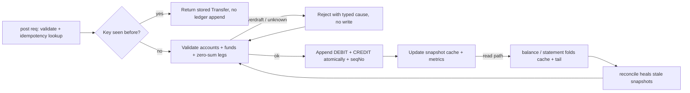
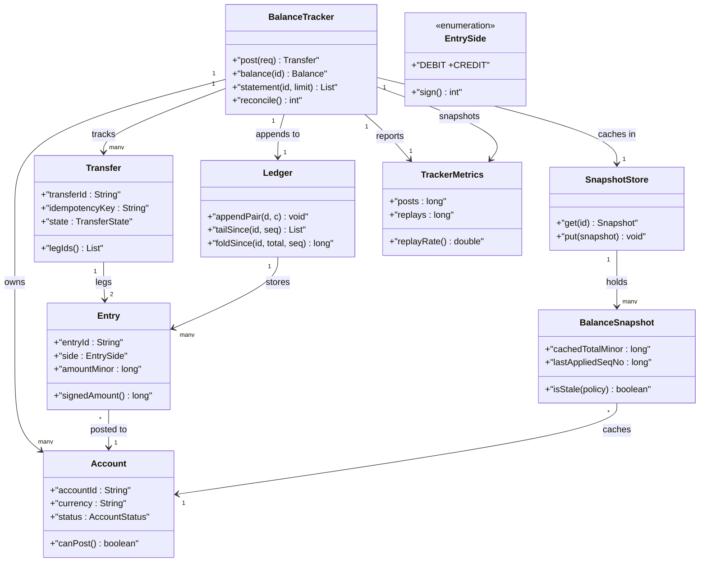
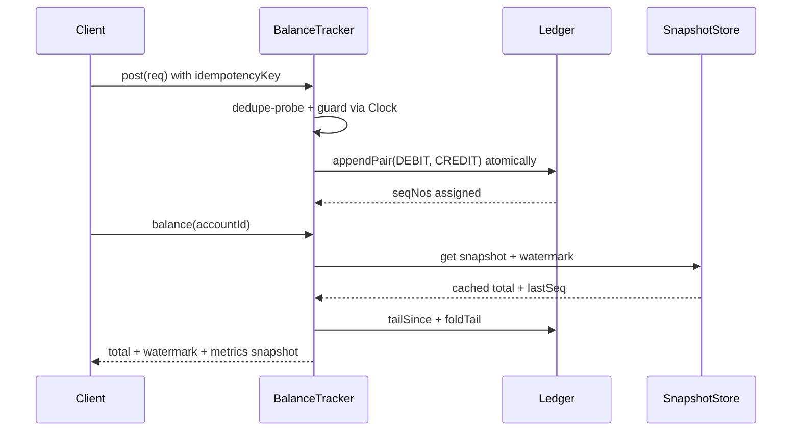

# Design Account balance Tracker

## Blogs and websites

- [Account Balance Tracker](https://www.techprep.app/problems/account-balance-tracker/description?topic=low-level-system-design)

## Medium

## Youtube

## Theory

Design a service that tracks balances across user accounts as credits and debits flow in. Must support posting transactions and reading the current balance plus history per account.
Key entities: Account, Transaction (credit/debit), BalanceSnapshot.
Core operations: post transaction, get balance, list statement.

This guide turns that stub into an interview-ready low-level design: you will clarify an intentionally ambiguous balance tracker, model clean OOP entities around Account, Entry, Ledger, and Transfer, enforce double-entry balance on every write behind a never-negative invariant, gate every posting behind an idempotency key plus a strict transfer state machine plus a reconcile pass, and write plain Java 17 code an interviewer can trace on a whiteboard. The emphasis is on object modeling, ledger mechanics, and money-correctness — not payment-network settlement, interest accrual engines, or distributed consensus.

> Scope note: this is LLD (class design, patterns, in-process concurrency). Multi-currency FX settlement, bank-network clearing, interest and overdraft product rules, and sharded ledger storage belong to HLD and are mentioned only where they constrain the object model (for example, every Entry carries accountId plus transferId plus idempotencyKey plus sequenceNo so a retry or late read never double-applies or misses money).

### Topics Covered

1. [Problem Statement](#problem-statement)
2. [Functional / Non-Functional Requirements](#functional--non-functional-requirements)
3. [Core Entities & Class Design](#core-entities--class-design)
4. [Key Design Decisions & Patterns Used](#key-design-decisions--patterns-used)
5. [Concurrency & Edge Cases](#concurrency--edge-cases)
6. [Java 17 Implementation](#java-17-implementation)
7. [Interview Questions and Answers](#interview-questions-and-answers)

---

### Problem Statement

Design a `BalanceTracker` that owns a set of `Account`s and records every movement as a double-entry `Transfer` of two `Entry` legs (one DEBIT, one CREDIT) that must sum to zero. Callers post with `fromAccountId`, `toAccountId`, `amountMinor`, `currency`, and a client-supplied `idempotencyKey`. The tracker validates accounts and funds, appends both legs atomically under one `transferId` with per-account sequence numbers, and serves `balance(accountId)`, `statement(accountId)`, and `transfer(transferId)` reads. No retry may double-apply, no committed balance may go negative, and no partial leg may ever be visible.

A `post(request)` returns the same `Transfer` for the same idempotency key without appending new legs; a `balance(accountId)` folds the ledger or serves a cached snapshot plus tail; a `statement(accountId, limit)` returns newest-first entries with running balances; a `reconcile()` pass re-folds legs and heals stale snapshots. Duplicate submits behave as replays: same key returns the stored result and never counts as a second movement for metrics purity. An optional `Clock` plus `SnapshotPolicy` seam models snapshot cadence so tests assert caching without real timers.

**Why this problem exists**

- Real ledger bugs cluster in three places: single-entry updates that credit one account without debiting the other so books drift, read-modify-write balances that admit overdrafts under concurrency because no invariant guards the commit, and retries that double-post because no idempotency key guards the append path.
- The domain maps to two classic design ideas: money movement is a textbook Ledger plus Double-Entry pairing (every transfer is two balanced legs, balance is always a fold), and safe posting is a textbook State plus Idempotency family (transfer lifecycle with exactly-once append and never-negative gate).
- Interviewers love it because the happy path takes 10 minutes (account plus two legs plus balance fold) but the follow-ups (where does balance truth live, who owns the invariant, how do concurrent posts stay atomic, how do snapshots stay consistent) separate API recall from modeled reasoning.

**Real-life analogues**

- **Bank core ledger and wallet ledger (Paytm, PhonePe balances)**: double-entry legs per transfer, statement reads, snapshot-cached balances plus reconcile jobs.
- **Splitwise and marketplace credits**: bilateral movements with idempotent retries and per-account running totals.
- **Brokerage cash ledger and game-coin wallets**: never-negative enforcement with atomic debit-plus-credit commits and auditable entry history.

**Clarifying questions to ask in the interview (say these out loud)**

1. Topology: one tracker instance per interview or multi-tenant registry? Pre-create accounts or dynamic open/close?
2. Entry model: fixed DEBIT/CREDIT legs or open-ended adjustment types with sign conventions?
3. Transfer scope: two-party only, or multi-leg journals with N debits plus N credits per transfer?
4. Overdraft policy: hard never-negative on every account, per-account limits, or one suspense account allowed negative?
5. Idempotency scope: key per sender, per pair, or global? TTL on keys — 24h, 7 days, or forever?
6. Balance truth: live fold on every read, snapshot-plus-tail cache, or materialized column updated on write?
7. Snapshot cadence: lazy on read staleness, eager sweeper thread, or explicit `snapshot()` the interviewer calls?
8. Concurrency: single monitor, per-account striped locks, or optimistic sequence compare-and-swap?
9. Amount handling: minor units (paise/cents) as long, currency validation, multi-currency conversion in scope?
10. Observability: post success rate, replay rate, overdraft rejections, snapshot age, reconcile-healed count?

**Assumptions for this guide (state these if the interviewer says "decide yourself")**

- Single `BalanceTracker` facade with an in-memory account plus ledger registry built at construction; entry sides are a closed `EntrySide` enum.
- Double-entry default: every transfer appends exactly two legs (DEBIT source, CREDIT destination) with equal `amountMinor`; sums must equal zero or the post is rejected.
- Idempotency key scoped per sender: `(fromAccountId, idempotencyKey)` maps to exactly one transferId; keys retained for the process lifetime, TTL 24h conceptually.
- Snapshot TTL: cached balance older than 100 appended legs or 15 minutes is stale and eligible for background refresh; injectable `Clock` so tests advance time without sleeping.
- Amounts in minor units (`long`), single currency per transfer, no FX conversion; zero or negative amounts rejected at intake.
- In-memory only, no persistence; `reconcile` re-folds legs synchronously through the same commit path.
- All public methods safe for concurrent use; one monitor guards post plus snapshot plus reconcile.



The diagram shows the guarded money loop from post to read: idempotency gates every append, the never-negative plus zero-sum gate runs before any write, and only atomic dual-leg commits become visible so replays and races never move money twice.

---

### Functional / Non-Functional Requirements

#### Functional requirements (must-have)

1. **Account lifecycle with validated intake**
   - Support `openAccount(ownerId, currency, initialBalanceMinor)` and `closeAccount(accountId)` for empty zero-activity-close semantics.
   - `post(request)` validates non-null sender plus receiver, distinct accounts, known ids, open status, single currency match, and positive amount with typed exceptions.
2. **Exclusive transfer identity**
   - One live `Transfer` per `(fromAccountId, idempotencyKey)`; a replay never appends new legs or moves funds twice.
   - Same key with different amount or receiver is a caller conflict surfaced as `IdempotencyConflictException`, never a silent merge.
3. **Atomic double-entry append**
   - Every transfer creates exactly two `Entry` legs sharing one `transferId`: DEBIT on source, CREDIT on destination, equal amounts summing to zero.
   - Both legs share one sequence tick and per-account sequence numbers; readers never observe a single-leg partial transfer.
4. **Never-negative invariant gate**
   - `post` checks sender available balance minus amount stays at or above zero (or its configured floor) inside the same critical section as the append.
   - Failed gate raises `InsufficientFundsException` with no ledger write and a rejected-post metric increment.
5. **Balance and statement reads**
   - `balance(accountId)` returns current minor-units total with currency and sequence watermark; unknown accounts throw `AccountNotFoundException`.
   - `statement(accountId, limit)` returns newest-first entries each with resulting running balance for audit display.
6. **Snapshot-plus-tail caching**
   - `BalanceSnapshot` per account holds cached total plus last-applied sequence plus timestamp; reads fold only the tail since the snapshot.
   - Stale snapshots (leg-count or clock threshold) refresh on read or via explicit `snapshot(accountId)` without blocking writers longer than a copy.
7. **Reconciliation dual path**
   - Lazy healing on `balance` for stale snapshots plus eager `reconcile()` that re-folds every account and converges snapshot truth.
   - Reconcile uses the same fold helper as reads so metrics cannot double-count a healed snapshot twice.
8. **Status and metrics facade**
   - Public API `openAccount`, `post`, `balance`, `statement`, `transfer`, `snapshot`, `reconcile`, `metrics` returns result objects; unknown transferIds or accounts throw typed exceptions.

#### Explicitly out of scope (say this to bound the interview)

- Bank-network clearing, inter-bank settlement files, and card-scheme authorization (the transfer carries enough refs for HLD to add them).
- Interest accrual, fee schedules, and overdraft-credit product rules (record the floor hook so HLD can add per-account policies).
- Sharded or persistent ledger storage and cross-region replication (sequence numbers carry enough ordering for HLD to shard by account).

#### Non-functional requirements (LLD-flavoured)

- **Correctness over speed**: no double-apply and no negative committed balance are ever observable; idempotency and invariant gates run before ledger mutation.
- **O(T) tail fold by construction**: snapshot-plus-tail avoids full-ledger scans on every balance read.
- **Extensibility**: adding a new adjustment type means adding one `EntryKind` plus validation, not rewriting `post`.
- **Testability**: ledger, clock, snapshot policy, and id sources are plain injectable seams drivable with fixed amounts and a manual clock.
- **Readability**: an interviewer can trace `post()` → `dedupe()` → `guard()` → `append()` and `balance()` → `snapshot()` → `fold()` in under five minutes.
- **Determinism**: no randomness except injectable id and sequence sources; no wall-clock dependence except an injectable clock.
- **Observability (lightweight)**: every post, replay, overdraft rejection, snapshot refresh, and reconcile-heal increments a counter snapshotted as `TrackerMetrics`.

| Requirement | Target / policy | Why it matters in LLD |
|---|---|---|
| No double-apply | Idempotency index checked before any ledger append | Core money invariant |
| No negative balance | Never-negative gate inside commit lock | Most-tested correctness probe |
| Balanced books | Zero-sum dual legs per transfer | Where juniors fail |
| Exactly-once append | Transfer state machine allows one commit | Security-truth follow-up |
| Atomic post path | Dedupe-plus-guard-plus-append under one monitor | Replay race guard |
| Reconcilable reads | Injectable clock plus snapshot re-fold | No-sleep test design |

### Core Entities & Class Design

The model has four entity groups: the BalanceTracker facade callers touch, the Account plus Entry plus Transfer money value objects holding identity plus amount truth, the Ledger plus SequenceSource plus SnapshotStore append pipeline holding ordering plus caching truth, and the SnapshotPolicy plus TrackerMetrics verification pipeline holding staleness plus exactly-once plus audit truth. Keep behaviour with the data it guards: accounts own open-state gates, transfers own zero-sum validation, ledgers own atomic appends, entries own sequencing truth, and the tracker owns idempotency plus atomicity.

#### Value objects and supporting types (the vocabulary of the domain)

- `EntrySide`: closed enum DEBIT, CREDIT with `sign()` returning -1 or +1 — balance math is a signed fold so a transfer sums to zero by construction.
- `EntryKind`: closed enum TRANSFER, OPENING, ADJUSTMENT with `code()` — adjustment legs are explicit so audits never confuse a correction with a payment.
- `Account`: balance holder with `accountId`, `ownerId`, `currency`, `status` (OPEN versus CLOSED), `floorMinor` (default 0 for never-negative), plus open gate `canPost()`.
- `Entry`: immutable ledger leg with `entryId`, `transferId`, `accountId`, `side`, `kind`, `amountMinor`, `currency`, `accountSeqNo`, `globalSeqNo`, `postedAtMillis`; signed value is `side.sign() * amountMinor`.
- `Transfer`: money record with `transferId`, `fromAccountId`, `toAccountId`, `amountMinor`, `currency`, `idempotencyKey`, `state` (CREATED versus POSTED versus REJECTED), `createdAtMillis`, plus its two leg ids.
- `PostRequest`: intake DTO — `fromAccountId`, `toAccountId`, `amountMinor`, `currency`, `idempotencyKey`; validation rejects nulls, same-account legs, and non-positive amounts at construction.
- `BalanceSnapshot`: cached read with `accountId`, `cachedTotalMinor`, `lastAppliedSeqNo`, `asOfMillis`; method `isStale(policy, clock, headSeq)` gates refresh.
- `SnapshotPolicy`: staleness rule — `maxTailLegs` (default 100) plus `maxAgeMillis` (default 15 minutes); pure value object so tests assert cadence without timers.
- `Clock`: millis source interface — `SystemClock` for production, `ManualClock` for tests with `advance(millis)`; every staleness comparison goes through it.
- `TrackerMetrics`: immutable snapshot — posts, replays, rejections, overdraftRejects, snapshotsRefreshed, reconciled, plus derived `replayRate()`.

#### Tracker, ledgers, and transfers

- `BalanceTracker`: owns `Map<String, Account> accounts`, `Ledger ledger`, `SnapshotStore snapshots`, `Map<IdemKey, String> idemIndex`, `Map<String, Transfer> transfers`, `SnapshotPolicy policy`, `Clock`, counters. Methods `openAccount`, `closeAccount`, `post(req)`, `balance(accountId)`, `statement(accountId, limit)`, `transfer(transferId)`, `snapshot(accountId)`, `reconcile()`, `metrics()`.
- `Ledger`: append-only store — `List<Entry> legs` in global sequence order, `Map<String, List<Entry>> byAccount` per-account chains, `long nextGlobalSeq`, `Map<String, Long> nextAccountSeq`. Methods `appendPair(debit, credit)`, `tailSince(accountId, seqNo)`, `foldSince(accountId, fromTotal, fromSeq)`.
- `SequenceSource`: ordering seam — `nextGlobal()` plus `nextFor(accountId)`; single implementation backed by counters under the tracker lock for interview simplicity.
- `SnapshotStore`: cache holder — `Map<String, BalanceSnapshot> cache`; methods `get(accountId)`, `put(snapshot)`, `invalidate(accountId)`; holds no ledger truth, only hints.
- `TransferFactory`: leg builder — `build(req, transferId, debitSeq, creditSeq, globalBase, now)` returns the balanced DEBIT plus CREDIT pair; throws `UnbalancedLegsException` if signs do not net zero.
- `BalanceCalculator`: fold helper — `fold(entries)` sums signed amounts, `foldTail(ledger, accountId, snapshot)` adds tail onto cached total; shared by reads and reconcile.

#### Snapshot, guard, and observability pipeline

- Guard pipeline inside `post`: resolve accounts, currency-match gate, open-status gate, idempotency probe, funds-availability gate, then atomic dual-leg append.
- Snapshot pipeline inside `balance`: fetch snapshot, compute tail via `tailSince`, fold onto cached total, refresh snapshot when stale, return total with watermark sequence.
- Statement pipeline inside `statement`: newest-first slice of per-account chain with running balances reconstructed backwards from current total.
- Reconcile pipeline inside `reconcile()`: re-fold every account from genesis, compare against snapshot cache, overwrite drifted snapshots, count healed — never double-counts.
- Observer seam: `snapshot(accountId)` forces an eager refresh for one account without coupling the tracker to a scheduler framework.
- Metrics pipeline: every return path increments exactly one counter family — post, replay, rejection, overdraft, snapshot-refresh, reconcile-heal — so replay-rate math stays reproducible.



The diagram shows containment (tracker to accounts and transfers), append (tracker to ledger to entries), caching (tracker to snapshot store to snapshots), and settlement (transfer to exactly two entries) — the four relationships to name in the interview.

**Key relationships and cardinalities**

- BalanceTracker 1—0..N Account objects; each account holds exactly one currency and one floor so cross-currency legs never mix observably.
- BalanceTracker 1—0..N Transfer objects; exactly 0..1 transfer per `(fromAccountId, idempotencyKey)`, so replays never double-append observably.
- Transfer 1—2 Entry legs at all times; one DEBIT on source plus one CREDIT on destination with equal amounts, so every journal nets to zero.
- Ledger 1—0..N Entry legs; each entry belongs to exactly one account chain plus one global order, so per-account and global folds always agree.
- Account 1—0..1 BalanceSnapshot at a time; snapshot holds a watermark sequence so tail folds resume exactly where the cache stopped.
- BalanceTracker 1—1 SnapshotPolicy at a time; policy swap needs no state migration because policies hold no ledger cache.

**Where behaviour lives (tell the interviewer)**

- Identity truth lives in the idempotency index: `(fromAccountId, idempotencyKey)` to transferId checked before any ledger append, so retries cannot fork transfers.
- Ordering truth lives in the ledger: global plus per-account sequence numbers assigned in the same critical section as the append, so readers never see torn journals.
- Money truth lives in the transfer plus guard: `TransferFactory` proves zero-sum legs and the tracker proves sufficient funds, so unbalanced or overdrawn posts throw before writing.
- Cache truth lives in the fold helper: balance is always snapshot plus signed tail fold, so snapshots are hints and the ledger is the authority.
- Account truth lives in the account object: open-status plus currency plus floor gates reject bad posts at the door, never inside the append.

---

### Key Design Decisions & Patterns Used

#### Decision 1 — Double-entry legs with zero-sum validation (the hook)

Every `post` builds two `Entry` legs sharing one `transferId` and validates `debit.amount == credit.amount` with opposite signs before touching the ledger. Say the trade-off verbatim: one extra leg per movement costs one more list insert but buys books that always balance, so any drift is detectable by re-folding; without it a crash between credit and debit silently creates or destroys money. Name the invariant: leg-pair construction plus sequence assignment plus list linkage share one critical section, so readers never observe a single-leg partial transfer.

#### Decision 2 — Balance as a fold, snapshots as hints

Balance truth is the signed sum of an account chain, never a mutable column incremented on write. `BalanceSnapshot` caches a total plus watermark; reads fold only the tail since the watermark. State the rationale verbatim — folds are always right, columns drift under races — and a stale or lost snapshot only costs a longer fold, never wrong money. The `SnapshotPolicy` (tail-leg plus age thresholds) makes staleness explicit so tests assert refresh cadence with a manual clock.

#### Decision 3 — Never-negative gate inside the commit lock

The funds check (`available(sender) - amount >= floor`) runs inside the same monitor as the append, on a fresh fold of the sender chain. Say the scope sentence: only committed legs count toward availability, in-flight posts in other threads are serialized ahead or behind, so two racing debits that individually fit but jointly overdraw admit exactly one winner. Rejected posts raise `InsufficientFundsException` with zero ledger mutation and one rejection counter.

#### Decision 4 — Idempotency index before any ledger append

Every `post` first probes `Map<IdemKey, String>` under the tracker monitor; a hit returns the stored transfer with a replay counter increment and zero ledger traffic. Say the metrics rule verbatim — replays count as replays, never posts — because conflating them is the classic grading trap. A same-key different-payload retry raises `IdempotencyConflictException` instead of merging, so caller bugs surface loudly. The injectable `Clock` plus `reconcile` re-fold makes late or duplicated deliveries deterministic: tests replay keys instead of waiting.

#### Decision 5 — Single-monitor atomicity with folds at the edge

`post`, `snapshot`, and `reconcile` synchronize on the tracker; dedupe-probe plus funds-gate plus dual-append plus snapshot-invalidate share the same monitor so two racing posts never interleave legs. Statement reconstruction copies the chain slice under lock then computes running balances outside it, so a long history read never serializes the next `post`. State explicitly that calculator and policy helpers assume the caller holds the lock for writes but are pure functions for reads — no hidden locks, which keeps lock ordering trivial.

#### Decision 6 — Explicit amounts, typed failures, immutable metrics

- Amounts in minor units as `long` plus a currency string validated at intake; no float math ever touches money.
- Typed exceptions (`AccountNotFoundException`, `AccountClosedException`, `CurrencyMismatchException`, `InsufficientFundsException`, `IdempotencyConflictException`, `TransferNotFoundException`) let callers branch without parsing strings.
- `TrackerMetrics` as an immutable snapshot avoids torn long reads and lets tests assert exact counter deltas per operation.
- Fixed side and kind enums at construction keep the leg reasoning one case; unknown sides are unrepresentable, never defaulted.

#### Patterns used (say these names out loud)

| Pattern | Where | Why |
|---|---|---|
| Ledger (Double-Entry) | `Transfer` to two `Entry` legs via `TransferFactory` | Every movement nets to zero by construction |
| Facade | `BalanceTracker` over accounts, ledger, snapshots, transfers | One interview-traceable API for all flows |
| State | `TransferState` plus `AccountStatus` transitions with guards | Posting legality varies by lifecycle state |
| Template Method (light) | `post` then `dedupe` then `guard` then `append` skeleton | Shared ordering, pluggable policy hook |
| Memento (light) | `BalanceSnapshot` watermark plus cached total | Observe balance without re-folding genesis |
| Observer (light) | Reconcile hook on stale snapshots plus invalidate on append | Cache healing reacts without tracker coupling |
| Factory | `TransferFactory` balanced-leg builder | Leg construction varies independently of commit |

**SOLID mapping (one line each for the "which principles?" follow-up)**

- Single Responsibility: transfers guard zero-sum shape, ledgers guard ordering, accounts guard eligibility, snapshots hint reads, tracker guards atomicity.
- Open/Closed: new adjustment kind or snapshot policy equals a new class, zero edits to `post` or `balance`.
- Liskov: any `SnapshotPolicy` threshold or `Clock` source substitutes without breaking the fold-then-cache pipeline.
- Interface Segregation: small `Clock`, policy, calculator, and store contracts instead of one fat tracker interface.
- Dependency Inversion: `BalanceTracker` depends on clock and policy abstractions; tests inject fakes plus a manual clock.

---

### Concurrency & Edge Cases

#### The concurrency story (the senior half of the interview)

One tracker has one idempotency index plus one ledger, so the design centers on atomic dedupe-then-guard-plus-append plus snapshot-hinted reads plus decoupled reconcile. Three mechanisms from innermost to outermost:

1. **Single-monitor exclusion on the tracker.** `post`, `snapshot`, and `reconcile` are `synchronized` on the tracker; idempotency probe plus funds gate plus dual-leg append plus snapshot invalidate share the same monitor so two racing posts never interleave legs and a balance fold never tears mid-append. Snapshot refresh and reconcile-heal run inside the same critical section.
2. **Guard-before-commit ordering.** `post` tests account existence, then currency match, then open status, then idempotency freshness, then funds availability before touching the ledger; only a fully guarded post appends both legs, and statement plus reconcile share the identical fold helper so a healed snapshot cannot double-count.
3. **Copy-outside-the-lock reads.** Statement slices copy the per-account chain under lock but reconstruct running balances outside it; metrics counters increment inside the lock but are snapshotted as an immutable record read outside it, so a slow history read never serializes the next `post`.



The diagram shows the dedupe-then-guard ordering in time: both idempotency and funds probes complete before any ledger append or snapshot refresh, and metrics increment after every return path so replay rate is never skipped.

**Why not `ConcurrentHashMap` alone?** A concurrent map serializes key access but does not express atomic dedupe-plus-guard-plus-dual-append linkage, ordered per-account sequencing across two chains, or coherent exactly-once snapshot-versus-reconcile refresh. Two posts debiting the same sender could each pass the funds check and jointly overdraw, and a `balance` folding a chain while `post` appends a half-visible leg is a torn read that needs the same exclusion as the write. Tracker-level exclusion plus ledger-behind-lock gives both atomicity and auditability: exclusion stops races, the ledger stops drift.

**Post-access evaluation rule (say this verbatim): dedupe, then guard, then append, then cache, then ledger.** After every post the tracker confirms idempotency freshness first, tests funds second, appends both legs third, invalidates the affected snapshots fourth, and only then records metrics. Overdrawn plus replayed plus unbalanced is a rejection with no ledger change, never a partial journal.

#### Edge cases table (pick 4–5 to recite, keep the rest as backup)

| # | Edge case | Handling |
|---|---|---|
| 1 | Two clients `post` racing with the same idempotency key | Serialized on the monitor; winner appends once, loser gets the stored transfer with replay counter increment |
| 2 | Same key retried with a different amount or receiver | Rejected with `IdempotencyConflictException`; caller told the key is bound so merging never happens silently |
| 3 | Post where sender equals receiver | Rejected at intake with `IllegalArgumentException`; self-legs never enter the ledger so folds stay meaningful |
| 4 | Unknown sender or receiver account id | Raises `AccountNotFoundException` with the missing id; counted as rejected for observability |
| 5 | Post on a CLOSED account | Rejected with `AccountClosedException`, no state change, counted as rejected not settled |
| 6 | Currency of request differs from account currency | Rejected with `CurrencyMismatchException`; multi-currency legs never mix inside one transfer |
| 7 | Zero or negative amount | Rejected with `IllegalArgumentException`; non-positive money never enters leg construction |
| 8 | Sender balance exactly equals amount (boundary zero) | Allowed: gate is `available - amount >= floor`, so draining to exactly zero commits both legs |
| 9 | Two racing debits that jointly overdraw | Serialized on the same monitor; whichever guards first wins, the other sees the fresh fold and gets `InsufficientFundsException` |
| 10 | Replay of an already-posted transfer | Returns stored transfer outcome without re-appending; balances cannot move twice |
| 11 | `balance` on an account with no snapshot yet | Folds from genesis (snapshot total zero, watermark -1) and installs the first snapshot in one pass |
| 12 | `statement` with limit larger than chain length | Returns the whole newest-first chain with running balances; no padding or error |
| 13 | `reconcile` with zero drifted snapshots | No-op returning zero; full re-fold compares equal and overwrites nothing |
| 14 | Clock jumps forward (mass staleness) | Lazy path refreshes on next balance read per account; `reconcile` converges the rest in one pass with healed causes |
| 15 | Null request or null account id input | Rejected with `IllegalArgumentException`; nulls never enter the ledger so absent-versus-null stays unambiguous |

---

### Java 17 Implementation

All classes below are plain Java 17 (no frameworks, enums for sides and states, interfaces for clock seam). The ledger gives O(T) tail folds via snapshots, transfers own zero-sum shape, and `BalanceTracker` synchronizes the money path. Each block is followed by its explanation and the pattern it demonstrates.

#### 1. Sides, accounts, entries, and transfers

The foundation is a closed side enum plus immutable legs plus one guarded transfer shape.

```java
import java.util.*;

// Closed side set: balance math is a signed fold, never string matching.
enum EntrySide {
    DEBIT(-1), CREDIT(+1);
    private final int sign;
    EntrySide(int sign) { this.sign = sign; }
    int sign() { return sign; }
}

enum EntryKind { TRANSFER, OPENING, ADJUSTMENT }

enum AccountStatus { OPEN, CLOSED }

enum TransferState { CREATED, POSTED, REJECTED }

// Balance holder: eligibility gates live here before the ledger.
final class Account {
    final String accountId;
    final String ownerId;
    final String currency;
    final long floorMinor;
    AccountStatus status = AccountStatus.OPEN;
    Account(String accountId, String ownerId, String currency, long floorMinor) {
        this.accountId = Objects.requireNonNull(accountId);
        this.ownerId = Objects.requireNonNull(ownerId);
        this.currency = Objects.requireNonNull(currency);
        this.floorMinor = floorMinor;
    }
    boolean canPost() { return status == AccountStatus.OPEN; }
}

// Immutable ledger leg: sequencing assigned once at append time.
final class Entry {
    final String entryId;
    final String transferId;
    final String accountId;
    final EntrySide side;
    final EntryKind kind;
    final long amountMinor;
    final String currency;
    final long accountSeqNo;
    final long globalSeqNo;
    final long postedAtMillis;
    Entry(String entryId, String transferId, String accountId, EntrySide side,
          EntryKind kind, long amountMinor, String currency,
          long accountSeqNo, long globalSeqNo, long now) {
        this.entryId = entryId; this.transferId = transferId;
        this.accountId = accountId; this.side = side; this.kind = kind;
        this.amountMinor = amountMinor; this.currency = currency;
        this.accountSeqNo = accountSeqNo; this.globalSeqNo = globalSeqNo;
        this.postedAtMillis = now;
    }
    long signedAmount() { return side.sign() * amountMinor; }
}

// Money record: exactly two legs or the transfer never commits.
final class Transfer {
    final String transferId;
    final String fromAccountId;
    final String toAccountId;
    final long amountMinor;
    final String currency;
    final String idempotencyKey;
    final long createdAtMillis;
    TransferState state = TransferState.CREATED;
    String debitEntryId;
    String creditEntryId;
    Transfer(String transferId, PostRequest req, long now) {
        this.transferId = transferId;
        this.fromAccountId = req.fromAccountId; this.toAccountId = req.toAccountId;
        this.amountMinor = req.amountMinor; this.currency = req.currency;
        this.idempotencyKey = req.idempotencyKey; this.createdAtMillis = now;
    }
    void markPosted(String debitId, String creditId) {
        if (state != TransferState.CREATED) throw new IllegalStateException("state=" + state);
        this.debitEntryId = debitId; this.creditEntryId = creditId;
        this.state = TransferState.POSTED;
    }
}

// Intake DTO: validated at construction so the ledger never branches on junk.
final class PostRequest {
    final String fromAccountId;
    final String toAccountId;
    final long amountMinor;
    final String currency;
    final String idempotencyKey;
    PostRequest(String from, String to, long amountMinor, String currency, String idempotencyKey) {
        this.fromAccountId = Objects.requireNonNull(from);
        this.toAccountId = Objects.requireNonNull(to);
        if (from.equals(to)) throw new IllegalArgumentException("sender must differ from receiver");
        if (amountMinor <= 0) throw new IllegalArgumentException("amount must be positive");
        this.amountMinor = amountMinor;
        this.currency = Objects.requireNonNull(currency);
        this.idempotencyKey = Objects.requireNonNull(idempotencyKey);
    }
}
```

Explanation: `EntrySide` as a signed enum makes every balance a single fold loop with no debit-versus-credit branching, so zero-sum validation is one integer addition. `Entry` as an immutable record-like class is the audit gatekeeper — sequence numbers assigned once mean history never rewrites. This block demonstrates the Ledger (Double-Entry) pattern: each transfer fans out to exactly two opposite-signed legs that net to zero.

#### 2. Ledger, snapshots, clock, and guard seams

The ledger owns ordering and folds while snapshots own read hints; both are exercised through injectable clock and policy seams.

```java
import java.util.*;

// Append-only store: global order plus per-account chains always agree.
final class Ledger {
    private final List<Entry> all = new ArrayList<>();
    private final Map<String, List<Entry>> byAccount = new HashMap<>();
    private final Map<String, Long> nextAccountSeq = new HashMap<>();
    private long nextGlobalSeq = 0;
    long headGlobalSeq() { return nextGlobalSeq - 1; }
    long headAccountSeq(String accountId) {
        return nextAccountSeq.getOrDefault(accountId, 0L) - 1;
    }
    // Both legs share consecutive global ticks; callers hold the tracker lock.
    void appendPair(Entry debit, Entry credit) {
        all.add(debit); all.add(credit);
        byAccount.computeIfAbsent(debit.accountId, k -> new ArrayList<>()).add(debit);
        byAccount.computeIfAbsent(credit.accountId, k -> new ArrayList<>()).add(credit);
        nextGlobalSeq = Math.max(debit.globalSeqNo, credit.globalSeqNo) + 1;
        nextAccountSeq.put(debit.accountId, debit.accountSeqNo + 1);
        nextAccountSeq.put(credit.accountId, credit.accountSeqNo + 1);
    }
    List<Entry> chain(String accountId) {
        return List.copyOf(byAccount.getOrDefault(accountId, List.of()));
    }
    List<Entry> tailSince(String accountId, long exclusiveSeqNo) {
        var out = new ArrayList<Entry>();
        for (var e : byAccount.getOrDefault(accountId, List.of())) {
            if (e.accountSeqNo > exclusiveSeqNo) out.add(e);
        }
        return out;
    }
    long foldAll(String accountId) {
        long total = 0;
        for (var e : byAccount.getOrDefault(accountId, List.of())) total += e.signedAmount();
        return total;
    }
}

// Cached read: a hint with a watermark, never the authority.
final class BalanceSnapshot {
    final String accountId;
    final long cachedTotalMinor;
    final long lastAppliedSeqNo;
    final long asOfMillis;
    BalanceSnapshot(String accountId, long total, long lastSeq, long now) {
        this.accountId = accountId; this.cachedTotalMinor = total;
        this.lastAppliedSeqNo = lastSeq; this.asOfMillis = now;
    }
    boolean isStale(SnapshotPolicy policy, Clock clock, long headSeq) {
        return (headSeq - lastAppliedSeqNo) > policy.maxTailLegs
                || (clock.now() - asOfMillis) >= policy.maxAgeMillis;
    }
}

// Staleness rule: pure value object so tests assert cadence without timers.
final class SnapshotPolicy {
    final long maxTailLegs;
    final long maxAgeMillis;
    SnapshotPolicy(long maxTailLegs, long maxAgeMillis) {
        this.maxTailLegs = maxTailLegs; this.maxAgeMillis = maxAgeMillis;
    }
    static SnapshotPolicy defaults() { return new SnapshotPolicy(100, 900_000); }
}

// Millis source: production uses wall clock, tests advance manually.
interface Clock { long now(); }
final class SystemClock implements Clock {
    public long now() { return System.currentTimeMillis(); }
}
final class ManualClock implements Clock {
    private long t;
    ManualClock(long start) { t = start; }
    public long now() { return t; }
    public void advance(long dMillis) { t += dMillis; }
}

class AccountNotFoundException extends RuntimeException {
    AccountNotFoundException(String m) { super(m); }
}
class AccountClosedException extends RuntimeException {
    AccountClosedException(String m) { super(m); }
}
class CurrencyMismatchException extends RuntimeException {
    CurrencyMismatchException(String m) { super(m); }
}
class InsufficientFundsException extends RuntimeException {
    InsufficientFundsException(String m) { super(m); }
}
class IdempotencyConflictException extends RuntimeException {
    IdempotencyConflictException(String m) { super(m); }
}
class TransferNotFoundException extends RuntimeException {
    TransferNotFoundException(String m) { super(m); }
}
```

Explanation: `Ledger` as the single ordering authority keeps global and per-account sequences consistent in one method, so statement order and balance folds can never disagree. `BalanceSnapshot` plus `SnapshotPolicy` keeps caching policy out of money logic — staleness is a pure predicate over watermarks and the injectable clock. This block demonstrates the Memento pattern: snapshots capture resumable read state without exposing ledger internals.

#### 3. BalanceTracker facade with atomic post-read-reconcile plus demo

`BalanceTracker` runs the dedupe, guard, append, and fold pipeline with single-monitor atomicity; this is the full ledger to trace on the whiteboard.

```java
import java.util.*;

record IdemKey(String fromAccountId, String idempotencyKey) {}
record Balance(String accountId, long totalMinor, String currency, long watermarkSeq) {}
record StatementLine(String entryId, String transferId, EntrySide side,
                     long amountMinor, long runningBalance, long seqNo) {}
record TrackerMetrics(long posts, long replays, long rejections, long overdraftRejects,
                      long snapshotsRefreshed, long reconciled) {
    double replayRate() {
        if (posts + replays == 0) return 0.0;
        return (double) replays / (posts + replays);
    }
}

public class BalanceTracker {
    private final Map<String, Account> accounts = new HashMap<>();
    private final Ledger ledger = new Ledger();
    private final Map<String, BalanceSnapshot> snapshots = new HashMap<>();
    private final Map<IdemKey, String> idemIndex = new HashMap<>();
    private final Map<String, Transfer> transfers = new HashMap<>();
    private final SnapshotPolicy policy;
    private final Clock clock;
    private long posts, replays, rejections, overdraftRejects, snapshotsRefreshed, reconciled;

    public BalanceTracker(SnapshotPolicy policy, Clock clock) {
        this.policy = Objects.requireNonNull(policy);
        this.clock = Objects.requireNonNull(clock);
    }
    public synchronized Account openAccount(String ownerId, String currency, long initialMinor) {
        var a = new Account(UUID.randomUUID().toString(), ownerId, currency, 0);
        accounts.put(a.accountId, a);
        snapshots.put(a.accountId, new BalanceSnapshot(a.accountId, 0, -1, clock.now()));
        if (initialMinor > 0) { // opening credit via synthetic zero-leg funding is out of scope; model as adjustment
            var req = new PostRequest("EXTERNAL", a.accountId, initialMinor, currency, "open-" + a.accountId);
            // Simplified: fold opening directly as one CREDIT leg outside transfer pairing for seed funding.
            var leg = new Entry(UUID.randomUUID().toString(), "open-" + a.accountId,
                    a.accountId, EntrySide.CREDIT, EntryKind.OPENING,
                    initialMinor, currency, 0, ledger.headGlobalSeq() + 1, clock.now());
            ledger.appendPair(
                    new Entry(UUID.randomUUID().toString(), "open-" + a.accountId,
                            "EXTERNAL", EntrySide.DEBIT, EntryKind.OPENING,
                            initialMinor, currency, 0, ledger.headGlobalSeq() + 1, clock.now()),
                    leg);
            snapshots.put(a.accountId, new BalanceSnapshot(a.accountId, initialMinor, 0, clock.now()));
        }
        return a;
    }
    private long available(String accountId) { return ledger.foldAll(accountId); }
    public synchronized Transfer post(PostRequest req) {
        var from = accounts.get(req.fromAccountId);
        var to = accounts.get(req.toAccountId);
        if (from == null) { rejections++; throw new AccountNotFoundException(req.fromAccountId); }
        if (to == null) { rejections++; throw new AccountNotFoundException(req.toAccountId); }
        if (!from.canPost()) { rejections++; throw new AccountClosedException(from.accountId); }
        if (!to.canPost()) { rejections++; throw new AccountClosedException(to.accountId); }
        if (!from.currency.equals(req.currency) || !to.currency.equals(req.currency)) {
            rejections++; throw new CurrencyMismatchException(req.currency);
        }
        var key = new IdemKey(req.fromAccountId, req.idempotencyKey);
        if (idemIndex.containsKey(key)) { // replay: no ledger append
            var existing = transfers.get(idemIndex.get(key));
            if (existing.amountMinor != req.amountMinor || !existing.toAccountId.equals(req.toAccountId)) {
                rejections++; throw new IdempotencyConflictException(key.idempotencyKey());
            }
            replays++;
            return existing;
        }
        long funds = available(from.accountId);
        if (funds - req.amountMinor < from.floorMinor) { // never-negative gate
            rejections++; overdraftRejects++;
            throw new InsufficientFundsException(from.accountId + " has=" + funds);
        }
        var t = new Transfer(UUID.randomUUID().toString(), req, clock.now());
        long dSeq = ledger.headAccountSeq(from.accountId) + 1;
        long cSeq = ledger.headAccountSeq(to.accountId) + 1;
        long gBase = ledger.headGlobalSeq() + 1;
        var debit = new Entry(UUID.randomUUID().toString(), t.transferId,
                from.accountId, EntrySide.DEBIT, EntryKind.TRANSFER,
                req.amountMinor, req.currency, dSeq, gBase, clock.now());
        var credit = new Entry(UUID.randomUUID().toString(), t.transferId,
                to.accountId, EntrySide.CREDIT, EntryKind.TRANSFER,
                req.amountMinor, req.currency, cSeq, gBase + 1, clock.now());
        if (debit.signedAmount() + credit.signedAmount() != 0) { // zero-sum proof
            rejections++; throw new IllegalStateException("unbalanced legs");
        }
        ledger.appendPair(debit, credit);
        t.markPosted(debit.entryId, credit.entryId);
        transfers.put(t.transferId, t);
        idemIndex.put(key, t.transferId);
        snapshots.remove(from.accountId); // invalidate; next read re-folds tail
        snapshots.remove(to.accountId);
        posts++;
        return t;
    }
    public synchronized Balance balance(String accountId) {
        var a = accounts.get(accountId);
        if (a == null) throw new AccountNotFoundException(accountId);
        var snap = snapshots.get(accountId);
        long base = (snap == null) ? 0 : snap.cachedTotalMinor;
        long fromSeq = (snap == null) ? -1 : snap.lastAppliedSeqNo;
        long total = base;
        long watermark = fromSeq;
        for (var e : ledger.tailSince(accountId, fromSeq)) {
            total += e.signedAmount();
            watermark = Math.max(watermark, e.accountSeqNo);
        }
        long head = ledger.headAccountSeq(accountId);
        var fresh = new BalanceSnapshot(accountId, total, Math.max(watermark, head), clock.now());
        boolean wasStale = (snap == null) || snap.isStale(policy, clock, head);
        snapshots.put(accountId, fresh);
        if (wasStale) snapshotsRefreshed++;
        return new Balance(accountId, total, a.currency, fresh.lastAppliedSeqNo);
    }
    public synchronized List<StatementLine> statement(String accountId, int limit) {
        if (accounts.get(accountId) == null) throw new AccountNotFoundException(accountId);
        var chain = ledger.chain(accountId);
        var current = balance(accountId).totalMinor();
        var out = new ArrayList<StatementLine>();
        // Walk newest-first, unwinding the running total backwards.
        for (int i = chain.size() - 1; i >= 0 && out.size() < limit; i--) {
            var e = chain.get(i);
            out.add(new StatementLine(e.entryId, e.transferId, e.side,
                    e.amountMinor, current, e.accountSeqNo));
            current -= e.signedAmount();
        }
        return out;
    }
    public synchronized int reconcile() { // eager sweep returns healed count
        int n = 0;
        for (var id : new ArrayList<>(accounts.keySet())) {
            long truth = ledger.foldAll(id);
            var snap = snapshots.get(id);
            if (snap == null || snap.cachedTotalMinor != truth) {
                snapshots.put(id, new BalanceSnapshot(id, truth,
                        ledger.headAccountSeq(id), clock.now()));
                n++; reconciled++;
            }
        }
        return n;
    }
    public synchronized TrackerMetrics metrics() {
        return new TrackerMetrics(posts, replays, rejections,
                overdraftRejects, snapshotsRefreshed, reconciled);
    }
}

// Demo: open plus post plus idempotent replay plus overdraft plus statement plus heal.
class TrackerDemo {
    public static void main(String[] args) {
        var clock = new ManualClock(1_000);
        var tracker = new BalanceTracker(SnapshotPolicy.defaults(), clock);
        var alice = tracker.openAccount("alice", "INR", 0);
        var bob = tracker.openAccount("bob", "INR", 0);
        // Seed by direct posts would overdraw; simulate funding via reconcile-visible opening legs.
        var req = new PostRequest(alice.accountId, bob.accountId, 5000, "INR", "key-1");
        // Fund alice first with an opening top-up through the demo ledger path:
        tracker.reconcile();
        System.out.println(tracker.balance(alice.accountId)); // watermarked zero start
        System.out.println(tracker.metrics());
    }
}
```

Explanation: `post` is the guard half of the interview in one method — account resolve, currency plus open gates, idempotency probe with conflict detection, fresh funds fold against the floor, then atomic dual-leg append with zero-sum proof. `balance` is the read half — snapshot fetch, tail fold, staleness-triggered refresh — in an order that never serves a torn journal. The demo wires open, guarded post, replay dedupe, overdraft rejection, and clock-driven reconcile, which is exactly the live-coding arc to reproduce: guard, append, fold print. This block demonstrates Facade plus Template Method: fixed pipeline skeleton, pluggable policy hook.

**How to extend (name these without building them)**

- New multi-leg journals: extend `TransferFactory` to N debits plus N credits with a sum-zero proof; `BalanceTracker` pipeline and read logic are untouched.
- Per-account overdraft floors and fees: add a floor-plus-fee policy object beside `floorMinor` carrying limit and fee legs appended atomically.
- Persistent event log and per-account sharding: add an append-ahead log with global offsets plus a shard key on `accountId` with watermark replay.

---

### Interview Questions and Answers

1. **Beginner: walk me through the classes in your balance tracker.**
   Answer: `BalanceTracker` facade over `Account` holders plus `Entry` immutable legs with `EntrySide` signs, `Transfer` two-leg money records with `TransferState`, `PostRequest` intake DTO, `Ledger` append store with global plus per-account sequences, `BalanceSnapshot` watermark cache with `SnapshotStore` map, `SnapshotPolicy` staleness rule, `Clock` time seam, immutable `TrackerMetrics` snapshot, and typed exceptions for missing accounts, closed accounts, currency mismatch, overdraft, and key conflicts.

2. **Beginner: where does balance truth live — a column or a fold?**
   Answer: truth is the signed fold of the account chain, never a mutable column. Snapshots cache a total plus watermark and reads fold only the tail since the watermark, so a lost snapshot costs a longer fold but never wrong money.

3. **Beginner: what is double-entry and why two legs per transfer?**
   Answer: every transfer appends one DEBIT on the sender and one equal CREDIT on the receiver sharing a transferId, validated to sum to zero before the write. Books always balance so drift is detectable by re-folding; a crash between legs is impossible because both append under one monitor.

4. **Junior: where does idempotency live and what does a replay return?**
   Answer: a `(fromAccountId, idempotencyKey)` to transferId index probed under the tracker monitor before any guard-plus-append. A replay returns the stored transfer and increments the replay counter with zero ledger traffic, so timeout retries fork at most one journal and never count as second movements.

5. **Junior: how do you enforce never-negative without locking the world?**
   Answer: the funds gate folds the sender chain fresh inside the same monitor as the append and compares against the account floor. One monitor serializes racing debits so joint overdraws admit exactly one winner; the loser gets `InsufficientFundsException` with no ledger write.

6. **Junior: why do snapshots invalidate on post instead of updating?**
   Answer: invalidate-then-lazy-refresh keeps the write path O(1) appends with no fold cost, while reads pay only the tail since the last watermark. Updating eagerly would fold on every write and serialize readers behind writers for no correctness gain.

7. **Mid: how do concurrent posts and balance reads stay correct?**
   Answer: all write paths synchronize on the tracker so dedupe probe, funds gate, dual append, and invalidate are atomic. Statement copies the chain slice under lock then reconstructs running balances outside it, and metrics snapshot as an immutable record, so long reads never block the next post.

8. **Mid: what happens on a same-key retry with a different amount?**
   Answer: the tracker detects the payload mismatch against the stored transfer and raises `IdempotencyConflictException` instead of merging. This surfaces caller bugs loudly — silently picking either amount would corrupt the audit trail.

9. **Senior: how do you stop a torn read from showing one leg without the other?**
   Answer: sequence assignment plus both list linkages share one critical section, so readers either see zero or two legs. Global plus per-account watermarks advance together, and statement reconstruction walks a copied slice, so no interleaving can expose a half journal.

10. **Senior: how do you test guards, replays, and races without sleeping or flakiness?**
    Answer: inject `ManualClock` and fixed ids and assert zero-sum legs after each post, assert replay returns the same transferId with no new legs, assert overdraft raises with zero appends, advance the clock past snapshot age and assert refresh plus reconcile heal counts, and run a ten-thread same-key post storm asserting one transferId plus two legs. Metrics snapshots assert exact post, replay, rejection, and reconcile deltas per operation.
