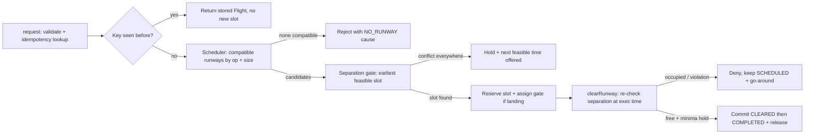
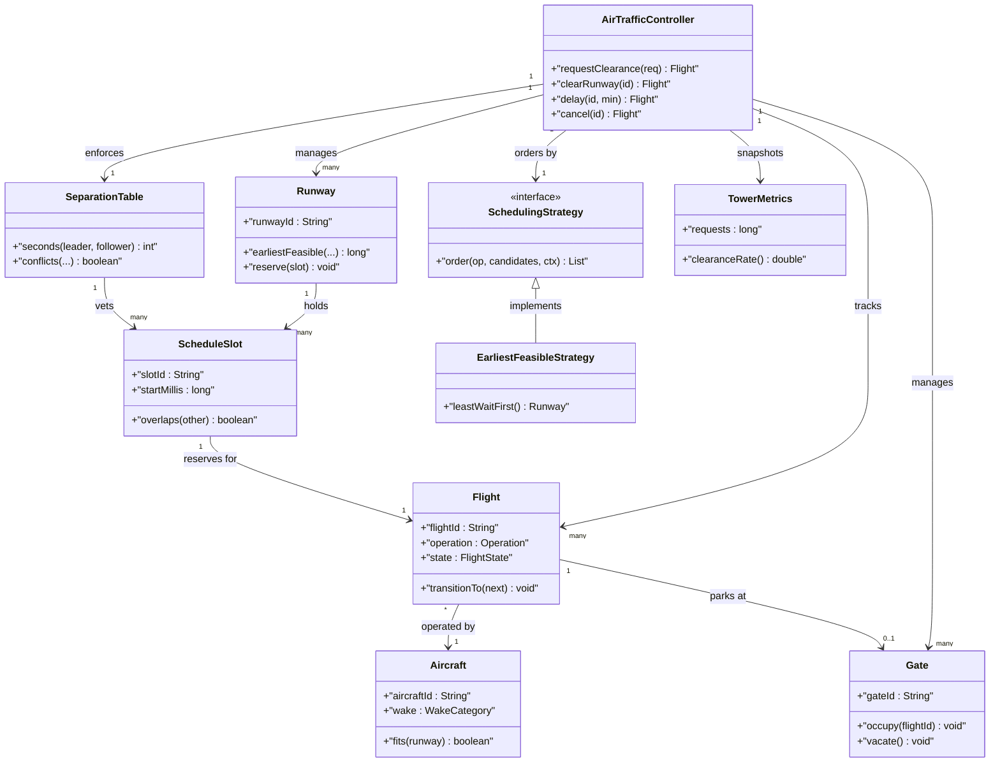
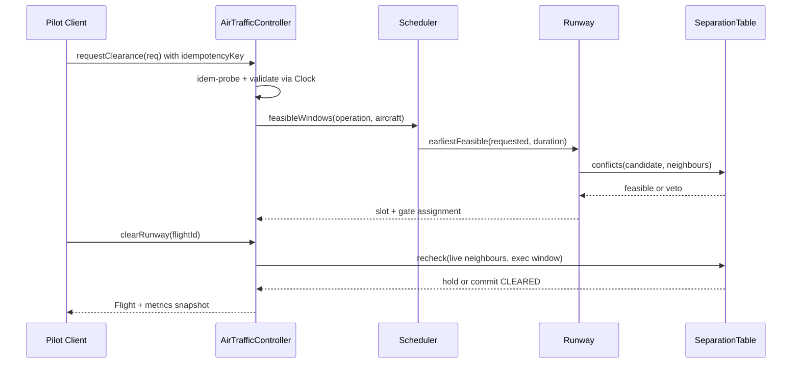

# Design Air Traffic Controller System

- [Design An Air Traffic Controller | Google SWE Teaches Low Level Design Episode 6](https://www.youtube.com/watch?v=1chGrWLoK5E)

## Blogs and websites

## Medium

## Youtube

## Theory

Design a controller that schedules takeoffs and landings across runways and gates without conflicts. Must allocate runways, sequence flights, and handle delays safely.
Key entities: Flight, Runway, Gate, Schedule slot.
Core operations: request takeoff/landing, assign runway/gate, update flight status.

This guide turns that stub into an interview-ready low-level design: you will clarify an intentionally ambiguous tower controller, model clean OOP entities around Aircraft, Flight, Runway, Gate, and ScheduleSlot, choose runway assignment (earliest-feasible with wake-separation gating) behind a pluggable SchedulingStrategy, gate every clearance behind a separation-minima check plus a strict flight state machine plus gate-compatibility validation, and write plain Java 17 code an interviewer can trace on a whiteboard. The emphasis is on object modeling, runway scheduling mechanics, and conflict-free correctness — not radar signal processing, en-route airspace routing, or distributed multi-airport flow control.

> Scope note: this is LLD (class design, patterns, in-process concurrency). Radar tracking hardware, en-route sector handoff protocols, airline crew scheduling, and multi-airport ground-delay programs belong to HLD and are mentioned only where they constrain the object model (for example, every Flight carries aircraftId plus operation plus requestedTime plus assignedRunway plus assignedSlot so a retry or delay propagation never double-books a runway or parks two aircraft at one gate).

### Topics Covered

1. [Problem Statement](#problem-statement)
2. [Functional / Non-Functional Requirements](#functional--non-functional-requirements)
3. [Core Entities & Class Design](#core-entities--class-design)
4. [Key Design Decisions & Patterns Used](#key-design-decisions--patterns-used)
5. [Concurrency & Edge Cases](#concurrency--edge-cases)
6. [Java 17 Implementation](#java-17-implementation)
7. [Interview Questions and Answers](#interview-questions-and-answers)

---

### Problem Statement

Design a tower `AirTrafficController` that accepts a clearance request with `flightId`, `operation` (TAKEOFF versus LANDING), `aircraftId`, `requestedTime`, and `priority` (SCHEDULED, EMERGENCY, VIP). The controller validates the request, picks a runway via a `Scheduler` (earliest-feasible: compatible runway with no separation conflict and smallest wait), reserves a `ScheduleSlot` with wake-turbulence separation enforced, assigns a compatible `Gate` for arrivals, and creates a `Flight` in SCHEDULED state with a unique `slotId`. The tower later issues `clearForTakeoff` or `clearForLanding` only when the runway is free and separation minima hold; `delay`, `cancel`, and `releaseRunway` plus `releaseGate` converge state safely. No two flights may occupy one runway inside the separation window, no landing may clear onto an occupied runway, and no gate may hold two aircraft at once.

A `requestClearance(request)` returns a scheduled `Flight` with runway plus slot plus estimated time; a `clearRunway(flightId)` commits the operation only if separation holds at execution time; a `delay(flightId, minutes)` re-plans the slot on the same or alternate runway; a `cancel(flightId)` frees runway plus gate atomically. Duplicate requests behave as replays: same idempotency key returns the stored flight and never books a second slot for metrics purity. An optional `SeparationTable` seam models wake-category minima so tests assert conflicts without real radar.

**Why this problem exists**

- Real tower bugs cluster in three places: runway incursions where two flights hold overlapping slots because separation was checked at request time but never re-checked at clearance time, gate double-parking because arrival and departure lifecycles share no atomic handoff, and priority starvation where emergency flights queue behind scheduled ones with no preemption path.
- The domain maps to two classic design ideas: runway allocation is a textbook Strategy plus State pairing (scheduling policies pick, flight lifecycle states gate execution), and conflict detection is a textbook Specification plus Scheduler family (separation rules veto candidates, the scheduler orders survivors by wait).
- Interviewers love it because the happy path takes 10 minutes (request plus runway pick plus slot plus gate) but the follow-ups (where does separation live, who owns the slot commit, how do delays re-plan, how do concurrent requests stay conflict-free) separate API recall from modeled reasoning.

**Real-life analogues**

- **Single-airport tower (e.g., SFO parallel runways)**: arrival versus departure runway specialization, wake separation between Heavy and Small, go-around on occupied runway.
- **Gate management at a terminal**: size-compatibility (wide-body fits only wide gates), turnaround occupancy, tow-to-remote-stand on congestion.
- **Flow-control delay programs**: ground holds propagate as slot re-plans, cancellations cascade into freed capacity the scheduler re-offers.

**Clarifying questions to ask in the interview (say these out loud)**

1. Topology: one airport with N runways and M gates in scope, or multi-airport handoff? Fixed runway set or dynamic close plus reopen?
2. Operation model: TAKEOFF and LANDING only, or touch-and-go plus go-around as first-class operations?
3. Aircraft model: wake categories Heavy, Medium, Small plus size class, or free-form type string with lookup?
4. Scheduling rule: earliest-feasible by wait, or priority-weighted, or airline-fair round-robin across runways?
5. Separation source: static minima table per leader-follower pair, or runway-occupancy-time plus configurable buffer?
6. Gate scope: arrivals need gates and departures release them, or every flight holds a gate through turnaround?
7. Priority semantics: EMERGENCY preempts scheduled slots, VIP bumps queue order, or advisory flag only?
8. Delay model: fixed-step re-plan on same runway first then alternate, or caller picks new time explicitly?
9. Time handling: epoch millis with injectable clock, slot granularity in minutes, how far ahead can requests book?
10. Observability: runway utilization, average hold delay, go-around count, gate occupancy audited per hour?

**Assumptions for this guide (state these if the interviewer says "decide yourself")**

- Single `AirTrafficController` facade with an in-memory runway plus gate registry built at construction; wake categories are a closed `WakeCategory` enum.
- Scheduling default: compatible runways (operation support plus length plus category) filtered first, then separation-feasible, ordered by earliest feasible time then shortest wait; emergency requests preempt by re-planning the lowest-priority conflicting slot.
- Separation minima scoped per runway: `SeparationTable` maps (leader, follower) to seconds; defaults Heavy-follow-Heavy 96s, Heavy-lead-Small 180s, Medium pairs 120s, Small-follow-Small 60s, plus 60s runway-occupancy buffer.
- Slot granularity one minute; requested times snapped up to the minute; stale SCHEDULED slots older than 30 minutes without clearance are eligible for sweep.
- Gates carry size class SMALL, MEDIUM, LARGE; an aircraft fits a gate of equal or larger class; departures release gates, arrivals acquire them.
- In-memory only, no persistence; `clearRunway` is a synchronous commit through the same separation gate as scheduling.
- All public methods safe for concurrent use; one monitor guards request plus clearance plus delay plus cancel.
- Idempotency key scoped per airline: `(airlineId, idempotencyKey)` maps to exactly one flightId; keys retained for process lifetime.



The diagram shows the guarded clearance loop from request to execution: idempotency gates every slot booking, compatibility plus separation gates every assignment, and only re-verified clearances commit so stale plans never cause incursions.

---

### Functional / Non-Functional Requirements

#### Functional requirements (must-have)

1. **Validated clearance intake**
    - Support `Operation TAKEOFF, LANDING`; reject null flight, unknown aircraft, past requested time, or unsupported operation with typed exceptions.
    - `requestClearance(request)` validates, checks the `(airlineId, idempotencyKey)` index first, and only then schedules; same key always returns the same flightId.
2. **Exclusive slot identity**
    - One live `Flight` per `(airlineId, idempotencyKey)`; a replay never creates a second slot or second gate hold.
    - Duplicate `flightNumber` with a different key is a new flight attempt (caller error surfaced), never a silent merge.
3. **Feasible runway assignment**
    - `Scheduler` selects among registered `Runway`s by operation support, length adequacy, and wake-category compatibility, then separation feasibility.
    - One automatic fallback to the next feasible runway on conflict; beyond that the request returns a HOLD with the next feasible time.
4. **Separation-gated commit**
    - `clearRunway(flightId)` re-checks leader-follower minima against live runway occupancy at execution time and commits CLEARED only on pass.
    - Failed checks keep the flight SCHEDULED with a typed cause; a landing on an occupied runway always denies with go-around guidance.
5. **Gate assignment with compatibility**
    - `assignGate` gives arrivals a free gate of equal or larger size class; departures release their gate on takeoff commit.
    - Occupied or undersized gates are never offered; gate hold plus release share the controller monitor with runway commits.
6. **Delay and cancel with re-plan**
    - `delay(flightId, minutes)` re-plans the slot on the same runway first, then alternates, preserving gate holds where still feasible.
    - `cancel(flightId)` frees runway slot plus gate atomically and marks CANCELLED; terminal flights reject further mutation.
7. **Pluggable scheduling strategies**
    - `SchedulingStrategy` interface with `order(operation, candidates, context)` hook; EarliestFeasible default, PriorityFirst and LoadBalanced variants provided.
    - Strategies never cache occupancy; the controller passes a snapshot view of runway timelines per call.
8. **Status and metrics facade**
    - Public API `requestClearance`, `clearRunway`, `delay`, `cancel`, `status`, `runwayTimeline`, `metrics` returns result objects; unknown flightIds or runways throw typed exceptions.

#### Explicitly out of scope (say this to bound the interview)

- Radar surveillance, ADS-B fusion, and weather-based spacing adaptation (the flight carries enough refs for HLD to add them).
- En-route sector handoff and inter-airport slot coordination (runway timelines are per-airport snapshots, never global locks).
- Crew rostering and passenger boarding workflows (record the flight-status hook so HLD can add them).

#### Non-functional requirements (LLD-flavoured)

- **Safety over throughput**: no double-booked runway and no uncleared execution are ever observable; separation gates run before slot mutation.
- **O(R times S) pick by construction**: runway shortlist scan over registered runways times slots in the lookahead window avoids full-history scans.
- **Extensibility**: adding a new runway or aircraft category means adding one registration entry, not rewriting `requestClearance`.
- **Testability**: scheduler, clock, separation table, and runways are plain injectable seams drivable with fixed times and a manual clock.
- **Readability**: an interviewer can trace `request()` to `feasible()` to `reserve()` and `clear()` to `recheck()` to `commit()` in under five minutes.
- **Determinism**: no randomness except injectable id sources; no wall-clock dependence except an injectable clock.
- **Observability (lightweight)**: every request, replay, hold, clearance, denial, delay, cancel, and go-around increments a counter snapshotted as `TowerMetrics`.

| Requirement | Target / policy | Why it matters in LLD |
|---|---|---|
| No runway double-book | Separation check before any slot insert | Core safety invariant |
| No stale clearance | Re-check minima at execution time | Incursion follow-up |
| Priority without starvation | Emergency preempts, scheduled re-plans | Most-tested fairness probe |
| Exactly-once slot | State machine allows one active slot | Correctness probe |
| Atomic request path | Dedupe-plus-reserve under one monitor | Replay race guard |
| Re-plannable delays | Same-runway first, then alternate | No-cascade test design |

### Core Entities & Class Design

The model has four entity groups: the AirTrafficController facade callers touch, the Aircraft plus Flight plus Operation movement value objects holding identity plus intent truth, the Runway plus ScheduleSlot plus SeparationTable scheduling pipeline holding compatibility plus spacing truth, and the Gate plus TowerMetrics ground pipeline holding parking plusledger truth. Keep behaviour with the data it guards: flights own lifecycle transitions, runways own occupancy timelines, separation tables own minima truth, schedulers own candidate ordering, gates own compatibility truth, and the controller owns atomicity.

#### Value objects and supporting types (the vocabulary of the domain)

- `Operation`: closed enum TAKEOFF, LANDING with `needsGate()` — only LANDING acquires a gate on schedule, so departure release never branches on strings.
- `WakeCategory`: closed enum HEAVY, MEDIUM, SMALL with `rank()` — separation lookup is a pair key, never string matching on aircraft type.
- `GateSize`: closed enum SMALL, MEDIUM, LARGE with `fits(aircraftSize)` — parking eligibility is an ordinal comparison so a wide-body is never offered a small stand.
- `FlightPriority`: closed enum SCHEDULED, VIP, EMERGENCY with `preempts()` — only EMERGENCY may displace a conflicting SCHEDULED slot, so preemption stays auditable.
- `FlightState`: lifecycle enum REQUESTED versus SCHEDULED versus CLEARED versus COMPLETED versus DELAYED versus CANCELLED versus HOLD — terminal COMPLETED and CANCELLED never move again.
- `Aircraft`: physical jet with `aircraftId`, `type`, `wake` (WakeCategory), `size` (GateSize), `lengthNeedMeters` — method `fits(runway)` gates length plus category before scheduling.
- `Flight`: movement record with `flightId`, `flightNumber`, `airlineId`, `idempotencyKey`, `aircraftId`, `operation`, `priority`, `state`, `assignedRunwayId`, `assignedSlotId`, `assignedGateId`, `requestedTimeMillis`, `estimatedTimeMillis`.
- `ScheduleSlot`: runway reservation with `slotId`, `runwayId`, `flightId`, `startMillis`, `endMillis` — method `overlaps(other)` is the incursion primitive every check funnels through.
- `ClearanceRequest`: intake DTO — `flightNumber`, `airlineId`, `aircraftId`, `operation`, `requestedTimeMillis`, `priority`, `idempotencyKey`; validation rejects nulls and past times at construction.
- `Clock`: millis source interface — `SystemClock` for production, `ManualClock` for tests with `advance(millis)`; every staleness comparison goes through it.
- `TowerMetrics`: immutable snapshot — requests, replays, holds, clearances, denials, delays, cancels, goArounds, plus derived `clearanceRate()`.

#### Controller, runways, and schedulers

- `AirTrafficController`: owns `Map<String, Aircraft> aircraft`, `Map<String, Runway> runways`, `Map<String, Gate> gates`, `Map<IdemKey, String> idemIndex`, `Map<String, Flight> flights`, `Map<String, ScheduleSlot> slots`, `SchedulingStrategy strategy`, `SeparationTable separations`, `Clock`, counters. Methods `requestClearance(req)`, `clearRunway(flightId)`, `delay(flightId, minutes)`, `cancel(flightId)`, `status(flightId)`, `runwayTimeline(runwayId)`, `metrics()`.
- `Runway`: strip with `runwayId`, `lengthMeters`, `supportsTakeoff`, `supportsLanding`, `allowedCategories`, plus `List<ScheduleSlot> timeline` — methods `isCompatible(flight, aircraft)`, `earliestFeasible(requested, duration, separations, flights)`, `reserve(slot)`, `release(slotId)`.
- `Gate`: stand with `gateId`, `size`, `occupantFlightId` — methods `fits(aircraft)`, `isFree()`, `occupy(flightId)`, `vacate()`; no waiting list inside the gate itself.
- `SeparationTable`: minima matrix — `seconds(leaderWake, followerWake)` plus `occupancySeconds(operation)`; method `conflicts(runway, candidateStart, candidateEnd, neighbour)` is the single veto point.
- `SchedulingStrategy` (interface): `order(operation, candidates, context)` returning ordered runway list, `name()` for metrics labels.
- `EarliestFeasibleStrategy`: orders compatible runways by earliest feasible time ascending then by current load — least-wait first, frugal by construction, O(R log R) in runways not O(N) in flights.
- `PriorityFirstStrategy`: emergency and VIP flights sort before scheduled ones at equal feasible times, with preemption flag for EMERGENCY over SCHEDULED conflicts.
- `LoadBalancedStrategy`: rotating index over feasible runways for throughput spread; simpler but ignores wait, provided to make the trade-off discussable.

#### Ground, verify, and observability pipeline

- Verify pipeline inside `clearRunway`: resolve flight, liveness gate (only SCHEDULED or DELAYED), runway-occupied gate, separation re-check against live neighbours, then commit CLEARED.
- Delay pipeline inside `delay`: compute new requested time, try same runway earliest-feasible first, then alternates in strategy order, move slot plus preserve or reassign gate.
- Cancel pipeline inside `cancel`: mark CANCELLED, release slot, vacate gate, all under the same monitor so no partial free is observable.
- Observer seam: `runwayTimeline` returns an immutable copy of a runway timeline without coupling the controller to a display framework.
- Metrics pipeline: every return path increments exactly one counter family — request, replay, hold, clearance, denial, delay, cancel, go-around — so clearance-rate math stays reproducible.



The diagram shows containment (controller to flights, runways, gates), scheduling (controller to strategy to runways to slots), movement (flight to aircraft), and parking (flight to gate) — the four relationships to name in the interview.

**Key relationships and cardinalities**

- AirTrafficController 1—0..N Flight objects; exactly 0..1 flight per `(airlineId, idempotencyKey)`, so replays never double-book observably.
- AirTrafficController 1—1..N Runway registrations; each runway 1—0..N ScheduleSlot entries ordered by start time so feasibility is a neighbour scan, never a full-history scan.
- Flight N—1 Aircraft at a time; insertion links both, terminal states never relink either.
- Flight 1—0..1 Gate at a time; cumulative gate occupancy is a fold over live holds, capped at one occupant per gate by construction.
- ScheduleSlot N—1 Runway via runwayId; slot ids are globally unique so one reservation pins exactly one strip once.
- AirTrafficController 1—1 SchedulingStrategy at a time; strategy swap needs no state migration because strategies hold no slot cache.

**Where behaviour lives (tell the interviewer)**

- Identity truth lives in the idempotency index: `(airlineId, idempotencyKey)` to flightId checked before any slot insert, so retries cannot fork flights.
- Compatibility truth lives in the runway: operation support plus length plus category filter before ordering, so no strategy can offer an incapable strip.
- Spacing truth lives in the separation table: `conflicts` over leader-follower wake pairs plus occupancy buffer, so veto logic has exactly one owner.
- Lifecycle truth lives in the flight: `transitionTo(next)` validates the state machine (REQUESTED to SCHEDULED or HOLD, SCHEDULED to CLEARED or DELAYED or CANCELLED, CLEARED to COMPLETED), so illegal jumps throw.
- Parking truth lives in the gate: size-fit plus single-occupant guard, so double-parking is unrepresentable.

---

### Key Design Decisions & Patterns Used

#### Decision 1 — Separation table as the single veto (the hook)

Every candidate slot funnels through `SeparationTable.conflicts` before any `Runway.reserve`: the table maps (leaderWake, followerWake) to seconds and adds a runway-occupancy buffer per operation. Say the trade-off verbatim: one matrix lookup per neighbour pair costs O(neighbours) per candidate but buys a single place to tune wake minima without touching scheduling or clearance code; without it every runway embeds its own spacing magic numbers and they drift. Name the invariant: no slot insert and no clearance commit bypasses the table, so request-time and execution-time checks cannot disagree on what safe means.

#### Decision 2 — Scheduling as compatibility filter plus pluggable ordering

The controller splits the problem: compatibility (operation support, length, category) applies hard gates, separation feasibility applies the safety gate, then the `SchedulingStrategy` applies soft ordering (least wait, priority, load spread). State the rationale verbatim — filters protect safety (never offer a strip the aircraft cannot use), ordering protects throughput (least wait first) — and a future airline-fair strategy is a one-class change. The `ScheduleSlot.overlaps` primitive owns the incursion signal so a conflicting slot is skipped without removing the runway registration.

#### Decision 3 — State machine with clearance-time re-check

`FlightState { REQUESTED, SCHEDULED, HOLD, CLEARED, COMPLETED, DELAYED, CANCELLED }` makes illegal executions unrepresentable: only SCHEDULED or DELAYED flights clear, only CLEARED flights complete, terminal COMPLETED and CANCELLED reject everything. Say the scope sentence: scheduling checks separation against the plan, clearance re-checks it against live occupancy, so a delay elsewhere can never turn a stale plan into an incursion.

#### Decision 4 — Clearance as liveness-then-occupancy-then-separation-then-commit

Verification at execution is occupancy of the runway at now, then neighbour separation with the candidate execution window, then gate liveness for landings, compared under the same monitor; commit marks CLEARED then COMPLETED with runway release plus gate handoff. Say the metrics rule verbatim — denied clearances count as denials with go-around guidance, never clearances — because conflating them is the classic grading trap. The injectable `Clock` plus `runwayTimeline` snapshot makes holds deterministic: tests advance a manual clock instead of waiting.

#### Decision 5 — Single-monitor atomicity with timelines at the edge

`requestClearance`, `clearRunway`, `delay`, and `cancel` synchronize on the controller; dedupe-probe plus slot-reserve plus gate-occupy share the same monitor so two racing requests never fork two slots for one key and clearance never interleaves with delay. Timeline copies for `runwayTimeline` are built under lock but returned as immutable lists, so a slow reader never serializes the next request. State explicitly that strategy internals assume the controller lock is held — strategies are pure orderings over a snapshot view, never independently synchronized, which keeps lock ordering trivial.

#### Decision 6 — Explicit times, typed failures, immutable metrics

- Times in epoch millis snapped to minute granularity; durations in seconds from the separation table; no float math ever touches spacing.
- Typed exceptions (`NoRunwayAvailableException`, `SeparationViolationException`, `RunwayOccupiedException`, `GateUnavailableException`, `FlightNotFoundException`, `IllegalFlightStateException`) let callers branch without parsing strings.
- `TowerMetrics` as an immutable snapshot avoids torn long reads and lets tests assert exact counter deltas per operation.
- Fixed operation and wake enums at construction keep the compatibility reasoning one case; unknown aircraft are rejected at the door, never scheduled.

#### Patterns used (say these names out loud)

| Pattern | Where | Why |
|---|---|---|
| Strategy | `SchedulingStrategy` family (earliest-feasible, priority-first, load-balanced) | Ordering varies independently by policy |
| State | `FlightState` transitions with guarded `transitionTo` | Execution legality varies by lifecycle state |
| Facade | `AirTrafficController` over aircraft, runways, slots, gates, separations | One interview-traceable API for all flows |
| Specification | `SeparationTable.conflicts` veto over candidate slots | Safety rule composes without leaking into scheduler |
| Template Method (light) | `clearRunway` then `liveness` then `occupancy` then `separation` then `commit` skeleton | Shared ordering, pluggable strategy hook |
| Observer (light) | Timeline snapshot on delay plus audit on cancel | Re-plan reacts without controller coupling |
| Memento (light) | `TowerMetrics` immutable snapshot | Observe counters without corrupting live state |

**SOLID mapping (one line each for the "which principles?" follow-up)**

- Single Responsibility: flights guard lifecycle, runways guard timelines, tables guard spacing, schedulers guard ordering, gates guard parking, controller guards atomicity.
- Open/Closed: new runway or scheduling rule equals a new registration or class, zero edits to `requestClearance` or `clearRunway`.
- Liskov: any `SchedulingStrategy` substitutes without breaking the feasible-then-commit pipeline.
- Interface Segregation: small `SchedulingStrategy`, `Clock`, and separation contracts instead of one fat controller interface.
- Dependency Inversion: `AirTrafficController` depends on strategy and clock interfaces; tests inject fakes plus a manual clock.

### Concurrency & Edge Cases

#### The concurrency story (the senior half of the interview)

One tower has one slot map plus one gate map, so the design centers on atomic dedupe-then-reserve plus re-verified-only clearance plus decoupled delay. Three mechanisms from innermost to outermost:

1. **Single-monitor exclusion on the controller.** `requestClearance`, `clearRunway`, `delay`, and `cancel` are `synchronized` on the controller; idempotency probe plus slot insert plus gate occupy share the same monitor so two racing retries with the same key fork at most one slot and clearance never interleaves with delay. Separation checks and gate fits run inside the same critical section.
2. **Re-verify-before-commit ordering.** `clearRunway` tests liveness, then runway occupancy at now, then neighbour separation for the execution window, then gate liveness before touching the state machine; only a verified fresh clearance commits CLEARED, and delay plus cancel share the identical slot-release helper so a moved flight cannot be double-counted.
3. **Copies outside the lock.** `runwayTimeline` snapshots timelines under lock but returns immutable copies; metrics counters increment inside the lock but are snapshotted as an immutable record read outside it, so a slow reader never serializes the next request.



The diagram shows the feasible-then-commit ordering in time: both idempotency and separation probes complete before any slot insert or CLEARED commit, and metrics increment after every return path so clearance rate is never skipped.

**Why not `ConcurrentHashMap` alone?** A concurrent map serializes key access but does not express atomic dedupe-plus-reserve-plus-gate linkage, ordered fallback across runways, or coherent exactly-once clearance-versus-delay commits. Two retries with the same key could each miss the index and fork two slots, and a `clearRunway` resolving occupancy plus marking cleared plus releasing the strip is a multi-key write that needs the same exclusion as `requestClearance`. Controller-level exclusion plus scheduler-behind-lock gives both atomicity and schedulability: exclusion stops races, the scheduler stops waste.

**Post-access evaluation rule (say this verbatim): dedupe, then filter, then separate, then commit, then park.** After every request the controller confirms idempotency first, tests runway compatibility second, vets separation third, commits the slot fourth, and only then parks the gate. Occupied plus incompatible plus violating is a hold or denial with no state change, never a clearance.

#### Edge cases table (pick 4–5 to recite, keep the rest as backup)

| # | Edge case | Handling |
|---|---|---|
| 1 | Two pilots `requestClearance` racing with the same idempotency key | Serialized on the monitor; winner books once, loser gets the stored flight with replay counter increment |
| 2 | Same flightNumber retried with a different idempotency key | Treated as a new flight attempt; caller told both flightIds exist so merging never happens silently |
| 3 | No compatible runway for the operation or length | Request rejected with `NoRunwayAvailableException`; metrics count a hold not a clearance |
| 4 | Separation conflict on every runway at requested time | HOLD with next feasible time offered; caller re-requests or accepts auto re-plan via `delay` |
| 5 | EMERGENCY arriving while runways fully booked | Preempts lowest-priority SCHEDULED slot; displaced flight re-planned to next feasible window automatically |
| 6 | Landing cleared while runway still occupied | Denied with `RunwayOccupiedException` plus go-around guidance; flight stays SCHEDULED, counted as denial |
| 7 | Stale plan: delay elsewhere breaks separation before clearance | Execution-time re-check vetoes with `SeparationViolationException`; slot re-planned, never forced through |
| 8 | Arrival finds zero free compatible gates | Flight holds SCHEDULED without gate; gate assigned lazily on next `delay` sweep or cancel cascade |
| 9 | Departure gate release racing arrival gate request | Serialized on the same monitor; whichever commits first wins, the other sees the fresh occupancy |
| 10 | `delay` racing a CLEARED commit | Serialized on the same monitor; cleared flights reject delay with `IllegalFlightStateException` cause |
| 11 | Double `cancel` of the same flight | Second call no-ops with stored CANCELLED outcome; slot and gate freed exactly once |
| 12 | `cancel` of a CLEARED airborne flight | Rejected with illegal-state cause; airborne completion owns the runway release path |
| 13 | Clock jumps forward (mass staleness) | Lazy sweep on next status read re-plans stale SCHEDULED flights; `delay` converges the rest in one pass |
| 14 | Runway closed for maintenance mid-day | Registration marked closed; scheduler skips it, live slots re-planned to alternates with delay causes |
| 15 | Null request or null flightId input | Rejected with `IllegalArgumentException`; nulls never enter the flight map so absent-versus-null stays unambiguous |

---

### Java 17 Implementation

All classes below are plain Java 17 (no frameworks, enums for operations and states, interfaces for scheduling and clock seams). The scheduler gives O(R log R) earliest-feasible ordering, flights own state transitions, and `AirTrafficController` synchronizes the clearance path. Each block is followed by its explanation and the pattern it demonstrates.

#### 1. Operations, aircraft, flights, runways, and gates

The foundation is closed enums plus one timeline per runway with neighbour-scan feasibility.

```java
import java.util.*;

// Closed operation set: gate need is a method, never string matching.
enum Operation {
    TAKEOFF, LANDING;
    boolean needsGate() { return this == LANDING; }
}

enum WakeCategory { HEAVY, MEDIUM, SMALL }

enum GateSize { SMALL, MEDIUM, LARGE }

enum FlightPriority {
    SCHEDULED, VIP, EMERGENCY;
    boolean preempts() { return this == EMERGENCY; }
}

enum FlightState { REQUESTED, SCHEDULED, HOLD, CLEARED, COMPLETED, DELAYED, CANCELLED }

// Physical jet: compatibility gate lives here before scheduling.
final class Aircraft {
    final String aircraftId;
    final String type;
    final WakeCategory wake;
    final GateSize size;
    final int lengthNeedMeters;
    Aircraft(String aircraftId, String type, WakeCategory wake, GateSize size, int lengthNeedMeters) {
        this.aircraftId = Objects.requireNonNull(aircraftId);
        this.type = type;
        this.wake = Objects.requireNonNull(wake);
        this.size = Objects.requireNonNull(size);
        this.lengthNeedMeters = lengthNeedMeters;
    }
}

// Intake DTO: validated at construction so scheduling never branches on junk.
final class ClearanceRequest {
    final String flightNumber;
    final String airlineId;
    final String aircraftId;
    final Operation operation;
    final long requestedTimeMillis;
    final FlightPriority priority;
    final String idempotencyKey;
    ClearanceRequest(String flightNumber, String airlineId, String aircraftId,
                     Operation operation, long requestedTimeMillis,
                     FlightPriority priority, String idempotencyKey) {
        this.flightNumber = Objects.requireNonNull(flightNumber);
        this.airlineId = Objects.requireNonNull(airlineId);
        this.aircraftId = Objects.requireNonNull(aircraftId);
        this.operation = Objects.requireNonNull(operation);
        this.requestedTimeMillis = requestedTimeMillis;
        this.priority = Objects.requireNonNull(priority);
        this.idempotencyKey = Objects.requireNonNull(idempotencyKey);
    }
}

// Movement record: only the state machine moves flights forward.
final class Flight {
    final String flightId;
    final String flightNumber;
    final String airlineId;
    final String idempotencyKey;
    final String aircraftId;
    final Operation operation;
    final FlightPriority priority;
    final long requestedTimeMillis;
    FlightState state = FlightState.REQUESTED;
    String assignedRunwayId;
    String assignedSlotId;
    String assignedGateId;
    long estimatedTimeMillis;
    Flight(String flightId, ClearanceRequest req) {
        this.flightId = flightId; this.flightNumber = req.flightNumber;
        this.airlineId = req.airlineId; this.idempotencyKey = req.idempotencyKey;
        this.aircraftId = req.aircraftId; this.operation = req.operation;
        this.priority = req.priority; this.requestedTimeMillis = req.requestedTimeMillis;
        this.estimatedTimeMillis = req.requestedTimeMillis;
    }
    void transitionTo(FlightState next) {
        boolean ok = switch (state) {
            case REQUESTED -> next == FlightState.SCHEDULED || next == FlightState.HOLD;
            case SCHEDULED, DELAYED, HOLD -> next == FlightState.CLEARED
                || next == FlightState.DELAYED || next == FlightState.CANCELLED
                || next == FlightState.SCHEDULED;
            case CLEARED -> next == FlightState.COMPLETED || next == FlightState.CANCELLED;
            case COMPLETED, CANCELLED -> false;
        };
        if (!ok) throw new IllegalFlightStateException(flightId + " " + state + "->" + next);
        this.state = next;
    }
    boolean isClearable() { return state == FlightState.SCHEDULED || state == FlightState.DELAYED; }
    boolean isTerminal() { return state == FlightState.COMPLETED || state == FlightState.CANCELLED; }
}

// Runway reservation: overlap is the incursion primitive.
final class ScheduleSlot {
    final String slotId;
    final String runwayId;
    final String flightId;
    long startMillis;
    long endMillis;
    ScheduleSlot(String slotId, String runwayId, String flightId, long startMillis, long endMillis) {
        this.slotId = slotId; this.runwayId = runwayId; this.flightId = flightId;
        this.startMillis = startMillis; this.endMillis = endMillis;
    }
    boolean overlaps(ScheduleSlot other) {
        return this.startMillis < other.endMillis && other.startMillis < this.endMillis;
    }
}

// Stand: size-fit plus single occupant makes double-parking unrepresentable.
final class Gate {
    final String gateId;
    final GateSize size;
    String occupantFlightId;
    Gate(String gateId, GateSize size) {
        this.gateId = gateId; this.size = size;
    }
    boolean fits(GateSize need) { return size.ordinal() >= need.ordinal(); }
    boolean isFree() { return occupantFlightId == null; }
    void occupy(String flightId) {
        if (!isFree()) throw new GateUnavailableException(gateId);
        this.occupantFlightId = flightId;
    }
    void vacate() { this.occupantFlightId = null; }
}

class IllegalFlightStateException extends RuntimeException {
    IllegalFlightStateException(String m) { super(m); }
}
class GateUnavailableException extends RuntimeException {
    GateUnavailableException(String m) { super(m); }
}
```

Explanation: `Operation` plus `WakeCategory` plus `GateSize` as closed enums make compatibility a set of ordinal tests per runway and gate, so scheduling never string-matches aircraft quirks. `Flight` as a guarded state machine is the execution gatekeeper — every transition validates the current state first, so clearance, delay, and cancel cannot overlap. This block demonstrates the State pattern: execution legality varies by lifecycle state behind `transitionTo`.

#### 2. Separation table, runways, clock, and scheduling strategies

Separation owns spacing truth and runways own timelines; both are exercised through injectable clock and strategy seams.

```java
import java.util.*;

// Minima matrix: the single veto point for every candidate slot.
final class SeparationTable {
    private final Map<String, Integer> minimaSeconds = new HashMap<>();
    private final int occupancyTakeoffSecs = 60;
    private final int occupancyLandingSecs = 90;
    SeparationTable() {
        put(WakeCategory.HEAVY, WakeCategory.HEAVY, 96);
        put(WakeCategory.HEAVY, WakeCategory.MEDIUM, 120);
        put(WakeCategory.HEAVY, WakeCategory.SMALL, 180);
        put(WakeCategory.MEDIUM, WakeCategory.HEAVY, 60);
        put(WakeCategory.MEDIUM, WakeCategory.MEDIUM, 120);
        put(WakeCategory.MEDIUM, WakeCategory.SMALL, 150);
        put(WakeCategory.SMALL, WakeCategory.HEAVY, 60);
        put(WakeCategory.SMALL, WakeCategory.MEDIUM, 90);
        put(WakeCategory.SMALL, WakeCategory.SMALL, 60);
    }
    private void put(WakeCategory leader, WakeCategory follower, int secs) {
        minimaSeconds.put(leader + ">" + follower, secs);
    }
    int seconds(WakeCategory leader, WakeCategory follower) {
        return minimaSeconds.getOrDefault(leader + ">" + follower, 120);
    }
    int occupancySeconds(Operation op) {
        return op == Operation.TAKEOFF ? occupancyTakeoffSecs : occupancyLandingSecs;
    }
    // Veto: candidate execution window must clear every neighbour by pair minima.
    boolean conflicts(List<ScheduleSlot> timeline, Map<String, Flight> flights,
                      Map<String, Aircraft> aircraft, long candStart, long candEnd,
                      WakeCategory candWake) {
        for (var s : timeline) {
            var f = flights.get(s.flightId);
            if (f == null || f.isTerminal()) continue;
            var ac = aircraft.get(f.aircraftId);
            WakeCategory other = (ac == null) ? WakeCategory.MEDIUM : ac.wake;
            long gap;
            if (candStart >= s.endMillis) gap = candStart - s.endMillis;
            else if (candEnd <= s.startMillis) gap = s.startMillis - candEnd;
            else return true; // direct overlap
            int need = (candStart >= s.endMillis)
                ? seconds(other, candWake) : seconds(candWake, other);
            if (gap < need * 1000L) return true;
        }
        return false;
    }
}

// Strip: compatibility plus earliest-feasible search over its own timeline.
final class Runway {
    final String runwayId;
    final int lengthMeters;
    final boolean supportsTakeoff;
    final boolean supportsLanding;
    final Set<WakeCategory> allowedCategories;
    boolean open = true;
    final List<ScheduleSlot> timeline = new ArrayList<>();
    Runway(String runwayId, int lengthMeters, boolean supportsTakeoff,
           boolean supportsLanding, Set<WakeCategory> allowed) {
        this.runwayId = runwayId; this.lengthMeters = lengthMeters;
        this.supportsTakeoff = supportsTakeoff; this.supportsLanding = supportsLanding;
        this.allowedCategories = allowed;
    }
    boolean isCompatible(Aircraft ac, Operation op) {
        if (!open) return false;
        if (op == Operation.TAKEOFF && !supportsTakeoff) return false;
        if (op == Operation.LANDING && !supportsLanding) return false;
        if (ac.lengthNeedMeters > lengthMeters) return false;
        return allowedCategories.contains(ac.wake);
    }
    // Earliest feasible start at or after requested: step by 60s up to 2h lookahead.
    long earliestFeasible(long requested, int durationSecs, WakeCategory wake,
                          SeparationTable table, Map<String, Flight> flights,
                          Map<String, Aircraft> aircraft) {
        long snapped = (requested / 60000) * 60000;
        for (int step = 0; step <= 120; step++) {
            long s = snapped + step * 60000L;
            long e = s + durationSecs * 1000L;
            if (!table.conflicts(timeline, flights, aircraft, s, e, wake)) return s;
        }
        return -1;
    }
    void reserve(ScheduleSlot slot) {
        timeline.add(slot);
        timeline.sort(Comparator.comparingLong(s -> s.startMillis));
    }
    void release(String slotId) { timeline.removeIf(s -> s.slotId.equals(slotId)); }
}

// Millis source: production uses wall clock, tests advance manually.
interface Clock { long now(); }
final class SystemClock implements Clock {
    public long now() { return System.currentTimeMillis(); }
}
final class ManualClock implements Clock {
    private long t;
    ManualClock(long start) { t = start; }
    public long now() { return t; }
    public void advance(long dMillis) { t += dMillis; }
}

// Read-only snapshot passed to strategies: no occupancy cache inside policies.
final class ScheduleContext {
    final Map<String, Long> feasibleTimeByRunway;
    ScheduleContext(Map<String, Long> m) { this.feasibleTimeByRunway = m; }
}

// Strategy: ordering varies by policy; controller calls it under its own lock.
interface SchedulingStrategy {
    List<Runway> order(Operation op, List<Runway> candidates, ScheduleContext ctx);
    String name();
}

// Least wait first: frugal by construction.
final class EarliestFeasibleStrategy implements SchedulingStrategy {
    public List<Runway> order(Operation op, List<Runway> c, ScheduleContext ctx) {
        var out = new ArrayList<>(c);
        out.sort(Comparator.comparingLong(r ->
            ctx.feasibleTimeByRunway.getOrDefault(r.runwayId, Long.MAX_VALUE)));
        return out;
    }
    public String name() { return "EARLIEST_FEASIBLE"; }
}

// Load spread: rotates over feasible runways; kept to make the trade-off visible.
final class LoadBalancedStrategy implements SchedulingStrategy {
    private int cursor = 0;
    public List<Runway> order(Operation op, List<Runway> c, ScheduleContext ctx) {
        if (c.isEmpty()) return List.of();
        int start = Math.floorMod(cursor++, c.size());
        var out = new ArrayList<Runway>();
        for (int i = 0; i < c.size(); i++) out.add(c.get((start + i) % c.size()));
        return out;
    }
    public String name() { return "LOAD_BALANCED"; }
}

class NoRunwayAvailableException extends RuntimeException {
    NoRunwayAvailableException(String m) { super(m); }
}
class SeparationViolationException extends RuntimeException {
    SeparationViolationException(String m) { super(m); }
}
class RunwayOccupiedException extends RuntimeException {
    RunwayOccupiedException(String m) { super(m); }
}
class FlightNotFoundException extends RuntimeException {
    FlightNotFoundException(String m) { super(m); }
}
```

Explanation: `SeparationTable` as a matrix object is the spacing bulkhead — pair minima plus occupancy buffer normalize wake physics so the controller never branches on category names. `Runway.earliestFeasible` keeps the search local to one timeline with a bounded 2-hour lookahead, so scheduling stays O(R times window) instead of scanning full history. This block demonstrates the Strategy plus Specification patterns: specifications veto unsafe candidates, strategies order the survivors.

#### 3. AirTrafficController facade with atomic request-clear-delay-cancel plus demo

`AirTrafficController` runs the dedupe, filter, separate, and park pipeline with single-monitor atomicity; this is the full tower to trace on the whiteboard.

```java
import java.util.*;

record IdemKey(String airlineId, String idempotencyKey) {}
record TowerMetrics(long requests, long replays, long holds, long clearances,
                    long denials, long delays, long cancels, long goArounds) {
    double clearanceRate() {
        if (requests == 0) return 0.0;
        return (double) clearances / requests;
    }
}

public class AirTrafficController {
    private final Map<String, Aircraft> aircraft = new HashMap<>();
    private final Map<String, Runway> runways = new LinkedHashMap<>();
    private final Map<String, Gate> gates = new LinkedHashMap<>();
    private final Map<IdemKey, String> idemIndex = new HashMap<>();
    private final Map<String, Flight> flights = new HashMap<>();
    private final Map<String, ScheduleSlot> slots = new HashMap<>();
    private final SchedulingStrategy strategy;
    private final SeparationTable separations;
    private final Clock clock;
    private long requests, replays, holds, clearances, denials, delays, cancels, goArounds;

    public AirTrafficController(SchedulingStrategy strategy, SeparationTable separations, Clock clock) {
        this.strategy = Objects.requireNonNull(strategy);
        this.separations = Objects.requireNonNull(separations);
        this.clock = Objects.requireNonNull(clock);
    }
    public void addAircraft(Aircraft a) { aircraft.put(a.aircraftId, a); }
    public void addRunway(Runway r) { runways.put(r.runwayId, r); }
    public void addGate(Gate g) { gates.put(g.gateId, g); }
    private void releaseSlot(Flight f) {
        if (f.assignedSlotId != null) {
            var s = slots.remove(f.assignedSlotId);
            if (s != null) {
                var r = runways.get(s.runwayId);
                if (r != null) r.release(s.slotId);
            }
            f.assignedSlotId = null;
        }
    }
    private void vacateGate(Flight f) {
        if (f.assignedGateId != null) {
            var g = gates.get(f.assignedGateId);
            if (g != null && f.flightId.equals(g.occupantFlightId)) g.vacate();
            f.assignedGateId = null;
        }
    }
    private Gate freeGateFor(Aircraft ac) {
        for (var g : gates.values()) {
            if (g.isFree() && g.fits(ac.size)) return g;
        }
        return null;
    }
    public synchronized Flight requestClearance(ClearanceRequest req) {
        var ac = aircraft.get(req.aircraftId);
        if (ac == null) throw new FlightNotFoundException("unknown aircraft " + req.aircraftId);
        var key = new IdemKey(req.airlineId, req.idempotencyKey);
        if (idemIndex.containsKey(key)) { // replay: no new slot
            replays++;
            return flights.get(idemIndex.get(key));
        }
        requests++;
        var compatible = new ArrayList<Runway>();
        for (var r : runways.values()) {
            if (r.isCompatible(ac, req.operation)) compatible.add(r);
        }
        if (compatible.isEmpty()) { holds++; throw new NoRunwayAvailableException(req.operation.toString()); }
        int duration = separations.occupancySeconds(req.operation);
        var feasible = new HashMap<String, Long>();
        for (var r : compatible) {
            long t = r.earliestFeasible(req.requestedTimeMillis, duration,
                ac.wake, separations, flights, aircraft);
            if (t >= 0) feasible.put(r.runwayId, t);
        }
        if (feasible.isEmpty()) { holds++; throw new NoRunwayAvailableException("all runways conflict"); }
        var ctx = new ScheduleContext(feasible);
        var ordered = strategy.order(req.operation, compatible.stream()
            .filter(r -> feasible.containsKey(r.runwayId)).toList(), ctx);
        var chosen = ordered.get(0);
        long start = feasible.get(chosen.runwayId);
        var f = new Flight(UUID.randomUUID().toString(), req);
        var slot = new ScheduleSlot(UUID.randomUUID().toString(),
            chosen.runwayId, f.flightId, start, start + duration * 1000L);
        chosen.reserve(slot);
        slots.put(slot.slotId, slot);
        f.assignedRunwayId = chosen.runwayId;
        f.assignedSlotId = slot.slotId;
        f.estimatedTimeMillis = start;
        if (req.operation.needsGate()) {
            var g = freeGateFor(ac);
            if (g != null) { g.occupy(f.flightId); f.assignedGateId = g.gateId; }
        }
        f.transitionTo(FlightState.SCHEDULED);
        flights.put(f.flightId, f);
        idemIndex.put(key, f.flightId);
        return f;
    }
    public synchronized Flight clearRunway(String flightId) {
        var f = flights.get(flightId);
        if (f == null) throw new FlightNotFoundException(flightId);
        if (!f.isClearable()) { denials++; throw new IllegalFlightStateException(f.state.toString()); }
        var r = runways.get(f.assignedRunwayId);
        var ac = aircraft.get(f.aircraftId);
        long now = clock.now();
        // Occupancy gate: no live neighbour overlapping the execution window.
        for (var s : r.timeline) {
            if (s.flightId.equals(f.flightId)) continue;
            var other = flights.get(s.flightId);
            if (other == null || other.isTerminal()) continue;
            if (s.startMillis <= now && now < s.endMillis) {
                denials++; goArounds++;
                throw new RunwayOccupiedException(r.runwayId);
            }
        }
        int duration = separations.occupancySeconds(f.operation);
        if (separations.conflicts(r.timeline, flights, aircraft,
                now, now + duration * 1000L, ac.wake)) {
            denials++;
            throw new SeparationViolationException(f.flightId);
        }
        f.transitionTo(FlightState.CLEARED);
        clearances++;
        // Execution completes synchronously for the interview model.
        releaseSlot(f);
        if (f.operation == Operation.TAKEOFF) vacateGate(f);
        f.transitionTo(FlightState.COMPLETED);
        return f;
    }
    public synchronized Flight delay(String flightId, int minutes) {
        var f = flights.get(flightId);
        if (f == null) throw new FlightNotFoundException(flightId);
        if (!f.isClearable()) throw new IllegalFlightStateException(f.state.toString());
        var ac = aircraft.get(f.aircraftId);
        long target = f.estimatedTimeMillis + minutes * 60000L;
        int duration = separations.occupancySeconds(f.operation);
        var home = runways.get(f.assignedRunwayId);
        // Same-runway first: preserves gate and minimizes cascade.
        releaseSlot(f);
        long t = home.earliestFeasible(target, duration, ac.wake, separations, flights, aircraft);
        Runway chosen = (t >= 0) ? home : null;
        if (chosen == null) {
            for (var r : runways.values()) {
                if (r == home || !r.isCompatible(ac, f.operation)) continue;
                long cand = r.earliestFeasible(target, duration, ac.wake, separations, flights, aircraft);
                if (cand >= 0) { chosen = r; t = cand; break; }
            }
        }
        if (chosen == null) {
            // Restore path: re-book original window so delay never loses the slot silently.
            long back = home.earliestFeasible(f.estimatedTimeMillis, duration,
                ac.wake, separations, flights, aircraft);
            var slot = new ScheduleSlot(UUID.randomUUID().toString(),
                home.runwayId, f.flightId, back, back + duration * 1000L);
            home.reserve(slot);
            slots.put(slot.slotId, slot);
            f.assignedSlotId = slot.slotId;
            throw new NoRunwayAvailableException("delay infeasible");
        }
        var slot = new ScheduleSlot(UUID.randomUUID().toString(),
            chosen.runwayId, f.flightId, t, t + duration * 1000L);
        chosen.reserve(slot);
        slots.put(slot.slotId, slot);
        f.assignedRunwayId = chosen.runwayId;
        f.assignedSlotId = slot.slotId;
        f.estimatedTimeMillis = t;
        f.transitionTo(FlightState.DELAYED);
        delays++;
        return f;
    }
    public synchronized Flight cancel(String flightId) {
        var f = flights.get(flightId);
        if (f == null) throw new FlightNotFoundException(flightId);
        if (f.isTerminal()) return f;
        if (f.state == FlightState.CLEARED) throw new IllegalFlightStateException("airborne");
        releaseSlot(f);
        vacateGate(f);
        f.transitionTo(FlightState.CANCELLED);
        cancels++;
        return f;
    }
    public synchronized Flight status(String flightId) {
        var f = flights.get(flightId);
        if (f == null) throw new FlightNotFoundException(flightId);
        return f;
    }
    public synchronized List<ScheduleSlot> runwayTimeline(String runwayId) {
        var r = runways.get(runwayId);
        if (r == null) throw new FlightNotFoundException(runwayId);
        return List.copyOf(r.timeline);
    }
    public synchronized TowerMetrics metrics() {
        return new TowerMetrics(requests, replays, holds, clearances,
            denials, delays, cancels, goArounds);
    }
}

// Demo: scheduled landing plus idempotent replay plus clearance plus delay plus cancel.
class TowerDemo {
    public static void main(String[] args) {
        var clock = new ManualClock(10_000_000);
        var tower = new AirTrafficController(new EarliestFeasibleStrategy(),
            new SeparationTable(), clock);
        tower.addAircraft(new Aircraft("ac-777", "B777", WakeCategory.HEAVY, GateSize.LARGE, 3000));
        tower.addAircraft(new Aircraft("ac-320", "A320", WakeCategory.MEDIUM, GateSize.MEDIUM, 2000));
        tower.addRunway(new Runway("09L", 3800, true, true, EnumSet.allOf(WakeCategory.class)));
        tower.addRunway(new Runway("09R", 2500, true, true, EnumSet.of(WakeCategory.MEDIUM, WakeCategory.SMALL)));
        tower.addGate(new Gate("G1", GateSize.LARGE));
        tower.addGate(new Gate("G2", GateSize.MEDIUM));
        var req = new ClearanceRequest("AI-101", "AI", "ac-777",
            Operation.LANDING, clock.now() + 600000, FlightPriority.SCHEDULED, "key-1");
        var f1 = tower.requestClearance(req);
        System.out.println("scheduled runway=" + f1.assignedRunwayId + " gate=" + f1.assignedGateId); // 09L + G1
        System.out.println("replay same=" + tower.requestClearance(req).flightId.equals(f1.flightId)); // true
        clock.advance(600000);
        System.out.println(tower.clearRunway(f1.flightId).state); // COMPLETED
        var req2 = new ClearanceRequest("AI-102", "AI", "ac-320",
            Operation.TAKEOFF, clock.now() + 60000, FlightPriority.SCHEDULED, "key-2");
        var f2 = tower.requestClearance(req2);
        System.out.println(tower.delay(f2.flightId, 15).state); // DELAYED
        System.out.println(tower.cancel(f2.flightId).state); // CANCELLED
        System.out.println(tower.metrics());
    }
}
```

Explanation: `requestClearance` is the scheduling half of the interview in one method — idempotency probe, compatibility filter, separation feasibility, strategy order, slot reserve plus gate occupy under one monitor. `clearRunway` is the safety half — liveness, occupancy at now, separation re-check for the execution window, then CLEARED-to-COMPLETED commit — in an order that never executes a stale plan. The demo wires heavy-landing placement, replay dedupe, clock-driven clearance, delay re-plan, and cancel release, which is exactly the live-coding arc to reproduce: schedule, separate, clear, print. This block demonstrates Facade plus Template Method: fixed pipeline skeleton, pluggable scheduling hook.

**How to extend (name these without building them)**

- New airline-fair scheduling: add per-airline deficit counters beside wait and priority, with an ordering that blends fairness and urgency; controller pipeline and clearance logic are untouched.
- Go-around and missed-approach states: add GO_AROUND reachable only from SCHEDULED landing with automatic re-queue at next feasible time.
- Remote stands and towing: add REMOTE gate kind reachable only after a tow delay, with an audited gate-transfer log.

---

### Interview Questions and Answers

1. **Beginner: walk me through the classes in your air traffic controller.**
   Answer: `AirTrafficController` facade over `Aircraft` jets plus `Flight` movements with `FlightState`, `Operation` and `WakeCategory` and `GateSize` closed enums, `ClearanceRequest` intake DTO, `Runway` strips with `ScheduleSlot` timelines, `SeparationTable` minima matrix, `SchedulingStrategy` ordering with `EarliestFeasibleStrategy` and `LoadBalancedStrategy`, `Gate` stands, `Clock` time seam, immutable `TowerMetrics` snapshot, and typed exceptions for no-runway, separation, occupied, gate, missing-flight, and illegal-state outcomes.

2. **Beginner: where does separation live and what does a conflict return?**
   Answer: a `SeparationTable` matrix on (leaderWake, followerWake) plus per-operation occupancy buffer, consulted through one `conflicts` method. A conflict vetoes the candidate slot — scheduling skips to the next window or runway, and execution-time denial keeps the flight SCHEDULED with a typed cause, never a forced clearance.

3. **Beginner: what is the difference between SCHEDULED and CLEARED?**
   Answer: SCHEDULED means a slot plus gate plan exists but execution is not authorized — delays and cancels may still move it. CLEARED means execution-time gates passed and the operation commits; in this model it completes synchronously, and terminal COMPLETED and CANCELLED never move again, which keeps clearance-rate math reproducible.

4. **Junior: how do you assign runways without hardcoding strips?**
   Answer: the controller filters runways by `isCompatible` (operation support plus length plus category) plus separation feasibility, then the strategy orders survivors by earliest feasible time. Adding a runway is one registration; changing policy is one `SchedulingStrategy` class, with zero edits to `requestClearance` or `clearRunway`.

5. **Junior: how do you stop two flights sharing one runway?**
   Answer: every slot insert checks `overlaps` plus pair-minima gaps against live neighbours on that runway, and every clearance re-checks occupancy at now plus separation for the execution window. Overlapping or under-spaced candidates are vetoed before mutation, and the shared monitor keeps request versus clear versus delay atomic.

6. **Junior: why does requestClearance check the index before scheduling?**
   Answer: schedule-then-dedupe would book a runway before discovering the retry, forking a second slot plus gate hold. Dedupe-first under one monitor keeps each key single-slot at every observable point. Zero compatible runways falls out naturally: the filter yields an empty list and the controller throws `NoRunwayAvailableException` counted as a hold.

7. **Mid: how do concurrent requests and clearances stay correct?**
   Answer: all state paths synchronize on the controller so idempotency probe, slot insert, gate occupy, separation re-check, terminal commit, and delay re-plan are atomic. Strategies assume the lock is held and carry no locks of their own, which removes lock-ordering risk. Delay and cancel share the identical slot-release helper so a moved flight cannot be double-freed.

8. **Mid: what happens when every runway conflicts at the requested time?**
   Answer: the controller returns a HOLD with the earliest feasible time per runway instead of forcing an unsafe slot. The caller accepts via `delay` re-plan or retries later with the same key — no phantom overlapping slot ever enters the timeline, and holds are counted separately from denials.

9. **Senior: how do you stop a stale plan from causing an incursion after a delay elsewhere?**
   Answer: the clearance-time re-check recomputes occupancy plus separation against live neighbours at execution, not the request-time snapshot. A plan invalidated by an intervening delay fails with `SeparationViolationException` and is re-planned, so arrival order of requests cannot flip safety, and EMERGENCY preemption re-plans rather than overwrites.

10. **Senior: how do you test scheduling, separation, and races without sleeping or flakiness?**
    Answer: inject `ManualClock` and scripted aircraft plus runways and assert earliest-feasible placement after scripted conflicts, assert occupied-runway denial plus separation veto plus gate-fit guards, advance the clock past requested times and assert clearance commits, and run a ten-thread same-key request storm asserting one flightId plus one slot. Metrics snapshots assert exact request, replay, hold, clearance, denial, delay, and cancel deltas per operation.


