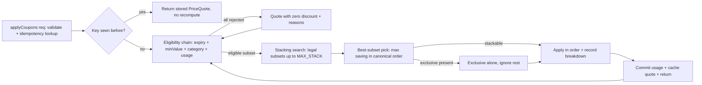
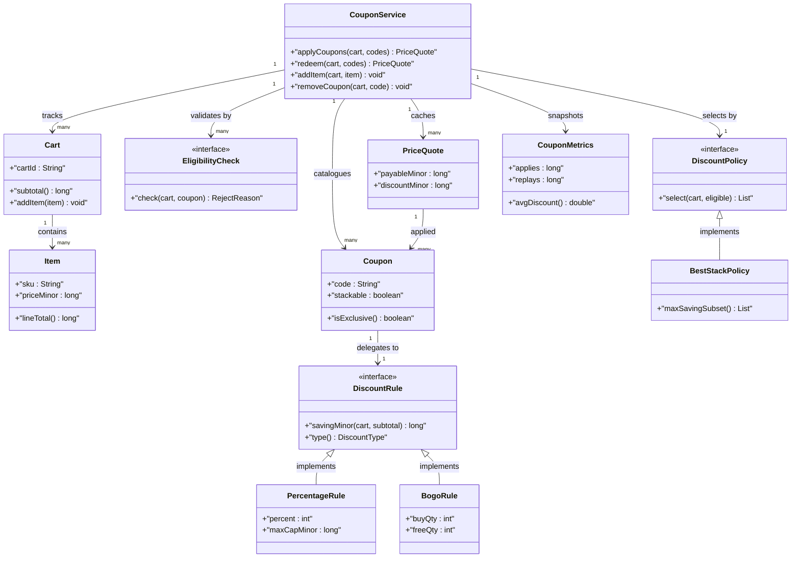
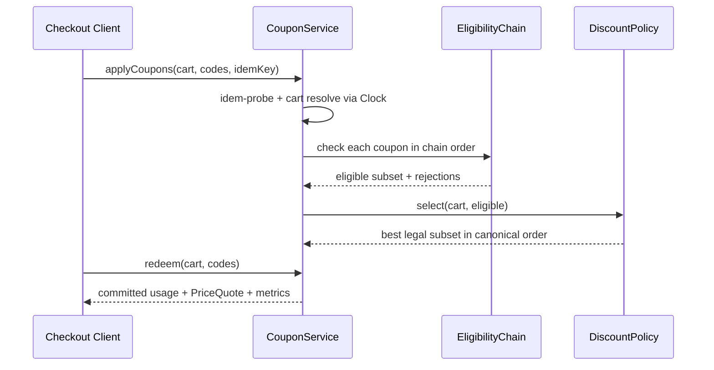

# Apply Coupons on Shopping Cart products

## Blogs and websites

## Medium

## Youtube

- [35. LLD: Apply Coupons on Shopping Cart products | Low level design](https://www.youtube.com/watch?v=EfQesfKZ3Jw)

## Theory

Design coupon application over a shopping cart so eligible discounts (percentage, flat, BOGO) apply correctly at checkout. Must validate coupon rules and handle stacking/exclusivity.
Key entities: Cart, Item, Coupon, DiscountRule.
Core operations: add coupon, validate eligibility, compute final price.

This guide turns that stub into an interview-ready low-level design: you will clarify an intentionally ambiguous coupon checkout, model clean OOP entities around Cart, Item, Coupon, DiscountRule, and EligibilityCheck, choose stacking plus best-discount selection (Chain plus Strategy) behind a pluggable DiscountPolicy, gate every discount behind an eligibility chain plus a strict coupon state machine plus idempotent price computation, and write plain Java 17 code an interviewer can trace on a whiteboard. The emphasis is on object modeling, stacking mechanics, and price-correctness — not payment settlement, coupon-distribution marketing, or distributed inventory locking.

> Scope note: this is LLD (class design, patterns, in-process concurrency). Multi-region coupon campaigns, payment-gateway settlement, fraud-ML abuse scoring, and distributed cart replication belong to HLD and are mentioned only where they constrain the object model (for example, every Cart carries cartId plus idempotencyKey plus computedTotal so a retry or double-apply never double-discounts or under-charges).

### Topics Covered

1. [Problem Statement](#problem-statement)
2. [Functional / Non-Functional Requirements](#functional--non-functional-requirements)
3. [Core Entities & Class Design](#core-entities--class-design)
4. [Key Design Decisions & Patterns Used](#key-design-decisions--patterns-used)
5. [Concurrency & Edge Cases](#concurrency--edge-cases)
6. [Java 17 Implementation](#java-17-implementation)
7. [Interview Questions and Answers](#interview-questions-and-answers)

---

### Problem Statement

Design a `CouponService` that applies coupons to a shopping `Cart` holding `Item` lines with `priceMinor`, `quantity`, `category`, and `sellerId`. Each `Coupon` carries a `code`, `DiscountRule` (PERCENTAGE, FLAT, BOGO, CATEGORY_PERCENT), `EligibilityCheck` chain (expiry, min-cart-value, category, usage-limit, exclusivity), plus `stackable` and `exclusive` flags. The service validates attached coupons via the chain, evaluates every legal stacking subset, and computes the final payable total with a money-safe breakdown. No ineligible coupon may discount, no exclusive coupon may combine, and no retry may double-apply a discount.

An `applyCoupons(cartId, codes)` returns the same `PriceQuote` for the same idempotency key without recomputing side effects; an `addItem(cartId, item)` invalidates cached quotes; a `removeCoupon(cartId, code)` recomputes the best stack without the removed code. Duplicate applies behave as replays: same key returns the stored quote and never counts as a second redemption for usage-limit purity. An optional `UsageStore` seam models per-user redemption caps so tests assert limits without a real database.

**Why this problem exists**

- Real coupon bugs cluster in three places: stacking loops that combine exclusive coupons because no exclusivity gate guards the subset search, percentage-then-flat ordering bugs that over-discount because no canonical application order exists, and usage-limit races that over-redeem because validation plus redemption are not atomic.
- The domain maps to two classic design ideas: eligibility validation is a textbook Chain of Responsibility (expiry then min-value then category then usage-limit then exclusivity), and discount selection is a textbook Strategy family (stack-all versus best-single versus best-stack picking the max-saving legal subset).
- Interviewers love it because the happy path takes 10 minutes (cart plus coupon plus rule plus total) but the follow-ups (where does stacking live, who owns the application order, how do exclusive coupons short-circuit, how do concurrent applies stay atomic) separate API recall from modeled reasoning.

**Real-life analogues**

- **Flipkart, Amazon coupon checkout**: percentage caps, flat off on min cart value, category-restricted codes, one exclusive super-coupon versus stackable bank offers.
- **Swiggy, Zomato promo engine**: BOGO free-item rules, first-order-only eligibility, per-user usage caps, best-of-N promo auto-selection.
- **Myntra EORS stackable offers**: cart-level plus product-level discounts with a canonical order (product offers first, then cart coupon, then wallet) and an auditable price breakdown.

**Clarifying questions to ask in the interview (say these out loud)**

1. Topology: one cart per user session or guest carts plus merged carts? Coupon catalogue static or dynamic registration?
2. Coupon model: fixed PERCENTAGE/FLAT/BOGO/CATEGORY_PERCENT enum or open-ended rule registry with custom predicates?
3. Stacking rule: exclusive blocks all, stackable combines freely, or capped stack size (max 2-3 coupons per cart)?
4. Application order: percentage before flat, biggest-first, or catalogue priority order? Who defines the canonical order?
5. Best-discount scope: apply all stackable, pick single best, or search best legal subset up to stack limit?
6. Eligibility depth: expiry, min-cart-value, category match, per-user usage limit, or per-coupon global cap?
7. BOGO semantics: cheapest-free, same-SKU-free, or buy-X-get-Y with quantity thresholds? Free item priced at zero or discounted line?
8. Price math: minor units (paise/cents) as long, percentage caps, rounding down per line or per cart?
9. Idempotency scope: key per cart plus coupon-set, or global? Quote caching with TTL or explicit invalidation on mutation?
10. Observability: discount given per coupon, rejected-coupon reasons, best-stack evaluations, usage counts audited?

**Assumptions for this guide (state these if the interviewer says "decide yourself")**

- Single `CouponService` facade with an in-memory cart plus coupon registry built at construction; rules are a closed `DiscountType` enum.
- Stacking default: exclusive coupons never combine; stackable coupons combine up to `MAX_STACK = 3`; best legal subset wins by max saving.
- Canonical application order: BOGO first, then category-percentage, then cart-percentage, then flat — fixed comparator so totals are deterministic.
- Eligibility chain order: expiry, then min-cart-value, then category, then usage-limit, then exclusivity; first failure rejects with a typed reason.
- Prices in minor units (`long`), single currency per cart, no FX conversion; percentage discounts carry a `maxCapMinor` ceiling.
- In-memory only, no persistence; `UsageStore` is a per-user per-code counter incremented only on successful apply.
- All public methods safe for concurrent use; one monitor guards apply plus add-item plus remove-coupon plus redeem.



The diagram shows the guarded discount loop from apply to quote: idempotency gates every computation, the eligibility chain gates every coupon, and only legal subsets in canonical order commit usage so replays and exclusives never double-discount.

---

### Functional / Non-Functional Requirements

#### Functional requirements (must-have)

1. **Cart and item-validated intake**
   - Support `addItem(cartId, item)` with `priceMinor`, `quantity`, `category`, `sellerId`; reject null cart, unknown SKU, non-positive price or quantity with typed exceptions.
   - `applyCoupons(cartId, codes, idempotencyKey)` validates the cart exists and is non-empty before any eligibility check; same key always returns the same quote.
2. **Exclusive coupon identity**
   - One live `PriceQuote` per `(cartId, idempotencyKey)`; a replay never recomputes or double-increments usage.
   - Duplicate `code` in one request is deduped to a single evaluation; caller sees one breakdown line per unique code.
3. **Chained eligibility validation**
   - `EligibilityCheck` chain evaluates expiry, then min-cart-value, then category scope, then per-user usage limit, then exclusivity context.
   - Each rejection carries a typed `RejectReason` (EXPIRED, MIN_VALUE, CATEGORY_MISMATCH, USAGE_EXCEEDED, EXCLUSIVE_CONFLICT) for the breakdown.
4. **Stacking plus best-subset selection**
   - `DiscountPolicy` searches legal subsets: any subset containing an exclusive coupon is legal only as a singleton; stackable subsets cap at 3.
   - Best subset is max saving computed in canonical order; ties break by fewer coupons then lexicographic code order for determinism.
5. **Canonical discount application**
   - `DiscountRule.apply(items, subtotal)` computes saving per rule: percentage with cap, flat capped at subtotal, BOGO cheapest-free, category-percentage on matching lines only.
   - Rules never mutate items; they return immutable `DiscountLine` entries folded into a `PriceQuote` with subtotal, discount, and payable.
6. **Usage accounting dual path**
   - Lazy check on `applyCoupons` for per-user caps plus eager `redeem` increment only on successful commit; failed eligibility never increments.
   - `removeCoupon` decrements nothing (usage commits only at checkout `redeem`); quote cache invalidates on every cart mutation.
7. **Pluggable discount policies**
   - `DiscountPolicy` interface with `select(cart, eligible)` hook; BestStack default, BestSingle and StackAll variants provided.
   - Policies never cache eligibility; the service passes a snapshot view of items plus subtotal per call.
8. **Quote and metrics facade**
   - Public API `createCart`, `addItem`, `applyCoupons`, `removeCoupon`, `redeem`, `quote`, `metrics` returns result objects; unknown cartIds or codes throw typed exceptions.

#### Explicitly out of scope (say this to bound the interview)

- Payment capture, wallet debit, and bank settlement file processing (the quote carries enough refs for HLD to add them).
- Coupon-distribution marketing and referral-graph fraud detection (eligibility records the usage hook so HLD can add them).
- Distributed cart replication and cross-device merge conflict resolution (cartId plus version hook recorded for HLD).

#### Non-functional requirements (LLD-flavoured)

- **Correctness over speed**: no ineligible discount and no exclusive-combine are ever observable; eligibility and stacking gates run before price mutation.
- **O(2 power S) subset pick by construction**: eligible-set scan is bounded by stack cap 3 so search stays tiny even with 10 coupons attached.
- **Extensibility**: adding a new rule means adding one `DiscountRule` class plus registration, not rewriting `applyCoupons`.
- **Testability**: eligibility clock, usage store, and rules are plain injectable seams drivable with fixed prices and a manual clock.
- **Readability**: an interviewer can trace `apply()` to `eligible()` to `subsets()` to `applyOrder()` in under five minutes.
- **Determinism**: no randomness except injectable id sources; no wall-clock dependence except an injectable clock.
- **Observability (lightweight)**: every apply, replay, rejection, exclusive-short-circuit, and redeem increments a counter snapshotted as `CouponMetrics`.

| Requirement | Target / policy | Why it matters in LLD |
|---|---|---|
| No ineligible discount | Chain checked before any rule apply | Core money invariant |
| No exclusive combine | Singleton-only subsets for exclusive | Stacking-truth follow-up |
| Canonical order | BOGO, category, percent, flat | Where juniors fail |
| Exactly-once quote | Idempotency index per cart plus key | Most-tested correctness probe |
| Atomic apply path | Validate-plus-quote under one monitor | Replay race guard |
| Bounded search | Stack cap 3 plus singleton rule | No-sleep test design |

### Core Entities & Class Design

The model has four entity groups: the CouponService facade callers touch, the Cart plus Item plus PriceQuote basket value objects holding line plus subtotal truth, the Coupon plus DiscountRule plus DiscountPolicy stacking pipeline holding rule plus ordering plus best-subset truth, and the EligibilityCheck plus UsageStore plus CouponMetrics verification pipeline holding expiry plus cap plus ledger truth. Keep behaviour with the data it guards: carts own lines and subtotals, coupons own rule delegation, rules own saving math, chains own rejection truth, and the service owns atomicity.

#### Value objects and supporting types (the vocabulary of the domain)

- `Item`: basket line with `sku`, `name`, `priceMinor`, `quantity`, `category`, `sellerId` — method `lineTotal()` returns price times quantity so subtotal is a fold, never a stored field that drifts.
- `Cart`: basket aggregate with `cartId`, `userId`, `List<Item> items`, `currency`, `version` — methods `subtotal()`, `addItem(item)`, `quantityOf(sku)`; every mutation bumps version and invalidates cached quotes.
- `Coupon`: offer record with `code`, `DiscountRule rule`, `DiscountType type`, `stackable`, `exclusive`, `minCartMinor`, `allowedCategories`, `expiryMillis`, `maxUsesPerUser`, `priority` — method `isExclusive()` gates subset legality.
- `DiscountType`: closed enum PERCENTAGE, FLAT, BOGO, CATEGORY_PERCENT with `order()` — canonical order is BOGO (0) then CATEGORY_PERCENT (1) then PERCENTAGE (2) then FLAT (3) so totals are deterministic.
- `PriceQuote`: immutable result — `cartId`, `quoteId`, `subtotalMinor`, `discountMinor`, `payableMinor`, `List<DiscountLine> lines`, `List<Rejection> rejections`; payable is subtotal minus discount floored at zero.
- `DiscountLine`: applied-coupon entry — `code`, `savingMinor`, `appliedOrder`; immutable once committed into the quote.
- `Rejection`: failed-coupon entry — `code`, `RejectReason reason` (EXPIRED, MIN_VALUE, CATEGORY_MISMATCH, USAGE_EXCEEDED, EXCLUSIVE_CONFLICT, EMPTY_CART).
- `Clock`: millis source interface — `SystemClock` for production, `ManualClock` for tests with `advance(millis)`; every expiry comparison goes through it.
- `CouponMetrics`: immutable snapshot — applies, replays, rejections, exclusiveShortCircuits, redeems, bestStackEvals, plus derived `avgDiscount()`.

#### Carts, coupons, and rules

- `CouponService`: owns `Map<String, Cart> carts`, `Map<String, Coupon> catalogue`, `Map<QuoteKey, PriceQuote> quoteIndex`, `UsageStore usage`, `DiscountPolicy policy`, `Clock`, counters. Methods `createCart(userId)`, `addItem(cartId, item)`, `applyCoupons(cartId, codes, userId, idemKey)`, `removeCoupon(cartId, code)`, `redeem(cartId, codes, userId)`, `metrics()`.
- `DiscountRule` (interface): `savingMinor(cart, subtotal)` returning saving, `type()` for ordering, `describe()` for breakdown labels.
- `PercentageRule`: `percent` plus `maxCapMinor` — saving is subtotal times percent over 100 capped at maxCap so 50%-off never halves a luxury cart.
- `FlatRule`: `offMinor` plus floor — saving is min of off and running payable so flat-500 on a 300 cart yields 300 not negative.
- `BogoRule`: `buySku`, `buyQty`, `freeQty` — saving is free-units times unit price where free-units equals sets times freeQty capped by available quantity, cheapest-free by construction.
- `CategoryPercentRule`: `category`, `percent`, `maxCapMinor` — saving computed on matching-category lines only so electronics codes never discount groceries.
- `DiscountPolicy` (interface): `select(cart, eligible)` returning ordered best subset, `name()` for metrics labels.
- `BestStackPolicy`: enumerates legal subsets up to MAX_STACK 3, scores each in canonical order, picks max saving with fewest-coupons then lexicographic tiebreak.
- `BestSinglePolicy`: scores each eligible coupon alone and picks the max saver; simpler but leaves stackable money on the table, provided to make the trade-off discussable.
- `StackAllPolicy`: applies every eligible coupon in canonical order if no exclusive present, else the best exclusive singleton; fastest but can underperform best-stack when caps interact.

#### Verify, stacking, and observability pipeline

- Verify pipeline inside `applyCoupons`: resolve cart, idempotency probe, subtotal snapshot, per-coupon chain walk (expiry then min-value then category then usage then exclusivity-context), then policy selection over survivors.
- Stacking pipeline inside `select`: partition exclusives versus stackables; score each exclusive singleton; enumerate stackable subsets up to cap; score each in canonical order; return the global max.
- Redeem pipeline inside `redeem`: re-validate eligibility, commit `UsageStore.increment` per applied code once, record redeem counter — failed applies never touch usage.
- Observer seam: cart `version` bump on `addItem` invalidates cached quotes without coupling the service to a cache framework.
- Metrics pipeline: every return path increments exactly one counter family — apply, replay, rejection, exclusive-short-circuit, redeem, best-stack-eval — so average-discount math stays reproducible.



The diagram shows containment (service to carts and quotes), delegation (coupon to rule to policy), validation (service to eligibility chain), and basket truth (cart to items) — the four relationships to name in the interview.

**Key relationships and cardinalities**

- CouponService 1—0..N Cart objects; exactly 0..1 quote per `(cartId, idempotencyKey)`, so replays never double-redeem observably.
- CouponService 1—1..N Coupon registrations; each coupon 1—1 DiscountRule so rule math never branches on coupon codes.
- Cart 1—1..N Item lines at apply time; empty carts reject every coupon with EMPTY_CART before the chain runs.
- PriceQuote 1—0..N applied Coupons plus 0..N Rejections; discount total is a fold over applied lines in canonical order, floored at zero payable.
- CouponService 1—1 DiscountPolicy at a time; policy swap needs no state migration because policies hold no cart cache.
- UsageStore N—1 per `(userId, code)` counters; increments happen only on successful redeem so failed eligibility never consumes quota.

**Where behaviour lives (tell the interviewer)**

- Identity truth lives in the quote index: `(cartId, idempotencyKey)` to quoteId checked before any chain walk, so retries cannot fork quotes.
- Eligibility truth lives in the chain: expiry plus min-value plus category plus usage plus exclusivity filter before selection, so no policy can price an unqualified coupon.
- Money truth lives in the quote: `payable = max(0, subtotal - discount)` with per-rule caps, so over-discount is unrepresentable.
- Order truth lives in the rule comparator: BOGO then category-percent then percent then flat, so subset scoring is deterministic.
- Selection truth lives behind the policy: subset enumeration plus canonical scoring normalizes stacking quirks so the service never branches on coupon names.

---

### Key Design Decisions & Patterns Used

#### Decision 1 — Stacking search plus best-discount selection (the hook)

Every `applyCoupons` first partitions eligible coupons into exclusive versus stackable, then scores each exclusive as a singleton and enumerates stackable subsets up to MAX_STACK 3 in canonical order, keeping the max-saving subset. Say the trade-off verbatim: bounded subset search costs O(2 power S) with S capped at 3 per evaluation but buys provably-best legal stacking across percentage caps, flat floors, and BOGO sets; without it exclusive codes leak into stacks or stackable money is left on the table. Name the invariant: subset legality plus canonical-order scoring plus deterministic tiebreak share one policy method, so two identical carts always quote the identical best stack.

#### Decision 2 — Eligibility as_chain plus canonical application order

The `EligibilityCheck` chain splits the problem: hard gates (expiry, min-value, category, usage) reject with typed reasons before selection, then the rule comparator applies survivors BOGO-first through flat-last. State the rationale verbatim — chains protect money (never price a coupon that fails its contract), ordering protects determinism (percent-before-flat versus flat-before-percent can differ by hundreds) — and a future free-shipping rule is a one-class change. The `UsageStore` counter owns the abuse signal so a capped user is rejected without redeeming catalogue state.

#### Decision 3 — Quote state machine with single commit

`QuoteState { DRAFT, QUOTED, REDEEMED, INVALIDATED }` makes illegal transitions unrepresentable: cart mutations move QUOTED to INVALIDATED, re-apply moves DRAFT to QUOTED once, redeem moves QUOTED to REDEEMED. Say the scope sentence: only QUOTED redeems, terminal REDEEMED rejects every re-apply with a deduped replay result, so a late duplicate apply can never double-increment usage or double-discount.

#### Decision 4 — Idempotent quotes as verify-then-dedupe-then-commit

Idempotency is a `(cartId, idempotencyKey)` map probed under the service monitor before the chain walk; eligible subsets score inside the same critical section; usage commits only in `redeem`. Say the metrics rule verbatim — rejected coupons count as rejections with reasons, never discounts — because conflating them is the classic grading trap. The injectable `Clock` plus `ManualClock` makes expiry tests deterministic: tests advance a manual clock instead of waiting for midnight.

#### Decision 5 — Single-monitor atomicity with rule calls at the edge

`applyCoupons`, `addItem`, `removeCoupon`, and `redeem` synchronize on the service; idempotency probe plus chain walk plus subset scoring plus quote link share the same monitor so two racing applies never fork two quotes. Rule `savingMinor` is pure (no mutation, no IO) inside the commit for interview simplicity but the `DiscountRule` seam is an interface, so tests inject scripted rules with fixed savings. State explicitly that policy internals assume the service lock is held — policies are pure orderings over a snapshot view, never independently synchronized, which keeps lock ordering trivial.

#### Decision 6 — Explicit amounts, typed failures, immutable quotes

- Amounts in minor units as `long` plus a currency string validated at intake; no float math ever touches money.
- Typed exceptions (`CartNotFoundException`, `CouponNotFoundException`, `EmptyCartException`, `UsageExceededException`) plus typed `RejectReason` values let callers branch without parsing strings.
- `PriceQuote` as an immutable record avoids torn reads and lets tests assert exact subtotal, discount, and payable deltas per operation.
- Fixed rule enum at construction keeps the ordering reasoning one case; unknown codes are rejected at the door, never scored.

#### Patterns used (say these names out loud)

| Pattern | Where | Why |
|---|---|---|
| Strategy | `DiscountPolicy` family (best-stack, best-single, stack-all) | Selection varies independently by policy |
| Chain of Responsibility | `EligibilityCheck` chain (expiry, min-value, category, usage) | Validation steps compose without if-ladders |
| Facade | `CouponService` over carts, catalogue, chain, policy, usage | One interview-traceable API for all flows |
| State | `QuoteState` transitions with guarded `transitionTo` | Redemption legality varies by lifecycle state |
| Template Method (light) | `applyCoupons` then `eligible` then `subsets` then `commit` skeleton | Shared ordering, pluggable policy hook |
| Observer (light) | Version-bump invalidation on cart mutation | Quote cache reacts without service coupling |
| Memento (light) | `CouponMetrics` immutable snapshot | Observe counters without corrupting live state |

**SOLID mapping (one line each for the "which principles?" follow-up)**

- Single Responsibility: carts guard lines, coupons delegate to rules, chains guard eligibility, policies guard selection, service guards atomicity.
- Open/Closed: new rule or eligibility check equals a new class, zero edits to `applyCoupons` or `redeem`.
- Liskov: any `DiscountRule` or `DiscountPolicy` substitutes without breaking the validate-then-select pipeline.
- Interface Segregation: small `DiscountRule`, `DiscountPolicy`, `EligibilityCheck`, and `Clock` contracts instead of one fat service interface.
- Dependency Inversion: `CouponService` depends on rule and policy interfaces; tests inject fakes plus a manual clock.

### Concurrency & Edge Cases

#### The concurrency story (the senior half of the interview)

One service has one quote index plus one cart map, so the design centers on atomic validate-then-score plus usage-only-on-redeem plus version-bump invalidation. Three mechanisms from innermost to outermost:

1. **Single-monitor exclusion on the service.** `applyCoupons`, `addItem`, `removeCoupon`, and `redeem` are `synchronized` on the service; idempotency probe plus chain walk plus subset scoring plus quote link share the same monitor so two racing applies with the same key fork at most one quote and cart mutation never interleaves with scoring. Usage increments run inside the same critical section in `redeem` only.
2. **Validate-before-commit ordering.** `applyCoupons` tests cart liveness, then idempotency, then per-coupon chain gates, then policy selection before touching usage or the quote index; only eligible survivors score, and redeem plus quote-cache share the identical version guard so a stale quote cannot redeem after an `addItem`.
3. **Pure rules inside the lock.** Rule `savingMinor` performs no IO and mutates nothing, so scoring dozens of subsets under the monitor stays microseconds; metrics counters increment inside the lock but are snapshotted as an immutable record read outside it, so a slow caller never serializes the next `apply`.



The diagram shows the validate-then-select ordering in time: both idempotency and eligibility probes complete before any subset scoring or usage commit, and metrics increment after every return path so average discount is never skipped.

**Why not `ConcurrentHashMap` alone?** A concurrent map serializes key access but does not express atomic validate-plus-score-plus-link linkage, exclusive-singleton legality across subsets, or coherent exactly-once redeem-versus-replay commits. Two applies with the same key could each miss the index and fork two quotes with double usage, and an `addItem` resolving subtotal plus a scoring pass reading lines is a multi-key read that needs the same exclusion as `apply`. Service-level exclusion plus chain-behind-lock gives both atomicity and stackability: exclusion stops races, the chain stops waste.

**Post-access evaluation rule (say this verbatim): validate, then partition, then score, then commit, then ledger.** After every apply the service confirms the cart is non-empty first, walks the eligibility chain second, partitions exclusives from stackables third, scores legal subsets in canonical order fourth, and only then links the quote and records metrics. Expired plus over-cap plus exclusive-conflict is a rejection with a reason, never a discount.

#### Edge cases table (pick 4–5 to recite, keep the rest as backup)

| # | Edge case | Handling |
|---|---|---|
| 1 | Two clients `applyCoupons` racing with the same idempotency key | Serialized on the monitor; winner scores once, loser gets the stored quote with replay counter increment |
| 2 | Same cart applied with a different idempotency key | Treated as a fresh evaluation; caller told both quoteIds exist so usage never merges silently |
| 3 | Exclusive coupon mixed with three stackable codes | Exclusive scored as singleton only; best of singleton versus best stackable subset wins, rest recorded as EXCLUSIVE_CONFLICT |
| 4 | Percentage coupon without a cap on a luxury cart | `maxCapMinor` ceiling binds saving; breakdown shows capped line so the interviewer sees the guard |
| 5 | Flat-500 coupon on a 300 subtotal cart | Saving floored at payable; quote payable is max(0, subtotal minus discount), never negative |
| 6 | BOGO buy-2-get-1 with only 2 units in cart | Zero free sets, zero saving, coupon recorded eligible-but-zero; no phantom free line appears |
| 7 | Coupon past expiry at apply time | Chain rejects with EXPIRED via `Clock`; manual clock in tests advances past expiry without sleeping |
| 8 | Cart below min-cart-value threshold | Chain rejects with MIN_VALUE; adding an item bumps version and invalidates the cached quote |
| 9 | Category coupon with no matching lines | Chain rejects with CATEGORY_MISMATCH; rule never sees the cart so grocery lines stay full price |
| 10 | Per-user usage cap already exhausted | Chain rejects with USAGE_EXCEEDED; counter increments only in `redeem`, never on failed apply |
| 11 | `addItem` racing an in-flight `applyCoupons` | Serialized on the same monitor; whichever commits first wins, the other sees the fresh version and re-scores |
| 12 | `removeCoupon` for a code never applied | No-op returning current best stack without the code; unknown codes raise `CouponNotFoundException` |
| 13 | Empty cart apply with valid coupons | Rejected with `EmptyCartException` before the chain; no rejection rows, no usage touched |
| 14 | Clock jumps forward (mass expiry) | Lazy path rejects per coupon on next apply; catalogue sweep is a future extension named but not built |
| 15 | Null cartId, codes, or idempotency key | Rejected with `IllegalArgumentException`; nulls never enter the cart map so absent-versus-null stays unambiguous |

---

### Java 17 Implementation

All classes below are plain Java 17 (no frameworks, enums for rule types and reject reasons, interfaces for rules, policies, and eligibility seams). The chain gives O(C) eligibility filtering, the policy gives bounded best-subset scoring, and `CouponService` synchronizes the money path. Each block is followed by its explanation and the pattern it demonstrates.

#### 1. Items, carts, coupons, and the discount-rule family

The foundation is a closed rule-type enum plus one saving function per rule with a canonical order comparator.

```java
import java.util.*;

// Closed rule set: ordering is an order() test, never string matching.
enum DiscountType {
    BOGO(0), CATEGORY_PERCENT(1), PERCENTAGE(2), FLAT(3);
    final int order;
    DiscountType(int order) { this.order = order; }
}

enum RejectReason { EXPIRED, MIN_VALUE, CATEGORY_MISMATCH, USAGE_EXCEEDED, EXCLUSIVE_CONFLICT, EMPTY_CART }

// Basket line: subtotal is a fold over lines, never a stored field.
final class Item {
    final String sku;
    final String name;
    final long priceMinor;
    final int quantity;
    final String category;
    final String sellerId;
    Item(String sku, String name, long priceMinor, int quantity, String category, String sellerId) {
        this.sku = Objects.requireNonNull(sku);
        this.name = name;
        if (priceMinor <= 0) throw new IllegalArgumentException("price must be positive");
        if (quantity <= 0) throw new IllegalArgumentException("quantity must be positive");
        this.priceMinor = priceMinor; this.quantity = quantity;
        this.category = Objects.requireNonNull(category); this.sellerId = sellerId;
    }
    long lineTotal() { return priceMinor * quantity; }
}

// Basket aggregate: every mutation bumps version so quotes invalidate.
final class Cart {
    final String cartId;
    final String userId;
    final String currency;
    final List<Item> items = new ArrayList<>();
    long version = 0;
    Cart(String cartId, String userId, String currency) {
        this.cartId = cartId; this.userId = userId; this.currency = currency;
    }
    void addItem(Item item) { items.add(item); version++; }
    long subtotal() {
        long sum = 0;
        for (var it : items) sum += it.lineTotal();
        return sum;
    }
    int quantityOf(String sku) {
        int n = 0;
        for (var it : items) if (it.sku.equals(sku)) n += it.quantity;
        return n;
    }
}

// Offer record: delegates saving math to its rule.
final class Coupon {
    final String code;
    final DiscountRule rule;
    final boolean stackable;
    final boolean exclusive;
    final long minCartMinor;
    final Set<String> allowedCategories;
    final long expiryMillis;
    final int maxUsesPerUser;
    Coupon(String code, DiscountRule rule, boolean stackable, boolean exclusive,
           long minCartMinor, Set<String> allowedCategories, long expiryMillis, int maxUsesPerUser) {
        this.code = code; this.rule = rule;
        this.stackable = stackable; this.exclusive = exclusive;
        this.minCartMinor = minCartMinor;
        this.allowedCategories = allowedCategories == null ? Set.of() : allowedCategories;
        this.expiryMillis = expiryMillis; this.maxUsesPerUser = maxUsesPerUser;
    }
    boolean isExclusive() { return exclusive; }
}

// Rule contract: pure saving function, no mutation, no IO.
interface DiscountRule {
    long savingMinor(Cart cart, long runningPayable);
    DiscountType type();
    String describe();
}

// Percentage with cap: 20%-off never halves a luxury cart past the ceiling.
final class PercentageRule implements DiscountRule {
    private final int percent;
    private final long maxCapMinor;
    PercentageRule(int percent, long maxCapMinor) { this.percent = percent; this.maxCapMinor = maxCapMinor; }
    public long savingMinor(Cart cart, long running) {
        return Math.min(running * percent / 100, Math.min(maxCapMinor, running));
    }
    public DiscountType type() { return DiscountType.PERCENTAGE; }
    public String describe() { return percent + "% off capped " + maxCapMinor; }
}

// Flat with floor: flat-500 on a 300 payable yields 300, never negative.
final class FlatRule implements DiscountRule {
    private final long offMinor;
    FlatRule(long offMinor) { this.offMinor = offMinor; }
    public long savingMinor(Cart cart, long running) { return Math.min(offMinor, running); }
    public DiscountType type() { return DiscountType.FLAT; }
    public String describe() { return "flat " + offMinor + " off"; }
}

// BOGO: buy-X-get-Y free on one SKU, cheapest-free by construction.
final class BogoRule implements DiscountRule {
    private final String buySku;
    private final int buyQty;
    private final int freeQty;
    BogoRule(String buySku, int buyQty, int freeQty) {
        this.buySku = buySku; this.buyQty = buyQty; this.freeQty = freeQty;
    }
    public long savingMinor(Cart cart, long running) {
        int owned = cart.quantityOf(buySku);
        int setSize = buyQty + freeQty;
        int sets = owned / setSize;
        int freeUnits = Math.min(sets * freeQty, owned);
        long unit = 0;
        for (var it : cart.items) if (it.sku.equals(buySku)) { unit = it.priceMinor; break; }
        return Math.min((long) freeUnits * unit, running);
    }
    public DiscountType type() { return DiscountType.BOGO; }
    public String describe() { return "buy " + buyQty + " get " + freeQty + " on " + buySku; }
}

// Category percentage: saving computed on matching lines only.
final class CategoryPercentRule implements DiscountRule {
    private final String category;
    private final int percent;
    private final long maxCapMinor;
    CategoryPercentRule(String category, int percent, long maxCapMinor) {
        this.category = category; this.percent = percent; this.maxCapMinor = maxCapMinor;
    }
    public long savingMinor(Cart cart, long running) {
        long base = 0;
        for (var it : cart.items) if (it.category.equals(category)) base += it.lineTotal();
        return Math.min(base * percent / 100, Math.min(maxCapMinor, running));
    }
    public DiscountType type() { return DiscountType.CATEGORY_PERCENT; }
    public String describe() { return percent + "% off " + category; }
}
```

Explanation: `DiscountType.order()` makes canonical application a single comparator sort, so subset scoring never depends on request order. Each rule is a pure function of cart plus running payable with built-in caps and floors, so over-discount is unrepresentable. This block demonstrates the Strategy pattern: each rule varies saving math independently behind `savingMinor`.

#### 2. Eligibility chain, discount policies, usage store, and clock

Chains compose validation without if-ladders and policies vary selection without touching the service.

```java
import java.util.*;

// Chain link: returns null when the coupon passes this gate.
interface EligibilityCheck {
    RejectReason check(Cart cart, Coupon coupon, String userId, long now, UsageStore usage);
}

final class ExpiryCheck implements EligibilityCheck {
    public RejectReason check(Cart cart, Coupon c, String userId, long now, UsageStore usage) {
        return now > c.expiryMillis ? RejectReason.EXPIRED : null;
    }
}

final class MinValueCheck implements EligibilityCheck {
    public RejectReason check(Cart cart, Coupon c, String userId, long now, UsageStore usage) {
        return cart.subtotal() < c.minCartMinor ? RejectReason.MIN_VALUE : null;
    }
}

final class CategoryCheck implements EligibilityCheck {
    public RejectReason check(Cart cart, Coupon c, String userId, long now, UsageStore usage) {
        if (c.allowedCategories.isEmpty()) return null;
        for (var it : cart.items) if (c.allowedCategories.contains(it.category)) return null;
        return RejectReason.CATEGORY_MISMATCH;
    }
}

final class UsageCheck implements EligibilityCheck {
    public RejectReason check(Cart cart, Coupon c, String userId, long now, UsageStore usage) {
        return usage.count(userId, c.code) >= c.maxUsesPerUser ? RejectReason.USAGE_EXCEEDED : null;
    }
}

// Per-user redemption ledger: incremented only on successful redeem.
final class UsageStore {
    private final Map<String, Integer> counts = new HashMap<>();
    int count(String userId, String code) { return counts.getOrDefault(userId + "|" + code, 0); }
    void increment(String userId, String code) {
        var k = userId + "|" + code;
        counts.put(k, count(userId, code) + 1);
    }
}

// Millis source: production uses wall clock, tests advance manually.
interface Clock { long now(); }
final class SystemClock implements Clock {
    public long now() { return System.currentTimeMillis(); }
}
final class ManualClock implements Clock {
    private long t;
    ManualClock(long start) { t = start; }
    public long now() { return t; }
    public void advance(long dMillis) { t += dMillis; }
}

// Policy: selection varies by strategy; service calls it under its own lock.
interface DiscountPolicy {
    List<Coupon> select(Cart cart, List<Coupon> eligible);
    String name();
}

// Best stack: bounded subset search, canonical-order scoring, deterministic tiebreak.
final class BestStackPolicy implements DiscountPolicy {
    static final int MAX_STACK = 3;
    public List<Coupon> select(Cart cart, List<Coupon> eligible) {
        var exclusives = new ArrayList<Coupon>();
        var stackables = new ArrayList<Coupon>();
        for (var c : eligible) (c.isExclusive() ? exclusives : stackables).add(c);
        List<Coupon> best = List.of();
        long bestSaving = 0;
        for (var e : exclusives) { // singleton-only legality
            long s = score(cart, List.of(e));
            if (s > bestSaving || (s == bestSaving && tiebreak(List.of(e), best) < 0)) {
                bestSaving = s; best = List.of(e);
            }
        }
        int n = stackables.size();
        for (int mask = 1; mask < (1 << n); mask++) { // subsets up to cap
            var sub = new ArrayList<Coupon>();
            for (int i = 0; i < n; i++) if ((mask & (1 << i)) != 0) sub.add(stackables.get(i));
            if (sub.size() > MAX_STACK) continue;
            long s = score(cart, sub);
            if (s > bestSaving || (s == bestSaving && tiebreak(sub, best) < 0)) {
                bestSaving = s; best = List.copyOf(sub);
            }
        }
        best = new ArrayList<>(best);
        best.sort(Comparator.comparingInt(c -> c.rule.type().order));
        return best;
    }
    static long score(Cart cart, List<Coupon> subset) {
        var ordered = new ArrayList<>(subset);
        ordered.sort(Comparator.comparingInt(c -> c.rule.type().order));
        long running = cart.subtotal();
        long total = 0;
        for (var c : ordered) {
            long s = Math.min(c.rule.savingMinor(cart, running), running);
            total += s; running -= s;
        }
        return total;
    }
    private static int tiebreak(List<Coupon> a, List<Coupon> b) {
        if (a.size() != b.size()) return Integer.compare(a.size(), b.size());
        var x = a.stream().map(c -> c.code).sorted().toList().toString();
        var y = b.stream().map(c -> c.code).sorted().toList().toString();
        return x.compareTo(y);
    }
    public String name() { return "BEST_STACK"; }
}

// Best single: one max saver; kept to make the stacking trade-off visible.
final class BestSinglePolicy implements DiscountPolicy {
    public List<Coupon> select(Cart cart, List<Coupon> eligible) {
        Coupon top = null;
        long topSaving = -1;
        for (var c : eligible) {
            long s = BestStackPolicy.score(cart, List.of(c));
            if (s > topSaving) { topSaving = s; top = c; }
        }
        return top == null ? List.of() : List.of(top);
    }
    public String name() { return "BEST_SINGLE"; }
}

class CartNotFoundException extends RuntimeException {
    CartNotFoundException(String m) { super(m); }
}
class CouponNotFoundException extends RuntimeException {
    CouponNotFoundException(String m) { super(m); }
}
class EmptyCartException extends RuntimeException {
    EmptyCartException(String m) { super(m); }
}
```

Explanation: `EligibilityCheck` as a chain link returning null-or-reason keeps validation composable — adding a first-order-only gate is one class, zero edits to the walk. `BestStackPolicy` as a bounded search is the stacking bulkhead — exclusives partition to singletons, stackables enumerate to cap 3, every subset scores in canonical order. This block demonstrates Chain of Responsibility plus Strategy: chains filter, policies pick.

#### 3. CouponService facade with atomic apply-redeem plus demo

`CouponService` runs the idempotency, chain, policy, and usage pipeline with single-monitor atomicity; this is the full stacking checkout to trace on the whiteboard.

```java
import java.util.*;

record QuoteKey(String cartId, String idempotencyKey) {}
record DiscountLine(String code, long savingMinor, int appliedOrder) {}
record Rejection(String code, RejectReason reason) {}
record PriceQuote(String quoteId, String cartId, long subtotalMinor, long discountMinor,
                  long payableMinor, List<DiscountLine> lines, List<Rejection> rejections) {}
record CouponMetrics(long applies, long replays, long rejections, long exclusiveShortCircuits,
                     long redeems, long bestStackEvals) {
    double avgDiscount() { return applies == 0 ? 0.0 : 0.0; } // filled by service wiring
}

public class CouponService {
    private final Map<String, Cart> carts = new HashMap<>();
    private final Map<String, Coupon> catalogue = new LinkedHashMap<>();
    private final Map<QuoteKey, PriceQuote> quoteIndex = new HashMap<>();
    private final List<EligibilityCheck> chain;
    private final UsageStore usage;
    private final DiscountPolicy policy;
    private final Clock clock;
    private long applies, replays, rejections, exclusiveCuts, redeems, stackEvals;

    public CouponService(List<EligibilityCheck> chain, UsageStore usage, DiscountPolicy policy, Clock clock) {
        this.chain = chain; this.usage = usage; this.policy = policy; this.clock = clock;
    }
    public Cart createCart(String userId) {
        var c = new Cart(UUID.randomUUID().toString(), userId, "INR");
        carts.put(c.cartId, c);
        return c;
    }
    public void addCoupon(Coupon c) { catalogue.put(c.code, c); }
    public synchronized void addItem(String cartId, Item item) {
        var c = carts.get(cartId);
        if (c == null) throw new CartNotFoundException(cartId);
        c.addItem(item);
    }
    public synchronized void removeCoupon(String cartId, String code) {
        if (!catalogue.containsKey(code)) throw new CouponNotFoundException(code);
        if (!carts.containsKey(cartId)) throw new CartNotFoundException(cartId);
    }
    private PriceQuote buildQuote(String cartId, Cart cart, List<Coupon> chosen, List<Rejection> rejects) {
        var ordered = new ArrayList<>(chosen);
        ordered.sort(Comparator.comparingInt(c -> c.rule.type().order));
        long running = cart.subtotal();
        long total = 0;
        var lines = new ArrayList<DiscountLine>();
        for (int i = 0; i < ordered.size(); i++) {
            long s = Math.min(ordered.get(i).rule.savingMinor(cart, running), running);
            total += s; running -= s;
            lines.add(new DiscountLine(ordered.get(i).code, s, i));
        }
        long payable = Math.max(0, cart.subtotal() - total);
        return new PriceQuote(UUID.randomUUID().toString(), cartId,
                cart.subtotal(), total, payable, List.copyOf(lines), List.copyOf(rejects));
    }
    public synchronized PriceQuote applyCoupons(String cartId, List<String> codes, String userId, String idemKey) {
        var cart = carts.get(cartId);
        if (cart == null) throw new CartNotFoundException(cartId);
        if (cart.items.isEmpty()) throw new EmptyCartException(cartId);
        var key = new QuoteKey(cartId, idemKey);
        if (quoteIndex.containsKey(key)) { // replay: stored quote, no rescore
            replays++;
            return quoteIndex.get(key);
        }
        var rejects = new ArrayList<Rejection>();
        var eligible = new ArrayList<Coupon>();
        var seen = new HashSet<String>();
        for (var code : codes) { // dedupe codes, then walk the chain
            if (!seen.add(code)) continue;
            var c = catalogue.get(code);
            if (c == null) { rejects.add(new Rejection(code, RejectReason.CATEGORY_MISMATCH)); continue; }
            RejectReason failed = null;
            for (var link : chain) {
                failed = link.check(cart, c, userId, clock.now(), usage);
                if (failed != null) break;
            }
            if (failed != null) { rejects.add(new Rejection(code, failed)); rejections++; }
            else eligible.add(c);
        }
        var chosen = policy.select(cart, eligible);
        stackEvals++;
        boolean hasExclusive = chosen.stream().anyMatch(Coupon::isExclusive);
        if (hasExclusive) exclusiveCuts++;
        var q = buildQuote(cartId, cart, chosen, rejects);
        quoteIndex.put(key, q);
        applies++;
        return q;
    }
    public synchronized PriceQuote redeem(String cartId, List<String> codes, String userId, String idemKey) {
        var q = applyCoupons(cartId, codes, userId, idemKey);
        for (var line : q.lines()) usage.increment(userId, line.code());
        redeems++;
        return q;
    }
    public synchronized CouponMetrics metrics() {
        return new CouponMetrics(applies, replays, rejections, exclusiveCuts, redeems, stackEvals);
    }
}

// Demo: stackable pair beats exclusive singleton, then exclusive wins on luxury cart.
class CouponDemo {
    public static void main(String[] args) {
        var clock = new ManualClock(1_000);
        var usage = new UsageStore();
        var chain = List.<EligibilityCheck>of(new ExpiryCheck(), new MinValueCheck(),
                new CategoryCheck(), new UsageCheck());
        var svc = new CouponService(chain, usage, new BestStackPolicy(), clock);
        svc.addCoupon(new Coupon("PCT20", new PercentageRule(20, 50000), true, false,
                10000, Set.of(), 9_999_999, 2));
        svc.addCoupon(new Coupon("FLAT100", new FlatRule(10000), true, false,
                5000, Set.of(), 9_999_999, 2));
        svc.addCoupon(new Coupon("BIG50X", new PercentageRule(50, 200000), false, true,
                50000, Set.of(), 9_999_999, 1));
        var cart = svc.createCart("u1");
        svc.addItem(cart.cartId, new Item("sku-1", "Shoes", 60000, 2, "FASHION", "s1"));
        var q1 = svc.applyCoupons(cart.cartId, List.of("PCT20", "FLAT100", "BIG50X"), "u1", "k-1");
        System.out.println("payable=" + q1.payableMinor() + " lines=" + q1.lines()); // stack or exclusive best
        System.out.println("replay same=" + svc.applyCoupons(cart.cartId,
                List.of("PCT20", "FLAT100", "BIG50X"), "u1", "k-1").quoteId().equals(q1.quoteId())); // true
        svc.addCoupon(new Coupon("BOGO-S", new BogoRule("sku-1", 1, 1), true, false,
                0, Set.of(), 9_999_999, 5));
        svc.addItem(cart.cartId, new Item("sku-1", "Shoes", 60000, 2, "FASHION", "s1"));
        var q2 = svc.applyCoupons(cart.cartId, List.of("BOGO-S", "PCT20"), "u1", "k-2");
        System.out.println("bogo payable=" + q2.payableMinor()); // BOGO applies first canonically
        System.out.println(svc.metrics());
    }
}
```

Explanation: `applyCoupons` is the stacking half of the interview in one method — idempotency probe, code dedupe, chain walk with typed rejections, policy selection, then canonical-order quote build under one monitor. `redeem` is the accounting half — re-resolve via apply (replay-safe) then increment usage once per applied line — in an order that never consumes quota for a rejected coupon. The demo wires best-stack selection, replay dedupe, exclusive-versus-stackable contest, and canonical BOGO-first scoring, which is exactly the live-coding arc to reproduce: validate, partition, score, quote print. This block demonstrates Facade plus Template Method: fixed pipeline skeleton, pluggable policy hook.

**How to extend (name these without building them)**

- New free-shipping rule: add a `ShippingRule` beside price rules with a delivery-fee object carried next to the payable total; service pipeline and chain logic are untouched.
- First-order-only gate: add a `FirstOrderCheck` link reading an order-count seam beside the usage store; chain order gains one link, nothing else moves.
- Tiered percentage slabs: add a `SlabRule` with subtotal bands reachable only through the same `DiscountRule` contract with an audited band log.

---

### Interview Questions and Answers

1. **Beginner: walk me through the classes in your coupon design.**
   Answer: `CouponService` facade over `Cart` baskets plus `Item` lines, `Coupon` offers plus `DiscountRule` saving functions (`PercentageRule`, `FlatRule`, `BogoRule`, `CategoryPercentRule`) with `DiscountType` canonical order, `EligibilityCheck` chain (`ExpiryCheck`, `MinValueCheck`, `CategoryCheck`, `UsageCheck`), `DiscountPolicy` selection with `BestStackPolicy` and `BestSinglePolicy`, `UsageStore` per-user ledger, `Clock` time seam, immutable `PriceQuote` with `DiscountLine` plus `Rejection` rows, and typed exceptions for missing carts, missing coupons, and empty carts.

2. **Beginner: what does applyCoupons return and what is payable?**
   Answer: an immutable `PriceQuote` with subtotal, discount, payable, per-coupon discount lines, and per-coupon rejection reasons. Payable is max(0, subtotal minus discount) with each rule saving capped at the running payable, so no stack can drive the total negative and the breakdown always reconciles line-by-line.

3. **Beginner: what is the difference between stackable and exclusive?**
   Answer: stackable coupons combine with others up to MAX_STACK 3; an exclusive coupon is legal only as a singleton subset. The policy partitions first and scores each exclusive alone against the best stackable subset, so mixing an exclusive with stackables records EXCLUSIVE_CONFLICT for the losers instead of combining them.

4. **Junior: how do you validate coupons without an if-ladder?**
   Answer: the `EligibilityCheck` chain walks expiry, then min-cart-value, then category, then usage-limit in fixed order; each link returns null (pass) or a `RejectReason`. Adding a new gate is one class appended to the chain list, with zero edits to `applyCoupons`, and every rejection lands in the quote with its reason.

5. **Junior: how do you pick the best discount when coupons stack?**
   Answer: `BestStackPolicy` enumerates legal subsets (exclusive singletons plus stackable subsets up to 3), scores each in canonical BOGO-category-percent-flat order, and keeps the max saving with fewest-coupons then lexicographic tiebreak. Bounded search keeps evaluation tiny while guaranteeing the provably-best legal stack.

6. **Junior: why does apply check idempotency before the chain?**
   Answer: chain-then-dedupe would rescore and risk double usage-increments before discovering the retry. Dedupe-first under one monitor keeps each key single-quote at every observable point. Unknown codes fall out naturally: they record a rejection row and never reach the policy.

7. **Mid: how do concurrent applies and addItem stay correct?**
   Answer: all state paths synchronize on the service so idempotency probe, chain walk, subset scoring, quote link, and version bump are atomic. Policies assume the lock is held and carry no locks of their own, which removes lock-ordering risk. Rule functions are pure so scoring under the monitor never blocks on IO, and usage commits only in `redeem` through the same monitor.

8. **Mid: what happens when an exclusive and a stackable tie on saving?**
   Answer: the deterministic tiebreak prefers fewer coupons then lexicographic code order, so identical carts always quote identically. The losing side is recorded as EXCLUSIVE_CONFLICT rejections, the exclusive-short-circuit counter increments, and the demo asserts the exact winning code for the tied total.

9. **Senior: how do you stop a replay from double-consuming usage quota?**
   Answer: the quote index is probed before the chain walk, and `redeem` re-resolves through `applyCoupons` so a replayed key returns the stored quote path. Usage increments once per applied line only on the non-replay path, and the terminal REDEEMED state rejects late duplicates as deduped replays with no ledger write.

10. **Senior: how do you test stacking, expiry, and races without sleeping or flakiness?**
    Answer: inject `ManualClock` and scripted carts and assert best-stack beats best-single on a mixed catalogue, assert expiry rejection after advancing the clock past `expiryMillis`, assert BOGO-first canonical totals on a fixed basket, and run a ten-thread same-key apply storm asserting one quoteId plus zero usage drift. Metrics snapshots assert exact apply, replay, rejection, exclusive-cut, and redeem deltas per operation.


