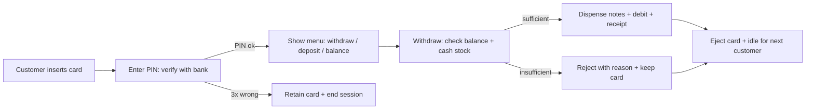
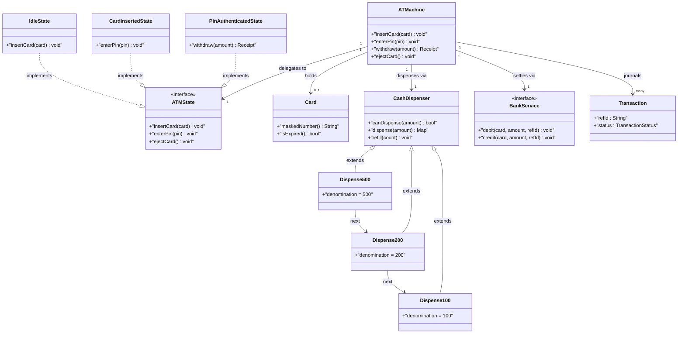
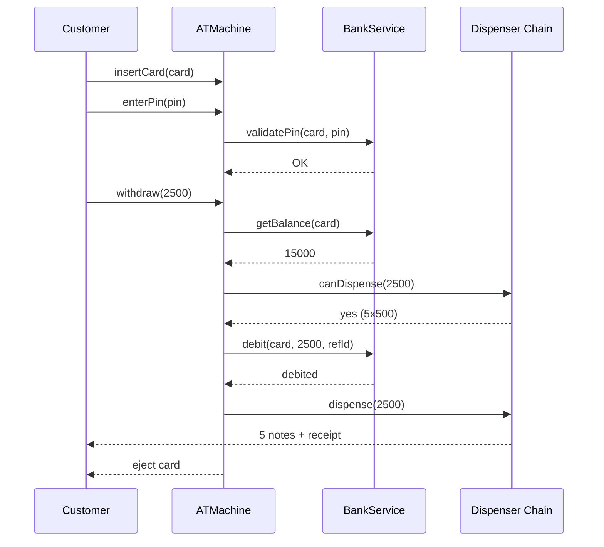

# Design ATM Machine

## Blogs and websites

## Medium

## Youtube

- [17. LLD of ATM | ATM Low Level System Design | Design an ATM | Low Level Design Interview question](https://www.youtube.com/watch?v=JH7gcXeR3ds)

## Theory

Uses the State pattern to model different ATM states (e.g., Card Required, PIN Required, PIN Accepted).

Uses the Chain of Responsibility pattern for cash dispensing (deciding how many 500s, 200s, and so on).

Design an ATM that authenticates a customer by card plus PIN, serves one session at a time, and dispenses cash from a limited inventory while staying consistent with the bank.
Key entities: ATMachine, Card, Account, BankService, ATMState, CashDispenser chain, Transaction.
Core operations: insert card, enter PIN, withdraw, deposit, balance inquiry, change PIN, eject card.

This guide turns that stub into an interview-ready low-level design: you will clarify an intentionally ambiguous machine, model clean OOP entities, choose State for the session lifecycle and Chain of Responsibility for cash dispensing, handle single-user concurrency plus cash-race safety, and write plain Java 17 code an interviewer can trace on a whiteboard. The emphasis is on object modeling, state transitions, and trade-offs — not frameworks, networking, or distributed banking.

> Scope note: this is LLD (class design, patterns, in-process concurrency). Core banking ledgers, network protocols, HSM PIN encryption, and multi-ATM cash logistics belong to HLD and are mentioned only where they constrain the object model (for example, every dispense must carry a bank reference ID so a retry never double-debits).

### Topics Covered

1. [Problem Statement](#problem-statement)
2. [Functional / Non-Functional Requirements](#functional--non-functional-requirements)
3. [Core Entities & Class Design](#core-entities--class-design)
4. [Key Design Decisions & Patterns Used](#key-design-decisions--patterns-used)
5. [Concurrency & Edge Cases](#concurrency--edge-cases)
6. [Java 17 Implementation](#java-17-implementation)
7. [Interview Questions and Answers](#interview-questions-and-answers)

---

### Problem Statement

Design a single ATM machine that serves one customer at a time: read a card, verify its PIN with the bank, offer a menu (withdraw cash, deposit cash or cheque, balance inquiry, mini statement, change PIN), execute the chosen transaction against the bank and the local cash inventory, print a receipt, and eject the card.

A customer inserts a card. The machine reads the card number and asks for the PIN. After successful authentication it shows the menu. On a withdrawal it checks the account balance via the bank service, checks its own cash stock, dispenses notes in large denominations first, debits the account exactly once, and prints a receipt. On a deposit it accepts the envelope or cash count, credits the account after verification, and receipts it. An operator refills cash and takes the machine in and out of service. Three wrong PINs retain the card.

**Why this problem exists**

- Real ATMs lose money to double-dispense (cash out but retry debits twice), state confusion (card ejected mid-dispense), and empty-cassette promises (approve then fail to dispense).
- The domain maps to two classic patterns: session lifecycle is a textbook State machine, and note dispensing is a textbook Chain of Responsibility.
- Interviewers love it because the happy path takes 10 minutes but the follow-ups (wrong PIN lockout, partial dispense, power failure mid-dispense, low-cash handling) separate junior from senior answers.

**Real-life analogues**

- **Bank ATMs and cash recyclers**: cassettes per denomination, retract bins, journal printers, operator refill mode.
- **Kiosks and vending terminals**: single-user session, card auth, exact-change dispensing logic.
- **POS refund flows**: approve centrally, settle locally, reconcile on failure — the same exactly-once tension.

**Clarifying questions to ask in the interview (say these out loud)**

1. Single ATM or a fleet? Shared bank service or per-ATM ledger?
2. Card types: bank-own debit cards only, or inter-bank via a switch? Chip plus PIN, or magstripe fallback?
3. Operations: withdraw, deposit, balance, mini statement, PIN change, funds transfer? Which are in scope?
4. Withdrawal limits: per-transaction cap, daily cap, per-denomination stock?
5. Denominations supported: 2000s, 500s, 200s, 100s? Fewest-notes or exact-match policy?
6. PIN policy: retries before card retain, lockout duration, change-PIN flow?
7. Failure handling: bank timeout after cash dispensed, power cut mid-dispense, partial jam — debit or auto-reverse?
8. Receipts: printed always, on demand, or SMS only? Journal log needed?
9. Operator flows: cash refill, cassette audit, out-of-service switch, collect retained cards?
10. Concurrency: strictly one active session, but background refill and telemetry threads?

**Assumptions for this guide (state these if the interviewer says "decide yourself")**

- One ATM process, one active customer session; denominations 500, 200, 100 with per-cassette counts.
- Card plus 4-digit PIN; 3 wrong attempts retain the card; session timeout of 60 seconds ejects the card.
- Withdrawal per-transaction cap 20,000 and daily cap 40,000 enforced via the bank service stub.
- Fewest-notes policy: largest denomination first; if exact change is impossible, reject before debiting.
- Money in integer rupees (long); bank service is an injected interface with an in-memory stub for the interview.
- Operator can refill cassettes, audit totals, and toggle in-service state; retained cards go to a list.



The diagram shows the guarded session lifecycle from insert to eject: authentication gates the menu, withdrawal checks both bank balance and local stock before any money moves, and every path ends in eject or retain so the machine never strands the next customer.

---

### Functional / Non-Functional Requirements

#### Functional requirements (must-have)

1. **Card insert and session start**
   - Accept a card, read card number and bank ID, reject expired or blocked cards with a clear reason.
   - Start exactly one session; a second insert while busy is rejected until eject or timeout.
2. **PIN authentication**
   - Prompt for PIN, verify via `BankService.validatePin`; allow up to 3 attempts per session.
   - On the third failure retain the card, log the event, and return to idle.
   - Support session timeout: no input for 60 seconds ejects the card automatically.
3. **Cash withdrawal**
   - Accept an amount; validate multiples of 100, per-transaction and daily limits.
   - Check account balance through the bank and local cassette stock through the dispenser chain — in that order.
   - Dispense fewest notes largest-first, debit the account exactly once, print a receipt with reference ID.
   - If exact notes are impossible or stock is short, reject before any debit.
4. **Cash and cheque deposit**
   - Accept declared amount plus envelope or counted cash; credit via bank after verification.
   - Reject mismatched counts with a typed error; always receipt the outcome.
5. **Balance inquiry and mini statement**
   - Show current balance and last 5 transactions fetched from the bank; no cash movement.
6. **Change PIN**
   - Verify old PIN once more, accept and confirm new PIN, update via bank; receipt without printing the PIN.
7. **Card eject and retain**
   - Eject on success, cancel, timeout, or operator command; retain on 3 PIN failures or bank block order.
8. **Operator maintenance**
   - Refill cassettes by denomination, audit total cash, toggle in-service or out-of-service, list retained cards.

#### Explicitly out of scope (say this to bound the interview)

- Real EMV chip crypto, HSM PIN blocks, and inter-bank switch routing (a `BankService` interface stands in).
- Persistent journal storage and remote monitoring (an append-only in-memory log plus repository seam is enough).
- Cash-in-transit logistics and multi-ATM fleet balancing (per-ATM inventory with total-cash queries keeps the door open).

#### Non-functional requirements (LLD-flavoured)

- **Correctness over speed**: never dispense without a matching exactly-once debit; every state transition is guarded.
- **State safety**: only legal actions per state execute (no withdraw before PIN success); illegal actions throw typed exceptions.
- **Concurrency**: one customer session at a time plus concurrent operator refill and timeout threads handled with fine-grained locks.
- **Extensibility**: adding a denomination, transaction type, or bank rule means adding a class, not rewriting `ATMachine` (Open/Closed Principle).
- **Testability**: states, dispenser chain, and bank service are injectable interfaces so tests drive them with fakes and fixed amounts.
- **Readability**: an interviewer can trace `insertCard()` → `enterPin()` → `withdraw()` → `dispense()` → `eject()` in under five minutes.
- **Robustness**: bank timeouts, jammed notes, insufficient stock, and power-cut windows all fail with typed errors and a reconcile path.
- **Auditability (lightweight)**: every transaction appends to an in-memory journal with reference ID, amount, and outcome.

| Requirement | Target / policy | Why it matters in LLD |
|---|---|---|
| No double-debit | Bank reference ID as idempotency key | Core money safety invariant |
| Exact dispense | Chain pre-check before debit | Prevents approve-then-jam losses |
| PIN safety | 3 strikes retain, no PIN in logs | Standard follow-up question |
| Session hygiene | Always ends in eject or retain | Next customer never blocked |
| Cash truth | Cassette counts only mutate on success | Audit stays reconcilable |
| Session timeout | 60 s inactivity ejects card | Prevents abandoned sessions |

---

### Core Entities & Class Design

The model has five entity groups: session context and card value objects, the State hierarchy for the session lifecycle, the Chain of Responsibility for cash, the bank seam, and the transaction journal. Keep behaviour with the data it guards: states own transition rules, dispensers own cassette counts, the machine owns orchestration, and the bank owns ledger truth.

#### Value objects and enums (the vocabulary of the domain)

- `Card`: immutable — card number, bank ID, expiry date, holder name. Methods `isExpired(clock)`, `maskedNumber()`.
- `Account`: account number, holder, balance snapshot plus daily-withdrawn tracker (ledger truth lives in the bank).
- `TransactionType { WITHDRAWAL, DEPOSIT, BALANCE_INQUIRY, MINI_STATEMENT, PIN_CHANGE }` — what the menu offers.
- `TransactionStatus { SUCCESS, FAILED, REVERSED }` and `Transaction`: reference ID (UUID), type, amount, timestamp, status.
- `ATMStatus { IN_SERVICE, OUT_OF_SERVICE }` — operator-controlled machine availability.
- `Denomination`: 500, 200, 100 note values with per-cassette counts living in dispenser nodes.

#### Session context, states, and machine

- `ATMachine`: the context and orchestrator. Holds current `ATMState`, inserted `Card`, authenticated flag, PIN attempt counter, dispenser chain head, `BankService`, journal list, cash totals. Methods `insertCard()`, `enterPin()`, `withdraw()`, `deposit()`, `checkBalance()`, `changePin()`, `ejectCard()`, `refill()`.
- `ATMState` (interface): `insertCard()`, `enterPin()`, `selectTransaction()`, `ejectCard()` with per-state legal behaviour; illegal calls throw `IllegalStateOperationException`.
- Concrete states: `IdleState` (only insert allowed), `CardInsertedState` (only PIN entry), `PinAuthenticatedState` (menu operations allowed), `OutOfServiceState` (only operator re-enable), plus `CardRetainedState` as a terminal marker before returning to idle.
- State transitions live on the machine via `setState()`; each state receives the machine so it can trigger the next transition after doing its work.

#### Cash dispensing chain (Chain of Responsibility)

- `CashDispenser` (abstract): denomination value, cassette count, `next` pointer. Methods `dispense(amount)` returning a note-count map, `canDispense(amount)` pre-check, `refill(count)`, `availableCash()`.
- Concrete nodes: `Dispense500`, `Dispense200`, `Dispense100` chained largest-first. Each takes as many notes as possible up to its stock, passes the remainder down; the terminal 100-node rejects non-dispensable remainders with `InsufficientCashException`.
- Pre-check before debit: the machine calls `canDispense` on the chain head first; only on success does it call the bank debit, then `dispense` to mutate counts. This ordering is the money-safety core.

#### Bank seam, journal, and operator surface

- `BankService` (interface): `validatePin(card, pin)`, `getBalance(card)`, `debit(card, amount, refId)`, `credit(card, amount, refId)`, `changePin(card, oldPin, newPin)`, `miniStatement(card)`. In-memory stub enforces limits and idempotency on reference IDs.
- `TransactionJournal`: append-only list of `Transaction` records; `log()` on every outcome including failures.
- `Receipt`: printed view — reference ID, type, amount, timestamp, remaining balance; never includes the PIN.
- Operator API on the machine: `refill(denomination, count)`, `totalCash()`, `setInService(boolean)`, `retainedCards()`.



The diagram shows delegation (machine to state), chaining (dispenser nodes largest-first), settling (machine to bank interface), and journaling (machine to many transactions) — the four relationships to name in the interview.

**Key relationships and cardinalities**

- Machine 1—1 State at a time; transitions are `Idle → CardInserted → PinAuthenticated → Idle`, with `→ CardRetained → Idle` on lockout.
- Machine 1—0..1 Card (empty only in idle); card never stored after eject or retain except in the retained list.
- Chain 1—1—1 (500 → 200 → 100); adding a denomination means inserting one node, zero machine changes.
- Machine 1—1 BankService; tests inject the stub, production injects the switch adapter.
- Machine 1—\* Transaction journal (append-only; failures logged too for reconciliation).

**Where behaviour lives (tell the interviewer)**

- Transition guards live in state classes, not in `if` chains on the machine: `IdleState.enterPin` throws, `CardInsertedState.withdraw` throws.
- Attempt counting lives on the machine (shared across PIN tries) but the retain decision fires from the state when the count hits 3.
- Note math lives in dispenser nodes: each node owns `min(remainder / denomination, stock)` and remainder forwarding.
- Money truth lives in the bank: the machine checks `getBalance` and `canDispense` before `debit`, and passes the same reference ID on retry.
- Time lives in `Instant` plus injectable `Clock`: session timeout and statement timestamps stay testable.

---

### Key Design Decisions & Patterns Used

#### Decision 1 — Full State pattern for the session (not enums)

Spot lifecycles in simpler problems fit enums, but ATM sessions have per-state behaviour (idle rejects PIN, inserted counts attempts, authenticated opens the menu) plus transition side effects (retain logs, eject clears). A GoF State hierarchy puts each rule next to its state so `ATMachine` never branches on state names. Name the trade-off: enums would be fewer classes, but every new operation would scatter `if (state == ...)` checks across the machine — exactly the rigidity interviewers probe for.

#### Decision 2 — Chain of Responsibility for cash dispensing

Hard-coding `count500 = amount / 500` inside `withdraw()` freezes the denomination set and duplicates stock checks. A chain of dispenser nodes makes each denomination an independent handler: take what you can, forward the remainder, terminal node rejects the unmakeable remainder. Adding a 2000-note cassette is a one-node insertion. The pre-check (`canDispense` walk without mutating) before the bank debit turns the chain into a reservation probe — textbook chain plus guard.

#### Decision 3 — Pre-check ordering: balance then stock then debit then dispense

The order is deliberate: bank balance first (no point counting cassettes for an overdrawn account), cassette feasibility second (no point debiting for notes that cannot be formed), debit third with an idempotency key, physical dispense last. Any failure before the debit leaves zero ledger effect; any failure after the debit triggers the auto-reverse path. Say this ordering verbatim — it is the senior answer to "where can money leak?".

#### Decision 4 — Bank behind an interface with idempotent reference IDs

The machine never stores real balances; it calls `BankService` for every ledger mutation and passes a UUID reference on each debit or credit. The stub keeps a `processedRefs` set so a retried debit with the same ID returns success without double-charging. This models production exactly-once semantics (bank transaction IDs, switch reconciliation) with ten lines of interview code.

#### Decision 5 — Machine as single-session context with operator seam separated

`ATMachine` enforces one active card: `insertCard` in any non-idle state throws `SessionBusyException`. Operator methods (`refill`, `setInService`) are synchronized separately and never require a card session, so refill during idle is safe and refill during a session mutates only future `canDispense` results, never the in-flight dispense (which pre-checked its stock). State explicitly that a second customer insert while busy is rejected — interviewers test this.

#### Decision 6 — Money as long rupees, time as Instant, IDs as UUID/String

- Money in `long` whole rupees avoids float rounding; fee and limit math stays integer until receipt formatting.
- `java.time.Instant` plus injectable `Clock` makes session timeouts and statement windows deterministic in tests.
- Transaction reference IDs as UUID strings and card numbers as masked strings survive a future move to a journal database.

#### Patterns used (say these names out loud)

| Pattern | Where | Why |
|---|---|---|
| State | Session lifecycle (`IdleState`, `CardInsertedState`, `PinAuthenticatedState`) | Legal-action enforcement without `if` chains |
| Chain of Responsibility | `Dispense500 → 200 → 100` note handlers | Per-denomination stock plus extensible notes |
| Template Method (light) | `CashDispenser.dispense` skeleton, per-node `take` | Shared remainder logic, pluggable take rule |
| Facade | `ATMachine` over states, chain, bank, journal | One interview-traceable API for all flows |
| Strategy (light) | `BankService` and note-order policy | Swap stub for switch adapter without touching states |
| Observer (light) | Journal plus low-cash alert hook | One dispense event, journal and alert readers |

**SOLID mapping (one line each for the "which principles?" follow-up)**

- Single Responsibility: state guards transitions, dispenser guards cassettes, bank guards the ledger, machine orchestrates.
- Open/Closed: new denomination, transaction type, or bank rule equals a new node or class, zero edits to `withdraw()`.
- Liskov: any `ATMState` or `CashDispenser` node substitutes without breaking the machine or chain.
- Interface Segregation: small `ATMState`, `BankService`, `CashDispenser` contracts instead of one fat terminal interface.
- Dependency Inversion: the machine depends on the `BankService` interface; tests inject the in-memory stub.

---

### Concurrency & Edge Cases

#### The concurrency story (the senior half of the interview)

One ATM serves one customer, so the design centers on session exclusion plus two background threads (session timeout, operator refill). Three mechanisms from innermost to outermost:

1. **Session exclusion on the machine.** All session entry points (`insertCard`, `enterPin`, `withdraw`, `ejectCard`) are `synchronized` on the machine; a second insert while non-idle throws `SessionBusyException`. The in-flight dispense holds no chain-wide lock — it pre-checked stock and each node mutates its own count under its own monitor.
2. **Per-node cassette monitors.** Each `CashDispenser` node synchronizes `canDispense`, `dispense`, and `refill` on itself, so an operator refill of 100s races safely with a dispense walking the chain. Counts only decrement after the bank debit succeeds.
3. **Timeout as a guarded transition.** A `ScheduledExecutorService` (or test-driven `expireSession()` hook) fires after 60 seconds of inactivity; it synchronizes on the machine, checks the state is still non-idle, then ejects. Heartbeat `touch()` on every customer action resets the deadline, so an active PIN entry never gets yanked.



The diagram shows the money-safe ordering in time: both feasibility checks complete before the debit, and physical notes move only after the ledger confirms, so a failure at any earlier arrow leaves balances and cassettes untouched.

**Why not `synchronized withdraw()` alone?** A single coarse lock would serialize the customer against refill correctly but would not express which actions are legal per state — a second card could still overwrite session fields between calls. State guards plus machine monitors give both exclusion and legality: exclusion stops races, states stop nonsense.

**Post-debit failure rule (say this verbatim): check → debit → dispense → reverse on jam.** If the dispenser jams after a successful debit, the machine calls `bank.reverse(refId)` (or `credit` with the same reference), journals a `REVERSED` transaction, shows "cash not dispensed, reversal initiated", and ejects. The reference ID makes the reverse idempotent if the jam sensor fires twice.

#### Edge cases table (pick 4–5 to recite, keep the rest as backup)

| # | Edge case | Handling |
|---|---|---|
| 1 | Three wrong PINs | Counter on machine hits 3, state retains card into `retainedCards`, journal logs, back to idle |
| 2 | Expired or blocked card | Rejected at insert with typed `CardRejectedException`; no session started |
| 3 | Second card while busy | `SessionBusyException`; current session unaffected |
| 4 | Amount not multiple of 100 | Rejected before any bank call with `InvalidAmountException` |
| 5 | Over per-transaction or daily limit | Bank stub rejects; machine surfaces limit reason, session stays authenticated |
| 6 | Insufficient account balance | Reject after `getBalance`, before touching cassettes; no journal debit entry |
| 7 | Exact notes impossible (e.g. 250 with 500/200/100) | `canDispense` fails; reject before debit with `InsufficientCashException` |
| 8 | Cassette short but total cash enough | Same as above: chain feasibility is per-denomination, not total; operator alert fires |
| 9 | Bank timeout before debit | Treat as failure, no dispense, journal `FAILED`, customer retries with a new reference |
| 10 | Bank timeout after debit, before dispense | Conservative path: auto-reverse with same reference, journal `REVERSED`, eject |
| 11 | Note jam mid-dispense | Partial counts rolled back to cassettes where sensor confirms, `reverse(refId)`, receipt notes reversal |
| 12 | Power cut mid-dispense | On reboot machine starts `OUT_OF_SERVICE`, journal shows orphan `SUCCESS`-pending entry for operator reconcile |
| 13 | Session timeout mid-menu | Timer ejects card, clears PIN buffer, journal logs timeout; next customer starts clean |
| 14 | Cancel pressed anytime | Immediate eject without journal debit; dispense never started so no reverse needed |
| 15 | Operator refill mid-session | Allowed; only affects subsequent `canDispense` walks, never the in-flight pre-checked dispense |

---

### Java 17 Implementation

All classes below are plain Java 17 (no frameworks, `var` used sparingly). Money is `long` rupees, time is `Instant` plus `Clock`, session entry points are `synchronized` on the machine, and cassette counts are guarded per dispenser node. Each block is followed by its explanation and the pattern it demonstrates.

#### 1. Card, enums, and bank seam

The card is an immutable value object; the bank is an interface with an idempotent in-memory stub for the interview.

```java
import java.time.Clock;
import java.time.Instant;
import java.time.YearMonth;
import java.util.*;

// Immutable value object: equality on card number, never logs the PIN.
public final class Card {
    private final String cardNumber;
    private final String bankId;
    private final YearMonth expiry;
    private final String holder;

    public Card(String cardNumber, String bankId, YearMonth expiry, String holder) {
        if (cardNumber == null || cardNumber.isBlank()) throw new IllegalArgumentException("card required");
        this.cardNumber = cardNumber.replaceAll("\\s", "");
        this.bankId = bankId;
        this.expiry = expiry;
        this.holder = holder;
    }

    public boolean isExpired(Clock clock) {
        return expiry.isBefore(YearMonth.from(java.time.ZonedDateTime.now(clock)));
    }

    public String maskedNumber() {
        return "****-****-****-" + cardNumber.substring(Math.max(0, cardNumber.length() - 4));
    }

    public String cardNumber() { return cardNumber; }
    public String bankId() { return bankId; }
}

enum TransactionType { WITHDRAWAL, DEPOSIT, BALANCE_INQUIRY, MINI_STATEMENT, PIN_CHANGE }
enum TransactionStatus { SUCCESS, FAILED, REVERSED }

record Transaction(String refId, TransactionType type, long amount, Instant at, TransactionStatus status) {}
record Receipt(String refId, TransactionType type, long amount, long balanceAfter, Instant at) {}

// Strategy seam: stub in the interview, switch adapter in production.
interface BankService {
    boolean validatePin(Card card, String pin);
    long getBalance(Card card);
    boolean debit(Card card, long amount, String refId);
    boolean credit(Card card, long amount, String refId);
    List<String> miniStatement(Card card);
}

// In-memory stub: per-card balance, idempotent debits via processedRefs.
class InMemoryBankService implements BankService {
    private final Map<String, Long> balances = new HashMap<>();
    private final Map<String, String> pins = new HashMap<>();
    private final Set<String> processedRefs = new HashSet<>();
    private final long perTxnLimit = 20_000;
    private final long dailyLimit = 40_000;
    private final Map<String, Long> withdrawnToday = new HashMap<>();

    void addAccount(Card card, String pin, long balance) {
        balances.put(card.cardNumber(), balance);
        pins.put(card.cardNumber(), pin);
    }

    public boolean validatePin(Card card, String pin) {
        return pin != null && pin.equals(pins.get(card.cardNumber()));
    }

    public long getBalance(Card card) {
        return balances.getOrDefault(card.cardNumber(), 0L);
    }

    public synchronized boolean debit(Card card, long amount, String refId) {
        if (!processedRefs.add(refId)) return true; // retry with same ref: already done
        long bal = getBalance(card);
        long dayTotal = withdrawnToday.getOrDefault(card.cardNumber(), 0L);
        if (amount <= 0 || amount % 100 != 0) return false;
        if (amount > perTxnLimit || dayTotal + amount > dailyLimit) return false;
        if (bal < amount) return false;
        balances.put(card.cardNumber(), bal - amount);
        withdrawnToday.put(card.cardNumber(), dayTotal + amount);
        return true;
    }

    public synchronized boolean credit(Card card, long amount, String refId) {
        if (!processedRefs.add(refId)) return true;
        balances.put(card.cardNumber(), getBalance(card) + amount);
        return true;
    }

    public List<String> miniStatement(Card card) {
        return List.of("BAL " + getBalance(card), "LAST: -500 ATM WDL", "LAST: +2000 DEP");
    }
}

class CardRejectedException extends RuntimeException {
    CardRejectedException(String msg) { super(msg); }
}
class IllegalStateOperationException extends RuntimeException {
    IllegalStateOperationException(String msg) { super(msg); }
}
class InsufficientCashException extends RuntimeException {
    InsufficientCashException(String msg) { super(msg); }
}
class SessionBusyException extends RuntimeException {
    SessionBusyException(String msg) { super(msg); }
}
```

Explanation: `Card` normalizes the number once so masking and map lookups stay consistent. The stub's `processedRefs` set is the whole exactly-once story in miniature: a retried debit with the same reference returns success without charging twice, which is what production achieves with bank transaction IDs. Typed exceptions let states and gates distinguish "bad card" from "wrong state" without parsing strings.

#### 2. CashDispenser chain (Chain of Responsibility)

```java
import java.util.*;

// Abstract handler: owns one denomination cassette; forwards the remainder.
abstract class CashDispenser {
    protected final int denomination;
    protected int noteCount;
    protected CashDispenser next;

    protected CashDispenser(int denomination, int noteCount) {
        this.denomination = denomination;
        this.noteCount = noteCount;
    }

    public void setNext(CashDispenser next) { this.next = next; }

    // Pure probe: could this chain form amount with current stock?
    public synchronized boolean canDispense(long amount) {
        long need = amount / denomination;
        long take = Math.min(need, noteCount);
        long remainder = amount - take * denomination;
        if (remainder == 0) return true;
        return next != null && next.canDispense(remainder);
    }

    // Mutating dispense: caller must have called canDispense first.
    public synchronized Map<Integer, Integer> dispense(long amount) {
        long need = amount / denomination;
        long take = Math.min(need, noteCount);
        long remainder = amount - take * denomination;
        Map<Integer, Integer> out = new LinkedHashMap<>();
        if (take > 0) {
            noteCount -= (int) take;
            out.put(denomination, (int) take);
        }
        if (remainder == 0) return out;
        if (next == null) throw new InsufficientCashException("Cannot form Rs " + amount);
        Map<Integer, Integer> rest = next.dispense(remainder);
        rest.forEach((k, v) -> out.merge(k, v, Integer::sum));
        return out;
    }

    public synchronized void refill(int count) {
        if (count < 0) throw new IllegalArgumentException("count < 0");
        noteCount += count;
    }

    public synchronized long availableCash() {
        long self = (long) denomination * noteCount;
        return next == null ? self : self + next.availableCash();
    }
}

final class Dispense500 extends CashDispenser {
    Dispense500(int count) { super(500, count); }
}
final class Dispense200 extends CashDispenser {
    Dispense200(int count) { super(200, count); }
}
final class Dispense100 extends CashDispenser {
    Dispense100(int count) { super(100, count); }
}
```

Explanation: each node takes `min(remainder / denomination, stock)` and forwards the rest, so notes come out largest-first with the fewest bills. `canDispense` walks the same path without mutating, which lets the machine probe feasibility before debiting the bank. Adding a 2000 cassette means one new subclass plus a `setNext` insertion — the chain shape never touches `ATMachine`, which is the Open/Closed argument to recite.

#### 3. States, machine, and demo (State pattern)

```java
import java.time.Clock;
import java.time.Instant;
import java.util.*;

// State interface: each state implements only its legal actions.
interface ATMState {
    default void insertCard(ATMachine m, Card c) { throw new IllegalStateOperationException("insert not allowed now"); }
    default void enterPin(ATMachine m, String pin) { throw new IllegalStateOperationException("pin not allowed now"); }
    default Receipt withdraw(ATMachine m, long amount) { throw new IllegalStateOperationException("withdraw not allowed now"); }
    default void ejectCard(ATMachine m) { throw new IllegalStateOperationException("nothing to eject"); }
}

class IdleState implements ATMState {
    public void insertCard(ATMachine m, Card card) {
        if (!m.isInService()) throw new IllegalStateOperationException("ATM out of service");
        if (card.isExpired(m.clock())) throw new CardRejectedException("Card expired: " + card.maskedNumber());
        m.setCard(card);
        m.setState(new CardInsertedState());
    }
}

class CardInsertedState implements ATMState {
    public void enterPin(ATMachine m, String pin) {
        if (m.bank().validatePin(m.card(), pin)) {
            m.setAuthenticated(true);
            m.setState(new PinAuthenticatedState());
        } else {
            int left = m.registerFailedPin();
            if (left <= 0) m.retainCard(); // 3rd failure: retain + idle
        }
    }
    public void ejectCard(ATMachine m) { m.ejectToIdle(); }
}

class PinAuthenticatedState implements ATMState {
    // Check-then-debit-then-dispense: the money-safe order.
    public Receipt withdraw(ATMachine m, long amount) {
        if (amount <= 0 || amount % 100 != 0) throw new IllegalArgumentException("Amount must be multiple of 100");
        long balance = m.bank().getBalance(m.card());
        if (balance < amount) throw new IllegalStateOperationException("Insufficient account balance");
        if (!m.dispenser().canDispense(amount)) throw new InsufficientCashException("ATM cannot dispense Rs " + amount);
        String ref = UUID.randomUUID().toString();
        if (!m.bank().debit(m.card(), amount, ref)) throw new IllegalStateOperationException("Bank declined withdrawal");
        try {
            Map<Integer, Integer> notes = m.dispenser().dispense(amount);
            long after = m.bank().getBalance(m.card());
            Receipt r = new Receipt(ref, TransactionType.WITHDRAWAL, amount, after, m.clock().instant());
            m.journal(new Transaction(ref, TransactionType.WITHDRAWAL, amount, r.at(), TransactionStatus.SUCCESS));
            System.out.println("Dispensed " + notes + " ref=" + ref);
            return r;
        } catch (RuntimeException jam) {
            m.bank().credit(m.card(), amount, ref + ":reverse"); // auto-reverse on jam
            m.journal(new Transaction(ref, TransactionType.WITHDRAWAL, amount, m.clock().instant(), TransactionStatus.REVERSED));
            throw new IllegalStateOperationException("Jam after debit; reversal initiated for " + ref);
        }
    }
    public void ejectCard(ATMachine m) { m.ejectToIdle(); }
}

// ATMachine: the State context and Facade over chain, bank, and journal.
public class ATMachine {
    private ATMState state = new IdleState();
    private Card card;
    private boolean authenticated;
    private int pinAttempts;
    private boolean inService = true;
    private final CashDispenser dispenser;
    private final BankService bank;
    private final Clock clock;
    private final List<Transaction> journal = new ArrayList<>();
    private final List<Card> retained = new ArrayList<>();

    public ATMachine(CashDispenser dispenser, BankService bank, Clock clock) {
        CashDispenser h = dispenser;
        this.dispenser = dispenser;
        this.bank = bank;
        this.clock = clock;
    }

    public synchronized void insertCard(Card c) {
        if (!(state instanceof IdleState)) throw new SessionBusyException("Session busy; eject first");
        state.insertCard(this, c);
        pinAttempts = 0;
        authenticated = false;
    }

    public synchronized void enterPin(String pin) { state.enterPin(this, pin); }
    public synchronized Receipt withdraw(long amount) { return state.withdraw(this, amount); }
    public synchronized void ejectCard() { state.ejectCard(this); }

    // Package-private hooks used by states.
    void setState(ATMState s) { this.state = s; }
    void setCard(Card c) { this.card = c; }
    void setAuthenticated(boolean b) { this.authenticated = b; }
    Clock clock() { return clock; }
    BankService bank() { return bank; }
    Card card() { return card; }
    CashDispenser dispenser() { return dispenser; }
    boolean isInService() { return inService; }
    void journal(Transaction t) { journal.add(t); }

    synchronized int registerFailedPin() {
        pinAttempts++;
        int left = 3 - pinAttempts;
        System.out.println("Wrong PIN, attempts left: " + Math.max(0, left));
        return left;
    }

    synchronized void retainCard() {
        retained.add(card);
        journal.add(new Transaction(UUID.randomUUID().toString(), TransactionType.WITHDRAWAL, 0, clock.instant(), TransactionStatus.FAILED));
        System.out.println("Card retained: " + card.maskedNumber());
        card = null; authenticated = false; pinAttempts = 0;
        state = new IdleState();
    }

    synchronized void ejectToIdle() {
        if (card != null) System.out.println("Ejecting " + card.maskedNumber());
        card = null; authenticated = false; pinAttempts = 0;
        state = new IdleState();
    }

    public synchronized void refill(int denomination, int count) {
        for (CashDispenser d = dispenser; d != null; d = d.next) {
            if (d.denomination == denomination) { d.refill(count); return; }
        }
        throw new IllegalArgumentException("Unknown denomination: " + denomination);
    }

    public long totalCash() { return dispenser.availableCash(); }
    public List<Card> retainedCards() { return List.copyOf(retained); }
    public List<Transaction> journal() { return List.copyOf(journal); }
}

// Demo wiring: build the chain, stub bank, run insert-pin-withdraw-eject.
class ATMDemo {
    public static void main(String[] args) {
        var d500 = new Dispense500(20);
        var d200 = new Dispense200(30);
        var d100 = new Dispense100(50);
        d500.setNext(d200);
        d200.setNext(d100);

        var bank = new InMemoryBankService();
        var card = new Card("4111111111111111", "HDFC", java.time.YearMonth.of(2029, 12), "Asha");
        bank.addAccount(card, "1234", 15_000);

        var atm = new ATMachine(d500, bank, Clock.systemUTC());
        atm.insertCard(card);
        atm.enterPin("1234");
        Receipt r = atm.withdraw(2500); // 5x500 largest-first
        System.out.println("Receipt: Rs " + r.amount() + ", balance Rs " + r.balanceAfter());
        atm.ejectCard();
        System.out.println("Cash left: Rs " + atm.totalCash());
    }
}
```

Explanation: states enforce legality by overriding only what they allow — `IdleState` accepts just inserts, `CardInsertedState` accepts just PIN tries, `PinAuthenticatedState` owns the withdraw orchestration — so illegal calls fail fast with a named exception instead of corrupting the session. The machine stays a thin synchronized context: attempt counting, retain, eject, refill, and journal hooks. The demo builds the full terminal in about 20 lines, which is exactly the live-coding arc to reproduce on a whiteboard: chain, bank stub, machine, insert, PIN, withdraw, eject.

**How to extend (name these without building them)**

- New denomination: add one `CashDispenser` subclass and splice it into the chain; `withdraw()` is untouched.
- Deposit or transfer: add a method on `PinAuthenticatedState` plus a `credit` call with a fresh reference ID.
- Out-of-service mode: add an `OutOfServiceState` whose every action throws except the operator re-enable hook.

---

### Interview Questions and Answers

1. **Beginner: walk me through the classes in your ATM.**
   Answer: `Card` (immutable value object), `ATMachine` (State context and facade), `ATMState` plus `IdleState`, `CardInsertedState`, `PinAuthenticatedState` (session lifecycle), `CashDispenser` plus `Dispense500`, `Dispense200`, `Dispense100` (note chain), `BankService` with an in-memory stub (ledger truth), and `Transaction` plus `Receipt` (audit). Flow is `insertCard → enterPin → withdraw → dispense → eject`.

2. **Beginner: why does the ATM use the State pattern?**
   Answer: each session phase allows different actions, and an `if (state == ...)` chain on the machine would scatter those rules across every method. States co-locate each rule with its phase: idle accepts only inserts, inserted accepts only PINs, authenticated opens the menu. Illegal calls throw `IllegalStateOperationException` instead of silently corrupting the session.

3. **Beginner: how does cash dispensing decide the note mix?**
   Answer: the chain walks largest-first: each node takes `min(remainder / denomination, stock)` and forwards the remainder. 2500 with stocked cassettes yields 5x500; 1200 yields 2x500 plus 1x200. The terminal 100 node rejects any remainder it cannot form, so non-multiples of 100 fail before any bank call.

4. **Junior: what order do balance check, stock check, debit, and dispense run in, and why?**
   Answer: balance first (no point counting cassettes for an overdrawn account), `canDispense` probe second (no point debiting for notes that cannot be formed), `debit` third with a UUID reference, physical `dispense` last. Any failure before the debit leaves zero ledger effect; any failure after triggers the auto-reverse path with the same reference.

5. **Junior: what happens on three wrong PINs?**
   Answer: the machine counts attempts across `enterPin` calls; the third failure calls `retainCard`, which moves the card to the retained list, journals a failed entry, clears session fields, and returns to idle. The customer gets a "card retained, contact branch" message — the next customer starts from a clean idle.

6. **Junior: how do you prevent a second customer inserting a card mid-session?**
   Answer: `insertCard` checks the current state is `IdleState` and throws `SessionBusyException` otherwise; all session methods are synchronized on the machine so the check and the state change are atomic. Operator refill uses the same monitor but only touches future `canDispense` results, never the pre-checked in-flight dispense.

7. **Mid: the bank times out after you debited but before notes moved. What now?**
   Answer: treat post-debit ambiguity conservatively: auto-reverse with the same reference ID, journal a `REVERSED` transaction, show "cash not dispensed, reversal initiated", and eject. Because the reverse carries the original reference, a duplicate sensor firing cannot credit twice — the stub's `processedRefs` set models this exactly-once guard.

8. **Mid: the cassette has enough total cash but not the right notes. How is that handled?**
   Answer: feasibility is per-denomination, not total: `canDispense` simulates the exact greedy walk against live counts and fails if the remainder cannot be formed. The withdrawal is rejected before the debit with `InsufficientCashException`, and an operator low-stock alert fires. Total-cash checks alone would approve then jam — the classic ATM money leak.

9. **Senior: how would you add a 2000-rupee cassette or a deposit flow without rewriting?**
   Answer: a 2000 node is one subclass spliced at the chain head; `withdraw` and all states are untouched. Deposits add one method on `PinAuthenticatedState` calling `bank.credit` with a fresh reference plus a receipt — no state-machine reshaping. Both follow Open/Closed: new behaviour equals a new class or method, never edits to existing transitions.

10. **Senior: how do you test PIN lockout, exact dispense, and the jam-after-debit path?**
    Answer: inject a fixed `Clock` and a scripted `BankService` fake. Lockout: three wrong PINs assert card in `retainedCards` and state back to idle. Dispense: seed cassettes (e.g. 1x500, 3x200, 0x100) and assert `canDispense` plus note maps for boundary amounts. Jam: fake the dispenser to throw after debit and assert a `REVERSED` journal entry plus unchanged net balance. Concurrency: two threads racing `insertCard` assert exactly one `SessionBusyException`.
