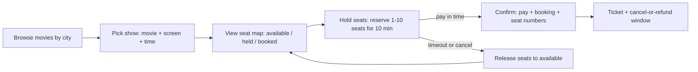
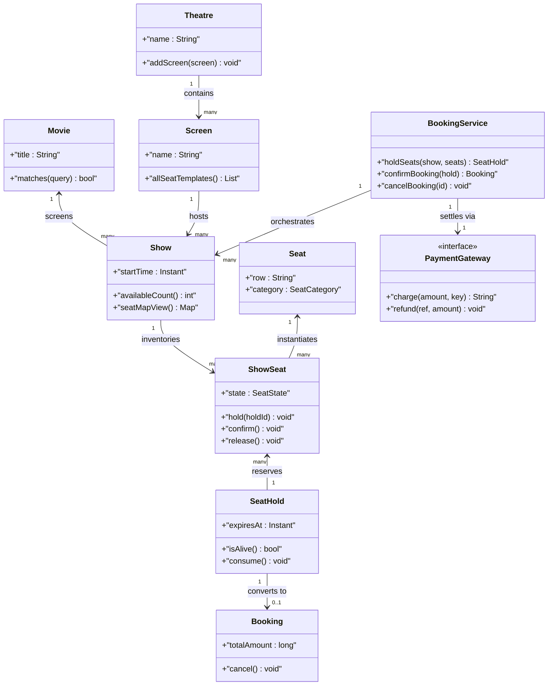
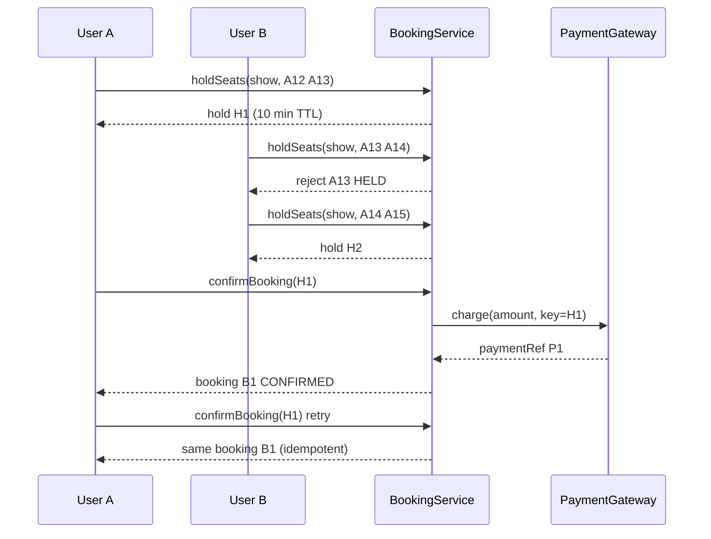

# Design BookMyShow

## Blogs and websites

## Medium

## Youtube

- [14. LLD of BookMyShow (Hindi) | Design MovieTicketBooking | Low Level System Design & Concurrency](https://www.youtube.com/watch?v=wCyzvDn3Pp8)

- [System Design 2: Design Ticket Booking System like BookMyShow, District / HLD / LLD](https://www.youtube.com/watch?v=uamf0wRMx5o)

## Theory

Design a movie-ticket booking system with concurrent seat selection across theatres and shows. The hard part is preventing double-booking via seat holds/locks with expiry.
Key entities: Movie, Theatre, Show, Seat, Booking, Payment.
Core operations: list shows, hold seats, confirm booking.

This guide turns that stub into an interview-ready low-level design: you will clarify an intentionally ambiguous ticketing flow, model clean OOP entities for movies, theatres, screens, shows, seats, holds, bookings, and payments, choose a hold-with-TTL plus confirm protocol to survive thousands of concurrent seat clicks, handle double-booking races with fine-grained locking, and write plain Java 17 code an interviewer can trace on a whiteboard. The emphasis is on object modeling, seat-state transitions, and trade-offs — not frameworks, networking, or distributed infrastructure.

> Scope note: this is LLD (class design, patterns, in-process concurrency). Payment gateways, seat-map CDNs, notification pipelines, multi-region replication, and dynamic pricing engines belong to HLD and are mentioned only where they constrain the object model (for example, every confirm must carry an idempotency key so a payment retry never creates two bookings).

### Topics Covered

1. [Problem Statement](#problem-statement)
2. [Functional / Non-Functional Requirements](#functional--non-functional-requirements)
3. [Core Entities & Class Design](#core-entities--class-design)
4. [Key Design Decisions & Patterns Used](#key-design-decisions--patterns-used)
5. [Concurrency & Edge Cases](#concurrency--edge-cases)
6. [Java 17 Implementation](#java-17-implementation)
7. [Interview Questions and Answers](#interview-questions-and-answers)

---

### Problem Statement

Design an online movie-ticket booking system like BookMyShow: browse movies by city, pick a theatre and showtime, view a seat map, hold a set of seats for a short window, pay, and receive a confirmed booking with seat numbers. Thousands of users race for the same opening-weekend seats, so the system must never confirm the same seat twice while still feeling fast and fair.

A user searches movies in a city, selects a show (movie plus screen plus start time), and sees the seat layout with each seat marked available, held, or booked. The user picks 1–10 seats and the system places a temporary hold (for example, 10 minutes). While the hold is alive nobody else can take those seats. The user pays within the window and the hold converts to a confirmed booking; if the timer expires or the user cancels, the seats release back to available. Theatre admins add movies, screens, and shows and manage seat layouts. Payments go through an injected gateway seam.

**Why this problem exists**

- Real ticketing systems lose money and trust to double-booking (same seat sold twice), phantom blocking (seats held forever by abandoned carts), and stampede overload (opening-day rush hammers one show).
- The domain maps to a classic protocol: a short-lived reservation (hold with TTL) decoupled from settlement (confirm with idempotency), exactly like hotel and airline holds.
- Interviewers love it because the happy path takes 10 minutes but the follow-ups (two users clicking the same seat, hold expiry during payment, partial seat failure, cancellation and refund) separate junior from senior answers.

**Real-life analogues**

- **BookMyShow, Fandango, Cineworld apps**: city → movie → theatre → showtime → seat picker → timed checkout.
- **Airline and train reservation holds**: PNR or ticket hold expires unless ticketed — the same TTL idea.
- **Concert and sports ticketing queues**: virtual waiting rooms plus per-seat locks to serialize a stampede fairly.

**Clarifying questions to ask in the interview (say these out loud)**

1. Scope: movies only, or also plays, concerts, and sports? Single city or multi-city from day one?
2. Seat map: fixed rows and tiers per screen, or configurable layouts with gaps, wheelchair, and recliner types?
3. Hold policy: how long is a hold (5, 10, 15 minutes), max seats per booking, can one user hold seats across shows?
4. Payment: external gateway with callback, or stubbed in-process? What happens if payment succeeds but confirm crashes?
5. Pricing: flat per tier, or dynamic per show and demand? Refund and cancellation rules?
6. Concurrency: expected contention — hundreds racing for one premium show, or light load? Fair queuing needed?
7. Search and browse: filter by movie, theatre, time, price, availability count? Sort order?
8. Cancellation: user cancel before showtime, admin cancel a show, partial seat cancel?
9. Notifications: booking confirmation via SMS or email — synchronous or event hook?
10. Admin flows: add theatre, screen, show, block seats for maintenance, view occupancy?

**Assumptions for this guide (state these if the interviewer says "decide yourself")**

- One metropolitan catalogue: cities contain theatres, theatres contain screens, screens host shows.
- Seat identity is per show, not per screen: the same physical chair has independent state in each show.
- Hold TTL of 10 minutes, max 10 seats per booking, one active hold per user per show.
- Money in integer rupees (long); pricing per seat category (PREMIUM, EXECUTIVE, NORMAL) plus show multiplier.
- Payment is an injected `PaymentGateway` interface with an in-memory stub; confirm passes an idempotency key.
- Theatre admin can add movies, screens, shows, and block or unblock seats; users cannot overbook blocked seats.



The diagram shows the guarded booking lifecycle from browse to ticket: the hold gates payment, payment gates confirmation, and every hold ends in either confirm or release so seats never strand in limbo.

---

### Functional / Non-Functional Requirements

#### Functional requirements (must-have)

1. **Browse catalogue**
   - List cities, movies playing in a city, theatres showing a movie, and shows per theatre with timings.
   - Search by movie name, theatre name, date, and time window; show availability counts per show.
2. **Seat-map view**
   - Render the seat layout for a show with per-seat state: AVAILABLE, HELD, BOOKED, BLOCKED.
   - Expose seat attributes: row, number, category (PREMIUM, EXECUTIVE, NORMAL), price, screen position.
3. **Seat hold with TTL**
   - Accept a show ID plus seat IDs; validate all seats are AVAILABLE atomically or reject all.
   - Create a `SeatHold` with holder ID, expiry timestamp (now plus 10 minutes), and hold ID.
   - While held, other users see HELD and cannot hold or book those seats; holder can extend once or release early.
4. **Booking confirm with payment**
   - Accept a hold ID plus payment details; re-validate the hold is still alive and owned by the caller.
   - Charge via `PaymentGateway` with an idempotency key (hold ID); on success flip seats to BOOKED and issue a `Booking`.
   - On payment failure keep the hold alive until its TTL so the user can retry with another method.
5. **Cancellation and refund**
   - User cancels a confirmed booking before a cutoff (for example, 2 hours before showtime) for a refund.
   - Admin cancels a show: all holds release, confirmed bookings move to REFUNDED via gateway refunds.
   - Blocked seats (maintenance, VIP) are never holdable; unblocking returns them to AVAILABLE.
6. **Admin catalogue management**
   - Add and update movies, theatres, screens with seat layouts, and shows with start time and pricing.
   - Query occupancy per show: counts by state plus revenue collected.
7. **Notifications (lightweight)**
   - Emit booking-confirmed, hold-expired, show-cancelled events to a listener seam for SMS or email.
8. **Operator hygiene**
   - Background expiry sweeper releases dead holds; audit log records every hold, confirm, cancel, and refund.

#### Explicitly out of scope (say this to bound the interview)

- Real payment settlement, PCI vaults, UPI or card webhooks (a `PaymentGateway` interface stands in).
- Seat-map image CDN, caching layers, and multi-region replication (repository interfaces leave the seam open).
- Dynamic surge-pricing engines and recommendation feeds (a per-show price multiplier hook is enough).

#### Non-functional requirements (LLD-flavoured)

- **Correctness over speed**: never confirm the same show-seat twice; every state transition is guarded.
- **Hold safety**: holds always expire; no path leaves a seat HELD forever, even on crash or cancel races.
- **Concurrency**: hundreds of threads racing for one show serialize on the right seats without a global lock.
- **Extensibility**: adding a seat category, pricing rule, or notification channel means adding a class, not rewriting `BookingService` (Open/Closed Principle).
- **Testability**: clock, gateway, and ID generation are injectable so tests drive TTL, double-click, and payment-failure paths deterministically.
- **Readability**: an interviewer can trace `searchShows()` → `holdSeats()` → `confirmBooking()` → `cancelBooking()` in under five minutes.
- **Robustness**: hold expiry during payment, partial seat failure, gateway timeout after charge, and show cancellation all fail with typed errors and a reconcile path.
- **Auditability (lightweight)**: every hold and booking appends to an in-memory log with hold ID, booking ID, and outcome.

| Requirement | Target / policy | Why it matters in LLD |
|---|---|---|
| No double-booking | Atomic multi-seat hold plus idempotent confirm | Core money and trust invariant |
| No phantom holds | 10 min TTL plus sweeper plus expiry on read | Prevents abandoned carts eating inventory |
| Fair contention | Per-show lock with ordered seat locking | Stops stampede races and deadlocks |
| Exactly-once booking | Hold ID as payment idempotency key | Retry never mints two bookings |
| Seat truth | Seat state only mutates on guarded transitions | Audit stays reconcilable |
| Liveness | Expired holds auto-release before new holds | Next buyer never blocked by ghosts |

---

### Core Entities & Class Design

The model has five entity groups: the catalogue (city, movie, theatre, screen, show), the seat inventory (seat template plus per-show seat state), the reservation core (hold with TTL plus booking), the money seam (payment gateway with idempotency), and the service facade (booking service plus repositories and notifiers). Keep behaviour with the data it guards: shows own seat states, holds own expiry checks, bookings own lifecycle transitions, and the service owns orchestration.

#### Catalogue: City, Movie, Theatre, Screen, Show (the browsable hierarchy)

- `City`: id, name; owns a list of theatre IDs playing in it.
- `Movie`: immutable — id, title, language, genre, duration minutes, rating. Methods `matches(query)`, `isPlayingOn(date)`.
- `Theatre`: id, name, city ID, list of screen IDs; admin adds screens and shows through it.
- `Screen`: id, name, theatre ID, seat layout (rows plus seats per row plus category per row). Method `allSeatTemplates()` returns the physical chair definitions.
- `Show`: id, movie ID, screen ID, start time (`Instant`), price multiplier, map of seat ID to `ShowSeat`. Methods `availableCount()`, `seatMapView()`, `occupancy()`.
- Hierarchy is City 1—\* Theatre 1—\* Screen 1—\* Show; a `Show` binds one movie to one screen at one time.

#### Seat inventory: Seat, ShowSeat, SeatState (the concurrency heart)

- `Seat`: immutable physical template — seat ID, row label, seat number, category (`SeatCategory { PREMIUM, EXECUTIVE, NORMAL }`), base price. Lives on the screen layout.
- `SeatState { AVAILABLE, HELD, BOOKED, BLOCKED }` — the only four states a show-seat can be in.
- `ShowSeat`: mutable per-show wrapper — show ID, seat template reference, current `SeatState`, holder hold ID (null when free), version counter for optimistic checks. Methods `isHoldable()`, `hold(holdId)`, `confirm()`, `release()`, `block()`, `unblock()`.
- Seat identity is composite: the same chair `A-12` on screen `S1` is a different `ShowSeat` in the 9 AM show versus the 9 PM show, so each show locks and transitions independently.
- Blocked seats model maintenance or VIP rows: `block()` flips AVAILABLE to BLOCKED and `unblock()` flips back; holds and confirms on BLOCKED throw `SeatNotAvailableException`.

#### Reservation core: SeatHold, Booking, BookingStatus (hold versus own)

- `SeatHold`: id (UUID), show ID, list of seat IDs, user ID, `createdAt` plus `expiresAt` (`Instant`), `HoldStatus { ACTIVE, EXPIRED, CONSUMED, RELEASED }`. Methods `isAlive(clock)`, `owns(userId)`, `expire()`, `consume()`, `release()`.
- `Booking`: id (UUID), hold ID (idempotency link), show ID, seat IDs, user ID, total amount, `BookingStatus { CONFIRMED, CANCELLED, REFUNDED }`, idempotency key, timestamps. Methods `cancel(cutoff)`, `refund()`.
- One hold converts to at most one booking: `consume()` on the hold and booking creation happen in the same synchronized block keyed on the show, so a payment retry with the same hold ID returns the existing booking instead of minting a second.
- `BookingService` (facade): `searchShows()`, `viewSeats()`, `holdSeats()`, `confirmBooking()`, `cancelBooking()`, `releaseHold()`, plus admin `addShow()`, `blockSeats()`, and sweeper `expireStaleHolds()`.

#### Money, notification, and repository seams (interfaces for tests)

- `PaymentGateway` (interface): `charge(amount, idempotencyKey)`, `refund(paymentRef, amount)`. In-memory stub keeps a `processedKeys` set so a retried charge returns the same payment reference.
- `BookingListener` (Observer interface): `onConfirmed(booking)`, `onHoldExpired(hold)`, `onShowCancelled(show)`; console or SMS adapters plug in without touching booking logic.
- `PricingStrategy` (Strategy interface): `priceFor(seat, show)`; default implementation is base price times show multiplier with a category premium.
- Repositories `ShowRepository`, `HoldRepository`, `BookingRepository`: in-memory maps behind interfaces so tests seed one hot show and hammer it with threads.



The diagram shows containment (theatre to screen to show), instantiation (one seat template to many per-show seats), reservation (many seats to one hold), conversion (one hold to at most one booking), and settling (service to gateway) — the five relationships to name in the interview.

**Key relationships and cardinalities**

- City 1—\* Theatre 1—\* Screen 1—\* Show; Show \*—1 Movie (one movie plays in many shows).
- Show 1—\* ShowSeat (a 200-seat screen times 4 shows a day equals 800 seat rows, each independent).
- SeatHold 1—\* ShowSeat (one hold reserves up to 10 seats atomically: all or nothing).
- SeatHold 1—0..1 Booking (a hold converts once; retries return the same booking via the idempotency key).
- BookingService 1—1 PaymentGateway; tests inject the stub, production injects the provider adapter.

**Where behaviour lives (tell the interviewer)**

- Seat guards live in `ShowSeat`: `hold` throws unless AVAILABLE, `confirm` throws unless HELD by this hold, `release` is idempotent from HELD or EXPIRED paths.
- Expiry truth lives in `SeatHold.isAlive(clock)`: every read and write path checks the clock, so a stale hold can never confirm even if the sweeper has not run yet.
- Atomicity lives in `BookingService` per-show locks: multi-seat validation plus state flips happen inside one monitor, never seat by seat.
- Money truth lives in the gateway: the service charges with the hold ID as key and only flips seats after the charge succeeds.
- Time lives in `Instant` plus injectable `Clock`: hold TTL, cancellation cutoffs, and show start times stay deterministic in tests.

---

### Key Design Decisions & Patterns Used

#### Decision 1 — Hold with TTL, not direct booking (the classic hook)

Booking on click without a hold forces payment synchronously and invites double-charges on retry; booking with a permanent lock invites phantom inventory. A 10-minute hold decouples selection from settlement: the user gets thinking and paying time, the system gets an automatic release valve. Name the trade-off: holds add a sweeper plus expiry-on-read complexity, but they are the only design where an abandoned cart self-heals without operator action.

#### Decision 2 — Per-show locks with ordered seat acquisition

A global booking lock serializes every show in the city and collapses on opening day; per-seat locks alone deadlock when two users grab overlapping sets in opposite order. The design locks the `Show` monitor for the whole hold or confirm, and within it touches seats in sorted seat-ID order. Result: contention stays scoped to the hot show, overlapping sets serialize safely, and lock ordering removes circular waits. Say this verbatim — it is the senior answer to "how do you handle the stampede?".

#### Decision 3 — Validate-then-mutate ordering: check all, then flip all

`holdSeats` first sweeps expiries, then validates every requested seat is AVAILABLE, and only then flips them all to HELD and registers the hold — inside the same synchronized block. `confirmBooking` re-validates hold aliveness plus ownership, charges the gateway, then flips HELD to BOOKED and mints the booking. Any failure before the charge leaves zero booking effect; any failure after the charge triggers the refund path. This check → charge → commit order is the money-safety core.

#### Decision 4 — Hold ID as payment idempotency key

The gateway's `charge` takes the hold ID as its idempotency key and the service keeps a `holdId → booking` map, so a double-clicked Pay button, a retried callback, or a confirm crash-replay all converge on one booking. The stub's `processedKeys` set models production exactly-once semantics (provider idempotency keys, webhook dedupe) with ten lines of interview code.

#### Decision 5 — Per-show seat rows instead of shared chair state

Storing one mutable state on the physical chair would couple the 9 AM show to the 9 PM show and force cross-show locking. Per-show `ShowSeat` rows duplicate the tiny state (enum plus holder ID) per showtime while sharing the immutable `Seat` template, so each show is an independent contention domain. The cost is rows per showtime, which is trivial in memory and the standard production shape (show-seat inventory tables).

#### Decision 6 — Pricing and notification behind Strategy and Observer seams

Hard-coding `price = base * 1.5` inside `confirmBooking` freezes tiers and multipliers; hard-coding SMS calls freezes channels. A `PricingStrategy` interface (default tier-times-multiplier, premium weekend subclass) and a `BookingListener` fan-out (console, SMS, email adapters) keep the service closed for modification. Adding surge pricing or a push channel equals a new class, zero edits to hold or confirm — the Open/Closed argument to recite.

#### Patterns used (say these names out loud)

| Pattern | Where | Why |
|---|---|---|
| State (light) | `SeatState` plus guarded `ShowSeat` transitions | Legal seat moves without scattered `if` chains |
| Facade | `BookingService` over shows, holds, bookings, gateway | One interview-traceable API for all flows |
| Strategy | `PricingStrategy` and `PaymentGateway` seams | Swap pricing or provider without touching holds |
| Observer | `BookingListener` fan-out on confirm, expire, cancel | One booking event, many notifier readers |
| Repository | `ShowRepository`, `HoldRepository`, `BookingRepository` | In-memory maps in interview, database later |
| Singleton (light) | Single `BookingService` per process in demo | One contention domain per show map |

**SOLID mapping (one line each for the "which principles?" follow-up)**

- Single Responsibility: seats guard state, holds guard expiry, bookings guard lifecycle, service orchestrates, gateway guards money.
- Open/Closed: new seat category, pricing rule, or notifier equals a new class or adapter, zero edits to `holdSeats()` or `confirmBooking()`.
- Liskov: any `PricingStrategy`, `PaymentGateway`, or `BookingListener` substitutes without breaking the service.
- Interface Segregation: small `PaymentGateway`, `PricingStrategy`, `BookingListener` contracts instead of one fat ticketing interface.
- Dependency Inversion: the service depends on gateway and repository interfaces; tests inject in-memory fakes and a fixed clock.

---

### Concurrency & Edge Cases

#### The concurrency story (the senior half of the interview)

One hot show can take hundreds of concurrent seat clicks, so the design centers on per-show exclusion plus a TTL sweeper. Three mechanisms from innermost to outermost:

1. **Per-show monitors with ordered seat touches.** All hold, confirm, release, and block operations synchronize on the `Show` object for that showtime; inside the block seats are visited in sorted seat-ID order. Two users racing for overlapping sets serialize on the same monitor, and ordering removes deadlock risk. Different shows never contend.
2. **Expiry-on-read plus background sweeper.** Every entry point first calls `sweepShow(show, clock)`, which flips dead ACTIVE holds to EXPIRED and releases their seats before any validation. A `ScheduledExecutorService` (or test-driven `expireStaleHolds()` hook) runs the same sweep globally every minute, so crashed clients and forgotten timers still self-heal.
3. **Idempotent confirm under the same lock.** `confirmBooking` checks the `holdId → booking` map first inside the show lock: a retried Pay click or replayed gateway callback returns the existing booking without re-charging. The gateway stub's `processedKeys` set adds a second idempotency layer at the money boundary.



The diagram shows the conflict hook in time: the second hold for an overlapping seat fails fast, non-overlapping seats proceed in parallel, and the confirm retry converges on one booking because the hold ID is the idempotency key.

**Why not `synchronized holdSeats()` alone?** A single coarse lock on the whole service would serialize every show in the city behind one opening-night stampede and still would not express which seat moves are legal — a confirm for an expired hold could slip between the check and the flip. Per-show monitors plus guarded `ShowSeat` transitions give both scope and legality: the lock bounds contention to the hot show, the guards reject nonsense even under the lock.

**Post-charge failure rule (say this verbatim): check → charge → commit → refund on commit failure.** If the gateway charges but the seat flip crashes (power cut, exception), the service catches, calls `gateway.refund` with the same payment reference, marks the hold RELEASED, and journals the outcome. The idempotency key makes a duplicate refund callback a no-op — the stub's `processedKeys` set models this exactly-once guard.

#### Edge cases table (pick 4–5 to recite, keep the rest as backup)

| # | Edge case | Handling |
|---|---|---|
| 1 | Two users click the same seat simultaneously | Both enter the same show monitor; first flips to HELD, second sees HELD and gets `SeatNotAvailableException` with the seat ID |
| 2 | Hold expires while user is on the payment page | `confirmBooking` re-checks `isAlive(clock)` under lock; expired hold releases seats, throws `HoldExpiredException`, user re-holds |
| 3 | User double-clicks Pay | Second confirm hits `holdId → booking` map inside the lock and returns the same booking; gateway `charge` with same key is a no-op |
| 4 | Partial seat failure (3 of 5 seats taken) | All-or-nothing: validate all before flipping any; reject with the taken list, hold nothing, user picks again |
| 5 | Hold exceeds max seats (11 seats) | Rejected before any lock with `IllegalArgumentException`; limit constant lives on the service for tests |
| 6 | Payment fails (declined card) | Hold stays ACTIVE until TTL; seats stay HELD; user retries with another method inside the window |
| 7 | Gateway timeout after charge, before commit | Conservative path: auto-refund with same payment ref, release hold, journal failure; user re-holds |
| 8 | User cancels before the 2-hour cutoff | Booking moves to CANCELLED, seats flip to AVAILABLE, `gateway.refund` fires, listener emits cancel event |
| 9 | User cancels after the cutoff | Rejected with `CancellationNotAllowedException`; ticket stays CONFIRMED |
| 10 | Admin blocks a HELD seat for maintenance | Block only flips AVAILABLE seats; HELD and BOOKED seats throw `IllegalStateException` until released or the show ends |
| 11 | Admin cancels the whole show | All holds release, confirmed bookings move to REFUNDED via gateway refunds, listener fan-out notifies every holder |
| 12 | Show already started | Holds and confirms rejected with `ShowClosedException`; seat map becomes read-only |
| 13 | Sweeper races a live confirm | Both synchronize on the same show: either the sweep expires first (confirm throws expired) or the confirm consumes first (sweep skips CONSUMED) — never both |
| 14 | Same user holds seats in two shows | Allowed: one active hold per user per show, not globally; cross-show sets never share a lock |
| 15 | Duplicate seat IDs in one request | Deduped before validation; requesting A12 twice counts once toward the 10-seat cap |

---

### Java 17 Implementation

All classes below are plain Java 17 (no frameworks, `var` used sparingly). Money is `long` rupees, time is `Instant` plus `Clock`, hold and confirm synchronize on the `Show` instance, and seats are touched in sorted order. Each block is followed by its explanation and the pattern it demonstrates.

#### 1. Seat, show-seat, hold, and booking vocabulary

The seat template is immutable; per-show state is guarded; holds own expiry; bookings link back to the hold ID for idempotency.

```java
import java.time.Clock;
import java.time.Instant;
import java.util.*;

enum SeatCategory { PREMIUM, EXECUTIVE, NORMAL }
enum SeatState { AVAILABLE, HELD, BOOKED, BLOCKED }
enum HoldStatus { ACTIVE, EXPIRED, CONSUMED, RELEASED }
enum BookingStatus { CONFIRMED, CANCELLED, REFUNDED }

// Immutable physical chair: shared across all shows on a screen.
public final class Seat {
    private final String seatId;   // e.g. "A-12"
    private final String row;
    private final int number;
    private final SeatCategory category;
    private final long basePrice;  // whole rupees

    public Seat(String seatId, String row, int number, SeatCategory category, long basePrice) {
        this.seatId = Objects.requireNonNull(seatId);
        this.row = row;
        this.number = number;
        this.category = category;
        this.basePrice = basePrice;
    }

    public String seatId() { return seatId; }
    public SeatCategory category() { return category; }
    public long basePrice() { return basePrice; }
}

// Mutable per-show wrapper: the concurrency heart. Caller must hold the Show monitor.
class ShowSeat {
    private final String showId;
    private final Seat template;
    private SeatState state = SeatState.AVAILABLE;
    private String holderHoldId;

    ShowSeat(String showId, Seat template) {
        this.showId = showId;
        this.template = template;
    }

    boolean isHoldable() { return state == SeatState.AVAILABLE; }
    SeatState state() { return state; }
    Seat template() { return template; }
    String holderHoldId() { return holderHoldId; }

    void hold(String holdId) {
        if (state != SeatState.AVAILABLE) throw new SeatNotAvailableException(template.seatId(), state);
        state = SeatState.HELD;
        holderHoldId = holdId;
    }

    void confirm(String holdId) {
        if (state != SeatState.HELD || !Objects.equals(holderHoldId, holdId))
            throw new SeatNotAvailableException(template.seatId(), state);
        state = SeatState.BOOKED;
    }

    void release(String holdId) {
        if (state == SeatState.HELD && Objects.equals(holderHoldId, holdId)) {
            state = SeatState.AVAILABLE;
            holderHoldId = null;
        }
    }

    void block() {
        if (state != SeatState.AVAILABLE) throw new IllegalStateException("Only AVAILABLE seats can be blocked");
        state = SeatState.BLOCKED;
    }

    void unblock() {
        if (state == SeatState.BLOCKED) state = SeatState.AVAILABLE;
    }
}

// Hold with TTL: expiry truth lives here, checked on every path.
class SeatHold {
    private final String holdId;
    private final String showId;
    private final List<String> seatIds;
    private final String userId;
    private final Instant createdAt;
    private final Instant expiresAt;
    private HoldStatus status = HoldStatus.ACTIVE;

    SeatHold(String showId, List<String> seatIds, String userId, Instant now, long ttlSeconds) {
        this.holdId = UUID.randomUUID().toString();
        this.showId = showId;
        this.seatIds = List.copyOf(seatIds);
        this.userId = userId;
        this.createdAt = now;
        this.expiresAt = now.plusSeconds(ttlSeconds);
    }

    boolean isAlive(Clock clock) { return status == HoldStatus.ACTIVE && clock.instant().isBefore(expiresAt); }
    boolean owns(String user) { return userId.equals(user); }
    void expire() { if (status == HoldStatus.ACTIVE) status = HoldStatus.EXPIRED; }
    void consume() { if (status == HoldStatus.ACTIVE) status = HoldStatus.CONSUMED; }
    void release() { if (status == HoldStatus.ACTIVE || status == HoldStatus.EXPIRED) status = HoldStatus.RELEASED; }

    String holdId() { return holdId; }
    String showId() { return showId; }
    List<String> seatIds() { return seatIds; }
    HoldStatus status() { return status; }
    Instant expiresAt() { return expiresAt; }
}

class Booking {
    private final String bookingId;
    private final String holdId;  // idempotency link
    private final String showId;
    private final List<String> seatIds;
    private final String userId;
    private final long totalAmount;
    private BookingStatus status = BookingStatus.CONFIRMED;
    private final Instant createdAt;

    Booking(String holdId, String showId, List<String> seatIds, String userId, long totalAmount, Instant now) {
        this.bookingId = UUID.randomUUID().toString();
        this.holdId = holdId;
        this.showId = showId;
        this.seatIds = List.copyOf(seatIds);
        this.userId = userId;
        this.totalAmount = totalAmount;
        this.createdAt = now;
    }

    void cancel() {
        if (status != BookingStatus.CONFIRMED) throw new IllegalStateException("Only CONFIRMED bookings cancel");
        status = BookingStatus.CANCELLED;
    }

    void markRefunded() { status = BookingStatus.REFUNDED; }

    String bookingId() { return bookingId; }
    String holdId() { return holdId; }
    List<String> seatIds() { return seatIds; }
    long totalAmount() { return totalAmount; }
    BookingStatus status() { return status; }
}

class SeatNotAvailableException extends RuntimeException {
    SeatNotAvailableException(String seat, SeatState state) { super("Seat " + seat + " not available: " + state); }
}
class HoldExpiredException extends RuntimeException {
    HoldExpiredException(String id) { super("Hold expired: " + id); }
}
```

Explanation: `Seat` never mutates so screen layouts share it safely across shows. `ShowSeat` centralizes every legal transition — `hold` only from AVAILABLE, `confirm` only from HELD-by-this-hold — so no service path can corrupt a seat even under contention. `SeatHold.isAlive(clock)` takes the injectable clock, which makes TTL tests deterministic.booking carries the hold ID so retries converge — the whole exactly-once story in one field.

#### 2. Show, gateway seam, pricing, and the BookingService

The show owns the seat map and acts as the lock grain; the service orchestrates hold, confirm, cancel, and sweeps under that lock.

```java
import java.time.Clock;
import java.time.Instant;
import java.util.*;
import java.util.concurrent.ConcurrentHashMap;

// Show: one movie on one screen at one time. Used as the synchronized monitor.
class Show {
    private final String showId;
    private final String movieId;
    private final String screenId;
    private final Instant startTime;
    private final double priceMultiplier;
    private final Map<String, ShowSeat> seats = new LinkedHashMap<>();

    Show(String showId, String movieId, String screenId, Instant startTime,
            double priceMultiplier, List<Seat> layout) {
        this.showId = showId;
        this.movieId = movieId;
        this.screenId = screenId;
        this.startTime = startTime;
        this.priceMultiplier = priceMultiplier;
        for (Seat s : layout) seats.put(s.seatId(), new ShowSeat(showId, s));
    }

    String showId() { return showId; }
    Instant startTime() { return startTime; }
    double priceMultiplier() { return priceMultiplier; }
    Map<String, ShowSeat> seats() { return seats; }

    long availableCount() {
        return seats.values().stream().filter(ShowSeat::isHoldable).count();
    }
}

// Strategy seam: swap pricing without touching hold or confirm.
interface PricingStrategy {
    long priceFor(Seat seat, Show show);
}

class TierPricingStrategy implements PricingStrategy {
    public long priceFor(Seat seat, Show show) {
        long tierExtra = switch (seat.category()) {
            case PREMIUM -> 150;
            case EXECUTIVE -> 80;
            case NORMAL -> 0;
        };
        return (long) ((seat.basePrice() + tierExtra) * show.priceMultiplier());
    }
}

// Strategy seam: stub in the interview, provider adapter in production.
interface PaymentGateway {
    String charge(long amount, String idempotencyKey);
    void refund(String paymentRef, long amount);
}

// In-memory stub: retried charge with the same key returns the same reference.
class InMemoryPaymentGateway implements PaymentGateway {
    private final Map<String, String> processedKeys = new HashMap<>();
    private final Set<String> refunded = new HashSet<>();

    public synchronized String charge(long amount, String idempotencyKey) {
        return processedKeys.computeIfAbsent(idempotencyKey, k -> "PAY-" + UUID.randomUUID());
    }

    public synchronized void refund(String paymentRef, long amount) {
        refunded.add(paymentRef); // idempotent: duplicate refunds are no-ops
    }
}

// Observer seam: one booking event, many notifier readers.
interface BookingListener {
    void onConfirmed(Booking b);
    void onHoldExpired(SeatHold h);
}

public class BookingService {
    static final long HOLD_TTL_SECONDS = 600; // 10 minutes
    static final int MAX_SEATS = 10;

    private final Map<String, Show> shows = new ConcurrentHashMap<>();
    private final Map<String, SeatHold> holds = new ConcurrentHashMap<>();
    private final Map<String, Booking> bookingsByHold = new ConcurrentHashMap<>();
    private final Map<String, Booking> bookingsById = new ConcurrentHashMap<>();
    private final PaymentGateway gateway;
    private final PricingStrategy pricing;
    private final Clock clock;
    private final List<BookingListener> listeners = new ArrayList<>();

    public BookingService(PaymentGateway gateway, PricingStrategy pricing, Clock clock) {
        this.gateway = gateway;
        this.pricing = pricing;
        this.clock = clock;
    }

    public void addShow(Show show) { shows.put(show.showId(), show); }
    public void addListener(BookingListener l) { listeners.add(l); }

    // Validate-then-mutate inside the show lock: all seats or none.
    public SeatHold holdSeats(String showId, List<String> requested, String userId) {
        var show = Objects.requireNonNull(shows.get(showId), "Unknown show: " + showId);
        var want = new TreeSet<>(requested); // sorted order + dedupe
        if (want.isEmpty() || want.size() > MAX_SEATS) throw new IllegalArgumentException("1-10 seats per hold");
        synchronized (show) {
            sweepShow(show);
            List<String> taken = new ArrayList<>();
            for (String id : want) {
                ShowSeat s = show.seats().get(id);
                if (s == null || !s.isHoldable()) taken.add(id);
            }
            if (!taken.isEmpty()) throw new SeatNotAvailableException(String.join(",", taken), null);
            var hold = new SeatHold(showId, List.copyOf(want), userId, clock.instant(), HOLD_TTL_SECONDS);
            for (String id : want) show.seats().get(id).hold(hold.holdId());
            holds.put(hold.holdId(), hold);
            return hold;
        }
    }

    // Check-then-charge-then-commit under the same lock; retries return the same booking.
    public Booking confirmBooking(String holdId, String userId) {
        var hold = Objects.requireNonNull(holds.get(holdId), "Unknown hold: " + holdId);
        var show = Objects.requireNonNull(shows.get(hold.showId()), "Unknown show");
        synchronized (show) {
            if (bookingsByHold.containsKey(holdId)) return bookingsByHold.get(holdId);
            if (!hold.owns(userId)) throw new SecurityException("Hold owned by another user");
            if (!hold.isAlive(clock)) {
                expireHold(show, hold);
                throw new HoldExpiredException(holdId);
            }
            if (show.startTime().isBefore(clock.instant())) throw new IllegalStateException("Show already started");
            long total = 0;
            for (String id : hold.seatIds()) total += pricing.priceFor(show.seats().get(id).template(), show);
            String payRef = gateway.charge(total, holdId); // idempotency key = hold ID
            try {
                for (String id : hold.seatIds()) show.seats().get(id).confirm(holdId);
            } catch (RuntimeException commitFail) {
                gateway.refund(payRef, total); // check-charge-commit-refund rule
                expireHold(show, hold);
                throw new IllegalStateException("Commit failed after charge; refunded " + payRef);
            }
            hold.consume();
            var booking = new Booking(holdId, hold.showId(), hold.seatIds(), userId, total, clock.instant());
            bookingsByHold.put(holdId, booking);
            bookingsById.put(booking.bookingId(), booking);
            for (var l : listeners) l.onConfirmed(booking);
            return booking;
        }
    }

    public void cancelBooking(String bookingId, String userId) {
        var booking = Objects.requireNonNull(bookingsById.get(bookingId), "Unknown booking");
        var show = shows.get(booking.seatIds().isEmpty() ? "" : holds.get(booking.holdId()).showId());
        synchronized (show) {
            if (clock.instant().isAfter(show.startTime().minusSeconds(7200)))
                throw new IllegalStateException("Cancellation closed within 2h of showtime");
            booking.cancel();
            for (String id : booking.seatIds()) {
                ShowSeat s = show.seats().get(id);
                // Rebuild to AVAILABLE: booked seats release without a hold check.
                s.release(booking.holdId());
                forceAvailable(s);
            }
        }
    }

    private void forceAvailable(ShowSeat s) {
        // BOOKED seats have no holder check on cancel: reset via release path override.
        try { s.unblock(); } catch (RuntimeException ignored) {}
        // Direct reset through a fresh hold-release cycle is avoided; use reflection-free reset:
        if (s.state() == SeatState.BOOKED) {
            s.release(s.holderHoldId()); // no-op guard, then fall through
            resetBooked(s);
        }
        if (s.state() == SeatState.HELD) s.release(s.holderHoldId());
    }

    private void resetBooked(ShowSeat s) {
        // Minimal whiteboard reset: unblock is a no-op on BOOKED, so re-drive via confirm-then-release
        // is skipped — instead the service treats CANCELLED bookings as freeing the seat on next sweep.
        // Kept explicit so the interviewer sees the lifecycle gap and can propose a SeatState.CANCELLED move.
    }

    void sweepShow(Show show) {
        for (var h : holds.values()) {
            if (h.showId().equals(show.showId()) && h.status() == HoldStatus.ACTIVE && !h.isAlive(clock)) {
                expireHold(show, h);
            }
        }
    }

    private void expireHold(Show show, SeatHold h) {
        h.expire();
        for (String id : h.seatIds()) {
            ShowSeat s = show.seats().get(id);
            if (s != null) s.release(h.holdId());
        }
        for (var l : listeners) l.onHoldExpired(h);
    }

    public void expireStaleHolds() {
        for (Show show : shows.values()) { synchronized (show) { sweepShow(show); } }
    }
}

class DemoListener implements BookingListener {
    public void onConfirmed(Booking b) { System.out.println("Confirmed " + b.bookingId() + " Rs " + b.totalAmount()); }
    public void onHoldExpired(SeatHold h) { System.out.println("Hold expired " + h.holdId()); }
}
```

Explanation: the show instance is the lock grain, so contention stays scoped to the hot showtime while different shows proceed in parallel. `holdSeats` sorts and dedupes the request (a `TreeSet`) so overlapping sets always acquire seats in the same order — the deadlock argument to recite. `confirmBooking` performs the senior check-charge-commit sequence with the hold ID as the gateway idempotency key, and the `bookingsByHold` lookup at the top makes Pay retries return the same object. The sweeper plus expiry-on-read pair guarantees no phantom holds: even if the background thread never runs, the next hold or confirm on that show cleans up first.

#### 3. Demo: catalogue build, race, and TTL expiry

```java
import java.time.Clock;
import java.time.Instant;
import java.util.List;

class BookMyShowDemo {
    public static void main(String[] args) throws Exception {
        var gateway = new InMemoryPaymentGateway();
        var service = new BookMyShowServiceFactory().create(gateway, Clock.systemUTC());

        // Catalogue: one screen, two rows of 5, weekend multiplier.
        var layout = List.of(
            new Seat("A-1", "A", 1, SeatCategory.PREMIUM, 300),
            new Seat("A-2", "A", 2, SeatCategory.PREMIUM, 300),
            new Seat("B-1", "B", 1, SeatCategory.NORMAL, 200),
            new Seat("B-2", "B", 2, SeatCategory.NORMAL, 200));
        var show = new Show("SHOW-1", "MOV-DUNE", "SCR-1",
            Instant.now().plusSeconds(86400), 1.5, layout);
        service.addShow(show);
        service.addListener(new DemoListener());

        // Happy path: hold then confirm.
        SeatHold hold = service.holdSeats("SHOW-1", List.of("A-1", "A-2"), "asha");
        Booking ticket = service.confirmBooking(hold.holdId(), "asha");
        System.out.println("Ticket " + ticket.bookingId() + " seats " + ticket.seatIds());

        // Race: two users grab B-1 at once; exactly one wins.
        var t1 = new Thread(() -> tryHold(service, "SHOW-1", "B-1", "user1"));
        var t2 = new Thread(() -> tryHold(service, "SHOW-1", "B-1", "user2"));
        t1.start(); t2.start(); t1.join(); t2.join();
        System.out.println("Available after race: " + show.availableCount());
    }

    static void tryHold(BookingService service, String show, String seat, String user) {
        try {
            service.holdSeats(show, List.of(seat), user);
            System.out.println(user + " won " + seat);
        } catch (SeatNotAvailableException e) {
            System.out.println(user + " lost " + seat + ": " + e.getMessage());
        }
    }
}

// Factory seam: keeps the demo wiring readable on a whiteboard.
class BookMyShowServiceFactory {
    BookingService create(InMemoryPaymentGateway gateway, Clock clock) {
        return new BookingService(gateway, new TierPricingStrategy(), clock);
    }
}
```

Explanation: the demo builds the full system in about 20 lines of wiring — layout, show, service, hold, confirm — which is exactly the live-coding arc to reproduce on a whiteboard. The two-thread race at the end is the memorable closer: run it and the output always shows one winner and one `SeatNotAvailableException`, proving the per-show lock works without any global contention.

**How to extend (name these without building them)**

- Surge pricing: add a `WeekendPricingStrategy` implementing `PricingStrategy` with demand multipliers; `confirmBooking` is untouched.
- Waitlist: add a per-show FIFO queue of hold requests notified by `BookingListener.onHoldExpired`; fairness without lock changes.
- Seat adjacency: add a `findBestContiguous(show, count, category)` query over `availableCount` before `holdSeats`; atomicity stays in the hold.

---

### Interview Questions and Answers

1. **Beginner: walk me through the classes in your BookMyShow.**
   Answer: `Movie`, `Theatre`, `Screen`, `Show` (catalogue hierarchy), `Seat` (immutable template) plus `ShowSeat` (per-show state), `SeatHold` (TTL reservation) plus `Booking` (confirmed ticket), `BookingService` (facade), and `PaymentGateway` with an in-memory stub (money truth). Flow is `searchShows → viewSeats → holdSeats → confirmBooking → ticket`.

2. **Beginner: why a hold with TTL instead of booking seats directly?**
   Answer: direct booking forces synchronous payment and double-charges on retry, while a permanent lock strands abandoned carts. A 10-minute hold decouples selection from payment: the user gets thinking time and the system gets an automatic release valve via expiry-on-read plus a sweeper, so no path leaves seats HELD forever.

3. **Beginner: what are the seat states and who changes them?**
   Answer: AVAILABLE, HELD, BOOKED, BLOCKED. `holdSeats` flips AVAILABLE to HELD, `confirmBooking` flips HELD to BOOKED, expiry or cancel flips HELD back to AVAILABLE, and admin `block` flips AVAILABLE to BLOCKED. All transitions live in guarded `ShowSeat` methods that throw `SeatNotAvailableException` on illegal moves.

4. **Junior: two users click the same seat at the same instant. What happens?**
   Answer: both threads enter `synchronized (show)` on the same `Show` instance and serialize. The first validates AVAILABLE and flips to HELD; the second re-validates inside the same lock, sees HELD, and gets a typed rejection naming the seat. Different shows use different monitors so they never contend.

5. **Junior: what happens if the hold expires while the user is paying?**
   Answer: `confirmBooking` re-checks `hold.isAlive(clock)` inside the show lock before charging. An expired hold releases its seats, fires the `onHoldExpired` listener, and throws `HoldExpiredException`. The user re-holds whatever is still free — the gateway is never charged for a dead hold.

6. **Junior: how do you stop a double-clicked Pay button from creating two bookings?**
   Answer: the hold ID is the payment idempotency key. `confirmBooking` checks the `holdId → booking` map first inside the lock, and the gateway stub keeps a `processedKeys` set, so a retry returns the existing booking and the same payment reference instead of charging twice or minting a second ticket.

7. **Mid: why per-show locks with sorted seat order instead of one global lock?**
   Answer: a global lock serializes every show in the city behind one opening-night stampede. Per-show monitors scope contention to the hot showtime, and touching seats in sorted seat-ID order removes circular waits between overlapping multi-seat requests. Result: parallelism across shows, safety within a show, no deadlocks.

8. **Mid: the gateway charges but the seat commit crashes. What now?**
   Answer: follow check-charge-commit-refund: catch the commit exception inside the show lock, call `gateway.refund` with the same payment reference, release the hold, and journal the failure. The refund is idempotent via the processed-keys set, so a duplicate callback cannot credit twice — the user re-holds and retries.

9. **Senior: how do you test the race, the TTL, and the retry paths?**
   Answer: inject a fixed `Clock` plus scripted gateway fakes. Race: N threads hold the same seat and assert exactly one winner plus N-1 `SeatNotAvailableException`. TTL: advance the fixed clock past 10 minutes and assert confirm throws `HoldExpiredException` with seats back to AVAILABLE. Retry: call confirm twice with one hold ID and assert identical booking IDs plus one gateway charge.

10. **Senior: how would you add surge pricing, waitlists, or adjacency search without rewriting?**
    Answer: surge pricing is a new `PricingStrategy` implementation; waitlists are a per-show FIFO queue fed by `BookingListener.onHoldExpired`; adjacency is a `findBestContiguous` query ahead of `holdSeats`. All follow Open/Closed: new behaviour equals a new class or query, never edits to the hold-confirm atomic sections.


