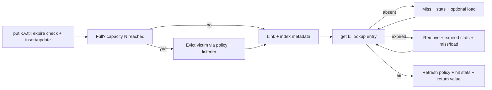
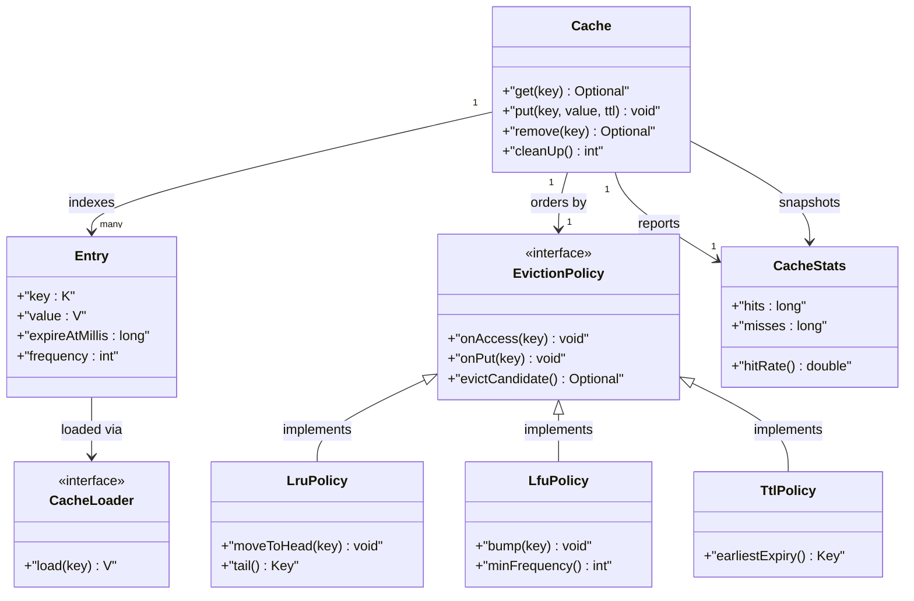
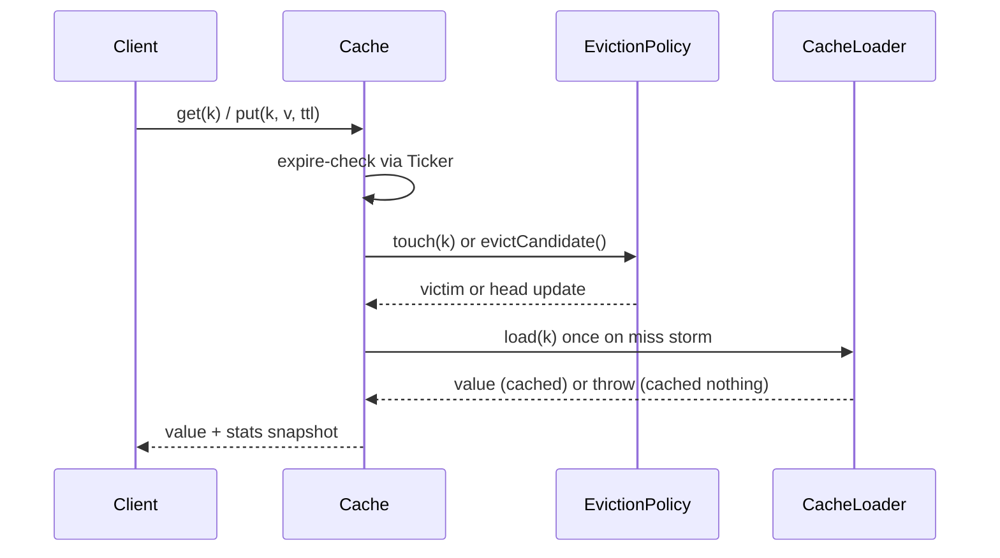

# Implement a Cache System

## Blogs and websites

## Medium

## Youtube

- [Cache | Google SWE Teaches Low Level Design Episode 2](https://www.youtube.com/watch?v=9wJgeze4esA)

## Theory

Design an in-memory cache with bounded capacity, eviction (e.g., LRU/LFU), and optional TTL expiry. Must serve gets in O(1) and handle concurrent access.
Key entities: Cache, Entry (key/value/expiry), EvictionPolicy.
Core operations: get, put, evict, expire.

This guide turns that stub into an interview-ready low-level design: you will clarify an intentionally ambiguous bounded in-memory cache, model clean OOP entities around Cache, Entry, EvictionPolicy, and Stats, choose O(1) LRU via HashMap plus doubly-linked list with pluggable LFU and TTL policies, handle concurrent get-put-evict-expiry safety plus stampede and thundering-herd guards, and write plain Java 17 code an interviewer can trace on a whiteboard. The emphasis is on object modeling, O(1) eviction mechanics, and expiry correctness — not distributed replication, persistent stores, or CDN routing.

> Scope note: this is LLD (class design, patterns, in-process concurrency). Sharding, replication, write-through to a database, and distributed coherence belong to HLD and are mentioned only where they constrain the object model (for example, every Entry carries value plus expiry plus access metadata so a loader retry or write-back never resurrects a stale entry).

### Topics Covered

1. [Problem Statement](#problem-statement)
2. [Functional / Non-Functional Requirements](#functional--non-functional-requirements)
3. [Core Entities & Class Design](#core-entities--class-design)
4. [Key Design Decisions & Patterns Used](#key-design-decisions--patterns-used)
5. [Concurrency & Edge Cases](#concurrency--edge-cases)
6. [Java 17 Implementation](#java-17-implementation)
7. [Interview Questions and Answers](#interview-questions-and-answers)

---

### Problem Statement

Design a generic in-memory cache `Cache<K, V>` with fixed capacity N, pluggable eviction (LRU by default, LFU and TTL-expiry as alternatives), and per-entry time-to-live. It must serve `get`, `put`, `remove`, `clear`, and `stats` with O(1) average hit-path cost, evict deterministically when full, expire entries lazily on access plus eagerly via background sweep, and stay correct under concurrent readers and writers.

A `get(key)` returns the value on hit or null/Optional on miss or expiry; a hit refreshes recency (LRU) or frequency (LFU) and counts toward hit rate. A `put(key, value)` inserts or updates, refreshes policy metadata, sets or refreshes TTL, and evicts exactly one victim when insertion would exceed capacity. Expired entries behave as absent: they miss, they are removable on sweep, and they never count as eviction victims for stats purity. A `CacheLoader` seam optionally computes missing values once per key under stampede protection.

**Why this problem exists**

- Real cache bugs cluster in three places: O(N) eviction scans that pass unit tests but fail at scale, expiry treated as eviction (polluting hit-rate math and victim choice), and check-then-act races where two threads load, evict, or expire the same key differently.
- The domain maps to two classic design ideas: O(1) recency is a textbook HashMap plus doubly-linked-list pairing, and policy choice is a textbook Strategy family (LRU versus LFU versus TTL-only) behind one `EvictionPolicy` interface.
- Interviewers love it because the happy path takes 10 minutes (map plus list plus get-put) but the follow-ups (why is get O(1), how does LFU avoid ghost-frequency leaks, where does expiry live, how do concurrent puts stay atomic) separate API recall from modeled reasoning.

**Real-life analogues**

- **Guava Caffeine and Ehcache heaps**: bounded local caches with LRU/W-TinyLFU variants, TTL/TTI expiry, loader functions, and hit-rate stats.
- **ORM second-level and memoization caches**: per-query or per-method entries with TTL refresh and size-bound eviction.
- **Rate-limiter and session stores**: TTL-driven presence where expiry correctness matters more than eviction order.

**Clarifying questions to ask in the interview (say these out loud)**

1. Generic `K, V` cache or String-only? Null keys or values allowed?
2. Capacity semantics: max entries, max weight/bytes, or both? What happens on capacity zero?
3. Default policy: LRU only, or pluggable LRU/LFU/FIFO/TTL? Can policy change at runtime?
4. TTL model: per-entry TTL, fixed global TTL, TTL plus max-idle (TTI)? Lazy expiry enough or background sweep required?
5. Read/write-through or loader: is there a `CacheLoader` on miss, and should concurrent misses collapse to one load?
6. Stats needed: hits, misses, evictions, expirations, load time? Should expired-miss count separately from plain miss?
7. Eviction listener: should evicted or expired entries fire a callback for write-back or cleanup?
8. Thread-safety: full concurrent access, single-writer, or externally synchronized? Target read-write ratio?
9. Persistence or overflow to disk: in-scope or strictly in-memory heap?
10. Iteration and ordering: should callers iterate entries, snapshot keys, or only use get-put-remove?

**Assumptions for this guide (state these if the interviewer says "decide yourself")**

- Generic `Cache<K, V>` with non-null keys; null values rejected to keep miss-versus-null unambiguous.
- Bounded by entry count N; capacity fixed at construction; zero capacity means every put evicts immediately.
- LRU default with LFU and TTL-aware policy injectable via `EvictionPolicy`; runtime policy swap clears ordering state explicitly.
- Per-entry TTL in millis, `0` or negative means no expiry; lazy expiry on every access plus periodic `cleanUp()` sweep the interviewer can call.
- Optional `CacheLoader<K, V>` with per-key in-flight dedup so a stampede loads once; loader exceptions propagate and never cache.
- In-memory only, no disk overflow; stats via immutable `CacheStats` snapshot; eviction listener optional and fired outside the lock.
- Single cache instance active per construction; all public methods safe for concurrent use.



The diagram shows the guarded capacity loop from put to get: eviction gates every over-capacity insert, expiry gates every read before policy refresh, and only live hits refresh recency or frequency so stale entries never pollute ordering.

---

### Functional / Non-Functional Requirements

#### Functional requirements (must-have)

1. **Generic storage and capacity**
   - Support any `K, V` with `equals` and `hashCode` key semantics; reject null keys and null values with typed exceptions.
   - Enforce max-entries capacity N; insertion beyond N evicts exactly one policy-chosen victim before linking the new entry.
2. **Get with expiry gate**
   - `get(key)` returns value on live hit, empty on miss or expiry; expired entries removed inline and counted as expirations not evictions.
   - Live hits refresh policy metadata (LRU touch, LFU increment, TTL access stamp for TTI variants).
3. **Put with insert-or-update**
   - `put(key, value)` and `put(key, value, ttlMillis)` upsert; updates keep position semantics of the active policy rather than treating update as fresh insert where policy forbids.
   - Per-entry TTL overrides default TTL; non-positive TTL means no expiry.
4. **Remove, clear, and size**
   - `remove(key)` returns removed value or empty; `clear()` drops all entries and resets policy state; `size()` counts live entries only.
   - Explicit removes never count as evictions or expirations in stats.
5. **Pluggable eviction policies**
   - `EvictionPolicy<K>` interface with `onAccess`, `onPut`, `onRemove`, and `evictCandidate` hooks; LRU default, LFU and TTL-aware variants provided.
   - Policy state lives beside entries, never duplicated inside caller code.
6. **TTL expiry dual path**
   - Lazy expiry on `get`, `put`, `remove`, and `containsKey`; eager `cleanUp()` sweep removes all expired entries in one pass.
   - Expiry comparison uses injectable `Ticker` (millis source) so tests use a manual clock without sleeping.
7. **Optional loader with stampede guard**
   - `get(key, loader)` computes absent values once per key even under concurrent miss storms; in-flight loads share one future.
   - Loader failures propagate to all waiters and cache nothing; negative caching is an explicit opt-in, not default.
8. **Stats and listener facade**
   - `CacheStats` snapshot holds hits, misses, evictions, expirations, loads, and hit rate; `EvictionListener` receives evicted and expired removals.
   - Public API `get`, `put`, `remove`, `clear`, `size`, `stats`, `cleanUp` returns result objects; illegal capacity or null key throws typed exceptions.

#### Explicitly out of scope (say this to bound the interview)

- Distributed sharding, replication, and coherence protocols (the entry carries enough metadata for HLD to add them).
- Write-through or write-behind persistence to a database (a listener seam records what persistence would consume).
- Weight-based (byte-size) eviction and admission filters like TinyLFU admission windows (record access metadata so HLD can add them).

#### Non-functional requirements (LLD-flavoured)

- **Correctness over speed**: no expired or over-capacity entry is ever observable; expiry and capacity gates run before metadata refresh.
- **O(1) hit path by construction**: map lookup plus pointer splices, no scans on get or put victim selection beyond policy-head read.
- **Extensibility**: adding a new policy means adding one `EvictionPolicy` class, not rewriting `Cache`.
- **Testability**: policies, ticker, and loader are plain injectable seams drivable with fixed keys and a manual clock.
- **Readability**: an interviewer can trace `get()` → `expire-check()` → `policy-touch()` → `stats()` in under five minutes.
- **Determinism**: no randomness, no wall-clock dependence except an injectable ticker for TTL and sweep tests.
- **Observability (lightweight)**: every hit, miss, eviction, expiration, and load increments a counter snapshotted as `CacheStats`.

| Requirement | Target / policy | Why it matters in LLD |
|---|---|---|
| O(1) get and put victim pick | HashMap plus DLL head-tail splices | Core perf invariant |
| Expiry never masquerades as eviction | Separate expired versus evicted counters | Stats-truth follow-up |
| Policy swap safety | Explicit reset, no cross-policy ghost state | Where juniors fail |
| Loader stampede collapse | Per-key in-flight future, single compute | Most-tested concurrency probe |
| Capacity integrity | Evict-then-link under one monitor | Over-capacity leak guard |
| Expiry testability | Injectable ticker, manual advance | No-sleep test design |

---

### Core Entities & Class Design

The model has four entity groups: the Cache facade callers touch, the Entry value objects holding key plus value plus expiry plus policy metadata, the EvictionPolicy Strategy family for ordering, and the Stats plus listener observability seam. Keep behaviour with the data it guards: entries own expiry checks, policies own ordering, the cache owns capacity and atomicity, and stats own counting.

#### Value objects and supporting types (the vocabulary of the domain)

- `Cache<K, V>`: generic facade — `get`, `put`, `remove`, `clear`, `size`, `stats`, `cleanUp`, plus `get(key, loader)` stampede-safe variant.
- `Entry<K, V>`: node holding key, value, `expireAtMillis` (Long.MAX_VALUE means no expiry), `lastAccessTick`, `frequency`, plus doubly-linked-list `prev` and `next` pointers for LRU.
- `Ticker`: millis source interface — `SystemTicker` for production, `ManualTicker` for tests with `advance(millis)`; every expiry comparison goes through it.
- `CacheLoader<K, V>`: functional interface `V load(K key) throws Exception` for read-through misses.
- `CacheStats`: immutable snapshot — hits, misses, evictions, expirations, loads, plus derived `hitRate()`.
- `EvictionListener<K, V>`: callback `onRemove(key, value, cause)` where cause is EVICTED versus EXPIRED versus EXPLICIT.
- `ExpiryCause` and `RemovalCause` enums keep stats and listener truth consistent: expiry never increments evictions.

#### Cache, entries, and policies

- `Cache`: owns `HashMap<K, Entry<K, V>> index`, `EvictionPolicy<K> policy`, `capacity`, `defaultTtlMillis`, `Ticker`, counters, optional loader map, and listener list. Methods `get(key)`, `put(key, value)`, `put(key, value, ttl)`, `remove(key)`, `clear()`, `size()`, `containsKey(key)`, `cleanUp()`.
- `Entry`: methods `isExpired(nowMillis)`, `touch(nowMillis)` updating access stamp, `incrementFrequency()`; LRU prev-next splicing helpers live on the policy, not on callers.
- `EvictionPolicy<K>` (interface): `onAccess(key)`, `onPut(key)`, `onRemove(key)`, `evictCandidate()` returning victim key or empty, `clear()` resetting state, `name()` for stats labels.
- `LruPolicy<K>`: HashMap-adjacent doubly-linked list with head as most-recent and tail as victim; `onAccess` moves node to head, `onPut` links new node at head, `evictCandidate` reads tail — all O(1).
- `LfuPolicy<K>`: frequency map plus min-frequency tracking with per-frequency insertion-ordered sets; `onAccess` bumps count, `evictCandidate` picks lowest frequency then oldest within it; avoids ghost state by deleting counts on remove.
- `TtlPolicy<K>` (expiry-aware wrapper or standalone): orders by earliest `expireAtMillis` so `cleanUp` and capacity pressure prefer already-soft-expired entries; composes with LRU or LFU rather than replacing them.
- `CacheStats` counters: `hits`, `misses`, `evictions`, `expirations`, `loads`; snapshot via `stats()` returning an immutable record copy.

#### Load, sweep, and observability pipeline

- Load pipeline inside `get(key, loader)`: live-hit fast path, expired-as-miss inline removal, miss storm check of in-flight map, single `loader.load`, put-then-publish, waiter fan-out.
- Sweep pipeline inside `cleanUp()`: snapshot keys under lock, test `isExpired(ticker.now())`, remove expired batch, fire listener outside the lock with EXPIRED cause.
- Observer seam: `EvictionListener.onRemove` for write-back, resource close, or metrics export without coupling the cache to persistence.
- Stats pipeline: every return path increments exactly one counter family — hit, miss, plus optional eviction or expiration — so hit rate stays reproducible.



The diagram shows containment (cache to entries), delegation (cache to policy), observation (cache to stats and listener), and extension (three policies behind one interface) — the four relationships to name in the interview.

**Key relationships and cardinalities**

- Cache 1—0..N Entry objects at a time; insertion beyond N evicts exactly one before linking, so occupancy never exceeds N observably.
- Entry 1—1 key identity; map index and policy list reference the same node object, never duplicate copies.
- Cache 1—1 EvictionPolicy at a time; policy swap resets ordering state explicitly rather than inheriting stale links.
- Cache 1—\* CacheStats snapshots (each `stats()` call returns a new immutable copy; counters never leak mutably).
- Cache 1—0..1 in-flight load per key; concurrent miss waiters share one future instead of each computing.

**Where behaviour lives (tell the interviewer)**

- Recency truth lives in the policy list, not in timestamps scanned on evict: touch means pointer splice to head, victim means tail read.
- Expiry truth lives in the entry: `isExpired(now)` compares `expireAtMillis` against the ticker, so lazy and sweep paths share one predicate.
- Capacity truth lives in the cache: size check, victim ask, victim unlink, new link all happen under one monitor in `put`.
- Frequency truth lives in LFU counts plus per-count ordered sets, reset on remove so deleted hot keys do not haunt future inserts.
- Load truth lives in the in-flight map: first misser computes, late missers wait, failures clear the slot and cache nothing.

---

### Key Design Decisions & Patterns Used

#### Decision 1 — O(1) LRU via HashMap plus doubly-linked list (the hook)

Every live key has one map slot for lookup plus one list node for recency. `get` hits splice the node to head in pointer time; `put` inserts link at head and evicts from tail, each O(1) average with no scans. Say the trade-off verbatim: a `LinkedHashMap` in access order gives the same result in less code and is a fair interview shortcut, but the hand-rolled map plus list shows you understand why it is O(1) — index plus ordering are separate concerns. Name the invariant: map and list always reference the same node objects, updated together under one lock.

#### Decision 2 — LFU as frequency buckets, not sorted re-sort

LFU keeps `keyToCount` plus `countToKeys` (LinkedHashSet per count) plus `minCount`. Access bumps the count and moves the key between buckets; victim is the oldest key in the `minCount` bucket. Cost is O(1) amortized without ever sorting. State the leak guard explicitly: `onRemove` deletes the count entry and shrinks `minCount` bookkeeping, and re-`put` of a deleted key restarts at count one rather than resurrecting ghost frequency.

#### Decision 3 — TTL as entry predicate plus dual reclamation

Expiry is a per-entry `expireAtMillis` tested by `isExpired(now)` on every read path (lazy) plus a `cleanUp()` sweep over snapshots (eager). Lazy keeps the hit path exact with zero background threads; sweep bounds memory when keys are never re-read. Say the stats rule verbatim — expired behaves as absent and counts as expiration, never eviction — because conflating them is the classic grading trap. The injectable `Ticker` makes TTL deterministic: tests advance a manual clock instead of sleeping.

#### Decision 4 — Single-monitor atomicity with listener outside the lock

`get`, `put`, `remove`, `clear`, and `cleanUp` synchronize on the cache instance; victim selection plus unlink plus link happen atomically so two racing puts evict exactly one victim each and never exceed capacity. Listeners fire after unlock with immutable key-value-cause triples, so a slow write-back cannot deadlock the next `get`. State explicitly that policy internals assume the cache lock is held — policies are not independently synchronized, which keeps lock ordering trivial.

#### Decision 5 — Stampede collapse via per-key in-flight loads

`get(key, loader)` checks the live map first, then the in-flight map of `CompletableFuture` values. The first misser creates the future and computes; concurrent missers on the same key await the same future. Completion puts the value (with TTL) and completes waiters; failure completes exceptionally and caches nothing. Say the scope sentence: dedup is per key, not global, so hot-key storms collapse while distinct keys still load in parallel.

#### Decision 6 — Nulls rejected, causes explicit, stats immutable

- Null keys and values rejected with typed exceptions keeps miss (empty) distinct from cached-null ambiguity.
- `RemovalCause { EVICTED, EXPIRED, EXPLICIT }` flows to both stats routing and the listener so write-back logic can distinguish capacity pressure from TTL death.
- `CacheStats` as an immutable snapshot avoids torn long reads and lets tests assert exact counter deltas per operation.
- Capacity fixed at construction keeps the evict-then-link reasoning one case; zero capacity is legal and means put-then-immediately-evict with listener fire.

#### Patterns used (say these names out loud)

| Pattern | Where | Why |
|---|---|---|
| Strategy | `EvictionPolicy` family (LRU, LFU, TTL) | Ordering varies independently by policy |
| Facade | `Cache` over map, list, ticker, stats | One interview-traceable API for all flows |
| Observer (light) | `EvictionListener` removal notifications | Write-back reacts without cache coupling |
| Template Method (light) | `get` then `expire-gate` then `policy-touch` skeleton | Shared ordering, pluggable policy hook |
| Proxy / Memoize (light) | `get(key, loader)` collapsing future | Compute once, share across miss storm |
| Memento (light) | `CacheStats` immutable snapshot | Observe counters without corrupting live state |

**SOLID mapping (one line each for the "which principles?" follow-up)**

- Single Responsibility: entries test expiry, policies order keys, cache guards capacity, stats counts outcomes.
- Open/Closed: new policy or ticker equals a new class, zero edits to `get` or `put`.
- Liskov: any `EvictionPolicy` substitutes without breaking the touch-then-evict pipeline.
- Interface Segregation: small `EvictionPolicy`, `Ticker`, `CacheLoader`, and listener contracts instead of one fat cache interface.
- Dependency Inversion: `Cache` depends on policy and ticker interfaces; tests inject LFU plus a manual clock.

---

### Concurrency & Edge Cases

#### The concurrency story (the senior half of the interview)

One cache has one capacity, so the design centers on atomic evict-then-link plus collapsed loads and decoupled listeners. Three mechanisms from innermost to outermost:

1. **Single-monitor exclusion on the cache.** `get`, `put`, `remove`, `clear`, and `cleanUp` are `synchronized` on the cache; victim selection plus unlink plus link share the same monitor so two racing puts each evict exactly one victim and occupancy never observably exceeds N. Expiry checks and policy touches run inside the same critical section.
2. **Per-key in-flight load collapse.** `get(key, loader)` registers a `CompletableFuture` per missing key; the first misser computes outside the map lock while late missers on the same key wait on the future. Distinct keys load in parallel, identical keys compute once, and failures clear the slot without caching.
3. **Observers outside the lock.** Listeners fire after commit with immutable key-value-cause triples, so a slow write-back cannot deadlock the next `get`. Stats counters increment inside the lock but are snapshotted as an immutable record read outside it.



The diagram shows the expire-then-policy ordering in time: both expiry and capacity probes complete before any metadata refresh or loader publish, and stats increment after every return path so hit rate is never skipped.

**Why not `ConcurrentHashMap` alone?** A concurrent map serializes key access but does not express recency splices, atomic victim-plus-link updates, or coherent expiry-versus-eviction stats. Two threads inserting into a full map could each pass a size check and overshoot capacity, and a `get` refreshing LRU order is a write that needs the same exclusion as `put`. Cache-level exclusion plus policy-behind-lock gives both atomicity and ordering: exclusion stops races, the policy stops nonsense.

**Post-access evaluation rule (say this verbatim): expire, then hit-or-miss, then touch-or-load, then stats.** After every lookup the cache tests expiry first, routes to hit refresh or miss-plus-optional-load second, updates policy metadata third, and only then increments the matching counter family. Expired plus zero live entries is a miss with expiration count, never an eviction.

#### Edge cases table (pick 4–5 to recite, keep the rest as backup)

| # | Edge case | Handling |
|---|---|---|
| 1 | Two threads `put` different keys into a full cache | Serialized on the monitor; each evicts exactly one victim, size never exceeds N |
| 2 | Miss storm: ten threads `get` the same absent key | First creates the in-flight future and loads; nine wait, all share one value and one load count |
| 3 | Expired entry read | Treated as absent inline, removed, expiration counter fired; never offered as eviction victim |
| 4 | Zero or negative TTL | Means no expiry (`expireAtMillis` set to Long.MAX_VALUE); `cleanUp` skips it unconditionally |
| 5 | Zero capacity cache | Every `put` links then immediately evicts itself; listener fires with EVICTED cause, size stays zero |
| 6 | `put` updating an existing key | Value and TTL replaced, policy receives `onAccess` plus metadata refresh, no eviction triggered |
| 7 | `remove` of missing or already-expired key | Returns empty, no stats change except lazy expiration count when the entry was expired |
| 8 | `clear` racing an in-flight load | `clear` resets map and policy; late load completion re-inserts only if key still absent, never resurrects cleared victims |
| 9 | Listener throws on evict or expire | Exception swallowed after logging hook point; cache state already committed, next operation unaffected |
| 10 | Loader throws or times out | Future completes exceptionally to all waiters, slot cleared, nothing cached, miss plus failed-load noted |
| 11 | Loader returns null | Rejected and treated as failure; nulls never cached so miss-versus-null stays unambiguous |
| 12 | Clock jumps forward (TTL mass death) | Lazy path expires on next touch per key; `cleanUp` reclaims the rest in one sweep with EXPIRED causes |
| 13 | LFU tie on lowest frequency | Oldest key within the min-frequency bucket evicted first via insertion-ordered set |
| 14 | LRU `get` on hot key reshuffling victim order | Hit splices node to head in O(1); next eviction still reads tail, no scan or timestamp sort |
| 15 | `cleanUp` with zero expired entries | No-op returning zero; snapshot iteration avoids concurrent-modification by copying keys under lock |

---

### Java 17 Implementation

All classes below are plain Java 17 (no frameworks, records for immutable snapshots, interfaces for policy seams). The map plus doubly-linked list gives O(1) LRU, LFU adds bucketed counts, and `Cache` synchronizes the commit path. Each block is followed by its explanation and the pattern it demonstrates.

#### 1. Entries, ticker, and the policy Strategy family

The foundation is an expiry predicate plus one ordering strategy per policy with explicit lifecycle hooks.

```java
import java.util.*;

// Millis source: production uses wall clock, tests advance manually.
interface Ticker { long now(); }
final class SystemTicker implements Ticker {
    public long now() { return System.currentTimeMillis(); }
}
final class ManualTicker implements Ticker {
    private long t;
    ManualTicker(long start) { t = start; }
    public long now() { return t; }
    public void advance(long dMillis) { t += dMillis; }
}

enum RemovalCause { EVICTED, EXPIRED, EXPLICIT }

// Strategy: ordering varies by policy; cache calls hooks under its own lock.
interface EvictionPolicy<K> {
    void onAccess(K key);
    void onPut(K key);
    void onRemove(K key);
    Optional<K> evictCandidate();
    void clear();
    String name();
}

// Doubly-linked node carrying value plus expiry plus policy metadata.
final class Entry<K, V> {
    final K key;
    V value;
    long expireAtMillis;
    long lastAccess;
    int frequency = 1;
    Entry<K, V> prev, next;
    Entry(K key, V value, long expireAt) {
        this.key = key; this.value = value; this.expireAtMillis = expireAt;
    }
    boolean isExpired(long now) { return now >= expireAtMillis; }
}

// LRU: head is most-recent, tail is victim; touch means splice to head.
final class LruPolicy<K> implements EvictionPolicy<K> {
    private final Map<K, Entry<K, ?>> index = new HashMap<>();
    private Entry<K, ?> head, tail;
    void link(Entry<K, ?> e) { index.put(e.key, e); moveToHead(e); }
    void moveToHead(Entry<K, ?> e) {
        unlink(e);
        e.prev = null; e.next = head;
        if (head != null) head.prev = e;
        head = e;
        if (tail == null) tail = e;
    }
    void unlink(Entry<K, ?> e) {
        if (e.prev != null) e.prev.next = e.next; else if (head == e) head = e.next;
        if (e.next != null) e.next.prev = e.prev; else if (tail == e) tail = e.prev;
        e.prev = null; e.next = null;
    }
    public void onAccess(K k) { var e = index.get(k); if (e != null) moveToHead(e); }
    public void onPut(K k) { /* Cache calls link() with the live node. */ }
    public void onRemove(K k) {
        var e = index.remove(k);
        if (e != null) unlink(e);
    }
    @SuppressWarnings("unchecked")
    public Optional<K> evictCandidate() {
        return tail == null ? Optional.empty() : Optional.of((K) tail.key);
    }
    public void clear() { index.clear(); head = null; tail = null; }
    public String name() { return "LRU"; }
}
```

Explanation: `Ticker` removes wall-clock dependence so TTL tests advance time without sleeping. `Entry` as a node object is shared by reference between the map index and the policy list, which is exactly why LRU stays O(1): lookup finds the node, splicing moves it. This block demonstrates the Strategy pattern: each policy varies ordering independently behind `onAccess`, `onPut`, and `evictCandidate`.

#### 2. LRU cache facade with O(1) get-put plus TTL gates

`Cache` runs the expire, capacity, policy, and stats pipeline with single-monitor atomicity; this is the full LRU to trace on the whiteboard.

```java
import java.util.*;

interface EvictionListener<K, V> {
    void onRemove(K key, V value, RemovalCause cause);
}

public class Cache<K, V> {
    private final int capacity;
    private final long defaultTtlMillis;
    private final Ticker ticker;
    private final Map<K, Entry<K, V>> map = new HashMap<>();
    private final LruPolicy<K> lru = new LruPolicy<>();
    private final List<EvictionListener<K, V>> listeners = new ArrayList<>();
    private long hits, misses, evictions, expirations;

    public Cache(int capacity, long defaultTtlMillis, Ticker ticker) {
        if (capacity < 0) throw new IllegalArgumentException("capacity < 0");
        this.capacity = capacity;
        this.defaultTtlMillis = defaultTtlMillis;
        this.ticker = ticker;
    }
    public void addListener(EvictionListener<K, V> l) { listeners.add(l); }

    private long expireAt(long ttlMillis) {
        long ttl = ttlMillis < 0 ? defaultTtlMillis : ttlMillis;
        return ttl <= 0 ? Long.MAX_VALUE : ticker.now() + ttl;
    }
    private void fire(K k, V v, RemovalCause c) {
        for (var l : listeners) {
            try { l.onRemove(k, v, c); } catch (RuntimeException ignored) {}
        }
    }
    // Expire-gate: expired behaves as absent and counts as expiration.
    private Entry<K, V> takeIfLive(K key) {
        var e = map.get(key);
        if (e == null) return null;
        if (e.isExpired(ticker.now())) {
            map.remove(key);
            lru.onRemove(key);
            expirations++;
            fire(key, e.value, RemovalCause.EXPIRED);
            return null;
        }
        return e;
    }
    public synchronized Optional<V> get(K key) {
        Objects.requireNonNull(key, "key");
        var e = takeIfLive(key);
        if (e == null) { misses++; return Optional.empty(); }
        e.lastAccess = ticker.now();
        lru.onAccess(key);
        hits++;
        return Optional.of(e.value);
    }
    public synchronized void put(K key, V value) { put(key, value, -1); }
    public synchronized void put(K key, V value, long ttlMillis) {
        Objects.requireNonNull(key, "key");
        Objects.requireNonNull(value, "value");
        var live = takeIfLive(key);
        if (live != null) { // update: refresh value plus TTL, keep policy touch
            live.value = value;
            live.expireAtMillis = expireAt(ttlMillis);
            live.lastAccess = ticker.now();
            lru.onAccess(key);
            return;
        }
        if (map.size() >= capacity && capacity > 0 || capacity == 0) {
            lru.evictCandidate().ifPresent(victim -> {
                var out = map.remove(victim);
                lru.onRemove(victim);
                if (out != null) { evictions++; fire(victim, out.value, RemovalCause.EVICTED); }
            });
            if (capacity == 0) { // zero capacity: count caller's insert as immediate evict
                evictions++;
                fire(key, value, RemovalCause.EVICTED);
                misses++;
                return;
            }
        }
        var e = new Entry<>(key, value, expireAt(ttlMillis));
        e.lastAccess = ticker.now();
        map.put(key, e);
        lru.link(e);
    }
    public synchronized Optional<V> remove(K key) {
        Objects.requireNonNull(key, "key");
        var e = takeIfLive(key);
        if (e == null) return Optional.empty();
        map.remove(key);
        lru.onRemove(key);
        fire(key, e.value, RemovalCause.EXPLICIT);
        return Optional.of(e.value);
    }
    public synchronized int cleanUp() { // eager sweep returns expired count
        int n = 0;
        for (var k : new ArrayList<>(map.keySet())) {
            var e = map.get(k);
            if (e != null && e.isExpired(ticker.now())) {
                map.remove(k);
                lru.onRemove(k);
                expirations++;
                n++;
                fire(k, e.value, RemovalCause.EXPIRED);
            }
        }
        return n;
    }
    public synchronized int size() { return map.size(); }
}
```

Explanation: `put` is the whole interview in one method — expiry gate, update-versus-insert branch, evict-then-link under one monitor, listener fire after state commit. `takeIfLive` is the shared expiry predicate so `get`, `put`, `remove`, and `cleanUp` cannot disagree on liveness. Because victim selection reads the list tail and touches splice pointers, both `get` hits and `put` inserts stay O(1) average with zero scans, which is the Facade plus Template Method shape: fixed pipeline skeleton, pluggable policy hook.

#### 3. Stats, stampede-safe loader, and demo

Snapshots keep counters honest and the loader collapses concurrent misses to one compute without holding the map lock during I/O.

```java
import java.util.*;
import java.util.concurrent.*;

record CacheStats(long hits, long misses, long evictions,
                 long expirations, long loads) {
    double hitRate() {
        long total = hits + misses;
        return total == 0 ? 0.0 : (double) hits / total;
    }
}

interface CacheLoader<K, V> { V load(K key) throws Exception; }

// Loader extension over Cache: per-key futures collapse the storm.
final class LoadingCache<K, V> {
    private final Cache<K, V> base;
    private final Map<K, CompletableFuture<V>> inflight = new HashMap<>();
    LoadingCache(Cache<K, V> base) { this.base = base; }

    public Optional<V> get(K key) { return base.get(key); }

    public V get(K key, CacheLoader<K, V> loader) throws Exception {
        var hit = base.get(key);
        if (hit.isPresent()) return hit.get();
        CompletableFuture<V> fut;
        synchronized (this) {
            var again = base.get(key); // recheck under storm ordering
            if (again.isPresent()) return again.get();
            fut = inflight.get(key);
            if (fut == null) {
                fut = new CompletableFuture<>();
                inflight.put(key, fut);
            } else {
                try { return fut.get(); } catch (ExecutionException e) {
                    throw new RuntimeException(e.getCause());
                }
            }
        }
        try {
            V v = loader.load(key); // compute OUTSIDE locks: slow I/O never blocks gets
            Objects.requireNonNull(v, "loader returned null");
            base.put(key, v);
            synchronized (this) { inflight.remove(key); }
            fut.complete(v);
            return v;
        } catch (Throwable t) {
            synchronized (this) { inflight.remove(key); }
            fut.completeExceptionally(t);
            if (t instanceof Exception e) throw e;
            throw new RuntimeException(t);
        }
    }
}

// Demo: LRU eviction plus TTL expiry answered by ticker, not by sleep.
class CacheDemo {
    public static void main(String[] args) throws Exception {
        var clock = new ManualTicker(1_000);
        var cache = new Cache<String, String>(2, 500, clock);
        cache.addListener((k, v, c) -> System.out.println("removed " + k + " cause=" + c));
        cache.put("a", "1");
        cache.put("b", "2");
        System.out.println(cache.get("a")); // hit: a becomes most-recent
        cache.put("c", "3");                // evicts b (LRU tail)
        System.out.println("b=" + cache.get("b")); // miss, already evicted
        clock.advance(600);                 // expire a and c via ticker
        System.out.println("expired sweep=" + cache.cleanUp());
        System.out.println("size=" + cache.size());
    }
}
```

Explanation: the loader runs outside both monitors so one slow database fetch never serializes unrelated keys, while the per-key future still collapses identical-key storms — the Proxy plus Memoize combination to name. `CacheStats` as a record gives atomic readable snapshots instead of torn long reads across threads. The demo wires a listener and a manual clock through put, hit-refresh, evict-tail, and sweep, which is exactly the live-coding arc to reproduce: policy, TTL gate, capacity guard, stats print.

**How to extend (name these without building them)**

- New LFU default: swap the policy field to `LfuPolicy` with frequency buckets; `Cache` pipeline and ticker logic are untouched.
- Weight-based eviction: add per-entry weight plus total-weight guard beside the count guard before victim selection.
- Write-through persistence: add a listener-backed store writer plus load-from-store fallback inside the loader branch.

---

### Interview Questions and Answers

1. **Beginner: walk me through the classes in your cache.**
   Answer: `Cache` facade over a `HashMap` index, `Entry` nodes with value plus expiry plus list pointers, `EvictionPolicy` interface with `LruPolicy` and `LfuPolicy` variants, `Ticker` clock seam, `CacheLoader` for misses, immutable `CacheStats` snapshot, and `EvictionListener` with `RemovalCause` for evicted versus expired versus explicit removals.

2. **Beginner: why is get O(1) and where does the list come in?**
   Answer: the map finds the node by key in O(1) average and the doubly-linked list moves it to head with pointer splices in O(1). Eviction reads the tail in O(1) with no scan or sort. Map and list hold the same node references so they can never disagree on membership.

3. **Beginner: what is the difference between eviction and expiration?**
   Answer: eviction is capacity pressure removing a live victim chosen by policy; expiration is TTL death removing an entry regardless of policy. Expired reads behave as absent, count as expirations not evictions, and never appear as victim candidates, which keeps hit-rate math reproducible.

4. **Junior: how do LRU and LFU differ in your implementation?**
   Answer: LRU orders by recency with head as most-recent and tail as victim, touching on every hit. LFU orders by frequency buckets plus insertion order within the minimum bucket, bumping on every hit. LRU wins for recency workloads, LFU wins for skewed hot keys, and both sit behind the same three-hook interface.

5. **Junior: lazy expiry versus background sweep — why both?**
   Answer: lazy gates every access so no stale value is ever returned even with zero threads running. The sweep bounds memory for keys nobody re-reads by removing all expired entries in one snapshot pass. Both share `isExpired(now)` so they cannot disagree on liveness.

6. **Junior: why does put check capacity before linking?**
   Answer: evict-then-link under one monitor keeps size at or under N at every observable point. Checking after linking would briefly overshoot and force two racing puts to reason about two victims. Zero capacity falls out naturally: the new entry evicts immediately and size stays zero.

7. **Mid: how do concurrent gets and puts stay correct?**
   Answer: all state paths synchronize on the cache so expiry test, policy touch, victim unlink, and link are atomic. Policies assume the lock is held and carry no locks of their own, which removes lock-ordering risk. Listeners fire after unlock so slow callbacks never serialize the next operation.

8. **Mid: how does the loader avoid a stampede without blocking all keys?**
   Answer: a per-key future map collapses identical-key misses to one compute while distinct keys still load in parallel. The compute runs outside every lock so slow I/O never stalls unrelated hits. Failures and nulls complete exceptionally and cache nothing, with the slot cleared for the next attempt.

9. **Senior: how do you swap LRU to LFU without ghost state?**
   Answer: policy swap explicitly clears ordering state and re-registers live keys in insertion order rather than inheriting list links as frequency counts. LFU removes also delete count entries so deleted hot keys restart at one on reinsert. State the rule: no cross-policy pointer or counter reuse, ever.

10. **Senior: how do you test eviction, TTL, and races without sleeping or flakiness?**
    Answer: inject `ManualTicker` and assert LRU tail choice after scripted get-put sequences, advance the clock past TTL and assert lazy miss plus sweep count, and run a ten-thread same-key loader storm asserting exactly one compute. Stats snapshots assert exact hit, miss, eviction, and expiration deltas per operation.
