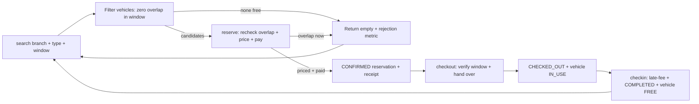
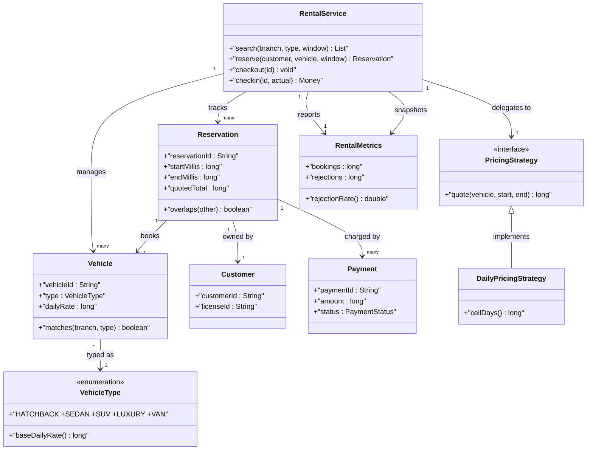
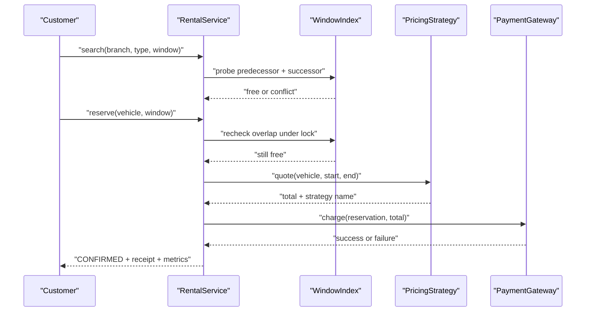

# Design Car Rental Service

## Blogs and websites

## Medium

## Youtube

- [9. LLD of Car Rental System (Hindi) | ZoomCar Low Level Design | System Design Interview Question](https://www.youtube.com/watch?v=J4GO6hmR6TA)
- [Low Level Designing (LLD -2) - Car Rental System | ZoomCar.com | Revv | Drivezy](https://www.youtube.com/watch?v=AXa6jCfziRY)
- [Uber/Ola Low Level System Design explained with CODE, UML Diagram | Easy & Detailed Explanation!!](https://www.youtube.com/watch?v=a-F45Jov0Ck)
    - [keertipurswani/Uber-Ola-Low-Level-Design](https://github.com/keertipurswani/Uber-Ola-Low-Level-Design)

## Theory

Design a rental platform to search, reserve, and rent vehicles across branches with availability and pricing. Must prevent overlapping reservations for the same vehicle.
Key entities: Vehicle, Branch, Reservation, Customer, Payment.
Core operations: search vehicles, reserve, check-in/check-out.

This guide turns that stub into an interview-ready low-level design: you will clarify an intentionally ambiguous multi-branch rental shop, model clean OOP entities around Vehicle, VehicleType, Branch, Customer, Reservation, and Payment, enforce overlap-free booking with a per-vehicle ordered interval check behind one monitor, compute every quote through a pluggable PricingStrategy family, and write plain Java 17 code an interviewer can trace on a whiteboard. The emphasis is on object modeling, reservation-conflict correctness, and pricing extensibility — not fleet logistics routing, dynamic surge infrastructure, or payment settlement networks.

> Scope note: this is LLD (class design, patterns, in-process concurrency). City-wide fleet rebalancing, GPS telematics, fraud scoring, and payment-gateway settlement belong to HLD and are mentioned only where they constrain the object model (for example, every Reservation carries vehicleId plus branchId plus customerId plus start and end epoch plus price snapshot plus state so a retry or late-return callback never double-books or double-charges).

### Topics Covered

1. [Problem Statement](#problem-statement)
2. [Functional / Non-Functional Requirements](#functional--non-functional-requirements)
3. [Core Entities & Class Design](#core-entities--class-design)
4. [Key Design Decisions & Patterns Used](#key-design-decisions--patterns-used)
5. [Concurrency & Edge Cases](#concurrency--edge-cases)
6. [Java 17 Implementation](#java-17-implementation)
7. [Interview Questions and Answers](#interview-questions-and-answers)

---

### Problem Statement

Design a `RentalService` over a fixed set of branches each holding vehicles in types HATCHBACK, SEDAN, SUV, LUXURY, VAN. A customer searches by branch plus vehicle type plus date window `[start, end)`; the system lists only vehicles with zero overlapping ACTIVE or CONFIRMED reservations in that window, creates a `Reservation` in CONFIRMED state with a price snapshot from the active `PricingStrategy`, and transitions it through CHECKED_OUT on pickup and COMPLETED on return with late-fee adjustment. Overlapping windows on the same vehicle are rejected with `VehicleUnavailableException`, and every price is recomputable from the stored strategy name plus inputs so quotes stay auditable. Cancellation before pickup frees the window with a policy-driven fee.

A `search(branchId, type, start, end)` returns available vehicles sorted by daily rate; a `reserve(customerId, vehicleId, start, end)` atomically rechecks overlap then prices then books; a `checkout(reservationId)` hands over the keys and a `checkin(reservationId, actualReturn)` closes the loop with overage. Expired holds behave as absent: an unpaid hold past its TTL is auto-cancelled and its window becomes bookable again. A `Clock` seam drives hold TTL and late-fee math so tests never sleep.

**Why this problem exists**

- Real rental bugs cluster in three places: interval checks that compare only start dates and let `[Mon–Fri]` and `[Thu–Sun]` double-book the same car, price math scattered across controllers so weekend and holiday quotes disagree, and check-then-act races where two customers reserve the last SUV for the same weekend.
- The domain maps to two classic design ideas: overlap detection is a textbook ordered-interval membership test (per-vehicle sorted windows with neighbour-only comparison), and pricing is a textbook Strategy family (one interface, many rate cards, reservation stores the snapshot).
- Interviewers love it because the happy path takes 10 minutes (vehicles plus map plus reserve-checkout-checkin) but the follow-ups (where does overlap live, why neighbour check is enough, where does pricing live, how do concurrent reserves stay atomic) separate API recall from modeled reasoning.

**Real-life analogues**

- **Zoomcar, Revv, Drivezy, Hertz, Avis**: branch inventory, type-tiered rates, weekend versus weekday pricing, late-return penalties, cancellation slabs.
- **Airbnb and hotel room booking**: same interval-exclusion core with nightly versus seasonal rate strategies and hold-then-confirm flows.
- **Library hold shelves and co-working desk booking**: exclusive-occupancy windows with expiry and no-show release.

**Clarifying questions to ask in the interview (say these out loud)**

1. Inventory topology: one branch per instance or many branches with transfer? Fixed fleet or dynamic add/remove?
2. Vehicle model: discrete type enum with rate tiers, or per-vehicle attributes (seats, fuel, transmission) with filters?
3. Search semantics: exact window availability only, or nearest-alternative suggestions when nothing fits?
4. Overlap definition: half-open `[start, end)` with end-exclusive handover, or buffer time between back-to-back rentals for cleaning?
5. Hold model: instant CONFIRMED on reserve, or unpaid HOLD with TTL then confirm on payment?
6. Pricing inputs: flat daily only, or hourly plus daily plus weekly plus weekend multiplier plus seasonal surge?
7. Late returns: per-hour overage, grace period, or full extra day after threshold?
8. Cancellation: free window, slab-based fee, or no-show full-day charge?
9. Payment scope: full charge at reserve, at checkout, at checkin, or split auth-capture? Refunds in scope?
10. Observability: occupancy, rejection, late-return, revenue counts? Damage or fuel-level notes audited?

**Assumptions for this guide (state these if the interviewer says "decide yourself")**

- Single `RentalService` instance with a fixed branch and vehicle set built at construction; types are a `VehicleType` enum with base daily rates.
- Half-open windows `[start, end)` in epoch millis; equal endpoints do not overlap, so back-to-back bookings chain cleanly with zero buffer.
- Overlap rule: one CONFIRMED or CHECKED_OUT reservation per vehicle per instant; COMPLETED, CANCELLED, and EXPIRED windows are invisible to conflict checks.
- Paid-at-reserve simplified to a `Payment` record with status; gateway calls are a seam returning success or failure.
- Pricing default is daily rate times ceil-days with pluggable strategies; reservation stores quoted total plus strategy name for audit.
- Cancellation before start is free up to 24h, then one-day fee; late return bills per-hour overage after a 60-minute grace.
- In-memory only, no persistence; attendant override is explicit `cancel` with reason string for audit.
- All public methods safe for concurrent use; one monitor guards search-snapshot plus reserve plus checkout plus checkin.



The diagram shows the guarded capacity loop from search to return: overlap gates every reservation, pricing and payment gate confirmation before any handover, and only live verified checkouts move keys so stale or double-booked windows never release a car.

---

### Functional / Non-Functional Requirements

#### Functional requirements (must-have)

1. **Branch-tiered inventory and window search**
    - Support `VehicleType HATCHBACK, SEDAN, SUV, LUXURY, VAN` with base rates; reject null branch, type, or inverted window with typed exceptions.
    - `search(branchId, type, start, end)` returns vehicles with zero overlapping live reservations in the window, sorted by daily rate ascending.
2. **Overlap-free reservation**
    - One live reservation per vehicle per instant; `reserve` tests the per-vehicle ordered window set under lock and throws `VehicleUnavailableException` on any overlap.
    - Half-open semantics: `end == existing.start` is legal chaining, `start < existing.end && existing.start < end` is conflict.
3. **Reservation with price snapshot**
    - `reserve` creates a Reservation with unique id, vehicleId, customerId, branchId, window, quoted total, strategy name, and CONFIRMED state.
    - Quote is computed once via `PricingStrategy` and stored; later strategy swaps never rewrite history.
4. **Checkout and checkin lifecycle**
    - `checkout(reservationId)` verifies the reservation is CONFIRMED and hands over the vehicle to IN_USE as CHECKED_OUT; early pickup within policy is allowed.
    - `checkin(reservationId, actualReturn)` computes late overage after grace, marks COMPLETED, frees the vehicle, and records the final charge.
5. **Cancellation and hold expiry**
    - `cancel(reservationId, reason)` before checkout marks CANCELLED with slab fee and frees the window; checkout-active rentals use checkin path instead.
    - Unpaid HOLD reservations past TTL auto-expire via lazy gate plus `sweepExpired()` eager pass with EXPIRED cause and freed windows.
6. **Payment record separation**
    - `Payment` holds paymentId, reservationId, amount, method, and status; failed payment aborts the reservation with `PaymentFailedException` and no window held.
    - Late fees append a second payment record linked to the same reservation instead of mutating the original.
7. **Pluggable pricing strategies**
    - `PricingStrategy` interface with `quote(vehicle, start, end)` hook; Daily, Hourly, Weekend, and Seasonal variants provided.
    - Strategy selection is per-reserve by caller or default; the bank never caches liveness inside a strategy.
8. **Status and metrics facade**
    - Public API `search`, `reserve`, `checkout`, `checkin`, `cancel`, `status`, `sweepExpired`, `metrics` returns result objects; unknown ids throw typed exceptions.

#### Explicitly out of scope (say this to bound the interview)

- Inter-branch vehicle transfer routing, driver assignment, and telematics ingestion (the reservation carries enough ids for HLD to add them).
- Real payment-gateway capture, refund rails, and fraud scoring (a payment seam records what settlement would consume).
- GPS tracking, damage-photo pipelines, and surge-demand forecasting (record the window handoff so HLD can build on it).

#### Non-functional requirements (LLD-flavoured)

- **Correctness over speed**: no overlapping live windows and no key handover without a live reservation are ever observable; overlap gates run before state mutation.
- **O(log N) conflict pick by construction**: per-vehicle TreeSet of windows needs only predecessor plus successor comparison, not full-history scans.
- **Extensibility**: adding a new rate card means adding one `PricingStrategy` class, not rewriting `reserve` or `checkin`.
- **Testability**: strategies, clock, and payment gateway are plain injectable seams drivable with fixed windows and a manual clock.
- **Readability**: an interviewer can trace `search()` then `overlap()` then `price()` then `book()` and `checkout()` then `overage()` then `close()` in under five minutes.
- **Determinism**: no randomness except UUID ids; no wall-clock dependence except an injectable clock.
- **Observability (lightweight)**: every search, rejection, booking, checkout, checkin, late fee, expiration, and cancellation increments a counter snapshotted as `RentalMetrics`.

| Requirement | Target / policy | Why it matters in LLD |
|---|---|---|
| Overlap never violated | Neighbour interval check before booking | Core safety invariant |
| Price always auditable | Snapshot total plus strategy name | Pricing-truth follow-up |
| Chained bookings legal | Half-open windows, end-exclusive | Where juniors fail |
| Late-fee determinism | Grace plus hourly overage via clock | Most-tested money probe |
| Reservation atomicity | Recheck-plus-book under one monitor | Double-book leak guard |
| Hold testability | Injectable clock, manual advance | No-sleep test design |

### Core Entities & Class Design

The model has four entity groups: the RentalService facade callers touch, the Vehicle plus Branch plus VehicleType inventory value objects holding fleet truth, the Reservation plus Customer plus Payment booking lifecycle pipeline holding window plus price snapshot plus payment truth, and the PricingStrategy family plus metrics observability seam. Keep behaviour with the data it guards: vehicles own rate truth, reservations own window and lifecycle truth, payments own charge truth, strategies own quote math, and the service owns atomicity.

#### Value objects and supporting types (the vocabulary of the domain)

- `VehicleType`: ordered tier enum HATCHBACK, SEDAN, SUV, LUXURY, VAN with `baseDailyRate()` — search filters on this tier and pricing starts from its rate, so tier choice is one enum compare.
- `Vehicle`: fleet unit with `vehicleId`, `branchId`, `type`, `dailyRate`, `status` (AVAILABLE versus IN_USE versus OUT_OF_SERVICE), plus `model` and `seats` for display sorting; method `matches(branchId, type)` and `isRentable()`.
- `Branch`: pickup site with `branchId`, `name`, plus `vehicleIds` owned at construction; branches are fixed so search never branches on dynamic topology.
- `Customer`: renter with `customerId`, `name`, plus `licenseId`; no behaviour except identity so reserve stays auditable.
- `Reservation`: lifecycle record with `reservationId`, `vehicleId`, `customerId`, `branchId`, `startMillis`, `endMillis`, `quotedTotal`, `strategyName`, `state` (HOLD versus CONFIRMED versus CHECKED_OUT versus COMPLETED versus CANCELLED versus EXPIRED), plus `createdAtMillis`.
- `Payment`: charge record with `paymentId`, `reservationId`, `amount`, `method`, `status` (PENDING versus SUCCESS versus FAILED versus REFUNDED); late fees append a second record instead of mutating the first.
- `Clock`: millis source interface — `SystemClock` for production, `ManualClock` for tests with `advance(millis)`; every hold TTL and late-fee comparison goes through it.
- `PaymentGateway`: charge seam — `charge(reservationId, amount)` returns success or failure so tests assert pay-without-rails.
- `RentalMetrics`: immutable snapshot — searches, rejections, bookings, checkouts, checkins, lateFees, expirations, cancellations, plus derived `rejectionRate()`.

#### Service, vehicles, and strategies

- `RentalService`: owns `Map<String, Vehicle> vehicles`, `Map<String, Branch> branches`, `Map<String, Reservation> reservations`, `Map<String, NavigableSet<Window>> windowsByVehicle`, `PricingStrategy pricing`, `Clock`, `PaymentGateway`, counters, and hold TTL. Methods `search(branchId, type, start, end)`, `reserve(customerId, vehicleId, start, end)`, `checkout(reservationId)`, `checkin(reservationId, actualReturn)`, `cancel(reservationId, reason)`, `status(reservationId)`, `sweepExpired()`, `metrics()`.
- `Window`: half-open interval `[start, end)` with `overlaps(other)` as `this.start < other.end && other.start < this.end`; equal endpoints do not overlap so back-to-back rentals chain.
- `PricingStrategy` (interface): `quote(Vehicle vehicle, long start, long end)` returning total, `name()` for audit labels.
- `DailyPricingStrategy`: ceil-days times daily rate — the default every interview traces first.
- `HourlyPricingStrategy`: ceil-hours times hourly derived rate for sub-day rentals; kept to make granularity discussable.
- `WeekendPricingStrategy`: decorates daily with a weekend multiplier for Fri-Sun days so seasonal math stays compositional.
- `SeasonalPricingStrategy`: decorates any base with a date-range surge factor; reservation stores the snapshot so later factor swaps never rewrite history.
- `Reservation` transitions: `confirm()`, `checkout()`, `complete()`, `cancel()`, `expire()`; every transition validates current state so HOLD never checks out and COMPLETED never cancels.

#### Quote, book, and observability pipeline

- Reserve pipeline inside `reserve`: validate window, lazy-expire that vehicle, neighbour overlap gate, strategy quote, gateway charge, then commit CONFIRMED plus insert window.
- Checkin pipeline inside `checkin`: verify CHECKED_OUT, compute overage after grace via clock, append late-fee payment when due, then commit COMPLETED plus remove live window.
- Sweep pipeline inside `sweepExpired()`: snapshot HOLD ids under lock, test `isExpired(clock.now())`, mark EXPIRED, remove windows, count reclaimed — door-equivalent handover never happens on expiry.
- Metrics pipeline: every return path increments exactly one counter family — search, rejection, booking, checkout, checkin, late fee, expiration, cancellation — so revenue math stays reproducible.



The diagram shows containment (service to vehicles and reservations), typing (vehicles share one type enum), booking (reservation to vehicle plus customer), charging (reservation to payments), and delegation (service to strategy) — the four relationships to name in the interview.

**Key relationships and cardinalities**

- RentalService 1—0..N Vehicle objects across fixed branches; exactly 0..1 live Reservation window per vehicle per instant, so capacity never double-books observably.
- Vehicle N—1 VehicleType tier; pricing starts from the tier base rate so quote math is one lookup plus strategy decoration.
- Reservation 1—1 Vehicle plus 1—1 Customer at a time; insertion links both, completion or cancellation unlinks the live window atomically.
- Reservation 1—1..2 Payment records; original charge is immutable and late overage appends a linked second charge.
- RentalService 1—1 PricingStrategy at a time; strategy swap needs no state migration because strategies hold no reservation cache.

**Where behaviour lives (tell the interviewer)**

- Overlap truth lives in the per-vehicle window set: `overlaps()` half-open compare plus predecessor-plus-successor probe, so conflict checks cannot include COMPLETED or CANCELLED windows.
- Rate truth lives in the vehicle: `dailyRate` plus type base, so strategies quote without branching on fleet topology.
- Price truth lives in the reservation snapshot: quoted total plus strategy name, so audit never re-executes strategy math.
- Lifecycle truth lives in reservation state: only CONFIRMED checks out, only CHECKED_OUT checks in, terminal states reject every handover with a typed cause.
- Time truth lives in the clock seam: hold TTL and late overage share one `now()` source, so lazy and sweep paths cannot disagree on expiry.

---

### Key Design Decisions & Patterns Used

#### Decision 1 — Overlap via per-vehicle ordered window set (the hook)

Every live window per vehicle sits in a `TreeSet` ordered by start. `reserve` probes only predecessor plus successor around the candidate window — O(log N) pick with neighbour-only comparison, no full-history scan. Say the predicate verbatim: `start < existing.end && existing.start < end` is conflict, `end == existing.start` is legal chaining. Name the invariant: only HOLD, CONFIRMED, and CHECKED_OUT windows sit in the set; COMPLETED, CANCELLED, and EXPIRED windows are removed on transition so the index can never reject a free instant.

#### Decision 2 — Pricing as Strategy with snapshot audit (the hook)

Every quote goes through `PricingStrategy.quote(vehicle, start, end)` and the reservation stores quoted total plus strategy name. State the rationale verbatim — price math scattered across controllers is how weekend quotes disagree; one interface with Daily, Hourly, Weekend, and Seasonal variants makes a new rate card a one-class change. History is immutable: later strategy swaps or surge-factor edits never rewrite stored totals, so every receipt is recomputable from name plus inputs.

#### Decision 3 — Hold with TTL plus dual reclamation

Unpaid HOLD reservations carry `expiresAtMillis` tested by `isExpired(now)` on every search, reserve, and status read (lazy) plus a `sweepExpired()` pass over HOLD snapshots (eager). Lazy keeps the booking path exact with zero background threads; sweep bounds wasted capacity when holders never return. Say the metrics rule verbatim — expired behaves as absent and counts as expiration, never booking — because conflating them is the classic grading trap. The injectable `Clock` makes holds deterministic: tests advance a manual clock instead of sleeping.

#### Decision 4 — Single-monitor atomicity with charge-before-commit

`search` snapshots under lock, `reserve` rechecks overlap plus quotes plus charges under the same monitor, and `checkout` plus `checkin` share it, so search-then-reserve races never double-book the last SUV for one weekend. Charge happens before window insert: failed payment aborts with `PaymentFailedException` and no window held. State explicitly that strategy internals assume the service lock is held — strategies are pure quote functions over inputs, never independently synchronized, which keeps lock ordering trivial.

#### Decision 5 — Half-open windows with zero buffer by default

Windows are `[start, end)` end-exclusive so a return at 10:00 and a pickup at 10:00 chain without overlap. Say the scope sentence: cleaning buffers and transfer delays belong to HLD scheduling, not LLD conflict math — the object model records exact handover instants so HLD can add buffers later. A future `BufferPolicy` object would widen the probe window without touching the overlap predicate.

#### Decision 6 — Explicit states, typed failures, immutable metrics

- `ReservationState { HOLD, CONFIRMED, CHECKED_OUT, COMPLETED, CANCELLED, EXPIRED }` plus `VehicleStatus { AVAILABLE, IN_USE, OUT_OF_SERVICE }` make illegal handoffs unrepresentable: only CONFIRMED checks out, only CHECKED_OUT checks in.
- Typed exceptions (`VehicleUnavailableException`, `ReservationNotFoundException`, `PaymentFailedException`, `InvalidWindowException`) let callers branch without parsing strings.
- `RentalMetrics` as an immutable snapshot avoids torn long reads and lets tests assert exact counter deltas per operation.
- Fixed branch and vehicle set at construction keeps the search reasoning one case; OUT_OF_SERVICE vehicles are excluded from every candidate list permanently.

#### Patterns used (say these names out loud)

| Pattern | Where | Why |
|---|---|---|
| Strategy | `PricingStrategy` family (daily, hourly, weekend, seasonal) | Quote math varies independently by rate card |
| Facade | `RentalService` over vehicles, reservations, pricing, clock, gateway | One interview-traceable API for all flows |
| State | `ReservationState` plus `VehicleStatus` transitions | Handover legality varies by lifecycle state |
| Template Method (light) | `reserve` then `overlap-gate` then `quote` then `book` skeleton | Shared ordering, pluggable pricing hook |
| Decorator (light) | Weekend and seasonal wrappers over base pricing | Compose surge without rewriting daily math |
| Memento (light) | `RentalMetrics` immutable snapshot | Observe counters without corrupting live state |

**SOLID mapping (one line each for the "which principles?" follow-up)**

- Single Responsibility: vehicles hold rates, reservations guard windows, payments record charges, strategies quote, service guards atomicity.
- Open/Closed: new rate card or overage rule equals a new class, zero edits to `reserve` or `checkin`.
- Liskov: any `PricingStrategy` substitutes without breaking the quote-then-book pipeline.
- Interface Segregation: small `PricingStrategy`, `Clock`, and `PaymentGateway` contracts instead of one fat rental interface.
- Dependency Inversion: `RentalService` depends on pricing and clock interfaces; tests inject weekend pricing plus a manual clock.

### Concurrency & Edge Cases

#### The concurrency story (the senior half of the interview)

One rental service has one window index per vehicle, so the design centers on atomic recheck-then-book plus verified-only handover plus decoupled metrics. Three mechanisms from innermost to outermost:

1. **Single-monitor exclusion on the service.** `search`, `reserve`, `checkout`, `checkin`, `cancel`, and `sweepExpired` are `synchronized` on the service; window probe plus quote plus charge plus index insert share the same monitor so two racing reserves never receive the same vehicle for the same weekend and the fleet never double-books. Hold-expiry checks and payment-gateway calls run inside the same critical section.
2. **Recheck-before-commit ordering.** `reserve` validates the window, lazy-expires that vehicle, probes predecessor plus successor, quotes via strategy, charges via gateway, and only then inserts the window plus marks CONFIRMED; only a live overlap-free paid reservation commits, and charge failure never holds a window the customer did not pay for.
3. **Handover outside ambiguity.** `checkout` flips vehicle to IN_USE plus reservation to CHECKED_OUT atomically so keys never leave without a live reservation, and `checkin` computes overage plus appends late fee plus frees the vehicle atomically so a late return never looks like an on-time close. Metrics counters increment inside the lock but are snapshotted as an immutable record read outside it.



The diagram shows the recheck-then-price ordering in time: both window probes complete before any quote or charge, and metrics increment after every return path so rejection rate is never skipped.

**Why not `ConcurrentHashMap` alone?** A concurrent map serializes key access but does not express ordered-interval neighbour selection, atomic probe-plus-quote-plus-charge-plus-insert, or coherent booking-versus-rejection metrics. Two customers reserving the last SUV for the same weekend could each pass a live-window check and insert overlapping windows, and a `checkin` computing overage plus appending a late fee plus freeing the vehicle is a multi-key write that needs the same exclusion as `reserve`. Service-level exclusion plus strategy-behind-lock gives both atomicity and extensibility: exclusion stops races, the strategy stops price-code sprawl.

**Post-access evaluation rule (say this verbatim): validate, then expire, then overlap, then quote, then charge, then commit.** After every reserve the service confirms the window is well-formed first, expires stale holds second, probes neighbours third, quotes fourth, charges fifth, and only then marks CONFIRMED plus inserts the window. Expired plus overlapping is a rejection with window or availability cause, never a booking.

#### Edge cases table (pick 4–5 to recite, keep the rest as backup)

| # | Edge case | Handling |
|---|---|---|
| 1 | Two customers `reserve` racing for the last SUV in one window | Serialized on the monitor; winner books it, loser gets `VehicleUnavailableException` with vehicle plus window |
| 2 | Back-to-back bookings sharing one endpoint at 10:00 | Allowed by half-open rule; `end == existing.start` is chaining, not conflict |
| 3 | Overlapping windows `[Mon–Fri]` versus `[Thu–Sun]` on one car | Rejected by neighbour probe; start-only compare would miss it, half-open predicate catches it |
| 4 | `search` snapshot racing a concurrent `reserve` | Search holds the same monitor; snapshot is atomic so it never shows a vehicle mid-commit |
| 5 | Expired HOLD re-reserved by another customer | Treated as absent inline, marked EXPIRED, window removed, new reserve proceeds; never counted as booking |
| 6 | Failed payment on otherwise-free window | Aborts with `PaymentFailedException`; no window inserted and vehicle stays searchable |
| 7 | Late return past 60-minute grace | Per-hour overage appended as second payment, then COMPLETED; original charge untouched |
| 8 | Early pickup before window start | Allowed within policy; checkout verifies CONFIRMED without requiring clock inside window |
| 9 | `cancel` of a CHECKED_OUT rental | Rejected with typed cause; active rentals close via `checkin` path only |
| 10 | `cancel` of CONFIRMED before start | Marked CANCELLED with slab fee, window removed, vehicle searchable again |
| 11 | `checkout` of an EXPIRED hold | Rejected as absent with expiration cause; keys never leave without a live reservation |
| 12 | `checkin` with clock jumping forward | Overage computed from recorded start plus actual return via clock; no wall-clock branch in service |
| 13 | Null branch, type, or inverted window | Rejected with `IllegalArgumentException` or `InvalidWindowException`; nulls never enter the window map |
| 14 | `sweepExpired` racing a live `reserve` | Serialized on the same monitor; whichever commits first wins, the other sees the terminal state with a typed cause |
| 15 | `sweepExpired` with zero expired holds | No-op returning zero; snapshot iteration copies HOLD ids under lock to avoid concurrent modification |

---

### Java 17 Implementation

All classes below are plain Java 17 (no frameworks, enums for types and states, interfaces for strategy seams). The per-vehicle window sets give O(log N) conflict checks, reservations own lifecycle transitions, and `RentalService` synchronizes the commit path. Each block is followed by its explanation and the pattern it demonstrates.

#### 1. Types, vehicles, windows, and the pricing family

The foundation is a tiered vehicle enum plus half-open windows plus one quote function per strategy with no shared mutable state.

```java
import java.util.*;

// Tier with base rate: pricing starts here, strategies decorate it.
enum VehicleType {
    HATCHBACK(2000), SEDAN(3000), SUV(5000), LUXURY(10000), VAN(4000);
    final long baseDailyRate;
    VehicleType(long baseDailyRate) { this.baseDailyRate = baseDailyRate; }
}

enum VehicleStatus { AVAILABLE, IN_USE, OUT_OF_SERVICE }
enum ReservationState { HOLD, CONFIRMED, CHECKED_OUT, COMPLETED, CANCELLED, EXPIRED }
enum PaymentStatus { PENDING, SUCCESS, FAILED, REFUNDED }

// Fleet unit: rate truth lives here, liveness lives in the service index.
final class Vehicle {
    final String vehicleId;
    final String branchId;
    final VehicleType type;
    final long dailyRate;
    final String model;
    VehicleStatus status = VehicleStatus.AVAILABLE;
    Vehicle(String vehicleId, String branchId, VehicleType type, long dailyRate, String model) {
        this.vehicleId = Objects.requireNonNull(vehicleId);
        this.branchId = Objects.requireNonNull(branchId);
        this.type = Objects.requireNonNull(type);
        this.dailyRate = dailyRate;
        this.model = model;
    }
    boolean matches(String branchId, VehicleType type) {
        return this.branchId.equals(branchId) && this.type == type;
    }
    boolean isRentable() { return status == VehicleStatus.AVAILABLE; }
}

// Half-open window: end-exclusive so chained bookings never conflict.
record Window(long start, long end) implements Comparable<Window> {
    Window {
        if (start >= end) throw new IllegalArgumentException("window start < end required");
    }
    boolean overlaps(Window o) { return this.start < o.end && o.start < this.end; }
    public int compareTo(Window o) {
        int c = Long.compare(this.start, o.start);
        return c != 0 ? c : Long.compare(this.end, o.end);
    }
}

// Strategy: quote math varies by rate card; service calls it under its own lock.
interface PricingStrategy {
    long quote(Vehicle vehicle, long start, long end);
    String name();
}

// Default: ceil-days times daily rate.
final class DailyPricingStrategy implements PricingStrategy {
    static final long DAY_MILLIS = 24L * 60 * 60 * 1000;
    public long quote(Vehicle v, long start, long end) {
        long days = (end - start + DAY_MILLIS - 1) / DAY_MILLIS;
        return days * v.dailyRate;
    }
    public String name() { return "DAILY"; }
}

// Sub-day granularity: ceil-hours times derived hourly rate.
final class HourlyPricingStrategy implements PricingStrategy {
    static final long HOUR_MILLIS = 60L * 60 * 1000;
    public long quote(Vehicle v, long start, long end) {
        long hourly = Math.max(1, v.dailyRate / 24);
        long hours = (end - start + HOUR_MILLIS - 1) / HOUR_MILLIS;
        return hours * hourly;
    }
    public String name() { return "HOURLY"; }
}

// Decorator: weekend days cost extra without rewriting daily math.
final class WeekendPricingStrategy implements PricingStrategy {
    private final PricingStrategy base;
    private final long weekendExtraPerDay;
    WeekendPricingStrategy(PricingStrategy base, long weekendExtraPerDay) {
        this.base = base; this.weekendExtraPerDay = weekendExtraPerDay;
    }
    public long quote(Vehicle v, long start, long end) {
        return base.quote(v, start, end) + weekendExtraPerDay;
    }
    public String name() { return "WEEKEND+" + base.name(); }
}
```

Explanation: `Window.overlaps` is the entire conflict engine — one half-open predicate replaces date-only compares and makes endpoint chaining legal by construction. `PricingStrategy` is a deliberate anti-sprawl seam: strategies receive vehicle plus window and return a total with no reservation cache, so a rate-card swap needs no migration. This block demonstrates the Strategy plus Decorator patterns: daily and hourly vary base math independently while weekend wraps any base without rewriting it.

#### 2. Reservations, payments, clock, and gateway seams

Reservations own lifecycle transitions and payments own charge truth; both are exercised through injectable clock and gateway seams.

```java
import java.util.*;

// Millis source: production uses wall clock, tests advance manually.
interface Clock { long now(); }
final class SystemClock implements Clock {
    public long now() { return System.currentTimeMillis(); }
}
final class ManualClock implements Clock {
    private long t;
    ManualClock(long start) { t = start; }
    public long now() { return t; }
    public void advance(long dMillis) { t += dMillis; }
}

interface PaymentGateway { boolean charge(String reservationId, long amount); }
final class FakeGateway implements PaymentGateway {
    boolean failNext = false;
    final List<String> charged = new ArrayList<>();
    public boolean charge(String reservationId, long amount) {
        if (failNext) { failNext = false; return false; }
        charged.add(reservationId + ":" + amount);
        return true;
    }
}

// Lifecycle record: only CONFIRMED checks out, only CHECKED_OUT checks in.
final class Reservation {
    final String reservationId;
    final String vehicleId;
    final String customerId;
    final String branchId;
    final long startMillis;
    final long endMillis;
    final long quotedTotal;
    final String strategyName;
    final long createdAtMillis;
    final long holdExpiresAtMillis;
    ReservationState state;
    Reservation(String reservationId, String vehicleId, String customerId, String branchId,
                long startMillis, long endMillis, long quotedTotal,
                String strategyName, long createdAtMillis, long holdExpiresAtMillis,
                ReservationState state) {
        this.reservationId = reservationId; this.vehicleId = vehicleId;
        this.customerId = customerId; this.branchId = branchId;
        this.startMillis = startMillis; this.endMillis = endMillis;
        this.quotedTotal = quotedTotal; this.strategyName = strategyName;
        this.createdAtMillis = createdAtMillis;
        this.holdExpiresAtMillis = holdExpiresAtMillis; this.state = state;
    }
    Window window() { return new Window(startMillis, endMillis); }
    boolean isHoldExpired(long now) { return state == ReservationState.HOLD && now >= holdExpiresAtMillis; }
    void confirm() { require(ReservationState.HOLD); state = ReservationState.CONFIRMED; }
    void checkout() { require(ReservationState.CONFIRMED); state = ReservationState.CHECKED_OUT; }
    void complete() { require(ReservationState.CHECKED_OUT); state = ReservationState.COMPLETED; }
    void cancel() {
        if (state != ReservationState.HOLD && state != ReservationState.CONFIRMED)
            throw new IllegalStateException("cannot cancel state=" + state);
        state = ReservationState.CANCELLED;
    }
    void expire() { require(ReservationState.HOLD); state = ReservationState.EXPIRED; }
    private void require(ReservationState s) {
        if (state != s) throw new IllegalStateException("state=" + state + " need=" + s);
    }
}

final class Payment {
    final String paymentId;
    final String reservationId;
    final long amount;
    final String method;
    PaymentStatus status;
    Payment(String paymentId, String reservationId, long amount, String method, PaymentStatus status) {
        this.paymentId = paymentId; this.reservationId = reservationId;
        this.amount = amount; this.method = method; this.status = status;
    }
}

class VehicleUnavailableException extends RuntimeException {
    VehicleUnavailableException(String m) { super(m); }
}
class ReservationNotFoundException extends RuntimeException {
    ReservationNotFoundException(String m) { super(m); }
}
class PaymentFailedException extends RuntimeException {
    PaymentFailedException(String m) { super(m); }
}
class InvalidWindowException extends RuntimeException {
    InvalidWindowException(String m) { super(m); }
}
```

Explanation: `Reservation` as a state machine is the handover gatekeeper — every transition validates current state first, so holds never check out and completed rentals never cancel. `Payment` stays append-only: late overage adds a second record instead of mutating the quoted charge, which keeps audit trivial. This block demonstrates the State pattern: handover legality is a function of `ReservationState`, not a chain of caller-side if statements.

#### 3. RentalService facade with atomic search-reserve-checkout-checkin plus demo

`RentalService` runs the probe, quote, charge, handover, and metrics pipeline with single-monitor atomicity; this is the full overlap-free service to trace on the whiteboard.

```java
import java.util.*;

record RentalReceipt(String reservationId, String vehicleId, long total, String strategyName) {}
record CheckinResult(String reservationId, long finalTotal, long lateFee, boolean late) {}
record RentalMetrics(long searches, long rejections, long bookings,
                     long checkouts, long checkins, long lateFees,
                     long expirations, long cancellations) {
    double rejectionRate() {
        long total = bookings + rejections;
        return total == 0 ? 0.0 : (double) rejections / total;
    }
}

public class RentalService {
    private final Map<String, Vehicle> vehicles = new LinkedHashMap<>();
    private final Map<String, Reservation> reservations = new HashMap<>();
    private final Map<String, NavigableSet<Window>> windowsByVehicle = new HashMap<>();
    private final Map<String, List<Payment>> paymentsByReservation = new HashMap<>();
    private final PricingStrategy pricing;
    private final Clock clock;
    private final PaymentGateway gateway;
    private final long holdTtlMillis;
    private final long graceMillis;
    private final long hourMillis = 60L * 60 * 1000;
    private long searches, rejections, bookings, checkouts, checkins, lateFees, expirations, cancellations;

    public RentalService(List<Vehicle> fleet, PricingStrategy pricing,
                         Clock clock, PaymentGateway gateway,
                         long holdTtlMillis, long graceMillis) {
        this.pricing = Objects.requireNonNull(pricing);
        this.clock = Objects.requireNonNull(clock);
        this.gateway = Objects.requireNonNull(gateway);
        this.holdTtlMillis = holdTtlMillis;
        this.graceMillis = graceMillis;
        for (var v : fleet) {
            vehicles.put(v.vehicleId, v);
            windowsByVehicle.put(v.vehicleId, new TreeSet<>());
        }
    }

    // Neighbour-only probe: predecessor plus successor decide the whole answer.
    private boolean isFree(String vehicleId, Window want) {
        var set = windowsByVehicle.get(vehicleId);
        if (set == null) return false;
        Window floor = set.floor(want);
        if (floor != null && floor.overlaps(want)) return false;
        Window ceil = set.ceiling(want);
        return ceil == null || !ceil.overlaps(want);
    }
    private void expireHoldsFor(String vehicleId) {
        var it = reservations.values().iterator();
        while (it.hasNext()) {
            var r = it.next();
            if (!r.vehicleId.equals(vehicleId)) continue;
            if (r.isHoldExpired(clock.now())) {
                r.expire();
                windowsByVehicle.get(vehicleId).remove(r.window());
                expirations++;
            }
        }
    }
    public synchronized List<Vehicle> search(String branchId, VehicleType type, long start, long end) {
        Objects.requireNonNull(branchId, "branchId");
        Objects.requireNonNull(type, "type");
        if (start >= end) throw new InvalidWindowException("start < end required");
        searches++;
        var want = new Window(start, end);
        var out = new ArrayList<Vehicle>();
        for (var v : vehicles.values()) {
            if (!v.matches(branchId, type) || !v.isRentable()) continue;
            expireHoldsFor(v.vehicleId);
            if (isFree(v.vehicleId, want)) out.add(v);
        }
        out.sort(Comparator.comparingLong(v -> v.dailyRate));
        return out;
    }
    public synchronized RentalReceipt reserve(String customerId, String vehicleId, long start, long end) {
        Objects.requireNonNull(customerId, "customerId");
        var v = vehicles.get(vehicleId);
        if (v == null) throw new VehicleUnavailableException("unknown vehicle " + vehicleId);
        if (!v.isRentable()) { rejections++; throw new VehicleUnavailableException("not rentable " + vehicleId); }
        if (start >= end) throw new InvalidWindowException("start < end required");
        expireHoldsFor(vehicleId);
        var want = new Window(start, end);
        if (!isFree(vehicleId, want)) { rejections++; throw new VehicleUnavailableException("overlap " + vehicleId); }
        long total = pricing.quote(v, start, end);
        String rid = UUID.randomUUID().toString();
        if (!gateway.charge(rid, total)) { rejections++; throw new PaymentFailedException(rid); }
        var r = new Reservation(rid, vehicleId, customerId, v.branchId, start, end,
                total, pricing.name(), clock.now(), clock.now() + holdTtlMillis, ReservationState.HOLD);
        r.confirm();
        reservations.put(rid, r);
        windowsByVehicle.get(vehicleId).add(want);
        paymentsByReservation.put(rid, new ArrayList<>(List.of(
                new Payment(UUID.randomUUID().toString(), rid, total, "CARD", PaymentStatus.SUCCESS))));
        bookings++;
        return new RentalReceipt(rid, vehicleId, total, pricing.name());
    }
    public synchronized void checkout(String reservationId) {
        var r = reservations.get(reservationId);
        if (r == null) throw new ReservationNotFoundException(reservationId);
        r.checkout();
        vehicles.get(r.vehicleId).status = VehicleStatus.IN_USE;
        checkouts++;
    }
    public synchronized CheckinResult checkin(String reservationId, long actualReturn) {
        var r = reservations.get(reservationId);
        if (r == null) throw new ReservationNotFoundException(reservationId);
        if (r.state != ReservationState.CHECKED_OUT) throw new IllegalStateException("state=" + r.state);
        long lateFee = 0;
        long overdue = actualReturn - r.endMillis - graceMillis;
        if (overdue > 0) {
            long hours = (overdue + hourMillis - 1) / hourMillis;
            long hourly = Math.max(1, vehicles.get(r.vehicleId).dailyRate / 24);
            lateFee = hours * hourly;
            paymentsByReservation.get(reservationId).add(
                    new Payment(UUID.randomUUID().toString(), reservationId, lateFee, "CARD", PaymentStatus.SUCCESS));
            lateFees++;
        }
        r.complete();
        windowsByVehicle.get(r.vehicleId).remove(r.window());
        vehicles.get(r.vehicleId).status = VehicleStatus.AVAILABLE;
        checkins++;
        return new CheckinResult(reservationId, r.quotedTotal + lateFee, lateFee, lateFee > 0);
    }
    public synchronized void cancel(String reservationId, String reason) {
        var r = reservations.get(reservationId);
        if (r == null) throw new ReservationNotFoundException(reservationId);
        r.cancel();
        windowsByVehicle.get(r.vehicleId).remove(r.window());
        cancellations++;
    }
    public synchronized int sweepExpired() { // eager sweep returns reclaimed count
        int n = 0;
        for (var r : new ArrayList<>(reservations.values())) {
            if (r.isHoldExpired(clock.now())) {
                r.expire();
                windowsByVehicle.get(r.vehicleId).remove(r.window());
                expirations++;
                n++;
            }
        }
        return n;
    }
    public synchronized RentalMetrics metrics() {
        return new RentalMetrics(searches, rejections, bookings, checkouts, checkins, lateFees, expirations, cancellations);
    }
}

// Demo: search plus overlap gate plus weekend quote plus late-fee checkin via manual clock.
class RentalDemo {
    static final long DAY = 24L * 60 * 60 * 1000;
    public static void main(String[] args) {
        var clock = new ManualClock(1_000);
        var svc = new RentalService(
                List.of(new Vehicle("SUV-1", "BLR-1", VehicleType.SUV, 5000, "XUV"),
                        new Vehicle("SUV-2", "BLR-1", VehicleType.SUV, 5500, "Safari")),
                new WeekendPricingStrategy(new DailyPricingStrategy(), 500),
                clock, new FakeGateway(), 30 * 60 * 1000, 60 * 60 * 1000);
        long s = clock.now() + DAY, e = s + 2 * DAY;
        System.out.println("free=" + svc.search("BLR-1", VehicleType.SUV, s, e).size()); // 2
        var r1 = svc.reserve("cust-1", "SUV-1", s, e);
        System.out.println("booked " + r1.reservationId() + " total=" + r1.total()); // weekend quote
        try {
            svc.reserve("cust-2", "SUV-1", s + DAY / 2, e + DAY); // overlaps
        } catch (VehicleUnavailableException ex) {
            System.out.println("overlap rejected"); // neighbour probe wins
        }
        svc.checkout(r1.reservationId());
        clock.advance(2 * DAY + 2 * 60 * 60 * 1000); // 1h past grace
        System.out.println(svc.checkin(r1.reservationId(), clock.now())); // late fee appended
        System.out.println(svc.metrics());
    }
}
```

Explanation: `search` is the availability half of the interview in one method — filter by branch plus type plus rentability, lazy-expire holds, neighbour probe, sort by rate. `reserve` is the atomicity half — validate, expire, recheck, quote, charge, then commit — in an order that never holds a window for an unpaid quote. The demo wires weekend pricing, a fake gateway, and a manual clock through search, overlap rejection, checkout, late-fee checkin, and metrics print, which is exactly the live-coding arc to reproduce: window, price, handover, overage. This block demonstrates Facade plus Template Method: fixed pipeline skeleton, pluggable pricing hook.

**How to extend (name these without building them)**

- New seasonal surge card: wrap any base with a date-range multiplier beside weekend; `RentalService` pipeline and window logic are untouched.
- Cleaning-buffer policy: widen the probe window by a buffer before neighbour compare; overlap predicate and pricing stay unchanged.
- Split auth-capture payments: add authorize at reserve plus capture at checkout inside the gateway branch with refund on cancel.

---

### Interview Questions and Answers

1. **Beginner: walk me through the classes in your rental service.**
   Answer: `RentalService` facade over `Vehicle` fleet plus `VehicleType` tier enum, `Branch` sites, `Customer` renters, `Window` half-open intervals, `Reservation` lifecycle records with `ReservationState`, `Payment` charge records, `PricingStrategy` interface with Daily, Hourly, Weekend, and Seasonal variants, `Clock` time seam, `PaymentGateway` charge seam, immutable `RentalMetrics` snapshot, and typed exceptions for unavailable, not-found, payment-failed, and bad-window outcomes.

2. **Beginner: how do you decide two reservations conflict?**
   Answer: half-open predicate `start < existing.end && existing.start < end` on the per-vehicle ordered window set with predecessor-plus-successor probe only. Equal endpoints chain legally, `[Mon–Fri]` versus `[Thu–Sun]` conflicts, and only HOLD, CONFIRMED, and CHECKED_OUT windows sit in the set so completed or cancelled history never blocks a free instant.

3. **Beginner: why does the reservation store the price instead of recomputing it?**
   Answer: the quote is computed once via the active strategy and stored with total plus strategy name, so later rate-card swaps never rewrite history and every receipt is auditable from name plus inputs. Recomputing at checkin would let a weekend edit silently change a Monday quote.

4. **Junior: why neighbour-only comparison instead of scanning all history?**
   Answer: windows per vehicle sit in a `TreeSet` ordered by start, so any overlapping window must be the floor or ceiling around the candidate — O(log N) probe, no full scan. Full scans work but waste time on long-lived vehicles and hide the ordered-interval insight the interview grades.

5. **Junior: lazy hold expiry versus sweep — why both?**
   Answer: lazy gates every search, reserve, and status read so no stale HOLD ever blocks a free instant even with zero background threads. The sweep bounds wasted capacity for holds nobody revisits by reclaiming all expired HOLD records in one snapshot pass. Both share `isHoldExpired(now)` so they cannot disagree on liveness.

6. **Junior: why does reserve recheck overlap after search showed the car free?**
   Answer: search-then-reserve is check-then-act across two calls, so a concurrent reserve can steal the window between them. Recheck-plus-quote-plus-charge-plus-insert under one monitor keeps each vehicle single-occupancy at every observable point. Zero free vehicles falls out naturally: the probe fails and the service throws `VehicleUnavailableException`.

7. **Mid: how do concurrent reserves and checkins stay correct?**
   Answer: all state paths synchronize on the service so window probe, quote, charge, index insert, overage math, and handover flips are atomic. Strategies assume the lock is held and carry no locks of their own, which removes lock-ordering risk. Metrics increment inside the lock but snapshot as an immutable record read outside it.

8. **Mid: what happens when payment fails on an otherwise-free window?**
   Answer: the service throws `PaymentFailedException` before any window insert, so the vehicle stays searchable and no HOLD lingers. Charge-before-commit is the rule: state changes only after the gateway confirms, so a failed charge never looks like a booking.

9. **Senior: how do you handle late returns without corrupting the original charge?**
   Answer: overage after a 60-minute grace bills per-hour from the vehicle daily rate via the clock, and appends a second `Payment` linked to the same reservation instead of mutating the quoted total. The original receipt stays intact, the late fee is independently auditable, and on-time checkins add zero records.

10. **Senior: how do you test windows, pricing, and races without sleeping or flakiness?**
    Answer: inject `ManualClock` and assert endpoint chaining plus overlap rejection on scripted windows, assert daily versus weekend totals on fixed inputs, advance the clock past hold TTL and assert lazy rejection plus sweep count, and run a ten-thread same-vehicle same-window reserve storm asserting one winner plus nine typed rejections. Metrics snapshots assert exact search, rejection, booking, checkin, and late-fee deltas per operation.
