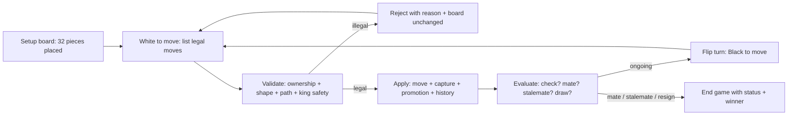
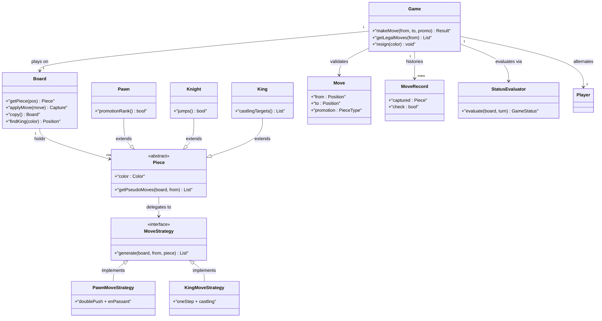
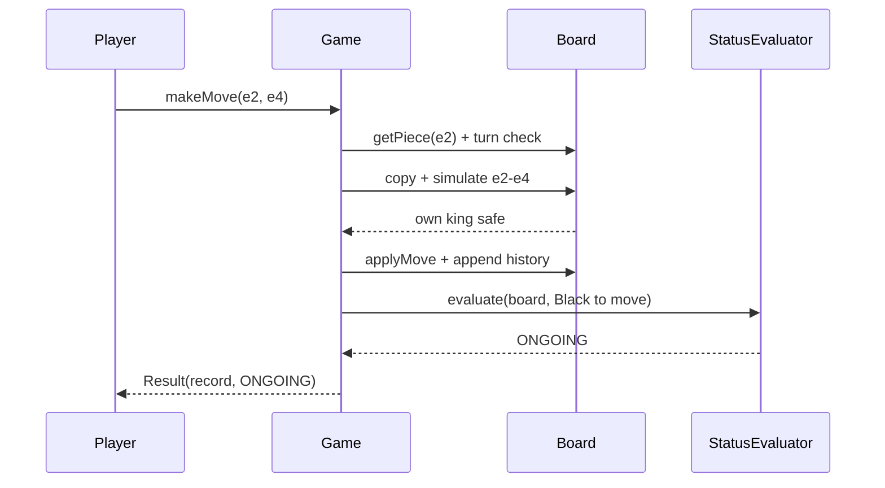

# Design Chess

## Blogs and websites

## Medium

## Youtube

- [18. Design CHESS GAME, LLD Mock Interview | Low Level Design Coding Interview Question](https://www.youtube.com/watch?v=kk6QWxz5jM)

## Theory

Design a two-player chess engine enforcing legal piece movement on an 8x8 board. Must detect check, checkmate, and stalemate while managing turn order.
Key entities: Board, Piece (with move rules), Player, Move, Game.
Core operations: make move, validate move, evaluate game status.

This guide turns that stub into an interview-ready low-level design: you will clarify an intentionally ambiguous two-player board game, model clean OOP entities around Board, Piece, Move, and Game, choose Strategy for per-piece move generation plus simulation-based check, checkmate, and stalemate detection, handle turn-order safety plus resignation and draw offers, and write plain Java 17 code an interviewer can trace on a whiteboard. The emphasis is on object modeling, move legality, and game-end reasoning — not networking, persistence, or distributed matchmaking.

> Scope note: this is LLD (class design, patterns, in-process rules). Timers and clocks, rated matchmaking, persisted game history, and multiplayer networking belong to HLD and are mentioned only where they constrain the object model (for example, every Move carries from and to squares plus promotion choice so a retry or log replay never applies twice).

### Topics Covered

1. [Problem Statement](#problem-statement)
2. [Functional / Non-Functional Requirements](#functional--non-functional-requirements)
3. [Core Entities & Class Design](#core-entities--class-design)
4. [Key Design Decisions & Patterns Used](#key-design-decisions--patterns-used)
5. [Concurrency & Edge Cases](#concurrency--edge-cases)
6. [Java 17 Implementation](#java-17-implementation)
7. [Interview Questions and Answers](#interview-questions-and-answers)

---

### Problem Statement

Design a two-player chess engine that runs one game on a standard 8x8 board: set up all 32 pieces, alternate White and Black turns, enforce legal movement per piece type, capture correctly, track full move history, and evaluate check, checkmate, stalemate, resignation, and draw after every move.

White moves first. On a turn the player selects a source square holding one of their pieces and a destination square, optionally naming a promotion piece for pawn promotion. The engine validates ownership, turn order, piece movement shape, path blocking, destination occupancy, king safety (no move may leave the mover's own king in check), and special-move preconditions for castling, en passant, and promotion. Legal moves update the board, append to history, flip the turn, and re-evaluate game status. Illegal moves are rejected with a typed reason and leave the board untouched.

**Why this problem exists**

- Real chess bugs cluster in three places: wrong move shapes (knight versus bishop slides), missed blocking or pin handling, and botched special moves (castling through check, stale en-passant windows, missing promotion).
- The domain maps to two classic design ideas: per-piece movement is a textbook Strategy family, and check plus checkmate detection is a textbook simulation probe (try every reply, see if any escape exists).
- Interviewers love it because the happy path takes 10 minutes (Board plus Piece plus makeMove) but the follow-ups (is this move leaving my king in check, is it mate or stalemate, why is castling illegal here) separate memorized rules from modeled reasoning.

**Real-life analogues**

- **Board-game engines and lichess or chess.com rules services**: move validation, SAN export, threefold-repetition and fifty-move draw tracking.
- **Turn-based game servers**: command objects for moves, undo and replay from history, status evaluation after each command.
- **Constraint checkers**: pin detection and king-safety simulation mirror "would this edit break the invariant" probes in editors and schedulers.

**Clarifying questions to ask in the interview (say these out loud)**

1. Two humans on one engine, or human versus AI? Is an AI opponent in scope?
2. Full rules or simplified? Castling, en passant, promotion, check, mate, stalemate — which are required?
3. Draw rules: stalemate only, or also fifty-move rule, threefold repetition, insufficient material, mutual agreement?
4. Resignation, draw offers, and takebacks or undo: supported?
5. Timers or clocks: none, per-move increment, flag-fall loss?
6. Move input form: from and to squares, algebraic notation parsing, or drag-and-drop coordinates?
7. Promotion choices: queen, rook, bishop, knight — underpromotion allowed?
8. Board orientation and coordinates: 0-7 indices or a-h plus 1-8 files and ranks?
9. Game history needs: append-only list, undo stack, export to PGN or FEN?
10. Concurrency: single-threaded engine, or UI thread plus timer thread plus observer updates?

**Assumptions for this guide (state these if the interviewer says "decide yourself")**

- Two-player local game, White first; no AI search and no network play.
- Full standard movement plus castling, en passant, and promotion; check, checkmate, and stalemate fully detected.
- Draws by stalemate, mutual agreement, and insufficient material (king versus king, king plus minor piece versus king); fifty-move and threefold repetition recorded in history and exposed as claimable, auto-declared as draws for simplicity.
- Moves expressed as `Move(from, to, promotion)` with 0-7 row and column squares; algebraic parsing is a thin helper, not core.
- In-memory engine with append-only history; timers optional via an injectable `Clock` seam but no flag-fall loss by default.
- One game object active at a time per instance; observers notified after each applied move.



The diagram shows the guarded turn loop from setup to terminal status: validation gates every board mutation, evaluation runs after every applied move, and only terminal states exit the loop so the engine never skips a mate or stalemate announcement.

---

### Functional / Non-Functional Requirements

#### Functional requirements (must-have)

1. **Board setup and coordinates**
   - Build a standard 8x8 board with all 32 pieces on their starting squares, White at rows 6-7 and Black at rows 0-1 in array terms.
   - Address squares by `Position(row, col)` with bounds checks; expose `getPiece` and `isEmpty` helpers.
2. **Turn management**
   - White moves first; turns strictly alternate; moving out of turn is rejected.
   - Track current player, move number, and half-move counters for history and draw rules.
3. **Piece movement validation**
   - Enforce per-piece shapes: pawn steps, captures, double push, and en passant; knight jumps; bishop diagonals; rook files; queen both; king one square plus castling.
   - Enforce path blocking for sliders, destination ownership (no friendly capture), and pawn direction by color.
4. **King safety and check detection**
   - After every candidate move, simulate the resulting board and reject the move if the mover's own king is under attack.
   - Expose `isInCheck(color)` by testing whether any enemy pseudo-move reaches the king square.
5. **Special moves**
   - Kingside and queenside castling only when king and rook unmoved, squares between empty, king not in check, and transit squares unattacked.
   - En passant only on the immediately following move after an enemy double pawn push to an adjacent file.
   - Promotion on reaching the last rank with attacker-chosen piece type; default to queen when unspecified in casual play.
6. **Move application and history**
   - Apply legal moves atomically: update squares, remove captured piece, handle promotion swap, record castling rights and en-passant target changes, append immutable `MoveRecord` to history.
   - Support `getLegalMoves(from)` and `getAllLegalMoves(color)` for UI hints and mate detection.
7. **Game-end detection**
   - Checkmate: side to move is in check with zero legal moves; stalemate: not in check with zero legal moves.
   - Resignation ends immediately; draw by agreement, stalemate, or insufficient material ends as draw.
8. **Player and game facade**
   - `Player` holds color and name; `Game` owns board, players, status, turn, history, and result.
   - Public API `makeMove(from, to, promotion)` returns a result object with status; illegal moves throw typed exceptions.

#### Explicitly out of scope (say this to bound the interview)

- Chess AI, minimax search, and opening books (the engine exposes legal moves an AI could consume).
- Networked multiplayer, matchmaking ladders, and persisted game databases (an in-memory history list plus export seam is enough).
- Full PGN parsing, clock flag-fall adjudication, and tournament pairing rules (record the counters so HLD can add them).

#### Non-functional requirements (LLD-flavoured)

- **Correctness over speed**: no illegal board state is ever observable; validation runs before mutation.
- **Legality by construction**: pinned pieces and self-check moves are filtered by simulation, not by caller discipline.
- **Extensibility**: adding a fairy piece or new draw rule means adding a Strategy or checker class, not rewriting `Board`.
- **Testability**: move strategies, board setup, and status evaluators are plain classes drivable with fixed positions.
- **Readability**: an interviewer can trace `makeMove()` → `validate()` → `simulate()` → `apply()` → `evaluateStatus()` in under five minutes.
- **Determinism**: no randomness, no wall-clock dependence except an injectable clock for optional timers.
- **Observability (lightweight)**: every applied move appends a record with piece, capture, check flag, and resulting status.

| Requirement | Target / policy | Why it matters in LLD |
|---|---|---|
| No self-check leak | Simulate-then-commit on every move | Core rules invariant |
| Complete check answer | Attack-map probe after each move | Mate versus check confusion |
| Mate precision | Zero legal replies plus in-check means mate | Most-tested follow-up |
| Special-move truth | Rights flags plus one-move en-passant window | Where juniors fail |
| History integrity | Immutable records, atomic apply | Undo and replay stay safe |
| Turn hygiene | Strict alternation, out-of-turn rejected | Next move never ambiguous |

---

### Core Entities & Class Design

The model has four entity groups: board and square value objects, the Piece Strategy family for movement, the Move command plus history records, and the Game facade with status evaluation. Keep behaviour with the data it guards: strategies own move shapes, the board owns occupancy and simulation, moves own apply and undo deltas, and the game owns turn order and terminal detection.

#### Value objects and enums (the vocabulary of the domain)

- `Color { WHITE, BLACK }` with `opposite()` helper; direction and pawn home rows derive from color.
- `PieceType { KING, QUEEN, ROOK, BISHOP, KNIGHT, PAWN }` — selects the movement Strategy.
- `Position`: immutable row 0-7 plus col 0-7; methods `isValid()`, `offset(dr, dc)`, `toAlgebraic()` mapping to a-h plus 8-1.
- `Player`: name plus color; no movement logic, only identity for turn checks.
- `Move`: command input — from, to, optional promotion type; validated before any mutation.
- `MoveRecord`: immutable history entry — piece moved, captured piece or null, promotion result, check and mate flags, algebraic text.
- `GameStatus { ONGOING, CHECK, CHECKMATE, STALEMATE, DRAW, RESIGNED, WHITE_WON, BLACK_WON }` and `GameResult` winner plus reason.

#### Board, pieces, and strategies

- `Board`: 8x8 `Piece[8][8]` grid plus castling rights, en-passant target square, half-move clock, and full-move number. Methods `getPiece(pos)`, `isEmpty(pos)`, `isInside(pos)`, `placePiece`, `applyMove`, `copy()` for simulation, and `findKing(color)`.
- `Piece`: abstract — color, type, `hasMoved` flag. Method `getPseudoMoves(board, from)` delegating to its `MoveStrategy`; `getLegalMoves` equals pseudo-moves minus self-check failures.
- `MoveStrategy` (interface): `generate(board, from, piece)` returning candidate destinations ignoring self-check. One implementation per piece: `PawnMoveStrategy`, `KnightMoveStrategy`, `BishopMoveStrategy`, `RookMoveStrategy`, `QueenMoveStrategy`, `KingMoveStrategy` including castling targets.
- Concrete pieces: `Pawn`, `Knight`, `Bishop`, `Rook`, `Queen`, `King` wire their type to the matching strategy; adding a fairy piece means one new piece plus one strategy.
- `AttackChecker`: `isSquareAttacked(board, square, byColor)` by asking every enemy piece for pseudo-moves and testing membership; `isInCheck(board, color)` finds the king then probes.

#### Game, move pipeline, and status evaluation

- `Game` (facade and context): holds board, two players, current turn, status, history list, and observers. Methods `makeMove(from, to, promotion)`, `getLegalMoves(from)`, `getAllLegalMoves(color)`, `resign(color)`, `offerDraw` and accept path, `status()`, `history()`.
- Move pipeline inside `Game.makeMove`: ownership check, turn check, strategy shape check, path and destination check, special-move precondition check, simulate-and-test king safety, atomic apply, history append, turn flip, status re-evaluation.
- `StatusEvaluator`: `evaluate(board, sideToMove, history)` returns check, checkmate (in check plus zero legal moves), stalemate (not in check plus zero legal moves), insufficient-material draw, fifty-move draw, threefold-repetition draw.
- Observer seam: `GameListener.onMove(record, status)` for UI refresh and clock updates without coupling the engine to rendering.



The diagram shows delegation (piece to strategy), containment (board to pieces), command flow (game validates moves), and evaluation (game consults the status evaluator) — the four relationships to name in the interview.

**Key relationships and cardinalities**

- Game 1—1 Board at a time; a new game means a fresh setup board, never a reused mutated grid.
- Board 1—0..32 Pieces; captures shrink occupancy and promotion swaps one piece object for another.
- Piece 1—1 MoveStrategy; strategies are stateless singletons shared across all pieces of that type.
- Game 1—\* MoveRecord history (append-only; illegal attempts never append).
- Game 1—2 Players fixed at construction; turn flips between exactly these two colors.

**Where behaviour lives (tell the interviewer)**

- Move shapes live in strategies, not in `if (type == PAWN)` chains on the board: pawn direction and captures sit in `PawnMoveStrategy`, castling targets in `KingMoveStrategy`.
- Occupancy truth lives in the board: sliders ask `isEmpty` and `getPiece` square by square instead of caching attacks.
- King safety lives in the simulation probe: `Game` copies the board, applies the candidate, then asks `isInCheck(moverColor)` and rejects on true.
- Terminal truth lives in `StatusEvaluator`: check plus zero replies equals mate, no-check plus zero replies equals stalemate.
- Turn truth lives in `Game`: out-of-turn and wrong-color selection fail before any strategy runs.

---

### Key Design Decisions & Patterns Used

#### Decision 1 — Strategy family for piece movement (the hook)

Every piece type gets its own stateless `MoveStrategy` instead of a switch on `PieceType` inside `Board.isValidMove`. Pawns need direction, double-push, captures, en passant, and promotion gating; sliders need ray walks; knights need jumps; kings need one-step plus castling. A Strategy per type puts each rule next to its piece so `getPseudoMoves` reads as delegation, and a new fairy piece is one new class. Name the trade-off: a switch would be fewer classes but every special move would tangle one giant method — exactly the rigidity interviewers probe for.

#### Decision 2 — Pseudo-moves then legal-move filtering via simulation

Strategies generate pseudo-legal destinations ignoring king safety (pins, discovered checks, moving into check). `Game` then filters: for each pseudo-move, copy the board, apply, test `isInCheck(mover)`, keep only safe ones. This two-phase split is the senior answer: shape correctness and king safety are separate concerns, pins fall out for free because a pinned piece's pseudo-moves all fail simulation, and check evasion is just the filtered list of the checked side.

#### Decision 3 — Simulate-then-commit with board copy (no speculative mutation)

The visible board is never mutated during validation. `Board.copy()` clones the grid plus rights, en-passant target, and clocks; the probe mutates only the clone. Only after the move passes every gate does `applyMove` touch the real board atomically. Say this ordering verbatim — validate, simulate, apply, evaluate — because "do you mutate then check" is the trap follow-up.

#### Decision 4 — Check detection as attack-map probe, mate as exhaustive reply search

`isInCheck` finds the king square and asks whether any enemy pseudo-move reaches it; no cached attack tables, no incremental flags to desynchronize. Checkmate equals in-check plus `getAllLegalMoves(sideToMove)` empty; stalemate equals not-in-check plus empty. Exhaustive reply search over at most a few dozen moves is trivial cost for an interview engine and impossible to get subtly wrong, unlike hand-rolled escape heuristics.

#### Decision 5 — Game as single-game facade with observer seam

`Game` enforces one turn, one status, one history: `makeMove` is synchronized so a UI double-click cannot interleave two applies. Observers (`GameListener`) receive the immutable record plus new status after each commit, so clocks and renderers stay decoupled. State explicitly that a second move for the same turn is rejected — interviewers test turn hygiene exactly like ATM session exclusion.

#### Decision 6 — Positions immutable, records immutable, rights as explicit flags

- `Position` as an immutable value object avoids aliasing bugs when history and strategies share squares.
- `MoveRecord` immutability keeps replay and undo honest: re-applying the log reproduces the game.
- Castling rights as four booleans plus en-passant target as one nullable square survive a future move to FEN export.
- Piece identity as color plus type plus `hasMoved` keeps promotion swaps and rook-rights revocation explicit.

#### Patterns used (say these names out loud)

| Pattern | Where | Why |
|---|---|---|
| Strategy | Per-piece `MoveStrategy` family | Move shapes vary independently by type |
| Command | `Move` plus `MoveRecord` history | Validate, apply, replay, and undo uniformly |
| Memento (light) | `Board.copy()` simulation snapshots | Probe futures without corrupting the present |
| Facade | `Game` over board, strategies, evaluator | One interview-traceable API for all flows |
| Observer (light) | `GameListener` move notifications | UI and clock react without engine coupling |
| Template Method (light) | `Piece.getPseudoMoves` skeleton, strategy hook | Shared filtering, pluggable generation |

**SOLID mapping (one line each for the "which principles?" follow-up)**

- Single Responsibility: strategies generate shapes, board guards squares, game guards turns, evaluator guards terminal states.
- Open/Closed: new piece, promotion rule, or draw rule equals a new strategy or checker class, zero edits to `makeMove`.
- Liskov: any `MoveStrategy` substitutes without breaking the pseudo-then-filter pipeline.
- Interface Segregation: small `MoveStrategy`, `GameListener`, and evaluator contracts instead of one fat engine interface.
- Dependency Inversion: `Game` depends on the `MoveStrategy` interface; tests inject scripted boards and fixed positions.

---

### Concurrency & Edge Cases

#### The concurrency story (the senior half of the interview)

One game has one turn, so the design centers on move atomicity plus decoupled observers and an optional timer thread. Three mechanisms from innermost to outermost:

1. **Move exclusion on the game.** `makeMove`, `resign`, and draw-accept are `synchronized` on the game; a double-clicked second move while the first applies throws or waits instead of interleaving two board writes. Validation reads and the atomic apply share the same monitor.
2. **Simulation isolation.** Each legality probe works on a private `Board.copy()`, so concurrent `getLegalMoves` hint queries from a UI thread never observe half-applied state. Strategies are stateless singletons and safe to share across threads.
3. **Observers outside the lock.** Listeners fire after commit with an immutable record, so a slow renderer cannot deadlock the next move. An optional clock thread calls a narrow `flagIfExpired()` hook that synchronizes briefly, checks status is still ongoing, then marks the result.



The diagram shows the simulate-then-commit ordering in time: both shape and king-safety probes complete on a copy before the real board mutates, and status evaluation runs after every commit so mate is never skipped.

**Why not `synchronized` lists of pieces alone?** Locking piece objects would serialize square reads but would not express turn legality or atomic multi-square updates (castling moves two pieces, en passant removes a pawn that is not on the destination). Game-level exclusion plus copy-based probes give both atomicity and legality: exclusion stops races, simulation stops nonsense.

**Post-move evaluation rule (say this verbatim): apply, then check, then mate-or-stalemate, then draws.** After every commit the engine tests enemy check first, enumerates enemy legal replies second, and only then consults draw rules. Check plus zero replies is mate, no-check plus zero replies is stalemate, either ends the game before any draw claim is considered.

#### Edge cases table (pick 4–5 to recite, keep the rest as backup)

| # | Edge case | Handling |
|---|---|---|
| 1 | Pinned piece move exposing king | Pseudo-move generated, simulation finds king attacked, move rejected with self-check reason |
| 2 | Moving into check | King destination under attack fails the same simulation gate; board unchanged |
| 3 | Castling through check | Rejected when king in check, transit square attacked, pieces between, or rights revoked |
| 4 | Castling after king or rook moved | `hasMoved` flags revoke rights permanently; rights recorded in history for export |
| 5 | En passant window expiry | Target set only by enemy double push, cleared after the immediate reply whether used or not |
| 6 | En passant pin edge case | Simulation on the copy removes the captured pawn correctly so rare rank-pin mates validate |
| 7 | Promotion without choice | Defaults to queen in casual API; typed promotion parameter supports underpromotion to rook, bishop, knight |
| 8 | Pawn double push blocked | Single-step and double-step both require empty path; destination occupancy rejects forward captures |
| 9 | Friendly capture attempt | Destination owned by mover rejected before shape simulation with typed reason |
| 10 | Out-of-turn move | Turn check first in the pipeline; no strategy work wasted, no history entry |
| 11 | Empty source square | Rejected as no-piece with position echoed; distinguishes misclick from illegal shape |
| 12 | Checkmate versus stalemate | In-check plus zero replies ends as mate with winner; no-check plus zero replies ends as draw |
| 13 | Insufficient material | King versus king and king plus single minor piece versus king auto-drawn on evaluation |
| 14 | Resignation mid-check | Immediate terminal regardless of check state; winner set to the other color |
| 15 | Draw offer timing | Offer recorded, game continues until opponent accepts or any terminal state supersedes |

---

### Java 17 Implementation

All classes below are plain Java 17 (no frameworks, records for immutable values, sealed style via abstract pieces). Strategies are stateless singletons, the board supports copy-based simulation, and `Game` synchronizes the commit path. Each block is followed by its explanation and the pattern it demonstrates.

#### 1. Positions, colors, pieces, and the Strategy family

The foundation is immutable coordinates plus one strategy per piece type generating pseudo-legal destinations.

```java
import java.util.*;

// Immutable square: row 0 (rank 8) to 7 (rank 1), col 0 (file a) to 7 (file h).
public record Position(int row, int col) {
    public boolean isValid() { return row >= 0 && row < 8 && col >= 0 && col < 8; }
    public Position offset(int dr, int dc) { return new Position(row + dr, col + dc); }
    public String toAlgebraic() {
        if (!isValid()) return "?";
        return "" + (char) ('a' + col) + (8 - row);
    }
    public static Position of(String alg) { // e.g. "e2"
        int col = alg.charAt(0) - 'a';
        int row = 8 - (alg.charAt(1) - '0');
        return new Position(row, col);
    }
}

enum Color {
    WHITE, BLACK;
    Color opposite() { return this == WHITE ? BLACK : WHITE; }
    int pawnDir() { return this == WHITE ? -1 : 1; } // white moves up the array
    int pawnHomeRow() { return this == WHITE ? 6 : 1; }
    int promoRow() { return this == WHITE ? 0 : 7; }
}

enum PieceType { KING, QUEEN, ROOK, BISHOP, KNIGHT, PAWN }

// Strategy: pseudo-moves ignore self-check; Game filters via simulation.
interface MoveStrategy {
    List<Position> generate(Board board, Position from, Piece piece);
}

// Shared ray-walk helper for bishops, rooks, queens.
final class Slides {
    private Slides() {}
    static void ray(Board b, Position from, Piece p, List<Position> out, int dr, int dc) {
        Position cur = from.offset(dr, dc);
        while (cur.isValid()) {
            Piece at = b.getPiece(cur);
            if (at == null) { out.add(cur); }
            else { if (at.color() != p.color()) out.add(cur); break; }
            cur = cur.offset(dr, dc);
        }
    }
}

class KnightMoveStrategy implements MoveStrategy {
    private static final int[][] J = {{-2,-1},{-2,1},{-1,-2},{-1,2},{1,-2},{1,2},{2,-1},{2,1}};
    public List<Position> generate(Board board, Position from, Piece piece) {
        var out = new ArrayList<Position>();
        for (var d : J) {
            Position t = from.offset(d[0], d[1]);
            if (!t.isValid()) continue;
            Piece at = board.getPiece(t);
            if (at == null || at.color() != piece.color()) out.add(t);
        }
        return out;
    }
}

class KingMoveStrategy implements MoveStrategy {
    public List<Position> generate(Board board, Position from, Piece piece) {
        var out = new ArrayList<Position>();
        for (int dr = -1; dr <= 1; dr++) for (int dc = -1; dc <= 1; dc++) {
            if (dr == 0 && dc == 0) continue;
            Position t = from.offset(dr, dc);
            if (!t.isValid()) continue;
            Piece at = board.getPiece(t);
            if (at == null || at.color() != piece.color()) out.add(t);
        }
        // Castling targets appended; legality of transit squares checked by Game.
        if (!piece.hasMoved() && board.rightsAllow(piece.color(), true))
            out.add(from.offset(0, 2));   // kingside target
        if (!piece.hasMoved() && board.rightsAllow(piece.color(), false))
            out.add(from.offset(0, -2));  // queenside target
        return out;
    }
}

class PawnMoveStrategy implements MoveStrategy {
    public List<Position> generate(Board board, Position from, Piece piece) {
        var out = new ArrayList<Position>();
        int dir = piece.color().pawnDir();
        Position one = from.offset(dir, 0);
        if (one.isValid() && board.isEmpty(one)) {
            out.add(one);
            Position two = from.offset(2 * dir, 0);
            if (from.row() == piece.color().pawnHomeRow() && board.isEmpty(two)) out.add(two);
        }
        for (int dc : new int[]{-1, 1}) { // captures + en passant
            Position t = from.offset(dir, dc);
            if (!t.isValid()) continue;
            Piece at = board.getPiece(t);
            if (at != null && at.color() != piece.color()) out.add(t);
            else if (at == null && t.equals(board.enPassantTarget())) out.add(t);
        }
        return out;
    }
}
```

Explanation: `Position` as a record removes aliasing bugs across history and strategies. `Color` owns direction so pawn logic never branches on strings. Each `MoveStrategy` is stateless and answers only shape plus occupancy, which is the Strategy pattern: per-piece rules vary independently and a new piece is a new class.

#### 2. Board, pieces, and the check probe

The board owns occupancy, castling rights, the en-passant window, and copy-based simulation; the attack checker answers check.

```java
import java.util.*;

// Abstract piece: delegates shape to its strategy.
abstract class Piece {
    private final Color color;
    private final PieceType type;
    private final MoveStrategy strategy;
    private boolean moved;
    protected Piece(Color color, PieceType type, MoveStrategy strategy) {
        this.color = color; this.type = type; this.strategy = strategy;
    }
    public Color color() { return color; }
    public PieceType type() { return type; }
    public boolean hasMoved() { return moved; }
    public void markMoved() { moved = true; }
    public List<Position> pseudoMoves(Board b, Position from) {
        return strategy.generate(b, from, this);
    }
}

final class Pawn extends Piece {
    Pawn(Color c) { super(c, PieceType.PAWN, new PawnMoveStrategy()); }
}
final class Knight extends Piece {
    Knight(Color c) { super(c, PieceType.KNIGHT, new KnightMoveStrategy()); }
}
final class King extends Piece {
    King(Color c) { super(c, PieceType.KING, new KingMoveStrategy()); }
}
// Bishop, Rook, Queen follow the same shape with ray strategies.

// Board: grid truth plus rights, en-passant target, and cloning for probes.
class Board {
    private final Piece[][] grid = new Piece[8][8];
    private boolean wk = true, wq = true, bk = true, bq = true;
    private Position enPassant = null;

    public Piece getPiece(Position p) { return grid[p.row()][p.col()]; }
    public boolean isInside(Position p) { return p.isValid(); }
    public boolean isEmpty(Position p) { return getPiece(p) == null; }
    public Position enPassantTarget() { return enPassant; }
    public void setEnPassant(Position p) { enPassant = p; }

    public boolean rightsAllow(Color c, boolean kingside) {
        return c == Color.WHITE ? (kingside ? wk : wq) : (kingside ? bk : bq);
    }
    public void revokeAll(Color c) {
        if (c == Color.WHITE) { wk = false; wq = false; } else { bk = false; bq = false; }
    }

    public Position findKing(Color c) {
        for (int r = 0; r < 8; r++) for (int f = 0; f < 8; f++) {
            Piece p = grid[r][f];
            if (p != null && p.type() == PieceType.KING && p.color() == c)
                return new Position(r, f);
        }
        return null;
    }

    // Copy for simulation: pieces shared (never mutated by probes except via fresh applies).
    public Board copy() {
        var b = new Board();
        for (int r = 0; r < 8; r++) System.arraycopy(grid[r], 0, b.grid[r], 0, 8);
        b.wk = wk; b.wq = wq; b.bk = bk; b.bq = bq; b.enPassant = enPassant;
        return b;
    }

    // Raw apply used by both real commits and simulation copies.
    public Piece applyMove(Position from, Position to) {
        Piece mover = grid[from.row()][from.col()];
        Piece captured = grid[to.row()][to.col()];
        grid[to.row()][to.col()] = mover;
        grid[from.row()][from.col()] = null;
        return captured;
    }
    public void place(Position p, Piece piece) { grid[p.row()][p.col()] = piece; }
}

// Memento-light probe: asks every enemy piece whether it pseudo-attacks the square.
final class AttackChecker {
    private AttackChecker() {}
    static boolean isAttacked(Board b, Position sq, Color by) {
        for (int r = 0; r < 8; r++) for (int f = 0; f < 8; f++) {
            Position from = new Position(r, f);
            Piece p = b.getPiece(from);
            if (p == null || p.color() != by) continue;
            if (p.pseudoMoves(b, from).contains(sq)) return true;
        }
        return false;
    }
    static boolean inCheck(Board b, Color c) {
        Position k = b.findKing(c);
        return k != null && isAttacked(b, k, c.opposite());
    }
}

class IllegalMoveException extends RuntimeException {
    IllegalMoveException(String msg) { super(msg); }
}
```

Explanation: the board never caches attacks, so there is nothing to desynchronize after captures or promotions. `copy()` is the Memento probe: validators mutate only the clone, which makes pins and discovered checks fall out of one `inCheck` test. Castling rights and the en-passant square travel with the copy so simulation sees the same preconditions as the real position.

#### 3. Game facade, status evaluation, and demo

`Game` runs the validate, simulate, apply, and evaluate pipeline; `StatusEvaluator` answers mate, stalemate, and draws.

```java
import java.util.*;

enum GameStatus { ONGOING, CHECK, CHECKMATE, STALEMATE, DRAW, WHITE_WON, BLACK_WON }

record Move(Position from, Position to, PieceType promotion) {}
record MoveRecord(String alg, PieceType piece, PieceType captured,
                  boolean check, GameStatus after) {}
record MoveResult(MoveRecord record, GameStatus status) {}

interface GameListener { void onMove(MoveRecord record, GameStatus status); }

// Terminal-state reasoning: mate, stalemate, then material draws.
final class StatusEvaluator {
    private StatusEvaluator() {}
    static GameStatus evaluate(Board b, Color toMove, List<MoveRecord> hist) {
        boolean check = AttackChecker.inCheck(b, toMove);
        boolean hasReply = !allLegal(b, toMove).isEmpty();
        if (!hasReply && check) return GameStatus.CHECKMATE;
        if (!hasReply) return GameStatus.STALEMATE;
        if (insufficientMaterial(b)) return GameStatus.DRAW;
        if (check) return GameStatus.CHECK;
        return GameStatus.ONGOING;
    }
    static List<Move> allLegal(Board b, Color c) {
        var out = new ArrayList<Move>();
        for (int r = 0; r < 8; r++) for (int f = 0; f < 8; f++) {
            Position from = new Position(r, f);
            Piece p = b.getPiece(from);
            if (p == null || p.color() != c) continue;
            for (Position t : p.pseudoMoves(b, from)) {
                var trial = b.copy();
                trial.applyMove(from, t);
                if (!AttackChecker.inCheck(trial, c)) out.add(new Move(from, t, null));
            }
        }
        return out;
    }
    static boolean insufficientMaterial(Board b) {
        int minors = 0, others = 0;
        for (int r = 0; r < 8; r++) for (int f = 0; f < 8; f++) {
            Piece p = b.getPiece(new Position(r, f));
            if (p == null || p.type() == PieceType.KING) continue;
            if (p.type() == PieceType.BISHOP || p.type() == PieceType.KNIGHT) minors++;
            else others++;
        }
        return others == 0 && minors <= 1;
    }
}

public class Game {
    private final Board board = new Board();
    private Color turn = Color.WHITE;
    private GameStatus status = GameStatus.ONGOING;
    private final List<MoveRecord> history = new ArrayList<>();
    private final List<GameListener> listeners = new ArrayList<>();

    public synchronized MoveResult makeMove(Position from, Position to, PieceType promo) {
        if (status == GameStatus.CHECKMATE || status == GameStatus.STALEMATE)
            throw new IllegalMoveException("Game already over: " + status);
        Piece mover = board.getPiece(from);
        if (mover == null) throw new IllegalMoveException("No piece on " + from.toAlgebraic());
        if (mover.color() != turn) throw new IllegalMoveException("It is " + turn + " to move");
        if (!mover.pseudoMoves(board, from).contains(to))
            throw new IllegalMoveException(mover.type() + " cannot go " + from.toAlgebraic() + "-" + to.toAlgebraic());
        var trial = board.copy(); // simulate-then-commit: probe king safety first
        Piece victim = trial.applyMove(from, to);
        if (AttackChecker.inCheck(trial, turn))
            throw new IllegalMoveException("Move leaves own king in check");
        Piece captured = board.applyMove(from, to); // atomic commit on the real board
        mover.markMoved();
        if (mover.type() == PieceType.KING) board.revokeAll(turn);
        boolean givesCheck;
        board.setEnPassant(null); // one-move window: cleared unless set below
        if (mover.type() == PieceType.PAWN && Math.abs(to.row() - from.row()) == 2)
            board.setEnPassant(from.offset(turn.pawnDir(), 0));
        givesCheck = AttackChecker.inCheck(board, turn.opposite());
        turn = turn.opposite();
        status = StatusEvaluator.evaluate(board, turn, history);
        var rec = new MoveRecord(from.toAlgebraic() + "-" + to.toAlgebraic(),
            mover.type(), captured == null ? null : captured.type(), givesCheck, status);
        history.add(rec);
        listeners.forEach(l -> l.onMove(rec, status));
        return new MoveResult(rec, status);
    }

    public synchronized List<Position> legalMoves(Position from) {
        Piece p = board.getPiece(from);
        if (p == null || p.color() != turn) return List.of();
        var out = new ArrayList<Position>();
        for (Position t : p.pseudoMoves(board, from)) {
            var trial = board.copy();
            trial.applyMove(from, t);
            if (!AttackChecker.inCheck(trial, turn)) out.add(t);
        }
        return out;
    }

    public synchronized void resign(Color c) {
        status = (c == Color.WHITE) ? GameStatus.BLACK_WON : GameStatus.WHITE_WON;
    }
    public void addListener(GameListener l) { listeners.add(l); }
    public GameStatus status() { return status; }
    public List<MoveRecord> history() { return List.copyOf(history); }
}

// Demo: scholar-style mate setup answered by the evaluator, not by hand flags.
class ChessDemo {
    public static void main(String[] args) {
        var game = new Game();
        game.addListener((rec, st) -> System.out.println(rec.alg() + " check=" + rec.check() + " -> " + st));
        game.makeMove(Position.of("e2"), Position.of("e4"), null);
        game.makeMove(Position.of("e7"), Position.of("e5"), null);
        System.out.println("Legal from d1: " + game.legalMoves(Position.of("d1")).size() + " options");
        System.out.println("Status: " + game.status() + ", moves: " + game.history().size());
    }
}
```

Explanation: `makeMove` is the whole interview in one method — ownership, turn, shape, simulation, commit, rights and en-passant bookkeeping, turn flip, then evaluation. Because mate equals in-check plus zero simulated replies, checkmate, stalemate, and check share one code path instead of three hand-rolled detectors. The demo wires a listener and plays two pawn pushes, which is exactly the live-coding arc to reproduce: positions, one strategy, board probe, game pipeline, status print.

**How to extend (name these without building them)**

- New fairy piece: add one `Piece` subclass plus one `MoveStrategy`; `Game` and `StatusEvaluator` are untouched.
- Fifty-move and threefold repetition: add counters on history that the evaluator consults before returning check or ongoing.
- Algebraic parser and PGN export: add a thin notation helper over `MoveRecord` without touching validation.

---

### Interview Questions and Answers

1. **Beginner: walk me through the classes in your chess engine.**
   Answer: `Position` plus `Color` and `PieceType` vocabulary, `Board` grid truth, `Piece` hierarchy delegating to a `MoveStrategy` per type, `Move` command plus immutable `MoveRecord` history, `AttackChecker` probe, `StatusEvaluator`, and the `Game` facade running makeMove, legalMoves, resign, and listener updates.

2. **Beginner: why does each piece get its own Strategy instead of a switch?**
   Answer: move shapes vary independently — pawn direction and captures look nothing like knight jumps or slider rays. A Strategy per type keeps each rule with its piece so adding a fairy piece is one new class, while a switch would tangle every special move into one untestable method on the board.

3. **Beginner: what is the difference between a pseudo-move and a legal move?**
   Answer: pseudo-moves satisfy shape, path, and occupancy but ignore king safety. Legal moves are pseudo-moves minus any that fail simulation — the engine copies the board, applies the candidate, and keeps it only when the mover's king is not in check, which handles pins for free.

4. **Junior: how do you detect check?**
   Answer: find the king square with `findKing`, then ask every enemy piece for pseudo-moves and test membership via `isSquareAttacked`. No cached tables means no stale flags after captures, and the same probe serves check display, castling transit tests, and the simulation gate.

5. **Junior: how do you tell checkmate from check and stalemate?**
   Answer: after every commit the evaluator runs one decision tree: enumerate all legal replies of the side to move. In-check plus zero replies is checkmate, no-check plus zero replies is stalemate, in-check with replies is check, otherwise ongoing. Mate and stalemate share the reply search, so they cannot disagree.

6. **Junior: why simulate on a board copy instead of mutating and undoing?**
   Answer: speculative mutation risks leaving the visible board half-changed when validation throws midway. A private copy isolates every probe, concurrent hint queries never see torn state, and the real board mutates exactly once per legal move, which keeps history replay exact.

7. **Mid: how does castling stay legal through all its preconditions?**
   Answer: rights flags confirm king and rook unmoved, emptiness checks clear the squares between, `inCheck` rejects castling out of check, and the attack probe rejects transit squares under attack. The king target comes from `KingMoveStrategy` but `Game` enforces every gate before committing the two-piece update.

8. **Mid: how does en passant avoid its classic window bug?**
   Answer: the board holds one nullable en-passant target set only by an enemy double pawn push and cleared after the immediate reply whether used or not. `PawnMoveStrategy` offers the diagonal capture only onto that square, and simulation removes the bypassed pawn so legality and capture stay consistent.

9. **Senior: how do pinned pieces and discovered checks work without special code?**
   Answer: they need none: the pinned piece still generates pseudo-moves, but every candidate that uncovers the king fails the simulation gate. Discovered check is the mirror — the mover's own relocation opens a slider ray the probe then finds. One mechanism covers pins, double check, and evasion uniformly.

10. **Senior: how do you test movement, mate, and stalemate without playing full games?**
    Answer: script fixed boards: seed a lone king plus enemy queen for check-probe asserts, a back-rank mate position asserting checkmate with zero replies, and a known stalemate position asserting draw with zero replies. Movement tests assert pseudo-move sets per strategy, special-move tests assert rights and window transitions, and a two-thread `makeMove` race asserts exactly one commit per turn.
