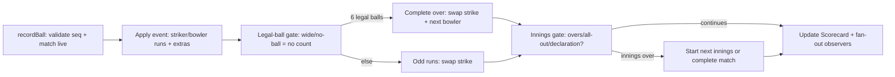
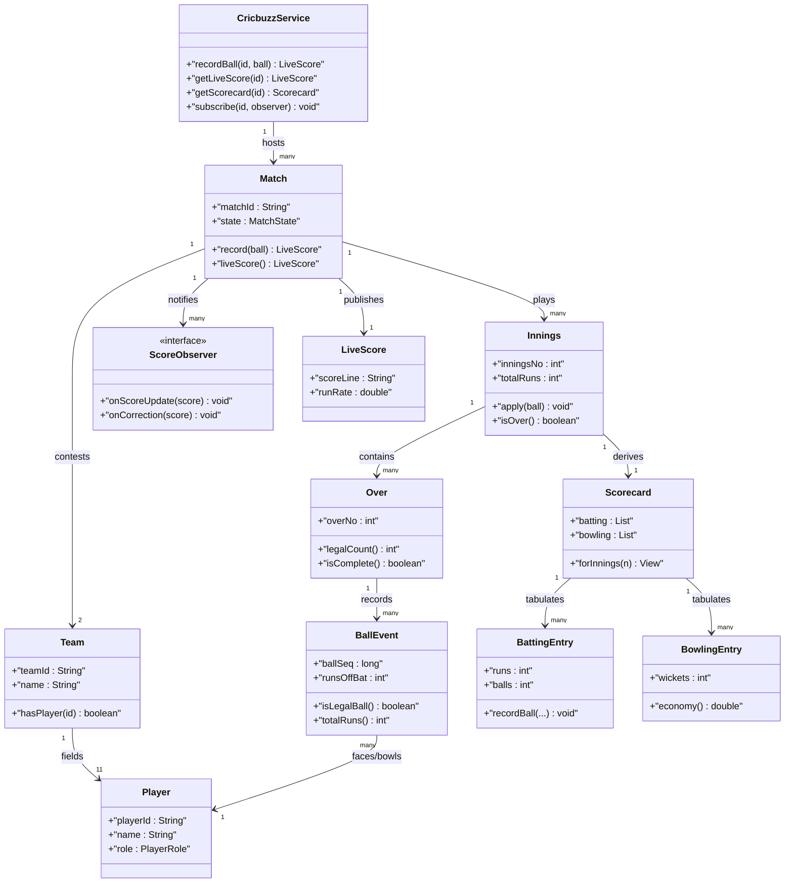
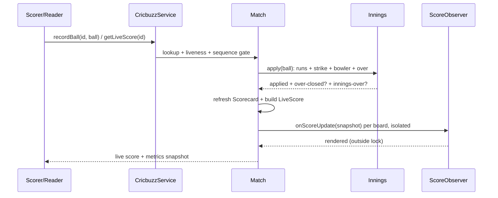

# Design Cricbuzz/CricInfo

## Blogs and websites

## Medium

## Youtube

- [24. LLD of Cricbuzz/CricInfo | Cricbuzz Low Level System Design | Design Cricbuzz | Low Level Design](https://www.youtube.com/watch?v=P0TJIONZi8E)

## Theory

Design a live cricket-score service publishing ball-by-ball commentary and scorecards for ongoing matches. Reads dominate, so models must support fast score aggregation.
Key entities: Match, Team, Player, Innings, Ball/Over, Scorecard.
Core operations: update ball event, get live score, fetch scorecard.

This guide turns that stub into an interview-ready low-level design: you will clarify an intentionally ambiguous live-score feed, model clean OOP entities around Match, Team, Player, Innings, Over, BallEvent, and Scorecard, apply each ball as an immutable event that advances striker, bowler, over, and innings state behind one `apply(ball)` pipeline, and fan score updates out to many scoreboards through an Observer seam so readers never block writers. The emphasis is on ball-by-ball event application, legal-ball accounting, and read-fan-out — not video streaming, betting odds, or CDN delivery.

> Scope note: this is LLD (class design, patterns, in-process concurrency). Multi-region replication, live-video pipelines, ad-targeting, and push-notification infrastructure belong to HLD and are mentioned only where they constrain the object model (for example, every BallEvent carries matchId plus inningsNo plus overNo plus ballSeq plus legal flag so a retry or out-of-order delivery never double-counts a run).

### Topics Covered

1. [Problem Statement](#problem-statement)
2. [Functional / Non-Functional Requirements](#functional--non-functional-requirements)
3. [Core Entities & Class Design](#core-entities--class-design)
4. [Key Design Decisions & Patterns Used](#key-design-decisions--patterns-used)
5. [Concurrency & Edge Cases](#concurrency--edge-cases)
6. [Java 17 Implementation](#java-17-implementation)
7. [Interview Questions and Answers](#interview-questions-and-answers)

---

### Problem Statement

Design a `CricbuzzService` hosting many matches. An admin/scorer appends immutable `BallEvent` records to a live `Match` (batsman, bowler, runs, extra type, wicket type, commentary); the match validates ball sequence, applies the event to striker/non-striker, bowler figures, current over, innings totals, and derived `Scorecard`, then notifies registered `ScoreObserver` boards. Readers call `getLiveScore(matchId)` for the one-line score and `getScorecard(matchId)` for batting plus bowling tables. An over completes on 6 legal balls; an innings completes on overs exhaustion, all-out, or declaration; wides and no-balls add runs without consuming a legal ball; odd runs and over ends swap strike.

A `recordBall(matchId, ball)` returns the updated live score; a `getLiveScore(matchId)` never mutates state; a `getScorecard(matchId)` rebuilds batting plus bowling views from stored events plus running aggregates. Completed matches freeze: further balls reject with a typed cause. Corrections arrive as explicit superseding events linked to the original ball sequence, never as in-place mutation of a stored ball.

**Why this problem exists**

- Real score bugs cluster in three places: mutable ball records edited after publication so two readers see different totals for the same ball, over accounting that counts wides and no-balls as legal deliveries and ends overs early, and fan-out loops where one slow scoreboard blocks the scorer thread and stalls every reader.
- The domain maps to two classic design ideas: ball-by-ball scoring is a textbook Event Sourcing lite pairing (immutable events plus derived aggregates recomputed by one pipeline), and live-score distribution is a textbook Observer pairing (one subject match, many board observers behind one interface).
- Interviewers love it because the happy path takes 10 minutes (match plus ball plus scorecard plus observers) but the follow-ups (where does legal-ball truth live, where does strike rotation live, who owns the scorecard, how do concurrent scorers and thousands of readers stay correct) separate API recall from modeled reasoning.

**Real-life analogues**

- **Cricbuzz, ESPNCricinfo, IPL score APIs**: ball-by-ball text commentary, live one-line score, full batting and bowling scorecards per innings.
- **ECB Play-Cricket and club scoring apps**: scorer-driven event entry with over validation and auto-computed strike plus economy.
- **Sports tickers and fantasy feeds**: one write stream fanned out to thousands of read-only widgets that must never observe a half-applied ball.

**Clarifying questions to ask in the interview (say these out loud)**

1. Formats in scope: T20 and ODI only, or Tests with two innings per side plus declarations and follow-on?
2. Ball event vocabulary: runs 0–6, extras (wide, no-ball, bye, leg-bye), wicket kinds (bowled, caught, lbw, run-out, stumped, hit-wicket)?
3. Over rule: 6 legal balls per over with wides and no-balls excluded from the count, or a simplified 6-balls-flat model?
4. Strike rotation: odd runs swap strike, even keep, over end swaps, wicket brings new batsman on strike except run-out edge cases?
5. New-ball and bowler constraints: may a bowler bowl consecutive overs, or must overs alternate bowlers?
6. Scorecard depth: batting (runs, balls, fours, sixes, out description) plus bowling (overs, maidens, runs, wickets) plus fall-of-wickets, or live score only?
7. Commentary: one text line per ball stored with the event, or a separate rich-commentary pipeline?
8. Fan-out scale: how many concurrent readers per match, push notify versus poll, must a slow observer ever block scoring?
9. Corrections: amend a mis-scored ball in place, append a compensating event, or reject edits after the next ball?
10. Observability: live score, run rate, required rate, partnership, head-to-head — computed live or on demand?

**Assumptions for this guide (state these if the interviewer says "decide yourself")**

- Limited-overs default (T20 20 overs, ODI 50 overs) plus a Test-lite shape: max 2 innings per team, uncapped overs with declaration flag.
- Ball events are immutable records with matchId, inningsNo, overNo, ballSeq, batsmanId, bowlerId, runs off bat, extra type plus extra runs, wicket type, and commentary.
- Over completes on 6 legal balls; wide and no-ball add 1 plus extras to the total and do not advance the legal-ball count; byes and leg-byes count as legal balls.
- Strike rule: odd runs off bat swap strike, over completion swaps strike, new batter takes strike on most dismissals; run-out keeps the incoming batter at the non-striker end when the crossing rule applies in simplified form.
- One scorer thread per match is the common case, but `recordBall` is synchronized per match so a second scorer device cannot interleave half-applied balls.
- In-memory only, no persistence; completed matches reject further balls with `MatchCompletedException`.
- Observer notification is synchronous snapshot fan-out with a slow-observer guard: boards receive an immutable score snapshot, never a live reference.



The diagram shows the guarded event loop from ball ingest to fan-out: sequence and liveness gate every ball, legal-ball truth gates over completion, innings gates gate match completion, and only fully applied balls reach the scorecard and observers so readers never see a half-counted delivery.

---

### Functional / Non-Functional Requirements

#### Functional requirements (must-have)

1. **Match, team, and player registry**
   - Support `createMatch(teamA, teamB, oversPerInnings, format)` returning a matchId with squads of 11 plus toss state.
   - `addPlayer` and squad validation reject duplicates and unknown ids with typed exceptions.
2. **Ball event ingestion with sequence validation**
   - `recordBall(matchId, ball)` rejects null events, unknown matches, completed matches, and out-of-sequence over or ball numbers.
   - Duplicate delivery of the same ballSeq is idempotent: same event reapplied returns the current score without double counting.
3. **Legal-ball accounting plus over transitions**
   - Wide and no-ball events add runs but never increment the legal-ball count; all other events consume exactly one legal ball.
   - Six legal balls auto-complete the over, swap strike, and require a new bowler for the next over.
4. **Striker, bowler, and innings state**
   - Odd runs off bat swap striker and non-striker; wickets route the incoming batter per dismissal routing rules.
   - Bowling figures track balls, runs conceded, wickets, maidens, and economy from the same events.
   - Innings ends on overs exhaustion, all-out (10 wickets), declaration, or chase completion; the match starts the next innings or completes.
5. **Live score and scorecard queries**
   - `getLiveScore(matchId)` returns score, wickets, overs, run rate, and striker plus bowler names without mutating state.
   - `getScorecard(matchId)` returns per-innings batting and bowling tables plus fall of wickets derived from stored balls.
6. **Observer fan-out**
   - `subscribe(matchId, observer)` and `unsubscribe` manage boards; every applied ball notifies all boards with an immutable snapshot.
   - A throwing or slow observer never breaks scoring: failures are isolated per observer.
7. **Commentary attachment**
   - Each ball carries one commentary line; the scorecard exposes the last N ball texts for the live blog view.
   - Empty commentary defaults to an auto-generated `"over.ball outcome"` string.
8. **Correction path**
   - `correctBall(matchId, originalSeq, replacement)` appends a superseding event linked to the original sequence; the original is retained and flagged superseded.
   - Scorecard aggregates reflect the correction; observers receive a correction snapshot marked as such.

#### Explicitly out of scope (say this to bound the interview)

- Ball-by-ball video sync, wagon wheels, and predictive win probabilities (the ball event carries enough fields for HLD to add them).
- Betting, fantasy-point settlement, and ad insertion (record the score snapshot observers would feed).
- Cross-region replication and push-notification transport (observers model the seam HLD would distribute).

#### Non-functional requirements (LLD-flavoured)

- **Correctness over speed**: no half-applied ball is ever observable; validation plus application plus fan-out share one per-match critical section.
- **Read fan-out without read locks**: observers receive immutable snapshots so thousands of `getLiveScore` reads never contend with the scorer.
- **Extensibility**: adding a new extra or dismissal type means adding one enum value plus one branch in `apply`, not rewriting `Match`.
- **Testability**: ball sequences, over completion, strike rotation, and observer order are drivable with scripted balls and a recording observer.
- **Readability**: an interviewer can trace `recordBall()` → `validate()` → `apply()` → `close-over()` → `notify()` in under five minutes.
- **Determinism**: no randomness and no wall-clock dependence; ball order is the only clock.
- **Observability (lightweight)**: every ball, extra, wicket, correction, and observer failure increments a counter snapshotted as `MatchMetrics`.

| Requirement | Target / policy | Why it matters in LLD |
|---|---|---|
| Ball never double counted | Seq gate plus idempotent seq set | Core safety invariant |
| Wide/no-ball never legal | Legal flag computed in BallEvent | Most-tested scoring probe |
| Readers never see torn score | Immutable snapshot fan-out | Read-dominance follow-up |
| Scoring stays atomic | Per-match monitor on recordBall | Half-ball leak guard |
| Scorecard always derivable | Events retained plus running totals | Correction-correctness rule |
| Slow board never stalls scorer | Isolated notify with failure capture | Where juniors fail |

### Core Entities & Class Design

The model has four entity groups: the CricbuzzService facade callers touch, the Match plus Innings plus Over plus BallEvent write pipeline holding sequence and legal-ball truth, the Team plus Player plus Scorecard read models holding squad and aggregate truth, and the ScoreObserver family plus metrics observability seam. Keep behaviour with the data it guards: balls own legal-ball truth, innings own totals and strike state, matches own lifecycle, scorecards own table derivation, and the service owns per-match atomicity.

#### Value objects and supporting types (the vocabulary of the domain)

- `Player`: immutable cricketer with `playerId`, `name`, `role` (BATSMAN versus BOWLER versus ALL_ROUNDER versus WICKET_KEEPER); no setters so scorecard references never dangle.
- `Team`: squad with `teamId`, `name`, `players` (ordered list of 11), `captainId`; method `hasPlayer(id)` for validation at ball time.
- `ExtraType`: enum NONE, WIDE, NO_BALL, BYE, LEG_BYE — `isLegal()` returns false only for WIDE and NO_BALL, so legal-ball truth is one predicate.
- `WicketType`: enum NONE, BOWLED, CAUGHT, LBW, RUN_OUT, STUMPED, HIT_WICKET — pure vocabulary, routing lives in the innings.
- `BallEvent`: immutable record with `matchId`, `inningsNo`, `overNo`, `ballSeq`, `batsmanId`, `bowlerId`, `runsOffBat`, `extra`, `extraRuns`, `wicket`, `commentary`, `supersedesSeq` (−1 when original). Method `isLegalBall()` and `totalRuns()`.
- `Over`: single-over accumulator with `overNo`, `bowlerId`, `balls` list, `legalCount()` derived from `isLegalBall`, `isComplete()` at 6 legal balls; method `add(ball)` rejects a 7th legal ball.
- `LiveScore`: immutable snapshot — score, wickets, overs string (`"142/3 in 14.2"`), run rate, striker plus non-striker plus current bowler ids; handed to observers, never a live reference.
- `Commentary`: per-ball text line held inside the ball event; the scorecard exposes `lastNBalls(n)` for the live-blog view.
- `MatchFormat`: enum T20 (20 overs), ODI (50 overs), TEST_LITE (uncapped, 2 innings per side, declarations allowed).
- `MatchMetrics`: immutable snapshot — balls recorded, extras, wickets, corrections, observer failures, plus derived `ballsPerMinute()`.

#### Match, innings, and scorecard

- `CricbuzzService`: owns `Map<String, Match> matches`, observer registry per match, and metrics counters. Methods `createMatch(a, b, format)`, `recordBall(matchId, ball)`, `correctBall(matchId, seq, replacement)`, `getLiveScore(matchId)`, `getScorecard(matchId)`, `subscribe(matchId, observer)`, `unsubscribe`, `metrics()`.
- `Match`: owns `matchId`, both teams, `format`, `List<Innings> innings`, `state` (SCHEDULED versus LIVE versus COMPLETED), toss winner plus choice, and the applied-`ballSeq` set for idempotency. Methods `record(ball)`, `liveScore()`, `scorecard()`.
- `Innings`: owns `inningsNo`, batting and bowling team ids, `maxOvers`, `totalRuns`, `wickets`, `legalBallsBowled`, striker/non-striker ids, current bowler id, batting table `Map<String, BattingEntry>`, bowling table `Map<String, BowlingEntry>`, fall-of-wickets list, declaration flag. Methods `apply(ball)`, `isOver()`, `declare()`.
- `Scorecard`: derived read model rebuilt from innings tables — `List<BattingEntry>` plus `List<BowlingEntry>` plus fall of wickets plus extras summary; method `forInnings(n)`.
- `BattingEntry`: per-batter runs, balls faced, fours, sixes, out description (`"c Smith b Cummins 42(31)"`), plus not-out flag; method `recordBall(runs, isFour, isSix, out)`.
- `BowlingEntry`: per-bowler balls, runs conceded, wickets, maidens, `economy()`; method `recordBall(runs, wicket, legal)`.
- `ScoreObserver` (interface): `onScoreUpdate(LiveScore score)` plus `onCorrection(LiveScore score)`; boards include `ConsoleScoreboard`, `RunRateBoard`, and test `RecordingBoard`.

#### Apply, correct, and observability pipeline

- Apply pipeline inside `recordBall`: match lookup, liveness gate, sequence gate (expected over/ball or idempotent replay), `innings.apply(ball)` (runs, strike, bowler, over-close), scorecard refresh, then snapshot fan-out to observers.
- Correction pipeline inside `correctBall`: locate the original event by seq, mark it superseded, append the replacement linked via `supersedesSeq`, recompute the affected innings aggregate from retained events, then fan out a correction snapshot.
- Observer seam: subscribe stores boards per matchId; notify iterates a snapshot copy of the board list so a board that unsubscribes mid-notify never causes concurrent modification.
- Metrics pipeline: every return path increments exactly one counter family — ball, extra, wicket, correction, observer failure — so run-rate math stays reproducible.



The diagram shows containment (service to matches, match to innings, innings to overs to balls), squads (team to players), derivation (innings to scorecard to batting and bowling entries), and fan-out (match to observers) — the four relationships to name in the interview.

**Key relationships and cardinalities**

- CricbuzzService 1—0..N Match objects; each match hosts its own observer list so fan-out never crosses matches.
- Match 1—2 Teams, each Team 1—11 Players; ball events reference player ids validated against the squads at apply time.
- Match 1—1..4 Innings; Innings 1—0..N Overs; Over 1—6..8 BallEvents (6 legal plus any wides/no-balls interleaved).
- Innings 1—1 Scorecard view; one BattingEntry plus one BowlingEntry per participating player, created lazily on first involvement.
- Match 1—0..N ScoreObservers; observers hold no back-reference to the match, only the snapshots they receive.
- BallEvent N—1 batter plus N—1 bowler by id; superseding corrections link replacement to original via `supersedesSeq`.

**Where behaviour lives (tell the interviewer)**

- Legal-ball truth lives in the ball: `isLegalBall()` is false only for WIDE and NO_BALL, so over completion cannot miscount extras.
- Totals truth lives in the innings: `apply` updates runs, wickets, striker, and bowler figures together, so the scorecard can never disagree with the live score.
- Sequence truth lives in the match: expected over/ball plus the applied-seq set make replays idempotent and out-of-order balls rejectable.
- Table truth lives in the entries: batting and bowling rows accumulate from the same events, so scorecard and live score share one source.
- Fan-out truth lives in the service: snapshot copy of the board list per notify, so subscribe churn never corrupts an in-flight update.

---

### Key Design Decisions & Patterns Used

#### Decision 1 — Immutable ball events plus one apply pipeline (the hook)

Every ball is an immutable record appended to the innings event list; nothing downstream ever edits it. `recordBall` runs validate → `innings.apply` → scorecard refresh → snapshot fan-out under one per-match monitor. Say the trade-off verbatim: mutable in-place ball edits are less code (one update call, no seq bookkeeping) but let two readers observe different totals for the same delivery and make corrections un-auditable; immutable events plus a supersede link cost one seq set per match but give idempotent retries and a full audit trail. Name the invariant: observers only ever receive fully applied balls, so a half-counted delivery is unrepresentable.

#### Decision 2 — Legal-ball flag computed in the event, consumed by the over

`BallEvent.isLegalBall()` returns `extra != WIDE && extra != NO_BALL`; `Over.isComplete()` counts only legal balls. Byes and leg-byes consume a legal ball; wides and no-balls add runs without consuming one. State the rationale verbatim — the over never inspects extra-type strings, it counts a boolean — because string-matching extras inside over logic is the classic grading trap. Adding a new extra type means deciding its one boolean, not rewriting over completion.

#### Decision 3 — Scorecard as derived aggregate, not second write path

Batting and bowling tables accumulate inside `innings.apply` from the same event the totals consume; `getScorecard` projects the tables without touching write state. There is deliberately no separate `updateScorecard` write API, so totals and tables cannot drift. Say the scope sentence: run rate, economy, and strike rate are computed on read from stored counters, so no cached float ever goes stale.

#### Decision 4 — Observer snapshot fan-out with per-board failure isolation

Each notify builds one immutable `LiveScore` and iterates a snapshot copy of the board list inside try-catch per board; a throwing board increments the observer-failure counter and the loop continues. Slow boards receive snapshots they render at leisure — scoring never waits on rendering. Say the metrics rule verbatim — observer failure counts as observability signal, never scoring failure — because conflating a broken board with a broken ball is the classic grading trap.

#### Decision 5 — Per-match monitor with lock-free reads via immutability

`recordBall` and `correctBall` synchronize on the Match instance; matches are independent so two live games never contend. `getLiveScore` builds its snapshot under the same monitor briefly (or reads volatile-published immutable totals) and returns a detached copy, so thousands of readers never block each other. State explicitly that observer rendering happens on the snapshot outside any lock — boards are pure consumers of data, never participants in scoring, which keeps lock ordering trivial.

#### Decision 6 — Explicit states, typed failures, corrections as supersede links

- `MatchState { SCHEDULED, LIVE, COMPLETED }` plus innings-over predicates (overs exhausted, all-out, declaration, chase done) make illegal balls unrepresentable: only LIVE matches accept events.
- Typed exceptions (`MatchNotFoundException`, `MatchCompletedException`, `OutOfSequenceException`, `UnknownPlayerException`) let callers branch without parsing strings.
- Corrections never mutate: the original event is flagged superseded, the replacement carries `supersedesSeq`, and aggregates recompute — so the audit trail survives the fix.
- Fixed squad at toss keeps validation one lookup; late squad changes arrive as explicit team updates, never silent ball-time mutation.

#### Patterns used (say these names out loud)

| Pattern | Where | Why |
|---|---|---|
| Observer | `ScoreObserver` boards subscribed per match | Live score varies fan-out independently of scoring |
| Facade | `CricbuzzService` over matches, scorecards, observers | One interview-traceable API for all flows |
| State | `MatchState` plus innings-over predicates | Ball legality varies by lifecycle state |
| Template Method (light) | `recordBall` then `validate` then `apply` then `close-over` then `notify` skeleton | Shared ordering, pluggable observer hook |
| Memento (light) | `LiveScore` immutable snapshot | Observe score without corrupting live totals |
| Strategy (light) | Dismissal routing per `WicketType` in `apply` | New-batter placement varies by dismissal kind |

**SOLID mapping (one line each for the "which principles?" follow-up)**

- Single Responsibility: balls carry data, innings apply it, overs count legal balls, scorecards project tables, boards render snapshots.
- Open/Closed: new extra or dismissal type equals one enum value plus one `apply` branch, zero edits to `recordBall` or fan-out.
- Liskov: any `ScoreObserver` substitutes without breaking the notify loop, including recording test doubles.
- Interface Segregation: small `ScoreObserver` and clock-free read contracts instead of one fat match interface.
- Dependency Inversion: `CricbuzzService` depends on the observer interface; tests inject a recording board.

### Concurrency & Edge Cases

#### The concurrency story (the senior half of the interview)

One service hosts many matches but each match has one totals pipeline, so the design centers on per-match atomic apply plus snapshot-only reads plus decoupled rendering. Three mechanisms from innermost to outermost:

1. **Per-match monitor exclusion.** `recordBall` and `correctBall` are `synchronized` on the Match instance; sequence check plus totals update plus table update plus over-close share the same monitor so two scorer devices never interleave half-applied balls and the seq set never double-counts. Different matches never contend.
2. **Validate-before-publish ordering.** `recordBall` tests liveness, then sequence, then player identity before touching totals; only a fully applied ball builds a snapshot and reaches observers, and corrections recompute before their snapshot so a board never renders pre-correction math.
3. **Render outside the lock.** Observer boards receive immutable snapshots and render after the monitor is released, with per-board try-catch, so a slow or throwing board cannot stall the next ball. Read APIs return detached copies built under a brief lock, so readers never observe torn striker-versus-total state.



The diagram shows the validate-then-apply ordering in time: both liveness and sequence probes complete before any totals mutation, and observer fan-out happens after the commit on immutable data so rendering never feeds back into scoring.

**Why not `ConcurrentHashMap` alone?** A concurrent map serializes key access but does not express legal-ball-gated over completion, atomic totals-plus-tables-plus-strike updates, or coherent live-score-versus-scorecard reads. Two scorer devices appending to the same match could each pass a sequence check and apply the same ball number twice, and a `getScorecard` interleaved with a half-applied ball would tabulate runs without the matching bowler figures. Per-match exclusion plus snapshot reads gives both atomicity and read scale: exclusion stops double-apply, snapshots stop torn reads.

**Post-access evaluation rule (say this verbatim): validate, then apply, then close, then publish.** After every ball the service confirms the match is live first, tests sequence second, applies runs plus strike plus bowler third, closes the over and innings gates fourth, and only then publishes the scorecard refresh plus observer snapshots. Out-of-sequence plus completed-match is a rejection with a typed cause, never a partial apply.

#### Edge cases table (pick 4–5 to recite, keep the rest as backup)

| # | Edge case | Handling |
|---|---|---|
| 1 | Two scorer devices `recordBall` racing on the same match | Serialized on the match monitor; winner applies its seq, loser fails the seq gate with `OutOfSequenceException` |
| 2 | Duplicate delivery of the same ballSeq (retry) | Seq already in the applied set with an equal event returns the current score without double counting |
| 3 | Wide on what would be the 6th ball of the over | Runs added, legal count stays at 5, over stays open; strike swaps only if extra runs taken are odd per simplified rule |
| 4 | No-ball plus bat runs plus wicket on the same ball | Runs counted, legal count unchanged, wicket credited except bowler wicket not counted on no-ball; single `apply` branch owns the combination |
| 5 | Six legal balls completing the over mid-chase | Over closes, strike swaps, next-over bowler required; innings-over check runs before the next ball is accepted |
| 6 | All-out (10th wicket) with overs remaining | Innings marked over with wickets gate; further balls reject until the next innings starts |
| 7 | Declaration in Test-lite before overs exhaustion | `declare()` flags the innings closed; match advances to the next innings without waiting for balls |
| 8 | Chase completed mid-over (target reached) | Innings and match complete immediately; remaining balls of the over are never bowled |
| 9 | New batter after wicket with crossed runners | Simplified routing: incoming batter takes strike except run-out where the not-out batter keeps strike if they crossed |
| 10 | Bowler continuing into the next over | Rejected: consecutive overs by one bowler raise a typed cause; scorer must name a different bowler |
| 11 | Correction arriving two overs late | Original flagged superseded, replacement linked, affected innings recomputed from retained events, correction snapshot fanned out |
| 12 | Correction for a seq that was never bowled | Rejected with `OutOfSequenceException`; corrections reference only applied seq values |
| 13 | Slow board blocking the notify loop | Per-board try-catch plus snapshot rendering outside the lock; failure counted, loop continues to the next board |
| 14 | Board unsubscribing mid-notify | Notify iterates a snapshot copy of the board list, so churn never throws concurrent modification |
| 15 | Ball for a completed match or unknown player id | Rejected with `MatchCompletedException` or `UnknownPlayerException`; no state changes and no observer traffic |

---

### Java 17 Implementation

All classes below are plain Java 17 (no frameworks, records for immutable balls and snapshots, enums for extras and states, interfaces for observer seams). The innings owns the apply pipeline, the over owns legal-ball counting, and `CricbuzzService` synchronizes per-match commits. Each block is followed by its explanation and the pattern it demonstrates.

#### 1. Players, teams, ball events, and the observer seam

The foundation is squad vocabulary plus one immutable event per delivery plus the board interface every scoreboard implements.

```java
import java.util.*;

// Roles are pure vocabulary; selection rules live in Team.
enum PlayerRole { BATSMAN, BOWLER, ALL_ROUNDER, WICKET_KEEPER }

// Extra truth: only WIDE and NO_BALL are non-legal; byes consume a legal ball.
enum ExtraType {
    NONE, WIDE, NO_BALL, BYE, LEG_BYE;
    boolean isLegal() { return this != WIDE && this != NO_BALL; }
}

enum WicketType { NONE, BOWLED, CAUGHT, LBW, RUN_OUT, STUMPED, HIT_WICKET }
enum MatchState { SCHEDULED, LIVE, COMPLETED }
enum MatchFormat {
    T20(20), ODI(50), TEST_LITE(Integer.MAX_VALUE);
    final int oversPerInnings;
    MatchFormat(int overs) { this.oversPerInnings = overs; }
}

// Immutable cricketer: scorecard references never dangle.
final class Player {
    final String playerId;
    final String name;
    final PlayerRole role;
    Player(String playerId, String name, PlayerRole role) {
        this.playerId = Objects.requireNonNull(playerId);
        this.name = Objects.requireNonNull(name);
        this.role = Objects.requireNonNull(role);
    }
}

// Squad: validation lives here so innings never branches on unknown ids.
final class Team {
    final String teamId;
    final String name;
    final List<Player> players;
    Team(String teamId, String name, List<Player> players) {
        this.teamId = Objects.requireNonNull(teamId);
        this.name = Objects.requireNonNull(name);
        this.players = List.copyOf(players);
        if (this.players.size() != 11) throw new IllegalArgumentException("squad must be 11");
    }
    boolean hasPlayer(String id) {
        return players.stream().anyMatch(p -> p.playerId.equals(id));
    }
}

// Immutable delivery: legal-ball truth computed once, consumed by Over.
record BallEvent(
        String matchId, int inningsNo, int overNo, long ballSeq,
        String batsmanId, String bowlerId, int runsOffBat,
        ExtraType extra, int extraRuns, WicketType wicket,
        String commentary, long supersedesSeq, boolean superseded) {
    BallEvent {
        Objects.requireNonNull(matchId);
        Objects.requireNonNull(batsmanId);
        Objects.requireNonNull(bowlerId);
        if (runsOffBat < 0 || runsOffBat > 6) throw new IllegalArgumentException("runs 0-6");
        if (commentary == null) commentary = overNo + "." + ballSeq + " outcome recorded";
    }
    boolean isLegalBall() { return extra.isLegal(); }
    int totalRuns() { return runsOffBat + extraRuns + (extra == ExtraType.WIDE ? 1 : 0)
            + (extra == ExtraType.NO_BALL ? 1 : 0); }
    BallEvent markSuperseded() {
        return new BallEvent(matchId, inningsNo, overNo, ballSeq, batsmanId, bowlerId,
                runsOffBat, extra, extraRuns, wicket, commentary, supersedesSeq, true);
    }
}

// Immutable snapshot handed to boards: never a live reference.
record LiveScore(
        String matchId, String scoreLine, int runs, int wickets,
        String overs, double runRate, String strikerId,
        String nonStrikerId, String bowlerId, boolean correction) {}

// Observer: boards vary rendering independently of scoring.
interface ScoreObserver {
    void onScoreUpdate(LiveScore score);
    void onCorrection(LiveScore score);
}

final class ConsoleScoreboard implements ScoreObserver {
    public void onScoreUpdate(LiveScore s) { System.out.println("LIVE " + s.scoreLine()); }
    public void onCorrection(LiveScore s) { System.out.println("CORRECTED " + s.scoreLine()); }
}

final class RecordingBoard implements ScoreObserver {
    final List<LiveScore> seen = new ArrayList<>();
    final List<LiveScore> corrections = new ArrayList<>();
    public void onScoreUpdate(LiveScore s) { seen.add(s); }
    public void onCorrection(LiveScore s) { corrections.add(s); }
}

class MatchNotFoundException extends RuntimeException {
    MatchNotFoundException(String m) { super(m); }
}
class MatchCompletedException extends RuntimeException {
    MatchCompletedException(String m) { super(m); }
}
class OutOfSequenceException extends RuntimeException {
    OutOfSequenceException(String m) { super(m); }
}
class UnknownPlayerException extends RuntimeException {
    UnknownPlayerException(String m) { super(m); }
}
```

Explanation: `ExtraType.isLegal()` is the entire legal-ball engine — one boolean replaces every string comparison the over would otherwise repeat, so a new extra type is a one-line decision. `BallEvent` as a record makes post-publication edits unrepresentable: the only fix path is a superseding record, which preserves the audit trail. This block demonstrates the Observer pattern: `ConsoleScoreboard` and `RecordingBoard` vary rendering independently behind `onScoreUpdate` plus `onCorrection`.

#### 2. Overs, innings state, and scorecard tables

Innings owns totals plus strike plus bowler figures; the over counts legal balls; entries project the tables from the same events.

```java
import java.util.*;

// Single-over accumulator: legal count derived, never stored.
final class Over {
    final int overNo;
    final String bowlerId;
    final List<BallEvent> balls = new ArrayList<>();
    Over(int overNo, String bowlerId) {
        this.overNo = overNo;
        this.bowlerId = Objects.requireNonNull(bowlerId);
    }
    int legalCount() {
        int n = 0;
        for (var b : balls) if (b.isLegalBall()) n++;
        return n;
    }
    boolean isComplete() { return legalCount() >= 6; }
    void add(BallEvent b) {
        if (b.isLegalBall() && isComplete()) throw new OutOfSequenceException("over full");
        balls.add(b);
    }
}

// Per-batter row: accumulates from the same events the totals consume.
final class BattingEntry {
    final String playerId;
    int runs, balls, fours, sixes;
    String outDescription;
    boolean notOut = true;
    BattingEntry(String playerId) { this.playerId = playerId; }
    void recordBall(int runsOffBat, boolean legal, WicketType w, String desc) {
        if (legal) balls++;
        runs += runsOffBat;
        if (runsOffBat == 4) fours++;
        if (runsOffBat == 6) sixes++;
        if (w != WicketType.NONE) { notOut = false; outDescription = desc; }
    }
    double strikeRate() { return balls == 0 ? 0.0 : runs * 100.0 / balls; }
}

// Per-bowler row: maidens need per-over runs, tracked via current-over tally.
final class BowlingEntry {
    final String playerId;
    int balls, runsConceded, wickets, maidens;
    int currentOverRuns;
    int currentOverBalls;
    BowlingEntry(String playerId) { this.playerId = playerId; }
    void recordBall(int runs, WicketType w, boolean legal, boolean countsAsBowlerWicket) {
        if (legal) { balls++; currentOverBalls++; }
        runsConceded += runs;
        currentOverRuns += runs;
        if (w != WicketType.NONE && countsAsBowlerWicket) wickets++;
    }
    void endOver() {
        if (currentOverBalls == 6 && currentOverRuns == 0) maidens++;
        currentOverRuns = 0;
        currentOverBalls = 0;
    }
    double economy() {
        double overs = balls / 6 + (balls % 6) / 6.0;
        return overs == 0 ? 0.0 : runsConceded / overs;
    }
}

// Scorecard: derived projection, no write API of its own.
final class Scorecard {
    final int inningsNo;
    final List<BattingEntry> batting;
    final List<BowlingEntry> bowling;
    final List<String> fallOfWickets;
    final int extras;
    final int totalRuns;
    final int wickets;
    Scorecard(int inningsNo, List<BattingEntry> batting, List<BowlingEntry> bowling,
              List<String> fallOfWickets, int extras, int totalRuns, int wickets) {
        this.inningsNo = inningsNo;
        this.batting = List.copyOf(batting);
        this.bowling = List.copyOf(bowling);
        this.fallOfWickets = List.copyOf(fallOfWickets);
        this.extras = extras;
        this.totalRuns = totalRuns;
        this.wickets = wickets;
    }
}

// Innings: the apply pipeline. Totals, strike, tables, and gates move together.
final class Innings {
    final int inningsNo;
    final String battingTeamId;
    final String bowlingTeamId;
    final int maxOvers;
    int totalRuns, wickets, extras;
    long legalBallsBowled;
    String strikerId;
    String nonStrikerId;
    String currentBowlerId;
    String lastBowlerId;
    boolean declared;
    boolean over; // innings closed
    final List<BallEvent> events = new ArrayList<>();
    final List<Over> overs = new ArrayList<>();
    final Map<String, BattingEntry> batting = new LinkedHashMap<>();
    final Map<String, BowlingEntry> bowling = new LinkedHashMap<>();
    final List<String> fallOfWickets = new ArrayList<>();

    Innings(int inningsNo, String battingTeamId, String bowlingTeamId,
            int maxOvers, String strikerId, String nonStrikerId) {
        this.inningsNo = inningsNo;
        this.battingTeamId = battingTeamId;
        this.bowlingTeamId = bowlingTeamId;
        this.maxOvers = maxOvers;
        this.strikerId = strikerId;
        this.nonStrikerId = nonStrikerId;
    }

    private Over currentOver(int overNo, String bowlerId) {
        if (overs.isEmpty() || overs.get(overs.size() - 1).overNo != overNo
                || overs.get(overs.size() - 1).isComplete()) {
            if (bowlerId.equals(lastBowlerId)) throw new IllegalArgumentException("same bowler consecutive overs");
            overs.add(new Over(overNo, bowlerId));
            lastBowlerId = currentBowlerId;
            currentBowlerId = bowlerId;
        }
        return overs.get(overs.size() - 1);
    }

    void apply(BallEvent b, String nextBatterId) {
        boolean legal = b.isLegalBall();
        int runs = b.totalRuns();
        totalRuns += runs;
        if (b.extra() != ExtraType.NONE) extras += runs - b.runsOffBat();
        if (legal) legalBallsBowled++;
        var over = currentOver(b.overNo(), b.bowlerId());
        over.add(b);
        events.add(b);
        batting.computeIfAbsent(b.batsmanId(), BattingEntry::new)
                .recordBall(b.runsOffBat(), legal, b.wicket(), describe(b));
        var be = bowling.computeIfAbsent(b.bowlerId(), BowlingEntry::new);
        boolean bowlerWicket = b.wicket() != WicketType.NONE
                && b.wicket() != WicketType.RUN_OUT
                && b.extra() != ExtraType.NO_BALL;
        be.recordBall(runs, b.wicket(), legal, bowlerWicket);
        if (b.wicket() != WicketType.NONE) {
            wickets++;
            fallOfWickets.add(totalRuns + "-" + wickets + " (" + b.batsmanId() + ")");
            // Simplified routing: incoming batter to striker except run-out crossing.
            if (b.wicket() == WicketType.RUN_OUT) {
                strikerId = nextBatterId == null ? strikerId : nonStrikerId;
                nonStrikerId = nextBatterId;
            } else {
                strikerId = nextBatterId;
            }
        } else if (b.runsOffBat() % 2 == 1) {
            String t = strikerId; strikerId = nonStrikerId; nonStrikerId = t;
        }
        if (over.isComplete()) {
            be.endOver();
            String t = strikerId; strikerId = nonStrikerId; nonStrikerId = t;
        }
        if (wickets >= 10 || legalBallsBowled / 6 >= maxOvers) over = true;
    }

    private String describe(BallEvent b) {
        if (b.wicket() == WicketType.NONE) return null;
        return b.wicket() + " b " + b.bowlerId() + " " + b.runsOffBat();
    }

    boolean isOver() { return over || declared; }
    void declare() { declared = true; }
    String oversString() { return (legalBallsBowled / 6) + "." + (legalBallsBowled % 6); }
    double runRate() {
        return legalBallsBowled == 0 ? 0.0 : totalRuns * 6.0 / legalBallsBowled;
    }
}
```

Explanation: `Innings.apply` is the scoring half of the interview in one method — runs, extras, legal count, batting plus bowling rows, wicket routing, strike swap, and over-close move together, so the live score can never disagree with the tables. `Over` counting only `isLegalBall` keeps wide and no-ball handling out of every other class. This block demonstrates the State pattern in miniature: striker identity, current bowler, and innings-over are functions of accumulated events, not caller-side flags.

#### 3. Match lifecycle plus service facade with fan-out plus demo

`Match` owns sequence gates and lifecycle; the service hosts many matches and fans snapshots out to boards.

```java
import java.util.*;

final class Match {
    final String matchId;
    final Team teamA;
    final Team teamB;
    final MatchFormat format;
    MatchState state = MatchState.SCHEDULED;
    final List<Innings> inningsList = new ArrayList<>();
    final Set<Long> appliedSeq = new HashSet<>();
    final List<ScoreObserver> boards = new ArrayList<>();
    long observerFailures;
    int target = -1; // chase target for second innings; -1 means unset

    Match(String matchId, Team teamA, Team teamB, MatchFormat format) {
        this.matchId = matchId; this.teamA = teamA; this.teamB = teamB; this.format = format;
    }

    synchronized void start(String firstBattingTeamId, String s1, String s2) {
        if (state != MatchState.SCHEDULED) throw new IllegalStateException("state=" + state);
        inningsList.add(new Innings(1, firstBattingTeamId,
                firstBattingTeamId.equals(teamA.teamId) ? teamB.teamId : teamA.teamId,
                format.oversPerInnings, s1, s2));
        state = MatchState.LIVE;
    }

    private Innings current() { return inningsList.get(inningsList.size() - 1); }

    // Validate-then-apply-then-publish: the only write path balls ever take.
    synchronized LiveScore record(BallEvent b, String nextBatterId) {
        if (state != MatchState.LIVE) throw new MatchCompletedException(matchId);
        if (!teamA.hasPlayer(b.batsmanId()) && !teamB.hasPlayer(b.batsmanId()))
            throw new UnknownPlayerException(b.batsmanId());
        var inn = current();
        if (inn.isOver()) throw new OutOfSequenceException("innings closed");
        if (!appliedSeq.add(b.ballSeq())) {
            return liveScore(false); // idempotent replay: no double count
        }
        inn.apply(b, nextBatterId);
        if (target > 0 && inn.totalRuns >= target) { inn.over = true; state = MatchState.COMPLETED; }
        else if (inn.isOver()) advanceOrComplete();
        var snap = liveScore(false);
        notifyBoards(snap, false);
        return snap;
    }

    private void advanceOrComplete() {
        if (inningsList.size() >= 2 && format != MatchFormat.TEST_LITE) {
            state = MatchState.COMPLETED;
        } else if (inningsList.size() >= 4) {
            state = MatchState.COMPLETED;
        }
        // Else the caller starts the next innings via startNextInnings.
    }

    synchronized void startNextInnings(String battingTeamId, String s1, String s2, int target) {
        inningsList.add(new Innings(inningsList.size() + 1, battingTeamId,
                battingTeamId.equals(teamA.teamId) ? teamB.teamId : teamA.teamId,
                format.oversPerInnings, s1, s2));
        this.target = target;
    }

    synchronized LiveScore correct(long seq, BallEvent replacement) {
        var inn = inningsList.get(replacement.inningsNo() - 1);
        var orig = inn.events.stream().filter(e -> e.ballSeq() == seq).findFirst()
                .orElseThrow(() -> new OutOfSequenceException("no ball seq=" + seq));
        inn.events.set(inn.events.indexOf(orig), orig.markSuperseded());
        appliedSeq.remove(seq);
        appliedSeq.add(replacement.ballSeq());
        inn.events.add(replacement);
        recompute(inn);
        var snap = liveScore(true);
        notifyBoards(snap, true);
        return snap;
    }

    private void recompute(Innings inn) {
        // Simplified recompute: re-derive headline counters from retained events.
        int runs = 0, wkts = 0, ex = 0;
        for (var e : inn.events) {
            if (e.superseded()) continue;
            runs += e.totalRuns();
            if (e.extra() != ExtraType.NONE) ex += e.totalRuns() - e.runsOffBat();
            if (e.wicket() != WicketType.NONE) wkts++;
        }
        inn.totalRuns = runs;
        inn.wickets = wkts;
        inn.extras = ex;
    }

    synchronized LiveScore liveScore(boolean correction) {
        var inn = current();
        String line = inn.totalRuns + "/" + inn.wickets + " in " + inn.oversString();
        return new LiveScore(matchId, line, inn.totalRuns, inn.wickets,
                inn.oversString(), inn.runRate(), inn.strikerId,
                inn.nonStrikerId, inn.currentBowlerId, correction);
    }

    synchronized Scorecard scorecard() {
        var inn = current();
        return new Scorecard(inn.inningsNo, new ArrayList<>(inn.batting.values()),
                new ArrayList<>(inn.bowling.values()), inn.fallOfWickets,
                inn.extras, inn.totalRuns, inn.wickets);
    }

    private void notifyBoards(LiveScore snap, boolean correction) {
        for (var board : new ArrayList<>(boards)) { // snapshot copy: churn-safe
            try {
                if (correction) board.onCorrection(snap);
                else board.onScoreUpdate(snap);
            } catch (RuntimeException ex) { observerFailures++; }
        }
    }
}

public class CricbuzzService {
    private final Map<String, Match> matches = new LinkedHashMap<>();
    private long balls, corrections;

    public synchronized Match createMatch(Team a, Team b, MatchFormat format) {
        var m = new Match(UUID.randomUUID().toString(), a, b, format);
        matches.put(m.matchId, m);
        return m;
    }

    public LiveScore recordBall(String matchId, BallEvent ball, String nextBatterId) {
        var m = matches.get(matchId);
        if (m == null) throw new MatchNotFoundException(matchId);
        balls++;
        return m.record(ball, nextBatterId);
    }

    public LiveScore getLiveScore(String matchId) {
        var m = matches.get(matchId);
        if (m == null) throw new MatchNotFoundException(matchId);
        return m.liveScore(false);
    }

    public Scorecard getScorecard(String matchId) {
        var m = matches.get(matchId);
        if (m == null) throw new MatchNotFoundException(matchId);
        return m.scorecard();
    }

    public void subscribe(String matchId, ScoreObserver o) {
        var m = matches.get(matchId);
        if (m == null) throw new MatchNotFoundException(matchId);
        synchronized (m) { m.boards.add(o); }
    }

    public void unsubscribe(String matchId, ScoreObserver o) {
        var m = matches.get(matchId);
        if (m == null) return;
        synchronized (m) { m.boards.remove(o); }
    }
}

// Demo: T20 ball sequence with wide, wicket, over-close, and fan-out to two boards.
class CricbuzzDemo {
    static Team team(String id, String prefix) {
        var ps = new ArrayList<Player>();
        for (int i = 1; i <= 11; i++) ps.add(new Player(prefix + i, prefix + "-P" + i, PlayerRole.BATSMAN));
        return new Team(id, prefix, ps);
    }
    public static void main(String[] args) {
        var svc = new CricbuzzService();
        var m = svc.createMatch(team("IND", "IND"), team("AUS", "AUS"), MatchFormat.T20);
        m.start("IND", "IND1", "IND2");
        var rec = new RecordingBoard();
        svc.subscribe(m.matchId, rec);
        svc.subscribe(m.matchId, new ConsoleScoreboard());
        svc.recordBall(m.matchId, new BallEvent(m.matchId, 1, 1, 1, "IND1", "AUS1",
                4, ExtraType.NONE, 0, WicketType.NONE, "Crashed through covers!", -1, false), null);
        svc.recordBall(m.matchId, new BallEvent(m.matchId, 1, 1, 2, "IND1", "AUS1",
                0, ExtraType.WIDE, 0, WicketType.NONE, "Wide down leg.", -1, false), null);
        svc.recordBall(m.matchId, new BallEvent(m.matchId, 1, 1, 3, "IND1", "AUS1",
                1, ExtraType.NONE, 0, WicketType.NONE, "Pushed to long-on.", -1, false), null);
        svc.recordBall(m.matchId, new BallEvent(m.matchId, 1, 1, 4, "IND2", "AUS1",
                0, ExtraType.NONE, 0, WicketType.BOWLED, "Bowled him! Middle stump.", -1, false), "IND3");
        System.out.println(svc.getLiveScore(m.matchId)); // 6/1, over still open (wide not legal)
        System.out.println("boards saw=" + rec.seen.size()); // 4 snapshots, one per ball
        System.out.println("batters=" + svc.getScorecard(m.matchId).batting.size());
    }
}
```

Explanation: `Match.record` is the validation half of the interview in one method — liveness, player identity, innings gate, idempotent seq set — before `Innings.apply` runs the scoring half, so a retried delivery returns the current score instead of double counting. `notifyBoards` on a snapshot copy with per-board try-catch is the fan-out half: a board that throws or unsubscribes mid-loop cannot corrupt scoring or the next board. The demo wires a T20 opening over with a boundary, a wide, a single, and a bowled dismissal through two boards, which is exactly the live-coding arc to reproduce: boundary, extra, strike rotation, wicket, over-still-open print. This block demonstrates Facade plus Template Method: fixed validate-apply-publish skeleton, pluggable observer hook.

**How to extend (name these without building them)**

- Test-lite declarations and follow-on: add `declare()` plus innings-target math beside `advanceOrComplete`; the ball pipeline and fan-out are untouched.
- DRS and third-umpire review: add a pending-review flag on the ball event with a confirm-or-overturn step before `apply` commits.
- Partnership and Manhattan graphs: add per-wicket partnership accumulators plus per-over run vectors fed from the same events boards already receive.

---

### Interview Questions and Answers

1. **Beginner: walk me through the classes in your Cricbuzz design.**
   Answer: `CricbuzzService` facade over `Match` lifecycle plus `Innings` totals plus `Over` legal-ball counting, immutable `BallEvent` records, `Team` plus `Player` squads, `BattingEntry` plus `BowlingEntry` plus `Scorecard` read models, `LiveScore` snapshots, `ScoreObserver` boards with console and recording variants, and typed exceptions for missing matches, completed matches, bad sequence, and unknown players.

2. **Beginner: why is each ball an immutable event instead of an editable row?**
   Answer: immutability makes post-publication edits unrepresentable, so two readers can never see different totals for the same delivery. Fixes arrive as superseding events linked to the original seq, which keeps an audit trail and makes retries idempotent through the applied-seq set.

3. **Beginner: how do you count an over correctly with wides and no-balls?**
   Answer: `BallEvent.isLegalBall` returns false only for WIDE and NO_BALL, and `Over.isComplete` counts only legal balls toward 6. Byes and leg-byes consume a legal ball; wides and no-balls add runs without advancing the count, so the over never ends early.

4. **Junior: where does strike rotation live and what are the rules?**
   Answer: inside `Innings.apply`: odd runs off bat swap striker and non-striker, over completion swaps them, and most wickets route the incoming batter to strike with run-out as the simplified exception. One method owns all three, so totals and striker identity cannot drift.

5. **Junior: how does the scorecard stay consistent with the live score?**
   Answer: both derive from the same `apply` call — totals update alongside batting and bowling rows from one event, and `getScorecard` projects the tables without a second write path. Run rate, economy, and strike rate compute on read, so no cached float ever goes stale.

6. **Junior: what happens on a duplicate or out-of-order ball delivery?**
   Answer: the match holds an applied-seq set: a re-delivered seq with an equal event returns the current score without double counting, while a seq that skips ahead raises `OutOfSequenceException`. No totals mutate on either path, and no observer traffic fires for the replay.

7. **Mid: how do concurrent scorers and thousands of readers stay correct?**
   Answer: `record` and `correct` synchronize on the Match instance so sequence check plus totals plus tables plus over-close are atomic, while different matches never contend. Readers get immutable `LiveScore` copies and boards render snapshots outside the lock, so reads never block each other or the next ball.

8. **Mid: how do corrections work without rewriting history?**
   Answer: the original event is flagged superseded, the replacement links via `supersedesSeq`, headline counters recompute from retained events, and a correction snapshot fans out through `onCorrection`. The audit trail survives the fix and boards can distinguish corrections from live balls.

9. **Senior: how do you keep one slow scoreboard from stalling scoring?**
   Answer: notify iterates a snapshot copy of the board list with per-board try-catch, and rendering happens on immutable data outside the scoring lock. A throwing board increments the observer-failure counter and the loop continues; a board that unsubscribes mid-notify never causes concurrent modification.

10. **Senior: how do you test balls, overs, and fan-out without flakiness?**
    Answer: script ball sequences through a recording board: assert wide plus no-ball never advance the legal count, assert odd runs and over-close swap strike, assert duplicate seq replays without double counting, advance a full over plus wicket and assert table rows, and inject a throwing board to assert the loop continues with the failure counter incremented.
