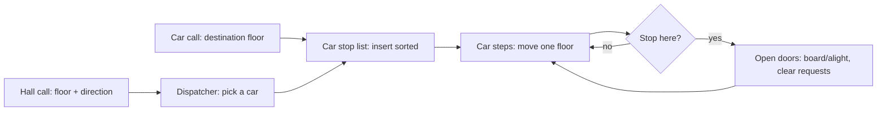
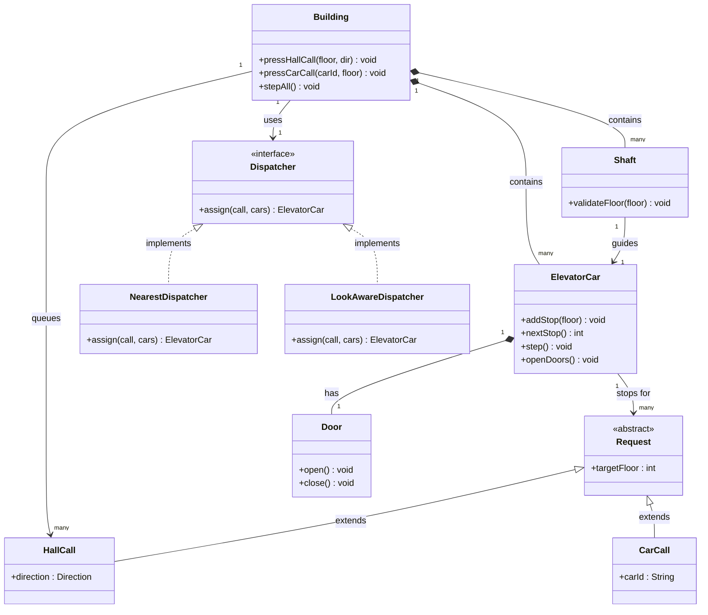
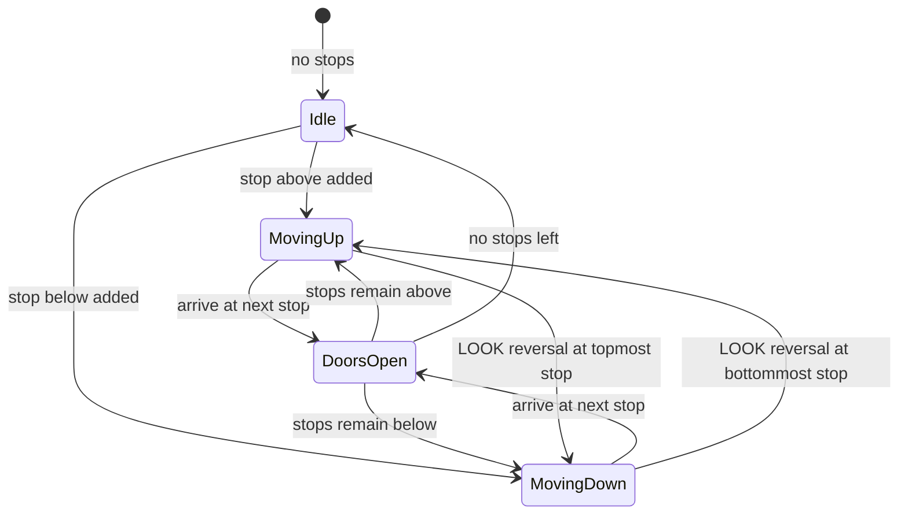
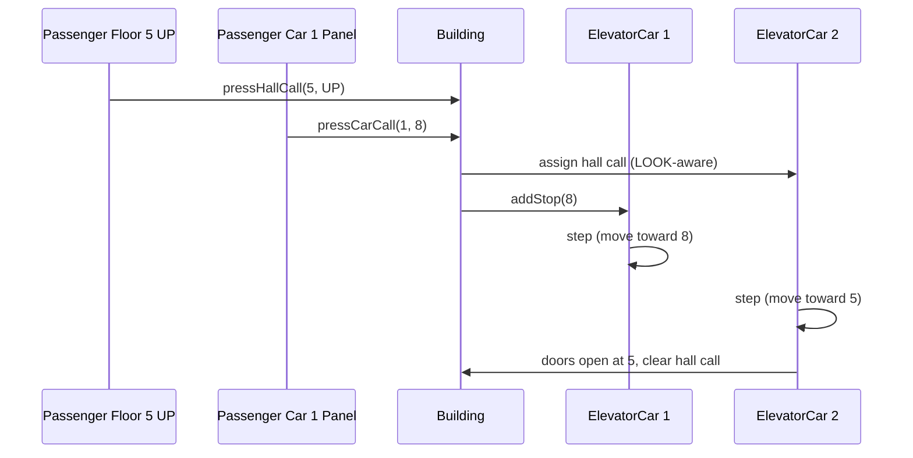

# Design a Elevator System

## Blogs and websites

## Medium

## Youtube

- [Elevator System | Google SWE Teaches Low Level Design Episode 3](https://www.youtube.com/watch?v=4OjHA-BcJhw)
- [8. Elevator System, Low Level Design (Hindi) | SDE LLD interview question | Design Elevator System](https://www.youtube.com/watch?v=9ORcPv_Tbz8)
- [Elevator System Design | Grokking the Object Oriented System Design Interview Question](https://www.youtube.com/watch?v=siqiJAJWUVg)

## Theory

Design controllers that serve floor requests across one or more elevators efficiently. Must assign requests and schedule stops (e.g., SCAN/LOOK) while tracking direction.
Key entities: Elevator, Floor, Request (internal/external), Scheduler/Dispatcher.
Core operations: request pickup, select floor, step/move.

This guide turns that stub into an interview-ready low-level design: you will clarify an ambiguous multi-elevator control problem, model clean OOP entities, compare SCAN/LOOK versus destination dispatch, handle concurrent hall and car calls safely, and write plain Java 17 code that an interviewer can trace on a whiteboard. The emphasis is on object modeling, scheduling trade-offs, and thread safety — not frameworks, message queues, or distributed control.

> Scope note: this is LLD (class design, patterns, in-process concurrency). Motor control hardware, real-time firmware, and building-wide distributed dispatch belong to embedded/HLD and are mentioned only where they constrain the object model (for example, request IDs must stay unique if you later shard dispatchers per bank).

### Topics Covered

1. [Problem Statement](#problem-statement)
2. [Functional / Non-Functional Requirements](#functional--non-functional-requirements)
3. [Core Entities & Class Design](#core-entities--class-design)
4. [Dispatch Algorithms & Key Design Decisions](#dispatch-algorithms--key-design-decisions)
5. [Concurrency & Edge Cases](#concurrency--edge-cases)
6. [Java 17 Implementation](#java-17-implementation)
7. [Interview Questions and Answers](#interview-questions-and-answers)

---

### Problem Statement

Design an elevator control system for a building with N floors and M elevator cars that serves hall calls (up/down buttons on floors) and car calls (floor buttons inside the car) efficiently, safely, and fairly.

A passenger on floor `f` presses a hall call (direction UP or DOWN). The dispatcher assigns one elevator car to answer it. The car moves floor by floor, opening doors at scheduled stops, accepting car calls from onboard passengers, and updating its direction. When a car arrives at a requested floor with matching direction, it stops, opens doors for a fixed dwell time, boards/alights passengers, clears the served requests, and continues its sweep. Operators need live state: each car position, direction, door state, and pending stop list.

**Why this problem exists**

- Naive dispatch (nearest car) causes starvation, bunching (all cars crowd one floor), and needless direction reversals.
- The domain is rich in OOP: requests as commands, cars as state machines, dispatchers as strategies, and shafts as topology constraints.
- Interviewers love it because the single-elevator happy path takes 10 minutes but multi-car dispatch, SCAN/LOOK reasoning, and concurrency separate junior from senior answers.

**Real-life analogues**

- **Office towers**: banks of 4-8 cars sharing hall calls via destination dispatch keypads in the lobby.
- **Residential blocks**: 1-2 cars with simple collective control (SCAN) and peak up-traffic in the morning.
- **Hospitals and hotels**: priority modes — fire service, VIP, freight, and handicapped-access holds.

**Clarifying questions to ask in the interview (say these out loud)**

1. How many elevators and floors? One shaft per car, or double-decker?
2. Hall calls carry direction (up/down)? Car calls carry destination floor only?
3. Capacity per car? Overload behaviour — skip stop or alarm and hold doors?
4. One dispatcher for the bank, or per-car schedulers cooperating?
5. Scheduling goal: minimize average wait, minimize travel time, fairness, or energy?
6. Door semantics: dwell time, obstruction re-open, emergency hold?
7. Priority modes needed: fire, maintenance, VIP, freight? How do they pre-empt?
8. What is a `step`/`move`: discrete floor tick in code, or time-based simulation?
9. Single-threaded simulation or multi-threaded with concurrent button presses?
10. Persistence needed, or in-memory simulation is fine? Admin APIs for alarms?

**Assumptions for this guide (state these if the interviewer says "decide yourself")**

- 10 floors (0-9), 3 cars, one shaft per car, capacity 8 persons (weight-checked as count for simplicity).
- Hall call = (floor, direction); car call = (destination floor, carId). Top floor has DOWN only, ground has UP only.
- Discrete-time simulation: `step()` moves one floor or toggles doors; dispatcher assigns on every new hall call.
- Default scheduling: LOOK per car + global nearest-in-direction dispatcher; destination dispatch shown as extension.
- Door dwell is 2 ticks; obstruction re-opens once then closes.
- Thread-safe request intake; car movement itself single-threaded per car in the demo, multi-threaded intake via locks.
- In-memory only; request IDs are UUIDs so a future persistent queue can reuse them.



---

### Functional / Non-Functional Requirements

#### Functional requirements (must-have)

1. **Hall calls (external requests)**
   - Accept `(floor, direction)` from up/down buttons on each floor.
   - Top floor accepts DOWN only; ground floor accepts UP only; duplicate presses while pending are idempotent.
   - Every hall call is eventually assigned to exactly one car and cleared only when a car with matching direction opens doors there.
2. **Car calls (internal requests)**
   - Accept `(carId, destinationFloor)` from inside-car panels.
   - Reject destinations equal to current floor when doors are open (no-op) and out-of-range floors with a typed exception.
   - Car calls never need a dispatcher — they insert directly into that car's stop list.
3. **Dispatcher assignment**
   - On each new hall call, pick a car using the configured `Dispatcher` strategy.
   - Re-evaluate unserved hall calls when a car becomes free, changes direction, or enters maintenance mode.
   - Never assign a hall call to a car in `MAINTENANCE` or `FIRE_SERVICE` mode.
4. **Movement (`step` / `move`)**
   - `step()` advances simulation by one tick: move one floor toward next stop, or start/finish door dwell.
   - Cars never skip a scheduled stop in their current direction; direction flips only at sweep ends (LOOK) or when no further stops remain.
   - Position always stays within `[0, numFloors - 1]`; shaft enforces bounds.
5. **Doors and boarding**
   - Doors open only when stopped at a floor; dwell is 2 ticks by default.
   - Obstruction event re-opens doors once, then forces close to avoid infinite hold.
   - Overload (weight/count beyond capacity) triggers alarm, holds doors open, and refuses to move until load drops.
6. **Stop management**
   - Each car keeps an ordered stop set; `addStop`, `nextStop`, and `clearStop` are the only mutators.
   - A stop is cleared only after doors opened there; direction-aware clearing (UP stops served while going UP).
7. **Modes and admin operations**
   - Support `NORMAL`, `MAINTENANCE` (excluded from dispatch, finishes current stops), and `FIRE_SERVICE` (recall to ground, lock out).
   - Query live state: car position, direction, door state, pending stops, pending hall calls.
   - Add/remove cars at construction or via admin API; disable a shaft for maintenance.
8. **Notifications**
   - Direction lamps and arrival bells modelled as observers on car move/door events.
   - Hall lantern (up/down arrow lit) reflects assigned car's approach.

#### Explicitly out of scope (say this to bound the interview)

- Real motor controllers, weight sensors, and door hardware drivers (a `Door` interface with a mock is enough).
- Distributed dispatch across buildings, persistent request queues, and auth for keypads.
- Optimal global scheduling proofs; heuristics with stated trade-offs are expected.

#### Non-functional requirements (LLD-flavoured)

- **Safety over speed**: never move with doors open; never open doors between floors; every transition is guarded by the state machine.
- **Liveness and fairness**: no hall call starves indefinitely; LOOK bounds worst-case wait versus naive nearest-car.
- **Responsiveness**: dispatch decision is O(cars × stops) and in-memory; p99 assignment under ~10 ms for a bank of ≤8 cars.
- **Extensibility**: new dispatch rule = new class implementing `Dispatcher`, not an `if` inside `ElevatorCar`.
- **Testability**: `Clock`-free discrete ticks plus injectable dispatcher make all movement deterministic in unit tests.
- **Readability**: an interviewer can trace `pressHallCall() → dispatch() → addStop() → step() → openDoors()` in under five minutes.
- **Robustness**: invalid floors, duplicate calls, overload, and obstruction all fail with typed exceptions or defined holds, never silent corruption.

| Requirement | Target / policy | Why it matters in LLD |
|---|---|---|
| No door-open move | `move()` guard on `DoorState.CLOSED` | Core safety invariant |
| No starvation | LOOK sweep + dispatcher re-eval | Fairness follow-up |
| Idempotent calls | Set-based stop list | Button spam reality |
| Bounded dispatch | O(M) per hall call | Keeps gates parallel |
| Mode safety | Maintenance/fire excluded | Real building codes |

---

### Core Entities & Class Design

The model has four groups: requests, cars and shafts, dispatchers, and the building orchestrator. Keep behaviour with the data it guards: requests are immutable values, cars own movement and doors, dispatchers own assignment, and the building owns intake and ticking.

#### Requests: the vocabulary of the domain

- `Direction { UP, DOWN, IDLE }` — car travel intent; `IDLE` means parked with empty stop list.
- `DoorState { OPEN, CLOSED, OPENING, CLOSING }` — door lifecycle; movement allowed only when `CLOSED`.
- `CarMode { NORMAL, MAINTENANCE, FIRE_SERVICE, OVERLOAD_HOLD }` — operating mode; only `NORMAL` cars receive hall calls.
- `HallCall`: immutable — floor, direction, requestId (UUID). Equality on `(floor, direction)` so double presses collapse.
- `CarCall`: immutable — carId, destination floor, requestId.
- `Request` (sealed or abstract): common id + target floor; `HallRequest` and `CarRequest` subtypes.

#### Cars, shafts, and building

- `ElevatorCar`: id, currentFloor, direction, doorState, mode, capacity, stop set, door timer. Methods `addStop(floor)`, `nextStop()`, `step()`, `openDoors()/closeDoors()`, `setMode()`.
- `Shaft`: shaftId, car reference, floor range `[minFloor, maxFloor]`. Method `validateFloor(f)`; owns the invariant that a car never leaves its range.
- `Dispatcher` (interface): `assign(HallCall, List<ElevatorCar>) → ElevatorCar`. Implementations `NearestDispatcher`, `LookAwareDispatcher`, `DestinationDispatcher`.
- `Building` (root): floor count, car list, pending hall-call queue, dispatcher reference. Methods `pressHallCall()`, `pressCarCall()`, `stepAll()`, `status()`.
- Observers: `ElevatorObserver` with `DirectionLamp`, `ArrivalBell`, `HallLantern` implementations.
- Factories: `RequestFactory` centralizes UUID + validation (bad floor, bad direction on terminal floors).



The diagram shows containment (building to cars and shafts), guidance (each shaft bounds one car), delegation (building to dispatcher), pluggability (dispatcher implementations), and scheduling (cars hold stop requests while the door is a composed part).
---

### Dispatch Algorithms & Key Design Decisions

#### How a single car schedules stops: SCAN vs LOOK

Both are "collective control": the car sweeps in one direction serving every stop in its path, then reverses. The difference is where it reverses.

- **SCAN (elevator algorithm)**: travel to the terminal floor (0 or top) before reversing, even with no stops beyond. Simple, predictable, but wastes trips to empty ends.
- **LOOK**: reverse at the farthest *requested* stop instead of the terminal. Same fairness, fewer wasted moves. This guide uses LOOK as the default per-car policy.

Example with 10 floors, car at 3 going UP, stops {2, 5, 9}: SCAN goes 3→9→top→back down to 2. LOOK goes 3→5→9→reverse→2, skipping the empty run to the terminal.



The diagram shows the car as a state machine where doors open only from a moving state and direction flips only at sweep ends or idleness.

#### How the bank assigns hall calls: three dispatchers

1. **NearestDispatcher (baseline)**: assign to the closest `NORMAL` car by floor distance. One-line logic, terrible under load — it ignores direction, so a car moving away gets the call and every car can bunch on one floor.
2. **LookAwareDispatcher (default)**: score each car by whether it will *pass* the hall floor in its current sweep. A car moving toward the call in the matching direction costs `distance`; a car moving away or idle costs `distance + penalty` (full-sweep estimate). Picks the minimum. Kills most reversals and much bunching with O(M) math.
3. **DestinationDispatcher (extension)**: passengers enter destination on the landing keypad; the system groups same-direction destinations into the same car. Best throughput at lobby rush, but needs keypads and destination-aware scoring — show the seam, build only if asked.

| Dispatcher | Logic | Strength | Weakness | Use when |
|---|---|---|---|---|
| Nearest | Min floor distance | Trivial to code | Starvation + bunching | Single-car demo only |
| LOOK-aware | Direction + distance score | Fair, few reversals | Still heuristic, not optimal | Default multi-car answer |
| Destination | Group by destination | Best peak throughput | Needs keypads, complex | Lobby-rush follow-up |

#### Key design decisions and patterns used

- **Decision 1 — Requests as immutable values, stops as a sorted set.** `HallCall`/`CarCall` carry a UUID and never mutate; the car's `TreeSet<Integer>` of stop floors collapses duplicates and keeps `nextStop()` O(log n). Button spam becomes free idempotency.
- **Decision 2 — Strategy for dispatch.** `Dispatcher` is an interface; `Building` holds a reference and never branches on rule names. Swapping nearest → LOOK-aware is a constructor argument (Open/Closed Principle).
- **Decision 3 — State enums instead of a full State pattern.** Direction, door, and mode are small enums with guarded transitions (`move()` throws if doors are not `CLOSED`). Name the trade-off: "I would promote to State objects if doors gained per-state timing behaviour."
- **Decision 4 — Shaft enforces topology.** Floor-range validation lives in `Shaft`, not scattered across cars, so an off-by-one fix touches one class.
- **Decision 5 — Observer for lamps and bells.** `DirectionLamp`, `ArrivalBell`, and `HallLantern` subscribe to car events; the car never imports UI classes, and notification is one-way to avoid re-entrancy deadlocks.
- **Decision 6 — Factory for request creation.** `RequestFactory` validates terminal-floor directions (no UP on top) and mints UUIDs in one place.

| Pattern | Where | Why |
|---|---|---|
| Strategy | `Dispatcher` family, door timing | Swap rules without touching cars |
| Command | `HallCall` / `CarCall` as request objects | Queue, deduplicate, reassign uniformly |
| State (lite) | Direction / door / mode enums with guards | Safety without class explosion |
| Observer | Lamps, bells, lanterns | One movement event, many indicators |
| Factory | `RequestFactory` | Centralize validation and ID generation |
| Facade | `Building` over cars + dispatcher | Simple press-call API over orchestration |

**SOLID mapping (one line each for the "which principles?" follow-up)**

- Single Responsibility: car moves, dispatcher assigns, shaft bounds, observer signals.
- Open/Closed: new dispatch rule or mode = new class or enum value, zero edits to `step()`.
- Liskov: any `Dispatcher` substitutes without breaking `Building`.
- Interface Segregation: small `Dispatcher`, `Door`, `ElevatorObserver` interfaces instead of one fat controller.
- Dependency Inversion: the building depends on the `Dispatcher` interface; tests inject fakes.

---

### Concurrency & Edge Cases

#### The concurrency story (the senior half of the interview)

Hall and car buttons fire concurrently while cars tick. The design layers three mechanisms from outermost to innermost:

1. **Concurrent intake at the building.** Pending hall calls live in a `ConcurrentHashMap` keyed by `(floor, direction)`; duplicate presses collapse instead of queuing twice. Car stop sets are guarded `TreeSet`s with per-car locks, so two banks never corrupt one list.
2. **Per-car lock for movement.** Each `ElevatorCar` owns a `ReentrantLock`; `step()` and `addStop()` are mutually exclusive per car but cars never block each other. No global building lock, so 3 cars tick in parallel.
3. **One-way observers.** Lamps and bells are notified on a snapshot outside the car lock via `CopyOnWriteArrayList`, so a slow UI listener cannot stall the shaft.



The diagram shows concurrent hall and car calls merging safely: assignment picks a car while direct car calls skip dispatch, and each car advances under its own lock.

**Why not `synchronized stepAll()`?** A global lock serializes every car to one mover at a time and couples button intake to movement — fine for a whiteboard, indefensible at senior level. Per-car locks keep cars parallel; the only shared mutation is a map `put`, which `ConcurrentHashMap` handles.

**Door ordering (say this verbatim): arrive → open → dwell → close → move.** Moving before `CLOSED` or opening between floors violates the safety invariant; `step()` throws `IllegalStateException` on either. On obstruction the doors re-open once, then force close to avoid infinite hold.

#### Edge cases table (pick 4–5 to recite, keep the rest as backup)

| # | Edge case | Handling |
|---|---|---|
| 1 | Duplicate hall press while pending | Map key dedup; second press is a no-op |
| 2 | Hall call on terminal floor, wrong direction | `RequestFactory` rejects UP on top / DOWN on ground with typed exception |
| 3 | Car call to current floor, doors open | No-op; passenger already there |
| 4 | Car call out of shaft range | `Shaft.validateFloor` throws `InvalidFloorException` |
| 5 | All cars in maintenance | Hall call stays queued; `NoCarAvailableException` on query, re-evaluated when a car returns |
| 6 | Car enters maintenance mid-sweep | Finishes current stops, takes no new hall calls, pending calls reassigned |
| 7 | Fire service mode | Recall to ground, open doors, lock out; all pending calls for that car reassigned |
| 8 | Overload at boarding | Alarm + `OVERLOAD_HOLD`; `step()` refuses to move until load clears |
| 9 | Door obstruction | Re-open once, then force close; counter resets per stop |
| 10 | Power restart (in-memory loss) | Acknowledge: queues lost; production needs write-ahead log — UUIDs already anticipate it |
| 11 | Two cars assigned same call | Impossible by design: assignment removes the call from pending atomically (`remove` return wins) |
| 12 | Starvation of far-floor calls | LOOK sweep bounds worst-case wait; destination dispatch groups lobby bursts |
| 13 | Bunching (all cars crowd one floor) | LOOK-aware scoring penalizes cars moving away; idle cars preferred for new calls |
| 14 | Empty building, all idle | First call wakes nearest idle car; direction set by first stop |
---

### Java 17 Implementation

All classes below are plain Java 17 (no Spring, no frameworks). Concurrency uses `ConcurrentHashMap` and per-car `ReentrantLock`; movement is discrete `step()` ticks so tests are deterministic. Each block is followed by its explanation and the pattern it demonstrates.

#### 1. Enums and request values (Command pattern)

The enums form the domain vocabulary; requests are immutable command objects.

```java
import java.util.UUID;

public enum Direction { UP, DOWN, IDLE }
public enum DoorState { OPEN, CLOSED, OPENING, CLOSING }
public enum CarMode { NORMAL, MAINTENANCE, FIRE_SERVICE, OVERLOAD_HOLD }

// Abstract request: common target floor + UUID for future persistence.
public abstract class Request {
    private final String requestId;
    private final int targetFloor;
    protected Request(int targetFloor) {
        this.requestId = UUID.randomUUID().toString();
        this.targetFloor = targetFloor;
    }
    public String requestId() { return requestId; }
    public int targetFloor() { return targetFloor; }
}

// Hall call: equality on (floor, direction) so double presses collapse.
public final class HallCall extends Request {
    private final Direction direction;
    public HallCall(int floor, Direction direction) {
        super(floor);
        if (direction == Direction.IDLE) throw new IllegalArgumentException("hall call needs UP/DOWN");
        this.direction = direction;
    }
    public Direction direction() { return direction; }
    @Override public boolean equals(Object o) {
        return o instanceof HallCall h
            && targetFloor() == h.targetFloor() && direction == h.direction;
    }
    @Override public int hashCode() { return 31 * targetFloor() + direction.hashCode(); }
}

// Car call: destination inside a specific car.
public final class CarCall extends Request {
    private final String carId;
    public CarCall(String carId, int destFloor) {
        super(destFloor);
        this.carId = carId;
    }
    public String carId() { return carId; }
}

// Factory (Factory pattern): validates terminal floors + mints IDs in one place.
final class RequestFactory {
    private RequestFactory() {}
    public static HallCall hallCall(int floor, Direction dir, int topFloor) {
        if (floor < 0 || floor > topFloor) throw new InvalidFloorException(floor);
        if (floor == topFloor && dir == Direction.UP) throw new IllegalArgumentException("no UP on top floor");
        if (floor == 0 && dir == Direction.DOWN) throw new IllegalArgumentException("no DOWN on ground");
        return new HallCall(floor, dir);
    }
    public static CarCall carCall(String carId, int dest, int topFloor) {
        if (dest < 0 || dest > topFloor) throw new InvalidFloorException(dest);
        return new CarCall(carId, dest);
    }
}

class InvalidFloorException extends RuntimeException {
    InvalidFloorException(int f) { super("Invalid floor: " + f); }
}
class NoCarAvailableException extends RuntimeException {
    NoCarAvailableException(String m) { super(m); }
}
```

Explanation: requests as immutable `Command` objects lets the building queue, deduplicate, and reassign hall and car calls uniformly. Equality on `(floor, direction)` gives idempotent hall buttons for free, and the factory owns terminal-floor validation so cars never see an impossible call.

#### 2. Door, shaft, and elevator car (LOOK scheduling)

```java
import java.util.*;
import java.util.concurrent.CopyOnWriteArrayList;
import java.util.concurrent.locks.ReentrantLock;

// Door seam: mock in the interview, hardware driver in production.
interface Door {
    void open();
    void close();
    DoorState state();
}

class SimpleDoor implements Door {
    private DoorState state = DoorState.CLOSED;
    public void open() { state = DoorState.OPEN; }
    public void close() { state = DoorState.CLOSED; }
    public DoorState state() { return state; }
}

// Shaft owns the topology invariant: a car never leaves its floor range.
class Shaft {
    private final String shaftId;
    private final int minFloor;
    private final int maxFloor;
    Shaft(String shaftId, int minFloor, int maxFloor) {
        this.shaftId = shaftId; this.minFloor = minFloor; this.maxFloor = maxFloor;
    }
    void validateFloor(int f) {
        if (f < minFloor || f > maxFloor) throw new InvalidFloorException(f);
    }
    String shaftId() { return shaftId; }
    int maxFloor() { return maxFloor; }
}

// Observer: one-way signals, never calls back into the car.
interface ElevatorObserver {
    void onCarMoved(String carId, int floor, Direction dir);
    void onDoorsOpened(String carId, int floor);
}

class DirectionLamp implements ElevatorObserver {
    public void onCarMoved(String carId, int floor, Direction dir) {
        System.out.println("[" + carId + "] lamp: " + dir + " @ " + floor);
    }
    public void onDoorsOpened(String carId, int floor) {
        System.out.println("[" + carId + "] bell: arrived @ " + floor);
    }
}

// ElevatorCar: LOOK sweep + guarded door state machine. Per-car lock.
public class ElevatorCar {
    private final String carId;
    private final Shaft shaft;
    private final Door door;
    private final int capacity;
    private final TreeSet<Integer> stops = new TreeSet<>();
    private final ReentrantLock lock = new ReentrantLock();
    private final List<ElevatorObserver> observers = new CopyOnWriteArrayList<>();
    private int currentFloor;
    private Direction direction = Direction.IDLE;
    private CarMode mode = CarMode.NORMAL;
    private int load = 0;
    private int doorTimer = 0;
    private int obstructionCount = 0;
    private static final int DWELL_TICKS = 2;

    public ElevatorCar(String carId, Shaft shaft, Door door, int capacity, int startFloor) {
        this.carId = carId; this.shaft = shaft; this.door = door;
        this.capacity = capacity; this.currentFloor = startFloor;
    }

    public void addObserver(ElevatorObserver o) { observers.add(o); }

    public void addStop(int floor) {
        lock.lock();
        try {
            shaft.validateFloor(floor);
            if (mode == CarMode.MAINTENANCE || mode == CarMode.FIRE_SERVICE) return;
            if (floor == currentFloor && door.state() == DoorState.OPEN) return; // already here
            stops.add(floor);
            if (direction == Direction.IDLE)
                direction = floor > currentFloor ? Direction.UP : Direction.DOWN;
        } finally { lock.unlock(); }
    }

    public boolean hasStop(int floor) {
        lock.lock(); try { return stops.contains(floor); } finally { lock.unlock(); }
    }

    // One simulation tick: finish dwell, or move one floor toward next LOOK stop.
    public void step() {
        lock.lock();
        try {
            if (mode == CarMode.OVERLOAD_HOLD) return; // alarm held: no motion
            if (door.state() == DoorState.OPEN) {
                if (--doorTimer <= 0) { door.close(); }
                return;
            }
            if (stops.isEmpty()) { direction = Direction.IDLE; return; }
            Integer next = direction == Direction.DOWN ? stops.last() : stops.first();
            // LOOK reversal: no stops ahead in current direction -> flip.
            if (direction == Direction.UP && next < currentFloor) direction = Direction.DOWN;
            else if (direction == Direction.DOWN && next > currentFloor) direction = Direction.UP;
            if (currentFloor == next) { openDoors(); return; }
            currentFloor += (next > currentFloor) ? 1 : -1;
            for (var o : observers) o.onCarMoved(carId, currentFloor, direction);
            if (stops.contains(currentFloor)) openDoors();
        } finally { lock.unlock(); }
    }

    private void openDoors() {
        door.open(); doorTimer = DWELL_TICKS; obstructionCount = 0;
        stops.remove(currentFloor);
        if (stops.isEmpty()) direction = Direction.IDLE;
        for (var o : observers) o.onDoorsOpened(carId, currentFloor);
    }

    public void signalObstruction() {
        lock.lock(); try {
            if (door.state() == DoorState.OPEN && obstructionCount++ == 0) doorTimer = DWELL_TICKS;
        } finally { lock.unlock(); }
    }

    public void setLoad(int persons) {
        lock.lock(); try {
            load = persons;
            if (load > capacity) mode = CarMode.OVERLOAD_HOLD;
            else if (mode == CarMode.OVERLOAD_HOLD) mode = CarMode.NORMAL;
        } finally { lock.unlock(); }
    }

    public void setMode(CarMode m) { lock.lock(); try { mode = m; } finally { lock.unlock(); } }
    public String carId() { return carId; }
    public int currentFloor() { lock.lock(); try { return currentFloor; } finally { lock.unlock(); } }
    public Direction direction() { lock.lock(); try { return direction; } finally { lock.unlock(); } }
    public CarMode mode() { lock.lock(); try { return mode; } finally { lock.unlock(); } }
    public Set<Integer> stopsSnapshot() { lock.lock(); try { return Set.copyOf(stops); } finally { lock.unlock(); } }
}
```

Explanation: the `TreeSet` is the LOOK engine — `first()`/`last()` give the sweep ends and duplicates vanish. `step()` encodes the safety invariant (never move with doors open, dwell before closing) and the LOOK reversal in a dozen lines. The per-car `ReentrantLock` lets cars tick in parallel while observers fire on snapshots outside critical state changes.
#### 3. Dispatchers, building, and demo (Strategy + Facade)

```java
import java.util.*;
import java.util.concurrent.ConcurrentHashMap;

// Strategy: assign a hall call to one car. Swap without touching Building.
interface Dispatcher {
    ElevatorCar assign(HallCall call, List<ElevatorCar> cars);
}

// Baseline: closest NORMAL car. Ignores direction — bunches under load.
class NearestDispatcher implements Dispatcher {
    public ElevatorCar assign(HallCall call, List<ElevatorCar> cars) {
        return cars.stream()
            .filter(c -> c.mode() == CarMode.NORMAL)
            .min(Comparator.comparingInt(c -> Math.abs(c.currentFloor() - call.targetFloor())))
            .orElseThrow(() -> new NoCarAvailableException("no NORMAL car"));
    }
}

// Default: prefer cars already sweeping toward the call in matching direction.
class LookAwareDispatcher implements Dispatcher {
    private static final int SWEEP_PENALTY = 20; // ~full-shaft cost estimate
    public ElevatorCar assign(HallCall call, List<ElevatorCar> cars) {
        return cars.stream()
            .filter(c -> c.mode() == CarMode.NORMAL)
            .min(Comparator.comparingInt(c -> score(c, call)))
            .orElseThrow(() -> new NoCarAvailableException("no NORMAL car"));
    }
    private int score(ElevatorCar c, HallCall call) {
        int dist = Math.abs(c.currentFloor() - call.targetFloor());
        Direction d = c.direction();
        if (d == Direction.IDLE) return dist; // free car: pure distance
        boolean approaching = (d == Direction.UP && call.targetFloor() >= c.currentFloor())
            || (d == Direction.DOWN && call.targetFloor() <= c.currentFloor());
        boolean dirMatch = (d == call.direction());
        return (approaching && dirMatch) ? dist : dist + SWEEP_PENALTY;
    }
}

// Extension seam: group lobby passengers by destination (needs keypads).
// Kept minimal on purpose — name it in the interview, build only if asked.
class DestinationDispatcher implements Dispatcher {
    private final Dispatcher fallback = new LookAwareDispatcher();
    public ElevatorCar assign(HallCall call, List<ElevatorCar> cars) {
        return fallback.assign(call, cars); // grouping logic plugs in here
    }
}

// Building: Facade over cars + dispatcher. Thread-safe intake, per-car ticks.
public class Building {
    private final int topFloor;
    private final List<ElevatorCar> cars;
    private final Map<HallCall, ElevatorCar> pending = new ConcurrentHashMap<>();
    private Dispatcher dispatcher;

    public Building(int topFloor, List<ElevatorCar> cars, Dispatcher dispatcher) {
        this.topFloor = topFloor;
        this.cars = List.copyOf(cars);
        this.dispatcher = dispatcher;
    }

    public void setDispatcher(Dispatcher d) { this.dispatcher = d; }

    // Hall call: dedup, assign, insert stop. Atomic remove-or-assign prevents double dispatch.
    public void pressHallCall(int floor, Direction dir) {
        HallCall call = RequestFactory.hallCall(floor, dir, topFloor);
        if (pending.containsKey(call)) return; // idempotent button spam
        ElevatorCar car = dispatcher.assign(call, cars);
        pending.put(call, car);
        car.addStop(floor);
    }

    public void pressCarCall(String carId, int dest) {
        CarCall call = RequestFactory.carCall(carId, dest, topFloor);
        cars.stream().filter(c -> c.carId().equals(call.carId())).findFirst()
            .orElseThrow(() -> new NoCarAvailableException("unknown car: " + call.carId()))
            .addStop(call.targetFloor());
    }

    // Called by cars (or a sensor loop) when doors open: clear served hall calls.
    public void onDoorsOpened(String carId, int floor) {
        pending.keySet().removeIf(call -> {
            if (call.targetFloor() != floor) return false;
            ElevatorCar assigned = pending.get(call);
            return assigned != null && assigned.carId().equals(carId);
        });
    }

    public void stepAll() { for (var c : cars) c.step(); }
    public int pendingHallCalls() { return pending.size(); }

    public String status() {
        var sb = new StringBuilder();
        for (var c : cars) sb.append(c.carId()).append("@").append(c.currentFloor())
            .append(" ").append(c.direction()).append(" ").append(c.mode())
            .append(" stops=").append(c.stopsSnapshot()).append("\n");
        return sb.toString();
    }
}

// Demo wiring: 10 floors, 3 cars, LOOK-aware dispatch, 30 ticks of traffic.
class ElevatorDemo {
    public static void main(String[] args) {
        int top = 9;
        var cars = List.of(
            new ElevatorCar("C1", new Shaft("S1", 0, top), new SimpleDoor(), 8, 0),
            new ElevatorCar("C2", new Shaft("S2", 0, top), new SimpleDoor(), 8, 5),
            new ElevatorCar("C3", new Shaft("S3", 0, top), new SimpleDoor(), 8, 9));
        cars.forEach(c -> c.addObserver(new DirectionLamp()));
        var building = new Building(top, cars, new LookAwareDispatcher());

        building.pressHallCall(3, Direction.UP);
        building.pressHallCall(7, Direction.DOWN);
        building.pressCarCall("C1", 8);
        for (int t = 0; t < 30 && (building.pendingHallCalls() > 0 || t < 15); t++) {
            building.stepAll();
            if (t == 10) building.pressHallCall(0, Direction.UP); // lobby rush joins late
        }
        System.out.print(building.status());
    }
}
```

Explanation: `LookAwareDispatcher.score` is the whole multi-car intelligence in ten lines — approaching-plus-matching cars win at raw distance, everything else pays a sweep penalty, which kills bunching without any global optimizer. `Building` stays thin by delegating fit to shafts, ordering to cars, and assignment to the strategy; the `ConcurrentHashMap` keyed by `HallCall` gives idempotent buttons and atomic assignment. The demo runs a full interview arc in ~20 lines: build, press calls, tick, observe — exactly what to reproduce on a whiteboard.

**How to extend (name these without building them)**

- Destination dispatch: keypad captures `(floor, destination)` pairs; group same-direction destinations per car before calling `addStop`.
- Fire recall: `setMode(FIRE_SERVICE)` clears stops, adds stop 0, locks doors open on arrival.
- Energy saver: park idle cars at predicted-demand floors (lobby in the morning) via a strategy tweak.

---

### Interview Questions and Answers

1. **Beginner: walk me through the classes in your elevator system.**
   Answer: `HallCall`/`CarCall` immutable requests, `ElevatorCar` (position, direction, doors, LOOK stop set, `step()`), `Shaft` (floor-range guard), `Dispatcher` strategy family, `Building` facade (intake + ticking), plus `Door` seam and lamp/bell observers. Hall flow is `pressHallCall → dispatch → addStop → step → openDoors → clear`; car flow skips dispatch and inserts directly.

2. **Beginner: what is the difference between a hall call and a car call?**
   Answer: a hall call is `(floor, direction)` from a landing button and needs dispatcher assignment to pick a car; a car call is `(carId, destination)` from inside the panel and goes straight into that car's stop set. Hall calls clear only when the assigned car opens doors at that floor with matching direction; car calls clear when their own car arrives.

3. **Junior: SCAN versus LOOK — which do you use and why?**
   Answer: both sweep one direction serving every stop in path, but SCAN reverses at terminal floors while LOOK reverses at the farthest requested stop. LOOK skips empty terminal runs (car at 3 with top stop 9 never visits an empty floor 9-terminal gap), so same fairness with fewer moves. I implement LOOK via a `TreeSet` — `first()`/`last()` are the sweep ends and reversal is a comparison, not a special case.

4. **Junior: how does the LOOK-aware dispatcher beat nearest-car?**
   Answer: nearest-car ignores direction, so it assigns a down-moving car to an up call and crowds all cars onto one floor. LOOK-aware scores each car: approaching in matching direction costs raw distance, anything else pays distance plus a sweep penalty. That single penalty term prefers cars already coming your way and leaves idle cars for new bursts — O(cars) math with visibly less bunching.

5. **Junior: where do the design patterns appear?**
   Answer: Strategy for dispatchers (nearest, LOOK-aware, destination); Command for hall/car calls as immutable queued objects; State-lite via direction/door/mode enums with guarded transitions; Observer for lamps, bells, and lanterns; Factory for request validation and UUIDs; Facade in `Building` over cars plus dispatcher.

6. **Junior: what happens on duplicate button presses or a wrong-direction terminal press?**
   Answer: duplicates collapse — the pending map is keyed by `HallCall` equality on `(floor, direction)`, so re-presses are no-ops, and the car's `TreeSet` stores each stop floor once. Terminal violations (UP on top, DOWN on ground) are rejected in `RequestFactory` with typed exceptions before any car state changes.

7. **Mid: two passengers press hall calls concurrently while cars are moving — how is this safe?**
   Answer: intake uses a `ConcurrentHashMap` so concurrent presses serialize on map internals, and each car's stop set mutates only under its own `ReentrantLock`, which `step()` also holds — cars never block each other, only their own add-vs-move race. Assignment removes-or-assigns atomically, so two dispatch runs cannot give one call to two cars.

8. **Mid: why must the order be arrive → open → dwell → close → move?**
   Answer: any other order breaks the safety invariant — moving before `CLOSED` risks shaft injury and opening between floors traps passengers. `step()` enforces it structurally: the move branch is unreachable while doors read `OPEN`, and dwell ticks down only in the door branch. Obstruction gets exactly one re-open before forced close so a stuck sensor cannot hold the bank forever.

9. **Senior: how do you prevent starvation and bunching at lobby rush?**
   Answer: LOOK bounds worst-case wait because every sweep reverses at the last request — no call waits more than ~2 sweeps. Against bunching, the dispatcher penalty keeps trailing cars from chasing a call the lead car already covers, and idle cars absorb new bursts at raw distance. For true lobby rush I name destination dispatch: grouping same-destination passengers into one car beats any heuristic, at the cost of keypads.

10. **Senior: how do you test movement and dispatch deterministically?**
    Answer: discrete `step()` ticks make time an integer — tests press calls, tick N times, and assert exact floors, directions, and cleared stops with no sleeps or threads. Dispatchers get scripted car positions (idle here, moving-away there) and assert the chosen car. For concurrency, fire N threads of duplicate hall presses with a `CountDownLatch` start gate and assert one assignment plus one stop entry; overload and obstruction get direct `setLoad`/`signalObstruction` calls asserting `OVERLOAD_HOLD` and forced close.
