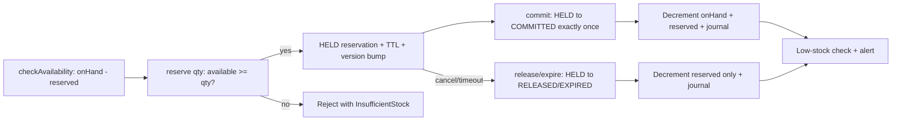
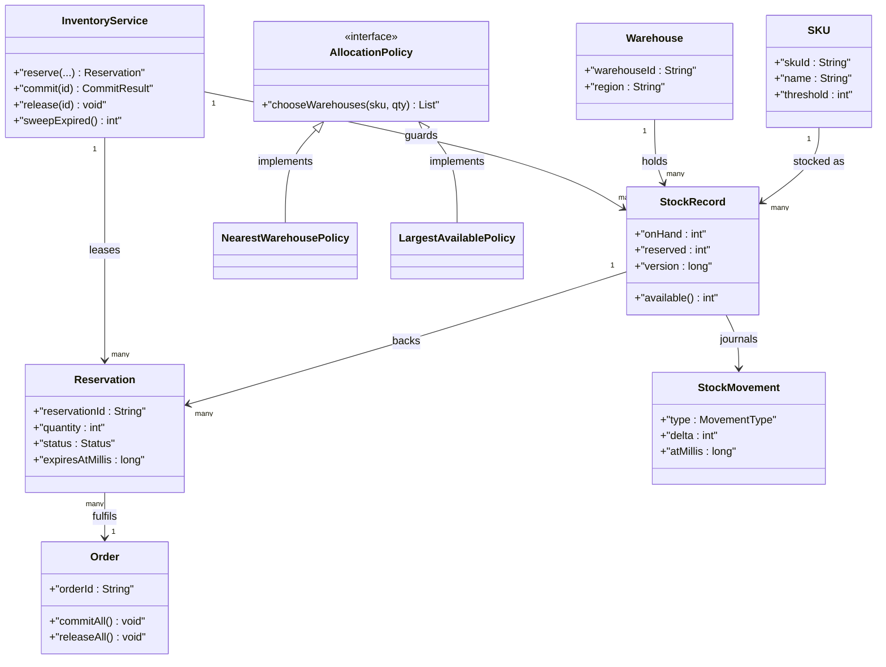
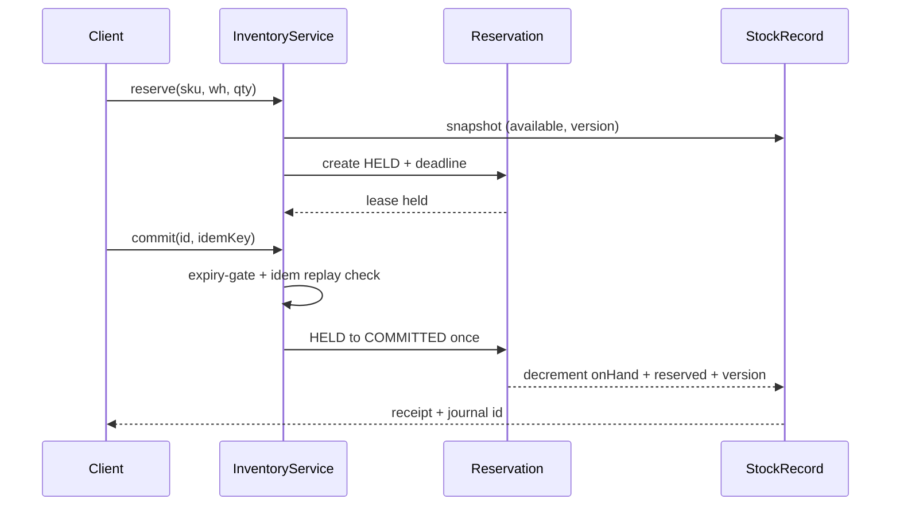

# Inventory Management System

## Blogs and websites

## Medium

## Youtube

- [29. LLD of Inventory Management System | Low Level System Design of Inventory Management System](https://www.youtube.com/watch?v=DDKdMTFNvxc)

## Theory

Design a system tracking stock levels of products across warehouses as orders and restocks flow. Must support low-stock alerts and consistent quantity updates.
Key entities: Product/SKU, Warehouse, StockLevel, PurchaseOrder.
Core operations: add stock, reserve/fulfil order, check availability.

This guide turns that stub into an interview-ready low-level design: you will clarify an intentionally ambiguous multi-warehouse inventory, model clean OOP entities around SKU, Warehouse, Stock, Reservation, and Order, choose reservation-with-TTL plus optimistic locking with versioned stock rows to prevent overselling, handle concurrent reserve-commit-expire races plus idempotent fulfilment and low-stock alerts, and write plain Java 17 code an interviewer can trace on a whiteboard. The emphasis is on object modeling, reservation lifecycle correctness, and quantity integrity — not supply-chain forecasting, payment capture, or shipment routing.

> Scope note: this is LLD (class design, patterns, in-process concurrency). Multi-region replication, demand forecasting, payment processing, and logistics carrier integration belong to HLD and are mentioned only where they constrain the object model (for example, every Reservation carries expiry plus idempotency key plus version so a retried checkout or expired hold never double-decrements stock).

### Topics Covered

1. [Problem Statement](#problem-statement)
2. [Functional / Non-Functional Requirements](#functional--non-functional-requirements)
3. [Core Entities & Class Design](#core-entities--class-design)
4. [Key Design Decisions & Patterns Used](#key-design-decisions--patterns-used)
5. [Concurrency & Edge Cases](#concurrency--edge-cases)
6. [Java 17 Implementation](#java-17-implementation)
7. [Interview Questions and Answers](#interview-questions-and-answers)

---

### Problem Statement

Design a multi-warehouse inventory system that tracks per-SKU quantities across warehouses, supports `addStock`, `checkAvailability`, `reserve`, `commit`, `release`, and `restock` with strict no-oversell guarantees, attaches a time-to-live to every reservation so abandoned carts return stock automatically, and stays correct under concurrent checkouts racing for the last unit.

A `reserve(sku, warehouse, qty)` succeeds only when `available = onHand - reserved >= qty`; it creates a Reservation in HELD state with an expiry deadline and increments reserved count atomically under optimistic version check. A `commit(reservationId)` consumes the hold exactly once, decrementing both on-hand and reserved counts idempotently. A `release` or TTL expiry returns the held quantity to the available pool without touching on-hand. A `restock` or `addStock` increases on-hand and may clear low-stock alerts. Availability reads never block writers: they compute from a versioned snapshot.

**Why this problem exists**

- Real inventory bugs cluster in three places: check-then-act races where two checkouts both see one unit left and both succeed, expired holds that never return stock because expiry and commit disagree on state, and double-commit on retried order placement that decrements twice.
- The domain maps to two classic design ideas: oversell prevention is textbook optimistic locking (version per stock row, compare-and-swap on write), and cart holds are textbook lease semantics (reserve with TTL plus explicit commit or release, exactly like a lock lease).
- Interviewers love it because the happy path takes 10 minutes (map of stock plus reserve minus commit) but the follow-ups (why version instead of synchronized decrement, where does TTL live, how is commit idempotent, how do partial multi-warehouse fulfils work) separate CRUD recall from modeled reasoning.

**Real-life analogues**

- **E-commerce carts (Amazon, Flipkart, Shopify)**: items held for minutes after add-to-cart, released on timeout, committed once on payment success.
- **Warehouse management (WMS) and ERPs**: per-location on-hand plus allocated plus available triplets with purchase-order replenishment and cycle counts.
- **Ticketing and airline seats (BookMyShow, airline PNR holds)**: short-lived seat locks with fare-quote expiry and single-use confirmation codes.

**Clarifying questions to ask in the interview (say these out loud)**

1. Single warehouse or multi-warehouse: can one order split fulfilment across warehouses?
2. SKU versus lot versus serial: is quantity fungible per SKU-location, or tracked per batch and expiry?
3. Reservation TTL model: fixed global hold time, per-order TTL, or per-SKU TTL? Who sweeps expired holds?
4. Oversell tolerance: is zero oversell hard (never sell below zero) or soft (allow backorder with flag)?
5. Commit trigger: is commit on payment success, on order placement, or explicit operator action? Retries possible?
6. Restock source: purchase orders, inter-warehouse transfer, returns, or manual adjustment? Who approves adjustments?
7. Availability semantics: expose on-hand, reserved, and available separately, or only available?
8. Low-stock alerts: threshold per SKU-warehouse, who subscribes, push or poll?
9. Audit needs: is every movement journaled (ledger) or is current snapshot enough?
10. Thread-safety and scale: single service instance with locks, or multi-instance needing version checks? Target orders per second?

**Assumptions for this guide (state these if the interviewer says "decide yourself")**

- Fungible quantity per SKU per warehouse; no lot, batch, or serial tracking in the core model (extension point noted).
- Zero oversell is hard: available quantity never goes negative; backorders are an explicit opt-in flag, default off.
- Fixed reservation TTL (for example 10 minutes) with injectable clock; lazy expiry on access plus explicit `sweepExpired()` the interviewer can call.
- Commit is idempotent via idempotency key plus reservation state machine; double commit returns the first result without re-decrementing.
- Single service instance with monitor-level atomicity plus version checks that survive a future move to multi-instance stores.
- Low-stock threshold per SKU-warehouse; alert fires once per breach crossing, re-arms on restock above threshold plus hysteresis.
- Every mutation appends an immutable `StockMovement` journal entry for audit; snapshot plus journal stay consistent under one lock.



The diagram shows the guarded quantity loop from availability to fulfilment: every commit passes through a TTL-gated hold, expiry returns only the reservation slice, and the low-stock check runs after both terminal states so alerts never miss a breach.

---

### Functional / Non-Functional Requirements

#### Functional requirements (must-have)

1. **SKU and warehouse catalog**
   - Support `createSku`, `createWarehouse`, and per-pair `StockRecord` with on-hand, reserved, available derivation, low-stock threshold, and monotonic version.
   - Reject unknown SKU or warehouse references with typed exceptions; duplicate creation is idempotent by id.
2. **Stock intake and adjustment**
   - `addStock(sku, warehouse, qty)` increases on-hand, bumps version, appends a journal entry, and re-evaluates low-stock state.
   - `adjustStock` for damage, loss, or cycle-count correction requires a reason code and never drives on-hand negative.
3. **Availability read**
   - `checkAvailability(sku, warehouse, qty)` answers from a consistent snapshot without blocking writers; bulk variant answers per-warehouse plus aggregate.
   - Reads distinguish on-hand, reserved, and available so callers never confuse gross with sellable quantity.
4. **Reservation with TTL**
   - `reserve(sku, warehouse, qty, ttl)` succeeds only when available covers qty; creates a HELD reservation with deadline, links it to an idempotency key, and increments reserved under version check.
   - Zero or negative quantity rejected; TTL non-positive means default TTL rather than infinite hold.
5. **Commit exactly once**
   - `commit(reservationId, idempotencyKey)` transitions HELD to COMMITTED once, decrements on-hand and reserved together, and appends a commit journal entry.
   - Replays with the same idempotency key return the stored outcome; replays with a different key on a terminal reservation fail explicitly.
6. **Release and expiry**
   - `release(reservationId)` transitions HELD to RELEASED and returns held quantity to available; terminal states reject transitions.
   - `sweepExpired(now)` transitions past-deadline HELD reservations to EXPIRED in one pass and returns the reclaimed count; lazy expiry on read paths shares the same predicate.
7. **Restock and transfer pipeline**
   - `restock` via purchase order receipt and `transfer(from, to, qty)` as paired decrement plus increment under ordered locking keep global sellable quantity conserved.
   - Transfers reserve at source first so a failed destination leg never loses stock; partial transfer fails atomically.
8. **Alerts and journal facade**
   - `LowStockListener.onLowStock(sku, warehouse, available)` fires once per downward threshold crossing; `StockMovement` journal records every intake, hold, commit, release, expiry, and adjustment.
   - Public API returns result objects or typed exceptions; illegal quantity, unknown id, or version conflict never corrupts counts.

#### Explicitly out of scope (say this to bound the interview)

- Demand forecasting, reorder-point optimization, and supplier selection (the stock record carries threshold and journal history so HLD can add them).
- Payment capture and shipment execution (reservation exposes commit and idempotency seams the order service consumes).
- Lot, batch, expiry-dated, and serialized inventory (quantity is fungible per SKU-location; a lot seam is named as extension).

#### Non-functional requirements (LLD-flavoured)

- **Correctness over speed**: no reservation is ever observable below zero available; version check and state transition run before any counter mutation.
- **O(1) single-location paths by construction**: map lookup by SKU-warehouse key plus version compare, no scans on reserve or commit beyond the sweep pass.
- **Extensibility**: adding a new allocation strategy means adding one `AllocationPolicy` class, not rewriting the service.
- **Testability**: clock, idempotency store, and allocation policy are plain injectable seams drivable with fixed SKUs and a manual clock.
- **Readability**: an interviewer can trace `reserve()` → `version-check()` → `hold()` → `commit-or-expire()` in under five minutes.
- **Determinism**: no randomness, no wall-clock dependence except an injectable clock for TTL and sweep tests.
- **Observability (lightweight)**: every hold, commit, release, expiry, and adjustment appends a journal entry plus an optional alert callback.

| Requirement | Target / policy | Why it matters in LLD |
|---|---|---|
| No oversell under races | Versioned compare-and-swap on reserve and commit | Core correctness invariant |
| Abandoned carts return stock | TTL deadline plus lazy and sweep expiry | Most-tested lifecycle probe |
| Retried checkout never double-decrements | Idempotency key plus terminal-state guard | Where juniors fail |
| Reads never block writers observably | Snapshot computed from versioned fields | Availability latency guard |
| Transfer conserves quantity | Ordered locking plus paired legs | Cross-location leak guard |
| Alerts fire once per breach | Armed flag with hysteresis re-arm | Alert-storm follow-up |

---

### Core Entities & Class Design

The model has four entity groups: the catalog identities callers create, the StockRecord quantity truth per SKU-location, the Reservation lease family for holds with TTL, and the Order plus journal plus alert observability seam. Keep behaviour with the data it guards: stock records own quantity math and version checks, reservations own lifecycle transitions, the service owns atomicity and allocation, and movements own audit truth.

#### Value objects and supporting types (the vocabulary of the domain)

- `SKU`: catalog identity — `skuId`, `name`, `lowStockThresholdDefault`, `backorderAllowed`; immutable once created, looked up by id.
- `Warehouse`: location identity — `warehouseId`, `name`, `region`; immutable once created, allocation target for splits.
- `StockKey`: composite value object of `(skuId, warehouseId)` used as the map key so every quantity row has exactly one address.
- `Clock`: millis source interface — `SystemClock` for production, `ManualClock` for tests with `advance(millis)`; every TTL comparison goes through it.
- `ReservationStatus`: enum `HELD`, `COMMITTED`, `RELEASED`, `EXPIRED` with terminal-state predicate guarding every transition.
- `StockMovement`: immutable journal entry — `movementId`, `skuId`, `warehouseId`, `type` (INTAKE, HOLD, COMMIT, RELEASE, EXPIRE, ADJUST, TRANSFER_OUT, TRANSFER_IN), `delta`, `resultingOnHand`, `resultingReserved`, `atMillis`.
- `LowStockListener`: callback `onLowStock(skuId, warehouseId, available)` fired once per downward threshold crossing.
- `InventoryException` family: `UnknownSkuException`, `UnknownWarehouseException`, `InsufficientStockException`, `ReservationStateException`, `VersionConflictException` keep failure modes typed and testable.

#### SKU, warehouses, and stock

- `SKU`: owns identity plus default threshold; methods `skuId()`, `name()`; no quantity behaviour.
- `Warehouse`: owns identity plus region used by allocation ordering; methods `warehouseId()`, `region()`.
- `StockRecord`: the quantity truth per SKU-location — `onHand`, `reserved`, `version`, `lowThreshold`, `alertArmed`; methods `available()` returning `onHand - reserved`, `canReserve(qty)`, `applyReserve(qty)` incrementing reserved plus version, `applyCommit(qty)` decrementing both plus version, `applyRelease(qty)` decrementing reserved plus version, `applyIntake(qty)` incrementing on-hand plus version. Every mutator checks non-negativity before touching fields.
- `Reservation`: the lease — `reservationId`, `skuId`, `warehouseId`, `quantity`, `status`, `expiresAtMillis`, `idempotencyKey`, `version`; methods `isExpired(now)`, `markCommitted()`, `markReleased()`, `markExpired()` each rejecting terminal-to-terminal transitions.
- `Order`: caller-side aggregate — `orderId`, list of `OrderLine(skuId, warehouseId, quantity, reservationId)`; methods `isFullyReserved()`, `commitAll(service)`, `releaseAll(service)` so split fulfilment across warehouses is explicit.
- `AllocationPolicy` (interface): `chooseWarehouses(skuId, qty, candidates)` returning ordered allocation slices; `NearestWarehousePolicy` prefers same-region stock, `LargestAvailablePolicy` drains the fullest location first.
- `IdempotencyStore`: map from idempotency key to stored commit outcome so replays return without re-decrementing.

#### Reserve, commit, and alert pipeline

- Reserve pipeline inside `reserve()`: snapshot stock row, lazy-expire intersecting holds, test `available >= qty`, version compare-and-swap, create HELD reservation with deadline, append HOLD journal entry.
- Commit pipeline inside `commit()`: look up reservation, lazy-expiry gate (expired HELD commits fail), idempotency replay check, HELD-to-COMMITTED transition, paired on-hand plus reserved decrement under version check, COMMIT journal entry, low-stock evaluation.
- Sweep pipeline inside `sweepExpired()`: snapshot reservation ids under lock, test `isExpired(clock.now())` on HELD rows only, transition to EXPIRED, return held quantity to available, append EXPIRE entries, fire no alert on reclaim (alert re-arms silently).
- Observer seam: `LowStockListener.onLowStock` forPagerDuty or email hooks without coupling the service to notification transports.
- Stats pipeline: every return path appends exactly one journal entry — hold, commit, release, expiry, intake, or adjustment — so audit replay reproduces the snapshot.



The diagram shows containment (service to stock rows), lease (stock to reservations), aggregation (reservations to order lines), delegation (service to allocation policy), and observation (stock to journal and alert) — the five relationships to name in the interview.

**Key relationships and cardinalities**

- SKU 1—0..N StockRecord rows (one per warehouse stocking it); Warehouse 1—0..N StockRecord rows (one per SKU stored there).
- StockRecord 1—0..N Reservation holds at a time; sum of HELD quantities on live reservations always equals `reserved`, never exceeds `onHand` when backorders are off.
- Reservation N—1 Order fulfilment; one order line maps to exactly one reservation, while one order aggregates many lines across warehouses.
- InventoryService 1—1 AllocationPolicy at a time; policy swap changes split preference without touching reserve or commit math.
- StockRecord 1—0..\* StockMovement entries (each mutation appends one immutable journal row; journal never mutates or deletes).

**Where behaviour lives (tell the interviewer)**

- Quantity truth lives in the stock record: `available()` derives `onHand - reserved`, and every mutator validates before writing so negative availability is unrepresentable.
- Lease truth lives in the reservation: `isExpired(now)` compares deadline against the clock, and status transitions reject terminal rewrites, so commit and sweep cannot disagree on liveness.
- Atomicity truth lives in the service: snapshot, version check, counter mutation, journal append, and alert evaluation happen under one monitor per stock row.
- Split truth lives in the allocation policy: warehouse ordering and slice sizing vary by strategy while reserve-per-slice reuses the single-location path.
- Replay truth lives in the idempotency store: first commit stores its outcome, late duplicates return the stored receipt instead of re-running the decrement.

---

### Key Design Decisions & Patterns Used

#### Decision 1 — Reservation-with-TTL plus optimistic locking against overselling (the hook)

Every sellable unit passes through a HELD lease with a deadline before it can be consumed, and every quantity write carries a version compare-and-swap. `reserve` reads `(available, version)`, checks `available >= qty`, then writes only if the version is unchanged; a lost race retries or fails with `VersionConflictException` instead of double-promising the last unit. Say the trade-off verbatim: a coarse `synchronized` decrement also prevents oversell on one instance but serializes every checkout and teaches nothing about multi-instance stores, while the version field ports directly to a database `UPDATE ... WHERE version = ?` later. Name the invariant: `reserved` equals the sum of live HELD quantities and `available` never goes negative observably.

#### Decision 2 — Available derived, never stored

`available` is always computed as `onHand - reserved`, never persisted as a third counter. Storing it invites triple-update skew where intake bumps on-hand but forgets available; deriving it makes the triplet self-consistent by construction. Intake touches on-hand only, holds touch reserved only, commits touch both together, and every read path calls the same `available()` method. State the audit corollary: the journal records deltas plus resulting pairs, so replaying deltas from zero reproduces both snapshot fields exactly.

#### Decision 3 — TTL as reservation predicate plus dual reclamation

Expiry is a per-reservation `expiresAtMillis` tested by `isExpired(now)` on every commit, release, and availability path (lazy) plus a `sweepExpired()` pass over HELD snapshots (eager). Lazy keeps the commit path exact with zero background threads; the sweep bounds leaked holds for carts nobody revisits. Say the state rule verbatim — only HELD reservations can expire, and expiry returns reserved quantity without touching on-hand — because decrementing on-hand on expiry is the classic grading trap. The injectable `Clock` makes TTL deterministic: tests advance a manual clock instead of sleeping.

#### Decision 4 — Single-monitor atomicity per stock row with alerts outside the lock

`reserve`, `commit`, `release`, `addStock`, and `adjustStock` synchronize on the service with per-`StockKey` ordering; snapshot plus version check plus mutation plus journal append share the same critical section so two racing reserves for the last unit produce exactly one HELD lease. Listeners fire after unlock with immutable sku-warehouse-available triples, so a slow alert webhook cannot deadlock the next checkout. State explicitly that reservations assume the service lock is held during transitions — they carry no locks of their own, which keeps lock ordering trivial.

#### Decision 5 — Idempotent commit via key plus state machine

`commit(reservationId, idempotencyKey)` checks the idempotency store first, then the reservation status: HELD proceeds, COMMITTED with the same key returns the stored receipt, COMMITTED with a different key fails loudly, and RELEASED or EXPIRED always fails. The receipt records resulting on-hand and journal id so retries are byte-identical. Say the scope sentence: dedup is per reservation plus key, not global, so distinct checkouts still commit in parallel while retried webhooks collapse.

#### Decision 6 — Transfers as paired legs with ordered locking, alerts with hysteresis

- Inter-warehouse `transfer(from, to, qty)` locks the two stock rows in `StockKey` sort order (deadlock-free), reserves at source, then intakes at destination; any failure releases the source hold so global sellable quantity is conserved.
- Low-stock alerts use an armed flag with hysteresis: the alert fires on the downward crossing of threshold and re-arms only when restock pushes available above `threshold + hysteresisGap`, so hovering at the boundary never spams.
- Adjustments require reason codes and append ADJUST journal entries with operator id, keeping cycle counts auditable without a separate table.
- Backorders are a per-SKU flag defaulting to off; when on, `canReserve` permits the hold and marks the reservation BACKORDERED-adjacent instead of failing — named as configuration, not default behaviour.

#### Patterns used (say these names out loud)

| Pattern | Where | Why |
|---|---|---|
| State Machine | `Reservation` HELD to COMMITTED versus RELEASED versus EXPIRED | Illegal transitions become compile-time-visible rejects |
| Optimistic Locking (light) | `StockRecord.version` compare-and-swap on every write | No-oversell invariant without coarse global lock |
| Lease (light) | `Reservation` with TTL deadline plus sweep | Abandoned holds self-heal without operator action |
| Strategy | `AllocationPolicy` family (nearest, largest-available) | Split preference varies independently of reserve math |
| Facade | `InventoryService` over rows, leases, journal, alerts | One interview-traceable API for all flows |
| Observer (light) | `LowStockListener` threshold notifications | Alerting reacts without service coupling |
| Memento (light) | `StockMovement` immutable journal entries | Audit replay reproduces any snapshot |
| Idempotency Key | Commit receipts keyed by caller key | Retried checkouts collapse to one decrement |

**SOLID mapping (one line each for the "which principles?" follow-up)**

- Single Responsibility: stock rows do quantity math, reservations do lifecycle, service does atomicity, journal does audit.
- Open/Closed: new allocation strategy or alert sink equals a new class, zero edits to `reserve` or `commit`.
- Liskov: any `AllocationPolicy` substitutes without breaking the reserve-per-slice pipeline.
- Interface Segregation: small `AllocationPolicy`, `Clock`, `LowStockListener`, and idempotency contracts instead of one fat inventory interface.
- Dependency Inversion: `InventoryService` depends on clock and policy interfaces; tests inject a manual clock plus a fixed split order.

---

### Concurrency & Edge Cases

#### The concurrency story (the senior half of the interview)

One SKU-location has one sellable number, so the design centers on versioned compare-and-swap plus lease expiry plus idempotent commit. Three mechanisms from innermost to outermost:

1. **Versioned compare-and-swap on every quantity write.** `reserve` and `commit` snapshot `(available, version)`, validate, then write only if the version is unchanged, bumping it on success. A lost race fails with `VersionConflictException` and the caller retries the read-validate-write loop instead of double-promising the last unit. The same field ports to a future `UPDATE ... WHERE version = ?` without redesign.
2. **Lease-gated consumption with lazy plus sweep expiry.** No path decrements on-hand without holding a live HELD lease: commits gate on `isExpired`, releases and sweeps return only the reserved slice, and the eager sweep reclaims carts nobody revisits. Lazy keeps commit exact with zero threads; the sweep bounds memory and leaked holds.
3. **Idempotent terminal transitions with observers outside the lock.** Commit checks the idempotency store before the state machine, stores its receipt on success, and fires low-stock alerts after unlock with immutable triples, so retried webhooks and slow callbacks can neither double-decrement nor deadlock the next checkout.



The diagram shows the lease ordering in time: both the version check and the expiry gate complete before any counter mutation, and the journal plus receipt publish after the state transition so replays and audits never see a half-committed hold.

**Why not `synchronized` decrement alone?** A bare monitor around `if (available >= qty) reserved += qty` prevents oversell on one instance but serializes every checkout through one lock, teaches nothing about multi-instance stores, and still leaves expiry-versus-commit and double-commit unsolved. Version checks express the invariant as data (compare-and-swap) rather than as thread ownership, so the same reasoning survives a move to a database row version. Service-level exclusion plus row versions gives both atomicity and portability: exclusion stops in-process races, versions stop cross-instance races later.

**Post-access evaluation rule (say this verbatim): expire, then validate-or-replay, then transition-and-decrement, then journal-and-alert.** After every reservation touch the service tests TTL first, routes to idempotency replay or state validation second, runs the versioned counter mutation third, and only then appends the journal entry and evaluates alerts. Expired plus zero live holds is a failed commit with expiration count, never a silent decrement.

#### Edge cases table (pick 4–5 to recite, keep the rest as backup)

| # | Edge case | Handling |
|---|---|---|
| 1 | Two checkouts race for the last unit | Both snapshot version V; first commits and bumps to V+1, second fails version check and returns InsufficientStock or retries |
| 2 | Retried webhook commits twice | First stores receipt under idempotency key; replay returns stored receipt, different key on COMMITTED fails loudly |
| 3 | Cart abandoned past TTL | Lazy gate fails the late commit; sweep transitions HELD to EXPIRED and returns reserved slice to available |
| 4 | Release of already-committed reservation | Rejected with ReservationStateException; counters untouched, journal records the rejected attempt only in caller logs |
| 5 | Zero or negative quantity | Rejected with IllegalArgumentException before any version read; no journal entry appended |
| 6 | Unknown SKU or warehouse | Typed UnknownSku or UnknownWarehouse exception on catalog lookup; no stock row created implicitly |
| 7 | Restock racing a reserve | Serialized on the row monitor; reserve sees pre- or post-intake snapshot, never a torn on-hand value |
| 8 | Transfer with destination failure | Source hold released on destination leg failure; global sellable quantity conserved, TRANSFER journal pair absent |
| 9 | Two-row transfer deadlock | Rows locked in StockKey sort order always; opposite-direction transfers serialize identically |
| 10 | Alert hovering at threshold | Armed flag plus hysteresis gap; re-fire only after restock above threshold plus gap, never on every unit |
| 11 | Sweep racing a commit | Same monitor; commit wins if first (sweep skips COMMITTED), sweep wins if first (commit fails as EXPIRED) |
| 12 | Clock jumps forward (mass hold death) | Lazy path expires per reservation on next touch; sweep reclaims the rest in one pass with EXPIRE entries |
| 13 | Multi-warehouse split with one leg short | Per-slice reserves attempted in policy order; short leg fails the whole order atomically, prior slices released |
| 14 | Adjustment driving on-hand negative | Rejected before version bump; damage beyond stock requires intake correction first, never silent clamp |
| 15 | Journal versus snapshot divergence | Journal appended inside the same critical section as counters; replay from zero reproduces both fields exactly |

---

### Java 17 Implementation

All classes below are plain Java 17 (no frameworks, records for immutable snapshots, enums for lifecycle, interfaces for policy seams). Versioned stock rows give no-oversell compare-and-swap, reservations carry TTL leases, and `InventoryService` synchronizes the commit path. Each block is followed by its explanation and the pattern it demonstrates.

#### 1. Identities, clock, and the allocation Strategy family

The foundation is a millis seam plus typed failures plus one split strategy per policy with explicit ordering hooks.

```java
import java.util.*;

// Millis source: production uses wall clock, tests advance manually.
interface Clock { long now(); }
final class SystemClock implements Clock {
    public long now() { return System.currentTimeMillis(); }
}
final class ManualClock implements Clock {
    private long t;
    ManualClock(long start) { t = start; }
    public long now() { return t; }
    public void advance(long dMillis) { t += dMillis; }
}

class InventoryException extends RuntimeException {
    InventoryException(String m) { super(m); }
}
final class UnknownSkuException extends InventoryException {
    UnknownSkuException(String m) { super(m); }
}
final class UnknownWarehouseException extends InventoryException {
    UnknownWarehouseException(String m) { super(m); }
}
final class InsufficientStockException extends InventoryException {
    InsufficientStockException(String m) { super(m); }
}
final class ReservationStateException extends InventoryException {
    ReservationStateException(String m) { super(m); }
}
final class VersionConflictException extends InventoryException {
    VersionConflictException(String m) { super(m); }
}

record SKU(String skuId, String name) {}
record Warehouse(String warehouseId, String name, String region) {}
record StockKey(String skuId, String warehouseId) implements Comparable<StockKey> {
    public int compareTo(StockKey o) {
        int c = skuId.compareTo(o.skuId);
        return c != 0 ? c : warehouseId.compareTo(o.warehouseId);
    }
}

// Strategy: split preference varies; service calls one method per order.
interface AllocationPolicy {
    List<String> orderWarehouses(String skuId, int qty,
            Map<String, Integer> availableByWarehouse);
}
final class LargestAvailablePolicy implements AllocationPolicy {
    public List<String> orderWarehouses(String skuId, int qty,
            Map<String, Integer> avail) {
        var ids = new ArrayList<>(avail.keySet());
        ids.sort((a, b) -> Integer.compare(avail.get(b), avail.get(a)));
        return ids;
    }
}
final class FixedOrderPolicy implements AllocationPolicy {
    private final List<String> order;
    FixedOrderPolicy(List<String> order) { this.order = List.copyOf(order); }
    public List<String> orderWarehouses(String skuId, int qty,
            Map<String, Integer> avail) {
        var out = new ArrayList<>(order);
        out.retainAll(avail.keySet());
        return out;
    }
}
```

Explanation: `Clock` removes wall-clock dependence so TTL tests advance time without sleeping. Typed exceptions keep oversell, unknown catalog, bad state, and lost races distinguishable in tests instead of one generic failure. This block demonstrates the Strategy pattern: each allocation policy varies warehouse ordering independently behind one method while the service reuses the single-location reserve path per slice.

#### 2. Versioned stock rows plus reservation state machine (the hook)

Quantity math and lease transitions live with the data they guard; the service only orchestrates lock plus version plus journal around them.

```java
import java.util.*;

// Quantity truth per SKU-location: available is DERIVED, never stored.
final class StockRecord {
    final String skuId, warehouseId;
    int onHand;
    int reserved;
    long version;
    int lowThreshold;
    boolean alertArmed = true;

    StockRecord(String skuId, String warehouseId, int onHand, int lowThreshold) {
        this.skuId = skuId; this.warehouseId = warehouseId;
        this.onHand = onHand; this.lowThreshold = lowThreshold;
    }
    int available() { return onHand - reserved; }
    boolean canReserve(int qty) { return qty > 0 && available() >= qty; }

    void applyReserve(int qty, long expectVersion) {
        checkVersion(expectVersion);
        if (!canReserve(qty)) throw new InsufficientStockException(
            "need=" + qty + " avail=" + available() + " @" + skuId);
        reserved += qty; version++;
    }
    void applyCommit(int qty, long expectVersion) {
        checkVersion(expectVersion);
        if (qty <= 0 || qty > reserved || qty > onHand)
            throw new ReservationStateException("bad commit qty=" + qty);
        reserved -= qty; onHand -= qty; version++;
    }
    void applyRelease(int qty, long expectVersion) {
        checkVersion(expectVersion);
        if (qty <= 0 || qty > reserved)
            throw new ReservationStateException("bad release qty=" + qty);
        reserved -= qty; version++;
    }
    void applyIntake(int qty, long expectVersion) {
        checkVersion(expectVersion);
        if (qty <= 0) throw new IllegalArgumentException("qty <= 0");
        onHand += qty; version++;
    }
    private void checkVersion(long expect) {
        if (version != expect) throw new VersionConflictException(
            "expected v" + expect + " actual v" + version);
    }
}

enum ReservationStatus { HELD, COMMITTED, RELEASED, EXPIRED }

// Lease: HELD is the only live state; every exit is terminal and once-only.
final class Reservation {
    final String reservationId, skuId, warehouseId, idempotencyKey;
    final int quantity;
    final long expiresAtMillis;
    ReservationStatus status = ReservationStatus.HELD;

    Reservation(String id, String sku, String wh, int qty,
            long expiresAt, String idemKey) {
        reservationId = id; skuId = sku; warehouseId = wh;
        quantity = qty; expiresAtMillis = expiresAt; idempotencyKey = idemKey;
    }
    boolean isExpired(long now) {
        return status == ReservationStatus.HELD && now >= expiresAtMillis;
    }
    boolean isTerminal() { return status != ReservationStatus.HELD; }
    void markCommitted() { transitionTo(ReservationStatus.COMMITTED); }
    void markReleased() { transitionTo(ReservationStatus.RELEASED); }
    void markExpired() { transitionTo(ReservationStatus.EXPIRED); }
    private void transitionTo(ReservationStatus next) {
        if (isTerminal()) throw new ReservationStateException(
            "already " + status + " cannot go " + next);
        status = next;
    }
}

enum MovementType { INTAKE, HOLD, COMMIT, RELEASE, EXPIRE, ADJUST, TRANSFER_OUT, TRANSFER_IN }

record StockMovement(long movementId, String skuId, String warehouseId,
        MovementType type, int delta, int resultingOnHand,
        int resultingReserved, long atMillis) {}

interface LowStockListener {
    void onLowStock(String skuId, String warehouseId, int available);
}
```

Explanation: deriving `available()` instead of storing it makes the on-hand plus reserved pair self-consistent by construction — intake, hold, commit, and release each touch at most two fields through one version gate. The reservation state machine rejects terminal-to-terminal rewrites, which is exactly why double commit and commit-after-expiry fail loudly instead of double-decrementing. This block demonstrates State plus Optimistic Locking: lifecycle guards the when, the version guards the who-wins.

#### 3. Service facade with reserve, idempotent commit, sweep, and demo

`InventoryService` runs the expire, version, transition, journal, and alert pipeline with per-row atomicity; this is the full checkout path to trace on the whiteboard.

```java
import java.util.*;
import java.util.concurrent.atomic.AtomicLong;

record CommitReceipt(String reservationId, String idempotencyKey,
        int quantity, long journalId) {}

public class InventoryService {
    private final Map<String, SKU> skus = new HashMap<>();
    private final Map<String, Warehouse> warehouses = new HashMap<>();
    private final Map<StockKey, StockRecord> stock = new HashMap<>();
    private final Map<String, Reservation> reservations = new HashMap<>();
    private final Map<String, CommitReceipt> receipts = new HashMap<>();
    private final List<StockMovement> journal = new ArrayList<>();
    private final List<LowStockListener> listeners = new ArrayList<>();
    private final AtomicLong movementSeq = new AtomicLong(1);
    private final AtomicLong reservationSeq = new AtomicLong(1);
    private final Clock clock;
    private final long defaultTtlMillis;
    private final int hysteresisGap;

    public InventoryService(Clock clock, long defaultTtlMillis, int hysteresisGap) {
        this.clock = clock;
        this.defaultTtlMillis = defaultTtlMillis;
        this.hysteresisGap = hysteresisGap;
    }
    public void addListener(LowStockListener l) { listeners.add(l); }
    public void createSku(String id, String name) { skus.put(id, new SKU(id, name)); }
    public void createWarehouse(String id, String name, String region) {
        warehouses.put(id, new Warehouse(id, name, region));
    }
    public void addStock(String sku, String wh, int qty, int lowThreshold) {
        var key = new StockKey(sku, wh);
        synchronized (this) {
            requireCatalog(sku, wh);
            if (qty <= 0) throw new IllegalArgumentException("qty <= 0");
            var rec = stock.get(key);
            if (rec == null) {
                rec = new StockRecord(sku, wh, 0, lowThreshold);
                stock.put(key, rec);
            }
            rec.applyIntake(qty, rec.version);
            append(MovementType.INTAKE, rec, qty);
            evaluateAlert(rec);
        }
    }
    // Reserve: snapshot, lazy-expire gate, version CAS, HELD lease publish.
    public synchronized Reservation reserve(String sku, String wh,
            int qty, long ttlMillis, String idemKey) {
        requireCatalog(sku, wh);
        if (qty <= 0) throw new IllegalArgumentException("qty <= 0");
        var key = new StockKey(sku, wh);
        var rec = stock.get(key);
        if (rec == null) throw new InsufficientStockException("no stock row @" + key);
        long v = rec.version;
        rec.applyReserve(qty, v); // throws Insufficient or VersionConflict
        long ttl = ttlMillis <= 0 ? defaultTtlMillis : ttlMillis;
        var r = new Reservation("R" + reservationSeq.getAndIncrement(),
            sku, wh, qty, clock.now() + ttl, idemKey);
        reservations.put(r.reservationId, r);
        append(MovementType.HOLD, rec, -qty);
        return r;
    }
    // Commit exactly once: expiry gate, replay check, terminal transition.
    public synchronized CommitReceipt commit(String reservationId, String idemKey) {
        var r = reservations.get(reservationId);
        if (r == null) throw new ReservationStateException("unknown " + reservationId);
        var hit = receipts.get(idemKey);
        if (hit != null) return hit; // retried webhook collapses here
        if (r.isExpired(clock.now())) {
            expireUnderLock(r); // late commit becomes an expiry, never a decrement
            throw new ReservationStateException("reservation expired " + reservationId);
        }
        if (r.isTerminal()) throw new ReservationStateException(
            "already " + r.status + " " + reservationId);
        var rec = stock.get(new StockKey(r.skuId, r.warehouseId));
        rec.applyCommit(r.quantity, rec.version);
        r.markCommitted();
        var m = append(MovementType.COMMIT, rec, -r.quantity);
        var receipt = new CommitReceipt(r.reservationId, idemKey, r.quantity, m.movementId());
        receipts.put(idemKey, receipt);
        evaluateAlert(rec);
        return receipt;
    }
    public synchronized void release(String reservationId) {
        var r = reservations.get(reservationId);
        if (r == null) throw new ReservationStateException("unknown " + reservationId);
        if (r.isExpired(clock.now())) { expireUnderLock(r); return; }
        if (r.isTerminal()) throw new ReservationStateException("already " + r.status);
        var rec = stock.get(new StockKey(r.skuId, r.warehouseId));
        rec.applyRelease(r.quantity, rec.version);
        r.markReleased();
        append(MovementType.RELEASE, rec, r.quantity);
    }
    public synchronized int sweepExpired() { // eager reclaim returns reclaimed holds
        int n = 0;
        for (var id : new ArrayList<>(reservations.keySet())) {
            var r = reservations.get(id);
            if (r != null && r.isExpired(clock.now())) { expireUnderLock(r); n++; }
        }
        return n;
    }
    public synchronized int checkAvailability(String sku, String wh) {
        var rec = stock.get(new StockKey(sku, wh));
        if (rec == null) return 0;
        return Math.max(0, rec.available());
    }
    private void expireUnderLock(Reservation r) {
        if (r.isTerminal()) return;
        var rec = stock.get(new StockKey(r.skuId, r.warehouseId));
        rec.applyRelease(r.quantity, rec.version); // returns slice, on-hand untouched
        r.markExpired();
        append(MovementType.EXPIRE, rec, r.quantity);
    }
    private StockMovement append(MovementType t, StockRecord rec, int delta) {
        var m = new StockMovement(movementSeq.getAndIncrement(),
            rec.skuId, rec.warehouseId, t, delta, rec.onHand, rec.reserved, clock.now());
        journal.add(m);
        return m;
    }
    private void evaluateAlert(StockRecord rec) {
        boolean breach = rec.available() <= rec.lowThreshold;
        LowStockListener[] snap;
        synchronized (this) { snap = listeners.toArray(new LowStockListener[0]); }
        if (breach && rec.alertArmed) {
            rec.alertArmed = false; // fire once per downward crossing
            for (var l : snap) {
                try { l.onLowStock(rec.skuId, rec.warehouseId, rec.available()); }
                catch (RuntimeException ignored) {}
            }
        } else if (!breach && rec.available() > rec.lowThreshold + hysteresisGap) {
            rec.alertArmed = true; // re-arm only past hysteresis band
        }
    }
    private void requireCatalog(String sku, String wh) {
        if (!skus.containsKey(sku)) throw new UnknownSkuException(sku);
        if (!warehouses.containsKey(wh)) throw new UnknownWarehouseException(wh);
    }
}

// Demo: last-unit race decided by version, abandoned cart swept, retry collapsed.
class InventoryDemo {
    public static void main(String[] args) {
        var clock = new ManualClock(1_000);
        var svc = new InventoryService(clock, 600_000, 2);
        svc.addListener((s, w, a) -> System.out.println("LOW-STOCK " + s + "@" + w + " avail=" + a));
        svc.createSku("SKU-1", "Widget");
        svc.createWarehouse("W-1", "Mumbai", "west");
        svc.addStock("SKU-1", "W-1", 5, 2);
        var r1 = svc.reserve("SKU-1", "W-1", 3, 60_000, "cart-1");
        System.out.println("held=" + r1.reservationId + " avail=" + svc.checkAvailability("SKU-1", "W-1"));
        System.out.println(svc.commit(r1.reservationId, "cart-1")); // COMMITTED once
        System.out.println(svc.commit(r1.reservationId, "cart-1")); // replay: same receipt
        var r2 = svc.reserve("SKU-1", "W-1", 2, 1_000, "cart-2");
        clock.advance(2_000); // abandon cart-2 past TTL
        System.out.println("swept=" + svc.sweepExpired()); // reclaims r2 slice
        System.out.println("avail=" + svc.checkAvailability("SKU-1", "W-1"));
    }
}
```

Explanation: `commit` is the whole interview in one method — expiry gate, idempotency replay, terminal guard, versioned paired decrement, receipt store, alert evaluation. `expireUnderLock` is the shared TTL predicate so commit, release, and sweep cannot disagree on liveness, and it deliberately calls `applyRelease` (reserved only) so expiry never touches on-hand. Because the version check and the state transition share one monitor, two racing reserves for the last unit produce exactly one HELD lease, which is the Facade plus Idempotency-Key shape: fixed pipeline skeleton, once-only commit hook.

**How to extend (name these without building them)**

- Multi-warehouse split checkout: loop `AllocationPolicy.orderWarehouses` slices calling `reserve` per slice, releasing prior slices on any short leg for atomicity.
- Lot and batch tracking: add per-lot `StockRecord` children under the SKU-location row with FIFO-by-expiry allocation; version stays on the parent.
- Write-behind to a database: persist journal rows via a listener-backed store writer plus `UPDATE stock SET ... WHERE version = ?` for cross-instance CAS.

---

### Interview Questions and Answers

1. **Beginner: walk me through the classes in your inventory system.**
   Answer: `SKU` and `Warehouse` catalog identities, `StockRecord` quantity truth with on-hand plus reserved plus version, `Reservation` TTL lease with HELD to COMMITTED versus RELEASED versus EXPIRED states, `Order` aggregating lines across warehouses, `AllocationPolicy` for split preference, immutable `StockMovement` journal, `LowStockListener` alerts, and the `InventoryService` facade over all of it.

2. **Beginner: what is the difference between on-hand, reserved, and available?**
   Answer: on-hand is physical units in the building, reserved is units promised to live HELD carts, and available is derived as on-hand minus reserved. Only available gates new reserves. Expiry returns the reserved slice without touching on-hand, while commit decrements both together, which keeps the triplet self-consistent.

3. **Beginner: what is a reservation and why does it have a TTL?**
   Answer: a reservation is a time-boxed promise of units to one checkout so two carts cannot both consume the last unit. The TTL bounds abandonment: carts that never check out expire automatically and return stock. Without TTL every abandoned cart would leak sellable units until an operator intervened.

4. **Junior: how does optimistic locking prevent overselling?**
   Answer: every quantity write snapshots the row version and writes only if it is unchanged, bumping it on success. Two racers read version V for the last unit; the first writes and moves to V+1, the second fails the check and retries or reports insufficient stock. The same field ports to a database conditional update for multi-instance deployments.

5. **Junior: lazy expiry versus sweep — why both?**
   Answer: lazy gates every commit, release, and availability path so no expired hold is ever consumed even with zero background work. The sweep bounds leaked holds for carts nobody revisits by reclaiming all past-deadline HELD rows in one pass. Both share `isExpired(now)` so they cannot disagree on liveness.

6. **Junior: how is commit idempotent?**
   Answer: the caller passes an idempotency key stored with the first commit receipt. Replays with the same key return the stored receipt without touching counters, while a different key on a terminal reservation fails loudly. Expired HELD rows fail as expired rather than committing, so late webhooks can neither double-decrement nor resurrect dead carts.

7. **Mid: how do concurrent reserves for the last unit stay correct?**
   Answer: snapshot, version check, counter mutation, and journal append share one monitor per stock row, so two racing reserves produce exactly one HELD lease. The loser gets a version conflict or insufficient-stock failure and retries cleanly. Availability reads compute from the same versioned fields, so they never observe negative stock.

8. **Mid: how do multi-warehouse split orders and transfers stay atomic?**
   Answer: split checkout reserves per-warehouse slices in allocation-policy order and releases prior slices if any leg falls short, so partial orders never strand holds. Transfers lock both rows in StockKey sort order to avoid deadlock, hold at source first, then intake at destination, conserving global sellable quantity on every outcome.

9. **Senior: why derive available instead of storing it, and how do you audit?**
   Answer: storing available as a third counter invites triple-update skew; deriving it from on-hand minus reserved makes inconsistency unrepresentable. Every mutation appends an immutable journal entry inside the same critical section, so replaying deltas from zero reproduces both snapshot fields and any divergence is immediately detectable.

10. **Senior: how do you test races, TTL, and idempotency without sleeping or flakiness?**
    Answer: inject `ManualClock` and script a two-thread last-unit reserve asserting exactly one HELD lease plus one version conflict, advance past TTL and assert lazy commit failure plus sweep reclaim count, and double-commit with the same key asserting byte-identical receipts. Journal assertions verify exact HOLD, COMMIT, and EXPIRE deltas per operation.
