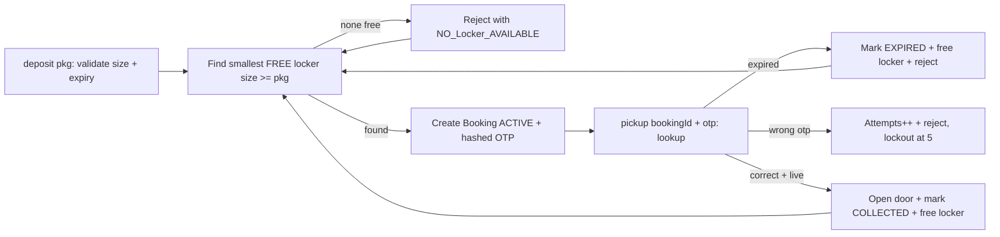
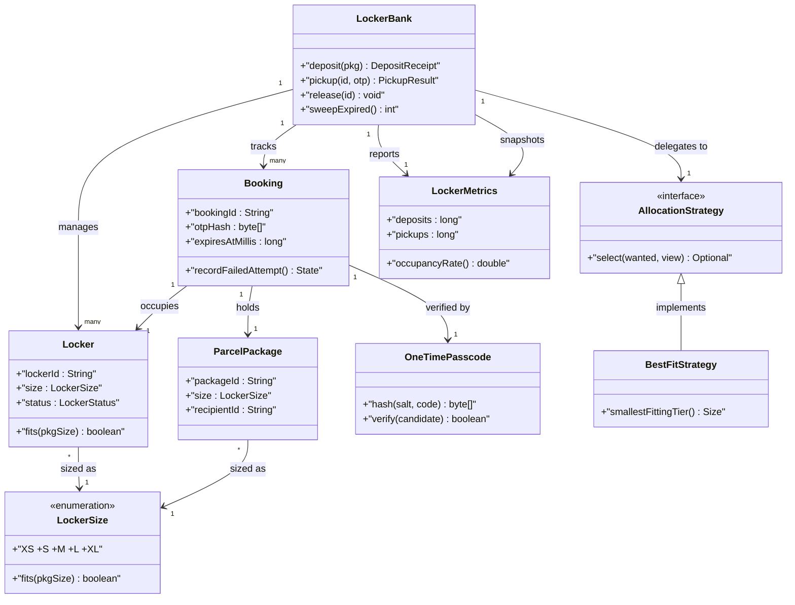
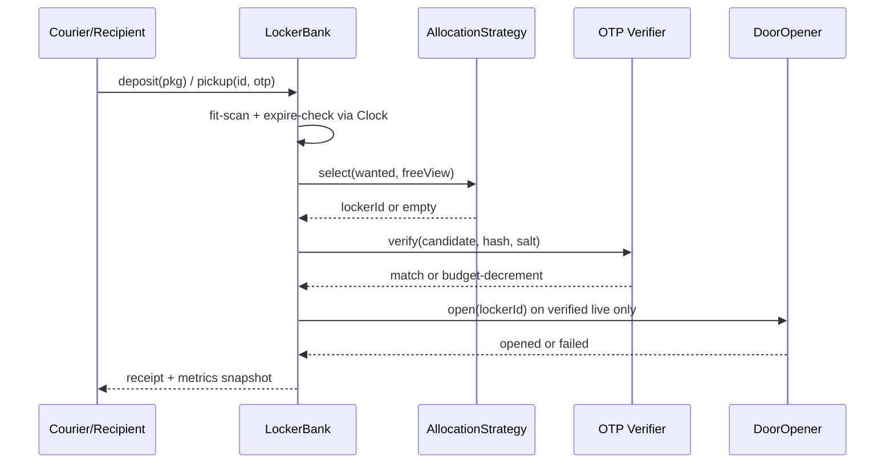

# Design Locker Allocation System

## Blogs and websites

- [Locker Allocation System](https://www.techprep.app/problems/locker-allocation-system?topic=low-level-system-design)

## Medium

## Youtube

## Theory

Design allocation of parcel lockers by size with pickup codes/OTPs. Must match package size to a free locker and release it on collection or expiry.
Key entities: Locker (size/status), Package, Allocation, AccessCode.
Core operations: allocate locker, verify code, release locker.

This guide turns that stub into an interview-ready low-level design: you will clarify an intentionally ambiguous parcel-locker bank, model clean OOP entities around Locker, LockerSize, ParcelPackage, Booking, and OneTimePasscode, choose size-matching allocation (best-fit with upgrade policy) behind a pluggable AllocationStrategy, gate every pickup behind a hashed OTP with attempt limits plus booking expiry, and write plain Java 17 code an interviewer can trace on a whiteboard. The emphasis is on object modeling, best-fit mechanics, and pickup-correctness — not last-mile routing, carrier billing, or distributed locker networks.

> Scope note: this is LLD (class design, patterns, in-process concurrency). Multi-site replication, courier route optimisation, payment settlement, and IoT door-actuator wiring belong to HLD and are mentioned only where they constrain the object model (for example, every Booking carries lockerId plus packageId plus otpId plus expiry so a retry or door-open callback never releases the wrong compartment).

### Topics Covered

1. [Problem Statement](#problem-statement)
2. [Functional / Non-Functional Requirements](#functional--non-functional-requirements)
3. [Core Entities & Class Design](#core-entities--class-design)
4. [Key Design Decisions & Patterns Used](#key-design-decisions--patterns-used)
5. [Concurrency & Edge Cases](#concurrency--edge-cases)
6. [Java 17 Implementation](#java-17-implementation)
7. [Interview Questions and Answers](#interview-questions-and-answers)

---

### Problem Statement

Design a locker bank `LockerBank` with a fixed set of compartments in sizes XS, S, M, L, XL. A courier deposits a `ParcelPackage` with a physical size; the system allocates the smallest free locker that fits it (best-fit), creates a `Booking` valid for T hours, and issues a hashed 6-digit OTP to the recipient. The recipient collects by presenting bookingId plus OTP; success opens the door and releases the locker to FREE. Uncollected bookings expire via lazy check on access plus an eager `sweepExpired()` pass, returning the locker to FREE. No package may share a locker, no oversized package may squeeze into a small locker, and no pickup may succeed with a wrong or expired code.

A `deposit(package)` returns a Booking with lockerId and expiry; a `pickup(bookingId, otp)` verifies hash, attempt budget, and expiry before opening; a `release(bookingId)` path handles courier recall and expiry reclamation. Expired bookings behave as absent: their OTP no longer verifies, their locker is reclaimable, and they never count as successful pickups for metrics purity. An optional `DoorOpener` seam models the physical latch so tests assert open-without-hardware.

**Why this problem exists**

- Real locker bugs cluster in three places: first-fit scans that waste XL compartments on XS parcels and then reject L parcels despite free capacity, OTPs stored or compared in plain text with unlimited retries, and check-then-act races where two couriers are promised the same FREE locker.
- The domain maps to two classic design ideas: best-fit allocation is a textbook ordered-free-set pairing (size-indexed free lists plus an upgrade rule), and pickup verification is a textbook State plus Strategy family (Booking lifecycle states with pluggable allocation behind one interface).
- Interviewers love it because the happy path takes 10 minutes (sizes plus map plus allocate-pickup-release) but the follow-ups (why best-fit not first-fit, where does OTP hashing live, where does expiry live, how do concurrent deposits stay atomic) separate API recall from modeled reasoning.

**Real-life analogues**

- **Amazon Hub, InPost, Hive Box parcel lockers**: size-tiered compartments, pickup codes or QRs, 48–72h pickup windows with return-to-sender on expiry.
- **Supermarket click-and-collect lockers and library hold shelves**: best-fit compartment choice with perishable-hold expiry and code-gated collection.
- **Hotel safe-deposit and gym lockers**: exclusive occupancy plus code-gated release with attendant override.

**Clarifying questions to ask in the interview (say these out loud)**

1. Bank topology: one bank per instance or many banks/zones? Fixed compartment set or dynamic add/remove?
2. Size model: discrete XS–XL enum with total order, or continuous dimensions (l/w/h) with volume fit?
3. Allocation rule: best-fit smallest-that-fits, first-fit, or pluggable? May an XS parcel take an XL locker when nothing smaller is free?
4. One package per locker strictly, or may small parcels share a large locker?
5. OTP model: numeric 6-digit, alphanumeric, or QR token? Length, hash algorithm, expiry tied to booking or independent?
6. Retry policy: how many wrong OTP attempts before lockout? Lockout temporary or attendant-only unlock?
7. Expiry model: fixed T hours per booking, per-size TTL, or per-courier SLA? Lazy expiry enough or sweeper thread required?
8. Door hardware: real actuator callback in scope or a `DoorOpener` seam returning success/failure?
9. Courier recall and recipient cancellation: may the depositor cancel before pickup? What happens to the OTP?
10. Observability: occupancy, allocation-failure, pickup-success, expiry counts? Attendant override audited?

**Assumptions for this guide (state these if the interviewer says "decide yourself")**

- Single `LockerBank` instance with a fixed compartment set built at construction; sizes are an ordered `LockerSize` enum XS < S < M < L < XL.
- Best-fit default: smallest free locker with size >= package size; upgrade allowed (XS parcel may take XL if nothing smaller is free); downgrade never allowed.
- One package per locker; packages immutable once deposited (no resize in place).
- Booking TTL default 48h in millis, `0` or negative means no expiry only in tests; lazy expiry on every access plus explicit `sweepExpired()` the interviewer can call.
- OTP is a random 6-digit code, stored as SHA-256 hash with per-booking salt, 5 attempt budget, single use; verification is constant-time compare.
- In-memory only, no persistence; attendant override is an explicit `forceRelease` with reason string for audit.
- All public methods safe for concurrent use; one monitor guards allocate plus verify plus release.



The diagram shows the guarded capacity loop from deposit to pickup: size-fit gates every allocation, expiry and attempt-budget gate every pickup before any door actuation, and only live verified pickups open the latch so stale or guessed codes never release a compartment.

---

### Functional / Non-Functional Requirements

#### Functional requirements (must-have)

1. **Size-tiered inventory and best-fit deposit**
   - Support `LockerSize XS, S, M, L, XL` with total order; reject null package or unknown size with typed exceptions.
   - `deposit(package)` allocates the smallest FREE locker with size >= package size; if none is free, throw `NoLockerAvailableException` with wanted size.
2. **Exclusive occupancy**
   - One live Booking per locker; a locker in OCCUPIED state is never offered as a candidate until released, collected, or expired.
   - Double deposit into the same lockerId is impossible via public API; allocation always picks from the free set.
3. **Booking with OTP issuance**
   - `deposit` creates a Booking with unique bookingId, lockerId, packageId, hashed OTP plus salt, `expiresAtMillis`, and ACTIVE state.
   - Plain OTP returned exactly once to the caller (courier prints or SMS path); only the hash is retained.
4. **Code-gated pickup**
   - `pickup(bookingId, otp)` returns door-open result on hash match plus live plus attempts-remaining; wrong codes decrement the budget and lock the booking after 5 failures.
   - Successful pickup marks Booking COLLECTED, frees the locker to FREE, and invalidates the OTP so replay fails.
5. **Expiry dual path**
   - Lazy expiry on `pickup`, `deposit` candidate scan, and `status`; eager `sweepExpired()` reclaims all expired ACTIVE bookings in one pass with EXPIRED cause.
   - Expiry comparison uses injectable `Clock` (millis source) so tests use a manual clock without sleeping.
6. **Release, recall, and override**
   - `release(bookingId)` for courier recall before pickup frees the locker with RECALLED cause; `forceRelease(lockerId, reason)` for attendant override with audit string.
   - Explicit releases never count as collections or expirations in metrics.
7. **Pluggable allocation strategies**
   - `AllocationStrategy` interface with `select(size, freeView)` hook; BestFit default, FirstFit and SizeUpgrade variants provided.
   - Strategy state never caches locker liveness; the bank passes a snapshot view per call.
8. **Status and metrics facade**
   - Public API `deposit`, `pickup`, `release`, `status`, `occupancy`, `sweepExpired`, `metrics` returns result objects; illegal sizes or unknown bookingIds throw typed exceptions.

#### Explicitly out of scope (say this to bound the interview)

- Multi-bank routing, courier dispatch optimisation, and delivery-fee settlement (the booking carries enough ids for HLD to add them).
- Physical IoT latch drivers and camera pipelines (a door seam records what hardware would consume).
- SMS or email OTP delivery and fraud scoring (record the plain-code handoff so HLD can add it).

#### Non-functional requirements (LLD-flavoured)

- **Correctness over speed**: no oversized placement and no unverified door-open are ever observable; fit and code gates run before state mutation.
- **O(log N) or O(S) victim pick by construction**: size-indexed free sets avoid full-bank scans on every deposit.
- **Extensibility**: adding a new strategy means adding one `AllocationStrategy` class, not rewriting `LockerBank`.
- **Testability**: strategies, clock, OTP generator, and door are plain injectable seams drivable with fixed sizes and a manual clock.
- **Readability**: an interviewer can trace `deposit()` → `fit-scan()` → `book()` → `hash-otp()` and `pickup()` → `expire-check()` → `verify()` → `open()` in under five minutes.
- **Determinism**: no randomness except injectable OTP source; no wall-clock dependence except an injectable clock.
- **Observability (lightweight)**: every deposit, rejection, pickup, failed attempt, expiration, and release increments a counter snapshotted as `LockerMetrics`.

| Requirement | Target / policy | Why it matters in LLD |
|---|---|---|
| Size-fit never violated | Candidate filter size >= pkg before liveness pick | Core safety invariant |
| OTP never stored plain | Salted SHA-256 plus constant-time compare | Security-truth follow-up |
| Best-fit frugality | Smallest fitting FREE locker first | Where juniors fail |
| Attempt-budget enforcement | Max 5 tries then LOCKED, attendant unlock | Most-tested abuse probe |
| Allocation atomicity | Find-plus-book under one monitor | Double-book leak guard |
| Expiry testability | Injectable clock, manual advance | No-sleep test design |

### Core Entities & Class Design

The model has four entity groups: the LockerBank facade callers touch, the Locker plus ParcelPackage inventory value objects holding size plus occupancy truth, the Booking plus OneTimePasscode pickup-verification pipeline holding hash plus expiry plus attempt budget, and the AllocationStrategy family plus metrics observability seam. Keep behaviour with the data it guards: lockers own fit checks, packages own size truth, bookings own lifecycle transitions, strategies own candidate choice, and the bank owns atomicity.

#### Value objects and supporting types (the vocabulary of the domain)

- `LockerSize`: ordered enum XS, S, M, L, XL with `rank()` — `fits(pkgSize)` is `this.rank >= pkgSize.rank`, so upgrade is rank comparison and downgrade is impossible by construction.
- `Locker`: compartment with `lockerId`, `size`, `status` (FREE versus OCCUPIED versus OUT_OF_SERVICE), plus `bookingId` when occupied; method `fits(LockerSize pkg)` and `isFree()`.
- `ParcelPackage`: immutable parcel with `packageId`, `size`, `recipientId`, `courierId`, plus `depositedAtMillis`; no setters so size cannot mutate after booking.
- `Booking`: lifecycle record with `bookingId`, `lockerId`, `packageId`, `otpHash`, `salt`, `expiresAtMillis`, `state` (ACTIVE versus COLLECTED versus EXPIRED versus LOCKED versus RECALLED), and `failedAttempts`.
- `OneTimePasscode`: pickup credential — `OtpGenerator` creates a random 6-digit plain code, `OtpHasher` stores salted SHA-256, `verify(candidate)` uses constant-time compare; plain code leaves the bank exactly once.
- `Clock`: millis source interface — `SystemClock` for production, `ManualClock` for tests with `advance(millis)`; every expiry comparison goes through it.
- `DoorOpener`: latch seam — `open(lockerId)` returns success or failure so tests assert actuation without hardware.
- `LockerMetrics`: immutable snapshot — deposits, rejections, pickups, failedAttempts, expirations, releases, plus derived `occupancyRate()`.

#### Bank, packages, and strategies

- `LockerBank`: owns `Map<String, Locker> lockers`, `Map<LockerSize, LinkedHashSet<String>> freeBySize`, `Map<String, Booking> bookings`, `AllocationStrategy strategy`, `Clock`, `DoorOpener`, counters, and OTP helpers. Methods `deposit(pkg)`, `pickup(bookingId, otp)`, `release(bookingId)`, `forceRelease(lockerId, reason)`, `status(bookingId)`, `occupancy()`, `sweepExpired()`, `metrics()`.
- `ParcelPackage`: methods `size()`, `packageId()`; validation rejects null size at construction so fit logic never branches on unknown.
- `AllocationStrategy` (interface): `select(LockerSize wanted, FreeView view)` returning lockerId or empty, `name()` for metrics labels.
- `BestFitStrategy`: scans sizes from wanted rank upward, picks any FREE locker of the smallest non-empty tier — frugal by construction, O(S) in tiers not O(N) in lockers.
- `FirstFitStrategy`: scans insertion-ordered free set and returns the first locker with size >= wanted; simpler but wastes XL on XS, provided to make the trade-off discussable.
- `SizeUpgradePolicy`: explicit rule object inside best-fit — upgrade allowed, downgrade forbidden, OUT_OF_SERVICE compartments never offered.
- `Booking` transitions: `markCollected()`, `markExpired()`, `recordFailedAttempt(max)` returning LOCKED on budget exhaustion, `markRecalled()`; every transition validates current state is ACTIVE.

#### Verify, sweep, and observability pipeline

- Verify pipeline inside `pickup`: live-lookup booking, lazy expiry gate, lockout gate, constant-time hash verify, door actuation, then commit COLLECTED plus free locker.
- Sweep pipeline inside `sweepExpired()`: snapshot ACTIVE booking ids under lock, test `isExpired(clock.now())`, mark EXPIRED, free lockers, count reclaimed — door never actuates on expiry.
- Observer seam: `forceRelease` writes an audit entry (lockerId plus reason plus timestamp) without coupling the bank to a log framework.
- Metrics pipeline: every return path increments exactly one counter family — deposit, rejection, pickup, failed attempt, expiration, release — so occupancy math stays reproducible.



The diagram shows containment (bank to lockers and bookings), sizing (lockers and packages share one size enum), verification (booking to OTP), and delegation (bank to strategy) — the four relationships to name in the interview.

**Key relationships and cardinalities**

- LockerBank 1—0..N Locker objects; exactly 0..1 live Booking per locker, so occupancy never double-books observably.
- Locker N—1 LockerSize tier; packages share the same enum so fit is a single rank comparison, never dimension math.
- Booking 1—1 Locker plus 1—1 ParcelPackage at a time; insertion links both, collection or expiry unlinks both atomically.
- Booking 1—1 OTP hash; plain code exists only in the deposit receipt and the recipient SMS path, never in a field.
- LockerBank 1—1 AllocationStrategy at a time; strategy swap needs no state migration because strategies hold no liveness cache.

**Where behaviour lives (tell the interviewer)**

- Fit truth lives in the locker: `fits(pkgSize)` compares ranks, so allocation candidates cannot include undersized compartments.
- Liveness truth lives in the free-by-size index: a locker is allocatable only if its id sits in the FREE set for its tier, updated together with status under one lock.
- Expiry truth lives in the booking: `isExpired(now)` compares `expiresAtMillis` against the clock, so lazy and sweep paths share one predicate.
- Code truth lives in the OTP value object: salted hash plus constant-time compare, so verify and lockout cannot disagree on authenticity.
- Lifecycle truth lives in booking state: only ACTIVE bookings verify, open, or expire; terminal states reject every pickup with a typed cause.

---

### Key Design Decisions & Patterns Used

#### Decision 1 — Best-fit via size-indexed free sets (the hook)

Every FREE locker id sits in exactly one `LinkedHashSet` keyed by its size tier. `deposit` scans tiers from wanted rank upward and takes the first non-empty tier's head — O(S) tier steps with O(1) take, no full-bank scan. Say the trade-off verbatim: first-fit is less code (one ordered set, first locker that fits) but parks XS parcels in XL compartments and then rejects L parcels despite nominal free capacity; best-fit preserves large compartments for large parcels at the cost of one set per tier. Name the invariant: status field and free-set membership always change together under one lock, so the index can never offer an OCCUPIED locker.

#### Decision 2 — Upgrade allowed, downgrade and sharing forbidden

An XS parcel may take S through XL when nothing smaller is free, but an L parcel never takes M, and two parcels never share one locker even if both are XS in an XL box. State the rationale verbatim — upgrade preserves availability under skew, downgrade breaks physics, sharing breaks the exclusive-occupancy audit (who opened whose parcel). The `SizeUpgradePolicy` object owns this rule so a future "no-upgrade-beyond-one-tier" variant is a one-class change.

#### Decision 3 — OTP as salted hash plus attempt budget plus single use

The plain 6-digit code is generated with a secure random source, hashed with SHA-256 plus per-booking salt, and compared in constant time; the plain code is returned once in the deposit receipt and never stored. Five wrong attempts lock the booking to LOCKED, requiring attendant unlock — unlimited retries would let an attacker walk all one million codes. Say the scope sentence: OTP expiry equals booking expiry (one clock, one predicate), so there is no second TTL to drift.

#### Decision 4 — Expiry as booking predicate plus dual reclamation

Expiry is a per-booking `expiresAtMillis` tested by `isExpired(now)` on every pickup and status read (lazy) plus a `sweepExpired()` pass over ACTIVE snapshots (eager). Lazy keeps the pickup path exact with zero background threads; sweep bounds wasted capacity when recipients never return. Say the metrics rule verbatim — expired behaves as absent and counts as expiration, never collection — because conflating them is the classic grading trap. The injectable `Clock` makes expiry deterministic: tests advance a manual clock instead of sleeping.

#### Decision 5 — Single-monitor atomicity with door actuation at the edge

`deposit`, `pickup`, `release`, and `sweepExpired` synchronize on the bank; fit-scan plus status-flip plus index-move share the same monitor so two racing deposits never receive the same locker id. Door actuation happens inside the commit (pickup must not report success if the latch failed) but the `DoorOpener` seam is an interface, so tests inject a recording fake. State explicitly that strategy internals assume the bank lock is held — strategies are pure selectors over a snapshot view, never independently synchronized, which keeps lock ordering trivial.

#### Decision 6 — Explicit states, typed failures, immutable metrics

- `BookingState { ACTIVE, COLLECTED, EXPIRED, LOCKED, RECALLED }` plus `LockerStatus { FREE, OCCUPIED, OUT_OF_SERVICE }` make illegal transitions unrepresentable: only ACTIVE verifies, only OCCUPIED frees.
- Typed exceptions (`NoLockerAvailableException`, `InvalidCodeException`, `BookingExpiredException`, `BookingLockedException`, `BookingNotFoundException`) let callers branch without parsing strings.
- `LockerMetrics` as an immutable snapshot avoids torn long reads and lets tests assert exact counter deltas per operation.
- Fixed compartment set at construction keeps the fit-scan reasoning one case; OUT_OF_SERVICE compartments are excluded from every free set permanently.

#### Patterns used (say these names out loud)

| Pattern | Where | Why |
|---|---|---|
| Strategy | `AllocationStrategy` family (best-fit, first-fit) | Candidate choice varies independently by policy |
| Facade | `LockerBank` over lockers, bookings, OTP, clock, door | One interview-traceable API for all flows |
| State | `BookingState` plus `LockerStatus` transitions | Pickup legality varies by lifecycle state |
| Template Method (light) | `pickup` then `expire-gate` then `verify` then `open` skeleton | Shared ordering, pluggable strategy hook |
| Observer (light) | Audit hook on force-release and sweep | Attendant trail reacts without bank coupling |
| Memento (light) | `LockerMetrics` immutable snapshot | Observe counters without corrupting live state |

**SOLID mapping (one line each for the "which principles?" follow-up)**

- Single Responsibility: lockers test fit, bookings guard lifecycle, OTPs verify codes, strategies pick candidates, bank guards atomicity.
- Open/Closed: new strategy or OTP length equals a new class, zero edits to `deposit` or `pickup`.
- Liskov: any `AllocationStrategy` substitutes without breaking the scan-then-book pipeline.
- Interface Segregation: small `AllocationStrategy`, `Clock`, `OtpGenerator`, and `DoorOpener` contracts instead of one fat locker interface.
- Dependency Inversion: `LockerBank` depends on strategy and clock interfaces; tests inject first-fit plus a manual clock.

### Concurrency & Edge Cases

#### The concurrency story (the senior half of the interview)

One locker bank has one free-set index, so the design centers on atomic scan-then-book plus verified-only door actuation plus decoupled audit. Three mechanisms from innermost to outermost:

1. **Single-monitor exclusion on the bank.** `deposit`, `pickup`, `release`, and `sweepExpired` are `synchronized` on the bank; tier scan plus status flip plus index move share the same monitor so two racing deposits never receive the same locker id and occupancy never double-books. Expiry checks and OTP verification run inside the same critical section.
2. **Verify-before-actuate ordering.** `pickup` tests expiry, then lockout, then OTP hash before touching the door; only a live verified booking actuates the latch, and collection plus locker-free commit atomically so a door failure never frees a locker the recipient could not open.
3. **Audit outside the lock.** Attendant `forceRelease` records lockerId plus reason plus timestamp after commit with immutable strings, so a slow audit sink cannot deadlock the next `deposit`. Metrics counters increment inside the lock but are snapshotted as an immutable record read outside it.



The diagram shows the fit-then-verify ordering in time: both size-fit and expiry probes complete before any hash comparison or latch actuation, and metrics increment after every return path so occupancy rate is never skipped.

**Why not `ConcurrentHashMap` alone?** A concurrent map serializes key access but does not express tier-ordered best-fit selection, atomic scan-plus-book updates, or coherent expiry-versus-collection metrics. Two couriers depositing into a nearly-full bank could each pass a free-set check and book the same locker, and a `pickup` refreshing attempt counts plus freeing the locker is a multi-key write that needs the same exclusion as `deposit`. Bank-level exclusion plus strategy-behind-lock gives both atomicity and frugality: exclusion stops races, the strategy stops waste.

**Post-access evaluation rule (say this verbatim): fit, then expire, then verify, then actuate, then free.** After every pickup the bank confirms the booking exists first, tests expiry second, tests lockout third, verifies the hash fourth, actuates the door fifth, and only then marks COLLECTED plus frees the locker. Expired plus zero attempts-remaining is a rejection with expiration or lockout cause, never a collection.

#### Edge cases table (pick 4–5 to recite, keep the rest as backup)

| # | Edge case | Handling |
|---|---|---|
| 1 | Two couriers `deposit` racing for the last fitting locker | Serialized on the monitor; winner books it, loser gets `NoLockerAvailableException` with wanted size |
| 2 | XL parcel arrives with only XS free | Rejected immediately; upgrade is one-directional so large parcels never downgrade |
| 3 | XS parcel arrives with only XL free | Allowed as upgrade; metrics note the tier-skew so the attendant sees frugality pressure |
| 4 | Expired booking pickup attempt | Treated as absent inline, marked EXPIRED, locker freed, `BookingExpiredException` raised; never counted as collection |
| 5 | Five wrong OTPs in a row | Booking transitions to LOCKED on the fifth failure; further pickups raise `BookingLockedException` until attendant unlock |
| 6 | Replay of a consumed OTP after collection | Booking is COLLECTED so verify short-circuits to rejection; OTP hash already invalidated |
| 7 | `release` of an already-collected booking | Returns failure result with no state change; collection and release counters stay pure |
| 8 | Courier recall before pickup | `release` marks RECALLED, frees locker with RECALLED cause, OTP invalidated immediately |
| 9 | Door actuator fails on verified pickup | Booking stays ACTIVE with attempts untouched; error propagates and locker remains OCCUPIED for retry |
| 10 | `sweepExpired` racing a live `pickup` | Serialized on the same monitor; whichever commits first wins, the other sees the terminal state and reacts with a typed cause |
| 11 | `forceRelease` on a FREE locker | No-op with audit entry noting redundant release; free-set membership unchanged |
| 12 | Locker marked OUT_OF_SERVICE while occupied | Status flips only after the live booking collects, expires, or is recalled; never offered to new deposits meanwhile |
| 13 | Clock jumps forward (mass expiry) | Lazy path expires on next touch per booking; `sweepExpired` reclaims the rest in one pass with EXPIRED causes |
| 14 | Null package or null OTP input | Rejected with `IllegalArgumentException`; nulls never enter the booking map so absent-versus-null stays unambiguous |
| 15 | `sweepExpired` with zero expired bookings | No-op returning zero; snapshot iteration avoids concurrent-modification by copying ACTIVE ids under lock |

---

### Java 17 Implementation

All classes below are plain Java 17 (no frameworks, enums for sizes and states, interfaces for strategy seams). The size-indexed free sets give O(S) best-fit, bookings own lifecycle transitions, and `LockerBank` synchronizes the commit path. Each block is followed by its explanation and the pattern it demonstrates.

#### 1. Sizes, lockers, packages, and the strategy family

The foundation is a rank-ordered size enum plus one candidate selector per strategy with a snapshot view of free capacity.

```java
import java.util.*;

// Total order XS < S < M < L < XL: upgrade is rank comparison.
enum LockerSize {
    XS(0), S(1), M(2), L(3), XL(4);
    final int rank;
    LockerSize(int rank) { this.rank = rank; }
    boolean fits(LockerSize pkg) { return this.rank >= pkg.rank; }
}

enum LockerStatus { FREE, OCCUPIED, OUT_OF_SERVICE }
enum BookingState { ACTIVE, COLLECTED, EXPIRED, LOCKED, RECALLED }

// Compartment: fit truth lives here, liveness lives in the bank index.
final class Locker {
    final String lockerId;
    final LockerSize size;
    LockerStatus status = LockerStatus.FREE;
    String bookingId;
    Locker(String lockerId, LockerSize size) {
        this.lockerId = Objects.requireNonNull(lockerId);
        this.size = Objects.requireNonNull(size);
    }
    boolean fits(LockerSize pkg) { return size.fits(pkg); }
    boolean isFree() { return status == LockerStatus.FREE; }
}

// Immutable parcel: size cannot mutate after booking.
final class ParcelPackage {
    final String packageId;
    final LockerSize size;
    final String recipientId;
    final String courierId;
    ParcelPackage(String packageId, LockerSize size, String recipientId, String courierId) {
        this.packageId = Objects.requireNonNull(packageId);
        this.size = Objects.requireNonNull(size);
        this.recipientId = recipientId;
        this.courierId = courierId;
    }
}

// Read-only snapshot passed to strategies: no liveness cache inside policies.
final class FreeView {
    private final Map<LockerSize, LinkedHashSet<String>> freeBySize;
    private final Map<String, Locker> lockers;
    FreeView(Map<LockerSize, LinkedHashSet<String>> freeBySize, Map<String, Locker> lockers) {
        this.freeBySize = freeBySize;
        this.lockers = lockers;
    }
    boolean tierFree(LockerSize s) {
        var set = freeBySize.get(s);
        return set != null && !set.isEmpty();
    }
    String firstInTier(LockerSize s) { return freeBySize.get(s).iterator().next(); }
    Locker locker(String id) { return lockers.get(id); }
}

// Strategy: candidate choice varies by policy; bank calls it under its own lock.
interface AllocationStrategy {
    Optional<String> select(LockerSize wanted, FreeView view);
    String name();
}

// Best-fit: smallest tier at or above wanted with any FREE locker.
final class BestFitStrategy implements AllocationStrategy {
    public Optional<String> select(LockerSize wanted, FreeView view) {
        for (var tier : LockerSize.values()) {
            if (tier.rank >= wanted.rank && view.tierFree(tier)) {
                return Optional.of(view.firstInTier(tier));
            }
        }
        return Optional.empty();
    }
    public String name() { return "BEST_FIT"; }
}

// First-fit: simplest scan, wastes XL on XS; kept to make the trade-off visible.
final class FirstFitStrategy implements AllocationStrategy {
    public Optional<String> select(LockerSize wanted, FreeView view) {
        for (var tier : LockerSize.values()) {
            if (!view.tierFree(tier)) continue;
            var cand = view.locker(view.firstInTier(tier));
            if (cand != null && cand.fits(wanted)) return Optional.of(cand.lockerId);
        }
        return Optional.empty();
    }
    public String name() { return "FIRST_FIT"; }
}
```

Explanation: `LockerSize` rank comparison is the entire fit engine — one integer compare replaces dimension math and makes downgrade unrepresentable. `FreeView` is a deliberate anti-cache: strategies receive a live read-only window instead of storing locker state, so a strategy swap needs no migration. This block demonstrates the Strategy pattern: best-fit and first-fit vary candidate choice independently behind `select`.

#### 2. Bookings, OTP hashing, clock, and door seams

Bookings own lifecycle transitions and the OTP object owns hash truth; both are exercised through injectable clock and door seams.

```java
import java.nio.charset.StandardCharsets;
import java.security.MessageDigest;
import java.security.SecureRandom;
import java.util.*;

// Millis source: production uses wall clock, tests advance manually.
interface Clock { long now(); }
final class SystemClock implements Clock {
    public long now() { return System.currentTimeMillis(); }
}
final class ManualClock implements Clock {
    private long t;
    ManualClock(long start) { t = start; }
    public long now() { return t; }
    public void advance(long dMillis) { t += dMillis; }
}

interface DoorOpener { boolean open(String lockerId); }
final class FakeDoor implements DoorOpener {
    final List<String> opened = new ArrayList<>();
    boolean failNext = false;
    public boolean open(String lockerId) {
        if (failNext) { failNext = false; return false; }
        opened.add(lockerId);
        return true;
    }
}

// Lifecycle record: only ACTIVE bookings verify, open, or expire.
final class Booking {
    final String bookingId;
    final String lockerId;
    final String packageId;
    final byte[] otpHash;
    final byte[] salt;
    final long expiresAtMillis;
    BookingState state = BookingState.ACTIVE;
    int failedAttempts = 0;
    Booking(String bookingId, String lockerId, String packageId,
            byte[] otpHash, byte[] salt, long expiresAtMillis) {
        this.bookingId = bookingId; this.lockerId = lockerId;
        this.packageId = packageId; this.otpHash = otpHash;
        this.salt = salt; this.expiresAtMillis = expiresAtMillis;
    }
    boolean isExpired(long now) { return now >= expiresAtMillis; }
    void markCollected() { requireActive(); state = BookingState.COLLECTED; }
    void markExpired() { requireActive(); state = BookingState.EXPIRED; }
    void markRecalled() { requireActive(); state = BookingState.RECALLED; }
    boolean recordFailedAttempt(int max) {
        requireActive();
        failedAttempts++;
        if (failedAttempts >= max) { state = BookingState.LOCKED; return true; }
        return false;
    }
    void unlock() {
        if (state != BookingState.LOCKED) throw new IllegalStateException("not locked");
        state = BookingState.ACTIVE;
        failedAttempts = 0;
    }
    private void requireActive() {
        if (state != BookingState.ACTIVE) throw new IllegalStateException("state=" + state);
    }
}

// OTP helper: salted SHA-256 plus constant-time compare; plain code never stored.
final class Otp {
    static final int MAX_ATTEMPTS = 5;
    private static final SecureRandom RANDOM = new SecureRandom();
    static String generateCode() { return String.format("%06d", RANDOM.nextInt(1_000_000)); }
    static byte[] salt() {
        byte[] s = new byte[16];
        RANDOM.nextBytes(s);
        return s;
    }
    static byte[] hash(byte[] salt, String code) {
        try {
            var md = MessageDigest.getInstance("SHA-256");
            md.update(salt);
            md.update(code.getBytes(StandardCharsets.UTF_8));
            return md.digest();
        } catch (Exception e) { throw new IllegalStateException(e); }
    }
    static boolean verify(byte[] salt, byte[] expected, String candidate) {
        return MessageDigest.isEqual(expected, hash(salt, candidate));
    }
}

class NoLockerAvailableException extends RuntimeException {
    NoLockerAvailableException(String m) { super(m); }
}
class BookingNotFoundException extends RuntimeException {
    BookingNotFoundException(String m) { super(m); }
}
class InvalidCodeException extends RuntimeException {
    InvalidCodeException(String m) { super(m); }
}
class BookingExpiredException extends RuntimeException {
    BookingExpiredException(String m) { super(m); }
}
class BookingLockedException extends RuntimeException {
    BookingLockedException(String m) { super(m); }
}
```

Explanation: `Booking` as a state machine is the pickup gatekeeper — every transition validates ACTIVE first, so collection, expiry, recall, and lockout cannot overlap. `Otp` keeps the plain code out of every field: hash plus salt plus `MessageDigest.isEqual` gives timing-attack-safe verification with standard-library primitives. This block demonstrates the State pattern: pickup legality is a function of `BookingState`, not a chain of caller-side if statements.

#### 3. LockerBank facade with atomic deposit-pickup-release plus demo

`LockerBank` runs the fit, verify, actuation, and metrics pipeline with single-monitor atomicity; this is the full best-fit bank to trace on the whiteboard.

```java
import java.util.*;

record DepositReceipt(String bookingId, String lockerId, String plainCode, long expiresAtMillis) {}
record PickupResult(String bookingId, String lockerId, boolean doorOpened) {}
record LockerMetrics(long deposits, long rejections, long pickups,
                     long failedAttempts, long expirations, long releases) {
    double occupancyRate(long totalLockers, long freeLockers) {
        if (totalLockers == 0) return 0.0;
        return (double) (totalLockers - freeLockers) / totalLockers;
    }
}

public class LockerBank {
    private final Map<String, Locker> lockers = new LinkedHashMap<>();
    private final Map<LockerSize, LinkedHashSet<String>> freeBySize = new EnumMap<>(LockerSize.class);
    private final Map<String, Booking> bookings = new HashMap<>();
    private final AllocationStrategy strategy;
    private final Clock clock;
    private final DoorOpener door;
    private final long defaultTtlMillis;
    private long deposits, rejections, pickups, failedAttempts, expirations, releases;
    private final List<String> audit = new ArrayList<>();

    public LockerBank(List<Locker> bank, AllocationStrategy strategy,
                      Clock clock, DoorOpener door, long defaultTtlMillis) {
        this.strategy = Objects.requireNonNull(strategy);
        this.clock = Objects.requireNonNull(clock);
        this.door = Objects.requireNonNull(door);
        this.defaultTtlMillis = defaultTtlMillis;
        for (var s : LockerSize.values()) freeBySize.put(s, new LinkedHashSet<>());
        for (var l : bank) {
            lockers.put(l.lockerId, l);
            if (l.isFree()) freeBySize.get(l.size).add(l.lockerId);
        }
    }

    private void take(String lockerId, String bookingId) {
        var l = lockers.get(lockerId);
        l.status = LockerStatus.OCCUPIED;
        l.bookingId = bookingId;
        freeBySize.get(l.size).remove(lockerId);
    }
    private void free(String lockerId) {
        var l = lockers.get(lockerId);
        l.status = LockerStatus.FREE;
        l.bookingId = null;
        if (l.status == LockerStatus.FREE) freeBySize.get(l.size).add(lockerId);
    }
    // Expire-gate: expired behaves as absent and counts as expiration.
    private boolean expireIfDue(Booking b) {
        if (b.state == BookingState.ACTIVE && b.isExpired(clock.now())) {
            b.markExpired();
            free(b.lockerId);
            expirations++;
            return true;
        }
        return false;
    }
    public synchronized DepositReceipt deposit(ParcelPackage pkg) {
        Objects.requireNonNull(pkg, "pkg");
        var view = new FreeView(freeBySize, lockers);
        var picked = strategy.select(pkg.size, view);
        if (picked.isEmpty()) { rejections++; throw new NoLockerAvailableException("no locker fits " + pkg.size); }
        String code = Otp.generateCode();
        byte[] salt = Otp.salt();
        long exp = clock.now() + defaultTtlMillis;
        var b = new Booking(UUID.randomUUID().toString(), picked.get(), pkg.packageId,
                Otp.hash(salt, code), salt, exp);
        bookings.put(b.bookingId, b);
        take(picked.get(), b.bookingId);
        deposits++;
        return new DepositReceipt(b.bookingId, b.lockerId, code, exp);
    }
    public synchronized PickupResult pickup(String bookingId, String code) {
        var b = bookings.get(bookingId);
        if (b == null) throw new BookingNotFoundException(bookingId);
        if (b.state == BookingState.LOCKED) throw new BookingLockedException(bookingId);
        if (b.state != BookingState.ACTIVE) throw new InvalidCodeException("state=" + b.state);
        if (expireIfDue(b)) throw new BookingExpiredException(bookingId);
        if (!Otp.verify(b.salt, b.otpHash, code)) {
            failedAttempts++;
            boolean locked = b.recordFailedAttempt(Otp.MAX_ATTEMPTS);
            if (locked) throw new BookingLockedException(bookingId);
            throw new InvalidCodeException("wrong code, attempts=" + b.failedAttempts);
        }
        if (!door.open(b.lockerId)) throw new IllegalStateException("door failed for " + b.lockerId);
        b.markCollected();
        free(b.lockerId);
        pickups++;
        return new PickupResult(b.bookingId, b.lockerId, true);
    }
    public synchronized void release(String bookingId) {
        var b = bookings.get(bookingId);
        if (b == null) throw new BookingNotFoundException(bookingId);
        if (b.state != BookingState.ACTIVE) throw new InvalidCodeException("state=" + b.state);
        b.markRecalled();
        free(b.lockerId);
        releases++;
    }
    public synchronized void unlock(String bookingId, String reason) {
        var b = bookings.get(bookingId);
        if (b == null) throw new BookingNotFoundException(bookingId);
        b.unlock();
        audit.add(clock.now() + " unlock " + bookingId + " reason=" + reason);
    }
    public synchronized int sweepExpired() { // eager sweep returns reclaimed count
        int n = 0;
        for (var id : new ArrayList<>(bookings.keySet())) {
            var b = bookings.get(id);
            if (b != null && expireIfDue(b)) n++;
        }
        return n;
    }
    public synchronized LockerMetrics metrics() {
        return new LockerMetrics(deposits, rejections, pickups, failedAttempts, expirations, releases);
    }
}

// Demo: best-fit deposit plus OTP pickup plus expiry answered by clock, not by sleep.
class LockerDemo {
    public static void main(String[] args) {
        var clock = new ManualClock(1_000);
        var door = new FakeDoor();
        var bank = new LockerBank(
                List.of(new Locker("A1", LockerSize.S), new Locker("A2", LockerSize.M),
                        new Locker("A3", LockerSize.XL)),
                new BestFitStrategy(), clock, door, 48_000);
        var r1 = bank.deposit(new ParcelPackage("p1", LockerSize.S, "mia", "courier-7"));
        System.out.println("booked " + r1.bookingId() + " locker=" + r1.lockerId()); // A1, not XL
        var r2 = bank.deposit(new ParcelPackage("p2", LockerSize.M, "leo", "courier-7"));
        System.out.println("booked locker=" + r2.lockerId()); // A2 best-fit
        System.out.println(bank.pickup(r1.bookingId(), r1.plainCode())); // opens A1, frees it
        clock.advance(49_000); // expire r2 via clock
        System.out.println("swept=" + bank.sweepExpired());
        System.out.println(bank.metrics());
    }
}
```

Explanation: `deposit` is the allocation half of the interview in one method — snapshot view, strategy select, hash-once OTP, link booking plus flip locker under one monitor. `pickup` is the verification half — existence, lockout, liveness, hash, door, then commit — in an order that never actuates the latch for a stale or guessed code. The demo wires best-fit, a recording door, and a manual clock through deposit, frugal-tier choice, verified pickup, and sweep, which is exactly the live-coding arc to reproduce: fit, code, expiry, metrics print. This block demonstrates Facade plus Template Method: fixed pipeline skeleton, pluggable strategy hook.

**How to extend (name these without building them)**

- New no-skip-upgrade strategy: cap upgrade to one tier above wanted by bounding the tier scan; `LockerBank` pipeline and OTP logic are untouched.
- Weight plus perishable holds: add per-package weight and cold-chain flag beside size, with a refrigerated-tier filter before strategy select.
- SMS handoff and QR tokens: add a notifier-backed code sender plus token-format `OtpGenerator` inside the deposit receipt branch.

---

### Interview Questions and Answers

1. **Beginner: walk me through the classes in your locker bank.**
   Answer: `LockerBank` facade over `Locker` compartments plus `ParcelPackage` parcels, `LockerSize` ordered enum, `Booking` lifecycle records with `BookingState`, `Otp` salted-hash helper, `AllocationStrategy` interface with `BestFitStrategy` and `FirstFitStrategy`, `Clock` time seam, `DoorOpener` latch seam, immutable `LockerMetrics` snapshot, and typed exceptions for no-locker, bad-code, expired, and locked outcomes.

2. **Beginner: why best-fit instead of first-fit, and what does it cost?**
   Answer: best-fit scans tiers from wanted rank upward and takes the smallest non-empty tier, preserving XL compartments for XL parcels; first-fit takes whatever locker comes first and strands large parcels despite nominal free capacity. Cost is one free set per tier plus O(S) tier steps per deposit instead of one set and O(1) take — negligible for five tiers.

3. **Beginner: what is the difference between collection and expiration?**
   Answer: collection is a verified pickup that opens the door and marks COLLECTED; expiration is TTL death that reclaims the locker without ever actuating the door and marks EXPIRED. Expired pickups behave as absent, count as expirations not collections, and never appear as successful pickups, which keeps occupancy math reproducible.

4. **Junior: how do you store and check the OTP safely?**
   Answer: the plain 6-digit code is generated once, hashed with SHA-256 plus per-booking salt, compared with constant-time `MessageDigest.isEqual`, returned once in the deposit receipt, and never stored. Five wrong attempts lock the booking, and collection invalidates the hash so replay fails.

5. **Junior: lazy expiry versus sweep — why both?**
   Answer: lazy gates every pickup and status read so no stale booking ever opens a door even with zero background threads. The sweep bounds wasted capacity for bookings nobody revisits by reclaiming all expired ACTIVE records in one snapshot pass. Both share `isExpired(now)` so they cannot disagree on liveness.

6. **Junior: why does deposit scan before linking?**
   Answer: scan-then-book under one monitor keeps each locker single-occupancy at every observable point. Linking before scanning would briefly double-book and force two racing deposits to reason about the same locker id. Zero fitting lockers falls out naturally: the strategy returns empty and the bank throws `NoLockerAvailableException`.

7. **Mid: how do concurrent deposits and pickups stay correct?**
   Answer: all state paths synchronize on the bank so tier scan, status flip, index move, hash verify, and door commit are atomic. Strategies assume the lock is held and carry no locks of their own, which removes lock-ordering risk. Audit entries append after commit so slow sinks never serialize the next operation.

8. **Mid: what happens when the door actuator fails on a verified pickup?**
   Answer: the booking stays ACTIVE with attempt budget untouched, the locker stays OCCUPIED, and the error propagates so the recipient retries with the same code. Failure-before-commit is the rule: state changes only after the latch confirms, so a failed open never looks like a collection.

9. **Senior: how do you handle OTP brute force without hurting real recipients?**
   Answer: a budget of five attempts per booking bounds guessing to 5-in-1,000,000 per code lifetime, then LOCKED requires attendant unlock with an audited reason. Rate limiting is per booking not global, so one attacker cannot lock unrelated recipients, and expiry shrinks the attack window to the booking TTL.

10. **Senior: how do you test fit, OTP, and races without sleeping or flakiness?**
    Answer: inject `ManualClock` and assert best-fit tier choice after scripted deposits, assert constant-time verify plus lockout after five wrong codes, advance the clock past TTL and assert lazy rejection plus sweep count, and run a ten-thread same-tier deposit storm asserting distinct locker ids. Metrics snapshots assert exact deposit, rejection, pickup, and expiration deltas per operation.
