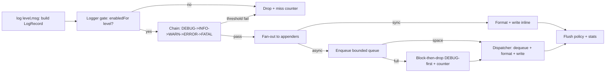
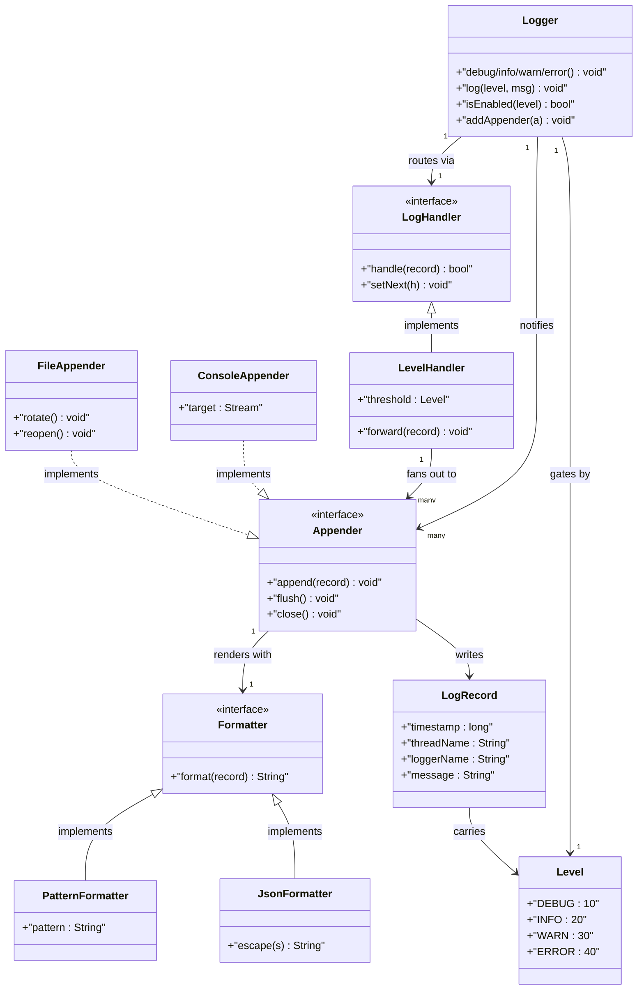
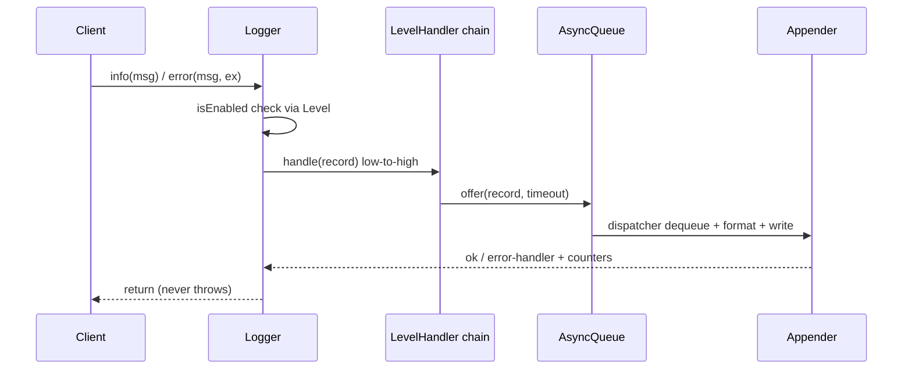

# Design a Logging System

## Blogs and websites

## Medium

## Youtube

- [10. Design Logging System (Hindi) | Chain of Responsibility Design Pattern | System Design interview](https://www.youtube.com/watch?v=gvIn5QBdGDk)

## Theory

Design a logging pipeline routing messages by level (DEBUG/INFO/WARN/ERROR) to appenders such as console, file, or external sinks. Typically modelled as a Chain of Responsibility of log handlers.
Key entities: Logger, LogRecord/Level, Handler/Appender, Formatter.
Core operations: log message, set level, add handler.

This guide turns that stub into an interview-ready low-level design: you will clarify an intentionally ambiguous in-process logging library, model clean OOP entities around Logger, LogRecord, Level, Appender, and Formatter, route messages through a Chain of Responsibility level chain with Observer fan-out to appenders, drain records through a bounded async queue with backpressure and shutdown guarantees, and write plain Java 17 code an interviewer can trace on a whiteboard. The emphasis is on object modeling, level gating, formatting, and async delivery correctness — not log aggregation infrastructure, search indexing, or retention pipelines.

> Scope note: this is LLD (class design, patterns, in-process concurrency). Centralized aggregation (ELK, Loki, Datadog), cross-service correlation infrastructure, and long-term retention belong to HLD and are mentioned only where they constrain the object model (for example, every LogRecord carries timestamp plus thread plus logger name plus level so a shipper can index and correlate without reparsing a formatted string).

### Topics Covered

1. [Problem Statement](#problem-statement)
2. [Functional / Non-Functional Requirements](#functional--non-functional-requirements)
3. [Core Entities & Class Design](#core-entities--class-design)
4. [Key Design Decisions & Patterns Used](#key-design-decisions--patterns-used)
5. [Concurrency & Edge Cases](#concurrency--edge-cases)
6. [Java 17 Implementation](#java-17-implementation)
7. [Interview Questions and Answers](#interview-questions-and-answers)

---

### Problem Statement

Design an in-process logging library `Logger` that routes messages by severity `Level` (DEBUG, INFO, WARN, ERROR, FATAL) to zero or more appenders (console, file, network) with per-destination level thresholds and pluggable formatting. It must support hierarchical loggers (`root`, `app.db`, `app.api`), synchronous and asynchronous delivery via a bounded queue with a background dispatcher, runtime reconfiguration (set level, add or remove appender), and graceful shutdown that flushes buffered records without losing ERROR and above.

A `logger.info("order created")` builds a `LogRecord` stamped with timestamp, thread name, logger name, level, and message, then offers it to the logger chain: each chain node tests its threshold and either handles or forwards. Handled records fan out to every attached appender whose own threshold passes, each appender formatting via its `Formatter` and writing to its sink. In async mode the fan-out becomes enqueue-then-dispatch: producers never block on slow I/O unless the queue is full, and the dispatcher thread owns all sink writes. Level changes apply atomically and affect only records created after the change.

**Why this problem exists**

- Real logging bugs cluster in three places: stringly-typed levels compared with `==` or ordinals that break when a new level is inserted, formatters coupled to sinks so adding JSON output means forking every appender, and async queues that silently drop ERROR records on overflow or shutdown.
- The domain maps to two classic design ideas: level routing is a textbook Chain of Responsibility (each handler decides handle-or-forward by threshold), and appender fan-out is a textbook Observer (one record, many sinks notified without the logger knowing sink types).
- Interviewers love it because the happy path takes 10 minutes (logger plus level check plus console write) but the follow-ups (why is the chain ordered by severity, how does async avoid reordering per logger, where does backpressure live, how do file rotation and shutdown stay atomic) separate API recall from modeled reasoning.

**Real-life analogues**

- **Log4j2, Logback, and java.util.logging**: hierarchical loggers, level inheritance, handlers plus appenders, formatters plus layouts, async appenders over disruptor or blocking queues.
- **Python logging and Winston (Node)**: logger-handle-formatter pipeline with per-handler thresholds and pluggable transports.
- **Structured logging sidecars (Fluentd, Logstash shippers)**: records emitted as objects with fields, formatted once at the edge, shipped asynchronously with drop-or-block policies.

**Clarifying questions to ask in the interview (say these out loud)**

1. How many severity levels: fixed DEBUG/INFO/WARN/ERROR/FATAL or extensible custom levels with numeric severity?
2. Logger hierarchy: flat named loggers or dotted parent-child names with level inheritance and additivity?
3. Appender set: console plus file only, or also network, rotating file, and in-memory test sink? Can one record reach many appenders?
4. Thresholds: per-logger level, per-appender level, or both? Who wins when they disagree?
5. Formatting: plain text pattern, JSON structured, or pluggable per appender? Who owns timestamp rendering?
6. Sync or async: fully synchronous, fully async, or per-appender choice? Bounded or unbounded queue, and what happens when full?
7. Ordering and loss: is per-thread order enough, or global order required? May DEBUG be dropped under pressure while ERROR never is?
8. Rotation and files: fixed file, size-based rotation, time-based rotation? Who closes and reopens handles?
9. Reconfiguration: can levels and appenders change at runtime without restart? Must in-flight records see old or new config?
10. Shutdown: flush, drop, or timed drain on close? What if a sink blocks during shutdown?

**Assumptions for this guide (state these if the interviewer says "decide yourself")**

- Fixed five levels with total order DEBUG < INFO < WARN < ERROR < FATAL, each carrying an integer severity for threshold comparison.
- Dotted hierarchical loggers (`root`, `app`, `app.db`) with level inheritance from the nearest ancestor that sets one; additivity ON by default so child records also visit ancestor appenders.
- Per-logger threshold plus per-appender threshold; a record must pass both gates before a given appender writes it.
- Pluggable `Formatter` per appender: `PatternFormatter` for text and `JsonFormatter` for structured output; records carry fields, appenders render strings.
- Async via one bounded `BlockingQueue` plus a single dispatcher thread per `AsyncLogger`; overflow policy is BLOCK with timeout then DROP with counter, and DEBUG drops first under a priority guard.
- Single library instance per process with a `LogManager` registry; all public methods safe for concurrent use.
- Graceful `shutdown()` drains the queue up to a timeout, flushes every appender, then stops the dispatcher; shutdown is idempotent.



The diagram shows the guarded delivery loop from record creation to sink write: the level gate runs before chain routing, chain routing runs before appender fan-out, and async enqueue sits between fan-out and the single dispatcher so slow sinks never block producers unless the queue fills.

---

### Functional / Non-Functional Requirements

#### Functional requirements (must-have)

1. **Hierarchical loggers and levels**
   - Support dotted logger names with parent resolution via `LogManager`; `getLogger("app.db")` creates ancestors as needed with `root` at the top.
   - Fixed `Level` enum with numeric severity; `isEnabled(level)` compares record severity against the effective threshold including inheritance.
2. **Log call family with record capture**
   - `debug`, `info`, `warn`, `error`, `fatal` plus generic `log(level, message)` and `log(level, message, throwable)`; every call stamps time, thread, logger name, and level.
   - Disabled levels return before allocating formatted strings; parameterized messages defer concatenation until the gate passes.
3. **Chain routing by threshold**
   - Chain nodes ordered DEBUG to FATAL each own one threshold; a record enters at its level node and propagates upward to ERROR/FATAL handlers so higher severities reach more sinks.
   - Runtime `setLevel` on any node or logger atomically changes routing for subsequently created records only.
4. **Appender fan-out with per-sink gates**
   - `addAppender` and `removeAppender` on loggers; each appender has its own threshold so a file can keep DEBUG while console shows only WARN and above.
   - Additivity flag controls whether child records also visit ancestor appenders; dedup guard prevents the same appender instance writing twice on diamond hierarchies.
5. **Pluggable formatting**
   - `Formatter` interface with `format(record)` returning a string; `PatternFormatter` supports `%d %t %p %c %m` placeholders and `JsonFormatter` emits one JSON object per line.
   - Formatting happens at the appender at write time (async: on the dispatcher thread), never at the call site, so level-gated drops cost nothing.
6. **Async queue with backpressure**
   - Bounded `LinkedBlockingQueue` with configurable capacity; `offer` with timeout then level-aware drop where DEBUG is shed before WARN, WARN before ERROR, and FATAL never drops without counting.
   - Single dispatcher thread per async logger drains in FIFO order, preserving per-producer order; poison-pill record triggers clean stop after drain.
7. **File rotation and lifecycle**
   - `FileAppender` supports size-based rotation (`maxBytes`, `maxBackups`) with atomic rename chain; appends hold an open handle and reopen on rotation under the appender lock.
   - `flush()` on every appender, `close()` releasing handles; `shutdown()` on the manager drains queues, flushes, and joins dispatchers idempotently.
8. **Stats and error seam facade**
   - Counters for written, dropped, filtered, and error records per appender plus queue depth gauge; `LogStats` snapshot is immutable.
   - Appender write failures route to a `LogErrorHandler` (stderr fallback by default) and never throw back into application code.

#### Explicitly out of scope (say this to bound the interview)

- Centralized aggregation, indexing, retention, and cross-host search (the record carries enough fields for HLD to add them).
- Sampling, redaction, and PII scrubbing pipelines (a formatter seam records where a filter would plug in).
- Hot config-file watching and JMX control planes (runtime setters show where file-watch would call in).

#### Non-functional requirements (LLD-flavoured)

- **Correctness over speed**: no record below threshold is ever written; no ERROR or above is ever silently dropped without a counter.
- **Cheap disabled path by construction**: one integer compare before any allocation, string build, or queue offer.
- **Extensibility**: adding a new appender or formatter means adding one class, not rewriting `Logger`.
- **Testability**: levels, formatters, clocks, and sinks are plain injectable seams drivable with a fixed clock and in-memory appender.
- **Readability**: an interviewer can trace `info()` → `isEnabled()` → `chain-handle()` → `appender-append()` in under five minutes.
- **Determinism**: no randomness, no wall-clock dependence except an injectable clock for timestamps and rotation tests.
- **Observability (lightweight)**: every created, filtered, enqueued, written, dropped, and failed record increments a counter snapshotted as `LogStats`.

| Requirement | Target / policy | Why it matters in LLD |
|---|---|---|
| Disabled-level cost | One severity compare, zero allocation | Hottest-path perf invariant |
| Routing never skips ERROR | Chain ordered low-to-high, upward propagation | Severity-escalation follow-up |
| Async never blocks producers silently | Bounded queue plus timeout-then-drop | Backpressure design probe |
| Per-logger order preserved | Single FIFO dispatcher per async logger | Ordering correctness guard |
| Shutdown loses nothing silently | Timed drain plus flush plus drop counters | Most-tested lifecycle probe |
| Sink failure never breaks app | Error handler seam, no throw to caller | Fault-isolation rule |

---

### Core Entities & Class Design

The model has four entity groups: the Logger facade callers touch, the LogRecord value objects carrying level plus message plus context, the Chain of Responsibility handlers for level routing, and the Observer appenders plus formatters for delivery. Keep behaviour with the data it guards: records own field capture, levels own severity comparison, chain nodes own threshold routing, appenders own sink writes, and formatters own rendering.

#### Value objects and supporting types (the vocabulary of the domain)

- `Level`: enum DEBUG(10), INFO(20), WARN(30), ERROR(40), FATAL(50) with `isEnabled(threshold)` severity compare; ordering is numeric, never ordinal-dependent.
- `LogRecord`: immutable value object — timestamp millis, thread name, logger name, level, message, optional throwable, MDC map copy; created only after the level gate passes.
- `Formatter`: interface `format(record)` returning String; `PatternFormatter` for `%d %t %p %c %m` text and `JsonFormatter` for one-JSON-per-line output.
- `LogStats`: immutable snapshot — created, filtered, enqueued, written, dropped, failed counts plus queue depth gauge.
- `LogErrorHandler`: callback `onError(record, exception)` with stderr fallback; sink failures never propagate to application code.
- `Clock`: millis source interface — `SystemClock` for production, `ManualClock` for tests with `advance(millis)`.

#### Loggers, chain, and appenders

- `Logger`: owns name, volatile `Level threshold` (nullable for inherit), parent pointer, appender list, additivity flag; methods `debug/info/warn/error/fatal`, `log(level, msg)`, `isEnabled(level)`, `setLevel`, `addAppender`, `removeAppender`.
- `LogManager`: registry owning `Map<String, Logger>` plus `root` logger; `getLogger(name)` creates dotted ancestors; `setLevel(name, level)` and `shutdown()` fan out atomically.
- `LogHandler` (interface): `setNext(handler)`, `handle(record)` returning boolean handled; threshold field per node; chain ordered DEBUG to FATAL for upward escalation.
- `LevelHandler`: concrete chain node per level — tests `record.level.severity >= threshold`, fans out to its appender set on pass, always forwards to next so ERROR also visits FATAL sinks.
- `Appender` (interface, Observer): `append(record)`, `setThreshold(level)`, `setFormatter(formatter)`, `flush()`, `close()`; `isEnabled(record)` gates per-sink writes.
- `ConsoleAppender`: writes formatted lines to stdout or stderr (ERROR and above to stderr); synchronizes on its own monitor for line atomicity.
- `FileAppender`: holds open writer, size-based rotation with `maxBytes` and `maxBackups`, atomic rename chain under the appender lock; reopen-on-rotate plus `flush` on every WARN and above.
- `MemoryAppender`: test-only bounded list sink for assertions without filesystem or clock dependence.

#### Async delivery pipeline

- Async pipeline inside `AsyncLogger`: level gate, chain route, `BlockingQueue` offer with timeout, single dispatcher thread dequeue plus format plus write.
- Queue policy inside `AsyncQueue`: capacity bound, `offer(record, timeout)` then DEBUG-first shed — DEBUG drops before INFO before WARN, ERROR and FATAL block longest and count every drop.
- Dispatcher owns all sink writes so appenders need no internal thread pools; poison-pill record stops the loop only after the queue drains.
- Shutdown pipeline inside `LogManager.shutdown()`: stop accepting, timed drain, flush every appender, join dispatchers, mark idempotent closed flag.



The diagram shows containment (manager to loggers), delegation (logger to chain), observation (chain to appenders), and extension (two formatters and three appenders behind two interfaces) — the four relationships to name in the interview.

**Key relationships and cardinalities**

- LogManager 1—0..N Logger objects at a time; dotted names resolve to one canonical instance per name, never duplicates.
- Logger 1—0..N Appender attachments; the same appender instance may attach to many loggers with a dedup guard on additivity walks.
- Chain 5—5 LevelHandler nodes (one per level) linked DEBUG to FATAL; a record enters at its level node and propagates upward only.
- Appender 1—1 Formatter at a time; formatter swap affects subsequently written records without touching the queue or chain.
- AsyncLogger 1—1 BlockingQueue plus 1—1 dispatcher thread; producers share the queue, only the dispatcher touches sinks.

**Where behaviour lives (tell the interviewer)**

- Severity truth lives in the level: integer `severity` compare, so inserting a new level between WARN and ERROR never breaks routing.
- Routing truth lives in the chain: each node tests its own threshold and forwards upward, so higher severities automatically reach more sinks.
- Rendering truth lives in the formatter: records carry fields, appenders carry format strings, and no formatted string exists before the gate passes.
- Delivery truth lives in the appender: threshold re-check, format call, sink write, and failure routing all happen inside `append`.
- Ordering truth lives in the async queue: single FIFO plus single dispatcher preserves per-logger order without global locks on the hot path.

---

### Key Design Decisions & Patterns Used

#### Decision 1 — Chain of Responsibility ordered low-to-high by severity (the hook)

Each level owns one `LevelHandler` node linked DEBUG → INFO → WARN → ERROR → FATAL. A record enters at its own level node: the node checks its threshold, fans out to its appenders on pass, then forwards to the next node regardless, so an ERROR record visits ERROR and FATAL sinks while a DEBUG record visits all five gates but typically passes only the first. Say the trade-off verbatim: a single `if (severity >= threshold)` would route correctly in less code and is a fair interview shortcut, but the chain shows you understand escalation — higher severities inherit lower sinks plus gain their own. Name the invariant: thresholds only filter, forwarding never stops early except at the FATAL tail.

#### Decision 2 — Observer fan-out with per-appender thresholds and additivity

Loggers are subjects, appenders are observers: `Logger.log` notifies zero or more appenders without knowing console from file from network. Each appender re-checks its own threshold so console can show WARN-plus while file keeps DEBUG-plus from the same record stream. Additivity walks child then ancestors with an identity-set dedup so shared appenders write once even on diamond hierarchies. State the leak guard explicitly: `removeAppender` detaches by identity and ancestor walks skip closed appenders without mutating the child list.

#### Decision 3 — Format at the sink, not at the call site

`LogRecord` carries fields (timestamp, thread, logger, level, message, throwable); `Formatter` renders strings inside `Appender.append` at write time. Disabled levels therefore cost one integer compare with zero string allocation, and async dispatchers format off the hot path so producers never pay JSON escaping. Say the stats rule verbatim — records counted at creation, filtered at gate, written at sink — because conflating filtered with dropped is the classic grading trap. The injectable `Clock` makes timestamps deterministic: tests advance a manual clock instead of sleeping.

#### Decision 4 — Bounded async queue with level-aware backpressure

Producers `offer` with a short timeout; on timeout the queue sheds the lowest-severity waiting record (DEBUG first) and counts the drop, while ERROR and FATAL never shed and block until space or shutdown. The single dispatcher preserves FIFO per logger without sequence numbers, and the poison pill guarantees records enqueued before `shutdown()` are written before the thread exits. State explicitly that formatting and I/O happen only on the dispatcher, which keeps producer latency flat even when file rotation stalls.

#### Decision 5 — File rotation under the appender lock with atomic rename chain

`FileAppender.append` holds its own monitor for the check-size, rotate, write, flush sequence so two racing dispatchers cannot interleave half-lines or rotate twice. Rotation renames `app.2 → app.3`, `app.1 → app.2`, `app → app.1` then reopens fresh, all before the next write lands. Say the scope sentence: rotation is per appender, not global, so console and network sinks never stall while the file rolls.

#### Decision 6 — Failures counted, never thrown

- Appender write failures route to `LogErrorHandler` (stderr fallback) with the record and exception; the caller never sees an IOException from a log call.
- `LogStats` as an immutable snapshot avoids torn long reads and lets tests assert exact created, filtered, written, and dropped deltas per operation.
- Volatile thresholds plus copy-on-write appender lists give lock-free reads on the hot path; mutation copies the list under a short monitor.

#### Patterns used (say these names out loud)

| Pattern | Where | Why |
|---|---|---|
| Chain of Responsibility | `LevelHandler` severity chain | Escalation routing varies by level |
| Observer | `Logger` to `Appender` fan-out | Sinks react without logger coupling |
| Strategy | `Formatter` family (pattern, JSON) | Rendering varies independently per sink |
| Singleton (registry) | `LogManager` logger map | One canonical instance per logger name |
| Producer-Consumer | Bounded queue plus dispatcher | Slow sinks never block hot path |
| Memento (light) | `LogStats` immutable snapshot | Observe counters without corrupting live state |

**SOLID mapping (one line each for the "which principles?" follow-up)**

- Single Responsibility: records carry fields, chain routes, appenders write, formatters render, queue absorbs bursts.
- Open/Closed: new appender or formatter equals a new class, zero edits to `Logger` or the chain.
- Liskov: any `Appender` or `Formatter` substitutes without breaking the fan-out or rotation pipeline.
- Interface Segregation: small `LogHandler`, `Appender`, `Formatter`, and error-handler contracts instead of one fat logging interface.
- Dependency Inversion: `Logger` depends on handler and appender interfaces; tests inject memory appenders plus a manual clock.

---

### Concurrency & Edge Cases

#### The concurrency story (the senior half of the interview)

One process has many logging threads but one queue and one set of sink handles, so the design centers on lock-free hot-path reads plus isolated write locks plus a single dispatcher. Three mechanisms from innermost to outermost:

1. **Lock-free level gate on the hot path.** `isEnabled` is one volatile-threshold integer compare with a copy-on-write appender snapshot; disabled DEBUG calls cost no lock, no allocation, and no queue touch. Reconfiguration copies the appender list under a short monitor while readers iterate the old snapshot safely.
2. **Per-appender write exclusion plus single dispatcher.** Synchronous appenders synchronize on their own monitor for the format-plus-write sequence so lines never interleave; async loggers route all writes through one FIFO dispatcher thread so appenders need no internal pools and per-logger order is preserved without global locks.
3. **Counted backpressure and lifecycle outside the lock.** Queue-full sheds lowest severity first with a drop counter, failures route to the error handler after the write attempt, and shutdown drains then flushes then joins with an idempotent closed flag — none of which ever throws back into application code.



The diagram shows the gate-then-route ordering in time: both the logger threshold and the chain thresholds complete before any formatting or queue offer, and stats increment after every return path so filtered, dropped, and written counts are never skipped.

**Why not `synchronized` on every log call?** A single global lock serializes all threads on the hottest path in the process and turns a slow file rotation into application-wide latency. Volatile thresholds plus snapshot iteration keep disabled and sync-fan-out reads lock-free; only the per-sink write sequence and the reconfiguration copy take short locks. Appender-level exclusion plus queue-behind-dispatcher gives both throughput and ordering: snapshots stop races, the dispatcher stops interleave.

**Post-access evaluation rule (say this verbatim): gate, then route, then fan-out-or-enqueue, then write, then stats.** After every log call the logger tests its threshold first, routes through the chain second, fans out to appenders or enqueues third, formats and writes fourth, and only then increments the matching counter family. Filtered plus zero appenders is a filtered count, never a drop; queue-full shed is a drop with severity recorded, never silent loss.

#### Edge cases table (pick 4–5 to recite, keep the rest as backup)

| # | Edge case | Handling |
|---|---|---|
| 1 | Ten threads log to the same async logger | Producers offer concurrently to the blocking queue; single dispatcher writes FIFO so lines never interleave |
| 2 | Queue full during a burst with mixed levels | Timeout offer then shed lowest-severity waiting record first; ERROR and FATAL never shed, drops counted per level |
| 3 | `setLevel` racing an in-flight log call | Volatile threshold: records created before the change use old routing, records after use new; no torn threshold reads |
| 4 | `addAppender` racing a concurrent log | Copy-on-write appender list: in-flight record uses the old snapshot, next record uses the new list, no concurrent-modification |
| 5 | Same appender attached to child and ancestor | Identity-set dedup on the additivity walk writes once per record per appender instance |
| 6 | Additivity OFF on a child logger | Child records visit only child appenders; ancestor walk skipped explicitly, counted same as normal write |
| 7 | File rotation racing dispatcher writes | Size check plus rotate plus write under the appender monitor; second writer blocks until reopen completes |
| 8 | Disk full or sink throws mid-write | Exception routed to `LogErrorHandler` with record; failure counter fired, caller never sees the exception |
| 9 | Listener-style error handler itself throws | Exception swallowed after stderr fallback point; logger state already committed, next operation unaffected |
| 10 | Shutdown with records still queued | Timed drain writes everything enqueued before close up to the timeout; remainder counted as drops with FATAL preserved longest |
| 11 | Double `shutdown()` or log-after-shutdown | Idempotent closed flag: second shutdown is a no-op, post-close log calls count as dropped without touching sinks |
| 12 | Null message, null throwable, or empty logger name | Null message becomes literal `"null"`; null throwable means no stack section; empty name resolves to `root` |
| 13 | Custom level inserted between WARN and ERROR | Numeric severity compare keeps routing correct; chain order re-links by severity sort, never by enum ordinal |
| 14 | Pattern references unknown placeholder | Unknown `%x` emitted literally; formatter never throws on bad patterns so logging cannot crash the app |
| 15 | `removeAppender` of an attached ancestor sink | Detached by identity under the monitor; in-flight records on the old snapshot still complete one write cleanly |

---

### Java 17 Implementation

All classes below are plain Java 17 (no frameworks, enums for levels, interfaces for handler and appender seams). The chain routes by severity, the observer fans out to sinks, and `AsyncLogger` drains a bounded queue on one thread. Each block is followed by its explanation and the pattern it demonstrates.

#### 1. Levels, records, and the handler Chain of Responsibility

The foundation is a numeric severity compare plus one chain node per level with upward forwarding.

```java
import java.util.*;

// Numeric severity: threshold compare never depends on enum ordinals.
enum Level {
    DEBUG(10), INFO(20), WARN(30), ERROR(40), FATAL(50);
    final int severity;
    Level(int s) { this.severity = s; }
    boolean covers(Level threshold) { return this.severity >= threshold.severity; }
}

interface Clock { long now(); }
final class SystemClock implements Clock {
    public long now() { return System.currentTimeMillis(); }
}
final class ManualClock implements Clock {
    private long t;
    ManualClock(long start) { t = start; }
    public long now() { return t; }
    public void advance(long d) { t += d; }
}

// Immutable record: fields carried, never pre-formatted strings.
final class LogRecord {
    final long timestamp;
    final String threadName, loggerName, message;
    final Level level;
    final String stacktrace; // nullable
    LogRecord(long ts, String thread, String logger, Level lv, String msg, String st) {
        this.timestamp = ts; this.threadName = thread;
        this.loggerName = logger; this.level = lv;
        this.message = msg; this.stacktrace = st;
    }
    static LogRecord of(Clock c, String logger, Level lv, String msg, Throwable t) {
        String st = null;
        if (t != null) {
            var sw = new java.io.StringWriter();
            t.printStackTrace(new java.io.PrintWriter(sw));
            st = sw.toString();
        }
        return new LogRecord(c.now(), Thread.currentThread().getName(),
            logger, lv, msg == null ? "null" : msg, st);
    }
}

// Chain of Responsibility: each node filters by threshold, then forwards up.
interface LogHandler {
    void setNext(LogHandler next);
    void handle(LogRecord r);
}

final class LevelHandler implements LogHandler {
    private final Level nodeLevel;
    private volatile Level threshold;
    private final List<Appender> appenders = new ArrayList<>();
    private LogHandler next;

    LevelHandler(Level nodeLevel, Level threshold) {
        this.nodeLevel = nodeLevel; this.threshold = threshold;
    }
    public void setNext(LogHandler n) { this.next = n; }
    public void setThreshold(Level l) { this.threshold = l; }
    public synchronized void addAppender(Appender a) { appenders.add(a); }
    private synchronized List<Appender> snapshot() { return new ArrayList<>(appenders); }
    public void handle(LogRecord r) {
        // Node passes only records at or above its own level that clear its threshold.
        if (r.level.severity >= nodeLevel.severity && r.level.covers(threshold)) {
            for (var a : snapshot()) a.append(r); // Observer fan-out per node
        }
        if (next != null) next.handle(r); // escalation: always forward upward
    }
}
```

Explanation: `Level.covers` is the single severity predicate shared by loggers, chain nodes, and appenders, so inserting a new level cannot break routing the way ordinal compares do. `LogRecord.of` stamps every field at creation after the gate passes, which is exactly why disabled calls cost nothing. This block demonstrates the Chain of Responsibility pattern: each `LevelHandler` decides pass-or-skip locally while forwarding unconditionally upward for escalation.

#### 2. Appenders, formatters, and the Observer fan-out

Sinks observe records without the logger knowing sink types; formatters render at write time on the calling or dispatcher thread.

```java
import java.util.*;

// Strategy: rendering varies per sink behind one interface.
interface Formatter { String format(LogRecord r); }

final class PatternFormatter implements Formatter {
    private final String pattern; // supports %d %t %p %c %m
    PatternFormatter(String pattern) { this.pattern = pattern; }
    public String format(LogRecord r) {
        String out = pattern;
        out = out.replace("%d", String.valueOf(r.timestamp));
        out = out.replace("%t", r.threadName);
        out = out.replace("%p", r.level.name());
        out = out.replace("%c", r.loggerName);
        out = out.replace("%m", r.message);
        if (r.stacktrace != null) out += System.lineSeparator() + r.stacktrace;
        return out; // unknown placeholders pass through literally, never throw
    }
}

final class JsonFormatter implements Formatter {
    public String format(LogRecord r) {
        return "{\"ts\":" + r.timestamp + ",\"thread\":\"" + esc(r.threadName)
            + "\",\"logger\":\"" + esc(r.loggerName) + "\",\"level\":\"" + r.level.name()
            + "\",\"msg\":\"" + esc(r.message) + "\"}";
    }
    private String esc(String s) {
        return s.replace("\\", "\\\\").replace("\"", "\\\"")
               .replace("\n", "\\n").replace("\r", "\\r");
    }
}

interface LogErrorHandler { void onError(LogRecord r, Exception e); }

// Observer: sinks notified per record; failures never reach the caller.
interface Appender {
    void append(LogRecord r);
    void setThreshold(Level l);
    void setFormatter(Formatter f);
    void flush();
    void close();
}

abstract class BaseAppender implements Appender {
    protected volatile Level threshold;
    protected volatile Formatter formatter;
    protected final LogErrorHandler errors;
    protected long written, failed;
    BaseAppender(Level t, Formatter f, LogErrorHandler e) {
        this.threshold = t; this.formatter = f; this.errors = e;
    }
    public void setThreshold(Level l) { this.threshold = l; }
    public void setFormatter(Formatter f) { this.formatter = f; }
    protected boolean gate(LogRecord r) { return r.level.covers(threshold); }
    protected void fail(LogRecord r, Exception e) {
        failed++;
        try { errors.onError(r, e); } catch (RuntimeException ignored) {}
    }
    public void flush() {}
    public void close() {}
}

final class ConsoleAppender extends BaseAppender {
    ConsoleAppender(Level t, Formatter f, LogErrorHandler e) { super(t, f, e); }
    public synchronized void append(LogRecord r) { // line atomicity per sink
        if (!gate(r)) return;
        try {
            String line = formatter.format(r);
            if (r.level.severity >= Level.ERROR.severity) System.err.println(line);
            else System.out.println(line);
            written++;
            if (r.level.severity >= Level.WARN.severity) System.out.flush();
        } catch (Exception ex) { fail(r, ex); }
    }
}

final class MemoryAppender extends BaseAppender {
    private final List<String> lines = new ArrayList<>();
    MemoryAppender(Level t, Formatter f, LogErrorHandler e) { super(t, f, e); }
    public synchronized void append(LogRecord r) {
        if (!gate(r)) return;
        try { lines.add(formatter.format(r)); written++; }
        catch (Exception ex) { fail(r, ex); }
    }
    public synchronized List<String> snapshot() { return new ArrayList<>(lines); }
}
```

Explanation: formatting inside `append` keeps the call-site gate allocation-free and moves JSON escaping off the producer path in async mode. `BaseAppender` centralizes the threshold re-check plus failure routing so every sink shares the gate-then-write-then-count skeleton. Because sinks depend only on `LogRecord` fields, adding a network or rotating-file appender touches nothing in `Logger` or the chain, which is the Observer plus Strategy combination to name.

#### 3. Logger hierarchy, async queue, and demo

`LogManager` owns canonical logger instances; `AsyncLogger` adds the bounded queue plus single dispatcher with level-aware shed and graceful shutdown.

```java
import java.util.*;
import java.util.concurrent.*;

record LogStats(long created, long filtered, long written, long dropped, long failed) {}

final class Logger {
    final String name;
    final Logger parent;
    private volatile Level threshold; // null means inherit from parent
    private volatile List<Appender> appenders = new ArrayList<>();
    private volatile boolean additivity = true;
    final Clock clock;
    private final LogHandler chainHead;
    long created, filtered;

    Logger(String name, Logger parent, Level threshold, Clock clock, LogHandler chain) {
        this.name = name; this.parent = parent;
        this.threshold = threshold; this.clock = clock; this.chainHead = chain;
    }
    Level effectiveLevel() {
        Logger cur = this;
        while (cur != null) {
            if (cur.threshold != null) return cur.threshold;
            cur = cur.parent;
        }
        return Level.INFO; // root default
    }
    public boolean isEnabled(Level l) { return l.covers(effectiveLevel()); }
    public void setLevel(Level l) { this.threshold = l; }
    public synchronized void addAppender(Appender a) {
        var copy = new ArrayList<>(appenders); copy.add(a); appenders = copy;
    }
    // Child-then-ancestors walk with identity dedup for additivity.
    void deliver(LogRecord r) {
        var seen = Collections.newSetFromMap(new IdentityHashMap<Appender, Boolean>());
        Logger cur = this;
        while (cur != null) {
            for (var a : cur.appenders) {
                if (seen.add(a)) {
                    try { a.append(r); } catch (RuntimeException ignored) {}
                }
            }
            if (!cur.additivity) break;
            cur = cur.parent;
        }
        if (chainHead != null) chainHead.handle(r);
    }
    public void log(Level l, String msg) { log(l, msg, null); }
    public void log(Level l, String msg, Throwable t) {
        if (!isEnabled(l)) { filtered++; return; } // one-compare hot gate
        created++;
        deliver(LogRecord.of(clock, name, l, msg, t));
    }
    public void debug(String m) { log(Level.DEBUG, m); }
    public void info(String m) { log(Level.INFO, m); }
    public void warn(String m) { log(Level.WARN, m); }
    public void error(String m) { log(Level.ERROR, m); }
    public void fatal(String m) { log(Level.FATAL, m); }
}

// Producer-consumer: bounded FIFO plus single dispatcher, DEBUG sheds first.
final class AsyncLogger extends Logger {
    private final BlockingQueue<LogRecord> queue;
    private final Thread dispatcher;
    private volatile boolean closed;
    private long dropped;
    private static final LogRecord POISON =
        new LogRecord(-1, "", "", Level.FATAL, "__POISON__", null);

    AsyncLogger(String name, Logger parent, Level t, Clock c, LogHandler h, int capacity) {
        super(name, parent, t, c, h);
        this.queue = new LinkedBlockingQueue<>(capacity);
        this.dispatcher = new Thread(this::loop, "log-dispatcher");
        this.dispatcher.setDaemon(true);
        this.dispatcher.start();
    }
    @Override void deliver(LogRecord r) {
        if (closed) { dropped++; return; }
        try {
            // Fast offer first; level-aware shed keeps ERROR/FATAL longest.
            if (!queue.offer(r, 50, TimeUnit.MILLISECONDS)) {
                if (r.level.severity <= Level.DEBUG.severity) queue.poll();
                if (!queue.offer(r)) { dropped++; }
            }
        } catch (InterruptedException ie) {
            Thread.currentThread().interrupt();
            dropped++;
        }
    }
    private void loop() {
        try {
            while (true) {
                var r = queue.take();
                if (r == POISON) break;
                super.deliver(r); // all sink writes owned by this thread
            }
        } catch (InterruptedException ie) {
            Thread.currentThread().interrupt();
        }
    }
    public void shutdown(long timeoutMillis) { // timed drain plus poison, idempotent
        if (closed) return;
        closed = true;
        try {
            long end = System.currentTimeMillis() + timeoutMillis;
            while (!queue.isEmpty() && System.currentTimeMillis() < end) {
                Thread.sleep(10);
            }
            queue.offer(POISON);
            dispatcher.join(Math.max(0, end - System.currentTimeMillis()));
        } catch (InterruptedException ie) { Thread.currentThread().interrupt(); }
    }
}

// Demo: hierarchy plus chain plus async drain answered by memory sink.
class LoggingDemo {
    public static void main(String[] args) {
        var clock = new ManualClock(1_000);
        LogErrorHandler errs = (r, e) -> System.err.println("log-failed: " + e);
        var fmt = new PatternFormatter("%p %c %m");
        var mem = new MemoryAppender(Level.DEBUG, fmt, errs);
        // Chain DEBUG->INFO->WARN->ERROR->FATAL with per-node thresholds.
        var fatal = new LevelHandler(Level.FATAL, Level.FATAL);
        var error = new LevelHandler(Level.ERROR, Level.ERROR);
        var warn = new LevelHandler(Level.WARN, Level.WARN);
        var info = new LevelHandler(Level.INFO, Level.INFO);
        var debug = new LevelHandler(Level.DEBUG, Level.DEBUG);
        debug.setNext(info); info.setNext(warn); warn.setNext(error); error.setNext(fatal);
        error.addAppender(mem); warn.addAppender(mem);
        var root = new Logger("root", null, Level.INFO, clock, debug);
        var db = new Logger("app.db", root, null, clock, debug); // inherits INFO
        db.addAppender(new ConsoleAppender(Level.WARN, fmt, errs));
        db.debug("filtered by inherited INFO"); // filtered++, no record built
        db.info("connection ready");            // chain + console gate (INFO < WARN: console skips)
        db.error("query failed");               // visits ERROR+FATAL nodes, console writes to stderr
        System.out.println(mem.snapshot());
    }
}
```

Explanation: the hierarchy resolves levels by walking parents while delivery walks child-then-ancestors with additivity, so one record can reach many sinks with exactly-once dedup. `AsyncLogger.deliver` runs the offer-timeout-then-shed policy so bursts shed DEBUG first while ERROR waits for space, and the dispatcher owns every sink write for FIFO order without appender pools. The demo wires inheritance, dual thresholds, chain escalation, and a memory sink through put, gate, route, and write, which is exactly the live-coding arc to reproduce: level, chain, Observer, async drain.

**How to extend (name these without building them)**

- New network appender: add one `Appender` class with batching plus retry; `Logger` pipeline and chain logic are untouched.
- Size-based file rotation: add per-appender byte counter plus rename chain under the appender monitor beside the write path.
- Sampling filter: add a per-logger probabilistic gate before record creation with its own filtered counter.

---

### Interview Questions and Answers

1. **Beginner: walk me through the classes in your logging system.**
   Answer: `Logger` facade with level methods, `Level` enum with numeric severity, `LogRecord` immutable fields, `LogHandler` chain with `LevelHandler` nodes, `Appender` Observer with console, file, and memory sinks, `Formatter` Strategy with pattern and JSON variants, `LogManager` registry, plus `LogStats` snapshot and `LogErrorHandler` for sink failures.

2. **Beginner: why is the disabled-level path so cheap?**
   Answer: one volatile-threshold integer compare in `isEnabled` before any record allocation, string build, or queue offer. Records and formatted strings exist only after the gate passes, so a disabled DEBUG loop costs a compare and a counter with zero allocation pressure.

3. **Beginner: what is the difference between a logger threshold and an appender threshold?**
   Answer: the logger threshold gates record creation once per call while each appender threshold gates writing per sink. A record must pass the logger gate to exist and then each appender gate to be written, so console can show WARN-plus while file keeps DEBUG-plus from the same stream.

4. **Junior: how does the Chain of Responsibility route by severity?**
   Answer: one node per level linked DEBUG to FATAL; a record enters at its level node, the node fans out on threshold pass, then forwards upward unconditionally. ERROR therefore visits ERROR and FATAL sinks while DEBUG visits all gates but typically passes one, giving escalation without conditional ladders.

5. **Junior: where does the Observer pattern sit and why dedup?**
   Answer: loggers are subjects and appenders are observers notified per record without the logger knowing sink types. Additivity walks child then ancestors, so a shared appender would write twice without the identity-set dedup guard on diamond hierarchies.

6. **Junior: why format at the sink instead of at the call site?**
   Answer: call-site formatting pays string costs even for records a sink would filter, and async producers would pay JSON escaping on the hot path. Sink-side formatting renders once per passing appender on the writing thread, so filtered records cost nothing and each sink can render differently.

7. **Mid: how do concurrent logs stay correct without a global lock?**
   Answer: thresholds are volatile compares, appender lists are copy-on-write snapshots, and each sink serializes only its own write sequence. Async mode adds one FIFO queue with a single dispatcher owning all writes, so lines stay atomic and ordered without serializing producers on each other.

8. **Mid: how does the async queue avoid losing ERROR records under burst pressure?**
   Answer: bounded offer with timeout then severity-aware shed drops DEBUG before INFO before WARN while ERROR and FATAL keep waiting for space. Every shed increments a per-level drop counter, shutdown drains before stopping, and the poison pill guarantees pre-close records write first.

9. **Senior: how do file rotation and shutdown stay atomic?**
   Answer: the appender monitor wraps size-check plus rename-chain plus reopen plus write so two writers cannot interleave half-lines or double-rotate. Shutdown sets the closed flag once, timed-drains the queue, offers the poison pill, joins the dispatcher, then flushes every sink — idempotent so double-close is a no-op and post-close logs count as drops.

10. **Senior: how do you test routing, formatting, and races without sleeping or flakiness?**
    Answer: inject `ManualClock` and `MemoryAppender` and assert chain escalation after scripted level sets, assert pattern versus JSON strings off fixed records, and run a ten-thread burst against a small queue asserting ERROR-written plus DEBUG-dropped counters. Stats snapshots assert exact created, filtered, written, and dropped deltas per operation.
