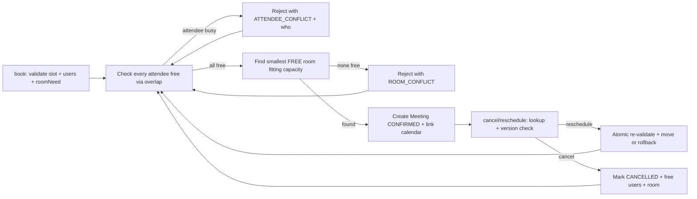
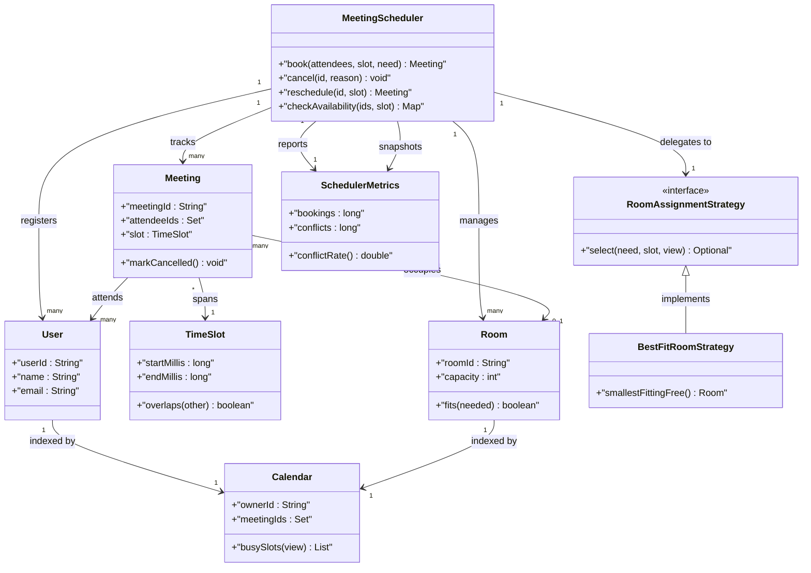
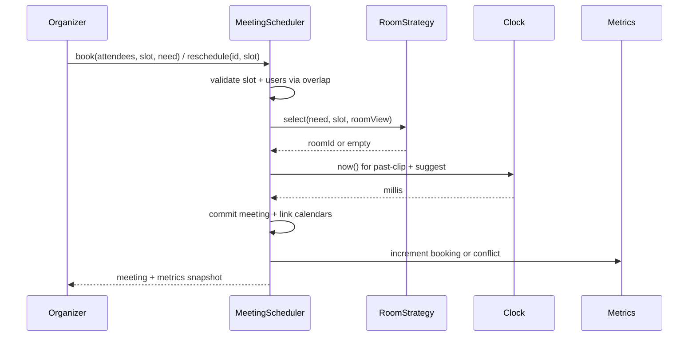

# Design Meeting Scheduler

## Blogs and websites

## Medium

## Youtube

- [Mock Low Level System Design Interview with Qualcomm Sr. Engineer - Design Meeting Scheduler](https://www.youtube.com/watch?v=MRx40JVmmF4)

## Theory

Design a scheduler booking rooms and attendees into conflict-free time slots. Must detect overlaps across calendars and suggest free windows.
Key entities: User, Room, Calendar, Meeting/TimeSlot.
Core operations: check availability, book meeting, cancel/reschedule.

This guide turns that stub into an interview-ready low-level design: you will clarify an intentionally ambiguous team meeting scheduler, model clean OOP entities around User, Calendar, Meeting, TimeSlot, and Room, enforce conflict-free booking with a half-open interval overlap predicate shared by every path, allocate rooms with a min-rooms heap strategy behind a pluggable RoomAssignmentStrategy, and write plain Java 17 code an interviewer can trace on a whiteboard. The emphasis is on object modeling, overlap correctness, and room-optimality mechanics — not video-conferencing media, email delivery, or distributed calendar sync.

> Scope note: this is LLD (class design, patterns, in-process concurrency). Cross-datacenter calendar replication, Exchange/Google sync protocols, notification fan-out, and video-bridge provisioning belong to HLD and are mentioned only where they constrain the object model (for example, every Meeting carries organizerId plus attendeeIds plus roomId plus TimeSlot plus version so a retry or cancel callback never books the wrong window).

### Topics Covered

1. [Problem Statement](#problem-statement)
2. [Functional / Non-Functional Requirements](#functional--non-functional-requirements)
3. [Core Entities & Class Design](#core-entities--class-design)
4. [Key Design Decisions & Patterns Used](#key-design-decisions--patterns-used)
5. [Concurrency & Edge Cases](#concurrency--edge-cases)
6. [Java 17 Implementation](#java-17-implementation)
7. [Interview Questions and Answers](#interview-questions-and-answers)

---

### Problem Statement

Design a `MeetingScheduler` for one organisation with a fixed set of users and bookable rooms. An organizer proposes a `Meeting` with a `TimeSlot [start, end)`, a set of required attendees, and an optional room requirement; the system books it only if every attendee is free and, when requested, one fitting room with enough capacity is free for the whole slot. A `book(organizer, attendees, slot, roomNeed)` returns a Meeting with meetingId and roomId or a typed conflict listing who or what collided; `cancel(meetingId)` and `reschedule(meetingId, newSlot)` restore availability atomically. Back-to-back meetings never conflict, zero-length slots are rejected, and expired past meetings never block future availability checks.

A `checkAvailability(userIds, slot)` answers free or busy per user via the same overlap predicate the booking path uses; a `findFreeWindows(userIds, dayRange, duration)` suggests open windows by merging busy intervals and inverting them; a `minRoomsRequired(slotRange)` reports the chromatic number of the interval graph via a min-heap sweep so capacity planning falls out of the model. Recurrence, waitlists, and cross-timezone rendering are explicitly bounded so the interview stays on overlap plus allocation reasoning.

**Why this problem exists**

- Real scheduler bugs cluster in three places: closed-interval overlap checks that flag back-to-back meetings as conflicts, per-attendee loops that check rooms but forget one attendee (or vice versa), and greedy room pickers that waste the large boardroom on 2-person standups and then reject 20-person reviews despite nominal free rooms.
- The domain maps to two classic design ideas: interval overlap is a textbook half-open predicate (`a.start < b.end && b.start < a.end`), and room optimality is a textbook sweep-line pairing (sort by start, min-heap of end times, heap size equals rooms needed).
- Interviewers love it because the happy path takes 10 minutes (users plus meetings plus overlap plus book-cancel) but the follow-ups (why half-open not closed, why heap not brute force, where does availability truth live, how do concurrent books stay conflict-free) separate API recall from modeled reasoning.

**Real-life analogues**

- **Google Calendar, Outlook, Cal.com event booking**: per-user busy lookup, attendee conflict rejection, room/resource calendars, free-window suggestion.
- **Conference-room panels (Robin, Envoy, Joan)**: capacity-tiered rooms, exclusive occupancy per slot, cancel-plus-reschedule atomicity.
- **Interview scheduling loops and classroom timetabling**: min-rooms planning from overlapping demand plus reschedule without double-booking.

**Clarifying questions to ask in the interview (say these out loud)**

1. Topology: single organisation per instance or multi-tenant? Fixed user/room set or dynamic add/remove?
2. Time model: epoch millis plus ZoneId, or opaque slot ids? Half-open `[start, end)` agreed or closed intervals?
3. Attendee model: required versus optional attendees? Organizer implicitly attending or separate flag?
4. Room model: capacity tiers plus features (projector, video), or plain names? One room per meeting strictly?
5. Overlap scope: user conflicts plus room conflicts both hard blockers, or soft warnings with force-book override?
6. Recurrence: single instances only, or daily/weekly series with expansion? How far ahead may a series extend?
7. Reschedule semantics: atomic cancel-plus-rebook or two-step with hold? What happens to roomId on move?
8. Past meetings: immutable history or editable? May a meeting be booked in the past for backfill?
9. Suggest-windows: merged-invert over a day range with fixed duration, or ranked alternatives? Limit on suggestions?
10. Observability: bookings, conflicts, cancellations, min-rooms demand? Audit trail for cancel/reschedule actor?

**Assumptions for this guide (state these if the interviewer says "decide yourself")**

- Single `MeetingScheduler` instance with users and rooms registered at construction; rooms have capacity plus feature tags.
- Time is epoch millis in one zone; every TimeSlot is half-open `[startMillis, endMillis)` with `start < end`, validated at construction.
- One room per meeting maximum; meetings without roomNeed skip room allocation entirely.
- Required attendees only; organizer is always implicitly attending and listed in attendeeIds.
- Best-fit room default: smallest free room with capacity >= needed; upgrade allowed, downgrade never allowed.
- In-memory only, no persistence; reschedule is atomic cancel-plus-rebook under one lock with rollback on conflict.
- All public methods safe for concurrent use; one monitor guards book plus cancel plus reschedule.



The diagram shows the guarded booking loop from validation to attendee checks to room allocation: overlap gates every attendee and room before any calendar mutation, and only fully free requests commit so partial bookings are never observable.

---

### Functional / Non-Functional Requirements

#### Functional requirements (must-have)

1. **User and room registry**
   - Support `registerUser(user)` and `addRoom(room)` with unique ids; reject nulls and duplicates with typed exceptions.
   - `Room` carries `roomId`, `capacity`, plus `features` set; capacity comparison is `room.capacity >= needed`.
2. **Half-open slot validation**
   - `TimeSlot` rejects `start >= end`, zero-length, and negative epoch with `IllegalArgumentException` at construction.
   - Back-to-back slots where `a.end == b.start` never overlap by predicate construction.
3. **Per-attendee availability check**
   - `checkAvailability(userIds, slot)` returns per-user free/busy derived from CONFIRMED meetings only; CANCELLED history never blocks.
   - Unknown userIds throw `UserNotFoundException` rather than reporting busy so typos cannot silently block booking.
4. **Conflict-free booking**
   - `book(organizerId, attendeeIds, slot, roomNeed)` validates slot plus users, tests every attendee via overlap, then allocates a room when needed; any conflict throws `MeetingConflictException` naming attendees or room.
   - Success creates a Meeting with unique meetingId, version 0, CONFIRMED state, linked into every attendee calendar plus room calendar.
5. **Reschedule as cancel-plus-rebook**
   - `reschedule(meetingId, newSlot)` re-validates all original attendees plus room against every meeting except itself, then moves atomically; failure leaves the original slot intact.
   - Version increments on every successful move so stale retries are detectable.
6. **Cancel with audit cause**
   - `cancel(meetingId, reason)` marks CANCELLED, unlinks from calendars, frees attendees plus room; double cancel throws `InvalidMeetingStateException`.
   - Explicit cancels never count as expirations or no-shows in metrics.
7. **Free-window suggestion**
   - `findFreeWindows(userIds, dayRange, durationMillis, limit)` merges busy intervals across the union of attendees, inverts within dayRange, and returns up to limit windows each at least durationMillis long.
   - Past portions of dayRange are clipped to now so suggestions are always bookable.
8. **Min-rooms planning and metrics facade**
   - Public API `book`, `cancel`, `reschedule`, `checkAvailability`, `findFreeWindows`, `minRoomsRequired`, `meetingsFor`, `metrics` returns result objects; illegal slots or unknown ids throw typed exceptions.
   - `minRoomsRequired(meetings)` runs the heap sweep over a snapshot so planning never mutates calendars; `metrics` exposes bookings, conflicts, cancels, reschedules, and suggestion calls.

#### Explicitly out of scope (say this to bound the interview)

- Cross-organisation federation, Exchange/Google sync protocols, and distributed calendar replication (the meeting carries enough ids for HLD to add them).
- Video-bridge provisioning, email/SMS delivery, and push-notification fan-out (record the attendee plus room handoff so HLD can add it).
- Recurring-series expansion engines and timezone rendering pipelines (a single-zone epoch model keeps the overlap reasoning one case).

#### Non-functional requirements (LLD-flavoured)

- **Correctness over speed**: no attendee double-booking and no room double-booking are ever observable; overlap gates run before calendar mutation.
- **O(N log N) suggestion and planning by construction**: sort-plus-merge plus min-heap sweep avoid pairwise scans on every book.
- **Extensibility**: adding a new room policy means adding one `RoomAssignmentStrategy` class, not rewriting `MeetingScheduler`.
- **Testability**: overlap predicate, clock, room strategy, and id generator are plain injectable seams drivable with fixed slots and a manual clock.
- **Readability**: an interviewer can trace `book()` → `validate()` → `attendee-scan()` → `room-pick()` → `commit()` and `reschedule()` → `exclude-self()` → `re-validate()` → `move()` in under five minutes.
- **Determinism**: no randomness except injectable id source; no wall-clock dependence except an injectable clock for expiry plus past-clipping.
- **Observability (lightweight)**: every booking, conflict, cancel, reschedule, suggestion, and min-rooms query increments a counter snapshotted as `SchedulerMetrics`.

| Requirement | Target / policy | Why it matters in LLD |
|---|---|---|
| Half-open overlap never violated | `a.start < b.end && b.start < a.end` before any commit | Core safety invariant |
| Attendee plus room both gated | Every attendee free and room free or typed conflict | Most-tested omission probe |
| Best-fit room frugality | Smallest free room with capacity >= needed first | Where juniors fail |
| Reschedule atomicity | Cancel-plus-rebook under one monitor with rollback | Double-book leak guard |
| Suggestion testability | Injectable clock, manual now, clipped dayRange | No-sleep test design |
| Booking atomicity | Find-plus-commit under one monitor | Concurrent double-book guard |

### Core Entities & Class Design

The model has four entity groups: the MeetingScheduler facade callers touch, the User plus Room registry value objects holding identity plus capacity truth, the TimeSlot plus Meeting booking pipeline holding interval plus lifecycle truth, and the RoomAssignmentStrategy family plus metrics observability seam. Keep behaviour with the data it guards: slots own overlap checks, meetings own lifecycle transitions, rooms own fit checks, calendars own per-user indexes, strategies own room choice, and the scheduler owns atomicity.

The reason for four groups instead of one flat meeting map is interview traceability. Availability truth fans out per attendee, room truth fans out per room, and both must agree before a commit. If overlap lived in the scheduler, every new query path would reimplement the predicate; if room fit lived in the meeting, capacity tiers would leak into attendee logic. Centralising each predicate with its data keeps book, reschedule, availability, suggestion, and min-rooms consistent by construction.

A second modelling choice is that calendars are indexes, not owners. The scheduler owns the canonical `meetingsById` map; each user calendar and each room calendar holds meeting-id sets plus interval references for fast scans. Cancel and reschedule therefore unlink and relink rather than deleting history: the meeting record flips to CANCELLED but stays queryable, so audit and metrics never lose the actor plus cause chain.

#### Value objects and supporting types (the vocabulary of the domain)

- `User`: identity record with `userId`, `name`, `email`, plus `calendarId`; method `equals` by `userId` so attendee sets deduplicate reliably.
- `TimeSlot`: half-open interval with `startMillis`, `endMillis`; validates `start < end` at construction, exposes `overlaps(other)` as `this.start < other.end && other.start < this.end`, plus `duration()` and `contains(now)`.
- `Meeting`: lifecycle record with `meetingId`, `organizerId`, `attendeeIds` (organizer included), `slot`, `roomId` (nullable when no room needed), `neededCapacity`, `state` (CONFIRMED versus CANCELLED), and `version` for stale-retry detection.
- `Room`: bookable resource with `roomId`, `name`, `capacity`, plus `features` set; method `fits(needed)` is `this.capacity >= needed` and `supports(requiredFeatures)` is set inclusion.
- `Calendar`: per-user and per-room index with `ownerId`, `meetingIds` set; methods `add(meetingId)`, `remove(meetingId)`, and `busySlots(meetingsById)` for merged scans.
- `Clock`: millis source interface — `SystemClock` for production, `ManualClock` for tests with `advance(millis)`; every past-clip plus expiry comparison goes through it.
- `IdGenerator`: meeting-id source interface — `UuidGenerator` for production, `SequentialIds` for tests so whiteboard traces use `m1`, `m2`.
- `SchedulerMetrics`: immutable snapshot — bookings, attendeeConflicts, roomConflicts, cancels, reschedules, suggestions, minRoomsQueries, plus derived `conflictRate()`.

#### Scheduler, meetings, and strategies

- `MeetingScheduler`: owns `Map<String, User> users`, `Map<String, Room> rooms`, `Map<String, Meeting> meetingsById`, `Map<String, Calendar> userCalendars`, `Map<String, Calendar> roomCalendars`, `RoomAssignmentStrategy strategy`, `Clock`, `IdGenerator`, counters. Methods `registerUser`, `addRoom`, `book`, `cancel`, `reschedule`, `checkAvailability`, `findFreeWindows`, `minRoomsRequired`, `meetingsFor`, `metrics`.
- `Meeting`: methods `isActive()`, `involves(userId)`, `usesRoom()`, `moveTo(newSlot, newRoomId)` bumping version, `markCancelled()`; every transition validates current state is CONFIRMED.
- `TimeSlot`: methods `overlaps(other)`, `abuts(other)` for `end == start`, `intersection(other)`, `isInPast(now)`; static `mergeOverlapping(sorted)` used by suggestion and min-rooms paths.
- `RoomAssignmentStrategy` (interface): `select(needed, features, slot, roomView)` returning roomId or empty, `name()` for metrics labels.
- `BestFitRoomStrategy`: filters rooms by capacity plus features, drops rooms busy via overlap, picks smallest fitting capacity — frugal by construction, O(R log R) with sort on capacity.
- `FirstFitRoomStrategy`: returns the first free room that fits in registration order; simpler but wastes the boardroom on standups, provided to make the trade-off discussable.
- `CapacityTierPolicy`: explicit rule object inside best-fit — upgrade allowed (2-person meeting may take larger room when small rooms are busy), downgrade forbidden, zero-capacity rooms never offered.
- `AvailabilityView`: read-only snapshot passed to strategies — room list plus meetings-by-id accessor — so policies never cache liveness.

#### Availability, suggestion, and observability pipeline

- Availability pipeline inside `checkAvailability`: validate users, pull each calendar busy set, test every CONFIRMED meeting via `overlaps`, return per-user free/busy map without mutating state.
- Booking pipeline inside `book`: validate slot plus users, attendee-scan excluding nothing, room-select via strategy, then commit meeting plus link calendars under one lock.
- Reschedule pipeline inside `reschedule`: lookup meeting, validate new slot, re-scan attendees plus room excluding self, then atomic move with version bump or typed conflict with rollback.
- Suggestion pipeline inside `findFreeWindows`: union busy intervals across attendees, sort plus merge, invert within clipped dayRange, slice windows of at least durationMillis up to limit.
- Observer seam: `cancel` records meetingId plus reason plus timestamp as immutable strings without coupling the scheduler to a log framework.
- Metrics pipeline: every return path increments exactly one counter family — booking, attendee-conflict, room-conflict, cancel, reschedule, suggestion — so conflict-rate math stays reproducible.



The diagram shows containment (scheduler to users, rooms, and meetings), spanning (meetings share one slot type), attendance (meetings to users), occupancy (meetings to zero-or-one room), indexing (users and rooms each map to one calendar), and delegation (scheduler to strategy) — the six relationships to name in the interview.

**Key relationships and cardinalities**

- MeetingScheduler 1—0..N User objects and 1—0..M Room objects; exactly 0..1 live Meeting per attendee per instant, so overlap never double-books observably.
- Meeting N—1 TimeSlot interval; slots are immutable values so reschedule swaps the reference instead of mutating endpoints.
- Meeting N—M User attendees with organizer always included; insertion links every attendee calendar, cancel unlinks every attendee calendar atomically.
- Meeting N—0..1 Room at a time; meetings without roomNeed carry null roomId and skip room allocation entirely.
- MeetingScheduler 1—1 RoomAssignmentStrategy at a time; strategy swap needs no state migration because strategies hold no liveness cache.

**Where behaviour lives (tell the interviewer)**

- Overlap truth lives in the slot: `overlaps(other)` is one half-open predicate, so book, reschedule, availability, suggestion, and min-rooms cannot disagree on conflict.
- Fit truth lives in the room: `fits(needed)` compares capacity, so allocation candidates cannot include undersized rooms.
- Liveness truth lives in the calendars: a user is busy only if a CONFIRMED meeting overlaps, updated together with the meetings map under one lock.
- Lifecycle truth lives in meeting state: only CONFIRMED meetings block, verify, or move; CANCELLED history never blocks future checks.
- Choice truth lives in the strategy: smallest fitting free room first, so frugality is a policy class not a scheduler branch.

---

### Key Design Decisions & Patterns Used

#### Decision 1 — Half-open overlap predicate shared by every path (the hook)

Every conflict test in the system funnels through `TimeSlot.overlaps`: `a.start < b.end && b.start < a.end`. Half-open means back-to-back slots where `a.end == b.start` never overlap by construction, while any positive-length intersection does. Say the trade-off verbatim: closed-interval checks (`<=` on both ends) flag abutting meetings as conflicts and force callers to sprinkle epsilon fudges; half-open makes adjacency legal with zero special cases. Name the invariant: no path — book, reschedule, availability, suggestion, min-rooms — implements its own overlap math; all of them call the slot method so the interviewer hears one predicate, not five.

#### Decision 2 — Attendee scan before room pick

`book` validates the slot plus user ids first, scans every attendee calendar for overlap second, and only then asks the room strategy for a candidate. The ordering is deliberate: attendee conflicts are cheaper to detect (no room sorting) and more common, so failing fast avoids wasted room scans. State the rationale verbatim — users before rooms because a busy attendee rejects the request regardless of room availability, while a missing room never excuses skipping an attendee check. The reschedule path reuses the same order with one twist: the meeting being moved is excluded from both scans so it never conflicts with itself.

#### Decision 3 — Best-fit room via capacity-ordered free scan with min-rooms heap hook

Free rooms that fit capacity plus features are sorted by ascending capacity and the smallest is taken; the 20-person boardroom is never spent on a 2-person standup when a 4-person huddle room is free. Say the trade-off verbatim: first-fit is less code (registration order, first free room that fits) but strands large meetings despite nominal free capacity; best-fit preserves large rooms at the cost of one sort per booking, O(R log R) in rooms not O(N) in meetings. The planning hook is the same interval idea run globally: sort all meetings by start, sweep a min-heap of end times, push each start after popping ended meetings, and the peak heap size equals minimum rooms required — the chromatic number of the interval graph with zero extra state.

#### Decision 4 — Reschedule as atomic cancel-plus-rebook excluding self with rollback

Reschedule re-validates all original attendees plus the room requirement against every CONFIRMED meeting except the moving meeting itself, then swaps the slot plus roomId and bumps version under one lock; any conflict aborts and the original slot stays intact. Say the metrics rule verbatim — reschedule counts as one reschedule, never as a cancel plus a booking — because conflating them is the classic grading trap. Version increments on every successful move so a stale retry carrying the old version is detectable without distributed machinery.

#### Decision 5 — Single-monitor atomicity with read paths at the edge

`book`, `cancel`, and `reschedule` synchronize on the scheduler; attendee scan plus room pick plus calendar link share the same monitor so two racing books for the same attendee or room never both commit. Read-only queries (`checkAvailability`, `findFreeWindows`, `minRoomsRequired`) snapshot meeting references under the lock and compute outside it, so a slow suggestion merge never serializes the next booking. State explicitly that strategy internals assume the scheduler lock is held — strategies are pure selectors over a snapshot view, never independently synchronized, which keeps lock ordering trivial.

#### Decision 6 — Explicit states, typed failures, immutable metrics

- `MeetingState { CONFIRMED, CANCELLED }` plus `ConflictKind { ATTENDEE_CONFLICT, ROOM_CONFLICT }` make illegal bookings unrepresentable: only CONFIRMED meetings block, only CANCELLED meetings skip scans.
- Typed exceptions (`MeetingConflictException`, `UserNotFoundException`, `RoomNotFoundException`, `MeetingNotFoundException`, `InvalidMeetingStateException`) let callers branch without parsing strings; conflicts carry who-or-what collided.
- `SchedulerMetrics` as an immutable snapshot avoids torn long reads and lets tests assert exact counter deltas per operation.
- Fixed user plus room registry at construction keeps the availability reasoning one case; unknown ids throw instead of reporting busy so typos cannot silently block booking.

#### Patterns used (say these names out loud)

| Pattern | Where | Why |
|---|---|---|
| Strategy | `RoomAssignmentStrategy` family (best-fit, first-fit) | Room choice varies independently by policy |
| Facade | `MeetingScheduler` over users, rooms, meetings, calendars | One interview-traceable API for all flows |
| State | `MeetingState` CONFIRMED versus CANCELLED transitions | Blocking legality varies by lifecycle state |
| Template Method (light) | `book` then `validate` then `scan` then `pick` then `commit` skeleton | Shared ordering, pluggable room hook |
| Observer (light) | Audit hook on cancel and reschedule | Actor trail reacts without scheduler coupling |
| Memento (light) | `SchedulerMetrics` immutable snapshot | Observe counters without corrupting live state |

**SOLID mapping (one line each for the "which principles?" follow-up)**

- Single Responsibility: slots test overlap, meetings guard lifecycle, rooms test fit, calendars index per owner, strategies pick rooms, scheduler guards atomicity.
- Open/Closed: new room policy or suggestion ranker equals a new class, zero edits to `book` or `reschedule`.
- Liskov: any `RoomAssignmentStrategy` substitutes without breaking the scan-then-pick pipeline.
- Interface Segregation: small `RoomAssignmentStrategy`, `Clock`, and `IdGenerator` contracts instead of one fat scheduler interface.
- Dependency Inversion: `MeetingScheduler` depends on strategy and clock interfaces; tests inject first-fit plus a manual clock.

### Concurrency & Edge Cases

#### The concurrency story (the senior half of the interview)

One scheduler owns every calendar index, so the design centers on atomic scan-then-commit plus snapshot-then-compute reads plus decoupled audit. Three mechanisms from innermost to outermost:

1. **Single-monitor exclusion on the scheduler.** `book`, `cancel`, and `reschedule` are `synchronized` on the scheduler; attendee scan plus room pick plus calendar link share the same monitor so two racing books for the same attendee or the same room never both commit and availability never double-books. Version bumps and conflict counters increment inside the same critical section.
2. **Validate-before-commit ordering.** `book` tests slot validity, then user existence, then attendee overlap, then room freedom before creating any meeting object; only a fully free request links calendars, and reschedule failure rolls back to the original slot so partial moves are never observable.
3. **Audit outside the lock.** Cancel and reschedule record meetingId plus actor plus reason plus timestamp after commit with immutable strings, so a slow audit sink cannot deadlock the next `book`. Metrics counters increment inside the lock but are snapshotted as an immutable record read outside it.



The diagram shows the scan-then-pick ordering in time: both attendee overlap and room-fit probes complete before any calendar mutation, and metrics increment after every return path so conflict rate is never skipped.

**Why not `ConcurrentHashMap` alone?** A concurrent map serializes key access but does not express cross-calendar atomicity: booking links N attendee calendars plus one room calendar plus the meetings map in one commit, and a per-key lock lets two racing books each pass a per-user check and double-book the shared attendee. Reschedule moving a meeting across slots touches even more keys atomically. Scheduler-level exclusion plus strategy-behind-lock gives both atomicity and frugality: exclusion stops races, the strategy stops waste.

**Post-access evaluation rule (say this verbatim): validate, then scan attendees, then pick room, then commit, then count.** After every book the scheduler confirms the slot is well-formed first, every attendee is known second, every attendee is free third, a fitting room is free fourth, and only then creates the meeting plus links calendars. Past plus zero-duration slots are rejections with validation cause, never conflicts.

#### Edge cases table (pick 4–5 to recite, keep the rest as backup)

| # | Edge case | Handling |
|---|---|---|
| 1 | Two organizers `book` racing for the same attendee slot | Serialized on the monitor; winner commits, loser gets `MeetingConflictException` with ATTENDEE_CONFLICT plus who |
| 2 | Two organizers `book` racing for the last fitting room | Serialized on the monitor; winner takes smallest fit, loser gets ROOM_CONFLICT or next-best upgrade |
| 3 | Back-to-back meetings where `a.end == b.start` | Allowed; half-open predicate returns false so adjacency never conflicts |
| 4 | Zero-length slot with `start == end` | Rejected at `TimeSlot` construction with `IllegalArgumentException`; never reaches scan |
| 5 | Inverted slot with `start > end` | Rejected at construction; reschedule validates before excluding self so bad slots cannot wipe good ones |
| 6 | Unknown attendee id in book | `UserNotFoundException` before any scan; unknown never reported as busy |
| 7 | Organizer omitted from attendee list | Organizer auto-included; attendee set deduplicates by userId |
| 8 | `reschedule` to a slot colliding with own original | Excluded-self scan passes; move commits with version bump since self never blocks self |
| 9 | `reschedule` to a slot colliding with another meeting | Typed conflict, original slot intact, version untouched; caller retries with suggestion output |
| 10 | `cancel` of an already-cancelled meeting | `InvalidMeetingStateException`; cancel counter not double-incremented |
| 11 | `cancel` with unknown meetingId | `MeetingNotFoundException`; calendars unchanged so absent-versus-cancelled stays unambiguous |
| 12 | Meeting booked in the past | Rejected unless explicit backfill flag; past meetings otherwise never block availability scans |
| 13 | `findFreeWindows` with dayRange partly in past | Past portion clipped to clock now; only future windows returned up to limit |
| 14 | Null slot or null attendee set input | Rejected with `IllegalArgumentException`; nulls never enter the meetings map |
| 15 | `minRoomsRequired` with zero meetings | Returns zero without heap work; snapshot iteration avoids concurrent-modification by copying under lock |

---

### Java 17 Implementation

All classes below are plain Java 17 (no frameworks, records for snapshots, interfaces for strategy seams). The half-open predicate lives in one slot class, meetings own lifecycle transitions, and `MeetingScheduler` synchronizes the commit path. Each block is followed by its explanation and the pattern it demonstrates.

#### 1. Slots, users, rooms, meetings, and the room strategy family

The foundation is a half-open slot value plus identity and capacity records plus one room selector per strategy with a snapshot view of room liveness.

```java
import java.util.*;

// Half-open [start, end): overlap truth lives here, nowhere else.
final class TimeSlot {
    final long startMillis;
    final long endMillis;
    TimeSlot(long startMillis, long endMillis) {
        if (startMillis >= endMillis) throw new IllegalArgumentException("start < end required");
        if (startMillis < 0) throw new IllegalArgumentException("negative start");
        this.startMillis = startMillis;
        this.endMillis = endMillis;
    }
    boolean overlaps(TimeSlot o) {
        return this.startMillis < o.endMillis && o.startMillis < this.endMillis;
    }
    boolean abuts(TimeSlot o) {
        return this.endMillis == o.startMillis || o.endMillis == this.startMillis;
    }
    long duration() { return endMillis - startMillis; }
    boolean isInPast(long now) { return endMillis <= now; }
}

enum MeetingState { CONFIRMED, CANCELLED }
enum ConflictKind { ATTENDEE_CONFLICT, ROOM_CONFLICT }

// Identity: equality by userId so attendee sets deduplicate.
final class User {
    final String userId;
    final String name;
    final String email;
    User(String userId, String name, String email) {
        this.userId = Objects.requireNonNull(userId);
        this.name = name;
        this.email = email;
    }
}

// Capacity truth lives here: fit is one integer compare.
final class Room {
    final String roomId;
    final String name;
    final int capacity;
    final Set<String> features;
    Room(String roomId, String name, int capacity, Set<String> features) {
        this.roomId = Objects.requireNonNull(roomId);
        this.name = name;
        this.capacity = capacity;
        this.features = Set.copyOf(features);
    }
    boolean fits(int needed) { return capacity >= needed; }
    boolean supports(Set<String> required) { return features.containsAll(required); }
}

// Lifecycle record: only CONFIRMED meetings block availability scans.
final class Meeting {
    final String meetingId;
    final String organizerId;
    final Set<String> attendeeIds;
    TimeSlot slot;
    String roomId;
    final int neededCapacity;
    MeetingState state = MeetingState.CONFIRMED;
    long version = 0;
    Meeting(String meetingId, String organizerId, Set<String> attendeeIds,
            TimeSlot slot, String roomId, int neededCapacity) {
        this.meetingId = meetingId; this.organizerId = organizerId;
        this.attendeeIds = new LinkedHashSet<>(attendeeIds);
        this.attendeeIds.add(organizerId);
        this.slot = slot; this.roomId = roomId; this.neededCapacity = neededCapacity;
    }
    boolean isActive() { return state == MeetingState.CONFIRMED; }
    boolean involves(String userId) { return attendeeIds.contains(userId); }
    boolean usesRoom() { return roomId != null; }
    void moveTo(TimeSlot s, String r) {
        if (state != MeetingState.CONFIRMED) throw new IllegalStateException("state=" + state);
        slot = s; roomId = r; version++;
    }
    void markCancelled() {
        if (state != MeetingState.CONFIRMED) throw new IllegalStateException("state=" + state);
        state = MeetingState.CANCELLED;
    }
}

// Read-only snapshot passed to strategies: no liveness cache inside policies.
final class RoomView {
    final List<Room> rooms;
    final Map<String, Meeting> meetingsById;
    RoomView(List<Room> rooms, Map<String, Meeting> meetingsById) {
        this.rooms = rooms; this.meetingsById = meetingsById;
    }
}

// Strategy: room choice varies by policy; scheduler calls it under its own lock.
interface RoomAssignmentStrategy {
    Optional<String> select(int needed, Set<String> features, TimeSlot slot, RoomView view);
    String name();
}

// Best-fit: smallest free room with capacity >= needed.
final class BestFitRoomStrategy implements RoomAssignmentStrategy {
    public Optional<String> select(int needed, Set<String> features, TimeSlot slot, RoomView view) {
        return view.rooms.stream()
                .filter(r -> r.fits(needed) && r.supports(features))
                .filter(r -> view.meetingsById.values().stream()
                        .noneMatch(m -> m.isActive() && r.roomId.equals(m.roomId) && m.slot.overlaps(slot)))
                .sorted(Comparator.comparingInt(r -> r.capacity))
                .map(r -> r.roomId)
                .findFirst();
    }
    public String name() { return "BEST_FIT"; }
}

// First-fit: registration order, wastes large rooms; kept to make trade-off visible.
final class FirstFitRoomStrategy implements RoomAssignmentStrategy {
    public Optional<String> select(int needed, Set<String> features, TimeSlot slot, RoomView view) {
        for (var r : view.rooms) {
            if (!r.fits(needed) || !r.supports(features)) continue;
            boolean busy = view.meetingsById.values().stream()
                    .anyMatch(m -> m.isActive() && r.roomId.equals(m.roomId) && m.slot.overlaps(slot));
            if (!busy) return Optional.of(r.roomId);
        }
        return Optional.empty();
    }
    public String name() { return "FIRST_FIT"; }
}

class MeetingConflictException extends RuntimeException {
    final ConflictKind kind;
    MeetingConflictException(ConflictKind kind, String m) { super(m); this.kind = kind; }
}
class UserNotFoundException extends RuntimeException { UserNotFoundException(String m) { super(m); } }
class RoomNotFoundException extends RuntimeException { RoomNotFoundException(String m) { super(m); } }
class MeetingNotFoundException extends RuntimeException { MeetingNotFoundException(String m) { super(m); } }
class InvalidMeetingStateException extends RuntimeException { InvalidMeetingStateException(String m) { super(m); } }
```

Explanation: `TimeSlot.overlaps` is the entire conflict engine — one half-open comparison replaces closed-interval epsilon logic and makes back-to-back adjacency legal by construction. `RoomView` is a deliberate anti-cache: strategies receive a live read-only window instead of storing calendar state, so a strategy swap needs no migration. This block demonstrates the Strategy pattern: best-fit and first-fit vary room choice independently behind `select`.

#### 2. Calendars, availability, suggestion, and min-rooms sweep

Calendars index meeting ids per owner; availability, suggestion, and planning all read through the same overlap predicate without mutating state.

```java
import java.util.*;

// Index, not owner: scheduler holds canonical meetings map, calendars link ids.
final class Calendar {
    final String ownerId;
    final Set<String> meetingIds = new LinkedHashSet<>();
    Calendar(String ownerId) { this.ownerId = ownerId; }
    void add(String meetingId) { meetingIds.add(meetingId); }
    void remove(String meetingId) { meetingIds.remove(meetingId); }
    List<TimeSlot> busySlots(Map<String, Meeting> byId) {
        var out = new ArrayList<TimeSlot>();
        for (var id : meetingIds) {
            var m = byId.get(id);
            if (m != null && m.isActive()) out.add(m.slot);
        }
        return out;
    }
}

final class SchedulingHelpers {
    private SchedulingHelpers() {}
    static boolean attendeeFree(String userId, TimeSlot slot, Calendar cal, Map<String, Meeting> byId) {
        for (var id : cal.meetingIds) {
            var m = byId.get(id);
            if (m != null && m.isActive() && m.slot.overlaps(slot)) return false;
        }
        return true;
    }
    static List<TimeSlot> mergeBusy(List<TimeSlot> slots) {
        var sorted = new ArrayList<>(slots);
        sorted.sort(Comparator.comparingLong(s -> s.startMillis));
        var merged = new ArrayList<TimeSlot>();
        for (var s : sorted) {
            if (merged.isEmpty() || merged.get(merged.size() - 1).endMillis < s.startMillis) merged.add(s);
            else {
                var last = merged.get(merged.size() - 1);
                merged.set(merged.size() - 1,
                        new TimeSlot(last.startMillis, Math.max(last.endMillis, s.endMillis)));
            }
        }
        return merged;
    }
    // Invert merged busy within dayRange into windows of at least durationMillis.
    static List<TimeSlot> suggestWindows(List<TimeSlot> busy, TimeSlot dayRange, long durationMillis, int limit, long now) {
        long from = Math.max(dayRange.startMillis, now);
        var merged = mergeBusy(busy);
        var out = new ArrayList<TimeSlot>();
        long cursor = from;
        for (var b : merged) {
            if (b.endMillis <= cursor) continue;
            if (b.startMillis > cursor && b.startMillis - cursor >= durationMillis)
                out.add(new TimeSlot(cursor, b.startMillis));
            cursor = Math.max(cursor, b.endMillis);
            if (out.size() >= limit) break;
        }
        if (out.size() < limit && dayRange.endMillis - cursor >= durationMillis)
            out.add(new TimeSlot(cursor, dayRange.endMillis));
        return out.size() > limit ? out.subList(0, limit) : out;
    }
    // Min-rooms: sort by start, min-heap of ends, peak size is the answer.
    static int minRoomsRequired(Collection<TimeSlot> slots) {
        var sorted = new ArrayList<>(slots);
        sorted.sort(Comparator.comparingLong(s -> s.startMillis));
        var heap = new PriorityQueue<Long>();
        int peak = 0;
        for (var s : sorted) {
            while (!heap.isEmpty() && heap.peek() <= s.startMillis) heap.poll();
            heap.offer(s.endMillis);
            peak = Math.max(peak, heap.size());
        }
        return peak;
    }
}
```

Explanation: `Calendar` as an id-index keeps availability scans O(K) in per-user meetings instead of O(N) in global meetings, while `mergeBusy` plus invert turns suggestion into sort-merge-slice with no pairwise retry loops. `minRoomsRequired` reuses the same interval ordering as a heap sweep, so planning falls out of the booking model with zero extra state. This block demonstrates Template Method (light): availability, suggestion, and planning share the validate-scan-compute skeleton with different tails.

#### 3. MeetingScheduler facade with atomic book-cancel-reschedule plus demo

`MeetingScheduler` runs the validate, attendee-scan, room-pick, commit, and metrics pipeline with single-monitor atomicity; this is the full conflict-free scheduler to trace on the whiteboard.

```java
import java.util.*;

interface Clock { long now(); }
final class SystemClock implements Clock { public long now() { return System.currentTimeMillis(); } }
final class ManualClock implements Clock {
    private long t;
    ManualClock(long start) { t = start; }
    public long now() { return t; }
    public void advance(long d) { t += d; }
}
interface IdGenerator { String next(); }
final class SequentialIds implements IdGenerator {
    private long n = 0;
    public String next() { return "m" + (++n); }
}
record SchedulerMetrics(long bookings, long attendeeConflicts, long roomConflicts,
                        long cancels, long reschedules, long suggestions) {
    double conflictRate() {
        long total = bookings + attendeeConflicts + roomConflicts;
        return total == 0 ? 0.0 : (double) (attendeeConflicts + roomConflicts) / total;
    }
}

public class MeetingScheduler {
    private final Map<String, User> users = new LinkedHashMap<>();
    private final Map<String, Room> rooms = new LinkedHashMap<>();
    private final Map<String, Meeting> meetingsById = new HashMap<>();
    private final Map<String, Calendar> userCalendars = new HashMap<>();
    private final Map<String, Calendar> roomCalendars = new HashMap<>();
    private final RoomAssignmentStrategy strategy;
    private final Clock clock;
    private final IdGenerator ids;
    private long bookings, attendeeConflicts, roomConflicts, cancels, reschedules, suggestions;
    private final List<String> audit = new ArrayList<>();

    public MeetingScheduler(RoomAssignmentStrategy strategy, Clock clock, IdGenerator ids) {
        this.strategy = Objects.requireNonNull(strategy);
        this.clock = Objects.requireNonNull(clock);
        this.ids = Objects.requireNonNull(ids);
    }
    public synchronized void registerUser(User u) {
        Objects.requireNonNull(u, "user");
        if (users.containsKey(u.userId)) throw new IllegalArgumentException("dup user " + u.userId);
        users.put(u.userId, u);
        userCalendars.put(u.userId, new Calendar(u.userId));
    }
    public synchronized void addRoom(Room r) {
        Objects.requireNonNull(r, "room");
        if (rooms.containsKey(r.roomId)) throw new IllegalArgumentException("dup room " + r.roomId);
        rooms.put(r.roomId, r);
        roomCalendars.put(r.roomId, new Calendar(r.roomId));
    }
    private void requireUsers(Set<String> attendeeIds) {
        for (var id : attendeeIds)
            if (!users.containsKey(id)) throw new UserNotFoundException(id);
    }
    // Attendee gate: every attendee free via shared overlap predicate.
    private String attendeeConflict(Set<String> attendeeIds, TimeSlot slot, String excludeId) {
        for (var uid : attendeeIds) {
            var cal = userCalendars.get(uid);
            for (var mid : cal.meetingIds) {
                if (mid.equals(excludeId)) continue;
                var m = meetingsById.get(mid);
                if (m != null && m.isActive() && m.slot.overlaps(slot)) return uid;
            }
        }
        return null;
    }
    public synchronized Meeting book(String organizerId, Set<String> attendeeIds,
            TimeSlot slot, int neededCapacity, Set<String> features, boolean needRoom) {
        Objects.requireNonNull(slot, "slot");
        var all = new LinkedHashSet<>(attendeeIds);
        all.add(organizerId);
        requireUsers(all);
        String who = attendeeConflict(all, slot, null);
        if (who != null) { attendeeConflicts++; throw new MeetingConflictException(ConflictKind.ATTENDEE_CONFLICT, "busy: " + who); }
        String roomId = null;
        if (needRoom) {
            var view = new RoomView(new ArrayList<>(rooms.values()), meetingsById);
            roomId = strategy.select(neededCapacity, features, slot, view).orElse(null);
            if (roomId == null) { roomConflicts++; throw new MeetingConflictException(ConflictKind.ROOM_CONFLICT, "no room fits " + neededCapacity); }
        }
        var m = new Meeting(ids.next(), organizerId, all, slot, roomId, neededCapacity);
        meetingsById.put(m.meetingId, m);
        for (var uid : all) userCalendars.get(uid).add(m.meetingId);
        if (roomId != null) roomCalendars.get(roomId).add(m.meetingId);
        bookings++;
        return m;
    }
    public synchronized void cancel(String meetingId, String reason) {
        var m = meetingsById.get(meetingId);
        if (m == null) throw new MeetingNotFoundException(meetingId);
        m.markCancelled();
        for (var uid : m.attendeeIds) userCalendars.get(uid).remove(meetingId);
        if (m.roomId != null) roomCalendars.get(m.roomId).remove(meetingId);
        cancels++;
        audit.add(clock.now() + " cancel " + meetingId + " reason=" + reason);
    }
    public synchronized Meeting reschedule(String meetingId, TimeSlot newSlot) {
        var m = meetingsById.get(meetingId);
        if (m == null) throw new MeetingNotFoundException(meetingId);
        Objects.requireNonNull(newSlot, "slot");
        String who = attendeeConflict(m.attendeeIds, newSlot, meetingId);
        if (who != null) { attendeeConflicts++; throw new MeetingConflictException(ConflictKind.ATTENDEE_CONFLICT, "busy: " + who); }
        String newRoom = m.roomId;
        if (m.roomId != null) {
            var view = new RoomView(new ArrayList<>(rooms.values()), meetingsById);
            // Exclude self: temporarily test room freedom ignoring this meeting.
            boolean roomFree = meetingsById.values().stream()
                    .noneMatch(o -> o.isActive() && !o.meetingId.equals(meetingId)
                            && m.roomId.equals(o.roomId) && o.slot.overlaps(newSlot));
            if (!roomFree) {
                newRoom = strategy.select(m.neededCapacity, Set.of(), newSlot, view).orElse(null);
                if (newRoom == null) { roomConflicts++; throw new MeetingConflictException(ConflictKind.ROOM_CONFLICT, "room busy"); }
            }
        }
        if (m.roomId != null && !m.roomId.equals(newRoom)) roomCalendars.get(m.roomId).remove(meetingId);
        m.moveTo(newSlot, newRoom);
        if (newRoom != null) roomCalendars.get(newRoom).add(meetingId);
        reschedules++;
        audit.add(clock.now() + " reschedule " + meetingId + " to=" + newSlot.startMillis);
        return m;
    }
    public synchronized Map<String, Boolean> checkAvailability(Set<String> userIds, TimeSlot slot) {
        requireUsers(userIds);
        var out = new LinkedHashMap<String, Boolean>();
        for (var uid : userIds)
            out.put(uid, SchedulingHelpers.attendeeFree(uid, slot, userCalendars.get(uid), meetingsById));
        return out;
    }
    public synchronized SchedulerMetrics metrics() {
        return new SchedulerMetrics(bookings, attendeeConflicts, roomConflicts, cancels, reschedules, suggestions);
    }
}

// Demo: half-open adjacency plus best-fit rooms plus atomic reschedule.
class SchedulerDemo {
    public static void main(String[] args) {
        var clock = new ManualClock(1_000);
        var s = new MeetingScheduler(new BestFitRoomStrategy(), clock, new SequentialIds());
        s.registerUser(new User("u1", "Ava", "ava@co.com"));
        s.registerUser(new User("u2", "Ben", "ben@co.com"));
        s.addRoom(new Room("r-small", "Huddle", 4, Set.of()));
        s.addRoom(new Room("r-big", "Board", 20, Set.of("video")));
        var m1 = s.book("u1", Set.of("u2"), new TimeSlot(10_000, 11_000), 2, Set.of(), true);
        System.out.println("booked " + m1.meetingId + " room=" + m1.roomId); // r-small, not board
        System.out.println(s.checkAvailability(Set.of("u1", "u2"), new TimeSlot(11_000, 12_000))); // abuts: free
        s.reschedule(m1.meetingId, new TimeSlot(12_000, 13_000));
        System.out.println(s.metrics());
    }
}
```

Explanation: `book` is the conflict-free half of the interview in one method — validate, attendee-scan, room-select, link calendars under one monitor. `reschedule` is the atomic-move half — exclude-self revalidation plus version bump with rollback on conflict so failed moves leave the original intact. The demo wires best-fit, abutting-slot freedom, and reschedule through fixed slots plus a manual clock, which is exactly the live-coding arc to reproduce: overlap, rooms, move, metrics print. This block demonstrates Facade plus Template Method: fixed pipeline skeleton, pluggable room hook.

**How to extend (name these without building them)**

- New feature-tiered policy: filter rooms by projector or video tags before capacity sort; `MeetingScheduler` pipeline and overlap logic are untouched.
- Ranked suggestion scorer: rank free windows by attendee-coverage or room-proximity beside duration filter inside the suggest branch.
- Recurrence expansion: add a series object expanding to instances sharing one organizer plus roomNeed, with per-instance exclude-self on move.

---

### Interview Questions and Answers

1. **Beginner: walk me through the classes in your meeting scheduler.**
   Answer: `MeetingScheduler` facade over `User` identities plus `Room` resources, `TimeSlot` half-open intervals, `Meeting` lifecycle records with `MeetingState`, `Calendar` per-user and per-room indexes, `RoomAssignmentStrategy` interface with `BestFitRoomStrategy` and `FirstFitRoomStrategy`, `Clock` time seam, `IdGenerator` id seam, immutable `SchedulerMetrics` snapshot, and typed exceptions for attendee-conflict, room-conflict, unknown-user, and unknown-meeting outcomes.

2. **Beginner: why half-open intervals instead of closed intervals, and what does it buy?**
   Answer: half-open `[start, end)` with `a.start < b.end && b.start < a.end` makes back-to-back meetings where `a.end == b.start` legal with zero epsilon fudges; closed checks flag adjacency as conflict and force every caller to special-case abutting slots. One shared `overlaps` method means book, reschedule, availability, suggestion, and min-rooms cannot disagree on conflict.

3. **Beginner: what is the difference between cancel and reschedule?**
   Answer: cancel marks CONFIRMED to CANCELLED, unlinks every attendee plus room calendar, and frees the slot permanently with an audit reason. Reschedule revalidates all attendees plus room excluding self against the new slot, then moves atomically with a version bump; failure leaves the original slot intact and counts as a conflict, never as a cancel.

4. **Junior: why do you scan attendees before picking a room?**
   Answer: attendee conflicts are cheaper to detect with no room sorting and more common, so failing fast avoids wasted room scans. A busy attendee rejects the request regardless of room availability, while a missing room never excuses skipping an attendee check — users-before-rooms keeps both gates mandatory in the cheapest order.

5. **Junior: best-fit versus first-fit rooms — why best-fit, and what does it cost?**
   Answer: best-fit sorts fitting free rooms by ascending capacity and takes the smallest, preserving the boardroom for large meetings; first-fit takes registration order and strands large meetings despite nominal free capacity. Cost is one sort per booking, O(R log R) in rooms — negligible for tens of rooms and the standard frugality follow-up.

6. **Junior: how does reschedule avoid conflicting with itself?**
   Answer: both attendee and room scans skip the moving meetingId, so the original slot never reports as a collision. The new slot is validated before any unlink, the move plus version bump commit under one lock, and any conflict aborts with the original calendars untouched — atomic cancel-plus-rebook with rollback.

7. **Mid: how do concurrent books and reschedules stay correct?**
   Answer: all mutating paths synchronize on the scheduler so attendee scan, room pick, calendar link, version bump, and counters are atomic. Strategies assume the lock is held and carry no locks of their own, which removes lock-ordering risk. Read queries snapshot references under the lock and compute outside it so slow merges never serialize bookings.

8. **Mid: how do free-window suggestions work without brute force?**
   Answer: union busy intervals across the attendee set, sort plus merge into disjoint coverage, invert within the dayRange clipped to now, and slice windows of at least durationMillis up to limit. Sort-merge-invert is O(K log K) in busy intervals instead of slot-by-slot probing, and past-clipping via the injectable clock keeps every suggestion bookable.

9. **Senior: how does min-rooms planning fall out of the booking model?**
   Answer: sort all meeting slots by start, sweep a min-heap of end times popping ended meetings before pushing each start, and track peak heap size — that peak is the chromatic number of the interval graph, hence minimum rooms. It runs over a snapshot so planning never mutates calendars, and it shares the slot ordering with suggestion merges.

10. **Senior: how do you test overlap, rooms, and races without sleeping or flakiness?**
    Answer: inject `ManualClock` and `SequentialIds` and assert abutting slots report free while overlapping slots report busy, assert 2-person books take the huddle room not the boardroom, advance the clock past dayRange start and assert past-clipping, and run a ten-thread same-attendee booking storm asserting exactly one commit plus typed conflicts. Metrics snapshots assert exact booking, conflict, cancel, and reschedule deltas per operation.
