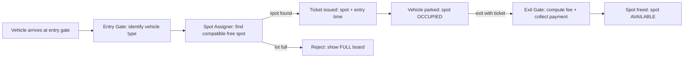
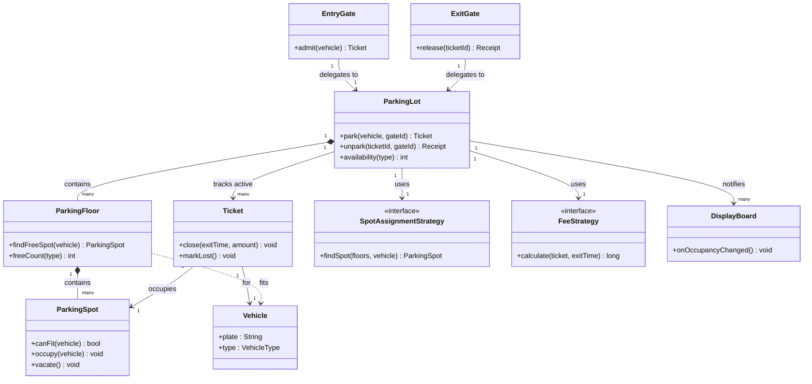
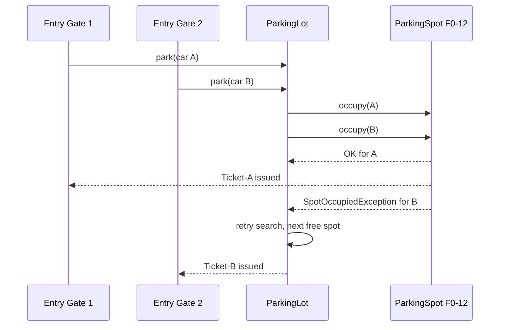

# Implement a Parking Lot

## Blogs and websites

- [Parking Lot System](https://www.techprep.app/problems/parking-lot-system?topic=low-level-system-design)

## Medium

## Youtube

- [Design A Parking Garage | Google SWE Teaches Low Level Design Episode 4](https://www.youtube.com/watch?v=-TSwjzJB74k)
- [6. Parking Lot, Low Level Design (Hindi) | SDE2 Design interview question | Design Parking Lot](https://www.youtube.com/watch?v=MtjZf7291zc)
- [Parking Lot Design | Grokking The Object Oriented Design Interview Question](https://www.youtube.com/watch?v=tVRyb4HaHgw)

## Theory

Design a parking lot assigning arriving vehicles to compatible free spots across floors and issuing tickets. Must track occupancy and compute fees on exit.
Key entities: ParkingLot, Floor, Spot (size/type), Vehicle, Ticket.
Core operations: park (issue ticket), unpark (settle fee), spot availability.

This guide turns that stub into an interview-ready low-level design: you will clarify a deliberately ambiguous problem, model clean OOP entities, choose assignment and pricing strategies, handle concurrency at the gate, and write plain Java 17 code that an interviewer can trace on a whiteboard. The emphasis is on object modeling, extensibility, and trade-offs — not frameworks, databases, or distributed systems.

> Scope note: this is LLD (class design, patterns, in-process concurrency). Capacity planning, replication, and multi-site sync belong to HLD and are mentioned only where they constrain the object model (for example, ticket IDs must stay unique if you later shard).

### Topics Covered

1. [Problem Statement](#problem-statement)
2. [Functional / Non-Functional Requirements](#functional--non-functional-requirements)
3. [Core Entities & Class Design](#core-entities--class-design)
4. [Key Design Decisions & Patterns Used](#key-design-decisions--patterns-used)
5. [Concurrency & Edge Cases](#concurrency--edge-cases)
6. [Java 17 Implementation](#java-17-implementation)
7. [Interview Questions and Answers](#interview-questions-and-answers)

---

### Problem Statement

Design a parking lot system for a multi-floor garage that assigns arriving vehicles to compatible free spots, issues a ticket on entry, tracks occupancy in real time, and computes the fee on exit.

A vehicle arrives at an entry gate. The system finds a suitable free spot (a bike cannot take a truck bay, but a bike may take a car spot depending on policy), marks it occupied, and issues a ticket recording spot, vehicle, and entry time. On exit the driver presents the ticket (or license plate), the system frees the spot, computes the fee from duration and vehicle type, collects payment, and opens the exit gate. Operators need live dashboards: free spots per floor, per type, and full/available signals at the entrance.

**Why this problem exists**

- Real garages lose revenue to double-allocation (two cars sent to one spot), stale occupancy counts, and inflexible pricing.
- The domain is rich in OOP: size compatibility, floor topology, ticket lifecycle, pricing rules, and gate concurrency all map to classic patterns.
- Interviewers love it because the happy path takes 10 minutes but the follow-ups (nearest-spot search, EV charging, reservations, thread safety) separate junior from senior answers.

**Real-life analogues**

- **Malls and airports**: multi-floor garages with display boards per floor and per row.
- **Office campuses**: reserved vs. general spots, EV bays, handicapped bays, two-wheeler zones.
- **Smart-city parking**: ANPR cameras map plates to tickets; dynamic pricing by hour and demand.

**Clarifying questions to ask in the interview (say these out loud)**

1. How many floors and spots per floor? Do floors have different layouts?
2. Which vehicle types? Bike, car, truck/bus? What about EV and handicapped spots?
3. Can a small vehicle use a larger spot? Can a large vehicle ever split spots? (No.)
4. Nearest-to-entry or any-free assignment? One entry or many entries/exits?
5. Pricing: flat, hourly, per vehicle type, first-hour-free, daily cap, EV surcharge?
6. Payment modes at exit: cash, card, UPI? What if payment fails — block exit or retry?
7. Ticket medium: paper, QR, license-plate lookup? Lost-ticket flow?
8. Reservations needed? Monthly passes? Valet mode?
9. Single machine or multi-gate concurrency? Persistence needed or in-memory is fine?
10. Admin APIs: add/remove floors, disable spots for maintenance, occupancy queries?

**Assumptions for this guide (state these if the interviewer says "decide yourself")**

- 3 floors, ~100 spots per floor; each floor has compact, large, bike, EV, and handicapped spots.
- Vehicle types: `BIKE`, `CAR`, `TRUCK`; spot sizes: `SMALL`, `MEDIUM`, `LARGE` plus boolean flags for EV and handicapped.
- Small-into-large spillover is allowed (bike into car spot) but charged at the spot rate; large-into-small is rejected.
- Nearest-spot strategy by default: lowest floor, lowest row distance from the entry used.
- Hourly pricing per vehicle type with a daily cap; EV spots add a flat charging surcharge.
- In-memory model with thread-safe gates; ticket IDs are UUIDs so a future persistent store can reuse them.
- No reservations or monthly passes in the core; extension points are shown but not fully built.



The diagram shows the full ticket lifecycle from gate to gate: assignment only succeeds on a compatible free spot, occupancy flips twice (occupy on entry, free on exit), and payment sits on the exit path so a failure never leaks a spot.

---

### Functional / Non-Functional Requirements

#### Functional requirements (must-have)

1. **Park a vehicle (entry)**
   - Accept vehicle number, vehicle type, and entry gate ID.
   - Find a compatible free spot using the configured assignment strategy.
   - Atomically mark the spot occupied and issue a ticket with ID, spot reference, vehicle snapshot, floor, entry timestamp.
   - If no compatible spot exists, reject with a clear reason (`LOT_FULL` or `NO_COMPATIBLE_SPOT`) and keep the entrance board accurate.
2. **Unpark a vehicle (exit)**
   - Accept ticket ID (primary) or vehicle number (fallback) plus exit gate ID.
   - Look up the active ticket; reject unknown, already-closed, or mismatched tickets.
   - Compute the fee from the pricing strategy, collect payment, mark the ticket closed with exit timestamp and amount, then free the spot — in that order.
   - Open the exit gate only after payment succeeds.
3. **Spot and floor management**
   - Add floors and spots at construction or via admin APIs; support disabling a spot for maintenance or marking it reserved.
   - Query free-spot count globally, per floor, and per vehicle type; list free spots for a type.
4. **Ticket management**
   - Each ticket has a unique ID, entry time, optional exit time, status (`ACTIVE`, `PAID`/`CLOSED`, `LOST`), and links to exactly one vehicle and one spot.
   - Support lost-ticket flow: verify by vehicle number plus ID proof, charge a fixed penalty or max-day rate per policy.
5. **Pricing**
   - Hourly rate per vehicle type; round durations up to the next hour (ceiling).
   - Daily cap per type; optional first-30-minutes-free and EV charging surcharge — all behind a strategy interface so rules swap without touching gates.
6. **Display boards**
   - Entrance panel shows `FULL` vs. spots available; per-floor panels show free counts by type. Updated through an observer on every occupy/free event.
7. **Admin operations**
   - Add/remove floors, open/close gates, query occupancy snapshots, export the day's revenue (sum of closed tickets).

#### Explicitly out of scope (say this to bound the interview)

- Reservations, monthly passes, and valet assignment (show the extension seam, do not build them).
- Real payment-gateway integration (a `PaymentProcessor` interface with a mock is enough).
- Multi-site sync, ANPR camera drivers, and persistent storage (UUID ticket IDs and repository interfaces keep the door open).

#### Non-functional requirements (LLD-flavoured)

- **Correctness over throughput**: never double-allocate a spot and never lose a fee; every state change is atomic at the spot or ticket level.
- **Concurrency**: multiple entry and exit gates operate simultaneously; p99 entry latency stays under ~50 ms in-memory because assignment scans are short and locks are fine-grained.
- **Extensibility**: adding a vehicle type, spot flag, or pricing rule means adding a class or enum value, not rewriting `ParkingLot` (Open/Closed Principle).
- **Testability**: assignment, pricing, and payment are injectable interfaces so unit tests can drive them with fakes and fixed clocks.
- **Readability**: an interviewer can trace `park()` → `findSpot()` → `occupy()` → `issueTicket()` and `unpark()` → `fee()` → `pay()` → `free()` in under five minutes.
- **Robustness**: invalid tickets, double exits, payment failures, and disabled spots all fail with typed exceptions, never silent corruption.
- **Observability (lightweight)**: every park/unpark emits an event consumed by display boards and a revenue counter; no logging framework needed for the interview.
- **Persistence-ready**: entities carry stable IDs and `Instant` timestamps; repository interfaces isolate the in-memory maps so a database can replace them later.

| Requirement | Target / policy | Why it matters in LLD |
|---|---|---|
| No double-parking | Spot-level lock + check-and-set | Core safety invariant |
| Fee accuracy | Ceiling hours, daily cap, money in paise/cents (long) | Avoids float rounding bugs |
| Lost ticket | Penalty rate path | Common interview follow-up |
| Disabled spots | Excluded from search, visible to admin | Maintenance reality |
| Board freshness | Synchronous observer update | Prevents sending cars to full floors |

---

### Core Entities & Class Design

The model has five entity groups: identity enums, the spot hierarchy, the vehicle value object, the ticket lifecycle object, and the orchestrators (floor, lot, gates, strategies). Keep behaviour with the data it guards: spots own occupancy transitions, tickets own lifecycle transitions, the lot owns search and issuance, and strategies own pluggable rules.

#### Enums (the vocabulary of the domain)

- `VehicleType { BIKE, CAR, TRUCK }` — what arrives.
- `SpotSize { SMALL, MEDIUM, LARGE }` — what fits where. Compatibility: `BIKE → SMALL+`, `CAR → MEDIUM+`, `TRUCK → LARGE` only.
- `SpotStatus { AVAILABLE, OCCUPIED, DISABLED, RESERVED }` — lifecycle of a bay.
- `TicketStatus { ACTIVE, CLOSED, LOST }` — lifecycle of a stay.
- `GateType { ENTRY, EXIT }` — gates are single-purpose in this design.

#### Spots: inheritance vs. composition (know both, pick composition)

Two schools exist. The inheritance school creates `BikeSpot`, `CarSpot`, `TruckSpot` subclasses. The composition school keeps one `ParkingSpot` with a `SpotSize` plus capability flags (`evCharging`, `handicapped`). Prefer composition: a single class with flags handles EV and handicapped bays without a combinatorial explosion (`EvHandicappedLargeSpot` is a smell). The class diagram below uses the composition shape.

- `ParkingSpot`: id, floor number, size, flags, status, parked vehicle reference. Methods `canFit(vehicle)`, `occupy(vehicle)` (guarded, synchronized), `vacate()`, `disable()/enable()`.
- `ParkingFloor`: floor number, ordered spot list, `findFreeSpot(vehicle)` scanning in row order, `freeCount(type)`, display snapshot.
- `Vehicle`: immutable value object — license plate, type, EV/handicapped needs. Override `equals/hashCode` on plate.
- `Ticket`: id (UUID), vehicle snapshot, spot reference, entry/exit `Instant`s, status, amount paid. Methods `close(exitTime, amount)`, `markLost()`.
- `ParkingLot` (singleton-or-injected root): floor list, active-ticket map, strategies (assignment, pricing), observers (display boards). Methods `park()`, `unpark()`, `lostTicketExit()`, `availability()`.
- `Gate`, `EntryGate`, `ExitGate`: thin facades that validate inputs and delegate to the lot; exits own the `PaymentProcessor`.
- Strategies: `SpotAssignmentStrategy` (`NearestFirstStrategy`, `FloorBalancingStrategy`), `FeeStrategy` (`HourlyFeeStrategy` with cap, `FlatFeeStrategy` for tests), `PaymentProcessor` (`CashProcessor`, `CardProcessor` mock).
- Observers: `ParkingObserver` with `DisplayBoard` (per floor + entrance) and `RevenueCounter` implementations.



The diagram shows containment (lot to floors to spots), association (tickets link one vehicle to one spot), delegation (gates to lot), pluggability (strategies as interfaces), and observation (boards subscribe to the lot).

**Key relationships and cardinalities**

- Lot 1—\* Floor; Floor 1—\* Spot. Deletion cascades downward (removing a floor retires its spots).
- Ticket \*—1 Vehicle and Ticket \*—1 Spot while active; history lists keep closed tickets for revenue and audit.
- Lot 1—\* Ticket (active map) plus an append-only closed-ticket list.
- Gates \*—1 Lot (many gates share one lot instance — the concurrency hotspot).
- Lot 1—1 assignment strategy and 1—1 fee strategy at a time; swapped by setter for tests or admin.
- Lot 1—\* observers; boards never call back into the lot (one-way notification avoids re-entrancy deadlocks).

**Where behaviour lives (tell the interviewer)**

- Compatibility (`canFit`) lives on the spot, not in a util class: `spot.canFit(vehicle)` reads naturally and keeps the size matrix in one place.
- Atomicity (`occupy`/`vacate`) lives on the spot with `synchronized` guards: the check-and-set cannot be split by two threads.
- Search (`findFreeSpot`) lives on the floor (row order) composed by the strategy (floor order): two-level ordering gives nearest-first without a global sort.
- Money (`calculate`) lives in the fee strategy: pricing changes never touch gates, spots, or tickets.
- Time lives in `Instant` + injected `Clock`: tests freeze time without `Thread.sleep`.

---

### Key Design Decisions & Patterns Used

#### Decision 1 — Composition over inheritance for spots

Subclassing spots (`BikeSpot extends ParkingSpot`) feels natural but collapses under real garages: EV bays, handicapped bays, covered vs. open, and size produce a multiplicative class tree. One `ParkingSpot` with `SpotSize` + boolean capability flags keeps the class count flat and matching logic in a single `canFit` method. New capability? Add a flag and one predicate clause — a 5-line diff the interviewer can see.

#### Decision 2 — Strategy for assignment and pricing

Hard-coding "lowest floor first" and "Rs 50/hour" inside `ParkingLot` guarantees a rewrite the moment the follow-up arrives ("now balance load across floors", "add weekend rates"). `SpotAssignmentStrategy` and `FeeStrategy` interfaces isolate volatile rules: `NearestFirstStrategy` vs. `FloorBalancingStrategy` (least-occupied floor first), `HourlyFeeStrategy` vs. `FlatFeeStrategy` vs. future `DynamicFeeStrategy`. The lot holds references and never branches on rule names — textbook Open/Closed Principle.

#### Decision 3 — Factory for spot and ticket creation

Spot construction takes five parameters (id, floor, size, EV, handicapped) and ticket creation needs UUID + timestamp wiring. `ParkingSpotFactory.create(...)` and `TicketFactory.create(vehicle, spot, clock)` centralize validation (null plates, negative floors) and keep constructors honest. Interviewers asking "where is the Factory pattern?" get a concrete pointer.

#### Decision 4 — Observer for display boards and revenue

The entrance board, per-floor boards, and the revenue dashboard all need to know when occupancy changes, but `ParkingSpot` must not import UI classes. `ParkingObserver.onOccupancyChanged(event)` with a `CopyOnWriteArrayList` of subscribers decouples them: the lot fires one event per occupy/vacate, boards recompute their own snapshots. State explicitly that notification is one-way (observers never call back into the lot during the callback) to pre-empt the re-entrancy question.

#### Decision 5 — State enums instead of a full State pattern

Spot and ticket lifecycles are small (4 and 3 states) with guarded transitions, so enums + guard clauses beat a full GoF State hierarchy that would add eight classes for no interview benefit. Name this trade-off: "I would promote to State objects if transitions gained per-state behaviour such as overstay penalties or reservation timeouts." That single sentence shows senior judgement.

#### Decision 6 — Money as long (paise), time as Instant, IDs as UUID/String

- Money in `long` minor units avoids `0.1 + 0.2` float bugs; fee math stays integer until display formatting.
- `java.time.Instant` + injectable `Clock` makes durations testable and time-zone-proof (formatting happens at the edge, never in the domain).
- Ticket IDs as UUID strings and spot IDs as `F<floor>-<row>-<n>` strings survive a future move to a database without renumbering.

#### Patterns used (say these names out loud)

| Pattern | Where | Why |
|---|---|---|
| Strategy | Spot assignment, fee calculation, payment | Swap rules without touching the lot |
| Factory | Spot and ticket creation | Centralize validation and ID generation |
| Observer | Display boards, revenue counter | One occupancy event, many read models |
| Singleton (light) | `ParkingLot` root instance | One shared in-memory state per process; injectable for tests instead of a static global |
| State (lite) | `SpotStatus` / `TicketStatus` enums with guarded transitions | Lifecycle safety without class explosion |
| Facade | Entry/exit gates | Simple gate API over lot orchestration |

**SOLID mapping (one line each for the "which principles?" follow-up)**

- Single Responsibility: spot guards occupancy, ticket guards lifecycle, strategy computes price, gate validates input.
- Open/Closed: new vehicle type, rate, or assignment rule = new enum value or class, zero edits to `park()`/`unpark()`.
- Liskov: any `FeeStrategy` or `SpotAssignmentStrategy` substitutes without breaking callers.
- Interface Segregation: small `FeeStrategy`, `PaymentProcessor`, `ParkingObserver` interfaces instead of one fat callback.
- Dependency Inversion: the lot depends on strategy interfaces; tests inject fakes.

---

### Concurrency & Edge Cases

#### The concurrency story (the senior half of the interview)

Multiple entry gates share one `ParkingLot`; two cars can race for the last compatible spot. The design layers three mechanisms from innermost to outermost:

1. **Spot-level `synchronized` check-and-set.** `occupy()` re-checks `status == AVAILABLE` inside the monitor and throws `SpotOccupiedException` if another thread won. This is the correctness core — even if search returns the same spot twice, only one occupant survives.
2. **Safe retry at the lot level.** `park()` catches `SpotOccupiedException` and retries the search a bounded number of times (e.g. 3), because the next-free spot is almost always available. Bounded retries prevent livelock when the lot is truly full.
3. **Concurrent collections for shared maps.** Active tickets live in a `ConcurrentHashMap`; observers in a `CopyOnWriteArrayList`; revenue in an `AtomicLong`. No `synchronized` on the whole `park()` path, so gates stay parallel.



The diagram shows the race resolved at the spot monitor: the loser retries instead of corrupting state, so throughput degrades gracefully rather than double-booking.

**Why not `synchronized park()`?** Coarse locking serializes every entry gate and caps throughput at one car at a time — fine for a whiteboard, indefensible at senior level. Fine-grained spot locks keep gates parallel; the only shared mutation is a map `put`, which `ConcurrentHashMap` handles.

**Exit-path ordering (say this verbatim): fee → payment → ticket close → spot free.** Freeing the spot before payment succeeds lets a car leave unpaid and the bay refill while the ledger still shows the old ticket active. On payment failure the spot stays occupied by the same ticket and the driver retries — no leak, no double-charge (payment calls carry the ticket ID as idempotency key).

#### Edge cases table (pick 4–5 to recite, keep the rest as backup)

| # | Edge case | Handling |
|---|---|---|
| 1 | Lot full / no compatible spot | Typed `NoSpotAvailableException`; board already shows FULL so the next car is diverted |
| 2 | Truck arrives, only car spots free | Rejected — large-into-small never allowed; suggest waiting or overflow policy |
| 3 | Bike into empty car spot | Allowed (spillover), charged at car-spot rate; policy flag can disable it |
| 4 | EV needs charging, plain spot free | `canFit` requires `evCharging` flag when vehicle needs it; plain spot is skipped |
| 5 | Handicapped driver, regular spot free | Handicapped bays preferred first; regular spot allowed as fallback per policy |
| 6 | Double exit / replayed ticket | Ticket status check — `CLOSED` tickets throw `InvalidTicketException` |
| 7 | Unknown or forged ticket ID | Map lookup miss → `TicketNotFoundException`; exit gate stays closed |
| 8 | Lost ticket | `lostTicketExit(plate)` verifies plate + ID proof, charges penalty rate, frees the spot, marks ticket LOST |
| 9 | Payment fails at exit | Ticket stays ACTIVE, spot stays OCCUPIED, retry with same idempotency key; gate stays closed |
| 10 | Spot disabled while occupied | Allowed to finish the stay; excluded from future searches until re-enabled |
| 11 | Floor closed for cleaning | All its spots treated as DISABLED for search; parked cars exit normally |
| 12 | Clock skew / exit before entry | Guard `exitTime >= entryTime` else throw; durations computed in seconds then ceiled to hours |
| 13 | Zero-minute stay | Minimum one billable hour (or free-grace window if policy enables it) |
| 14 | Duplicate plate entry | Allowed if plates differ per ticket — but warn: same plate with an ACTIVE ticket suggests a cloned plate or re-entry; admin override required |
| 15 | Power restart (in-memory loss) | Acknowledge: active tickets lost; production needs write-ahead log or DB — repository interfaces already isolate that swap |

---

### Java 17 Implementation

All classes below are plain Java 17 (records, sealed interfaces avoided for whiteboard simplicity, `var` used sparingly). Money is `long` paise, time is `Instant` + `Clock`, shared state uses `ConcurrentHashMap` and `synchronized` spot guards. Each block is followed by its explanation and the pattern it demonstrates.

#### 1. Enums and value objects

The enums form the domain vocabulary; `Vehicle` is an immutable value object keyed by license plate.

```java
public enum VehicleType { BIKE, CAR, TRUCK }

public enum SpotSize { SMALL, MEDIUM, LARGE }

public enum SpotStatus { AVAILABLE, OCCUPIED, DISABLED, RESERVED }

public enum TicketStatus { ACTIVE, CLOSED, LOST }

// Immutable value object: equality on license plate.
public final class Vehicle {
    private final String plateNumber;
    private final VehicleType type;
    private final boolean needsEvCharging;
    private final boolean needsHandicappedAccess;

    public Vehicle(String plateNumber, VehicleType type) {
        this(plateNumber, type, false, false);
    }

    public Vehicle(String plateNumber, VehicleType type,
                   boolean needsEvCharging, boolean needsHandicappedAccess) {
        if (plateNumber == null || plateNumber.isBlank())
            throw new IllegalArgumentException("plateNumber required");
        this.plateNumber = plateNumber.trim().toUpperCase();
        this.type = type;
        this.needsEvCharging = needsEvCharging;
        this.needsHandicappedAccess = needsHandicappedAccess;
    }

    public String plateNumber() { return plateNumber; }
    public VehicleType type() { return type; }
    public boolean needsEvCharging() { return needsEvCharging; }
    public boolean needsHandicappedAccess() { return needsHandicappedAccess; }

    @Override public boolean equals(Object o) {
        return o instanceof Vehicle v && plateNumber.equals(v.plateNumber);
    }
    @Override public int hashCode() { return plateNumber.hashCode(); }
}
```

Explanation: enums keep state transitions explicit and searchable; the `Vehicle` constructor normalizes plates (trim + upper-case) so `ka01ab1234` and `KA01AB1234` never become two identities. Immutability means tickets can safely snapshot the vehicle without defensive copies.

#### 2. ParkingSpot — compatibility plus atomic occupancy

```java
public class ParkingSpot {
    private final String spotId;      // e.g. "F0-R2-07"
    private final int floorNumber;
    private final SpotSize size;
    private final boolean evCharging;
    private final boolean handicapped;
    private SpotStatus status = SpotStatus.AVAILABLE;
    private Vehicle parkedVehicle;

    public ParkingSpot(String spotId, int floorNumber, SpotSize size,
                       boolean evCharging, boolean handicapped) {
        this.spotId = spotId;
        this.floorNumber = floorNumber;
        this.size = size;
        this.evCharging = evCharging;
        this.handicapped = handicapped;
    }

    // Composition-based fit check: size matrix + capability flags.
    public boolean canFit(Vehicle v) {
        if (status == SpotStatus.DISABLED || status == SpotStatus.RESERVED) return false;
        if (v.needsEvCharging() && !evCharging) return false;
        return switch (v.type()) {
            case BIKE -> true;                                  // bike fits anywhere
            case CAR -> size == SpotSize.MEDIUM || size == SpotSize.LARGE;
            case TRUCK -> size == SpotSize.LARGE && !evCharging; // trucks need plain large bays
        };
    }

    public synchronized void occupy(Vehicle v) {
        if (status != SpotStatus.AVAILABLE) throw new SpotOccupiedException(spotId);
        if (!canFit(v)) throw new IncompatibleSpotException(spotId, v.type());
        status = SpotStatus.OCCUPIED;
        parkedVehicle = v;
    }

    public synchronized void vacate() {
        status = SpotStatus.AVAILABLE;
        parkedVehicle = null;
    }

    public synchronized void disable() { if (status == SpotStatus.AVAILABLE) status = SpotStatus.DISABLED; }
    public synchronized void enable() { if (status == SpotStatus.DISABLED) status = SpotStatus.AVAILABLE; }

    public String spotId() { return spotId; }
    public int floorNumber() { return floorNumber; }
    public SpotSize size() { return size; }
    public synchronized SpotStatus status() { return status; }
    public boolean isFree() { return status() == SpotStatus.AVAILABLE; }
}

// Factory (Factory pattern): centralizes id format and validation.
final class ParkingSpotFactory {
    private ParkingSpotFactory() {}
    public static ParkingSpot create(int floor, int row, int num,
                                     SpotSize size, boolean ev, boolean hc) {
        if (floor < 0 || row < 0 || num < 0) throw new IllegalArgumentException("bad spot coords");
        return new ParkingSpot("F" + floor + "-R" + row + "-" + num, floor, size, ev, hc);
    }
}

// Typed failures: callers branch on type, not message strings.
class SpotOccupiedException extends RuntimeException {
    SpotOccupiedException(String spotId) { super("Spot occupied: " + spotId); }
}
class IncompatibleSpotException extends RuntimeException {
    IncompatibleSpotException(String spotId, VehicleType t) { super("Spot " + spotId + " cannot fit " + t); }
}
class NoSpotAvailableException extends RuntimeException {
    NoSpotAvailableException(VehicleType t) { super("No spot for " + t); }
}
class TicketNotFoundException extends RuntimeException {
    TicketNotFoundException(String id) { super("Ticket not found: " + id); }
}
class InvalidTicketException extends RuntimeException {
    InvalidTicketException(String msg) { super(msg); }
}
class PaymentFailedException extends RuntimeException {
    PaymentFailedException(String id) { super("Payment failed for ticket: " + id); }
}
```

Explanation: the factory owns the `F<floor>-R<row>-<n>` ID convention so spot IDs stay uniform even when floors are built by different code paths. Typed runtime exceptions let gates and tests distinguish "lot full, divert the car" from "forged ticket, keep the gate closed" without parsing strings — a small detail interviewers notice.

#### 3. Ticket, floor, and strategies (Strategy + Observer seams)

```java
import java.time.Clock;
import java.time.Instant;
import java.util.*;

// Ticket owns its lifecycle: ACTIVE -> CLOSED, or ACTIVE -> LOST.
public class Ticket {
    private final String ticketId;
    private final Vehicle vehicle;
    private final ParkingSpot spot;
    private final Instant entryTime;
    private Instant exitTime;
    private TicketStatus status = TicketStatus.ACTIVE;
    private long amountPaidPaise;

    Ticket(Vehicle vehicle, ParkingSpot spot, Instant entryTime) {
        this.ticketId = UUID.randomUUID().toString();
        this.vehicle = vehicle;
        this.spot = spot;
        this.entryTime = entryTime;
    }

    public synchronized void close(Instant exit, long amountPaise) {
        if (status != TicketStatus.ACTIVE) throw new InvalidTicketException("Ticket already closed: " + ticketId);
        if (exit.isBefore(entryTime)) throw new InvalidTicketException("Exit before entry");
        exitTime = exit; amountPaidPaise = amountPaise; status = TicketStatus.CLOSED;
    }

    public synchronized void markLost() {
        if (status != TicketStatus.ACTIVE) throw new InvalidTicketException("Ticket already closed: " + ticketId);
        status = TicketStatus.LOST;
    }

    public String ticketId() { return ticketId; }
    public Vehicle vehicle() { return vehicle; }
    public ParkingSpot spot() { return spot; }
    public Instant entryTime() { return entryTime; }
    public synchronized TicketStatus status() { return status; }
    public synchronized long amountPaidPaise() { return amountPaidPaise; }
}

// Floor scans its spots in row order; the strategy chooses the floor order.
class ParkingFloor {
    private final int floorNumber;
    private final List<ParkingSpot> spots;

    ParkingFloor(int floorNumber, List<ParkingSpot> spots) {
        this.floorNumber = floorNumber;
        this.spots = List.copyOf(spots);
    }

    Optional<ParkingSpot> findFreeSpot(Vehicle v) {
        // Prefer exact/handicapped matches first, then any compatible spot.
        return spots.stream()
            .filter(s -> s.isFree() && s.canFit(v))
            .sorted(Comparator.comparing((ParkingSpot s) ->
                v.needsHandicappedAccess() && s.size() == SpotSize.MEDIUM ? 0 : 1))
            .findFirst();
    }

    int freeCount(VehicleType t) {
        var probe = new Vehicle("PROBE", t);
        return (int) spots.stream().filter(s -> s.isFree() && s.canFit(probe)).count();
    }

    int floorNumber() { return floorNumber; }
    List<ParkingSpot> spots() { return spots; }
}

// Strategy: how to pick across floors. Swap without touching ParkingLot.
interface SpotAssignmentStrategy {
    Optional<ParkingSpot> findSpot(List<ParkingFloor> floors, Vehicle v);
}

// Default: lowest floor first (nearest the ground entry).
class NearestFirstStrategy implements SpotAssignmentStrategy {
    public Optional<ParkingSpot> findSpot(List<ParkingFloor> floors, Vehicle v) {
        return floors.stream()
            .sorted(Comparator.comparingInt(ParkingFloor::floorNumber))
            .map(f -> f.findFreeSpot(v))
            .flatMap(Optional::stream)
            .findFirst();
    }
}

// Alternative: least-occupied compatible floor first (spreads load/EV demand).
class FloorBalancingStrategy implements SpotAssignmentStrategy {
    public Optional<ParkingSpot> findSpot(List<ParkingFloor> floors, Vehicle v) {
        return floors.stream()
            .sorted(Comparator.comparingInt(f -> f.freeCount(v.type())))
            .map(f -> f.findFreeSpot(v))
            .flatMap(Optional::stream)
            .findFirst();
    }
}

// Strategy: pricing in paise. Ceiling hours + daily cap; EV adds a surcharge.
interface FeeStrategy {
    long calculate(Ticket ticket, Instant exitTime);
}

class HourlyFeeStrategy implements FeeStrategy {
    private final Map<VehicleType, Long> hourlyPaise;
    private final Map<VehicleType, Long> dailyCapPaise;
    private final long evSurchargePaise;
    private final long freeGraceSeconds;

    HourlyFeeStrategy(Map<VehicleType, Long> hourlyPaise,
                      Map<VehicleType, Long> dailyCapPaise,
                      long evSurchargePaise, long freeGraceSeconds) {
        this.hourlyPaise = Map.copyOf(hourlyPaise);
        this.dailyCapPaise = Map.copyOf(dailyCapPaise);
        this.evSurchargePaise = evSurchargePaise;
        this.freeGraceSeconds = freeGraceSeconds;
    }

    public long calculate(Ticket ticket, Instant exit) {
        long seconds = Math.max(0, exit.getEpochSecond() - ticket.entryTime().getEpochSecond());
        if (seconds <= freeGraceSeconds) return 0;
        long hours = (seconds + 3599) / 3600; // ceiling
        long days = (hours + 23) / 24;
        long base = hours * hourlyPaise.get(ticket.vehicle().type());
        long cap = days * dailyCapPaise.getOrDefault(ticket.vehicle().type(), Long.MAX_VALUE);
        long total = Math.min(base, cap);
        if (ticket.vehicle().needsEvCharging()) total += evSurchargePaise;
        return total;
    }
}
```

Explanation: `Ticket.close` guards both double-exit and clock skew in three lines — the kind of defensive lifecycle code interviewers probe for. `ParkingFloor.findFreeSpot` keeps row-order scanning local while strategies control floor order, so nearest-first vs. load-balancing is a constructor argument, not a rewrite. `HourlyFeeStrategy` shows integer-only money math (ceiling division, daily cap via `min`, EV surcharge additive) with all rates injected as maps, so a weekend-rate follow-up becomes a new `FeeStrategy`, not an `if` inside the lot.

#### 4. ParkingLot, observers, gates, and demo

```java
import java.time.Clock;
import java.time.Instant;
import java.util.*;
import java.util.concurrent.ConcurrentHashMap;
import java.util.concurrent.CopyOnWriteArrayList;
import java.util.concurrent.atomic.AtomicLong;

// Observer: one-way occupancy events to boards and revenue.
interface ParkingObserver {
    void onOccupancyChanged(String spotId, SpotStatus status, VehicleType type);
}

class DisplayBoard implements ParkingObserver {
    private final String name;
    DisplayBoard(String name) { this.name = name; }
    public void onOccupancyChanged(String spotId, SpotStatus status, VehicleType type) {
        System.out.println("[" + name + "] " + spotId + " -> " + status + " (" + type + ")");
    }
}

// ParkingLot: the orchestrator. Fine-grained locking (spot monitors +
// concurrent maps); park() retries on lost races instead of holding a global lock.
public class ParkingLot {
    private final List<ParkingFloor> floors;
    private final Map<String, Ticket> activeTickets = new ConcurrentHashMap<>();
    private final List<Ticket> history = Collections.synchronizedList(new ArrayList<>());
    private final List<ParkingObserver> observers = new CopyOnWriteArrayList<>();
    private final AtomicLong revenuePaise = new AtomicLong();
    private SpotAssignmentStrategy assignment;
    private FeeStrategy feeStrategy;
    private final Clock clock;
    private static final int MAX_RETRIES = 3;

    public ParkingLot(List<ParkingFloor> floors, SpotAssignmentStrategy assignment,
                      FeeStrategy fees, Clock clock) {
        this.floors = List.copyOf(floors);
        this.assignment = assignment;
        this.feeStrategy = fees;
        this.clock = clock;
    }

    public void addObserver(ParkingObserver o) { observers.add(o); }
    public void setAssignment(SpotAssignmentStrategy s) { this.assignment = s; }
    public void setFeeStrategy(FeeStrategy f) { this.feeStrategy = f; }

    public Ticket park(Vehicle vehicle) {
        for (int attempt = 0; attempt < MAX_RETRIES; attempt++) {
            var spotOpt = assignment.findSpot(floors, vehicle);
            if (spotOpt.isEmpty()) throw new NoSpotAvailableException(vehicle.type());
            var spot = spotOpt.get();
            try {
                spot.occupy(vehicle); // atomic check-and-set; loser throws
            } catch (SpotOccupiedException | IncompatibleSpotException e) {
                continue; // lost the race or stale scan: retry with fresh search
            }
            var ticket = new Ticket(vehicle, spot, clock.instant());
            activeTickets.put(ticket.ticketId(), ticket);
            notify(spot.spotId(), SpotStatus.OCCUPIED, vehicle.type());
            return ticket;
        }
        throw new NoSpotAvailableException(vehicle.type());
    }

    // Exit path order: fee -> payment -> ticket close -> spot free -> notify.
    public Receipt unpark(String ticketId, PaymentProcessor payment) {
        var ticket = activeTickets.get(ticketId);
        if (ticket == null) throw new TicketNotFoundException(ticketId);
        Instant now = clock.instant();
        long fee = feeStrategy.calculate(ticket, now);
        if (!payment.collect(ticketId, fee)) throw new PaymentFailedException(ticketId);
        ticket.close(now, fee);
        ticket.spot().vacate();
        activeTickets.remove(ticketId);
        history.add(ticket);
        revenuePaise.addAndGet(fee);
        notify(ticket.spot().spotId(), SpotStatus.AVAILABLE, ticket.vehicle().type());
        return new Receipt(ticketId, fee, now);
    }

    // Lost-ticket flow: verify by plate, charge a flat penalty, free the spot.
    public Receipt lostTicketExit(String plateNumber, PaymentProcessor payment, long penaltyPaise) {
        var ticket = activeTickets.values().stream()
            .filter(t -> t.vehicle().plateNumber().equalsIgnoreCase(plateNumber)
                      && t.status() == TicketStatus.ACTIVE)
            .findFirst()
            .orElseThrow(() -> new TicketNotFoundException("plate:" + plateNumber));
        if (!payment.collect(ticket.ticketId(), penaltyPaise))
            throw new PaymentFailedException(ticket.ticketId());
        ticket.markLost();
        ticket.spot().vacate();
        activeTickets.remove(ticket.ticketId());
        revenuePaise.addAndGet(penaltyPaise);
        notify(ticket.spot().spotId(), SpotStatus.AVAILABLE, ticket.vehicle().type());
        return new Receipt(ticket.ticketId(), penaltyPaise, clock.instant());
    }

    public int availability(VehicleType t) {
        var probe = new Vehicle("PROBE", t);
        return floors.stream()
            .mapToInt(f -> (int) f.spots().stream()
                .filter(s -> s.isFree() && s.canFit(probe)).count())
            .sum();
    }

    public long revenuePaise() { return revenuePaise.get(); }

    private void notify(String spotId, SpotStatus s, VehicleType t) {
        for (var o : observers) o.onOccupancyChanged(spotId, s, t);
    }

    // Thin gate facades: validate input shape, delegate orchestration to the lot.
    public static final class EntryGate {
        private final ParkingLot lot; private final String gateId;
        public EntryGate(ParkingLot lot, String gateId) { this.lot = lot; this.gateId = gateId; }
        public Ticket admit(Vehicle v) { return lot.park(v); }
    }

    public static final class ExitGate {
        private final ParkingLot lot; private final String gateId; private final PaymentProcessor payment;
        public ExitGate(ParkingLot lot, String gateId, PaymentProcessor payment) {
            this.lot = lot; this.gateId = gateId; this.payment = payment;
        }
        public Receipt release(String ticketId) { return lot.unpark(ticketId, payment); }
    }

    public record Receipt(String ticketId, long amountPaise, Instant exitTime) {}
}

// Payment seam (Strategy): mock in the interview, gateway in production.
interface PaymentProcessor {
    boolean collect(String idempotencyKey, long amountPaise);
}

class MockPaymentProcessor implements PaymentProcessor {
    private final boolean approve;
    MockPaymentProcessor(boolean approve) { this.approve = approve; }
    public boolean collect(String key, long amountPaise) { return approve; }
}

// Demo wiring: build a 2-floor lot, park, exit, print boards and revenue.
class ParkingLotDemo {
    public static void main(String[] args) {
        var floor0 = new ParkingFloor(0, List.of(
            ParkingSpotFactory.create(0, 0, 1, SpotSize.SMALL, false, false),
            ParkingSpotFactory.create(0, 0, 2, SpotSize.MEDIUM, false, false),
            ParkingSpotFactory.create(0, 0, 3, SpotSize.LARGE, false, false)));
        var floor1 = new ParkingFloor(1, List.of(
            ParkingSpotFactory.create(1, 0, 1, SpotSize.MEDIUM, true, false),
            ParkingSpotFactory.create(1, 0, 2, SpotSize.LARGE, false, true)));
        var fees = new HourlyFeeStrategy(
            Map.of(VehicleType.BIKE, 2000L, VehicleType.CAR, 5000L, VehicleType.TRUCK, 10000L),
            Map.of(VehicleType.BIKE, 10000L, VehicleType.CAR, 30000L, VehicleType.TRUCK, 60000L),
            3000L, 1800L); // EV surcharge, 30-min grace
        var lot = new ParkingLot(List.of(floor0, floor1),
            new NearestFirstStrategy(), fees, Clock.systemUTC());
        lot.addObserver(new DisplayBoard("Entrance"));
        var entry = new ParkingLot.EntryGate(lot, "IN-1");
        var exit = new ParkingLot.ExitGate(lot, "OUT-1", new MockPaymentProcessor(true));

        var ticket = entry.admit(new Vehicle("KA01AB1234", VehicleType.CAR));
        System.out.println("Parked at " + ticket.spot().spotId() + ", free CAR spots: "
            + lot.availability(VehicleType.CAR));
        var receipt = exit.release(ticket.ticketId());
        System.out.println("Paid paise: " + receipt.amountPaise()
            + ", revenue: " + lot.revenuePaise());
    }
}
```

Explanation: `ParkingLot` is the only class that knows the whole workflow, and it stays thin by delegating fit-checks to spots, ordering to the assignment strategy, pricing to the fee strategy, and charging to the payment seam — each mockable in tests. The retry loop around `occupy` is the concurrency answer in code form: no global lock, bounded retries, typed failure when truly full. Exit ordering (fee, payment, close, vacate, notify) guarantees a failed payment never frees a bay. The demo builds a 2-floor lot in ~20 lines, which is exactly the live-coding arc to reproduce on a whiteboard: floors, strategies, lot, gates, park, unpark.

**How to extend (name these without building them)**

- Reservations: add `RESERVED` handling in `canFit` plus a `Reservation` object checked before `occupy`; the retry loop already tolerates contention.
- Monthly passes: a `PassValidator` consulted in `park()` that bypasses ticket issuance for known plates.
- Dynamic pricing: a new `FeeStrategy` reading occupancy from `availability()`; no lot changes.

---

### Interview Questions and Answers

1. **Beginner: walk me through the classes in your parking lot.**
   Answer: `Vehicle` (immutable, keyed by plate), `ParkingSpot` (size + flags, owns `canFit`/`occupy`/`vacate`), `ParkingFloor` (ordered spots, row scan), `Ticket` (entry/exit/status lifecycle), `ParkingLot` (search, issuance, fee, payment orchestration), `EntryGate`/`ExitGate` facades, plus `SpotAssignmentStrategy`, `FeeStrategy`, `PaymentProcessor` interfaces and `DisplayBoard` observers. Entry flow is `admit → park → findSpot → occupy → ticket`; exit flow is `release → fee → pay → close → vacate`.

2. **Beginner: how do you decide which spot a vehicle gets?**
   Answer: two-level ordering — the strategy picks floor order (nearest-first = lowest floor), the floor scans spots in row order returning the first `isFree && canFit`. Compatibility matrix: bike fits anywhere, car needs medium or large, truck needs a plain large bay; EV need requires the EV flag. Small-into-large spillover is allowed by policy but charged at the spot's rate; large-into-small is always rejected.

3. **Beginner: how is the parking fee calculated?**
   Answer: `HourlyFeeStrategy` takes `(exit − entry)` in seconds, applies a grace window (free under 30 minutes), ceilings to hours, multiplies by the per-type hourly rate, caps at `days × daily cap`, then adds the EV surcharge. All money is `long` paise so there is no float rounding; rates are injected maps so tests and admin can swap them.

4. **Junior: why composition over inheritance for spots?**
   Answer: subclasses explode combinatorially once EV, handicapped, covered, and size combine (`EvHandicappedLargeSpot`). One `ParkingSpot` with `SpotSize` + boolean flags keeps the class count at one and the matching rule in one `canFit` method. I would switch to subclasses only if spot types gained genuinely different behaviour (e.g. a valet-only bay with its own workflow), not just different data.

5. **Junior: where do the design patterns appear?**
   Answer: Strategy for assignment, pricing, and payment (all swappable interfaces); Factory for spot/ticket creation (ID format + validation in one place); Observer for display boards and revenue (one occupancy event, many readers); Facade for gates (simple admit/release over lot orchestration); State-lite via status enums with guarded transitions. Singleton only lightly for the lot root — and I inject it in tests rather than using a static global.

6. **Junior: what happens on a lost ticket?**
   Answer: the driver gives plate number plus ID proof at the exit; `lostTicketExit` finds the ACTIVE ticket by plate, charges a flat penalty (or max-day rate per policy), marks the ticket LOST, frees the spot, and records revenue. Forged or unknown plates throw `TicketNotFoundException` and the gate stays closed — the spot is never freed without a ledger entry.

7. **Mid: two entry gates race for the last spot — how do you prevent double-booking?**
   Answer: correctness lives in `ParkingSpot.occupy`, which is `synchronized` and re-checks `AVAILABLE` inside the monitor — exactly one thread wins, the loser gets `SpotOccupiedException`. `ParkingLot.park` catches it and retries the search up to 3 times for the next-free spot. Shared maps are `ConcurrentHashMap`/`CopyOnWriteArrayList` so there is no global `park()` lock serializing the gates.

8. **Mid: why must the exit order be fee → payment → close → free?**
   Answer: any earlier `vacate` leaks revenue (car leaves, bay refills, old ticket still ACTIVE) or corrupts the ledger on payment failure. With fee-first ordering, a failed payment leaves ticket ACTIVE and spot OCCUPIED, so the driver simply retries with the same idempotency key — no double charge, no lost bay. The gate opens only after `close` succeeds.

9. **Mid: how would you add reservations or monthly passes without rewriting?**
   Answer: reservations slot into the existing seams: a `Reservation` record checked in `park()` before `occupy`, with `RESERVED` spots excluded from `canFit` for walk-ins; overstay past the reservation window falls back to hourly billing via a new `FeeStrategy`. Monthly passes add a `PassValidator` consulted at entry that skips ticket issuance for known plates. Neither touches spot locking or exit ordering.

10. **Senior: your lot is full at peak and search scans every spot per arrival. How do you scale assignment?**
    Answer: keep per-floor, per-type free-counters (incremented on vacate, decremented on occupy) so `findSpot` skips floors with zero compatible free spots without scanning; that turns the common full-floor case into O(floors). For very large garages, shard assignment by zone (one strategy instance per zone) or maintain per-type free-queues — but only after measuring, because the scan is microseconds for hundreds of spots and premature indexing adds consistency bugs between the queue and spot state.

11. **Senior: how do you test time-dependent pricing and concurrent entry?**
    Answer: inject a fixed `Clock` (`Clock.fixed(...)`) so fee tests assert exact hour boundaries, grace windows, and daily caps deterministically — no sleeps. For concurrency, park N threads against M < N compatible spots with a `CountDownLatch` start gate and assert exactly M tickets issued plus `NoSpotAvailableException` for the rest, then verify `availability` returns to baseline after all exits. Payment gets a scripted fake (approve/decline per ticket ID) to cover the failure path.

12. **Senior: this is in-memory. What breaks first in production, and what is the minimal durable design?**
    Answer: process restart loses active tickets and revenue — cars are physically parked but the system shows empty bays. The minimal fix keeps the object model and swaps the seams: persist tickets and spot states through a repository interface (write-ahead on `occupy`/`close`), use DB-generated or coordinated IDs if multiple gate servers share state, and treat the in-memory maps as a cache. The UUID ticket IDs, `Instant` timestamps, and repository-shaped access already anticipate that move, so the domain classes do not change.

---


Explanation: `Ticket.close` guards both double-exit and clock skew in three lines — the kind of defensive lifecycle code interviewers probe for. `ParkingFloor.findFreeSpot` keeps row-order scanning local while strategies control floor order, so nearest-first vs. load-balancing is a constructor argument, not a rewrite. `HourlyFeeStrategy` shows integer-only money math (ceiling division, daily cap via `min`, EV surcharge additive) with all rates injected as maps, so a weekend-rate follow-up becomes a new `FeeStrategy`, not an `if` inside the lot.

---

Explanation: `canFit` is the whole compatibility matrix in one readable method — spillover (bike anywhere, car into large) plus EV/handicapped guards. `occupy` is `synchronized` so the check-and-set is atomic: two gates racing on the same spot get exactly one winner and one `SpotOccupiedException`. `disable` refuses to evict an occupied bay, which handles the maintenance edge case without extra state.

---
