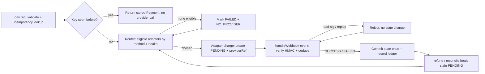
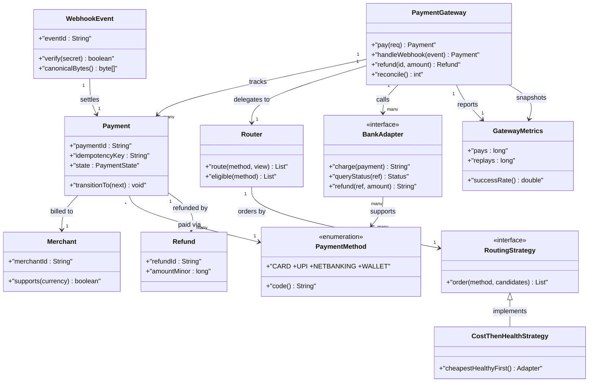
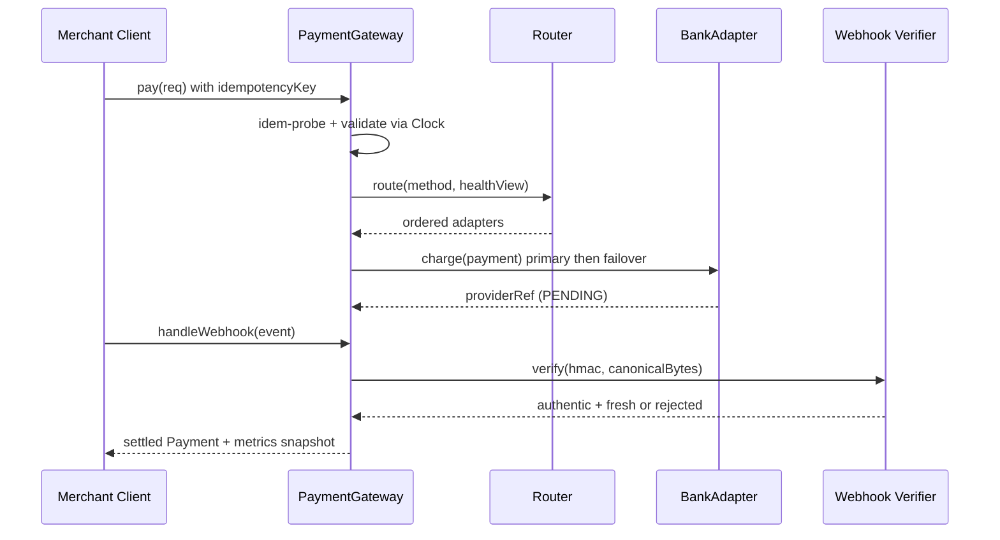

# Payment Gateway

## Blogs and websites

## Medium

## Youtube

- [LLD of Payment Gateway | Low Level Design of Payments App](https://www.youtube.com/watch?v=Qcr3FhS2vDQ)

## Theory

Design a gateway routing merchant payments across providers/methods with retries and status tracking. Must handle idempotency, callbacks/webhooks, and reconciliation.
Key entities: Merchant, Payment/Order, PaymentMethod, Provider, Webhook.
Core operations: initiate payment, handle callback, refund, reconcile.

This guide turns that stub into an interview-ready low-level design: you will clarify an intentionally ambiguous merchant gateway, model clean OOP entities around Merchant, Payment, PaymentMethod, BankAdapter, and WebhookEvent, choose provider routing (rule-based with health-aware failover) behind a pluggable RoutingStrategy, gate every charge behind an idempotency key plus a strict payment state machine plus HMAC-verified webhooks with reconciliation, and write plain Java 17 code an interviewer can trace on a whiteboard. The emphasis is on object modeling, routing mechanics, and money-correctness — not bank settlement networks, PCI vault hardware, or distributed ledger consensus.

> Scope note: this is LLD (class design, patterns, in-process concurrency). Multi-region active-active settlement, card-network authorization protocols, PCI-DSS vault appliances, and fraud-ML scoring belong to HLD and are mentioned only where they constrain the object model (for example, every Payment carries merchantId plus orderId plus idempotencyKey plus providerRef so a retry or late webhook never double-charges or double-refunds).

### Topics Covered

1. [Problem Statement](#problem-statement)
2. [Functional / Non-Functional Requirements](#functional--non-functional-requirements)
3. [Core Entities & Class Design](#core-entities--class-design)
4. [Key Design Decisions & Patterns Used](#key-design-decisions--patterns-used)
5. [Concurrency & Edge Cases](#concurrency--edge-cases)
6. [Java 17 Implementation](#java-17-implementation)
7. [Interview Questions and Answers](#interview-questions-and-answers)

---

### Problem Statement

Design a merchant `PaymentGateway` that accepts a charge request with `merchantId`, `orderId`, `amount`, `currency`, `paymentMethod` (CARD, UPI, NETBANKING, WALLET), and a client-supplied `idempotencyKey`. The gateway validates the request, picks a provider via a `Router` (rule-based: method support, then cost, then health), invokes the chosen `BankAdapter`, and creates a `Payment` in PENDING state with a unique `paymentId`. The provider later confirms via a signed `WebhookEvent`; the gateway verifies the HMAC signature, applies the state transition exactly once, and supports `refund(paymentId)` plus a `reconcile()` pass that heals PENDING payments stuck past a timeout. No retry may double-charge, no forged or replayed webhook may move money, and no refund may exceed the captured amount.

A `pay(request)` returns the same `Payment` for the same idempotency key without calling the provider twice; a `handleWebhook(event)` verifies signature, dedupes by event id, and commits SUCCESS or FAILED atomically; a `refund(paymentId, amount)` issues a provider refund and marks REFUNDED or PARTIALLY_REFUNDED; a `reconcile()` pass queries provider status for stale PENDING payments and converges them. Duplicate submits behave as replays: same key returns the stored result and never counts as a second charge for metrics purity. An optional `ProviderHealth` seam models circuit-breaking so tests assert failover without real banks.

**Why this problem exists**

- Real gateway bugs cluster in three places: retry storms that double-charge because no idempotency key guards the provider call, webhooks applied without signature checks or dedupe so a replay flips FAILED back to SUCCESS, and refund paths that never reconcile against provider truth so ledgers drift silently.
- The domain maps to two classic design ideas: provider selection is a textbook Strategy plus Adapter pairing (routing rules pick, adapters normalize heterogeneous bank APIs), and money movement is a textbook State plus Idempotency family (payment lifecycle states with exactly-once webhook application).
- Interviewers love it because the happy path takes 10 minutes (request plus router plus adapter plus webhook) but the follow-ups (where does idempotency live, who owns the state transition, how do late webhooks reconcile, how do concurrent retries stay atomic) separate API recall from modeled reasoning.

**Real-life analogues**

- **Razorpay, Stripe, Adyen gateway layer**: merchant orders, idempotency keys on charges, provider routing with failover, signed webhooks plus reconciliation jobs.
- **UPI PSP switch and card acquirer failover**: method-aware routing (UPI to one PSP, cards to another) with health-gated retries and callback reconciliation.
- **Wallet refund and marketplace settlement**: partial refunds against a captured payment with an auditable refund ledger and end-of-day reconcile.

**Clarifying questions to ask in the interview (say these out loud)**

1. Topology: one gateway instance per interview or multi-merchant registry? Onboard providers statically or dynamic registration?
2. Method model: fixed CARD/UPI/NETBANKING/WALLET enum or open-ended method registry with capability flags?
3. Routing rule: method-support first, then cost, then health — or latency-weighted, or merchant-pinned provider?
4. Retry policy: how many provider attempts before FAILED? Failover to next provider automatic or caller-driven?
5. Idempotency scope: key per merchant plus order, or global? TTL on keys — 24h, 7 days, or forever?
6. Webhook trust: HMAC-SHA256 shared secret per provider, asymmetric signature, or source-IP allowlist?
7. Refund model: full only or partial and multiple partials up to captured amount? Who generates refund ids?
8. Reconciliation cadence: lazy on status read, eager sweeper thread, or explicit `reconcile()` the interviewer calls?
9. Amount handling: minor units (paise/cents) as long, currency validation, multi-currency conversion in scope?
10. Observability: charge success rate per provider, webhook lag, reconcile-healed count, refund totals audited?

**Assumptions for this guide (state these if the interviewer says "decide yourself")**

- Single `PaymentGateway` facade with an in-memory merchant plus provider registry built at construction; methods are a closed `PaymentMethod` enum.
- Routing default: eligible adapters supporting the method, ordered by cost then by health score; unhealthy (circuit OPEN) adapters skipped; failover tries next eligible once.
- Idempotency key scoped per merchant: `(merchantId, idempotencyKey)` maps to exactly one paymentId; keys retained for the process lifetime, TTL 24h conceptually.
- Payment TTL: PENDING older than 15 minutes is stale and eligible for `reconcile()` healing; injectable `Clock` so tests advance time without sleeping.
- Webhooks carry `eventId`, `providerPaymentRef`, `status`, `hmac`; signature is HMAC-SHA256 over canonical payload with per-provider secret; dedupe set on event ids.
- Amounts in minor units (`long`), single currency per payment, no FX conversion; partial refunds allowed while sum stays within captured amount.
- In-memory only, no persistence; `refund` issues a synchronous provider refund call through the same adapter.
- All public methods safe for concurrent use; one monitor guards pay plus webhook plus refund plus reconcile.



The diagram shows the guarded money loop from pay to webhook: idempotency gates every provider call, routing plus health gates every attempt, and only verified deduped webhooks commit state so replays and forgeries never move money.

---

### Functional / Non-Functional Requirements

#### Functional requirements (must-have)

1. **Merchant and method-validated charge intake**
   - Support `PaymentMethod CARD, UPI, NETBANKING, WALLET`; reject null merchant, unknown method, non-positive amount, or unsupported currency with typed exceptions.
   - `pay(request)` validates, checks the `(merchantId, idempotencyKey)` index first, and only then routes; same key always returns the same paymentId.
2. **Exclusive payment identity**
   - One live `Payment` per `(merchantId, idempotencyKey)`; a replay never creates a second payment or second provider charge.
   - Duplicate `orderId` with a different key is a new payment attempt (caller error surfaced), never a silent merge.
3. **Routed provider charge with failover**
   - `Router` selects among registered `BankAdapter`s by method support, then cost, then health; unhealthy adapters are skipped.
   - One automatic failover to the next eligible adapter on timeout or adapter error; beyond that the payment stays PENDING until webhook or reconcile.
4. **Signed webhook application**
   - `handleWebhook(event)` verifies HMAC with the provider secret, dedupes by `eventId`, resolves the payment by `providerRef`, and applies SUCCESS or FAILED exactly once.
   - Forged signatures raise `InvalidSignatureException` with no state change; replays return the stored outcome without re-applying.
5. **Refund with cap enforcement**
   - `refund(paymentId, amount)` allows full or multiple partial refunds while the cumulative refunded total stays within the captured amount.
   - Refund calls the owning adapter, records a `Refund` entry with unique refundId, and transitions to REFUNDED or PARTIALLY_REFUNDED.
6. **Reconciliation dual path**
   - Lazy healing on `status(paymentId)` for stale PENDING plus eager `reconcile()` that polls each stale payment provider status and converges state.
   - Reconcile uses the same state-commit path as webhooks so metrics cannot double-count a payment healed twice.
7. **Pluggable routing strategies**
   - `RoutingStrategy` interface with `route(method, candidates)` hook; CostThenHealth default, MethodPinned and RoundRobin variants provided.
   - Strategies never cache liveness; the gateway passes a snapshot view of adapter health per call.
8. **Status and metrics facade**
   - Public API `pay`, `handleWebhook`, `refund`, `status`, `reconcile`, `metrics` returns result objects; unknown paymentIds or providers throw typed exceptions.

#### Explicitly out of scope (say this to bound the interview)

- Card-network authorization, 3-D Secure orchestration, and bank settlement file processing (the payment carries enough refs for HLD to add them).
- PCI vault tokenization hardware and card-data storage (methods carry masked refs or tokens, never raw PAN).
- Fraud scoring and dispute or chargeback workflows (record the status hook so HLD can add them).

#### Non-functional requirements (LLD-flavoured)

- **Correctness over speed**: no double charge and no unverified money movement are ever observable; idempotency and signature gates run before state mutation.
- **O(P) route pick by construction**: provider shortlist scan over registered adapters avoids full-ledger scans on every pay.
- **Extensibility**: adding a new provider means adding one `BankAdapter` class plus registration, not rewriting `pay`.
- **Testability**: router, clock, HMAC secrets, and adapters are plain injectable seams drivable with fixed amounts and a manual clock.
- **Readability**: an interviewer can trace `pay()` → `dedupe()` → `route()` → `charge()` and `webhook()` → `verify()` → `commit()` in under five minutes.
- **Determinism**: no randomness except injectable id and ref sources; no wall-clock dependence except an injectable clock.
- **Observability (lightweight)**: every pay, replay, route-failover, webhook verification, refund, and reconcile-heal increments a counter snapshotted as `GatewayMetrics`.

| Requirement | Target / policy | Why it matters in LLD |
|---|---|---|
| No double charge | Idempotency index checked before any adapter call | Core money invariant |
| No forged webhook | HMAC-SHA256 verify plus event dedupe | Security-truth follow-up |
| Failover frugality | Cheapest healthy eligible adapter first | Where juniors fail |
| Exactly-once commit | State machine allows one terminal write | Most-tested correctness probe |
| Atomic pay path | Dedupe-plus-create under one monitor | Replay race guard |
| Reconcilable PENDING | Injectable clock plus provider poll | No-sleep test design |

### Core Entities & Class Design

The model has four entity groups: the PaymentGateway facade callers touch, the Merchant plus Payment plus PaymentMethod money value objects holding identity plus amount truth, the Router plus BankAdapter plus ProviderHealth routing pipeline holding eligibility plus cost plus failover truth, and the WebhookEvent plus Refund plus GatewayMetrics verification pipeline holding signature plus exactly-once plus ledger truth. Keep behaviour with the data it guards: payments own state transitions, routers own candidate ordering, adapters own provider normalization, webhooks own signature truth, and the gateway owns atomicity.

#### Value objects and supporting types (the vocabulary of the domain)

- `PaymentMethod`: closed enum CARD, UPI, NETBANKING, WALLET with `code()` — routing eligibility is a set-membership test so an adapter either supports a method or is never offered it.
- `Merchant`: onboarded payee with `merchantId`, `name`, `supportedCurrency`, plus per-provider credential refs; method `supports(currency)` gates intake before routing.
- `Payment`: money record with `paymentId`, `merchantId`, `orderId`, `idempotencyKey`, `amountMinor`, `currency`, `method`, `state` (CREATED versus PENDING versus SUCCESS versus FAILED versus REFUNDED versus PARTIALLY_REFUNDED), `providerRef`, `adapterName`, `createdAtMillis`, plus refunded-total.
- `Money`: minor-units value object — `amountMinor` as long plus `currency` string, method `addRefund(amount)` enforcing cap so over-refund is unrepresentable.
- `PayRequest`: intake DTO — `merchantId`, `orderId`, `amountMinor`, `currency`, `method`, `idempotencyKey`; validation rejects nulls, unknown merchants, and non-positive amounts at construction.
- `WebhookEvent`: callback record — `eventId`, `providerName`, `providerRef`, `status` (SUCCESS versus FAILED), `amountMinor`, `hmac`, `receivedAtMillis`; plain payload canonicalization lives here.
- `Refund`: ledger entry — `refundId`, `paymentId`, `amountMinor`, `providerRefundRef`, `createdAtMillis`; immutable once committed.
- `Clock`: millis source interface — `SystemClock` for production, `ManualClock` for tests with `advance(millis)`; every staleness comparison goes through it.
- `GatewayMetrics`: immutable snapshot — pays, replays, routeFailovers, webhooksAccepted, webhooksRejected, refunds, reconciled, plus derived `successRate()`.

#### Gateway, routers, and adapters

- `PaymentGateway`: owns `Map<String, Merchant> merchants`, `Map<String, BankAdapter> adapters`, `Map<IdemKey, String> idemIndex`, `Map<String, Payment> payments`, `Set<String> seenEvents`, `RoutingStrategy strategy`, `Clock`, counters. Methods `pay(req)`, `handleWebhook(event)`, `refund(paymentId, amount)`, `status(paymentId)`, `reconcile()`, `metrics()`.
- `Router`: eligibility plus ordering facade — `eligible(method)` filters adapters by `supports(method)` and circuit CLOSED, then delegates ordering to the strategy; method `route(method, view)` returns ordered adapter list.
- `RoutingStrategy` (interface): `order(method, candidates)` returning ordered list, `name()` for metrics labels.
- `CostThenHealthStrategy`: sorts eligible adapters by cost ascending then health score descending — cheapest healthy adapter first, frugal by construction, O(P log P) in providers not O(N) in payments.
- `MethodPinnedStrategy`: per-method pinned adapter map with health-gated fallback to cost order; preserves merchant contracts while allowing failover.
- `RoundRobinStrategy`: rotating index over eligible adapters for load spread; simpler but ignores cost, provided to make the trade-off discussable.
- `BankAdapter` (interface): `name()`, `supports(method)`, `cost()`, `charge(payment)` returning providerRef, `queryStatus(providerRef)`, `refund(providerRef, amount)`, `secret()` for HMAC — every provider quirk normalizes here.
- `ProviderHealth`: circuit per adapter — CLOSED versus OPEN with failure counting, `recordSuccess()`, `recordFailure()`, `isAvailable()`; failover skips OPEN adapters.

#### Verify, refund, and observability pipeline

- Verify pipeline inside `handleWebhook`: resolve secret by provider name, HMAC-verify canonical bytes, dedupe event id, resolve payment by providerRef, amount-match guard, then commit terminal state once.
- Refund pipeline inside `refund`: liveness gate (only SUCCESS or PARTIALLY_REFUNDED), cap gate (cumulative plus new stays within captured), adapter refund call, then commit REFUNDED or PARTIALLY_REFUNDED with ledger entry.
- Reconcile pipeline inside `reconcile()`: snapshot stale PENDING ids under lock, call owning adapter `queryStatus`, commit via the same terminal-write path as webhooks, count healed — never double-counts.
- Observer seam: `status` performs lazy healing for a single stale payment without coupling the gateway to a scheduler framework.
- Metrics pipeline: every return path increments exactly one counter family — pay, replay, failover, webhook accept or reject, refund, reconcile-heal — so success-rate math stays reproducible.



The diagram shows containment (gateway to payments and refunds), routing (gateway to router to strategy to adapters), settlement (webhook to payment), and billing (payment to merchant plus method) — the four relationships to name in the interview.

**Key relationships and cardinalities**

- PaymentGateway 1—0..N Payment objects; exactly 0..1 payment per `(merchantId, idempotencyKey)`, so replays never double-charge observably.
- PaymentGateway 1—1..N BankAdapter registrations; each adapter N—1..M PaymentMethod support flags so eligibility is a join, never string matching.
- Payment 1—1 Merchant plus 1—1 PaymentMethod at a time; insertion links both, terminal states never relink either.
- Payment 1—0..N Refund entries; cumulative refunded total is a fold over the ledger, capped at captured amount by construction.
- WebhookEvent N—1 Payment via providerRef; event ids are globally deduped so one callback settles exactly one payment once.
- PaymentGateway 1—1 RoutingStrategy at a time; strategy swap needs no state migration because strategies hold no payment cache.

**Where behaviour lives (tell the interviewer)**

- Identity truth lives in the idempotency index: `(merchantId, idempotencyKey)` to paymentId checked before any adapter call, so retries cannot fork payments.
- Eligibility truth lives in the router: method support plus circuit state filter before ordering, so no strategy can offer a dead or incapable adapter.
- Money truth lives in the payment: `transitionTo(next)` validates the state machine (PENDING to SUCCESS or FAILED, SUCCESS to PARTIALLY_REFUNDED or REFUNDED), so illegal jumps throw.
- Signature truth lives in the webhook object: canonical bytes plus HMAC-SHA256 plus constant-time compare, so verify and dedupe cannot disagree on authenticity.
- Provider truth lives behind the adapter: charge, query, and refund normalize heterogeneous bank APIs so the gateway never branches on provider names.

---

### Key Design Decisions & Patterns Used

#### Decision 1 — Idempotency index before any provider call (the hook)

Every `pay` first probes `Map<IdemKey, String>` under the gateway monitor; a hit returns the stored payment with a replay counter increment and zero adapter traffic. Say the trade-off verbatim: key-per-(merchant, key) retention costs one map entry per unique charge but buys exactly-once submission across client retries, load-balancer replays, and double-clicks; without it every timeout retry is a potential double charge. Name the invariant: index insert plus payment insert plus first charge-attempt share one critical section, so two racing retries with the same key fork at most one provider call.

#### Decision 2 — Routing as eligibility filter plus pluggable ordering

The `Router` splits the problem: `eligible(method)` applies hard gates (supports method, circuit CLOSED), then the `RoutingStrategy` applies soft ordering (cost, health score, pinning, round-robin). State the rationale verbatim — filters protect money (never call an adapter that cannot handle the method), ordering protects margin (cheapest healthy first) — and a future latency-weighted strategy is a one-class change. The `ProviderHealth` circuit owns the failover signal so a failing adapter is skipped without removing its registration.

#### Decision 3 — State machine with single terminal commit

`PaymentState { CREATED, PENDING, SUCCESS, FAILED, PARTIALLY_REFUNDED, REFUNDED }` makes illegal transitions unrepresentable: webhooks move PENDING to SUCCESS or FAILED once; refunds move SUCCESS to PARTIALLY_REFUNDED or REFUNDED; reconcile uses the identical commit path. Say the scope sentence: only PENDING converges, terminal states reject every webhook with a deduped replay result, so a late SUCCESS can never resurrect a FAILED payment or vice versa.

#### Decision 4 — Webhooks as verify-then-dedupe-then-commit

Verification is HMAC-SHA256 over canonical `providerRef|status|amountMinor` bytes with the per-provider secret, compared in constant time; dedupe is a `seenEvents` set on `eventId` checked inside the same monitor; commit resolves the payment by providerRef and amount-matches before writing. Say the metrics rule verbatim — forged or replayed events count as rejected, never settled — because conflating them is the classic grading trap. The injectable `Clock` plus `queryStatus` poll makes late or missing webhooks deterministic: tests advance a manual clock instead of waiting.

#### Decision 5 — Single-monitor atomicity with provider calls at the edge

`pay`, `handleWebhook`, `refund`, and `reconcile` synchronize on the gateway; dedupe-probe plus payment-create plus index-link share the same monitor so two racing retries never fork two payments. Provider `charge` is invoked inside the commit for interview simplicity (pay must not report PENDING without a providerRef) but the `BankAdapter` seam is an interface, so tests inject a recording fake with scripted failures. State explicitly that strategy internals assume the gateway lock is held — strategies are pure orderings over a snapshot view, never independently synchronized, which keeps lock ordering trivial.

#### Decision 6 — Explicit amounts, typed failures, immutable metrics

- Amounts in minor units as `long` plus a currency string validated at intake; no float math ever touches money.
- Typed exceptions (`DuplicateOrderException` avoided in favour of new-payment semantics, `NoProviderAvailableException`, `InvalidSignatureException`, `DuplicateWebhookException` as replay result, `PaymentNotFoundException`, `RefundExceededException`) let callers branch without parsing strings.
- `GatewayMetrics` as an immutable snapshot avoids torn long reads and lets tests assert exact counter deltas per operation.
- Fixed method enum at construction keeps the eligibility reasoning one case; unknown methods are rejected at the door, never routed.

#### Patterns used (say these names out loud)

| Pattern | Where | Why |
|---|---|---|
| Strategy | `RoutingStrategy` family (cost-health, pinned, round-robin) | Ordering varies independently by policy |
| Adapter | `BankAdapter` per provider (HDFC, Stripe-like, UPI-PSP fakes) | Heterogeneous bank APIs normalize to one contract |
| Facade | `PaymentGateway` over merchants, router, adapters, webhooks, refunds | One interview-traceable API for all flows |
| State | `PaymentState` transitions with guarded `transitionTo` | Settlement legality varies by lifecycle state |
| Template Method (light) | `handleWebhook` then `verify` then `dedupe` then `commit` skeleton | Shared ordering, pluggable strategy hook |
| Observer (light) | Reconcile hook on stale PENDING plus audit on refund | Ledger healing reacts without gateway coupling |
| Memento (light) | `GatewayMetrics` immutable snapshot | Observe counters without corrupting live state |

**SOLID mapping (one line each for the "which principles?" follow-up)**

- Single Responsibility: payments guard money state, routers filter and order, adapters normalize providers, webhooks prove authenticity, gateway guards atomicity.
- Open/Closed: new provider or routing rule equals a new class, zero edits to `pay` or `handleWebhook`.
- Liskov: any `BankAdapter` or `RoutingStrategy` substitutes without breaking the charge-then-settle pipeline.
- Interface Segregation: small `BankAdapter`, `RoutingStrategy`, `Clock`, and verifier contracts instead of one fat gateway interface.
- Dependency Inversion: `PaymentGateway` depends on adapter and strategy interfaces; tests inject fakes plus a manual clock.

### Concurrency & Edge Cases

#### The concurrency story (the senior half of the interview)

One gateway has one idempotency index plus one payment map, so the design centers on atomic dedupe-then-create plus verified-only settlement plus decoupled reconcile. Three mechanisms from innermost to outermost:

1. **Single-monitor exclusion on the gateway.** `pay`, `handleWebhook`, `refund`, and `reconcile` are `synchronized` on the gateway; idempotency probe plus payment insert plus index link share the same monitor so two racing retries with the same key fork at most one provider charge and settlement never interleaves with refund. Signature verification and event dedupe run inside the same critical section.
2. **Verify-before-commit ordering.** `handleWebhook` tests HMAC, then event dedupe, then payment resolution, then amount match before touching the state machine; only a verified fresh event commits SUCCESS or FAILED, and refund plus reconcile share the identical terminal-write helper so a healed payment cannot be double-counted.
3. **Polling outside the lock.** Reconcile snapshots stale PENDING ids under lock but a production variant would call `queryStatus` outside it; metrics counters increment inside the lock but are snapshotted as an immutable record read outside it, so a slow provider never serializes the next `pay`.



The diagram shows the dedupe-then-route ordering in time: both idempotency and eligibility probes complete before any provider charge or state commit, and metrics increment after every return path so success rate is never skipped.

**Why not `ConcurrentHashMap` alone?** A concurrent map serializes key access but does not express atomic dedupe-plus-create-plus-charge linkage, ordered failover across adapters, or coherent exactly-once webhook-versus-reconcile commits. Two retries with the same key could each miss the index and fork two provider charges, and a `handleWebhook` resolving providerRef plus marking terminal plus recording metrics is a multi-key write that needs the same exclusion as `pay`. Gateway-level exclusion plus router-behind-lock gives both atomicity and routability: exclusion stops races, the router stops waste.

**Post-access evaluation rule (say this verbatim): dedupe, then route, then verify, then commit, then ledger.** After every webhook the gateway confirms the signature first, tests event freshness second, resolves the payment third, amount-matches fourth, commits the terminal state fifth, and only then records metrics. Forged plus replayed plus amount-mismatched is a rejection with no state change, never a settlement.

#### Edge cases table (pick 4–5 to recite, keep the rest as backup)

| # | Edge case | Handling |
|---|---|---|
| 1 | Two clients `pay` racing with the same idempotency key | Serialized on the monitor; winner charges once, loser gets the stored payment with replay counter increment |
| 2 | Same orderId retried with a different idempotency key | Treated as a new payment attempt; caller told both paymentIds exist so merging never happens silently |
| 3 | Primary adapter times out on charge | One automatic failover to next eligible adapter; health records a failure and may OPEN the circuit |
| 4 | No eligible adapter for the method | Payment marked FAILED with `NoProviderAvailableException` cause; metrics count a route failure not a charge |
| 5 | Forged webhook with bad HMAC | Rejected with `InvalidSignatureException`, no state change, counted as rejected not settled |
| 6 | Replay of an already-seen webhook eventId | Returns stored payment outcome without re-applying; terminal state cannot flip twice |
| 7 | Late webhook arriving after reconcile already healed the payment | Deduped or resolved to terminal state; commit helper no-ops on non-PENDING with replay result |
| 8 | Webhook amount differs from payment amount | Rejected with amount-mismatch cause; payment stays PENDING for reconcile to heal via provider poll |
| 9 | Webhook for an unknown providerRef | Raises `PaymentNotFoundException` with provider name; counted as rejected for observability |
| 10 | `refund` racing a SUCCESS webhook | Serialized on the same monitor; whichever commits first wins, the other sees the fresh state and reacts with a typed cause |
| 11 | Refund amount exceeding captured total | Rejected with `RefundExceededException`; cumulative ledger total never exceeds captured amount |
| 12 | Double refund of the same payment | Second call amount-matches against remaining balance; full-refunded payments reject further refunds |
| 13 | `reconcile` with zero stale PENDING payments | No-op returning zero; snapshot iteration avoids concurrent-modification by copying ids under lock |
| 14 | Clock jumps forward (mass staleness) | Lazy path heals on next status read per payment; `reconcile` converges the rest in one pass with healed causes |
| 15 | Null request or null webhook input | Rejected with `IllegalArgumentException`; nulls never enter the payment map so absent-versus-null stays unambiguous |

---

### Java 17 Implementation

All classes below are plain Java 17 (no frameworks, enums for methods and states, interfaces for routing and adapter seams). The router gives O(P log P) cheapest-healthy ordering, payments own state transitions, and `PaymentGateway` synchronizes the money path. Each block is followed by its explanation and the pattern it demonstrates.

#### 1. Methods, merchants, payments, and the routing family

The foundation is a closed method enum plus one ordering per strategy with a snapshot view of adapter health.

```java
import java.util.*;

// Closed method set: eligibility is set membership, never string matching.
enum PaymentMethod { CARD, UPI, NETBANKING, WALLET }

enum PaymentState { CREATED, PENDING, SUCCESS, FAILED, PARTIALLY_REFUNDED, REFUNDED }

enum WebhookStatus { SUCCESS, FAILED }

// Onboarded payee: intake gate lives here before routing.
final class Merchant {
    final String merchantId;
    final String name;
    final String supportedCurrency;
    Merchant(String merchantId, String name, String supportedCurrency) {
        this.merchantId = Objects.requireNonNull(merchantId);
        this.name = name;
        this.supportedCurrency = Objects.requireNonNull(supportedCurrency);
    }
    boolean supports(String currency) { return supportedCurrency.equals(currency); }
}

// Intake DTO: validated at construction so routing never branches on junk.
final class PayRequest {
    final String merchantId;
    final String orderId;
    final long amountMinor;
    final String currency;
    final PaymentMethod method;
    final String idempotencyKey;
    PayRequest(String merchantId, String orderId, long amountMinor,
               String currency, PaymentMethod method, String idempotencyKey) {
        this.merchantId = Objects.requireNonNull(merchantId);
        this.orderId = Objects.requireNonNull(orderId);
        if (amountMinor <= 0) throw new IllegalArgumentException("amount must be positive");
        this.amountMinor = amountMinor;
        this.currency = Objects.requireNonNull(currency);
        this.method = Objects.requireNonNull(method);
        this.idempotencyKey = Objects.requireNonNull(idempotencyKey);
    }
}

// Money record: only the state machine moves money forward.
final class Payment {
    final String paymentId;
    final String merchantId;
    final String orderId;
    final String idempotencyKey;
    final long amountMinor;
    final String currency;
    final PaymentMethod method;
    final long createdAtMillis;
    PaymentState state = PaymentState.CREATED;
    String providerRef;
    String adapterName;
    long refundedTotal = 0;
    Payment(String paymentId, PayRequest req, long now) {
        this.paymentId = paymentId; this.merchantId = req.merchantId;
        this.orderId = req.orderId; this.idempotencyKey = req.idempotencyKey;
        this.amountMinor = req.amountMinor; this.currency = req.currency;
        this.method = req.method; this.createdAtMillis = now;
    }
    void markPending(String adapterName, String providerRef) {
        require(PaymentState.CREATED);
        this.adapterName = adapterName; this.providerRef = providerRef;
        this.state = PaymentState.PENDING;
    }
    void markSettled(WebhookStatus s) {
        require(PaymentState.PENDING);
        this.state = (s == WebhookStatus.SUCCESS) ? PaymentState.SUCCESS : PaymentState.FAILED;
    }
    void applyRefund(long amount) {
        if (state != PaymentState.SUCCESS && state != PaymentState.PARTIALLY_REFUNDED)
            throw new IllegalStateException("refundable state=" + state);
        if (refundedTotal + amount > amountMinor) throw new RefundExceededException(paymentId);
        refundedTotal += amount;
        state = (refundedTotal == amountMinor) ? PaymentState.REFUNDED : PaymentState.PARTIALLY_REFUNDED;
    }
    boolean isTerminal() {
        return state == PaymentState.SUCCESS || state == PaymentState.FAILED
                || state == PaymentState.REFUNDED;
    }
    private void require(PaymentState want) {
        if (state != want) throw new IllegalStateException("state=" + state + " want=" + want);
    }
}

// Read-only snapshot passed to strategies: no liveness cache inside policies.
final class HealthView {
    private final Map<String, ProviderHealth> health;
    HealthView(Map<String, ProviderHealth> health) { this.health = health; }
    boolean available(String adapterName) {
        var h = health.get(adapterName);
        return h == null || h.isAvailable();
    }
    int score(String adapterName) {
        var h = health.get(adapterName);
        return h == null ? 100 : h.score();
    }
}

// Strategy: ordering varies by policy; gateway calls it under its own lock.
interface RoutingStrategy {
    List<BankAdapter> order(PaymentMethod method, List<BankAdapter> candidates, HealthView view);
    String name();
}

// Cheapest healthy first: frugal by construction.
final class CostThenHealthStrategy implements RoutingStrategy {
    public List<BankAdapter> order(PaymentMethod m, List<BankAdapter> c, HealthView v) {
        var out = new ArrayList<>(c);
        out.sort(Comparator.comparingLong(BankAdapter::cost)
                .thenComparingInt(a -> -v.score(a.name())));
        return out;
    }
    public String name() { return "COST_THEN_HEALTH"; }
}

// Round-robin: spreads load, ignores cost; kept to make the trade-off visible.
final class RoundRobinStrategy implements RoutingStrategy {
    private int cursor = 0;
    public List<BankAdapter> order(PaymentMethod m, List<BankAdapter> c, HealthView v) {
        if (c.isEmpty()) return List.of();
        int start = Math.floorMod(cursor++, c.size());
        var out = new ArrayList<BankAdapter>();
        for (int i = 0; i < c.size(); i++) out.add(c.get((start + i) % c.size()));
        return out;
    }
    public String name() { return "ROUND_ROBIN"; }
}
```

Explanation: `PaymentMethod` as a closed enum makes eligibility a single `supports` test per adapter, so routing never string-matches provider quirks. `Payment` as a guarded state machine is the money gatekeeper — every transition validates the current state first, so settlement, failure, and refund cannot overlap. This block demonstrates the Strategy pattern: cost-health and round-robin vary ordering independently behind `order`.

#### 2. Adapters, webhooks, clock, and health seams

Adapters normalize provider quirks and webhooks own signature truth; both are exercised through injectable clock and health seams.

```java
import java.nio.charset.StandardCharsets;
import java.security.MessageDigest;
import java.util.*;
import javax.crypto.Mac;
import javax.crypto.spec.SecretKeySpec;

// Provider contract: every bank quirk normalizes here.
interface BankAdapter {
    String name();
    boolean supports(PaymentMethod method);
    long cost();
    byte[] secret();
    String charge(Payment payment);
    WebhookStatus queryStatus(String providerRef);
    String refund(String providerRef, long amountMinor);
}

// Circuit per adapter: failover skips OPEN adapters without deregistering them.
final class ProviderHealth {
    private int failures = 0;
    private static final int OPEN_AT = 3;
    void recordSuccess() { failures = 0; }
    void recordFailure() { failures++; }
    boolean isAvailable() { return failures < OPEN_AT; }
    int score() { return Math.max(0, 100 - failures * 25); }
}

// Millis source: production uses wall clock, tests advance manually.
interface Clock { long now(); }
final class SystemClock implements Clock {
    public long now() { return System.currentTimeMillis(); }
}
final class ManualClock implements Clock {
    private long t;
    ManualClock(long start) { t = start; }
    public long now() { return t; }
    public void advance(long dMillis) { t += dMillis; }
}

// Callback record: canonical bytes plus HMAC-SHA256 plus constant-time compare.
final class WebhookEvent {
    final String eventId;
    final String providerName;
    final String providerRef;
    final WebhookStatus status;
    final long amountMinor;
    final byte[] hmac;
    WebhookEvent(String eventId, String providerName, String providerRef,
                 WebhookStatus status, long amountMinor, byte[] hmac) {
        this.eventId = eventId; this.providerName = providerName;
        this.providerRef = providerRef; this.status = status;
        this.amountMinor = amountMinor; this.hmac = hmac;
    }
    byte[] canonicalBytes() {
        return (providerRef + "|" + status + "|" + amountMinor).getBytes(StandardCharsets.UTF_8);
    }
    static byte[] sign(byte[] secret, byte[] payload) {
        try {
            var mac = Mac.getInstance("HmacSHA256");
            mac.init(new SecretKeySpec(secret, "HmacSHA256"));
            return mac.doFinal(payload);
        } catch (Exception e) { throw new IllegalStateException(e); }
    }
    boolean verify(byte[] secret) {
        return MessageDigest.isEqual(hmac, sign(secret, canonicalBytes()));
    }
}

// Fake adapter: scripted charge plus pollable status for deterministic tests.
final class FakeAdapter implements BankAdapter {
    private final String adapterName;
    private final Set<PaymentMethod> methods;
    private final long adapterCost;
    private final byte[] secret;
    private final Map<String, WebhookStatus> ledger = new HashMap<>();
    boolean failNextCharge = false;
    FakeAdapter(String name, Set<PaymentMethod> methods, long cost, byte[] secret) {
        this.adapterName = name; this.methods = methods;
        this.adapterCost = cost; this.secret = secret;
    }
    public String name() { return adapterName; }
    public boolean supports(PaymentMethod m) { return methods.contains(m); }
    public long cost() { return adapterCost; }
    public byte[] secret() { return secret.clone(); }
    public String charge(Payment p) {
        if (failNextCharge) { failNextCharge = false; throw new IllegalStateException("bank timeout"); }
        String ref = adapterName + "-ref-" + p.paymentId.substring(0, 8);
        ledger.put(ref, null);
        return ref;
    }
    void settle(String ref, WebhookStatus s) { ledger.put(ref, s); }
    public WebhookStatus queryStatus(String ref) { return ledger.get(ref); }
    public String refund(String ref, long amount) { return adapterName + "-rfd-" + ref.hashCode(); }
}

class NoProviderAvailableException extends RuntimeException {
    NoProviderAvailableException(String m) { super(m); }
}
class InvalidSignatureException extends RuntimeException {
    InvalidSignatureException(String m) { super(m); }
}
class PaymentNotFoundException extends RuntimeException {
    PaymentNotFoundException(String m) { super(m); }
}
class RefundExceededException extends RuntimeException {
    RefundExceededException(String m) { super(m); }
}
```

Explanation: `BankAdapter` as an interface is the provider-quirk bulkhead — charge, poll, and refund normalize heterogeneous banks so the gateway never branches on provider names. `WebhookEvent` keeps raw secrets out of every field: canonical bytes plus HMAC plus `MessageDigest.isEqual` gives timing-attack-safe verification with standard-library primitives. This block demonstrates the Adapter pattern: each fake or real provider adapts its own API to one charge-query-refund contract.

#### 3. PaymentGateway facade with atomic pay-webhook-refund plus demo

`PaymentGateway` runs the dedupe, route, verify, and ledger pipeline with single-monitor atomicity; this is the full routed gateway to trace on the whiteboard.

```java
import java.util.*;

record IdemKey(String merchantId, String idempotencyKey) {}
record Refund(String refundId, String paymentId, long amountMinor, String providerRefundRef) {}
record GatewayMetrics(long pays, long replays, long failovers, long webhooksAccepted,
                      long webhooksRejected, long refunds, long reconciled) {
    double successRate() {
        long settled = webhooksAccepted + reconciled;
        if (pays == 0) return 0.0;
        return (double) settled / pays;
    }
}

public class PaymentGateway {
    private final Map<String, Merchant> merchants = new HashMap<>();
    private final Map<String, BankAdapter> adapters = new LinkedHashMap<>();
    private final Map<String, ProviderHealth> health = new HashMap<>();
    private final Map<IdemKey, String> idemIndex = new HashMap<>();
    private final Map<String, Payment> payments = new HashMap<>();
    private final Map<String, String> refIndex = new HashMap<>();
    private final Set<String> seenEvents = new HashSet<>();
    private final List<Refund> ledger = new ArrayList<>();
    private final RoutingStrategy strategy;
    private final Clock clock;
    private final long pendingTimeoutMillis;
    private long pays, replays, failovers, webhooksAccepted, webhooksRejected, refunds, reconciled;

    public PaymentGateway(RoutingStrategy strategy, Clock clock, long pendingTimeoutMillis) {
        this.strategy = Objects.requireNonNull(strategy);
        this.clock = Objects.requireNonNull(clock);
        this.pendingTimeoutMillis = pendingTimeoutMillis;
    }
    public void addMerchant(Merchant m) { merchants.put(m.merchantId, m); }
    public void addAdapter(BankAdapter a) {
        adapters.put(a.name(), a);
        health.put(a.name(), new ProviderHealth());
    }
    private List<BankAdapter> eligible(PaymentMethod method, HealthView view) {
        var out = new ArrayList<BankAdapter>();
        for (var a : adapters.values()) {
            if (a.supports(method) && view.available(a.name())) out.add(a);
        }
        return out;
    }
    // Terminal commit shared by webhooks and reconcile: exactly-once by construction.
    private boolean commitSettled(Payment p, WebhookStatus s) {
        if (p.state != PaymentState.PENDING) return false;
        p.markSettled(s);
        return true;
    }
    private boolean isStale(Payment p) {
        return p.state == PaymentState.PENDING && clock.now() - p.createdAtMillis >= pendingTimeoutMillis;
    }
    public synchronized Payment pay(PayRequest req) {
        var m = merchants.get(req.merchantId);
        if (m == null) throw new PaymentNotFoundException("unknown merchant " + req.merchantId);
        if (!m.supports(req.currency)) throw new IllegalArgumentException("currency not supported");
        var key = new IdemKey(req.merchantId, req.idempotencyKey);
        if (idemIndex.containsKey(key)) { // replay: no provider call
            replays++;
            return payments.get(idemIndex.get(key));
        }
        var view = new HealthView(health);
        var ordered = strategy.order(req.method, eligible(req.method, view), view);
        if (ordered.isEmpty()) throw new NoProviderAvailableException("no adapter for " + req.method);
        var p = new Payment(UUID.randomUUID().toString(), req, clock.now());
        String ref = null;
        BankAdapter used = null;
        for (var a : ordered) { // primary then one failover hop
            try {
                ref = a.charge(p);
                used = a;
                health.get(a.name()).recordSuccess();
                break;
            } catch (RuntimeException e) {
                health.get(a.name()).recordFailure();
                failovers++;
            }
        }
        if (used == null) throw new NoProviderAvailableException("all adapters failed for " + req.method);
        p.markPending(used.name(), ref);
        payments.put(p.paymentId, p);
        idemIndex.put(key, p.paymentId);
        refIndex.put(ref, p.paymentId);
        pays++;
        return p;
    }
    public synchronized Payment handleWebhook(WebhookEvent event) {
        var adapter = adapters.get(event.providerName);
        if (adapter == null) { webhooksRejected++; throw new PaymentNotFoundException(event.providerName); }
        if (!event.verify(adapter.secret())) { webhooksRejected++; throw new InvalidSignatureException(event.eventId); }
        if (!seenEvents.add(event.eventId)) { // replay: stored outcome, no re-apply
            webhooksRejected++;
            return payments.get(refIndex.get(event.providerRef));
        }
        var pid = refIndex.get(event.providerRef);
        if (pid == null) { webhooksRejected++; throw new PaymentNotFoundException(event.providerRef); }
        var p = payments.get(pid);
        if (p.amountMinor != event.amountMinor) { webhooksRejected++; throw new IllegalStateException("amount mismatch"); }
        commitSettled(p, event.status);
        webhooksAccepted++;
        return p;
    }
    public synchronized Refund refund(String paymentId, long amountMinor) {
        var p = payments.get(paymentId);
        if (p == null) throw new PaymentNotFoundException(paymentId);
        if (amountMinor <= 0) throw new IllegalArgumentException("refund must be positive");
        var adapter = adapters.get(p.adapterName);
        String pref = adapter.refund(p.providerRef, amountMinor);
        p.applyRefund(amountMinor);
        var r = new Refund(UUID.randomUUID().toString(), paymentId, amountMinor, pref);
        ledger.add(r);
        refunds++;
        return r;
    }
    public synchronized int reconcile() { // eager sweep returns healed count
        int n = 0;
        for (var id : new ArrayList<>(payments.keySet())) {
            var p = payments.get(id);
            if (p != null && isStale(p)) {
                var s = adapters.get(p.adapterName).queryStatus(p.providerRef);
                if (s != null && commitSettled(p, s)) { n++; reconciled++; }
            }
        }
        return n;
    }
    public synchronized GatewayMetrics metrics() {
        return new GatewayMetrics(pays, replays, failovers, webhooksAccepted,
                webhooksRejected, refunds, reconciled);
    }
}

// Demo: routed charge plus idempotent replay plus webhook plus partial refund plus heal.
class GatewayDemo {
    public static void main(String[] args) {
        var clock = new ManualClock(1_000);
        var gw = new PaymentGateway(new CostThenHealthStrategy(), clock, 900_000);
        gw.addMerchant(new Merchant("m1", "Shop", "INR"));
        var cheap = new FakeAdapter("upi-psp", EnumSet.of(PaymentMethod.UPI), 1, "s1".getBytes());
        var bank = new FakeAdapter("bank-hdfc", EnumSet.of(PaymentMethod.UPI, PaymentMethod.CARD), 5, "s2".getBytes());
        gw.addAdapter(cheap); gw.addAdapter(bank);
        var req = new PayRequest("m1", "o-1", 50000, "INR", PaymentMethod.UPI, "key-1");
        var p1 = gw.pay(req);
        System.out.println("charged via=" + p1.adapterName + " ref=" + p1.providerRef); // upi-psp cheapest
        System.out.println("replay same=" + gw.pay(req).paymentId.equals(p1.paymentId)); // true, no 2nd charge
        cheap.settle(p1.providerRef, WebhookStatus.SUCCESS);
        var ev = new WebhookEvent("e1", "upi-psp", p1.providerRef,
                WebhookStatus.SUCCESS, 50000, WebhookEvent.sign(cheap.secret(),
                (p1.providerRef + "|" + WebhookStatus.SUCCESS + "|50000").getBytes()));
        System.out.println(gw.handleWebhook(ev).state); // SUCCESS
        System.out.println(gw.refund(p1.paymentId, 20000).amountMinor()); // partial refund 20000
        clock.advance(1_000_000); // stale sweep heals anything left PENDING
        System.out.println("healed=" + gw.reconcile());
        System.out.println(gw.metrics());
    }
}
```

Explanation: `pay` is the routing half of the interview in one method — idempotency probe, eligibility filter, strategy order, charge with one failover hop, then link indexes under one monitor. `handleWebhook` is the verification half — provider lookup, HMAC verify, event dedupe, payment resolve, amount match, then single terminal commit — in an order that never moves money for a forged or replayed callback. The demo wires cheapest-healthy routing, replay dedupe, signed webhook settlement, partial refund, and clock-driven reconcile, which is exactly the live-coding arc to reproduce: route, dedupe, verify, ledger print. This block demonstrates Facade plus Template Method: fixed pipeline skeleton, pluggable routing hook.

**How to extend (name these without building them)**

- New latency-weighted routing: add per-adapter latency EMA beside cost and health, with an ordering that blends fee and p99; `PaymentGateway` pipeline and webhook logic are untouched.
- Tokenized cards and FX quotes: add a vault-backed method-token resolver plus a quote object carrying converted minor units beside the original amount.
- Chargeback states and merchant settlement files: add DISPUTED plus SETTLED states reachable only from SUCCESS with an audited transition log.

---

### Interview Questions and Answers

1. **Beginner: walk me through the classes in your payment gateway.**
   Answer: `PaymentGateway` facade over `Merchant` payees plus `Payment` money records with `PaymentState`, `PaymentMethod` closed enum, `PayRequest` intake DTO, `Router` eligibility plus `RoutingStrategy` ordering with `CostThenHealthStrategy` and `RoundRobinStrategy`, `BankAdapter` provider contract with `FakeAdapter` test double, `ProviderHealth` circuit, `WebhookEvent` HMAC record, `Refund` ledger entries, `Clock` time seam, immutable `GatewayMetrics` snapshot, and typed exceptions for no-provider, bad-signature, missing-payment, and over-refund outcomes.

2. **Beginner: where does idempotency live and what does a replay return?**
   Answer: a `(merchantId, idempotencyKey)` to paymentId index probed under the gateway monitor before any adapter call. A replay returns the stored payment and increments the replay counter with zero provider traffic, so double-clicks and timeout retries fork at most one charge and never count as second charges.

3. **Beginner: what is the difference between PENDING and a terminal state?**
   Answer: PENDING means charged at the provider but unsettled — webhooks and reconcile may still converge it. Terminal SUCCESS, FAILED, REFUNDED, and fully-refunded states never move again; late webhooks resolve to replay results and reconcile skips them, which keeps success-rate math reproducible.

4. **Junior: how do you route across providers without hardcoding banks?**
   Answer: the router filters adapters by `supports(method)` plus circuit CLOSED, then the strategy orders survivors by cost then health score. Adding a provider is one `BankAdapter` class plus registration; changing policy is one `RoutingStrategy` class, with zero edits to `pay` or `handleWebhook`.

5. **Junior: how do you trust a webhook?**
   Answer: HMAC-SHA256 over canonical `providerRef|status|amountMinor` bytes with the per-provider secret, compared in constant time, then event-id dedupe, then payment resolution by providerRef, then amount match before commit. Forged signatures raise without state change and replays return the stored outcome without re-applying.

6. **Junior: why does pay check the index before routing?**
   Answer: route-then-dedupe would call the provider before discovering the retry, forking a second charge at the bank. Dedupe-first under one monitor keeps each key single-charge at every observable point. Zero eligible adapters falls out naturally: the strategy receives an empty list and the gateway throws `NoProviderAvailableException`.

7. **Mid: how do concurrent retries and webhooks stay correct?**
   Answer: all state paths synchronize on the gateway so idempotency probe, payment insert, signature verify, dedupe, terminal commit, and refund-cap check are atomic. Strategies assume the lock is held and carry no locks of their own, which removes lock-ordering risk. Provider polling results commit through the shared terminal helper so webhook and reconcile cannot double-settle.

8. **Mid: what happens when the primary adapter fails on charge?**
   Answer: the gateway records a health failure, increments the failover counter, and tries the next ordered adapter once within the same `pay` call. If all fail the payment is never created and the caller retries later with the same key — no phantom PENDING without a providerRef ever enters the map.

9. **Senior: how do you stop a replayed SUCCESS from resurrecting a FAILED payment?**
   Answer: the terminal commit helper only writes from PENDING; non-PENDING payments return the stored outcome as a deduped replay. Event ids are globally deduped and provider refs resolve to exactly one payment, so one callback settles exactly one payment once and order of arrival cannot flip terminal states.

10. **Senior: how do you test routing, webhooks, and races without sleeping or flakiness?**
    Answer: inject `ManualClock` and `FakeAdapter` fakes and assert cheapest-healthy selection after scripted health failures, assert forged-signature rejection plus replay dedupe plus amount-mismatch guards, advance the clock past the PENDING timeout and assert reconcile heal counts, and run a ten-thread same-key pay storm asserting one paymentId plus one provider charge. Metrics snapshots assert exact pay, replay, webhook, refund, and reconcile deltas per operation.
