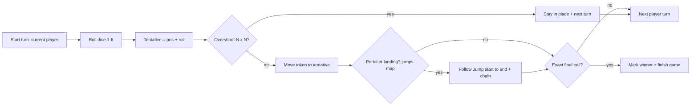
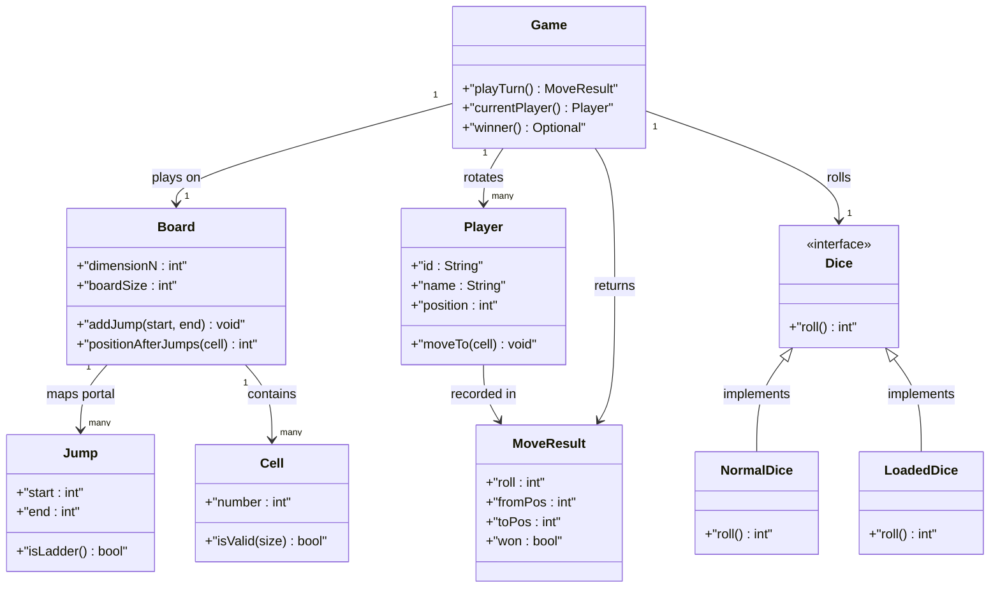
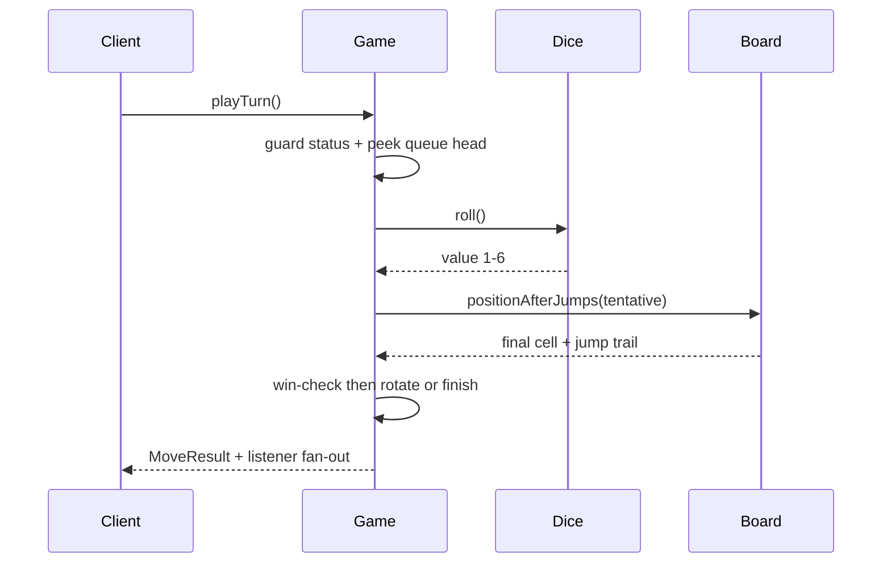

# Design Snake and Ladder Game

## Blogs and websites

## Medium

## Youtube

- [11. LLD of Snake and Ladder game (Hindi) | SDE system design interview question, Java implementation](https://www.youtube.com/watch?v=88bcV-XV0wo)
- [System Design : Snake and Ladder | Low Level System Design | Machine Coding | OOPS Design](https://www.youtube.com/watch?v=zRz1GPSH50I)

## Theory

Design the board game for N players with dice rolls moving tokens across 100 cells containing snakes and ladders. Must enforce turn order and win detection.
Key entities: Board (snakes/ladders map), Dice, Player/Token, Game.
Core operations: roll dice, move token, check win.

This guide turns that stub into an interview-ready low-level design: you will clarify an intentionally ambiguous NxN board game for K players, model clean OOP entities around Board, Cell, Player, Dice, and Game, choose a Jump portal map for snakes and ladders with chained resolution plus overshoot rules, handle turn order with a queue plus exact-win detection and extensibility for loaded dice and variable board sizes, and write plain Java 17 code an interviewer can trace on a whiteboard. The emphasis is on object modeling, turn-engine correctness, and portal-rule clarity — not AI players, persistence, or networked multiplayer.

> Scope note: this is LLD (class design, patterns, in-process turn loop). Matchmaking, leaderboards, animations, and distributed game servers belong to HLD and are mentioned only where they constrain the object model (for example, every move returns an immutable result object so a future network layer can replay turns without re-running rules).

### Topics Covered

1. [Problem Statement](#problem-statement)
2. [Functional / Non-Functional Requirements](#functional--non-functional-requirements)
3. [Core Entities & Class Design](#core-entities--class-design)
4. [Key Design Decisions & Patterns Used](#key-design-decisions--patterns-used)
5. [Concurrency & Edge Cases](#concurrency--edge-cases)
6. [Java 17 Implementation](#java-17-implementation)
7. [Interview Questions and Answers](#interview-questions-and-answers)

---

### Problem Statement

Design a Snake and Ladder game engine `Game` on an NxN board (classic 10x10 = 100 cells) for K players (2+ humans, extensible to bots). Each player owns a token starting off-board at position 0. Players take turns rolling a dice (1-6), move forward by the rolled value, resolve any snake or ladder portal at the landing cell, and win by landing exactly on cell NxN. Rolls that overshoot the final cell leave the token in place (or optionally bounce back, decided up front).

A `roll-and-move` takes the current player, rolls the dice, computes `tentative = position + roll`, applies the overshoot rule, resolves zero or more chained jumps (ladder then snake, ladder then ladder), updates the token, checks the exact-win predicate, and advances the turn queue. A `Jump` is a directed portal from `start` to `end`: `end > start` is a ladder, `end < start` is a snake. Board construction validates that no two jumps share a start cell, no jump starts on cell 1 or ends outside bounds, and snakes and ladders never form cycles.

**Why this problem exists**

- Real game-rule bugs cluster in three places: portal resolution done once instead of chained (landing on a ladder that lands on a snake mouth), turn advancement done before win detection (extra rolls after the game is over), and overshoot handled three different ways in three methods.
- The domain maps to two classic design ideas: portals are a textbook Map lookup from start cell to Jump object (O(1) resolution loop), and dice plus win rules are a textbook Strategy family (fair dice versus loaded dice, exact-win versus bounce-back) behind small interfaces.
- Interviewers love it because the happy path takes 10 minutes (board plus dice plus loop) but the follow-ups (why is Jump a map not a Cell subclass, how do you support 3 players and a 12x12 board without editing Game, where does the extra-turn-on-six rule live, how do concurrent move calls stay ordered) separate API recall from modeled reasoning.

**Real-life analogues**

- **Board-game engines and interview katas (Chess, Tic-Tac-Toe, Ludo parsers)**: turn queue plus move-result objects plus pluggable rule strategies.
- **Chutes-and-ladders mobile clones**: configurable board size, animated token moves driven by the same resolve-then-render pipeline.
- **Dice services in Ludo and Monopoly implementations**: injectable randomness seam so tests use fixed rolls while production uses `Random`.

**Clarifying questions to ask in the interview (say these out loud)**

1. Board size: fixed 10x10 = 100, or configurable NxN? Cells numbered 1..NxN row-major, or boustrophedon zigzag for display only?
2. Players: how many K, human-only or bots? Token per player or multiple tokens per player like Ludo?
3. Dice: one 6-sided die, multiple dice, or loaded / crooked dice for testing? Extra turn on rolling a six?
4. Overshoot rule: stay-in-place, bounce-back (`100 - overshoot`), or exact-roll-required to even attempt? What about three consecutive sixes?
5. Portal rules: can a ladder land on a snake mouth (chain)? Can snakes and ladders overlap, share cells, start at cell 1 or 100?
6. Win condition: exact landing only, or first past the line? Single winner and stop, or continue for 2nd and 3rd place?
7. Turn order: round-robin queue, dice-roll to decide first player, skip eliminated or disconnected players?
8. Observability: should moves emit events for UI / logging? Replay log or undo needed?
9. Concurrency: single-threaded turn loop, or thread-safe `move()` for online play with synchronized turns?
10. Scoring and restarts: rematch with same board, new random portals, or player-supplied snake / ladder lists?

**Assumptions for this guide (state these if the interviewer says "decide yourself")**

- Classic 10x10 board with cells 1..100, row-major numbering; display zigzag is a view concern, not a model concern.
- K players (default 2), one token each starting at position 0 (off-board); round-robin queue decides order.
- Single fair 6-sided dice via `Dice` interface; `LoadedDice` injectable for tests with a fixed roll sequence.
- Exact-win rule: must land exactly on 100; overshoot means no movement and turn passes (simplest defensible rule).
- No extra turn on six in the base game; the rule is an injectable `TurnPolicy` extension, off by default.
- Portals resolve in a chain loop with cycle guard: keep following `jumps.get(position)` until no portal or a visited set repeats.
- Single winner ends the game immediately; `GameStatus { NOT_STARTED, IN_PROGRESS, FINISHED }` gates further moves.
- In-memory only, no persistence; every move returns an immutable `MoveResult` with roll, from, to, jump trail, and win flag.



The diagram shows the guarded turn loop from roll to rotation: overshoot gates movement before any portal lookup, portal chaining completes before win detection, and only an exact final-cell landing after full resolution ends the game.

---

### Functional / Non-Functional Requirements

#### Functional requirements (must-have)

1. **Configurable board and portals**
   - Support NxN board with cells 1..NxN; default 10x10 = 100 cells with constructor validation for N >= 5.
   - Accept caller-supplied snake list and ladder list as `Jump` pairs; reject portals with start out of bounds, end out of bounds, start equals end, or duplicate start cells.
2. **Player roster and turn order**
   - Support K players (K >= 2) each with id, name, and token position starting at 0; reject duplicate ids and empty names.
   - Round-robin turn queue (`ArrayDeque`); `currentPlayer()` peeks without advancing, `playTurn()` rolls, moves, resolves, then rotates unless the game finished.
3. **Dice roll with injectable randomness**
   - `Dice` interface with `roll()` returning 1..6; `NormalDice` uses `Random`, `LoadedDice` replays a fixed sequence cyclically for deterministic tests.
   - Rolls validated to range; out-of-range values from a custom dice throw a typed exception rather than silently clamping.
4. **Move with overshoot guard**
   - `tentative = position + roll`; if `tentative > boardSize`, token stays, result records `OVERSHOOT`, and turn passes.
   - If `tentative <= boardSize`, token moves to tentative before portal resolution; position 0 plus roll always enters the board.
5. **Chained portal resolution**
   - After the base move, loop `while (jumps.containsKey(pos))` following each Jump, appending every hop to the result trail; ladder if end greater than start, snake otherwise.
   - Cycle guard via visited set: if a portal chain revisits a cell, stop and keep the first-repeat position rather than looping forever.
6. **Exact-win detection and game lifecycle**
   - After full portal resolution, if `position == boardSize` set winner, status to FINISHED, and stop rotating the queue.
   - `playTurn()` on a FINISHED game throws `IllegalStateException`; `reset()` restores all tokens to 0 and clears winner and status.
7. **Move-result observability**
   - Every turn returns immutable `MoveResult` with player, roll, start position, end position, ordered jump trail, overshoot flag, and win flag.
   - `Board.positionAfterJumps(cell)` exposed for tests so portal chains are assertable without playing a full game.
8. **Rule extensibility seams**
   - `WinRule` interface (`EXACT` default, `BOUNCE_BACK` optional) and `TurnPolicy` interface (no-extra-turn default, six-grants-bonus optional) injectable into `Game`.
   - Public API `addPlayer`, `playTurn`, `currentPlayer`, `winner`, `status`, `boardSize` returns result objects; illegal board, portal, or dice inputs throw typed exceptions.

#### Explicitly out of scope (say this to bound the interview)

- Networked multiplayer, matchmaking, and reconnect handling (the move result carries enough data for HLD to add them).
- Graphical board rendering and boustrophedon zigzag layout (position numbering stays row-major in the model).
- Bot AI and difficulty levels (a bot is just another `Player` with an injected dice or move chooser).

#### Non-functional requirements (LLD-flavoured)

- **Correctness over speed**: overshoot and cycle guards run before win detection so no illegal win is ever observable.
- **O(1) portal lookup by construction**: HashMap from start cell to Jump, chained loop bounded by portal count, no board scans.
- **Extensibility**: adding loaded dice or a new win rule means adding one class, not rewriting `Game`.
- **Testability**: dice, board size, and portal maps are plain injectable seams drivable with fixed rolls and tiny 5x5 boards.
- **Readability**: an interviewer can trace `playTurn()` to `roll()` to `resolve()` to `win-check()` in under five minutes.
- **Determinism**: no randomness except the injectable dice; tests replay exact games with `LoadedDice`.
- **Observability (lightweight)**: every roll, hop, overshoot, and win is recorded in the returned `MoveResult` trail.

| Requirement | Target / policy | Why it matters in LLD |
|---|---|---|
| O(1) portal resolution | HashMap start to Jump plus chain loop | Core perf invariant |
| Overshoot never wins | Stay-in-place gate before portal and win checks | Most-tested rule probe |
| Chain without infinite loop | Visited set with first-repeat stop | Where juniors fail |
| K players plus NxN boards | Queue plus size param, no hardcoded 100 or 2 | Extensibility follow-up |
| Deterministic tests | LoadedDice fixed sequence plus tiny boards | No-sleep test design |
| Turn integrity | Rotate only on non-winning turns, lock the loop | Post-win roll guard |

---

### Core Entities & Class Design

The model has four entity groups: the Board facade callers configure with portals, the Player plus token value objects holding positions, the Dice Strategy family for randomness, and the Game turn engine owning the queue plus win detection plus result trail. Keep behaviour with the data it guards: boards own portal validation and chain resolution, dice own roll generation, players own position state, and the game owns turn order and lifecycle.

#### Value objects and supporting types (the vocabulary of the domain)

- `Board`: NxN grid facade — `size` (N), `boardSize` (NxN), `jumps` map from start cell to `Jump`; methods `addJump`, `hasJump`, `positionAfterJumps(cell)`, `isValidCell`.
- `Cell`: position value object — `number` in 1..NxN; off-board start represented as position 0 on the player, never as a Cell instance.
- `Jump`: directed portal — `start`, `end`; `isLadder()` when end greater than start, `isSnake()` when end less than start; immutable record.
- `Player`: id plus name plus mutable `position` starting at 0; methods `moveTo(cell)`, `reset()`.
- `Dice` (interface): `roll()` returning 1..6; `NormalDice` wraps `Random`, `LoadedDice` replays a fixed int sequence cyclically.
- `MoveResult`: immutable snapshot — player name, roll, from position, to position, ordered `List<Jump>` trail, overshoot flag, win flag.
- `GameStatus` enum keeps lifecycle truth consistent: NOT_STARTED versus IN_PROGRESS versus FINISHED gates every `playTurn()`.
- `WinRule` and `TurnPolicy` enums-plus-interfaces keep rule variants explicit: exact-win versus bounce-back, no-bonus versus six-grants-bonus.

#### Board, cells, and the portal map

- `Board`: owns `int dimensionN`, `int boardSize`, `Map<Integer, Jump> jumps`. Constructor validates N >= 2 and every portal; `addJump(start, end)` rejects start out of 1..boardSize, end out of 1..boardSize, start equals end, or duplicate start cells.
- `Cell` numbering is row-major 1..NxN for rule logic; any zigzag or boustrophedon rendering lives in the view layer and never enters `positionAfterJumps`.
- `Jump`: record with `start()`, `end()`, `isLadder()`, `isSnake()`; portals stored once in the map so resolution is O(1) per hop with zero board scans.
- `positionAfterJumps(cell)` loops `while (jumps.containsKey(pos))` with a visited set: append each hop, stop when no portal or a repeat is detected, return the final cell plus the trail.
- `Player`: `String id`, `String name`, `int position`; position 0 means off-board, 1..boardSize means on-board; only `Game` mutates it via `moveTo`.
- `Dice`: `NormalDice(int sides)` defaults to 6 with `random.nextInt(6) + 1`; `LoadedDice(int... sequence)` cycles an index so tests replay exact games deterministically.
- `MoveResult`: record holding player, roll, fromPos, toPos, trail, overshoot, won; the UI or logger renders from it without re-running rules.

#### Turn engine, win detection, and extensibility pipeline

- Turn pipeline inside `playTurn()`: guard status, peek current player, roll dice, compute tentative, apply overshoot gate, move token, resolve portal chain, test win predicate, rotate queue or finish.
- Win pipeline: after full chain resolution, `if (position == boardSize)` set winner, status FINISHED, return winning result without rotating; all later `playTurn()` calls throw.
- Overshoot pipeline: `if (tentative > boardSize)` keep position, mark result overshoot, rotate queue; bounce-back variant computes `boardSize - (tentative - boardSize)` behind the `WinRule` seam instead.
- Extensibility pipeline: `WinRule` interface with `resolveWin(position, boardSize)` and `adjustOvershoot(tentative, boardSize)`; `TurnPolicy` interface with `grantBonusTurn(roll)` defaulting to false; `Game` consults both without branching on game variants.
- Observer seam: `GameListener.onMove(MoveResult)` notified after commit for logging or UI refresh without coupling the engine to rendering.



The diagram shows containment (game to board and players), delegation (game to dice and board for rolls and portal chains), observation (game to move results and listeners), and extension (two dice behind one interface) — the four relationships to name in the interview.

**Key relationships and cardinalities**

- Game 1—1 Board at a time; board size and portal map fixed at construction so mid-game mutation cannot corrupt a running turn loop.
- Board 1—0..M Jump objects at a time; each start cell maps to at most one Jump, enforced at `addJump` time.
- Game 1—2..K Players in a round-robin deque; rotation is peek-play-push unless the turn wins or earns a bonus.
- Player 1—1 token position; single-token-per-player keeps move math to one integer, multi-token variants add a Token list without touching the Board.
- Game 1—1 Dice at a time; swapping fair for loaded dice changes zero turn-engine lines.
- Game 1—\* MoveResult snapshots (one per turn played; results never mutate live positions).

**Where behaviour lives (tell the interviewer)**

- Portal truth lives in the board map, not in Cell subclasses: resolution means map lookups in a loop, so adding a portal never creates a class.
- Position truth lives in the player: `moveTo` is the only mutator, called once per turn after overshoot and chain math complete.
- Turn truth lives in the game queue: peek the head, play the turn, push back on non-winning turns; the queue never holds a finished winner.
- Randomness truth lives in the dice: `roll()` is the only nondeterminism source, injectable down to a fixed script.
- Lifecycle truth lives in the status enum: NOT_STARTED to IN_PROGRESS on first turn, IN_PROGRESS to FINISHED on exact win, with guards on every entry point.

---

### Key Design Decisions & Patterns Used

#### Decision 1 — Jump map instead of Cell subclasses (the hook)

Every portal is one map entry from start cell to Jump object, not a SnakeCell or LadderCell type. Resolution follows pointers in O(1) per hop with a visited-set cycle guard, and adding a portal means one `put`, not a new class or a board scan. Say the trade-off verbatim: a polymorphic Cell hierarchy looks object-oriented but explodes into dozens of types and still needs a chain loop for ladder-onto-snake landings, while the map handles chains, overlaps, and validation in one place. Name the invariant: start cells are unique keys, validated once at construction, never mutated mid-game.

#### Decision 2 — Exact-win with stay-in-place overshoot as the default rule

Tentative rolls past the final cell leave the token unmoved and pass the turn. The check runs before any portal lookup or win test, so no overshoot can ever trigger a portal or a win. State the variant sentence: bounce-back (`100 - overshoot`) and exact-roll-required are one `WinRule` implementation away, and the game calls the interface rather than branching on an enum, which is the Open/Closed seam to point at when the interviewer asks for rule changes.

#### Decision 3 — Chained resolution with a visited-set cycle guard

After the base move, the engine keeps following `jumps.get(position)` until no portal exists or a cell repeats. Each hop appends to the result trail so the UI can animate ladder-climb then snake-slide sequences. Say the safety rule verbatim — a chain that revisits a cell stops at first repeat and keeps that position — because adversarial portal sets (ladder 20 to 40, snake 40 to 20) are the classic grading trap. The loop is bounded by portal count so worst-case cost stays O(M).

#### Decision 4 — Queue-based turn engine with win-before-rotate ordering

The current player is the queue head: peek, play, then either finish (on win), replay (on bonus-turn policy), or pop-and-push-back. Win detection runs after full portal resolution but before rotation, so no extra turn is ever dealt after the game ends. State explicitly that `currentPlayer()` is a pure peek with no side effects — rotation happens only inside `playTurn()` after the result commits — which removes double-advance bugs when callers poll the current player for display.

#### Decision 5 — Loaded dice as a Strategy behind one interface

`Dice` exposes only `roll()`; production injects `NormalDice` with `Random`, tests inject `LoadedDice` with a cyclic script. Out-of-range script values fail fast with a typed exception instead of clamping, so bad test data surfaces instead of silently warping the game. Say the scope sentence: determinism is per game instance, not global, so parallel test games each carry their own script without shared static state.

#### Decision 6 — Immutable MoveResult plus status-gated lifecycle

- Every turn returns a new `MoveResult` record with roll, from, to, jump trail, overshoot, and win flags; nothing downstream can mutate positions through it.
- `GameStatus` gates all entries: `playTurn()` on FINISHED throws, `reset()` restores positions to 0 and clears winner and status.
- Board size fixed at construction keeps tentative-plus-overshoot reasoning to one comparison; NxN flows through as `boardSize` with zero hardcoded 100s.
- Zero-position start means `roll` from 0 always enters the board; no special first-move branch exists.

#### Patterns used (say these names out loud)

| Pattern | Where | Why |
|---|---|---|
| Strategy | `Dice` family (Normal, Loaded) plus `WinRule` and `TurnPolicy` | Randomness and rules vary independently by injection |
| Facade | `Game` over board, queue, dice, status | One interview-traceable API for all flows |
| Observer (light) | `GameListener` move notifications | UI reacts without engine coupling |
| Template Method (light) | `playTurn` then `overshoot-gate` then `resolve-chain` skeleton | Shared ordering, pluggable rule hooks |
| Command (light) | `MoveResult` as turn record | Replay and render without re-running rules |
| Memento (light) | `MoveResult` immutable snapshot | Observe turns without corrupting live positions |

**SOLID mapping (one line each for the "which principles?" follow-up)**

- Single Responsibility: boards resolve portals, dice roll values, players hold positions, games order turns.
- Open/Closed: new dice or win rule equals a new class, zero edits to `playTurn`.
- Liskov: any `Dice` or `WinRule` substitutes without breaking the roll-then-move pipeline.
- Interface Segregation: small `Dice`, `WinRule`, `TurnPolicy`, and listener contracts instead of one fat game interface.
- Dependency Inversion: `Game` depends on dice and rule interfaces; tests inject loaded dice plus exact-win rules.

---

### Concurrency & Edge Cases

#### The concurrency story (the senior half of the interview)

One board game has one turn order, so the design centers on atomic peek-roll-move-resolve-rotate plus decoupled listeners. Three mechanisms from innermost to outermost:

1. **Single-monitor exclusion on the game.** `playTurn`, `currentPlayer`, `winner`, and `reset` synchronize on the game instance; roll plus move plus resolve plus rotate share the same monitor so two racing callers cannot interleave rolls on the same player or double-rotate the queue. Portal resolution and win detection run inside the same critical section.
2. **Immutable result handoff.** `MoveResult` and the jump trail list are deeply immutable snapshots built before unlock; listeners and UI threads read them without further synchronization. Players expose positions via synchronized getters returning ints, never live references.
3. **Observers outside the lock.** Listeners fire after commit with immutable result copies, so a slow UI refresh cannot deadlock the next turn. Dice rolls happen inside the lock for ordering (each roll maps to exactly one queued player), which keeps replay logs gap-free.



The diagram shows the roll-then-resolve ordering in time: both overshoot and portal probes complete before any position commit or queue rotation, and the result snapshot publishes after every return path so replay logs are never skipped.

**Why not `ConcurrentHashMap` or lock-free turns?** A concurrent map serializes cell access but does not express peek-then-rotate queue atomicity, roll-to-player binding, or coherent win-versus-rotate lifecycle. Two threads calling `playTurn` concurrently could each roll for the same head player and both claim the turn, and a win racing a rotation could deal one phantom turn after the game ended. Game-level exclusion gives both atomicity and ordering: exclusion stops races, the queue stops nonsense.

**Post-access evaluation rule (say this verbatim): roll, then overshoot-gate, then resolve-chain, then win-check.** After every roll the game tests overshoot first, resolves the full portal chain second, tests exact-win third, and only then rotates the queue or finishes. Overshoot plus zero portals is a plain pass, never a portal trigger or a win.

#### Edge cases table (pick 4–5 to recite, keep the rest as backup)

| # | Edge case | Handling |
|---|---|---|
| 1 | Two threads call `playTurn` at once | Serialized on the monitor; each call binds one roll to one head player, queue rotates exactly once per turn |
| 2 | Ladder landing on a snake mouth | Chain loop follows every hop with visited guard; trail records both, win tested only after the chain ends |
| 3 | Portal cycle (ladder 20 to 40, snake 40 to 20) | Visited set stops at first repeat; token keeps the repeat cell, no infinite loop |
| 4 | Overshoot past final cell | Token stays, result marks overshoot, turn passes; bounce-back variant handled behind `WinRule` |
| 5 | Roll exactly to final cell via portal | Portal destination equal to boardSize wins; win tested after chain, not on tentative |
| 6 | `playTurn` after game finished | Throws `IllegalStateException`; `reset()` required before further turns |
| 7 | Duplicate portal start cells | `addJump` rejects with `IllegalArgumentException`; map never holds two jumps on one start |
| 8 | Portal start equals end or out of bounds | Rejected at construction; ends clamped to 1..boardSize, starts never on cell 0 |
| 9 | Loaded dice script exhausted | Sequence replays cyclically; out-of-range script values throw instead of clamping |
| 10 | Single player or duplicate player ids | Constructor requires K >= 2 with unique ids; duplicates rejected with typed exception |
| 11 | Listener throws on move event | Exception swallowed after logging hook point; game state already committed, next turn unaffected |
| 12 | Tiny 5x5 board for tests | Dimension param flows through as boardSize; portal and win logic unchanged, scripts stay short |
| 13 | Extra turn on six requested | `TurnPolicy` seam grants bonus without editing `playTurn`; default policy off keeps base rules simple |
| 14 | Three consecutive sixes (ludo-style forfeit) | Policy counts consecutive sixes per player and passes turn on the third; state resets on non-six rolls |
| 15 | `reset` racing an in-flight turn | Both synchronize on the game; reset restores positions and status atomically, late turn re-reads fresh state |

---

### Java 17 Implementation

All classes below are plain Java 17 (no frameworks, records for immutable snapshots, interfaces for dice and rule seams). The HashMap portal map gives O(1) jump resolution, the deque owns turn order, and `Game` synchronizes the commit path. Each block is followed by its explanation and the pattern it demonstrates.

#### 1. Board, Jump portals, and the Dice Strategy family

The foundation is a validated portal map plus one randomness strategy per dice with explicit lifecycle hooks.

```java
import java.util.*;

// Directed portal: end > start is a ladder, end < start is a snake.
record Jump(int start, int end) {
    Jump {
        if (start == end) throw new IllegalArgumentException("portal start == end: " + start);
    }
    boolean isLadder() { return end > start; }
    boolean isSnake() { return end < start; }
}

// Strategy: randomness varies by dice; game calls roll() under its own lock.
interface Dice {
    int roll();
}

// Fair dice for production.
final class NormalDice implements Dice {
    private final int sides;
    private final Random random = new Random();
    NormalDice() { this(6); }
    NormalDice(int sides) {
        if (sides < 2) throw new IllegalArgumentException("sides < 2");
        this.sides = sides;
    }
    public int roll() { return random.nextInt(sides) + 1; }
}

// Loaded dice: replays a fixed script cyclically for deterministic tests.
final class LoadedDice implements Dice {
    private final int[] script;
    private int cursor;
    LoadedDice(int... script) {
        if (script == null || script.length == 0)
            throw new IllegalArgumentException("script empty");
        for (int v : script)
            if (v < 1 || v > 6) throw new IllegalArgumentException("script value out of 1..6: " + v);
        this.script = script.clone();
    }
    public int roll() {
        int v = script[cursor];
        cursor = (cursor + 1) % script.length;
        return v;
    }
}

// Board: NxN grid with validated portal map and chained resolution.
final class Board {
    private final int dimensionN;
    private final int boardSize;
    private final Map<Integer, Jump> jumps = new HashMap<>();

    Board(int dimensionN) {
        if (dimensionN < 2) throw new IllegalArgumentException("N < 2");
        this.dimensionN = dimensionN;
        this.boardSize = dimensionN * dimensionN;
    }
    Board(int dimensionN, List<Jump> portals) {
        this(dimensionN);
        if (portals != null) for (var j : portals) addJump(j.start(), j.end());
    }
    int boardSize() { return boardSize; }
    int dimensionN() { return dimensionN; }
    boolean isValidCell(int cell) { return cell >= 1 && cell <= boardSize; }

    void addJump(int start, int end) {
        if (!isValidCell(start)) throw new IllegalArgumentException("jump start OOB: " + start);
        if (!isValidCell(end)) throw new IllegalArgumentException("jump end OOB: " + end);
        if (start == end) throw new IllegalArgumentException("portal start == end: " + start);
        if (jumps.containsKey(start))
            throw new IllegalArgumentException("duplicate portal start: " + start);
        jumps.put(start, new Jump(start, end));
    }
    boolean hasJump(int cell) { return jumps.containsKey(cell); }

    // Follows the chain with a visited guard; returns the full hop trail.
    List<Jump> resolveTrail(int cell) {
        var trail = new ArrayList<Jump>();
        var visited = new HashSet<Integer>();
        visited.add(cell);
        var cur = jumps.get(cell);
        while (cur != null) {
            trail.add(cur);
            if (!visited.add(cur.end())) break; // cycle: stop at first repeat
            cur = jumps.get(cur.end());
        }
        return List.copyOf(trail);
    }
    // Final cell after following every chained portal.
    int positionAfterJumps(int cell) {
        int pos = cell;
        var visited = new HashSet<Integer>();
        visited.add(pos);
        var cur = jumps.get(pos);
        while (cur != null) {
            pos = cur.end();
            if (!visited.add(pos)) break;
            cur = jumps.get(pos);
        }
        return pos;
    }
}
```

Explanation: `Jump` as a record keeps portals to one immutable type instead of a SnakeCell versus LadderCell hierarchy, which is exactly why chains stay simple: resolution is map lookups in a loop, not virtual dispatch across dozens of types. `LoadedDice` removes randomness dependence so tests replay exact games with fixed scripts. This block demonstrates the Strategy pattern: each dice varies roll generation independently behind `roll()`.

#### 2. Game turn engine with queue rotation plus exact-win detection

`Game` runs the overshoot, portal, win, and rotation pipeline with single-monitor atomicity; this is the full turn loop to trace on the whiteboard.

```java
import java.util.*;

enum GameStatus { NOT_STARTED, IN_PROGRESS, FINISHED }

record MoveResult(String playerName, int roll, int fromPos, int toPos,
                  List<Jump> trail, boolean overshoot, boolean won) {}

// Win-rule seam: exact landing wins; bounce-back variant lives beside it.
interface WinRule {
    boolean isWin(int position, int boardSize);
    int adjustOvershoot(int tentative, int boardSize);
}

final class ExactWinRule implements WinRule {
    public boolean isWin(int position, int boardSize) { return position == boardSize; }
    public int adjustOvershoot(int tentative, int boardSize) { return -1; } // -1 means stay
}

// Turn-policy seam: base game grants no bonus turns; six-bonus variant opt-in.
interface TurnPolicy {
    boolean grantBonusTurn(int roll);
}

final class NoBonusTurnPolicy implements TurnPolicy {
    public boolean grantBonusTurn(int roll) { return false; }
}

final class Player {
    private final String id;
    private final String name;
    private int position; // 0 = off-board, 1..boardSize = on-board

    Player(String id, String name) {
        this.id = Objects.requireNonNull(id, "id");
        this.name = Objects.requireNonNull(name, "name");
        if (id.isBlank()) throw new IllegalArgumentException("id blank");
        if (name.isBlank()) throw new IllegalArgumentException("name blank");
    }
    String id() { return id; }
    String name() { return name; }
    synchronized int position() { return position; }
    synchronized void moveTo(int cell) { position = cell; }
    synchronized void reset() { position = 0; }
}

public class Game {
    private final Board board;
    private final Dice dice;
    private final WinRule winRule;
    private final TurnPolicy turnPolicy;
    private final Deque<Player> turnQueue = new ArrayDeque<>();
    private GameStatus status = GameStatus.NOT_STARTED;
    private Player winner;

    public Game(Board board, Dice dice) {
        this(board, dice, new ExactWinRule(), new NoBonusTurnPolicy());
    }
    public Game(Board board, Dice dice, WinRule winRule, TurnPolicy turnPolicy) {
        this.board = Objects.requireNonNull(board, "board");
        this.dice = Objects.requireNonNull(dice, "dice");
        this.winRule = Objects.requireNonNull(winRule, "winRule");
        this.turnPolicy = Objects.requireNonNull(turnPolicy, "turnPolicy");
    }
    public synchronized void addPlayer(Player p) {
        Objects.requireNonNull(p, "player");
        if (status == GameStatus.FINISHED)
            throw new IllegalStateException("game finished");
        for (var q : turnQueue)
            if (q.id().equals(p.id())) throw new IllegalArgumentException("duplicate id: " + p.id());
        turnQueue.addLast(p);
    }
    public synchronized Player currentPlayer() {
        if (turnQueue.isEmpty()) throw new IllegalStateException("no players");
        return turnQueue.peekFirst();
    }
    public synchronized GameStatus status() { return status; }
    public synchronized Optional<Player> winner() { return Optional.ofNullable(winner); }
    public synchronized int boardSize() { return board.boardSize(); }

    // Overshoot-gate: tentative past the end stays put and passes the turn.
    public synchronized MoveResult playTurn() {
        if (turnQueue.size() < 2 && status == GameStatus.NOT_STARTED && turnQueue.size() < 1)
            throw new IllegalStateException("need players");
        if (status == GameStatus.FINISHED)
            throw new IllegalStateException("game already finished");
        status = GameStatus.IN_PROGRESS;
        var player = turnQueue.peekFirst();
        int from = player.position();
        int roll = dice.roll();
        if (roll < 1 || roll > 6) throw new IllegalStateException("dice out of range: " + roll);
        int tentative = from + roll;
        if (tentative > board.boardSize()) { // overshoot: no move, rotate
            rotate();
            return new MoveResult(player.name(), roll, from, from, List.of(), true, false);
        }
        var trail = board.resolveTrail(tentative);
        int finalPos = trail.isEmpty() ? tentative : trail.get(trail.size() - 1).end();
        player.moveTo(finalPos);
        boolean won = winRule.isWin(finalPos, board.boardSize());
        if (won) {
            winner = player;
            status = GameStatus.FINISHED;
            return new MoveResult(player.name(), roll, from, finalPos, trail, false, true);
        }
        if (turnPolicy.grantBonusTurn(roll)) { // bonus: head keeps the turn
            return new MoveResult(player.name(), roll, from, finalPos, trail, false, false);
        }
        rotate();
        return new MoveResult(player.name(), roll, from, finalPos, trail, false, false);
    }
    private void rotate() {
        var head = turnQueue.pollFirst();
        if (head != null) turnQueue.addLast(head);
    }
    public synchronized void reset() {
        for (var p : turnQueue) p.reset();
        winner = null;
        status = GameStatus.NOT_STARTED;
    }
}
```

Explanation: `playTurn` is the whole interview in one method — status guard, queue peek, dice roll, overshoot gate, chain resolve, win test, then rotate-or-finish under one monitor. `resolveTrail` plus last-hop end keeps the trail and the final cell consistent by construction, and win detection runs after the chain but before rotation so no phantom turn follows a win. Because tentative math uses `boardSize` with zero hardcoded 100s, NxN boards and K players flow through untouched, which is the Facade plus Template Method shape: fixed pipeline skeleton, pluggable rule hooks.

#### 3. Listener, bonus-turn variant, and demo

Snapshots keep turn history honest and the listener fans results out without holding domain logic during rendering.

```java
import java.util.*;

// Observer seam: UI or logger renders without coupling to the engine.
interface GameListener {
    void onMove(MoveResult result);
}

// Bonus-turn variant: rolling a six replays the same player.
final class SixBonusTurnPolicy implements TurnPolicy {
    public boolean grantBonusTurn(int roll) { return roll == 6; }
}

// Demo: 10x10 board with scripted dice replays an exact ladder-then-win arc.
class SnakeLadderDemo {
    public static void main(String[] args) {
        var board = new Board(10, List.of(
            new Jump(3, 22),   // ladder: 3 climbs to 22
            new Jump(27, 5),   // snake: 27 slides to 5
            new Jump(72, 91),  // ladder: 72 climbs to 91
            new Jump(99, 54)   // snake near the finish
        ));
        // Scripted rolls: Alice hits ladder 3->22, Bob lands snake 27->5.
        var dice = new LoadedDice(3, 6, 5, 6, 4, 2);
        var game = new Game(board, dice);
        game.addPlayer(new Player("p1", "Alice"));
        game.addPlayer(new Player("p2", "Bob"));
        GameListener log = r -> System.out.println(
            r.playerName() + " rolled " + r.roll() + " " + r.fromPos()
            + "->" + r.toPos() + " trail=" + r.trail()
            + (r.overshoot() ? " OVERSHOOT" : "") + (r.won() ? " WINS" : ""));
        for (int i = 0; i < 6 && game.status() != GameStatus.FINISHED; i++) {
            log.onMove(game.playTurn());
        }
        System.out.println("board=" + game.boardSize() + " status=" + game.status());
        // Tiny-board test arc: 5x5 board, exact-win check without 100-turn scripts.
        var tiny = new Board(5, List.of(new Jump(2, 14), new Jump(23, 7)));
        System.out.println("tiny 2 resolves to " + tiny.positionAfterJumps(2)); // 14
        System.out.println("tiny 23 resolves to " + tiny.positionAfterJumps(23)); // 7
    }
}
```

Explanation: the listener receives immutable `MoveResult` copies after commit so one slow renderer never serializes the next turn — the Observer combination to name. `SixBonusTurnPolicy` shows rule extension as one class with zero edits to `playTurn`. The demo wires a portal map and a loaded script through ladder-climb, snake-slide, and tiny-board resolution, which is exactly the live-coding arc to reproduce: portals, overshoot gate, queue rotation, win print.

**How to extend (name these without building them)**

- New bounce-back overshoot: implement `WinRule.adjustOvershoot` returning `boardSize - (tentative - boardSize)`; `Game` pipeline and dice logic are untouched.
- Multi-token players (Ludo style): add a `Token` list per player with token-choice param on `playTurn`; `Board` portal logic is untouched.
- Bot players: add a `BotPlayer` subclass carrying a move chooser; the queue treats it as any `Player`.

---

### Interview Questions and Answers

1. **Beginner: walk me through the classes in your game.**
   Answer: `Game` facade over a `Board`, a player deque, a `Dice`, and rule seams; `Board` holding dimension plus a start-to-`Jump` portal map; `Jump` record with start, end, and ladder-versus-snake helpers; `Player` with id, name, and position; `NormalDice` and `LoadedDice` behind one interface; immutable `MoveResult` with roll, from, to, trail, overshoot, and win flags; plus `GameStatus`, `WinRule`, and `TurnPolicy` for lifecycle and variants.

2. **Beginner: why is a Jump map better than SnakeCell and LadderCell subclasses?**
   Answer: the map resolves each hop in O(1) with one chain loop that also handles ladder-onto-snake landings, while subclasses would need dozens of types plus the same loop for chains. Adding a portal is one `put` with uniqueness validation at construction, and overlap or cycle checks live in one place instead of scattered across cell types.

3. **Beginner: what happens on overshoot and how does exact win work?**
   Answer: tentative past the final cell leaves the token in place, marks the result overshoot, and passes the turn; the check runs before portal lookup so overshoot never triggers a portal or a win. Exact win tests position equality after full chain resolution, so a portal delivering the token to the final cell wins while a bounce off it does not.

4. **Junior: how do chained portals resolve without infinite loops?**
   Answer: the engine follows `jumps.get(position)` in a loop with a visited set, appending every hop to the trail and stopping when no portal exists or a cell repeats. The loop is bounded by portal count so worst case stays O(M). Ladder-then-snake sequences animate naturally from the ordered trail.

5. **Junior: how do you support NxN boards and K players without editing Game?**
   Answer: board size flows through as `boardSize` with zero hardcoded 100s, and players live in a deque with peek-play-rotate semantics for any K >= 2. Tiny 5x5 boards with two portals exercise the same code as 10x10, and adding a player is one `addPlayer` call with duplicate-id validation.

6. **Junior: why loaded dice, and why fail on out-of-range script values?**
   Answer: loaded dice replay a fixed cyclic script so tests assert exact ladders, snakes, overshoots, and wins without randomness. Out-of-range values throw instead of clamping so bad test data surfaces loudly rather than silently warping positions and hiding rule bugs.

7. **Mid: how does the turn queue stay correct around wins and bonus turns?**
   Answer: `playTurn` peeks the head, plays the full pipeline, then either finishes without rotating on win, keeps the head on bonus-turn policy, or pops and pushes back otherwise. `currentPlayer` is a pure peek with no side effects, so display polling cannot double-advance the order.

8. **Mid: how do concurrent playTurn calls stay ordered?**
   Answer: all state paths synchronize on the game so roll plus move plus resolve plus rotate are atomic. Two racing callers each bind one roll to one head player in order, and win detection plus queue rotation share the same critical section so no phantom turn follows a finish. Listeners fire on immutable result copies outside domain mutation.

9. **Senior: how do you add bounce-back overshoot or extra-turn-on-six without rewriting the engine?**
   Answer: both are Strategy implementations: a `WinRule` computing the reflected cell and a `TurnPolicy` granting bonus on six (with a consecutive-six counter for ludo-style forfeit). `playTurn` consults the interfaces at the existing branch points, so the base pipeline, portal map, and dice seams are untouched.

10. **Senior: how do you test portals, overshoot, and win detection without long games?**
    Answer: inject `LoadedDice` with short scripts plus tiny 5x5 boards: assert `positionAfterJumps` for ladder, snake, and chained trails, script an overshoot roll and assert position unchanged with the overshoot flag, script an exact-win roll and assert status FINISHED with `playTurn` throwing afterward. One cycle-guard test with a two-portal loop asserts first-repeat stop.


