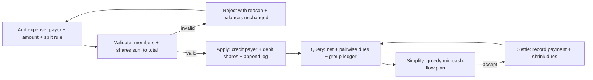
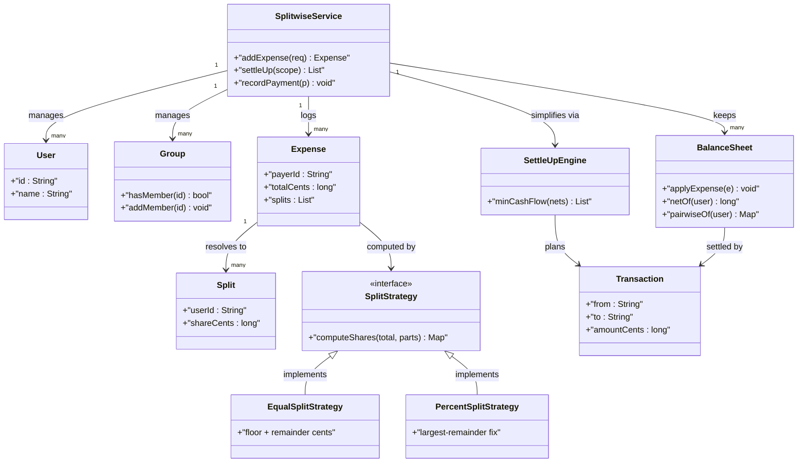
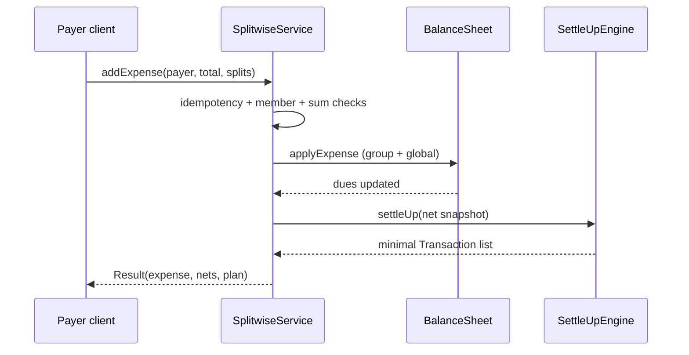

# Designing Splitwise

## Blogs and websites

## Medium

## Youtube

- [21. LLD of Splitwise | Low Level Design of Splitwise | Design Expense Sharing App like Splitwise](https://www.youtube.com/watch?v=I4xf4STXgmU)
- [22. Splitwise Simplify Debt Algorithm | LLD of Splitwise | Optimal Account Balancing | LLD Splitwise](https://www.youtube.com/watch?v=6UeDb7ORVPI)

## Theory

Design expense sharing with per-user balances and minimal settlements between friends/groups. Must split expenses (equal/unequal) and simplify debts.
Key entities: User, Group, Expense/Split, BalanceSheet.
Core operations: add expense, compute balances, settle debt.

This guide turns that stub into an interview-ready low-level design: you will clarify an intentionally ambiguous expense-sharing app, model clean OOP entities around User, Group, Expense, Split, and BalanceSheet, choose Strategy for split computation plus greedy min-cash-flow settle-up with heaps, handle concurrent expense adds plus idempotent settlement, and write plain Java 17 code an interviewer can trace on a whiteboard. The emphasis is on object modeling, split correctness, and debt simplification — not payment rails, persistence, or distributed ledgers.

> Scope note: this is LLD (class design, patterns, in-process rules). Payment gateways, push notifications, persisted ledgers, and multi-device sync belong to HLD and are mentioned only where they constrain the object model (for example, every Expense carries an idempotency key plus paid-by and split list so a retry never double-books a balance).

### Topics Covered

1. [Problem Statement](#problem-statement)
2. [Functional / Non-Functional Requirements](#functional--non-functional-requirements)
3. [Core Entities & Class Design](#core-entities--class-design)
4. [Key Design Decisions & Patterns Used](#key-design-decisions--patterns-used)
5. [Concurrency & Edge Cases](#concurrency--edge-cases)
6. [Java 17 Implementation](#java-17-implementation)
7. [Interview Questions and Answers](#interview-questions-and-answers)

---

### Problem Statement

Design an expense-sharing service like Splitwise for friends, roommates, and trip groups: register users, form groups, record who paid for what, split each expense across participants (equal, exact, percentage), maintain per-user balances, show who owes whom, and simplify debts into the minimum number of settle-up transactions.

A user pays a bill and records an expense with amount, payer, group (or non-group pairwise expense), and a split rule. The engine validates the split (shares sum to total), updates balance sheets (payer is credited, participants debited by their share), and answers balance queries: per-user net, pairwise dues, group ledger, and a simplified settlement plan. Participants settle by recording payments, which reduce dues without deleting expense history. Every expense is immutable once booked; corrections are reversal or new adjustment expenses.

**Why this problem exists**

- Real Splitwise bugs cluster in three places: split sums that do not equal the total (rounding drift), balance updates applied to only one side of a pair, and naive settlement producing O(n-squared) transactions instead of minimal ones.
- The domain maps to two classic design ideas: per-rule share computation is a textbook Strategy family, and debt simplification is textbook greedy min-cash-flow with two heaps (max-creditor, max-debtor).
- Interviewers love it because the happy path takes 10 minutes (Expense plus Split plus BalanceSheet) but the follow-ups (percent splits sum to 99.99, who owes whom after five expenses, minimize transactions, concurrent adds) separate CRUD recall from modeled reasoning.

**Real-life analogues**

- **Splitwise, SettleUp, Tricount, Tab**: group ledgers, equal and custom splits, simplify-debts buttons.
- **Corporate expense and payroll netting**: pairwise invoices netted into minimal payouts at month end.
- **Clearing-house settlement**: multilateral obligations reduced to a small set of transfers, same greedy intuition.

**Clarifying questions to ask in the interview (say these out loud)**

1. Users and groups: can a user belong to many groups, and can an expense exist outside any group (pairwise)?
2. Split types: equal only, or also exact amounts and percentages? Custom shares or ratios?
3. Who can add an expense: only the payer, any group member, or an admin?
4. Currency: single currency, or multi-currency with conversion at record time?
5. Balances: net per user, pairwise dues, group-scoped or global across groups?
6. Settle-up: record cash payments only, or also compute the minimal settlement plan on demand?
7. Edit and delete: immutable expenses with reversal, or in-place edit and delete?
8. Scale: single process with in-memory sheets, or persisted ledger with pagination?
9. Concurrency: two members adding expenses in the same group at once — last-write-wins or serialized?
10. History and audit: append-only expense log, per-expense activity, export needed?

**Assumptions for this guide (state these if the interviewer says "decide yourself")**

- Single currency (cents as long); multi-currency is an out-of-scope conversion seam.
- Split types: EQUAL, EXACT, PERCENT; shares validated before any balance mutation.
- Expenses immutable once booked; corrections via new adjustment or reversal entries.
- Balances maintained both per-group sheets and one global pairwise view derived from them.
- Settle-up computed on demand with greedy min-cash-flow; recording a settlement is a payment entry.
- In-memory engine with append-only expense log; persistence is a repository seam.
- One SplitwiseService instance per process; per-group locking for concurrent adds.



The diagram shows the guarded ledger loop from expense entry to minimal settlement: validation gates every balance mutation, queries read from committed sheets only, and settlement is a separate payment entry so history is never rewritten.

---

### Functional / Non-Functional Requirements

#### Functional requirements (must-have)

1. **User and group management**
   - Register users with id, name, email and phone; create groups with name plus member list.
   - Add and remove members; removing a member with non-zero dues is rejected until settled.
2. **Expense creation and validation**
   - Record expense with idempotency key, group or pairwise scope, payer, amount in cents, description, and split list.
   - Validate payer and every participant are members in scope; validate amount positive and shares sum to total within one cent.
3. **Split strategies**
   - Equal split: total divided evenly with remainder cents distributed deterministically to first participants.
   - Exact split: caller-supplied per-user cents must sum exactly to total.
   - Percent split: caller-supplied percents must sum to 100 within epsilon; shares derived by rounding with largest-remainder fix.
4. **Balance-sheet maintenance**
   - On booking, credit payer by total and debit each participant by share; net across all expenses equals zero.
   - Expose `getNetBalance(user)`, `getPairwiseDues(user)`, and `getGroupLedger(group)` without recomputing from scratch.
5. **Debt simplification (settle-up)**
   - Compute minimal-transaction plan from net balances via greedy min-cash-flow using max-creditor and max-debtor heaps.
   - Plan lists ordered transfers of debtor to creditor with amounts; applying payments must converge dues to zero.
6. **Settlement and payments**
   - Record `settlePayment(from, to, amount)` reducing the pairwise due; overpayment rejected.
   - Settlement never deletes expenses; it appends payment records visible in history.
7. **History and audit**
   - Append-only expense plus payment log per group and global feed per user; illegal attempts never append.
   - Support `getUserHistory(user)` and `getGroupExpenses(group)` in insertion order.
8. **Service facade**
   - `SplitwiseService` owns users, groups, expenses, sheets, and strategies.
   - Public API `addExpense(request)`, `settleUp(groupOrGlobal)`, `recordPayment`, `balances`, `ledger`; illegal inputs throw typed exceptions.

#### Explicitly out of scope (say this to bound the interview)

- Payment execution, wallets, UPI or card rails (record intent; an adapter seam can settle externally).
- Multi-currency conversion, interest, late fees, and recurring-bill schedulers (record converted cents so HLD can add FX).
- Push, email, and reminder pipelines plus receipt OCR (log the event a notifier could consume).

#### Non-functional requirements (LLD-flavoured)

- **Correctness over speed**: no unbalanced ledger state is ever observable; validation runs before mutation.
- **Conservation by construction**: sum of all nets is always zero; every debit has a matching credit.
- **Extensibility**: adding a new split type means adding a Strategy class, not rewriting `Expense`.
- **Testability**: split math, balance updates, and settle-up are pure functions drivable with fixed amounts.
- **Readability**: an interviewer can trace `addExpense()` → `validate()` → `computeShares()` → `apply()` → `simplify()` in under five minutes.
- **Determinism**: remainder-cent assignment and heap tie-breaks are deterministic by user id ordering.
- **Observability (lightweight)**: every booked expense and payment appends an immutable record with payer, shares, and resulting nets.

| Requirement | Target / policy | Why it matters in LLD |
|---|---|---|
| No unbalanced booking | Validate-then-commit on every expense | Core ledger invariant |
| Split-sum exactness | Shares sum to total within one cent | Most-tested follow-up |
| Conservation | Sum of nets equals zero after each commit | Mirrors no-money-creation rule |
| Minimal settlement | Greedy heap plan, at most n-1 transfers | The simplify-debts hook |
| History integrity | Immutable records, atomic apply | Audit and replay stay safe |
| Scope hygiene | Members-only payer and participants | Next query never ambiguous |

---

### Core Entities & Class Design

The model has four entity groups: identity (users and groups), the Expense plus Split value family, the BalanceSheet ledger truth, and the service facade with split strategies and the settle-up engine. Keep behaviour with the data it guards: strategies own share math, expenses own validation, sheets own balance mutation, and the service owns orchestration and settlement planning.

#### Value objects and enums (the vocabulary of the domain)

- `User`: id, name, email, phone; identity only, no balance logic.
- `Group`: id, name, member id set; methods `hasMember`, `addMember`, `removeMember` with due checks done by service.
- `Money`: long cents factory `ofCents`, `ofRupees`; no floats anywhere in the ledger.
- `SplitType { EQUAL, EXACT, PERCENT }` — selects the share Strategy.
- `Split`: user id plus share cents (resolved) plus raw input (exact cents or percent) used only at construction.
- `Expense`: immutable id, group id or null for pairwise, payer id, total cents, split type, resolved splits, description, timestamp, idempotency key.
- `Payment`: immutable id, from, to, amount cents, group scope, timestamp for settlement entries.
- `Transaction`: plan output — debtor, creditor, amount; what the user actually pays.
- `ExpenseException`: typed runtime error with reason enum (UNKNOWN_USER, NOT_A_MEMBER, SUM_MISMATCH, OVERPAYMENT).

#### Users, groups, and expenses

- `UserDirectory`: map of id to `User`; `createUser`, `getUser` with typed errors.
- `GroupManager`: map of id to `Group`; `createGroup`, `addMember`, `removeMember` guarded by zero-dues check via sheets.
- `ExpenseValidator`: `validate(request, directory, groups)` checks payer membership, participant membership, positive total, non-empty splits, and delegates sum checks to the strategy.
- `SplitStrategy` (interface): `computeShares(totalCents, participants, inputs)` returning resolved per-user cents that sum exactly to total. One implementation per type: `EqualSplitStrategy`, `ExactSplitStrategy`, `PercentSplitStrategy`.
- Concrete guarantees: equal distributes `floor` plus one cent to the first `remainder` participants sorted by id; exact asserts input sum equals total; percent converts with largest-remainder so rounding never leaks a cent.

#### Balance sheet, service facade, and settle-up

- `BalanceSheet`: per-scope ledger. Internally `Map<String, Map<String, Long>> owes` meaning debtor to creditor dues, plus `net(user)` derived as credits minus debits. Methods `applyExpense(expense)`, `applyPayment(payment)`, `netOf`, `pairwiseOf`, `snapshotNets`.
- `LedgerStore`: holds one global sheet plus one sheet per group; expense applies to both the group sheet and the global sheet so group and global views stay consistent.
- `SettleUpEngine`: `minCashFlow(nets)` greedy loop with a max-creditor heap and max-debtor heap; each step pops extremes, emits one transfer for the smaller magnitude, pushes back the remainder. Returns ordered `List<Transaction>`.
- `SplitwiseService` (facade and context): holds directory, groups, ledger store, strategy map, expense plus payment logs, idempotency set. Methods `addExpense`, `recordPayment`, `getNetBalance`, `getPairwiseDues`, `settleUp`, `groupLedger`, `history`.
- Expense pipeline inside `addExpense`: idempotency check, membership check, strategy share computation, sum assertion, atomic sheet apply, log append, notification hook.



The diagram shows containment (service to users, groups, sheets, expenses), delegation (expense to strategy), and planning (service consults the settle-up engine) — the three relationships to name in the interview.

**Key relationships and cardinalities**

- Service 1—\* Users and 1—\* Groups; a user joins many groups and a group holds many users.
- Expense 1—1 payer plus 1—\* Splits; every participant appears exactly once with a resolved share.
- LedgerStore 1—1 global sheet plus 1—\* group sheets; each booking applies atomically to both.
- Service 1—\* Expense plus Payment log (append-only; illegal attempts never append).
- SplitStrategy 1—1 SplitType; strategies are stateless singletons shared across all expenses.

**Where behaviour lives (tell the interviewer)**

- Share math lives in strategies, not in `if (type == EQUAL)` chains on the expense: equal remainder handling sits in `EqualSplitStrategy`, largest-remainder in `PercentSplitStrategy`.
- Ledger truth lives in the sheet: pairwise dues are the only stored writes and nets derive from them, never the reverse.
- Validation truth lives in the expense pipeline: membership plus sum checks complete before any sheet mutates.
- Settlement truth lives in `SettleUpEngine`: the greedy heap plan reads net snapshots and never edits sheets directly.
- Scope truth lives in the service: group versus global routing happens before apply so both views stay consistent.

---

### Key Design Decisions & Patterns Used

#### Decision 1 — Strategy family for split computation

Every split type gets its own stateless `SplitStrategy` instead of a switch on `SplitType` inside `Expense`. Equal needs floor-plus-remainder, exact needs sum assertion, percent needs largest-remainder rounding. A Strategy per type puts each rule next to its math so `computeShares` reads as delegation, and a new ratio or shares type is one new class. Name the trade-off: a switch would be fewer classes but every rounding fix would tangle one giant method — exactly the rigidity interviewers probe for.

#### Decision 2 — Greedy min-cash-flow settle-up with two heaps (the hook)

Debt simplification is greedy: build net balances, push creditors into a max-heap and debtors into a max-debt heap, then repeatedly match the extremes with one transfer for the smaller magnitude and push back the remainder. This yields at most n-1 transactions versus O(n-squared) pairwise settling, runs in O(n log n) heap time per round, and is optimal for the interview scope (true optimal account balancing is NP-hard subset search). Say this verbatim — extremes meet, smaller settles, remainder re-enters — because "why not settle pairwise" is the trap follow-up.

#### Decision 3 — Validate-then-commit with dual-sheet apply (no half-booked expense)

The visible sheets are never mutated during validation. Membership, positivity, and strategy sum checks all complete first; only then does `applyExpense` credit the payer and debit each share on both the group sheet and the global sheet under one lock. Only after both writes succeed does the expense append to the log. Say this ordering verbatim — validate, compute, apply, log — because "do you update balances then check" is the trap follow-up.

#### Decision 4 — Pairwise dues stored, nets derived, cents only

Sheets store `owes[debtor][creditor]` in long cents; net of a user is credits minus debits derived on read. No floats touch the ledger so 99.99-style drift cannot accumulate, and storing pairs (not just nets) keeps "who owes whom" answerable without reconstruction. Percent splits convert with largest-remainder so resolved shares sum exactly to total and conservation (sum of nets equals zero) holds after every commit.

#### Decision 5 — Expenses immutable, settlement as separate payments

Booked expenses are never edited or deleted; corrections are reversal or adjustment expenses and settlements are `Payment` entries. This keeps the audit log replayable: re-applying the log reproduces every sheet. State explicitly that a second post of the same idempotency key returns the original expense — interviewers test retry hygiene exactly like ATM session exclusion.

#### Decision 6 — Service as single-process facade with per-group locking

`SplitwiseService` enforces one orchestration path: idempotency, validation, strategy, apply, log. Per-group locks serialize concurrent adds to the same group while different groups proceed in parallel; the global sheet update rides inside the same group lock so dual writes stay atomic. Observers (a `LedgerListener` seam) fire after commit with an immutable record so a slow notifier cannot block the next booking.

#### Patterns used (say these names out loud)

| Pattern | Where | Why |
|---|---|---|
| Strategy | Per-rule `SplitStrategy` family | Share math varies independently by type |
| Facade | `SplitwiseService` over directory, sheets, engine | One interview-traceable API for all flows |
| Command | `Expense` plus `Payment` log entries | Book, replay, reverse, and audit uniformly |
| Singleton (light) | Stateless strategies shared per type | One instance serves all expenses of that rule |
| Observer (light) | `LedgerListener` booking notifications | Reminders react without ledger coupling |
| Factory (light) | `SplitStrategyFactory` by `SplitType` | Callers never switch on the enum |

**SOLID mapping (one line each for the "which principles?" follow-up)**

- Single Responsibility: strategies compute shares, expenses carry validated data, sheets guard dues, engine plans settlement.
- Open/Closed: new split rule or settlement heuristic equals a new strategy or engine class, zero edits to `addExpense`.
- Liskov: any `SplitStrategy` substitutes without breaking the validate-compute-apply pipeline.
- Interface Segregation: small `SplitStrategy`, `LedgerListener`, and engine contracts instead of one fat ledger interface.
- Dependency Inversion: `SplitwiseService` depends on the `SplitStrategy` interface; tests inject scripted members and fixed cents.

---

### Concurrency & Edge Cases

#### The concurrency story (the senior half of the interview)

One group has one ledger, so the design centers on atomic dual-sheet booking plus idempotent retries and decoupled notification. Three mechanisms from innermost to outermost:

1. **Per-group exclusion on booking.** `addExpense` and `recordPayment` lock the group scope (a `ReentrantLock` per group id, global scope lock for pairwise); validation reads and the dual-sheet apply share the same lock so two concurrent adds cannot interleave half-written dues.
2. **Idempotency on retry.** Each expense request carries an idempotency key checked under the same lock; a retried post returns the original expense instead of double-booking. Strategies are stateless and safe to share across threads.
3. **Observers outside the lock.** Listeners fire after commit with immutable copies, so a slow reminder service cannot deadlock the next booking. Read queries (`net`, `pairwise`, `ledger`) take a read lock or copy snapshot and never block each other.



The diagram shows the validate-then-commit ordering in time: both membership and sum probes complete before any sheet mutates, and settlement planning reads a snapshot after commit so the plan never reflects half-booked state.

**Why not `synchronized` maps of balances alone?** Locking bare maps would serialize cent writes but would not express scope routing, sum legality, or atomic dual-sheet updates (group plus global must move together). Scope-level exclusion plus strategy purity gives both atomicity and legality: exclusion stops races, validation stops nonsense.

**Post-booking evaluation rule (say this verbatim): validate, then compute, then apply, then simplify.** After every commit the service derives nets first, builds the pairwise view second, and only then runs the heap planner. Conservation (sum of nets equals zero) is asserted before any plan ships, so a leaked cent fails loudly instead of producing a phantom transfer.

#### Edge cases table (pick 4–5 to recite, keep the rest as backup)

| # | Edge case | Handling |
|---|---|---|
| 1 | Equal split with remainder cents | Floor share to each, one extra cent to first remainder participants by sorted id; deterministic |
| 2 | Percent splits sum to 99.99 | Largest-remainder fix assigns leftover cents to biggest fractions; sum asserted exact |
| 3 | Exact splits sum mismatch | Rejected before mutation with expected versus actual cents; sheets untouched |
| 4 | Payer not in group | Membership check first in pipeline; no strategy work, no log entry |
| 5 | Participant not in group | Same gate; distinguishes unknown user from outsider with typed reason |
| 6 | Zero or negative amount | Rejected as invalid total; prevents credit-debit inversion |
| 7 | Duplicate expense retry | Idempotency key returns original expense; no second booking |
| 8 | Concurrent adds to same group | Per-group lock serializes; both commit in order, conservation holds |
| 9 | Remove member with dues | Rejected until net and pairwise dues are zero; settle first |
| 10 | Overpayment on settle | Rejected when amount exceeds pairwise due; plan re-queried after each payment |
| 11 | Settle to a non-creditor | Pairwise lookup fails with typed reason; suggests correct creditor from plan |
| 12 | Single-participant expense | Allowed as no-op ledger entry only if payer is the participant; otherwise rejected |
| 13 | Empty group ledger query | Returns zero nets and empty plan; never null |
| 14 | Rounding leak across many expenses | Cents-only math plus per-expense sum assert keeps global conservation exact |
| 15 | History rewrite attempt | Expenses and payments immutable; corrections are new reversal entries |

---

### Java 17 Implementation

All classes below are plain Java 17 (no frameworks, records for immutable values, enums for split types). Strategies are stateless singletons, sheets store cents-only pairwise dues, and `SplitwiseService` serializes booking per scope. Each block is followed by its explanation and the pattern it demonstrates.

#### 1. Users, groups, and the split Strategy family

The foundation is identity plus one strategy per split rule computing exact-cent shares.

```java
import java.util.*;

// Identity: no balance logic here, only membership truth.
record User(String id, String name, String email) {}

class Group {
    private final String id;
    private final String name;
    private final Set<String> members = new LinkedHashSet<>();
    Group(String id, String name, Collection<String> initial) {
        this.id = id; this.name = name; members.addAll(initial);
    }
    public String id() { return id; }
    public Set<String> members() { return Set.copyOf(members); }
    public boolean hasMember(String u) { return members.contains(u); }
    public void addMember(String u) { members.add(u); }
    public void removeMember(String u) { members.remove(u); }
}

enum SplitType { EQUAL, EXACT, PERCENT }

// Raw caller input per participant: exact cents or percent; unused fields stay null.
record SplitInput(String userId, Long exactCents, Double percent) {
    static SplitInput equal(String u) { return new SplitInput(u, null, null); }
    static SplitInput exact(String u, long cents) { return new SplitInput(u, cents, null); }
    static SplitInput percent(String u, double pct) { return new SplitInput(u, null, pct); }
}

// Strategy: resolved shares always sum EXACTLY to totalCents.
interface SplitStrategy {
    Map<String, Long> computeShares(long totalCents, List<String> participants,
                                    Map<String, SplitInput> inputs);
}

// Equal: floor each, then one extra cent to the first (remainder) ids in sorted order.
class EqualSplitStrategy implements SplitStrategy {
    public Map<String, Long> computeShares(long total, List<String> ps,
                                           Map<String, SplitInput> in) {
        var ids = new ArrayList<>(ps);
        Collections.sort(ids);
        long base = total / ids.size();
        int rem = (int) (total % ids.size());
        var out = new LinkedHashMap<String, Long>();
        for (int i = 0; i < ids.size(); i++)
            out.put(ids.get(i), base + (i < rem ? 1 : 0));
        return out;
    }
}

// Exact: caller cents must sum to total, every participant present exactly once.
class ExactSplitStrategy implements SplitStrategy {
    public Map<String, Long> computeShares(long total, List<String> ps,
                                           Map<String, SplitInput> in) {
        long sum = 0;
        var out = new LinkedHashMap<String, Long>();
        for (String p : ps) {
            SplitInput si = in.get(p);
            if (si == null || si.exactCents() == null)
                throw new ExpenseException("Missing exact share for " + p);
            if (si.exactCents() < 0) throw new ExpenseException("Negative share for " + p);
            out.put(p, si.exactCents());
            sum += si.exactCents();
        }
        if (sum != total)
            throw new ExpenseException("Exact shares sum " + sum + " != total " + total);
        return out;
    }
}

// Percent: percents must sum to 100; largest-remainder fixes rounding so cents sum to total.
class PercentSplitStrategy implements SplitStrategy {
    public Map<String, Long> computeShares(long total, List<String> ps,
                                           Map<String, SplitInput> in) {
        double pctSum = 0;
        for (String p : ps) {
            SplitInput si = in.get(p);
            if (si == null || si.percent() == null)
                throw new ExpenseException("Missing percent for " + p);
            pctSum += si.percent();
        }
        if (Math.abs(pctSum - 100.0) > 0.01)
            throw new ExpenseException("Percents sum " + pctSum + " != 100");
        // Floor each, then deal leftover cents to largest fractions, id tie-break.
        var floor = new LinkedHashMap<String, Long>();
        var frac = new ArrayList<String[]>(0);
        long assigned = 0;
        for (String p : ps) {
            double raw = total * in.get(p).percent() / 100.0;
            long f = (long) Math.floor(raw);
            floor.put(p, f);
            assigned += f;
        }
        long left = total - assigned;
        var order = new ArrayList<>(ps);
        order.sort((a, b) -> {
            double fa = total * in.get(a).percent() / 100.0 - floor.get(a);
            double fb = total * in.get(b).percent() / 100.0 - floor.get(b);
            int c = Double.compare(fb, fa);
            return c != 0 ? c : a.compareTo(b);
        });
        for (int i = 0; i < left; i++)
            floor.put(order.get(i % order.size()), floor.get(order.get(i % order.size())) + 1);
        return floor;
    }
}

// Factory-light: callers never switch on the enum.
final class SplitStrategies {
    private SplitStrategies() {}
    private static final Map<SplitType, SplitStrategy> ALL = Map.of(
        SplitType.EQUAL, new EqualSplitStrategy(),
        SplitType.EXACT, new ExactSplitStrategy(),
        SplitType.PERCENT, new PercentSplitStrategy());
    static SplitStrategy of(SplitType t) { return ALL.get(t); }
}

class ExpenseException extends RuntimeException {
    ExpenseException(String msg) { super(msg); }
}
```

Explanation: identity owns membership while strategies own share math, which is the Strategy pattern: each rounding rule varies independently and a new ratio type is one new class. Equal is deterministic by sorted id so retries agree, exact fails fast on sum mismatch, and percent uses largest-remainder so the ledger never leaks a cent.

#### 2. Expense, BalanceSheet, and the greedy settle-up engine

The sheet stores pairwise dues in cents; the engine plans minimal transfers from net snapshots with two heaps.

```java
import java.util.*;

// Immutable booking: resolved shares sum exactly to totalCents.
record Expense(String id, String groupId, String payerId, long totalCents,
               SplitType type, Map<String, Long> shares, String note, String idemKey) {}

// Immutable settlement entry: never edits an expense, only shrinks a due.
record Payment(String id, String from, String to, long cents, String groupId) {}

// Plan output: what a human actually pays.
record Transaction(String from, String to, long cents) {}

// Ledger truth: owes[debtor][creditor] cents. Nets derive on read; conservation holds.
class BalanceSheet {
    private final Map<String, Map<String, Long>> owes = new HashMap<>();

    // Booking: payer credited, each participant debited by share (payer net of own share).
    public void applyExpense(Expense e) {
        for (var en : e.shares().entrySet()) {
            String participant = en.getKey();
            long share = en.getValue();
            if (participant.equals(e.payerId())) continue;
            addDue(participant, e.payerId(), share);
        }
    }
    private void addDue(String debtor, String creditor, long cents) {
        owes.computeIfAbsent(debtor, k -> new HashMap<>())
            .merge(creditor, cents, Long::sum);
    }
    public void applyPayment(Payment p) {
        long due = due(p.from(), p.to());
        if (p.cents() <= 0) throw new ExpenseException("Payment must be positive");
        if (p.cents() > due)
            throw new ExpenseException("Overpayment: " + p.cents() + " > due " + due);
        var m = owes.get(p.from());
        long left = due - p.cents();
        if (left == 0) { m.remove(p.to()); if (m.isEmpty()) owes.remove(p.from()); }
        else m.put(p.to(), left);
    }
    public long due(String debtor, String creditor) {
        return owes.getOrDefault(debtor, Map.of()).getOrDefault(creditor, 0L);
    }
    // Net: positive means the user is owed money overall.
    public long netOf(String user) {
        long credit = 0, debit = 0;
        for (var d : owes.entrySet())
            for (var c : d.getValue().entrySet()) {
                if (c.getKey().equals(user)) credit += c.getValue();
                if (d.getKey().equals(user)) debit += c.getValue();
            }
        return credit - debit;
    }
    public Map<String, Long> snapshotNets(Set<String> users) {
        var out = new LinkedHashMap<String, Long>();
        for (String u : users) {
            long n = netOf(u);
            if (n != 0) out.put(u, n);
        }
        return out;
    }
    public Map<String, Map<String, Long>> pairwiseOf(String user) {
        var out = new LinkedHashMap<String, Map<String, Long>>();
        out.put("owes", Map.copyOf(owes.getOrDefault(user, Map.of())));
        var owedBy = new LinkedHashMap<String, Long>();
        for (var d : owes.entrySet())
            if (d.getValue().containsKey(user)) owedBy.put(d.getKey(), d.getValue().get(user));
        out.put("owedBy", owedBy);
        return out;
    }
}

// Greedy min-cash-flow: extremes meet, smaller settles, remainder re-enters. At most n-1 moves.
final class SettleUpEngine {
    private SettleUpEngine() {}
    record Node(String user, long amount) {} // amount: credit (>0) or debt magnitude (>0)
    public static List<Transaction> minCashFlow(Map<String, Long> nets) {
        // Max-creditor heap and max-debtor heap, id tie-break for determinism.
        var cred = new PriorityQueue<Node>((a, b) ->
            b.amount() != a.amount() ? Long.compare(b.amount(), a.amount()) : a.user().compareTo(b.user()));
        var debt = new PriorityQueue<Node>((a, b) ->
            b.amount() != a.amount() ? Long.compare(b.amount(), a.amount()) : a.user().compareTo(b.user()));
        for (var e : nets.entrySet()) {
            if (e.getValue() > 0) cred.add(new Node(e.getKey(), e.getValue()));
            else if (e.getValue() < 0) debt.add(new Node(e.getKey(), -e.getValue()));
        }
        var plan = new ArrayList<Transaction>();
        while (!cred.isEmpty() && !debt.isEmpty()) {
            Node c = cred.poll(), d = debt.poll();
            long move = Math.min(c.amount(), d.amount());
            plan.add(new Transaction(d.user(), c.user(), move));
            if (c.amount() > move) cred.add(new Node(c.user(), c.amount() - move));
            if (d.amount() > move) debt.add(new Node(d.user(), d.amount() - move));
        }
        return plan;
    }
}
```

Explanation: the sheet is the single writer of dues so conservation (sum of nets equals zero) is structural — every share debited is credited to the payer in the same call. `SettleUpEngine` never touches sheets; it reads a net snapshot and emits transfers, which keeps planning pure and unit-testable with fixed maps. The two-heap loop is why simplify-debts drops from O(n-squared) pairwise payments to at most n-1.

#### 3. Service facade, queries, and demo

`SplitwiseService` runs the validate, compute, apply, and log pipeline with per-scope locking and idempotent retries.

```java
import java.util.*;
import java.util.concurrent.ConcurrentHashMap;
import java.util.concurrent.locks.ReentrantLock;

record ExpenseRequest(String idemKey, String groupId, String payerId, long totalCents,
                      SplitType type, List<String> participants,
                      Map<String, SplitInput> inputs, String note) {}

public class SplitwiseService {
    private final Map<String, User> users = new ConcurrentHashMap<>();
    private final Map<String, Group> groups = new ConcurrentHashMap<>();
    private final Map<String, BalanceSheet> sheets = new ConcurrentHashMap<>(); // groupId or "GLOBAL"
    private final List<Expense> expenseLog = Collections.synchronizedList(new ArrayList<>());
    private final List<Payment> paymentLog = Collections.synchronizedList(new ArrayList<>());
    private final Map<String, Expense> byIdem = new ConcurrentHashMap<>();
    private final Map<String, ReentrantLock> locks = new ConcurrentHashMap<>();
    private long seq = 0;

    private ReentrantLock lockFor(String scope) {
        return locks.computeIfAbsent(scope == null ? "GLOBAL" : scope, k -> new ReentrantLock());
    }
    private BalanceSheet sheet(String scope) {
        return sheets.computeIfAbsent(scope == null ? "GLOBAL" : scope, k -> new BalanceSheet());
    }
    public void createUser(String id, String name, String email) {
        users.put(id, new User(id, name, email));
    }
    public void createGroup(String id, String name, List<String> memberIds) {
        for (String m : memberIds)
            if (!users.containsKey(m)) throw new ExpenseException("Unknown user " + m);
        groups.put(id, new Group(id, name, memberIds));
    }
    // Validate, compute, apply (group + global), log. Idempotent on idemKey.
    public Expense addExpense(ExpenseRequest r) {
        var lock = lockFor(r.groupId());
        lock.lock();
        try {
            if (byIdem.containsKey(r.idemKey())) return byIdem.get(r.idemKey());
            if (!users.containsKey(r.payerId())) throw new ExpenseException("Unknown payer");
            if (r.totalCents() <= 0) throw new ExpenseException("Total must be positive");
            if (r.groupId() != null) {
                Group g = groups.get(r.groupId());
                if (g == null) throw new ExpenseException("Unknown group");
                if (!g.hasMember(r.payerId())) throw new ExpenseException("Payer not in group");
                for (String p : r.participants())
                    if (!g.hasMember(p)) throw new ExpenseException("Outsider participant " + p);
            }
            var shares = SplitStrategies.of(r.type())
                .computeShares(r.totalCents(), r.participants(), r.inputs());
            var e = new Expense("E" + (++seq), r.groupId(), r.payerId(),
                r.totalCents(), r.type(), Map.copyOf(shares), r.note(), r.idemKey());
            sheet(r.groupId()).applyExpense(e); // scope sheet
            if (r.groupId() != null) sheet(null).applyExpense(e); // global mirror
            expenseLog.add(e);
            byIdem.put(r.idemKey(), e);
            return e;
        } finally { lock.unlock(); }
    }
    public void recordPayment(String from, String to, long cents, String groupId) {
        var lock = lockFor(groupId);
        lock.lock();
        try {
            var p = new Payment("P" + (++seq), from, to, cents, groupId);
            sheet(groupId).applyPayment(p);
            if (groupId != null) sheet(null).applyPayment(p);
            paymentLog.add(p);
        } finally { lock.unlock(); }
    }
    public long netOf(String user, String groupId) { return sheet(groupId).netOf(user); }
    public List<Transaction> settleUp(String groupId) {
        Set<String> scope = new HashSet<>();
        if (groupId == null) scope.addAll(users.keySet());
        else scope.addAll(groups.get(groupId).members());
        return SettleUpEngine.minCashFlow(sheet(groupId).snapshotNets(scope));
    }
    public List<Expense> history() { return List.copyOf(expenseLog); }
}

// Demo: trip dinner plus cab, then the minimal plan instead of pairwise noise.
class SplitwiseDemo {
    public static void main(String[] args) {
        var svc = new SplitwiseService();
        svc.createUser("u1", "Asha", "a@x.com");
        svc.createUser("u2", "Ben", "b@x.com");
        svc.createUser("u3", "Cara", "c@x.com");
        svc.createGroup("g1", "Goa trip", List.of("u1", "u2", "u3"));
        svc.addExpense(new ExpenseRequest("k1", "g1", "u1", 3000, SplitType.EQUAL,
            List.of("u1", "u2", "u3"), Map.of(), "Dinner"));
        var pct = Map.of("u1", SplitInput.percent("u1", 50.0),
                         "u2", SplitInput.percent("u2", 30.0),
                         "u3", SplitInput.percent("u3", 20.0));
        svc.addExpense(new ExpenseRequest("k2", "g1", "u2", 2000, SplitType.PERCENT,
            List.of("u1", "u2", "u3"), pct, "Cab"));
        System.out.println("net u1=" + svc.netOf("u1", "g1") + " u2=" + svc.netOf("u2", "g1")
            + " u3=" + svc.netOf("u3", "g1"));
        for (Transaction t : svc.settleUp("g1"))
            System.out.println(t.from() + " pays " + t.to() + " " + t.cents());
    }
}
```

Explanation: `addExpense` is the whole interview in one method — idempotency, membership, strategy dispatch, dual-sheet apply, log append. Because the group and global writes share one scope lock, concurrent adds to the same group serialize while different groups proceed in parallel. The demo wires three friends, two expenses with different split types, then prints nets plus the heap plan, which is exactly the live-coding arc to reproduce: identity, one strategy, sheet booking, settle-up print.

**How to extend (name these without building them)**

- New ratio split: add one `SplitStrategy` plus one enum value; service and engine untouched.
- Multi-currency: convert to cents at the request edge with an FX seam; ledger stays single-currency.
- External payout: add a `PaymentGateway` adapter behind `recordPayment` without touching validation.

---

### Interview Questions and Answers

1. **Beginner: walk me through the classes in your Splitwise design.**
   Answer: `User` plus `Group` identity, `Expense` with resolved `Split` shares, `SplitStrategy` family per rule, `BalanceSheet` pairwise dues truth, `SettleUpEngine` heap planner emitting `Transaction` plans, `Payment` settlement entries, and the `SplitwiseService` facade running addExpense, recordPayment, balances, and settleUp.

2. **Beginner: why does each split type get its own Strategy instead of a switch?**
   Answer: share math varies independently — equal needs floor-plus-remainder, exact needs sum assertion, percent needs largest-remainder rounding. A Strategy per type keeps each rule with its math so adding a ratio split is one new class, while a switch would tangle every rounding fix into one untestable method on the expense.

3. **Beginner: how do you avoid floating-point money bugs?**
   Answer: the ledger stores long cents only and percents convert to cents once at booking via largest-remainder. Resolved shares are asserted to sum exactly to the total before any sheet mutates, so 99.99-style drift cannot enter and conservation holds after every commit.

4. **Junior: how do balances update when an expense is added?**
   Answer: credit the payer by the full total and debit each participant by their resolved share; the payer's own share nets out because they are both credited and debited. The write lands on both the group sheet and the global mirror under one scope lock, then the expense appends to the log.

5. **Junior: what is the difference between pairwise dues and net balance?**
   Answer: pairwise dues are the stored truth of who owes whom, while net is derived as total credits minus total debits. Nets feed the settlement planner, but only pairs can answer "who should pay whom" without reconstruction, so sheets store pairs and derive nets on read.

6. **Junior: how does the simplify-debts settle-up algorithm work?**
   Answer: build nets, push creditors into a max-heap and debtors into a max-debt heap, then loop: pop both extremes, emit one transfer for the smaller magnitude, push back the remainder. Each step settles at least one party so the plan finishes in at most n-1 transfers, quoted verbatim as extremes meet, smaller settles, remainder re-enters.

7. **Mid: why is greedy enough, and when is it not optimal?**
   Answer: greedy is optimal for the interview scope and always minimal-or-near with at most n-1 moves in O(n log n) heap time. True optimal account balancing minimizes transaction count exactly, which is NP-hard subset search; name that boundary, then note the greedy plan is what production Splitwise-style simplify buttons ship.

8. **Mid: how do concurrent expense adds stay correct?**
   Answer: per-scope locks serialize adds to the same group so the dual-sheet writes and log append are atomic, while different groups proceed in parallel. Strategies are stateless and shareable, idempotency keys dedupe retries under the same lock, and listeners fire after commit so slow notifiers never block booking.

9. **Senior: how do you handle equal-split remainders and percent rounding without leaking cents?**
   Answer: equal assigns floor to everyone then one extra cent to the first remainder ids in sorted order for determinism. Percent floors every share then deals leftover cents to the largest fractions with id tie-break, and both paths assert the resolved sum equals the total before mutation, so any leak fails loudly with sheets untouched.

10. **Senior: how do you test splits, ledgers, and settle-up without a database?**
    Answer: script fixed cents: equal 100/3 asserting 34-33-33 by id order, percent 50-30-20 of 2000 asserting 1000-600-400, exact mismatch asserting rejection with zero net change. Ledger tests replay five expenses asserting conservation sums to zero, settle-up tests assert at most n-1 transfers converging dues to zero, and a two-thread same-group add race asserts both commit with conservation intact.
