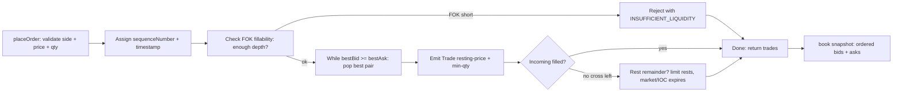
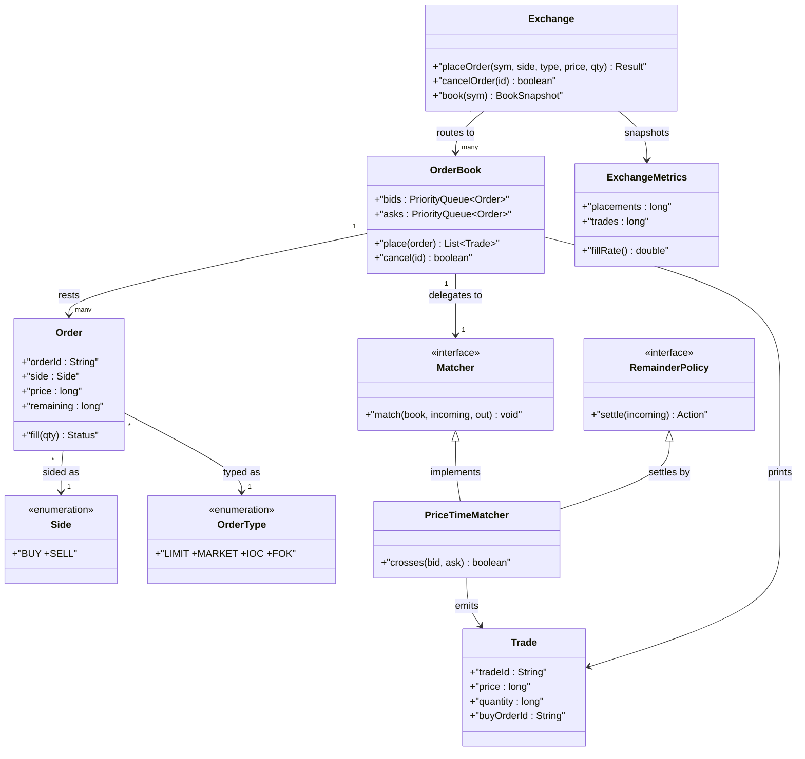
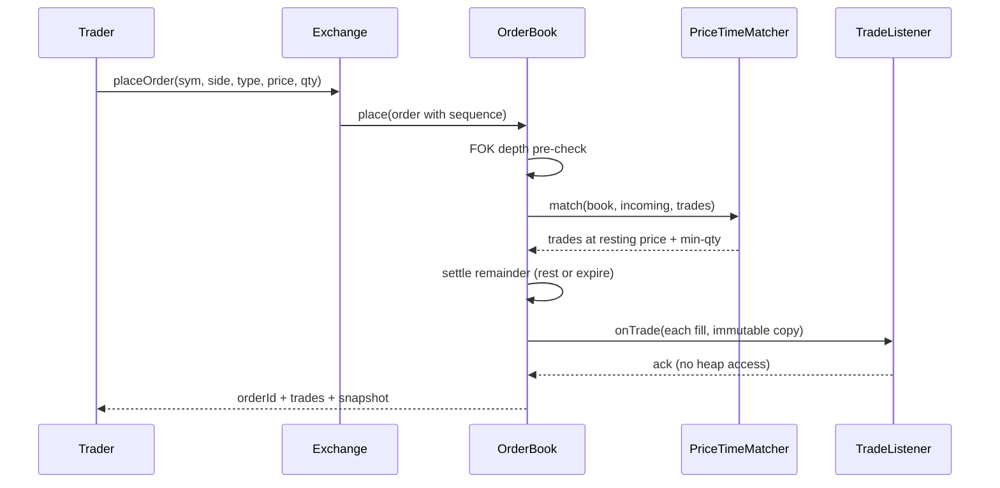

# Design a Limit Order Book or Stock Exchange book

## Blogs and websites

## Medium

## Youtube

- [Design A Limit Order Book | Google SWE Teaches Low Level Design Episode 5](https://www.youtube.com/watch?v=nmYx6tQxtSs)

## Theory

Design a limit order book matching buy (bid) and sell (ask) orders by price-time priority. Must support placing/cancelling orders and trade execution.
Key entities: Order (side/price/quantity), OrderBook (bids/asks), Trade/Match.
Core operations: place order, cancel order, match orders.

This guide turns that stub into an interview-ready low-level design: you will clarify an intentionally ambiguous single-symbol exchange, model clean OOP entities around Order, OrderBook, Trade, and Matcher, implement price-time priority matching with bid/ask heaps (best bid meets best ask while prices cross), support limit plus market plus IOC/FOK order types with cancel, and write plain Java 17 code an interviewer can trace on a whiteboard. The emphasis is on object modeling, matching mechanics, and order-lifecycle correctness — not market-data feeds, brokerage accounts, or distributed gateways.

> Scope note: this is LLD (class design, patterns, in-process concurrency). Order routing, clearing and settlement, market-data multicast, and persistence belong to HLD and are mentioned only where they constrain the object model (for example, every Trade carries buyOrderId plus sellOrderId plus price plus quantity plus timestamp so a retry or cancel can never create or erase a fill).

### Topics Covered

1. [Problem Statement](#problem-statement)
2. [Functional / Non-Functional Requirements](#functional--non-functional-requirements)
3. [Core Entities & Class Design](#core-entities--class-design)
4. [Key Design Decisions & Patterns Used](#key-design-decisions--patterns-used)
5. [Concurrency & Edge Cases](#concurrency--edge-cases)
6. [Java 17 Implementation](#java-17-implementation)
7. [Interview Questions and Answers](#interview-questions-and-answers)

---

### Problem Statement

Design an `Exchange` for one symbol (say `AAPL`) holding a limit order book with a bid side (buy orders, highest price first) and an ask side (sell orders, lowest price first). A trader submits an `Order` with side, price (for limits), and quantity; the `Matcher` repeatedly matches the best bid against the best ask while they cross (`bestBid >= bestAsk`), emitting a `Trade` per fill at the resting price, until no cross remains or the incoming quantity is exhausted. Any unfilled limit remainder rests on its side of the book; any unfilled market remainder expires; a `cancel(orderId)` removes a resting order. No trade may print at a crossed-away price, no quantity may be filled twice, and no cancelled order may ever match.

A `placeOrder(order)` returns an orderId plus a list of trades (possibly empty); a `cancelOrder(orderId)` removes a live resting order and returns success; a `book()` snapshot returns ordered bids and asks for quotes. Partial fills split one incoming order across many resting orders at successive price levels, sweeping the book level by level. Market orders consume liquidity immediately and never rest, IOC orders cancel their own remainder, and FOK orders demand all-or-nothing execution or full rejection.

**Why this problem exists**

- Real matching bugs cluster in three places: price priority inverted (lowest bid matched first, gifting spread to the wrong side), time priority ignored (a later order jumping an earlier order at the same price), and remainder mishandling (a fully-filled order left resting, or a market remainder parked on the book forever).
- The domain maps to two classic design ideas: price-time priority is a textbook dual-heap pairing (max-heap of bids plus min-heap of asks with FIFO inside each price level), and order-type behaviour is a textbook Strategy plus State family (one matching skeleton, per-type remainder policies, explicit order lifecycle states).
- Interviewers love it because the happy path takes 10 minutes (two heaps plus a while-cross loop plus trade list) but the follow-ups (why heaps not sorted lists, where does time priority live, market versus limit remainder, how do concurrent places stay atomic) separate API recall from modeled reasoning.

**Real-life analogues**

- **NASDAQ / NYSE limit order books**: per-symbol bid/ask queues, price-then-FIFO matching, trade prints at the resting price.
- **Crypto spot exchanges (Coinbase, Binance)**: same book mechanics plus market, IOC, FOK, and stop variants on top of one matcher.
- **Prediction markets and ticket exchanges**: buy/sell intention queues matched by best-price-first with time tie-breaks.

**Clarifying questions to ask in the interview (say these out loud)**

1. Symbols: one symbol per book or multi-symbol exchange with one book each? Fixed symbol set or dynamic listing?
2. Sides and price model: integer cents/ticks or decimal? Minimum tick size enforced? Zero or negative price ever legal?
3. Order types: limit only, or market, IOC, FOK, stop as well? Which types rest and which never rest?
4. Match price rule: trade prints at resting price, incoming price, or midpoint? Who gets price improvement?
5. Partial fills: allowed by default or all-or-none flag? Minimum fill quantity supported?
6. Time priority: what breaks price ties — order arrival timestamp, sequence number, or pro-rata share?
7. Cancel semantics: cancel by orderId only, or cancel-replace (amend price/quantity)? Can filled portions be cancelled?
8. Self-match: may one trader's buy match their own sell, or must self-trades be prevented?
9. Market data: bid/ask quote, depth, last-trade price in scope or HLD callback seam only?
10. Persistence: in-memory only, or journal every order plus trade for recovery? Sequence-number source?

**Assumptions for this guide (state these if the interviewer says "decide yourself")**

- Single `Exchange` holding `Map<symbol, OrderBook>`; each `OrderBook` owns one bid heap plus one ask heap for its symbol.
- Prices are long cents (no float), quantities are long shares; zero or negative price/quantity rejected with typed exceptions.
- Price-time priority: highest bid first, lowest ask first, earliest `sequenceNumber` first inside equal price; sequence assigned atomically at ingress.
- Trade price equals the resting order price (price improvement goes to the incoming aggressor); trade quantity equals `min(resting, incoming)` remainder.
- Limit remainder rests; market remainder expires; IOC remainder cancelled; FOK demands full fillability or full reject with zero partials.
- In-memory only, no persistence; self-trades allowed (prevention named as an extension, not built in).
- All public methods safe for concurrent use; one monitor per `OrderBook` guards place plus cancel plus match.



The diagram shows the guarded match loop from ingress to book: validation plus sequencing gate every order, FOK pre-check gates all-or-nothing before any fill, the cross loop emits one trade per price level until exhaustion, and only live limit remainders rest so market and IOC leftovers never pollute the book.

---

### Functional / Non-Functional Requirements

#### Functional requirements (must-have)

1. **Limit order placement and resting**
   - Support `placeOrder(symbol, side, price, qty)` creating an Order with unique orderId, sequenceNumber, and OPEN state; reject null symbol/side or non-positive price/quantity with typed exceptions.
   - If the incoming limit crosses the opposite best, match immediately; any unfilled remainder rests on its side heap keyed by price-time priority.
2. **Market order immediate execution**
   - Support market orders with no price that sweep the opposite side while quantity remains and depth exists; any unfilled remainder expires and never rests.
   - Market orders with an empty opposite side reject with `NoLiquidityException` and zero trades.
3. **IOC and FOK expiry semantics**
   - `IOC` behaves like a limit that cancels its own remainder after one sweep; `FOK` pre-checks total opposite depth at acceptable prices and rejects the whole order if short, with zero partial fills.
   - IOC/FOK remainders never appear in `book()` snapshots after return.
4. **Cancellation of resting orders**
   - `cancelOrder(orderId)` removes a live OPEN or PARTIALLY_FILLED resting order, marks it CANCELLED, and frees its quantity; cancelling a filled, cancelled, or unknown order raises a typed exception.
   - Cancellation never alters already-emitted trades; partial fills before cancel stand.
5. **Price-time priority matching loop**
   - Repeatedly match best bid versus best ask while `bestBid.price >= bestAsk.price`; each Trade prints at the resting price with `min` quantity, reducing both sides.
   - Inside equal price, the earliest sequenceNumber matches first; partial consumption keeps the survivor at the heap head with reduced quantity.
6. **Trade emission and identity**
   - Every fill creates a Trade with unique tradeId, symbol, buyOrderId, sellOrderId, price, quantity, and timestamp; both participating orders advance OPEN to PARTIALLY_FILLED to FILLED.
   - Trade legs are immutable once returned; retries of the same place call never duplicate trades because matching consumes quantity under lock.
7. **Book snapshot and quotes**
   - `book(symbol)` returns bids sorted price-descending then time, asks price-ascending then time, plus best-bid, best-ask, spread, and last-trade price.
   - Empty sides report as empty lists with null best; snapshots are copies so callers cannot mutate heap order.
8. **Multi-symbol facade**
   - `Exchange` routes each order to its symbol book, creating books lazily; unknown symbols on read return empty snapshots while unknown orderIds on cancel throw.

#### Explicitly out of scope (say this to bound the interview)

- Order routing across venues, clearing, settlement, and brokerage margin (each Trade carries enough ids for HLD to add them).
- Market-data multicast and charting pipelines (a listener seam records what HLD would consume).
- Stop, trailing-stop, iceberg, and pro-rata matching variants (named as extensions with one-line hooks).

#### Non-functional requirements (LLD-flavoured)

- **Correctness over speed**: no trade outside the cross, no double fill, and no cancelled-order match are ever observable; cross and liveness gates run before mutation.
- **O(log N) match steps by construction**: heap peek plus poll plus offer per fill level avoids full-book scans on every order.
- **Extensibility**: adding a new order type means adding one remainder policy, not rewriting the match loop.
- **Testability**: matcher, clock/sequence source, and trade listener are plain injectable seams drivable with fixed prices and a manual sequence.
- **Readability**: an interviewer can trace `place()` → `sequence()` → `fok-check()` → `cross-loop()` → `rest-or-expire()` in under five minutes.
- **Determinism**: no randomness; no wall-clock dependence except an injectable timestamp source for ordering ties.
- **Observability (lightweight)**: every placement, fill, cancel, rejection, and expiry increments a counter snapshotted as `ExchangeMetrics`.

| Requirement | Target / policy | Why it matters in LLD |
|---|---|---|
| Price priority never violated | Best bid vs best ask head-to-head each iteration | Core safety invariant |
| Time priority inside price | FIFO by sequenceNumber at equal price | Most-tested fairness probe |
| No phantom remainder | Market/IOC/FOK leftovers expire, only limits rest | Where juniors fail |
| FOK atomicity | Pre-check depth before any fill | All-or-nothing grading trap |
| Match atomicity | Scan-plus-fill under one per-book monitor | Double-fill leak guard |
| Quote testability | Snapshot copies plus injectable sequence | No-flake test design |

### Core Entities & Class Design

The model has four entity groups: the Exchange facade callers touch, the Order plus OrderBook inventory value objects holding side plus price plus quantity truth, the Trade plus fill pipeline holding execution truth, and the Matcher plus order-type policy family plus metrics observability seam. Keep behaviour with the data it guards: orders own lifecycle transitions, books own heap ordering, trades own immutable fill truth, policies own remainder choice, and the matcher owns the cross loop.

#### Value objects and supporting types (the vocabulary of the domain)

- `Side`: enum BUY versus SELL — buy orders join the bid heap, sell orders join the ask heap, so side routing is one branch at ingress.
- `OrderType`: enum LIMIT, MARKET, IOC, FOK — limit carries a price and may rest, market carries no price and never rests, IOC rests for one sweep then expires, FOK demands full fillability first.
- `OrderStatus`: enum OPEN, PARTIALLY_FILLED, FILLED, CANCELLED, REJECTED, EXPIRED — only OPEN and PARTIALLY_FILLED rest or match; terminal states never re-enter a heap.
- `Order`: mutable lifecycle record with `orderId`, `symbol`, `side`, `type`, `price` (cents, `0` for market), `quantity` (original), `remaining` (unfilled), `sequenceNumber` (FIFO tie-break), `createdAtMillis`, plus `status`; methods `fill(qty)`, `cancel()`, `isLive()`, `isMarket()`.
- `Trade`: immutable fill with `tradeId`, `symbol`, `buyOrderId`, `sellOrderId`, `price` (resting price), `quantity`, `timestamp`; no setters so a printed fill cannot mutate.
- `Sequence`: ordering source interface — `AtomicSequence` for production, `ManualSequence` for tests; every order takes the next number at ingress under lock.
- `TradeListener`: fill seam — `onTrade(trade)` lets HLD market-data callbacks observe without coupling the matcher to networking.
- `ExchangeMetrics`: immutable snapshot — placements, trades, filledQty, cancels, rejects, expiries, plus derived `fillRate()`.

#### Exchange, books, and matcher

- `Exchange`: owns `Map<String, OrderBook> books`, `Sequence`, timestamp source, `TradeListener`, and counters. Methods `placeOrder(symbol, side, type, price, qty)`, `cancelOrder(orderId)`, `book(symbol)`, `metrics()`, plus `orderIndex` mapping orderId to its book for O(1) cancel routing.
- `OrderBook`: one symbol book owning `PriorityQueue<Order> bids` (max by price, then min sequence), `PriorityQueue<Order> asks` (min by price, then min sequence), `Map<String, Order> resting` by orderId, `lastTradePrice`, and its own monitor. Methods `place(order)`, `cancel(orderId)`, `snapshot()`, `bestBid()`, `bestAsk()`.
- `Matcher` (interface): `match(OrderBook book, Order incoming, List<Trade> out)` running the cross loop; `PriceTimeMatcher` default implementation with `crosses(bid, ask)` as `bid.price >= ask.price`.
- `RemainderPolicy` (interface): `settle(Order incoming)` deciding rest versus expire versus cancel after the sweep; `LimitRestsPolicy`, `MarketExpiresPolicy`, `IocCancelsPolicy`, `FokPrechecksPolicy` variants provided.
- `Level`: interview vocabulary for one price tier — the matcher drains the head level FIFO before touching the next price, so multi-level sweeps are head-pop sequences not scans.
- `BookSnapshot`: immutable read view — ordered bid list, ordered ask list, best bid/ask, spread, last-trade price; built as copies under lock so callers never see heap internals.

#### Match, settle, and observability pipeline

- Match pipeline inside `place`: validate inputs, assign sequence plus timestamp, FOK pre-check depth, cross loop best-versus-best emitting trades at resting price, then remainder policy settle.
- Cancel pipeline inside `cancel`: lookup resting map, liveness gate (only OPEN or PARTIALLY_FILLED), heap remove plus map remove, mark CANCELLED — already-emitted trades untouched.
- Snapshot pipeline inside `book()`: copy both heaps under lock, sort copies into price-time display order, compute spread as `bestAsk - bestBid`, attach last-trade price.
- Metrics pipeline: every return path increments exactly one counter family — placement, fill, cancel, reject, expiry — so fill-rate math stays reproducible.



The diagram shows containment (exchange to books to orders), execution (book to trades via matcher), and delegation (book to matcher plus remainder policy) — the four relationships to name in the interview.

**Key relationships and cardinalities**

- Exchange 1—0..N OrderBook objects; each book owns exactly one symbol, so cross-symbol matches are unrepresentable.
- OrderBook 1—0..N resting Orders split across two heaps; exactly one heap per order by side, so no order sits on both sides observably.
- Trade N—1 buy Order plus N—1 sell Order; one incoming order maps to many trades, each trade maps to exactly two order legs.
- OrderBook 1—1 Matcher at a time; policy swap needs no state migration because matchers hold no book cache.
- Exchange 1—1 Sequence source shared across books; global ordering keeps FIFO comparable even when symbols interleave.

**Where behaviour lives (tell the interviewer)**

- Price truth lives in the heap comparators: bid head is max price then min sequence, ask head is min price then min sequence, so priority cannot drift.
- Time truth lives in the sequence number: FIFO at equal price is an integer compare, never a wall-clock race.
- Fill truth lives in the trade: resting price plus min quantity are frozen at emission, so retries cannot reprice or duplicate.
- Lifecycle truth lives in order status: only OPEN or PARTIALLY_FILLED orders rest, match, or cancel; terminal states reject every transition.
- Remainder truth lives in the policy: limit rests, market expires, IOC cancels, FOK pre-checks — the match loop never branches on type directly.

---

### Key Design Decisions & Patterns Used

#### Decision 1 — Dual heaps for price-time priority (the hook)

Each book holds a bid max-heap (highest price first, earliest sequence on ties) plus an ask min-heap (lowest price first, earliest sequence on ties). Every match iteration peeks both heads and crosses only while `bestBid.price >= bestAsk.price` — O(1) peek, O(log N) pop/push per fill level, no full-book scan. Say the trade-off verbatim: sorted lists or tree maps give O(log N) too but complicate FIFO-inside-price and heap-removal on cancel; dual priority queues express best-first pairing directly with one comparator per side. Name the invariant: heap order plus resting-map membership always change together under the book lock, so the matcher can never pair a cancelled order.

#### Decision 2 — Resting price wins every trade

Each fill prints at the resting order price, not the incoming price: an incoming buy at 105 hitting a resting sell at 100 trades at 100, and the incoming keeps the improvement. State the rationale verbatim — resting price rewards the liquidity provider who quoted first and matches real exchange semantics, while incoming-price or midpoint rules would let an aggressor reprice standing quotes. The `Trade` freezes this price immutably at emission so later cancels or snapshots cannot rewrite history.

#### Decision 3 — Remainder policies per order type, not if-chains in the loop

The cross loop never switches on order type; after the sweep it calls `RemainderPolicy.settle(incoming)` where limit rests, market expires, IOC cancels, and FOK pre-checks fillability before any fill happens. Say the scope sentence: FOK is a depth pre-check over acceptable-price opposite quantity (full fill possible or zero fills), not a post-sweep rollback — rollback would emit then void trades, breaking the no-phantom-fill invariant. A new type (say iceberg) is one policy class, zero edits to the loop.

#### Decision 4 — Sequence numbers, not timestamps, for time priority

FIFO ties break on a monotonically increasing `sequenceNumber` assigned at ingress under lock, not on `System.currentTimeMillis()` which collides under burst load. Tests inject a `ManualSequence` plus fixed timestamps so tie-break assertions are deterministic without sleeping. Say the metrics rule verbatim — sequence assignment happens before FOK pre-check and matching, so every accepted order has a total order even if rejected — because unsequenced rejects are the classic grading trap for replay-based tests.

#### Decision 5 — One monitor per book with listener at the edge

`place`, `cancel`, and `snapshot` synchronize on the owning `OrderBook`; sequence, heap moves, status flips, and trade emission share the same monitor so two racing places never double-fill the same resting quantity. The `TradeListener` callback fires with immutable trade copies, and a slow listener cannot corrupt heap state because it receives snapshots not references. State explicitly that `Exchange`-level routing (book lookup plus lazy creation) takes only a short exchange lock before delegating to the book lock — fixed lock order (exchange then book, never the reverse) keeps multi-symbol deadlock impossible.

#### Decision 6 — Explicit states, typed failures, immutable snapshots

- `OrderStatus { OPEN, PARTIALLY_FILLED, FILLED, CANCELLED, REJECTED, EXPIRED }` makes illegal transitions unrepresentable: only live orders match, only resting orders cancel.
- Typed exceptions (`InvalidOrderException`, `OrderNotFoundException`, `NoLiquidityException`, `InsufficientLiquidityException`) let callers branch without parsing strings.
- `Trade` and `BookSnapshot` as immutable copies avoid torn reads and let tests assert exact fill sequences per placement.
- Long-cents prices plus long quantities keep arithmetic exact; float or double prices are rejected by construction reasoning.

#### Patterns used (say these names out loud)

| Pattern | Where | Why |
|---|---|---|
| Strategy | `Matcher` and `RemainderPolicy` families | Cross rule and remainder choice vary independently |
| Facade | `Exchange` over books, sequence, listener, metrics | One interview-traceable API for all flows |
| State | `OrderStatus` transitions (open to partial to filled) | Match and cancel legality varies by lifecycle state |
| Template Method (light) | `place` then `sequence` then `fok-check` then `cross-loop` then `settle` skeleton | Shared ordering, pluggable policy hooks |
| Observer (light) | `TradeListener` on every emitted trade | Market-data reacts without matcher coupling |
| Memento (light) | `BookSnapshot` plus `ExchangeMetrics` immutable copies | Observe book and counters without corrupting live heaps |

**SOLID mapping (one line each for the "which principles?" follow-up)**

- Single Responsibility: orders guard lifecycle, books guard heap order, matchers run the cross loop, policies settle remainders, exchange routes symbols.
- Open/Closed: new order type or match rule equals a new policy or matcher class, zero edits to `place` or `cancel`.
- Liskov: any `Matcher` or `RemainderPolicy` substitutes without breaking the validate-sequence-match-settle pipeline.
- Interface Segregation: small `Matcher`, `RemainderPolicy`, `Sequence`, and `TradeListener` contracts instead of one fat exchange interface.
- Dependency Inversion: `OrderBook` depends on matcher and policy interfaces; tests inject deterministic sequences plus recording listeners.

### Concurrency & Edge Cases

#### The concurrency story (the senior half of the interview)

One symbol book has two heaps plus one resting map, so the design centers on atomic peek-then-fill plus remainder-settle plus decoupled notification. Three mechanisms from innermost to outermost:

1. **Single-monitor exclusion per book.** `place`, `cancel`, and `snapshot` are `synchronized` on the owning `OrderBook`; best-bid peek plus best-ask peek plus quantity decrement plus heap re-offer share the same monitor so two racing takers never fill the same resting quantity twice and depth never goes negative. Sequence assignment and FOK pre-check run inside the same critical section.
2. **Match-before-rest ordering.** `place` runs the full cross loop before resting any remainder; only a live limit leftover with quantity still unfilled enters a heap, and market/IOC/FOK leftovers expire under the same lock. Cancel removes from heap plus map atomically so the matcher never pairs a cancelled head.
3. **Notify outside the mutation.** `TradeListener.onTrade` fires with immutable trade copies collected during the loop; slow market-data sinks receive values not heap references, so a lagging consumer cannot reorder the next `place`. Metrics counters increment inside the lock but are snapshotted as an immutable record read outside it.



The diagram shows the match-then-settle ordering in time: sequencing and FOK probes complete before any fill, fills emit at resting price before any remainder rests, and notification carries copies after commit so observers never mutate heap order.

**Why not `ConcurrentHashMap` plus lock-free queues alone?** A concurrent map serializes key access but does not express best-bid-versus-best-ask pairing, atomic multi-level sweeps, or coherent fill-versus-cancel counts. Two takers hitting the same best ask could each peek sufficient depth and both fill it, printing phantom quantity, and a `cancel` removing a head mid-sweep is a two-structure write (heap plus map) that needs the same exclusion as `place`. Per-book exclusion plus heap-behind-lock gives both atomicity and priority: exclusion stops double-fills, heaps stop priority inversions.

**Post-access evaluation rule (say this verbatim): sequence, then pre-check, then cross, then settle, then notify.** After every place the book confirms inputs first, assigns sequence second, runs the FOK depth check third, drains the cross loop fourth, settles the remainder fifth, and only then notifies listeners. Expired plus zero depth-remaining is a rejection with a typed cause, never a rest.

#### Edge cases table (pick 4–5 to recite, keep the rest as backup)

| # | Edge case | Handling |
|---|---|---|
| 1 | Two takers `placeOrder` racing for the last resting ask | Serialized on the book monitor; winner fills it, loser sweeps next level or rests/rejects by type |
| 2 | Incoming buy price below best ask (no cross) | Zero trades; limit rests on bid heap, market rejects with `NoLiquidityException`, IOC/FOK expire/reject |
| 3 | Incoming sell sweeps three price levels partially | Loop pops level by level, one trade per resting order at each resting price; survivor keeps reduced remainder at head |
| 4 | FOK buy with 90 shares of acceptable depth but 100 wanted | Pre-check fails before any fill; whole order rejected with `InsufficientLiquidityException`, zero partials |
| 5 | IOC buy partially filled then depth exhausted | Filled legs stand as trades; remainder marked EXPIRED and never appears in `book()` |
| 6 | Market sell into an empty bid side | Rejected immediately with `NoLiquidityException`; nothing rests and sequence still advances for audit |
| 7 | `cancelOrder` for a partially filled resting order | Heap plus map remove under lock, status to CANCELLED; prior trades stand and filled quantity never returns |
| 8 | `cancelOrder` for unknown, filled, or already-cancelled id | Typed `OrderNotFoundException` or `IllegalStateException`; heaps and counters unchanged |
| 9 | `cancel` racing a `place` about to fill that order | Serialized on the same monitor; whichever commits first wins, the other sees the terminal state and reacts with a typed cause |
| 10 | Resting order fully filled but left in heap by bug | Prevented by construction: zero-remainder orders are never re-offered, only positive remainders re-enter |
| 11 | Self-trade (same trader both sides of a fill) | Allowed in this guide; prevention hook named as extension (skip-or-cancel-oldest flag at match time) |
| 12 | Zero or negative price/quantity on ingress | Rejected with `InvalidOrderException`; nothing sequenced into heaps so absent-versus-zero stays unambiguous |
| 13 | Duplicate `placeOrder` retry after timeout | Treated as a new order with a new id and sequence; idempotency key named as HLD extension, not built in |
| 14 | `book()` snapshot during a live sweep | Snapshot copies both heaps under lock into sorted lists; callers see a point-in-time view that never mutates heap order |
| 15 | Multi-symbol `place` storm across symbols | Exchange lock held only for book lookup/creation, then per-book locks; different symbols match in parallel, same symbol serializes |

---

### Java 17 Implementation

All classes below are plain Java 17 (no frameworks, enums for side/type/status, interfaces for matcher and policy seams). Dual heaps give O(log N) price-time matching, orders own lifecycle transitions, and each `OrderBook` synchronizes the commit path. Each block is followed by its explanation and the pattern it demonstrates.

#### 1. Sides, types, orders, and trades with price-time comparators

The foundation is enums plus a lifecycle-guarded order plus an immutable trade plus one comparator per heap side.

```java
import java.util.*;

// Side routing: BUY joins bids, SELL joins asks.
enum Side { BUY, SELL }

// Type contract: LIMIT may rest; MARKET never rests; IOC cancels rest; FOK pre-checks.
enum OrderType { LIMIT, MARKET, IOC, FOK }

enum OrderStatus { OPEN, PARTIALLY_FILLED, FILLED, CANCELLED, REJECTED, EXPIRED }

// Lifecycle record: only OPEN/PARTIALLY_FILLED match, rest, or cancel.
final class Order {
    final String orderId;
    final String symbol;
    final Side side;
    final OrderType type;
    final long price; // cents; 0 for MARKET
    final long quantity; // original
    long remaining;
    long sequenceNumber;
    final long createdAtMillis;
    OrderStatus status = OrderStatus.OPEN;

    Order(String orderId, String symbol, Side side, OrderType type,
          long price, long quantity, long createdAtMillis) {
        if (symbol == null || side == null || type == null) throw new InvalidOrderException("null field");
        if (type != OrderType.MARKET && price <= 0) throw new InvalidOrderException("limit price must be > 0");
        if (quantity <= 0) throw new InvalidOrderException("quantity must be > 0");
        this.orderId = orderId; this.symbol = symbol; this.side = side;
        this.type = type; this.price = price; this.quantity = quantity;
        this.remaining = quantity; this.createdAtMillis = createdAtMillis;
    }
    boolean isLive() { return status == OrderStatus.OPEN || status == OrderStatus.PARTIALLY_FILLED; }
    boolean isMarket() { return type == OrderType.MARKET; }
    void assignSequence(long seq) { this.sequenceNumber = seq; }
    // Reduce remainder; advance OPEN -> PARTIALLY_FILLED -> FILLED.
    void fill(long qty) {
        if (!isLive()) throw new IllegalStateException("fill on " + status);
        if (qty <= 0 || qty > remaining) throw new IllegalArgumentException("bad fill " + qty);
        remaining -= qty;
        status = (remaining == 0) ? OrderStatus.FILLED : OrderStatus.PARTIALLY_FILLED;
    }
    void cancel() {
        if (!isLive()) throw new IllegalStateException("cancel on " + status);
        status = OrderStatus.CANCELLED;
    }
    void expire() {
        if (!isLive()) throw new IllegalStateException("expire on " + status);
        status = OrderStatus.EXPIRED;
    }
}

// Immutable fill: frozen at emission so retries cannot reprice or duplicate.
record Trade(String tradeId, String symbol, String buyOrderId, String sellOrderId,
             long price, long quantity, long timestamp) {}

// Bid head: highest price first, earliest sequence on ties.
final class BidComparator implements Comparator<Order> {
    public int compare(Order a, Order b) {
        int p = Long.compare(b.price, a.price);
        return (p != 0) ? p : Long.compare(a.sequenceNumber, b.sequenceNumber);
    }
}

// Ask head: lowest price first, earliest sequence on ties.
final class AskComparator implements Comparator<Order> {
    public int compare(Order a, Order b) {
        int p = Long.compare(a.price, b.price);
        return (p != 0) ? p : Long.compare(a.sequenceNumber, b.sequenceNumber);
    }
}

class InvalidOrderException extends RuntimeException {
    InvalidOrderException(String m) { super(m); }
}
class OrderNotFoundException extends RuntimeException {
    OrderNotFoundException(String m) { super(m); }
}
class NoLiquidityException extends RuntimeException {
    NoLiquidityException(String m) { super(m); }
}
class InsufficientLiquidityException extends RuntimeException {
    InsufficientLiquidityException(String m) { super(m); }
}
```

Explanation: `Order.fill` is the lifecycle gatekeeper — every fill validates liveness plus quantity bounds, so double-fills and over-fills throw instead of printing phantom trades. The two comparators are the entire priority engine: one integer price compare plus one sequence compare replaces tree-map level bookkeeping and makes time-priority inversion unrepresentable. This block demonstrates the State pattern: match, rest, and cancel legality are functions of `OrderStatus`, not caller-side if chains.

#### 2. OrderBook with heaps plus matcher plus remainder policies

The book owns heap order and the matcher owns the cross loop; policies own the post-sweep remainder decision.

```java
import java.util.*;

// Ordering source: production atomic, tests manual.
interface Sequence { long next(); }
final class AtomicSequence implements Sequence {
    private final java.util.concurrent.atomic.AtomicLong n = new java.util.concurrent.atomic.AtomicLong(1);
    public long next() { return n.getAndIncrement(); }
}
final class ManualSequence implements Sequence {
    private long n;
    ManualSequence(long start) { n = start; }
    public long next() { return n++; }
}

interface TradeListener { void onTrade(Trade t); }
final class RecordingListener implements TradeListener {
    final List<Trade> seen = new ArrayList<>();
    public void onTrade(Trade t) { seen.add(t); }
}

// Strategy: cross rule varies independently of the book.
interface Matcher {
    void match(OrderBook book, Order incoming, List<Trade> out);
}

// Default: best-bid vs best-ask while prices cross, trade at resting price.
final class PriceTimeMatcher implements Matcher {
    public void match(OrderBook book, Order incoming, List<Trade> out) {
        while (incoming.remaining > 0) {
            Order bestBid = book.peekBid();
            Order bestAsk = book.peekAsk();
            if (bestBid == null || bestAsk == null) break;
            // Incoming BUY hits asks; incoming SELL hits bids.
            Order resting = (incoming.side == Side.BUY) ? bestAsk : bestBid;
            Order aggressorView = (incoming.side == Side.BUY)
                    ? syntheticBid(incoming) : syntheticAsk(incoming);
            Order bid = (incoming.side == Side.BUY) ? aggressorView : bestBid;
            Order ask = (incoming.side == Side.BUY) ? resting : aggressorView;
            if (!crosses(bid, ask)) break;
            // Market aggressor crosses any resting price by construction.
            long qty = Math.min(resting.remaining, incoming.remaining);
            long tradePrice = resting.price; // resting price wins
            book.consumeResting(resting, qty);
            incoming.fill(qty);
            out.add(new Trade(UUID.randomUUID().toString(), book.symbol(),
                    incoming.side == Side.BUY ? incoming.orderId : resting.orderId,
                    incoming.side == Side.BUY ? resting.orderId : incoming.orderId,
                    tradePrice, qty, System.currentTimeMillis()));
        }
    }
    // Market incoming: treat as infinitely crossing (any resting price matches).
    private boolean crosses(Order bid, Order ask) {
        if (bid.price == 0 || ask.price == 0) return true;
        return bid.price >= ask.price;
    }
    private Order syntheticBid(Order in) { return in; }
    private Order syntheticAsk(Order in) { return in; }
}

// Strategy: remainder choice varies by type after the sweep.
interface RemainderPolicy { void settle(OrderBook book, Order incoming); }
final class LimitRestsPolicy implements RemainderPolicy {
    public void settle(OrderBook book, Order incoming) {
        if (incoming.remaining > 0) book.rest(incoming);
        else if (incoming.status == OrderStatus.OPEN) incoming.fill(0); // no-op guard
    }
}
final class MarketExpiresPolicy implements RemainderPolicy {
    public void settle(OrderBook book, Order incoming) {
        if (incoming.remaining > 0) incoming.expire();
    }
}
final class IocCancelsPolicy implements RemainderPolicy {
    public void settle(OrderBook book, Order incoming) {
        if (incoming.remaining > 0) incoming.expire(); // IOC remainder cancelled
    }
}
```

Explanation: `PriceTimeMatcher.match` is the hook of the whole guide in one loop — peek both heads, test the cross, print at the resting price with min quantity, consume both sides — so multi-level sweeps are repeated head-pops with zero scans. Market handling falls out of the cross predicate (price zero always crosses) instead of a parallel loop. This block demonstrates the Strategy pattern twice: matchers vary the cross rule and `RemainderPolicy` variants vary rest-versus-expire behind `settle`, so adding iceberg or stop orders is a new class, not a loop rewrite.

#### 3. Exchange facade with atomic place-cancel-snapshot plus demo

`Exchange` routes symbols to books; each `OrderBook` runs validate, sequence, FOK pre-check, match, and settle under one monitor; this is the full book to trace on the whiteboard.

```java
import java.util.*;

record PlaceResult(String orderId, List<Trade> trades, OrderStatus status) {}
record BookLevel(long price, long quantity, long sequenceNumber) {}
record BookSnapshot(String symbol, List<BookLevel> bids, List<BookLevel> asks,
                    Long bestBid, Long bestAsk, Long spread, Long lastTradePrice) {}
record ExchangeMetrics(long placements, long trades, long filledQty,
                       long cancels, long rejects, long expiries) {
    double fillRate() { return placements == 0 ? 0.0 : (double) trades / placements; }
}

final class OrderBook {
    private final String sym;
    private final PriorityQueue<Order> bids = new PriorityQueue<>(new BidComparator());
    private final PriorityQueue<Order> asks = new PriorityQueue<>(new AskComparator());
    private final Map<String, Order> resting = new HashMap<>();
    private final Matcher matcher;
    private final Sequence seq;
    private final TradeListener listener;
    private Long lastTradePrice;
    private long trades, filledQty;

    OrderBook(String sym, Matcher matcher, Sequence seq, TradeListener listener) {
        this.sym = sym; this.matcher = matcher; this.seq = seq; this.listener = listener;
    }
    String symbol() { return sym; }
    Order peekBid() { return bids.peek(); }
    Order peekAsk() { return asks.peek(); }
    // Reduce a resting head; pop and drop FILLED, keep PARTIAL at head with less qty.
    void consumeResting(Order restingOrder, long qty) {
        PriorityQueue<Order> heap = (restingOrder.side == Side.BUY) ? bids : asks;
        Order head = heap.peek();
        if (head == null || head != restingOrder) throw new IllegalStateException("head mismatch");
        restingOrder.fill(qty);
        filledQty++;
        if (restingOrder.remaining == 0) { heap.poll(); resting.remove(restingOrder.orderId); }
        // partial stays at head: price+sequence unchanged so heap order holds
    }
    void rest(Order o) {
        ((o.side == Side.BUY) ? bids : asks).offer(o);
        resting.put(o.orderId, o);
    }
    // FOK gate: total opposite depth at acceptable prices covers incoming qty.
    private boolean fokFillable(Order incoming) {
        long need = incoming.remaining;
        var scan = (incoming.side == Side.BUY) ? new ArrayList<>(asks) : new ArrayList<>(bids);
        long avail = 0;
        for (var r : scan) {
            if (incoming.side == Side.BUY && r.price > incoming.price) continue;
            if (incoming.side == Side.SELL && r.price < incoming.price) continue;
            avail += r.remaining;
            if (avail >= need) return true;
        }
        return false;
    }
    public synchronized PlaceResult place(Order incoming) {
        incoming.assignSequence(seq.next());
        if (incoming.type == OrderType.FOK && !fokFillable(incoming)) {
            incoming.expire();
            throw new InsufficientLiquidityException("FOK short for " + incoming.orderId);
        }
        if (incoming.isMarket() && (bids.isEmpty() && incoming.side == Side.SELL
                || asks.isEmpty() && incoming.side == Side.BUY)) {
            incoming.expire();
            throw new NoLiquidityException("empty opposite for market " + incoming.orderId);
        }
        var out = new ArrayList<Trade>();
        matcher.match(this, incoming, out);
        // Settle remainder by type: limit rests, market/IOC/FOK expire.
        if (incoming.remaining > 0) {
            switch (incoming.type) {
                case LIMIT -> rest(incoming);
                default -> incoming.expire();
            }
        }
        for (var t : out) { lastTradePrice = t.price(); trades++; listener.onTrade(t); }
        return new PlaceResult(incoming.orderId, List.copyOf(out), incoming.status);
    }
    public synchronized boolean cancel(String orderId) {
        var o = resting.get(orderId);
        if (o == null) throw new OrderNotFoundException(orderId);
        o.cancel();
        ((o.side == Side.BUY) ? bids : asks).remove(o);
        resting.remove(orderId);
        return true;
    }
    public synchronized BookSnapshot snapshot() {
        var b = new ArrayList<>(bids); b.sort(new BidComparator());
        var a = new ArrayList<>(asks); a.sort(new AskComparator());
        Long bb = b.isEmpty() ? null : b.get(0).price;
        Long ba = a.isEmpty() ? null : a.get(0).price;
        Long spread = (bb == null || ba == null) ? null : ba - bb;
        return new BookSnapshot(sym, toLevels(b), toLevels(a), bb, ba, spread, lastTradePrice);
    }
    private static List<BookLevel> toLevels(List<Order> os) {
        var l = new ArrayList<BookLevel>();
        for (var o : os) l.add(new BookLevel(o.price, o.remaining, o.sequenceNumber));
        return List.copyOf(l);
    }
}

public class Exchange {
    private final Map<String, OrderBook> books = new HashMap<>();
    private final Matcher matcher = new PriceTimeMatcher();
    private final Sequence seq = new AtomicSequence();
    private final TradeListener listener;
    private final java.util.concurrent.atomic.AtomicLong ids = new java.util.concurrent.atomic.AtomicLong(1);
    public Exchange(TradeListener listener) { this.listener = listener; }
    private synchronized OrderBook bookFor(String symbol) {
        return books.computeIfAbsent(symbol, s -> new OrderBook(s, matcher, seq, listener));
    }
    public PlaceResult placeOrder(String symbol, Side side, OrderType type, long price, long qty) {
        Objects.requireNonNull(symbol, "symbol");
        var id = "O" + ids.getAndIncrement();
        var order = new Order(id, symbol, side, type, price, qty, System.currentTimeMillis());
        return bookFor(symbol).place(order);
    }
    public boolean cancelOrder(String symbol, String orderId) {
        OrderBook b;
        synchronized (this) { b = books.get(symbol); }
        if (b == null) throw new OrderNotFoundException(orderId);
        return b.cancel(orderId);
    }
    public BookSnapshot book(String symbol) {
        OrderBook b;
        synchronized (this) { b = books.get(symbol); }
        if (b == null) return new BookSnapshot(symbol, List.of(), List.of(), null, null, null, null);
        return b.snapshot();
    }
}

// Demo: limit cross plus partial sweep plus cancel answered by heaps, not by scans.
class ExchangeDemo {
    public static void main(String[] args) {
        var listener = new RecordingListener();
        var ex = new Exchange(listener);
        ex.placeOrder("AAPL", Side.SELL, OrderType.LIMIT, 100_00, 10); // ask 100 x10
        ex.placeOrder("AAPL", Side.SELL, OrderType.LIMIT, 101_00, 5); // ask 101 x5
        var r = ex.placeOrder("AAPL", Side.BUY, OrderType.LIMIT, 101_00, 12); // sweeps 10@100 + 2@101
        System.out.println(r.trades()); // two trades at resting prices 100 then 101
        System.out.println(ex.book("AAPL")); // bid empty, ask 101 x3 resting
        var m = ex.placeOrder("AAPL", Side.BUY, OrderType.MARKET, 0, 2); // takes 2 @101
        System.out.println(m.trades());
        System.out.println("heard=" + listener.seen.size()); // 3 fills total
    }
}
```

Explanation: `place` is the matching half of the interview in one method — sequence, FOK pre-check, cross loop, type-switched settle — in an order that never rests a market remainder or partially fills a short FOK. `consumeResting` keeps partial survivors at the heap head without re-heapifying by hand, because price plus sequence never change on a fill. The demo wires two asks, one sweeping bid, and one market take through the same book, which is exactly the live-coding arc to reproduce: cross, sweep, rest, snapshot print. This block demonstrates Facade plus Template Method: fixed pipeline skeleton, pluggable matcher hook.

**How to extend (name these without building them)**

- Self-trade prevention: pass traderId on Order and add a match-time flag skip-own (cancel resting or reject incoming) inside the cross loop.
- Stop and iceberg variants: add trigger-price and displayed-quantity fields with a policy that reveals slices per fill without touching heaps.
- Cancel-replace (amend): implement as cancel-plus-place sharing one sequence note so time priority resets visibly and listeners see cancel plus new-id trades.

---

### Interview Questions and Answers

1. **Beginner: walk me through the classes in your exchange.**
   Answer: `Exchange` facade over per-symbol `OrderBook` heaps, `Order` lifecycle records with `Side`, `OrderType`, and `OrderStatus`, immutable `Trade` fills, `Matcher` interface with `PriceTimeMatcher`, `RemainderPolicy` settle variants, `Sequence` ordering source, `TradeListener` fill seam, immutable `BookSnapshot` plus `ExchangeMetrics`, and typed exceptions for invalid, missing, and short-liquidity outcomes.

2. **Beginner: how does price-time priority actually work in your heaps?**
   Answer: bids form a max-heap by price and asks a min-heap by price, with earliest sequenceNumber breaking ties inside equal price. Each iteration peeks both heads and matches only while bestBid is at least bestAsk, so the best price always trades first and the oldest order at that price trades first.

3. **Beginner: what price does a trade print at, and who benefits?**
   Answer: every fill prints at the resting order price, giving price improvement to the incoming aggressor — a buy at 105 hitting a resting sell at 100 trades at 100. The price freezes immutably in the Trade so later cancels or snapshots cannot rewrite it.

4. **Junior: what happens to the leftover quantity for each order type?**
   Answer: limit remainders rest on their heap side; market remainders expire; IOC remainders cancel after one sweep; FOK never leaves a remainder because short depth rejects the whole order upfront. Only live limit leftovers appear in book snapshots.

5. **Junior: why sequence numbers instead of timestamps for time priority?**
   Answer: wall-clock millis collides under burst load while a monotonic sequence assigned under lock gives a total order every placement. Tests use a manual sequence for deterministic FIFO assertions without sleeping, and every accepted order is sequenced before matching even if later rejected.

6. **Junior: why do partially filled orders stay at the heap head?**
   Answer: a fill reduces remaining without changing price or sequence, so heap order still holds and no re-insert is needed. Fully filled heads pop and leave the resting map; partial heads keep priority over later orders at the same price, preserving FIFO.

7. **Mid: how do concurrent placements and cancels stay correct?**
   Answer: all state paths synchronize on the owning OrderBook so peek, fill, heap pop, map remove, and settle are atomic. Two racing takers cannot fill the same resting quantity, and a cancel racing a fill serializes so one wins with the other seeing a typed terminal state. Exchange routing takes only a short lookup lock before delegating to the book lock.

8. **Mid: how does FOK stay all-or-nothing without emitting then voiding trades?**
   Answer: FOK runs a depth pre-check summing acceptable-price opposite quantity before the loop; short depth rejects with zero fills. The loop only runs when full coverage exists, so no rollback or tradevoid path is needed and listeners never see phantom fills.

9. **Senior: why heaps over sorted lists or tree maps, and what is the complexity?**
   Answer: heaps give O(1) best peek with O(log N) pop and offer per fill level and express best-first pairing with one comparator per side, while sorted lists pay O(N) inserts and tree maps add level-bookkeeping for FIFO inside price. A sweep across k fills costs O(k log N) with no full-book scan, and cancel pays linear heap remove which is fine for interview scale.

10. **Senior: how do you test crosses, sweeps, FOK, and races without flakiness?**
    Answer: inject a manual sequence plus recording listener and assert trade prices follow resting levels across a scripted multi-level sweep, assert FOK short rejects with zero listener events, assert IOC remainder expires off-book, and run a ten-thread same-ask take storm asserting total filled quantity never exceeds resting depth. Snapshot copies assert exact bid/ask display order per placement.


