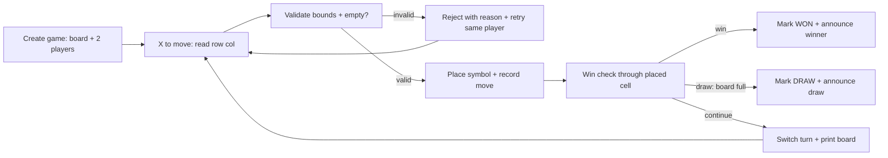
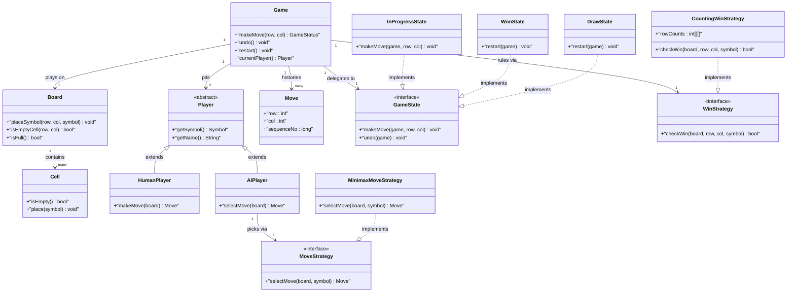
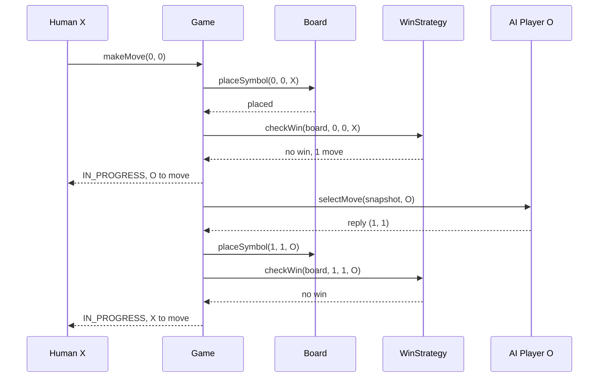

# Implement a Tic Tac Toe Game

## Blogs and websites

## Medium

## Youtube

- [TicTacToe | Google Gigachad SWE Teaches Low Level Design Episode 1](https://www.youtube.com/watch?v=Mw0fHf7d-38)
- [Design Tic Tac Toe game (Hindi) | Tic-Tac-Toe LLD Java | Low Level Design, System Design](https://www.youtube.com/watch?v=x8N3fINNdTE)
- [Low-Level Design of Tic Tac Toe | LLD Tutorial of Tic Tac Toe | System Design Tutorial | SCALER](https://www.youtube.com/watch?v=ULnY8VW7YCs)

## Theory

Design the two-player game on a 3x3 grid with alternating X/O moves. Must validate moves, detect win/draw, and manage turns (AI opponent optional).
Key entities: Board/Cell, Player (symbol), Move, Game.
Core operations: make move, validate cell, check winner.

Uses the State pattern to model the game lifecycle (e.g., In Progress, Won, Draw).

Uses the Strategy pattern for win detection and for the AI opponent (so row/column/diagonal rules and difficulty levels are pluggable).

Design a two-player Tic-Tac-Toe game on an NxN grid where players alternate placing X and O, every move is validated against board bounds and occupancy, a win is declared the moment K-in-a-row appears, a draw is declared when the board fills with no winner, and turns plus game status stay consistent even under undo, restart, or concurrent UI and AI threads.

This guide turns that stub into an interview-ready low-level design: you will clarify an intentionally small game that hides real depth, model clean OOP entities around Board, Cell, Player, Move, and Game, choose State for the game lifecycle and Strategy for win checking and AI move selection, handle turn-safety plus AI-race concurrency, and write plain Java 17 code an interviewer can trace on a whiteboard. The emphasis is on object modeling, O(1) win detection, and extensibility trade-offs — not frameworks, networking, or online multiplayer infrastructure.

> Scope note: this is LLD (class design, patterns, in-process concurrency). Networked multiplayer, matchmaking ladders, persistent leaderboards, and game-server tick loops belong to HLD and are mentioned only where they constrain the object model (for example, every Move carries a sequence number so a retry or an AI callback never applies twice).

### Topics Covered

1. [Problem Statement](#problem-statement)
2. [Functional / Non-Functional Requirements](#functional--non-functional-requirements)
3. [Core Entities & Class Design](#core-entities--class-design)
4. [Key Design Decisions & Patterns Used](#key-design-decisions--patterns-used)
5. [Concurrency & Edge Cases](#concurrency--edge-cases)
6. [Java 17 Implementation](#java-17-implementation)
7. [Interview Questions and Answers](#interview-questions-and-answers)

---

### Problem Statement

Design a Tic-Tac-Toe game for two players on a 3x3 grid (extensible to NxN with K-in-a-row): create players with symbols X and O, alternate turns starting with X, accept a row and column per move, reject out-of-bounds or already-filled cells, place the symbol, check for a win or a draw after every move, announce the result, and support restart, undo (optional), and a computer opponent (optional). A Game controller orchestrates turns and status; a Board owns cells; a WinStrategy decides the winner.

Two players enter names and pick symbols. Player X moves first by naming an empty cell. The game validates the cell, places the symbol, and checks all lines through that cell. If three matching symbols align, the mover wins immediately. If the ninth move fills the board with no line, the game is a draw. The board prints after every move. A restart clears the board and resets the turn; an AI opponent, when enabled, computes its reply move automatically after each human move.

**Why this problem exists**

- Simple rules hide the classic LLD traps: win checks rescanned naively are O(N) per move, turn logic leaks into UI code, and AI callbacks apply moves out of turn.
- The domain maps to two classic patterns: game lifecycle is a textbook State machine, and win detection plus AI difficulty are textbook Strategy plug-ins.
- Interviewers love it because the happy path takes 10 minutes but the follow-ups (NxN with K-in-row, O(1) win check, undo, AI opponent, thread-safe moves) separate junior from senior answers.

**Real-life analogues**

- **Board-game engines and puzzle apps**: grid state, move history, pluggable rule sets per variant.
- **Turn-based mobile games**: move validation, turn timers, bot opponents with difficulty strategies.
- **Game-rule validators**: line-completion checks reused in Connect Four, Gomoku, and Bingo engines.

**Clarifying questions to ask in the interview (say these out loud)**

1. Board size: fixed 3x3, or configurable NxN from the start?
2. Win rule: full N-in-a-row, or general K-in-a-row with K <= N?
3. Players: two humans, human versus computer, or computer versus computer demo?
4. Symbols: classic X and O only, or arbitrary symbols per player?
5. Move input: row and column numbers, cell index 1-9, or click events mapped later?
6. Undo and redo: single undo, full history, or no undo at all?
7. Restart and rematch: same players and symbols swapped, or fresh setup?
8. AI difficulty: random moves, defensive blocking, or full minimax with depth limit?
9. Draw handling: automatic draw on full board, or early-draw detection when no line is possible?
10. Concurrency: single-threaded console turns, or UI thread plus AI worker thread plus turn timer?

**Assumptions for this guide (state these if the interviewer says "decide yourself")**

- Default board 3x3 with N configurable and win length K configurable (K = N by default).
- Two players: human-human by default; one player can be swapped for an AI without changing Game.
- Symbols X and O assigned at construction; X always moves first unless the caller overrides.
- Moves are zero-indexed (row, col) pairs; out-of-bounds or occupied cells throw typed exceptions.
- O(1) win detection via per-line counters maintained incrementally on each move.
- Undo supported through a move-history stack; restart clears board, history, counters, and status.
- AI is a Strategy plug-in: random first, blocking second, minimax optional for 3x3.



The diagram shows the guarded turn loop from setup to terminal state: validation gates placement, every placement flows through the win check, terminal states stop the loop, and invalid input retries the same player without switching turns.

---

### Functional / Non-Functional Requirements

#### Functional requirements (must-have)

1. **Game setup**
   - Create an NxN board, register two players with distinct symbols, set X to move first.
   - Support configurable N (default 3) and win length K (default N); reject K > N or K < 3 at construction.
2. **Turn management**
   - Alternate turns strictly; the same player never moves twice in a row.
   - Expose `currentPlayer()` and `gameStatus()` so any UI can render without tracking its own turn.
3. **Move placement and validation**
   - Accept a (row, col) move; reject negative or >= N coordinates with `InvalidMoveException`.
   - Reject occupied cells with `CellOccupiedException`; failed moves never switch the turn.
   - Place the symbol, append to move history, update win counters, then evaluate status.
4. **Win detection**
   - After every move check only lines through the placed cell (its row, column, and diagonals if applicable).
   - Declare the mover winner the moment any tracked line reaches K; stop accepting further moves.
5. **Draw detection**
   - When all N*N cells fill with no winner, mark status DRAW and freeze the board.
   - Report draw immediately on the filling move, not on the next attempted move.
6. **Board query and rendering**
   - Offer `getCell(row, col)`, `isFull()`, `availableMoves()`, and a `printBoard()` view.
   - Never expose the mutable cell array directly; return copies or read-only views.
7. **Restart and rematch**
   - Reset board cells, counters, history, move count, status, and turn to X on `restart()`.
   - Optionally swap symbols on rematch without reconstructing players.
8. **Undo (bounded scope)**
   - Pop the last move, clear its cell, decrement its counters, restore the turn to the undone player.

9. **AI opponent (optional but designed in)**
   - When enabled, the AI computes a reply move through a `MoveStrategy` after each human move.
   - Difficulty levels are swappable strategies: random, blocking, minimax; Game never branches on difficulty.
10. **Move history and audit**
    - Every accepted move appends a `Move(row, col, player, sequenceNumber)` record.
    - History supports undo, replay, and duplicate-callback rejection via sequence numbers.

#### Explicitly out of scope (say this to bound the interview)

- Networked multiplayer, matchmaking, and Elo ladders (a `Game` interface seam stands in).
- Persistent leaderboards and game-database storage (an append-only in-memory history plus repository seam is enough).
- Turn timers over WebSockets and push notifications (a `Clock` plus timeout hook keeps the door open).

#### Non-functional requirements (LLD-flavoured)

- **Correctness over speed**: no move without validation; no win without K-in-a-row; every lifecycle transition is guarded.
- **State safety**: only legal actions per status execute (no moves after WON or DRAW); illegal calls throw typed exceptions.
- **Concurrency**: one move applied at a time plus concurrent AI computation and UI rendering handled with a single game monitor.
- **Extensibility**: adding a board size, win rule, or AI level means adding a class, not rewriting `Game` (Open/Closed Principle).
- **Testability**: board, win strategy, and AI strategy are injectable interfaces so tests drive them with fixed move scripts.
- **Readability**: an interviewer can trace `createGame()` → `makeMove()` → `validate()` → `checkWin()` → `switchTurn()` in under five minutes.
- **Robustness**: bad input, double submits, AI timeouts, and undo-after-win all fail with typed errors and a clear board state.
- **Auditability (lightweight)**: every move appends to history with sequence number, player, and outcome.

| Requirement | Target / policy | Why it matters in LLD |
|---|---|---|
| No overwrites | Occupancy check before placement | Core board safety invariant |
| Instant win call | O(1) counters per move | Senior follow-up answer |
| Turn hygiene | Failed move never switches turn | Next player never cheated |
| Lifecycle truth | Terminal states freeze the board | Undo and AI respect the end |
| AI safety | Sequence numbers dedupe callbacks | Prevents double-apply races |
| NxN readiness | N and K injected at construction | No 3x3 constants scattered |

---

### Core Entities & Class Design

The model has five entity groups: game value objects and enums, the board that owns cells, the player hierarchy, the State hierarchy for the game lifecycle, and the Strategy plug-ins for win detection and AI. Keep behaviour with the data it guards: board owns cell truth, strategies own rule math, states own transition rules, and the game owns orchestration.

#### Value objects and enums (the vocabulary of the domain)

- `Symbol { X, O }` — the mark placed; X moves first by convention.
- `CellState { EMPTY, X, O }` — per-cell content; board maps symbols to states on placement.
- `GameStatus { IN_PROGRESS, WON, DRAW }` — lifecycle truth read by every UI and the AI callback.
- `Cell`: immutable coordinates (row, col) plus mutable content guarded by the board. Methods `isEmpty()`, `place(symbol)`, `clear()`.
- `Move`: immutable record — row, col, player reference, symbol, sequence number, timestamp. Equality on sequence number for dedupe.
- `Player`: name plus symbol; `makeMove(board)` is abstract so human and AI differ only in how they pick cells.

#### Board, players, and game controller

- `Board`: owns `Cell[N][N]`, move count, and empty-cell set. Methods `placeSymbol(row, col, symbol)`, `isEmptyCell(row, col)`, `isFull()`, `availableMoves()`, `clear()`, `getCell(row, col)`. All mutators validate bounds first.
- `HumanPlayer extends Player`: move coordinates arrive from the caller; no extra state.
- `AIPlayer extends Player`: holds a `MoveStrategy`; `selectMove(boardView)` delegates to the strategy so difficulty is swappable.
- `Game`: the context and orchestrator. Holds `Board`, `Player X`, `Player O`, `currentPlayer`, `GameStatus`, `WinStrategy`, move history stack, sequence counter, and optional undo support. Methods `makeMove(row, col)`, `undo()`, `restart()`, `currentPlayer()`, `status()`, `history()`.
- `GameState` (interface): `makeMove()`, `undo()`, `restart()` with per-state legal behaviour; illegal calls throw `IllegalStateOperationException`.
- Concrete states: `InProgressState` (moves allowed), `WonState` (only restart or undo), `DrawState` (only restart or undo). Terminal states reject placements.

#### Win and AI strategies (Strategy pattern, twice)

- `WinStrategy` (interface): `checkWin(board, lastRow, lastCol, symbol)` plus `reset()`. Keeps all rule math out of `Game`.
- `CountingWinStrategy`: per-symbol row counts, column counts, two diagonal counts; increment on each move and compare against K. O(1) per move, O(N) memory.
- `ScanningWinStrategy`: fallback that scans outward from the last move in four directions up to K steps; O(K) per move, zero extra memory. Used for large N or to explain the naive baseline.
- `MoveStrategy` (interface): `selectMove(boardView, symbol)` returning an empty cell for AI play.
- Concrete AI: `RandomMoveStrategy` (uniform random empty cell), `BlockingMoveStrategy` (win if possible, block if needed, else random), `MinimaxMoveStrategy` (full search with depth limit, practical only for 3x3).

#### History, rendering, and game seam

- `MoveHistory`: append-only stack of `Move` records; `push()` on success, `pop()` on undo, `clear()` on restart.
- `BoardRenderer`: read-only view — `printBoard()`, `toString()` grid, `availableMoves()` snapshot; never exposes the mutable array.
- `GameFactory`: builds default 3x3 human-human games, NxN custom games, and human-AI games with a chosen difficulty.



The diagram shows containment (game owns board and history), delegation (game to state), pitting (game to two players), ruling (game to win strategy), and picking (AI player to move strategy) — the five relationships to name in the interview.

**Key relationships and cardinalities**

- Game 1—1 Board; board size N fixed at construction, never resized mid-game.
- Game 1—2 Players with distinct symbols; current player flips only on accepted moves.
- Game 1—1 GameState at a time; transitions are `InProgress → Won`, `InProgress → Draw`, either terminal `→ InProgress` on restart.
- Game 1—1 WinStrategy; swapping counting for scanning changes zero game code.
- AIPlayer 1—1 MoveStrategy; swapping random for minimax changes zero game code.
- Game 1—\* Move history (append-only; undos pop and adjust counters symmetrically).

**Where behaviour lives (tell the interviewer)**

- Placement guards live on the board, not in the UI: bounds, occupancy, and full checks throw before any mutation.
- Turn rules live on the game: only accepted moves flip `currentPlayer`; rejections leave it untouched.
- Line math lives in win strategies: the game passes the last move and symbol, the strategy answers won or not.
- Transition guards live in state classes, not in `if` chains on the game: `WonState.makeMove` throws, `InProgressState.makeMove` orchestrates.
- Move choice lives in player subtypes: humans supply coordinates, AI delegates to its move strategy.

---

### Key Design Decisions & Patterns Used

#### Decision 1 — Full State pattern for the game lifecycle (not enums)

Spot lifecycles in simpler sketches fit enums, but Tic-Tac-Toe has per-status behaviour (in-progress accepts moves, won and draw reject moves but accept restart and undo) plus transition side effects (win announcement, history freeze). A GoF State hierarchy puts each rule next to its status so `Game` never branches on status names. Name the trade-off: enums would be fewer classes, but every new operation would scatter `if (status == ...)` checks across the game — exactly the rigidity interviewers probe for.

#### Decision 2 — Strategy for win detection with O(1) counting as default

Hard-coding `board[0][0] == board[0][1] ...` freezes the design at 3x3 and rescans the board per move. A `WinStrategy` interface makes the rule pluggable: the counting implementation keeps per-symbol row, column, and diagonal tallies and checks only lines through the last move in constant time. A scanning fallback handles arbitrary K without extra memory. Adding Gomoku-style 5-in-a-row on 15x15 is a new strategy, zero game changes. The pre-check ordering (validate, place, count, decide) is the correctness core.

#### Decision 3 — Win-detection plus extensibility: NxN, K-in-row, AI opponent

The extensibility story is one sentence per axis. NxN: N injected into `Board` and all loops bound by N, never the literal 3. K-in-row: K injected into the win strategy with a `K <= N` guard; diagonals tracked only when the move lies on them, and edge cells still check correctly. AI opponent: `AIPlayer` wraps any `MoveStrategy`, so random, blocking, and minimax are constructor choices; the game calls `currentPlayer` uniformly and never asks whether the mover is human. Say this trio verbatim — it is the senior answer to "how does this scale beyond 3x3?".

#### Decision 4 — Board owns cell truth; Game owns turn truth

The board never knows whose turn it is, and the game never indexes raw cells without going through the board. Placement flows one way: game validates turn, board validates geometry, strategy validates victory. Undo reverses symmetrically: history pops, board clears, counters decrement, turn restores. This split keeps a future networked UI honest — the server replays moves through the same `makeMove` path.

#### Decision 5 — Moves as immutable records with sequence numbers

Each accepted move carries a monotonically increasing sequence number. Retried submits and late AI callbacks with a stale number are ignored instead of applied twice. Undo pops by number so concurrent readers see a consistent prefix. This models production exactly-once turn semantics with one long field of interview code.

#### Decision 6 — Board size and symbols as construction policy, not runtime branches

- N and K validated once in the constructor (`N >= 3`, `3 <= K <= N`) so no method rechecks dimensions.
- Symbols as a two-value enum keep rendering and counter indexing branch-free.
- `java.time.Instant` timestamps on moves make replay and turn-timer tests deterministic.

#### Patterns used (say these names out loud)

| Pattern | Where | Why |
|---|---|---|
| State | Game lifecycle (`InProgressState`, `WonState`, `DrawState`) | Legal-action enforcement without `if` chains |
| Strategy | `WinStrategy` row/column/diagonal rules | Pluggable win math plus O(1) counting |
| Strategy (second) | `MoveStrategy` random, blocking, minimax | Swappable AI difficulty |
| Template Method (light) | `Player.makeMove` skeleton, per-subtype pick | Shared turn contract, pluggable choice |
| Facade | `Game` over board, states, strategies, history | One interview-traceable API for all flows |
| Memento (light) | `Move` history stack for undo | Restore cell plus counters symmetrically |
| Observer (light) | Status-change hook for renderer and AI | One result event, board and bot readers |

**SOLID mapping (one line each for the "which principles?" follow-up)**

- Single Responsibility: board guards cells, strategy guards lines, state guards transitions, game orchestrates.
- Open/Closed: new board size, win rule, or AI level equals a new parameter or class, zero edits to `makeMove()`.
- Liskov: any `GameState`, `WinStrategy`, or `MoveStrategy` substitutes without breaking the game or AI player.
- Interface Segregation: small `GameState`, `WinStrategy`, `MoveStrategy` contracts instead of one fat game interface.
- Dependency Inversion: the game depends on the `WinStrategy` interface; tests inject counting or scanning fakes.

---

### Concurrency & Edge Cases

#### The concurrency story (the senior half of the interview)

Tic-Tac-Toe is single-turn at heart, so the design centers on move exclusion plus two background actors (AI worker thread, UI render thread). Three mechanisms from innermost to outermost:

1. **Move exclusion on the game.** All mutating entry points (`makeMove`, `undo`, `restart`) are `synchronized` on the game; a move arriving while the AI reply is being applied blocks until the board and counters are consistent. Validation, placement, counting, and turn flip happen atomically inside one monitor.
2. **AI computes outside, applies inside.** The AI strategy runs `selectMove` on a read-only board snapshot off the game monitor, then re-enters via `makeMove` to apply. A stale AI callback (computed before the opponent's latest move) carries an old sequence base and is rejected instead of overwriting. AI timeouts abandon the computation without touching the board.
3. **Terminal freeze as a guarded transition.** Once status becomes WON or DRAW, states reject further placements even if a double-click or a late AI callback arrives. Only `restart` or `undo` leaves a terminal state, both synchronized, so render threads never see a half-cleared board.



The diagram shows the turn-safe ordering in time: each placement completes its win check before the turn flips, and the AI reply flows through the same validated path as a human move, so no callback can skip validation or double-apply.

**Why not `synchronized makeMove()` alone?** A single coarse lock would serialize humans against the AI correctly but would not express which actions are legal per status — a move after WON could still overwrite a winning cell between calls. State guards plus the game monitor give both exclusion and legality: exclusion stops races, states stop nonsense.

**Post-win rule (say this verbatim): validate → place → count → freeze on win.** If the winning move fills the last line, the game marks WON, records the winning move, freezes the board, and announces the winner. Undo from WON pops the winning move, decrements its counters, and reopens IN_PROGRESS with the winner to move — the only backward transition allowed.

#### Edge cases table (pick 4–5 to recite, keep the rest as backup)

| # | Edge case | Handling |
|---|---|---|
| 1 | Out-of-bounds coordinates | Rejected with `InvalidMoveException`; turn unchanged, no history entry |
| 2 | Occupied cell | Rejected with `CellOccupiedException`; turn unchanged |
| 3 | Move after WON or DRAW | `IllegalStateOperationException`; board frozen until restart or undo |
| 4 | Double submit of the same move | Second call sees occupied cell or stale sequence number; rejected idempotently |
| 5 | Undo with empty history | Rejected with `IllegalStateOperationException`; board and turn untouched |
| 6 | Undo of the winning move | Pops winner, decrements counters, status back to IN_PROGRESS, winner to move |
| 7 | Restart mid-game | Clears cells, counters, history, move count; status IN_PROGRESS, X to move |
| 8 | K > N at construction | Rejected with `IllegalArgumentException`; game never starts misconfigured |
| 9 | Same symbol for both players | Rejected at construction; symbols must differ |
| 10 | 4x4 board with K = 3 | Counting strategy sized by N, threshold by K; diagonals checked only when on them |
| 11 | AI callback after human restart | Stale sequence base rejected; AI recomputes from the fresh snapshot |
| 12 | AI computation timeout | Abandon worker future, keep turn with AI to move, surface retry without board change |
| 13 | Draw on the final cell | `isFull` checked after the win check; a winning fill reports WON, not DRAW |
| 14 | Concurrent render during move | Renderer reads under the game monitor or from an immutable snapshot; never the live array |
| 15 | Rematch symbol swap | Swap player symbols and restart; history cleared so old counters never leak |

---

### Java 17 Implementation

All classes below are plain Java 17 (no frameworks, records for immutable moves, `var` used sparingly). Coordinates are zero-indexed, win detection is O(1) counting by default, game entry points are `synchronized`, and AI difficulty is a constructor choice. Each block is followed by its explanation and the pattern it demonstrates.

#### 1. Symbols, cells, board, and players

The board owns cell truth; players own only identity plus how they choose moves.

```java
import java.time.Instant;
import java.util.*;

// Vocabulary: two symbols, three cell states, three lifecycle statuses.
enum Symbol { X, O }
enum CellState { EMPTY, X, O }
enum GameStatus { IN_PROGRESS, WON, DRAW }

// Immutable coordinates plus guarded content; only Board mutates cells.
class Cell {
    private final int row;
    private final int col;
    private CellState state = CellState.EMPTY;

    Cell(int row, int col) { this.row = row; this.col = col; }

    boolean isEmpty() { return state == CellState.EMPTY; }

    void place(Symbol s) {
        if (!isEmpty()) throw new CellOccupiedException("Cell (" + row + "," + col + ") taken");
        state = (s == Symbol.X) ? CellState.X : CellState.O;
    }

    void clear() { state = CellState.EMPTY; }
    CellState state() { return state; }
    int row() { return row; }
    int col() { return col; }
}

// Immutable move record: equality on sequence number for dedupe.
record Move(int row, int col, String playerName, Symbol symbol, long sequenceNo, Instant at) {}

// Board: owns the grid, bounds, occupancy, and full checks.
class Board {
    private final int size;
    private final Cell[][] cells;
    private int moveCount;

    Board(int size) {
        if (size < 3) throw new IllegalArgumentException("Board size N >= 3");
        this.size = size;
        this.cells = new Cell[size][size];
        for (int r = 0; r < size; r++)
            for (int c = 0; c < size; c++) cells[r][c] = new Cell(r, c);
    }

    int size() { return size; }

    private void checkBounds(int row, int col) {
        if (row < 0 || col < 0 || row >= size || col >= size)
            throw new InvalidMoveException("Out of bounds: (" + row + "," + col + ")");
    }

    boolean isEmptyCell(int row, int col) {
        checkBounds(row, col);
        return cells[row][col].isEmpty();
    }

    void placeSymbol(int row, int col, Symbol s) {
        checkBounds(row, col);
        cells[row][col].place(s); // throws CellOccupiedException if taken
        moveCount++;
    }

    void clearCell(int row, int col) {
        checkBounds(row, col);
        if (!cells[row][col].isEmpty()) { cells[row][col].clear(); moveCount--; }
    }

    boolean isFull() { return moveCount == size * size; }

    CellState getCell(int row, int col) {
        checkBounds(row, col);
        return cells[row][col].state();
    }

    List<int[]> availableMoves() {
        var out = new ArrayList<int[]>();
        for (int r = 0; r < size; r++)
            for (int c = 0; c < size; c++)
                if (cells[r][c].isEmpty()) out.add(new int[]{r, c});
        return out;
    }

    void clear() {
        for (int r = 0; r < size; r++)
            for (int c = 0; c < size; c++) cells[r][c].clear();
        moveCount = 0;
    }

    void printBoard() {
        for (int r = 0; r < size; r++) {
            for (int c = 0; c < size; c++) {
                var s = cells[r][c].state();
                System.out.print(s == CellState.EMPTY ? " - " : " " + s + " ");
            }
            System.out.println();
        }
    }
}

// Player: identity plus turn contract; subclasses differ only in move choice.
abstract class Player {
    private final String name;
    private final Symbol symbol;

    protected Player(String name, Symbol symbol) {
        if (name == null || name.isBlank()) throw new IllegalArgumentException("name required");
        this.name = name;
        this.symbol = symbol;
    }

    String name() { return name; }
    Symbol symbol() { return symbol; }
}

final class HumanPlayer extends Player {
    HumanPlayer(String name, Symbol symbol) { super(name, symbol); }
}

class CellOccupiedException extends RuntimeException {
    CellOccupiedException(String msg) { super(msg); }
}
class InvalidMoveException extends RuntimeException {
    InvalidMoveException(String msg) { super(msg); }
}
class IllegalStateOperationException extends RuntimeException {
    IllegalStateOperationException(String msg) { super(msg); }
}
```

Explanation: `Board` is the single gate for geometry — every placement passes bounds then occupancy before mutating, so the UI and the AI share one validation path. `Move` as a record with a sequence number makes history, undo, and AI dedupe trivial. Typed exceptions let the game and states distinguish "bad coordinates" from "taken cell" from "wrong lifecycle phase" without parsing strings.

#### 2. Win strategies and AI move strategies (Strategy, twice)

```java
import java.util.*;

// Rule plug-in: answer won-or-not for the last move; reset on restart.
interface WinStrategy {
    boolean checkWin(Board board, int lastRow, int lastCol, Symbol symbol);
    void reset();
}

// O(1) per move: per-symbol row, column, and diagonal tallies.
class CountingWinStrategy implements WinStrategy {
    private final int size;
    private final int winLength;
    private final int[][] rowCounts; // [symbol][row]
    private final int[][] colCounts; // [symbol][col]
    private final int[] diagCounts;  // [mainX, mainO, antiX, antiO] simplified below
    private final int[] mainDiag = new int[2];
    private final int[] antiDiag = new int[2];

    CountingWinStrategy(int size, int winLength) {
        if (winLength > size) throw new IllegalArgumentException("K <= N required");
        this.size = size;
        this.winLength = winLength;
        this.rowCounts = new int[2][size];
        this.colCounts = new int[2][size];
        this.diagCounts = new int[4];
    }

    private int idx(Symbol s) { return s == Symbol.X ? 0 : 1; }

    // Call AFTER the symbol is placed; only lines through (lastRow,lastCol) can complete.
    public boolean checkWin(Board board, int lastRow, int lastCol, Symbol symbol) {
        int i = idx(symbol);
        rowCounts[i][lastRow]++;
        colCounts[i][lastCol]++;
        if (lastRow == lastCol) mainDiag[i]++;
        if (lastRow + lastCol == size - 1) antiDiag[i]++;
        return rowCounts[i][lastRow] >= winLength
            || colCounts[i][lastCol] >= winLength
            || ((lastRow == lastCol) && mainDiag[i] >= winLength)
            || ((lastRow + lastCol == size - 1) && antiDiag[i] >= winLength);
    }

    // Undo support: decrement exactly what checkWin incremented.
    void uncount(int row, int col, Symbol symbol) {
        int i = idx(symbol);
        rowCounts[i][row]--;
        colCounts[i][col]--;
        if (row == col) mainDiag[i]--;
        if (row + col == size - 1) antiDiag[i]--;
    }

    public void reset() {
        for (var a : rowCounts) Arrays.fill(a, 0);
        for (var a : colCounts) Arrays.fill(a, 0);
        Arrays.fill(mainDiag, 0);
        Arrays.fill(antiDiag, 0);
    }
}

// O(K) fallback: scan outward from the last move; zero extra memory.
class ScanningWinStrategy implements WinStrategy {
    private final int winLength;

    ScanningWinStrategy(int winLength) { this.winLength = winLength; }

    public boolean checkWin(Board board, int r, int c, Symbol symbol) {
        CellState want = (symbol == Symbol.X) ? CellState.X : CellState.O;
        int[][] dirs = {{0, 1}, {1, 0}, {1, 1}, {1, -1}};
        for (var d : dirs) {
            int count = 1;
            count += countDir(board, r, c, d[0], d[1], want);
            count += countDir(board, r, c, -d[0], -d[1], want);
            if (count >= winLength) return true;
        }
        return false;
    }

    private int countDir(Board b, int r, int c, int dr, int dc, CellState want) {
        int n = 0;
        int nr = r + dr, nc = c + dc;
        while (nr >= 0 && nc >= 0 && nr < b.size() && nc < b.size() && b.getCell(nr, nc) == want) {
            n++;
            nr += dr;
            nc += dc;
        }
        return n;
    }

    public void reset() { /* stateless: nothing to clear */ }
}

// AI plug-in: pick an empty cell from a read-only view.
interface MoveStrategy {
    Optional<int[]> selectMove(Board board, Symbol symbol);
}

// Level 1: uniform random empty cell.
class RandomMoveStrategy implements MoveStrategy {
    private final Random random = new Random();

    public Optional<int[]> selectMove(Board board, Symbol symbol) {
        var free = board.availableMoves();
        if (free.isEmpty()) return Optional.empty();
        return Optional.of(free.get(random.nextInt(free.size())));
    }
}

// Level 2: win if possible, block the opponent win, else random.
class BlockingMoveStrategy implements MoveStrategy {
    private final RandomMoveStrategy fallback = new RandomMoveStrategy();

    public Optional<int[]> selectMove(Board board, Symbol symbol) {
        var winning = findCompleting(board, symbol);
        if (winning.isPresent()) return winning;
        Symbol opponent = (symbol == Symbol.X) ? Symbol.O : Symbol.X;
        var block = findCompleting(board, opponent);
        if (block.isPresent()) return block;
        return fallback.selectMove(board, symbol);
    }

    // Try each empty cell: would placing `s` there complete a line? (3x3 fast path.)
    private Optional<int[]> findCompleting(Board board, Symbol s) {
        CellState want = (s == Symbol.X) ? CellState.X : CellState.O;
        int n = board.size();
        for (var cell : board.availableMoves()) {
            if (completesLine(board, cell[0], cell[1], want, n)) return Optional.of(cell);
        }
        return Optional.empty();
    }

    private boolean completesLine(Board b, int r, int c, CellState want, int n) {
        return lineWouldWin(b, r, 0, 0, 1, want, n, c)   // row r
            || lineWouldWin(b, 0, c, 1, 0, want, n, r)   // column c
            || ((r == c) && lineWouldWin(b, 0, 0, 1, 1, want, n, r))
            || ((r + c == n - 1) && lineWouldWin(b, 0, n - 1, 1, -1, want, n, r));
    }

    private boolean lineWouldWin(Board b, int sr, int sc, int dr, int dc,
                                 CellState want, int n, int placedIndex) {
        int match = 0, empty = 0;
        for (int k = 0; k < n; k++) {
            int r = sr + k * dr, c = sc + k * dc;
            if (r < 0 || c < 0 || r >= n || c >= n) return false;
            var s = b.getCell(r, c);
            if (s == want) match++;
            else if (s == CellState.EMPTY) empty++;
            else return false; // opponent owns this line
        }
        return match == n - 1 && empty == 1;
    }
}
```

Explanation: the counting strategy is the O(1) senior answer — only the row, column, and diagonals through the last move can newly complete, so per-move work is constant with O(N) counter memory. The scanning strategy is the honest baseline for large N or arbitrary K with zero memory. AI difficulty as a second Strategy interface means `AIPlayer` never branches on level names; blocking reuses a line-completion probe, and minimax (omitted for space) would implement the same one-method contract with a depth limit.

#### 3. States, game, AI player, and demo (State pattern)

```java
import java.time.Clock;
import java.time.Instant;
import java.util.*;

// State interface: each status implements only its legal actions.
interface GameState {
    default GameStatus makeMove(Game g, int row, int col) {
        throw new IllegalStateOperationException("moves not allowed now");
    }
    default void undo(Game g) { throw new IllegalStateOperationException("undo not allowed now"); }
    default void restart(Game g) { throw new IllegalStateOperationException("restart not allowed now"); }
}

class InProgressState implements GameState {
    public GameStatus makeMove(Game g, int row, int col) { return g.applyMove(row, col); }
    public void undo(Game g) { g.popLastMove(); }
    public void restart(Game g) { g.resetBoard(); }
}

class WonState implements GameState {
    public void undo(Game g) { g.popLastMove(); } // reopens the game
    public void restart(Game g) { g.resetBoard(); }
}

class DrawState implements GameState {
    public void undo(Game g) { g.popLastMove(); }
    public void restart(Game g) { g.resetBoard(); }
}

// AIPlayer: a player whose coordinates come from a MoveStrategy.
final class AIPlayer extends Player {
    private final MoveStrategy strategy;

    AIPlayer(String name, Symbol symbol, MoveStrategy strategy) {
        super(name, symbol);
        this.strategy = strategy;
    }

    Optional<int[]> selectMove(Board board) { return strategy.selectMove(board, symbol()); }
}

// Game: the State context and Facade over board, strategies, and history.
public class Game {
    private final Board board;
    private final Player playerX;
    private final Player playerO;
    private Player current;
    private GameStatus status = GameStatus.IN_PROGRESS;
    private GameState state = new InProgressState();
    private final WinStrategy winStrategy;
    private final Deque<Move> history = new ArrayDeque<>();
    private final Clock clock;
    private long sequence;
    private Player winner;

    public Game(int size, Player playerX, Player playerO, WinStrategy winStrategy, Clock clock) {
        if (playerX.symbol() == playerO.symbol()) throw new IllegalArgumentException("symbols must differ");
        this.board = new Board(size);
        this.playerX = playerX;
        this.playerO = playerO;
        this.current = playerX; // X moves first
        this.winStrategy = winStrategy;
        this.clock = clock;
    }

    // Single validated path for humans and AI callbacks alike.
    public synchronized GameStatus makeMove(int row, int col) { return state.makeMove(this, row, col); }
    public synchronized void undo() { state.undo(this); }
    public synchronized void restart() { state.restart(this); }

    // Only InProgressState reaches here: validate, place, count, decide.
    synchronized GameStatus applyMove(int row, int col) {
        board.placeSymbol(row, col, current.symbol()); // bounds + occupancy guard
        Move m = new Move(row, col, current.name(), current.symbol(), ++sequence, clock.instant());
        history.push(m);
        boolean won = winStrategy.checkWin(board, row, col, current.symbol());
        if (won) {
            status = GameStatus.WON;
            winner = current;
            state = new WonState();
        } else if (board.isFull()) {
            status = GameStatus.DRAW;
            state = new DrawState();
        } else {
            current = (current == playerX) ? playerO : playerX; // flip only on success
        }
        return status;
    }

    synchronized void popLastMove() {
        if (history.isEmpty()) throw new IllegalStateOperationException("nothing to undo");
        Move last = history.pop();
        board.clearCell(last.row(), last.col());
        if (winStrategy instanceof CountingWinStrategy c) uncountHelper(c, last);
        current = playerBySymbol(last.symbol());
        winner = null;
        status = GameStatus.IN_PROGRESS;
        state = new InProgressState();
    }

    private void uncountHelper(CountingWinStrategy c, Move last) {
        c.uncount(last.row(), last.col(), last.symbol());
    }

    private Player playerBySymbol(Symbol s) {
        return playerX.symbol() == s ? playerX : playerO;
    }

    synchronized void resetBoard() {
        board.clear();
        history.clear();
        winStrategy.reset();
        current = playerX;
        winner = null;
        status = GameStatus.IN_PROGRESS;
        state = new InProgressState();
    }

    public synchronized Player currentPlayer() { return current; }
    public synchronized GameStatus status() { return status; }
    public synchronized Optional<Player> winner() { return Optional.ofNullable(winner); }
    public synchronized List<Move> history() { return List.copyOf(history); }
    Board board() { return board; }

    // Convenience: ask the current AI (if any) for its reply and apply it.
    public synchronized GameStatus playAiReply() {
        if (!(current instanceof AIPlayer ai)) throw new IllegalStateOperationException("not AI turn");
        var cell = ai.selectMove(board).orElseThrow(() -> new IllegalStateOperationException("no moves left"));
        return applyMove(cell[0], cell[1]);
    }
}

// Demo wiring: 3x3 human-human game plus a human-AI rematch.
class TicTacToeDemo {
    public static void main(String[] args) {
        var clock = Clock.systemUTC();
        var game = new Game(3, new HumanPlayer("Asha", Symbol.X),
            new HumanPlayer("Ravi", Symbol.O), new CountingWinStrategy(3, 3), clock);
        game.makeMove(0, 0); // X
        game.makeMove(1, 1); // O
        game.makeMove(0, 1); // X
        game.makeMove(1, 0); // O
        game.makeMove(0, 2); // X wins top row
        game.board().printBoard();
        System.out.println("Status: " + game.status() + ", winner: " + game.winner().map(Player::name).orElse("-"));

        var bot = new Game(3, new HumanPlayer("Asha", Symbol.X),
            new AIPlayer("Bot", Symbol.O, new BlockingMoveStrategy()),
            new CountingWinStrategy(3, 3), clock);
        bot.makeMove(0, 0);
        bot.playAiReply(); // bot answers through the same validated path
        bot.board().printBoard();
    }
}
```

Explanation: states enforce legality by overriding only what they allow — `InProgressState` accepts moves, terminal states accept only restart and undo — so illegal calls fail fast instead of corrupting the board. The game stays a thin synchronized context: one validated `applyMove` path for humans and AI, symmetric undo that decrements exactly what the win check incremented, and a full reset. The demo builds a complete game in about 10 lines, which is exactly the live-coding arc to reproduce on a whiteboard: board, players, strategy, moves, win call.

**How to extend (name these without building them)**

- New board size or K: pass different N and K to the constructors; game and states are untouched.
- Minimax AI: add one `MinimaxMoveStrategy` with a depth limit implementing the same one-method interface.
- Turn timer: add a `ScheduledExecutorService` hook calling a synchronized `forfeitTurn()` that flips the player.

---

### Interview Questions and Answers

1. **Beginner: walk me through the classes in your Tic-Tac-Toe.**
   Answer: `Board` (owns cells and geometry guards), `Cell` (coordinates plus content), `Player` with `HumanPlayer` and `AIPlayer` (identity plus move choice), `Move` (immutable history record), `Game` (State context and facade), `GameState` plus `InProgressState`, `WonState`, `DrawState` (lifecycle), `WinStrategy` with counting and scanning variants (rules), and `MoveStrategy` with random and blocking variants (AI). Flow is `makeMove → validate → place → checkWin → flip or freeze`.

2. **Beginner: why does the game use the State pattern?**
   Answer: each lifecycle phase allows different actions, and an `if (status == ...)` chain on the game would scatter those rules across every method. States co-locate each rule with its phase: in-progress accepts moves, won and draw accept only restart and undo. Illegal calls throw `IllegalStateOperationException` instead of silently corrupting the board.

3. **Beginner: how do you validate a move?**
   Answer: two gates in order: bounds (negative or >= N throws `InvalidMoveException`), then occupancy (filled cell throws `CellOccupiedException`). Both run before any mutation, and failed moves never flip the turn or append history — the same player retries.

4. **Junior: how is win detection O(1) instead of rescanning the board?**
   Answer: the counting strategy keeps per-symbol row counts, column counts, and two diagonal counts, incrementing only the lines through the last move and comparing against K. Only those lines can newly complete, so per-move work is constant. Undo decrements the same counters symmetrically so reopened games stay exact.

5. **Junior: how do NxN and K-in-a-row work without rewriting?**
   Answer: N lives in `Board` and bounds every loop; K lives in the win strategy with a `K <= N` construction guard. Diagonals increment only when the move lies on them, so edge and corner cells check correctly at any size. A 4x4 board with K = 3 is a constructor choice, zero game edits.

6. **Junior: how does undo work after a win?**
   Answer: history pops the winning move, the board clears its cell, the counting strategy decrements that move's row, column, and diagonal tallies, the turn restores to the winner, and status returns to IN_PROGRESS. It is the only backward transition, owned by the terminal states delegating to one synchronized pop path.

7. **Mid: how does the AI plug in without the game knowing difficulty?**
   Answer: `AIPlayer` wraps a `MoveStrategy` interface with one method `selectMove`. Random picks uniformly, blocking probes for immediate wins and blocks, minimax would search with a depth limit — all behind the same signature. The game calls the uniform move path and never branches on difficulty, so new levels are new classes.

8. **Mid: what happens when the AI callback arrives late or the human double-clicks?**
   Answer: every accepted move carries a sequence number, so a stale AI reply computed before the latest move is rejected instead of applied twice. A double-click second call sees an occupied cell and throws `CellOccupiedException`. AI computation runs on a snapshot off the game monitor and re-enters through the same synchronized `makeMove`, so only one mutation applies at a time.

9. **Senior: why keep turn truth in Game and cell truth in Board instead of one class?**
   Answer: the split gives each mutation one owner: the board guards geometry, the game guards turns, the strategy guards lines. Undo, restart, AI replies, and a future networked server all replay through the same `applyMove` path instead of each reimplementing validation. Merging them would scatter turn checks into cell code and geometry checks into turn code — the rigidity follow-up interviewers probe.

10. **Senior: how do you test win paths, draws, undo, and AI races?**
    Answer: inject a fixed `Clock` and scripted move lists. Wins: play each row, column, and diagonal to WON and assert further moves throw. Draw: fill 3x3 with a known draw script and assert DRAW on the ninth move. Undo: win, undo, assert IN_PROGRESS with counters decremented and the winner to move. AI: seed a blocking fixture where O must take the block and assert the chosen cell. Races: two threads calling `makeMove` on the same cell assert exactly one `CellOccupiedException`.


