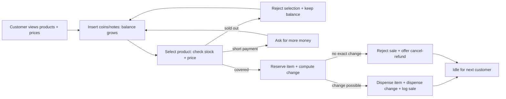
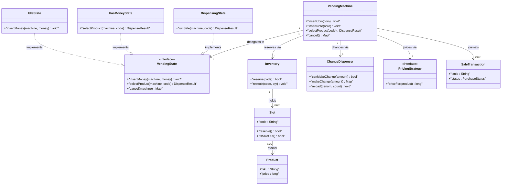
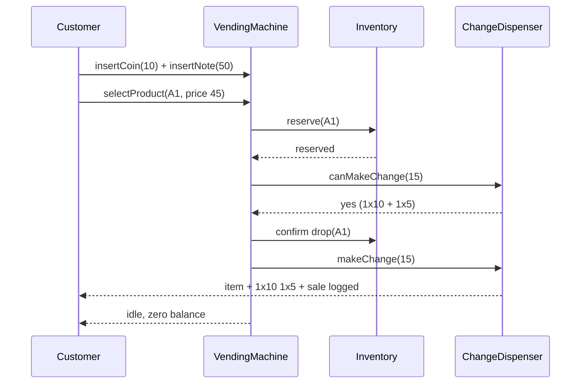

# Design Vending Machine

## Blogs and websites

## Medium

## Youtube

- [16. Design Vending Machine (Hindi) | LLD of Vending Machine | State Design Pattern | LLD question](https://www.youtube.com/watch?v=wOXs5Z_z0Ew)

## Theory

Uses the State pattern to model dispenser states (e.g., Idle, Has Money, Dispensing).

Design a vending machine that accepts coins and notes, lets a customer pick a product, collects payment, returns change, and dispenses the item while tracking inventory and staying consistent on every failure.
Key entities: VendingMachine, Product, Rack/Slot, Inventory, VendingState, PaymentAcceptor, ChangeDispenser, Transaction.
Core operations: insert money, select product, dispense item, return change, cancel and refund, refill and collect cash.

This guide turns that stub into an interview-ready low-level design: you will clarify an intentionally ambiguous machine, model clean OOP entities, choose State for the purchase lifecycle plus Strategy for pricing and change, handle single-buyer concurrency plus inventory-race safety, and write plain Java 17 code an interviewer can trace on a whiteboard. The emphasis is on object modeling, state transitions, and trade-offs — not frameworks, networking, or distributed payments.

> Scope note: this is LLD (class design, patterns, in-process concurrency). Payment-gateway settlement, card-network auth, telemetry backends, and multi-machine route planning belong to HLD and are mentioned only where they constrain the object model (for example, every cash sale carries a transaction ID so a retry never double-dispenses).

### Topics Covered

1. [Problem Statement](#problem-statement)
2. [Functional / Non-Functional Requirements](#functional--non-functional-requirements)
3. [Core Entities & Class Design](#core-entities--class-design)
4. [Key Design Decisions & Patterns Used](#key-design-decisions--patterns-used)
5. [Concurrency & Edge Cases](#concurrency--edge-cases)
6. [Java 17 Implementation](#java-17-implementation)
7. [Interview Questions and Answers](#interview-questions-and-answers)

---

### Problem Statement

Design a single vending machine that serves one customer at a time: display available products with prices, accept coins and notes, let the customer select an item, verify payment covers the price, dispense the item, return change in coins, print nothing but record every sale, and refund on cancel. An operator restocks products, reloads change coins, collects cash, and takes the machine in and out of service.

A customer approaches an idle machine showing products and prices. They insert coins or notes; the display shows the growing balance. They press a product button. If the slot is empty, the machine rejects the selection and keeps the balance for another choice or cancel. If the balance is short, it asks for more money. If payment covers the price, it reserves the item, computes change with available coins, dispenses the item, dispenses change, logs the sale, and returns to idle with zero balance. Cancel at any point before dispense refunds the full inserted amount. An operator opens a locked door to refill items and coins.

**Why this problem exists**

- Real machines lose money to double-dispense (item drops but change logic retries), state confusion (cancel pressed mid-drop keeps the cash), and empty-slot promises (payment taken for an item that cannot fall).
- The domain maps to a classic pattern: the purchase lifecycle is a textbook State machine (idle, has money, dispensing, returning change), and change-making is a greedy allocation over limited coins.
- Interviewers love it because the happy path takes 10 minutes but the follow-ups (exact-change mode, sold-out mid-payment, power cut after payment, coin jam) separate junior from senior answers.

**Real-life analogues**

- **Snack and beverage machines**: coil slots, flap delivery bins, coin tubes plus note validators, sold-out lamps.
- **Transit ticket kiosks**: single-user session, cash plus exact-change logic, out-of-service switch.
- **Self-checkout cash recyclers**: accept centrally, dispense locally, reconcile on failure — the same exactly-once tension.

**Clarifying questions to ask in the interview (say these out loud)**

1. Single machine or a fleet? Shared product catalogue or per-machine assortment?
2. Payment types: coins and notes only, or cards and UPI too? Which denominations?
3. Product model: fixed slots with one SKU each, or flexible mapping? How many slots and capacity per slot?
4. Pricing: fixed per SKU, or dynamic and promotional pricing? Who sets prices?
5. Change policy: unlimited change, exact-change-only mode, or deny sale when change impossible?
6. Cancel policy: full refund anytime before dispense? Coin-only refund or note refund too?
7. Failure handling: item jam after payment, coin jam during change, power cut mid-dispense — refund or compensate?
8. Receipts and logging: printed, on-screen, or in-memory sales journal for the operator?
9. Operator flows: restock, price update, coin reload, cash collection, out-of-service toggle?
10. Concurrency: strictly one buyer session, but background restock and expiry threads?

**Assumptions for this guide (state these if the interviewer says "decide yourself")**

- One machine process, one active buyer session; coins 1, 5, 10 with per-tube counts, notes 10, 20, 50, 100 accepted but change given in coins only.
- Money in integer rupees (long); prices are whole rupees; 60-second session timeout refunds and ejects to idle.
- Change policy is fewest-coins largest-first; if exact change is impossible, the sale is rejected before dispensing and the customer may cancel for a full refund.
- Operator opens the service door only when idle; restock, price change, coin reload, and cash collection are operator-only calls.
- No card payments in the core model; a `PaymentAcceptor` seam leaves the door open without building it.



The diagram shows the guarded purchase lifecycle from view to idle: selection checks stock and price before anything moves, change feasibility gates the dispense, and every path ends in idle with either a logged sale or a full refund so the machine never keeps money for nothing.

---

### Functional / Non-Functional Requirements

#### Functional requirements (must-have)

1. **Product display and selection**
   - Show each slot with product name, price, and remaining quantity; sold-out slots are visibly flagged.
   - Accept a slot selection only in a buying session; reject unknown slot codes with a clear reason.
2. **Money insertion**
   - Accept coins 1, 5, 10 and notes 10, 20, 50, 100 via a validator; reject slugs and torn notes with a typed error.
   - Track inserted balance on the machine; display it after every insert without starting a dispense.
3. **Purchase and dispense**
   - Verify slot in stock, price covered, and change makeable — in that order — before moving any item or coin.
   - Dispense exactly one unit, decrement slot stock, dispense change largest-first, log the sale with a transaction ID.
   - If any check fails, reject before dispense and keep the balance for retry or cancel.
4. **Change dispensing**
   - Compute change as inserted minus price using current coin-tube stock; fewest-coins policy.
   - If exact change is impossible, reject the sale before dispensing the item and surface exact-change mode.
   - Change is coins only; notes inserted are held as cash takings, never returned as change in this model.
5. **Cancel and refund**
   - Cancel anytime before dispense refunds the full inserted balance in coins where possible, else operator-assisted refund flag.
   - After dispense starts, cancel is disabled; failures go through the compensate path instead.
6. **Session timeout**
   - No input for 60 seconds auto-refunds the balance and returns to idle; the next customer starts clean.
7. **Operator maintenance**
   - Restock slots by SKU and quantity, set prices, reload coin tubes, collect note and coin cash, toggle in-service state.
   - Read-only reports: total sales, per-slot stock, coin-tube levels, last N transactions.
8. **Single session enforcement**
   - Exactly one buying session at a time; a second selection stream while busy is rejected until idle or timeout.

#### Explicitly out of scope (say this to bound the interview)

- Real card, NFC, and UPI settlement plus note-validator hardware protocols (a `PaymentAcceptor` interface stands in).
- Persistent sales databases and fleet telemetry (an append-only in-memory journal plus repository seam is enough).
- Route planning, planogram optimisation, and multi-machine load balancing (per-machine inventory with stock queries keeps the door open).

#### Non-functional requirements (LLD-flavoured)

- **Correctness over speed**: never dispense without a matching logged sale; every state transition is guarded.
- **State safety**: only legal actions per state execute (no select before idle, no dispense before payment); illegal actions throw typed exceptions.
- **Concurrency**: one buyer session at a time plus concurrent operator service and timeout threads handled with fine-grained locks.
- **Extensibility**: adding a denomination, product type, or pricing rule means adding a class, not rewriting `VendingMachine` (Open/Closed Principle).
- **Testability**: states, inventory, change dispenser, and pricing are injectable seams so tests drive them with fakes and fixed coins.
- **Readability**: an interviewer can trace `insertCoin()` → `selectProduct()` → `dispense()` → `collectChange()` → `cancel()` in under five minutes.
- **Robustness**: jammed coils, coin-tube shortage, invalid money, and power-cut windows all fail with typed errors and a reconcile path.
- **Auditability (lightweight)**: every sale, refund, restock, and collection appends to an in-memory journal with IDs and amounts.

| Requirement | Target / policy | Why it matters in LLD |
|---|---|---|
| No double-dispense | Transaction ID as idempotency key | Core stock and cash safety invariant |
| Exact sale | Stock plus change pre-check before drop | Prevents paid-then-jam losses |
| Change truth | Tube counts only mutate on success | Audit stays reconcilable |
| Session hygiene | Always ends in idle with zero balance | Next customer never blocked |
| Cancel safety | Full refund before dispense | Trust and legal baseline |
| Session timeout | 60 s inactivity refunds | Prevents abandoned paid sessions |

---

### Core Entities & Class Design

The model has five entity groups: product and slot value objects, the State hierarchy for the purchase lifecycle, inventory plus money handling, the change dispenser, and the sales journal. Keep behaviour with the data it guards: states own transition rules, slots own stock counts, the dispenser owns coin tubes, the machine owns orchestration, and pricing owns price truth.

#### Value objects and enums (the vocabulary of the domain)

- `Product`: immutable — SKU, name, price in rupees (long), category. Equality on SKU.
- `Slot`: slot code (e.g. "A1"), one `Product`, `quantity`, `capacity`. Methods `isSoldOut()`, `peekPrice()`, `reserve()` decrements on success only.
- `Money`: denomination value plus kind (COIN or NOTE); accepted coins 1, 5, 10 and notes 10, 20, 50, 100.
- `PurchaseStatus { SUCCESS, FAILED, REFUNDED }` and `SaleTransaction`: transaction ID (UUID), slot code, SKU, price, inserted, change, timestamp, status.
- `MachineStatus { IN_SERVICE, OUT_OF_SERVICE, EXACT_CHANGE_ONLY }` — operator and coin-level availability.
- `CoinTube`: denomination plus count living in the change dispenser.

#### Session context, states, and machine

- `VendingMachine`: the context and orchestrator. Holds current `VendingState`, inserted balance, inserted breakdown, `Inventory`, `ChangeDispenser`, cash takings, journal list. Methods `insertCoin()`, `insertNote()`, `selectProduct()`, `cancel()`, `service()` hooks.
- `VendingState` (interface): `insertMoney()`, `selectProduct()`, `dispense()`, `cancel()` with per-state legal behaviour; illegal calls throw `IllegalStateOperationException`.
- Concrete states: `IdleState` (only insert or service allowed), `HasMoneyState` (insert more, select, or cancel), `DispensingState` (transient internal state running check-then-drop-then-change), `OutOfServiceState` (only operator re-enable).
- State transitions live on the machine via `setState()`; each state receives the machine so it can trigger the next transition after doing its work.

#### Inventory and change dispensing

- `Inventory`: map of slot code to `Slot`. Methods `find(code)`, `isAvailable(code)`, `reserve(code)` atomic decrement, `restock(code, qty)`, `setPrice(sku, price)`, `lowStock(threshold)`.
- `ChangeDispenser`: owns coin tubes for 10, 5, 1. Methods `canMakeChange(amount)` pure probe, `makeChange(amount)` returning denomination-count map and mutating tubes, `reload(denomination, count)`, `coinLevels()`.
- Change algorithm is greedy largest-first: take `min(remainder / denomination, stock)` per tube, forward the remainder; terminal 1-coin tube rejects unmakeable remainders with `InsufficientChangeException`.
- Pre-check before drop: the machine calls `canMakeChange` first; only on success does it reserve the item and move money, then mutate tubes. This ordering is the money-safety core.

#### Pricing, cash, journal, and operator surface

- `PricingStrategy` (interface): `priceFor(product)` — `FixedPricing` default, `PromotionalPricing` decorator for discounts without touching slots.
- `PaymentAcceptor` (interface): `validate(money)` — `CashAcceptor` stub accepts the configured denominations; card acceptors plug in later.
- `SalesJournal`: append-only list of `SaleTransaction` records; `log()` on every sale, refund, and failure.
- `DispenseResult`: slot code, product name, change map, transaction ID returned to the customer display.
- Operator API on the machine: `restock(slot, qty)`, `setPrice(sku, price)`, `reloadCoins(denom, count)`, `collectCash()`, `setInService(boolean)`, `salesReport()`.



The diagram shows delegation (machine to state), containment (inventory to slots to product), money handling (machine to change dispenser), and journaling (machine to many transactions) — the four relationships to name in the interview.

**Key relationships and cardinalities**

- Machine 1—1 State at a time; transitions are `Idle → HasMoney → Dispensing → Idle`, with `HasMoney → Idle` on cancel or timeout.
- Inventory 1—\* Slots; each slot stocks exactly one SKU with quantity between 0 and capacity.
- Machine 1—1 ChangeDispenser; tubes are per-denomination counts mutated only on success.
- Machine 1—1 PricingStrategy; tests inject fixed pricing, promotions wrap it as a decorator.
- Machine 1—\* SaleTransaction journal (append-only; refunds and failures logged too for reconciliation).

**Where behaviour lives (tell the interviewer)**

- Transition guards live in state classes, not in `if` chains on the machine: `IdleState.selectProduct` throws, `HasMoneyState` owns the sale orchestration.
- Stock math lives in `Slot` and `Inventory`: reservation is an atomic check-then-decrement, never a separate check plus decrement.
- Change math lives in the dispenser: each tube owns `min(remainder / denomination, stock)` and remainder forwarding.
- Price truth lives in the strategy: the machine asks `priceFor` at sale time so promotions apply without slot edits.
- Time lives in `Instant` plus injectable `Clock`: session timeout and sale timestamps stay testable.

---

### Key Design Decisions & Patterns Used

#### Decision 1 — Full State pattern for the purchase (not enums)

Spot lifecycles in simpler problems fit enums, but vending sessions have per-state behaviour (idle rejects selection, has-money counts balance, dispensing locks out cancel) plus side effects (cancel refunds, timeout clears). A GoF State hierarchy puts each rule next to its state so `VendingMachine` never branches on state names. Name the trade-off: enums would be fewer classes, but every new operation would scatter `if (state == ...)` checks across the machine — exactly the rigidity interviewers probe for.

#### Decision 2 — Greedy change dispenser with pre-check probe

Hard-coding `change10 = change / 10` inside `selectProduct()` freezes the coin set and duplicates stock checks. A dedicated dispenser owns tube counts and exposes a pure `canMakeChange` probe plus a mutating `makeChange`. Adding a 20-coin is a tube insertion, zero machine changes. The pre-check before the item drop turns allocation into a reservation probe — the same guard idea as ATM note chains, adapted to coins.

#### Decision 3 — Pre-check ordering: stock then price then change then drop

The order is deliberate: slot availability first (no point pricing an empty slot), price coverage second (no point counting coins for an underpaid sale), change feasibility third (no point dropping an item whose change cannot be formed), physical drop plus coin mutation last. Any failure before the drop leaves stock and tubes untouched; any failure during the drop triggers the compensate path. Say this ordering verbatim — it is the senior answer to "where can money leak?".

#### Decision 4 — Strategy for pricing, interface for payment validation

The machine never hard-codes prices; it calls `PricingStrategy.priceFor` at sale time, so festival discounts are decorators, not slot edits. Money enters only through `PaymentAcceptor.validate`, so counterfeit rules and future card acceptors swap without touching states. This models production catalogue-plus-hardware seams with ten lines of interview code.

#### Decision 5 — Machine as single-session context with operator seam separated

`VendingMachine` enforces one active balance: `insertMoney` in `DispensingState` throws `SessionBusyException`. Operator methods (`restock`, `reloadCoins`, `collectCash`) require the idle state or an explicit service key, so restock during a paid session never mutates the in-flight sale (which pre-checked its stock and change). State explicitly that service during a session is rejected — interviewers test this.

#### Decision 6 — Money as long rupees, time as Instant, IDs as UUID/String

- Money in `long` whole rupees avoids float rounding; price and change math stays integer until display formatting.
- `java.time.Instant` plus injectable `Clock` makes session timeouts and sales windows deterministic in tests.
- Sale IDs as UUID strings and slot codes as plain strings survive a future move to a sales database.

#### Patterns used (say these names out loud)

| Pattern | Where | Why |
|---|---|---|
| State | Purchase lifecycle (`IdleState`, `HasMoneyState`, `DispensingState`) | Legal-action enforcement without `if` chains |
| Strategy | `PricingStrategy` plus change-order policy | Swappable pricing without touching states |
| Decorator (light) | `PromotionalPricing` over `FixedPricing` | Discounts wrap base prices cleanly |
| Facade | `VendingMachine` over states, inventory, dispenser, journal | One interview-traceable API for all flows |
| Null Object (light) | Empty selection and zero-change maps | No null checks on display paths |
| Observer (light) | Journal plus low-stock alert hook | One sale event, journal and alert readers |

**SOLID mapping (one line each for the "which principles?" follow-up)**

- Single Responsibility: states guard transitions, slots guard stock, dispenser guards coins, machine orchestrates.
- Open/Closed: new coin, product type, or pricing rule equals a new tube entry or class, zero edits to `selectProduct()`.
- Liskov: any `VendingState` or `PricingStrategy` substitutes without breaking the machine.
- Interface Segregation: small `VendingState`, `PricingStrategy`, `PaymentAcceptor` contracts instead of one fat kiosk interface.
- Dependency Inversion: the machine depends on the pricing and acceptor interfaces; tests inject fakes.

---

### Concurrency & Edge Cases

#### The concurrency story (the senior half of the interview)

One machine serves one buyer, so the design centers on session exclusion plus two background threads (session timeout, operator service). Three mechanisms from innermost to outermost:

1. **Session exclusion on the machine.** All buyer entry points (`insertCoin`, `insertNote`, `selectProduct`, `cancel`) are `synchronized` on the machine; concurrent button presses serialize and the losers see consistent balance reads. The in-flight dispense holds no global lock — it pre-checked stock and tubes, and each mutating step is individually guarded.
2. **Per-structure monitors.** `Inventory.reserve` and `ChangeDispenser.makeChange` synchronize on themselves, so an operator coin reload races safely with a sale walking the tubes. Counts only decrement after all three pre-checks pass.
3. **Timeout as a guarded transition.** A `ScheduledExecutorService` (or test-driven `expireSession()` hook) fires after 60 seconds of inactivity; it synchronizes on the machine, checks the state is still `HasMoneyState`, refunds, then returns to idle. Heartbeat `touch()` on every insert or selection resets the deadline, so active button presses never get yanked.



The diagram shows the money-safe ordering in time: stock reservation and change feasibility both complete before the item drops, and coins move only after the drop confirms, so a failure at any earlier arrow leaves stock and tubes untouched.

**Why not `synchronized selectProduct()` alone?** A single coarse lock would serialize buyers correctly but would not express which actions are legal per phase — a selection could still arrive with zero balance or a cancel could race a drop. State guards plus machine monitors give both exclusion and legality: exclusion stops races, states stop nonsense.

**Post-drop failure rule (say this verbatim): check → reserve → drop → change → compensate on jam.** If the coil jams after payment, the machine refunds the price in coins where possible (or flags an operator refund), restores the slot count if the sensor confirms no drop, journals a `REFUNDED` entry with the same transaction ID, and returns to idle. The ID makes the compensate idempotent if the jam sensor fires twice.

#### Edge cases table (pick 4–5 to recite, keep the rest as backup)

| # | Edge case | Handling |
|---|---|---|
| 1 | Sold-out slot selected | Reject before taking more money, keep balance, suggest another slot or cancel |
| 2 | Underpaid selection | Show shortfall amount, keep balance, wait for more inserts or cancel |
| 3 | Exact change impossible | Reject sale before drop with `InsufficientChangeException`, flip to exact-change mode, offer cancel-refund |
| 4 | Invalid coin or torn note | Validator rejects at insert with typed `InvalidMoneyException`; balance unchanged |
| 5 | Unknown slot code | Reject with `UnknownSlotException`; no state change |
| 6 | Cancel before dispense | Full refund of inserted balance, journal `REFUNDED`, back to idle |
| 7 | Cancel during dispense | Disabled; failure goes through compensate path instead of refund race |
| 8 | Item jam after payment | Restore stock if sensor confirms, refund price, journal `REFUNDED`, idle |
| 9 | Coin jam during change | Log partial change paid, flag operator top-up, journal shortfall for reconcile |
| 10 | Power cut after payment, before drop | On reboot start `OUT_OF_SERVICE`, journal shows orphan paid entry for operator refund |
| 11 | Power cut after drop, before change | Same as above: owed-change entry drives operator payout on restart |
| 12 | Session timeout with balance | Auto-refund balance, clear state, journal timeout; next customer starts clean |
| 13 | Operator restock mid-session | Rejected unless idle or service key held; in-flight sale uses pre-checked snapshot |
| 14 | Tube short but total coins enough | Per-denomination probe fails correctly; total-coin checks alone would approve then jam |
| 15 | Price change mid-session | Applies to next sale only; in-flight price already quoted from strategy |

---

### Java 17 Implementation

All classes below are plain Java 17 (no frameworks, `var` used sparingly). Money is `long` rupees, time is `Instant` plus `Clock`, buyer entry points are `synchronized` on the machine, and stock plus tube counts are guarded on their owners. Each block is followed by its explanation and the pattern it demonstrates.

#### 1. Product, slot, inventory, and change dispenser

The catalogue is immutable products plus mutable slots; the dispenser owns coin tubes with a probe-before-mutate guard.

```java
import java.time.Clock;
import java.time.Instant;
import java.util.*;

// Immutable catalogue entry: equality on SKU, price in whole rupees.
final class Product {
    private final String sku;
    private final String name;
    private final long price;
    Product(String sku, String name, long price) {
        if (sku == null || sku.isBlank()) throw new IllegalArgumentException("sku required");
        if (price <= 0) throw new IllegalArgumentException("price > 0");
        this.sku = sku; this.name = name; this.price = price;
    }
    String sku() { return sku; }
    String name() { return name; }
    long price() { return price; }
}

// Mutable holder: one SKU per slot, atomic reserve.
class Slot {
    private final String code;
    private final Product product;
    private int quantity;
    private final int capacity;
    Slot(String code, Product product, int quantity, int capacity) {
        this.code = code; this.product = product;
        this.quantity = quantity; this.capacity = capacity;
    }
    synchronized boolean isSoldOut() { return quantity <= 0; }
    synchronized int quantity() { return quantity; }
    String code() { return code; }
    Product product() { return product; }
    synchronized boolean reserve() {
        if (quantity <= 0) return false;
        quantity--;
        return true;
    }
    synchronized void restock(int qty) {
        if (quantity + qty > capacity) throw new IllegalArgumentException("Over capacity: " + code);
        quantity += qty;
    }
    synchronized void restore() { quantity++; } // jam sensor says item never fell
}

// Inventory: slot map with atomic reserve and operator restock.
class Inventory {
    private final Map<String, Slot> slots = new LinkedHashMap<>();
    void addSlot(Slot s) { slots.put(s.code(), s); }
    synchronized Slot find(String code) {
        Slot s = slots.get(code);
        if (s == null) throw new UnknownSlotException("Unknown slot: " + code);
        return s;
    }
    boolean reserve(String code) { return find(code).reserve(); }
    void restock(String code, int qty) { find(code).restock(qty); }
    Map<String, Integer> stockLevels() {
        Map<String, Integer> out = new LinkedHashMap<>();
        slots.forEach((k, v) -> out.put(k, v.quantity()));
        return out;
    }
}

// Greedy change over limited coin tubes: probe first, mutate after.
class ChangeDispenser {
    private final TreeMap<Integer, Integer> tubes = new TreeMap<>(Comparator.reverseOrder());
    ChangeDispenser(Map<Integer, Integer> seed) { tubes.putAll(seed); }
    synchronized boolean canMakeChange(long amount) {
        long rem = amount;
        for (var e : tubes.entrySet()) {
            long take = Math.min(rem / e.getKey(), e.getValue());
            rem -= take * e.getKey();
        }
        return rem == 0;
    }
    synchronized Map<Integer, Integer> makeChange(long amount) {
        if (!canMakeChange(amount)) throw new InsufficientChangeException("Cannot make Rs " + amount);
        Map<Integer, Integer> out = new LinkedHashMap<>();
        long rem = amount;
        for (var e : tubes.entrySet()) {
            long take = Math.min(rem / e.getKey(), e.getValue());
            if (take > 0) {
                e.setValue(e.getValue() - (int) take);
                out.put(e.getKey(), (int) take);
                rem -= take * e.getKey();
            }
        }
        return out;
    }
    synchronized void reload(int denom, int count) {
        tubes.put(denom, tubes.getOrDefault(denom, 0) + count);
    }
    synchronized Map<Integer, Integer> coinLevels() { return new LinkedHashMap<>(tubes); }
}

// Pricing seam: fixed by default, promotions decorate it.
interface PricingStrategy { long priceFor(Product p); }
class FixedPricing implements PricingStrategy {
    public long priceFor(Product p) { return p.price(); }
}
class PromotionalPricing implements PricingStrategy {
    private final PricingStrategy base;
    private final long discount;
    PromotionalPricing(PricingStrategy base, long discount) { this.base = base; this.discount = discount; }
    public long priceFor(Product p) { return Math.max(1, base.priceFor(p) - discount); }
}

enum PurchaseStatus { SUCCESS, FAILED, REFUNDED }
record SaleTransaction(String txnId, String slot, String sku, long price, long inserted, long change, Instant at, PurchaseStatus status) {}
record DispenseResult(String txnId, String product, Map<Integer, Integer> change) {}

class IllegalStateOperationException extends RuntimeException {
    IllegalStateOperationException(String m) { super(m); }
}
class InsufficientChangeException extends RuntimeException {
    InsufficientChangeException(String m) { super(m); }
}
class UnknownSlotException extends RuntimeException {
    UnknownSlotException(String m) { super(m); }
}
class InvalidMoneyException extends RuntimeException {
    InvalidMoneyException(String m) { super(m); }
}
class SessionBusyException extends RuntimeException {
    SessionBusyException(String m) { super(m); }
}
```

Explanation: `Product` is immutable so price reads never race restocks, while `Slot.reserve` fuses check and decrement under one monitor so two rapid selections cannot sell the last item twice. `ChangeDispenser.canMakeChange` simulates the greedy walk without touching tubes, letting the sale reject before the drop. `PromotionalPricing` shows the Decorator in two lines: discounts wrap any base strategy without slot edits.

#### 2. States, machine, and demo (State pattern)

```java
import java.time.Clock;
import java.util.*;

// State interface: each state implements only its legal actions.
interface VendingState {
    default void insertMoney(VendingMachine m, long amount) { throw new IllegalStateOperationException("insert not allowed now"); }
    default DispenseResult selectProduct(VendingMachine m, String code) { throw new IllegalStateOperationException("select not allowed now"); }
    default Map<Integer, Integer> cancel(VendingMachine m) { throw new IllegalStateOperationException("nothing to cancel"); }
}

class IdleState implements VendingState {
    public void insertMoney(VendingMachine m, long amount) {
        if (!m.isInService()) throw new IllegalStateOperationException("Machine out of service");
        m.addBalance(amount);
        m.setState(new HasMoneyState());
    }
}

class HasMoneyState implements VendingState {
    public void insertMoney(VendingMachine m, long amount) { m.addBalance(amount); }
    // Check-then-reserve-then-change-then-drop: the money-safe order.
    public DispenseResult selectProduct(VendingMachine m, String code) {
        var slot = m.inventory().find(code);
        if (slot.isSoldOut()) throw new IllegalStateOperationException("Sold out: " + code);
        long price = m.pricing().priceFor(slot.product());
        if (m.balance() < price) throw new IllegalStateOperationException("Insert Rs " + (price - m.balance()) + " more");
        long changeDue = m.balance() - price;
        if (!m.changer().canMakeChange(changeDue)) throw new InsufficientChangeException("Exact change unavailable; cancel for refund");
        m.setState(new DispensingState());
        try {
            return m.completeSale(code, price, changeDue);
        } catch (RuntimeException ex) {
            m.setState(new HasMoneyState()); // failed pre-drop: buyer keeps balance
            throw ex;
        }
    }
    public Map<Integer, Integer> cancel(VendingMachine m) { return m.refundToIdle(); }
}

class DispensingState implements VendingState {
    // Transient: entered only by HasMoneyState; buyer calls are rejected while dropping.
    public void insertMoney(VendingMachine m, long amount) { throw new SessionBusyException("Dispensing; please wait"); }
    public DispenseResult selectProduct(VendingMachine m, String code) { throw new SessionBusyException("Dispensing; please wait"); }
}

// VendingMachine: the State context and Facade over inventory, changer, and journal.
public class VendingMachine {
    private VendingState state = new IdleState();
    private long balance;
    private boolean inService = true;
    private final Inventory inventory;
    private final ChangeDispenser changer;
    private final PricingStrategy pricing;
    private final Clock clock;
    private long cashTakings;
    private final List<SaleTransaction> journal = new ArrayList<>();
    private static final Set<Long> VALID = Set.of(1L, 5L, 10L, 20L, 50L, 100L);

    public VendingMachine(Inventory inventory, ChangeDispenser changer, PricingStrategy pricing, Clock clock) {
        this.inventory = inventory; this.changer = changer; this.pricing = pricing; this.clock = clock;
    }

    public synchronized void insertCoin(long coin) { insertValidated(coin); }
    public synchronized void insertNote(long note) { insertValidated(note); }
    private void insertValidated(long amount) {
        if (!VALID.contains(amount)) throw new InvalidMoneyException("Rejected Rs " + amount);
        state.insertMoney(this, amount);
        touch();
    }
    public synchronized DispenseResult selectProduct(String code) {
        DispenseResult r = state.selectProduct(this, code);
        touch();
        return r;
    }
    public synchronized Map<Integer, Integer> cancel() { return state.cancel(this); }

    // Package-private hooks used by states.
    void setState(VendingState s) { this.state = s; }
    void addBalance(long a) { balance += a; cashTakings += a; }
    long balance() { return balance; }
    Inventory inventory() { return inventory; }
    ChangeDispenser changer() { return changer; }
    PricingStrategy pricing() { return pricing; }
    boolean isInService() { return inService; }
    void touch() { /* reset 60 s deadline; timer omitted for brevity */ }

    synchronized DispenseResult completeSale(String code, long price, long changeDue) {
        String txn = UUID.randomUUID().toString();
        if (!inventory.reserve(code)) {
            journal.add(new SaleTransaction(txn, code, "?", price, balance, 0, clock.instant(), PurchaseStatus.FAILED));
            setState(new HasMoneyState());
            throw new IllegalStateOperationException("Just sold out: " + code);
        }
        try {
            Map<Integer, Integer> change = changer.makeChange(changeDue);
            Slot s = inventory.find(code);
            balance = 0;
            cashTakings -= changeDue;
            journal.add(new SaleTransaction(txn, code, s.product().sku(), price, price + changeDue, changeDue, clock.instant(), PurchaseStatus.SUCCESS));
            System.out.println("Dropped " + s.product().name() + " change=" + change + " txn=" + txn);
            setState(new IdleState());
            return new DispenseResult(txn, s.product().name(), change);
        } catch (RuntimeException jam) {
            inventory.find(code).restore();
            Map<Integer, Integer> refund = refundToIdle();
            journal.add(new SaleTransaction(txn, code, "?", price, price + changeDue, changeDue, clock.instant(), PurchaseStatus.REFUNDED));
            throw new IllegalStateOperationException("Dispense failed; refunded Rs " + (price + changeDue));
        }
    }

    synchronized Map<Integer, Integer> refundToIdle() {
        long owed = balance;
        Map<Integer, Integer> out = owed == 0 ? Map.of() : changer.makeChange(owed);
        balance = 0;
        cashTakings -= owed;
        setState(new IdleState());
        System.out.println("Refunded Rs " + owed + " as " + out);
        return out;
    }

    // Operator seam: allowed only from idle in this model.
    public synchronized void restock(String code, int qty) { inventory.restock(code, qty); }
    public synchronized void reloadCoins(int denom, int count) { changer.reload(denom, count); }
    public synchronized long collectCash() { long c = cashTakings; cashTakings = 0; return c; }
    public synchronized void setInService(boolean b) { inService = b; }
    public List<SaleTransaction> journal() { return List.copyOf(journal); }
}

// Demo wiring: build slots, tubes, machine, run insert-select-cancel.
class VendingDemo {
    public static void main(String[] args) {
        var cola = new Product("COLA", "Cola 300ml", 45);
        var chips = new Product("CHIPS", "Chips 50g", 30);
        var inv = new Inventory();
        inv.addSlot(new Slot("A1", cola, 5, 10));
        inv.addSlot(new Slot("A2", chips, 5, 10));
        var changer = new ChangeDispenser(new LinkedHashMap<>(Map.of(10, 20, 5, 20, 1, 50)));
        var vm = new VendingMachine(inv, changer, new FixedPricing(), Clock.systemUTC());
        vm.insertNote(50);
        vm.insertCoin(10); // balance 60
        DispenseResult r = vm.selectProduct("A1"); // price 45, change 15 = 10+5
        System.out.println("Got " + r.product() + " txn=" + r.txnId());
    }
}
```

Explanation: states enforce legality by overriding only what they allow — `IdleState` accepts just inserts, `HasMoneyState` owns the four-step sale check, `DispensingState` rejects everything while the drop runs — so illegal calls fail fast instead of corrupting the balance. The machine stays a thin synchronized context: balance, cash takings, sale commit, refund, and operator hooks. The demo builds the full machine in about 15 lines, which is exactly the live-coding arc to reproduce on a whiteboard: catalogue, slots, tubes, machine, insert, select.

**How to extend (name these without building them)**

- New coin or note: add a tube entry plus validator set member; `selectProduct()` is untouched.
- Card payments: add a `CardAcceptor` behind `PaymentAcceptor` and a `HasMoneyState` branch that skips `makeChange`.
- Out-of-service mode: add an `OutOfServiceState` whose every buyer action throws except the operator re-enable hook.

---

### Interview Questions and Answers

1. **Beginner: walk me through the classes in your vending machine.**
   Answer: `Product` (immutable catalogue entry), `Slot` plus `Inventory` (stock truth), `VendingMachine` (State context and facade), `VendingState` plus `IdleState`, `HasMoneyState`, `DispensingState` (purchase lifecycle), `ChangeDispenser` (coin tubes), `PricingStrategy` (price truth), and `SaleTransaction` plus `DispenseResult` (audit). Flow is `insertCoin → selectProduct → dispense → change → idle`.

2. **Beginner: why does the machine use the State pattern?**
   Answer: each purchase phase allows different actions, and an `if (state == ...)` chain would scatter those rules across every method. States co-locate each rule with its phase: idle accepts only inserts, has-money accepts selects and cancel, dispensing rejects everything. Illegal calls throw `IllegalStateOperationException` instead of silently keeping the cash.

3. **Beginner: how is change computed?**
   Answer: greedy largest-first over live tube counts: each tube takes `min(remainder / denomination, stock)` and forwards the remainder. Change of 15 with stocked tubes yields 1x10 plus 1x5. The terminal 1-coin tube rejects any remainder it cannot form, so impossible change fails before any item drops.

4. **Junior: what order do stock, price, change, and drop run in, and why?**
   Answer: stock first (no point pricing an empty slot), price coverage second (no point counting coins for an underpaid sale), `canMakeChange` probe third (no point dropping an item whose change cannot be formed), drop plus tube mutation last. Any failure before the drop leaves stock and coins untouched; failures during the drop trigger the compensate path with the same transaction ID.

5. **Junior: what happens on cancel?**
   Answer: cancel is legal only in `HasMoneyState`: the machine pays back the full balance via `makeChange`, journals a `REFUNDED` entry, clears the balance, and returns to idle. After the drop starts, cancel is disabled so a refund cannot race the change payout — failures instead go through the jam-compensate path.

6. **Junior: how do you prevent selling the last item twice?**
   Answer: `Slot.reserve` fuses availability check and decrement under one monitor, and `Inventory.reserve` delegates to it atomically. Two rapid selections serialize on the slot: the first decrements to zero, the second sees sold-out and throws. The sale also re-checks after entering `DispensingState` so a concurrent operator action cannot slip between check and drop.

7. **Mid: there is exact change shortage. How does the machine behave?**
   Answer: the `canMakeChange` probe fails before the drop, the sale is rejected with `InsufficientChangeException`, the balance is kept for another selection or cancel, and the machine surfaces exact-change-only mode. Tube counts are untouched, so a later coin reload immediately re-enables the sale without any state repair.

8. **Mid: the coil jams after payment. What now?**
   Answer: treat post-payment ambiguity conservatively: restore the slot count if the sensor confirms no drop, refund the full paid amount, journal a `REFUNDED` entry with the original transaction ID, and return to idle. Because the compensate carries the original ID, a duplicate jam signal cannot refund twice.

9. **Senior: how would you add a new coin, a promotion, or card payment without rewriting?**
   Answer: a new coin is a tube entry plus a validator set member; a promotion is a `PromotionalPricing` decorator around the base strategy; card payment is a new `PaymentAcceptor` branch that skips coin change. All follow Open/Closed: new behaviour equals a new entry or class, never edits to existing transitions.

10. **Senior: how do you test sold-out, exact change, and the jam-after-payment path?**
    Answer: inject fixed tubes and a stub clock. Sold-out: drain a slot to zero and assert selection throws with balance intact. Change: seed tubes (e.g. 0x5, few x1) and assert `canMakeChange` plus change maps for boundary amounts. Jam: fake the slot to throw after reserve and assert stock restored, a `REFUNDED` journal entry, and zero balance. Concurrency: two threads racing `selectProduct` on the last item assert exactly one success.

